02 Metacoder heat trees
================
Daniel
19/09/2022

This script takes the previously merged and formatted data from mBrave
(produced through script 01) and does preliminary analyses with
Metacoder. The idea of this script is to have a preliminary estimate of
diversity within the metabarcoding samples. Due to the nature of
mBrave’s classification assosiated with BOLD databases, there are a
number of BINs which have multiple identificaitons. I have cleaned the
data even further, now we are only including species name for the 1st
BOLD BIN hit. This is normally either, the species form the BCI database
(the first dataset used to classify through mBRAVE), or the species most
frequently ‘named’ that name. E.g. Agelenopsis pennsylvanica, potteri,
emertoni, katsoni, acutosa, is now Agelenopsis pennsylvanica. The file
used is the final dataset with \~3557 BINs.

``` r
rm(list=ls()) #I always start scritps this way to make sure I have a clean R environment
library('tidyr')
```

    ## Warning: package 'tidyr' was built under R version 4.1.2

``` r
library('dplyr')
```

    ## Warning: package 'dplyr' was built under R version 4.1.3

    ## 
    ## Attaching package: 'dplyr'

    ## The following objects are masked from 'package:stats':
    ## 
    ##     filter, lag

    ## The following objects are masked from 'package:base':
    ## 
    ##     intersect, setdiff, setequal, union

``` r
library('metacoder')
```

    ## This is metacoder verison 0.3.5 (stable)

``` r
dat<- read.csv('data/finaldat_merged.csv', header = TRUE)
sample <- read.csv('data/location_ctrl.csv')
obj <- parse_tax_data(dat,
                      class_cols = "classification",
                      class_sep = ";")
print(obj)
```

    ## <Taxmap>
    ##   3705 taxa: aab. Arthropoda, aac. Insecta ... fmn. nitens
    ##   3705 edges: NA->aab, aab->aac, aab->aad ... dcc->fmm, dcd->fmn
    ##   1 data sets:
    ##     tax_data:
    ##       # A tibble: 3,495 x 44
    ##         taxon~1 bin_uri OTU_ID class~2 total~3 total~4 total~5 total~6
    ##         <chr>   <chr>   <chr>  <chr>     <int>   <int>   <int>   <int>
    ## NANANA
    ## NANANA
    ## NANANA
    ##       # ... with 3,492 more rows, 36 more variables:
    ##       #   total39868 <int>, total39869 <int>, total39870 <int>,
    ##       #   total39871 <int>, total39872 <int>, total39873 <int>,
    ##       #   total39874 <int>, total39875 <int>, total39876 <int>,
    ##       #   total39877 <int>, ..., and abbreviated variable names
    ##       #   1: taxon_id, 2: classification, 3: total39864,
    ##       #   4: total39865, 5: total39866, 6: total39867
    ##   0 functions:

Above is the print out of a taxmap object. The R console output shows
that there are 3,750 unique taxa and lists their ID, but this includes
many NA’s (unassigned taxonomies), Better to look at the tbl_df which
shows a ‘tibble’ of 3,495 rows (assigned clssifications) in 44 columns
(40 samples + taxon_id, bin_uri, OTU_ID and classificaiton). Each row
shows how many reads for that taxon was in each sample.

``` r
obj$data$tax_data <- obj$data$tax_data[c("taxon_id","OTU_ID","bin_uri", sample$sampleID)]
obj$data$tax_data <- zero_low_counts(obj, data = "tax_data", min_count = 10, cols= sample$sampleID, other_cols = TRUE)
```

    ## Zeroing 5811 of 139800 counts less than 10.

    ## Warning: The following columns will be replaced in the output:
    ##    total39883, total39882, total39881 ... ZET1B, ZET2A, ZET2B

``` r
#zeroing 5811 of 139800 counts with less than 10 reads (depending how stringent this can be changed in the min_count flag above
no_reads <- rowSums(obj$data$tax_data[, sample$sampleID]) == 0
sum(no_reads) 
```

    ## [1] 1259

``` r
#there are 1259 taxon_id's with less than 10 reads which we will remove in the next step
obj <- filter_obs(obj, data = "tax_data", ! no_reads, drop_taxa = TRUE)
print(obj) #2236 taxa in 40 samples (it says 43 columns because of columns taxon, OTU_ID and bin_uri, the classification column is not really needed right now)
```

    ## <Taxmap>
    ##   2752 taxa: aab. Arthropoda, aac. Insecta ... fmn. nitens
    ##   2752 edges: NA->aab, aab->aac, aab->aad ... dcb->fml, dcd->fmn
    ##   1 data sets:
    ##     tax_data:
    ##       # A tibble: 2,236 x 43
    ##         taxon~1 OTU_ID bin_uri total~2 total~3 total~4 total~5 total~6
    ##         <chr>   <chr>  <chr>     <dbl>   <dbl>   <dbl>   <dbl>   <dbl>
    ## NANANA
    ## NANANA
    ## NANANA
    ##       # ... with 2,233 more rows, 35 more variables:
    ##       #   total39878 <dbl>, total39877 <dbl>, total39876 <dbl>,
    ##       #   total39875 <dbl>, total39874 <dbl>, total39873 <dbl>,
    ##       #   total39872 <dbl>, total39871 <dbl>, total39870 <dbl>,
    ##       #   total39869 <dbl>, ..., and abbreviated variable names
    ##       #   1: taxon_id, 2: total39883, 3: total39882, 4: total39881,
    ##       #   5: total39880, 6: total39879
    ##   0 functions:

We now have cleaned dataset (with our chosen minimum number of reads to
\>10) We can add new ‘tibbles’ to obj\$data such as proportion of total
reads, or abundance

``` r
obj$data$tax_props <- calc_obs_props(obj, "tax_data", cols= sample$sampleID, other_cols = TRUE)
```

    ## Calculating proportions from counts for 40 columns for 2236 observations.

    ## Warning: The following columns will be replaced in the output:
    ##    total39883, total39882, total39881 ... ZET1B, ZET2A, ZET2B

``` r
obj$data$tax_abund <- calc_taxon_abund(obj, "tax_data", cols = sample$sampleID)
```

    ## Summing per-taxon counts from 40 columns for 2752 taxa

``` r
print(obj)
```

    ## <Taxmap>
    ##   2752 taxa: aab. Arthropoda, aac. Insecta ... fmn. nitens
    ##   2752 edges: NA->aab, aab->aac, aab->aad ... dcb->fml, dcd->fmn
    ##   3 data sets:
    ##     tax_data:
    ##       # A tibble: 2,236 x 43
    ##         taxon~1 OTU_ID bin_uri total~2 total~3 total~4 total~5 total~6
    ##         <chr>   <chr>  <chr>     <dbl>   <dbl>   <dbl>   <dbl>   <dbl>
    ## NANANA
    ## NANANA
    ## NANANA
    ##       # ... with 2,233 more rows, 35 more variables:
    ##       #   total39878 <dbl>, total39877 <dbl>, total39876 <dbl>,
    ##       #   total39875 <dbl>, total39874 <dbl>, total39873 <dbl>,
    ##       #   total39872 <dbl>, total39871 <dbl>, total39870 <dbl>,
    ##       #   total39869 <dbl>, ..., and abbreviated variable names
    ##       #   1: taxon_id, 2: total39883, 3: total39882, 4: total39881,
    ##       #   5: total39880, 6: total39879
    ##     tax_props:
    ##       # A tibble: 2,236 x 43
    ##         taxon~1 OTU_ID bin_uri total~2 total~3 total~4 total~5 total~6
    ##         <chr>   <chr>  <chr>     <dbl>   <dbl>   <dbl>   <dbl>   <dbl>
    ## NANANA
    ## NANANA
    ## NANANA
    ##       # ... with 2,233 more rows, 35 more variables:
    ##       #   total39878 <dbl>, total39877 <dbl>, total39876 <dbl>,
    ##       #   total39875 <dbl>, total39874 <dbl>, total39873 <dbl>,
    ##       #   total39872 <dbl>, total39871 <dbl>, total39870 <dbl>,
    ##       #   total39869 <dbl>, ..., and abbreviated variable names
    ##       #   1: taxon_id, 2: total39883, 3: total39882, 4: total39881,
    ##       #   5: total39880, 6: total39879
    ##     tax_abund:
    ##       # A tibble: 2,752 x 41
    ##         taxon_id total39883 total39882 total~1 total~2 total~3 total~4
    ##         <chr>         <dbl>      <dbl>   <dbl>   <dbl>   <dbl>   <dbl>
    ##       1 aab           57486      74134   95845   87200   63183   70228
    ##       2 aac           57486      74080   95797   87200   63045   70228
    ##       3 aad               0         54      48       0      59       0
    ##       # ... with 2,749 more rows, 34 more variables:
    ##       #   total39877 <dbl>, total39876 <dbl>, total39875 <dbl>,
    ##       #   total39874 <dbl>, total39873 <dbl>, total39872 <dbl>,
    ##       #   total39871 <dbl>, total39870 <dbl>, total39869 <dbl>,
    ##       #   total39868 <dbl>, ..., and abbreviated variable names
    ##       #   1: total39881, 2: total39880, 3: total39879, 4: total39878
    ##   0 functions:

Notice we now have 3 tibbles, one for counts (tax_data - this could be
changed with something like: \>names(obj\$data) \<- “otu_counts”), one
for proportion (tax_props) and one for abundance (tax_abund). We can and
will add more refined datasets afterwards, all linked to the orignal
parsing so we never loose the information of what taxonid actually
means.

we can now view distribution of reads in the samples:

``` r
hist(colSums(obj$data$tax_data[ , sample$sampleID]))
```

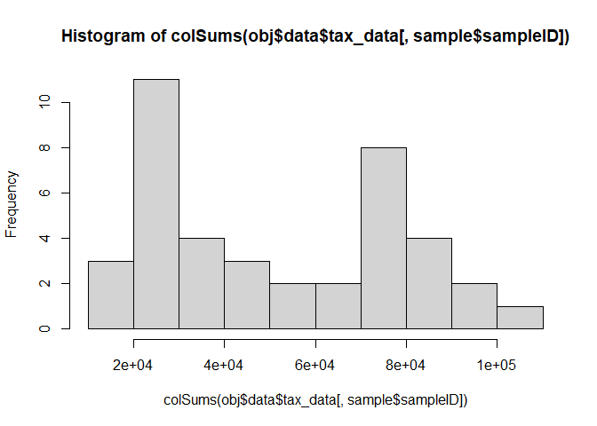<!-- -->
sampling is quite uneven with one sample with \< 100,000 reads. We will
rarefy our data to simulate even number of reads per sample (18914 is
the minium depth) keep in mind that this discards a lot of data - we
could probably instead remove some of the smaples with the lowest reads
instead. We can add the rarefied dataset as a sepparate dataframe as we
did above with tax_props and tax_abund. If you want, you can
print(obj$data$tax_rarefied) to see what it looks like. We can also make
a rarefaction curve with metacoder, but look at script 0X where we do
rarefaction curves with ggplot instead

``` r
obj$data$tax_rarefied <- rarefy_obs(obj, "tax_data", cols = sample$sampleID, other_cols = TRUE)
```

    ## Rarefying to 18914 since that is the lowest sample total.

    ## Warning: The following columns will be replaced in the output:
    ##    total39883, total39882, total39881 ... ZET1B, ZET2A, ZET2B

``` r
library(vegan)
```

    ## Warning: package 'vegan' was built under R version 4.1.2

    ## Loading required package: permute

    ## Warning: package 'permute' was built under R version 4.1.3

    ## Loading required package: lattice

    ## This is vegan 2.5-7

``` r
rarecurve(t(obj$data$tax_data[, sample$sampleID]), step = 1000,
          sample = min(colSums(obj$data$tax_data[, sample$sampleID])),
          col = "blue", cex = 0.8)
```

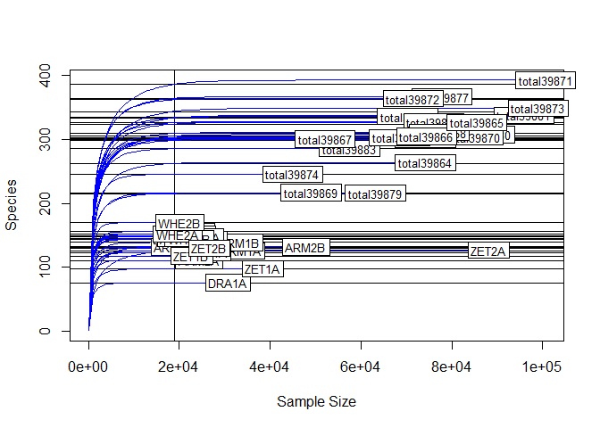<!-- -->

Below an OPTIONAL chunk to visualize a very rudimentary heat tree for
all counts for metabaroded data. It is meant for illustration purposes
only and its not very informative, it also takes a long time to run. See
figure allcounts.pdf in the project.

``` r
set.seed(99) # This makes the plot appear the same each time it is run
heat_tree(obj,
          node_label = taxon_names,
          node_size = n_obs,
          node_color = n_obs,
          node_size_axis_label = "BIN count",
          node_color_axis_label = "Samples with reads",
          layout = "davidson-harel", # The primary layout algorithm
          initial_layout = "reingold-tilford") # The layout algorithm that initializes node locations
```

<!-- -->

Far more informative would be to see the differences between seasons in
this case. We can easily calculate the number of samples that have reads
for each taxon according to different groups. We can also compare
statistically using Wilcoxon Rank Sum test, significant differences
between taxa samples in wet or dry season.

``` r
obj$data$tax_occ <- calc_n_samples(obj, "tax_abund", groups = sample$SEASON, cols = sample$sampleID)
```

    ## Calculating number of samples with a value greater than 0 for 40 columns in 2 groups for 2752 observations

``` r
print(obj$data$tax_occ)
```

    ## # A tibble: 2,752 x 3
    ##    taxon_id   wet   dry
    ##    <chr>    <int> <int>
    ##  1 aab         20    20
    ##  2 aac         20    20
    ##  3 aad         11     0
    ##  4 aae          5     0
    ##  5 aaf         20    20
    ##  6 aag         20    19
    ##  7 aah         20    20
    ##  8 aai         20    20
    ##  9 aaj         20    19
    ## 10 aak          5     0
    ## # ... with 2,742 more rows

``` r
obj$data$diff_table <- compare_groups(obj, data = "tax_abund",
                                      cols = sample$sampleID, # What columns of sample data to use
                                      groups = sample$SEASON) # What category each sample is assigned to
```

    ## Warning in wilcox.test.default(abund_1, abund_2): cannot compute exact p-value
    ## with ties

    ## Warning in wilcox.test.default(abund_1, abund_2): cannot compute exact p-value
    ## with ties

    ## Warning in wilcox.test.default(abund_1, abund_2): cannot compute exact p-value
    ## with ties

    ## Warning in wilcox.test.default(abund_1, abund_2): cannot compute exact p-value
    ## with ties

    ## Warning in wilcox.test.default(abund_1, abund_2): cannot compute exact p-value
    ## with ties

    ## Warning in wilcox.test.default(abund_1, abund_2): cannot compute exact p-value
    ## with ties

    ## Warning in wilcox.test.default(abund_1, abund_2): cannot compute exact p-value
    ## with ties

    ## Warning in wilcox.test.default(abund_1, abund_2): cannot compute exact p-value
    ## with ties

    ## Warning in wilcox.test.default(abund_1, abund_2): cannot compute exact p-value
    ## with ties

    ## Warning in wilcox.test.default(abund_1, abund_2): cannot compute exact p-value
    ## with ties

    ## Warning in wilcox.test.default(abund_1, abund_2): cannot compute exact p-value
    ## with ties

    ## Warning in wilcox.test.default(abund_1, abund_2): cannot compute exact p-value
    ## with ties

    ## Warning in wilcox.test.default(abund_1, abund_2): cannot compute exact p-value
    ## with ties

    ## Warning in wilcox.test.default(abund_1, abund_2): cannot compute exact p-value
    ## with ties

    ## Warning in wilcox.test.default(abund_1, abund_2): cannot compute exact p-value
    ## with ties

    ## Warning in wilcox.test.default(abund_1, abund_2): cannot compute exact p-value
    ## with ties

    ## Warning in wilcox.test.default(abund_1, abund_2): cannot compute exact p-value
    ## with ties

    ## Warning in wilcox.test.default(abund_1, abund_2): cannot compute exact p-value
    ## with ties

    ## Warning in wilcox.test.default(abund_1, abund_2): cannot compute exact p-value
    ## with ties

    ## Warning in wilcox.test.default(abund_1, abund_2): cannot compute exact p-value
    ## with ties

    ## Warning in wilcox.test.default(abund_1, abund_2): cannot compute exact p-value
    ## with ties

    ## Warning in wilcox.test.default(abund_1, abund_2): cannot compute exact p-value
    ## with ties

    ## Warning in wilcox.test.default(abund_1, abund_2): cannot compute exact p-value
    ## with ties

    ## Warning in wilcox.test.default(abund_1, abund_2): cannot compute exact p-value
    ## with ties

    ## Warning in wilcox.test.default(abund_1, abund_2): cannot compute exact p-value
    ## with ties

    ## Warning in wilcox.test.default(abund_1, abund_2): cannot compute exact p-value
    ## with ties

    ## Warning in wilcox.test.default(abund_1, abund_2): cannot compute exact p-value
    ## with ties

    ## Warning in wilcox.test.default(abund_1, abund_2): cannot compute exact p-value
    ## with ties

    ## Warning in wilcox.test.default(abund_1, abund_2): cannot compute exact p-value
    ## with ties

    ## Warning in wilcox.test.default(abund_1, abund_2): cannot compute exact p-value
    ## with ties

    ## Warning in wilcox.test.default(abund_1, abund_2): cannot compute exact p-value
    ## with ties

    ## Warning in wilcox.test.default(abund_1, abund_2): cannot compute exact p-value
    ## with ties

    ## Warning in wilcox.test.default(abund_1, abund_2): cannot compute exact p-value
    ## with ties

    ## Warning in wilcox.test.default(abund_1, abund_2): cannot compute exact p-value
    ## with ties

    ## Warning in wilcox.test.default(abund_1, abund_2): cannot compute exact p-value
    ## with ties

    ## Warning in wilcox.test.default(abund_1, abund_2): cannot compute exact p-value
    ## with ties

    ## Warning in wilcox.test.default(abund_1, abund_2): cannot compute exact p-value
    ## with ties

    ## Warning in wilcox.test.default(abund_1, abund_2): cannot compute exact p-value
    ## with ties

    ## Warning in wilcox.test.default(abund_1, abund_2): cannot compute exact p-value
    ## with ties

    ## Warning in wilcox.test.default(abund_1, abund_2): cannot compute exact p-value
    ## with ties

    ## Warning in wilcox.test.default(abund_1, abund_2): cannot compute exact p-value
    ## with ties

    ## Warning in wilcox.test.default(abund_1, abund_2): cannot compute exact p-value
    ## with ties

    ## Warning in wilcox.test.default(abund_1, abund_2): cannot compute exact p-value
    ## with ties

    ## Warning in wilcox.test.default(abund_1, abund_2): cannot compute exact p-value
    ## with ties

    ## Warning in wilcox.test.default(abund_1, abund_2): cannot compute exact p-value
    ## with ties

    ## Warning in wilcox.test.default(abund_1, abund_2): cannot compute exact p-value
    ## with ties

    ## Warning in wilcox.test.default(abund_1, abund_2): cannot compute exact p-value
    ## with ties

    ## Warning in wilcox.test.default(abund_1, abund_2): cannot compute exact p-value
    ## with ties

    ## Warning in wilcox.test.default(abund_1, abund_2): cannot compute exact p-value
    ## with ties

    ## Warning in wilcox.test.default(abund_1, abund_2): cannot compute exact p-value
    ## with ties

    ## Warning in wilcox.test.default(abund_1, abund_2): cannot compute exact p-value
    ## with ties

    ## Warning in wilcox.test.default(abund_1, abund_2): cannot compute exact p-value
    ## with ties

    ## Warning in wilcox.test.default(abund_1, abund_2): cannot compute exact p-value
    ## with ties

    ## Warning in wilcox.test.default(abund_1, abund_2): cannot compute exact p-value
    ## with ties

    ## Warning in wilcox.test.default(abund_1, abund_2): cannot compute exact p-value
    ## with ties

    ## Warning in wilcox.test.default(abund_1, abund_2): cannot compute exact p-value
    ## with ties

    ## Warning in wilcox.test.default(abund_1, abund_2): cannot compute exact p-value
    ## with ties

    ## Warning in wilcox.test.default(abund_1, abund_2): cannot compute exact p-value
    ## with ties

    ## Warning in wilcox.test.default(abund_1, abund_2): cannot compute exact p-value
    ## with ties

    ## Warning in wilcox.test.default(abund_1, abund_2): cannot compute exact p-value
    ## with ties

    ## Warning in wilcox.test.default(abund_1, abund_2): cannot compute exact p-value
    ## with ties

    ## Warning in wilcox.test.default(abund_1, abund_2): cannot compute exact p-value
    ## with ties

    ## Warning in wilcox.test.default(abund_1, abund_2): cannot compute exact p-value
    ## with ties

    ## Warning in wilcox.test.default(abund_1, abund_2): cannot compute exact p-value
    ## with ties

    ## Warning in wilcox.test.default(abund_1, abund_2): cannot compute exact p-value
    ## with ties

    ## Warning in wilcox.test.default(abund_1, abund_2): cannot compute exact p-value
    ## with ties

    ## Warning in wilcox.test.default(abund_1, abund_2): cannot compute exact p-value
    ## with ties

    ## Warning in wilcox.test.default(abund_1, abund_2): cannot compute exact p-value
    ## with ties

    ## Warning in wilcox.test.default(abund_1, abund_2): cannot compute exact p-value
    ## with ties

    ## Warning in wilcox.test.default(abund_1, abund_2): cannot compute exact p-value
    ## with ties

    ## Warning in wilcox.test.default(abund_1, abund_2): cannot compute exact p-value
    ## with ties

    ## Warning in wilcox.test.default(abund_1, abund_2): cannot compute exact p-value
    ## with ties

    ## Warning in wilcox.test.default(abund_1, abund_2): cannot compute exact p-value
    ## with ties

    ## Warning in wilcox.test.default(abund_1, abund_2): cannot compute exact p-value
    ## with ties

    ## Warning in wilcox.test.default(abund_1, abund_2): cannot compute exact p-value
    ## with ties

    ## Warning in wilcox.test.default(abund_1, abund_2): cannot compute exact p-value
    ## with ties

    ## Warning in wilcox.test.default(abund_1, abund_2): cannot compute exact p-value
    ## with ties

    ## Warning in wilcox.test.default(abund_1, abund_2): cannot compute exact p-value
    ## with ties

    ## Warning in wilcox.test.default(abund_1, abund_2): cannot compute exact p-value
    ## with ties

    ## Warning in wilcox.test.default(abund_1, abund_2): cannot compute exact p-value
    ## with ties

    ## Warning in wilcox.test.default(abund_1, abund_2): cannot compute exact p-value
    ## with ties

    ## Warning in wilcox.test.default(abund_1, abund_2): cannot compute exact p-value
    ## with ties

    ## Warning in wilcox.test.default(abund_1, abund_2): cannot compute exact p-value
    ## with ties

    ## Warning in wilcox.test.default(abund_1, abund_2): cannot compute exact p-value
    ## with ties

    ## Warning in wilcox.test.default(abund_1, abund_2): cannot compute exact p-value
    ## with ties

    ## Warning in wilcox.test.default(abund_1, abund_2): cannot compute exact p-value
    ## with ties

    ## Warning in wilcox.test.default(abund_1, abund_2): cannot compute exact p-value
    ## with ties

    ## Warning in wilcox.test.default(abund_1, abund_2): cannot compute exact p-value
    ## with ties

    ## Warning in wilcox.test.default(abund_1, abund_2): cannot compute exact p-value
    ## with ties

    ## Warning in wilcox.test.default(abund_1, abund_2): cannot compute exact p-value
    ## with ties

    ## Warning in wilcox.test.default(abund_1, abund_2): cannot compute exact p-value
    ## with ties

    ## Warning in wilcox.test.default(abund_1, abund_2): cannot compute exact p-value
    ## with ties

    ## Warning in wilcox.test.default(abund_1, abund_2): cannot compute exact p-value
    ## with ties

    ## Warning in wilcox.test.default(abund_1, abund_2): cannot compute exact p-value
    ## with ties

    ## Warning in wilcox.test.default(abund_1, abund_2): cannot compute exact p-value
    ## with ties

    ## Warning in wilcox.test.default(abund_1, abund_2): cannot compute exact p-value
    ## with ties

    ## Warning in wilcox.test.default(abund_1, abund_2): cannot compute exact p-value
    ## with ties

    ## Warning in wilcox.test.default(abund_1, abund_2): cannot compute exact p-value
    ## with ties

    ## Warning in wilcox.test.default(abund_1, abund_2): cannot compute exact p-value
    ## with ties

    ## Warning in wilcox.test.default(abund_1, abund_2): cannot compute exact p-value
    ## with ties

    ## Warning in wilcox.test.default(abund_1, abund_2): cannot compute exact p-value
    ## with ties

    ## Warning in wilcox.test.default(abund_1, abund_2): cannot compute exact p-value
    ## with ties

    ## Warning in wilcox.test.default(abund_1, abund_2): cannot compute exact p-value
    ## with ties

    ## Warning in wilcox.test.default(abund_1, abund_2): cannot compute exact p-value
    ## with ties

    ## Warning in wilcox.test.default(abund_1, abund_2): cannot compute exact p-value
    ## with ties

    ## Warning in wilcox.test.default(abund_1, abund_2): cannot compute exact p-value
    ## with ties

    ## Warning in wilcox.test.default(abund_1, abund_2): cannot compute exact p-value
    ## with ties

    ## Warning in wilcox.test.default(abund_1, abund_2): cannot compute exact p-value
    ## with ties

    ## Warning in wilcox.test.default(abund_1, abund_2): cannot compute exact p-value
    ## with ties

    ## Warning in wilcox.test.default(abund_1, abund_2): cannot compute exact p-value
    ## with ties

    ## Warning in wilcox.test.default(abund_1, abund_2): cannot compute exact p-value
    ## with ties

    ## Warning in wilcox.test.default(abund_1, abund_2): cannot compute exact p-value
    ## with ties

    ## Warning in wilcox.test.default(abund_1, abund_2): cannot compute exact p-value
    ## with ties

    ## Warning in wilcox.test.default(abund_1, abund_2): cannot compute exact p-value
    ## with ties

    ## Warning in wilcox.test.default(abund_1, abund_2): cannot compute exact p-value
    ## with ties

    ## Warning in wilcox.test.default(abund_1, abund_2): cannot compute exact p-value
    ## with ties

    ## Warning in wilcox.test.default(abund_1, abund_2): cannot compute exact p-value
    ## with ties

    ## Warning in wilcox.test.default(abund_1, abund_2): cannot compute exact p-value
    ## with ties

    ## Warning in wilcox.test.default(abund_1, abund_2): cannot compute exact p-value
    ## with ties

    ## Warning in wilcox.test.default(abund_1, abund_2): cannot compute exact p-value
    ## with ties

    ## Warning in wilcox.test.default(abund_1, abund_2): cannot compute exact p-value
    ## with ties

    ## Warning in wilcox.test.default(abund_1, abund_2): cannot compute exact p-value
    ## with ties

    ## Warning in wilcox.test.default(abund_1, abund_2): cannot compute exact p-value
    ## with ties

    ## Warning in wilcox.test.default(abund_1, abund_2): cannot compute exact p-value
    ## with ties

    ## Warning in wilcox.test.default(abund_1, abund_2): cannot compute exact p-value
    ## with ties

    ## Warning in wilcox.test.default(abund_1, abund_2): cannot compute exact p-value
    ## with ties

    ## Warning in wilcox.test.default(abund_1, abund_2): cannot compute exact p-value
    ## with ties

    ## Warning in wilcox.test.default(abund_1, abund_2): cannot compute exact p-value
    ## with ties

    ## Warning in wilcox.test.default(abund_1, abund_2): cannot compute exact p-value
    ## with ties

    ## Warning in wilcox.test.default(abund_1, abund_2): cannot compute exact p-value
    ## with ties

    ## Warning in wilcox.test.default(abund_1, abund_2): cannot compute exact p-value
    ## with ties

    ## Warning in wilcox.test.default(abund_1, abund_2): cannot compute exact p-value
    ## with ties

    ## Warning in wilcox.test.default(abund_1, abund_2): cannot compute exact p-value
    ## with ties

    ## Warning in wilcox.test.default(abund_1, abund_2): cannot compute exact p-value
    ## with ties

    ## Warning in wilcox.test.default(abund_1, abund_2): cannot compute exact p-value
    ## with ties

    ## Warning in wilcox.test.default(abund_1, abund_2): cannot compute exact p-value
    ## with ties

    ## Warning in wilcox.test.default(abund_1, abund_2): cannot compute exact p-value
    ## with ties

    ## Warning in wilcox.test.default(abund_1, abund_2): cannot compute exact p-value
    ## with ties

    ## Warning in wilcox.test.default(abund_1, abund_2): cannot compute exact p-value
    ## with ties

    ## Warning in wilcox.test.default(abund_1, abund_2): cannot compute exact p-value
    ## with ties

    ## Warning in wilcox.test.default(abund_1, abund_2): cannot compute exact p-value
    ## with ties

    ## Warning in wilcox.test.default(abund_1, abund_2): cannot compute exact p-value
    ## with ties

    ## Warning in wilcox.test.default(abund_1, abund_2): cannot compute exact p-value
    ## with ties

    ## Warning in wilcox.test.default(abund_1, abund_2): cannot compute exact p-value
    ## with ties

    ## Warning in wilcox.test.default(abund_1, abund_2): cannot compute exact p-value
    ## with ties

    ## Warning in wilcox.test.default(abund_1, abund_2): cannot compute exact p-value
    ## with ties

    ## Warning in wilcox.test.default(abund_1, abund_2): cannot compute exact p-value
    ## with ties

    ## Warning in wilcox.test.default(abund_1, abund_2): cannot compute exact p-value
    ## with ties

    ## Warning in wilcox.test.default(abund_1, abund_2): cannot compute exact p-value
    ## with ties

    ## Warning in wilcox.test.default(abund_1, abund_2): cannot compute exact p-value
    ## with ties

    ## Warning in wilcox.test.default(abund_1, abund_2): cannot compute exact p-value
    ## with ties

    ## Warning in wilcox.test.default(abund_1, abund_2): cannot compute exact p-value
    ## with ties

    ## Warning in wilcox.test.default(abund_1, abund_2): cannot compute exact p-value
    ## with ties

    ## Warning in wilcox.test.default(abund_1, abund_2): cannot compute exact p-value
    ## with ties

    ## Warning in wilcox.test.default(abund_1, abund_2): cannot compute exact p-value
    ## with ties

    ## Warning in wilcox.test.default(abund_1, abund_2): cannot compute exact p-value
    ## with ties

    ## Warning in wilcox.test.default(abund_1, abund_2): cannot compute exact p-value
    ## with ties

    ## Warning in wilcox.test.default(abund_1, abund_2): cannot compute exact p-value
    ## with ties

    ## Warning in wilcox.test.default(abund_1, abund_2): cannot compute exact p-value
    ## with ties

    ## Warning in wilcox.test.default(abund_1, abund_2): cannot compute exact p-value
    ## with ties

    ## Warning in wilcox.test.default(abund_1, abund_2): cannot compute exact p-value
    ## with ties

    ## Warning in wilcox.test.default(abund_1, abund_2): cannot compute exact p-value
    ## with ties

    ## Warning in wilcox.test.default(abund_1, abund_2): cannot compute exact p-value
    ## with ties

    ## Warning in wilcox.test.default(abund_1, abund_2): cannot compute exact p-value
    ## with ties

    ## Warning in wilcox.test.default(abund_1, abund_2): cannot compute exact p-value
    ## with ties

    ## Warning in wilcox.test.default(abund_1, abund_2): cannot compute exact p-value
    ## with ties

    ## Warning in wilcox.test.default(abund_1, abund_2): cannot compute exact p-value
    ## with ties

    ## Warning in wilcox.test.default(abund_1, abund_2): cannot compute exact p-value
    ## with ties

    ## Warning in wilcox.test.default(abund_1, abund_2): cannot compute exact p-value
    ## with ties

    ## Warning in wilcox.test.default(abund_1, abund_2): cannot compute exact p-value
    ## with ties

    ## Warning in wilcox.test.default(abund_1, abund_2): cannot compute exact p-value
    ## with ties

    ## Warning in wilcox.test.default(abund_1, abund_2): cannot compute exact p-value
    ## with ties

    ## Warning in wilcox.test.default(abund_1, abund_2): cannot compute exact p-value
    ## with ties

    ## Warning in wilcox.test.default(abund_1, abund_2): cannot compute exact p-value
    ## with ties

    ## Warning in wilcox.test.default(abund_1, abund_2): cannot compute exact p-value
    ## with ties

    ## Warning in wilcox.test.default(abund_1, abund_2): cannot compute exact p-value
    ## with ties

    ## Warning in wilcox.test.default(abund_1, abund_2): cannot compute exact p-value
    ## with ties

    ## Warning in wilcox.test.default(abund_1, abund_2): cannot compute exact p-value
    ## with ties

    ## Warning in wilcox.test.default(abund_1, abund_2): cannot compute exact p-value
    ## with ties

    ## Warning in wilcox.test.default(abund_1, abund_2): cannot compute exact p-value
    ## with ties

    ## Warning in wilcox.test.default(abund_1, abund_2): cannot compute exact p-value
    ## with ties

    ## Warning in wilcox.test.default(abund_1, abund_2): cannot compute exact p-value
    ## with ties

    ## Warning in wilcox.test.default(abund_1, abund_2): cannot compute exact p-value
    ## with ties

    ## Warning in wilcox.test.default(abund_1, abund_2): cannot compute exact p-value
    ## with ties

    ## Warning in wilcox.test.default(abund_1, abund_2): cannot compute exact p-value
    ## with ties

    ## Warning in wilcox.test.default(abund_1, abund_2): cannot compute exact p-value
    ## with ties

    ## Warning in wilcox.test.default(abund_1, abund_2): cannot compute exact p-value
    ## with ties

    ## Warning in wilcox.test.default(abund_1, abund_2): cannot compute exact p-value
    ## with ties

    ## Warning in wilcox.test.default(abund_1, abund_2): cannot compute exact p-value
    ## with ties

    ## Warning in wilcox.test.default(abund_1, abund_2): cannot compute exact p-value
    ## with ties

    ## Warning in wilcox.test.default(abund_1, abund_2): cannot compute exact p-value
    ## with ties

    ## Warning in wilcox.test.default(abund_1, abund_2): cannot compute exact p-value
    ## with ties

    ## Warning in wilcox.test.default(abund_1, abund_2): cannot compute exact p-value
    ## with ties

    ## Warning in wilcox.test.default(abund_1, abund_2): cannot compute exact p-value
    ## with ties

    ## Warning in wilcox.test.default(abund_1, abund_2): cannot compute exact p-value
    ## with ties

    ## Warning in wilcox.test.default(abund_1, abund_2): cannot compute exact p-value
    ## with ties

    ## Warning in wilcox.test.default(abund_1, abund_2): cannot compute exact p-value
    ## with ties

    ## Warning in wilcox.test.default(abund_1, abund_2): cannot compute exact p-value
    ## with ties

    ## Warning in wilcox.test.default(abund_1, abund_2): cannot compute exact p-value
    ## with ties

    ## Warning in wilcox.test.default(abund_1, abund_2): cannot compute exact p-value
    ## with ties

    ## Warning in wilcox.test.default(abund_1, abund_2): cannot compute exact p-value
    ## with ties

    ## Warning in wilcox.test.default(abund_1, abund_2): cannot compute exact p-value
    ## with ties

    ## Warning in wilcox.test.default(abund_1, abund_2): cannot compute exact p-value
    ## with ties

    ## Warning in wilcox.test.default(abund_1, abund_2): cannot compute exact p-value
    ## with ties

    ## Warning in wilcox.test.default(abund_1, abund_2): cannot compute exact p-value
    ## with ties

    ## Warning in wilcox.test.default(abund_1, abund_2): cannot compute exact p-value
    ## with ties

    ## Warning in wilcox.test.default(abund_1, abund_2): cannot compute exact p-value
    ## with ties

    ## Warning in wilcox.test.default(abund_1, abund_2): cannot compute exact p-value
    ## with ties

    ## Warning in wilcox.test.default(abund_1, abund_2): cannot compute exact p-value
    ## with ties

    ## Warning in wilcox.test.default(abund_1, abund_2): cannot compute exact p-value
    ## with ties

    ## Warning in wilcox.test.default(abund_1, abund_2): cannot compute exact p-value
    ## with ties

    ## Warning in wilcox.test.default(abund_1, abund_2): cannot compute exact p-value
    ## with ties

    ## Warning in wilcox.test.default(abund_1, abund_2): cannot compute exact p-value
    ## with ties

    ## Warning in wilcox.test.default(abund_1, abund_2): cannot compute exact p-value
    ## with ties

    ## Warning in wilcox.test.default(abund_1, abund_2): cannot compute exact p-value
    ## with ties

    ## Warning in wilcox.test.default(abund_1, abund_2): cannot compute exact p-value
    ## with ties

    ## Warning in wilcox.test.default(abund_1, abund_2): cannot compute exact p-value
    ## with ties

    ## Warning in wilcox.test.default(abund_1, abund_2): cannot compute exact p-value
    ## with ties

    ## Warning in wilcox.test.default(abund_1, abund_2): cannot compute exact p-value
    ## with ties

    ## Warning in wilcox.test.default(abund_1, abund_2): cannot compute exact p-value
    ## with ties

    ## Warning in wilcox.test.default(abund_1, abund_2): cannot compute exact p-value
    ## with ties

    ## Warning in wilcox.test.default(abund_1, abund_2): cannot compute exact p-value
    ## with ties

    ## Warning in wilcox.test.default(abund_1, abund_2): cannot compute exact p-value
    ## with ties

    ## Warning in wilcox.test.default(abund_1, abund_2): cannot compute exact p-value
    ## with ties

    ## Warning in wilcox.test.default(abund_1, abund_2): cannot compute exact p-value
    ## with ties

    ## Warning in wilcox.test.default(abund_1, abund_2): cannot compute exact p-value
    ## with ties

    ## Warning in wilcox.test.default(abund_1, abund_2): cannot compute exact p-value
    ## with ties

    ## Warning in wilcox.test.default(abund_1, abund_2): cannot compute exact p-value
    ## with ties

    ## Warning in wilcox.test.default(abund_1, abund_2): cannot compute exact p-value
    ## with ties

    ## Warning in wilcox.test.default(abund_1, abund_2): cannot compute exact p-value
    ## with ties

    ## Warning in wilcox.test.default(abund_1, abund_2): cannot compute exact p-value
    ## with ties

    ## Warning in wilcox.test.default(abund_1, abund_2): cannot compute exact p-value
    ## with ties

    ## Warning in wilcox.test.default(abund_1, abund_2): cannot compute exact p-value
    ## with ties

    ## Warning in wilcox.test.default(abund_1, abund_2): cannot compute exact p-value
    ## with ties

    ## Warning in wilcox.test.default(abund_1, abund_2): cannot compute exact p-value
    ## with ties

    ## Warning in wilcox.test.default(abund_1, abund_2): cannot compute exact p-value
    ## with ties

    ## Warning in wilcox.test.default(abund_1, abund_2): cannot compute exact p-value
    ## with ties

    ## Warning in wilcox.test.default(abund_1, abund_2): cannot compute exact p-value
    ## with ties

    ## Warning in wilcox.test.default(abund_1, abund_2): cannot compute exact p-value
    ## with ties

    ## Warning in wilcox.test.default(abund_1, abund_2): cannot compute exact p-value
    ## with ties

    ## Warning in wilcox.test.default(abund_1, abund_2): cannot compute exact p-value
    ## with ties

    ## Warning in wilcox.test.default(abund_1, abund_2): cannot compute exact p-value
    ## with ties

    ## Warning in wilcox.test.default(abund_1, abund_2): cannot compute exact p-value
    ## with ties

    ## Warning in wilcox.test.default(abund_1, abund_2): cannot compute exact p-value
    ## with ties

    ## Warning in wilcox.test.default(abund_1, abund_2): cannot compute exact p-value
    ## with ties

    ## Warning in wilcox.test.default(abund_1, abund_2): cannot compute exact p-value
    ## with ties

    ## Warning in wilcox.test.default(abund_1, abund_2): cannot compute exact p-value
    ## with ties

    ## Warning in wilcox.test.default(abund_1, abund_2): cannot compute exact p-value
    ## with ties

    ## Warning in wilcox.test.default(abund_1, abund_2): cannot compute exact p-value
    ## with ties

    ## Warning in wilcox.test.default(abund_1, abund_2): cannot compute exact p-value
    ## with ties

    ## Warning in wilcox.test.default(abund_1, abund_2): cannot compute exact p-value
    ## with ties

    ## Warning in wilcox.test.default(abund_1, abund_2): cannot compute exact p-value
    ## with ties

    ## Warning in wilcox.test.default(abund_1, abund_2): cannot compute exact p-value
    ## with ties

    ## Warning in wilcox.test.default(abund_1, abund_2): cannot compute exact p-value
    ## with ties

    ## Warning in wilcox.test.default(abund_1, abund_2): cannot compute exact p-value
    ## with ties

    ## Warning in wilcox.test.default(abund_1, abund_2): cannot compute exact p-value
    ## with ties

    ## Warning in wilcox.test.default(abund_1, abund_2): cannot compute exact p-value
    ## with ties

    ## Warning in wilcox.test.default(abund_1, abund_2): cannot compute exact p-value
    ## with ties

    ## Warning in wilcox.test.default(abund_1, abund_2): cannot compute exact p-value
    ## with ties

    ## Warning in wilcox.test.default(abund_1, abund_2): cannot compute exact p-value
    ## with ties

    ## Warning in wilcox.test.default(abund_1, abund_2): cannot compute exact p-value
    ## with ties

    ## Warning in wilcox.test.default(abund_1, abund_2): cannot compute exact p-value
    ## with ties

    ## Warning in wilcox.test.default(abund_1, abund_2): cannot compute exact p-value
    ## with ties

    ## Warning in wilcox.test.default(abund_1, abund_2): cannot compute exact p-value
    ## with ties

    ## Warning in wilcox.test.default(abund_1, abund_2): cannot compute exact p-value
    ## with ties

    ## Warning in wilcox.test.default(abund_1, abund_2): cannot compute exact p-value
    ## with ties

    ## Warning in wilcox.test.default(abund_1, abund_2): cannot compute exact p-value
    ## with ties

    ## Warning in wilcox.test.default(abund_1, abund_2): cannot compute exact p-value
    ## with ties

    ## Warning in wilcox.test.default(abund_1, abund_2): cannot compute exact p-value
    ## with ties

    ## Warning in wilcox.test.default(abund_1, abund_2): cannot compute exact p-value
    ## with ties

    ## Warning in wilcox.test.default(abund_1, abund_2): cannot compute exact p-value
    ## with ties

    ## Warning in wilcox.test.default(abund_1, abund_2): cannot compute exact p-value
    ## with ties

    ## Warning in wilcox.test.default(abund_1, abund_2): cannot compute exact p-value
    ## with ties

    ## Warning in wilcox.test.default(abund_1, abund_2): cannot compute exact p-value
    ## with ties

    ## Warning in wilcox.test.default(abund_1, abund_2): cannot compute exact p-value
    ## with ties

    ## Warning in wilcox.test.default(abund_1, abund_2): cannot compute exact p-value
    ## with ties

    ## Warning in wilcox.test.default(abund_1, abund_2): cannot compute exact p-value
    ## with ties

    ## Warning in wilcox.test.default(abund_1, abund_2): cannot compute exact p-value
    ## with ties

    ## Warning in wilcox.test.default(abund_1, abund_2): cannot compute exact p-value
    ## with ties

    ## Warning in wilcox.test.default(abund_1, abund_2): cannot compute exact p-value
    ## with ties

    ## Warning in wilcox.test.default(abund_1, abund_2): cannot compute exact p-value
    ## with ties

    ## Warning in wilcox.test.default(abund_1, abund_2): cannot compute exact p-value
    ## with ties

    ## Warning in wilcox.test.default(abund_1, abund_2): cannot compute exact p-value
    ## with ties

    ## Warning in wilcox.test.default(abund_1, abund_2): cannot compute exact p-value
    ## with ties

    ## Warning in wilcox.test.default(abund_1, abund_2): cannot compute exact p-value
    ## with ties

    ## Warning in wilcox.test.default(abund_1, abund_2): cannot compute exact p-value
    ## with ties

    ## Warning in wilcox.test.default(abund_1, abund_2): cannot compute exact p-value
    ## with ties

    ## Warning in wilcox.test.default(abund_1, abund_2): cannot compute exact p-value
    ## with ties

    ## Warning in wilcox.test.default(abund_1, abund_2): cannot compute exact p-value
    ## with ties

    ## Warning in wilcox.test.default(abund_1, abund_2): cannot compute exact p-value
    ## with ties

    ## Warning in wilcox.test.default(abund_1, abund_2): cannot compute exact p-value
    ## with ties

    ## Warning in wilcox.test.default(abund_1, abund_2): cannot compute exact p-value
    ## with ties

    ## Warning in wilcox.test.default(abund_1, abund_2): cannot compute exact p-value
    ## with ties

    ## Warning in wilcox.test.default(abund_1, abund_2): cannot compute exact p-value
    ## with ties

    ## Warning in wilcox.test.default(abund_1, abund_2): cannot compute exact p-value
    ## with ties

    ## Warning in wilcox.test.default(abund_1, abund_2): cannot compute exact p-value
    ## with ties

    ## Warning in wilcox.test.default(abund_1, abund_2): cannot compute exact p-value
    ## with ties

    ## Warning in wilcox.test.default(abund_1, abund_2): cannot compute exact p-value
    ## with ties

    ## Warning in wilcox.test.default(abund_1, abund_2): cannot compute exact p-value
    ## with ties

    ## Warning in wilcox.test.default(abund_1, abund_2): cannot compute exact p-value
    ## with ties

    ## Warning in wilcox.test.default(abund_1, abund_2): cannot compute exact p-value
    ## with ties

    ## Warning in wilcox.test.default(abund_1, abund_2): cannot compute exact p-value
    ## with ties

    ## Warning in wilcox.test.default(abund_1, abund_2): cannot compute exact p-value
    ## with ties

    ## Warning in wilcox.test.default(abund_1, abund_2): cannot compute exact p-value
    ## with ties

    ## Warning in wilcox.test.default(abund_1, abund_2): cannot compute exact p-value
    ## with ties

    ## Warning in wilcox.test.default(abund_1, abund_2): cannot compute exact p-value
    ## with ties

    ## Warning in wilcox.test.default(abund_1, abund_2): cannot compute exact p-value
    ## with ties

    ## Warning in wilcox.test.default(abund_1, abund_2): cannot compute exact p-value
    ## with ties

    ## Warning in wilcox.test.default(abund_1, abund_2): cannot compute exact p-value
    ## with ties

    ## Warning in wilcox.test.default(abund_1, abund_2): cannot compute exact p-value
    ## with ties

    ## Warning in wilcox.test.default(abund_1, abund_2): cannot compute exact p-value
    ## with ties

    ## Warning in wilcox.test.default(abund_1, abund_2): cannot compute exact p-value
    ## with ties

    ## Warning in wilcox.test.default(abund_1, abund_2): cannot compute exact p-value
    ## with ties

    ## Warning in wilcox.test.default(abund_1, abund_2): cannot compute exact p-value
    ## with ties

    ## Warning in wilcox.test.default(abund_1, abund_2): cannot compute exact p-value
    ## with ties

    ## Warning in wilcox.test.default(abund_1, abund_2): cannot compute exact p-value
    ## with ties

    ## Warning in wilcox.test.default(abund_1, abund_2): cannot compute exact p-value
    ## with ties

    ## Warning in wilcox.test.default(abund_1, abund_2): cannot compute exact p-value
    ## with ties

    ## Warning in wilcox.test.default(abund_1, abund_2): cannot compute exact p-value
    ## with ties

    ## Warning in wilcox.test.default(abund_1, abund_2): cannot compute exact p-value
    ## with ties

    ## Warning in wilcox.test.default(abund_1, abund_2): cannot compute exact p-value
    ## with ties

    ## Warning in wilcox.test.default(abund_1, abund_2): cannot compute exact p-value
    ## with ties

    ## Warning in wilcox.test.default(abund_1, abund_2): cannot compute exact p-value
    ## with ties

    ## Warning in wilcox.test.default(abund_1, abund_2): cannot compute exact p-value
    ## with ties

    ## Warning in wilcox.test.default(abund_1, abund_2): cannot compute exact p-value
    ## with ties

    ## Warning in wilcox.test.default(abund_1, abund_2): cannot compute exact p-value
    ## with ties

    ## Warning in wilcox.test.default(abund_1, abund_2): cannot compute exact p-value
    ## with ties

    ## Warning in wilcox.test.default(abund_1, abund_2): cannot compute exact p-value
    ## with ties

    ## Warning in wilcox.test.default(abund_1, abund_2): cannot compute exact p-value
    ## with ties

    ## Warning in wilcox.test.default(abund_1, abund_2): cannot compute exact p-value
    ## with ties

    ## Warning in wilcox.test.default(abund_1, abund_2): cannot compute exact p-value
    ## with ties

    ## Warning in wilcox.test.default(abund_1, abund_2): cannot compute exact p-value
    ## with ties

    ## Warning in wilcox.test.default(abund_1, abund_2): cannot compute exact p-value
    ## with ties

    ## Warning in wilcox.test.default(abund_1, abund_2): cannot compute exact p-value
    ## with ties

    ## Warning in wilcox.test.default(abund_1, abund_2): cannot compute exact p-value
    ## with ties

    ## Warning in wilcox.test.default(abund_1, abund_2): cannot compute exact p-value
    ## with ties

    ## Warning in wilcox.test.default(abund_1, abund_2): cannot compute exact p-value
    ## with ties

    ## Warning in wilcox.test.default(abund_1, abund_2): cannot compute exact p-value
    ## with ties

    ## Warning in wilcox.test.default(abund_1, abund_2): cannot compute exact p-value
    ## with ties

    ## Warning in wilcox.test.default(abund_1, abund_2): cannot compute exact p-value
    ## with ties

    ## Warning in wilcox.test.default(abund_1, abund_2): cannot compute exact p-value
    ## with ties

    ## Warning in wilcox.test.default(abund_1, abund_2): cannot compute exact p-value
    ## with ties

    ## Warning in wilcox.test.default(abund_1, abund_2): cannot compute exact p-value
    ## with ties

    ## Warning in wilcox.test.default(abund_1, abund_2): cannot compute exact p-value
    ## with ties

    ## Warning in wilcox.test.default(abund_1, abund_2): cannot compute exact p-value
    ## with ties

    ## Warning in wilcox.test.default(abund_1, abund_2): cannot compute exact p-value
    ## with ties

    ## Warning in wilcox.test.default(abund_1, abund_2): cannot compute exact p-value
    ## with ties

    ## Warning in wilcox.test.default(abund_1, abund_2): cannot compute exact p-value
    ## with ties

    ## Warning in wilcox.test.default(abund_1, abund_2): cannot compute exact p-value
    ## with ties

    ## Warning in wilcox.test.default(abund_1, abund_2): cannot compute exact p-value
    ## with ties

    ## Warning in wilcox.test.default(abund_1, abund_2): cannot compute exact p-value
    ## with ties

    ## Warning in wilcox.test.default(abund_1, abund_2): cannot compute exact p-value
    ## with ties

    ## Warning in wilcox.test.default(abund_1, abund_2): cannot compute exact p-value
    ## with ties

    ## Warning in wilcox.test.default(abund_1, abund_2): cannot compute exact p-value
    ## with ties

    ## Warning in wilcox.test.default(abund_1, abund_2): cannot compute exact p-value
    ## with ties

    ## Warning in wilcox.test.default(abund_1, abund_2): cannot compute exact p-value
    ## with ties

    ## Warning in wilcox.test.default(abund_1, abund_2): cannot compute exact p-value
    ## with ties

    ## Warning in wilcox.test.default(abund_1, abund_2): cannot compute exact p-value
    ## with ties

    ## Warning in wilcox.test.default(abund_1, abund_2): cannot compute exact p-value
    ## with ties

    ## Warning in wilcox.test.default(abund_1, abund_2): cannot compute exact p-value
    ## with ties

    ## Warning in wilcox.test.default(abund_1, abund_2): cannot compute exact p-value
    ## with ties

    ## Warning in wilcox.test.default(abund_1, abund_2): cannot compute exact p-value
    ## with ties

    ## Warning in wilcox.test.default(abund_1, abund_2): cannot compute exact p-value
    ## with ties

    ## Warning in wilcox.test.default(abund_1, abund_2): cannot compute exact p-value
    ## with ties

    ## Warning in wilcox.test.default(abund_1, abund_2): cannot compute exact p-value
    ## with ties

    ## Warning in wilcox.test.default(abund_1, abund_2): cannot compute exact p-value
    ## with ties

    ## Warning in wilcox.test.default(abund_1, abund_2): cannot compute exact p-value
    ## with ties

    ## Warning in wilcox.test.default(abund_1, abund_2): cannot compute exact p-value
    ## with ties

    ## Warning in wilcox.test.default(abund_1, abund_2): cannot compute exact p-value
    ## with ties

    ## Warning in wilcox.test.default(abund_1, abund_2): cannot compute exact p-value
    ## with ties

    ## Warning in wilcox.test.default(abund_1, abund_2): cannot compute exact p-value
    ## with ties

    ## Warning in wilcox.test.default(abund_1, abund_2): cannot compute exact p-value
    ## with ties

    ## Warning in wilcox.test.default(abund_1, abund_2): cannot compute exact p-value
    ## with ties

    ## Warning in wilcox.test.default(abund_1, abund_2): cannot compute exact p-value
    ## with ties

    ## Warning in wilcox.test.default(abund_1, abund_2): cannot compute exact p-value
    ## with ties

    ## Warning in wilcox.test.default(abund_1, abund_2): cannot compute exact p-value
    ## with ties

    ## Warning in wilcox.test.default(abund_1, abund_2): cannot compute exact p-value
    ## with ties

    ## Warning in wilcox.test.default(abund_1, abund_2): cannot compute exact p-value
    ## with ties

    ## Warning in wilcox.test.default(abund_1, abund_2): cannot compute exact p-value
    ## with ties

    ## Warning in wilcox.test.default(abund_1, abund_2): cannot compute exact p-value
    ## with ties

    ## Warning in wilcox.test.default(abund_1, abund_2): cannot compute exact p-value
    ## with ties

    ## Warning in wilcox.test.default(abund_1, abund_2): cannot compute exact p-value
    ## with ties

    ## Warning in wilcox.test.default(abund_1, abund_2): cannot compute exact p-value
    ## with ties

    ## Warning in wilcox.test.default(abund_1, abund_2): cannot compute exact p-value
    ## with ties

    ## Warning in wilcox.test.default(abund_1, abund_2): cannot compute exact p-value
    ## with ties

    ## Warning in wilcox.test.default(abund_1, abund_2): cannot compute exact p-value
    ## with ties

    ## Warning in wilcox.test.default(abund_1, abund_2): cannot compute exact p-value
    ## with ties

    ## Warning in wilcox.test.default(abund_1, abund_2): cannot compute exact p-value
    ## with ties

    ## Warning in wilcox.test.default(abund_1, abund_2): cannot compute exact p-value
    ## with ties

    ## Warning in wilcox.test.default(abund_1, abund_2): cannot compute exact p-value
    ## with ties

    ## Warning in wilcox.test.default(abund_1, abund_2): cannot compute exact p-value
    ## with ties

    ## Warning in wilcox.test.default(abund_1, abund_2): cannot compute exact p-value
    ## with ties

    ## Warning in wilcox.test.default(abund_1, abund_2): cannot compute exact p-value
    ## with ties

    ## Warning in wilcox.test.default(abund_1, abund_2): cannot compute exact p-value
    ## with ties

    ## Warning in wilcox.test.default(abund_1, abund_2): cannot compute exact p-value
    ## with ties

    ## Warning in wilcox.test.default(abund_1, abund_2): cannot compute exact p-value
    ## with ties

    ## Warning in wilcox.test.default(abund_1, abund_2): cannot compute exact p-value
    ## with ties

    ## Warning in wilcox.test.default(abund_1, abund_2): cannot compute exact p-value
    ## with ties

    ## Warning in wilcox.test.default(abund_1, abund_2): cannot compute exact p-value
    ## with ties

    ## Warning in wilcox.test.default(abund_1, abund_2): cannot compute exact p-value
    ## with ties

    ## Warning in wilcox.test.default(abund_1, abund_2): cannot compute exact p-value
    ## with ties

    ## Warning in wilcox.test.default(abund_1, abund_2): cannot compute exact p-value
    ## with ties

    ## Warning in wilcox.test.default(abund_1, abund_2): cannot compute exact p-value
    ## with ties

    ## Warning in wilcox.test.default(abund_1, abund_2): cannot compute exact p-value
    ## with ties

    ## Warning in wilcox.test.default(abund_1, abund_2): cannot compute exact p-value
    ## with ties

    ## Warning in wilcox.test.default(abund_1, abund_2): cannot compute exact p-value
    ## with ties

    ## Warning in wilcox.test.default(abund_1, abund_2): cannot compute exact p-value
    ## with ties

    ## Warning in wilcox.test.default(abund_1, abund_2): cannot compute exact p-value
    ## with ties

    ## Warning in wilcox.test.default(abund_1, abund_2): cannot compute exact p-value
    ## with ties

    ## Warning in wilcox.test.default(abund_1, abund_2): cannot compute exact p-value
    ## with ties

    ## Warning in wilcox.test.default(abund_1, abund_2): cannot compute exact p-value
    ## with ties

    ## Warning in wilcox.test.default(abund_1, abund_2): cannot compute exact p-value
    ## with ties

    ## Warning in wilcox.test.default(abund_1, abund_2): cannot compute exact p-value
    ## with ties

    ## Warning in wilcox.test.default(abund_1, abund_2): cannot compute exact p-value
    ## with ties

    ## Warning in wilcox.test.default(abund_1, abund_2): cannot compute exact p-value
    ## with ties

    ## Warning in wilcox.test.default(abund_1, abund_2): cannot compute exact p-value
    ## with ties

    ## Warning in wilcox.test.default(abund_1, abund_2): cannot compute exact p-value
    ## with ties

    ## Warning in wilcox.test.default(abund_1, abund_2): cannot compute exact p-value
    ## with ties

    ## Warning in wilcox.test.default(abund_1, abund_2): cannot compute exact p-value
    ## with ties

    ## Warning in wilcox.test.default(abund_1, abund_2): cannot compute exact p-value
    ## with ties

    ## Warning in wilcox.test.default(abund_1, abund_2): cannot compute exact p-value
    ## with ties

    ## Warning in wilcox.test.default(abund_1, abund_2): cannot compute exact p-value
    ## with ties

    ## Warning in wilcox.test.default(abund_1, abund_2): cannot compute exact p-value
    ## with ties

    ## Warning in wilcox.test.default(abund_1, abund_2): cannot compute exact p-value
    ## with ties

    ## Warning in wilcox.test.default(abund_1, abund_2): cannot compute exact p-value
    ## with ties

    ## Warning in wilcox.test.default(abund_1, abund_2): cannot compute exact p-value
    ## with ties

    ## Warning in wilcox.test.default(abund_1, abund_2): cannot compute exact p-value
    ## with ties

    ## Warning in wilcox.test.default(abund_1, abund_2): cannot compute exact p-value
    ## with ties

    ## Warning in wilcox.test.default(abund_1, abund_2): cannot compute exact p-value
    ## with ties

    ## Warning in wilcox.test.default(abund_1, abund_2): cannot compute exact p-value
    ## with ties

    ## Warning in wilcox.test.default(abund_1, abund_2): cannot compute exact p-value
    ## with ties

    ## Warning in wilcox.test.default(abund_1, abund_2): cannot compute exact p-value
    ## with ties

    ## Warning in wilcox.test.default(abund_1, abund_2): cannot compute exact p-value
    ## with ties

    ## Warning in wilcox.test.default(abund_1, abund_2): cannot compute exact p-value
    ## with ties

    ## Warning in wilcox.test.default(abund_1, abund_2): cannot compute exact p-value
    ## with ties

    ## Warning in wilcox.test.default(abund_1, abund_2): cannot compute exact p-value
    ## with ties

    ## Warning in wilcox.test.default(abund_1, abund_2): cannot compute exact p-value
    ## with ties

    ## Warning in wilcox.test.default(abund_1, abund_2): cannot compute exact p-value
    ## with ties

    ## Warning in wilcox.test.default(abund_1, abund_2): cannot compute exact p-value
    ## with ties

    ## Warning in wilcox.test.default(abund_1, abund_2): cannot compute exact p-value
    ## with ties

    ## Warning in wilcox.test.default(abund_1, abund_2): cannot compute exact p-value
    ## with ties

    ## Warning in wilcox.test.default(abund_1, abund_2): cannot compute exact p-value
    ## with ties

    ## Warning in wilcox.test.default(abund_1, abund_2): cannot compute exact p-value
    ## with ties

    ## Warning in wilcox.test.default(abund_1, abund_2): cannot compute exact p-value
    ## with ties

    ## Warning in wilcox.test.default(abund_1, abund_2): cannot compute exact p-value
    ## with ties

    ## Warning in wilcox.test.default(abund_1, abund_2): cannot compute exact p-value
    ## with ties

    ## Warning in wilcox.test.default(abund_1, abund_2): cannot compute exact p-value
    ## with ties

    ## Warning in wilcox.test.default(abund_1, abund_2): cannot compute exact p-value
    ## with ties

    ## Warning in wilcox.test.default(abund_1, abund_2): cannot compute exact p-value
    ## with ties

    ## Warning in wilcox.test.default(abund_1, abund_2): cannot compute exact p-value
    ## with ties

    ## Warning in wilcox.test.default(abund_1, abund_2): cannot compute exact p-value
    ## with ties

    ## Warning in wilcox.test.default(abund_1, abund_2): cannot compute exact p-value
    ## with ties

    ## Warning in wilcox.test.default(abund_1, abund_2): cannot compute exact p-value
    ## with ties

    ## Warning in wilcox.test.default(abund_1, abund_2): cannot compute exact p-value
    ## with ties

    ## Warning in wilcox.test.default(abund_1, abund_2): cannot compute exact p-value
    ## with ties

    ## Warning in wilcox.test.default(abund_1, abund_2): cannot compute exact p-value
    ## with ties

    ## Warning in wilcox.test.default(abund_1, abund_2): cannot compute exact p-value
    ## with ties

    ## Warning in wilcox.test.default(abund_1, abund_2): cannot compute exact p-value
    ## with ties

    ## Warning in wilcox.test.default(abund_1, abund_2): cannot compute exact p-value
    ## with ties

    ## Warning in wilcox.test.default(abund_1, abund_2): cannot compute exact p-value
    ## with ties

    ## Warning in wilcox.test.default(abund_1, abund_2): cannot compute exact p-value
    ## with ties

    ## Warning in wilcox.test.default(abund_1, abund_2): cannot compute exact p-value
    ## with ties

    ## Warning in wilcox.test.default(abund_1, abund_2): cannot compute exact p-value
    ## with ties

    ## Warning in wilcox.test.default(abund_1, abund_2): cannot compute exact p-value
    ## with ties

    ## Warning in wilcox.test.default(abund_1, abund_2): cannot compute exact p-value
    ## with ties

    ## Warning in wilcox.test.default(abund_1, abund_2): cannot compute exact p-value
    ## with ties

    ## Warning in wilcox.test.default(abund_1, abund_2): cannot compute exact p-value
    ## with ties

    ## Warning in wilcox.test.default(abund_1, abund_2): cannot compute exact p-value
    ## with ties

    ## Warning in wilcox.test.default(abund_1, abund_2): cannot compute exact p-value
    ## with ties

    ## Warning in wilcox.test.default(abund_1, abund_2): cannot compute exact p-value
    ## with ties

    ## Warning in wilcox.test.default(abund_1, abund_2): cannot compute exact p-value
    ## with ties

    ## Warning in wilcox.test.default(abund_1, abund_2): cannot compute exact p-value
    ## with ties

    ## Warning in wilcox.test.default(abund_1, abund_2): cannot compute exact p-value
    ## with ties

    ## Warning in wilcox.test.default(abund_1, abund_2): cannot compute exact p-value
    ## with ties

    ## Warning in wilcox.test.default(abund_1, abund_2): cannot compute exact p-value
    ## with ties

    ## Warning in wilcox.test.default(abund_1, abund_2): cannot compute exact p-value
    ## with ties

    ## Warning in wilcox.test.default(abund_1, abund_2): cannot compute exact p-value
    ## with ties

    ## Warning in wilcox.test.default(abund_1, abund_2): cannot compute exact p-value
    ## with ties

    ## Warning in wilcox.test.default(abund_1, abund_2): cannot compute exact p-value
    ## with ties

    ## Warning in wilcox.test.default(abund_1, abund_2): cannot compute exact p-value
    ## with ties

    ## Warning in wilcox.test.default(abund_1, abund_2): cannot compute exact p-value
    ## with ties

    ## Warning in wilcox.test.default(abund_1, abund_2): cannot compute exact p-value
    ## with ties

    ## Warning in wilcox.test.default(abund_1, abund_2): cannot compute exact p-value
    ## with ties

    ## Warning in wilcox.test.default(abund_1, abund_2): cannot compute exact p-value
    ## with ties

    ## Warning in wilcox.test.default(abund_1, abund_2): cannot compute exact p-value
    ## with ties

    ## Warning in wilcox.test.default(abund_1, abund_2): cannot compute exact p-value
    ## with ties

    ## Warning in wilcox.test.default(abund_1, abund_2): cannot compute exact p-value
    ## with ties

    ## Warning in wilcox.test.default(abund_1, abund_2): cannot compute exact p-value
    ## with ties

    ## Warning in wilcox.test.default(abund_1, abund_2): cannot compute exact p-value
    ## with ties

    ## Warning in wilcox.test.default(abund_1, abund_2): cannot compute exact p-value
    ## with ties

    ## Warning in wilcox.test.default(abund_1, abund_2): cannot compute exact p-value
    ## with ties

    ## Warning in wilcox.test.default(abund_1, abund_2): cannot compute exact p-value
    ## with ties

    ## Warning in wilcox.test.default(abund_1, abund_2): cannot compute exact p-value
    ## with ties

    ## Warning in wilcox.test.default(abund_1, abund_2): cannot compute exact p-value
    ## with ties

    ## Warning in wilcox.test.default(abund_1, abund_2): cannot compute exact p-value
    ## with ties

    ## Warning in wilcox.test.default(abund_1, abund_2): cannot compute exact p-value
    ## with ties

    ## Warning in wilcox.test.default(abund_1, abund_2): cannot compute exact p-value
    ## with ties

    ## Warning in wilcox.test.default(abund_1, abund_2): cannot compute exact p-value
    ## with ties

    ## Warning in wilcox.test.default(abund_1, abund_2): cannot compute exact p-value
    ## with ties

    ## Warning in wilcox.test.default(abund_1, abund_2): cannot compute exact p-value
    ## with ties

    ## Warning in wilcox.test.default(abund_1, abund_2): cannot compute exact p-value
    ## with ties

    ## Warning in wilcox.test.default(abund_1, abund_2): cannot compute exact p-value
    ## with ties

    ## Warning in wilcox.test.default(abund_1, abund_2): cannot compute exact p-value
    ## with ties

    ## Warning in wilcox.test.default(abund_1, abund_2): cannot compute exact p-value
    ## with ties

    ## Warning in wilcox.test.default(abund_1, abund_2): cannot compute exact p-value
    ## with ties

    ## Warning in wilcox.test.default(abund_1, abund_2): cannot compute exact p-value
    ## with ties

    ## Warning in wilcox.test.default(abund_1, abund_2): cannot compute exact p-value
    ## with ties

    ## Warning in wilcox.test.default(abund_1, abund_2): cannot compute exact p-value
    ## with ties

    ## Warning in wilcox.test.default(abund_1, abund_2): cannot compute exact p-value
    ## with ties

    ## Warning in wilcox.test.default(abund_1, abund_2): cannot compute exact p-value
    ## with ties

    ## Warning in wilcox.test.default(abund_1, abund_2): cannot compute exact p-value
    ## with ties

    ## Warning in wilcox.test.default(abund_1, abund_2): cannot compute exact p-value
    ## with ties

    ## Warning in wilcox.test.default(abund_1, abund_2): cannot compute exact p-value
    ## with ties

    ## Warning in wilcox.test.default(abund_1, abund_2): cannot compute exact p-value
    ## with ties

    ## Warning in wilcox.test.default(abund_1, abund_2): cannot compute exact p-value
    ## with ties

    ## Warning in wilcox.test.default(abund_1, abund_2): cannot compute exact p-value
    ## with ties

    ## Warning in wilcox.test.default(abund_1, abund_2): cannot compute exact p-value
    ## with ties

    ## Warning in wilcox.test.default(abund_1, abund_2): cannot compute exact p-value
    ## with ties

    ## Warning in wilcox.test.default(abund_1, abund_2): cannot compute exact p-value
    ## with ties

    ## Warning in wilcox.test.default(abund_1, abund_2): cannot compute exact p-value
    ## with ties

    ## Warning in wilcox.test.default(abund_1, abund_2): cannot compute exact p-value
    ## with ties

    ## Warning in wilcox.test.default(abund_1, abund_2): cannot compute exact p-value
    ## with ties

    ## Warning in wilcox.test.default(abund_1, abund_2): cannot compute exact p-value
    ## with ties

    ## Warning in wilcox.test.default(abund_1, abund_2): cannot compute exact p-value
    ## with ties

    ## Warning in wilcox.test.default(abund_1, abund_2): cannot compute exact p-value
    ## with ties

    ## Warning in wilcox.test.default(abund_1, abund_2): cannot compute exact p-value
    ## with ties

    ## Warning in wilcox.test.default(abund_1, abund_2): cannot compute exact p-value
    ## with ties

    ## Warning in wilcox.test.default(abund_1, abund_2): cannot compute exact p-value
    ## with ties

    ## Warning in wilcox.test.default(abund_1, abund_2): cannot compute exact p-value
    ## with ties

    ## Warning in wilcox.test.default(abund_1, abund_2): cannot compute exact p-value
    ## with ties

    ## Warning in wilcox.test.default(abund_1, abund_2): cannot compute exact p-value
    ## with ties

    ## Warning in wilcox.test.default(abund_1, abund_2): cannot compute exact p-value
    ## with ties

    ## Warning in wilcox.test.default(abund_1, abund_2): cannot compute exact p-value
    ## with ties

    ## Warning in wilcox.test.default(abund_1, abund_2): cannot compute exact p-value
    ## with ties

    ## Warning in wilcox.test.default(abund_1, abund_2): cannot compute exact p-value
    ## with ties

    ## Warning in wilcox.test.default(abund_1, abund_2): cannot compute exact p-value
    ## with ties

    ## Warning in wilcox.test.default(abund_1, abund_2): cannot compute exact p-value
    ## with ties

    ## Warning in wilcox.test.default(abund_1, abund_2): cannot compute exact p-value
    ## with ties

    ## Warning in wilcox.test.default(abund_1, abund_2): cannot compute exact p-value
    ## with ties

    ## Warning in wilcox.test.default(abund_1, abund_2): cannot compute exact p-value
    ## with ties

    ## Warning in wilcox.test.default(abund_1, abund_2): cannot compute exact p-value
    ## with ties

    ## Warning in wilcox.test.default(abund_1, abund_2): cannot compute exact p-value
    ## with ties

    ## Warning in wilcox.test.default(abund_1, abund_2): cannot compute exact p-value
    ## with ties

    ## Warning in wilcox.test.default(abund_1, abund_2): cannot compute exact p-value
    ## with ties

    ## Warning in wilcox.test.default(abund_1, abund_2): cannot compute exact p-value
    ## with ties

    ## Warning in wilcox.test.default(abund_1, abund_2): cannot compute exact p-value
    ## with ties

    ## Warning in wilcox.test.default(abund_1, abund_2): cannot compute exact p-value
    ## with ties

    ## Warning in wilcox.test.default(abund_1, abund_2): cannot compute exact p-value
    ## with ties

    ## Warning in wilcox.test.default(abund_1, abund_2): cannot compute exact p-value
    ## with ties

    ## Warning in wilcox.test.default(abund_1, abund_2): cannot compute exact p-value
    ## with ties

    ## Warning in wilcox.test.default(abund_1, abund_2): cannot compute exact p-value
    ## with ties

    ## Warning in wilcox.test.default(abund_1, abund_2): cannot compute exact p-value
    ## with ties

    ## Warning in wilcox.test.default(abund_1, abund_2): cannot compute exact p-value
    ## with ties

    ## Warning in wilcox.test.default(abund_1, abund_2): cannot compute exact p-value
    ## with ties

    ## Warning in wilcox.test.default(abund_1, abund_2): cannot compute exact p-value
    ## with ties

    ## Warning in wilcox.test.default(abund_1, abund_2): cannot compute exact p-value
    ## with ties

    ## Warning in wilcox.test.default(abund_1, abund_2): cannot compute exact p-value
    ## with ties

    ## Warning in wilcox.test.default(abund_1, abund_2): cannot compute exact p-value
    ## with ties

    ## Warning in wilcox.test.default(abund_1, abund_2): cannot compute exact p-value
    ## with ties

    ## Warning in wilcox.test.default(abund_1, abund_2): cannot compute exact p-value
    ## with ties

    ## Warning in wilcox.test.default(abund_1, abund_2): cannot compute exact p-value
    ## with ties

    ## Warning in wilcox.test.default(abund_1, abund_2): cannot compute exact p-value
    ## with ties

    ## Warning in wilcox.test.default(abund_1, abund_2): cannot compute exact p-value
    ## with ties

    ## Warning in wilcox.test.default(abund_1, abund_2): cannot compute exact p-value
    ## with ties

    ## Warning in wilcox.test.default(abund_1, abund_2): cannot compute exact p-value
    ## with ties

    ## Warning in wilcox.test.default(abund_1, abund_2): cannot compute exact p-value
    ## with ties

    ## Warning in wilcox.test.default(abund_1, abund_2): cannot compute exact p-value
    ## with ties

    ## Warning in wilcox.test.default(abund_1, abund_2): cannot compute exact p-value
    ## with ties

    ## Warning in wilcox.test.default(abund_1, abund_2): cannot compute exact p-value
    ## with ties

    ## Warning in wilcox.test.default(abund_1, abund_2): cannot compute exact p-value
    ## with ties

    ## Warning in wilcox.test.default(abund_1, abund_2): cannot compute exact p-value
    ## with ties

    ## Warning in wilcox.test.default(abund_1, abund_2): cannot compute exact p-value
    ## with ties

    ## Warning in wilcox.test.default(abund_1, abund_2): cannot compute exact p-value
    ## with ties

    ## Warning in wilcox.test.default(abund_1, abund_2): cannot compute exact p-value
    ## with ties

    ## Warning in wilcox.test.default(abund_1, abund_2): cannot compute exact p-value
    ## with ties

    ## Warning in wilcox.test.default(abund_1, abund_2): cannot compute exact p-value
    ## with ties

    ## Warning in wilcox.test.default(abund_1, abund_2): cannot compute exact p-value
    ## with ties

    ## Warning in wilcox.test.default(abund_1, abund_2): cannot compute exact p-value
    ## with ties

    ## Warning in wilcox.test.default(abund_1, abund_2): cannot compute exact p-value
    ## with ties

    ## Warning in wilcox.test.default(abund_1, abund_2): cannot compute exact p-value
    ## with ties

    ## Warning in wilcox.test.default(abund_1, abund_2): cannot compute exact p-value
    ## with ties

    ## Warning in wilcox.test.default(abund_1, abund_2): cannot compute exact p-value
    ## with ties

    ## Warning in wilcox.test.default(abund_1, abund_2): cannot compute exact p-value
    ## with ties

    ## Warning in wilcox.test.default(abund_1, abund_2): cannot compute exact p-value
    ## with ties

    ## Warning in wilcox.test.default(abund_1, abund_2): cannot compute exact p-value
    ## with ties

    ## Warning in wilcox.test.default(abund_1, abund_2): cannot compute exact p-value
    ## with ties

    ## Warning in wilcox.test.default(abund_1, abund_2): cannot compute exact p-value
    ## with ties

    ## Warning in wilcox.test.default(abund_1, abund_2): cannot compute exact p-value
    ## with ties

    ## Warning in wilcox.test.default(abund_1, abund_2): cannot compute exact p-value
    ## with ties

    ## Warning in wilcox.test.default(abund_1, abund_2): cannot compute exact p-value
    ## with ties

    ## Warning in wilcox.test.default(abund_1, abund_2): cannot compute exact p-value
    ## with ties

    ## Warning in wilcox.test.default(abund_1, abund_2): cannot compute exact p-value
    ## with ties

    ## Warning in wilcox.test.default(abund_1, abund_2): cannot compute exact p-value
    ## with ties

    ## Warning in wilcox.test.default(abund_1, abund_2): cannot compute exact p-value
    ## with ties

    ## Warning in wilcox.test.default(abund_1, abund_2): cannot compute exact p-value
    ## with ties

    ## Warning in wilcox.test.default(abund_1, abund_2): cannot compute exact p-value
    ## with ties

    ## Warning in wilcox.test.default(abund_1, abund_2): cannot compute exact p-value
    ## with ties

    ## Warning in wilcox.test.default(abund_1, abund_2): cannot compute exact p-value
    ## with ties

    ## Warning in wilcox.test.default(abund_1, abund_2): cannot compute exact p-value
    ## with ties

    ## Warning in wilcox.test.default(abund_1, abund_2): cannot compute exact p-value
    ## with ties

    ## Warning in wilcox.test.default(abund_1, abund_2): cannot compute exact p-value
    ## with ties

    ## Warning in wilcox.test.default(abund_1, abund_2): cannot compute exact p-value
    ## with ties

    ## Warning in wilcox.test.default(abund_1, abund_2): cannot compute exact p-value
    ## with ties

    ## Warning in wilcox.test.default(abund_1, abund_2): cannot compute exact p-value
    ## with ties

    ## Warning in wilcox.test.default(abund_1, abund_2): cannot compute exact p-value
    ## with ties

    ## Warning in wilcox.test.default(abund_1, abund_2): cannot compute exact p-value
    ## with ties

    ## Warning in wilcox.test.default(abund_1, abund_2): cannot compute exact p-value
    ## with ties

    ## Warning in wilcox.test.default(abund_1, abund_2): cannot compute exact p-value
    ## with ties

    ## Warning in wilcox.test.default(abund_1, abund_2): cannot compute exact p-value
    ## with ties

    ## Warning in wilcox.test.default(abund_1, abund_2): cannot compute exact p-value
    ## with ties

    ## Warning in wilcox.test.default(abund_1, abund_2): cannot compute exact p-value
    ## with ties

    ## Warning in wilcox.test.default(abund_1, abund_2): cannot compute exact p-value
    ## with ties

    ## Warning in wilcox.test.default(abund_1, abund_2): cannot compute exact p-value
    ## with ties

    ## Warning in wilcox.test.default(abund_1, abund_2): cannot compute exact p-value
    ## with ties

    ## Warning in wilcox.test.default(abund_1, abund_2): cannot compute exact p-value
    ## with ties

    ## Warning in wilcox.test.default(abund_1, abund_2): cannot compute exact p-value
    ## with ties

    ## Warning in wilcox.test.default(abund_1, abund_2): cannot compute exact p-value
    ## with ties

    ## Warning in wilcox.test.default(abund_1, abund_2): cannot compute exact p-value
    ## with ties

    ## Warning in wilcox.test.default(abund_1, abund_2): cannot compute exact p-value
    ## with ties

    ## Warning in wilcox.test.default(abund_1, abund_2): cannot compute exact p-value
    ## with ties

    ## Warning in wilcox.test.default(abund_1, abund_2): cannot compute exact p-value
    ## with ties

    ## Warning in wilcox.test.default(abund_1, abund_2): cannot compute exact p-value
    ## with ties

    ## Warning in wilcox.test.default(abund_1, abund_2): cannot compute exact p-value
    ## with ties

    ## Warning in wilcox.test.default(abund_1, abund_2): cannot compute exact p-value
    ## with ties

    ## Warning in wilcox.test.default(abund_1, abund_2): cannot compute exact p-value
    ## with ties

    ## Warning in wilcox.test.default(abund_1, abund_2): cannot compute exact p-value
    ## with ties

    ## Warning in wilcox.test.default(abund_1, abund_2): cannot compute exact p-value
    ## with ties

    ## Warning in wilcox.test.default(abund_1, abund_2): cannot compute exact p-value
    ## with ties

    ## Warning in wilcox.test.default(abund_1, abund_2): cannot compute exact p-value
    ## with ties

    ## Warning in wilcox.test.default(abund_1, abund_2): cannot compute exact p-value
    ## with ties

    ## Warning in wilcox.test.default(abund_1, abund_2): cannot compute exact p-value
    ## with ties

    ## Warning in wilcox.test.default(abund_1, abund_2): cannot compute exact p-value
    ## with ties

    ## Warning in wilcox.test.default(abund_1, abund_2): cannot compute exact p-value
    ## with ties

    ## Warning in wilcox.test.default(abund_1, abund_2): cannot compute exact p-value
    ## with ties

    ## Warning in wilcox.test.default(abund_1, abund_2): cannot compute exact p-value
    ## with ties

    ## Warning in wilcox.test.default(abund_1, abund_2): cannot compute exact p-value
    ## with ties

    ## Warning in wilcox.test.default(abund_1, abund_2): cannot compute exact p-value
    ## with ties

    ## Warning in wilcox.test.default(abund_1, abund_2): cannot compute exact p-value
    ## with ties

    ## Warning in wilcox.test.default(abund_1, abund_2): cannot compute exact p-value
    ## with ties

    ## Warning in wilcox.test.default(abund_1, abund_2): cannot compute exact p-value
    ## with ties

    ## Warning in wilcox.test.default(abund_1, abund_2): cannot compute exact p-value
    ## with ties

    ## Warning in wilcox.test.default(abund_1, abund_2): cannot compute exact p-value
    ## with ties

    ## Warning in wilcox.test.default(abund_1, abund_2): cannot compute exact p-value
    ## with ties

    ## Warning in wilcox.test.default(abund_1, abund_2): cannot compute exact p-value
    ## with ties

    ## Warning in wilcox.test.default(abund_1, abund_2): cannot compute exact p-value
    ## with ties

    ## Warning in wilcox.test.default(abund_1, abund_2): cannot compute exact p-value
    ## with ties

    ## Warning in wilcox.test.default(abund_1, abund_2): cannot compute exact p-value
    ## with ties

    ## Warning in wilcox.test.default(abund_1, abund_2): cannot compute exact p-value
    ## with ties

    ## Warning in wilcox.test.default(abund_1, abund_2): cannot compute exact p-value
    ## with ties

    ## Warning in wilcox.test.default(abund_1, abund_2): cannot compute exact p-value
    ## with ties

    ## Warning in wilcox.test.default(abund_1, abund_2): cannot compute exact p-value
    ## with ties

    ## Warning in wilcox.test.default(abund_1, abund_2): cannot compute exact p-value
    ## with ties

    ## Warning in wilcox.test.default(abund_1, abund_2): cannot compute exact p-value
    ## with ties

    ## Warning in wilcox.test.default(abund_1, abund_2): cannot compute exact p-value
    ## with ties

    ## Warning in wilcox.test.default(abund_1, abund_2): cannot compute exact p-value
    ## with ties

    ## Warning in wilcox.test.default(abund_1, abund_2): cannot compute exact p-value
    ## with ties

    ## Warning in wilcox.test.default(abund_1, abund_2): cannot compute exact p-value
    ## with ties

    ## Warning in wilcox.test.default(abund_1, abund_2): cannot compute exact p-value
    ## with ties

    ## Warning in wilcox.test.default(abund_1, abund_2): cannot compute exact p-value
    ## with ties

    ## Warning in wilcox.test.default(abund_1, abund_2): cannot compute exact p-value
    ## with ties

    ## Warning in wilcox.test.default(abund_1, abund_2): cannot compute exact p-value
    ## with ties

    ## Warning in wilcox.test.default(abund_1, abund_2): cannot compute exact p-value
    ## with ties

    ## Warning in wilcox.test.default(abund_1, abund_2): cannot compute exact p-value
    ## with ties

    ## Warning in wilcox.test.default(abund_1, abund_2): cannot compute exact p-value
    ## with ties

    ## Warning in wilcox.test.default(abund_1, abund_2): cannot compute exact p-value
    ## with ties

    ## Warning in wilcox.test.default(abund_1, abund_2): cannot compute exact p-value
    ## with ties

    ## Warning in wilcox.test.default(abund_1, abund_2): cannot compute exact p-value
    ## with ties

    ## Warning in wilcox.test.default(abund_1, abund_2): cannot compute exact p-value
    ## with ties

    ## Warning in wilcox.test.default(abund_1, abund_2): cannot compute exact p-value
    ## with ties

    ## Warning in wilcox.test.default(abund_1, abund_2): cannot compute exact p-value
    ## with ties

    ## Warning in wilcox.test.default(abund_1, abund_2): cannot compute exact p-value
    ## with ties

    ## Warning in wilcox.test.default(abund_1, abund_2): cannot compute exact p-value
    ## with ties

    ## Warning in wilcox.test.default(abund_1, abund_2): cannot compute exact p-value
    ## with ties

    ## Warning in wilcox.test.default(abund_1, abund_2): cannot compute exact p-value
    ## with ties

    ## Warning in wilcox.test.default(abund_1, abund_2): cannot compute exact p-value
    ## with ties

    ## Warning in wilcox.test.default(abund_1, abund_2): cannot compute exact p-value
    ## with ties

    ## Warning in wilcox.test.default(abund_1, abund_2): cannot compute exact p-value
    ## with ties

    ## Warning in wilcox.test.default(abund_1, abund_2): cannot compute exact p-value
    ## with ties

    ## Warning in wilcox.test.default(abund_1, abund_2): cannot compute exact p-value
    ## with ties

    ## Warning in wilcox.test.default(abund_1, abund_2): cannot compute exact p-value
    ## with ties

    ## Warning in wilcox.test.default(abund_1, abund_2): cannot compute exact p-value
    ## with ties

    ## Warning in wilcox.test.default(abund_1, abund_2): cannot compute exact p-value
    ## with ties

    ## Warning in wilcox.test.default(abund_1, abund_2): cannot compute exact p-value
    ## with ties

    ## Warning in wilcox.test.default(abund_1, abund_2): cannot compute exact p-value
    ## with ties

    ## Warning in wilcox.test.default(abund_1, abund_2): cannot compute exact p-value
    ## with ties

    ## Warning in wilcox.test.default(abund_1, abund_2): cannot compute exact p-value
    ## with ties

    ## Warning in wilcox.test.default(abund_1, abund_2): cannot compute exact p-value
    ## with ties

    ## Warning in wilcox.test.default(abund_1, abund_2): cannot compute exact p-value
    ## with ties

    ## Warning in wilcox.test.default(abund_1, abund_2): cannot compute exact p-value
    ## with ties

    ## Warning in wilcox.test.default(abund_1, abund_2): cannot compute exact p-value
    ## with ties

    ## Warning in wilcox.test.default(abund_1, abund_2): cannot compute exact p-value
    ## with ties

    ## Warning in wilcox.test.default(abund_1, abund_2): cannot compute exact p-value
    ## with ties

    ## Warning in wilcox.test.default(abund_1, abund_2): cannot compute exact p-value
    ## with ties

    ## Warning in wilcox.test.default(abund_1, abund_2): cannot compute exact p-value
    ## with ties

    ## Warning in wilcox.test.default(abund_1, abund_2): cannot compute exact p-value
    ## with ties

    ## Warning in wilcox.test.default(abund_1, abund_2): cannot compute exact p-value
    ## with ties

    ## Warning in wilcox.test.default(abund_1, abund_2): cannot compute exact p-value
    ## with ties

    ## Warning in wilcox.test.default(abund_1, abund_2): cannot compute exact p-value
    ## with ties

    ## Warning in wilcox.test.default(abund_1, abund_2): cannot compute exact p-value
    ## with ties

    ## Warning in wilcox.test.default(abund_1, abund_2): cannot compute exact p-value
    ## with ties

    ## Warning in wilcox.test.default(abund_1, abund_2): cannot compute exact p-value
    ## with ties

    ## Warning in wilcox.test.default(abund_1, abund_2): cannot compute exact p-value
    ## with ties

    ## Warning in wilcox.test.default(abund_1, abund_2): cannot compute exact p-value
    ## with ties

    ## Warning in wilcox.test.default(abund_1, abund_2): cannot compute exact p-value
    ## with ties

    ## Warning in wilcox.test.default(abund_1, abund_2): cannot compute exact p-value
    ## with ties

    ## Warning in wilcox.test.default(abund_1, abund_2): cannot compute exact p-value
    ## with ties

    ## Warning in wilcox.test.default(abund_1, abund_2): cannot compute exact p-value
    ## with ties

    ## Warning in wilcox.test.default(abund_1, abund_2): cannot compute exact p-value
    ## with ties

    ## Warning in wilcox.test.default(abund_1, abund_2): cannot compute exact p-value
    ## with ties

    ## Warning in wilcox.test.default(abund_1, abund_2): cannot compute exact p-value
    ## with ties

    ## Warning in wilcox.test.default(abund_1, abund_2): cannot compute exact p-value
    ## with ties

    ## Warning in wilcox.test.default(abund_1, abund_2): cannot compute exact p-value
    ## with ties

    ## Warning in wilcox.test.default(abund_1, abund_2): cannot compute exact p-value
    ## with ties

    ## Warning in wilcox.test.default(abund_1, abund_2): cannot compute exact p-value
    ## with ties

    ## Warning in wilcox.test.default(abund_1, abund_2): cannot compute exact p-value
    ## with ties

    ## Warning in wilcox.test.default(abund_1, abund_2): cannot compute exact p-value
    ## with ties

    ## Warning in wilcox.test.default(abund_1, abund_2): cannot compute exact p-value
    ## with ties

    ## Warning in wilcox.test.default(abund_1, abund_2): cannot compute exact p-value
    ## with ties

    ## Warning in wilcox.test.default(abund_1, abund_2): cannot compute exact p-value
    ## with ties

    ## Warning in wilcox.test.default(abund_1, abund_2): cannot compute exact p-value
    ## with ties

    ## Warning in wilcox.test.default(abund_1, abund_2): cannot compute exact p-value
    ## with ties

    ## Warning in wilcox.test.default(abund_1, abund_2): cannot compute exact p-value
    ## with ties

    ## Warning in wilcox.test.default(abund_1, abund_2): cannot compute exact p-value
    ## with ties

    ## Warning in wilcox.test.default(abund_1, abund_2): cannot compute exact p-value
    ## with ties

    ## Warning in wilcox.test.default(abund_1, abund_2): cannot compute exact p-value
    ## with ties

    ## Warning in wilcox.test.default(abund_1, abund_2): cannot compute exact p-value
    ## with ties

    ## Warning in wilcox.test.default(abund_1, abund_2): cannot compute exact p-value
    ## with ties

    ## Warning in wilcox.test.default(abund_1, abund_2): cannot compute exact p-value
    ## with ties

    ## Warning in wilcox.test.default(abund_1, abund_2): cannot compute exact p-value
    ## with ties

    ## Warning in wilcox.test.default(abund_1, abund_2): cannot compute exact p-value
    ## with ties

    ## Warning in wilcox.test.default(abund_1, abund_2): cannot compute exact p-value
    ## with ties

    ## Warning in wilcox.test.default(abund_1, abund_2): cannot compute exact p-value
    ## with ties

    ## Warning in wilcox.test.default(abund_1, abund_2): cannot compute exact p-value
    ## with ties

    ## Warning in wilcox.test.default(abund_1, abund_2): cannot compute exact p-value
    ## with ties

    ## Warning in wilcox.test.default(abund_1, abund_2): cannot compute exact p-value
    ## with ties

    ## Warning in wilcox.test.default(abund_1, abund_2): cannot compute exact p-value
    ## with ties

    ## Warning in wilcox.test.default(abund_1, abund_2): cannot compute exact p-value
    ## with ties

    ## Warning in wilcox.test.default(abund_1, abund_2): cannot compute exact p-value
    ## with ties

    ## Warning in wilcox.test.default(abund_1, abund_2): cannot compute exact p-value
    ## with ties

    ## Warning in wilcox.test.default(abund_1, abund_2): cannot compute exact p-value
    ## with ties

    ## Warning in wilcox.test.default(abund_1, abund_2): cannot compute exact p-value
    ## with ties

    ## Warning in wilcox.test.default(abund_1, abund_2): cannot compute exact p-value
    ## with ties

    ## Warning in wilcox.test.default(abund_1, abund_2): cannot compute exact p-value
    ## with ties

    ## Warning in wilcox.test.default(abund_1, abund_2): cannot compute exact p-value
    ## with ties

    ## Warning in wilcox.test.default(abund_1, abund_2): cannot compute exact p-value
    ## with ties

    ## Warning in wilcox.test.default(abund_1, abund_2): cannot compute exact p-value
    ## with ties

    ## Warning in wilcox.test.default(abund_1, abund_2): cannot compute exact p-value
    ## with ties

    ## Warning in wilcox.test.default(abund_1, abund_2): cannot compute exact p-value
    ## with ties

    ## Warning in wilcox.test.default(abund_1, abund_2): cannot compute exact p-value
    ## with ties

    ## Warning in wilcox.test.default(abund_1, abund_2): cannot compute exact p-value
    ## with ties

    ## Warning in wilcox.test.default(abund_1, abund_2): cannot compute exact p-value
    ## with ties

    ## Warning in wilcox.test.default(abund_1, abund_2): cannot compute exact p-value
    ## with ties

    ## Warning in wilcox.test.default(abund_1, abund_2): cannot compute exact p-value
    ## with ties

    ## Warning in wilcox.test.default(abund_1, abund_2): cannot compute exact p-value
    ## with ties

    ## Warning in wilcox.test.default(abund_1, abund_2): cannot compute exact p-value
    ## with ties

    ## Warning in wilcox.test.default(abund_1, abund_2): cannot compute exact p-value
    ## with ties

    ## Warning in wilcox.test.default(abund_1, abund_2): cannot compute exact p-value
    ## with ties

    ## Warning in wilcox.test.default(abund_1, abund_2): cannot compute exact p-value
    ## with ties

    ## Warning in wilcox.test.default(abund_1, abund_2): cannot compute exact p-value
    ## with ties

    ## Warning in wilcox.test.default(abund_1, abund_2): cannot compute exact p-value
    ## with ties

    ## Warning in wilcox.test.default(abund_1, abund_2): cannot compute exact p-value
    ## with ties

    ## Warning in wilcox.test.default(abund_1, abund_2): cannot compute exact p-value
    ## with ties

    ## Warning in wilcox.test.default(abund_1, abund_2): cannot compute exact p-value
    ## with ties

    ## Warning in wilcox.test.default(abund_1, abund_2): cannot compute exact p-value
    ## with ties

    ## Warning in wilcox.test.default(abund_1, abund_2): cannot compute exact p-value
    ## with ties

    ## Warning in wilcox.test.default(abund_1, abund_2): cannot compute exact p-value
    ## with ties

    ## Warning in wilcox.test.default(abund_1, abund_2): cannot compute exact p-value
    ## with ties

    ## Warning in wilcox.test.default(abund_1, abund_2): cannot compute exact p-value
    ## with ties

    ## Warning in wilcox.test.default(abund_1, abund_2): cannot compute exact p-value
    ## with ties

    ## Warning in wilcox.test.default(abund_1, abund_2): cannot compute exact p-value
    ## with ties

    ## Warning in wilcox.test.default(abund_1, abund_2): cannot compute exact p-value
    ## with ties

    ## Warning in wilcox.test.default(abund_1, abund_2): cannot compute exact p-value
    ## with ties

    ## Warning in wilcox.test.default(abund_1, abund_2): cannot compute exact p-value
    ## with ties

    ## Warning in wilcox.test.default(abund_1, abund_2): cannot compute exact p-value
    ## with ties

    ## Warning in wilcox.test.default(abund_1, abund_2): cannot compute exact p-value
    ## with ties

    ## Warning in wilcox.test.default(abund_1, abund_2): cannot compute exact p-value
    ## with ties

    ## Warning in wilcox.test.default(abund_1, abund_2): cannot compute exact p-value
    ## with ties

    ## Warning in wilcox.test.default(abund_1, abund_2): cannot compute exact p-value
    ## with ties

    ## Warning in wilcox.test.default(abund_1, abund_2): cannot compute exact p-value
    ## with ties

    ## Warning in wilcox.test.default(abund_1, abund_2): cannot compute exact p-value
    ## with ties

    ## Warning in wilcox.test.default(abund_1, abund_2): cannot compute exact p-value
    ## with ties

    ## Warning in wilcox.test.default(abund_1, abund_2): cannot compute exact p-value
    ## with ties

    ## Warning in wilcox.test.default(abund_1, abund_2): cannot compute exact p-value
    ## with ties

    ## Warning in wilcox.test.default(abund_1, abund_2): cannot compute exact p-value
    ## with ties

    ## Warning in wilcox.test.default(abund_1, abund_2): cannot compute exact p-value
    ## with ties

    ## Warning in wilcox.test.default(abund_1, abund_2): cannot compute exact p-value
    ## with ties

    ## Warning in wilcox.test.default(abund_1, abund_2): cannot compute exact p-value
    ## with ties

    ## Warning in wilcox.test.default(abund_1, abund_2): cannot compute exact p-value
    ## with ties

    ## Warning in wilcox.test.default(abund_1, abund_2): cannot compute exact p-value
    ## with ties

    ## Warning in wilcox.test.default(abund_1, abund_2): cannot compute exact p-value
    ## with ties

    ## Warning in wilcox.test.default(abund_1, abund_2): cannot compute exact p-value
    ## with ties

    ## Warning in wilcox.test.default(abund_1, abund_2): cannot compute exact p-value
    ## with ties

    ## Warning in wilcox.test.default(abund_1, abund_2): cannot compute exact p-value
    ## with ties

    ## Warning in wilcox.test.default(abund_1, abund_2): cannot compute exact p-value
    ## with ties

    ## Warning in wilcox.test.default(abund_1, abund_2): cannot compute exact p-value
    ## with ties

    ## Warning in wilcox.test.default(abund_1, abund_2): cannot compute exact p-value
    ## with ties

    ## Warning in wilcox.test.default(abund_1, abund_2): cannot compute exact p-value
    ## with ties

    ## Warning in wilcox.test.default(abund_1, abund_2): cannot compute exact p-value
    ## with ties

    ## Warning in wilcox.test.default(abund_1, abund_2): cannot compute exact p-value
    ## with ties

    ## Warning in wilcox.test.default(abund_1, abund_2): cannot compute exact p-value
    ## with ties

    ## Warning in wilcox.test.default(abund_1, abund_2): cannot compute exact p-value
    ## with ties

    ## Warning in wilcox.test.default(abund_1, abund_2): cannot compute exact p-value
    ## with ties

    ## Warning in wilcox.test.default(abund_1, abund_2): cannot compute exact p-value
    ## with ties

    ## Warning in wilcox.test.default(abund_1, abund_2): cannot compute exact p-value
    ## with ties

    ## Warning in wilcox.test.default(abund_1, abund_2): cannot compute exact p-value
    ## with ties

    ## Warning in wilcox.test.default(abund_1, abund_2): cannot compute exact p-value
    ## with ties

    ## Warning in wilcox.test.default(abund_1, abund_2): cannot compute exact p-value
    ## with ties

    ## Warning in wilcox.test.default(abund_1, abund_2): cannot compute exact p-value
    ## with ties

    ## Warning in wilcox.test.default(abund_1, abund_2): cannot compute exact p-value
    ## with ties

    ## Warning in wilcox.test.default(abund_1, abund_2): cannot compute exact p-value
    ## with ties

    ## Warning in wilcox.test.default(abund_1, abund_2): cannot compute exact p-value
    ## with ties

    ## Warning in wilcox.test.default(abund_1, abund_2): cannot compute exact p-value
    ## with ties

    ## Warning in wilcox.test.default(abund_1, abund_2): cannot compute exact p-value
    ## with ties

    ## Warning in wilcox.test.default(abund_1, abund_2): cannot compute exact p-value
    ## with ties

    ## Warning in wilcox.test.default(abund_1, abund_2): cannot compute exact p-value
    ## with ties

    ## Warning in wilcox.test.default(abund_1, abund_2): cannot compute exact p-value
    ## with ties

    ## Warning in wilcox.test.default(abund_1, abund_2): cannot compute exact p-value
    ## with ties

    ## Warning in wilcox.test.default(abund_1, abund_2): cannot compute exact p-value
    ## with ties

    ## Warning in wilcox.test.default(abund_1, abund_2): cannot compute exact p-value
    ## with ties

    ## Warning in wilcox.test.default(abund_1, abund_2): cannot compute exact p-value
    ## with ties

    ## Warning in wilcox.test.default(abund_1, abund_2): cannot compute exact p-value
    ## with ties

    ## Warning in wilcox.test.default(abund_1, abund_2): cannot compute exact p-value
    ## with ties

    ## Warning in wilcox.test.default(abund_1, abund_2): cannot compute exact p-value
    ## with ties

    ## Warning in wilcox.test.default(abund_1, abund_2): cannot compute exact p-value
    ## with ties

    ## Warning in wilcox.test.default(abund_1, abund_2): cannot compute exact p-value
    ## with ties

    ## Warning in wilcox.test.default(abund_1, abund_2): cannot compute exact p-value
    ## with ties

    ## Warning in wilcox.test.default(abund_1, abund_2): cannot compute exact p-value
    ## with ties

    ## Warning in wilcox.test.default(abund_1, abund_2): cannot compute exact p-value
    ## with ties

    ## Warning in wilcox.test.default(abund_1, abund_2): cannot compute exact p-value
    ## with ties

    ## Warning in wilcox.test.default(abund_1, abund_2): cannot compute exact p-value
    ## with ties

    ## Warning in wilcox.test.default(abund_1, abund_2): cannot compute exact p-value
    ## with ties

    ## Warning in wilcox.test.default(abund_1, abund_2): cannot compute exact p-value
    ## with ties

    ## Warning in wilcox.test.default(abund_1, abund_2): cannot compute exact p-value
    ## with ties

    ## Warning in wilcox.test.default(abund_1, abund_2): cannot compute exact p-value
    ## with ties

    ## Warning in wilcox.test.default(abund_1, abund_2): cannot compute exact p-value
    ## with ties

    ## Warning in wilcox.test.default(abund_1, abund_2): cannot compute exact p-value
    ## with ties

    ## Warning in wilcox.test.default(abund_1, abund_2): cannot compute exact p-value
    ## with ties

    ## Warning in wilcox.test.default(abund_1, abund_2): cannot compute exact p-value
    ## with ties

    ## Warning in wilcox.test.default(abund_1, abund_2): cannot compute exact p-value
    ## with ties

    ## Warning in wilcox.test.default(abund_1, abund_2): cannot compute exact p-value
    ## with ties

    ## Warning in wilcox.test.default(abund_1, abund_2): cannot compute exact p-value
    ## with ties

    ## Warning in wilcox.test.default(abund_1, abund_2): cannot compute exact p-value
    ## with ties

    ## Warning in wilcox.test.default(abund_1, abund_2): cannot compute exact p-value
    ## with ties

    ## Warning in wilcox.test.default(abund_1, abund_2): cannot compute exact p-value
    ## with ties

    ## Warning in wilcox.test.default(abund_1, abund_2): cannot compute exact p-value
    ## with ties

    ## Warning in wilcox.test.default(abund_1, abund_2): cannot compute exact p-value
    ## with ties

    ## Warning in wilcox.test.default(abund_1, abund_2): cannot compute exact p-value
    ## with ties

    ## Warning in wilcox.test.default(abund_1, abund_2): cannot compute exact p-value
    ## with ties

    ## Warning in wilcox.test.default(abund_1, abund_2): cannot compute exact p-value
    ## with ties

    ## Warning in wilcox.test.default(abund_1, abund_2): cannot compute exact p-value
    ## with ties

    ## Warning in wilcox.test.default(abund_1, abund_2): cannot compute exact p-value
    ## with ties

    ## Warning in wilcox.test.default(abund_1, abund_2): cannot compute exact p-value
    ## with ties

    ## Warning in wilcox.test.default(abund_1, abund_2): cannot compute exact p-value
    ## with ties

    ## Warning in wilcox.test.default(abund_1, abund_2): cannot compute exact p-value
    ## with ties

    ## Warning in wilcox.test.default(abund_1, abund_2): cannot compute exact p-value
    ## with ties

    ## Warning in wilcox.test.default(abund_1, abund_2): cannot compute exact p-value
    ## with ties

    ## Warning in wilcox.test.default(abund_1, abund_2): cannot compute exact p-value
    ## with ties

    ## Warning in wilcox.test.default(abund_1, abund_2): cannot compute exact p-value
    ## with ties

    ## Warning in wilcox.test.default(abund_1, abund_2): cannot compute exact p-value
    ## with ties

    ## Warning in wilcox.test.default(abund_1, abund_2): cannot compute exact p-value
    ## with ties

    ## Warning in wilcox.test.default(abund_1, abund_2): cannot compute exact p-value
    ## with ties

    ## Warning in wilcox.test.default(abund_1, abund_2): cannot compute exact p-value
    ## with ties

    ## Warning in wilcox.test.default(abund_1, abund_2): cannot compute exact p-value
    ## with ties

    ## Warning in wilcox.test.default(abund_1, abund_2): cannot compute exact p-value
    ## with ties

    ## Warning in wilcox.test.default(abund_1, abund_2): cannot compute exact p-value
    ## with ties

    ## Warning in wilcox.test.default(abund_1, abund_2): cannot compute exact p-value
    ## with ties

    ## Warning in wilcox.test.default(abund_1, abund_2): cannot compute exact p-value
    ## with ties

    ## Warning in wilcox.test.default(abund_1, abund_2): cannot compute exact p-value
    ## with ties

    ## Warning in wilcox.test.default(abund_1, abund_2): cannot compute exact p-value
    ## with ties

    ## Warning in wilcox.test.default(abund_1, abund_2): cannot compute exact p-value
    ## with ties

    ## Warning in wilcox.test.default(abund_1, abund_2): cannot compute exact p-value
    ## with ties

    ## Warning in wilcox.test.default(abund_1, abund_2): cannot compute exact p-value
    ## with ties

    ## Warning in wilcox.test.default(abund_1, abund_2): cannot compute exact p-value
    ## with ties

    ## Warning in wilcox.test.default(abund_1, abund_2): cannot compute exact p-value
    ## with ties

    ## Warning in wilcox.test.default(abund_1, abund_2): cannot compute exact p-value
    ## with ties

    ## Warning in wilcox.test.default(abund_1, abund_2): cannot compute exact p-value
    ## with ties

    ## Warning in wilcox.test.default(abund_1, abund_2): cannot compute exact p-value
    ## with ties

    ## Warning in wilcox.test.default(abund_1, abund_2): cannot compute exact p-value
    ## with ties

    ## Warning in wilcox.test.default(abund_1, abund_2): cannot compute exact p-value
    ## with ties

    ## Warning in wilcox.test.default(abund_1, abund_2): cannot compute exact p-value
    ## with ties

    ## Warning in wilcox.test.default(abund_1, abund_2): cannot compute exact p-value
    ## with ties

    ## Warning in wilcox.test.default(abund_1, abund_2): cannot compute exact p-value
    ## with ties

    ## Warning in wilcox.test.default(abund_1, abund_2): cannot compute exact p-value
    ## with ties

    ## Warning in wilcox.test.default(abund_1, abund_2): cannot compute exact p-value
    ## with ties

    ## Warning in wilcox.test.default(abund_1, abund_2): cannot compute exact p-value
    ## with ties

    ## Warning in wilcox.test.default(abund_1, abund_2): cannot compute exact p-value
    ## with ties

    ## Warning in wilcox.test.default(abund_1, abund_2): cannot compute exact p-value
    ## with ties

    ## Warning in wilcox.test.default(abund_1, abund_2): cannot compute exact p-value
    ## with ties

    ## Warning in wilcox.test.default(abund_1, abund_2): cannot compute exact p-value
    ## with ties

    ## Warning in wilcox.test.default(abund_1, abund_2): cannot compute exact p-value
    ## with ties

    ## Warning in wilcox.test.default(abund_1, abund_2): cannot compute exact p-value
    ## with ties

    ## Warning in wilcox.test.default(abund_1, abund_2): cannot compute exact p-value
    ## with ties

    ## Warning in wilcox.test.default(abund_1, abund_2): cannot compute exact p-value
    ## with ties

    ## Warning in wilcox.test.default(abund_1, abund_2): cannot compute exact p-value
    ## with ties

    ## Warning in wilcox.test.default(abund_1, abund_2): cannot compute exact p-value
    ## with ties

    ## Warning in wilcox.test.default(abund_1, abund_2): cannot compute exact p-value
    ## with ties

    ## Warning in wilcox.test.default(abund_1, abund_2): cannot compute exact p-value
    ## with ties

    ## Warning in wilcox.test.default(abund_1, abund_2): cannot compute exact p-value
    ## with ties

    ## Warning in wilcox.test.default(abund_1, abund_2): cannot compute exact p-value
    ## with ties

    ## Warning in wilcox.test.default(abund_1, abund_2): cannot compute exact p-value
    ## with ties

    ## Warning in wilcox.test.default(abund_1, abund_2): cannot compute exact p-value
    ## with ties

    ## Warning in wilcox.test.default(abund_1, abund_2): cannot compute exact p-value
    ## with ties

    ## Warning in wilcox.test.default(abund_1, abund_2): cannot compute exact p-value
    ## with ties

    ## Warning in wilcox.test.default(abund_1, abund_2): cannot compute exact p-value
    ## with ties

    ## Warning in wilcox.test.default(abund_1, abund_2): cannot compute exact p-value
    ## with ties

    ## Warning in wilcox.test.default(abund_1, abund_2): cannot compute exact p-value
    ## with ties

    ## Warning in wilcox.test.default(abund_1, abund_2): cannot compute exact p-value
    ## with ties

    ## Warning in wilcox.test.default(abund_1, abund_2): cannot compute exact p-value
    ## with ties

    ## Warning in wilcox.test.default(abund_1, abund_2): cannot compute exact p-value
    ## with ties

    ## Warning in wilcox.test.default(abund_1, abund_2): cannot compute exact p-value
    ## with ties

    ## Warning in wilcox.test.default(abund_1, abund_2): cannot compute exact p-value
    ## with ties

    ## Warning in wilcox.test.default(abund_1, abund_2): cannot compute exact p-value
    ## with ties

    ## Warning in wilcox.test.default(abund_1, abund_2): cannot compute exact p-value
    ## with ties

    ## Warning in wilcox.test.default(abund_1, abund_2): cannot compute exact p-value
    ## with ties

    ## Warning in wilcox.test.default(abund_1, abund_2): cannot compute exact p-value
    ## with ties

    ## Warning in wilcox.test.default(abund_1, abund_2): cannot compute exact p-value
    ## with ties

    ## Warning in wilcox.test.default(abund_1, abund_2): cannot compute exact p-value
    ## with ties

    ## Warning in wilcox.test.default(abund_1, abund_2): cannot compute exact p-value
    ## with ties

    ## Warning in wilcox.test.default(abund_1, abund_2): cannot compute exact p-value
    ## with ties

    ## Warning in wilcox.test.default(abund_1, abund_2): cannot compute exact p-value
    ## with ties

    ## Warning in wilcox.test.default(abund_1, abund_2): cannot compute exact p-value
    ## with ties

    ## Warning in wilcox.test.default(abund_1, abund_2): cannot compute exact p-value
    ## with ties

    ## Warning in wilcox.test.default(abund_1, abund_2): cannot compute exact p-value
    ## with ties

    ## Warning in wilcox.test.default(abund_1, abund_2): cannot compute exact p-value
    ## with ties

    ## Warning in wilcox.test.default(abund_1, abund_2): cannot compute exact p-value
    ## with ties

    ## Warning in wilcox.test.default(abund_1, abund_2): cannot compute exact p-value
    ## with ties

    ## Warning in wilcox.test.default(abund_1, abund_2): cannot compute exact p-value
    ## with ties

    ## Warning in wilcox.test.default(abund_1, abund_2): cannot compute exact p-value
    ## with ties

    ## Warning in wilcox.test.default(abund_1, abund_2): cannot compute exact p-value
    ## with ties

    ## Warning in wilcox.test.default(abund_1, abund_2): cannot compute exact p-value
    ## with ties

    ## Warning in wilcox.test.default(abund_1, abund_2): cannot compute exact p-value
    ## with ties

    ## Warning in wilcox.test.default(abund_1, abund_2): cannot compute exact p-value
    ## with ties

    ## Warning in wilcox.test.default(abund_1, abund_2): cannot compute exact p-value
    ## with ties

    ## Warning in wilcox.test.default(abund_1, abund_2): cannot compute exact p-value
    ## with ties

    ## Warning in wilcox.test.default(abund_1, abund_2): cannot compute exact p-value
    ## with ties

    ## Warning in wilcox.test.default(abund_1, abund_2): cannot compute exact p-value
    ## with ties

    ## Warning in wilcox.test.default(abund_1, abund_2): cannot compute exact p-value
    ## with ties

    ## Warning in wilcox.test.default(abund_1, abund_2): cannot compute exact p-value
    ## with ties

    ## Warning in wilcox.test.default(abund_1, abund_2): cannot compute exact p-value
    ## with ties

    ## Warning in wilcox.test.default(abund_1, abund_2): cannot compute exact p-value
    ## with ties

    ## Warning in wilcox.test.default(abund_1, abund_2): cannot compute exact p-value
    ## with ties

    ## Warning in wilcox.test.default(abund_1, abund_2): cannot compute exact p-value
    ## with ties

    ## Warning in wilcox.test.default(abund_1, abund_2): cannot compute exact p-value
    ## with ties

    ## Warning in wilcox.test.default(abund_1, abund_2): cannot compute exact p-value
    ## with ties

    ## Warning in wilcox.test.default(abund_1, abund_2): cannot compute exact p-value
    ## with ties

    ## Warning in wilcox.test.default(abund_1, abund_2): cannot compute exact p-value
    ## with ties

    ## Warning in wilcox.test.default(abund_1, abund_2): cannot compute exact p-value
    ## with ties

    ## Warning in wilcox.test.default(abund_1, abund_2): cannot compute exact p-value
    ## with ties

    ## Warning in wilcox.test.default(abund_1, abund_2): cannot compute exact p-value
    ## with ties

    ## Warning in wilcox.test.default(abund_1, abund_2): cannot compute exact p-value
    ## with ties

    ## Warning in wilcox.test.default(abund_1, abund_2): cannot compute exact p-value
    ## with ties

    ## Warning in wilcox.test.default(abund_1, abund_2): cannot compute exact p-value
    ## with ties

    ## Warning in wilcox.test.default(abund_1, abund_2): cannot compute exact p-value
    ## with ties

    ## Warning in wilcox.test.default(abund_1, abund_2): cannot compute exact p-value
    ## with ties

    ## Warning in wilcox.test.default(abund_1, abund_2): cannot compute exact p-value
    ## with ties

    ## Warning in wilcox.test.default(abund_1, abund_2): cannot compute exact p-value
    ## with ties

    ## Warning in wilcox.test.default(abund_1, abund_2): cannot compute exact p-value
    ## with ties

    ## Warning in wilcox.test.default(abund_1, abund_2): cannot compute exact p-value
    ## with ties

    ## Warning in wilcox.test.default(abund_1, abund_2): cannot compute exact p-value
    ## with ties

    ## Warning in wilcox.test.default(abund_1, abund_2): cannot compute exact p-value
    ## with ties

    ## Warning in wilcox.test.default(abund_1, abund_2): cannot compute exact p-value
    ## with ties

    ## Warning in wilcox.test.default(abund_1, abund_2): cannot compute exact p-value
    ## with ties

    ## Warning in wilcox.test.default(abund_1, abund_2): cannot compute exact p-value
    ## with ties

    ## Warning in wilcox.test.default(abund_1, abund_2): cannot compute exact p-value
    ## with ties

    ## Warning in wilcox.test.default(abund_1, abund_2): cannot compute exact p-value
    ## with ties

    ## Warning in wilcox.test.default(abund_1, abund_2): cannot compute exact p-value
    ## with ties

    ## Warning in wilcox.test.default(abund_1, abund_2): cannot compute exact p-value
    ## with ties

    ## Warning in wilcox.test.default(abund_1, abund_2): cannot compute exact p-value
    ## with ties

    ## Warning in wilcox.test.default(abund_1, abund_2): cannot compute exact p-value
    ## with ties

    ## Warning in wilcox.test.default(abund_1, abund_2): cannot compute exact p-value
    ## with ties

    ## Warning in wilcox.test.default(abund_1, abund_2): cannot compute exact p-value
    ## with ties

    ## Warning in wilcox.test.default(abund_1, abund_2): cannot compute exact p-value
    ## with ties

    ## Warning in wilcox.test.default(abund_1, abund_2): cannot compute exact p-value
    ## with ties

    ## Warning in wilcox.test.default(abund_1, abund_2): cannot compute exact p-value
    ## with ties

    ## Warning in wilcox.test.default(abund_1, abund_2): cannot compute exact p-value
    ## with ties

    ## Warning in wilcox.test.default(abund_1, abund_2): cannot compute exact p-value
    ## with ties

    ## Warning in wilcox.test.default(abund_1, abund_2): cannot compute exact p-value
    ## with ties

    ## Warning in wilcox.test.default(abund_1, abund_2): cannot compute exact p-value
    ## with ties

    ## Warning in wilcox.test.default(abund_1, abund_2): cannot compute exact p-value
    ## with ties

    ## Warning in wilcox.test.default(abund_1, abund_2): cannot compute exact p-value
    ## with ties

    ## Warning in wilcox.test.default(abund_1, abund_2): cannot compute exact p-value
    ## with ties

    ## Warning in wilcox.test.default(abund_1, abund_2): cannot compute exact p-value
    ## with ties

    ## Warning in wilcox.test.default(abund_1, abund_2): cannot compute exact p-value
    ## with ties

    ## Warning in wilcox.test.default(abund_1, abund_2): cannot compute exact p-value
    ## with ties

    ## Warning in wilcox.test.default(abund_1, abund_2): cannot compute exact p-value
    ## with ties

    ## Warning in wilcox.test.default(abund_1, abund_2): cannot compute exact p-value
    ## with ties

    ## Warning in wilcox.test.default(abund_1, abund_2): cannot compute exact p-value
    ## with ties

    ## Warning in wilcox.test.default(abund_1, abund_2): cannot compute exact p-value
    ## with ties

    ## Warning in wilcox.test.default(abund_1, abund_2): cannot compute exact p-value
    ## with ties

    ## Warning in wilcox.test.default(abund_1, abund_2): cannot compute exact p-value
    ## with ties

    ## Warning in wilcox.test.default(abund_1, abund_2): cannot compute exact p-value
    ## with ties

    ## Warning in wilcox.test.default(abund_1, abund_2): cannot compute exact p-value
    ## with ties

    ## Warning in wilcox.test.default(abund_1, abund_2): cannot compute exact p-value
    ## with ties

    ## Warning in wilcox.test.default(abund_1, abund_2): cannot compute exact p-value
    ## with ties

    ## Warning in wilcox.test.default(abund_1, abund_2): cannot compute exact p-value
    ## with ties

    ## Warning in wilcox.test.default(abund_1, abund_2): cannot compute exact p-value
    ## with ties

    ## Warning in wilcox.test.default(abund_1, abund_2): cannot compute exact p-value
    ## with ties

    ## Warning in wilcox.test.default(abund_1, abund_2): cannot compute exact p-value
    ## with ties

    ## Warning in wilcox.test.default(abund_1, abund_2): cannot compute exact p-value
    ## with ties

    ## Warning in wilcox.test.default(abund_1, abund_2): cannot compute exact p-value
    ## with ties

    ## Warning in wilcox.test.default(abund_1, abund_2): cannot compute exact p-value
    ## with ties

    ## Warning in wilcox.test.default(abund_1, abund_2): cannot compute exact p-value
    ## with ties

    ## Warning in wilcox.test.default(abund_1, abund_2): cannot compute exact p-value
    ## with ties

    ## Warning in wilcox.test.default(abund_1, abund_2): cannot compute exact p-value
    ## with ties

    ## Warning in wilcox.test.default(abund_1, abund_2): cannot compute exact p-value
    ## with ties

    ## Warning in wilcox.test.default(abund_1, abund_2): cannot compute exact p-value
    ## with ties

    ## Warning in wilcox.test.default(abund_1, abund_2): cannot compute exact p-value
    ## with ties

    ## Warning in wilcox.test.default(abund_1, abund_2): cannot compute exact p-value
    ## with ties

    ## Warning in wilcox.test.default(abund_1, abund_2): cannot compute exact p-value
    ## with ties

    ## Warning in wilcox.test.default(abund_1, abund_2): cannot compute exact p-value
    ## with ties

    ## Warning in wilcox.test.default(abund_1, abund_2): cannot compute exact p-value
    ## with ties

    ## Warning in wilcox.test.default(abund_1, abund_2): cannot compute exact p-value
    ## with ties

    ## Warning in wilcox.test.default(abund_1, abund_2): cannot compute exact p-value
    ## with ties

    ## Warning in wilcox.test.default(abund_1, abund_2): cannot compute exact p-value
    ## with ties

    ## Warning in wilcox.test.default(abund_1, abund_2): cannot compute exact p-value
    ## with ties

    ## Warning in wilcox.test.default(abund_1, abund_2): cannot compute exact p-value
    ## with ties

    ## Warning in wilcox.test.default(abund_1, abund_2): cannot compute exact p-value
    ## with ties

    ## Warning in wilcox.test.default(abund_1, abund_2): cannot compute exact p-value
    ## with ties

    ## Warning in wilcox.test.default(abund_1, abund_2): cannot compute exact p-value
    ## with ties

    ## Warning in wilcox.test.default(abund_1, abund_2): cannot compute exact p-value
    ## with ties

    ## Warning in wilcox.test.default(abund_1, abund_2): cannot compute exact p-value
    ## with ties

    ## Warning in wilcox.test.default(abund_1, abund_2): cannot compute exact p-value
    ## with ties

    ## Warning in wilcox.test.default(abund_1, abund_2): cannot compute exact p-value
    ## with ties

    ## Warning in wilcox.test.default(abund_1, abund_2): cannot compute exact p-value
    ## with ties

    ## Warning in wilcox.test.default(abund_1, abund_2): cannot compute exact p-value
    ## with ties

    ## Warning in wilcox.test.default(abund_1, abund_2): cannot compute exact p-value
    ## with ties

    ## Warning in wilcox.test.default(abund_1, abund_2): cannot compute exact p-value
    ## with ties

    ## Warning in wilcox.test.default(abund_1, abund_2): cannot compute exact p-value
    ## with ties

    ## Warning in wilcox.test.default(abund_1, abund_2): cannot compute exact p-value
    ## with ties

    ## Warning in wilcox.test.default(abund_1, abund_2): cannot compute exact p-value
    ## with ties

    ## Warning in wilcox.test.default(abund_1, abund_2): cannot compute exact p-value
    ## with ties

    ## Warning in wilcox.test.default(abund_1, abund_2): cannot compute exact p-value
    ## with ties

    ## Warning in wilcox.test.default(abund_1, abund_2): cannot compute exact p-value
    ## with ties

    ## Warning in wilcox.test.default(abund_1, abund_2): cannot compute exact p-value
    ## with ties

    ## Warning in wilcox.test.default(abund_1, abund_2): cannot compute exact p-value
    ## with ties

    ## Warning in wilcox.test.default(abund_1, abund_2): cannot compute exact p-value
    ## with ties

    ## Warning in wilcox.test.default(abund_1, abund_2): cannot compute exact p-value
    ## with ties

    ## Warning in wilcox.test.default(abund_1, abund_2): cannot compute exact p-value
    ## with ties

    ## Warning in wilcox.test.default(abund_1, abund_2): cannot compute exact p-value
    ## with ties

    ## Warning in wilcox.test.default(abund_1, abund_2): cannot compute exact p-value
    ## with ties

    ## Warning in wilcox.test.default(abund_1, abund_2): cannot compute exact p-value
    ## with ties

    ## Warning in wilcox.test.default(abund_1, abund_2): cannot compute exact p-value
    ## with ties

    ## Warning in wilcox.test.default(abund_1, abund_2): cannot compute exact p-value
    ## with ties

    ## Warning in wilcox.test.default(abund_1, abund_2): cannot compute exact p-value
    ## with ties

    ## Warning in wilcox.test.default(abund_1, abund_2): cannot compute exact p-value
    ## with ties

    ## Warning in wilcox.test.default(abund_1, abund_2): cannot compute exact p-value
    ## with ties

    ## Warning in wilcox.test.default(abund_1, abund_2): cannot compute exact p-value
    ## with ties

    ## Warning in wilcox.test.default(abund_1, abund_2): cannot compute exact p-value
    ## with ties

    ## Warning in wilcox.test.default(abund_1, abund_2): cannot compute exact p-value
    ## with ties

    ## Warning in wilcox.test.default(abund_1, abund_2): cannot compute exact p-value
    ## with ties

    ## Warning in wilcox.test.default(abund_1, abund_2): cannot compute exact p-value
    ## with ties

    ## Warning in wilcox.test.default(abund_1, abund_2): cannot compute exact p-value
    ## with ties

    ## Warning in wilcox.test.default(abund_1, abund_2): cannot compute exact p-value
    ## with ties

    ## Warning in wilcox.test.default(abund_1, abund_2): cannot compute exact p-value
    ## with ties

    ## Warning in wilcox.test.default(abund_1, abund_2): cannot compute exact p-value
    ## with ties

    ## Warning in wilcox.test.default(abund_1, abund_2): cannot compute exact p-value
    ## with ties

    ## Warning in wilcox.test.default(abund_1, abund_2): cannot compute exact p-value
    ## with ties

    ## Warning in wilcox.test.default(abund_1, abund_2): cannot compute exact p-value
    ## with ties

    ## Warning in wilcox.test.default(abund_1, abund_2): cannot compute exact p-value
    ## with ties

    ## Warning in wilcox.test.default(abund_1, abund_2): cannot compute exact p-value
    ## with ties

    ## Warning in wilcox.test.default(abund_1, abund_2): cannot compute exact p-value
    ## with ties

    ## Warning in wilcox.test.default(abund_1, abund_2): cannot compute exact p-value
    ## with ties

    ## Warning in wilcox.test.default(abund_1, abund_2): cannot compute exact p-value
    ## with ties

    ## Warning in wilcox.test.default(abund_1, abund_2): cannot compute exact p-value
    ## with ties

    ## Warning in wilcox.test.default(abund_1, abund_2): cannot compute exact p-value
    ## with ties

    ## Warning in wilcox.test.default(abund_1, abund_2): cannot compute exact p-value
    ## with ties

    ## Warning in wilcox.test.default(abund_1, abund_2): cannot compute exact p-value
    ## with ties

    ## Warning in wilcox.test.default(abund_1, abund_2): cannot compute exact p-value
    ## with ties

    ## Warning in wilcox.test.default(abund_1, abund_2): cannot compute exact p-value
    ## with ties

    ## Warning in wilcox.test.default(abund_1, abund_2): cannot compute exact p-value
    ## with ties

    ## Warning in wilcox.test.default(abund_1, abund_2): cannot compute exact p-value
    ## with ties

    ## Warning in wilcox.test.default(abund_1, abund_2): cannot compute exact p-value
    ## with ties

    ## Warning in wilcox.test.default(abund_1, abund_2): cannot compute exact p-value
    ## with ties

    ## Warning in wilcox.test.default(abund_1, abund_2): cannot compute exact p-value
    ## with ties

    ## Warning in wilcox.test.default(abund_1, abund_2): cannot compute exact p-value
    ## with ties

    ## Warning in wilcox.test.default(abund_1, abund_2): cannot compute exact p-value
    ## with ties

    ## Warning in wilcox.test.default(abund_1, abund_2): cannot compute exact p-value
    ## with ties

    ## Warning in wilcox.test.default(abund_1, abund_2): cannot compute exact p-value
    ## with ties

    ## Warning in wilcox.test.default(abund_1, abund_2): cannot compute exact p-value
    ## with ties

    ## Warning in wilcox.test.default(abund_1, abund_2): cannot compute exact p-value
    ## with ties

    ## Warning in wilcox.test.default(abund_1, abund_2): cannot compute exact p-value
    ## with ties

    ## Warning in wilcox.test.default(abund_1, abund_2): cannot compute exact p-value
    ## with ties

    ## Warning in wilcox.test.default(abund_1, abund_2): cannot compute exact p-value
    ## with ties

    ## Warning in wilcox.test.default(abund_1, abund_2): cannot compute exact p-value
    ## with ties

    ## Warning in wilcox.test.default(abund_1, abund_2): cannot compute exact p-value
    ## with ties

    ## Warning in wilcox.test.default(abund_1, abund_2): cannot compute exact p-value
    ## with ties

    ## Warning in wilcox.test.default(abund_1, abund_2): cannot compute exact p-value
    ## with ties

    ## Warning in wilcox.test.default(abund_1, abund_2): cannot compute exact p-value
    ## with ties

    ## Warning in wilcox.test.default(abund_1, abund_2): cannot compute exact p-value
    ## with ties

    ## Warning in wilcox.test.default(abund_1, abund_2): cannot compute exact p-value
    ## with ties

    ## Warning in wilcox.test.default(abund_1, abund_2): cannot compute exact p-value
    ## with ties

    ## Warning in wilcox.test.default(abund_1, abund_2): cannot compute exact p-value
    ## with ties

    ## Warning in wilcox.test.default(abund_1, abund_2): cannot compute exact p-value
    ## with ties

    ## Warning in wilcox.test.default(abund_1, abund_2): cannot compute exact p-value
    ## with ties

    ## Warning in wilcox.test.default(abund_1, abund_2): cannot compute exact p-value
    ## with ties

    ## Warning in wilcox.test.default(abund_1, abund_2): cannot compute exact p-value
    ## with ties

    ## Warning in wilcox.test.default(abund_1, abund_2): cannot compute exact p-value
    ## with ties

    ## Warning in wilcox.test.default(abund_1, abund_2): cannot compute exact p-value
    ## with ties

    ## Warning in wilcox.test.default(abund_1, abund_2): cannot compute exact p-value
    ## with ties

    ## Warning in wilcox.test.default(abund_1, abund_2): cannot compute exact p-value
    ## with ties

    ## Warning in wilcox.test.default(abund_1, abund_2): cannot compute exact p-value
    ## with ties

    ## Warning in wilcox.test.default(abund_1, abund_2): cannot compute exact p-value
    ## with ties

    ## Warning in wilcox.test.default(abund_1, abund_2): cannot compute exact p-value
    ## with ties

    ## Warning in wilcox.test.default(abund_1, abund_2): cannot compute exact p-value
    ## with ties

    ## Warning in wilcox.test.default(abund_1, abund_2): cannot compute exact p-value
    ## with ties

    ## Warning in wilcox.test.default(abund_1, abund_2): cannot compute exact p-value
    ## with ties

    ## Warning in wilcox.test.default(abund_1, abund_2): cannot compute exact p-value
    ## with ties

    ## Warning in wilcox.test.default(abund_1, abund_2): cannot compute exact p-value
    ## with ties

    ## Warning in wilcox.test.default(abund_1, abund_2): cannot compute exact p-value
    ## with ties

    ## Warning in wilcox.test.default(abund_1, abund_2): cannot compute exact p-value
    ## with ties

    ## Warning in wilcox.test.default(abund_1, abund_2): cannot compute exact p-value
    ## with ties

    ## Warning in wilcox.test.default(abund_1, abund_2): cannot compute exact p-value
    ## with ties

    ## Warning in wilcox.test.default(abund_1, abund_2): cannot compute exact p-value
    ## with ties

    ## Warning in wilcox.test.default(abund_1, abund_2): cannot compute exact p-value
    ## with ties

    ## Warning in wilcox.test.default(abund_1, abund_2): cannot compute exact p-value
    ## with ties

    ## Warning in wilcox.test.default(abund_1, abund_2): cannot compute exact p-value
    ## with ties

    ## Warning in wilcox.test.default(abund_1, abund_2): cannot compute exact p-value
    ## with ties

    ## Warning in wilcox.test.default(abund_1, abund_2): cannot compute exact p-value
    ## with ties

    ## Warning in wilcox.test.default(abund_1, abund_2): cannot compute exact p-value
    ## with ties

    ## Warning in wilcox.test.default(abund_1, abund_2): cannot compute exact p-value
    ## with ties

    ## Warning in wilcox.test.default(abund_1, abund_2): cannot compute exact p-value
    ## with ties

    ## Warning in wilcox.test.default(abund_1, abund_2): cannot compute exact p-value
    ## with ties

    ## Warning in wilcox.test.default(abund_1, abund_2): cannot compute exact p-value
    ## with ties

    ## Warning in wilcox.test.default(abund_1, abund_2): cannot compute exact p-value
    ## with ties

    ## Warning in wilcox.test.default(abund_1, abund_2): cannot compute exact p-value
    ## with ties

    ## Warning in wilcox.test.default(abund_1, abund_2): cannot compute exact p-value
    ## with ties

    ## Warning in wilcox.test.default(abund_1, abund_2): cannot compute exact p-value
    ## with ties

    ## Warning in wilcox.test.default(abund_1, abund_2): cannot compute exact p-value
    ## with ties

    ## Warning in wilcox.test.default(abund_1, abund_2): cannot compute exact p-value
    ## with ties

    ## Warning in wilcox.test.default(abund_1, abund_2): cannot compute exact p-value
    ## with ties

    ## Warning in wilcox.test.default(abund_1, abund_2): cannot compute exact p-value
    ## with ties

    ## Warning in wilcox.test.default(abund_1, abund_2): cannot compute exact p-value
    ## with ties

    ## Warning in wilcox.test.default(abund_1, abund_2): cannot compute exact p-value
    ## with ties

    ## Warning in wilcox.test.default(abund_1, abund_2): cannot compute exact p-value
    ## with ties

    ## Warning in wilcox.test.default(abund_1, abund_2): cannot compute exact p-value
    ## with ties

    ## Warning in wilcox.test.default(abund_1, abund_2): cannot compute exact p-value
    ## with ties

    ## Warning in wilcox.test.default(abund_1, abund_2): cannot compute exact p-value
    ## with ties

    ## Warning in wilcox.test.default(abund_1, abund_2): cannot compute exact p-value
    ## with ties

    ## Warning in wilcox.test.default(abund_1, abund_2): cannot compute exact p-value
    ## with ties

    ## Warning in wilcox.test.default(abund_1, abund_2): cannot compute exact p-value
    ## with ties

    ## Warning in wilcox.test.default(abund_1, abund_2): cannot compute exact p-value
    ## with ties

    ## Warning in wilcox.test.default(abund_1, abund_2): cannot compute exact p-value
    ## with ties

    ## Warning in wilcox.test.default(abund_1, abund_2): cannot compute exact p-value
    ## with ties

    ## Warning in wilcox.test.default(abund_1, abund_2): cannot compute exact p-value
    ## with ties

    ## Warning in wilcox.test.default(abund_1, abund_2): cannot compute exact p-value
    ## with ties

    ## Warning in wilcox.test.default(abund_1, abund_2): cannot compute exact p-value
    ## with ties

    ## Warning in wilcox.test.default(abund_1, abund_2): cannot compute exact p-value
    ## with ties

    ## Warning in wilcox.test.default(abund_1, abund_2): cannot compute exact p-value
    ## with ties

    ## Warning in wilcox.test.default(abund_1, abund_2): cannot compute exact p-value
    ## with ties

    ## Warning in wilcox.test.default(abund_1, abund_2): cannot compute exact p-value
    ## with ties

    ## Warning in wilcox.test.default(abund_1, abund_2): cannot compute exact p-value
    ## with ties

    ## Warning in wilcox.test.default(abund_1, abund_2): cannot compute exact p-value
    ## with ties

    ## Warning in wilcox.test.default(abund_1, abund_2): cannot compute exact p-value
    ## with ties

    ## Warning in wilcox.test.default(abund_1, abund_2): cannot compute exact p-value
    ## with ties

    ## Warning in wilcox.test.default(abund_1, abund_2): cannot compute exact p-value
    ## with ties

    ## Warning in wilcox.test.default(abund_1, abund_2): cannot compute exact p-value
    ## with ties

    ## Warning in wilcox.test.default(abund_1, abund_2): cannot compute exact p-value
    ## with ties

    ## Warning in wilcox.test.default(abund_1, abund_2): cannot compute exact p-value
    ## with ties

    ## Warning in wilcox.test.default(abund_1, abund_2): cannot compute exact p-value
    ## with ties

    ## Warning in wilcox.test.default(abund_1, abund_2): cannot compute exact p-value
    ## with ties

    ## Warning in wilcox.test.default(abund_1, abund_2): cannot compute exact p-value
    ## with ties

    ## Warning in wilcox.test.default(abund_1, abund_2): cannot compute exact p-value
    ## with ties

    ## Warning in wilcox.test.default(abund_1, abund_2): cannot compute exact p-value
    ## with ties

    ## Warning in wilcox.test.default(abund_1, abund_2): cannot compute exact p-value
    ## with ties

    ## Warning in wilcox.test.default(abund_1, abund_2): cannot compute exact p-value
    ## with ties

    ## Warning in wilcox.test.default(abund_1, abund_2): cannot compute exact p-value
    ## with ties

    ## Warning in wilcox.test.default(abund_1, abund_2): cannot compute exact p-value
    ## with ties

    ## Warning in wilcox.test.default(abund_1, abund_2): cannot compute exact p-value
    ## with ties

    ## Warning in wilcox.test.default(abund_1, abund_2): cannot compute exact p-value
    ## with ties

    ## Warning in wilcox.test.default(abund_1, abund_2): cannot compute exact p-value
    ## with ties

    ## Warning in wilcox.test.default(abund_1, abund_2): cannot compute exact p-value
    ## with ties

    ## Warning in wilcox.test.default(abund_1, abund_2): cannot compute exact p-value
    ## with ties

    ## Warning in wilcox.test.default(abund_1, abund_2): cannot compute exact p-value
    ## with ties

    ## Warning in wilcox.test.default(abund_1, abund_2): cannot compute exact p-value
    ## with ties

    ## Warning in wilcox.test.default(abund_1, abund_2): cannot compute exact p-value
    ## with ties

    ## Warning in wilcox.test.default(abund_1, abund_2): cannot compute exact p-value
    ## with ties

    ## Warning in wilcox.test.default(abund_1, abund_2): cannot compute exact p-value
    ## with ties

    ## Warning in wilcox.test.default(abund_1, abund_2): cannot compute exact p-value
    ## with ties

    ## Warning in wilcox.test.default(abund_1, abund_2): cannot compute exact p-value
    ## with ties

    ## Warning in wilcox.test.default(abund_1, abund_2): cannot compute exact p-value
    ## with ties

    ## Warning in wilcox.test.default(abund_1, abund_2): cannot compute exact p-value
    ## with ties

    ## Warning in wilcox.test.default(abund_1, abund_2): cannot compute exact p-value
    ## with ties

    ## Warning in wilcox.test.default(abund_1, abund_2): cannot compute exact p-value
    ## with ties

    ## Warning in wilcox.test.default(abund_1, abund_2): cannot compute exact p-value
    ## with ties

    ## Warning in wilcox.test.default(abund_1, abund_2): cannot compute exact p-value
    ## with ties

    ## Warning in wilcox.test.default(abund_1, abund_2): cannot compute exact p-value
    ## with ties

    ## Warning in wilcox.test.default(abund_1, abund_2): cannot compute exact p-value
    ## with ties

    ## Warning in wilcox.test.default(abund_1, abund_2): cannot compute exact p-value
    ## with ties

    ## Warning in wilcox.test.default(abund_1, abund_2): cannot compute exact p-value
    ## with ties

    ## Warning in wilcox.test.default(abund_1, abund_2): cannot compute exact p-value
    ## with ties

    ## Warning in wilcox.test.default(abund_1, abund_2): cannot compute exact p-value
    ## with ties

    ## Warning in wilcox.test.default(abund_1, abund_2): cannot compute exact p-value
    ## with ties

    ## Warning in wilcox.test.default(abund_1, abund_2): cannot compute exact p-value
    ## with ties

    ## Warning in wilcox.test.default(abund_1, abund_2): cannot compute exact p-value
    ## with ties

    ## Warning in wilcox.test.default(abund_1, abund_2): cannot compute exact p-value
    ## with ties

    ## Warning in wilcox.test.default(abund_1, abund_2): cannot compute exact p-value
    ## with ties

    ## Warning in wilcox.test.default(abund_1, abund_2): cannot compute exact p-value
    ## with ties

    ## Warning in wilcox.test.default(abund_1, abund_2): cannot compute exact p-value
    ## with ties

    ## Warning in wilcox.test.default(abund_1, abund_2): cannot compute exact p-value
    ## with ties

    ## Warning in wilcox.test.default(abund_1, abund_2): cannot compute exact p-value
    ## with ties

    ## Warning in wilcox.test.default(abund_1, abund_2): cannot compute exact p-value
    ## with ties

    ## Warning in wilcox.test.default(abund_1, abund_2): cannot compute exact p-value
    ## with ties

    ## Warning in wilcox.test.default(abund_1, abund_2): cannot compute exact p-value
    ## with ties

    ## Warning in wilcox.test.default(abund_1, abund_2): cannot compute exact p-value
    ## with ties

    ## Warning in wilcox.test.default(abund_1, abund_2): cannot compute exact p-value
    ## with ties

    ## Warning in wilcox.test.default(abund_1, abund_2): cannot compute exact p-value
    ## with ties

    ## Warning in wilcox.test.default(abund_1, abund_2): cannot compute exact p-value
    ## with ties

    ## Warning in wilcox.test.default(abund_1, abund_2): cannot compute exact p-value
    ## with ties

    ## Warning in wilcox.test.default(abund_1, abund_2): cannot compute exact p-value
    ## with ties

    ## Warning in wilcox.test.default(abund_1, abund_2): cannot compute exact p-value
    ## with ties

    ## Warning in wilcox.test.default(abund_1, abund_2): cannot compute exact p-value
    ## with ties

    ## Warning in wilcox.test.default(abund_1, abund_2): cannot compute exact p-value
    ## with ties

    ## Warning in wilcox.test.default(abund_1, abund_2): cannot compute exact p-value
    ## with ties

    ## Warning in wilcox.test.default(abund_1, abund_2): cannot compute exact p-value
    ## with ties

    ## Warning in wilcox.test.default(abund_1, abund_2): cannot compute exact p-value
    ## with ties

    ## Warning in wilcox.test.default(abund_1, abund_2): cannot compute exact p-value
    ## with ties

    ## Warning in wilcox.test.default(abund_1, abund_2): cannot compute exact p-value
    ## with ties

    ## Warning in wilcox.test.default(abund_1, abund_2): cannot compute exact p-value
    ## with ties

    ## Warning in wilcox.test.default(abund_1, abund_2): cannot compute exact p-value
    ## with ties

    ## Warning in wilcox.test.default(abund_1, abund_2): cannot compute exact p-value
    ## with ties

    ## Warning in wilcox.test.default(abund_1, abund_2): cannot compute exact p-value
    ## with ties

    ## Warning in wilcox.test.default(abund_1, abund_2): cannot compute exact p-value
    ## with ties

    ## Warning in wilcox.test.default(abund_1, abund_2): cannot compute exact p-value
    ## with ties

    ## Warning in wilcox.test.default(abund_1, abund_2): cannot compute exact p-value
    ## with ties

    ## Warning in wilcox.test.default(abund_1, abund_2): cannot compute exact p-value
    ## with ties

    ## Warning in wilcox.test.default(abund_1, abund_2): cannot compute exact p-value
    ## with ties

    ## Warning in wilcox.test.default(abund_1, abund_2): cannot compute exact p-value
    ## with ties

    ## Warning in wilcox.test.default(abund_1, abund_2): cannot compute exact p-value
    ## with ties

    ## Warning in wilcox.test.default(abund_1, abund_2): cannot compute exact p-value
    ## with ties

    ## Warning in wilcox.test.default(abund_1, abund_2): cannot compute exact p-value
    ## with ties

    ## Warning in wilcox.test.default(abund_1, abund_2): cannot compute exact p-value
    ## with ties

    ## Warning in wilcox.test.default(abund_1, abund_2): cannot compute exact p-value
    ## with ties

    ## Warning in wilcox.test.default(abund_1, abund_2): cannot compute exact p-value
    ## with ties

    ## Warning in wilcox.test.default(abund_1, abund_2): cannot compute exact p-value
    ## with ties

    ## Warning in wilcox.test.default(abund_1, abund_2): cannot compute exact p-value
    ## with ties

    ## Warning in wilcox.test.default(abund_1, abund_2): cannot compute exact p-value
    ## with ties

    ## Warning in wilcox.test.default(abund_1, abund_2): cannot compute exact p-value
    ## with ties

    ## Warning in wilcox.test.default(abund_1, abund_2): cannot compute exact p-value
    ## with ties

    ## Warning in wilcox.test.default(abund_1, abund_2): cannot compute exact p-value
    ## with ties

    ## Warning in wilcox.test.default(abund_1, abund_2): cannot compute exact p-value
    ## with ties

    ## Warning in wilcox.test.default(abund_1, abund_2): cannot compute exact p-value
    ## with ties

    ## Warning in wilcox.test.default(abund_1, abund_2): cannot compute exact p-value
    ## with ties

    ## Warning in wilcox.test.default(abund_1, abund_2): cannot compute exact p-value
    ## with ties

    ## Warning in wilcox.test.default(abund_1, abund_2): cannot compute exact p-value
    ## with ties

    ## Warning in wilcox.test.default(abund_1, abund_2): cannot compute exact p-value
    ## with ties

    ## Warning in wilcox.test.default(abund_1, abund_2): cannot compute exact p-value
    ## with ties

    ## Warning in wilcox.test.default(abund_1, abund_2): cannot compute exact p-value
    ## with ties

    ## Warning in wilcox.test.default(abund_1, abund_2): cannot compute exact p-value
    ## with ties

    ## Warning in wilcox.test.default(abund_1, abund_2): cannot compute exact p-value
    ## with ties

    ## Warning in wilcox.test.default(abund_1, abund_2): cannot compute exact p-value
    ## with ties

    ## Warning in wilcox.test.default(abund_1, abund_2): cannot compute exact p-value
    ## with ties

    ## Warning in wilcox.test.default(abund_1, abund_2): cannot compute exact p-value
    ## with ties

    ## Warning in wilcox.test.default(abund_1, abund_2): cannot compute exact p-value
    ## with ties

    ## Warning in wilcox.test.default(abund_1, abund_2): cannot compute exact p-value
    ## with ties

    ## Warning in wilcox.test.default(abund_1, abund_2): cannot compute exact p-value
    ## with ties

    ## Warning in wilcox.test.default(abund_1, abund_2): cannot compute exact p-value
    ## with ties

    ## Warning in wilcox.test.default(abund_1, abund_2): cannot compute exact p-value
    ## with ties

    ## Warning in wilcox.test.default(abund_1, abund_2): cannot compute exact p-value
    ## with ties

    ## Warning in wilcox.test.default(abund_1, abund_2): cannot compute exact p-value
    ## with ties

    ## Warning in wilcox.test.default(abund_1, abund_2): cannot compute exact p-value
    ## with ties

    ## Warning in wilcox.test.default(abund_1, abund_2): cannot compute exact p-value
    ## with ties

    ## Warning in wilcox.test.default(abund_1, abund_2): cannot compute exact p-value
    ## with ties

    ## Warning in wilcox.test.default(abund_1, abund_2): cannot compute exact p-value
    ## with ties

    ## Warning in wilcox.test.default(abund_1, abund_2): cannot compute exact p-value
    ## with ties

    ## Warning in wilcox.test.default(abund_1, abund_2): cannot compute exact p-value
    ## with ties

    ## Warning in wilcox.test.default(abund_1, abund_2): cannot compute exact p-value
    ## with ties

    ## Warning in wilcox.test.default(abund_1, abund_2): cannot compute exact p-value
    ## with ties

    ## Warning in wilcox.test.default(abund_1, abund_2): cannot compute exact p-value
    ## with ties

    ## Warning in wilcox.test.default(abund_1, abund_2): cannot compute exact p-value
    ## with ties

    ## Warning in wilcox.test.default(abund_1, abund_2): cannot compute exact p-value
    ## with ties

    ## Warning in wilcox.test.default(abund_1, abund_2): cannot compute exact p-value
    ## with ties

    ## Warning in wilcox.test.default(abund_1, abund_2): cannot compute exact p-value
    ## with ties

    ## Warning in wilcox.test.default(abund_1, abund_2): cannot compute exact p-value
    ## with ties

    ## Warning in wilcox.test.default(abund_1, abund_2): cannot compute exact p-value
    ## with ties

    ## Warning in wilcox.test.default(abund_1, abund_2): cannot compute exact p-value
    ## with ties

    ## Warning in wilcox.test.default(abund_1, abund_2): cannot compute exact p-value
    ## with ties

    ## Warning in wilcox.test.default(abund_1, abund_2): cannot compute exact p-value
    ## with ties

    ## Warning in wilcox.test.default(abund_1, abund_2): cannot compute exact p-value
    ## with ties

    ## Warning in wilcox.test.default(abund_1, abund_2): cannot compute exact p-value
    ## with ties

    ## Warning in wilcox.test.default(abund_1, abund_2): cannot compute exact p-value
    ## with ties

    ## Warning in wilcox.test.default(abund_1, abund_2): cannot compute exact p-value
    ## with ties

    ## Warning in wilcox.test.default(abund_1, abund_2): cannot compute exact p-value
    ## with ties

    ## Warning in wilcox.test.default(abund_1, abund_2): cannot compute exact p-value
    ## with ties

    ## Warning in wilcox.test.default(abund_1, abund_2): cannot compute exact p-value
    ## with ties

    ## Warning in wilcox.test.default(abund_1, abund_2): cannot compute exact p-value
    ## with ties

    ## Warning in wilcox.test.default(abund_1, abund_2): cannot compute exact p-value
    ## with ties

    ## Warning in wilcox.test.default(abund_1, abund_2): cannot compute exact p-value
    ## with ties

    ## Warning in wilcox.test.default(abund_1, abund_2): cannot compute exact p-value
    ## with ties

    ## Warning in wilcox.test.default(abund_1, abund_2): cannot compute exact p-value
    ## with ties

    ## Warning in wilcox.test.default(abund_1, abund_2): cannot compute exact p-value
    ## with ties

    ## Warning in wilcox.test.default(abund_1, abund_2): cannot compute exact p-value
    ## with ties

    ## Warning in wilcox.test.default(abund_1, abund_2): cannot compute exact p-value
    ## with ties

    ## Warning in wilcox.test.default(abund_1, abund_2): cannot compute exact p-value
    ## with ties

    ## Warning in wilcox.test.default(abund_1, abund_2): cannot compute exact p-value
    ## with ties

    ## Warning in wilcox.test.default(abund_1, abund_2): cannot compute exact p-value
    ## with ties

    ## Warning in wilcox.test.default(abund_1, abund_2): cannot compute exact p-value
    ## with ties

    ## Warning in wilcox.test.default(abund_1, abund_2): cannot compute exact p-value
    ## with ties

    ## Warning in wilcox.test.default(abund_1, abund_2): cannot compute exact p-value
    ## with ties

    ## Warning in wilcox.test.default(abund_1, abund_2): cannot compute exact p-value
    ## with ties

    ## Warning in wilcox.test.default(abund_1, abund_2): cannot compute exact p-value
    ## with ties

    ## Warning in wilcox.test.default(abund_1, abund_2): cannot compute exact p-value
    ## with ties

    ## Warning in wilcox.test.default(abund_1, abund_2): cannot compute exact p-value
    ## with ties

    ## Warning in wilcox.test.default(abund_1, abund_2): cannot compute exact p-value
    ## with ties

    ## Warning in wilcox.test.default(abund_1, abund_2): cannot compute exact p-value
    ## with ties

    ## Warning in wilcox.test.default(abund_1, abund_2): cannot compute exact p-value
    ## with ties

    ## Warning in wilcox.test.default(abund_1, abund_2): cannot compute exact p-value
    ## with ties

    ## Warning in wilcox.test.default(abund_1, abund_2): cannot compute exact p-value
    ## with ties

    ## Warning in wilcox.test.default(abund_1, abund_2): cannot compute exact p-value
    ## with ties

    ## Warning in wilcox.test.default(abund_1, abund_2): cannot compute exact p-value
    ## with ties

    ## Warning in wilcox.test.default(abund_1, abund_2): cannot compute exact p-value
    ## with ties

    ## Warning in wilcox.test.default(abund_1, abund_2): cannot compute exact p-value
    ## with ties

    ## Warning in wilcox.test.default(abund_1, abund_2): cannot compute exact p-value
    ## with ties

    ## Warning in wilcox.test.default(abund_1, abund_2): cannot compute exact p-value
    ## with ties

    ## Warning in wilcox.test.default(abund_1, abund_2): cannot compute exact p-value
    ## with ties

    ## Warning in wilcox.test.default(abund_1, abund_2): cannot compute exact p-value
    ## with ties

    ## Warning in wilcox.test.default(abund_1, abund_2): cannot compute exact p-value
    ## with ties

    ## Warning in wilcox.test.default(abund_1, abund_2): cannot compute exact p-value
    ## with ties

    ## Warning in wilcox.test.default(abund_1, abund_2): cannot compute exact p-value
    ## with ties

    ## Warning in wilcox.test.default(abund_1, abund_2): cannot compute exact p-value
    ## with ties

    ## Warning in wilcox.test.default(abund_1, abund_2): cannot compute exact p-value
    ## with ties

    ## Warning in wilcox.test.default(abund_1, abund_2): cannot compute exact p-value
    ## with ties

    ## Warning in wilcox.test.default(abund_1, abund_2): cannot compute exact p-value
    ## with ties

    ## Warning in wilcox.test.default(abund_1, abund_2): cannot compute exact p-value
    ## with ties

    ## Warning in wilcox.test.default(abund_1, abund_2): cannot compute exact p-value
    ## with ties

    ## Warning in wilcox.test.default(abund_1, abund_2): cannot compute exact p-value
    ## with ties

    ## Warning in wilcox.test.default(abund_1, abund_2): cannot compute exact p-value
    ## with ties

    ## Warning in wilcox.test.default(abund_1, abund_2): cannot compute exact p-value
    ## with ties

    ## Warning in wilcox.test.default(abund_1, abund_2): cannot compute exact p-value
    ## with ties

    ## Warning in wilcox.test.default(abund_1, abund_2): cannot compute exact p-value
    ## with ties

    ## Warning in wilcox.test.default(abund_1, abund_2): cannot compute exact p-value
    ## with ties

    ## Warning in wilcox.test.default(abund_1, abund_2): cannot compute exact p-value
    ## with ties

    ## Warning in wilcox.test.default(abund_1, abund_2): cannot compute exact p-value
    ## with ties

    ## Warning in wilcox.test.default(abund_1, abund_2): cannot compute exact p-value
    ## with ties

    ## Warning in wilcox.test.default(abund_1, abund_2): cannot compute exact p-value
    ## with ties

    ## Warning in wilcox.test.default(abund_1, abund_2): cannot compute exact p-value
    ## with ties

    ## Warning in wilcox.test.default(abund_1, abund_2): cannot compute exact p-value
    ## with ties

    ## Warning in wilcox.test.default(abund_1, abund_2): cannot compute exact p-value
    ## with ties

    ## Warning in wilcox.test.default(abund_1, abund_2): cannot compute exact p-value
    ## with ties

    ## Warning in wilcox.test.default(abund_1, abund_2): cannot compute exact p-value
    ## with ties

    ## Warning in wilcox.test.default(abund_1, abund_2): cannot compute exact p-value
    ## with ties

    ## Warning in wilcox.test.default(abund_1, abund_2): cannot compute exact p-value
    ## with ties

    ## Warning in wilcox.test.default(abund_1, abund_2): cannot compute exact p-value
    ## with ties

    ## Warning in wilcox.test.default(abund_1, abund_2): cannot compute exact p-value
    ## with ties

    ## Warning in wilcox.test.default(abund_1, abund_2): cannot compute exact p-value
    ## with ties

    ## Warning in wilcox.test.default(abund_1, abund_2): cannot compute exact p-value
    ## with ties

    ## Warning in wilcox.test.default(abund_1, abund_2): cannot compute exact p-value
    ## with ties

    ## Warning in wilcox.test.default(abund_1, abund_2): cannot compute exact p-value
    ## with ties

    ## Warning in wilcox.test.default(abund_1, abund_2): cannot compute exact p-value
    ## with ties

    ## Warning in wilcox.test.default(abund_1, abund_2): cannot compute exact p-value
    ## with ties

    ## Warning in wilcox.test.default(abund_1, abund_2): cannot compute exact p-value
    ## with ties

    ## Warning in wilcox.test.default(abund_1, abund_2): cannot compute exact p-value
    ## with ties

    ## Warning in wilcox.test.default(abund_1, abund_2): cannot compute exact p-value
    ## with ties

    ## Warning in wilcox.test.default(abund_1, abund_2): cannot compute exact p-value
    ## with ties

    ## Warning in wilcox.test.default(abund_1, abund_2): cannot compute exact p-value
    ## with ties

    ## Warning in wilcox.test.default(abund_1, abund_2): cannot compute exact p-value
    ## with ties

    ## Warning in wilcox.test.default(abund_1, abund_2): cannot compute exact p-value
    ## with ties

    ## Warning in wilcox.test.default(abund_1, abund_2): cannot compute exact p-value
    ## with ties

    ## Warning in wilcox.test.default(abund_1, abund_2): cannot compute exact p-value
    ## with ties

    ## Warning in wilcox.test.default(abund_1, abund_2): cannot compute exact p-value
    ## with ties

    ## Warning in wilcox.test.default(abund_1, abund_2): cannot compute exact p-value
    ## with ties

    ## Warning in wilcox.test.default(abund_1, abund_2): cannot compute exact p-value
    ## with ties

    ## Warning in wilcox.test.default(abund_1, abund_2): cannot compute exact p-value
    ## with ties

    ## Warning in wilcox.test.default(abund_1, abund_2): cannot compute exact p-value
    ## with ties

    ## Warning in wilcox.test.default(abund_1, abund_2): cannot compute exact p-value
    ## with ties

    ## Warning in wilcox.test.default(abund_1, abund_2): cannot compute exact p-value
    ## with ties

    ## Warning in wilcox.test.default(abund_1, abund_2): cannot compute exact p-value
    ## with ties

    ## Warning in wilcox.test.default(abund_1, abund_2): cannot compute exact p-value
    ## with ties

    ## Warning in wilcox.test.default(abund_1, abund_2): cannot compute exact p-value
    ## with ties

    ## Warning in wilcox.test.default(abund_1, abund_2): cannot compute exact p-value
    ## with ties

    ## Warning in wilcox.test.default(abund_1, abund_2): cannot compute exact p-value
    ## with ties

    ## Warning in wilcox.test.default(abund_1, abund_2): cannot compute exact p-value
    ## with ties

    ## Warning in wilcox.test.default(abund_1, abund_2): cannot compute exact p-value
    ## with ties

    ## Warning in wilcox.test.default(abund_1, abund_2): cannot compute exact p-value
    ## with ties

    ## Warning in wilcox.test.default(abund_1, abund_2): cannot compute exact p-value
    ## with ties

    ## Warning in wilcox.test.default(abund_1, abund_2): cannot compute exact p-value
    ## with ties

    ## Warning in wilcox.test.default(abund_1, abund_2): cannot compute exact p-value
    ## with ties

    ## Warning in wilcox.test.default(abund_1, abund_2): cannot compute exact p-value
    ## with ties

    ## Warning in wilcox.test.default(abund_1, abund_2): cannot compute exact p-value
    ## with ties

    ## Warning in wilcox.test.default(abund_1, abund_2): cannot compute exact p-value
    ## with ties

    ## Warning in wilcox.test.default(abund_1, abund_2): cannot compute exact p-value
    ## with ties

    ## Warning in wilcox.test.default(abund_1, abund_2): cannot compute exact p-value
    ## with ties

    ## Warning in wilcox.test.default(abund_1, abund_2): cannot compute exact p-value
    ## with ties

    ## Warning in wilcox.test.default(abund_1, abund_2): cannot compute exact p-value
    ## with ties

    ## Warning in wilcox.test.default(abund_1, abund_2): cannot compute exact p-value
    ## with ties

    ## Warning in wilcox.test.default(abund_1, abund_2): cannot compute exact p-value
    ## with ties

    ## Warning in wilcox.test.default(abund_1, abund_2): cannot compute exact p-value
    ## with ties

    ## Warning in wilcox.test.default(abund_1, abund_2): cannot compute exact p-value
    ## with ties

    ## Warning in wilcox.test.default(abund_1, abund_2): cannot compute exact p-value
    ## with ties

    ## Warning in wilcox.test.default(abund_1, abund_2): cannot compute exact p-value
    ## with ties

    ## Warning in wilcox.test.default(abund_1, abund_2): cannot compute exact p-value
    ## with ties

    ## Warning in wilcox.test.default(abund_1, abund_2): cannot compute exact p-value
    ## with ties

    ## Warning in wilcox.test.default(abund_1, abund_2): cannot compute exact p-value
    ## with ties

    ## Warning in wilcox.test.default(abund_1, abund_2): cannot compute exact p-value
    ## with ties

    ## Warning in wilcox.test.default(abund_1, abund_2): cannot compute exact p-value
    ## with ties

    ## Warning in wilcox.test.default(abund_1, abund_2): cannot compute exact p-value
    ## with ties

    ## Warning in wilcox.test.default(abund_1, abund_2): cannot compute exact p-value
    ## with ties

    ## Warning in wilcox.test.default(abund_1, abund_2): cannot compute exact p-value
    ## with ties

    ## Warning in wilcox.test.default(abund_1, abund_2): cannot compute exact p-value
    ## with ties

    ## Warning in wilcox.test.default(abund_1, abund_2): cannot compute exact p-value
    ## with ties

    ## Warning in wilcox.test.default(abund_1, abund_2): cannot compute exact p-value
    ## with ties

    ## Warning in wilcox.test.default(abund_1, abund_2): cannot compute exact p-value
    ## with ties

    ## Warning in wilcox.test.default(abund_1, abund_2): cannot compute exact p-value
    ## with ties

    ## Warning in wilcox.test.default(abund_1, abund_2): cannot compute exact p-value
    ## with ties

    ## Warning in wilcox.test.default(abund_1, abund_2): cannot compute exact p-value
    ## with ties

    ## Warning in wilcox.test.default(abund_1, abund_2): cannot compute exact p-value
    ## with ties

    ## Warning in wilcox.test.default(abund_1, abund_2): cannot compute exact p-value
    ## with ties

    ## Warning in wilcox.test.default(abund_1, abund_2): cannot compute exact p-value
    ## with ties

    ## Warning in wilcox.test.default(abund_1, abund_2): cannot compute exact p-value
    ## with ties

    ## Warning in wilcox.test.default(abund_1, abund_2): cannot compute exact p-value
    ## with ties

    ## Warning in wilcox.test.default(abund_1, abund_2): cannot compute exact p-value
    ## with ties

    ## Warning in wilcox.test.default(abund_1, abund_2): cannot compute exact p-value
    ## with ties

    ## Warning in wilcox.test.default(abund_1, abund_2): cannot compute exact p-value
    ## with ties

    ## Warning in wilcox.test.default(abund_1, abund_2): cannot compute exact p-value
    ## with ties

    ## Warning in wilcox.test.default(abund_1, abund_2): cannot compute exact p-value
    ## with ties

    ## Warning in wilcox.test.default(abund_1, abund_2): cannot compute exact p-value
    ## with ties

    ## Warning in wilcox.test.default(abund_1, abund_2): cannot compute exact p-value
    ## with ties

    ## Warning in wilcox.test.default(abund_1, abund_2): cannot compute exact p-value
    ## with ties

    ## Warning in wilcox.test.default(abund_1, abund_2): cannot compute exact p-value
    ## with ties

    ## Warning in wilcox.test.default(abund_1, abund_2): cannot compute exact p-value
    ## with ties

    ## Warning in wilcox.test.default(abund_1, abund_2): cannot compute exact p-value
    ## with ties

    ## Warning in wilcox.test.default(abund_1, abund_2): cannot compute exact p-value
    ## with ties

    ## Warning in wilcox.test.default(abund_1, abund_2): cannot compute exact p-value
    ## with ties

    ## Warning in wilcox.test.default(abund_1, abund_2): cannot compute exact p-value
    ## with ties

    ## Warning in wilcox.test.default(abund_1, abund_2): cannot compute exact p-value
    ## with ties

    ## Warning in wilcox.test.default(abund_1, abund_2): cannot compute exact p-value
    ## with ties

    ## Warning in wilcox.test.default(abund_1, abund_2): cannot compute exact p-value
    ## with ties

    ## Warning in wilcox.test.default(abund_1, abund_2): cannot compute exact p-value
    ## with ties

    ## Warning in wilcox.test.default(abund_1, abund_2): cannot compute exact p-value
    ## with ties

    ## Warning in wilcox.test.default(abund_1, abund_2): cannot compute exact p-value
    ## with ties

    ## Warning in wilcox.test.default(abund_1, abund_2): cannot compute exact p-value
    ## with ties

    ## Warning in wilcox.test.default(abund_1, abund_2): cannot compute exact p-value
    ## with ties

    ## Warning in wilcox.test.default(abund_1, abund_2): cannot compute exact p-value
    ## with ties

    ## Warning in wilcox.test.default(abund_1, abund_2): cannot compute exact p-value
    ## with ties

    ## Warning in wilcox.test.default(abund_1, abund_2): cannot compute exact p-value
    ## with ties

    ## Warning in wilcox.test.default(abund_1, abund_2): cannot compute exact p-value
    ## with ties

    ## Warning in wilcox.test.default(abund_1, abund_2): cannot compute exact p-value
    ## with ties

    ## Warning in wilcox.test.default(abund_1, abund_2): cannot compute exact p-value
    ## with ties

    ## Warning in wilcox.test.default(abund_1, abund_2): cannot compute exact p-value
    ## with ties

    ## Warning in wilcox.test.default(abund_1, abund_2): cannot compute exact p-value
    ## with ties

    ## Warning in wilcox.test.default(abund_1, abund_2): cannot compute exact p-value
    ## with ties

    ## Warning in wilcox.test.default(abund_1, abund_2): cannot compute exact p-value
    ## with ties

    ## Warning in wilcox.test.default(abund_1, abund_2): cannot compute exact p-value
    ## with ties

    ## Warning in wilcox.test.default(abund_1, abund_2): cannot compute exact p-value
    ## with ties

    ## Warning in wilcox.test.default(abund_1, abund_2): cannot compute exact p-value
    ## with ties

    ## Warning in wilcox.test.default(abund_1, abund_2): cannot compute exact p-value
    ## with ties

    ## Warning in wilcox.test.default(abund_1, abund_2): cannot compute exact p-value
    ## with ties

    ## Warning in wilcox.test.default(abund_1, abund_2): cannot compute exact p-value
    ## with ties

    ## Warning in wilcox.test.default(abund_1, abund_2): cannot compute exact p-value
    ## with ties

    ## Warning in wilcox.test.default(abund_1, abund_2): cannot compute exact p-value
    ## with ties

    ## Warning in wilcox.test.default(abund_1, abund_2): cannot compute exact p-value
    ## with ties

    ## Warning in wilcox.test.default(abund_1, abund_2): cannot compute exact p-value
    ## with ties

    ## Warning in wilcox.test.default(abund_1, abund_2): cannot compute exact p-value
    ## with ties

    ## Warning in wilcox.test.default(abund_1, abund_2): cannot compute exact p-value
    ## with ties

    ## Warning in wilcox.test.default(abund_1, abund_2): cannot compute exact p-value
    ## with ties

    ## Warning in wilcox.test.default(abund_1, abund_2): cannot compute exact p-value
    ## with ties

    ## Warning in wilcox.test.default(abund_1, abund_2): cannot compute exact p-value
    ## with ties

    ## Warning in wilcox.test.default(abund_1, abund_2): cannot compute exact p-value
    ## with ties

    ## Warning in wilcox.test.default(abund_1, abund_2): cannot compute exact p-value
    ## with ties

    ## Warning in wilcox.test.default(abund_1, abund_2): cannot compute exact p-value
    ## with ties

    ## Warning in wilcox.test.default(abund_1, abund_2): cannot compute exact p-value
    ## with ties

    ## Warning in wilcox.test.default(abund_1, abund_2): cannot compute exact p-value
    ## with ties

    ## Warning in wilcox.test.default(abund_1, abund_2): cannot compute exact p-value
    ## with ties

    ## Warning in wilcox.test.default(abund_1, abund_2): cannot compute exact p-value
    ## with ties

    ## Warning in wilcox.test.default(abund_1, abund_2): cannot compute exact p-value
    ## with ties

    ## Warning in wilcox.test.default(abund_1, abund_2): cannot compute exact p-value
    ## with ties

    ## Warning in wilcox.test.default(abund_1, abund_2): cannot compute exact p-value
    ## with ties

    ## Warning in wilcox.test.default(abund_1, abund_2): cannot compute exact p-value
    ## with ties

    ## Warning in wilcox.test.default(abund_1, abund_2): cannot compute exact p-value
    ## with ties

    ## Warning in wilcox.test.default(abund_1, abund_2): cannot compute exact p-value
    ## with ties

    ## Warning in wilcox.test.default(abund_1, abund_2): cannot compute exact p-value
    ## with ties

    ## Warning in wilcox.test.default(abund_1, abund_2): cannot compute exact p-value
    ## with ties

    ## Warning in wilcox.test.default(abund_1, abund_2): cannot compute exact p-value
    ## with ties

    ## Warning in wilcox.test.default(abund_1, abund_2): cannot compute exact p-value
    ## with ties

    ## Warning in wilcox.test.default(abund_1, abund_2): cannot compute exact p-value
    ## with ties

    ## Warning in wilcox.test.default(abund_1, abund_2): cannot compute exact p-value
    ## with ties

    ## Warning in wilcox.test.default(abund_1, abund_2): cannot compute exact p-value
    ## with ties

    ## Warning in wilcox.test.default(abund_1, abund_2): cannot compute exact p-value
    ## with ties

    ## Warning in wilcox.test.default(abund_1, abund_2): cannot compute exact p-value
    ## with ties

    ## Warning in wilcox.test.default(abund_1, abund_2): cannot compute exact p-value
    ## with ties

    ## Warning in wilcox.test.default(abund_1, abund_2): cannot compute exact p-value
    ## with ties

    ## Warning in wilcox.test.default(abund_1, abund_2): cannot compute exact p-value
    ## with ties

    ## Warning in wilcox.test.default(abund_1, abund_2): cannot compute exact p-value
    ## with ties

    ## Warning in wilcox.test.default(abund_1, abund_2): cannot compute exact p-value
    ## with ties

    ## Warning in wilcox.test.default(abund_1, abund_2): cannot compute exact p-value
    ## with ties

    ## Warning in wilcox.test.default(abund_1, abund_2): cannot compute exact p-value
    ## with ties

    ## Warning in wilcox.test.default(abund_1, abund_2): cannot compute exact p-value
    ## with ties

    ## Warning in wilcox.test.default(abund_1, abund_2): cannot compute exact p-value
    ## with ties

    ## Warning in wilcox.test.default(abund_1, abund_2): cannot compute exact p-value
    ## with ties

    ## Warning in wilcox.test.default(abund_1, abund_2): cannot compute exact p-value
    ## with ties

    ## Warning in wilcox.test.default(abund_1, abund_2): cannot compute exact p-value
    ## with ties

    ## Warning in wilcox.test.default(abund_1, abund_2): cannot compute exact p-value
    ## with ties

    ## Warning in wilcox.test.default(abund_1, abund_2): cannot compute exact p-value
    ## with ties

    ## Warning in wilcox.test.default(abund_1, abund_2): cannot compute exact p-value
    ## with ties

    ## Warning in wilcox.test.default(abund_1, abund_2): cannot compute exact p-value
    ## with ties

    ## Warning in wilcox.test.default(abund_1, abund_2): cannot compute exact p-value
    ## with ties

    ## Warning in wilcox.test.default(abund_1, abund_2): cannot compute exact p-value
    ## with ties

    ## Warning in wilcox.test.default(abund_1, abund_2): cannot compute exact p-value
    ## with ties

    ## Warning in wilcox.test.default(abund_1, abund_2): cannot compute exact p-value
    ## with ties

    ## Warning in wilcox.test.default(abund_1, abund_2): cannot compute exact p-value
    ## with ties

    ## Warning in wilcox.test.default(abund_1, abund_2): cannot compute exact p-value
    ## with ties

    ## Warning in wilcox.test.default(abund_1, abund_2): cannot compute exact p-value
    ## with ties

    ## Warning in wilcox.test.default(abund_1, abund_2): cannot compute exact p-value
    ## with ties

    ## Warning in wilcox.test.default(abund_1, abund_2): cannot compute exact p-value
    ## with ties

    ## Warning in wilcox.test.default(abund_1, abund_2): cannot compute exact p-value
    ## with ties

    ## Warning in wilcox.test.default(abund_1, abund_2): cannot compute exact p-value
    ## with ties

    ## Warning in wilcox.test.default(abund_1, abund_2): cannot compute exact p-value
    ## with ties

    ## Warning in wilcox.test.default(abund_1, abund_2): cannot compute exact p-value
    ## with ties

    ## Warning in wilcox.test.default(abund_1, abund_2): cannot compute exact p-value
    ## with ties

    ## Warning in wilcox.test.default(abund_1, abund_2): cannot compute exact p-value
    ## with ties

    ## Warning in wilcox.test.default(abund_1, abund_2): cannot compute exact p-value
    ## with ties

    ## Warning in wilcox.test.default(abund_1, abund_2): cannot compute exact p-value
    ## with ties

    ## Warning in wilcox.test.default(abund_1, abund_2): cannot compute exact p-value
    ## with ties

    ## Warning in wilcox.test.default(abund_1, abund_2): cannot compute exact p-value
    ## with ties

    ## Warning in wilcox.test.default(abund_1, abund_2): cannot compute exact p-value
    ## with ties

    ## Warning in wilcox.test.default(abund_1, abund_2): cannot compute exact p-value
    ## with ties

    ## Warning in wilcox.test.default(abund_1, abund_2): cannot compute exact p-value
    ## with ties

    ## Warning in wilcox.test.default(abund_1, abund_2): cannot compute exact p-value
    ## with ties

    ## Warning in wilcox.test.default(abund_1, abund_2): cannot compute exact p-value
    ## with ties

    ## Warning in wilcox.test.default(abund_1, abund_2): cannot compute exact p-value
    ## with ties

    ## Warning in wilcox.test.default(abund_1, abund_2): cannot compute exact p-value
    ## with ties

    ## Warning in wilcox.test.default(abund_1, abund_2): cannot compute exact p-value
    ## with ties

    ## Warning in wilcox.test.default(abund_1, abund_2): cannot compute exact p-value
    ## with ties

    ## Warning in wilcox.test.default(abund_1, abund_2): cannot compute exact p-value
    ## with ties

    ## Warning in wilcox.test.default(abund_1, abund_2): cannot compute exact p-value
    ## with ties

    ## Warning in wilcox.test.default(abund_1, abund_2): cannot compute exact p-value
    ## with ties

    ## Warning in wilcox.test.default(abund_1, abund_2): cannot compute exact p-value
    ## with ties

    ## Warning in wilcox.test.default(abund_1, abund_2): cannot compute exact p-value
    ## with ties

    ## Warning in wilcox.test.default(abund_1, abund_2): cannot compute exact p-value
    ## with ties

    ## Warning in wilcox.test.default(abund_1, abund_2): cannot compute exact p-value
    ## with ties

    ## Warning in wilcox.test.default(abund_1, abund_2): cannot compute exact p-value
    ## with ties

    ## Warning in wilcox.test.default(abund_1, abund_2): cannot compute exact p-value
    ## with ties

    ## Warning in wilcox.test.default(abund_1, abund_2): cannot compute exact p-value
    ## with ties

    ## Warning in wilcox.test.default(abund_1, abund_2): cannot compute exact p-value
    ## with ties

    ## Warning in wilcox.test.default(abund_1, abund_2): cannot compute exact p-value
    ## with ties

    ## Warning in wilcox.test.default(abund_1, abund_2): cannot compute exact p-value
    ## with ties

    ## Warning in wilcox.test.default(abund_1, abund_2): cannot compute exact p-value
    ## with ties

    ## Warning in wilcox.test.default(abund_1, abund_2): cannot compute exact p-value
    ## with ties

    ## Warning in wilcox.test.default(abund_1, abund_2): cannot compute exact p-value
    ## with ties

    ## Warning in wilcox.test.default(abund_1, abund_2): cannot compute exact p-value
    ## with ties

    ## Warning in wilcox.test.default(abund_1, abund_2): cannot compute exact p-value
    ## with ties

    ## Warning in wilcox.test.default(abund_1, abund_2): cannot compute exact p-value
    ## with ties

    ## Warning in wilcox.test.default(abund_1, abund_2): cannot compute exact p-value
    ## with ties

    ## Warning in wilcox.test.default(abund_1, abund_2): cannot compute exact p-value
    ## with ties

    ## Warning in wilcox.test.default(abund_1, abund_2): cannot compute exact p-value
    ## with ties

    ## Warning in wilcox.test.default(abund_1, abund_2): cannot compute exact p-value
    ## with ties

    ## Warning in wilcox.test.default(abund_1, abund_2): cannot compute exact p-value
    ## with ties

    ## Warning in wilcox.test.default(abund_1, abund_2): cannot compute exact p-value
    ## with ties

    ## Warning in wilcox.test.default(abund_1, abund_2): cannot compute exact p-value
    ## with ties

    ## Warning in wilcox.test.default(abund_1, abund_2): cannot compute exact p-value
    ## with ties

    ## Warning in wilcox.test.default(abund_1, abund_2): cannot compute exact p-value
    ## with ties

    ## Warning in wilcox.test.default(abund_1, abund_2): cannot compute exact p-value
    ## with ties

    ## Warning in wilcox.test.default(abund_1, abund_2): cannot compute exact p-value
    ## with ties

    ## Warning in wilcox.test.default(abund_1, abund_2): cannot compute exact p-value
    ## with ties

    ## Warning in wilcox.test.default(abund_1, abund_2): cannot compute exact p-value
    ## with ties

    ## Warning in wilcox.test.default(abund_1, abund_2): cannot compute exact p-value
    ## with ties

    ## Warning in wilcox.test.default(abund_1, abund_2): cannot compute exact p-value
    ## with ties

    ## Warning in wilcox.test.default(abund_1, abund_2): cannot compute exact p-value
    ## with ties

    ## Warning in wilcox.test.default(abund_1, abund_2): cannot compute exact p-value
    ## with ties

    ## Warning in wilcox.test.default(abund_1, abund_2): cannot compute exact p-value
    ## with ties

    ## Warning in wilcox.test.default(abund_1, abund_2): cannot compute exact p-value
    ## with ties

    ## Warning in wilcox.test.default(abund_1, abund_2): cannot compute exact p-value
    ## with ties

    ## Warning in wilcox.test.default(abund_1, abund_2): cannot compute exact p-value
    ## with ties

    ## Warning in wilcox.test.default(abund_1, abund_2): cannot compute exact p-value
    ## with ties

    ## Warning in wilcox.test.default(abund_1, abund_2): cannot compute exact p-value
    ## with ties

    ## Warning in wilcox.test.default(abund_1, abund_2): cannot compute exact p-value
    ## with ties

    ## Warning in wilcox.test.default(abund_1, abund_2): cannot compute exact p-value
    ## with ties

    ## Warning in wilcox.test.default(abund_1, abund_2): cannot compute exact p-value
    ## with ties

    ## Warning in wilcox.test.default(abund_1, abund_2): cannot compute exact p-value
    ## with ties

    ## Warning in wilcox.test.default(abund_1, abund_2): cannot compute exact p-value
    ## with ties

    ## Warning in wilcox.test.default(abund_1, abund_2): cannot compute exact p-value
    ## with ties

    ## Warning in wilcox.test.default(abund_1, abund_2): cannot compute exact p-value
    ## with ties

    ## Warning in wilcox.test.default(abund_1, abund_2): cannot compute exact p-value
    ## with ties

    ## Warning in wilcox.test.default(abund_1, abund_2): cannot compute exact p-value
    ## with ties

    ## Warning in wilcox.test.default(abund_1, abund_2): cannot compute exact p-value
    ## with ties

    ## Warning in wilcox.test.default(abund_1, abund_2): cannot compute exact p-value
    ## with ties

    ## Warning in wilcox.test.default(abund_1, abund_2): cannot compute exact p-value
    ## with ties

    ## Warning in wilcox.test.default(abund_1, abund_2): cannot compute exact p-value
    ## with ties

    ## Warning in wilcox.test.default(abund_1, abund_2): cannot compute exact p-value
    ## with ties

    ## Warning in wilcox.test.default(abund_1, abund_2): cannot compute exact p-value
    ## with ties

    ## Warning in wilcox.test.default(abund_1, abund_2): cannot compute exact p-value
    ## with ties

    ## Warning in wilcox.test.default(abund_1, abund_2): cannot compute exact p-value
    ## with ties

    ## Warning in wilcox.test.default(abund_1, abund_2): cannot compute exact p-value
    ## with ties

    ## Warning in wilcox.test.default(abund_1, abund_2): cannot compute exact p-value
    ## with ties

    ## Warning in wilcox.test.default(abund_1, abund_2): cannot compute exact p-value
    ## with ties

    ## Warning in wilcox.test.default(abund_1, abund_2): cannot compute exact p-value
    ## with ties

    ## Warning in wilcox.test.default(abund_1, abund_2): cannot compute exact p-value
    ## with ties

    ## Warning in wilcox.test.default(abund_1, abund_2): cannot compute exact p-value
    ## with ties

    ## Warning in wilcox.test.default(abund_1, abund_2): cannot compute exact p-value
    ## with ties

    ## Warning in wilcox.test.default(abund_1, abund_2): cannot compute exact p-value
    ## with ties

    ## Warning in wilcox.test.default(abund_1, abund_2): cannot compute exact p-value
    ## with ties

    ## Warning in wilcox.test.default(abund_1, abund_2): cannot compute exact p-value
    ## with ties

    ## Warning in wilcox.test.default(abund_1, abund_2): cannot compute exact p-value
    ## with ties

    ## Warning in wilcox.test.default(abund_1, abund_2): cannot compute exact p-value
    ## with ties

    ## Warning in wilcox.test.default(abund_1, abund_2): cannot compute exact p-value
    ## with ties

    ## Warning in wilcox.test.default(abund_1, abund_2): cannot compute exact p-value
    ## with ties

    ## Warning in wilcox.test.default(abund_1, abund_2): cannot compute exact p-value
    ## with ties

    ## Warning in wilcox.test.default(abund_1, abund_2): cannot compute exact p-value
    ## with ties

    ## Warning in wilcox.test.default(abund_1, abund_2): cannot compute exact p-value
    ## with ties

    ## Warning in wilcox.test.default(abund_1, abund_2): cannot compute exact p-value
    ## with ties

    ## Warning in wilcox.test.default(abund_1, abund_2): cannot compute exact p-value
    ## with ties

    ## Warning in wilcox.test.default(abund_1, abund_2): cannot compute exact p-value
    ## with ties

    ## Warning in wilcox.test.default(abund_1, abund_2): cannot compute exact p-value
    ## with ties

    ## Warning in wilcox.test.default(abund_1, abund_2): cannot compute exact p-value
    ## with ties

    ## Warning in wilcox.test.default(abund_1, abund_2): cannot compute exact p-value
    ## with ties

    ## Warning in wilcox.test.default(abund_1, abund_2): cannot compute exact p-value
    ## with ties

    ## Warning in wilcox.test.default(abund_1, abund_2): cannot compute exact p-value
    ## with ties

    ## Warning in wilcox.test.default(abund_1, abund_2): cannot compute exact p-value
    ## with ties

    ## Warning in wilcox.test.default(abund_1, abund_2): cannot compute exact p-value
    ## with ties

    ## Warning in wilcox.test.default(abund_1, abund_2): cannot compute exact p-value
    ## with ties

    ## Warning in wilcox.test.default(abund_1, abund_2): cannot compute exact p-value
    ## with ties

    ## Warning in wilcox.test.default(abund_1, abund_2): cannot compute exact p-value
    ## with ties

    ## Warning in wilcox.test.default(abund_1, abund_2): cannot compute exact p-value
    ## with ties

    ## Warning in wilcox.test.default(abund_1, abund_2): cannot compute exact p-value
    ## with ties

    ## Warning in wilcox.test.default(abund_1, abund_2): cannot compute exact p-value
    ## with ties

    ## Warning in wilcox.test.default(abund_1, abund_2): cannot compute exact p-value
    ## with ties

    ## Warning in wilcox.test.default(abund_1, abund_2): cannot compute exact p-value
    ## with ties

    ## Warning in wilcox.test.default(abund_1, abund_2): cannot compute exact p-value
    ## with ties

    ## Warning in wilcox.test.default(abund_1, abund_2): cannot compute exact p-value
    ## with ties

    ## Warning in wilcox.test.default(abund_1, abund_2): cannot compute exact p-value
    ## with ties

    ## Warning in wilcox.test.default(abund_1, abund_2): cannot compute exact p-value
    ## with ties

    ## Warning in wilcox.test.default(abund_1, abund_2): cannot compute exact p-value
    ## with ties

    ## Warning in wilcox.test.default(abund_1, abund_2): cannot compute exact p-value
    ## with ties

    ## Warning in wilcox.test.default(abund_1, abund_2): cannot compute exact p-value
    ## with ties

    ## Warning in wilcox.test.default(abund_1, abund_2): cannot compute exact p-value
    ## with ties

    ## Warning in wilcox.test.default(abund_1, abund_2): cannot compute exact p-value
    ## with ties

    ## Warning in wilcox.test.default(abund_1, abund_2): cannot compute exact p-value
    ## with ties

    ## Warning in wilcox.test.default(abund_1, abund_2): cannot compute exact p-value
    ## with ties

    ## Warning in wilcox.test.default(abund_1, abund_2): cannot compute exact p-value
    ## with ties

    ## Warning in wilcox.test.default(abund_1, abund_2): cannot compute exact p-value
    ## with ties

    ## Warning in wilcox.test.default(abund_1, abund_2): cannot compute exact p-value
    ## with ties

    ## Warning in wilcox.test.default(abund_1, abund_2): cannot compute exact p-value
    ## with ties

    ## Warning in wilcox.test.default(abund_1, abund_2): cannot compute exact p-value
    ## with ties

    ## Warning in wilcox.test.default(abund_1, abund_2): cannot compute exact p-value
    ## with ties

    ## Warning in wilcox.test.default(abund_1, abund_2): cannot compute exact p-value
    ## with ties

    ## Warning in wilcox.test.default(abund_1, abund_2): cannot compute exact p-value
    ## with ties

    ## Warning in wilcox.test.default(abund_1, abund_2): cannot compute exact p-value
    ## with ties

    ## Warning in wilcox.test.default(abund_1, abund_2): cannot compute exact p-value
    ## with ties

    ## Warning in wilcox.test.default(abund_1, abund_2): cannot compute exact p-value
    ## with ties

    ## Warning in wilcox.test.default(abund_1, abund_2): cannot compute exact p-value
    ## with ties

    ## Warning in wilcox.test.default(abund_1, abund_2): cannot compute exact p-value
    ## with ties

    ## Warning in wilcox.test.default(abund_1, abund_2): cannot compute exact p-value
    ## with ties

    ## Warning in wilcox.test.default(abund_1, abund_2): cannot compute exact p-value
    ## with ties

    ## Warning in wilcox.test.default(abund_1, abund_2): cannot compute exact p-value
    ## with ties

    ## Warning in wilcox.test.default(abund_1, abund_2): cannot compute exact p-value
    ## with ties

    ## Warning in wilcox.test.default(abund_1, abund_2): cannot compute exact p-value
    ## with ties

    ## Warning in wilcox.test.default(abund_1, abund_2): cannot compute exact p-value
    ## with ties

    ## Warning in wilcox.test.default(abund_1, abund_2): cannot compute exact p-value
    ## with ties

    ## Warning in wilcox.test.default(abund_1, abund_2): cannot compute exact p-value
    ## with ties

    ## Warning in wilcox.test.default(abund_1, abund_2): cannot compute exact p-value
    ## with ties

    ## Warning in wilcox.test.default(abund_1, abund_2): cannot compute exact p-value
    ## with ties

    ## Warning in wilcox.test.default(abund_1, abund_2): cannot compute exact p-value
    ## with ties

    ## Warning in wilcox.test.default(abund_1, abund_2): cannot compute exact p-value
    ## with ties

    ## Warning in wilcox.test.default(abund_1, abund_2): cannot compute exact p-value
    ## with ties

    ## Warning in wilcox.test.default(abund_1, abund_2): cannot compute exact p-value
    ## with ties

    ## Warning in wilcox.test.default(abund_1, abund_2): cannot compute exact p-value
    ## with ties

    ## Warning in wilcox.test.default(abund_1, abund_2): cannot compute exact p-value
    ## with ties

    ## Warning in wilcox.test.default(abund_1, abund_2): cannot compute exact p-value
    ## with ties

    ## Warning in wilcox.test.default(abund_1, abund_2): cannot compute exact p-value
    ## with ties

    ## Warning in wilcox.test.default(abund_1, abund_2): cannot compute exact p-value
    ## with ties

    ## Warning in wilcox.test.default(abund_1, abund_2): cannot compute exact p-value
    ## with ties

    ## Warning in wilcox.test.default(abund_1, abund_2): cannot compute exact p-value
    ## with ties

    ## Warning in wilcox.test.default(abund_1, abund_2): cannot compute exact p-value
    ## with ties

    ## Warning in wilcox.test.default(abund_1, abund_2): cannot compute exact p-value
    ## with ties

    ## Warning in wilcox.test.default(abund_1, abund_2): cannot compute exact p-value
    ## with ties

    ## Warning in wilcox.test.default(abund_1, abund_2): cannot compute exact p-value
    ## with ties

    ## Warning in wilcox.test.default(abund_1, abund_2): cannot compute exact p-value
    ## with ties

    ## Warning in wilcox.test.default(abund_1, abund_2): cannot compute exact p-value
    ## with ties

    ## Warning in wilcox.test.default(abund_1, abund_2): cannot compute exact p-value
    ## with ties

    ## Warning in wilcox.test.default(abund_1, abund_2): cannot compute exact p-value
    ## with ties

    ## Warning in wilcox.test.default(abund_1, abund_2): cannot compute exact p-value
    ## with ties

    ## Warning in wilcox.test.default(abund_1, abund_2): cannot compute exact p-value
    ## with ties

    ## Warning in wilcox.test.default(abund_1, abund_2): cannot compute exact p-value
    ## with ties

    ## Warning in wilcox.test.default(abund_1, abund_2): cannot compute exact p-value
    ## with ties

    ## Warning in wilcox.test.default(abund_1, abund_2): cannot compute exact p-value
    ## with ties

    ## Warning in wilcox.test.default(abund_1, abund_2): cannot compute exact p-value
    ## with ties

    ## Warning in wilcox.test.default(abund_1, abund_2): cannot compute exact p-value
    ## with ties

    ## Warning in wilcox.test.default(abund_1, abund_2): cannot compute exact p-value
    ## with ties

    ## Warning in wilcox.test.default(abund_1, abund_2): cannot compute exact p-value
    ## with ties

    ## Warning in wilcox.test.default(abund_1, abund_2): cannot compute exact p-value
    ## with ties

    ## Warning in wilcox.test.default(abund_1, abund_2): cannot compute exact p-value
    ## with ties

    ## Warning in wilcox.test.default(abund_1, abund_2): cannot compute exact p-value
    ## with ties

    ## Warning in wilcox.test.default(abund_1, abund_2): cannot compute exact p-value
    ## with ties

    ## Warning in wilcox.test.default(abund_1, abund_2): cannot compute exact p-value
    ## with ties

    ## Warning in wilcox.test.default(abund_1, abund_2): cannot compute exact p-value
    ## with ties

    ## Warning in wilcox.test.default(abund_1, abund_2): cannot compute exact p-value
    ## with ties

    ## Warning in wilcox.test.default(abund_1, abund_2): cannot compute exact p-value
    ## with ties

    ## Warning in wilcox.test.default(abund_1, abund_2): cannot compute exact p-value
    ## with ties

    ## Warning in wilcox.test.default(abund_1, abund_2): cannot compute exact p-value
    ## with ties

    ## Warning in wilcox.test.default(abund_1, abund_2): cannot compute exact p-value
    ## with ties

    ## Warning in wilcox.test.default(abund_1, abund_2): cannot compute exact p-value
    ## with ties

    ## Warning in wilcox.test.default(abund_1, abund_2): cannot compute exact p-value
    ## with ties

    ## Warning in wilcox.test.default(abund_1, abund_2): cannot compute exact p-value
    ## with ties

    ## Warning in wilcox.test.default(abund_1, abund_2): cannot compute exact p-value
    ## with ties

    ## Warning in wilcox.test.default(abund_1, abund_2): cannot compute exact p-value
    ## with ties

    ## Warning in wilcox.test.default(abund_1, abund_2): cannot compute exact p-value
    ## with ties

    ## Warning in wilcox.test.default(abund_1, abund_2): cannot compute exact p-value
    ## with ties

    ## Warning in wilcox.test.default(abund_1, abund_2): cannot compute exact p-value
    ## with ties

    ## Warning in wilcox.test.default(abund_1, abund_2): cannot compute exact p-value
    ## with ties

    ## Warning in wilcox.test.default(abund_1, abund_2): cannot compute exact p-value
    ## with ties

    ## Warning in wilcox.test.default(abund_1, abund_2): cannot compute exact p-value
    ## with ties

    ## Warning in wilcox.test.default(abund_1, abund_2): cannot compute exact p-value
    ## with ties

    ## Warning in wilcox.test.default(abund_1, abund_2): cannot compute exact p-value
    ## with ties

    ## Warning in wilcox.test.default(abund_1, abund_2): cannot compute exact p-value
    ## with ties

    ## Warning in wilcox.test.default(abund_1, abund_2): cannot compute exact p-value
    ## with ties

    ## Warning in wilcox.test.default(abund_1, abund_2): cannot compute exact p-value
    ## with ties

    ## Warning in wilcox.test.default(abund_1, abund_2): cannot compute exact p-value
    ## with ties

    ## Warning in wilcox.test.default(abund_1, abund_2): cannot compute exact p-value
    ## with ties

    ## Warning in wilcox.test.default(abund_1, abund_2): cannot compute exact p-value
    ## with ties

    ## Warning in wilcox.test.default(abund_1, abund_2): cannot compute exact p-value
    ## with ties

    ## Warning in wilcox.test.default(abund_1, abund_2): cannot compute exact p-value
    ## with ties

    ## Warning in wilcox.test.default(abund_1, abund_2): cannot compute exact p-value
    ## with ties

    ## Warning in wilcox.test.default(abund_1, abund_2): cannot compute exact p-value
    ## with ties

    ## Warning in wilcox.test.default(abund_1, abund_2): cannot compute exact p-value
    ## with ties

    ## Warning in wilcox.test.default(abund_1, abund_2): cannot compute exact p-value
    ## with ties

    ## Warning in wilcox.test.default(abund_1, abund_2): cannot compute exact p-value
    ## with ties

    ## Warning in wilcox.test.default(abund_1, abund_2): cannot compute exact p-value
    ## with ties

    ## Warning in wilcox.test.default(abund_1, abund_2): cannot compute exact p-value
    ## with ties

    ## Warning in wilcox.test.default(abund_1, abund_2): cannot compute exact p-value
    ## with ties

    ## Warning in wilcox.test.default(abund_1, abund_2): cannot compute exact p-value
    ## with ties

    ## Warning in wilcox.test.default(abund_1, abund_2): cannot compute exact p-value
    ## with ties

    ## Warning in wilcox.test.default(abund_1, abund_2): cannot compute exact p-value
    ## with ties

    ## Warning in wilcox.test.default(abund_1, abund_2): cannot compute exact p-value
    ## with ties

    ## Warning in wilcox.test.default(abund_1, abund_2): cannot compute exact p-value
    ## with ties

    ## Warning in wilcox.test.default(abund_1, abund_2): cannot compute exact p-value
    ## with ties

    ## Warning in wilcox.test.default(abund_1, abund_2): cannot compute exact p-value
    ## with ties

    ## Warning in wilcox.test.default(abund_1, abund_2): cannot compute exact p-value
    ## with ties

    ## Warning in wilcox.test.default(abund_1, abund_2): cannot compute exact p-value
    ## with ties

    ## Warning in wilcox.test.default(abund_1, abund_2): cannot compute exact p-value
    ## with ties

    ## Warning in wilcox.test.default(abund_1, abund_2): cannot compute exact p-value
    ## with ties

    ## Warning in wilcox.test.default(abund_1, abund_2): cannot compute exact p-value
    ## with ties

    ## Warning in wilcox.test.default(abund_1, abund_2): cannot compute exact p-value
    ## with ties

    ## Warning in wilcox.test.default(abund_1, abund_2): cannot compute exact p-value
    ## with ties

    ## Warning in wilcox.test.default(abund_1, abund_2): cannot compute exact p-value
    ## with ties

    ## Warning in wilcox.test.default(abund_1, abund_2): cannot compute exact p-value
    ## with ties

    ## Warning in wilcox.test.default(abund_1, abund_2): cannot compute exact p-value
    ## with ties

    ## Warning in wilcox.test.default(abund_1, abund_2): cannot compute exact p-value
    ## with ties

    ## Warning in wilcox.test.default(abund_1, abund_2): cannot compute exact p-value
    ## with ties

    ## Warning in wilcox.test.default(abund_1, abund_2): cannot compute exact p-value
    ## with ties

    ## Warning in wilcox.test.default(abund_1, abund_2): cannot compute exact p-value
    ## with ties

    ## Warning in wilcox.test.default(abund_1, abund_2): cannot compute exact p-value
    ## with ties

    ## Warning in wilcox.test.default(abund_1, abund_2): cannot compute exact p-value
    ## with ties

    ## Warning in wilcox.test.default(abund_1, abund_2): cannot compute exact p-value
    ## with ties

    ## Warning in wilcox.test.default(abund_1, abund_2): cannot compute exact p-value
    ## with ties

    ## Warning in wilcox.test.default(abund_1, abund_2): cannot compute exact p-value
    ## with ties

    ## Warning in wilcox.test.default(abund_1, abund_2): cannot compute exact p-value
    ## with ties

    ## Warning in wilcox.test.default(abund_1, abund_2): cannot compute exact p-value
    ## with ties

    ## Warning in wilcox.test.default(abund_1, abund_2): cannot compute exact p-value
    ## with ties

    ## Warning in wilcox.test.default(abund_1, abund_2): cannot compute exact p-value
    ## with ties

    ## Warning in wilcox.test.default(abund_1, abund_2): cannot compute exact p-value
    ## with ties

    ## Warning in wilcox.test.default(abund_1, abund_2): cannot compute exact p-value
    ## with ties

    ## Warning in wilcox.test.default(abund_1, abund_2): cannot compute exact p-value
    ## with ties

    ## Warning in wilcox.test.default(abund_1, abund_2): cannot compute exact p-value
    ## with ties

    ## Warning in wilcox.test.default(abund_1, abund_2): cannot compute exact p-value
    ## with ties

    ## Warning in wilcox.test.default(abund_1, abund_2): cannot compute exact p-value
    ## with ties

    ## Warning in wilcox.test.default(abund_1, abund_2): cannot compute exact p-value
    ## with ties

    ## Warning in wilcox.test.default(abund_1, abund_2): cannot compute exact p-value
    ## with ties

    ## Warning in wilcox.test.default(abund_1, abund_2): cannot compute exact p-value
    ## with ties

    ## Warning in wilcox.test.default(abund_1, abund_2): cannot compute exact p-value
    ## with ties

    ## Warning in wilcox.test.default(abund_1, abund_2): cannot compute exact p-value
    ## with ties

    ## Warning in wilcox.test.default(abund_1, abund_2): cannot compute exact p-value
    ## with ties

    ## Warning in wilcox.test.default(abund_1, abund_2): cannot compute exact p-value
    ## with ties

    ## Warning in wilcox.test.default(abund_1, abund_2): cannot compute exact p-value
    ## with ties

    ## Warning in wilcox.test.default(abund_1, abund_2): cannot compute exact p-value
    ## with ties

    ## Warning in wilcox.test.default(abund_1, abund_2): cannot compute exact p-value
    ## with ties

    ## Warning in wilcox.test.default(abund_1, abund_2): cannot compute exact p-value
    ## with ties

    ## Warning in wilcox.test.default(abund_1, abund_2): cannot compute exact p-value
    ## with ties

    ## Warning in wilcox.test.default(abund_1, abund_2): cannot compute exact p-value
    ## with ties

    ## Warning in wilcox.test.default(abund_1, abund_2): cannot compute exact p-value
    ## with ties

    ## Warning in wilcox.test.default(abund_1, abund_2): cannot compute exact p-value
    ## with ties

    ## Warning in wilcox.test.default(abund_1, abund_2): cannot compute exact p-value
    ## with ties

    ## Warning in wilcox.test.default(abund_1, abund_2): cannot compute exact p-value
    ## with ties

    ## Warning in wilcox.test.default(abund_1, abund_2): cannot compute exact p-value
    ## with ties

    ## Warning in wilcox.test.default(abund_1, abund_2): cannot compute exact p-value
    ## with ties

    ## Warning in wilcox.test.default(abund_1, abund_2): cannot compute exact p-value
    ## with ties

    ## Warning in wilcox.test.default(abund_1, abund_2): cannot compute exact p-value
    ## with ties

    ## Warning in wilcox.test.default(abund_1, abund_2): cannot compute exact p-value
    ## with ties

    ## Warning in wilcox.test.default(abund_1, abund_2): cannot compute exact p-value
    ## with ties

    ## Warning in wilcox.test.default(abund_1, abund_2): cannot compute exact p-value
    ## with ties

    ## Warning in wilcox.test.default(abund_1, abund_2): cannot compute exact p-value
    ## with ties

    ## Warning in wilcox.test.default(abund_1, abund_2): cannot compute exact p-value
    ## with ties

    ## Warning in wilcox.test.default(abund_1, abund_2): cannot compute exact p-value
    ## with ties

    ## Warning in wilcox.test.default(abund_1, abund_2): cannot compute exact p-value
    ## with ties

    ## Warning in wilcox.test.default(abund_1, abund_2): cannot compute exact p-value
    ## with ties

    ## Warning in wilcox.test.default(abund_1, abund_2): cannot compute exact p-value
    ## with ties

    ## Warning in wilcox.test.default(abund_1, abund_2): cannot compute exact p-value
    ## with ties

    ## Warning in wilcox.test.default(abund_1, abund_2): cannot compute exact p-value
    ## with ties

    ## Warning in wilcox.test.default(abund_1, abund_2): cannot compute exact p-value
    ## with ties

    ## Warning in wilcox.test.default(abund_1, abund_2): cannot compute exact p-value
    ## with ties

    ## Warning in wilcox.test.default(abund_1, abund_2): cannot compute exact p-value
    ## with ties

    ## Warning in wilcox.test.default(abund_1, abund_2): cannot compute exact p-value
    ## with ties

    ## Warning in wilcox.test.default(abund_1, abund_2): cannot compute exact p-value
    ## with ties

    ## Warning in wilcox.test.default(abund_1, abund_2): cannot compute exact p-value
    ## with ties

    ## Warning in wilcox.test.default(abund_1, abund_2): cannot compute exact p-value
    ## with ties

    ## Warning in wilcox.test.default(abund_1, abund_2): cannot compute exact p-value
    ## with ties

    ## Warning in wilcox.test.default(abund_1, abund_2): cannot compute exact p-value
    ## with ties

    ## Warning in wilcox.test.default(abund_1, abund_2): cannot compute exact p-value
    ## with ties

    ## Warning in wilcox.test.default(abund_1, abund_2): cannot compute exact p-value
    ## with ties

    ## Warning in wilcox.test.default(abund_1, abund_2): cannot compute exact p-value
    ## with ties

    ## Warning in wilcox.test.default(abund_1, abund_2): cannot compute exact p-value
    ## with ties

    ## Warning in wilcox.test.default(abund_1, abund_2): cannot compute exact p-value
    ## with ties

    ## Warning in wilcox.test.default(abund_1, abund_2): cannot compute exact p-value
    ## with ties

    ## Warning in wilcox.test.default(abund_1, abund_2): cannot compute exact p-value
    ## with ties

    ## Warning in wilcox.test.default(abund_1, abund_2): cannot compute exact p-value
    ## with ties

    ## Warning in wilcox.test.default(abund_1, abund_2): cannot compute exact p-value
    ## with ties

    ## Warning in wilcox.test.default(abund_1, abund_2): cannot compute exact p-value
    ## with ties

    ## Warning in wilcox.test.default(abund_1, abund_2): cannot compute exact p-value
    ## with ties

    ## Warning in wilcox.test.default(abund_1, abund_2): cannot compute exact p-value
    ## with ties

    ## Warning in wilcox.test.default(abund_1, abund_2): cannot compute exact p-value
    ## with ties

    ## Warning in wilcox.test.default(abund_1, abund_2): cannot compute exact p-value
    ## with ties

    ## Warning in wilcox.test.default(abund_1, abund_2): cannot compute exact p-value
    ## with ties

    ## Warning in wilcox.test.default(abund_1, abund_2): cannot compute exact p-value
    ## with ties

    ## Warning in wilcox.test.default(abund_1, abund_2): cannot compute exact p-value
    ## with ties

    ## Warning in wilcox.test.default(abund_1, abund_2): cannot compute exact p-value
    ## with ties

    ## Warning in wilcox.test.default(abund_1, abund_2): cannot compute exact p-value
    ## with ties

    ## Warning in wilcox.test.default(abund_1, abund_2): cannot compute exact p-value
    ## with ties

    ## Warning in wilcox.test.default(abund_1, abund_2): cannot compute exact p-value
    ## with ties

    ## Warning in wilcox.test.default(abund_1, abund_2): cannot compute exact p-value
    ## with ties

    ## Warning in wilcox.test.default(abund_1, abund_2): cannot compute exact p-value
    ## with ties

    ## Warning in wilcox.test.default(abund_1, abund_2): cannot compute exact p-value
    ## with ties

    ## Warning in wilcox.test.default(abund_1, abund_2): cannot compute exact p-value
    ## with ties

    ## Warning in wilcox.test.default(abund_1, abund_2): cannot compute exact p-value
    ## with ties

    ## Warning in wilcox.test.default(abund_1, abund_2): cannot compute exact p-value
    ## with ties

    ## Warning in wilcox.test.default(abund_1, abund_2): cannot compute exact p-value
    ## with ties

    ## Warning in wilcox.test.default(abund_1, abund_2): cannot compute exact p-value
    ## with ties

    ## Warning in wilcox.test.default(abund_1, abund_2): cannot compute exact p-value
    ## with ties

    ## Warning in wilcox.test.default(abund_1, abund_2): cannot compute exact p-value
    ## with ties

    ## Warning in wilcox.test.default(abund_1, abund_2): cannot compute exact p-value
    ## with ties

    ## Warning in wilcox.test.default(abund_1, abund_2): cannot compute exact p-value
    ## with ties

    ## Warning in wilcox.test.default(abund_1, abund_2): cannot compute exact p-value
    ## with ties

    ## Warning in wilcox.test.default(abund_1, abund_2): cannot compute exact p-value
    ## with ties

    ## Warning in wilcox.test.default(abund_1, abund_2): cannot compute exact p-value
    ## with ties

    ## Warning in wilcox.test.default(abund_1, abund_2): cannot compute exact p-value
    ## with ties

    ## Warning in wilcox.test.default(abund_1, abund_2): cannot compute exact p-value
    ## with ties

    ## Warning in wilcox.test.default(abund_1, abund_2): cannot compute exact p-value
    ## with ties

    ## Warning in wilcox.test.default(abund_1, abund_2): cannot compute exact p-value
    ## with ties

    ## Warning in wilcox.test.default(abund_1, abund_2): cannot compute exact p-value
    ## with ties

    ## Warning in wilcox.test.default(abund_1, abund_2): cannot compute exact p-value
    ## with ties

    ## Warning in wilcox.test.default(abund_1, abund_2): cannot compute exact p-value
    ## with ties

    ## Warning in wilcox.test.default(abund_1, abund_2): cannot compute exact p-value
    ## with ties

    ## Warning in wilcox.test.default(abund_1, abund_2): cannot compute exact p-value
    ## with ties

    ## Warning in wilcox.test.default(abund_1, abund_2): cannot compute exact p-value
    ## with ties

    ## Warning in wilcox.test.default(abund_1, abund_2): cannot compute exact p-value
    ## with ties

    ## Warning in wilcox.test.default(abund_1, abund_2): cannot compute exact p-value
    ## with ties

    ## Warning in wilcox.test.default(abund_1, abund_2): cannot compute exact p-value
    ## with ties

    ## Warning in wilcox.test.default(abund_1, abund_2): cannot compute exact p-value
    ## with ties

    ## Warning in wilcox.test.default(abund_1, abund_2): cannot compute exact p-value
    ## with ties

    ## Warning in wilcox.test.default(abund_1, abund_2): cannot compute exact p-value
    ## with ties

    ## Warning in wilcox.test.default(abund_1, abund_2): cannot compute exact p-value
    ## with ties

    ## Warning in wilcox.test.default(abund_1, abund_2): cannot compute exact p-value
    ## with ties

    ## Warning in wilcox.test.default(abund_1, abund_2): cannot compute exact p-value
    ## with ties

    ## Warning in wilcox.test.default(abund_1, abund_2): cannot compute exact p-value
    ## with ties

    ## Warning in wilcox.test.default(abund_1, abund_2): cannot compute exact p-value
    ## with ties

    ## Warning in wilcox.test.default(abund_1, abund_2): cannot compute exact p-value
    ## with ties

    ## Warning in wilcox.test.default(abund_1, abund_2): cannot compute exact p-value
    ## with ties

    ## Warning in wilcox.test.default(abund_1, abund_2): cannot compute exact p-value
    ## with ties

    ## Warning in wilcox.test.default(abund_1, abund_2): cannot compute exact p-value
    ## with ties

    ## Warning in wilcox.test.default(abund_1, abund_2): cannot compute exact p-value
    ## with ties

    ## Warning in wilcox.test.default(abund_1, abund_2): cannot compute exact p-value
    ## with ties

    ## Warning in wilcox.test.default(abund_1, abund_2): cannot compute exact p-value
    ## with ties

    ## Warning in wilcox.test.default(abund_1, abund_2): cannot compute exact p-value
    ## with ties

    ## Warning in wilcox.test.default(abund_1, abund_2): cannot compute exact p-value
    ## with ties

    ## Warning in wilcox.test.default(abund_1, abund_2): cannot compute exact p-value
    ## with ties

    ## Warning in wilcox.test.default(abund_1, abund_2): cannot compute exact p-value
    ## with ties

    ## Warning in wilcox.test.default(abund_1, abund_2): cannot compute exact p-value
    ## with ties

    ## Warning in wilcox.test.default(abund_1, abund_2): cannot compute exact p-value
    ## with ties

    ## Warning in wilcox.test.default(abund_1, abund_2): cannot compute exact p-value
    ## with ties

    ## Warning in wilcox.test.default(abund_1, abund_2): cannot compute exact p-value
    ## with ties

    ## Warning in wilcox.test.default(abund_1, abund_2): cannot compute exact p-value
    ## with ties

    ## Warning in wilcox.test.default(abund_1, abund_2): cannot compute exact p-value
    ## with ties

    ## Warning in wilcox.test.default(abund_1, abund_2): cannot compute exact p-value
    ## with ties

    ## Warning in wilcox.test.default(abund_1, abund_2): cannot compute exact p-value
    ## with ties

    ## Warning in wilcox.test.default(abund_1, abund_2): cannot compute exact p-value
    ## with ties

    ## Warning in wilcox.test.default(abund_1, abund_2): cannot compute exact p-value
    ## with ties

    ## Warning in wilcox.test.default(abund_1, abund_2): cannot compute exact p-value
    ## with ties

    ## Warning in wilcox.test.default(abund_1, abund_2): cannot compute exact p-value
    ## with ties

    ## Warning in wilcox.test.default(abund_1, abund_2): cannot compute exact p-value
    ## with ties

    ## Warning in wilcox.test.default(abund_1, abund_2): cannot compute exact p-value
    ## with ties

    ## Warning in wilcox.test.default(abund_1, abund_2): cannot compute exact p-value
    ## with ties

    ## Warning in wilcox.test.default(abund_1, abund_2): cannot compute exact p-value
    ## with ties

    ## Warning in wilcox.test.default(abund_1, abund_2): cannot compute exact p-value
    ## with ties

    ## Warning in wilcox.test.default(abund_1, abund_2): cannot compute exact p-value
    ## with ties

    ## Warning in wilcox.test.default(abund_1, abund_2): cannot compute exact p-value
    ## with ties

    ## Warning in wilcox.test.default(abund_1, abund_2): cannot compute exact p-value
    ## with ties

    ## Warning in wilcox.test.default(abund_1, abund_2): cannot compute exact p-value
    ## with ties

    ## Warning in wilcox.test.default(abund_1, abund_2): cannot compute exact p-value
    ## with ties

    ## Warning in wilcox.test.default(abund_1, abund_2): cannot compute exact p-value
    ## with ties

    ## Warning in wilcox.test.default(abund_1, abund_2): cannot compute exact p-value
    ## with ties

    ## Warning in wilcox.test.default(abund_1, abund_2): cannot compute exact p-value
    ## with ties

    ## Warning in wilcox.test.default(abund_1, abund_2): cannot compute exact p-value
    ## with ties

    ## Warning in wilcox.test.default(abund_1, abund_2): cannot compute exact p-value
    ## with ties

    ## Warning in wilcox.test.default(abund_1, abund_2): cannot compute exact p-value
    ## with ties

    ## Warning in wilcox.test.default(abund_1, abund_2): cannot compute exact p-value
    ## with ties

    ## Warning in wilcox.test.default(abund_1, abund_2): cannot compute exact p-value
    ## with ties

    ## Warning in wilcox.test.default(abund_1, abund_2): cannot compute exact p-value
    ## with ties

    ## Warning in wilcox.test.default(abund_1, abund_2): cannot compute exact p-value
    ## with ties

    ## Warning in wilcox.test.default(abund_1, abund_2): cannot compute exact p-value
    ## with ties

    ## Warning in wilcox.test.default(abund_1, abund_2): cannot compute exact p-value
    ## with ties

    ## Warning in wilcox.test.default(abund_1, abund_2): cannot compute exact p-value
    ## with ties

    ## Warning in wilcox.test.default(abund_1, abund_2): cannot compute exact p-value
    ## with ties

    ## Warning in wilcox.test.default(abund_1, abund_2): cannot compute exact p-value
    ## with ties

    ## Warning in wilcox.test.default(abund_1, abund_2): cannot compute exact p-value
    ## with ties

    ## Warning in wilcox.test.default(abund_1, abund_2): cannot compute exact p-value
    ## with ties

    ## Warning in wilcox.test.default(abund_1, abund_2): cannot compute exact p-value
    ## with ties

    ## Warning in wilcox.test.default(abund_1, abund_2): cannot compute exact p-value
    ## with ties

    ## Warning in wilcox.test.default(abund_1, abund_2): cannot compute exact p-value
    ## with ties

    ## Warning in wilcox.test.default(abund_1, abund_2): cannot compute exact p-value
    ## with ties

    ## Warning in wilcox.test.default(abund_1, abund_2): cannot compute exact p-value
    ## with ties

    ## Warning in wilcox.test.default(abund_1, abund_2): cannot compute exact p-value
    ## with ties

    ## Warning in wilcox.test.default(abund_1, abund_2): cannot compute exact p-value
    ## with ties

    ## Warning in wilcox.test.default(abund_1, abund_2): cannot compute exact p-value
    ## with ties

    ## Warning in wilcox.test.default(abund_1, abund_2): cannot compute exact p-value
    ## with ties

    ## Warning in wilcox.test.default(abund_1, abund_2): cannot compute exact p-value
    ## with ties

    ## Warning in wilcox.test.default(abund_1, abund_2): cannot compute exact p-value
    ## with ties

    ## Warning in wilcox.test.default(abund_1, abund_2): cannot compute exact p-value
    ## with ties

    ## Warning in wilcox.test.default(abund_1, abund_2): cannot compute exact p-value
    ## with ties

    ## Warning in wilcox.test.default(abund_1, abund_2): cannot compute exact p-value
    ## with ties

    ## Warning in wilcox.test.default(abund_1, abund_2): cannot compute exact p-value
    ## with ties

    ## Warning in wilcox.test.default(abund_1, abund_2): cannot compute exact p-value
    ## with ties

    ## Warning in wilcox.test.default(abund_1, abund_2): cannot compute exact p-value
    ## with ties

    ## Warning in wilcox.test.default(abund_1, abund_2): cannot compute exact p-value
    ## with ties

    ## Warning in wilcox.test.default(abund_1, abund_2): cannot compute exact p-value
    ## with ties

    ## Warning in wilcox.test.default(abund_1, abund_2): cannot compute exact p-value
    ## with ties

    ## Warning in wilcox.test.default(abund_1, abund_2): cannot compute exact p-value
    ## with ties

    ## Warning in wilcox.test.default(abund_1, abund_2): cannot compute exact p-value
    ## with ties

    ## Warning in wilcox.test.default(abund_1, abund_2): cannot compute exact p-value
    ## with ties

    ## Warning in wilcox.test.default(abund_1, abund_2): cannot compute exact p-value
    ## with ties

    ## Warning in wilcox.test.default(abund_1, abund_2): cannot compute exact p-value
    ## with ties

    ## Warning in wilcox.test.default(abund_1, abund_2): cannot compute exact p-value
    ## with ties

    ## Warning in wilcox.test.default(abund_1, abund_2): cannot compute exact p-value
    ## with ties

    ## Warning in wilcox.test.default(abund_1, abund_2): cannot compute exact p-value
    ## with ties

    ## Warning in wilcox.test.default(abund_1, abund_2): cannot compute exact p-value
    ## with ties

    ## Warning in wilcox.test.default(abund_1, abund_2): cannot compute exact p-value
    ## with ties

    ## Warning in wilcox.test.default(abund_1, abund_2): cannot compute exact p-value
    ## with ties

    ## Warning in wilcox.test.default(abund_1, abund_2): cannot compute exact p-value
    ## with ties

    ## Warning in wilcox.test.default(abund_1, abund_2): cannot compute exact p-value
    ## with ties

    ## Warning in wilcox.test.default(abund_1, abund_2): cannot compute exact p-value
    ## with ties

    ## Warning in wilcox.test.default(abund_1, abund_2): cannot compute exact p-value
    ## with ties

    ## Warning in wilcox.test.default(abund_1, abund_2): cannot compute exact p-value
    ## with ties

    ## Warning in wilcox.test.default(abund_1, abund_2): cannot compute exact p-value
    ## with ties

    ## Warning in wilcox.test.default(abund_1, abund_2): cannot compute exact p-value
    ## with ties

    ## Warning in wilcox.test.default(abund_1, abund_2): cannot compute exact p-value
    ## with ties

    ## Warning in wilcox.test.default(abund_1, abund_2): cannot compute exact p-value
    ## with ties

    ## Warning in wilcox.test.default(abund_1, abund_2): cannot compute exact p-value
    ## with ties

    ## Warning in wilcox.test.default(abund_1, abund_2): cannot compute exact p-value
    ## with ties

    ## Warning in wilcox.test.default(abund_1, abund_2): cannot compute exact p-value
    ## with ties

    ## Warning in wilcox.test.default(abund_1, abund_2): cannot compute exact p-value
    ## with ties

    ## Warning in wilcox.test.default(abund_1, abund_2): cannot compute exact p-value
    ## with ties

    ## Warning in wilcox.test.default(abund_1, abund_2): cannot compute exact p-value
    ## with ties

    ## Warning in wilcox.test.default(abund_1, abund_2): cannot compute exact p-value
    ## with ties

    ## Warning in wilcox.test.default(abund_1, abund_2): cannot compute exact p-value
    ## with ties

    ## Warning in wilcox.test.default(abund_1, abund_2): cannot compute exact p-value
    ## with ties

    ## Warning in wilcox.test.default(abund_1, abund_2): cannot compute exact p-value
    ## with ties

    ## Warning in wilcox.test.default(abund_1, abund_2): cannot compute exact p-value
    ## with ties

    ## Warning in wilcox.test.default(abund_1, abund_2): cannot compute exact p-value
    ## with ties

    ## Warning in wilcox.test.default(abund_1, abund_2): cannot compute exact p-value
    ## with ties

    ## Warning in wilcox.test.default(abund_1, abund_2): cannot compute exact p-value
    ## with ties

    ## Warning in wilcox.test.default(abund_1, abund_2): cannot compute exact p-value
    ## with ties

    ## Warning in wilcox.test.default(abund_1, abund_2): cannot compute exact p-value
    ## with ties

    ## Warning in wilcox.test.default(abund_1, abund_2): cannot compute exact p-value
    ## with ties

    ## Warning in wilcox.test.default(abund_1, abund_2): cannot compute exact p-value
    ## with ties

    ## Warning in wilcox.test.default(abund_1, abund_2): cannot compute exact p-value
    ## with ties

    ## Warning in wilcox.test.default(abund_1, abund_2): cannot compute exact p-value
    ## with ties

    ## Warning in wilcox.test.default(abund_1, abund_2): cannot compute exact p-value
    ## with ties

    ## Warning in wilcox.test.default(abund_1, abund_2): cannot compute exact p-value
    ## with ties

    ## Warning in wilcox.test.default(abund_1, abund_2): cannot compute exact p-value
    ## with ties

    ## Warning in wilcox.test.default(abund_1, abund_2): cannot compute exact p-value
    ## with ties

    ## Warning in wilcox.test.default(abund_1, abund_2): cannot compute exact p-value
    ## with ties

    ## Warning in wilcox.test.default(abund_1, abund_2): cannot compute exact p-value
    ## with ties

    ## Warning in wilcox.test.default(abund_1, abund_2): cannot compute exact p-value
    ## with ties

    ## Warning in wilcox.test.default(abund_1, abund_2): cannot compute exact p-value
    ## with ties

    ## Warning in wilcox.test.default(abund_1, abund_2): cannot compute exact p-value
    ## with ties

    ## Warning in wilcox.test.default(abund_1, abund_2): cannot compute exact p-value
    ## with ties

    ## Warning in wilcox.test.default(abund_1, abund_2): cannot compute exact p-value
    ## with ties

    ## Warning in wilcox.test.default(abund_1, abund_2): cannot compute exact p-value
    ## with ties

    ## Warning in wilcox.test.default(abund_1, abund_2): cannot compute exact p-value
    ## with ties

    ## Warning in wilcox.test.default(abund_1, abund_2): cannot compute exact p-value
    ## with ties

    ## Warning in wilcox.test.default(abund_1, abund_2): cannot compute exact p-value
    ## with ties

    ## Warning in wilcox.test.default(abund_1, abund_2): cannot compute exact p-value
    ## with ties

    ## Warning in wilcox.test.default(abund_1, abund_2): cannot compute exact p-value
    ## with ties

    ## Warning in wilcox.test.default(abund_1, abund_2): cannot compute exact p-value
    ## with ties

    ## Warning in wilcox.test.default(abund_1, abund_2): cannot compute exact p-value
    ## with ties

    ## Warning in wilcox.test.default(abund_1, abund_2): cannot compute exact p-value
    ## with ties

    ## Warning in wilcox.test.default(abund_1, abund_2): cannot compute exact p-value
    ## with ties

    ## Warning in wilcox.test.default(abund_1, abund_2): cannot compute exact p-value
    ## with ties

    ## Warning in wilcox.test.default(abund_1, abund_2): cannot compute exact p-value
    ## with ties

    ## Warning in wilcox.test.default(abund_1, abund_2): cannot compute exact p-value
    ## with ties

    ## Warning in wilcox.test.default(abund_1, abund_2): cannot compute exact p-value
    ## with ties

    ## Warning in wilcox.test.default(abund_1, abund_2): cannot compute exact p-value
    ## with ties

    ## Warning in wilcox.test.default(abund_1, abund_2): cannot compute exact p-value
    ## with ties

    ## Warning in wilcox.test.default(abund_1, abund_2): cannot compute exact p-value
    ## with ties

    ## Warning in wilcox.test.default(abund_1, abund_2): cannot compute exact p-value
    ## with ties

    ## Warning in wilcox.test.default(abund_1, abund_2): cannot compute exact p-value
    ## with ties

    ## Warning in wilcox.test.default(abund_1, abund_2): cannot compute exact p-value
    ## with ties

    ## Warning in wilcox.test.default(abund_1, abund_2): cannot compute exact p-value
    ## with ties

    ## Warning in wilcox.test.default(abund_1, abund_2): cannot compute exact p-value
    ## with ties

    ## Warning in wilcox.test.default(abund_1, abund_2): cannot compute exact p-value
    ## with ties

    ## Warning in wilcox.test.default(abund_1, abund_2): cannot compute exact p-value
    ## with ties

    ## Warning in wilcox.test.default(abund_1, abund_2): cannot compute exact p-value
    ## with ties

    ## Warning in wilcox.test.default(abund_1, abund_2): cannot compute exact p-value
    ## with ties

    ## Warning in wilcox.test.default(abund_1, abund_2): cannot compute exact p-value
    ## with ties

    ## Warning in wilcox.test.default(abund_1, abund_2): cannot compute exact p-value
    ## with ties

    ## Warning in wilcox.test.default(abund_1, abund_2): cannot compute exact p-value
    ## with ties

    ## Warning in wilcox.test.default(abund_1, abund_2): cannot compute exact p-value
    ## with ties

    ## Warning in wilcox.test.default(abund_1, abund_2): cannot compute exact p-value
    ## with ties

    ## Warning in wilcox.test.default(abund_1, abund_2): cannot compute exact p-value
    ## with ties

    ## Warning in wilcox.test.default(abund_1, abund_2): cannot compute exact p-value
    ## with ties

    ## Warning in wilcox.test.default(abund_1, abund_2): cannot compute exact p-value
    ## with ties

    ## Warning in wilcox.test.default(abund_1, abund_2): cannot compute exact p-value
    ## with ties

    ## Warning in wilcox.test.default(abund_1, abund_2): cannot compute exact p-value
    ## with ties

    ## Warning in wilcox.test.default(abund_1, abund_2): cannot compute exact p-value
    ## with ties

    ## Warning in wilcox.test.default(abund_1, abund_2): cannot compute exact p-value
    ## with ties

    ## Warning in wilcox.test.default(abund_1, abund_2): cannot compute exact p-value
    ## with ties

    ## Warning in wilcox.test.default(abund_1, abund_2): cannot compute exact p-value
    ## with ties

    ## Warning in wilcox.test.default(abund_1, abund_2): cannot compute exact p-value
    ## with ties

    ## Warning in wilcox.test.default(abund_1, abund_2): cannot compute exact p-value
    ## with ties

    ## Warning in wilcox.test.default(abund_1, abund_2): cannot compute exact p-value
    ## with ties

    ## Warning in wilcox.test.default(abund_1, abund_2): cannot compute exact p-value
    ## with ties

    ## Warning in wilcox.test.default(abund_1, abund_2): cannot compute exact p-value
    ## with ties

    ## Warning in wilcox.test.default(abund_1, abund_2): cannot compute exact p-value
    ## with ties

    ## Warning in wilcox.test.default(abund_1, abund_2): cannot compute exact p-value
    ## with ties

    ## Warning in wilcox.test.default(abund_1, abund_2): cannot compute exact p-value
    ## with ties

    ## Warning in wilcox.test.default(abund_1, abund_2): cannot compute exact p-value
    ## with ties

    ## Warning in wilcox.test.default(abund_1, abund_2): cannot compute exact p-value
    ## with ties

    ## Warning in wilcox.test.default(abund_1, abund_2): cannot compute exact p-value
    ## with ties

    ## Warning in wilcox.test.default(abund_1, abund_2): cannot compute exact p-value
    ## with ties

    ## Warning in wilcox.test.default(abund_1, abund_2): cannot compute exact p-value
    ## with ties

    ## Warning in wilcox.test.default(abund_1, abund_2): cannot compute exact p-value
    ## with ties

    ## Warning in wilcox.test.default(abund_1, abund_2): cannot compute exact p-value
    ## with ties

    ## Warning in wilcox.test.default(abund_1, abund_2): cannot compute exact p-value
    ## with ties

    ## Warning in wilcox.test.default(abund_1, abund_2): cannot compute exact p-value
    ## with ties

    ## Warning in wilcox.test.default(abund_1, abund_2): cannot compute exact p-value
    ## with ties

    ## Warning in wilcox.test.default(abund_1, abund_2): cannot compute exact p-value
    ## with ties

    ## Warning in wilcox.test.default(abund_1, abund_2): cannot compute exact p-value
    ## with ties

    ## Warning in wilcox.test.default(abund_1, abund_2): cannot compute exact p-value
    ## with ties

    ## Warning in wilcox.test.default(abund_1, abund_2): cannot compute exact p-value
    ## with ties

    ## Warning in wilcox.test.default(abund_1, abund_2): cannot compute exact p-value
    ## with ties

    ## Warning in wilcox.test.default(abund_1, abund_2): cannot compute exact p-value
    ## with ties

    ## Warning in wilcox.test.default(abund_1, abund_2): cannot compute exact p-value
    ## with ties

    ## Warning in wilcox.test.default(abund_1, abund_2): cannot compute exact p-value
    ## with ties

    ## Warning in wilcox.test.default(abund_1, abund_2): cannot compute exact p-value
    ## with ties

    ## Warning in wilcox.test.default(abund_1, abund_2): cannot compute exact p-value
    ## with ties

    ## Warning in wilcox.test.default(abund_1, abund_2): cannot compute exact p-value
    ## with ties

    ## Warning in wilcox.test.default(abund_1, abund_2): cannot compute exact p-value
    ## with ties

    ## Warning in wilcox.test.default(abund_1, abund_2): cannot compute exact p-value
    ## with ties

    ## Warning in wilcox.test.default(abund_1, abund_2): cannot compute exact p-value
    ## with ties

    ## Warning in wilcox.test.default(abund_1, abund_2): cannot compute exact p-value
    ## with ties

    ## Warning in wilcox.test.default(abund_1, abund_2): cannot compute exact p-value
    ## with ties

    ## Warning in wilcox.test.default(abund_1, abund_2): cannot compute exact p-value
    ## with ties

    ## Warning in wilcox.test.default(abund_1, abund_2): cannot compute exact p-value
    ## with ties

    ## Warning in wilcox.test.default(abund_1, abund_2): cannot compute exact p-value
    ## with ties

    ## Warning in wilcox.test.default(abund_1, abund_2): cannot compute exact p-value
    ## with ties

    ## Warning in wilcox.test.default(abund_1, abund_2): cannot compute exact p-value
    ## with ties

    ## Warning in wilcox.test.default(abund_1, abund_2): cannot compute exact p-value
    ## with ties

    ## Warning in wilcox.test.default(abund_1, abund_2): cannot compute exact p-value
    ## with ties

    ## Warning in wilcox.test.default(abund_1, abund_2): cannot compute exact p-value
    ## with ties

    ## Warning in wilcox.test.default(abund_1, abund_2): cannot compute exact p-value
    ## with ties

    ## Warning in wilcox.test.default(abund_1, abund_2): cannot compute exact p-value
    ## with ties

    ## Warning in wilcox.test.default(abund_1, abund_2): cannot compute exact p-value
    ## with ties

    ## Warning in wilcox.test.default(abund_1, abund_2): cannot compute exact p-value
    ## with ties

    ## Warning in wilcox.test.default(abund_1, abund_2): cannot compute exact p-value
    ## with ties

    ## Warning in wilcox.test.default(abund_1, abund_2): cannot compute exact p-value
    ## with ties

    ## Warning in wilcox.test.default(abund_1, abund_2): cannot compute exact p-value
    ## with ties

    ## Warning in wilcox.test.default(abund_1, abund_2): cannot compute exact p-value
    ## with ties

    ## Warning in wilcox.test.default(abund_1, abund_2): cannot compute exact p-value
    ## with ties

    ## Warning in wilcox.test.default(abund_1, abund_2): cannot compute exact p-value
    ## with ties

    ## Warning in wilcox.test.default(abund_1, abund_2): cannot compute exact p-value
    ## with ties

    ## Warning in wilcox.test.default(abund_1, abund_2): cannot compute exact p-value
    ## with ties

    ## Warning in wilcox.test.default(abund_1, abund_2): cannot compute exact p-value
    ## with ties

    ## Warning in wilcox.test.default(abund_1, abund_2): cannot compute exact p-value
    ## with ties

    ## Warning in wilcox.test.default(abund_1, abund_2): cannot compute exact p-value
    ## with ties

    ## Warning in wilcox.test.default(abund_1, abund_2): cannot compute exact p-value
    ## with ties

    ## Warning in wilcox.test.default(abund_1, abund_2): cannot compute exact p-value
    ## with ties

    ## Warning in wilcox.test.default(abund_1, abund_2): cannot compute exact p-value
    ## with ties

    ## Warning in wilcox.test.default(abund_1, abund_2): cannot compute exact p-value
    ## with ties

    ## Warning in wilcox.test.default(abund_1, abund_2): cannot compute exact p-value
    ## with ties

    ## Warning in wilcox.test.default(abund_1, abund_2): cannot compute exact p-value
    ## with ties

    ## Warning in wilcox.test.default(abund_1, abund_2): cannot compute exact p-value
    ## with ties

    ## Warning in wilcox.test.default(abund_1, abund_2): cannot compute exact p-value
    ## with ties

    ## Warning in wilcox.test.default(abund_1, abund_2): cannot compute exact p-value
    ## with ties

    ## Warning in wilcox.test.default(abund_1, abund_2): cannot compute exact p-value
    ## with ties

    ## Warning in wilcox.test.default(abund_1, abund_2): cannot compute exact p-value
    ## with ties

    ## Warning in wilcox.test.default(abund_1, abund_2): cannot compute exact p-value
    ## with ties

    ## Warning in wilcox.test.default(abund_1, abund_2): cannot compute exact p-value
    ## with ties

    ## Warning in wilcox.test.default(abund_1, abund_2): cannot compute exact p-value
    ## with ties

    ## Warning in wilcox.test.default(abund_1, abund_2): cannot compute exact p-value
    ## with ties

    ## Warning in wilcox.test.default(abund_1, abund_2): cannot compute exact p-value
    ## with ties

    ## Warning in wilcox.test.default(abund_1, abund_2): cannot compute exact p-value
    ## with ties

    ## Warning in wilcox.test.default(abund_1, abund_2): cannot compute exact p-value
    ## with ties

    ## Warning in wilcox.test.default(abund_1, abund_2): cannot compute exact p-value
    ## with ties

    ## Warning in wilcox.test.default(abund_1, abund_2): cannot compute exact p-value
    ## with ties

    ## Warning in wilcox.test.default(abund_1, abund_2): cannot compute exact p-value
    ## with ties

    ## Warning in wilcox.test.default(abund_1, abund_2): cannot compute exact p-value
    ## with ties

    ## Warning in wilcox.test.default(abund_1, abund_2): cannot compute exact p-value
    ## with ties

    ## Warning in wilcox.test.default(abund_1, abund_2): cannot compute exact p-value
    ## with ties

    ## Warning in wilcox.test.default(abund_1, abund_2): cannot compute exact p-value
    ## with ties

    ## Warning in wilcox.test.default(abund_1, abund_2): cannot compute exact p-value
    ## with ties

    ## Warning in wilcox.test.default(abund_1, abund_2): cannot compute exact p-value
    ## with ties

    ## Warning in wilcox.test.default(abund_1, abund_2): cannot compute exact p-value
    ## with ties

    ## Warning in wilcox.test.default(abund_1, abund_2): cannot compute exact p-value
    ## with ties

    ## Warning in wilcox.test.default(abund_1, abund_2): cannot compute exact p-value
    ## with ties

    ## Warning in wilcox.test.default(abund_1, abund_2): cannot compute exact p-value
    ## with ties

    ## Warning in wilcox.test.default(abund_1, abund_2): cannot compute exact p-value
    ## with ties

    ## Warning in wilcox.test.default(abund_1, abund_2): cannot compute exact p-value
    ## with ties

    ## Warning in wilcox.test.default(abund_1, abund_2): cannot compute exact p-value
    ## with ties

    ## Warning in wilcox.test.default(abund_1, abund_2): cannot compute exact p-value
    ## with ties

    ## Warning in wilcox.test.default(abund_1, abund_2): cannot compute exact p-value
    ## with ties

    ## Warning in wilcox.test.default(abund_1, abund_2): cannot compute exact p-value
    ## with ties

    ## Warning in wilcox.test.default(abund_1, abund_2): cannot compute exact p-value
    ## with ties

    ## Warning in wilcox.test.default(abund_1, abund_2): cannot compute exact p-value
    ## with ties

    ## Warning in wilcox.test.default(abund_1, abund_2): cannot compute exact p-value
    ## with ties

    ## Warning in wilcox.test.default(abund_1, abund_2): cannot compute exact p-value
    ## with ties

    ## Warning in wilcox.test.default(abund_1, abund_2): cannot compute exact p-value
    ## with ties

    ## Warning in wilcox.test.default(abund_1, abund_2): cannot compute exact p-value
    ## with ties

    ## Warning in wilcox.test.default(abund_1, abund_2): cannot compute exact p-value
    ## with ties

    ## Warning in wilcox.test.default(abund_1, abund_2): cannot compute exact p-value
    ## with ties

    ## Warning in wilcox.test.default(abund_1, abund_2): cannot compute exact p-value
    ## with ties

    ## Warning in wilcox.test.default(abund_1, abund_2): cannot compute exact p-value
    ## with ties

    ## Warning in wilcox.test.default(abund_1, abund_2): cannot compute exact p-value
    ## with ties

    ## Warning in wilcox.test.default(abund_1, abund_2): cannot compute exact p-value
    ## with ties

    ## Warning in wilcox.test.default(abund_1, abund_2): cannot compute exact p-value
    ## with ties

    ## Warning in wilcox.test.default(abund_1, abund_2): cannot compute exact p-value
    ## with ties

    ## Warning in wilcox.test.default(abund_1, abund_2): cannot compute exact p-value
    ## with ties

    ## Warning in wilcox.test.default(abund_1, abund_2): cannot compute exact p-value
    ## with ties

    ## Warning in wilcox.test.default(abund_1, abund_2): cannot compute exact p-value
    ## with ties

    ## Warning in wilcox.test.default(abund_1, abund_2): cannot compute exact p-value
    ## with ties

    ## Warning in wilcox.test.default(abund_1, abund_2): cannot compute exact p-value
    ## with ties

    ## Warning in wilcox.test.default(abund_1, abund_2): cannot compute exact p-value
    ## with ties

    ## Warning in wilcox.test.default(abund_1, abund_2): cannot compute exact p-value
    ## with ties

    ## Warning in wilcox.test.default(abund_1, abund_2): cannot compute exact p-value
    ## with ties

    ## Warning in wilcox.test.default(abund_1, abund_2): cannot compute exact p-value
    ## with ties

    ## Warning in wilcox.test.default(abund_1, abund_2): cannot compute exact p-value
    ## with ties

    ## Warning in wilcox.test.default(abund_1, abund_2): cannot compute exact p-value
    ## with ties

    ## Warning in wilcox.test.default(abund_1, abund_2): cannot compute exact p-value
    ## with ties

    ## Warning in wilcox.test.default(abund_1, abund_2): cannot compute exact p-value
    ## with ties

    ## Warning in wilcox.test.default(abund_1, abund_2): cannot compute exact p-value
    ## with ties

    ## Warning in wilcox.test.default(abund_1, abund_2): cannot compute exact p-value
    ## with ties

    ## Warning in wilcox.test.default(abund_1, abund_2): cannot compute exact p-value
    ## with ties

    ## Warning in wilcox.test.default(abund_1, abund_2): cannot compute exact p-value
    ## with ties

    ## Warning in wilcox.test.default(abund_1, abund_2): cannot compute exact p-value
    ## with ties

    ## Warning in wilcox.test.default(abund_1, abund_2): cannot compute exact p-value
    ## with ties

    ## Warning in wilcox.test.default(abund_1, abund_2): cannot compute exact p-value
    ## with ties

    ## Warning in wilcox.test.default(abund_1, abund_2): cannot compute exact p-value
    ## with ties

    ## Warning in wilcox.test.default(abund_1, abund_2): cannot compute exact p-value
    ## with ties

    ## Warning in wilcox.test.default(abund_1, abund_2): cannot compute exact p-value
    ## with ties

    ## Warning in wilcox.test.default(abund_1, abund_2): cannot compute exact p-value
    ## with ties

    ## Warning in wilcox.test.default(abund_1, abund_2): cannot compute exact p-value
    ## with ties

    ## Warning in wilcox.test.default(abund_1, abund_2): cannot compute exact p-value
    ## with ties

    ## Warning in wilcox.test.default(abund_1, abund_2): cannot compute exact p-value
    ## with ties

    ## Warning in wilcox.test.default(abund_1, abund_2): cannot compute exact p-value
    ## with ties

    ## Warning in wilcox.test.default(abund_1, abund_2): cannot compute exact p-value
    ## with ties

    ## Warning in wilcox.test.default(abund_1, abund_2): cannot compute exact p-value
    ## with ties

    ## Warning in wilcox.test.default(abund_1, abund_2): cannot compute exact p-value
    ## with ties

    ## Warning in wilcox.test.default(abund_1, abund_2): cannot compute exact p-value
    ## with ties

    ## Warning in wilcox.test.default(abund_1, abund_2): cannot compute exact p-value
    ## with ties

    ## Warning in wilcox.test.default(abund_1, abund_2): cannot compute exact p-value
    ## with ties

    ## Warning in wilcox.test.default(abund_1, abund_2): cannot compute exact p-value
    ## with ties

    ## Warning in wilcox.test.default(abund_1, abund_2): cannot compute exact p-value
    ## with ties

    ## Warning in wilcox.test.default(abund_1, abund_2): cannot compute exact p-value
    ## with ties

    ## Warning in wilcox.test.default(abund_1, abund_2): cannot compute exact p-value
    ## with ties

    ## Warning in wilcox.test.default(abund_1, abund_2): cannot compute exact p-value
    ## with ties

    ## Warning in wilcox.test.default(abund_1, abund_2): cannot compute exact p-value
    ## with ties

    ## Warning in wilcox.test.default(abund_1, abund_2): cannot compute exact p-value
    ## with ties

    ## Warning in wilcox.test.default(abund_1, abund_2): cannot compute exact p-value
    ## with ties

    ## Warning in wilcox.test.default(abund_1, abund_2): cannot compute exact p-value
    ## with ties

    ## Warning in wilcox.test.default(abund_1, abund_2): cannot compute exact p-value
    ## with ties

    ## Warning in wilcox.test.default(abund_1, abund_2): cannot compute exact p-value
    ## with ties

    ## Warning in wilcox.test.default(abund_1, abund_2): cannot compute exact p-value
    ## with ties

    ## Warning in wilcox.test.default(abund_1, abund_2): cannot compute exact p-value
    ## with ties

    ## Warning in wilcox.test.default(abund_1, abund_2): cannot compute exact p-value
    ## with ties

    ## Warning in wilcox.test.default(abund_1, abund_2): cannot compute exact p-value
    ## with ties

    ## Warning in wilcox.test.default(abund_1, abund_2): cannot compute exact p-value
    ## with ties

    ## Warning in wilcox.test.default(abund_1, abund_2): cannot compute exact p-value
    ## with ties

    ## Warning in wilcox.test.default(abund_1, abund_2): cannot compute exact p-value
    ## with ties

    ## Warning in wilcox.test.default(abund_1, abund_2): cannot compute exact p-value
    ## with ties

    ## Warning in wilcox.test.default(abund_1, abund_2): cannot compute exact p-value
    ## with ties

    ## Warning in wilcox.test.default(abund_1, abund_2): cannot compute exact p-value
    ## with ties

    ## Warning in wilcox.test.default(abund_1, abund_2): cannot compute exact p-value
    ## with ties

    ## Warning in wilcox.test.default(abund_1, abund_2): cannot compute exact p-value
    ## with ties

    ## Warning in wilcox.test.default(abund_1, abund_2): cannot compute exact p-value
    ## with ties

    ## Warning in wilcox.test.default(abund_1, abund_2): cannot compute exact p-value
    ## with ties

    ## Warning in wilcox.test.default(abund_1, abund_2): cannot compute exact p-value
    ## with ties

    ## Warning in wilcox.test.default(abund_1, abund_2): cannot compute exact p-value
    ## with ties

    ## Warning in wilcox.test.default(abund_1, abund_2): cannot compute exact p-value
    ## with ties

    ## Warning in wilcox.test.default(abund_1, abund_2): cannot compute exact p-value
    ## with ties

    ## Warning in wilcox.test.default(abund_1, abund_2): cannot compute exact p-value
    ## with ties

    ## Warning in wilcox.test.default(abund_1, abund_2): cannot compute exact p-value
    ## with ties

    ## Warning in wilcox.test.default(abund_1, abund_2): cannot compute exact p-value
    ## with ties

    ## Warning in wilcox.test.default(abund_1, abund_2): cannot compute exact p-value
    ## with ties

    ## Warning in wilcox.test.default(abund_1, abund_2): cannot compute exact p-value
    ## with ties

    ## Warning in wilcox.test.default(abund_1, abund_2): cannot compute exact p-value
    ## with ties

    ## Warning in wilcox.test.default(abund_1, abund_2): cannot compute exact p-value
    ## with ties

    ## Warning in wilcox.test.default(abund_1, abund_2): cannot compute exact p-value
    ## with ties

    ## Warning in wilcox.test.default(abund_1, abund_2): cannot compute exact p-value
    ## with ties

    ## Warning in wilcox.test.default(abund_1, abund_2): cannot compute exact p-value
    ## with ties

    ## Warning in wilcox.test.default(abund_1, abund_2): cannot compute exact p-value
    ## with ties

    ## Warning in wilcox.test.default(abund_1, abund_2): cannot compute exact p-value
    ## with ties

    ## Warning in wilcox.test.default(abund_1, abund_2): cannot compute exact p-value
    ## with ties

    ## Warning in wilcox.test.default(abund_1, abund_2): cannot compute exact p-value
    ## with ties

    ## Warning in wilcox.test.default(abund_1, abund_2): cannot compute exact p-value
    ## with ties

    ## Warning in wilcox.test.default(abund_1, abund_2): cannot compute exact p-value
    ## with ties

    ## Warning in wilcox.test.default(abund_1, abund_2): cannot compute exact p-value
    ## with ties

    ## Warning in wilcox.test.default(abund_1, abund_2): cannot compute exact p-value
    ## with ties

    ## Warning in wilcox.test.default(abund_1, abund_2): cannot compute exact p-value
    ## with ties

    ## Warning in wilcox.test.default(abund_1, abund_2): cannot compute exact p-value
    ## with ties

    ## Warning in wilcox.test.default(abund_1, abund_2): cannot compute exact p-value
    ## with ties

    ## Warning in wilcox.test.default(abund_1, abund_2): cannot compute exact p-value
    ## with ties

    ## Warning in wilcox.test.default(abund_1, abund_2): cannot compute exact p-value
    ## with ties

    ## Warning in wilcox.test.default(abund_1, abund_2): cannot compute exact p-value
    ## with ties

    ## Warning in wilcox.test.default(abund_1, abund_2): cannot compute exact p-value
    ## with ties

    ## Warning in wilcox.test.default(abund_1, abund_2): cannot compute exact p-value
    ## with ties

    ## Warning in wilcox.test.default(abund_1, abund_2): cannot compute exact p-value
    ## with ties

    ## Warning in wilcox.test.default(abund_1, abund_2): cannot compute exact p-value
    ## with ties

    ## Warning in wilcox.test.default(abund_1, abund_2): cannot compute exact p-value
    ## with ties

    ## Warning in wilcox.test.default(abund_1, abund_2): cannot compute exact p-value
    ## with ties

    ## Warning in wilcox.test.default(abund_1, abund_2): cannot compute exact p-value
    ## with ties

    ## Warning in wilcox.test.default(abund_1, abund_2): cannot compute exact p-value
    ## with ties

    ## Warning in wilcox.test.default(abund_1, abund_2): cannot compute exact p-value
    ## with ties

    ## Warning in wilcox.test.default(abund_1, abund_2): cannot compute exact p-value
    ## with ties

    ## Warning in wilcox.test.default(abund_1, abund_2): cannot compute exact p-value
    ## with ties

    ## Warning in wilcox.test.default(abund_1, abund_2): cannot compute exact p-value
    ## with ties

    ## Warning in wilcox.test.default(abund_1, abund_2): cannot compute exact p-value
    ## with ties

    ## Warning in wilcox.test.default(abund_1, abund_2): cannot compute exact p-value
    ## with ties

    ## Warning in wilcox.test.default(abund_1, abund_2): cannot compute exact p-value
    ## with ties

    ## Warning in wilcox.test.default(abund_1, abund_2): cannot compute exact p-value
    ## with ties

    ## Warning in wilcox.test.default(abund_1, abund_2): cannot compute exact p-value
    ## with ties

    ## Warning in wilcox.test.default(abund_1, abund_2): cannot compute exact p-value
    ## with ties

    ## Warning in wilcox.test.default(abund_1, abund_2): cannot compute exact p-value
    ## with ties

    ## Warning in wilcox.test.default(abund_1, abund_2): cannot compute exact p-value
    ## with ties

    ## Warning in wilcox.test.default(abund_1, abund_2): cannot compute exact p-value
    ## with ties

    ## Warning in wilcox.test.default(abund_1, abund_2): cannot compute exact p-value
    ## with ties

    ## Warning in wilcox.test.default(abund_1, abund_2): cannot compute exact p-value
    ## with ties

    ## Warning in wilcox.test.default(abund_1, abund_2): cannot compute exact p-value
    ## with ties

    ## Warning in wilcox.test.default(abund_1, abund_2): cannot compute exact p-value
    ## with ties

    ## Warning in wilcox.test.default(abund_1, abund_2): cannot compute exact p-value
    ## with ties

    ## Warning in wilcox.test.default(abund_1, abund_2): cannot compute exact p-value
    ## with ties

    ## Warning in wilcox.test.default(abund_1, abund_2): cannot compute exact p-value
    ## with ties

    ## Warning in wilcox.test.default(abund_1, abund_2): cannot compute exact p-value
    ## with ties

    ## Warning in wilcox.test.default(abund_1, abund_2): cannot compute exact p-value
    ## with ties

    ## Warning in wilcox.test.default(abund_1, abund_2): cannot compute exact p-value
    ## with ties

    ## Warning in wilcox.test.default(abund_1, abund_2): cannot compute exact p-value
    ## with ties

    ## Warning in wilcox.test.default(abund_1, abund_2): cannot compute exact p-value
    ## with ties

    ## Warning in wilcox.test.default(abund_1, abund_2): cannot compute exact p-value
    ## with ties

    ## Warning in wilcox.test.default(abund_1, abund_2): cannot compute exact p-value
    ## with ties

    ## Warning in wilcox.test.default(abund_1, abund_2): cannot compute exact p-value
    ## with ties

    ## Warning in wilcox.test.default(abund_1, abund_2): cannot compute exact p-value
    ## with ties

    ## Warning in wilcox.test.default(abund_1, abund_2): cannot compute exact p-value
    ## with ties

    ## Warning in wilcox.test.default(abund_1, abund_2): cannot compute exact p-value
    ## with ties

    ## Warning in wilcox.test.default(abund_1, abund_2): cannot compute exact p-value
    ## with ties

    ## Warning in wilcox.test.default(abund_1, abund_2): cannot compute exact p-value
    ## with ties

    ## Warning in wilcox.test.default(abund_1, abund_2): cannot compute exact p-value
    ## with ties

    ## Warning in wilcox.test.default(abund_1, abund_2): cannot compute exact p-value
    ## with ties

    ## Warning in wilcox.test.default(abund_1, abund_2): cannot compute exact p-value
    ## with ties

    ## Warning in wilcox.test.default(abund_1, abund_2): cannot compute exact p-value
    ## with ties

    ## Warning in wilcox.test.default(abund_1, abund_2): cannot compute exact p-value
    ## with ties

    ## Warning in wilcox.test.default(abund_1, abund_2): cannot compute exact p-value
    ## with ties

    ## Warning in wilcox.test.default(abund_1, abund_2): cannot compute exact p-value
    ## with ties

    ## Warning in wilcox.test.default(abund_1, abund_2): cannot compute exact p-value
    ## with ties

    ## Warning in wilcox.test.default(abund_1, abund_2): cannot compute exact p-value
    ## with ties

    ## Warning in wilcox.test.default(abund_1, abund_2): cannot compute exact p-value
    ## with ties

    ## Warning in wilcox.test.default(abund_1, abund_2): cannot compute exact p-value
    ## with ties

    ## Warning in wilcox.test.default(abund_1, abund_2): cannot compute exact p-value
    ## with ties

    ## Warning in wilcox.test.default(abund_1, abund_2): cannot compute exact p-value
    ## with ties

    ## Warning in wilcox.test.default(abund_1, abund_2): cannot compute exact p-value
    ## with ties

    ## Warning in wilcox.test.default(abund_1, abund_2): cannot compute exact p-value
    ## with ties

    ## Warning in wilcox.test.default(abund_1, abund_2): cannot compute exact p-value
    ## with ties

    ## Warning in wilcox.test.default(abund_1, abund_2): cannot compute exact p-value
    ## with ties

    ## Warning in wilcox.test.default(abund_1, abund_2): cannot compute exact p-value
    ## with ties

    ## Warning in wilcox.test.default(abund_1, abund_2): cannot compute exact p-value
    ## with ties

    ## Warning in wilcox.test.default(abund_1, abund_2): cannot compute exact p-value
    ## with ties

    ## Warning in wilcox.test.default(abund_1, abund_2): cannot compute exact p-value
    ## with ties

    ## Warning in wilcox.test.default(abund_1, abund_2): cannot compute exact p-value
    ## with ties

    ## Warning in wilcox.test.default(abund_1, abund_2): cannot compute exact p-value
    ## with ties

    ## Warning in wilcox.test.default(abund_1, abund_2): cannot compute exact p-value
    ## with ties

    ## Warning in wilcox.test.default(abund_1, abund_2): cannot compute exact p-value
    ## with ties

    ## Warning in wilcox.test.default(abund_1, abund_2): cannot compute exact p-value
    ## with ties

    ## Warning in wilcox.test.default(abund_1, abund_2): cannot compute exact p-value
    ## with ties

    ## Warning in wilcox.test.default(abund_1, abund_2): cannot compute exact p-value
    ## with ties

    ## Warning in wilcox.test.default(abund_1, abund_2): cannot compute exact p-value
    ## with ties

    ## Warning in wilcox.test.default(abund_1, abund_2): cannot compute exact p-value
    ## with ties

    ## Warning in wilcox.test.default(abund_1, abund_2): cannot compute exact p-value
    ## with ties

    ## Warning in wilcox.test.default(abund_1, abund_2): cannot compute exact p-value
    ## with ties

    ## Warning in wilcox.test.default(abund_1, abund_2): cannot compute exact p-value
    ## with ties

    ## Warning in wilcox.test.default(abund_1, abund_2): cannot compute exact p-value
    ## with ties

    ## Warning in wilcox.test.default(abund_1, abund_2): cannot compute exact p-value
    ## with ties

    ## Warning in wilcox.test.default(abund_1, abund_2): cannot compute exact p-value
    ## with ties

    ## Warning in wilcox.test.default(abund_1, abund_2): cannot compute exact p-value
    ## with ties

    ## Warning in wilcox.test.default(abund_1, abund_2): cannot compute exact p-value
    ## with ties

    ## Warning in wilcox.test.default(abund_1, abund_2): cannot compute exact p-value
    ## with ties

    ## Warning in wilcox.test.default(abund_1, abund_2): cannot compute exact p-value
    ## with ties

    ## Warning in wilcox.test.default(abund_1, abund_2): cannot compute exact p-value
    ## with ties

    ## Warning in wilcox.test.default(abund_1, abund_2): cannot compute exact p-value
    ## with ties

    ## Warning in wilcox.test.default(abund_1, abund_2): cannot compute exact p-value
    ## with ties

    ## Warning in wilcox.test.default(abund_1, abund_2): cannot compute exact p-value
    ## with ties

    ## Warning in wilcox.test.default(abund_1, abund_2): cannot compute exact p-value
    ## with ties

    ## Warning in wilcox.test.default(abund_1, abund_2): cannot compute exact p-value
    ## with ties

    ## Warning in wilcox.test.default(abund_1, abund_2): cannot compute exact p-value
    ## with ties

    ## Warning in wilcox.test.default(abund_1, abund_2): cannot compute exact p-value
    ## with ties

    ## Warning in wilcox.test.default(abund_1, abund_2): cannot compute exact p-value
    ## with ties

    ## Warning in wilcox.test.default(abund_1, abund_2): cannot compute exact p-value
    ## with ties

    ## Warning in wilcox.test.default(abund_1, abund_2): cannot compute exact p-value
    ## with ties

    ## Warning in wilcox.test.default(abund_1, abund_2): cannot compute exact p-value
    ## with ties

    ## Warning in wilcox.test.default(abund_1, abund_2): cannot compute exact p-value
    ## with ties

    ## Warning in wilcox.test.default(abund_1, abund_2): cannot compute exact p-value
    ## with ties

    ## Warning in wilcox.test.default(abund_1, abund_2): cannot compute exact p-value
    ## with ties

    ## Warning in wilcox.test.default(abund_1, abund_2): cannot compute exact p-value
    ## with ties

    ## Warning in wilcox.test.default(abund_1, abund_2): cannot compute exact p-value
    ## with ties

    ## Warning in wilcox.test.default(abund_1, abund_2): cannot compute exact p-value
    ## with ties

    ## Warning in wilcox.test.default(abund_1, abund_2): cannot compute exact p-value
    ## with ties

    ## Warning in wilcox.test.default(abund_1, abund_2): cannot compute exact p-value
    ## with ties

    ## Warning in wilcox.test.default(abund_1, abund_2): cannot compute exact p-value
    ## with ties

    ## Warning in wilcox.test.default(abund_1, abund_2): cannot compute exact p-value
    ## with ties

    ## Warning in wilcox.test.default(abund_1, abund_2): cannot compute exact p-value
    ## with ties

    ## Warning in wilcox.test.default(abund_1, abund_2): cannot compute exact p-value
    ## with ties

    ## Warning in wilcox.test.default(abund_1, abund_2): cannot compute exact p-value
    ## with ties

    ## Warning in wilcox.test.default(abund_1, abund_2): cannot compute exact p-value
    ## with ties

    ## Warning in wilcox.test.default(abund_1, abund_2): cannot compute exact p-value
    ## with ties

    ## Warning in wilcox.test.default(abund_1, abund_2): cannot compute exact p-value
    ## with ties

    ## Warning in wilcox.test.default(abund_1, abund_2): cannot compute exact p-value
    ## with ties

    ## Warning in wilcox.test.default(abund_1, abund_2): cannot compute exact p-value
    ## with ties

    ## Warning in wilcox.test.default(abund_1, abund_2): cannot compute exact p-value
    ## with ties

    ## Warning in wilcox.test.default(abund_1, abund_2): cannot compute exact p-value
    ## with ties

    ## Warning in wilcox.test.default(abund_1, abund_2): cannot compute exact p-value
    ## with ties

    ## Warning in wilcox.test.default(abund_1, abund_2): cannot compute exact p-value
    ## with ties

    ## Warning in wilcox.test.default(abund_1, abund_2): cannot compute exact p-value
    ## with ties

    ## Warning in wilcox.test.default(abund_1, abund_2): cannot compute exact p-value
    ## with ties

    ## Warning in wilcox.test.default(abund_1, abund_2): cannot compute exact p-value
    ## with ties

    ## Warning in wilcox.test.default(abund_1, abund_2): cannot compute exact p-value
    ## with ties

    ## Warning in wilcox.test.default(abund_1, abund_2): cannot compute exact p-value
    ## with ties

    ## Warning in wilcox.test.default(abund_1, abund_2): cannot compute exact p-value
    ## with ties

    ## Warning in wilcox.test.default(abund_1, abund_2): cannot compute exact p-value
    ## with ties

    ## Warning in wilcox.test.default(abund_1, abund_2): cannot compute exact p-value
    ## with ties

    ## Warning in wilcox.test.default(abund_1, abund_2): cannot compute exact p-value
    ## with ties

    ## Warning in wilcox.test.default(abund_1, abund_2): cannot compute exact p-value
    ## with ties

    ## Warning in wilcox.test.default(abund_1, abund_2): cannot compute exact p-value
    ## with ties

    ## Warning in wilcox.test.default(abund_1, abund_2): cannot compute exact p-value
    ## with ties

    ## Warning in wilcox.test.default(abund_1, abund_2): cannot compute exact p-value
    ## with ties

    ## Warning in wilcox.test.default(abund_1, abund_2): cannot compute exact p-value
    ## with ties

    ## Warning in wilcox.test.default(abund_1, abund_2): cannot compute exact p-value
    ## with ties

    ## Warning in wilcox.test.default(abund_1, abund_2): cannot compute exact p-value
    ## with ties

    ## Warning in wilcox.test.default(abund_1, abund_2): cannot compute exact p-value
    ## with ties

    ## Warning in wilcox.test.default(abund_1, abund_2): cannot compute exact p-value
    ## with ties

    ## Warning in wilcox.test.default(abund_1, abund_2): cannot compute exact p-value
    ## with ties

    ## Warning in wilcox.test.default(abund_1, abund_2): cannot compute exact p-value
    ## with ties

    ## Warning in wilcox.test.default(abund_1, abund_2): cannot compute exact p-value
    ## with ties

    ## Warning in wilcox.test.default(abund_1, abund_2): cannot compute exact p-value
    ## with ties

    ## Warning in wilcox.test.default(abund_1, abund_2): cannot compute exact p-value
    ## with ties

    ## Warning in wilcox.test.default(abund_1, abund_2): cannot compute exact p-value
    ## with ties

    ## Warning in wilcox.test.default(abund_1, abund_2): cannot compute exact p-value
    ## with ties

    ## Warning in wilcox.test.default(abund_1, abund_2): cannot compute exact p-value
    ## with ties

    ## Warning in wilcox.test.default(abund_1, abund_2): cannot compute exact p-value
    ## with ties

    ## Warning in wilcox.test.default(abund_1, abund_2): cannot compute exact p-value
    ## with ties

    ## Warning in wilcox.test.default(abund_1, abund_2): cannot compute exact p-value
    ## with ties

    ## Warning in wilcox.test.default(abund_1, abund_2): cannot compute exact p-value
    ## with ties

    ## Warning in wilcox.test.default(abund_1, abund_2): cannot compute exact p-value
    ## with ties

    ## Warning in wilcox.test.default(abund_1, abund_2): cannot compute exact p-value
    ## with ties

    ## Warning in wilcox.test.default(abund_1, abund_2): cannot compute exact p-value
    ## with ties

    ## Warning in wilcox.test.default(abund_1, abund_2): cannot compute exact p-value
    ## with ties

    ## Warning in wilcox.test.default(abund_1, abund_2): cannot compute exact p-value
    ## with ties

    ## Warning in wilcox.test.default(abund_1, abund_2): cannot compute exact p-value
    ## with ties

    ## Warning in wilcox.test.default(abund_1, abund_2): cannot compute exact p-value
    ## with ties

    ## Warning in wilcox.test.default(abund_1, abund_2): cannot compute exact p-value
    ## with ties

    ## Warning in wilcox.test.default(abund_1, abund_2): cannot compute exact p-value
    ## with ties

    ## Warning in wilcox.test.default(abund_1, abund_2): cannot compute exact p-value
    ## with ties

    ## Warning in wilcox.test.default(abund_1, abund_2): cannot compute exact p-value
    ## with ties

    ## Warning in wilcox.test.default(abund_1, abund_2): cannot compute exact p-value
    ## with ties

    ## Warning in wilcox.test.default(abund_1, abund_2): cannot compute exact p-value
    ## with ties

    ## Warning in wilcox.test.default(abund_1, abund_2): cannot compute exact p-value
    ## with ties

    ## Warning in wilcox.test.default(abund_1, abund_2): cannot compute exact p-value
    ## with ties

    ## Warning in wilcox.test.default(abund_1, abund_2): cannot compute exact p-value
    ## with ties

    ## Warning in wilcox.test.default(abund_1, abund_2): cannot compute exact p-value
    ## with ties

    ## Warning in wilcox.test.default(abund_1, abund_2): cannot compute exact p-value
    ## with ties

    ## Warning in wilcox.test.default(abund_1, abund_2): cannot compute exact p-value
    ## with ties

    ## Warning in wilcox.test.default(abund_1, abund_2): cannot compute exact p-value
    ## with ties

    ## Warning in wilcox.test.default(abund_1, abund_2): cannot compute exact p-value
    ## with ties

    ## Warning in wilcox.test.default(abund_1, abund_2): cannot compute exact p-value
    ## with ties

    ## Warning in wilcox.test.default(abund_1, abund_2): cannot compute exact p-value
    ## with ties

    ## Warning in wilcox.test.default(abund_1, abund_2): cannot compute exact p-value
    ## with ties

    ## Warning in wilcox.test.default(abund_1, abund_2): cannot compute exact p-value
    ## with ties

    ## Warning in wilcox.test.default(abund_1, abund_2): cannot compute exact p-value
    ## with ties

    ## Warning in wilcox.test.default(abund_1, abund_2): cannot compute exact p-value
    ## with ties

    ## Warning in wilcox.test.default(abund_1, abund_2): cannot compute exact p-value
    ## with ties

    ## Warning in wilcox.test.default(abund_1, abund_2): cannot compute exact p-value
    ## with ties

    ## Warning in wilcox.test.default(abund_1, abund_2): cannot compute exact p-value
    ## with ties

    ## Warning in wilcox.test.default(abund_1, abund_2): cannot compute exact p-value
    ## with ties

    ## Warning in wilcox.test.default(abund_1, abund_2): cannot compute exact p-value
    ## with ties

    ## Warning in wilcox.test.default(abund_1, abund_2): cannot compute exact p-value
    ## with ties

    ## Warning in wilcox.test.default(abund_1, abund_2): cannot compute exact p-value
    ## with ties

    ## Warning in wilcox.test.default(abund_1, abund_2): cannot compute exact p-value
    ## with ties

    ## Warning in wilcox.test.default(abund_1, abund_2): cannot compute exact p-value
    ## with ties

    ## Warning in wilcox.test.default(abund_1, abund_2): cannot compute exact p-value
    ## with ties

    ## Warning in wilcox.test.default(abund_1, abund_2): cannot compute exact p-value
    ## with ties

    ## Warning in wilcox.test.default(abund_1, abund_2): cannot compute exact p-value
    ## with ties

    ## Warning in wilcox.test.default(abund_1, abund_2): cannot compute exact p-value
    ## with ties

    ## Warning in wilcox.test.default(abund_1, abund_2): cannot compute exact p-value
    ## with ties

    ## Warning in wilcox.test.default(abund_1, abund_2): cannot compute exact p-value
    ## with ties

    ## Warning in wilcox.test.default(abund_1, abund_2): cannot compute exact p-value
    ## with ties

    ## Warning in wilcox.test.default(abund_1, abund_2): cannot compute exact p-value
    ## with ties

    ## Warning in wilcox.test.default(abund_1, abund_2): cannot compute exact p-value
    ## with ties

    ## Warning in wilcox.test.default(abund_1, abund_2): cannot compute exact p-value
    ## with ties

    ## Warning in wilcox.test.default(abund_1, abund_2): cannot compute exact p-value
    ## with ties

    ## Warning in wilcox.test.default(abund_1, abund_2): cannot compute exact p-value
    ## with ties

    ## Warning in wilcox.test.default(abund_1, abund_2): cannot compute exact p-value
    ## with ties

    ## Warning in wilcox.test.default(abund_1, abund_2): cannot compute exact p-value
    ## with ties

    ## Warning in wilcox.test.default(abund_1, abund_2): cannot compute exact p-value
    ## with ties

    ## Warning in wilcox.test.default(abund_1, abund_2): cannot compute exact p-value
    ## with ties

    ## Warning in wilcox.test.default(abund_1, abund_2): cannot compute exact p-value
    ## with ties

    ## Warning in wilcox.test.default(abund_1, abund_2): cannot compute exact p-value
    ## with ties

    ## Warning in wilcox.test.default(abund_1, abund_2): cannot compute exact p-value
    ## with ties

    ## Warning in wilcox.test.default(abund_1, abund_2): cannot compute exact p-value
    ## with ties

    ## Warning in wilcox.test.default(abund_1, abund_2): cannot compute exact p-value
    ## with ties

    ## Warning in wilcox.test.default(abund_1, abund_2): cannot compute exact p-value
    ## with ties

    ## Warning in wilcox.test.default(abund_1, abund_2): cannot compute exact p-value
    ## with ties

    ## Warning in wilcox.test.default(abund_1, abund_2): cannot compute exact p-value
    ## with ties

    ## Warning in wilcox.test.default(abund_1, abund_2): cannot compute exact p-value
    ## with ties

    ## Warning in wilcox.test.default(abund_1, abund_2): cannot compute exact p-value
    ## with ties

    ## Warning in wilcox.test.default(abund_1, abund_2): cannot compute exact p-value
    ## with ties

    ## Warning in wilcox.test.default(abund_1, abund_2): cannot compute exact p-value
    ## with ties

    ## Warning in wilcox.test.default(abund_1, abund_2): cannot compute exact p-value
    ## with ties

    ## Warning in wilcox.test.default(abund_1, abund_2): cannot compute exact p-value
    ## with ties

    ## Warning in wilcox.test.default(abund_1, abund_2): cannot compute exact p-value
    ## with ties

    ## Warning in wilcox.test.default(abund_1, abund_2): cannot compute exact p-value
    ## with ties

    ## Warning in wilcox.test.default(abund_1, abund_2): cannot compute exact p-value
    ## with ties

    ## Warning in wilcox.test.default(abund_1, abund_2): cannot compute exact p-value
    ## with ties

    ## Warning in wilcox.test.default(abund_1, abund_2): cannot compute exact p-value
    ## with ties

    ## Warning in wilcox.test.default(abund_1, abund_2): cannot compute exact p-value
    ## with ties

    ## Warning in wilcox.test.default(abund_1, abund_2): cannot compute exact p-value
    ## with ties

    ## Warning in wilcox.test.default(abund_1, abund_2): cannot compute exact p-value
    ## with ties

    ## Warning in wilcox.test.default(abund_1, abund_2): cannot compute exact p-value
    ## with ties

    ## Warning in wilcox.test.default(abund_1, abund_2): cannot compute exact p-value
    ## with ties

    ## Warning in wilcox.test.default(abund_1, abund_2): cannot compute exact p-value
    ## with ties

    ## Warning in wilcox.test.default(abund_1, abund_2): cannot compute exact p-value
    ## with ties

    ## Warning in wilcox.test.default(abund_1, abund_2): cannot compute exact p-value
    ## with ties

    ## Warning in wilcox.test.default(abund_1, abund_2): cannot compute exact p-value
    ## with ties

    ## Warning in wilcox.test.default(abund_1, abund_2): cannot compute exact p-value
    ## with ties

    ## Warning in wilcox.test.default(abund_1, abund_2): cannot compute exact p-value
    ## with ties

    ## Warning in wilcox.test.default(abund_1, abund_2): cannot compute exact p-value
    ## with ties

    ## Warning in wilcox.test.default(abund_1, abund_2): cannot compute exact p-value
    ## with ties

    ## Warning in wilcox.test.default(abund_1, abund_2): cannot compute exact p-value
    ## with ties

    ## Warning in wilcox.test.default(abund_1, abund_2): cannot compute exact p-value
    ## with ties

    ## Warning in wilcox.test.default(abund_1, abund_2): cannot compute exact p-value
    ## with ties

    ## Warning in wilcox.test.default(abund_1, abund_2): cannot compute exact p-value
    ## with ties

    ## Warning in wilcox.test.default(abund_1, abund_2): cannot compute exact p-value
    ## with ties

    ## Warning in wilcox.test.default(abund_1, abund_2): cannot compute exact p-value
    ## with ties

    ## Warning in wilcox.test.default(abund_1, abund_2): cannot compute exact p-value
    ## with ties

    ## Warning in wilcox.test.default(abund_1, abund_2): cannot compute exact p-value
    ## with ties

    ## Warning in wilcox.test.default(abund_1, abund_2): cannot compute exact p-value
    ## with ties

    ## Warning in wilcox.test.default(abund_1, abund_2): cannot compute exact p-value
    ## with ties

    ## Warning in wilcox.test.default(abund_1, abund_2): cannot compute exact p-value
    ## with ties

    ## Warning in wilcox.test.default(abund_1, abund_2): cannot compute exact p-value
    ## with ties

    ## Warning in wilcox.test.default(abund_1, abund_2): cannot compute exact p-value
    ## with ties

    ## Warning in wilcox.test.default(abund_1, abund_2): cannot compute exact p-value
    ## with ties

    ## Warning in wilcox.test.default(abund_1, abund_2): cannot compute exact p-value
    ## with ties

    ## Warning in wilcox.test.default(abund_1, abund_2): cannot compute exact p-value
    ## with ties

    ## Warning in wilcox.test.default(abund_1, abund_2): cannot compute exact p-value
    ## with ties

    ## Warning in wilcox.test.default(abund_1, abund_2): cannot compute exact p-value
    ## with ties

    ## Warning in wilcox.test.default(abund_1, abund_2): cannot compute exact p-value
    ## with ties

    ## Warning in wilcox.test.default(abund_1, abund_2): cannot compute exact p-value
    ## with ties

    ## Warning in wilcox.test.default(abund_1, abund_2): cannot compute exact p-value
    ## with ties

    ## Warning in wilcox.test.default(abund_1, abund_2): cannot compute exact p-value
    ## with ties

    ## Warning in wilcox.test.default(abund_1, abund_2): cannot compute exact p-value
    ## with ties

    ## Warning in wilcox.test.default(abund_1, abund_2): cannot compute exact p-value
    ## with ties

    ## Warning in wilcox.test.default(abund_1, abund_2): cannot compute exact p-value
    ## with ties

    ## Warning in wilcox.test.default(abund_1, abund_2): cannot compute exact p-value
    ## with ties

    ## Warning in wilcox.test.default(abund_1, abund_2): cannot compute exact p-value
    ## with ties

    ## Warning in wilcox.test.default(abund_1, abund_2): cannot compute exact p-value
    ## with ties

    ## Warning in wilcox.test.default(abund_1, abund_2): cannot compute exact p-value
    ## with ties

    ## Warning in wilcox.test.default(abund_1, abund_2): cannot compute exact p-value
    ## with ties

    ## Warning in wilcox.test.default(abund_1, abund_2): cannot compute exact p-value
    ## with ties

    ## Warning in wilcox.test.default(abund_1, abund_2): cannot compute exact p-value
    ## with ties

    ## Warning in wilcox.test.default(abund_1, abund_2): cannot compute exact p-value
    ## with ties

    ## Warning in wilcox.test.default(abund_1, abund_2): cannot compute exact p-value
    ## with ties

    ## Warning in wilcox.test.default(abund_1, abund_2): cannot compute exact p-value
    ## with ties

    ## Warning in wilcox.test.default(abund_1, abund_2): cannot compute exact p-value
    ## with ties

    ## Warning in wilcox.test.default(abund_1, abund_2): cannot compute exact p-value
    ## with ties

    ## Warning in wilcox.test.default(abund_1, abund_2): cannot compute exact p-value
    ## with ties

    ## Warning in wilcox.test.default(abund_1, abund_2): cannot compute exact p-value
    ## with ties

    ## Warning in wilcox.test.default(abund_1, abund_2): cannot compute exact p-value
    ## with ties

    ## Warning in wilcox.test.default(abund_1, abund_2): cannot compute exact p-value
    ## with ties

    ## Warning in wilcox.test.default(abund_1, abund_2): cannot compute exact p-value
    ## with ties

    ## Warning in wilcox.test.default(abund_1, abund_2): cannot compute exact p-value
    ## with ties

    ## Warning in wilcox.test.default(abund_1, abund_2): cannot compute exact p-value
    ## with ties

    ## Warning in wilcox.test.default(abund_1, abund_2): cannot compute exact p-value
    ## with ties

    ## Warning in wilcox.test.default(abund_1, abund_2): cannot compute exact p-value
    ## with ties

    ## Warning in wilcox.test.default(abund_1, abund_2): cannot compute exact p-value
    ## with ties

    ## Warning in wilcox.test.default(abund_1, abund_2): cannot compute exact p-value
    ## with ties

    ## Warning in wilcox.test.default(abund_1, abund_2): cannot compute exact p-value
    ## with ties

    ## Warning in wilcox.test.default(abund_1, abund_2): cannot compute exact p-value
    ## with ties

    ## Warning in wilcox.test.default(abund_1, abund_2): cannot compute exact p-value
    ## with ties

    ## Warning in wilcox.test.default(abund_1, abund_2): cannot compute exact p-value
    ## with ties

    ## Warning in wilcox.test.default(abund_1, abund_2): cannot compute exact p-value
    ## with ties

    ## Warning in wilcox.test.default(abund_1, abund_2): cannot compute exact p-value
    ## with ties

    ## Warning in wilcox.test.default(abund_1, abund_2): cannot compute exact p-value
    ## with ties

    ## Warning in wilcox.test.default(abund_1, abund_2): cannot compute exact p-value
    ## with ties

    ## Warning in wilcox.test.default(abund_1, abund_2): cannot compute exact p-value
    ## with ties

    ## Warning in wilcox.test.default(abund_1, abund_2): cannot compute exact p-value
    ## with ties

    ## Warning in wilcox.test.default(abund_1, abund_2): cannot compute exact p-value
    ## with ties

    ## Warning in wilcox.test.default(abund_1, abund_2): cannot compute exact p-value
    ## with ties

    ## Warning in wilcox.test.default(abund_1, abund_2): cannot compute exact p-value
    ## with ties

    ## Warning in wilcox.test.default(abund_1, abund_2): cannot compute exact p-value
    ## with ties

    ## Warning in wilcox.test.default(abund_1, abund_2): cannot compute exact p-value
    ## with ties

    ## Warning in wilcox.test.default(abund_1, abund_2): cannot compute exact p-value
    ## with ties

    ## Warning in wilcox.test.default(abund_1, abund_2): cannot compute exact p-value
    ## with ties

    ## Warning in wilcox.test.default(abund_1, abund_2): cannot compute exact p-value
    ## with ties

    ## Warning in wilcox.test.default(abund_1, abund_2): cannot compute exact p-value
    ## with ties

    ## Warning in wilcox.test.default(abund_1, abund_2): cannot compute exact p-value
    ## with ties

    ## Warning in wilcox.test.default(abund_1, abund_2): cannot compute exact p-value
    ## with ties

    ## Warning in wilcox.test.default(abund_1, abund_2): cannot compute exact p-value
    ## with ties

    ## Warning in wilcox.test.default(abund_1, abund_2): cannot compute exact p-value
    ## with ties

    ## Warning in wilcox.test.default(abund_1, abund_2): cannot compute exact p-value
    ## with ties

    ## Warning in wilcox.test.default(abund_1, abund_2): cannot compute exact p-value
    ## with ties

    ## Warning in wilcox.test.default(abund_1, abund_2): cannot compute exact p-value
    ## with ties

    ## Warning in wilcox.test.default(abund_1, abund_2): cannot compute exact p-value
    ## with ties

    ## Warning in wilcox.test.default(abund_1, abund_2): cannot compute exact p-value
    ## with ties

    ## Warning in wilcox.test.default(abund_1, abund_2): cannot compute exact p-value
    ## with ties

    ## Warning in wilcox.test.default(abund_1, abund_2): cannot compute exact p-value
    ## with ties

    ## Warning in wilcox.test.default(abund_1, abund_2): cannot compute exact p-value
    ## with ties

    ## Warning in wilcox.test.default(abund_1, abund_2): cannot compute exact p-value
    ## with ties

    ## Warning in wilcox.test.default(abund_1, abund_2): cannot compute exact p-value
    ## with ties

    ## Warning in wilcox.test.default(abund_1, abund_2): cannot compute exact p-value
    ## with ties

    ## Warning in wilcox.test.default(abund_1, abund_2): cannot compute exact p-value
    ## with ties

    ## Warning in wilcox.test.default(abund_1, abund_2): cannot compute exact p-value
    ## with ties

    ## Warning in wilcox.test.default(abund_1, abund_2): cannot compute exact p-value
    ## with ties

    ## Warning in wilcox.test.default(abund_1, abund_2): cannot compute exact p-value
    ## with ties

    ## Warning in wilcox.test.default(abund_1, abund_2): cannot compute exact p-value
    ## with ties

    ## Warning in wilcox.test.default(abund_1, abund_2): cannot compute exact p-value
    ## with ties

    ## Warning in wilcox.test.default(abund_1, abund_2): cannot compute exact p-value
    ## with ties

    ## Warning in wilcox.test.default(abund_1, abund_2): cannot compute exact p-value
    ## with ties

    ## Warning in wilcox.test.default(abund_1, abund_2): cannot compute exact p-value
    ## with ties

    ## Warning in wilcox.test.default(abund_1, abund_2): cannot compute exact p-value
    ## with ties

    ## Warning in wilcox.test.default(abund_1, abund_2): cannot compute exact p-value
    ## with ties

    ## Warning in wilcox.test.default(abund_1, abund_2): cannot compute exact p-value
    ## with ties

    ## Warning in wilcox.test.default(abund_1, abund_2): cannot compute exact p-value
    ## with ties

    ## Warning in wilcox.test.default(abund_1, abund_2): cannot compute exact p-value
    ## with ties

    ## Warning in wilcox.test.default(abund_1, abund_2): cannot compute exact p-value
    ## with ties

    ## Warning in wilcox.test.default(abund_1, abund_2): cannot compute exact p-value
    ## with ties

    ## Warning in wilcox.test.default(abund_1, abund_2): cannot compute exact p-value
    ## with ties

    ## Warning in wilcox.test.default(abund_1, abund_2): cannot compute exact p-value
    ## with ties

    ## Warning in wilcox.test.default(abund_1, abund_2): cannot compute exact p-value
    ## with ties

    ## Warning in wilcox.test.default(abund_1, abund_2): cannot compute exact p-value
    ## with ties

    ## Warning in wilcox.test.default(abund_1, abund_2): cannot compute exact p-value
    ## with ties

    ## Warning in wilcox.test.default(abund_1, abund_2): cannot compute exact p-value
    ## with ties

    ## Warning in wilcox.test.default(abund_1, abund_2): cannot compute exact p-value
    ## with ties

    ## Warning in wilcox.test.default(abund_1, abund_2): cannot compute exact p-value
    ## with ties

    ## Warning in wilcox.test.default(abund_1, abund_2): cannot compute exact p-value
    ## with ties

    ## Warning in wilcox.test.default(abund_1, abund_2): cannot compute exact p-value
    ## with ties

    ## Warning in wilcox.test.default(abund_1, abund_2): cannot compute exact p-value
    ## with ties

    ## Warning in wilcox.test.default(abund_1, abund_2): cannot compute exact p-value
    ## with ties

    ## Warning in wilcox.test.default(abund_1, abund_2): cannot compute exact p-value
    ## with ties

    ## Warning in wilcox.test.default(abund_1, abund_2): cannot compute exact p-value
    ## with ties

    ## Warning in wilcox.test.default(abund_1, abund_2): cannot compute exact p-value
    ## with ties

    ## Warning in wilcox.test.default(abund_1, abund_2): cannot compute exact p-value
    ## with ties

    ## Warning in wilcox.test.default(abund_1, abund_2): cannot compute exact p-value
    ## with ties

    ## Warning in wilcox.test.default(abund_1, abund_2): cannot compute exact p-value
    ## with ties

    ## Warning in wilcox.test.default(abund_1, abund_2): cannot compute exact p-value
    ## with ties

    ## Warning in wilcox.test.default(abund_1, abund_2): cannot compute exact p-value
    ## with ties

    ## Warning in wilcox.test.default(abund_1, abund_2): cannot compute exact p-value
    ## with ties

    ## Warning in wilcox.test.default(abund_1, abund_2): cannot compute exact p-value
    ## with ties

    ## Warning in wilcox.test.default(abund_1, abund_2): cannot compute exact p-value
    ## with ties

    ## Warning in wilcox.test.default(abund_1, abund_2): cannot compute exact p-value
    ## with ties

    ## Warning in wilcox.test.default(abund_1, abund_2): cannot compute exact p-value
    ## with ties

    ## Warning in wilcox.test.default(abund_1, abund_2): cannot compute exact p-value
    ## with ties

    ## Warning in wilcox.test.default(abund_1, abund_2): cannot compute exact p-value
    ## with ties

    ## Warning in wilcox.test.default(abund_1, abund_2): cannot compute exact p-value
    ## with ties

    ## Warning in wilcox.test.default(abund_1, abund_2): cannot compute exact p-value
    ## with ties

    ## Warning in wilcox.test.default(abund_1, abund_2): cannot compute exact p-value
    ## with ties

    ## Warning in wilcox.test.default(abund_1, abund_2): cannot compute exact p-value
    ## with ties

    ## Warning in wilcox.test.default(abund_1, abund_2): cannot compute exact p-value
    ## with ties

    ## Warning in wilcox.test.default(abund_1, abund_2): cannot compute exact p-value
    ## with ties

    ## Warning in wilcox.test.default(abund_1, abund_2): cannot compute exact p-value
    ## with ties

    ## Warning in wilcox.test.default(abund_1, abund_2): cannot compute exact p-value
    ## with ties

    ## Warning in wilcox.test.default(abund_1, abund_2): cannot compute exact p-value
    ## with ties

    ## Warning in wilcox.test.default(abund_1, abund_2): cannot compute exact p-value
    ## with ties

    ## Warning in wilcox.test.default(abund_1, abund_2): cannot compute exact p-value
    ## with ties

    ## Warning in wilcox.test.default(abund_1, abund_2): cannot compute exact p-value
    ## with ties

    ## Warning in wilcox.test.default(abund_1, abund_2): cannot compute exact p-value
    ## with ties

    ## Warning in wilcox.test.default(abund_1, abund_2): cannot compute exact p-value
    ## with ties

    ## Warning in wilcox.test.default(abund_1, abund_2): cannot compute exact p-value
    ## with ties

    ## Warning in wilcox.test.default(abund_1, abund_2): cannot compute exact p-value
    ## with ties

    ## Warning in wilcox.test.default(abund_1, abund_2): cannot compute exact p-value
    ## with ties

    ## Warning in wilcox.test.default(abund_1, abund_2): cannot compute exact p-value
    ## with ties

    ## Warning in wilcox.test.default(abund_1, abund_2): cannot compute exact p-value
    ## with ties

    ## Warning in wilcox.test.default(abund_1, abund_2): cannot compute exact p-value
    ## with ties

    ## Warning in wilcox.test.default(abund_1, abund_2): cannot compute exact p-value
    ## with ties

    ## Warning in wilcox.test.default(abund_1, abund_2): cannot compute exact p-value
    ## with ties

    ## Warning in wilcox.test.default(abund_1, abund_2): cannot compute exact p-value
    ## with ties

    ## Warning in wilcox.test.default(abund_1, abund_2): cannot compute exact p-value
    ## with ties

    ## Warning in wilcox.test.default(abund_1, abund_2): cannot compute exact p-value
    ## with ties

    ## Warning in wilcox.test.default(abund_1, abund_2): cannot compute exact p-value
    ## with ties

    ## Warning in wilcox.test.default(abund_1, abund_2): cannot compute exact p-value
    ## with ties

    ## Warning in wilcox.test.default(abund_1, abund_2): cannot compute exact p-value
    ## with ties

    ## Warning in wilcox.test.default(abund_1, abund_2): cannot compute exact p-value
    ## with ties

    ## Warning in wilcox.test.default(abund_1, abund_2): cannot compute exact p-value
    ## with ties

    ## Warning in wilcox.test.default(abund_1, abund_2): cannot compute exact p-value
    ## with ties

    ## Warning in wilcox.test.default(abund_1, abund_2): cannot compute exact p-value
    ## with ties

    ## Warning in wilcox.test.default(abund_1, abund_2): cannot compute exact p-value
    ## with ties

    ## Warning in wilcox.test.default(abund_1, abund_2): cannot compute exact p-value
    ## with ties

    ## Warning in wilcox.test.default(abund_1, abund_2): cannot compute exact p-value
    ## with ties

    ## Warning in wilcox.test.default(abund_1, abund_2): cannot compute exact p-value
    ## with ties

    ## Warning in wilcox.test.default(abund_1, abund_2): cannot compute exact p-value
    ## with ties

    ## Warning in wilcox.test.default(abund_1, abund_2): cannot compute exact p-value
    ## with ties

    ## Warning in wilcox.test.default(abund_1, abund_2): cannot compute exact p-value
    ## with ties

    ## Warning in wilcox.test.default(abund_1, abund_2): cannot compute exact p-value
    ## with ties

    ## Warning in wilcox.test.default(abund_1, abund_2): cannot compute exact p-value
    ## with ties

    ## Warning in wilcox.test.default(abund_1, abund_2): cannot compute exact p-value
    ## with ties

    ## Warning in wilcox.test.default(abund_1, abund_2): cannot compute exact p-value
    ## with ties

    ## Warning in wilcox.test.default(abund_1, abund_2): cannot compute exact p-value
    ## with ties

    ## Warning in wilcox.test.default(abund_1, abund_2): cannot compute exact p-value
    ## with ties

    ## Warning in wilcox.test.default(abund_1, abund_2): cannot compute exact p-value
    ## with ties

    ## Warning in wilcox.test.default(abund_1, abund_2): cannot compute exact p-value
    ## with ties

    ## Warning in wilcox.test.default(abund_1, abund_2): cannot compute exact p-value
    ## with ties

    ## Warning in wilcox.test.default(abund_1, abund_2): cannot compute exact p-value
    ## with ties

    ## Warning in wilcox.test.default(abund_1, abund_2): cannot compute exact p-value
    ## with ties

    ## Warning in wilcox.test.default(abund_1, abund_2): cannot compute exact p-value
    ## with ties

    ## Warning in wilcox.test.default(abund_1, abund_2): cannot compute exact p-value
    ## with ties

    ## Warning in wilcox.test.default(abund_1, abund_2): cannot compute exact p-value
    ## with ties

    ## Warning in wilcox.test.default(abund_1, abund_2): cannot compute exact p-value
    ## with ties

    ## Warning in wilcox.test.default(abund_1, abund_2): cannot compute exact p-value
    ## with ties

    ## Warning in wilcox.test.default(abund_1, abund_2): cannot compute exact p-value
    ## with ties

    ## Warning in wilcox.test.default(abund_1, abund_2): cannot compute exact p-value
    ## with ties

    ## Warning in wilcox.test.default(abund_1, abund_2): cannot compute exact p-value
    ## with ties

    ## Warning in wilcox.test.default(abund_1, abund_2): cannot compute exact p-value
    ## with ties

    ## Warning in wilcox.test.default(abund_1, abund_2): cannot compute exact p-value
    ## with ties

    ## Warning in wilcox.test.default(abund_1, abund_2): cannot compute exact p-value
    ## with ties

    ## Warning in wilcox.test.default(abund_1, abund_2): cannot compute exact p-value
    ## with ties

    ## Warning in wilcox.test.default(abund_1, abund_2): cannot compute exact p-value
    ## with ties

    ## Warning in wilcox.test.default(abund_1, abund_2): cannot compute exact p-value
    ## with ties

    ## Warning in wilcox.test.default(abund_1, abund_2): cannot compute exact p-value
    ## with ties

    ## Warning in wilcox.test.default(abund_1, abund_2): cannot compute exact p-value
    ## with ties

    ## Warning in wilcox.test.default(abund_1, abund_2): cannot compute exact p-value
    ## with ties

    ## Warning in wilcox.test.default(abund_1, abund_2): cannot compute exact p-value
    ## with ties

    ## Warning in wilcox.test.default(abund_1, abund_2): cannot compute exact p-value
    ## with ties

    ## Warning in wilcox.test.default(abund_1, abund_2): cannot compute exact p-value
    ## with ties

    ## Warning in wilcox.test.default(abund_1, abund_2): cannot compute exact p-value
    ## with ties

    ## Warning in wilcox.test.default(abund_1, abund_2): cannot compute exact p-value
    ## with ties

    ## Warning in wilcox.test.default(abund_1, abund_2): cannot compute exact p-value
    ## with ties

    ## Warning in wilcox.test.default(abund_1, abund_2): cannot compute exact p-value
    ## with ties

    ## Warning in wilcox.test.default(abund_1, abund_2): cannot compute exact p-value
    ## with ties

    ## Warning in wilcox.test.default(abund_1, abund_2): cannot compute exact p-value
    ## with ties

    ## Warning in wilcox.test.default(abund_1, abund_2): cannot compute exact p-value
    ## with ties

    ## Warning in wilcox.test.default(abund_1, abund_2): cannot compute exact p-value
    ## with ties

    ## Warning in wilcox.test.default(abund_1, abund_2): cannot compute exact p-value
    ## with ties

    ## Warning in wilcox.test.default(abund_1, abund_2): cannot compute exact p-value
    ## with ties

    ## Warning in wilcox.test.default(abund_1, abund_2): cannot compute exact p-value
    ## with ties

    ## Warning in wilcox.test.default(abund_1, abund_2): cannot compute exact p-value
    ## with ties

    ## Warning in wilcox.test.default(abund_1, abund_2): cannot compute exact p-value
    ## with ties

    ## Warning in wilcox.test.default(abund_1, abund_2): cannot compute exact p-value
    ## with ties

    ## Warning in wilcox.test.default(abund_1, abund_2): cannot compute exact p-value
    ## with ties

    ## Warning in wilcox.test.default(abund_1, abund_2): cannot compute exact p-value
    ## with ties

    ## Warning in wilcox.test.default(abund_1, abund_2): cannot compute exact p-value
    ## with ties

    ## Warning in wilcox.test.default(abund_1, abund_2): cannot compute exact p-value
    ## with ties

    ## Warning in wilcox.test.default(abund_1, abund_2): cannot compute exact p-value
    ## with ties

    ## Warning in wilcox.test.default(abund_1, abund_2): cannot compute exact p-value
    ## with ties

    ## Warning in wilcox.test.default(abund_1, abund_2): cannot compute exact p-value
    ## with ties

    ## Warning in wilcox.test.default(abund_1, abund_2): cannot compute exact p-value
    ## with ties

    ## Warning in wilcox.test.default(abund_1, abund_2): cannot compute exact p-value
    ## with ties

    ## Warning in wilcox.test.default(abund_1, abund_2): cannot compute exact p-value
    ## with ties

    ## Warning in wilcox.test.default(abund_1, abund_2): cannot compute exact p-value
    ## with ties

    ## Warning in wilcox.test.default(abund_1, abund_2): cannot compute exact p-value
    ## with ties

    ## Warning in wilcox.test.default(abund_1, abund_2): cannot compute exact p-value
    ## with ties

    ## Warning in wilcox.test.default(abund_1, abund_2): cannot compute exact p-value
    ## with ties

    ## Warning in wilcox.test.default(abund_1, abund_2): cannot compute exact p-value
    ## with ties

    ## Warning in wilcox.test.default(abund_1, abund_2): cannot compute exact p-value
    ## with ties

    ## Warning in wilcox.test.default(abund_1, abund_2): cannot compute exact p-value
    ## with ties

    ## Warning in wilcox.test.default(abund_1, abund_2): cannot compute exact p-value
    ## with ties

    ## Warning in wilcox.test.default(abund_1, abund_2): cannot compute exact p-value
    ## with ties

    ## Warning in wilcox.test.default(abund_1, abund_2): cannot compute exact p-value
    ## with ties

    ## Warning in wilcox.test.default(abund_1, abund_2): cannot compute exact p-value
    ## with ties

    ## Warning in wilcox.test.default(abund_1, abund_2): cannot compute exact p-value
    ## with ties

    ## Warning in wilcox.test.default(abund_1, abund_2): cannot compute exact p-value
    ## with ties

    ## Warning in wilcox.test.default(abund_1, abund_2): cannot compute exact p-value
    ## with ties

    ## Warning in wilcox.test.default(abund_1, abund_2): cannot compute exact p-value
    ## with ties

    ## Warning in wilcox.test.default(abund_1, abund_2): cannot compute exact p-value
    ## with ties

    ## Warning in wilcox.test.default(abund_1, abund_2): cannot compute exact p-value
    ## with ties

    ## Warning in wilcox.test.default(abund_1, abund_2): cannot compute exact p-value
    ## with ties

    ## Warning in wilcox.test.default(abund_1, abund_2): cannot compute exact p-value
    ## with ties

    ## Warning in wilcox.test.default(abund_1, abund_2): cannot compute exact p-value
    ## with ties

    ## Warning in wilcox.test.default(abund_1, abund_2): cannot compute exact p-value
    ## with ties

    ## Warning in wilcox.test.default(abund_1, abund_2): cannot compute exact p-value
    ## with ties

    ## Warning in wilcox.test.default(abund_1, abund_2): cannot compute exact p-value
    ## with ties

    ## Warning in wilcox.test.default(abund_1, abund_2): cannot compute exact p-value
    ## with ties

    ## Warning in wilcox.test.default(abund_1, abund_2): cannot compute exact p-value
    ## with ties

    ## Warning in wilcox.test.default(abund_1, abund_2): cannot compute exact p-value
    ## with ties

    ## Warning in wilcox.test.default(abund_1, abund_2): cannot compute exact p-value
    ## with ties

    ## Warning in wilcox.test.default(abund_1, abund_2): cannot compute exact p-value
    ## with ties

    ## Warning in wilcox.test.default(abund_1, abund_2): cannot compute exact p-value
    ## with ties

    ## Warning in wilcox.test.default(abund_1, abund_2): cannot compute exact p-value
    ## with ties

    ## Warning in wilcox.test.default(abund_1, abund_2): cannot compute exact p-value
    ## with ties

    ## Warning in wilcox.test.default(abund_1, abund_2): cannot compute exact p-value
    ## with ties

    ## Warning in wilcox.test.default(abund_1, abund_2): cannot compute exact p-value
    ## with ties

    ## Warning in wilcox.test.default(abund_1, abund_2): cannot compute exact p-value
    ## with ties

    ## Warning in wilcox.test.default(abund_1, abund_2): cannot compute exact p-value
    ## with ties

    ## Warning in wilcox.test.default(abund_1, abund_2): cannot compute exact p-value
    ## with ties

    ## Warning in wilcox.test.default(abund_1, abund_2): cannot compute exact p-value
    ## with ties

    ## Warning in wilcox.test.default(abund_1, abund_2): cannot compute exact p-value
    ## with ties

    ## Warning in wilcox.test.default(abund_1, abund_2): cannot compute exact p-value
    ## with ties

    ## Warning in wilcox.test.default(abund_1, abund_2): cannot compute exact p-value
    ## with ties

    ## Warning in wilcox.test.default(abund_1, abund_2): cannot compute exact p-value
    ## with ties

    ## Warning in wilcox.test.default(abund_1, abund_2): cannot compute exact p-value
    ## with ties

    ## Warning in wilcox.test.default(abund_1, abund_2): cannot compute exact p-value
    ## with ties

    ## Warning in wilcox.test.default(abund_1, abund_2): cannot compute exact p-value
    ## with ties

    ## Warning in wilcox.test.default(abund_1, abund_2): cannot compute exact p-value
    ## with ties

    ## Warning in wilcox.test.default(abund_1, abund_2): cannot compute exact p-value
    ## with ties

    ## Warning in wilcox.test.default(abund_1, abund_2): cannot compute exact p-value
    ## with ties

    ## Warning in wilcox.test.default(abund_1, abund_2): cannot compute exact p-value
    ## with ties

    ## Warning in wilcox.test.default(abund_1, abund_2): cannot compute exact p-value
    ## with ties

    ## Warning in wilcox.test.default(abund_1, abund_2): cannot compute exact p-value
    ## with ties

    ## Warning in wilcox.test.default(abund_1, abund_2): cannot compute exact p-value
    ## with ties

    ## Warning in wilcox.test.default(abund_1, abund_2): cannot compute exact p-value
    ## with ties

    ## Warning in wilcox.test.default(abund_1, abund_2): cannot compute exact p-value
    ## with ties

    ## Warning in wilcox.test.default(abund_1, abund_2): cannot compute exact p-value
    ## with ties

    ## Warning in wilcox.test.default(abund_1, abund_2): cannot compute exact p-value
    ## with ties

    ## Warning in wilcox.test.default(abund_1, abund_2): cannot compute exact p-value
    ## with ties

    ## Warning in wilcox.test.default(abund_1, abund_2): cannot compute exact p-value
    ## with ties

    ## Warning in wilcox.test.default(abund_1, abund_2): cannot compute exact p-value
    ## with ties

    ## Warning in wilcox.test.default(abund_1, abund_2): cannot compute exact p-value
    ## with ties

    ## Warning in wilcox.test.default(abund_1, abund_2): cannot compute exact p-value
    ## with ties

    ## Warning in wilcox.test.default(abund_1, abund_2): cannot compute exact p-value
    ## with ties

    ## Warning in wilcox.test.default(abund_1, abund_2): cannot compute exact p-value
    ## with ties

    ## Warning in wilcox.test.default(abund_1, abund_2): cannot compute exact p-value
    ## with ties

    ## Warning in wilcox.test.default(abund_1, abund_2): cannot compute exact p-value
    ## with ties

    ## Warning in wilcox.test.default(abund_1, abund_2): cannot compute exact p-value
    ## with ties

    ## Warning in wilcox.test.default(abund_1, abund_2): cannot compute exact p-value
    ## with ties

    ## Warning in wilcox.test.default(abund_1, abund_2): cannot compute exact p-value
    ## with ties

    ## Warning in wilcox.test.default(abund_1, abund_2): cannot compute exact p-value
    ## with ties

    ## Warning in wilcox.test.default(abund_1, abund_2): cannot compute exact p-value
    ## with ties

    ## Warning in wilcox.test.default(abund_1, abund_2): cannot compute exact p-value
    ## with ties

    ## Warning in wilcox.test.default(abund_1, abund_2): cannot compute exact p-value
    ## with ties

``` r
obj <- mutate_obs(obj, "diff_table",
                  wilcox_p_value = p.adjust(wilcox_p_value, method = "fdr"))
obj$data$diff_table$log2_median_ratio[obj$data$diff_table$wilcox_p_value > 0.05] <- 0 #get significant values for group comparison

print(obj)
```

    ## <Taxmap>
    ##   2752 taxa: aab. Arthropoda, aac. Insecta ... fmn. nitens
    ##   2752 edges: NA->aab, aab->aac, aab->aad ... dcb->fml, dcd->fmn
    ##   6 data sets:
    ##     tax_data:
    ##       # A tibble: 2,236 x 43
    ##         taxon~1 OTU_ID bin_uri total~2 total~3 total~4 total~5 total~6
    ##         <chr>   <chr>  <chr>     <dbl>   <dbl>   <dbl>   <dbl>   <dbl>
    ## NANANA
    ## NANANA
    ## NANANA
    ##       # ... with 2,233 more rows, 35 more variables:
    ##       #   total39878 <dbl>, total39877 <dbl>, total39876 <dbl>,
    ##       #   total39875 <dbl>, total39874 <dbl>, total39873 <dbl>,
    ##       #   total39872 <dbl>, total39871 <dbl>, total39870 <dbl>,
    ##       #   total39869 <dbl>, ..., and abbreviated variable names
    ##       #   1: taxon_id, 2: total39883, 3: total39882, 4: total39881,
    ##       #   5: total39880, 6: total39879
    ##     tax_props:
    ##       # A tibble: 2,236 x 43
    ##         taxon~1 OTU_ID bin_uri total~2 total~3 total~4 total~5 total~6
    ##         <chr>   <chr>  <chr>     <dbl>   <dbl>   <dbl>   <dbl>   <dbl>
    ## NANANA
    ## NANANA
    ## NANANA
    ##       # ... with 2,233 more rows, 35 more variables:
    ##       #   total39878 <dbl>, total39877 <dbl>, total39876 <dbl>,
    ##       #   total39875 <dbl>, total39874 <dbl>, total39873 <dbl>,
    ##       #   total39872 <dbl>, total39871 <dbl>, total39870 <dbl>,
    ##       #   total39869 <dbl>, ..., and abbreviated variable names
    ##       #   1: taxon_id, 2: total39883, 3: total39882, 4: total39881,
    ##       #   5: total39880, 6: total39879
    ##     tax_abund:
    ##       # A tibble: 2,752 x 41
    ##         taxon_id total39883 total39882 total~1 total~2 total~3 total~4
    ##         <chr>         <dbl>      <dbl>   <dbl>   <dbl>   <dbl>   <dbl>
    ##       1 aab           57486      74134   95845   87200   63183   70228
    ##       2 aac           57486      74080   95797   87200   63045   70228
    ##       3 aad               0         54      48       0      59       0
    ##       # ... with 2,749 more rows, 34 more variables:
    ##       #   total39877 <dbl>, total39876 <dbl>, total39875 <dbl>,
    ##       #   total39874 <dbl>, total39873 <dbl>, total39872 <dbl>,
    ##       #   total39871 <dbl>, total39870 <dbl>, total39869 <dbl>,
    ##       #   total39868 <dbl>, ..., and abbreviated variable names
    ##       #   1: total39881, 2: total39880, 3: total39879, 4: total39878
    ##     tax_rarefied:
    ##       # A tibble: 2,236 x 43
    ##         taxon~1 OTU_ID bin_uri total~2 total~3 total~4 total~5 total~6
    ##         <chr>   <chr>  <chr>     <dbl>   <dbl>   <dbl>   <dbl>   <dbl>
    ## NANANA
    ## NANANA
    ## NANANA
    ##       # ... with 2,233 more rows, 35 more variables:
    ##       #   total39878 <dbl>, total39877 <dbl>, total39876 <dbl>,
    ##       #   total39875 <dbl>, total39874 <dbl>, total39873 <dbl>,
    ##       #   total39872 <dbl>, total39871 <dbl>, total39870 <dbl>,
    ##       #   total39869 <dbl>, ..., and abbreviated variable names
    ##       #   1: taxon_id, 2: total39883, 3: total39882, 4: total39881,
    ##       #   5: total39880, 6: total39879
    ##     tax_occ:
    ##       # A tibble: 2,752 x 3
    ##         taxon_id   wet   dry
    ##         <chr>    <int> <int>
    ##       1 aab         20    20
    ##       2 aac         20    20
    ##       3 aad         11     0
    ##       # ... with 2,749 more rows
    ##     diff_table:
    ##       # A tibble: 2,752 x 7
    ##         taxon_id treatment_1 treatme~1 log2_~2 media~3 mean_~4 wilco~5
    ##         <chr>    <chr>       <chr>       <dbl>   <dbl>   <dbl>   <dbl>
    ##       1 aab      wet         dry          1.61 49945   44719.  1.42e-6
    ##       2 aac      wet         dry          1.61 49945   44672.  1.42e-6
    ##       3 aad      wet         dry        Inf       12.5    26.8 1.87e-3
    ##       # ... with 2,749 more rows, and abbreviated variable names
    ##       #   1: treatment_2, 2: log2_median_ratio, 3: median_diff,
    ##       #   4: mean_diff, 5: wilcox_p_value
    ##   0 functions:

And we can plot these differences in a metacoder heat tree.

``` r
heat_tree(obj,
          node_label = taxon_names,
          node_size = n_obs, # n_obs is a function that calculates the number of OTUs per taxon
          node_color = mean_diff, # A column from `obj$data$diff_table`
          node_color_interval = c(-0.5, 0.5), # The range of `mean_diff` to display
          node_color_range = c("steelblue", "gray", "goldenrod"), # The color palette used
          node_color_digits = 1,
          node_size_axis_label = "BIN count",
          node_color_axis_label = "Mean difference in sample proportion",
          layout = "davidson-harel", # The primary layout algorithm
          initial_layout = "reingold-tilford")
```

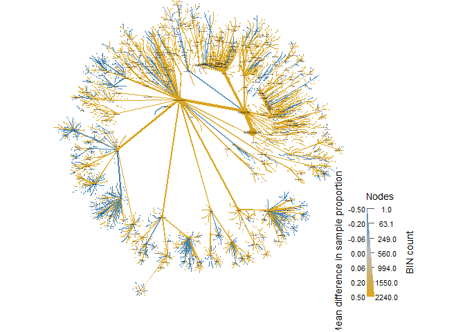<!-- -->
But more interesting for us, to separate them according to focal groups.

``` r
set.seed(16)#to make sure the figures is always the same
obj %>%
  filter_taxa(taxon_names %in% c("Lepidoptera"),#here is to fliter the figure by groups
              subtaxa = TRUE) %>% 
  heat_tree(node_label = taxon_names,
            node_size_range = c(0.005, 0.02),
            #edge_size_range = c(0.005, 0.01),
            node_size = n_obs, # n_obs is a function that calculates, in this case, the number of OTUs per taxon
            node_color = mean_diff, # A column from `obj$data$diff_table`
            node_color_interval = c(-0.01,0.01), # The range of the mean_difference to display
            node_color_range = c("steelblue", "gray", "goldenrod"), # The color palette used
            node_size_axis_label = "BIN count",
            node_color_axis_label = "Mean difference between seasons",
            layout = "davidson-harel", # The primary layout algorithm
            initial_layout = "reingold-tilford") # The layout algorithm that initializes node locations
```

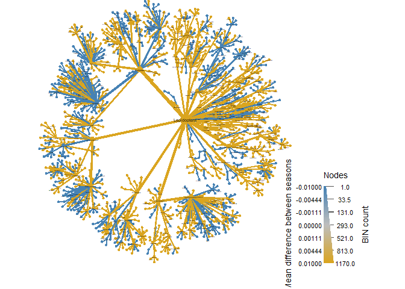<!-- -->

``` r
set.seed(16)#to make sure the figures is always the same
obj %>%
  filter_taxa(taxon_names %in% c("Trichoptera"),#here is to fliter the figure by groups
              subtaxa = TRUE) %>% 
  heat_tree(node_label = taxon_names,
            node_size_range = c(0.02, 0.05),
            #edge_size_range = c(0.005, 0.01),
            node_size = n_obs, # n_obs is a function that calculates, in this case, the number of OTUs per taxon
            node_color = mean_diff, # A column from `obj$data$diff_table`
            node_color_interval = c(-0.01,0.01), # The range of the mean_difference to display
            node_color_range = c("steelblue", "gray", "goldenrod"), # The color palette used
            node_size_axis_label = "BIN count",
            node_color_axis_label = "Mean difference between seasons",
            layout = "davidson-harel", # The primary layout algorithm
            initial_layout = "reingold-tilford") # The layout algorithm that initializes node locations
```

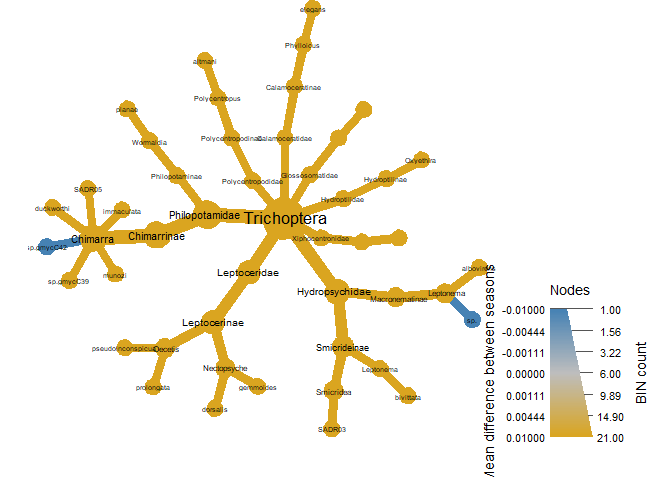<!-- -->

``` r
set.seed(16)#to make sure the figures is always the same
obj %>%
  filter_taxa(taxon_names %in% c("Diptera"),#here is to fliter the figure by groups
              subtaxa = TRUE) %>% 
  heat_tree(node_label = taxon_names,
            node_size_range = c(0.01, 0.02),
            #edge_size_range = c(0.005, 0.01),
            node_size = n_obs, # n_obs is a function that calculates, in this case, the number of OTUs per taxon
            node_color = mean_diff, # A column from `obj$data$diff_table`
            node_color_interval = c(-0.01,0.01), # The range of the mean_difference to display
            node_color_range = c("steelblue", "gray", "goldenrod"), # The color palette used
            node_size_axis_label = "BIN count",
            node_color_axis_label = "Mean difference between seasons",
            layout = "davidson-harel", # The primary layout algorithm
            initial_layout = "reingold-tilford") # The layout algorithm that initializes node locations
```

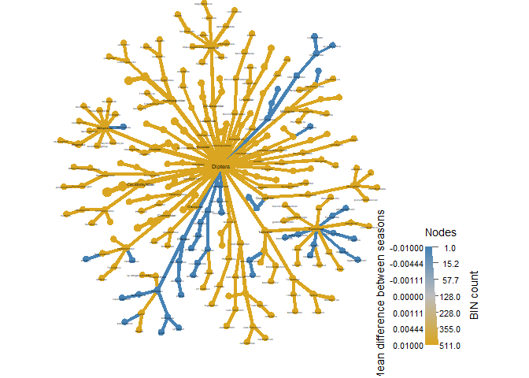<!-- -->

``` r
set.seed(16)#to make sure the figures is always the same
obj %>%
  filter_taxa(taxon_names %in% c("Hemiptera"),#here is to fliter the figure by groups
              subtaxa = TRUE) %>% 
  heat_tree(node_label = taxon_names,
            node_size_range = c(0.02, 0.05),
            #edge_size_range = c(0.005, 0.01),
            node_size = n_obs, # n_obs is a function that calculates, in this case, the number of OTUs per taxon
            node_color = mean_diff, # A column from `obj$data$diff_table`
            node_color_interval = c(-0.01,0.01), # The range of the mean_difference to display
            node_color_range = c("steelblue", "gray", "goldenrod"), # The color palette used
            node_size_axis_label = "BIN count",
            node_color_axis_label = "Mean difference between seasons",
            layout = "davidson-harel", # The primary layout algorithm
            initial_layout = "reingold-tilford") # The layout algorithm that initializes node locations
```

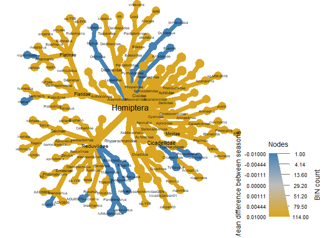<!-- -->

``` r
set.seed(16)#to make sure the figures is always the same
obj %>%
  filter_taxa(taxon_names %in% c("Hymenoptera"),#here is to fliter the figure by groups
              subtaxa = TRUE) %>% 
  heat_tree(node_label = taxon_names,
            node_size_range = c(0.01, 0.02),
            #edge_size_range = c(0.005, 0.01),
            node_size = n_obs, # n_obs is a function that calculates, in this case, the number of OTUs per taxon
            node_color = mean_diff, # A column from `obj$data$diff_table`
            node_color_interval = c(-0.01,0.01), # The range of the mean_difference to display
            node_color_range = c("steelblue", "gray", "goldenrod"), # The color palette used
            node_size_axis_label = "BIN count",
            node_color_axis_label = "Mean difference between seasons",
            layout = "davidson-harel", # The primary layout algorithm
            initial_layout = "reingold-tilford") # The layout algorithm that initializes node locations
```

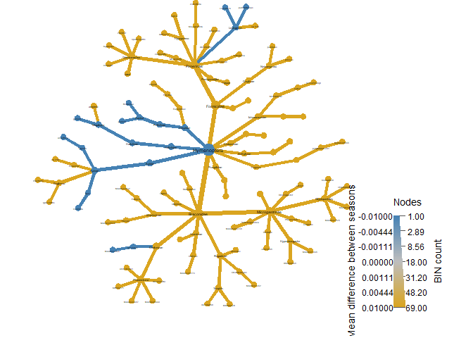<!-- -->

``` r
set.seed(16)#to make sure the figures is always the same
obj %>%
  filter_taxa(taxon_names %in% c("Coleoptera"),#here is to fliter the figure by groups
              subtaxa = TRUE) %>% 
  heat_tree(node_label = taxon_names,
            node_size_range = c(0.01, 0.02),
            #edge_size_range = c(0.005, 0.01),
            node_size = n_obs, # n_obs is a function that calculates, in this case, the number of OTUs per taxon
            node_color = mean_diff, # A column from `obj$data$diff_table`
            node_color_interval = c(-0.01,0.01), # The range of the mean_difference to display
            node_color_range = c("steelblue", "gray", "goldenrod"), # The color palette used
            node_size_axis_label = "BIN count",
            node_color_axis_label = "Mean difference between seasons",
            #edge_label = n_obs,
            layout = "davidson-harel", # The primary layout algorithm
            initial_layout = "reingold-tilford") # The layout algorithm that initializes node locations
```

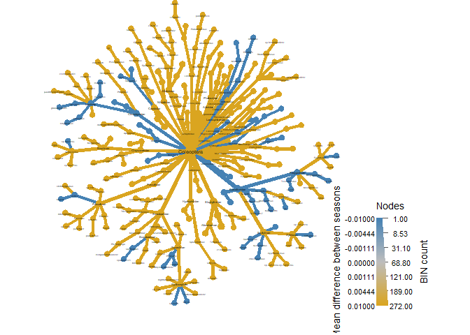<!-- -->
Note these above are mean differences between seasons (node_color =
mean_diff). In orange for dry season, in blue for wet season. There is
no statsitical test associated with these trees yet, but we can do it
using the wilcox_p\_value function we ran on the diff_table above.

``` r
obj %>%
  filter_taxa(taxon_names %in% c("Coleoptera"),#here is to fliter the figure by groups
              subtaxa = TRUE) %>%
  heat_tree(node_label = taxon_names,
            node_size = n_obs, # n_obs is a function that calculates the number of OTUs per taxon
            node_color = log2_median_ratio, # A column from `obj$data$diff_table`
            node_color_trans = 'linear',
            node_color_interval = c(-0.5, 0.5), # The range of `mean_diff` to display
            node_color_range = c("goldenrod", "gray", "steelblue"), # The color palette used
            node_color_digits = 1,
            node_size_axis_label = "BIN count",
            node_color_axis_label = "log 2 ratio of median counts",
            layout = "davidson-harel", # The primary layout algorithm
            initial_layout = "reingold-tilford")
```

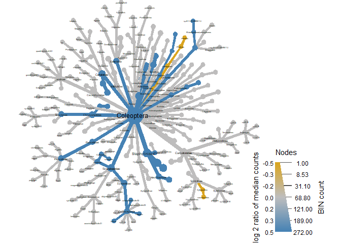<!-- -->

``` r
obj %>%
  filter_taxa(taxon_names %in% c("Lepidoptera"),#here is to fliter the figure by groups
              subtaxa = TRUE) %>%
  heat_tree(node_label = taxon_names,
            node_size = n_obs, # n_obs is a function that calculates the number of OTUs per taxon
            node_color = log2_median_ratio, # A column from `obj$data$diff_table`
            node_color_trans = 'linear',
            node_color_interval = c(-0.5, 0.5), # The range of `mean_diff` to display
            node_color_range = c("goldenrod", "gray", "steelblue"), # The color palette used
            node_color_digits = 1,
            node_size_axis_label = "BIN count",
            node_color_axis_label = "log 2 ratio of median counts",
            layout = "davidson-harel", # The primary layout algorithm
            initial_layout = "reingold-tilford")
```

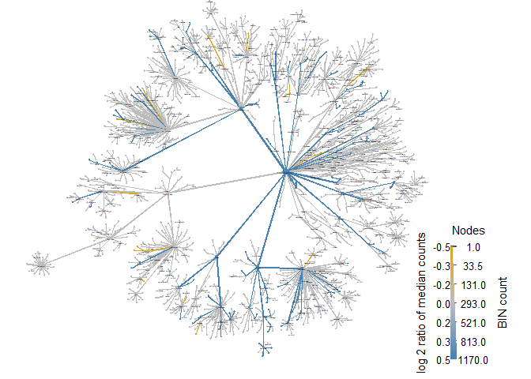<!-- -->

``` r
obj %>%
  filter_taxa(taxon_names %in% c("Hemiptera"),#here is to fliter the figure by groups
              subtaxa = TRUE) %>%
  heat_tree(node_label = taxon_names,
            node_size = n_obs, # n_obs is a function that calculates the number of OTUs per taxon
            node_color = log2_median_ratio, # A column from `obj$data$diff_table`
            node_color_trans = 'linear',
            node_color_interval = c(-0.5, 0.5), # The range of `mean_diff` to display
            node_color_range = c("goldenrod", "gray", "steelblue"), # The color palette used
            node_color_digits = 1,
            node_size_axis_label = "BIN count",
            node_color_axis_label = "log 2 ratio of median counts",
            layout = "davidson-harel", # The primary layout algorithm
            initial_layout = "reingold-tilford")
```

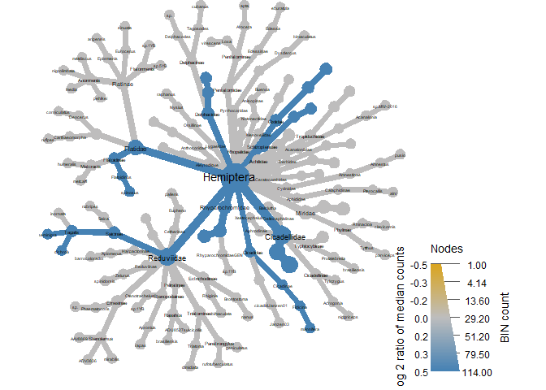<!-- -->

``` r
obj %>%
  filter_taxa(taxon_names %in% c("Hymenoptera"),#here is to fliter the figure by groups
              subtaxa = TRUE) %>%
  heat_tree(node_label = taxon_names,
            node_size = n_obs, # n_obs is a function that calculates the number of OTUs per taxon
            node_color = log2_median_ratio, # A column from `obj$data$diff_table`
            node_color_trans = 'linear',
            node_color_interval = c(-0.5, 0.5), # The range of `mean_diff` to display
            node_color_range = c("goldenrod", "gray", "steelblue"), # The color palette used
            node_color_digits = 1,
            node_size_axis_label = "BIN count",
            node_color_axis_label = "log 2 ratio of median counts",
            layout = "davidson-harel", # The primary layout algorithm
            initial_layout = "reingold-tilford")
```

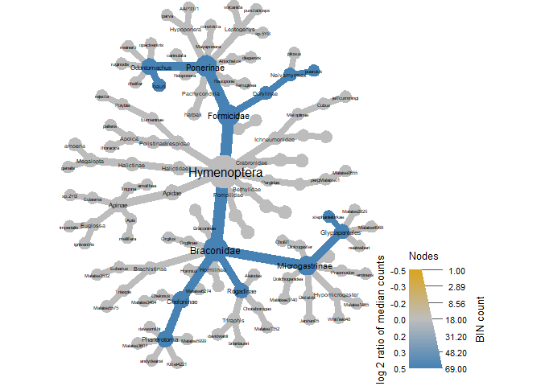<!-- -->

``` r
obj %>%
  filter_taxa(taxon_names %in% c("Diptera"),#here is to fliter the figure by groups
              subtaxa = TRUE) %>%
  heat_tree(node_label = taxon_names,
            node_size = n_obs, # n_obs is a function that calculates the number of OTUs per taxon
            node_color = log2_median_ratio, # A column from `obj$data$diff_table`
            node_color_trans = 'linear',
            node_color_interval = c(-0.5, 0.5), # The range of `mean_diff` to display
            node_color_range = c("goldenrod", "gray", "steelblue"), # The color palette used
            node_color_digits = 1,
            node_size_axis_label = "BIN count",
            node_color_axis_label = "log 2 ratio of median counts",
            layout = "davidson-harel", # The primary layout algorithm
            initial_layout = "reingold-tilford")
```

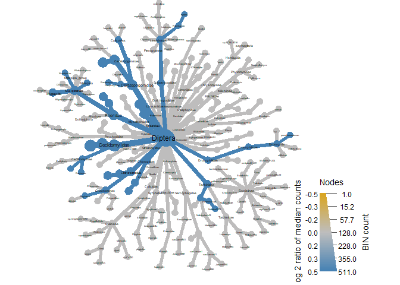<!-- -->

``` r
obj %>%
  filter_taxa(taxon_names %in% c("Trichoptera"),#here is to fliter the figure by groups
              subtaxa = TRUE) %>%
  heat_tree(node_label = taxon_names,
            node_size = n_obs, # n_obs is a function that calculates the number of OTUs per taxon
            node_color = log2_median_ratio, # A column from `obj$data$diff_table`
            node_color_trans = 'linear',
            node_color_interval = c(-0.5, 0.5), # The range of `mean_diff` to display
            node_color_range = c("goldenrod", "gray", "steelblue"), # The color palette used
            node_color_digits = 1,
            node_size_axis_label = "BIN count",
            node_color_axis_label = "log 2 ratio of median counts",
            layout = "davidson-harel", # The primary layout algorithm
            initial_layout = "reingold-tilford")
```

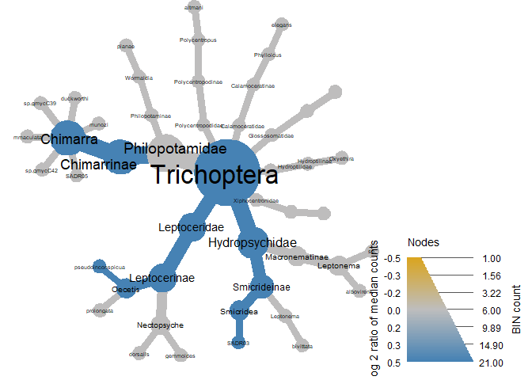<!-- -->

``` r
heat_tree(obj,
          node_label = taxon_names,
          node_size = n_obs, # n_obs is a function that calculates the number of OTUs per taxon
          node_color = log2_median_ratio, # A column from `obj$data$diff_table`
          node_color_trans = 'linear',
          node_color_interval = c(-0.5, 0.5), # The range of `mean_diff` to display
          node_color_range = c("goldenrod", "gray", "steelblue"), # The color palette used
          node_color_digits = 1,
          node_size_axis_label = "BIN count",
          node_color_axis_label = "log 2 ratio of median counts",
          layout = "davidson-harel", # The primary layout algorithm
          initial_layout = "reingold-tilford")
```

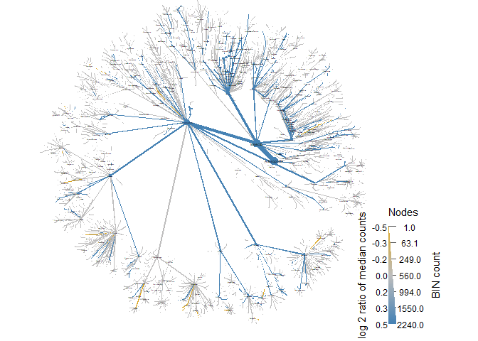<!-- -->
Now we can see some clear differences between seasons. As expected, the
wet season has higher diversity compared to the dry season, and here we
can see where the differences are concentrated (branches in blue
indicate that those taxa are significantly more abundant in the wet
season when compared to the dry). Gray branches indicate no significant
difference between number of reads for that tasxa in wet or dry season.

These are visually insteresing results but we still need to compare
these data statistically through diversity and ordination analyses which
will be covered in the following script.
