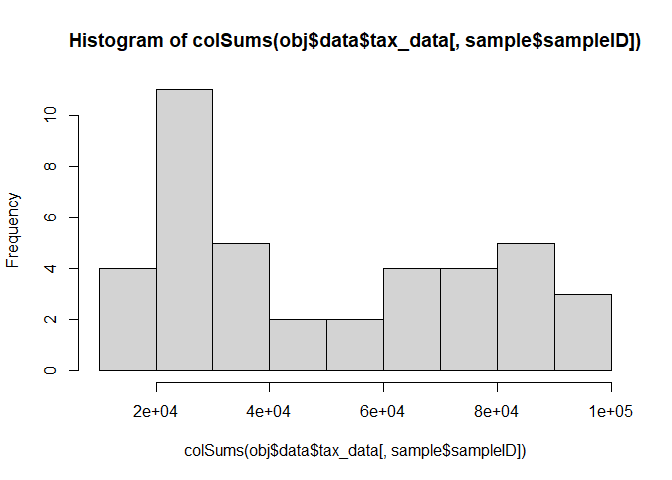
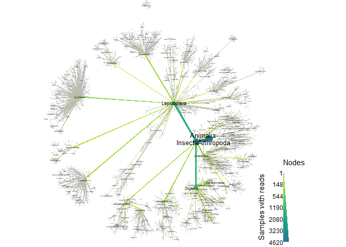
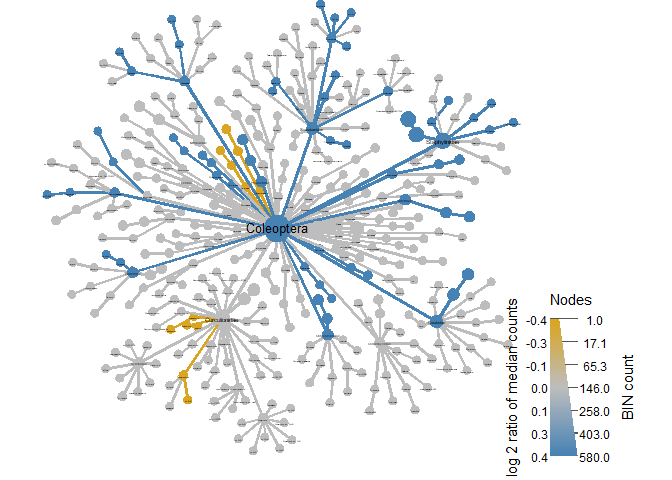
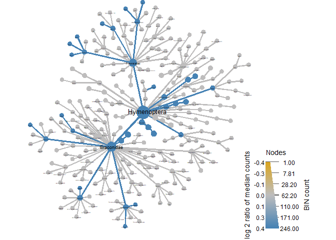
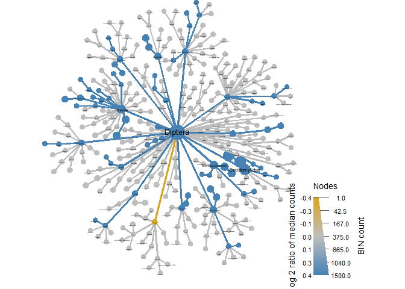
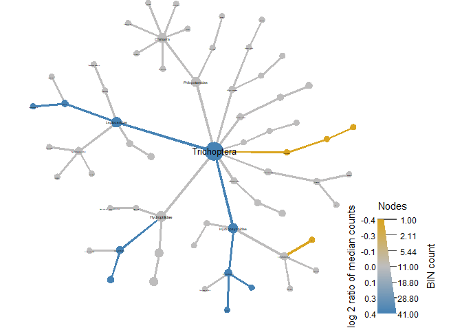

02 Metacoder heat trees
================
Daniel
19/09/2022

This script takes the previously merged and formatted data from mBrave
(produced through script 01) and does preliminary analyses with
Metacoder. The idea of this script is to have a preliminary estimate of
diversity within the metabarcoding samples. Due to the nature of
mBrave’s classification associated with BOLD databases, there are a
number of BINs which have multiple, uncertain, identifications. I have
(manually) cleaned the data further, now we are only including species
name for the 1st BOLD BIN hit. This is normally either, the species form
the BCI database (the first dataset used to classify through mBRAVE), or
the species most frequently ‘named’ that name. E.g. Agelenopsis
pennsylvanica, potteri, emertoni, katsoni, acutosa, is now Agelenopsis
pennsylvanica. The file used is the final dataset with \~3500 BINs
(finaldat_merged.csv).

``` r
dat<- read.csv('data/final_anal/CYBs_correct_names.csv', header = TRUE)
sample <- read.csv('data/final_anal/location_ctrl.csv')
obj <- parse_tax_data(dat,
                      class_cols = "classification",
                      class_sep = ";",
                      class_regex = "^([a-z]{0,1})_{0,2}(.*)$",
                      class_key = c("tax_rank" = "taxon_rank", "name" = "taxon_name"))
print(obj)
```

    ## <Taxmap>
    ##   3865 taxa: aab. Animalia ... fsr. Pityophthorus sp. cur87SG
    ##   3865 edges: NA->aab, aab->aac, aac->aad ... clk->fsq, cfu->fsr
    ##   2 data sets:
    ##     tax_data:
    ##       # A tibble: 4,622 x 43
    ##         taxon_id bin_uri      classi~1 ARM3A~2 DRA1A~3 ARM1A~4 BAL1A~5
    ##         <chr>    <chr>        <chr>      <int>   <int>   <int>   <int>
    ##       1 cll      BOLD:AEK1984 k__Anim~       0       0       0       0
    ##       2 cll      BOLD:AEK9771 k__Anim~       0       0       0       0
    ##       3 cll      BOLD:AEL2824 k__Anim~       0       0       0       0
    ##       # ... with 4,619 more rows, 36 more variables: WHE1AWET <int>,
    ##       #   WHE2AWET <int>, ZET1AWET <int>, ARM4AWET <int>,
    ##       #   BAL1BWET <int>, DRA1BWET <int>, WHE1BWET <int>,
    ##       #   WHE2BWET <int>, ARM2BWET <int>, ARM1BWET <int>, ..., and
    ##       #   abbreviated variable names 1: classification, 2: ARM3AWET,
    ##       #   3: DRA1AWET, 4: ARM1AWET, 5: BAL1AWET
    ##     class_data:
    ##       # A tibble: 32,354 x 5
    ##         taxon_id input_index tax_rank name       regex_match  
    ##         <chr>          <int> <chr>    <chr>      <chr>        
    ##       1 aab                1 k        Animalia   k__Animalia  
    ##       2 aac                1 p        Arthropoda p__Arthropoda
    ##       3 aad                1 c        Arachnida  c__Arachnida 
    ##       # ... with 32,351 more rows
    ##   0 functions:

Above is the print out of a taxmap object. The R console output shows
that there are 3,651 unique taxa and lists their ID, but this includes
many NA’s (unassigned taxonomies), Better to look at the tbl_df which
shows a ‘tibble’ of 3,173 rows (assigned classifications) in 43 columns
(40 samples + taxon_id, bin_uri and classification). Each row shows how
many reads for that taxon was in each sample.

``` r
# This is now obsolete, as we have already decontaminated based on negative controls from mBrave. We treat every read as presence of that BIN in the data.

#obj$data$tax_data <- zero_low_counts(obj, data = "tax_data", min_count = 10, cols= sample$sampleID, other_cols = TRUE)
#zeroing 5811 of 126920 counts with less than 10 reads (depending how stringent this can be changed in the min_count flag above
#no_reads <- rowSums(obj$data$tax_data[, sample$sampleID]) == 0
#sum(no_reads) 
#there are 937 taxon_id's with less than 10 reads which we will remove in the next step
#obj <- filter_obs(obj, data = "tax_data", ! no_reads, drop_taxa = TRUE)
#print(obj) #2236 taxa in 40 samples (it says 43 columns because of columns taxon, OTU_ID and bin_uri, the classification column is not really needed right now)
```

We now have cleaned data set (with our chosen minimum number of reads to
\>10) We can add new ‘tibbles’ to obj\$data such as proportion of total
reads, or abundance

``` r
obj$data$tax_data <- obj$data$tax_data[c("taxon_id","bin_uri", sample$sampleID)]
obj$data$tax_props <- calc_obs_props(obj, "tax_data", cols= sample$sampleID, other_cols = TRUE)
```

    ## Calculating proportions from counts for 40 columns for 4622 observations.

    ## Warning: The following columns will be replaced in the output:
    ##    ARM3AWET, DRA1AWET, ARM1AWET ... ZET2BDRY, DRA1ADRY, ARM2BDRY

``` r
obj$data$tax_abund <- calc_taxon_abund(obj, "tax_data", cols = sample$sampleID)
```

    ## Summing per-taxon counts from 40 columns for 3865 taxa

``` r
print(obj)
```

    ## <Taxmap>
    ##   3865 taxa: aab. Animalia ... fsr. Pityophthorus sp. cur87SG
    ##   3865 edges: NA->aab, aab->aac, aac->aad ... clk->fsq, cfu->fsr
    ##   4 data sets:
    ##     tax_data:
    ##       # A tibble: 4,622 x 42
    ##         taxon_id bin_uri      ARM3AWET DRA1A~1 ARM1A~2 BAL1A~3 WHE1A~4
    ##         <chr>    <chr>           <int>   <int>   <int>   <int>   <int>
    ##       1 cll      BOLD:AEK1984        0       0       0       0       0
    ##       2 cll      BOLD:AEK9771        0       0       0       0       0
    ##       3 cll      BOLD:AEL2824        0       0       0       0       0
    ##       # ... with 4,619 more rows, 35 more variables: WHE2AWET <int>,
    ##       #   ZET1AWET <int>, ARM4AWET <int>, BAL1BWET <int>,
    ##       #   DRA1BWET <int>, WHE1BWET <int>, WHE2BWET <int>,
    ##       #   ARM2BWET <int>, ARM1BWET <int>, ZET2AWET <int>, ..., and
    ##       #   abbreviated variable names 1: DRA1AWET, 2: ARM1AWET,
    ##       #   3: BAL1AWET, 4: WHE1AWET
    ##     class_data:
    ##       # A tibble: 32,354 x 5
    ##         taxon_id input_index tax_rank name       regex_match  
    ##         <chr>          <int> <chr>    <chr>      <chr>        
    ##       1 aab                1 k        Animalia   k__Animalia  
    ##       2 aac                1 p        Arthropoda p__Arthropoda
    ##       3 aad                1 c        Arachnida  c__Arachnida 
    ##       # ... with 32,351 more rows
    ##     tax_props:
    ##       # A tibble: 4,622 x 42
    ##         taxon_id bin_uri      ARM3AWET DRA1A~1 ARM1A~2 BAL1A~3 WHE1A~4
    ##         <chr>    <chr>           <dbl>   <dbl>   <dbl>   <dbl>   <dbl>
    ##       1 cll      BOLD:AEK1984        0       0       0       0       0
    ##       2 cll      BOLD:AEK9771        0       0       0       0       0
    ##       3 cll      BOLD:AEL2824        0       0       0       0       0
    ##       # ... with 4,619 more rows, 35 more variables: WHE2AWET <dbl>,
    ##       #   ZET1AWET <dbl>, ARM4AWET <dbl>, BAL1BWET <dbl>,
    ##       #   DRA1BWET <dbl>, WHE1BWET <dbl>, WHE2BWET <dbl>,
    ##       #   ARM2BWET <dbl>, ARM1BWET <dbl>, ZET2AWET <dbl>, ..., and
    ##       #   abbreviated variable names 1: DRA1AWET, 2: ARM1AWET,
    ##       #   3: BAL1AWET, 4: WHE1AWET
    ##     tax_abund:
    ##       # A tibble: 3,865 x 41
    ##         taxon_id ARM3AWET DRA1AWET ARM1AWET BAL1AWET WHE1AWET WHE2AWET
    ##         <chr>       <dbl>    <dbl>    <dbl>    <dbl>    <dbl>    <dbl>
    ##       1 aab         70807    66794    67160    84023    51963    88099
    ##       2 aac         70807    66794    67160    84023    51963    88099
    ##       3 aad             1       13        1       40        2        5
    ##       # ... with 3,862 more rows, and 34 more variables:
    ##       #   ZET1AWET <dbl>, ARM4AWET <dbl>, BAL1BWET <dbl>,
    ##       #   DRA1BWET <dbl>, WHE1BWET <dbl>, WHE2BWET <dbl>,
    ##       #   ARM2BWET <dbl>, ARM1BWET <dbl>, ZET2AWET <dbl>,
    ##       #   ARM2AWET <dbl>, ...
    ##   0 functions:

Notice we now have 3 tibbles, one for counts (tax_data - this could be
changed with something like: \>names(obj\$data) \<- “otu_counts”), one
for proportion (tax_props) and one for abundance (tax_abund). We can,
and will, add more refined data sets afterwards, all linked to the
original parsing so we never loose the information of what taxonid
actually means.

we can now view distribution of reads in the samples:

``` r
hist(colSums(obj$data$tax_data[ , sample$sampleID]))
```

<!-- -->

Sampling is quite uneven with one samples with \< 100,000 reads. We will
rarefy our data to simulate even number of reads per sample (18914 is
the minimum depth) keep in mind that this discards a lot of data - we
could probably instead remove some of the samples with the lowest reads
instead. We can add the rarefied data set as a separate data frame as we
did above with tax_props and tax_abund. If you want, you can
print(obj$data$tax_rarefied) to see what it looks like. We can also make
a rarefaction curve with metacoder, but look at script
03_diversity_and_ordination where we do rarefaction curves with ggplot
instead.

``` r
obj$data$tax_rarefied <- rarefy_obs(obj, "tax_data", cols = sample$sampleID, other_cols = TRUE)
```

    ## Rarefying to 19375 since that is the lowest sample total.

    ## Warning: The following columns will be replaced in the output:
    ##    ARM3AWET, DRA1AWET, ARM1AWET ... ZET2BDRY, DRA1ADRY, ARM2BDRY

``` r
#rarecurve is from vegan package
pdf("./02_metacoder_heat_trees_files/rarecurve.pdf")
rarecurve(t(obj$data$tax_data[, sample$sampleID]), step = 1000,
          sample = min(colSums(obj$data$tax_data[, sample$sampleID])),
          col = "blue", cex = 0.8)
dev.off()
```

    ## png 
    ##   2

Below an OPTIONAL chunk to visualize a very rudimentary heat tree for
all counts for metabaroded data. It is meant for illustration purposes
only and its not very informative, it also takes a long time to run. See
figure allcounts.pdf in the project.

``` r
set.seed(99) # This makes the plot appear the same each time it is run
heat_tree(obj,
          node_label = taxon_names,
          node_size = n_obs,
          node_color = n_obs,
          node_size_axis_label = "BIN count",
          node_color_axis_label = "Samples with reads",
          node_label_size_range = c( 0.005, 0.03),
          layout = "davidson-harel", # The primary layout algorithm
          initial_layout = "reingold-tilford",
          output_file = "./02_metacoder_heat_trees_files/all_reads_heattree.pdf") # The layout algorithm that initializes node locations
```

<!-- -->

``` r
# this takes > 30 minutes to run
```

Far more informative would be to see the differences between seasons in
this case. We can easily calculate the number of samples that have reads
for each taxon according to different groups. We can also compare
statistically using Wilcoxon Rank Sum test, significant differences
between taxa samples in wet or dry season.

``` r
obj$data$tax_occ <- calc_n_samples(obj, "tax_abund", groups = sample$SEASON, cols = sample$sampleID)
```

    ## Calculating number of samples with a value greater than 0 for 40 columns in 2 groups for 3865 observations

``` r
print(obj$data$tax_occ)
```

    ## # A tibble: 3,865 x 3
    ##    taxon_id   WET   DRY
    ##    <chr>    <int> <int>
    ##  1 aab         20    20
    ##  2 aac         20    20
    ##  3 aad         20    16
    ##  4 aae         11     1
    ##  5 aaf         20    20
    ##  6 aag          6     1
    ##  7 aah          9     9
    ##  8 aai         14    11
    ##  9 aaj          4     0
    ## 10 aak         12     2
    ## # ... with 3,855 more rows

``` r
obj$data$diff_table <- compare_groups(obj, data = "tax_abund",
                                      cols = sample$sampleID, # What columns of sample data to use
                                      groups = sample$SEASON) # What category each sample is assigned to
obj <- mutate_obs(obj, "diff_table",
                  wilcox_p_value = p.adjust(wilcox_p_value, method = "fdr"))
obj$data$diff_table$log2_median_ratio[obj$data$diff_table$wilcox_p_value > 0.05] <- 0 #get significant values for group comparison
```

And we can plot these differences in a metacoder heat tree.

``` r
heat_tree(obj,
          node_label = taxon_names,
          node_size_range = c(0.006, 0.04),
          edge_size_range = c(0.001,0.003),
          node_size = n_obs, # n_obs is a function that calculates the number of OTUs per taxon
          node_color = log2_median_ratio, # A column from `obj$data$diff_table`
          node_color_interval = c(-0.44, 0.44), # The range of `mean_diff` to display
          node_color_range = c("goldenrod", "gray", "steelblue"), # The color palette used
          node_color_digits = 1,
          node_size_axis_label = "BIN count",
          node_color_axis_label = "Mean difference in sample proportion",
          node_label_size_range = c( 0.005, 0.03),
          layout = "davidson-harel", # The primary layout algorithm
          initial_layout = "reingold-tilford",
          output_file = "./02_metacoder_heat_trees_files/all_reads_mean_diff_seasons.pdf")
```

<!-- -->

``` r
#>30 minutes to run
```

To understand the colouring scheme, read this paragraph carefully from
the metacoder tutorial:

### What color corresponds to each group depends on the order they were given in the compare_groups function. Since “leaf” is “treatment_1” in the “diff_table”, and “log2_median_ratio” is defined as “log2(treatment_1 / treatment_2)”, when a taxon has more counts in leaf samples, the ratio is positive, therefore taxa more abundant in leafs are colored magenta in this case.

their code has ’node_color_range = c(“cyan”, “gray”, “magenta”)###

If we look at print(obj$data$diff_table) above the plot, we can see that
in our case, treatment_1 is ‘WET’. The log2 median ratio is defined
as”log2(wet / dry). When a taxon has more counts in the dry season, the
ratio is positive, therefore taxa more abundant in the dry season are
coloured ‘goldenrod’ in our case (not magenta).

But more interesting for us, to separate them according to focal groups.
In orange for dry season, in blue for wet season. The following are the
differences between seasons using wilcox_p\_vlue function we ran on the
diff_table above.

``` r
obj %>%
  metacoder::filter_taxa(taxon_names == "Coleoptera",#here is to fliter the figure by groups
              subtaxa = TRUE) %>%
  heat_tree(node_label = taxon_names,
            node_size_range = c(0.01, 0.03),
            edge_size_range = c(0.003,0.005),
            node_size = n_obs, # n_obs is a function that calculates the number of OTUs per taxon
            node_color = log2_median_ratio, # A column from `obj$data$diff_table`
            node_color_trans = 'linear',
            node_color_interval = c(-.44, 0.44), # The range of `mean_diff` to display
            node_color_range = c("goldenrod", "gray", "steelblue"), # The color palette used
            node_color_digits = 1,
            node_size_axis_label = "BIN count",
            node_color_axis_label = "log 2 ratio of median counts",
            node_label_size_range = c( 0.003, 0.03),
            layout = "davidson-harel", # The primary layout algorithm
            initial_layout = "reingold-tilford",
            output_file = "./02_metacoder_heat_trees_files/coleoptera_significant_diff_season.pdf")
```

<!-- -->

``` r
obj %>%
  metacoder::filter_taxa(taxon_names =="Lepidoptera",#here is to fliter the figure by groups
              subtaxa = TRUE) %>%
  heat_tree(node_label = taxon_names,
            node_size_range = c(0.006, 0.04),
            edge_size_range = c(0.001,0.003),
            node_size = n_obs, # n_obs is a function that calculates the number of OTUs per taxon
            node_color = log2_median_ratio, # A column from `obj$data$diff_table`
            node_color_trans = 'linear',
            node_color_interval = c(-.44, 0.44), # The range of `mean_diff` to display
            node_color_range = c("goldenrod", "gray", "steelblue"), # The color palette used
            node_color_digits = 1,
            node_size_axis_label = "BIN count",
            node_color_axis_label = "log 2 ratio of median counts",
            node_label_size_range = c( 0.003, 0.03),
            layout = "davidson-harel", # The primary layout algorithm
            initial_layout = "reingold-tilford",
            output_file = "./02_metacoder_heat_trees_files/leps_significant_diff_season.pdf")
```

<!-- -->

``` r
obj %>%
  metacoder::filter_taxa(taxon_names == "Hemiptera",#here is to fliter the figure by groups
              subtaxa = TRUE) %>%
  heat_tree(node_label = taxon_names,
            node_size_range = c(0.01, 0.03),
            edge_size_range = c(0.003,0.005),
            node_size = n_obs, # n_obs is a function that calculates the number of OTUs per taxon
            node_color = log2_median_ratio, # A column from `obj$data$diff_table`
            node_color_trans = 'linear',
            node_color_interval = c(-.44, 0.44), # The range of `mean_diff` to display
            node_color_range = c("goldenrod", "gray", "steelblue"), # The color palette used
            node_color_digits = 1,
            node_size_axis_label = "BIN count",
            node_color_axis_label = "log 2 ratio of median counts",
            node_label_size_range = c( 0.003, 0.03),
            layout = "davidson-harel", # The primary layout algorithm
            initial_layout = "reingold-tilford",
            output_file = "./02_metacoder_heat_trees_files/hemiptera_significant_diff_season.pdf")
```

<!-- -->

``` r
obj %>%
  metacoder::filter_taxa(taxon_names == "Hymenoptera",#here is to fliter the figure by groups
              subtaxa = TRUE) %>%
  heat_tree(node_label = taxon_names,
            node_size_range = c(0.01, 0.03),
            edge_size_range = c(0.003,0.005),
            node_size = n_obs, # n_obs is a function that calculates the number of OTUs per taxon
            node_color = log2_median_ratio, # A column from `obj$data$diff_table`
            node_color_trans = 'linear',
            node_color_interval = c(-.44, 0.44), # The range of `mean_diff` to display
            node_color_range = c("goldenrod", "gray", "steelblue"), # The color palette used
            node_color_digits = 1,
            node_size_axis_label = "BIN count",
            node_color_axis_label = "log 2 ratio of median counts",
            node_label_size_range = c( 0.003, 0.03),
            layout = "davidson-harel", # The primary layout algorithm
            initial_layout = "reingold-tilford",
            output_file = "./02_metacoder_heat_trees_files/hymenoptera_significant_diff_season.pdf")
```

<!-- -->

``` r
obj %>%
  metacoder::filter_taxa(taxon_names == "Diptera",#here is to fliter the figure by groups
              subtaxa = TRUE) %>%
  heat_tree(node_label = taxon_names,
            node_size_range = c(0.01, 0.03),
            edge_size_range = c(0.003,0.005),
            node_size = n_obs, # n_obs is a function that calculates the number of OTUs per taxon
            node_color = log2_median_ratio, # A column from `obj$data$diff_table`
            node_color_trans = 'linear',
            node_color_interval = c(-.44, 0.44), # The range of `mean_diff` to display
            node_color_range = c("goldenrod", "gray", "steelblue"), # The color palette used
            node_color_digits = 1,
            node_size_axis_label = "BIN count",
            node_color_axis_label = "log 2 ratio of median counts",
            node_label_size_range = c( 0.003, 0.03),
            layout = "davidson-harel", # The primary layout algorithm
            initial_layout = "reingold-tilford",
            output_file = "./02_metacoder_heat_trees_files/Diptera_significant_diff_season.pdf")
```

<!-- -->

``` r
obj %>%
  metacoder::filter_taxa(taxon_names == "Trichoptera",#here is to fliter the figure by groups
              subtaxa = TRUE) %>%
  heat_tree(node_label = taxon_names,
            node_size_range = c(0.01, 0.03),
            edge_size_range = c(0.003,0.005),
            node_size = n_obs, # n_obs is a function that calculates the number of OTUs per taxon
            node_color = log2_median_ratio, # A column from `obj$data$diff_table`
            node_color_trans = 'linear',
            node_color_interval = c(-.44, 0.44), # The range of `mean_diff` to display
            node_color_range = c("goldenrod", "gray", "steelblue"), # The color palette used
            node_color_digits = 1,
            node_size_axis_label = "BIN count",
            node_color_axis_label = "log 2 ratio of median counts",
            node_label_size_range = c( 0.003, 0.03),
            layout = "davidson-harel", # The primary layout algorithm
            initial_layout = "reingold-tilford",
            output_file = "./02_metacoder_heat_trees_files/Trichoptera_significant_diff_season.pdf")
```

<!-- -->

``` r
obj %>%
  metacoder::filter_taxa(taxon_names == "Blattodea",#here is to fliter the figure by groups
              subtaxa = TRUE) %>%
  heat_tree(node_label = taxon_names,
            node_size_range = c(0.01, 0.03),
            edge_size_range = c(0.003,0.005),
            node_size = n_obs, # n_obs is a function that calculates the number of OTUs per taxon
            node_color = log2_median_ratio, # A column from `obj$data$diff_table`
            node_color_trans = 'linear',
            node_color_interval = c(-.44, 0.44), # The range of `mean_diff` to display
            node_color_range = c("goldenrod", "gray", "steelblue"), # The color palette used
            node_color_digits = 1,
            node_size_axis_label = "BIN count",
            node_color_axis_label = "log 2 ratio of median counts",
            node_label_size_range = c( 0.003, 0.03),
            layout = "davidson-harel", # The primary layout algorithm
            initial_layout = "reingold-tilford",
            output_file = "./02_metacoder_heat_trees_files/blatts_significant_diff_season.pdf")
```

<!-- -->
Now we can see some clear differences between seasons. As expected, the
wet season has higher diversity compared to the dry season, and here we
can see where the differences are concentrated (branches in blue
indicate that those taxa are significantly more abundant in the wet
season when compared to the dry). Gray branches indicate no significant
difference between number of reads for that taxa in wet or dry season.

These are visually interesting results but we still need to compare
these data statistically through diversity and ordination analyses which
will be covered in the following script.

``` r
saveRDS(object = obj, file = "data/final_anal/taxmap_object.rds") #this will save the clean, filtered taxmap object for future uses
```
