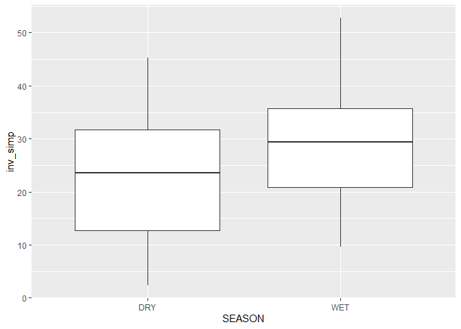
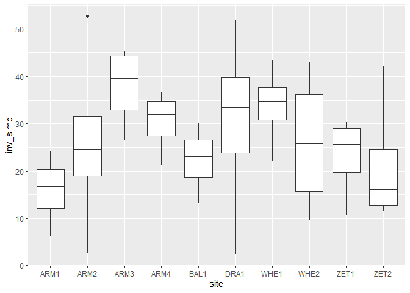

03_ordination_diversity
================
Daniel
27/09/2022

``` r
obj <- readRDS('data/taxmap_object.rds') #loads the taxmap object created in script 02_metacoder_heat_trees

obj %>%  metacoder::filter_taxa(taxon_names %in% c("Lepidoptera"),#here is to fliter the figure by groups
              subtaxa = TRUE) -> leps #we will create separate files for each order as this simplifies downstream analysis in microbiotaprocess - until I find a way to filter taxa on the mpse object directly.

obj %>%  metacoder::filter_taxa(taxon_names %in% c("Coleoptera"),#here is to fliter the figure by groups
              subtaxa = TRUE) -> coleo
obj %>%  metacoder::filter_taxa(taxon_names %in% c("Diptera"),#here is to fliter the figure by groups
              subtaxa = TRUE) -> dips
obj %>%  metacoder::filter_taxa(taxon_names %in% c("Hymenoptera"),#here is to fliter the figure by groups
              subtaxa = TRUE) -> bees #i know its hymenoptera
obj %>%  metacoder::filter_taxa(taxon_names %in% c("Hemiptera"),#here is to fliter the figure by groups
              subtaxa = TRUE) -> hemi
obj %>%  metacoder::filter_taxa(taxon_names %in% c("Blattodea"),#here is to fliter the figure by groups
              subtaxa = TRUE) -> blats 

sample <- read.csv('data/location_ctrl.csv')
```

The chunk above now gave us a filtered taxmap object for each of the
ForestGEO focal Orders (plus Diptera because I think its interesting).
Downstream analysis will make use of these filtered data sets, but we
continue with general info (whole data set) between seasons.

``` r
sample$inv_simp <- diversity(obj$data$tax_data[, sample$sampleID],
                             index = "invsimpson",
                             MARGIN = 2) # What orietation the matrix is in
ggplot(sample, aes(x = SEASON, y = inv_simp)) +
  geom_boxplot()
```

<!-- -->

``` r
anova_result <- aov(inv_simp ~ SEASON, sample)
summary(anova_result)
```

    ##             Df Sum Sq Mean Sq F value  Pr(>F)   
    ## SEASON       1   2016  2016.1   12.03 0.00132 **
    ## Residuals   38   6367   167.6                   
    ## ---
    ## Signif. codes:  0 '***' 0.001 '**' 0.01 '*' 0.05 '.' 0.1 ' ' 1

``` r
tukey_result <- HSD.test(anova_result, "SEASON", group = TRUE)
print(tukey_result)
```

    ## $statistics
    ##    MSerror Df     Mean       CV      MSD
    ##   167.5525 38 28.50982 45.40263 8.286489
    ## 
    ## $parameters
    ##    test name.t ntr StudentizedRange alpha
    ##   Tukey SEASON   2         2.862926  0.05
    ## 
    ## $means
    ##     inv_simp      std  r      Min      Max      Q25      Q50      Q75
    ## dry 21.41030 12.79590 20  1.60373 42.04263 12.96907 21.89135 29.49382
    ## wet 35.60933 13.09084 20 13.15428 63.56903 25.95842 34.52925 39.43509
    ## 
    ## $comparison
    ## NULL
    ## 
    ## $groups
    ##     inv_simp groups
    ## wet 35.60933      a
    ## dry 21.41030      b
    ## 
    ## attr(,"class")
    ## [1] "group"

``` r
group_data <- tukey_result$groups[order(rownames(tukey_result$groups)),]

pdf("./03_diversity_and_ordination_files/boxplot.pdf")
ggplot(sample, aes(x = SEASON, y = inv_simp)) +
  geom_text(data = data.frame(),
            aes(x = rownames(group_data), y = max(sample$inv_simp) + 1, label = group_data$groups),
            col = 'black',
            size = 10) +
  geom_boxplot() +
  ggtitle("Inverse Simpson diversity") +
  xlab("Season") +
  ylab("Inverse simpson index")
dev.off()
```

    ## png 
    ##   2

We can also see differences between sampling days or location (site)
although there are none.

``` r
ggplot(sample, aes(x = day, y = inv_simp)) +
  geom_boxplot()
```

<!-- -->

``` r
anova_result <- aov(inv_simp ~ day, sample)
summary(anova_result)
```

    ##             Df Sum Sq Mean Sq F value Pr(>F)
    ## day          1    373   373.2   1.771  0.191
    ## Residuals   38   8010   210.8

``` r
tukey_result_day <- HSD.test(anova_result, "day", group = TRUE)
print(tukey_result_day)
```

    ## $statistics
    ##    MSerror Df     Mean       CV      MSD
    ##   210.7874 38 28.50982 50.92463 9.294315
    ## 
    ## $parameters
    ##    test name.t ntr StudentizedRange alpha
    ##   Tukey    day   2         2.862926  0.05
    ## 
    ## $means
    ##   inv_simp      std  r      Min      Max      Q25      Q50      Q75
    ## A 25.45531 14.36608 20 1.603730 63.56903 16.44972 24.37844 33.53528
    ## B 31.56432 14.66937 20 2.395061 57.13042 24.14642 32.29192 39.60799
    ## 
    ## $comparison
    ## NULL
    ## 
    ## $groups
    ##   inv_simp groups
    ## B 31.56432      a
    ## A 25.45531      a
    ## 
    ## attr(,"class")
    ## [1] "group"

``` r
ggplot(sample, aes(x = site, y = inv_simp)) +
  geom_boxplot()
```

<!-- -->

``` r
anova_result <- aov(inv_simp ~ site, sample)
summary(anova_result)
```

    ##             Df Sum Sq Mean Sq F value Pr(>F)
    ## site         9   2504   278.2   1.419  0.224
    ## Residuals   30   5880   196.0

``` r
tukey_result_site <- HSD.test(anova_result, "site", group = TRUE)
print(tukey_result_site)
```

    ## $statistics
    ##    MSerror Df     Mean       CV      MSD
    ##   195.9848 30 28.50982 49.10399 33.76768
    ## 
    ## $parameters
    ##    test name.t ntr StudentizedRange alpha
    ##   Tukey   site  10         4.824141  0.05
    ## 
    ## $means
    ##      inv_simp       std r       Min      Max      Q25      Q50      Q75
    ## ARM1 15.36740  8.199033 4  5.591829 25.19244 11.26366 15.34266 19.44639
    ## ARM2 27.12839 22.595379 4  2.395061 57.13042 17.67951 24.49404 33.94292
    ## ARM3 37.95982 10.543994 4 24.943300 49.75889 32.55667 38.56855 43.97170
    ## ARM4 28.11173  6.170100 4 20.380249 34.08729 24.63881 28.98968 32.46260
    ## BAL1 25.75585 10.059304 4 13.205763 37.31929 21.16163 26.24917 30.84339
    ## DRA1 33.66056 25.433612 4  2.418754 63.56903 21.94008 34.32723 46.04771
    ## WHE1 34.97809  9.774069 4 20.409100 41.37588 34.31452 39.06368 39.72724
    ## WHE2 40.50644 10.509399 4 32.453747 55.65121 33.99786 36.96040 43.46898
    ## ZET1 24.24336  9.549588 4 12.259011 33.20952 18.82103 25.75246 31.17478
    ## ZET2 17.38656 13.696495 4  1.603730 34.54593 10.65642 16.69828 23.42842
    ## 
    ## $comparison
    ## NULL
    ## 
    ## $groups
    ##      inv_simp groups
    ## WHE2 40.50644      a
    ## ARM3 37.95982      a
    ## WHE1 34.97809      a
    ## DRA1 33.66056      a
    ## ARM4 28.11173      a
    ## ARM2 27.12839      a
    ## BAL1 25.75585      a
    ## ZET1 24.24336      a
    ## ZET2 17.38656      a
    ## ARM1 15.36740      a
    ## 
    ## attr(,"class")
    ## [1] "group"

``` r
group_data_day <- tukey_result_day$groups[order(rownames(tukey_result_day$groups)),]
ggplot(sample, aes(x = day, y = inv_simp)) +
  geom_text(data = data.frame(),
            aes(x = rownames(group_data_day), y = max(sample$inv_simp) + 1, label = group_data_day$groups),
            col = 'black',
            size = 10) +
  geom_boxplot() +
  ggtitle("Inverse Simpson diversity") +
  xlab("Day") +
  ylab("Inverse simpson index")
```

<!-- -->

``` r
group_data_site <- tukey_result_site$groups[order(rownames(tukey_result_site$groups)),]
ggplot(sample, aes(x = site, y = inv_simp)) +
  geom_text(data = data.frame(),
            aes(x = rownames(group_data_site), y = max(sample$inv_simp) + 1, label = group_data_site$groups),
            col = 'black',
            size = 10) +
  geom_boxplot() +
  ggtitle("Inverse Simpson diversity") +
  xlab("site") +
  ylab("Inverse simpson index")
```

<!-- -->

We can also calculate several diversity metrics for sampling season and
day using phyloseq but we must convert the taxmap object ‘obj’ to
phyloseq

``` r
ps_obj <- metacoder::as_phyloseq(obj,
                      otu_table = "tax_data",
                      otu_id_col = "bin_uri",
                      sample_data = sample,
                      sample_id_col = "sampleID")

#normally, I load every package I need at the start of the script, but this causes function masking problems (e.g. both MicrobiotaProcess and Metacoder have a 'as_phyloseq' function and you have to specify to R which package you want to use -  see above: metacoder::as_phyloseq - this means I am telling R to use the 'as_phyloseq' function from the metacoder package)

plot_richness(ps_obj, color = "SEASON", x = "site") #phyloseq function
```

    ## Warning in estimate_richness(physeq, split = TRUE, measures = measures): The data you have provided does not have
    ## any singletons. This is highly suspicious. Results of richness
    ## estimates (for example) are probably unreliable, or wrong, if you have already
    ## trimmed low-abundance taxa from the data.
    ## 
    ## We recommended that you find the un-trimmed data and retry.

<!-- -->

``` r
plot_richness(ps_obj, color = "day", x = "SEASON")
```

    ## Warning in estimate_richness(physeq, split = TRUE, measures = measures): The data you have provided does not have
    ## any singletons. This is highly suspicious. Results of richness
    ## estimates (for example) are probably unreliable, or wrong, if you have already
    ## trimmed low-abundance taxa from the data.
    ## 
    ## We recommended that you find the un-trimmed data and retry.

<!-- -->

Figures above OK but we can do better. I am using the MicrobiotaProcess
next

``` r
alphaobj <- get_alphaindex(ps_obj)
p_alpha <- ggbox(alphaobj, geom="violin", factorNames="SEASON", indexNames = c('Observe', 'Shannon', 'Simpson'),  signifmap = TRUE) +
  scale_fill_manual(values=c("goldenrod", "steelblue"))+
  theme(strip.background = element_rect(colour=NA, fill="grey"))
```

    ## The color has been set automatically, you can reset it manually by adding scale_fill_manual(values=yourcolors)

``` r
pdf("./03_diversity_and_ordination_files/diversity_indices_season.pdf")
p_alpha
```

    ## Warning in wilcox.test.default(c(126, 139, 111, 132, 132, 149, 145, 156, :
    ## cannot compute exact p-value with ties

``` r
dev.off()
```

    ## png 
    ##   2

And look at rarefaction curves for both seasons: These are rarefaction
curves of species (Y) and number of reads (X) - tells you how many read
coverage you need to capture most diversity.

``` r
alphaobj <- get_alphaindex(ps_obj)
head(as.data.frame(alphaobj))
```

    ##        Observe    Chao1      ACE  Shannon   Simpson         J site day SEASON
    ## ARM1AD     126 126.0000 126.0000 3.620160 0.9431301 0.7485419 ARM1   A    dry
    ## ARM1AW     264 267.4615 266.8923 3.906428 0.9223828 0.7005852 ARM1   A    wet
    ## ARM1BD     139 139.0000 139.0000 3.060776 0.8232365 0.6202841 ARM1   B    dry
    ## ARM1BW     246 246.0000 246.1599 4.170872 0.9601474 0.7576059 ARM1   B    wet
    ## ARM2AD     111 111.0000 111.0000 3.682167 0.9558242 0.7818544 ARM2   A    dry
    ## ARM2AW     388 393.0370 393.3780 4.389950 0.9622889 0.7364446 ARM2   A    wet
    ##         X X.1  inv_simp
    ## ARM1AD NA  NA 17.531036
    ## ARM1AW NA  NA 13.154277
    ## ARM1BD NA  NA  5.591829
    ## ARM1BW NA  NA 25.192440
    ## ARM2AD NA  NA 22.774330
    ## ARM2AW NA  NA 26.213753

``` r
rareres <- get_rarecurve(obj=ps_obj, chunks=400)

prare2 <- ggrarecurve(obj=rareres,
                      factorNames="SEASON",
                      shadow=FALSE,
                      indexNames="Observe"
) +
  scale_color_manual(values=c("goldenrod", "steelblue"))+
  theme_bw()+
  theme(axis.text=element_text(size=8), panel.grid=element_blank(),
        strip.background = element_rect(colour=NA,fill="grey"),
        strip.text.x = element_text(face="bold"))
```

    ## The color has been set automatically, you can reset it manually by adding scale_color_manual(values=yourcolors)

``` r
pdf("./03_diversity_and_ordination_files/season_rarefaction.pdf")
prare2
dev.off()
```

    ## png 
    ##   2

We can also do a Principal Coordinate Analysis to see not only the
differences between seasons, but what BINs are the main drivers of these
differences

``` r
# distmethod
# "unifrac",  "wunifrac", "manhattan", "euclidean", "canberra", "bray", "kulczynski" ...(vegdist, dist)
pcoares <- get_pcoa(obj=ps_obj, distmethod="bray", method="hellinger")
# Visualizing the result
pcoaplot1 <- ggordpoint(obj=pcoares, biplot=TRUE, speciesannot=FALSE,
                        factorNames=c("SEASON"), ellipse=TRUE) +
  scale_color_manual(values=c("goldenrod", "steelblue")) +
  scale_fill_manual(values=c("goldenrod", "steelblue"))
# first and third principal co-ordinates
pcoaplot2 <- ggordpoint(obj=pcoares, pc=c(1, 3), biplot=TRUE, speciesannot=FALSE,
                        factorNames=c("SEASON"), ellipse=TRUE) +
  scale_color_manual(values=c("goldenrod", "steelblue")) +
  scale_fill_manual(values=c("goldenrod", "steelblue"))

pdf("./03_diversity_and_ordination_files/pcoa_2_axis.pdf")
pcoaplot1 
dev.off()
```

    ## png 
    ##   2

``` r
pdf("./03_diversity_and_ordination_files/pcoa_3_axis.pdf")
pcoaplot2
dev.off()
```

    ## png 
    ##   2

``` r
pcoaplot1 | pcoaplot2
```

<!-- -->

Next we will see which are the most frequent taxa (in terms of reads) We
can edit this polot with two important compontents: taxlevel and topn
taxlevel means the level of taxonomic resolution for the filtering
kingdom:phyllum:class:order:family:genus:species topn mean the number of
the most abundant taxa you want to include e.g. top 10 - be aware that
the color may mess up if you choose a large number

``` r
classtaxa <- get_taxadf(obj=ps_obj, taxlevel=4)
# The 10 most abundant taxonomy will be visualized by default (parameter `topn=10`). 
pclass <- ggbartax(obj=classtaxa, facetNames="SEASON", topn=5) +
  xlab(NULL) +
  ylab("relative abundance (%)") +
  scale_fill_manual(values=c(colorRampPalette(RColorBrewer::brewer.pal(12,"Set3"))(21))) +
  guides(fill= guide_legend(keyw0idth = 0.5, keyheight = 0.5))
```

    ## The color has been set automatically, you can reset it 
    ##             manually by adding scale_fill_manual(values=yourcolors)

    ## Scale for 'fill' is already present. Adding another scale for 'fill', which
    ## will replace the existing scale.

``` r
#note the flag "count=TRUE", this shows now total reads, rather than proportion %
pclass2 <- ggbartax(obj=classtaxa, count=TRUE, facetNames="SEASON", topn=5) +
  xlab(NULL) +
  ylab("count reads") +
  scale_fill_manual(values=c(colorRampPalette(RColorBrewer::brewer.pal(12,"Set3"))(31))) +
  guides(fill= guide_legend(keywidth = 0.5, keyheight = 0.5))
```

    ## The color has been set automatically, you can reset it 
    ##             manually by adding scale_fill_manual(values=yourcolors)
    ## Scale for 'fill' is already present. Adding another scale for 'fill', which
    ## will replace the existing scale.

``` r
pdf("./03_diversity_and_ordination_files/relative_abundance_top5_order.pdf")
pclass
dev.off()
```

    ## png 
    ##   2

``` r
pdf("./03_diversity_and_ordination_files/count_reads_top5_order.pdf")
pclass2
dev.off()
```

    ## png 
    ##   2

``` r
pclass | pclass2
```

<!-- -->

``` r
classtaxa_fam <- get_taxadf(obj=ps_obj, taxlevel=5)
# The 10 most abundant taxonomy will be visualized by default (parameter `topn=10`). 
pclass_fam <- ggbartax(obj=classtaxa_fam, facetNames="SEASON", topn=20) +
  xlab(NULL) +
  ylab("relative abundance (%)") +
  scale_fill_manual(values=c(colorRampPalette(RColorBrewer::brewer.pal(11,"Set3"))(51))) +
  guides(fill= guide_legend(keywidth = 0.5, keyheight = 0.5))
```

    ## The color has been set automatically, you can reset it 
    ##             manually by adding scale_fill_manual(values=yourcolors)
    ## Scale for 'fill' is already present. Adding another scale for 'fill', which
    ## will replace the existing scale.

``` r
pdf("./03_diversity_and_ordination_files/relative_agundance_top20_family.pdf")
pclass_fam
dev.off()
```

    ## png 
    ##   2

``` r
pclass | pclass_fam | pclass2
```

<!-- -->

These following chunks might be best to compare metabarcoding vs
traditional data but its OK to visualize below. Way too many species
difference between both sampling strategies and so the plots are messy -
after Kruskal, Wilcox and LDA, 264 taxa discriminate between wet and dry
seasons.

``` r
#'coin' package used for kruskal and wilcox test
# Since the effect size was calculated by randomly re-sampling, 
# the seed should be set for reproducibly results.
set.seed(1024)
deres <- diff_analysis(obj = ps_obj, classgroup = "SEASON",
                       mlfun = "lda",
                       filtermod = "pvalue",
                       firstcomfun = "kruskal_test",
                       firstalpha = 0.05,
                       strictmod = TRUE,
                       secondcomfun = "wilcox_test",
                       subclmin = 3,
                       subclwilc = TRUE,
                       secondalpha = 0.01,
                       lda=3,
                       action = "add")
deres
```

    ## The original data: 2572 features and 40 samples
    ## The sample data: 1 variables and 40 samples
    ## The taxda contained 2236 by 7 rank
    ## after first test (kruskal_test) number of feature (pvalue<=0.05):630
    ## after second test (wilcox_test and generalizedFC) number of significantly discriminative feature:425
    ## after lda, Number of discriminative features: 203 (certain taxonomy classification:152; uncertain taxonomy classication: 51)

this figure gives you a cladogram of all the BINs (based on taxonomy)
and highlight which species/genera/orders are different between
treatments, in this case seasons

``` r
diffclade_p <- ggdiffclade(
  obj=deres, 
  alpha=0.5, 
  linewd=0.01,
  skpointsize=0.05, 
  layout="radial",
  cladetext = 0.4,
  taxlevel=4, #taxonomy level from 1 to 8 kingdom:phylum:class:order:family:subfamily:genus:species
  removeUnkown=TRUE,
  reduce=TRUE # This argument is to remove the branch of unknown taxonomy.
) +
  scale_fill_manual(
    values=c("goldenrod", "steelblue")
  ) +
  guides(color = guide_legend(
    keywidth = 0.1, 
    keyheight = 0.6,
    order = 5,
    ncol=3)
  ) +
  theme(
    panel.background=element_rect(fill=NA),
    legend.position="right", 
    plot.margin=margin(0,0,0,0),
    legend.spacing.y=unit(0.02, "cm"), 
    legend.title=element_text(size=7),
    legend.text=element_text(size=6), 
    legend.box.spacing=unit(0.02,"cm")
  )
```

    ## The `removeUnkown` has been deprecated, Please use `removeUnknown` instead!

    ## The color has been set automatically, you can reset it manually by adding scale_fill_manual(values=yourcolors)

    ## Scale for 'fill' is already present. Adding another scale for 'fill', which
    ## will replace the existing scale.

``` r
pdf("./03_diversity_and_ordination_files/diffclade_all.pdf")
diffclade_p
dev.off()
```

    ## png 
    ##   2

We can also create boxplots for families - this one which includes
everything is very messy. In the next script we repeat these analyses
but for FOCAL orders only.

``` r
ps_obj %>% as.MPSE() %>% mp_rrarefy() %>% mp_diff_analysis(.abundance=RareAbundance, .group=SEASON, action='get') %>% dplyr::filter(grepl("^f__", f)) %>% ggdiffbox(colorlist=c("goldenrod", "steelblue"), notch = FALSE) -> ggdiffbox_family
```

    ## The otutree is empty in the MPSE object!

    ## The color has been set automatically, you can reset it manually by adding scale_color_manual(values=yourcolors)

    ## Scale for 'colour' is already present. Adding another scale for 'colour',
    ## which will replace the existing scale.

``` r
pdf("./03_diversity_and_ordination_files/ggdiffbox_family.pdf")
ggdiffbox_family
```

    ## notch went outside hinges. Try setting notch=FALSE.

    ## notch went outside hinges. Try setting notch=FALSE.
    ## notch went outside hinges. Try setting notch=FALSE.
    ## notch went outside hinges. Try setting notch=FALSE.
    ## notch went outside hinges. Try setting notch=FALSE.
    ## notch went outside hinges. Try setting notch=FALSE.
    ## notch went outside hinges. Try setting notch=FALSE.
    ## notch went outside hinges. Try setting notch=FALSE.
    ## notch went outside hinges. Try setting notch=FALSE.
    ## notch went outside hinges. Try setting notch=FALSE.
    ## notch went outside hinges. Try setting notch=FALSE.
    ## notch went outside hinges. Try setting notch=FALSE.
    ## notch went outside hinges. Try setting notch=FALSE.
    ## notch went outside hinges. Try setting notch=FALSE.
    ## notch went outside hinges. Try setting notch=FALSE.
    ## notch went outside hinges. Try setting notch=FALSE.
    ## notch went outside hinges. Try setting notch=FALSE.
    ## notch went outside hinges. Try setting notch=FALSE.
    ## notch went outside hinges. Try setting notch=FALSE.
    ## notch went outside hinges. Try setting notch=FALSE.
    ## notch went outside hinges. Try setting notch=FALSE.
    ## notch went outside hinges. Try setting notch=FALSE.
    ## notch went outside hinges. Try setting notch=FALSE.
    ## notch went outside hinges. Try setting notch=FALSE.
    ## notch went outside hinges. Try setting notch=FALSE.
    ## notch went outside hinges. Try setting notch=FALSE.
    ## notch went outside hinges. Try setting notch=FALSE.
    ## notch went outside hinges. Try setting notch=FALSE.
    ## notch went outside hinges. Try setting notch=FALSE.
    ## notch went outside hinges. Try setting notch=FALSE.
    ## notch went outside hinges. Try setting notch=FALSE.
    ## notch went outside hinges. Try setting notch=FALSE.
    ## notch went outside hinges. Try setting notch=FALSE.
    ## notch went outside hinges. Try setting notch=FALSE.
    ## notch went outside hinges. Try setting notch=FALSE.
    ## notch went outside hinges. Try setting notch=FALSE.
    ## notch went outside hinges. Try setting notch=FALSE.
    ## notch went outside hinges. Try setting notch=FALSE.
    ## notch went outside hinges. Try setting notch=FALSE.
    ## notch went outside hinges. Try setting notch=FALSE.
    ## notch went outside hinges. Try setting notch=FALSE.
    ## notch went outside hinges. Try setting notch=FALSE.
    ## notch went outside hinges. Try setting notch=FALSE.
    ## notch went outside hinges. Try setting notch=FALSE.
    ## notch went outside hinges. Try setting notch=FALSE.
    ## notch went outside hinges. Try setting notch=FALSE.
    ## notch went outside hinges. Try setting notch=FALSE.
    ## notch went outside hinges. Try setting notch=FALSE.
    ## notch went outside hinges. Try setting notch=FALSE.
    ## notch went outside hinges. Try setting notch=FALSE.
    ## notch went outside hinges. Try setting notch=FALSE.
    ## notch went outside hinges. Try setting notch=FALSE.

``` r
dev.off()
```

    ## png 
    ##   2

``` r
ps_obj %>% as.MPSE() %>% mp_rrarefy() %>% mp_diff_analysis(.abundance=RareAbundance, .group=SEASON, action='get') %>%
dplyr::filter(grepl("^f__", f)) %>% ggeffectsize(colorlist= c('#daa520', '#4682b4'), notch = FALSE) -> ggeffectsize_family
```

    ## The otutree is empty in the MPSE object!

    ## The color has been set automatically, you can reset it manually by adding scale_color_manual(values=yourcolors)

``` r
pdf("./03_diversity_and_ordination_files/ggeffectsize_family.pdf")
ggeffectsize_family
dev.off()
```

    ## png 
    ##   2

``` r
ps_obj %>% as.MPSE() %>% mp_rrarefy() %>% mp_diff_analysis(.abundance=RareAbundance, .group=SEASON, action='get') %>% dplyr::filter(grepl("^o__", f)) %>% ggdiffbox(colorlist=c("goldenrod", "steelblue"), notch = FALSE) -> ggdiffbox_order
```

    ## The otutree is empty in the MPSE object!
    ## The color has been set automatically, you can reset it manually by adding scale_color_manual(values=yourcolors)

    ## Scale for 'colour' is already present. Adding another scale for 'colour',
    ## which will replace the existing scale.

``` r
pdf("./03_diversity_and_ordination_files/ggdiffbox_order.pdf")
ggdiffbox_order
```

    ## notch went outside hinges. Try setting notch=FALSE.

    ## notch went outside hinges. Try setting notch=FALSE.

``` r
dev.off()
```

    ## png 
    ##   2

``` r
ps_obj %>% as.MPSE() %>% mp_rrarefy() %>% mp_diff_analysis(.abundance=RareAbundance, .group=SEASON, action='get') %>% dplyr::filter(grepl("^o__", f)) %>% ggeffectsize(colorlist=c("steelblue", "goldenrod"), notch = FALSE) -> ggeffectsize_order
```

    ## The otutree is empty in the MPSE object!

    ## The color has been set automatically, you can reset it manually by adding scale_color_manual(values=yourcolors)

``` r
pdf("./03_diversity_and_ordination_files/ggeffectsize_order.pdf")
ggeffectsize_order
dev.off()
```

    ## png 
    ##   2

###### Please pay attention to the code below as it breaks down the code above, but to speed up the process so we don’t have to convert form PS to MPSE to diff_anal. Instead it creates the object ps_obj_rareMPSE which I then used to filter by family and do aeither ggdifbox or ggeffectsize

ps_obj %>% as.MPSE() %>% mp_diff_analysis(.abundance = RareAbundance,
.group = SEASON, action = ‘get’) -> ps_obj_rareMPSE

ps_obj_rareMPSE %>% dplyr::filter(grepl(“^f\_\_“, f)) %>%
ggdiffbox(colorlist = c (”steelblue”, “goldenrod”), notch = FALSE)

ps_obj_rareMPSE %>% dplyr::filter(grepl(“^f\_\_“, f)) %>%
ggeffectsize(colorlist = c (”steelblue”, “goldenrod”), notch = FALSE)
