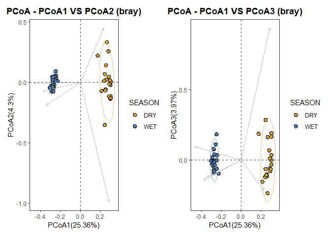

03_ordination_diversity
================
Daniel
27/09/2022

``` r
obj <- readRDS('data/final_anal/taxmap_object.rds') #loads the taxmap object created in script 02_metacoder_heat_trees

obj %>%  metacoder::filter_taxa(taxon_names %in% c("Lepidoptera"),#here is to fliter the figure by groups
              subtaxa = TRUE) -> leps #we will create separate files for each order as this simplifies downstream analysis in microbiotaprocess - until I find a way to filter taxa on the mpse object directly.

obj %>%  metacoder::filter_taxa(taxon_names %in% c("Coleoptera"),#here is to fliter the figure by groups
              subtaxa = TRUE) -> coleo
obj %>%  metacoder::filter_taxa(taxon_names %in% c("Diptera"),#here is to fliter the figure by groups
              subtaxa = TRUE) -> dips
obj %>%  metacoder::filter_taxa(taxon_names %in% c("Hymenoptera"),#here is to fliter the figure by groups
              subtaxa = TRUE) -> bees #i know its hymenoptera
obj %>%  metacoder::filter_taxa(taxon_names %in% c("Hemiptera"),#here is to fliter the figure by groups
              subtaxa = TRUE) -> hemi
obj %>%  metacoder::filter_taxa(taxon_names %in% c("Blattodea"),#here is to fliter the figure by groups
              subtaxa = TRUE) -> blats 

sample <- read.csv('data/final_anal/location_ctrl.csv')
```

The chunk above now gave us a filtered taxmap object for each of the
ForestGEO focal Orders (plus Diptera because I think its interesting).
Downstream analysis will make use of these filtered data sets, but we
continue with general info (whole data set) between seasons.

``` r
sample$inv_simp <- diversity(obj$data$tax_data[, sample$sampleID],
                             index = "invsimpson",
                             MARGIN = 2) # What orietation the matrix is in
ggplot(sample, aes(x = SEASON, y = inv_simp)) +
  geom_boxplot()
```

<!-- -->

``` r
anova_result <- aov(inv_simp ~ SEASON, sample)
summary(anova_result)
```

    ##             Df Sum Sq Mean Sq F value Pr(>F)
    ## SEASON       1    438   437.6   2.734  0.106
    ## Residuals   38   6083   160.1

``` r
tukey_result <- HSD.test(anova_result, "SEASON", group = TRUE)
print(tukey_result)
```

    ## $statistics
    ##    MSerror Df     Mean       CV      MSD
    ##   160.0683 38 26.68375 47.41391 8.099304
    ## 
    ## $parameters
    ##    test name.t ntr StudentizedRange alpha
    ##   Tukey SEASON   2         2.862926  0.05
    ## 
    ## $means
    ##     inv_simp      std  r      Min      Max      Q25      Q50      Q75
    ## DRY 23.37606 13.40250 20 2.445791 45.27749 12.73096 23.51409 31.66699
    ## WET 29.99144 11.85367 20 9.674935 52.74017 20.92139 29.40302 35.75742
    ## 
    ## $comparison
    ## NULL
    ## 
    ## $groups
    ##     inv_simp groups
    ## WET 29.99144      a
    ## DRY 23.37606      a
    ## 
    ## attr(,"class")
    ## [1] "group"

``` r
group_data <- tukey_result$groups[order(rownames(tukey_result$groups)),]

pdf("./03_diversity_and_ordination_files/boxplot.pdf")
ggplot(sample, aes(x = SEASON, y = inv_simp)) +
  geom_text(data = data.frame(),
            aes(x = rownames(group_data), y = max(sample$inv_simp) + 1, label = group_data$groups),
            col = 'black',
            size = 10) +
  geom_boxplot() +
  ggtitle("Inverse Simpson diversity") +
  xlab("Season") +
  ylab("Inverse simpson index")
dev.off()
```

    ## png 
    ##   2

We can also see differences between sampling days or location (site)
although there are none.

``` r
ggplot(sample, aes(x = day, y = inv_simp)) +
  geom_boxplot()
```

<!-- -->

``` r
anova_result <- aov(inv_simp ~ day, sample)
summary(anova_result)
```

    ##             Df Sum Sq Mean Sq F value Pr(>F)
    ## day          1    151   151.2   0.902  0.348
    ## Residuals   38   6369   167.6

``` r
tukey_result_day <- HSD.test(anova_result, "day", group = TRUE)
print(tukey_result_day)
```

    ## $statistics
    ##    MSerror Df     Mean       CV      MSD
    ##   167.6056 38 26.68375 48.51738 8.287801
    ## 
    ## $parameters
    ##    test name.t ntr StudentizedRange alpha
    ##   Tukey    day   2         2.862926  0.05
    ## 
    ## $means
    ##   inv_simp      std  r      Min      Max      Q25      Q50      Q75
    ## A 24.73943 12.15789 20 2.445791 51.99838 16.78395 24.49288 34.21293
    ## B 28.62807 13.68930 20 2.486889 52.74017 21.72730 30.26043 37.38596
    ## 
    ## $comparison
    ## NULL
    ## 
    ## $groups
    ##   inv_simp groups
    ## B 28.62807      a
    ## A 24.73943      a
    ## 
    ## attr(,"class")
    ## [1] "group"

``` r
ggplot(sample, aes(x = site, y = inv_simp)) +
  geom_boxplot()
```

<!-- -->

``` r
anova_result <- aov(inv_simp ~ site, sample)
summary(anova_result)
```

    ##             Df Sum Sq Mean Sq F value Pr(>F)
    ## site         9   1505   167.3   1.001  0.461
    ## Residuals   30   5015   167.2

``` r
tukey_result_site <- HSD.test(anova_result, "site", group = TRUE)
print(tukey_result_site)
```

    ## $statistics
    ##    MSerror Df     Mean       CV      MSD
    ##   167.1642 30 26.68375 48.45346 31.18615
    ## 
    ## $parameters
    ##    test name.t ntr StudentizedRange alpha
    ##   Tukey   site  10         4.824141  0.05
    ## 
    ## $means
    ##      inv_simp       std r       Min      Max      Q25      Q50      Q75
    ## ARM1 15.84491  7.688075 4  6.092521 24.09424 12.05617 16.59644 20.38518
    ## ARM2 26.05321 20.594880 4  2.486889 52.74017 18.93156 24.49288 31.61453
    ## ARM3 37.71119  8.746464 4 26.519972 45.27749 32.90024 39.52364 44.33459
    ## ARM4 30.37807  6.860571 4 21.069352 36.75058 27.50618 31.84617 34.71806
    ## BAL1 22.28716  7.292670 4 13.112842 30.20629 18.63633 22.91476 26.56560
    ## DRA1 30.28640 20.633433 4  2.445791 51.99838 23.79305 33.35072 39.84408
    ## WHE1 33.72469  8.767138 4 22.143898 43.33647 30.79051 34.70920 37.64338
    ## WHE2 26.09281 15.159544 4  9.674935 43.05749 15.69167 25.81941 36.22055
    ## ZET1 23.02996  8.852959 4 10.698739 30.31456 19.63598 25.55326 28.94724
    ## ZET2 21.42911 14.172081 4 11.585331 42.16589 12.74212 15.98260 24.66959
    ## 
    ## $comparison
    ## NULL
    ## 
    ## $groups
    ##      inv_simp groups
    ## ARM3 37.71119      a
    ## WHE1 33.72469      a
    ## ARM4 30.37807      a
    ## DRA1 30.28640      a
    ## WHE2 26.09281      a
    ## ARM2 26.05321      a
    ## ZET1 23.02996      a
    ## BAL1 22.28716      a
    ## ZET2 21.42911      a
    ## ARM1 15.84491      a
    ## 
    ## attr(,"class")
    ## [1] "group"

``` r
group_data_day <- tukey_result_day$groups[order(rownames(tukey_result_day$groups)),]
ggplot(sample, aes(x = day, y = inv_simp)) +
  geom_text(data = data.frame(),
            aes(x = rownames(group_data_day), y = max(sample$inv_simp) + 1, label = group_data_day$groups),
            col = 'black',
            size = 10) +
  geom_boxplot() +
  ggtitle("Inverse Simpson diversity") +
  xlab("Day") +
  ylab("Inverse simpson index")
```

<!-- -->

``` r
group_data_site <- tukey_result_site$groups[order(rownames(tukey_result_site$groups)),]
ggplot(sample, aes(x = site, y = inv_simp)) +
  geom_text(data = data.frame(),
            aes(x = rownames(group_data_site), y = max(sample$inv_simp) + 1, label = group_data_site$groups),
            col = 'black',
            size = 10) +
  geom_boxplot() +
  ggtitle("Inverse Simpson diversity") +
  xlab("site") +
  ylab("Inverse simpson index")
```

<!-- -->

We can also calculate several diversity metrics for sampling season and
day using phyloseq but we must convert the taxmap object ‘obj’ to
phyloseq

``` r
ps_obj <- metacoder::as_phyloseq(obj,
                      otu_table = "tax_data",
                      otu_id_col = "bin_uri",
                      sample_data = sample,
                      sample_id_col = "sampleID")

#normally, I load every package I need at the start of the script, but this causes function masking problems (e.g. both MicrobiotaProcess and Metacoder have a 'as_phyloseq' function and you have to specify to R which package you want to use -  see above: metacoder::as_phyloseq - this means I am telling R to use the 'as_phyloseq' function from the metacoder package)

plot_richness(ps_obj, color = "SEASON", x = "site") #phyloseq function
```

<!-- -->

``` r
plot_richness(ps_obj, color = "day", x = "SEASON")
```

<!-- -->

Figures above OK but we can do better. I am using the MicrobiotaProcess
next

``` r
alphaobj <- get_alphaindex(ps_obj)
p_alpha <- ggbox(alphaobj, geom="violin", factorNames="SEASON", indexNames = c('Observe', 'Shannon', 'Simpson'),  signifmap = TRUE) +
  scale_fill_manual(values=c("goldenrod", "steelblue"))+
  theme(strip.background = element_rect(colour=NA, fill="grey"))
```

    ## The color has been set automatically, you can reset it manually by adding scale_fill_manual(values=yourcolors)

``` r
pdf("./03_diversity_and_ordination_files/diversity_indices_season.pdf")
p_alpha
```

    ## Warning in wilcox.test.default(c(314, 308, 278, 314, 377, 459, 421, 437, :
    ## cannot compute exact p-value with ties

``` r
dev.off()
```

    ## png 
    ##   2

And look at rarefaction curves for both seasons: These are rarefaction
curves of species (Y) and number of reads (X) - tells you how many read
coverage you need to capture most diversity.

``` r
alphaobj <- get_alphaindex(ps_obj)
head(as.data.frame(alphaobj))
```

    ##          Observe    Chao1      ACE  Shannon   Simpson         J site day SEASON
    ## ARM1ADRY     313 430.5000 430.8782 3.782410 0.9466683 0.6582451 ARM1   A    DRY
    ## ARM1AWET     409 553.5581 544.6192 4.022198 0.9263859 0.6688375 ARM1   A    WET
    ## ARM1BDRY     293 414.5357 403.4284 3.236113 0.8359596 0.5697209 ARM1   B    DRY
    ## ARM1BWET     452 551.6207 561.2909 4.278492 0.9593714 0.6998224 ARM1   B    WET
    ## ARM2ADRY     281 492.6364 440.2936 3.846407 0.9590294 0.6821860 ARM2   A    DRY
    ## ARM2AWET     554 775.0339 734.2326 4.326645 0.9589834 0.6849030 ARM2   A    WET
    ##           inv_simp
    ## ARM1ADRY 19.148833
    ## ARM1AWET 14.044054
    ## ARM1BDRY  6.092521
    ## ARM1BWET 24.094237
    ## ARM2ADRY 24.413118
    ## ARM2AWET 24.572652

``` r
rareres <- get_rarecurve(obj=ps_obj, chunks=400)

prare2 <- ggrarecurve(obj=rareres,
                      factorNames="SEASON",
                      shadow=FALSE,
                      indexNames="Observe"
) +
  scale_color_manual(values=c("goldenrod", "steelblue"))+
  theme_bw()+
  theme(axis.text=element_text(size=8), panel.grid=element_blank(),
        strip.background = element_rect(colour=NA,fill="grey"),
        strip.text.x = element_text(face="bold"))
```

    ## The color has been set automatically, you can reset it manually by adding scale_color_manual(values=yourcolors)

``` r
pdf("./03_diversity_and_ordination_files/season_rarefaction.pdf")
prare2
dev.off()
```

    ## png 
    ##   2

We can also do a Principal Coordinate Analysis to see not only the
differences between seasons, but what BINs are the main drivers of these
differences

``` r
# distmethod
# "unifrac",  "wunifrac", "manhattan", "euclidean", "canberra", "bray", "kulczynski" ...(vegdist, dist)
pcoares <- get_pcoa(obj=ps_obj, distmethod="bray", method="hellinger")
# Visualizing the result
pcoaplot1 <- ggordpoint(obj=pcoares, biplot=TRUE, speciesannot=FALSE,
                        factorNames=c("SEASON"), ellipse=TRUE) +
  scale_color_manual(values=c("goldenrod", "steelblue")) +
  scale_fill_manual(values=c("goldenrod", "steelblue"))
# first and third principal co-ordinates
pcoaplot2 <- ggordpoint(obj=pcoares, pc=c(1, 3), biplot=TRUE, speciesannot=FALSE,
                        factorNames=c("SEASON"), ellipse=TRUE) +
  scale_color_manual(values=c("goldenrod", "steelblue")) +
  scale_fill_manual(values=c("goldenrod", "steelblue"))

pdf("./03_diversity_and_ordination_files/pcoa_2_axis.pdf")
pcoaplot1 
dev.off()
```

    ## png 
    ##   2

``` r
pdf("./03_diversity_and_ordination_files/pcoa_3_axis.pdf")
pcoaplot2
dev.off()
```

    ## png 
    ##   2

``` r
pcoaplot1 | pcoaplot2
```

<!-- -->

Next we will see which are the most frequent taxa (in terms of reads) We
can edit this polot with two important compontents: taxlevel and topn
taxlevel means the level of taxonomic resolution for the filtering
kingdom:phyllum:class:order:family:genus:species topn mean the number of
the most abundant taxa you want to include e.g. top 10 - be aware that
the color may mess up if you choose a large number

``` r
classtaxa <- get_taxadf(obj=ps_obj, taxlevel=4)
# The 10 most abundant taxonomy will be visualized by default (parameter `topn=10`). 
pclass <- ggbartax(obj=classtaxa, facetNames="SEASON", topn=5) +
  xlab(NULL) +
  ylab("relative abundance (%)") +
  scale_fill_manual(values=c(colorRampPalette(RColorBrewer::brewer.pal(12,"Set3"))(21))) +
  guides(fill= guide_legend(keyw0idth = 0.5, keyheight = 0.5))
```

    ## The color has been set automatically, you can reset it 
    ##             manually by adding scale_fill_manual(values=yourcolors)

    ## Scale for 'fill' is already present. Adding another scale for 'fill', which
    ## will replace the existing scale.

``` r
#note the flag "count=TRUE", this shows now total reads, rather than proportion %
pclass2 <- ggbartax(obj=classtaxa, count=TRUE, facetNames="SEASON", topn=5) +
  xlab(NULL) +
  ylab("count reads") +
  scale_fill_manual(values=c(colorRampPalette(RColorBrewer::brewer.pal(12,"Set3"))(31))) +
  guides(fill= guide_legend(keywidth = 0.5, keyheight = 0.5))
```

    ## The color has been set automatically, you can reset it 
    ##             manually by adding scale_fill_manual(values=yourcolors)
    ## Scale for 'fill' is already present. Adding another scale for 'fill', which
    ## will replace the existing scale.

``` r
pdf("./03_diversity_and_ordination_files/relative_abundance_top5_order.pdf")
pclass
dev.off()
```

    ## png 
    ##   2

``` r
pdf("./03_diversity_and_ordination_files/count_reads_top5_order.pdf")
pclass2
dev.off()
```

    ## png 
    ##   2

``` r
pclass | pclass2
```

<!-- -->

``` r
classtaxa_fam <- get_taxadf(obj=ps_obj, taxlevel=5)
# The 10 most abundant taxonomy will be visualized by default (parameter `topn=10`). 
pclass_fam <- ggbartax(obj=classtaxa_fam, facetNames="SEASON", topn=20) +
  xlab(NULL) +
  ylab("relative abundance (%)") +
  scale_fill_manual(values=c(colorRampPalette(RColorBrewer::brewer.pal(11,"Set3"))(51))) +
  guides(fill= guide_legend(keywidth = 0.5, keyheight = 0.5))
```

    ## The color has been set automatically, you can reset it 
    ##             manually by adding scale_fill_manual(values=yourcolors)
    ## Scale for 'fill' is already present. Adding another scale for 'fill', which
    ## will replace the existing scale.

``` r
pdf("./03_diversity_and_ordination_files/relative_agundance_top20_family.pdf")
pclass_fam
dev.off()
```

    ## png 
    ##   2

``` r
pclass | pclass_fam | pclass2
```

<!-- -->

These following chunks might be best to compare metabarcoding vs
traditional data but its OK to visualize below. Way too many species
difference between both sampling strategies and so the plots are messy -
after Kruskal, Wilcox and LDA, 264 taxa discriminate between wet and dry
seasons.

``` r
#'coin' package used for kruskal and wilcox test
# Since the effect size was calculated by randomly re-sampling, 
# the seed should be set for reproducibly results.
set.seed(1024)
deres <- diff_analysis(obj = ps_obj, classgroup = "SEASON",
                       mlfun = "lda",
                       filtermod = "pvalue",
                       firstcomfun = "kruskal_test",
                       firstalpha = 0.05,
                       strictmod = TRUE,
                       secondcomfun = "wilcox_test",
                       subclmin = 3,
                       subclwilc = TRUE,
                       secondalpha = 0.01,
                       lda=3,
                       action = "add")
deres
```

    ## The original data: 3863 features and 40 samples
    ## The sample data: 1 variables and 40 samples
    ## The taxda contained 4622 by 7 rank
    ## after first test (kruskal_test) number of feature (pvalue<=0.05):1115
    ## after second test (wilcox_test and generalizedFC) number of significantly discriminative feature:732
    ## after lda, Number of discriminative features: 228 (certain taxonomy classification:176; uncertain taxonomy classication: 52)

this figure gives you a cladogram of all the BINs (based on taxonomy)
and highlight which species/genera/orders are different between
treatments, in this case seasons

``` r
diffclade_p <- ggdiffclade(
  obj=deres, 
  alpha=0.5, 
  linewd=0.01,
  skpointsize=0.05, 
  layout="radial",
  cladetext = 0.4,
  taxlevel=4, #taxonomy level from 1 to 8 kingdom:phylum:class:order:family:subfamily:genus:species
  removeUnkown=TRUE,
  reduce=TRUE # This argument is to remove the branch of unknown taxonomy.
) +
  scale_fill_manual(
    values=c("goldenrod", "steelblue")
  ) +
  guides(color = guide_legend(
    keywidth = 0.1, 
    keyheight = 0.6,
    order = 5,
    ncol=3)
  ) +
  theme(
    panel.background=element_rect(fill=NA),
    legend.position="right", 
    plot.margin=margin(0,0,0,0),
    legend.spacing.y=unit(0.02, "cm"), 
    legend.title=element_text(size=7),
    legend.text=element_text(size=6), 
    legend.box.spacing=unit(0.02,"cm")
  )
```

    ## The `removeUnkown` has been deprecated, Please use `removeUnknown` instead!

    ## The color has been set automatically, you can reset it manually by adding scale_fill_manual(values=yourcolors)

    ## Scale for 'fill' is already present. Adding another scale for 'fill', which
    ## will replace the existing scale.

``` r
pdf("./03_diversity_and_ordination_files/diffclade_all.pdf")
diffclade_p
dev.off()
```

    ## png 
    ##   2

We can also create boxplots for families - this one which includes
everything is very messy. In the next script we repeat these analyses
but for FOCAL orders only.

``` r
ps_obj %>% as.MPSE() %>% mp_rrarefy() %>% mp_diff_analysis(.abundance=RareAbundance, .group=SEASON, action='get') %>% dplyr::filter(grepl("^f__", f)) %>% ggdiffbox(colorlist=c("steelblue", "goldenrod"), notch = FALSE) -> ggdiffbox_family
```

    ## The otutree is empty in the MPSE object!

    ## The color has been set automatically, you can reset it manually by adding scale_color_manual(values=yourcolors)

    ## Scale for 'colour' is already present. Adding another scale for 'colour',
    ## which will replace the existing scale.

``` r
pdf("./03_diversity_and_ordination_files/ggdiffbox_family.pdf")
ggdiffbox_family
```

    ## notch went outside hinges. Try setting notch=FALSE.

    ## notch went outside hinges. Try setting notch=FALSE.
    ## notch went outside hinges. Try setting notch=FALSE.
    ## notch went outside hinges. Try setting notch=FALSE.
    ## notch went outside hinges. Try setting notch=FALSE.
    ## notch went outside hinges. Try setting notch=FALSE.
    ## notch went outside hinges. Try setting notch=FALSE.
    ## notch went outside hinges. Try setting notch=FALSE.
    ## notch went outside hinges. Try setting notch=FALSE.
    ## notch went outside hinges. Try setting notch=FALSE.
    ## notch went outside hinges. Try setting notch=FALSE.
    ## notch went outside hinges. Try setting notch=FALSE.
    ## notch went outside hinges. Try setting notch=FALSE.
    ## notch went outside hinges. Try setting notch=FALSE.
    ## notch went outside hinges. Try setting notch=FALSE.
    ## notch went outside hinges. Try setting notch=FALSE.
    ## notch went outside hinges. Try setting notch=FALSE.
    ## notch went outside hinges. Try setting notch=FALSE.
    ## notch went outside hinges. Try setting notch=FALSE.
    ## notch went outside hinges. Try setting notch=FALSE.
    ## notch went outside hinges. Try setting notch=FALSE.
    ## notch went outside hinges. Try setting notch=FALSE.
    ## notch went outside hinges. Try setting notch=FALSE.
    ## notch went outside hinges. Try setting notch=FALSE.
    ## notch went outside hinges. Try setting notch=FALSE.
    ## notch went outside hinges. Try setting notch=FALSE.
    ## notch went outside hinges. Try setting notch=FALSE.
    ## notch went outside hinges. Try setting notch=FALSE.
    ## notch went outside hinges. Try setting notch=FALSE.
    ## notch went outside hinges. Try setting notch=FALSE.
    ## notch went outside hinges. Try setting notch=FALSE.
    ## notch went outside hinges. Try setting notch=FALSE.
    ## notch went outside hinges. Try setting notch=FALSE.
    ## notch went outside hinges. Try setting notch=FALSE.
    ## notch went outside hinges. Try setting notch=FALSE.
    ## notch went outside hinges. Try setting notch=FALSE.
    ## notch went outside hinges. Try setting notch=FALSE.
    ## notch went outside hinges. Try setting notch=FALSE.
    ## notch went outside hinges. Try setting notch=FALSE.
    ## notch went outside hinges. Try setting notch=FALSE.
    ## notch went outside hinges. Try setting notch=FALSE.
    ## notch went outside hinges. Try setting notch=FALSE.
    ## notch went outside hinges. Try setting notch=FALSE.
    ## notch went outside hinges. Try setting notch=FALSE.
    ## notch went outside hinges. Try setting notch=FALSE.
    ## notch went outside hinges. Try setting notch=FALSE.
    ## notch went outside hinges. Try setting notch=FALSE.
    ## notch went outside hinges. Try setting notch=FALSE.
    ## notch went outside hinges. Try setting notch=FALSE.
    ## notch went outside hinges. Try setting notch=FALSE.
    ## notch went outside hinges. Try setting notch=FALSE.

``` r
dev.off()
```

    ## png 
    ##   2

``` r
ps_obj %>% as.MPSE() %>% mp_rrarefy() %>% mp_diff_analysis(.abundance=RareAbundance, .group=SEASON, action='get') %>%
dplyr::filter(grepl("^f__", f)) %>% ggeffectsize(colorlist= c('#daa520', '#4682b4'), notch = FALSE) -> ggeffectsize_family
```

    ## The otutree is empty in the MPSE object!

    ## The color has been set automatically, you can reset it manually by adding scale_color_manual(values=yourcolors)

``` r
pdf("./03_diversity_and_ordination_files/ggeffectsize_family.pdf")
ggeffectsize_family
dev.off()
```

    ## png 
    ##   2

``` r
ps_obj %>% as.MPSE() %>% mp_rrarefy() %>% mp_diff_analysis(.abundance=RareAbundance, .group=SEASON, action='get') %>% dplyr::filter(grepl("^o__", f)) %>% ggdiffbox(colorlist=c("goldenrod", "steelblue"), notch = FALSE) -> ggdiffbox_order
```

    ## The otutree is empty in the MPSE object!
    ## The color has been set automatically, you can reset it manually by adding scale_color_manual(values=yourcolors)

    ## Scale for 'colour' is already present. Adding another scale for 'colour',
    ## which will replace the existing scale.

``` r
pdf("./03_diversity_and_ordination_files/ggdiffbox_order.pdf")
ggdiffbox_order
```

    ## notch went outside hinges. Try setting notch=FALSE.

    ## notch went outside hinges. Try setting notch=FALSE.
    ## notch went outside hinges. Try setting notch=FALSE.

``` r
dev.off()
```

    ## png 
    ##   2

``` r
ps_obj %>% as.MPSE() %>% mp_rrarefy() %>% mp_diff_analysis(.abundance=RareAbundance, .group=SEASON, action='get') %>% dplyr::filter(grepl("^o__", f)) %>% ggeffectsize(colorlist=c("steelblue", "goldenrod"), notch = FALSE) -> ggeffectsize_order
```

    ## The otutree is empty in the MPSE object!

    ## The color has been set automatically, you can reset it manually by adding scale_color_manual(values=yourcolors)

``` r
pdf("./03_diversity_and_ordination_files/ggeffectsize_order.pdf")
ggeffectsize_order
dev.off()
```

    ## png 
    ##   2

###### Please pay attention to the code below as it breaks down the code above, but to speed up the process so we don’t have to convert form PS to MPSE to diff_anal. Instead it creates the object ps_obj_rareMPSE which I then used to filter by family and do aeither ggdifbox or ggeffectsize

ps_obj %>% as.MPSE() %>% mp_diff_analysis(.abundance = RareAbundance,
.group = SEASON, action = ‘get’) -> ps_obj_rareMPSE

ps_obj_rareMPSE %>% dplyr::filter(grepl(“^f\_\_“, f)) %>%
ggdiffbox(colorlist = c (”steelblue”, “goldenrod”), notch = FALSE)

ps_obj_rareMPSE %>% dplyr::filter(grepl(“^f\_\_“, f)) %>%
ggeffectsize(colorlist = c (”steelblue”, “goldenrod”), notch = FALSE)
