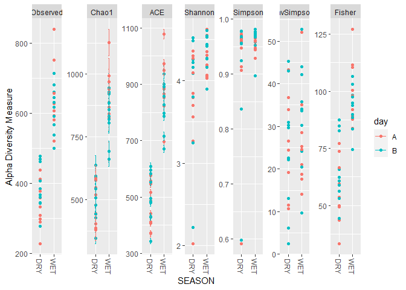
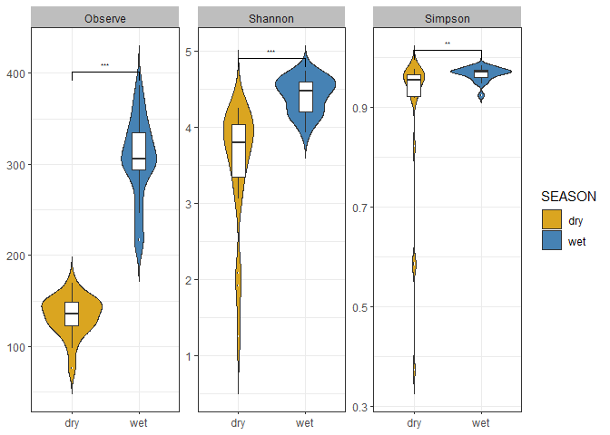
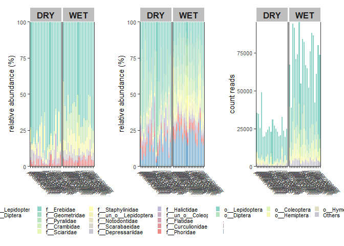

03_ordination_diversity
================
Daniel
27/09/2022

The chunk above now gave us a filtered taxmap object for each of the
ForestGEO focal groups (plus Diptera because I think its interesting).
Downstream analysis will make use of these filtered data sets, but we
continue with general info (whole data set) between seasons.

``` r
sample$inv_simp <- diversity(obj$data$tax_data[, sample$sampleID],
                             index = "invsimpson",
                             MARGIN = 2) # What orietation the matrix is in
ggplot(sample, aes(x = SEASON, y = inv_simp)) +
  geom_boxplot()
```

<!-- -->

``` r
anova_result <- aov(inv_simp ~ SEASON, sample)
summary(anova_result)
```

    ##             Df Sum Sq Mean Sq F value  Pr(>F)   
    ## SEASON       1   2016  2016.1   12.03 0.00132 **
    ## Residuals   38   6367   167.6                   
    ## ---
    ## Signif. codes:  0 '***' 0.001 '**' 0.01 '*' 0.05 '.' 0.1 ' ' 1

``` r
tukey_result <- HSD.test(anova_result, "SEASON", group = TRUE)
print(tukey_result)
```

    ## $statistics
    ##    MSerror Df     Mean       CV      MSD
    ##   167.5525 38 28.50982 45.40263 8.286489
    ## 
    ## $parameters
    ##    test name.t ntr StudentizedRange alpha
    ##   Tukey SEASON   2         2.862926  0.05
    ## 
    ## $means
    ##     inv_simp      std  r      Min      Max      Q25      Q50      Q75
    ## dry 21.41030 12.79590 20  1.60373 42.04263 12.96907 21.89135 29.49382
    ## wet 35.60933 13.09084 20 13.15428 63.56903 25.95842 34.52925 39.43509
    ## 
    ## $comparison
    ## NULL
    ## 
    ## $groups
    ##     inv_simp groups
    ## wet 35.60933      a
    ## dry 21.41030      b
    ## 
    ## attr(,"class")
    ## [1] "group"

``` r
group_data <- tukey_result$groups[order(rownames(tukey_result$groups)),]
ggplot(sample, aes(x = SEASON, y = inv_simp)) +
  geom_text(data = data.frame(),
            aes(x = rownames(group_data), y = max(sample$inv_simp) + 1, label = group_data$groups),
            col = 'black',
            size = 10) +
  geom_boxplot() +
  ggtitle("Inverse Simpson diversity") +
  xlab("Season") +
  ylab("Inverse simpson index")
```

<!-- -->

We can also see differences between sampling days although there is
none.

``` r
ggplot(sample, aes(x = day, y = inv_simp)) +
  geom_boxplot()
```

<!-- -->

``` r
anova_result <- aov(inv_simp ~ day, sample)
summary(anova_result)
```

    ##             Df Sum Sq Mean Sq F value Pr(>F)
    ## day          1    373   373.2   1.771  0.191
    ## Residuals   38   8010   210.8

``` r
tukey_result_day <- HSD.test(anova_result, "day", group = TRUE)
print(tukey_result_day)
```

    ## $statistics
    ##    MSerror Df     Mean       CV      MSD
    ##   210.7874 38 28.50982 50.92463 9.294315
    ## 
    ## $parameters
    ##    test name.t ntr StudentizedRange alpha
    ##   Tukey    day   2         2.862926  0.05
    ## 
    ## $means
    ##   inv_simp      std  r      Min      Max      Q25      Q50      Q75
    ## a 25.45531 14.36608 20 1.603730 63.56903 16.44972 24.37844 33.53528
    ## b 31.56432 14.66937 20 2.395061 57.13042 24.14642 32.29192 39.60799
    ## 
    ## $comparison
    ## NULL
    ## 
    ## $groups
    ##   inv_simp groups
    ## b 31.56432      a
    ## a 25.45531      a
    ## 
    ## attr(,"class")
    ## [1] "group"

``` r
group_data_day <- tukey_result_day$groups[order(rownames(tukey_result_day$groups)),]
ggplot(sample, aes(x = day, y = inv_simp)) +
  geom_text(data = data.frame(),
            aes(x = rownames(group_data_day), y = max(sample$inv_simp) + 1, label = group_data_day$groups),
            col = 'black',
            size = 10) +
  geom_boxplot() +
  ggtitle("Inverse Simpson diversity") +
  xlab("Day") +
  ylab("Inverse simpson index")
```

<!-- -->

We can also calculate several diversity metrics for sampling season and
day using phyloseq but we must convert the taxmap object ‘obj’ to
phyloseq

``` r
ps_obj <- metacoder::as_phyloseq(obj,
                      otu_table = "tax_data",
                      otu_id_col = "bin_uri",
                      sample_data = sample,
                      sample_id_col = "sampleID")

#normally, I load every package I need at the start of the script, but this may cause function masking problems (e.g. both MicrobiotaProcess and Metacoder have a 'as_phyloseq' function and you have to specify to R which package you want to use -  see above: metacoder::as_phyloseq - this means I am telling R to use the 'as_phyloseq' function from the metacoder package)

plot_richness(ps_obj, color = "SEASON", x = "site") #phyloseq function
```

    ## Warning in estimate_richness(physeq, split = TRUE, measures = measures): The data you have provided does not have
    ## any singletons. This is highly suspicious. Results of richness
    ## estimates (for example) are probably unreliable, or wrong, if you have already
    ## trimmed low-abundance taxa from the data.
    ## 
    ## We recommended that you find the un-trimmed data and retry.

<!-- -->

``` r
plot_richness(ps_obj, color = "day", x = "SEASON")
```

    ## Warning in estimate_richness(physeq, split = TRUE, measures = measures): The data you have provided does not have
    ## any singletons. This is highly suspicious. Results of richness
    ## estimates (for example) are probably unreliable, or wrong, if you have already
    ## trimmed low-abundance taxa from the data.
    ## 
    ## We recommended that you find the un-trimmed data and retry.

<!-- -->

Figures above OK but we can do better. I am using the MicrobiotaProcess
next

``` r
alphaobj <- get_alphaindex(ps_obj)
p_alpha <- ggbox(alphaobj, geom="violin", factorNames="SEASON", indexNames = c('Observe', 'Shannon', 'Simpson'),  signifmap = TRUE) +
  scale_fill_manual(values=c("goldenrod", "steelblue"))+
  theme(strip.background = element_rect(colour=NA, fill="grey"))
```

    ## The color has been set automatically, you can reset it manually by adding scale_fill_manual(values=yourcolors)

``` r
p_alpha
```

    ## Warning in wilcox.test.default(c(126, 139, 111, 132, 132, 149, 145, 156, :
    ## cannot compute exact p-value with ties

<!-- -->
And look at rarefaction curves for both seasons:

``` r
alphaobj <- get_alphaindex(ps_obj)
head(as.data.frame(alphaobj))
```

    ##       Observe Chao1      ACE  Shannon   Simpson         J site day SEASON
    ## ARM1A     126   126 126.0000 3.619239 0.9436772 0.7483516 ARM1   a    dry
    ## ARM1B     139   139 139.0000 3.050564 0.8212502 0.6182147 ARM1   b    dry
    ## ARM2A     111   111 111.0000 3.689905 0.9561525 0.7834974 ARM2   a    dry
    ## ARM2B     132   132 132.1678 2.066035 0.5867035 0.4231249 ARM2   b    dry
    ## ARM3A     132   132 132.0000 3.901274 0.9599091 0.7989826 ARM3   a    dry
    ## ARM3B     149   149 149.0000 4.231994 0.9762900 0.8457313 ARM3   b    dry
    ##        inv_simp
    ## ARM1A 17.531036
    ## ARM1B  5.591829
    ## ARM2A 22.774330
    ## ARM2B  2.395061
    ## ARM3A 24.943300
    ## ARM3B 42.042631

``` r
rareres <- get_rarecurve(obj=ps_obj, chunks=400)

prare2 <- ggrarecurve(obj=rareres,
                      factorNames="SEASON",
                      shadow=FALSE,
                      indexNames="Observe"
) +
  scale_color_manual(values=c("goldenrod", "steelblue"))+
  theme_bw()+
  theme(axis.text=element_text(size=8), panel.grid=element_blank(),
        strip.background = element_rect(colour=NA,fill="grey"),
        strip.text.x = element_text(face="bold"))
```

    ## The color has been set automatically, you can reset it manually by adding scale_color_manual(values=yourcolors)

``` r
prare2
```

<!-- -->

We can also do a Principal Coordinate Analysis to see not only the
differences between seasons, but what BINs are the main drivers of these
differences

``` r
# distmethod
# "unifrac",  "wunifrac", "manhattan", "euclidean", "canberra", "bray", "kulczynski" ...(vegdist, dist)
pcoares <- get_pcoa(obj=ps_obj, distmethod="bray", method="hellinger")
# Visualizing the result
pcoaplot1 <- ggordpoint(obj=pcoares, biplot=TRUE, speciesannot=TRUE,
                        factorNames=c("SEASON"), ellipse=TRUE) +
  scale_color_manual(values=c("goldenrod", "steelblue")) +
  scale_fill_manual(values=c("goldenrod", "steelblue"))
# first and third principal co-ordinates
pcoaplot2 <- ggordpoint(obj=pcoares, pc=c(1, 3), biplot=TRUE, speciesannot=TRUE,
                        factorNames=c("SEASON"), ellipse=TRUE) +
  scale_color_manual(values=c("goldenrod", "steelblue")) +
  scale_fill_manual(values=c("goldenrod", "steelblue"))

pcoaplot1 
```

<!-- -->

``` r
pcoaplot2
```

<!-- -->

``` r
pcoaplot1 | pcoaplot2
```

<!-- -->

``` r
classtaxa <- get_taxadf(obj=ps_obj, taxlevel=4)
# The 10 most abundant taxonomy will be visualized by default (parameter `topn=10`). 
pclass <- ggbartax(obj=classtaxa, facetNames="SEASON", topn=10) +
  xlab(NULL) +
  ylab("relative abundance (%)") +
  scale_fill_manual(values=c(colorRampPalette(RColorBrewer::brewer.pal(12,"Set3"))(31))) +
  guides(fill= guide_legend(keywidth = 0.5, keyheight = 0.5))
```

    ## The color has been set automatically, you can reset it 
    ##             manually by adding scale_fill_manual(values=yourcolors)

    ## Scale for 'fill' is already present. Adding another scale for 'fill', which
    ## will replace the existing scale.

``` r
#note the flag "count=TRUE", this shows now total reads, rather than proportion %
pclass2 <- ggbartax(obj=classtaxa, count=TRUE, facetNames="SEASON", topn=10) +
  xlab(NULL) +
  ylab("count reads") +
  scale_fill_manual(values=c(colorRampPalette(RColorBrewer::brewer.pal(12,"Set3"))(31))) +
  guides(fill= guide_legend(keywidth = 0.5, keyheight = 0.5))
```

    ## The color has been set automatically, you can reset it 
    ##             manually by adding scale_fill_manual(values=yourcolors)
    ## Scale for 'fill' is already present. Adding another scale for 'fill', which
    ## will replace the existing scale.

``` r
pclass
```

<!-- -->

``` r
pclass2
```

<!-- -->

These following chunks might be best to compare metabarcoding vs
traditional data but its OK to visualize below. Way too many species
difference between both sampling strategies and so the plots are messy -
after Kruskal, Wilcox and LDA, 264 taxa discriminate between wet and dry
seasons.

``` r
library('coin')#for kruskal and wilcox test
```

    ## Loading required package: survival

``` r
# Since the effect size was calculated by randomly re-sampling, 
# the seed should be set for reproducibly results.
set.seed(1024)
deres <- diff_analysis(obj = ps_obj, classgroup = "SEASON",
                       mlfun = "lda",
                       filtermod = "pvalue",
                       firstcomfun = "kruskal_test",
                       firstalpha = 0.05,
                       strictmod = TRUE,
                       secondcomfun = "wilcox_test",
                       subclmin = 3,
                       subclwilc = TRUE,
                       secondalpha = 0.01,
                       lda=3,
                       action = "add")
deres
```

    ## The original data: 2572 features and 40 samples
    ## The sample data: 1 variables and 40 samples
    ## The taxda contained 2236 by 7 rank
    ## after first test (kruskal_test) number of feature (pvalue<=0.05):630
    ## after second test (wilcox_test and generalizedFC) number of significantly discriminative feature:425
    ## after lda, Number of discriminative features: 205 (certain taxonomy classification:154; uncertain taxonomy classication: 51)

``` r
diffclade_p <- ggdiffclade(
  obj=deres, 
  alpha=0.2, 
  linewd=0.15,
  skpointsize=0.2, 
  layout="radial",
  cladetext = 0.7,
  taxlevel=4, #taxonomy level from 1 to 8 kingdome:phylum:class:order:family:subfamily:genus:species
  removeUnkown=TRUE,
  reduce=TRUE # This argument is to remove the branch of unknown taxonomy.
) +
  scale_fill_manual(
    values=c("goldenrod", "steelblue")
  ) +
  guides(color = guide_legend(
    keywidth = 0.1, 
    keyheight = 0.6,
    order = 5,
    ncol=3)
  ) +
  theme(
    panel.background=element_rect(fill=NA),
    legend.position="right", 
    plot.margin=margin(0,0,0,0),
    legend.spacing.y=unit(0.02, "cm"), 
    legend.title=element_text(size=7),
    legend.text=element_text(size=6), 
    legend.box.spacing=unit(0.02,"cm")
  )
```

    ## The `removeUnkown` has been deprecated, Please use `removeUnknown` instead!

    ## The color has been set automatically, you can reset it manually by adding scale_fill_manual(values=yourcolors)

    ## Scale for 'fill' is already present. Adding another scale for 'fill', which
    ## will replace the existing scale.

``` r
diffclade_p
```

<!-- -->

``` r
ps_obj %>% as.MPSE() %>% mp_rrarefy() %>% mp_diff_analysis(.abundance=RareAbundance, .group=SEASON, action='get') %>% dplyr::filter(grepl("^f__", f)) %>% ggdiffbox(colorlist=c("steelblue", "goldenrod"), notch = FALSE)
```

    ## The otutree is empty in the MPSE object!

    ## The color has been set automatically, you can reset it manually by adding scale_color_manual(values=yourcolors)

    ## Scale for 'colour' is already present. Adding another scale for 'colour',
    ## which will replace the existing scale.

    ## notch went outside hinges. Try setting notch=FALSE.
    ## notch went outside hinges. Try setting notch=FALSE.
    ## notch went outside hinges. Try setting notch=FALSE.
    ## notch went outside hinges. Try setting notch=FALSE.
    ## notch went outside hinges. Try setting notch=FALSE.
    ## notch went outside hinges. Try setting notch=FALSE.
    ## notch went outside hinges. Try setting notch=FALSE.
    ## notch went outside hinges. Try setting notch=FALSE.
    ## notch went outside hinges. Try setting notch=FALSE.
    ## notch went outside hinges. Try setting notch=FALSE.
    ## notch went outside hinges. Try setting notch=FALSE.
    ## notch went outside hinges. Try setting notch=FALSE.
    ## notch went outside hinges. Try setting notch=FALSE.
    ## notch went outside hinges. Try setting notch=FALSE.
    ## notch went outside hinges. Try setting notch=FALSE.
    ## notch went outside hinges. Try setting notch=FALSE.
    ## notch went outside hinges. Try setting notch=FALSE.
    ## notch went outside hinges. Try setting notch=FALSE.
    ## notch went outside hinges. Try setting notch=FALSE.
    ## notch went outside hinges. Try setting notch=FALSE.
    ## notch went outside hinges. Try setting notch=FALSE.
    ## notch went outside hinges. Try setting notch=FALSE.
    ## notch went outside hinges. Try setting notch=FALSE.
    ## notch went outside hinges. Try setting notch=FALSE.
    ## notch went outside hinges. Try setting notch=FALSE.
    ## notch went outside hinges. Try setting notch=FALSE.
    ## notch went outside hinges. Try setting notch=FALSE.
    ## notch went outside hinges. Try setting notch=FALSE.
    ## notch went outside hinges. Try setting notch=FALSE.
    ## notch went outside hinges. Try setting notch=FALSE.
    ## notch went outside hinges. Try setting notch=FALSE.
    ## notch went outside hinges. Try setting notch=FALSE.
    ## notch went outside hinges. Try setting notch=FALSE.
    ## notch went outside hinges. Try setting notch=FALSE.
    ## notch went outside hinges. Try setting notch=FALSE.
    ## notch went outside hinges. Try setting notch=FALSE.
    ## notch went outside hinges. Try setting notch=FALSE.
    ## notch went outside hinges. Try setting notch=FALSE.
    ## notch went outside hinges. Try setting notch=FALSE.
    ## notch went outside hinges. Try setting notch=FALSE.
    ## notch went outside hinges. Try setting notch=FALSE.
    ## notch went outside hinges. Try setting notch=FALSE.
    ## notch went outside hinges. Try setting notch=FALSE.
    ## notch went outside hinges. Try setting notch=FALSE.
    ## notch went outside hinges. Try setting notch=FALSE.
    ## notch went outside hinges. Try setting notch=FALSE.

<!-- -->

``` r
ps_obj %>% as.MPSE() %>% mp_rrarefy() %>% mp_diff_analysis(.abundance=RareAbundance, .group=SEASON, action='get') %>% dplyr::filter(grepl("^f__", f)) %>% ggeffectsize(colorlist=c("steelblue", "goldenrod"), notch = FALSE)
```

    ## The otutree is empty in the MPSE object!

    ## The color has been set automatically, you can reset it manually by adding scale_color_manual(values=yourcolors)

<!-- -->

###### Please pay attention to the code below as it breaks down the code above, but to speed up the process so we don’t have to convert form PS to MPSE to diff_anal. Instead it creates the object ps_obj_rareMPSE which I then used to filter by family and do aeither ggdifbox or ggeffectsize

ps_obj %>% as.MPSE() %>% mp_diff_analysis(.abundance = RareAbundance,
.group = SEASON, action = ‘get’) -> ps_obj_rareMPSE

ps_obj_rareMPSE %>% dplyr::filter(grepl(“^f\_\_“, f)) %>%
ggdiffbox(colorlist = c (”steelblue”, “goldenrod”), notch = FALSE)

ps_obj_rareMPSE %>% dplyr::filter(grepl(“^f\_\_“, f)) %>%
ggeffectsize(colorlist = c (”steelblue”, “goldenrod”), notch = FALSE)
