04_focal_order_seasons
================
Daniel
06/10/2022

The script above gave me the taxmap object separated by order, however,
it removes all taxonomic ranks up until “Order”, so the script below is
firstly, changing the taxmap object (e.g. leps) into a phyloseq object
(as_phyloseq) and then using the microViz package to add the taxonomic
ranks.

There must be certainly a cleaner way how to do this without so many
steps, but I then had to change the classification rank names again
(“k\_\_” instead of Kingdom) as this is more friendly with
MicroBiotaProcess. Within the metabarcoding package community, there
seems to have been several issues with the ranks, some have root, some
don’t, some have subfamily, some don’t, so take note of the nomenclature
you are using. I am using
Kingdom;Phylum;Order;Class;Family;genus;species (1 - 7).

If someone knows how to write a loop, this would be faster too.

Ok we now have datasets separated for each order (ForestGEO focal plus
diptera - if we want more, we can adapt the script above to include more
focal groups, or even to refine them) But below we will create now some
taxonomic trees showing differences between seasons (as in the
MessyFigure chunk)

``` r
set.seed(1024)
deresleps <- diff_analysis(obj = ps_leps, classgroup = "SEASON",
                       mlfun = "lda",
                       filtermod = "pvalue",
                       firstcomfun = "kruskal_test",
                       firstalpha = 0.05,
                       strictmod = TRUE,
                       secondcomfun = "wilcox_test",
                       subclmin = 3,
                       subclwilc = TRUE,
                       secondalpha = 0.01,
                       lda=3,
                       action = "add")
deresleps
```

    ## The original data: 1597 features and 40 samples
    ## The sample data: 1 variables and 40 samples
    ## The taxda contained 1170 by 7 rank
    ## after first test (kruskal_test) number of feature (pvalue<=0.05):352
    ## after second test (wilcox_test and generalizedFC) number of significantly discriminative feature:219
    ## after lda, Number of discriminative features: 157 (certain taxonomy classification:140; uncertain taxonomy classication: 17)

``` r
diffclade_leps <- ggdiffclade(
  obj=deresleps, 
  alpha=0.2, 
  linewd=0.15,
  skpointsize=0.2, 
  layout="radial",
  cladetext = 0.7,
  taxlevel=5, #taxonomy level from 1 to 7 kingdom:phylum:class:order:family:genus:species
  removeUnkown=TRUE,
  reduce=TRUE # This argument is to remove the branch of unknown taxonomy.
) +
  scale_fill_manual(
    values=c("orange", "darkcyan")
  ) +
  guides(color = guide_legend(
    keywidth = 0.1, 
    keyheight = 0.6,
    order = 5,
    ncol=3)
  ) +
  theme(
    panel.background=element_rect(fill=NA),
    legend.position="right", 
    plot.margin=margin(0,0,0,0),
    legend.spacing.y=unit(0.02, "cm"), 
    legend.title=element_text(size=7),
    legend.text=element_text(size=6), 
    legend.box.spacing=unit(0.02,"cm")
  )
```

    ## The `removeUnkown` has been deprecated, Please use `removeUnknown` instead!

    ## The color has been set automatically, you can reset it manually by adding scale_fill_manual(values=yourcolors)

    ## Scale for 'fill' is already present. Adding another scale for 'fill', which
    ## will replace the existing scale.

``` r
diffclade_leps
```

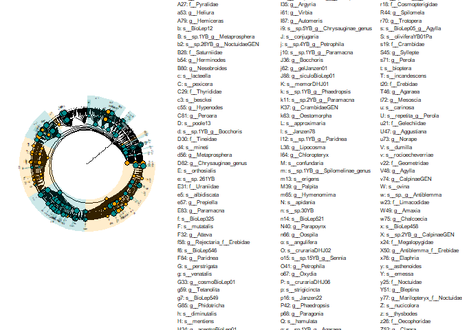<!-- -->

``` r
ps_leps %>% as.MPSE() %>% mp_rrarefy() %>% mp_diff_analysis(.abundance=RareAbundance, .group=SEASON, action='get') %>% dplyr::filter(grepl("^f_", f)) %>% ggdiffbox(colorlist=c("darkcyan", "orange"), notch = FALSE)
```

    ## The otutree is empty in the MPSE object!

    ## The color has been set automatically, you can reset it manually by adding scale_color_manual(values=yourcolors)

    ## Scale for 'colour' is already present. Adding another scale for 'colour',
    ## which will replace the existing scale.

    ## notch went outside hinges. Try setting notch=FALSE.
    ## notch went outside hinges. Try setting notch=FALSE.
    ## notch went outside hinges. Try setting notch=FALSE.
    ## notch went outside hinges. Try setting notch=FALSE.
    ## notch went outside hinges. Try setting notch=FALSE.
    ## notch went outside hinges. Try setting notch=FALSE.
    ## notch went outside hinges. Try setting notch=FALSE.
    ## notch went outside hinges. Try setting notch=FALSE.
    ## notch went outside hinges. Try setting notch=FALSE.
    ## notch went outside hinges. Try setting notch=FALSE.
    ## notch went outside hinges. Try setting notch=FALSE.
    ## notch went outside hinges. Try setting notch=FALSE.
    ## notch went outside hinges. Try setting notch=FALSE.
    ## notch went outside hinges. Try setting notch=FALSE.
    ## notch went outside hinges. Try setting notch=FALSE.
    ## notch went outside hinges. Try setting notch=FALSE.
    ## notch went outside hinges. Try setting notch=FALSE.

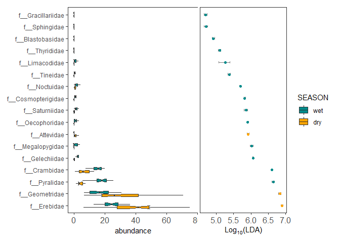<!-- -->

``` r
es_leps <- ggeffectsize(obj=deresleps, 
                     lineheight=0.1,
                     linewidth=0.3, ytextsize = 0.3) + 
  scale_color_manual(values=c("orange", "darkcyan")) 
```

    ## The color has been set automatically, you can reset it manually by adding scale_color_manual(values=yourcolors)

    ## Scale for 'colour' is already present. Adding another scale for 'colour',
    ## which will replace the existing scale.

``` r
es_leps
```

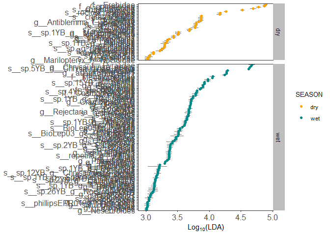<!-- -->

``` r
set.seed(1024)
derescoleo <- diff_analysis(obj = ps_coleo, classgroup = "SEASON",
                       mlfun = "lda",
                       filtermod = "pvalue",
                       firstcomfun = "kruskal_test",
                       firstalpha = 0.05,
                       strictmod = TRUE,
                       secondcomfun = "wilcox_test",
                       subclmin = 3,
                       subclwilc = TRUE,
                       secondalpha = 0.01,
                       lda=3,
                       action = "add")
derescoleo
```

    ## The original data: 275 features and 40 samples
    ## The sample data: 1 variables and 40 samples
    ## The taxda contained 272 by 7 rank
    ## after first test (kruskal_test) number of feature (pvalue<=0.05):87
    ## after second test (wilcox_test and generalizedFC) number of significantly discriminative feature:62
    ## after lda, Number of discriminative features: 62 (certain taxonomy classification:43; uncertain taxonomy classication: 19)

``` r
diffclade_coleo <- ggdiffclade(
  obj=derescoleo, 
  alpha=0.2, 
  linewd=0.15,
  skpointsize=0.2, 
  layout="radial",
  cladetext = 0.7,
  taxlevel=5, #taxonomy level from 1 to 7 kingdome:phylum:class:order:family:genus:species
  removeUnkown=TRUE,
  reduce=TRUE # This argument is to remove the branch of unknown taxonomy.
) +
  scale_fill_manual(
    values=c("orange", "darkcyan")
  ) +
  guides(color = guide_legend(
    keywidth = 0.1, 
    keyheight = 0.6,
    order = 5,
    ncol=3)
  ) +
  theme(
    panel.background=element_rect(fill=NA),
    legend.position="right", 
    plot.margin=margin(0,0,0,0),
    legend.spacing.y=unit(0.02, "cm"), 
    legend.title=element_text(size=7),
    legend.text=element_text(size=6), 
    legend.box.spacing=unit(0.02,"cm")
  )
```

    ## The `removeUnkown` has been deprecated, Please use `removeUnknown` instead!

    ## The color has been set automatically, you can reset it manually by adding scale_fill_manual(values=yourcolors)

    ## Scale for 'fill' is already present. Adding another scale for 'fill', which
    ## will replace the existing scale.

``` r
diffclade_coleo
```

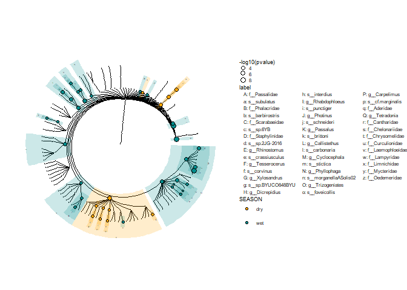<!-- -->

``` r
ps_coleo %>% as.MPSE() %>% mp_rrarefy() %>% mp_diff_analysis(.abundance=RareAbundance, .group=SEASON, action='get') %>% dplyr::filter(grepl("^f_", f)) %>% ggdiffbox(colorlist=c("darkcyan", "orange"), notch = FALSE)
```

    ## The otutree is empty in the MPSE object!

    ## The color has been set automatically, you can reset it manually by adding scale_color_manual(values=yourcolors)

    ## Scale for 'colour' is already present. Adding another scale for 'colour',
    ## which will replace the existing scale.

    ## notch went outside hinges. Try setting notch=FALSE.
    ## notch went outside hinges. Try setting notch=FALSE.
    ## notch went outside hinges. Try setting notch=FALSE.
    ## notch went outside hinges. Try setting notch=FALSE.
    ## notch went outside hinges. Try setting notch=FALSE.
    ## notch went outside hinges. Try setting notch=FALSE.
    ## notch went outside hinges. Try setting notch=FALSE.
    ## notch went outside hinges. Try setting notch=FALSE.
    ## notch went outside hinges. Try setting notch=FALSE.
    ## notch went outside hinges. Try setting notch=FALSE.

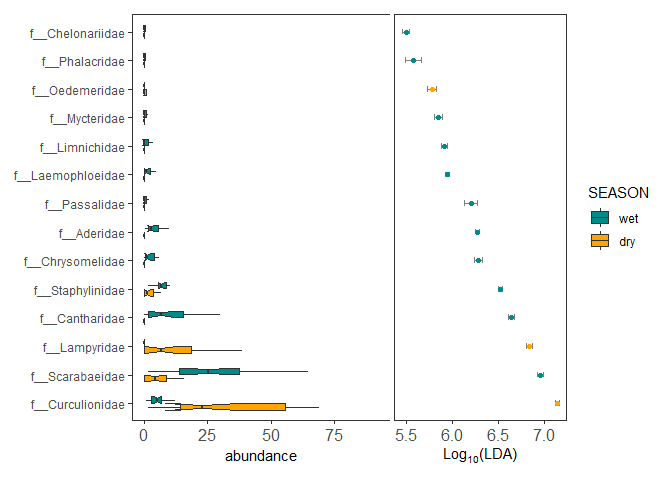<!-- -->

``` r
es_coleo <- ggeffectsize(obj=derescoleo, 
                     lineheight=0.1,
                     linewidth=0.3, ytextsize = 0.3) + 
  scale_color_manual(values=c("orange", "darkcyan")) 
```

    ## The color has been set automatically, you can reset it manually by adding scale_color_manual(values=yourcolors)

    ## Scale for 'colour' is already present. Adding another scale for 'colour',
    ## which will replace the existing scale.

``` r
es_coleo
```

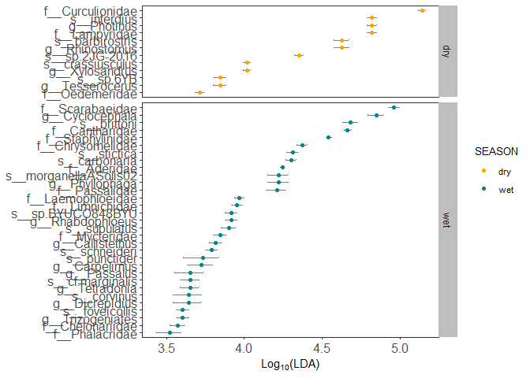<!-- -->

``` r
set.seed(1024)
deresdips <- diff_analysis(obj = ps_dips, classgroup = "SEASON",
                       mlfun = "lda",
                       filtermod = "pvalue",
                       firstcomfun = "kruskal_test",
                       firstalpha = 0.05,
                       strictmod = TRUE,
                       secondcomfun = "wilcox_test",
                       subclmin = 3,
                       subclwilc = TRUE,
                       secondalpha = 0.01,
                       lda=3,
                       action = "add")
deresdips
```

    ## The original data: 259 features and 40 samples
    ## The sample data: 1 variables and 40 samples
    ## The taxda contained 511 by 7 rank
    ## after first test (kruskal_test) number of feature (pvalue<=0.05):73
    ## after second test (wilcox_test and generalizedFC) number of significantly discriminative feature:55
    ## after lda, Number of discriminative features: 51 (certain taxonomy classification:28; uncertain taxonomy classication: 23)

``` r
diffclade_dips <- ggdiffclade(
  obj=deresdips, 
  alpha=0.2, 
  linewd=0.15,
  skpointsize=0.2, 
  layout="radial",
  cladetext = 0.7,
  taxlevel=5, #taxonomy level from 1 to 7 kingdome:phylum:class:order:family:subfamily:genus:species
  removeUnkown=TRUE,
  reduce=TRUE # This argument is to remove the branch of unknown taxonomy.
) +
  scale_fill_manual(
    values=c("orange", "darkcyan")
  ) +
  guides(color = guide_legend(
    keywidth = 0.1, 
    keyheight = 0.6,
    order = 5,
    ncol=3)
  ) +
  theme(
    panel.background=element_rect(fill=NA),
    legend.position="right", 
    plot.margin=margin(0,0,0,0),
    legend.spacing.y=unit(0.02, "cm"), 
    legend.title=element_text(size=7),
    legend.text=element_text(size=6), 
    legend.box.spacing=unit(0.02,"cm")
  )
```

    ## The `removeUnkown` has been deprecated, Please use `removeUnknown` instead!

    ## The color has been set automatically, you can reset it manually by adding scale_fill_manual(values=yourcolors)

    ## Scale for 'fill' is already present. Adding another scale for 'fill', which
    ## will replace the existing scale.

``` r
diffclade_dips
```

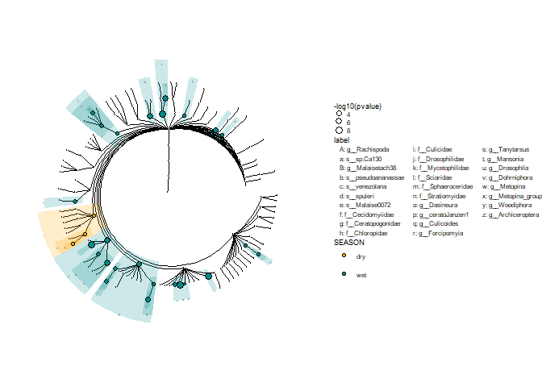<!-- -->

``` r
ps_dips %>% as.MPSE() %>% mp_rrarefy() %>% mp_diff_analysis(.abundance=RareAbundance, .group=SEASON, action='get') %>% dplyr::filter(grepl("^f_", f)) %>% ggdiffbox(colorlist=c("darkcyan", "orange"), notch = FALSE)
```

    ## The otutree is empty in the MPSE object!

    ## The color has been set automatically, you can reset it manually by adding scale_color_manual(values=yourcolors)

    ## Scale for 'colour' is already present. Adding another scale for 'colour',
    ## which will replace the existing scale.

    ## notch went outside hinges. Try setting notch=FALSE.
    ## notch went outside hinges. Try setting notch=FALSE.
    ## notch went outside hinges. Try setting notch=FALSE.

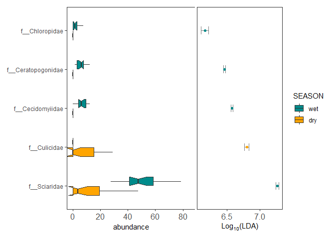<!-- -->

``` r
es_dips <- ggeffectsize(obj=deresdips, 
                     lineheight=0.1,
                     linewidth=0.3, ytextsize = 0.3) + 
  scale_color_manual(values=c("orange", "darkcyan")) 
```

    ## The color has been set automatically, you can reset it manually by adding scale_color_manual(values=yourcolors)

    ## Scale for 'colour' is already present. Adding another scale for 'colour',
    ## which will replace the existing scale.

``` r
es_dips
```

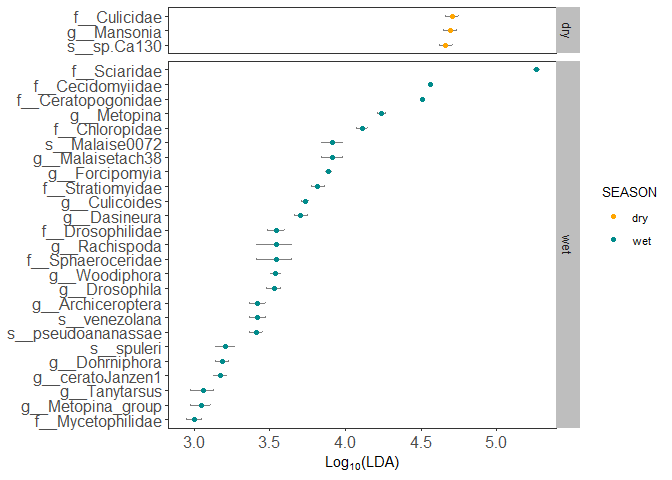<!-- -->

``` r
set.seed(1024)
dereshemi <- diff_analysis(obj = ps_hemi, classgroup = "SEASON",
                       mlfun = "lda",
                       filtermod = "pvalue",
                       firstcomfun = "kruskal_test",
                       firstalpha = 0.05,
                       strictmod = TRUE,
                       secondcomfun = "wilcox_test",
                       subclmin = 3,
                       subclwilc = TRUE,
                       secondalpha = 0.01,
                       lda=3,
                       action = "add")
dereshemi
```

    ## The original data: 158 features and 40 samples
    ## The sample data: 1 variables and 40 samples
    ## The taxda contained 114 by 7 rank
    ## after first test (kruskal_test) number of feature (pvalue<=0.05):39
    ## after second test (wilcox_test and generalizedFC) number of significantly discriminative feature:29
    ## after lda, Number of discriminative features: 29 (certain taxonomy classification:17; uncertain taxonomy classication: 12)

``` r
diffclade_hemi <- ggdiffclade(
  obj=dereshemi, 
  alpha=0.2, 
  linewd=0.15,
  skpointsize=0.2, 
  layout="radial",
  cladetext = 0.7,
  taxlevel=5, #taxonomy level from 1 to 7 kingdome:phylum:class:order:family:subfamily:genus:species
  removeUnkown=TRUE,
  reduce=TRUE # This argument is to remove the branch of unknown taxonomy.
) +
  scale_fill_manual(
    values=c("darkcyan", "orange" ) #Note that I had to change the order here, there are no hemiptera differences in DRY season so they did not come out in plot
  ) +
  guides(color = guide_legend(
    keywidth = 0.1, 
    keyheight = 0.6,
    order = 5,
    ncol=3)
  ) +
  theme(
    panel.background=element_rect(fill=NA),
    legend.position="right", 
    plot.margin=margin(0,0,0,0),
    legend.spacing.y=unit(0.02, "cm"), 
    legend.title=element_text(size=7),
    legend.text=element_text(size=6), 
    legend.box.spacing=unit(0.02,"cm")
  )
```

    ## The `removeUnkown` has been deprecated, Please use `removeUnknown` instead!

    ## The color has been set automatically, you can reset it manually by adding scale_fill_manual(values=yourcolors)

    ## Scale for 'fill' is already present. Adding another scale for 'fill', which
    ## will replace the existing scale.

``` r
diffclade_hemi
```

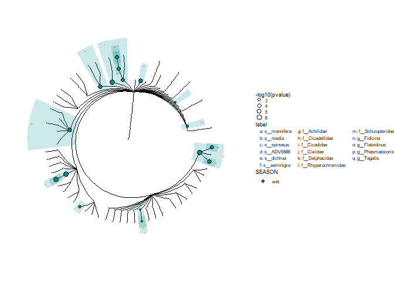<!-- -->

``` r
ps_hemi %>% as.MPSE() %>% mp_rrarefy() %>% mp_diff_analysis(.abundance=RareAbundance, .group=SEASON, action='get') %>% dplyr::filter(grepl("^f_", f)) %>% ggdiffbox(colorlist=c("darkcyan", "orange"), notch = FALSE)
```

    ## The otutree is empty in the MPSE object!

    ## The color has been set automatically, you can reset it manually by adding scale_color_manual(values=yourcolors)

    ## Scale for 'colour' is already present. Adding another scale for 'colour',
    ## which will replace the existing scale.

    ## notch went outside hinges. Try setting notch=FALSE.
    ## notch went outside hinges. Try setting notch=FALSE.
    ## notch went outside hinges. Try setting notch=FALSE.
    ## notch went outside hinges. Try setting notch=FALSE.

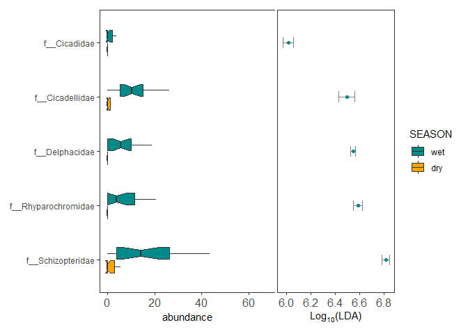<!-- -->

``` r
es_hemi <- ggeffectsize(obj=dereshemi, 
                     lineheight=0.1,
                     linewidth=0.3, ytextsize = 0.3) + 
  scale_color_manual(values=c( "darkcyan", "orange")) #same change due to wrong plotting 
```

    ## The color has been set automatically, you can reset it manually by adding scale_color_manual(values=yourcolors)

    ## Scale for 'colour' is already present. Adding another scale for 'colour',
    ## which will replace the existing scale.

``` r
es_hemi
```

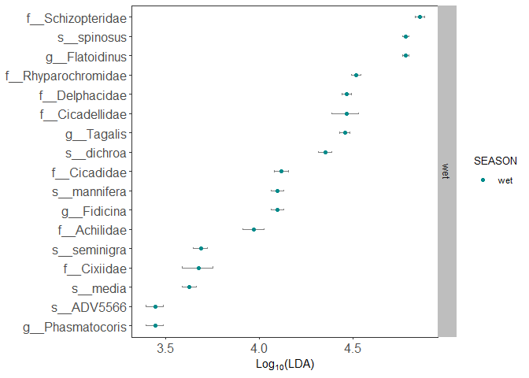<!-- -->

############################ There are problems with the Hymenoptera and Blattodea datasets. I still must figure it out.

r Hymenoptera set.seed(1024) deresbees \<- diff_analysis(obj = ps_bees,
classgroup = “SEASON”, mlfun = “lda”, filtermod = “pvalue”, firstcomfun
= “kruskal_test”, firstalpha = 0.05, strictmod = TRUE, secondcomfun =
“wilcox_test”, subclmin = 3, subclwilc = TRUE, secondalpha = 0.01,
lda=3, action = “add”) deresbees

diffclade_bees \<- ggdiffclade( obj=deresbees, alpha=0.2, linewd=0.15,
skpointsize=0.2, layout=“radial”, cladetext = 0.7, taxlevel=5, #taxonomy
level from 1 to 7
kingdome:phylum:class:order:family:subfamily:genus:species
removeUnkown=TRUE, reduce=TRUE # This argument is to remove the branch
of unknown taxonomy. ) + scale_fill_manual( values=c(“orange”,
“darkcyan”) ) + guides(color = guide_legend( keywidth = 0.1, keyheight =
0.6, order = 5, ncol=3) ) + theme(
panel.background=element_rect(fill=NA), legend.position=“right”,
plot.margin=margin(0,0,0,0), legend.spacing.y=unit(0.02, “cm”),
legend.title=element_text(size=7), legend.text=element_text(size=6),
legend.box.spacing=unit(0.02,“cm”) ) diffclade_bees

ps_bees %>% as.MPSE() %>% mp_rrarefy() %>%
mp_diff_analysis(.abundance=RareAbundance, .group=SEASON, action=‘get’)
%>% dplyr::filter(grepl(“^f\_”, f)) %>%
ggdiffbox(colorlist=c(“darkcyan”, “orange”), notch = FALSE)

es_bees \<- ggeffectsize(obj=deresbees, lineheight=0.1, linewidth=0.3,
ytextsize = 0.3) + scale_color_manual(values=c(“orange”, “darkcyan”))

es_bees

r Blattodea set.seed(1024) deresblats \<- diff_analysis(obj = ps_blats,
classgroup = “SEASON”, mlfun = “lda”, filtermod = “pvalue”, firstcomfun
= “kruskal_test”, firstalpha = 0.05, strictmod = TRUE, secondcomfun =
“wilcox_test”, subclmin = 3, subclwilc = TRUE, secondalpha = 0.01,
lda=3, action = “add”) deresblats

diffclade_blats \<- ggdiffclade( obj=deresblats, alpha=0.2, linewd=0.15,
skpointsize=0.2, layout=“radial”, cladetext = 0.7, taxlevel=6, #taxonomy
level from 1 to 8
kingdome:phylum:class:order:family:subfamily:genus:species
removeUnkown=TRUE, reduce=TRUE # This argument is to remove the branch
of unknown taxonomy. ) + scale_fill_manual( values=c(“orange”,
“darkcyan”) ) + guides(color = guide_legend( keywidth = 0.1, keyheight =
0.6, order = 5, ncol=3) ) + theme(
panel.background=element_rect(fill=NA), legend.position=“right”,
plot.margin=margin(0,0,0,0), legend.spacing.y=unit(0.02, “cm”),
legend.title=element_text(size=7), legend.text=element_text(size=6),
legend.box.spacing=unit(0.02,“cm”) ) diffclade_blats

ps_blats %>% as.MPSE() %>% mp_rrarefy() %>%
mp_diff_analysis(.abundance=RareAbundance, .group=SEASON, action=‘get’)
%>% dplyr::filter(grepl(“^st\_”, f)) %>%
ggdiffbox(colorlist=c(“darkcyan”, “orange”), notch = FALSE)

es_blats \<- ggeffectsize(obj=deresblats, lineheight=0.1, linewidth=0.3,
ytextsize = 0.3) + scale_color_manual(values=c(“orange”, “darkcyan”))

es_blats
