05_traditional\_&\_metabarcoding_data_for_LightTraps_only!
================
Daniel
15/11/2022

Setting up the data which now includes traditional and metabarcoding
records

``` r
tradmetabr <- read.csv('data/final_anal/tradmetabr_only.csv')
sample <- read.csv('data/final_anal/metadata_trad_metabr.csv') #this includes info on location/collection method/classification method and any more info can be added
obj <- parse_tax_data(tradmetabr,
                      class_cols = "classification",
                      class_sep = ";",
                      class_regex = "^([a-z]{0,1})_{0,2}(.*)$",
                      class_key = c("tax_rank" = "taxon_rank", "name" = "taxon_name"))
obj$data$tax_table <- calc_taxon_abund(obj, data = "tax_data", cols = sample$sampleID)
```

    ## Summing per-taxon counts from 306 columns for 5927 taxa

``` r
obj$data$tax_props <- calc_obs_props(obj, "tax_data", cols= sample$sampleID, other_cols = TRUE)
```

    ## Calculating proportions from counts for 306 columns for 6164 observations.

``` r
obj$data$diff_table <- compare_groups(obj, data = "tax_table",
                                      cols = sample$sampleID,
                                      groups = sample$methodClass)
```

Data above now is prepared for comparing traditional classification vs
metabarcoding similar to what was done in Basset et al. (2021)
Scientific Reports Next is a preliminary tree but we still have to
separate them by focal groups (potentially by season too).

``` r
##trhis takes nearly 30 minutes to run

heat_tree(obj,
          node_size_range = c(0.006, 0.04),
          edge_size_range = c(0.001,0.003),
          node_label = taxon_names,
          node_size = n_obs,
          node_color = mean_diff,
          node_color_interval = c(-0.44, 0.44),
          node_color_range =c("darkolivegreen3", "gray", "darkorchid"),
          node_color_digits = 1,
          node_size_axis_label = "BIN count",
          node_color_axis_label = "Mean difference in sample proportions",
          node_label_size_range = c( 0.005, 0.03),
          layout = "davidson-harel",
          initial_layout = "reingold-tilford",
          output_file = "./05_trad_metabar_data_files/meanDiff_tradmetabr.pdf")
```

<!-- -->

Once again, to understand the colouring scheme, read this paragraph
carefully from the metacoder tutorial:

### What color corresponds to each group depends on the order they were given in the compare_groups function. Since “leaf” is “treatment_1” in the “diff_table”, and “log2_median_ratio” is defined as “log2(treatment_1 / treatment_2)”, when a taxon has more counts in leaf samples, the ratio is positive, therefore taxa more abundant in leafs are colored magenta in this case.

their code has ’node_color_range = c(“cyan”, “gray”, “magenta”)###

If we look at print(obj$data$diff_table) above the plot, we can see that
in our case, treatment_1 is ‘TRAD’. The log2 median ratio is defined
as”log2(TRAD / METABR). When a taxon has more counts with traditional
classification, the ratio is positive, therefore taxa more abundant with
traditional are coloured ‘darkorchid (purple)’ in our case (not
magenta).

``` r
sample$inv_simp <- diversity(obj$data$tax_data[, sample$sampleID],
                             index = "invsimpson",
                             MARGIN = 2) # What orietation the matrix is in
ggplot(sample, aes(x = methodClass, y = inv_simp)) +
  geom_boxplot()
```

<!-- -->

``` r
anova_result <- aov(inv_simp ~ methodClass, sample)
summary(anova_result)
```

    ##              Df   Sum Sq Mean Sq F value Pr(>F)    
    ## methodClass   1  7052928 7052928   90.89 <2e-16 ***
    ## Residuals   304 23589596   77597                   
    ## ---
    ## Signif. codes:  0 '***' 0.001 '**' 0.01 '*' 0.05 '.' 0.1 ' ' 1

``` r
tukey_result <- HSD.test(anova_result, "methodClass", group = TRUE)
print(tukey_result)
```

    ## $statistics
    ##    MSerror  Df     Mean       CV
    ##   77597.36 304 108.2222 257.3991
    ## 
    ## $parameters
    ##    test      name.t ntr StudentizedRange alpha
    ##   Tukey methodClass   2         2.782887  0.05
    ## 
    ## $means
    ##         inv_simp      std   r Min  Max Q25 Q50    Q75
    ## metabr 499.72500 154.3190  40 227  840 366 489 628.75
    ## trad    49.34962 292.4254 266   1 4740   2   7  48.50
    ## 
    ## $comparison
    ## NULL
    ## 
    ## $groups
    ##         inv_simp groups
    ## metabr 499.72500      a
    ## trad    49.34962      b
    ## 
    ## attr(,"class")
    ## [1] "group"

``` r
group_data <- tukey_result$groups[order(rownames(tukey_result$groups)),]
ggplot(sample, aes(x = methodClass, y = inv_simp)) +
  geom_text(data = data.frame(),
            aes(x = rownames(group_data), y = max(sample$inv_simp) + 1, label = group_data$groups),
            col = 'black',
            size = 10) +
  geom_boxplot() +
  ggtitle("Inverse Simpson diversity") +
  xlab("Season") +
  ylab("Inverse simpson index")
```

<!-- -->

``` r
ps_obj_all <- metacoder::as_phyloseq(obj,
                      otu_table = "tax_data",
                      otu_id_col = "bold_bin",
                      sample_data = sample,
                      sample_id_col = "sampleID")
# distmethod
# "unifrac",  "wunifrac", "manhattan", "euclidean", "canberra", "bray", "kulczynski" ...(vegdist, dist)
pcoares <- get_pcoa(obj=ps_obj_all, distmethod="bray", method="hellinger")
# Visualizing the result
pcoaplot1 <- ggordpoint(obj=pcoares, biplot=TRUE, speciesannot=TRUE,
                        factorNames=c("methodClass"), ellipse=TRUE) +
  scale_color_manual(values=c("darkolivegreen3", "darkorchid")) +
  scale_fill_manual(values=c("darkolivegreen3", "darkorchid"))
# first and third principal co-ordinates
pcoaplot2 <- ggordpoint(obj=pcoares, pc=c(1, 3), biplot=TRUE, speciesannot=TRUE,
                        factorNames=c("methodClass"), ellipse=TRUE) +
  scale_color_manual(values=c("darkolivegreen3", "darkorchid")) +
  scale_fill_manual(values=c("darkolivegreen3", "darkorchid"))

pdf("./05_trad_metabar_data_files/pcoa_all_2axis.pdf")
pcoaplot1
dev.off()
```

    ## png 
    ##   2

``` r
pcoaplot1 | pcoaplot2 #PCoA between classification methods
```

<!-- -->

Next are some more pcoa plots just to show what we can do as long as we
have really well detailed metadata (e.g. season and methodClass, or
colleciton method)

``` r
pcoaplot1a <- ggordpoint(obj=pcoares, biplot=TRUE, speciesannot=TRUE,
                        factorNames=c("methodClass", "season"), ellipse=TRUE) +
  scale_color_manual(values=c("darkolivegreen3", "darkorchid")) +
  scale_fill_manual(values=c("darkolivegreen3", "darkorchid"))
# first and third principal co-ordinates
pcoaplot2a <- ggordpoint(obj=pcoares, pc=c(1, 3), biplot=TRUE, speciesannot=TRUE,
                        factorNames=c("methodClass", "season"), ellipse=TRUE) +
  scale_color_manual(values=c("darkolivegreen3", "darkorchid")) +
  scale_fill_manual(values=c("darkolivegreen3", "darkorchid"))

pcoaplot1a | pcoaplot2a #Between classification and season
```

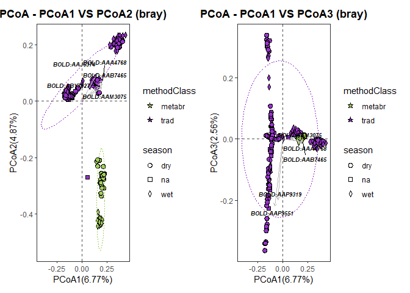<!-- -->

``` r
pcoaplot1c <- ggordpoint(obj=pcoares, biplot=TRUE, speciesannot=TRUE,
                        factorNames=c("methodClass", "method"), ellipse=TRUE) +
  scale_color_manual(values=c("darkolivegreen3", "darkorchid")) +
  scale_fill_manual(values=c("darkolivegreen3", "darkorchid"))
# first and third principal co-ordinates
pcoaplot2c <- ggordpoint(obj=pcoares, pc=c(1, 3), biplot=TRUE, speciesannot=TRUE,
                        factorNames=c("methodClass", "method"), ellipse=TRUE) +
  scale_color_manual(values=c("darkolivegreen3", "darkorchid")) +
  scale_fill_manual(values=c("darkolivegreen3", "darkorchid"))
pcoaplot1c | pcoaplot2c #Between classification, season and trap method
```

    ## Warning: Removed 36 rows containing missing values (geom_star).
    ## Removed 36 rows containing missing values (geom_star).

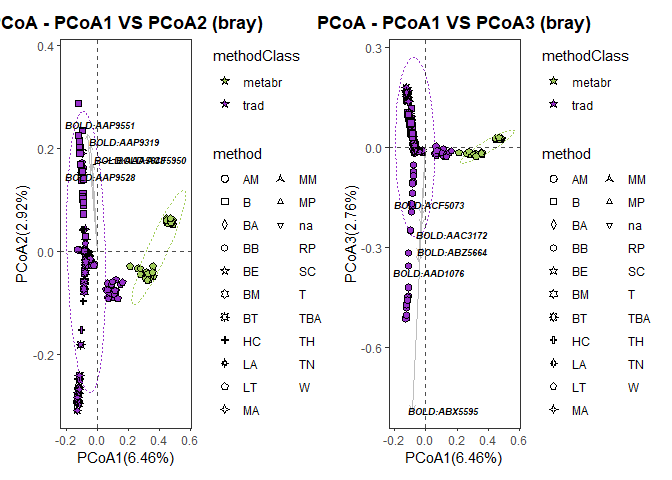<!-- -->

``` r
###### I HAVE A SMALL PROBLEM WITH grid PACKAGE. IT IS PLOTING ON TOP OF PREVIOUS PLOTS SO DO THIS dev.off() to draw in a new plot

vennlist_all <- get_vennlist(obj=ps_obj_all, factorNames="methodClass")
vennp_all <- venn.diagram(vennlist_all,
                      height=5,
                      width=5, 
                      filename=NULL,
                      disable.logging = TRUE,
                      fill=c("darkolivegreen3", "darkorchid"),
                      cat.col=c("darkolivegreen3", "darkorchid"),
                      alpha = 0.85, 
                      fontfamily = "serif",
                      fontface = "bold",
                      cex = 1.2,
                      cat.cex = 1.3,
                      cat.default.pos = "outer",
                      cat.dist=0.1,
                      margin = 0.1, 
                      lwd = 3,
                      lty ='dotted',
                      imagetype = "svg")
```

    ## INFO [2023-02-16 18:43:43] [[1]]
    ## INFO [2023-02-16 18:43:43] vennlist_all
    ## INFO [2023-02-16 18:43:43] 
    ## INFO [2023-02-16 18:43:43] $height
    ## INFO [2023-02-16 18:43:43] [1] 5
    ## INFO [2023-02-16 18:43:43] 
    ## INFO [2023-02-16 18:43:43] $width
    ## INFO [2023-02-16 18:43:43] [1] 5
    ## INFO [2023-02-16 18:43:43] 
    ## INFO [2023-02-16 18:43:43] $filename
    ## INFO [2023-02-16 18:43:43] NULL
    ## INFO [2023-02-16 18:43:43] 
    ## INFO [2023-02-16 18:43:43] $disable.logging
    ## INFO [2023-02-16 18:43:43] [1] TRUE
    ## INFO [2023-02-16 18:43:43] 
    ## INFO [2023-02-16 18:43:43] $fill
    ## INFO [2023-02-16 18:43:43] c("darkolivegreen3", "darkorchid")
    ## INFO [2023-02-16 18:43:43] 
    ## INFO [2023-02-16 18:43:43] $cat.col
    ## INFO [2023-02-16 18:43:43] c("darkolivegreen3", "darkorchid")
    ## INFO [2023-02-16 18:43:43] 
    ## INFO [2023-02-16 18:43:43] $alpha
    ## INFO [2023-02-16 18:43:43] [1] 0.85
    ## INFO [2023-02-16 18:43:43] 
    ## INFO [2023-02-16 18:43:43] $fontfamily
    ## INFO [2023-02-16 18:43:43] [1] "serif"
    ## INFO [2023-02-16 18:43:43] 
    ## INFO [2023-02-16 18:43:43] $fontface
    ## INFO [2023-02-16 18:43:43] [1] "bold"
    ## INFO [2023-02-16 18:43:43] 
    ## INFO [2023-02-16 18:43:43] $cex
    ## INFO [2023-02-16 18:43:43] [1] 1.2
    ## INFO [2023-02-16 18:43:43] 
    ## INFO [2023-02-16 18:43:43] $cat.cex
    ## INFO [2023-02-16 18:43:43] [1] 1.3
    ## INFO [2023-02-16 18:43:43] 
    ## INFO [2023-02-16 18:43:43] $cat.default.pos
    ## INFO [2023-02-16 18:43:43] [1] "outer"
    ## INFO [2023-02-16 18:43:43] 
    ## INFO [2023-02-16 18:43:43] $cat.dist
    ## INFO [2023-02-16 18:43:43] [1] 0.1
    ## INFO [2023-02-16 18:43:43] 
    ## INFO [2023-02-16 18:43:43] $margin
    ## INFO [2023-02-16 18:43:43] [1] 0.1
    ## INFO [2023-02-16 18:43:43] 
    ## INFO [2023-02-16 18:43:43] $lwd
    ## INFO [2023-02-16 18:43:43] [1] 3
    ## INFO [2023-02-16 18:43:43] 
    ## INFO [2023-02-16 18:43:43] $lty
    ## INFO [2023-02-16 18:43:43] [1] "dotted"
    ## INFO [2023-02-16 18:43:43] 
    ## INFO [2023-02-16 18:43:43] $imagetype
    ## INFO [2023-02-16 18:43:43] [1] "svg"
    ## INFO [2023-02-16 18:43:43]

``` r
pdf("./05_trad_metabar_data_files/venn_all.pdf")
grid::grid.draw(vennp_all)
dev.off()
```

    ## png 
    ##   2

Most abundant taxa with either method except this is not an accurate
representation ForestGEO only uses focal species and differente
collection methods, so here we are making an unfair comparison. There
are no Diptera in traditional datasets and no bait colleciotn in
metabarcoding data.

``` r
classtaxa <- get_taxadf(obj=ps_obj_all, taxlevel=4)
# The 5 most abundant taxonomy will be visualized by default (parameter `topn=5`). 
pclass <- ggbartax(obj=classtaxa, facetNames="methodClass", topn=10) +
  xlab(NULL) +
  ylab("relative abundance (%)") +
  scale_fill_manual(values=c(colorRampPalette(RColorBrewer::brewer.pal(12,"Set3"))(31))) +
  guides(fill= guide_legend(keywidth = 0.5, keyheight = 0.5))
```

    ## The color has been set automatically, you can reset it 
    ##             manually by adding scale_fill_manual(values=yourcolors)

    ## Scale for 'fill' is already present. Adding another scale for 'fill', which
    ## will replace the existing scale.

``` r
#note the flag "count=TRUE", this shows now total reads, rather than proportion %
pclass2 <- ggbartax(obj=classtaxa, count=TRUE, facetNames="methodClass", topn=5) +
  xlab(NULL) +
  ylab("count reads") +
  scale_fill_manual(values=c(colorRampPalette(RColorBrewer::brewer.pal(12,"Set3"))(31))) +
  guides(fill= guide_legend(keywidth = 0.5, keyheight = 0.5))
```

    ## The color has been set automatically, you can reset it 
    ##             manually by adding scale_fill_manual(values=yourcolors)
    ## Scale for 'fill' is already present. Adding another scale for 'fill', which
    ## will replace the existing scale.

``` r
pclass
```

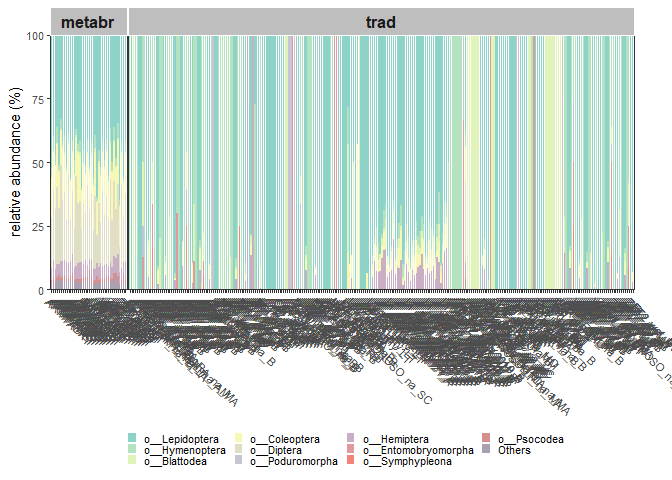<!-- -->

``` r
pclass2
```

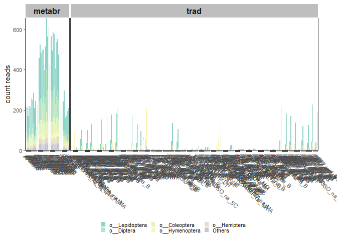<!-- -->

So we further filter data to focus only on Light Trap data and after we
will filter again to only focal families. We could refine these data as
deep as we want, however, in this case we are limited by taxonomic rank.
The data I downloaded from mBRAVE did not include subfamily - for future
analyses, one should aim to include every taxonomic rank instead as this
could have been ideal for e.g. Arciidae

We will repeat the same type of analyses as before but jsut for Light
Trap data.

``` r
obj_LT <- parse_tax_data(tradmetabr,
                    class_cols = "classification",
                      class_sep = ";",
                      class_regex = "^([a-z]{0,1})_{0,2}(.*)$",
                      class_key = c("tax_rank" = "taxon_rank", "name" = "taxon_name"))
sample_LT <- filter(sample, method == "LT")

obj_LT$data$tax_data <- obj_LT$data$tax_data[c("taxon_id","bold_bin", "classification", sample_LT$sampleID)]
print(obj_LT)
```

    ## <Taxmap>
    ##   5927 taxa: aab. Animalia, aac. Arthropoda ... itz. sp.1YB
    ##   5927 edges: NA->aab, aab->aac, aac->aad ... dia->ity, cxy->itz
    ##   2 data sets:
    ##     tax_data:
    ##       # A tibble: 6,164 x 119
    ##         taxon_id bold_bin     classi~1 ALATE~2 ALTOS~3 ARM1_~4 ARM1_~5
    ##         <chr>    <chr>        <chr>      <int>   <int>   <int>   <int>
    ##       1 dib      BOLD:AAA0009 k__Anim~       0       0       0       0
    ##       2 dic      BOLD:AAA0012 k__Anim~       0       0       0       0
    ##       3 did      BOLD:AAA0016 k__Anim~       0       0       0       0
    ##       # ... with 6,161 more rows, 112 more variables:
    ##       #   ARM2_wet_LT <int>, ARM2_dry_LT <int>, ARM3_wet_LT <int>,
    ##       #   ARM3_dry_LT <int>, ARM4_wet_LT <int>, ARM4_dry_LT <int>,
    ##       #   BAL1_dry_LT <int>, BAL1_wet_LT <int>, DRA1_dry_LT <int>,
    ##       #   DRA1_wet_LT <int>, ..., and abbreviated variable names
    ##       #   1: classification, 2: ALATESHIK_na_LT, 3: ALTOSCAMP_na_LT,
    ##       #   4: ARM1_wet_LT, 5: ARM1_dry_LT
    ##     class_data:
    ##       # A tibble: 43,148 x 5
    ##         taxon_id input_index tax_rank name       regex_match  
    ##         <chr>          <int> <chr>    <chr>      <chr>        
    ##       1 aab                1 k        Animalia   k__Animalia  
    ##       2 aac                1 p        Arthropoda p__Arthropoda
    ##       3 aad                1 c        Insecta    c__Insecta   
    ##       # ... with 43,145 more rows
    ##   0 functions:

``` r
no_reads <- rowSums(obj_LT$data$tax_data[, sample_LT$sampleID]) == 0
sum(no_reads) 
```

    ## [1] 926

``` r
#there are 926 BINs that do not have reads when we filter by trap method. We must remove
obj_LT <- filter_obs(obj_LT, data = "tax_data", ! no_reads, drop_taxa = TRUE)

obj_LT$data$tax_table <- calc_taxon_abund(obj_LT, data = "tax_data", cols = sample_LT$sampleID)
```

    ## Summing per-taxon counts from 116 columns for 4708 taxa

``` r
obj_LT$data$tax_props <- calc_obs_props(obj_LT, "tax_data", cols = sample_LT$sampleID)
```

    ## Calculating proportions from counts for 116 columns for 5238 observations.

``` r
obj_LT$data$diff_table <- compare_groups(obj_LT, data = "tax_table",
                                      cols = sample_LT$sampleID,
                                      groups = sample_LT$methodClass)

ps_obj_LT <- metacoder::as_phyloseq(obj_LT,
                      otu_table = "tax_data",
                      otu_id_col = "bold_bin",
                      sample_data = sample,
                      sample_id_col = "sampleID")

pcoares_LT <- get_pcoa(obj=ps_obj_LT, distmethod="bray", method="hellinger")
# Visualizing the result
pcoaplot1_LT <- ggordpoint(obj=pcoares_LT, biplot=TRUE, speciesannot=TRUE,
                        factorNames=c("methodClass", "season"), ellipse=TRUE) +
  scale_color_manual(values=c("darkolivegreen3", "darkorchid")) +
  scale_fill_manual(values=c("darkolivegreen3", "darkorchid"))
# first and third principal co-ordinates
pcoaplot2_LT <- ggordpoint(obj=pcoares_LT, pc=c(1, 3), biplot=TRUE, speciesannot=TRUE,
                        factorNames=c("methodClass", "season"), ellipse=TRUE) +
  scale_color_manual(values=c("darkolivegreen3", "darkorchid")) +
  scale_fill_manual(values=c("darkolivegreen3", "darkorchid"))
pcoaplot1_LT | pcoaplot2_LT
```

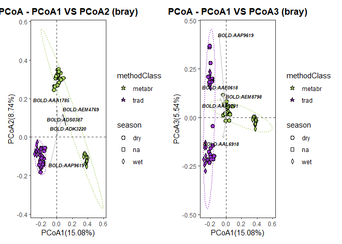<!-- -->

``` r
classtaxa_LT <- get_taxadf(obj=ps_obj_LT, taxlevel=4)
# The 5 most abundant taxonomy will be visualized by default (parameter `topn=5`). 
pclass_LT <- ggbartax(obj=classtaxa_LT, facetNames="methodClass", topn=10) +
  xlab(NULL) +
  ylab("relative abundance (%)") +
  scale_fill_manual(values=c(colorRampPalette(RColorBrewer::brewer.pal(12,"Set3"))(31))) +
  guides(fill= guide_legend(keywidth = 0.5, keyheight = 0.5))
```

    ## The color has been set automatically, you can reset it 
    ##             manually by adding scale_fill_manual(values=yourcolors)

    ## Scale for 'fill' is already present. Adding another scale for 'fill', which
    ## will replace the existing scale.

``` r
pclass_LT
```

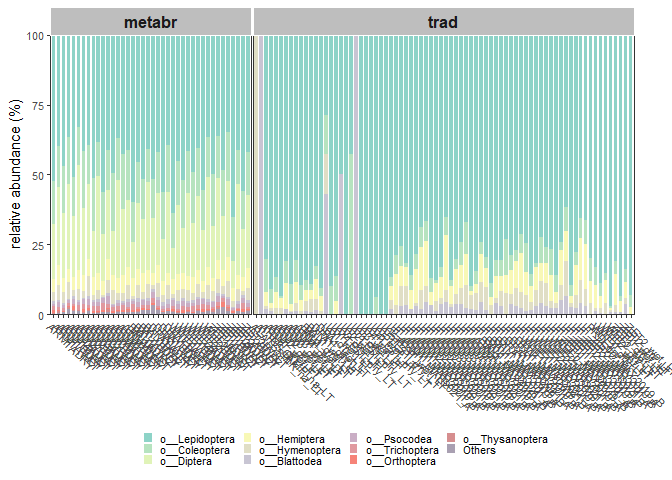<!-- -->

``` r
heat_tree(obj_LT,
          node_label = taxon_names,
          node_size = n_obs,
          node_color = mean_diff,
          node_color_interval = c(-0.5, 0.5),
          node_color_range = c("darkolivegreen3", "gray", "darkorchid"),
          node_color_digits = 1,
          node_size_axis_label = "BIN count",
          node_color_axis_label = "Mean difference in sample proportions",
          node_label_size_range = c( 0.005, 0.03),
          layout = "davidson-harel",
          initial_layout = "reingold-tilford",
          output_file = "./05_trad_metabar_data_files/light_trap_heattree.pdf")
```

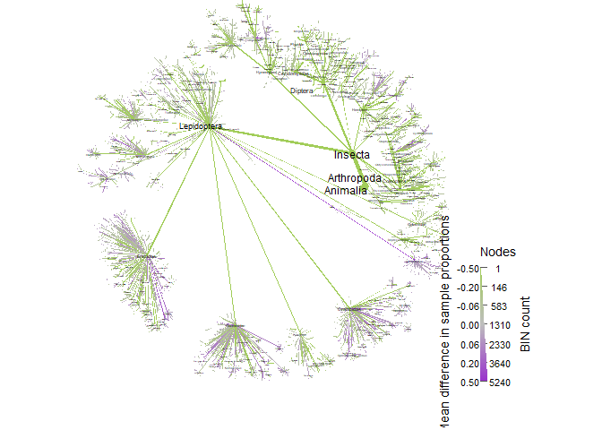<!-- -->

``` r
##This one takes about 15 minutes to run
```

``` r
dev.off()
```

    ## null device 
    ##           1

``` r
vennlist_LT <- get_vennlist(obj=ps_obj_LT, factorNames="methodClass")
vennp_LT <- venn.diagram(vennlist_LT,
                      height=5,
                      width=5, 
                      filename=NULL,
                      disable.logging = TRUE,
                      fill=c("darkolivegreen3", "darkorchid"),
                      cat.col=c("darkolivegreen3", "darkorchid"),
                      alpha = 0.85, 
                      fontfamily = "serif",
                      fontface = "bold",
                      cex = 1.2,
                      cat.cex = 1.3,
                      cat.default.pos = "outer",
                      cat.dist=0.1,
                      margin = 0.1, 
                      lwd = 3,
                      lty ='dotted',
                      imagetype = "svg")
```

    ## INFO [2023-02-16 19:04:40] [[1]]
    ## INFO [2023-02-16 19:04:40] vennlist_LT
    ## INFO [2023-02-16 19:04:40] 
    ## INFO [2023-02-16 19:04:40] $height
    ## INFO [2023-02-16 19:04:40] [1] 5
    ## INFO [2023-02-16 19:04:40] 
    ## INFO [2023-02-16 19:04:40] $width
    ## INFO [2023-02-16 19:04:40] [1] 5
    ## INFO [2023-02-16 19:04:40] 
    ## INFO [2023-02-16 19:04:40] $filename
    ## INFO [2023-02-16 19:04:40] NULL
    ## INFO [2023-02-16 19:04:40] 
    ## INFO [2023-02-16 19:04:40] $disable.logging
    ## INFO [2023-02-16 19:04:40] [1] TRUE
    ## INFO [2023-02-16 19:04:40] 
    ## INFO [2023-02-16 19:04:40] $fill
    ## INFO [2023-02-16 19:04:40] c("darkolivegreen3", "darkorchid")
    ## INFO [2023-02-16 19:04:40] 
    ## INFO [2023-02-16 19:04:40] $cat.col
    ## INFO [2023-02-16 19:04:40] c("darkolivegreen3", "darkorchid")
    ## INFO [2023-02-16 19:04:40] 
    ## INFO [2023-02-16 19:04:40] $alpha
    ## INFO [2023-02-16 19:04:40] [1] 0.85
    ## INFO [2023-02-16 19:04:40] 
    ## INFO [2023-02-16 19:04:40] $fontfamily
    ## INFO [2023-02-16 19:04:40] [1] "serif"
    ## INFO [2023-02-16 19:04:40] 
    ## INFO [2023-02-16 19:04:40] $fontface
    ## INFO [2023-02-16 19:04:40] [1] "bold"
    ## INFO [2023-02-16 19:04:40] 
    ## INFO [2023-02-16 19:04:40] $cex
    ## INFO [2023-02-16 19:04:40] [1] 1.2
    ## INFO [2023-02-16 19:04:40] 
    ## INFO [2023-02-16 19:04:40] $cat.cex
    ## INFO [2023-02-16 19:04:40] [1] 1.3
    ## INFO [2023-02-16 19:04:40] 
    ## INFO [2023-02-16 19:04:40] $cat.default.pos
    ## INFO [2023-02-16 19:04:40] [1] "outer"
    ## INFO [2023-02-16 19:04:40] 
    ## INFO [2023-02-16 19:04:40] $cat.dist
    ## INFO [2023-02-16 19:04:40] [1] 0.1
    ## INFO [2023-02-16 19:04:40] 
    ## INFO [2023-02-16 19:04:40] $margin
    ## INFO [2023-02-16 19:04:40] [1] 0.1
    ## INFO [2023-02-16 19:04:40] 
    ## INFO [2023-02-16 19:04:40] $lwd
    ## INFO [2023-02-16 19:04:40] [1] 3
    ## INFO [2023-02-16 19:04:40] 
    ## INFO [2023-02-16 19:04:40] $lty
    ## INFO [2023-02-16 19:04:40] [1] "dotted"
    ## INFO [2023-02-16 19:04:40] 
    ## INFO [2023-02-16 19:04:40] $imagetype
    ## INFO [2023-02-16 19:04:40] [1] "svg"
    ## INFO [2023-02-16 19:04:40]

``` r
pdf("./05_trad_metabar_data_files/venn_LT.pdf")
grid::grid.draw(vennp_LT)
dev.off()
```

    ## null device 
    ##           1

Next we will focus only on focal orders.

``` r
obj_LT %>%  metacoder::filter_taxa(taxon_names %in% c("Lepidoptera", "Coleoptera", "Hymenoptera", "Hemiptera", "Blattodea"),#here is to fliter the figure by focal groups
              subtaxa = TRUE) -> obj_focal

no_reads <- rowSums(obj_focal$data$tax_data[, sample_LT$sampleID]) == 0 #check for zeroes after filtering always. Otherwise we get bad results
sum(no_reads) #in this case theree is no zeroes, which is good, but we should always check
```

    ## [1] 0

``` r
obj_focal$data$tax_data <- obj_focal$data$tax_data[c("taxon_id","bold_bin", "classification", sample_LT$sampleID)]
print(obj_focal)
```

    ## <Taxmap>
    ##   4056 taxa: aag. Lepidoptera, aah. Hymenoptera ... itz. sp.1YB
    ##   4056 edges: NA->aag, NA->aah, NA->aam ... dia->ity, cxy->itz
    ##   5 data sets:
    ##     tax_data:
    ##       # A tibble: 3,545 x 119
    ##         taxon_id bold_bin     classi~1 ALATE~2 ALTOS~3 ARM1_~4 ARM1_~5
    ##         <chr>    <chr>        <chr>      <int>   <int>   <int>   <int>
    ##       1 dib      BOLD:AAA0009 k__Anim~       0       0       0       0
    ##       2 dic      BOLD:AAA0012 k__Anim~       0       0       0       0
    ##       3 did      BOLD:AAA0016 k__Anim~       0       0       0       0
    ##       # ... with 3,542 more rows, 112 more variables:
    ##       #   ARM2_wet_LT <int>, ARM2_dry_LT <int>, ARM3_wet_LT <int>,
    ##       #   ARM3_dry_LT <int>, ARM4_wet_LT <int>, ARM4_dry_LT <int>,
    ##       #   BAL1_dry_LT <int>, BAL1_wet_LT <int>, DRA1_dry_LT <int>,
    ##       #   DRA1_wet_LT <int>, ..., and abbreviated variable names
    ##       #   1: classification, 2: ALATESHIK_na_LT, 3: ALTOSCAMP_na_LT,
    ##       #   4: ARM1_wet_LT, 5: ARM1_dry_LT
    ##     class_data:
    ##       # A tibble: 16,227 x 5
    ##         taxon_id input_index tax_rank name        regex_match   
    ##         <chr>          <int> <chr>    <chr>       <chr>         
    ##       1 aag                1 o        Lepidoptera o__Lepidoptera
    ##       2 abd                1 f        Gelechiidae f__Gelechiidae
    ##       3 amw                1 g        gelJanzen1  g__gelJanzen1 
    ##       # ... with 16,224 more rows
    ##     tax_table:
    ##       # A tibble: 4,056 x 117
    ##         taxon_id ALATESHIK_n~1 ALTOS~2 ARM1_~3 ARM1_~4 ARM2_~5 ARM2_~6
    ##         <chr>            <dbl>   <dbl>   <dbl>   <dbl>   <dbl>   <dbl>
    ##       1 aag                  0       0      90      81     131     112
    ##       2 aah                 30       0       1       1       3       3
    ##       3 aam                  0       1       1       2       0       0
    ##       # ... with 4,053 more rows, 110 more variables:
    ##       #   ARM3_wet_LT <dbl>, ARM3_dry_LT <dbl>, ARM4_wet_LT <dbl>,
    ##       #   ARM4_dry_LT <dbl>, BAL1_dry_LT <dbl>, BAL1_wet_LT <dbl>,
    ##       #   DRA1_dry_LT <dbl>, DRA1_wet_LT <dbl>, L01_wet_LT <dbl>,
    ##       #   L01_dry_LT <dbl>, ..., and abbreviated variable names
    ##       #   1: ALATESHIK_na_LT, 2: ALTOSCAMP_na_LT, 3: ARM1_wet_LT,
    ##       #   4: ARM1_dry_LT, 5: ARM2_wet_LT, 6: ARM2_dry_LT
    ##     tax_props:
    ##       # A tibble: 3,545 x 117
    ##         taxon_id ALATESHIK_n~1 ALTOS~2 ARM1_~3 ARM1_~4 ARM2_~5 ARM2_~6
    ##         <chr>            <dbl>   <dbl>   <dbl>   <dbl>   <dbl>   <dbl>
    ##       1 dib                  0       0       0       0       0       0
    ##       2 dic                  0       0       0       0       0       0
    ##       3 did                  0       0       0       0       0       0
    ##       # ... with 3,542 more rows, 110 more variables:
    ##       #   ARM3_wet_LT <dbl>, ARM3_dry_LT <dbl>, ARM4_wet_LT <dbl>,
    ##       #   ARM4_dry_LT <dbl>, BAL1_dry_LT <dbl>, BAL1_wet_LT <dbl>,
    ##       #   DRA1_dry_LT <dbl>, DRA1_wet_LT <dbl>, L01_wet_LT <dbl>,
    ##       #   L01_dry_LT <dbl>, ..., and abbreviated variable names
    ##       #   1: ALATESHIK_na_LT, 2: ALTOSCAMP_na_LT, 3: ARM1_wet_LT,
    ##       #   4: ARM1_dry_LT, 5: ARM2_wet_LT, 6: ARM2_dry_LT
    ##     diff_table:
    ##       # A tibble: 4,056 x 7
    ##         taxon_id treatment_1 treatm~1 log2_~2 media~3 mean_~4 wilcox~5
    ##         <chr>    <chr>       <chr>      <dbl>   <dbl>   <dbl>    <dbl>
    ##       1 aag      trad        metabr     -2.03    -168 -157.   1.00e-17
    ##       2 aah      trad        metabr     -3.39     -19  -16.6  4.79e-16
    ##       3 aam      trad        metabr     -2         -3   -3.02 9.52e-13
    ##       # ... with 4,053 more rows, and abbreviated variable names
    ##       #   1: treatment_2, 2: log2_median_ratio, 3: median_diff,
    ##       #   4: mean_diff, 5: wilcox_p_value
    ##   0 functions:

``` r
obj_focal$data$tax_table <- calc_taxon_abund(obj_focal, data = "tax_data", cols = sample_LT$sampleID)
```

    ## Summing per-taxon counts from 116 columns for 4056 taxa

``` r
obj_focal$data$tax_props <- calc_obs_props(obj_focal, "tax_data", cols = sample_LT$sampleID)
```

    ## Calculating proportions from counts for 116 columns for 3545 observations.

``` r
obj_focal$data$diff_table <- compare_groups(obj_focal, data = "tax_table",
                                      cols = sample_LT$sampleID,
                                      groups = sample_LT$methodClass)

ps_obj_focal <- metacoder::as_phyloseq(obj_focal,
                      otu_table = "tax_data",
                      otu_id_col = "bold_bin",
                      sample_data = sample,
                      sample_id_col = "sampleID")

pcoares_focal <- get_pcoa(obj=ps_obj_focal, distmethod="bray", method="hellinger")
# Visualizing the result
pcoaplot1_focal <- ggordpoint(obj=pcoares_focal, biplot=TRUE, speciesannot=TRUE,
                        factorNames=c("methodClass", "season"), ellipse=TRUE) +
  scale_color_manual(values=c("darkolivegreen3", "darkorchid")) +
  scale_fill_manual(values=c("darkolivegreen3", "darkorchid"))
# first and third principal co-ordinates
pcoaplot2_focal <- ggordpoint(obj=pcoares_focal, pc=c(1, 3), biplot=TRUE, speciesannot=TRUE,
                        factorNames=c("methodClass", "season"), ellipse=TRUE) +
  scale_color_manual(values=c("darkolivegreen3", "darkorchid")) +
  scale_fill_manual(values=c("darkolivegreen3", "darkorchid"))
pcoaplot1_focal | pcoaplot2_focal
```

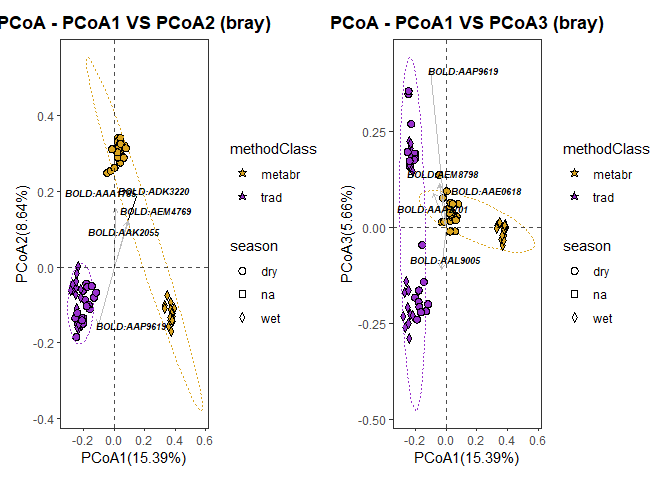<!-- -->

``` r
pdf("./05_trad_metabar_data_files/PcoA_1and2_focal.pdf")
pcoaplot1_focal
dev.off()
```

    ## png 
    ##   2

``` r
#pcoaplot2_focal

heat_tree(obj_focal,
          node_label = taxon_names,
          node_size = n_obs,
          node_color = mean_diff,
          node_color_interval = c(-0.5, 0.5),
          node_color_range = c("darkolivegreen3", "gray", "darkorchid"),
          node_color_digits = 1,
          node_size_axis_label = "BIN count",
          node_color_axis_label = "Mean difference in sample proportions",
          node_label_size_range = c( 0.005, 0.03),
          layout = "davidson-harel",
          initial_layout = "reingold-tilford",
          output_file = "./05_trad_metabar_data_files/focal_MEANDIFFheattree.pdf")
```

<!-- -->

``` r
#this one takes about 10 minutes to run
```

To understand the colouring scheme, read this paragraph carefully from
the metacoder tutorial:

### What color corresponds to each group depends on the order they were given in the compare_groups function. Since “leaf” is “treatment_1” in the “diff_table”, and “log2_median_ratio” is defined as “log2(treatment_1 / treatment_2)”, when a taxon has more counts in leaf samples, the ratio is positive, therefore taxa more abundant in leafs are colored magenta in this case.

their code has ’node_color_range = c(“cyan”, “gray”, “magenta”)###

If we look at print(obj$data$diff_table) above the plot, we can see that
in our case, treatment_1 is ‘Trad’. The log2 median ratio is defined
as”log2(trad / metabr). When a taxon has more counts in the dry season,
the ratio is positive, therefore taxa more abundant in the dry season
are coloured ‘darkorchid’ in our case (not magenta). DARKORCHID IS
TRADITIONAL

But more interesting for us, to separate them according to focal groups.
In orange for dry season, in blue for wet season. The following are the
differences between seasons using wilcox_p\_vlue function we ran on the
diff_table above.

``` r
dev.off()
```

    ## null device 
    ##           1

``` r
vennlist_focal <- get_vennlist(obj=ps_obj_focal, factorNames="methodClass")
vennp_focal <- venn.diagram(vennlist_focal,
                      height=5,
                      width=5, 
                      filename=NULL,
                      disable.logging = TRUE,
                      fill=c("darkolivegreen3", "darkorchid"),
                      cat.col=c("darkolivegreen3", "darkorchid"),
                      alpha = 0.85, 
                      fontfamily = "serif",
                      fontface = "bold",
                      cex = 1.2,
                      cat.cex = 1.3,
                      cat.default.pos = "outer",
                      cat.dist=0.1,
                      margin = 0.1, 
                      lwd = 3,
                      lty ='dotted',
                      imagetype = "svg")
```

    ## INFO [2023-02-16 19:14:00] [[1]]
    ## INFO [2023-02-16 19:14:00] vennlist_focal
    ## INFO [2023-02-16 19:14:00] 
    ## INFO [2023-02-16 19:14:00] $height
    ## INFO [2023-02-16 19:14:00] [1] 5
    ## INFO [2023-02-16 19:14:00] 
    ## INFO [2023-02-16 19:14:00] $width
    ## INFO [2023-02-16 19:14:00] [1] 5
    ## INFO [2023-02-16 19:14:00] 
    ## INFO [2023-02-16 19:14:00] $filename
    ## INFO [2023-02-16 19:14:00] NULL
    ## INFO [2023-02-16 19:14:00] 
    ## INFO [2023-02-16 19:14:00] $disable.logging
    ## INFO [2023-02-16 19:14:00] [1] TRUE
    ## INFO [2023-02-16 19:14:00] 
    ## INFO [2023-02-16 19:14:00] $fill
    ## INFO [2023-02-16 19:14:00] c("darkolivegreen3", "darkorchid")
    ## INFO [2023-02-16 19:14:00] 
    ## INFO [2023-02-16 19:14:00] $cat.col
    ## INFO [2023-02-16 19:14:00] c("darkolivegreen3", "darkorchid")
    ## INFO [2023-02-16 19:14:00] 
    ## INFO [2023-02-16 19:14:00] $alpha
    ## INFO [2023-02-16 19:14:00] [1] 0.85
    ## INFO [2023-02-16 19:14:00] 
    ## INFO [2023-02-16 19:14:00] $fontfamily
    ## INFO [2023-02-16 19:14:00] [1] "serif"
    ## INFO [2023-02-16 19:14:00] 
    ## INFO [2023-02-16 19:14:00] $fontface
    ## INFO [2023-02-16 19:14:00] [1] "bold"
    ## INFO [2023-02-16 19:14:00] 
    ## INFO [2023-02-16 19:14:00] $cex
    ## INFO [2023-02-16 19:14:00] [1] 1.2
    ## INFO [2023-02-16 19:14:00] 
    ## INFO [2023-02-16 19:14:00] $cat.cex
    ## INFO [2023-02-16 19:14:00] [1] 1.3
    ## INFO [2023-02-16 19:14:00] 
    ## INFO [2023-02-16 19:14:00] $cat.default.pos
    ## INFO [2023-02-16 19:14:00] [1] "outer"
    ## INFO [2023-02-16 19:14:00] 
    ## INFO [2023-02-16 19:14:00] $cat.dist
    ## INFO [2023-02-16 19:14:00] [1] 0.1
    ## INFO [2023-02-16 19:14:00] 
    ## INFO [2023-02-16 19:14:00] $margin
    ## INFO [2023-02-16 19:14:00] [1] 0.1
    ## INFO [2023-02-16 19:14:00] 
    ## INFO [2023-02-16 19:14:00] $lwd
    ## INFO [2023-02-16 19:14:00] [1] 3
    ## INFO [2023-02-16 19:14:00] 
    ## INFO [2023-02-16 19:14:00] $lty
    ## INFO [2023-02-16 19:14:00] [1] "dotted"
    ## INFO [2023-02-16 19:14:00] 
    ## INFO [2023-02-16 19:14:00] $imagetype
    ## INFO [2023-02-16 19:14:00] [1] "svg"
    ## INFO [2023-02-16 19:14:00]

``` r
pdf("./05_trad_metabar_data_files/venn_focal.pdf")
grid::grid.draw(vennp_focal)
dev.off()
```

    ## null device 
    ##           1

``` r
set.seed(16)#to make sure the figures is always the same
obj_focal %>%
  metacoder::filter_taxa(taxon_names == "Lepidoptera",#here is to filter the figure by groups
              subtaxa = TRUE) %>%
  #metacoder::filter_taxa(taxon_ranks == c("o","f","g", "s")) %>%
  heat_tree(node_label = taxon_names,
            node_size_range = c(0.006, 0.04),
            edge_size_range = c(0.001, 0.003),
            node_size = n_obs, # n_obs is a function that calculates, in this case, the number of OTUs per taxon
            node_color = mean_diff, # A column from `obj_LT$data$diff_table`
            node_color_interval = c(-.44,.44), # The range of the mean_difference to display
            node_color_range = c("darkolivegreen3", "gray", "darkorchid"), # The color palette used
            node_size_axis_label = "BIN count",
            node_color_axis_label = "Mean difference between classification methods",
            node_label_size_range = c( 0.003, 0.03),
            layout = "davidson-harel", # The primary layout algorithm
            initial_layout = "reingold-tilford",
            output_file = "./05_trad_metabar_data_files/lepidoptera_heattree.pdf") # The layout algorithm that initializes node locations
```

<!-- -->

``` r
#this one takes about 5 minutes

obj_focal %>%  metacoder::filter_taxa(taxon_names %in% c("Lepidoptera"),#here is to fliter the figure by groups
              subtaxa = TRUE) -> leps_LT #we will create separate files for each order as this simplifies downstream analysis in microbiotaprocess - until I find a way to filter taxa on the mpse object directly.
no_reads <- rowSums(leps_LT$data$tax_data[, sample_LT$sampleID]) == 0 #check for zeroes after filtering always. Otherwise we get bad results
sum(no_reads) #in this case theree is no zeroes, which is good, but we should always check
```

    ## [1] 0

``` r
ps_leps_LT <- metacoder::as_phyloseq(leps_LT,
                      otu_table = "tax_data",
                      otu_id_col = "bold_bin",
                      sample_data = sample,
                      sample_id_col = "sampleID")  %>% microViz::tax_mutate(rank_0 = "Animalia",rank_01 = "Arthropoda", rank_02 = "Insecta", .before = 1) -> ps_leps_LT
colnames(tax_table(ps_leps_LT)) <- c("k__", "p__", "o__", "c__", "f__", "g__", "s__")
```

``` r
dev.off()
```

    ## null device 
    ##           1

``` r
vennlist_leps <- get_vennlist(obj=ps_leps_LT, factorNames="methodClass")
vennp_leps <- venn.diagram(vennlist_leps,
                      height=5,
                      width=5, 
                      filename=NULL,
                      disable.logging = TRUE,
                      fill=c("darkolivegreen3", "darkorchid"),
                      cat.col=c("darkolivegreen3", "darkorchid"),
                      alpha = 0.85, 
                      fontfamily = "serif",
                      fontface = "bold",
                      cex = 1.2,
                      cat.cex = 1.3,
                      cat.default.pos = "outer",
                      cat.dist=0.1,
                      margin = 0.1, 
                      lwd = 3,
                      lty ='dotted',
                      imagetype = "svg")
```

    ## INFO [2023-02-16 19:21:51] [[1]]
    ## INFO [2023-02-16 19:21:51] vennlist_leps
    ## INFO [2023-02-16 19:21:51] 
    ## INFO [2023-02-16 19:21:51] $height
    ## INFO [2023-02-16 19:21:51] [1] 5
    ## INFO [2023-02-16 19:21:51] 
    ## INFO [2023-02-16 19:21:51] $width
    ## INFO [2023-02-16 19:21:51] [1] 5
    ## INFO [2023-02-16 19:21:51] 
    ## INFO [2023-02-16 19:21:51] $filename
    ## INFO [2023-02-16 19:21:51] NULL
    ## INFO [2023-02-16 19:21:51] 
    ## INFO [2023-02-16 19:21:51] $disable.logging
    ## INFO [2023-02-16 19:21:51] [1] TRUE
    ## INFO [2023-02-16 19:21:51] 
    ## INFO [2023-02-16 19:21:51] $fill
    ## INFO [2023-02-16 19:21:51] c("darkolivegreen3", "darkorchid")
    ## INFO [2023-02-16 19:21:51] 
    ## INFO [2023-02-16 19:21:51] $cat.col
    ## INFO [2023-02-16 19:21:51] c("darkolivegreen3", "darkorchid")
    ## INFO [2023-02-16 19:21:51] 
    ## INFO [2023-02-16 19:21:51] $alpha
    ## INFO [2023-02-16 19:21:51] [1] 0.85
    ## INFO [2023-02-16 19:21:51] 
    ## INFO [2023-02-16 19:21:51] $fontfamily
    ## INFO [2023-02-16 19:21:51] [1] "serif"
    ## INFO [2023-02-16 19:21:51] 
    ## INFO [2023-02-16 19:21:51] $fontface
    ## INFO [2023-02-16 19:21:51] [1] "bold"
    ## INFO [2023-02-16 19:21:51] 
    ## INFO [2023-02-16 19:21:51] $cex
    ## INFO [2023-02-16 19:21:51] [1] 1.2
    ## INFO [2023-02-16 19:21:51] 
    ## INFO [2023-02-16 19:21:51] $cat.cex
    ## INFO [2023-02-16 19:21:51] [1] 1.3
    ## INFO [2023-02-16 19:21:51] 
    ## INFO [2023-02-16 19:21:51] $cat.default.pos
    ## INFO [2023-02-16 19:21:51] [1] "outer"
    ## INFO [2023-02-16 19:21:51] 
    ## INFO [2023-02-16 19:21:51] $cat.dist
    ## INFO [2023-02-16 19:21:51] [1] 0.1
    ## INFO [2023-02-16 19:21:51] 
    ## INFO [2023-02-16 19:21:51] $margin
    ## INFO [2023-02-16 19:21:51] [1] 0.1
    ## INFO [2023-02-16 19:21:51] 
    ## INFO [2023-02-16 19:21:51] $lwd
    ## INFO [2023-02-16 19:21:51] [1] 3
    ## INFO [2023-02-16 19:21:51] 
    ## INFO [2023-02-16 19:21:51] $lty
    ## INFO [2023-02-16 19:21:51] [1] "dotted"
    ## INFO [2023-02-16 19:21:51] 
    ## INFO [2023-02-16 19:21:51] $imagetype
    ## INFO [2023-02-16 19:21:51] [1] "svg"
    ## INFO [2023-02-16 19:21:51]

``` r
pdf("./05_trad_metabar_data_files/venn_leps.pdf")
grid::grid.draw(vennp_leps)
dev.off()
```

    ## null device 
    ##           1

``` r
set.seed(16)#to make sure the figures is always the same
obj_LT %>%
  metacoder::filter_taxa(taxon_names == "Coleoptera",#here is to fliter the figure by groups
              subtaxa = TRUE) %>% 
  heat_tree(node_label = taxon_names,
            node_size_range = c(0.01, 0.03),
            edge_size_range = c(0.003, 0.005),
            node_size = n_obs, # n_obs is a function that calculates, in this case, the number of OTUs per taxon
            node_color = mean_diff, # A column from `obj_LT$data$diff_table`
            node_color_interval = c(-.44,.44), # The range of the mean_difference to display
            node_color_range = c("darkolivegreen3", "gray", "darkorchid"), # The color palette used
            node_size_axis_label = "BIN count",
            node_color_axis_label = "Mean difference between classification methods",
            node_label_size_range = c( 0.003, 0.03),
            #edge_label = n_obs,
            layout = "davidson-harel", # The primary layout algorithm
            initial_layout = "reingold-tilford",
            output_file = "./05_trad_metabar_data_files/coleoptera_heattree.pdf") # The layout algorithm that initializes node locations
```

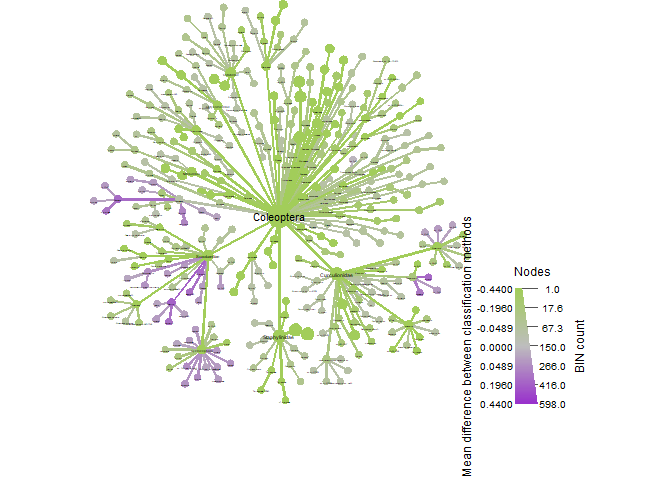<!-- -->

``` r
#<1 minute
obj_LT %>%  metacoder::filter_taxa(taxon_names %in% c("Coleoptera"),#here is to fliter the figure by groups
              subtaxa = TRUE) -> coleo_LT

ps_coleo_LT <- metacoder::as_phyloseq(coleo_LT,
                                      otu_table = "tax_data",
                                      otu_id_col = "bold_bin",
                                      sample_data = sample,
                                      sample_id_col = "sampleID")
```

``` r
dev.off()
```

    ## null device 
    ##           1

``` r
vennlist_coleo <- get_vennlist(obj=ps_coleo_LT, factorNames="methodClass")
vennp_coleo <- venn.diagram(vennlist_coleo,
                      height=5,
                      width=5, 
                      filename=NULL,
                      disable.logging = TRUE,
                      fill=c("darkolivegreen3", "darkorchid"),
                      cat.col=c("darkolivegreen3", "darkorchid"),
                      alpha = 0.85, 
                      fontfamily = "serif",
                      fontface = "bold",
                      cex = 1.2,
                      cat.cex = 1.3,
                      cat.default.pos = "outer",
                      cat.dist=0.1,
                      margin = 0.1, 
                      lwd = 3,
                      lty ='dotted',
                      imagetype = "svg")
```

    ## INFO [2023-02-16 19:22:17] [[1]]
    ## INFO [2023-02-16 19:22:17] vennlist_coleo
    ## INFO [2023-02-16 19:22:17] 
    ## INFO [2023-02-16 19:22:17] $height
    ## INFO [2023-02-16 19:22:17] [1] 5
    ## INFO [2023-02-16 19:22:17] 
    ## INFO [2023-02-16 19:22:17] $width
    ## INFO [2023-02-16 19:22:17] [1] 5
    ## INFO [2023-02-16 19:22:17] 
    ## INFO [2023-02-16 19:22:17] $filename
    ## INFO [2023-02-16 19:22:17] NULL
    ## INFO [2023-02-16 19:22:17] 
    ## INFO [2023-02-16 19:22:17] $disable.logging
    ## INFO [2023-02-16 19:22:17] [1] TRUE
    ## INFO [2023-02-16 19:22:17] 
    ## INFO [2023-02-16 19:22:17] $fill
    ## INFO [2023-02-16 19:22:17] c("darkolivegreen3", "darkorchid")
    ## INFO [2023-02-16 19:22:17] 
    ## INFO [2023-02-16 19:22:17] $cat.col
    ## INFO [2023-02-16 19:22:17] c("darkolivegreen3", "darkorchid")
    ## INFO [2023-02-16 19:22:17] 
    ## INFO [2023-02-16 19:22:17] $alpha
    ## INFO [2023-02-16 19:22:17] [1] 0.85
    ## INFO [2023-02-16 19:22:17] 
    ## INFO [2023-02-16 19:22:17] $fontfamily
    ## INFO [2023-02-16 19:22:17] [1] "serif"
    ## INFO [2023-02-16 19:22:17] 
    ## INFO [2023-02-16 19:22:17] $fontface
    ## INFO [2023-02-16 19:22:17] [1] "bold"
    ## INFO [2023-02-16 19:22:17] 
    ## INFO [2023-02-16 19:22:17] $cex
    ## INFO [2023-02-16 19:22:17] [1] 1.2
    ## INFO [2023-02-16 19:22:17] 
    ## INFO [2023-02-16 19:22:17] $cat.cex
    ## INFO [2023-02-16 19:22:17] [1] 1.3
    ## INFO [2023-02-16 19:22:17] 
    ## INFO [2023-02-16 19:22:17] $cat.default.pos
    ## INFO [2023-02-16 19:22:17] [1] "outer"
    ## INFO [2023-02-16 19:22:17] 
    ## INFO [2023-02-16 19:22:17] $cat.dist
    ## INFO [2023-02-16 19:22:17] [1] 0.1
    ## INFO [2023-02-16 19:22:17] 
    ## INFO [2023-02-16 19:22:17] $margin
    ## INFO [2023-02-16 19:22:17] [1] 0.1
    ## INFO [2023-02-16 19:22:17] 
    ## INFO [2023-02-16 19:22:17] $lwd
    ## INFO [2023-02-16 19:22:17] [1] 3
    ## INFO [2023-02-16 19:22:17] 
    ## INFO [2023-02-16 19:22:17] $lty
    ## INFO [2023-02-16 19:22:17] [1] "dotted"
    ## INFO [2023-02-16 19:22:17] 
    ## INFO [2023-02-16 19:22:17] $imagetype
    ## INFO [2023-02-16 19:22:17] [1] "svg"
    ## INFO [2023-02-16 19:22:17]

``` r
pdf("./05_trad_metabar_data_files/venn_coleo.pdf")
grid::grid.draw(vennp_coleo)
dev.off()
```

    ## null device 
    ##           1

``` r
set.seed(16)#to make sure the figures is always the same
obj_LT %>%
  metacoder::filter_taxa(taxon_names == "Hymenoptera",#here is to fliter the figure by groups
              subtaxa = TRUE) %>% 
  heat_tree(node_label = taxon_names,
            node_size_range = c(0.01, 0.03),
            edge_size_range = c(0.003, 0.005),
            node_size = n_obs, # n_obs is a function that calculates, in this case, the number of OTUs per taxon
            node_color = mean_diff, # A column from `obj_LT$data$diff_table`
            node_color_interval = c(-.44,.44), # The range of the mean_difference to display
            node_color_range = c("darkolivegreen3", "gray", "darkorchid"), # The color palette used
            node_size_axis_label = "BIN count",
            node_color_axis_label = "Mean difference between classifcaiton method",
            node_label_size_range = c( 0.003, 0.03),
            layout = "davidson-harel", # The primary layout algorithm
            initial_layout = "reingold-tilford",
            output_file = "./05_trad_metabar_data_files/Hymenoptera_heattree.pdf") # The layout algorithm that initializes node locations
```

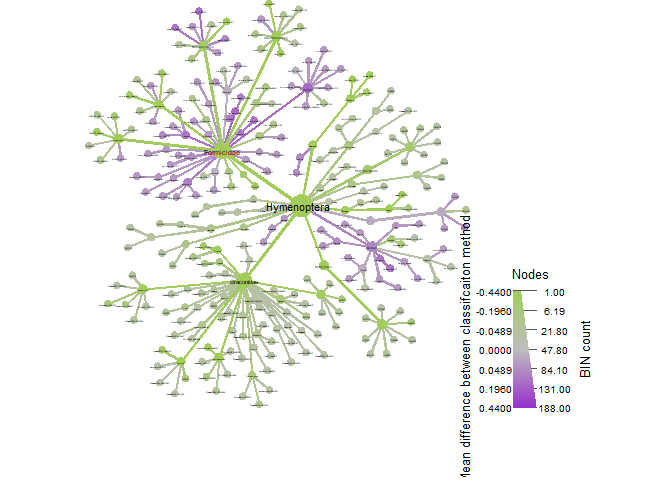<!-- -->

``` r
#>1 minute
obj_LT %>%  metacoder::filter_taxa(taxon_names %in% c("Hymenoptera"),#here is to fliter the figure by groups
              subtaxa = TRUE) -> bees_LT #i know its hymenoptera

ps_bees_LT <- metacoder::as_phyloseq(bees_LT,
                                      otu_table = "tax_data",
                                      otu_id_col = "bold_bin",
                                      sample_data = sample,
                                      sample_id_col = "sampleID")
```

``` r
dev.off()
```

    ## null device 
    ##           1

``` r
vennlist_hymen <- get_vennlist(obj=ps_bees_LT, factorNames="methodClass")
vennp_hymen <- venn.diagram(vennlist_hymen,
                      height=5,
                      width=5, 
                      filename=NULL,
                      disable.logging = TRUE,
                      fill=c("darkolivegreen3", "darkorchid"),
                      cat.col=c("darkolivegreen3", "darkorchid"),
                      alpha = 0.85, 
                      fontfamily = "serif",
                      fontface = "bold",
                      cex = 1.2,
                      cat.cex = 1.3,
                      cat.default.pos = "outer",
                      cat.dist=0.1,
                      margin = 0.1, 
                      lwd = 3,
                      lty ='dotted',
                      imagetype = "svg")
```

    ## INFO [2023-02-16 19:22:40] [[1]]
    ## INFO [2023-02-16 19:22:40] vennlist_hymen
    ## INFO [2023-02-16 19:22:40] 
    ## INFO [2023-02-16 19:22:40] $height
    ## INFO [2023-02-16 19:22:40] [1] 5
    ## INFO [2023-02-16 19:22:40] 
    ## INFO [2023-02-16 19:22:40] $width
    ## INFO [2023-02-16 19:22:40] [1] 5
    ## INFO [2023-02-16 19:22:40] 
    ## INFO [2023-02-16 19:22:40] $filename
    ## INFO [2023-02-16 19:22:40] NULL
    ## INFO [2023-02-16 19:22:40] 
    ## INFO [2023-02-16 19:22:40] $disable.logging
    ## INFO [2023-02-16 19:22:40] [1] TRUE
    ## INFO [2023-02-16 19:22:40] 
    ## INFO [2023-02-16 19:22:40] $fill
    ## INFO [2023-02-16 19:22:40] c("darkolivegreen3", "darkorchid")
    ## INFO [2023-02-16 19:22:40] 
    ## INFO [2023-02-16 19:22:40] $cat.col
    ## INFO [2023-02-16 19:22:40] c("darkolivegreen3", "darkorchid")
    ## INFO [2023-02-16 19:22:40] 
    ## INFO [2023-02-16 19:22:40] $alpha
    ## INFO [2023-02-16 19:22:40] [1] 0.85
    ## INFO [2023-02-16 19:22:40] 
    ## INFO [2023-02-16 19:22:40] $fontfamily
    ## INFO [2023-02-16 19:22:40] [1] "serif"
    ## INFO [2023-02-16 19:22:40] 
    ## INFO [2023-02-16 19:22:40] $fontface
    ## INFO [2023-02-16 19:22:40] [1] "bold"
    ## INFO [2023-02-16 19:22:40] 
    ## INFO [2023-02-16 19:22:40] $cex
    ## INFO [2023-02-16 19:22:40] [1] 1.2
    ## INFO [2023-02-16 19:22:40] 
    ## INFO [2023-02-16 19:22:40] $cat.cex
    ## INFO [2023-02-16 19:22:40] [1] 1.3
    ## INFO [2023-02-16 19:22:40] 
    ## INFO [2023-02-16 19:22:40] $cat.default.pos
    ## INFO [2023-02-16 19:22:40] [1] "outer"
    ## INFO [2023-02-16 19:22:40] 
    ## INFO [2023-02-16 19:22:40] $cat.dist
    ## INFO [2023-02-16 19:22:40] [1] 0.1
    ## INFO [2023-02-16 19:22:40] 
    ## INFO [2023-02-16 19:22:40] $margin
    ## INFO [2023-02-16 19:22:40] [1] 0.1
    ## INFO [2023-02-16 19:22:40] 
    ## INFO [2023-02-16 19:22:40] $lwd
    ## INFO [2023-02-16 19:22:40] [1] 3
    ## INFO [2023-02-16 19:22:40] 
    ## INFO [2023-02-16 19:22:40] $lty
    ## INFO [2023-02-16 19:22:40] [1] "dotted"
    ## INFO [2023-02-16 19:22:40] 
    ## INFO [2023-02-16 19:22:40] $imagetype
    ## INFO [2023-02-16 19:22:40] [1] "svg"
    ## INFO [2023-02-16 19:22:40]

``` r
pdf("./05_trad_metabar_data_files/venn_hymenoptera.pdf")
grid::grid.draw(vennp_hymen)
dev.off()
```

    ## null device 
    ##           1

``` r
set.seed(16)#to make sure the figures is always the same
obj_LT %>%
  metacoder::filter_taxa(taxon_names == "Hemiptera",#here is to fliter the figure by groups
              subtaxa = TRUE) %>% 
  heat_tree(node_label = taxon_names,
            node_size_range = c(0.01, 0.03),
            edge_size_range = c(0.003, 0.005),
            node_size = n_obs, # n_obs is a function that calculates, in this case, the number of OTUs per taxon
            node_color = mean_diff, # A column from `obj_LT$data$diff_table`
            node_color_interval = c(-.44,.44), # The range of the mean_difference to display
            node_color_range = c("darkolivegreen3", "gray", "darkorchid"), # The color palette used
            node_size_axis_label = "BIN count",
            node_color_axis_label = "Mean difference between classification method",
            node_label_size_range = c( 0.003, 0.03),
            layout = "davidson-harel", # The primary layout algorithm
            initial_layout = "reingold-tilford",
            output_file = "./05_trad_metabar_data_files/Hemiptera_heattree.pdf") # The layout algorithm that initializes node locations
```

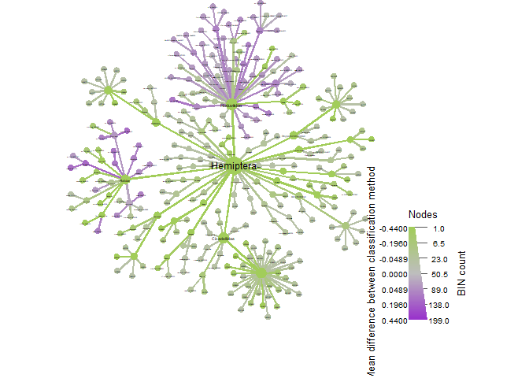<!-- -->

``` r
#>1 minute
obj_LT %>%  metacoder::filter_taxa(taxon_names %in% c("Hemiptera"),#here is to fliter the figure by groups
              subtaxa = TRUE) -> hemi_LT
ps_hemi_LT <- metacoder::as_phyloseq(hemi_LT,
                                      otu_table = "tax_data",
                                      otu_id_col = "bold_bin",
                                      sample_data = sample,
                                      sample_id_col = "sampleID")
```

``` r
dev.off()
```

    ## null device 
    ##           1

``` r
vennlist_hemi <- get_vennlist(obj=ps_hemi_LT, factorNames="methodClass")
vennp_hemi <- venn.diagram(vennlist_hemi,
                      height=5,
                      width=5, 
                      filename=NULL,
                      disable.logging = TRUE,
                      fill=c("darkolivegreen3", "darkorchid"),
                      cat.col=c("darkolivegreen3", "darkorchid"),
                      alpha = 0.85, 
                      fontfamily = "serif",
                      fontface = "bold",
                      cex = 1.2,
                      cat.cex = 1.3,
                      cat.default.pos = "outer",
                      cat.dist=0.1,
                      margin = 0.1, 
                      lwd = 3,
                      lty ='dotted',
                      imagetype = "svg")
```

    ## INFO [2023-02-16 19:22:59] [[1]]
    ## INFO [2023-02-16 19:22:59] vennlist_hemi
    ## INFO [2023-02-16 19:22:59] 
    ## INFO [2023-02-16 19:22:59] $height
    ## INFO [2023-02-16 19:22:59] [1] 5
    ## INFO [2023-02-16 19:22:59] 
    ## INFO [2023-02-16 19:22:59] $width
    ## INFO [2023-02-16 19:22:59] [1] 5
    ## INFO [2023-02-16 19:22:59] 
    ## INFO [2023-02-16 19:22:59] $filename
    ## INFO [2023-02-16 19:22:59] NULL
    ## INFO [2023-02-16 19:22:59] 
    ## INFO [2023-02-16 19:22:59] $disable.logging
    ## INFO [2023-02-16 19:22:59] [1] TRUE
    ## INFO [2023-02-16 19:22:59] 
    ## INFO [2023-02-16 19:22:59] $fill
    ## INFO [2023-02-16 19:22:59] c("darkolivegreen3", "darkorchid")
    ## INFO [2023-02-16 19:22:59] 
    ## INFO [2023-02-16 19:22:59] $cat.col
    ## INFO [2023-02-16 19:22:59] c("darkolivegreen3", "darkorchid")
    ## INFO [2023-02-16 19:22:59] 
    ## INFO [2023-02-16 19:22:59] $alpha
    ## INFO [2023-02-16 19:22:59] [1] 0.85
    ## INFO [2023-02-16 19:22:59] 
    ## INFO [2023-02-16 19:22:59] $fontfamily
    ## INFO [2023-02-16 19:22:59] [1] "serif"
    ## INFO [2023-02-16 19:22:59] 
    ## INFO [2023-02-16 19:22:59] $fontface
    ## INFO [2023-02-16 19:22:59] [1] "bold"
    ## INFO [2023-02-16 19:22:59] 
    ## INFO [2023-02-16 19:22:59] $cex
    ## INFO [2023-02-16 19:22:59] [1] 1.2
    ## INFO [2023-02-16 19:22:59] 
    ## INFO [2023-02-16 19:22:59] $cat.cex
    ## INFO [2023-02-16 19:22:59] [1] 1.3
    ## INFO [2023-02-16 19:22:59] 
    ## INFO [2023-02-16 19:22:59] $cat.default.pos
    ## INFO [2023-02-16 19:22:59] [1] "outer"
    ## INFO [2023-02-16 19:22:59] 
    ## INFO [2023-02-16 19:22:59] $cat.dist
    ## INFO [2023-02-16 19:22:59] [1] 0.1
    ## INFO [2023-02-16 19:22:59] 
    ## INFO [2023-02-16 19:22:59] $margin
    ## INFO [2023-02-16 19:22:59] [1] 0.1
    ## INFO [2023-02-16 19:22:59] 
    ## INFO [2023-02-16 19:22:59] $lwd
    ## INFO [2023-02-16 19:22:59] [1] 3
    ## INFO [2023-02-16 19:22:59] 
    ## INFO [2023-02-16 19:22:59] $lty
    ## INFO [2023-02-16 19:22:59] [1] "dotted"
    ## INFO [2023-02-16 19:22:59] 
    ## INFO [2023-02-16 19:22:59] $imagetype
    ## INFO [2023-02-16 19:22:59] [1] "svg"
    ## INFO [2023-02-16 19:22:59]

``` r
pdf("./05_trad_metabar_data_files/venn_hemiptera.pdf")
grid::grid.draw(vennp_hemi)
dev.off()
```

    ## null device 
    ##           1

``` r
set.seed(16)#to make sure the figures is always the same
obj_LT %>%
  metacoder::filter_taxa(taxon_names == "Blattodea",#here is to filter the figure by groups
              subtaxa = TRUE) %>% 
  heat_tree(node_label = taxon_names,
            node_size_range = c(0.01, 0.03),
            edge_size_range = c(0.003, 0.005),
            node_size = n_obs, # n_obs is a function that calculates, in this case, the number of OTUs per taxon
            node_color = mean_diff, # A column from `obj_LT$data$diff_table`
            node_color_interval = c(-.44,.44), # The range of the mean_difference to display
            node_color_range = c("darkolivegreen3", "gray", "darkorchid"), # The color palette used
            node_size_axis_label = "BIN count",
            node_color_axis_label = "Mean difference between classification methods",
            node_label_size_range = c( 0.003, 0.03),
            layout = "davidson-harel", # The primary layout algorithm
            initial_layout = "reingold-tilford",
            output_file = "./05_trad_metabar_data_files/Blattodea_heattree.pdf") # The layout algorithm that initializes node locations
```

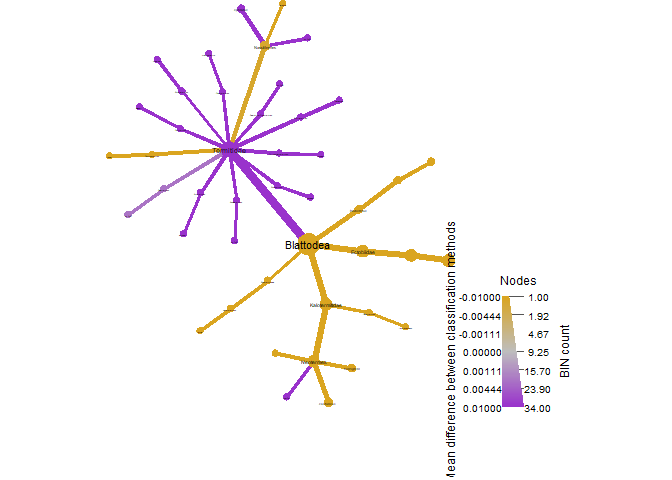<!-- -->

``` r
#<1 minute
obj_LT %>%  metacoder::filter_taxa(taxon_names %in% c("Blattodea"),#here is to fliter the figure by groups
              subtaxa = TRUE) -> blats_LT 

ps_blats_LT <- metacoder::as_phyloseq(blats_LT,
                                      otu_table = "tax_data",
                                      otu_id_col = "bold_bin",
                                      sample_data = sample,
                                      sample_id_col = "sampleID")
```

``` r
dev.off()
```

    ## null device 
    ##           1

``` r
vennlist_blats <- get_vennlist(obj=ps_blats_LT, factorNames="methodClass")
vennp_blats <- venn.diagram(vennlist_blats,
                      height=5,
                      width=5, 
                      filename=NULL,
                      disable.logging = TRUE,
                      fill=c("darkolivegreen3", "darkorchid"),
                      cat.col=c("darkolivegreen3", "darkorchid"),
                      alpha = 0.85, 
                      fontfamily = "serif",
                      fontface = "bold",
                      cex = 1.2,
                      cat.cex = 1.3,
                      cat.default.pos = "outer",
                      cat.dist=0.1,
                      margin = 0.1, 
                      lwd = 3,
                      lty ='dotted',
                      imagetype = "svg")
```

    ## INFO [2023-02-16 19:23:11] [[1]]
    ## INFO [2023-02-16 19:23:11] vennlist_blats
    ## INFO [2023-02-16 19:23:11] 
    ## INFO [2023-02-16 19:23:11] $height
    ## INFO [2023-02-16 19:23:11] [1] 5
    ## INFO [2023-02-16 19:23:11] 
    ## INFO [2023-02-16 19:23:11] $width
    ## INFO [2023-02-16 19:23:11] [1] 5
    ## INFO [2023-02-16 19:23:11] 
    ## INFO [2023-02-16 19:23:11] $filename
    ## INFO [2023-02-16 19:23:11] NULL
    ## INFO [2023-02-16 19:23:11] 
    ## INFO [2023-02-16 19:23:11] $disable.logging
    ## INFO [2023-02-16 19:23:11] [1] TRUE
    ## INFO [2023-02-16 19:23:11] 
    ## INFO [2023-02-16 19:23:11] $fill
    ## INFO [2023-02-16 19:23:11] c("darkolivegreen3", "darkorchid")
    ## INFO [2023-02-16 19:23:11] 
    ## INFO [2023-02-16 19:23:11] $cat.col
    ## INFO [2023-02-16 19:23:11] c("darkolivegreen3", "darkorchid")
    ## INFO [2023-02-16 19:23:11] 
    ## INFO [2023-02-16 19:23:11] $alpha
    ## INFO [2023-02-16 19:23:11] [1] 0.85
    ## INFO [2023-02-16 19:23:11] 
    ## INFO [2023-02-16 19:23:11] $fontfamily
    ## INFO [2023-02-16 19:23:11] [1] "serif"
    ## INFO [2023-02-16 19:23:11] 
    ## INFO [2023-02-16 19:23:11] $fontface
    ## INFO [2023-02-16 19:23:11] [1] "bold"
    ## INFO [2023-02-16 19:23:11] 
    ## INFO [2023-02-16 19:23:11] $cex
    ## INFO [2023-02-16 19:23:11] [1] 1.2
    ## INFO [2023-02-16 19:23:11] 
    ## INFO [2023-02-16 19:23:11] $cat.cex
    ## INFO [2023-02-16 19:23:11] [1] 1.3
    ## INFO [2023-02-16 19:23:11] 
    ## INFO [2023-02-16 19:23:11] $cat.default.pos
    ## INFO [2023-02-16 19:23:11] [1] "outer"
    ## INFO [2023-02-16 19:23:11] 
    ## INFO [2023-02-16 19:23:11] $cat.dist
    ## INFO [2023-02-16 19:23:11] [1] 0.1
    ## INFO [2023-02-16 19:23:11] 
    ## INFO [2023-02-16 19:23:11] $margin
    ## INFO [2023-02-16 19:23:11] [1] 0.1
    ## INFO [2023-02-16 19:23:11] 
    ## INFO [2023-02-16 19:23:11] $lwd
    ## INFO [2023-02-16 19:23:11] [1] 3
    ## INFO [2023-02-16 19:23:11] 
    ## INFO [2023-02-16 19:23:11] $lty
    ## INFO [2023-02-16 19:23:11] [1] "dotted"
    ## INFO [2023-02-16 19:23:11] 
    ## INFO [2023-02-16 19:23:11] $imagetype
    ## INFO [2023-02-16 19:23:11] [1] "svg"
    ## INFO [2023-02-16 19:23:11]

``` r
pdf("./05_trad_metabar_data_files/venn_termites.pdf")
grid::grid.draw(vennp_blats)
dev.off()
```

    ## null device 
    ##           1

``` r
set.seed(16)#to make sure the figures is always the same
obj_LT %>%
  metacoder::filter_taxa(taxon_names == "Trichoptera",#here is to filter the figure by groups
              subtaxa = TRUE) %>% 
  heat_tree(node_label = taxon_names,
            node_size_range = c(0.01, 0.03),
            edge_size_range = c(0.003, 0.005),
            node_size = n_obs, # n_obs is a function that calculates, in this case, the number of OTUs per taxon
            node_color = mean_diff, # A column from `obj_LT$data$diff_table`
            node_color_interval = c(-0.01,0.01), # The range of the mean_difference to display
            node_color_range = c("darkolivegreen3", "gray", "darkorchid"), # The color palette used
            node_size_axis_label = "BIN count",
            node_color_axis_label = "Mean difference between classification methods",
            node_label_size_range = c( 0.003, 0.03),
            layout = "davidson-harel", # The primary layout algorithm
            initial_layout = "reingold-tilford",
            output_file = "./05_trad_metabar_data_files/Trichoptera_heattree.pdf") # The layout algorithm that initializes node locations
```

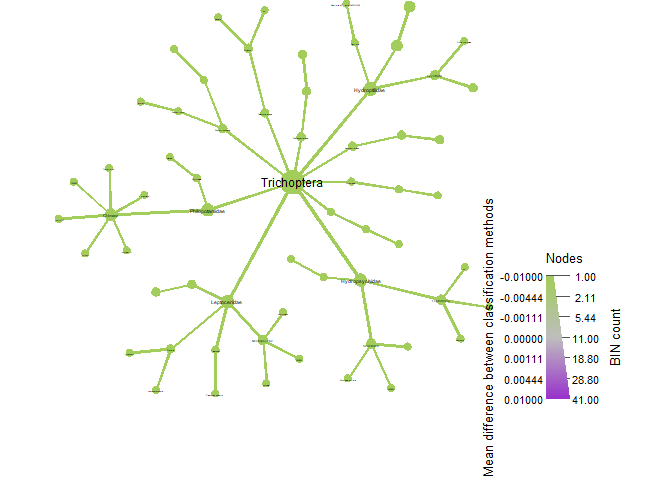<!-- -->

``` r
set.seed(16)#to make sure the figures is always the same
obj_LT %>%
  metacoder::filter_taxa(taxon_names =="Diptera" ,#here is to filter the figure by groups
              subtaxa = TRUE) %>% 
  heat_tree(node_label = taxon_names,
            node_size_range = c(0.01, 0.03),
            edge_size_range = c(0.003, 0.005),
            node_size = n_obs, # n_obs is a function that calculates, in this case, the number of OTUs per taxon
            node_color = mean_diff, # A column from `obj_LT$data$diff_table`
            node_color_interval = c(-0.01,0.01), # The range of the mean_difference to display
            node_color_range = c("darkolivegreen3", "gray", "darkorchid"), # The color palette used
            node_size_axis_label = "BIN count",
            node_color_axis_label = "Mean difference between classification methods",
            node_label_size_range = c( 0.003, 0.03),
            layout = "davidson-harel", # The primary layout algorithm
            initial_layout = "reingold-tilford",
            output_file = "./05_trad_metabar_data_files/Diptera_heattree.pdf") # The layout algorithm that initializes node locations
```

<!-- -->

Finally, we refine further to include focal families only. This is the
true comparison beteween Metabarcoding and Traditional records as it
focuses only on apples and apples (geometridae from metabarcoding and
geometridae from traditional records, instead of ALL leps.)

``` r
obj_LT %>% metacoder::filter_taxa(taxon_names %in% c("Geometridae"),subtaxa = TRUE) -> geom_LT
ps_geom_LT <- metacoder::as_phyloseq(geom_LT,otu_table = "tax_data",otu_id_col = "bold_bin",sample_data = sample,sample_id_col = "sampleID") %>% microViz::tax_mutate(rank_0 = "Animalia",rank_01 = "Arthropoda", rank_02 = "Insecta", rank_03 = "Lepidoptera", .before = 1) -> ps_geom_LT
```

    ## Warning: Discarding non-numeric columns in OTU table:   classification

``` r
colnames(tax_table(ps_geom_LT)) <- c("k__", "p__", "o__", "c__", "f__", "g__", "s__")

obj_LT %>% metacoder::filter_taxa(taxon_names %in% c("Erebidae"), subtaxa = TRUE) -> ereb_LT
ps_ereb_LT <- metacoder::as_phyloseq(ereb_LT,otu_table = "tax_data",otu_id_col = "bold_bin",sample_data = sample,sample_id_col = "sampleID")%>% microViz::tax_mutate(rank_0 = "Animalia",rank_01 = "Arthropoda", rank_02 = "Insecta", rank_03 = "Lepidoptera", .before = 1) -> ps_ereb_LT
```

    ## Warning: Discarding non-numeric columns in OTU table:   classification

``` r
colnames(tax_table(ps_ereb_LT)) <- c("k__", "p__", "o__", "c__", "f__", "g__", "s__")

obj_LT %>% metacoder::filter_taxa(taxon_names %in% c("Crambidae"), subtaxa = TRUE) -> cramb_LT
ps_cramb_LT <- metacoder::as_phyloseq(cramb_LT,otu_table = "tax_data",otu_id_col = "bold_bin",sample_data = sample,sample_id_col = "sampleID")%>% microViz::tax_mutate(rank_0 = "Animalia",rank_01 = "Arthropoda", rank_02 = "Insecta", rank_03 = "Lepidoptera", .before = 1) -> ps_cramb_LT
```

    ## Warning: Discarding non-numeric columns in OTU table:   classification

``` r
colnames(tax_table(ps_cramb_LT)) <- c("k__", "p__", "o__", "c__", "f__", "g__", "s__")

obj_LT %>% metacoder::filter_taxa(taxon_names %in% c("Saturniidae"), subtaxa = TRUE) -> satur_LT
ps_satur_LT <- metacoder::as_phyloseq(satur_LT,otu_table = "tax_data",otu_id_col = "bold_bin",sample_data = sample,sample_id_col = "sampleID")%>% microViz::tax_mutate(rank_0 = "Animalia",rank_01 = "Arthropoda", rank_02 = "Insecta", rank_03 = "Lepidoptera", .before = 1) -> ps_satur_LT
```

    ## Warning: Discarding non-numeric columns in OTU table:   classification

``` r
colnames(tax_table(ps_satur_LT)) <- c("k__", "p__", "o__", "c__", "f__", "g__", "s__")

obj_LT %>% metacoder::filter_taxa(taxon_names %in% c("Noctuidae"), subtaxa = TRUE) -> noctuid_LT
ps_noctuid_LT <- metacoder::as_phyloseq(noctuid_LT,otu_table = "tax_data",otu_id_col = "bold_bin",sample_data = sample,sample_id_col = "sampleID")%>% microViz::tax_mutate(rank_0 = "Animalia",rank_01 = "Arthropoda", rank_02 = "Insecta", rank_03 = "Lepidoptera", .before = 1) -> ps_noctuid_LT
```

    ## Warning: Discarding non-numeric columns in OTU table:   classification

``` r
colnames(tax_table(ps_noctuid_LT)) <- c("k__", "p__", "o__", "c__", "f__", "g__", "s__")

obj_LT %>% metacoder::filter_taxa(taxon_names %in% c("Nymphalidae"), subtaxa = TRUE) -> nymph_LT
ps_nymph_LT <- metacoder::as_phyloseq(nymph_LT,otu_table = "tax_data",otu_id_col = "bold_bin",sample_data = sample,sample_id_col = "sampleID")%>% microViz::tax_mutate(rank_0 = "Animalia",rank_01 = "Arthropoda", rank_02 = "Insecta", rank_03 = "Lepidoptera", .before = 1) -> ps_nymph_LT
```

    ## Warning: Discarding non-numeric columns in OTU table:   classification

``` r
colnames(tax_table(ps_nymph_LT)) <- c("k__", "p__", "o__", "c__", "f__", "g__", "s__")

obj_LT %>% metacoder::filter_taxa(taxon_names %in% c("Hesperiidae"), subtaxa = TRUE) -> hesp_LT
ps_hesp_LT <- metacoder::as_phyloseq(hesp_LT,otu_table = "tax_data",otu_id_col = "bold_bin",sample_data = sample,sample_id_col = "sampleID")%>% microViz::tax_mutate(rank_0 = "Animalia",rank_01 = "Arthropoda", rank_02 = "Insecta", rank_03 = "Lepidoptera", .before = 1) -> ps_hesp_LT
```

    ## Warning: Discarding non-numeric columns in OTU table:   classification

``` r
colnames(tax_table(ps_hesp_LT)) <- c("k__", "p__", "o__", "c__", "f__", "g__", "s__")

obj_LT %>% metacoder::filter_taxa(taxon_names %in% c("Pyralidae"), subtaxa = TRUE) -> pyra_LT
ps_pyra_LT <- metacoder::as_phyloseq(pyra_LT,otu_table = "tax_data",otu_id_col = "bold_bin",sample_data = sample,sample_id_col = "sampleID")%>% microViz::tax_mutate(rank_0 = "Animalia",rank_01 = "Arthropoda", rank_02 = "Insecta", rank_03 = "Lepidoptera", .before = 1) -> ps_pyra_LT
```

    ## Warning: Discarding non-numeric columns in OTU table:   classification

``` r
colnames(tax_table(ps_pyra_LT)) <- c("k__", "p__", "o__", "c__", "f__", "g__", "s__")

obj_LT %>% metacoder::filter_taxa(taxon_names %in% c("Scarabaeidae"), subtaxa = TRUE) -> scarab_LT
ps_scarab_LT <- metacoder::as_phyloseq(scarab_LT,otu_table = "tax_data",otu_id_col = "bold_bin",sample_data = sample,sample_id_col = "sampleID")%>% microViz::tax_mutate(rank_0 = "Animalia",rank_01 = "Arthropoda", rank_02 = "Insecta", rank_03 = "Coleoptera", .before = 1) -> ps_scarab_LT
```

    ## Warning: Discarding non-numeric columns in OTU table:   classification

``` r
colnames(tax_table(ps_scarab_LT)) <- c("k__", "p__", "o__", "c__", "f__", "g__", "s__")

obj_LT %>% metacoder::filter_taxa(taxon_names %in% c("Curculionidae"), subtaxa = TRUE) -> curcu_LT
ps_curcu_LT <- metacoder::as_phyloseq(curcu_LT,otu_table = "tax_data",otu_id_col = "bold_bin",sample_data = sample,sample_id_col = "sampleID")%>% microViz::tax_mutate(rank_0 = "Animalia",rank_01 = "Arthropoda", rank_02 = "Insecta", rank_03 = "Coleoptera", .before = 1) -> ps_curcu_LT
```

    ## Warning: Discarding non-numeric columns in OTU table:   classification

``` r
colnames(tax_table(ps_curcu_LT)) <- c("k__", "p__", "o__", "c__", "f__", "g__", "s__")

obj_LT %>% metacoder::filter_taxa(taxon_names %in% c("Passalidae"), subtaxa = TRUE) -> passa_LT
ps_passa_LT <- metacoder::as_phyloseq(passa_LT,otu_table = "tax_data",otu_id_col = "bold_bin",sample_data = sample,sample_id_col = "sampleID")%>% microViz::tax_mutate(rank_0 = "Animalia",rank_01 = "Arthropoda", rank_02 = "Insecta", rank_03 = "Coleoptera", .before = 1) -> ps_passa_LT
```

    ## Warning: Discarding non-numeric columns in OTU table:   classification

``` r
colnames(tax_table(ps_passa_LT)) <- c("k__", "p__", "o__", "c__", "f__", "g__", "s__")

obj_LT %>% metacoder::filter_taxa(taxon_names %in% c("Formicidae"), subtaxa = TRUE) -> ants_LT
ps_ants_LT <- metacoder::as_phyloseq(ants_LT,otu_table = "tax_data",otu_id_col = "bold_bin",sample_data = sample,sample_id_col = "sampleID")%>% microViz::tax_mutate(rank_0 = "Animalia",rank_01 = "Arthropoda", rank_02 = "Insecta", rank_03 = "Hymenoptera", .before = 1) -> ps_ants_LT
```

    ## Warning: Discarding non-numeric columns in OTU table:   classification

``` r
colnames(tax_table(ps_ants_LT)) <- c("k__", "p__", "o__", "c__", "f__", "g__", "s__")

obj_LT %>% metacoder::filter_taxa(taxon_names %in% c("Apidae"), subtaxa = TRUE) -> bees_LT
ps_bees_LT <- metacoder::as_phyloseq(bees_LT,otu_table = "tax_data",otu_id_col = "bold_bin",sample_data = sample,sample_id_col = "sampleID")%>% microViz::tax_mutate(rank_0 = "Animalia",rank_01 = "Arthropoda", rank_02 = "Insecta", rank_03 = "Hymenoptera", .before = 1) -> ps_bees_LT
```

    ## Warning: Discarding non-numeric columns in OTU table:   classification

``` r
colnames(tax_table(ps_bees_LT)) <- c("k__", "p__", "o__", "c__", "f__", "g__", "s__")

obj_LT %>% metacoder::filter_taxa(taxon_names %in% c("Flatidae"), subtaxa = TRUE) -> flat_LT
ps_flat_LT <- metacoder::as_phyloseq(flat_LT,otu_table = "tax_data",otu_id_col = "bold_bin",sample_data = sample,sample_id_col = "sampleID")%>% microViz::tax_mutate(rank_0 = "Animalia",rank_01 = "Arthropoda", rank_02 = "Insecta", rank_03 = "Hemiptera", .before = 1) -> ps_flat_LT
```

    ## Warning: Discarding non-numeric columns in OTU table:   classification

``` r
colnames(tax_table(ps_flat_LT)) <- c("k__", "p__", "o__", "c__", "f__", "g__", "s__")

obj_LT %>% metacoder::filter_taxa(taxon_names %in% c("Reduviidae"), subtaxa = TRUE) -> reds_LT
ps_reds_LT <- metacoder::as_phyloseq(reds_LT,otu_table = "tax_data",otu_id_col = "bold_bin",sample_data = sample,sample_id_col = "sampleID")%>% microViz::tax_mutate(rank_0 = "Animalia",rank_01 = "Arthropoda", rank_02 = "Insecta", rank_03 = "Hemiptera", .before = 1) -> ps_reds_LT
```

    ## Warning: Discarding non-numeric columns in OTU table:   classification

``` r
colnames(tax_table(ps_reds_LT)) <- c("k__", "p__", "o__", "c__", "f__", "g__", "s__")

#obj_LT %>% metacoder::filter_taxa(taxon_names %in% c("Termitidae"), subtaxa = TRUE) -> termit_LT
#ps_termit_LT <- metacoder::as_phyloseq(termit_LT,otu_table = "tax_data",otu_id_col = "bold_bin",sample_data = sample,sample_id_col = "sampleID")%>% microViz::tax_mutate(rank_0 = "Animalia",rank_01 = "Arthropoda", rank_02 = "Insecta", rank_03 = "Blattodea", .before = 1) -> ps_termit_LT
#colnames(tax_table(ps_termit_LT)) <- c("k__", "p__", "o__", "c__", "f__", "g__", "s__")

#obj_LT %>% metacoder::filter_taxa(taxon_names %in% c("Kalotermitidae"), subtaxa = TRUE) -> kalo_LT
#ps_kalo_LT <- metacoder::as_phyloseq(kalo_LT,otu_table = "tax_data",otu_id_col = "bold_bin",sample_data = sample,sample_id_col = "sampleID")%>% microViz::tax_mutate(rank_0 = "Animalia",rank_01 = "Arthropoda", rank_02 = "Insecta", rank_03 = "Blattodea", .before = 1) -> ps_kalo_LT
#colnames(tax_table(ps_kalo_LT)) <- c("k__", "p__", "o__", "c__", "f__", "g__", "s__")

obj_LT %>% metacoder::filter_taxa(taxon_names %in% c("Blattodea"), subtaxa = TRUE) -> all_termites_LT
ps_all_termites_LT <- metacoder::as_phyloseq(all_termites_LT,otu_table = "tax_data",otu_id_col = "bold_bin",sample_data = sample,sample_id_col = "sampleID")%>% microViz::tax_mutate(rank_0 = "Animalia",rank_01 = "Arthropoda", rank_02 = "Insecta", .before = 1) -> ps_all_termites_LT
```

    ## Warning: Discarding non-numeric columns in OTU table:   classification

``` r
colnames(tax_table(ps_all_termites_LT)) <- c("k__", "p__", "o__", "c__", "f__", "g__", "s__")
```

``` r
set.seed(16)#to make sure the figures is always the same
geom_LT %>%
  heat_tree(node_label = taxon_names,
            node_size_range = c(0.01, 0.03),
            edge_size_range = c(0.003, 0.005),
            node_size = n_obs, # n_obs is a function that calculates, in this case, the number of OTUs per taxon
            node_color = mean_diff, # A column from `obj_LT$data$diff_table`
            node_color_interval = c(-.44,.44), # The range of the mean_difference to display
            node_color_range = c("darkolivegreen3", "gray", "darkorchid"), # The color palette used
            node_size_axis_label = "BIN count",
            node_color_axis_label = "Mean difference between classification methods",
            node_label_size_range = c( 0.003, 0.03),
            layout = "davidson-harel", # The primary layout algorithm
            initial_layout = "reingold-tilford",
            output_file = "./05_trad_metabar_data_files/geometridae_heattree.pdf") # The layout algorithm that initializes node locations
```

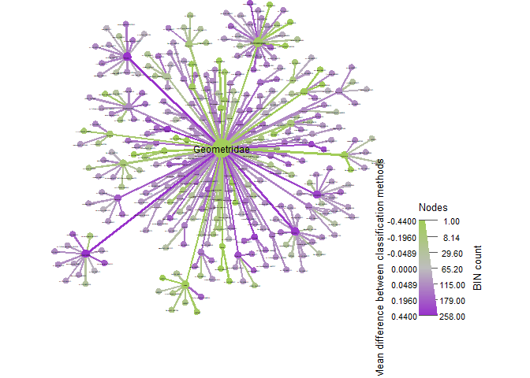<!-- -->

``` r
set.seed(16)#to make sure the figures is always the same
ereb_LT %>%
  heat_tree(node_label = taxon_names,
            node_size_range = c(0.01, 0.03),
            edge_size_range = c(0.003, 0.005),
            node_size = n_obs, # n_obs is a function that calculates, in this case, the number of OTUs per taxon
            node_color = mean_diff, # A column from `obj_LT$data$diff_table`
            node_color_interval = c(-.44,.44), # The range of the mean_difference to display
            node_color_range = c("darkolivegreen3", "gray", "darkorchid"), # The color palette used
            node_size_axis_label = "BIN count",
            node_color_axis_label = "Mean difference between classification methods",
            node_label_size_range = c( 0.003, 0.03),
            layout = "davidson-harel", # The primary layout algorithm
            initial_layout = "reingold-tilford",
            output_file = "./05_trad_metabar_data_files/erebidae_heattree.pdf") # The layout algorithm that initializes node locations
```

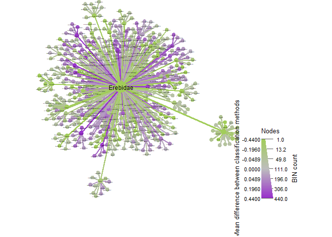<!-- -->

``` r
ereb_LT$data$taxon_abund <- calc_taxon_abund(ereb_LT, "tax_data", cols = sample_LT$sampleID, groups = sample_LT$methodClass)
```

    ## Summing per-taxon counts from 116 columns in 2 groups for 748 taxa

``` r
taxon_names(ereb_LT)[ereb_LT$data$taxon_abund$trad > 0 & ereb_LT$data$taxon_abund$metabr > 0] #THIS SHOWS US THE OVERLAPPING SPECIES
```

    ##                     abm                     aqb                     aqw 
    ##              "Erebidae"                "Talara"               "Odozana" 
    ##                     arc                     arf                     ari 
    ##               "Aclytia"           "Lepidoneiva"            "Correbidia" 
    ##                     arj                     arl                     arm 
    ##              "Xanthyda"               "Balbura"              "Ormetica" 
    ##                     arn                     aro                     arq 
    ##            "Psoloptera"           "Leucopleura"            "Episcepsis" 
    ##                     arr                     arv                     arw 
    ##                "Virbia"               "Ecdemus"              "Hyalurga" 
    ##                     ary                     arz                     asd 
    ##           "Chrysostola"                "Melese"         "Andrenimorpha" 
    ##                     ath                     atk                     aua 
    ##                "Anomis"             "Oxidercia"             "Coenipeta" 
    ##                     avd                     avi                     avl 
    ##            "Encruphion"               "Ophisma"            "Uranophora" 
    ##                     avm                     avn                     avo 
    ##           "Rhabdatomis"                "Illice"             "Prepiella" 
    ##                     avp                     avx                     axg 
    ##         "Lycomorphodes"           "Poliopastea"                "Munona" 
    ##                     axl                     axn                     axx 
    ##            "Antiblemma"          "Near Biturix"               "Perasia" 
    ##                     ayc                     ayt                     ayv 
    ##              "Sosxetra"              "Eucereon"             "Melipotis" 
    ##                     azb                     azm                     azz 
    ##            "Metallosia"             "Euclystis"                 "Agyra" 
    ##                     baa                     bai                     bar 
    ##                "Amaxia"           "Phaeoblemma"               "Deinopa" 
    ##                     baw                     bbe                     bbo 
    ##               "Isogona"              "Macrodes"               "Chamyna" 
    ##                     bcd                     bcm                     bcn 
    ##          "Hemicephalis"              "Obroatis"           "Phyprosopus" 
    ##                     bcw                     bcy                     bdh 
    ##                 "Pheia"           "Eulepidotis"          "Pseudbarydia" 
    ##                     bdk                     bea                     bfd 
    ##             "Ceromacra"                "Agylla"              "Scaptius" 
    ##                     bfo                     bfx                     bgc 
    ##          "Hemeroblemma"               "Saurita"                "Gabara" 
    ##                     bgj                     bgu                     bgw 
    ##             "Celiptera"               "Opharus"        "Cryptochrostis" 
    ##                     bho                     bht                     bhu 
    ##            "Rejectaria"               "Tyrissa"                      "" 
    ##                     bhy                     bin                     bip 
    ##               "Renodes"             "Dialithis"                 "Renia" 
    ##                     bjf                     bjg                     bji 
    ##                "Sarosa"               "Athyrma"             "Dysschema" 
    ##                     bjq                     bka                     bkh 
    ##              "Nodozana"             "Cosmosoma"            "Herminodes" 
    ##                     blk                     bmg                     boy 
    ##            "Sauritinia"               "Elysius"               "Timalus" 
    ##                     bpp                     bqg                     brc 
    ##               "Heliura"            "Acridopsis"             "Calonotos" 
    ##                     bru                     bsw                     btg 
    ##           "Leucanopsis"     "Catocalinae_genus"            "Hypocladia" 
    ##                     bti                     btj                     btk 
    ##             "Arctiinae"            "Hypocharis"             "Haemanota" 
    ##                     btl                     btn                     bts 
    ##              "Gymnelia"              "Euthyone"               "Nitoris" 
    ##                     btz                     bua                     bue 
    ##                "Clapra"              "Peteroma"               "Agaraea" 
    ##                     buh                     bui                     bus 
    ##          "Callisthenia"             "Gaudeator"           "Argyroeides" 
    ##                     bxb                     byh                     cbg 
    ##        "Erebidae_genus"               "Sarsina"           "Pseudosphex" 
    ##                     ccv                     cdo                     ciy 
    ##           "Erebostrota"                "Dyomyx"               "Ramphia" 
    ##                     ckp                     ckt                     clj 
    ##           "Leucotmemis"         "Coccabdominis"              "Tricypha" 
    ##                     clu                     cmj                     crc 
    ##                "Pionia"          "Epeiromulona"                  "Zale" 
    ##                     crf                     dcs                     dms 
    ##         "Metaprosphera"                "Hyamia"                "sp.3YB" 
    ##                     dod                     dog                     doj 
    ##              "teuthras"           "costinotata"           "intervenata" 
    ##                     dok                     dol                     dom 
    ##               "sicilia"             "thoracica"               "elegans" 
    ##                     don                     dov                     dow 
    ##               "ciarana"             "obscurata"         "Hyalurga sora" 
    ##                     dox                     dpa                     dpb 
    ##             "hypoleuca"               "ataenia"               "vinasia" 
    ##                     dpc                     dqw                     dqz 
    ##              "incertus"              "luridula"            "thaumantis" 
    ##                     dte                     dtt                     dtv 
    ##               "Poole01"                  "cora"              "pexicera" 
    ##                     dtw                     dwi                     dws 
    ##               "bicolor"       "robpuschendorfi"               "sp. 1YB" 
    ##                     dxi                     dxt                     dyk 
    ##               "helvina"                 "grata"                "aeolum" 
    ##                     dyy                     dzk                     eac 
    ##                "nitens"     "Euclystis guerini"      "rocioecheverriae" 
    ##                     eal                     ebc                     ebl 
    ##                 "dares"              "natatrix"            "signiplena" 
    ##                     ecj                     edu                     edz 
    ##               "modesta"                 "alesa"             "distincta" 
    ##                     eea                     eep                     efj 
    ##            "parthenope"             "albisigna"                "japeta" 
    ##                     efo                     efx                     egi 
    ##                "putida"                "sp.1YB"              "BioLep05" 
    ##                     ehz                     eiq                     eir 
    ##          "chrysoperina"               "Poole27"            "ochrolinea" 
    ##                     ejs                     eka                     ekc 
    ##               "labecia"              "carinosa"               "helvina" 
    ##                     ekw                     eng                     eoa 
    ##                 "gemma"               "auripes"             "gemmifera" 
    ##                     eox                     epa                     epi 
    ##              "superior"               "guttata"                  "azia" 
    ##                     epk                     epn                     epp 
    ##               "Poole01"              "perplexa"             "chloropis" 
    ##                     epy                     eqd                     eqp 
    ##             "picturata"                  "cara"           "paucipuncta" 
    ##                     ero                     esf                     ety 
    ##              "punctata"              "urioides"    "Sauritinia concisa" 
    ##                     evc                     evh                     evi 
    ##               "Poole06"                "nubila"                "sp.2YB" 
    ##                     evk                     ezb                     fam 
    ##                "venata"                "sixola"             "leucomela" 
    ##                     fbn                     fbs                     fcg 
    ##                "sp.1YB"             "solicauda"               "flavala" 
    ##                     fdr                     feb                     ffe 
    ##            "sp.AAJ0944"                "sp.1YB"                 "ypita" 
    ##                     ffk                     ffz                     fgh 
    ##                "sp.1YB" "Euclystis centurialis"              "pometina" 
    ##                     fgi                     fje                     fjp 
    ##               "Poole07"   "Tyrissa perstrigata"                "sp.1YB" 
    ##                     fkg                     fkh                     fki 
    ##             "thersites"             "restricta"              "bioptera" 
    ##                     fkk                     fkl                     fkq 
    ##            "violescens"           "minynthadia"               "AAM3396" 
    ##                     fks                     fku                     fkv 
    ##                "sp.1YB"               "rosacea"             "thysbodes" 
    ##                     fkx                     flb                     flh 
    ##               "salvini"                "sp.4YB"                  "moza" 
    ##                     fli                     flt                     flv 
    ##            "sp.AAM5154"           "asthenoides"                "sp.1YB" 
    ##                     fmb                     fmd                     fmg 
    ##                "sp.1YB"                "sp.1YB"                "sp.1YB" 
    ##                     fmj                     fmk                     fmn 
    ##                "sp.4YB"                "sp.1YB"              "truncata" 
    ##                     fmq                     fnp                     fnu 
    ##              "paidicus"            "metallicus"               "decepta" 
    ##                     fth                     fwt                     gbv 
    ##                "sp.1YB"              "BioLep02"            "despagnesi" 
    ##                     ggj                     ghr                     ght 
    ##         "steneleaDHJ01"  "perpendicularisDHJ01"                "sp.1YB" 
    ##                     gng                     gqr                     grf 
    ##                "sp.1YB"               "anselma"              "adjutrix" 
    ##                     grj                     gsj                     gsu 
    ##                "sp.2YB"                 "saron"                 "asana" 
    ##                     gtl                     gtp                     gtu 
    ##              "mentiens"            "dorsisigna"              "albizona" 
    ##                     guf                     gxw                     gzf 
    ##                "turpis"            "sp.ACC9481"            "imperialis" 
    ##                     gzy                     gzz                     han 
    ##              "cyllarus"                "sp.1YB"               "affinis" 
    ##                     hbg                     hbq                     hcc 
    ##               "lephina"          "chalcosticta"            "grisescens" 
    ##                     hfj                     hmz                     ica 
    ##               "simplex"             "excellens"                "sp.2YB" 
    ##                     icm                     iep                     ijb 
    ##                "sp.1YB"                "sp.7YB"          "palpitatalis" 
    ##                     ijn                     ijr                     ioh 
    ##               "poole13"                "sp.1YB"                "sp.1YB"

``` r
set.seed(16)#to make sure the figures is always the same
cramb_LT %>%
  heat_tree(node_label = taxon_names,
            node_size_range = c(0.01, 0.03),
            edge_size_range = c(0.003, 0.005),
            node_size = n_obs, # n_obs is a function that calculates, in this case, the number of OTUs per taxon
            node_color = mean_diff, # A column from `obj_LT$data$diff_table`
            node_color_interval = c(-.44,.44), # The range of the mean_difference to display
            node_color_range = c("darkolivegreen3", "gray", "darkorchid"), # The color palette used
            node_size_axis_label = "BIN count",
            node_color_axis_label = "Mean difference between classification methods",
            node_label_size_range = c( 0.003, 0.03),
            layout = "davidson-harel", # The primary layout algorithm
            initial_layout = "reingold-tilford",
            output_file = "./05_trad_metabar_data_files/crambiade_heattree.pdf") # The layout algorithm that initializes node locations
```

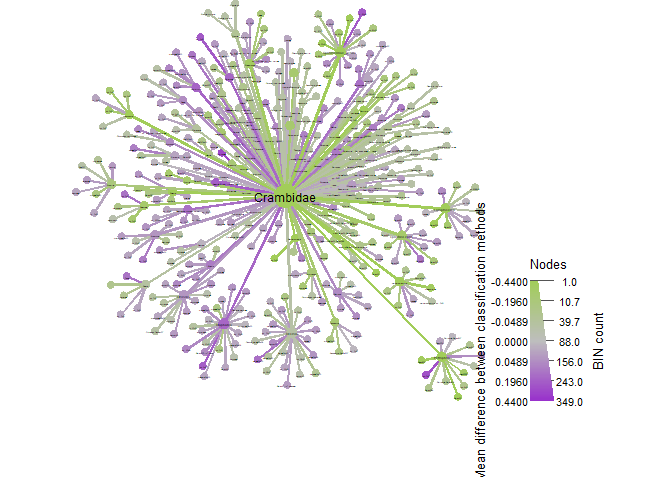<!-- -->

``` r
set.seed(16)#to make sure the figures is always the same
satur_LT %>%
  heat_tree(node_label = taxon_names,
            node_size_range = c(0.01, 0.03),
            edge_size_range = c(0.003, 0.005),
            node_size = n_obs, # n_obs is a function that calculates, in this case, the number of OTUs per taxon
            node_color = mean_diff, # A column from `obj_LT$data$diff_table`
            node_color_interval = c(-.44,.44), # The range of the mean_difference to display
            node_color_range = c("darkolivegreen3", "gray", "darkorchid"), # The color palette used
            node_size_axis_label = "BIN count",
            node_color_axis_label = "Mean difference between classification methods",
            node_label_size_range = c( 0.003, 0.03),
            layout = "davidson-harel", # The primary layout algorithm
            initial_layout = "reingold-tilford",
            output_file = "./05_trad_metabar_data_files/saturnidae_heattree.pdf") # The layout algorithm that initializes node locations
```

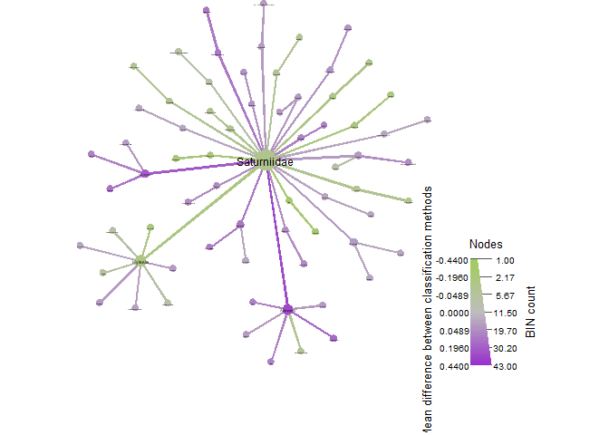<!-- -->

``` r
set.seed(16)#to make sure the figures is always the same
noctuid_LT %>%
  heat_tree(node_label = taxon_names,
            node_size_range = c(0.01, 0.03),
            edge_size_range = c(0.003, 0.005),
            node_size = n_obs, # n_obs is a function that calculates, in this case, the number of OTUs per taxon
            node_color = mean_diff, # A column from `obj_LT$data$diff_table`
            node_color_interval = c(-.44,.44), # The range of the mean_difference to display
            node_color_range = c("darkolivegreen3", "gray", "darkorchid"), # The color palette used
            node_size_axis_label = "BIN count",
            node_color_axis_label = "Mean difference between classification methods",
            node_label_size_range = c( 0.003, 0.03),
            layout = "davidson-harel", # The primary layout algorithm
            initial_layout = "reingold-tilford",
            output_file = "./05_trad_metabar_data_files/noctuidae_heattree.pdf") # The layout algorithm that initializes node locations
```

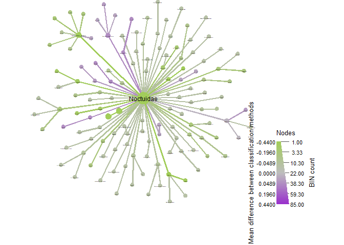<!-- -->

``` r
set.seed(16)#to make sure the figures is always the same
nymph_LT %>%
  heat_tree(node_label = taxon_names,
            node_size_range = c(0.01, 0.03),
            edge_size_range = c(0.003, 0.005),
            node_size = n_obs, # n_obs is a function that calculates, in this case, the number of OTUs per taxon
            node_color = mean_diff, # A column from `obj_LT$data$diff_table`
            node_color_interval = c(-.44,.44), # The range of the mean_difference to display
            node_color_range = c("darkolivegreen3", "gray", "darkorchid"), # The color palette used
            node_size_axis_label = "BIN count",
            node_color_axis_label = "Mean difference between classification methods",
            node_label_size_range = c( 0.003, 0.03),
            layout = "davidson-harel", # The primary layout algorithm
            initial_layout = "reingold-tilford",
            output_file = "./05_trad_metabar_data_files/nymphalidae_heattree.pdf") # The layout algorithm that initializes node locations
```

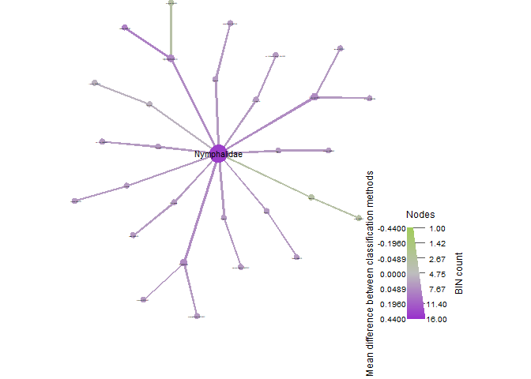<!-- -->

``` r
set.seed(16)#to make sure the figures is always the same
pyra_LT %>%
  heat_tree(node_label = taxon_names,
            node_size_range = c(0.01, 0.03),
            edge_size_range = c(0.003, 0.005),
            node_size = n_obs, # n_obs is a function that calculates, in this case, the number of OTUs per taxon
            node_color = mean_diff, # A column from `obj_LT$data$diff_table`
            node_color_interval = c(-.44,.44), # The range of the mean_difference to display
            node_color_range = c("darkolivegreen3", "gray", "darkorchid"), # The color palette used
            node_size_axis_label = "BIN count",
            node_color_axis_label = "Mean difference between classification methods",
            node_label_size_range = c( 0.003, 0.03),
            layout = "davidson-harel", # The primary layout algorithm
            initial_layout = "reingold-tilford",
            output_file = "./05_trad_metabar_data_files/pyralidae_heattree.pdf") # The layout algorithm that initializes node locations
```

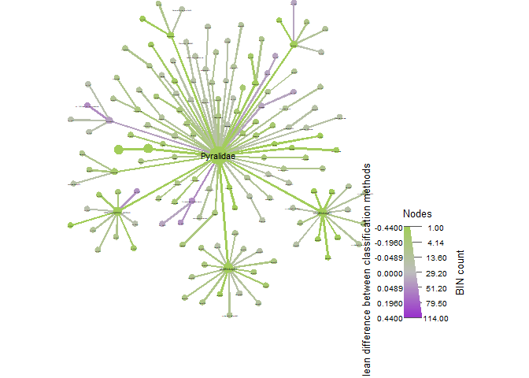<!-- -->

``` r
set.seed(16)#to make sure the figures is always the same
hesp_LT %>%
  heat_tree(node_label = taxon_names,
            node_size_range = c(0.01, 0.03),
            edge_size_range = c(0.003, 0.005),
            node_size = n_obs, # n_obs is a function that calculates, in this case, the number of OTUs per taxon
            node_color = mean_diff, # A column from `obj_LT$data$diff_table`
            node_color_interval = c(-.44,.44), # The range of the mean_difference to display
            node_color_range = c("darkolivegreen3", "gray", "darkorchid"), # The color palette used
            node_size_axis_label = "BIN count",
            node_color_axis_label = "Mean difference between classification methods",
            node_label_size_range = c( 0.003, 0.03),
            layout = "davidson-harel", # The primary layout algorithm
            initial_layout = "reingold-tilford",
            output_file = "./05_trad_metabar_data_files/hesperiidae_heattree.pdf") # The layout algorithm that initializes node locations
```

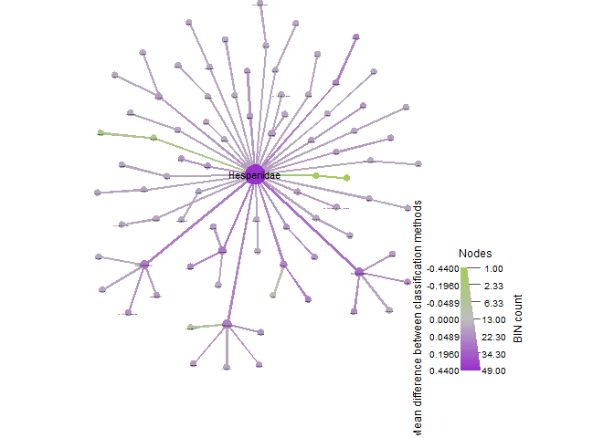<!-- -->

``` r
set.seed(16)#to make sure the figures is always the same
scarab_LT %>%
  heat_tree(node_label = taxon_names,
            node_size_range = c(0.01, 0.03),
            edge_size_range = c(0.003, 0.005),
            node_size = n_obs, # n_obs is a function that calculates, in this case, the number of OTUs per taxon
            node_color = mean_diff, # A column from `obj_LT$data$diff_table`
            node_color_interval = c(-.44,.44), # The range of the mean_difference to display
            node_color_range = c("darkolivegreen3", "gray", "darkorchid"), # The color palette used
            node_size_axis_label = "BIN count",
            node_color_axis_label = "Mean difference between classification methods",
            node_label_size_range = c( 0.003, 0.03),
            layout = "davidson-harel", # The primary layout algorithm
            initial_layout = "reingold-tilford",
            output_file = "./05_trad_metabar_data_files/scarabs_heattree.pdf") # The layout algorithm that initializes node locations
```

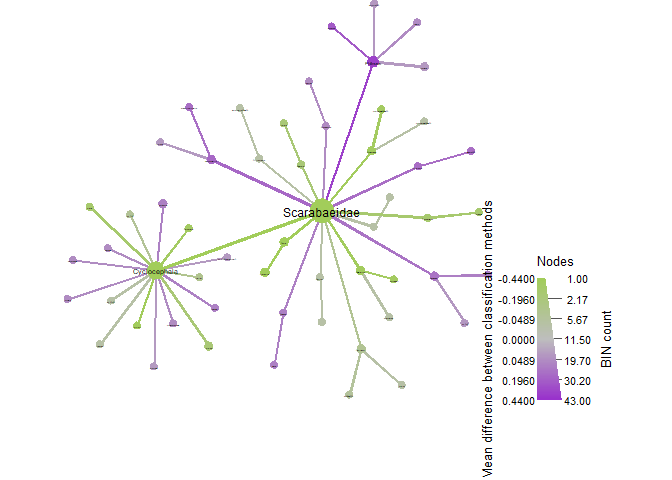<!-- -->

``` r
set.seed(16)#to make sure the figures is always the same
curcu_LT %>%
  heat_tree(node_label = taxon_names,
            node_size_range = c(0.01, 0.03),
            edge_size_range = c(0.003, 0.005),
            node_size = n_obs, # n_obs is a function that calculates, in this case, the number of OTUs per taxon
            node_color = mean_diff, # A column from `obj_LT$data$diff_table`
            node_color_interval = c(-.44,.44), # The range of the mean_difference to display
            node_color_range = c("darkolivegreen3", "gray", "darkorchid"), # The color palette used
            node_size_axis_label = "BIN count",
            node_color_axis_label = "Mean difference between classification methods",
            node_label_size_range = c( 0.003, 0.03),
            layout = "davidson-harel", # The primary layout algorithm
            initial_layout = "reingold-tilford",
            output_file = "./05_trad_metabar_data_files/curcu_heattree.pdf")
```

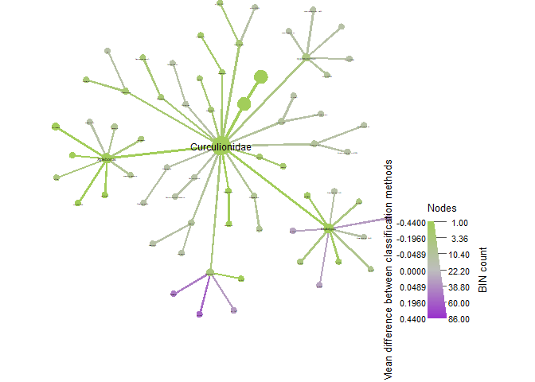<!-- -->

``` r
set.seed(16)#to make sure the figures is always the same
passa_LT %>%
  heat_tree(node_label = taxon_names,
            node_size_range = c(0.01, 0.03),
            edge_size_range = c(0.003, 0.005),
            node_size = n_obs, # n_obs is a function that calculates, in this case, the number of OTUs per taxon
            node_color = mean_diff, # A column from `obj_LT$data$diff_table`
            node_color_interval = c(-.44,.44), # The range of the mean_difference to display
            node_color_range = c("darkolivegreen3", "gray", "darkorchid"), # The color palette used
            node_size_axis_label = "BIN count",
            node_color_axis_label = "Mean difference between classification methods",
            node_label_size_range = c( 0.003, 0.03),
            layout = "davidson-harel", # The primary layout algorithm
            initial_layout = "reingold-tilford",
            output_file = "./05_trad_metabar_data_files/passalid_heattree.pdf")
```

<!-- -->

``` r
set.seed(16)#to make sure the figures is always the same
ants_LT %>%
  heat_tree(node_label = taxon_names,
            node_size_range = c(0.01, 0.03),
            edge_size_range = c(0.003, 0.005),
            node_size = n_obs, # n_obs is a function that calculates, in this case, the number of OTUs per taxon
            node_color = mean_diff, # A column from `obj_LT$data$diff_table`
            node_color_interval = c(-.44,.44), # The range of the mean_difference to display
            node_color_range = c("darkolivegreen3", "gray", "darkorchid"), # The color palette used
            node_size_axis_label = "BIN count",
            node_color_axis_label = "Mean difference between classification methods",
            node_label_size_range = c( 0.003, 0.03),
            layout = "davidson-harel", # The primary layout algorithm
            initial_layout = "reingold-tilford",
            output_file = "./05_trad_metabar_data_files/formicidae_heattree.pdf") # The layout algorithm that initializes node locations
```

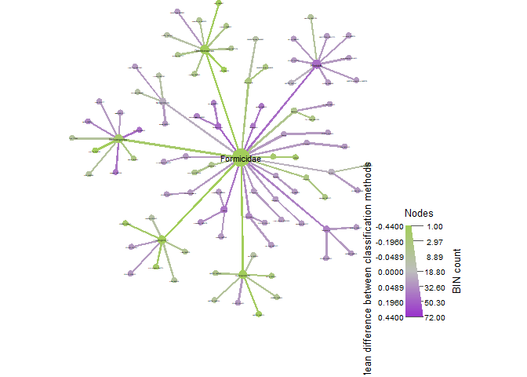<!-- -->

``` r
set.seed(16)#to make sure the figures is always the same
bees_LT %>%
  heat_tree(node_label = taxon_names,
            node_size_range = c(0.01, 0.03),
            edge_size_range = c(0.003, 0.005),
            node_size = n_obs, # n_obs is a function that calculates, in this case, the number of OTUs per taxon
            node_color = mean_diff, # A column from `obj_LT$data$diff_table`
            node_color_interval = c(-.44,.44), # The range of the mean_difference to display
            node_color_range = c("darkolivegreen3", "gray", "darkorchid"), # The color palette used
            node_size_axis_label = "BIN count",
            node_color_axis_label = "Mean difference between classification methods",
            node_label_size_range = c( 0.003, 0.03),
            layout = "davidson-harel", # The primary layout algorithm
            initial_layout = "reingold-tilford",
            output_file = "./05_trad_metabar_data_files/apidae_heattree.pdf") # The layout algorithm that initializes node locations
```

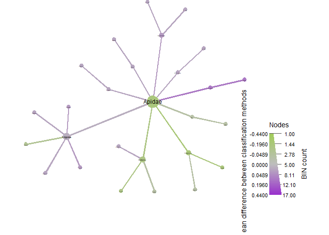<!-- -->

``` r
set.seed(16)#to make sure the figures is always the same
flat_LT %>%
  heat_tree(node_label = taxon_names,
            node_size_range = c(0.01, 0.03),
            edge_size_range = c(0.003, 0.005),
            node_size = n_obs, # n_obs is a function that calculates, in this case, the number of OTUs per taxon
            node_color = mean_diff, # A column from `obj_LT$data$diff_table`
            node_color_interval = c(-.44,.44), # The range of the mean_difference to display
            node_color_range = c("darkolivegreen3", "gray", "darkorchid"), # The color palette used
            node_size_axis_label = "BIN count",
            node_color_axis_label = "Mean difference between classification methods",
            node_label_size_range = c( 0.003, 0.03),
            layout = "davidson-harel", # The primary layout algorithm
            initial_layout = "reingold-tilford",
            output_file = "./05_trad_metabar_data_files/flatiidae_heattree.pdf") # The layout algorithm that initializes node locations
```

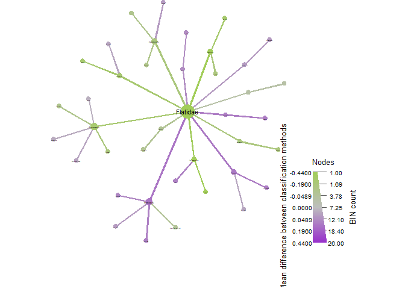<!-- -->

``` r
set.seed(16)#to make sure the figures is always the same
reds_LT %>%
  heat_tree(node_label = taxon_names,
            node_size_range = c(0.01, 0.03),
            edge_size_range = c(0.003, 0.005),
            node_size = n_obs, # n_obs is a function that calculates, in this case, the number of OTUs per taxon
            node_color = mean_diff, # A column from `obj_LT$data$diff_table`
            node_color_interval = c(-.44,.44), # The range of the mean_difference to display
            node_color_range = c("darkolivegreen3", "gray", "darkorchid"), # The color palette used
            node_size_axis_label = "BIN count",
            node_color_axis_label = "Mean difference between classification methods",
            node_label_size_range = c( 0.003, 0.03),
            layout = "davidson-harel", # The primary layout algorithm
            initial_layout = "reingold-tilford",
            output_file = "./05_trad_metabar_data_files/reduviidae_heattree.pdf") # The layout algorithm that initializes node locations
```

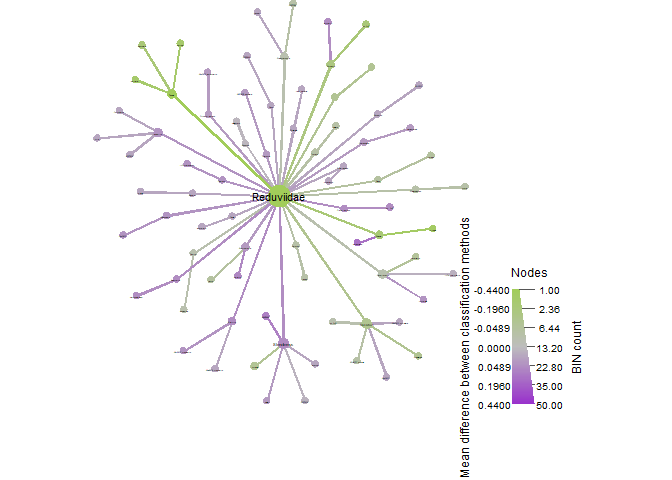<!-- -->

``` r
set.seed(16)#to make sure the figures is always the same
all_termites_LT %>%
  heat_tree(node_label = taxon_names,
            node_size_range = c(0.01, 0.03),
            edge_size_range = c(0.003, 0.005),
            node_size = n_obs, # n_obs is a function that calculates, in this case, the number of OTUs per taxon
            node_color = mean_diff, # A column from `obj_LT$data$diff_table`
            node_color_interval = c(-.44,.44), # The range of the mean_difference to display
            node_color_range = c("darkolivegreen3", "gray", "darkorchid"), # The color palette used
            node_size_axis_label = "BIN count",
            node_color_axis_label = "Mean difference between classification methods",
            node_label_size_range = c( 0.003, 0.03),
            layout = "davidson-harel", # The primary layout algorithm
            initial_layout = "reingold-tilford",
            output_file = "./05_trad_metabar_data_files/all_termites_heattree.pdf") # The layout algorithm that initializes node locations
```

<!-- -->

``` r
vennlist_geom <- get_vennlist(obj=ps_geom_LT, factorNames="methodClass")
vennp_geom <- venn.diagram(vennlist_geom,
                      height=5,
                      width=5, 
                      filename=NULL,
                      disable.logging = TRUE,
                      fill=c("darkolivegreen3", "darkorchid"),
                      cat.col=c("darkolivegreen3", "darkorchid"),
                      alpha = 0.85, 
                      fontfamily = "serif",
                      fontface = "bold",
                      cex = 1.2,
                      cat.cex = 1.3,
                      cat.default.pos = "outer",
                      cat.dist=0.1,
                      margin = 0.1, 
                      lwd = 3,
                      lty ='dotted',
                      imagetype = "svg")
```

    ## INFO [2023-02-16 19:26:16] [[1]]
    ## INFO [2023-02-16 19:26:16] vennlist_geom
    ## INFO [2023-02-16 19:26:16] 
    ## INFO [2023-02-16 19:26:16] $height
    ## INFO [2023-02-16 19:26:16] [1] 5
    ## INFO [2023-02-16 19:26:16] 
    ## INFO [2023-02-16 19:26:16] $width
    ## INFO [2023-02-16 19:26:16] [1] 5
    ## INFO [2023-02-16 19:26:16] 
    ## INFO [2023-02-16 19:26:16] $filename
    ## INFO [2023-02-16 19:26:16] NULL
    ## INFO [2023-02-16 19:26:16] 
    ## INFO [2023-02-16 19:26:16] $disable.logging
    ## INFO [2023-02-16 19:26:16] [1] TRUE
    ## INFO [2023-02-16 19:26:16] 
    ## INFO [2023-02-16 19:26:16] $fill
    ## INFO [2023-02-16 19:26:16] c("darkolivegreen3", "darkorchid")
    ## INFO [2023-02-16 19:26:16] 
    ## INFO [2023-02-16 19:26:16] $cat.col
    ## INFO [2023-02-16 19:26:16] c("darkolivegreen3", "darkorchid")
    ## INFO [2023-02-16 19:26:16] 
    ## INFO [2023-02-16 19:26:16] $alpha
    ## INFO [2023-02-16 19:26:16] [1] 0.85
    ## INFO [2023-02-16 19:26:16] 
    ## INFO [2023-02-16 19:26:16] $fontfamily
    ## INFO [2023-02-16 19:26:16] [1] "serif"
    ## INFO [2023-02-16 19:26:16] 
    ## INFO [2023-02-16 19:26:16] $fontface
    ## INFO [2023-02-16 19:26:16] [1] "bold"
    ## INFO [2023-02-16 19:26:16] 
    ## INFO [2023-02-16 19:26:16] $cex
    ## INFO [2023-02-16 19:26:16] [1] 1.2
    ## INFO [2023-02-16 19:26:16] 
    ## INFO [2023-02-16 19:26:16] $cat.cex
    ## INFO [2023-02-16 19:26:16] [1] 1.3
    ## INFO [2023-02-16 19:26:16] 
    ## INFO [2023-02-16 19:26:16] $cat.default.pos
    ## INFO [2023-02-16 19:26:16] [1] "outer"
    ## INFO [2023-02-16 19:26:16] 
    ## INFO [2023-02-16 19:26:16] $cat.dist
    ## INFO [2023-02-16 19:26:16] [1] 0.1
    ## INFO [2023-02-16 19:26:16] 
    ## INFO [2023-02-16 19:26:16] $margin
    ## INFO [2023-02-16 19:26:16] [1] 0.1
    ## INFO [2023-02-16 19:26:16] 
    ## INFO [2023-02-16 19:26:16] $lwd
    ## INFO [2023-02-16 19:26:16] [1] 3
    ## INFO [2023-02-16 19:26:16] 
    ## INFO [2023-02-16 19:26:16] $lty
    ## INFO [2023-02-16 19:26:16] [1] "dotted"
    ## INFO [2023-02-16 19:26:16] 
    ## INFO [2023-02-16 19:26:16] $imagetype
    ## INFO [2023-02-16 19:26:16] [1] "svg"
    ## INFO [2023-02-16 19:26:16]

``` r
vennlist_ereb <- get_vennlist(obj=ps_ereb_LT, factorNames="methodClass")
vennp_ereb <- venn.diagram(vennlist_ereb,
                      height=5,
                      width=5, 
                      filename=NULL,
                      disable.logging = TRUE,
                      fill=c("darkolivegreen3", "darkorchid"),
                      cat.col=c("darkolivegreen3", "darkorchid"),
                      alpha = 0.85, 
                      fontfamily = "serif",
                      fontface = "bold",
                      cex = 1.2,
                      cat.cex = 1.3,
                      cat.default.pos = "outer",
                      cat.dist=0.1,
                      margin = 0.1, 
                      lwd = 3,
                      lty ='dotted',
                      imagetype = "svg")
```

    ## INFO [2023-02-16 19:26:16] [[1]]
    ## INFO [2023-02-16 19:26:16] vennlist_ereb
    ## INFO [2023-02-16 19:26:16] 
    ## INFO [2023-02-16 19:26:16] $height
    ## INFO [2023-02-16 19:26:16] [1] 5
    ## INFO [2023-02-16 19:26:16] 
    ## INFO [2023-02-16 19:26:16] $width
    ## INFO [2023-02-16 19:26:16] [1] 5
    ## INFO [2023-02-16 19:26:16] 
    ## INFO [2023-02-16 19:26:16] $filename
    ## INFO [2023-02-16 19:26:16] NULL
    ## INFO [2023-02-16 19:26:16] 
    ## INFO [2023-02-16 19:26:16] $disable.logging
    ## INFO [2023-02-16 19:26:16] [1] TRUE
    ## INFO [2023-02-16 19:26:16] 
    ## INFO [2023-02-16 19:26:16] $fill
    ## INFO [2023-02-16 19:26:16] c("darkolivegreen3", "darkorchid")
    ## INFO [2023-02-16 19:26:16] 
    ## INFO [2023-02-16 19:26:16] $cat.col
    ## INFO [2023-02-16 19:26:16] c("darkolivegreen3", "darkorchid")
    ## INFO [2023-02-16 19:26:16] 
    ## INFO [2023-02-16 19:26:16] $alpha
    ## INFO [2023-02-16 19:26:16] [1] 0.85
    ## INFO [2023-02-16 19:26:16] 
    ## INFO [2023-02-16 19:26:16] $fontfamily
    ## INFO [2023-02-16 19:26:16] [1] "serif"
    ## INFO [2023-02-16 19:26:16] 
    ## INFO [2023-02-16 19:26:16] $fontface
    ## INFO [2023-02-16 19:26:16] [1] "bold"
    ## INFO [2023-02-16 19:26:16] 
    ## INFO [2023-02-16 19:26:16] $cex
    ## INFO [2023-02-16 19:26:16] [1] 1.2
    ## INFO [2023-02-16 19:26:16] 
    ## INFO [2023-02-16 19:26:16] $cat.cex
    ## INFO [2023-02-16 19:26:16] [1] 1.3
    ## INFO [2023-02-16 19:26:16] 
    ## INFO [2023-02-16 19:26:16] $cat.default.pos
    ## INFO [2023-02-16 19:26:16] [1] "outer"
    ## INFO [2023-02-16 19:26:16] 
    ## INFO [2023-02-16 19:26:16] $cat.dist
    ## INFO [2023-02-16 19:26:16] [1] 0.1
    ## INFO [2023-02-16 19:26:16] 
    ## INFO [2023-02-16 19:26:16] $margin
    ## INFO [2023-02-16 19:26:16] [1] 0.1
    ## INFO [2023-02-16 19:26:16] 
    ## INFO [2023-02-16 19:26:16] $lwd
    ## INFO [2023-02-16 19:26:16] [1] 3
    ## INFO [2023-02-16 19:26:16] 
    ## INFO [2023-02-16 19:26:16] $lty
    ## INFO [2023-02-16 19:26:16] [1] "dotted"
    ## INFO [2023-02-16 19:26:16] 
    ## INFO [2023-02-16 19:26:16] $imagetype
    ## INFO [2023-02-16 19:26:16] [1] "svg"
    ## INFO [2023-02-16 19:26:16]

``` r
vennlist_cramb <- get_vennlist(obj=ps_cramb_LT, factorNames="methodClass")
vennp_cramb <- venn.diagram(vennlist_cramb,
                      height=5,
                      width=5, 
                      filename=NULL,
                      disable.logging = TRUE,
                      fill=c("darkolivegreen3", "darkorchid"),
                      cat.col=c("darkolivegreen3", "darkorchid"),
                      alpha = 0.85, 
                      fontfamily = "serif",
                      fontface = "bold",
                      cex = 1.2,
                      cat.cex = 1.3,
                      cat.default.pos = "outer",
                      cat.dist=0.1,
                      margin = 0.1, 
                      lwd = 3,
                      lty ='dotted',
                      imagetype = "svg")
```

    ## INFO [2023-02-16 19:26:16] [[1]]
    ## INFO [2023-02-16 19:26:16] vennlist_cramb
    ## INFO [2023-02-16 19:26:16] 
    ## INFO [2023-02-16 19:26:16] $height
    ## INFO [2023-02-16 19:26:16] [1] 5
    ## INFO [2023-02-16 19:26:16] 
    ## INFO [2023-02-16 19:26:16] $width
    ## INFO [2023-02-16 19:26:16] [1] 5
    ## INFO [2023-02-16 19:26:16] 
    ## INFO [2023-02-16 19:26:16] $filename
    ## INFO [2023-02-16 19:26:16] NULL
    ## INFO [2023-02-16 19:26:16] 
    ## INFO [2023-02-16 19:26:16] $disable.logging
    ## INFO [2023-02-16 19:26:16] [1] TRUE
    ## INFO [2023-02-16 19:26:16] 
    ## INFO [2023-02-16 19:26:16] $fill
    ## INFO [2023-02-16 19:26:16] c("darkolivegreen3", "darkorchid")
    ## INFO [2023-02-16 19:26:16] 
    ## INFO [2023-02-16 19:26:16] $cat.col
    ## INFO [2023-02-16 19:26:16] c("darkolivegreen3", "darkorchid")
    ## INFO [2023-02-16 19:26:16] 
    ## INFO [2023-02-16 19:26:16] $alpha
    ## INFO [2023-02-16 19:26:16] [1] 0.85
    ## INFO [2023-02-16 19:26:16] 
    ## INFO [2023-02-16 19:26:16] $fontfamily
    ## INFO [2023-02-16 19:26:16] [1] "serif"
    ## INFO [2023-02-16 19:26:16] 
    ## INFO [2023-02-16 19:26:16] $fontface
    ## INFO [2023-02-16 19:26:16] [1] "bold"
    ## INFO [2023-02-16 19:26:16] 
    ## INFO [2023-02-16 19:26:16] $cex
    ## INFO [2023-02-16 19:26:16] [1] 1.2
    ## INFO [2023-02-16 19:26:16] 
    ## INFO [2023-02-16 19:26:16] $cat.cex
    ## INFO [2023-02-16 19:26:16] [1] 1.3
    ## INFO [2023-02-16 19:26:16] 
    ## INFO [2023-02-16 19:26:16] $cat.default.pos
    ## INFO [2023-02-16 19:26:16] [1] "outer"
    ## INFO [2023-02-16 19:26:16] 
    ## INFO [2023-02-16 19:26:16] $cat.dist
    ## INFO [2023-02-16 19:26:16] [1] 0.1
    ## INFO [2023-02-16 19:26:16] 
    ## INFO [2023-02-16 19:26:16] $margin
    ## INFO [2023-02-16 19:26:16] [1] 0.1
    ## INFO [2023-02-16 19:26:16] 
    ## INFO [2023-02-16 19:26:16] $lwd
    ## INFO [2023-02-16 19:26:16] [1] 3
    ## INFO [2023-02-16 19:26:16] 
    ## INFO [2023-02-16 19:26:16] $lty
    ## INFO [2023-02-16 19:26:16] [1] "dotted"
    ## INFO [2023-02-16 19:26:16] 
    ## INFO [2023-02-16 19:26:16] $imagetype
    ## INFO [2023-02-16 19:26:16] [1] "svg"
    ## INFO [2023-02-16 19:26:16]

``` r
vennlist_satur <- get_vennlist(obj=ps_satur_LT, factorNames="methodClass")
vennp_satur <- venn.diagram(vennlist_satur,
                      height=5,
                      width=5, 
                      filename=NULL,
                      disable.logging = TRUE,
                      fill=c("darkolivegreen3", "darkorchid"),
                      cat.col=c("darkolivegreen3", "darkorchid"),
                      alpha = 0.85, 
                      fontfamily = "serif",
                      fontface = "bold",
                      cex = 1.2,
                      cat.cex = 1.3,
                      cat.default.pos = "outer",
                      cat.dist=0.1,
                      margin = 0.1, 
                      lwd = 3,
                      lty ='dotted',
                      imagetype = "svg")
```

    ## INFO [2023-02-16 19:26:16] [[1]]
    ## INFO [2023-02-16 19:26:16] vennlist_satur
    ## INFO [2023-02-16 19:26:16] 
    ## INFO [2023-02-16 19:26:16] $height
    ## INFO [2023-02-16 19:26:16] [1] 5
    ## INFO [2023-02-16 19:26:16] 
    ## INFO [2023-02-16 19:26:16] $width
    ## INFO [2023-02-16 19:26:16] [1] 5
    ## INFO [2023-02-16 19:26:16] 
    ## INFO [2023-02-16 19:26:16] $filename
    ## INFO [2023-02-16 19:26:16] NULL
    ## INFO [2023-02-16 19:26:16] 
    ## INFO [2023-02-16 19:26:16] $disable.logging
    ## INFO [2023-02-16 19:26:16] [1] TRUE
    ## INFO [2023-02-16 19:26:16] 
    ## INFO [2023-02-16 19:26:16] $fill
    ## INFO [2023-02-16 19:26:16] c("darkolivegreen3", "darkorchid")
    ## INFO [2023-02-16 19:26:16] 
    ## INFO [2023-02-16 19:26:16] $cat.col
    ## INFO [2023-02-16 19:26:16] c("darkolivegreen3", "darkorchid")
    ## INFO [2023-02-16 19:26:16] 
    ## INFO [2023-02-16 19:26:16] $alpha
    ## INFO [2023-02-16 19:26:16] [1] 0.85
    ## INFO [2023-02-16 19:26:16] 
    ## INFO [2023-02-16 19:26:16] $fontfamily
    ## INFO [2023-02-16 19:26:16] [1] "serif"
    ## INFO [2023-02-16 19:26:16] 
    ## INFO [2023-02-16 19:26:16] $fontface
    ## INFO [2023-02-16 19:26:16] [1] "bold"
    ## INFO [2023-02-16 19:26:16] 
    ## INFO [2023-02-16 19:26:16] $cex
    ## INFO [2023-02-16 19:26:16] [1] 1.2
    ## INFO [2023-02-16 19:26:16] 
    ## INFO [2023-02-16 19:26:16] $cat.cex
    ## INFO [2023-02-16 19:26:16] [1] 1.3
    ## INFO [2023-02-16 19:26:16] 
    ## INFO [2023-02-16 19:26:16] $cat.default.pos
    ## INFO [2023-02-16 19:26:16] [1] "outer"
    ## INFO [2023-02-16 19:26:16] 
    ## INFO [2023-02-16 19:26:16] $cat.dist
    ## INFO [2023-02-16 19:26:16] [1] 0.1
    ## INFO [2023-02-16 19:26:16] 
    ## INFO [2023-02-16 19:26:16] $margin
    ## INFO [2023-02-16 19:26:16] [1] 0.1
    ## INFO [2023-02-16 19:26:16] 
    ## INFO [2023-02-16 19:26:16] $lwd
    ## INFO [2023-02-16 19:26:16] [1] 3
    ## INFO [2023-02-16 19:26:16] 
    ## INFO [2023-02-16 19:26:16] $lty
    ## INFO [2023-02-16 19:26:16] [1] "dotted"
    ## INFO [2023-02-16 19:26:16] 
    ## INFO [2023-02-16 19:26:16] $imagetype
    ## INFO [2023-02-16 19:26:16] [1] "svg"
    ## INFO [2023-02-16 19:26:16]

``` r
vennlist_noctuid <- get_vennlist(obj=ps_noctuid_LT, factorNames="methodClass")
vennp_noctuid <- venn.diagram(vennlist_noctuid,
                      height=5,
                      width=5, 
                      filename=NULL,
                      disable.logging = TRUE,
                      fill=c("darkolivegreen3", "darkorchid"),
                      cat.col=c("darkolivegreen3", "darkorchid"),
                      alpha = 0.85, 
                      fontfamily = "serif",
                      fontface = "bold",
                      cex = 1.2,
                      cat.cex = 1.3,
                      cat.default.pos = "outer",
                      cat.dist=0.1,
                      margin = 0.1, 
                      lwd = 3,
                      lty ='dotted',
                      imagetype = "svg")
```

    ## INFO [2023-02-16 19:26:16] [[1]]
    ## INFO [2023-02-16 19:26:16] vennlist_noctuid
    ## INFO [2023-02-16 19:26:16] 
    ## INFO [2023-02-16 19:26:16] $height
    ## INFO [2023-02-16 19:26:16] [1] 5
    ## INFO [2023-02-16 19:26:16] 
    ## INFO [2023-02-16 19:26:16] $width
    ## INFO [2023-02-16 19:26:16] [1] 5
    ## INFO [2023-02-16 19:26:16] 
    ## INFO [2023-02-16 19:26:16] $filename
    ## INFO [2023-02-16 19:26:16] NULL
    ## INFO [2023-02-16 19:26:16] 
    ## INFO [2023-02-16 19:26:16] $disable.logging
    ## INFO [2023-02-16 19:26:16] [1] TRUE
    ## INFO [2023-02-16 19:26:16] 
    ## INFO [2023-02-16 19:26:16] $fill
    ## INFO [2023-02-16 19:26:16] c("darkolivegreen3", "darkorchid")
    ## INFO [2023-02-16 19:26:16] 
    ## INFO [2023-02-16 19:26:16] $cat.col
    ## INFO [2023-02-16 19:26:16] c("darkolivegreen3", "darkorchid")
    ## INFO [2023-02-16 19:26:16] 
    ## INFO [2023-02-16 19:26:16] $alpha
    ## INFO [2023-02-16 19:26:16] [1] 0.85
    ## INFO [2023-02-16 19:26:16] 
    ## INFO [2023-02-16 19:26:16] $fontfamily
    ## INFO [2023-02-16 19:26:16] [1] "serif"
    ## INFO [2023-02-16 19:26:16] 
    ## INFO [2023-02-16 19:26:16] $fontface
    ## INFO [2023-02-16 19:26:16] [1] "bold"
    ## INFO [2023-02-16 19:26:16] 
    ## INFO [2023-02-16 19:26:16] $cex
    ## INFO [2023-02-16 19:26:16] [1] 1.2
    ## INFO [2023-02-16 19:26:16] 
    ## INFO [2023-02-16 19:26:16] $cat.cex
    ## INFO [2023-02-16 19:26:16] [1] 1.3
    ## INFO [2023-02-16 19:26:16] 
    ## INFO [2023-02-16 19:26:16] $cat.default.pos
    ## INFO [2023-02-16 19:26:16] [1] "outer"
    ## INFO [2023-02-16 19:26:16] 
    ## INFO [2023-02-16 19:26:16] $cat.dist
    ## INFO [2023-02-16 19:26:16] [1] 0.1
    ## INFO [2023-02-16 19:26:16] 
    ## INFO [2023-02-16 19:26:16] $margin
    ## INFO [2023-02-16 19:26:16] [1] 0.1
    ## INFO [2023-02-16 19:26:16] 
    ## INFO [2023-02-16 19:26:16] $lwd
    ## INFO [2023-02-16 19:26:16] [1] 3
    ## INFO [2023-02-16 19:26:16] 
    ## INFO [2023-02-16 19:26:16] $lty
    ## INFO [2023-02-16 19:26:16] [1] "dotted"
    ## INFO [2023-02-16 19:26:16] 
    ## INFO [2023-02-16 19:26:16] $imagetype
    ## INFO [2023-02-16 19:26:16] [1] "svg"
    ## INFO [2023-02-16 19:26:16]

``` r
vennlist_nymph <- get_vennlist(obj=ps_nymph_LT, factorNames="methodClass")
vennp_nymph <- venn.diagram(vennlist_nymph,
                      height=5,
                      width=5, 
                      filename=NULL,
                      disable.logging = TRUE,
                      fill=c("darkolivegreen3", "darkorchid"),
                      cat.col=c("darkolivegreen3", "darkorchid"),
                      alpha = 0.85, 
                      fontfamily = "serif",
                      fontface = "bold",
                      cex = 1.2,
                      cat.cex = 1.3,
                      cat.default.pos = "outer",
                      cat.dist=0.1,
                      margin = 0.1, 
                      lwd = 3,
                      lty ='dotted',
                      imagetype = "svg")
```

    ## INFO [2023-02-16 19:26:17] [[1]]
    ## INFO [2023-02-16 19:26:17] vennlist_nymph
    ## INFO [2023-02-16 19:26:17] 
    ## INFO [2023-02-16 19:26:17] $height
    ## INFO [2023-02-16 19:26:17] [1] 5
    ## INFO [2023-02-16 19:26:17] 
    ## INFO [2023-02-16 19:26:17] $width
    ## INFO [2023-02-16 19:26:17] [1] 5
    ## INFO [2023-02-16 19:26:17] 
    ## INFO [2023-02-16 19:26:17] $filename
    ## INFO [2023-02-16 19:26:17] NULL
    ## INFO [2023-02-16 19:26:17] 
    ## INFO [2023-02-16 19:26:17] $disable.logging
    ## INFO [2023-02-16 19:26:17] [1] TRUE
    ## INFO [2023-02-16 19:26:17] 
    ## INFO [2023-02-16 19:26:17] $fill
    ## INFO [2023-02-16 19:26:17] c("darkolivegreen3", "darkorchid")
    ## INFO [2023-02-16 19:26:17] 
    ## INFO [2023-02-16 19:26:17] $cat.col
    ## INFO [2023-02-16 19:26:17] c("darkolivegreen3", "darkorchid")
    ## INFO [2023-02-16 19:26:17] 
    ## INFO [2023-02-16 19:26:17] $alpha
    ## INFO [2023-02-16 19:26:17] [1] 0.85
    ## INFO [2023-02-16 19:26:17] 
    ## INFO [2023-02-16 19:26:17] $fontfamily
    ## INFO [2023-02-16 19:26:17] [1] "serif"
    ## INFO [2023-02-16 19:26:17] 
    ## INFO [2023-02-16 19:26:17] $fontface
    ## INFO [2023-02-16 19:26:17] [1] "bold"
    ## INFO [2023-02-16 19:26:17] 
    ## INFO [2023-02-16 19:26:17] $cex
    ## INFO [2023-02-16 19:26:17] [1] 1.2
    ## INFO [2023-02-16 19:26:17] 
    ## INFO [2023-02-16 19:26:17] $cat.cex
    ## INFO [2023-02-16 19:26:17] [1] 1.3
    ## INFO [2023-02-16 19:26:17] 
    ## INFO [2023-02-16 19:26:17] $cat.default.pos
    ## INFO [2023-02-16 19:26:17] [1] "outer"
    ## INFO [2023-02-16 19:26:17] 
    ## INFO [2023-02-16 19:26:17] $cat.dist
    ## INFO [2023-02-16 19:26:17] [1] 0.1
    ## INFO [2023-02-16 19:26:17] 
    ## INFO [2023-02-16 19:26:17] $margin
    ## INFO [2023-02-16 19:26:17] [1] 0.1
    ## INFO [2023-02-16 19:26:17] 
    ## INFO [2023-02-16 19:26:17] $lwd
    ## INFO [2023-02-16 19:26:17] [1] 3
    ## INFO [2023-02-16 19:26:17] 
    ## INFO [2023-02-16 19:26:17] $lty
    ## INFO [2023-02-16 19:26:17] [1] "dotted"
    ## INFO [2023-02-16 19:26:17] 
    ## INFO [2023-02-16 19:26:17] $imagetype
    ## INFO [2023-02-16 19:26:17] [1] "svg"
    ## INFO [2023-02-16 19:26:17]

``` r
vennlist_pyra <- get_vennlist(obj=ps_pyra_LT, factorNames="methodClass")
vennp_pyra <- venn.diagram(vennlist_pyra,
                      height=5,
                      width=5, 
                      filename=NULL,
                      disable.logging = TRUE,
                      fill=c("darkolivegreen3", "darkorchid"),
                      cat.col=c("darkolivegreen3", "darkorchid"),
                      alpha = 0.85, 
                      fontfamily = "serif",
                      fontface = "bold",
                      cex = 1.2,
                      cat.cex = 1.3,
                      cat.default.pos = "outer",
                      cat.dist=0.1,
                      margin = 0.1, 
                      lwd = 3,
                      lty ='dotted',
                      imagetype = "svg")
```

    ## INFO [2023-02-16 19:26:17] [[1]]
    ## INFO [2023-02-16 19:26:17] vennlist_pyra
    ## INFO [2023-02-16 19:26:17] 
    ## INFO [2023-02-16 19:26:17] $height
    ## INFO [2023-02-16 19:26:17] [1] 5
    ## INFO [2023-02-16 19:26:17] 
    ## INFO [2023-02-16 19:26:17] $width
    ## INFO [2023-02-16 19:26:17] [1] 5
    ## INFO [2023-02-16 19:26:17] 
    ## INFO [2023-02-16 19:26:17] $filename
    ## INFO [2023-02-16 19:26:17] NULL
    ## INFO [2023-02-16 19:26:17] 
    ## INFO [2023-02-16 19:26:17] $disable.logging
    ## INFO [2023-02-16 19:26:17] [1] TRUE
    ## INFO [2023-02-16 19:26:17] 
    ## INFO [2023-02-16 19:26:17] $fill
    ## INFO [2023-02-16 19:26:17] c("darkolivegreen3", "darkorchid")
    ## INFO [2023-02-16 19:26:17] 
    ## INFO [2023-02-16 19:26:17] $cat.col
    ## INFO [2023-02-16 19:26:17] c("darkolivegreen3", "darkorchid")
    ## INFO [2023-02-16 19:26:17] 
    ## INFO [2023-02-16 19:26:17] $alpha
    ## INFO [2023-02-16 19:26:17] [1] 0.85
    ## INFO [2023-02-16 19:26:17] 
    ## INFO [2023-02-16 19:26:17] $fontfamily
    ## INFO [2023-02-16 19:26:17] [1] "serif"
    ## INFO [2023-02-16 19:26:17] 
    ## INFO [2023-02-16 19:26:17] $fontface
    ## INFO [2023-02-16 19:26:17] [1] "bold"
    ## INFO [2023-02-16 19:26:17] 
    ## INFO [2023-02-16 19:26:17] $cex
    ## INFO [2023-02-16 19:26:17] [1] 1.2
    ## INFO [2023-02-16 19:26:17] 
    ## INFO [2023-02-16 19:26:17] $cat.cex
    ## INFO [2023-02-16 19:26:17] [1] 1.3
    ## INFO [2023-02-16 19:26:17] 
    ## INFO [2023-02-16 19:26:17] $cat.default.pos
    ## INFO [2023-02-16 19:26:17] [1] "outer"
    ## INFO [2023-02-16 19:26:17] 
    ## INFO [2023-02-16 19:26:17] $cat.dist
    ## INFO [2023-02-16 19:26:17] [1] 0.1
    ## INFO [2023-02-16 19:26:17] 
    ## INFO [2023-02-16 19:26:17] $margin
    ## INFO [2023-02-16 19:26:17] [1] 0.1
    ## INFO [2023-02-16 19:26:17] 
    ## INFO [2023-02-16 19:26:17] $lwd
    ## INFO [2023-02-16 19:26:17] [1] 3
    ## INFO [2023-02-16 19:26:17] 
    ## INFO [2023-02-16 19:26:17] $lty
    ## INFO [2023-02-16 19:26:17] [1] "dotted"
    ## INFO [2023-02-16 19:26:17] 
    ## INFO [2023-02-16 19:26:17] $imagetype
    ## INFO [2023-02-16 19:26:17] [1] "svg"
    ## INFO [2023-02-16 19:26:17]

``` r
vennlist_hesp <- get_vennlist(obj=ps_hesp_LT, factorNames="methodClass")
vennp_hesp <- venn.diagram(vennlist_hesp,
                      height=5,
                      width=5, 
                      filename=NULL,
                      disable.logging = TRUE,
                      fill=c("darkolivegreen3", "darkorchid"),
                      cat.col=c("darkolivegreen3", "darkorchid"),
                      alpha = 0.85, 
                      fontfamily = "serif",
                      fontface = "bold",
                      cex = 1.2,
                      cat.cex = 1.3,
                      cat.default.pos = "outer",
                      cat.dist=0.1,
                      margin = 0.1, 
                      lwd = 3,
                      lty ='dotted',
                      imagetype = "svg")
```

    ## INFO [2023-02-16 19:26:17] [[1]]
    ## INFO [2023-02-16 19:26:17] vennlist_hesp
    ## INFO [2023-02-16 19:26:17] 
    ## INFO [2023-02-16 19:26:17] $height
    ## INFO [2023-02-16 19:26:17] [1] 5
    ## INFO [2023-02-16 19:26:17] 
    ## INFO [2023-02-16 19:26:17] $width
    ## INFO [2023-02-16 19:26:17] [1] 5
    ## INFO [2023-02-16 19:26:17] 
    ## INFO [2023-02-16 19:26:17] $filename
    ## INFO [2023-02-16 19:26:17] NULL
    ## INFO [2023-02-16 19:26:17] 
    ## INFO [2023-02-16 19:26:17] $disable.logging
    ## INFO [2023-02-16 19:26:17] [1] TRUE
    ## INFO [2023-02-16 19:26:17] 
    ## INFO [2023-02-16 19:26:17] $fill
    ## INFO [2023-02-16 19:26:17] c("darkolivegreen3", "darkorchid")
    ## INFO [2023-02-16 19:26:17] 
    ## INFO [2023-02-16 19:26:17] $cat.col
    ## INFO [2023-02-16 19:26:17] c("darkolivegreen3", "darkorchid")
    ## INFO [2023-02-16 19:26:17] 
    ## INFO [2023-02-16 19:26:17] $alpha
    ## INFO [2023-02-16 19:26:17] [1] 0.85
    ## INFO [2023-02-16 19:26:17] 
    ## INFO [2023-02-16 19:26:17] $fontfamily
    ## INFO [2023-02-16 19:26:17] [1] "serif"
    ## INFO [2023-02-16 19:26:17] 
    ## INFO [2023-02-16 19:26:17] $fontface
    ## INFO [2023-02-16 19:26:17] [1] "bold"
    ## INFO [2023-02-16 19:26:17] 
    ## INFO [2023-02-16 19:26:17] $cex
    ## INFO [2023-02-16 19:26:17] [1] 1.2
    ## INFO [2023-02-16 19:26:17] 
    ## INFO [2023-02-16 19:26:17] $cat.cex
    ## INFO [2023-02-16 19:26:17] [1] 1.3
    ## INFO [2023-02-16 19:26:17] 
    ## INFO [2023-02-16 19:26:17] $cat.default.pos
    ## INFO [2023-02-16 19:26:17] [1] "outer"
    ## INFO [2023-02-16 19:26:17] 
    ## INFO [2023-02-16 19:26:17] $cat.dist
    ## INFO [2023-02-16 19:26:17] [1] 0.1
    ## INFO [2023-02-16 19:26:17] 
    ## INFO [2023-02-16 19:26:17] $margin
    ## INFO [2023-02-16 19:26:17] [1] 0.1
    ## INFO [2023-02-16 19:26:17] 
    ## INFO [2023-02-16 19:26:17] $lwd
    ## INFO [2023-02-16 19:26:17] [1] 3
    ## INFO [2023-02-16 19:26:17] 
    ## INFO [2023-02-16 19:26:17] $lty
    ## INFO [2023-02-16 19:26:17] [1] "dotted"
    ## INFO [2023-02-16 19:26:17] 
    ## INFO [2023-02-16 19:26:17] $imagetype
    ## INFO [2023-02-16 19:26:17] [1] "svg"
    ## INFO [2023-02-16 19:26:17]

``` r
vennlist_scarab <- get_vennlist(obj=ps_scarab_LT, factorNames="methodClass")
vennp_scarab <- venn.diagram(vennlist_scarab,
                      height=5,
                      width=5, 
                      filename=NULL,
                      disable.logging = TRUE,
                      fill=c("darkolivegreen3", "darkorchid"),
                      cat.col=c("darkolivegreen3", "darkorchid"),
                      alpha = 0.85, 
                      fontfamily = "serif",
                      fontface = "bold",
                      cex = 1.2,
                      cat.cex = 1.3,
                      cat.default.pos = "outer",
                      cat.dist=0.1,
                      margin = 0.1, 
                      lwd = 3,
                      lty ='dotted',
                      imagetype = "svg")
```

    ## INFO [2023-02-16 19:26:17] [[1]]
    ## INFO [2023-02-16 19:26:17] vennlist_scarab
    ## INFO [2023-02-16 19:26:17] 
    ## INFO [2023-02-16 19:26:17] $height
    ## INFO [2023-02-16 19:26:17] [1] 5
    ## INFO [2023-02-16 19:26:17] 
    ## INFO [2023-02-16 19:26:17] $width
    ## INFO [2023-02-16 19:26:17] [1] 5
    ## INFO [2023-02-16 19:26:17] 
    ## INFO [2023-02-16 19:26:17] $filename
    ## INFO [2023-02-16 19:26:17] NULL
    ## INFO [2023-02-16 19:26:17] 
    ## INFO [2023-02-16 19:26:17] $disable.logging
    ## INFO [2023-02-16 19:26:17] [1] TRUE
    ## INFO [2023-02-16 19:26:17] 
    ## INFO [2023-02-16 19:26:17] $fill
    ## INFO [2023-02-16 19:26:17] c("darkolivegreen3", "darkorchid")
    ## INFO [2023-02-16 19:26:17] 
    ## INFO [2023-02-16 19:26:17] $cat.col
    ## INFO [2023-02-16 19:26:17] c("darkolivegreen3", "darkorchid")
    ## INFO [2023-02-16 19:26:17] 
    ## INFO [2023-02-16 19:26:17] $alpha
    ## INFO [2023-02-16 19:26:17] [1] 0.85
    ## INFO [2023-02-16 19:26:17] 
    ## INFO [2023-02-16 19:26:17] $fontfamily
    ## INFO [2023-02-16 19:26:17] [1] "serif"
    ## INFO [2023-02-16 19:26:17] 
    ## INFO [2023-02-16 19:26:17] $fontface
    ## INFO [2023-02-16 19:26:17] [1] "bold"
    ## INFO [2023-02-16 19:26:17] 
    ## INFO [2023-02-16 19:26:17] $cex
    ## INFO [2023-02-16 19:26:17] [1] 1.2
    ## INFO [2023-02-16 19:26:17] 
    ## INFO [2023-02-16 19:26:17] $cat.cex
    ## INFO [2023-02-16 19:26:17] [1] 1.3
    ## INFO [2023-02-16 19:26:17] 
    ## INFO [2023-02-16 19:26:17] $cat.default.pos
    ## INFO [2023-02-16 19:26:17] [1] "outer"
    ## INFO [2023-02-16 19:26:17] 
    ## INFO [2023-02-16 19:26:17] $cat.dist
    ## INFO [2023-02-16 19:26:17] [1] 0.1
    ## INFO [2023-02-16 19:26:17] 
    ## INFO [2023-02-16 19:26:17] $margin
    ## INFO [2023-02-16 19:26:17] [1] 0.1
    ## INFO [2023-02-16 19:26:17] 
    ## INFO [2023-02-16 19:26:17] $lwd
    ## INFO [2023-02-16 19:26:17] [1] 3
    ## INFO [2023-02-16 19:26:17] 
    ## INFO [2023-02-16 19:26:17] $lty
    ## INFO [2023-02-16 19:26:17] [1] "dotted"
    ## INFO [2023-02-16 19:26:17] 
    ## INFO [2023-02-16 19:26:17] $imagetype
    ## INFO [2023-02-16 19:26:17] [1] "svg"
    ## INFO [2023-02-16 19:26:17]

``` r
vennlist_curcu <- get_vennlist(obj=ps_curcu_LT, factorNames="methodClass")
vennp_curcu <- venn.diagram(vennlist_curcu,
                      height=5,
                      width=5, 
                      filename=NULL,
                      disable.logging = TRUE,
                      fill=c("darkolivegreen3", "darkorchid"),
                      cat.col=c("darkolivegreen3", "darkorchid"),
                      alpha = 0.85, 
                      fontfamily = "serif",
                      fontface = "bold",
                      cex = 1.2,
                      cat.cex = 1.3,
                      cat.default.pos = "outer",
                      cat.dist=0.1,
                      margin = 0.1, 
                      lwd = 3,
                      lty ='dotted',
                      imagetype = "svg")
```

    ## INFO [2023-02-16 19:26:17] [[1]]
    ## INFO [2023-02-16 19:26:17] vennlist_curcu
    ## INFO [2023-02-16 19:26:17] 
    ## INFO [2023-02-16 19:26:17] $height
    ## INFO [2023-02-16 19:26:17] [1] 5
    ## INFO [2023-02-16 19:26:17] 
    ## INFO [2023-02-16 19:26:17] $width
    ## INFO [2023-02-16 19:26:17] [1] 5
    ## INFO [2023-02-16 19:26:17] 
    ## INFO [2023-02-16 19:26:17] $filename
    ## INFO [2023-02-16 19:26:17] NULL
    ## INFO [2023-02-16 19:26:17] 
    ## INFO [2023-02-16 19:26:17] $disable.logging
    ## INFO [2023-02-16 19:26:17] [1] TRUE
    ## INFO [2023-02-16 19:26:17] 
    ## INFO [2023-02-16 19:26:17] $fill
    ## INFO [2023-02-16 19:26:17] c("darkolivegreen3", "darkorchid")
    ## INFO [2023-02-16 19:26:17] 
    ## INFO [2023-02-16 19:26:17] $cat.col
    ## INFO [2023-02-16 19:26:17] c("darkolivegreen3", "darkorchid")
    ## INFO [2023-02-16 19:26:17] 
    ## INFO [2023-02-16 19:26:17] $alpha
    ## INFO [2023-02-16 19:26:17] [1] 0.85
    ## INFO [2023-02-16 19:26:17] 
    ## INFO [2023-02-16 19:26:17] $fontfamily
    ## INFO [2023-02-16 19:26:17] [1] "serif"
    ## INFO [2023-02-16 19:26:17] 
    ## INFO [2023-02-16 19:26:17] $fontface
    ## INFO [2023-02-16 19:26:17] [1] "bold"
    ## INFO [2023-02-16 19:26:17] 
    ## INFO [2023-02-16 19:26:17] $cex
    ## INFO [2023-02-16 19:26:17] [1] 1.2
    ## INFO [2023-02-16 19:26:17] 
    ## INFO [2023-02-16 19:26:17] $cat.cex
    ## INFO [2023-02-16 19:26:17] [1] 1.3
    ## INFO [2023-02-16 19:26:17] 
    ## INFO [2023-02-16 19:26:17] $cat.default.pos
    ## INFO [2023-02-16 19:26:17] [1] "outer"
    ## INFO [2023-02-16 19:26:17] 
    ## INFO [2023-02-16 19:26:17] $cat.dist
    ## INFO [2023-02-16 19:26:17] [1] 0.1
    ## INFO [2023-02-16 19:26:17] 
    ## INFO [2023-02-16 19:26:17] $margin
    ## INFO [2023-02-16 19:26:17] [1] 0.1
    ## INFO [2023-02-16 19:26:17] 
    ## INFO [2023-02-16 19:26:17] $lwd
    ## INFO [2023-02-16 19:26:17] [1] 3
    ## INFO [2023-02-16 19:26:17] 
    ## INFO [2023-02-16 19:26:17] $lty
    ## INFO [2023-02-16 19:26:17] [1] "dotted"
    ## INFO [2023-02-16 19:26:17] 
    ## INFO [2023-02-16 19:26:17] $imagetype
    ## INFO [2023-02-16 19:26:17] [1] "svg"
    ## INFO [2023-02-16 19:26:17]

``` r
#vennlist_passa <- get_vennlist(obj=ps_passa_LT, factorNames="methodClass")
#vennp_passa <- venn.diagram(vennlist_passa,
                      #height=5,
                      #width=5, 
                      #filename=NULL,
                      #disable.logging = TRUE,
                      #fill=c("darkolivegreen3", "darkorchid"),
                      #cat.col=c("darkolivegreen3", "darkorchid"),
                      #alpha = 0.85, 
                      #fontfamily = "serif",
                      #fontface = "bold",
                      #cex = 1.2,
                      #cat.cex = 1.3,
                      #cat.default.pos = "outer",
                      #cat.dist=0.1,
                      #margin = 0.1, 
                      #lwd = 3,
                      #lty ='dotted',
                      #imagetype = "svg")

vennlist_ants <- get_vennlist(obj=ps_ants_LT, factorNames="methodClass")
vennp_ants <- venn.diagram(vennlist_ants,
                      height=5,
                      width=5, 
                      filename=NULL,
                      disable.logging = TRUE,
                      fill=c("darkolivegreen3", "darkorchid"),
                      cat.col=c("darkolivegreen3", "darkorchid"),
                      alpha = 0.85, 
                      fontfamily = "serif",
                      fontface = "bold",
                      cex = 1.2,
                      cat.cex = 1.3,
                      cat.default.pos = "outer",
                      cat.dist=0.1,
                      margin = 0.1, 
                      lwd = 3,
                      lty ='dotted',
                      imagetype = "svg")
```

    ## INFO [2023-02-16 19:26:18] [[1]]
    ## INFO [2023-02-16 19:26:18] vennlist_ants
    ## INFO [2023-02-16 19:26:18] 
    ## INFO [2023-02-16 19:26:18] $height
    ## INFO [2023-02-16 19:26:18] [1] 5
    ## INFO [2023-02-16 19:26:18] 
    ## INFO [2023-02-16 19:26:18] $width
    ## INFO [2023-02-16 19:26:18] [1] 5
    ## INFO [2023-02-16 19:26:18] 
    ## INFO [2023-02-16 19:26:18] $filename
    ## INFO [2023-02-16 19:26:18] NULL
    ## INFO [2023-02-16 19:26:18] 
    ## INFO [2023-02-16 19:26:18] $disable.logging
    ## INFO [2023-02-16 19:26:18] [1] TRUE
    ## INFO [2023-02-16 19:26:18] 
    ## INFO [2023-02-16 19:26:18] $fill
    ## INFO [2023-02-16 19:26:18] c("darkolivegreen3", "darkorchid")
    ## INFO [2023-02-16 19:26:18] 
    ## INFO [2023-02-16 19:26:18] $cat.col
    ## INFO [2023-02-16 19:26:18] c("darkolivegreen3", "darkorchid")
    ## INFO [2023-02-16 19:26:18] 
    ## INFO [2023-02-16 19:26:18] $alpha
    ## INFO [2023-02-16 19:26:18] [1] 0.85
    ## INFO [2023-02-16 19:26:18] 
    ## INFO [2023-02-16 19:26:18] $fontfamily
    ## INFO [2023-02-16 19:26:18] [1] "serif"
    ## INFO [2023-02-16 19:26:18] 
    ## INFO [2023-02-16 19:26:18] $fontface
    ## INFO [2023-02-16 19:26:18] [1] "bold"
    ## INFO [2023-02-16 19:26:18] 
    ## INFO [2023-02-16 19:26:18] $cex
    ## INFO [2023-02-16 19:26:18] [1] 1.2
    ## INFO [2023-02-16 19:26:18] 
    ## INFO [2023-02-16 19:26:18] $cat.cex
    ## INFO [2023-02-16 19:26:18] [1] 1.3
    ## INFO [2023-02-16 19:26:18] 
    ## INFO [2023-02-16 19:26:18] $cat.default.pos
    ## INFO [2023-02-16 19:26:18] [1] "outer"
    ## INFO [2023-02-16 19:26:18] 
    ## INFO [2023-02-16 19:26:18] $cat.dist
    ## INFO [2023-02-16 19:26:18] [1] 0.1
    ## INFO [2023-02-16 19:26:18] 
    ## INFO [2023-02-16 19:26:18] $margin
    ## INFO [2023-02-16 19:26:18] [1] 0.1
    ## INFO [2023-02-16 19:26:18] 
    ## INFO [2023-02-16 19:26:18] $lwd
    ## INFO [2023-02-16 19:26:18] [1] 3
    ## INFO [2023-02-16 19:26:18] 
    ## INFO [2023-02-16 19:26:18] $lty
    ## INFO [2023-02-16 19:26:18] [1] "dotted"
    ## INFO [2023-02-16 19:26:18] 
    ## INFO [2023-02-16 19:26:18] $imagetype
    ## INFO [2023-02-16 19:26:18] [1] "svg"
    ## INFO [2023-02-16 19:26:18]

``` r
vennlist_bees <- get_vennlist(obj=ps_bees_LT, factorNames="methodClass")
vennp_bees <- venn.diagram(vennlist_bees,
                      height=5,
                      width=5, 
                      filename=NULL,
                      disable.logging = TRUE,
                      fill=c("darkolivegreen3", "darkorchid"),
                      cat.col=c("darkolivegreen3", "darkorchid"),
                      alpha = 0.85, 
                      fontfamily = "serif",
                      fontface = "bold",
                      cex = 1.2,
                      cat.cex = 1.3,
                      cat.default.pos = "outer",
                      cat.dist=0.1,
                      margin = 0.1, 
                      lwd = 3,
                      lty ='dotted',
                      imagetype = "svg")
```

    ## INFO [2023-02-16 19:26:18] [[1]]
    ## INFO [2023-02-16 19:26:18] vennlist_bees
    ## INFO [2023-02-16 19:26:18] 
    ## INFO [2023-02-16 19:26:18] $height
    ## INFO [2023-02-16 19:26:18] [1] 5
    ## INFO [2023-02-16 19:26:18] 
    ## INFO [2023-02-16 19:26:18] $width
    ## INFO [2023-02-16 19:26:18] [1] 5
    ## INFO [2023-02-16 19:26:18] 
    ## INFO [2023-02-16 19:26:18] $filename
    ## INFO [2023-02-16 19:26:18] NULL
    ## INFO [2023-02-16 19:26:18] 
    ## INFO [2023-02-16 19:26:18] $disable.logging
    ## INFO [2023-02-16 19:26:18] [1] TRUE
    ## INFO [2023-02-16 19:26:18] 
    ## INFO [2023-02-16 19:26:18] $fill
    ## INFO [2023-02-16 19:26:18] c("darkolivegreen3", "darkorchid")
    ## INFO [2023-02-16 19:26:18] 
    ## INFO [2023-02-16 19:26:18] $cat.col
    ## INFO [2023-02-16 19:26:18] c("darkolivegreen3", "darkorchid")
    ## INFO [2023-02-16 19:26:18] 
    ## INFO [2023-02-16 19:26:18] $alpha
    ## INFO [2023-02-16 19:26:18] [1] 0.85
    ## INFO [2023-02-16 19:26:18] 
    ## INFO [2023-02-16 19:26:18] $fontfamily
    ## INFO [2023-02-16 19:26:18] [1] "serif"
    ## INFO [2023-02-16 19:26:18] 
    ## INFO [2023-02-16 19:26:18] $fontface
    ## INFO [2023-02-16 19:26:18] [1] "bold"
    ## INFO [2023-02-16 19:26:18] 
    ## INFO [2023-02-16 19:26:18] $cex
    ## INFO [2023-02-16 19:26:18] [1] 1.2
    ## INFO [2023-02-16 19:26:18] 
    ## INFO [2023-02-16 19:26:18] $cat.cex
    ## INFO [2023-02-16 19:26:18] [1] 1.3
    ## INFO [2023-02-16 19:26:18] 
    ## INFO [2023-02-16 19:26:18] $cat.default.pos
    ## INFO [2023-02-16 19:26:18] [1] "outer"
    ## INFO [2023-02-16 19:26:18] 
    ## INFO [2023-02-16 19:26:18] $cat.dist
    ## INFO [2023-02-16 19:26:18] [1] 0.1
    ## INFO [2023-02-16 19:26:18] 
    ## INFO [2023-02-16 19:26:18] $margin
    ## INFO [2023-02-16 19:26:18] [1] 0.1
    ## INFO [2023-02-16 19:26:18] 
    ## INFO [2023-02-16 19:26:18] $lwd
    ## INFO [2023-02-16 19:26:18] [1] 3
    ## INFO [2023-02-16 19:26:18] 
    ## INFO [2023-02-16 19:26:18] $lty
    ## INFO [2023-02-16 19:26:18] [1] "dotted"
    ## INFO [2023-02-16 19:26:18] 
    ## INFO [2023-02-16 19:26:18] $imagetype
    ## INFO [2023-02-16 19:26:18] [1] "svg"
    ## INFO [2023-02-16 19:26:18]

``` r
vennlist_flat <- get_vennlist(obj=ps_flat_LT, factorNames="methodClass")
vennp_flat <- venn.diagram(vennlist_flat,
                      height=5,
                      width=5, 
                      filename=NULL,
                      disable.logging = TRUE,
                      fill=c("darkolivegreen3", "darkorchid"),
                      cat.col=c("darkolivegreen3", "darkorchid"),
                      alpha = 0.85, 
                      fontfamily = "serif",
                      fontface = "bold",
                      cex = 1.2,
                      cat.cex = 1.3,
                      cat.default.pos = "outer",
                      cat.dist=0.1,
                      margin = 0.1, 
                      lwd = 3,
                      lty ='dotted',
                      imagetype = "svg")
```

    ## INFO [2023-02-16 19:26:18] [[1]]
    ## INFO [2023-02-16 19:26:18] vennlist_flat
    ## INFO [2023-02-16 19:26:18] 
    ## INFO [2023-02-16 19:26:18] $height
    ## INFO [2023-02-16 19:26:18] [1] 5
    ## INFO [2023-02-16 19:26:18] 
    ## INFO [2023-02-16 19:26:18] $width
    ## INFO [2023-02-16 19:26:18] [1] 5
    ## INFO [2023-02-16 19:26:18] 
    ## INFO [2023-02-16 19:26:18] $filename
    ## INFO [2023-02-16 19:26:18] NULL
    ## INFO [2023-02-16 19:26:18] 
    ## INFO [2023-02-16 19:26:18] $disable.logging
    ## INFO [2023-02-16 19:26:18] [1] TRUE
    ## INFO [2023-02-16 19:26:18] 
    ## INFO [2023-02-16 19:26:18] $fill
    ## INFO [2023-02-16 19:26:18] c("darkolivegreen3", "darkorchid")
    ## INFO [2023-02-16 19:26:18] 
    ## INFO [2023-02-16 19:26:18] $cat.col
    ## INFO [2023-02-16 19:26:18] c("darkolivegreen3", "darkorchid")
    ## INFO [2023-02-16 19:26:18] 
    ## INFO [2023-02-16 19:26:18] $alpha
    ## INFO [2023-02-16 19:26:18] [1] 0.85
    ## INFO [2023-02-16 19:26:18] 
    ## INFO [2023-02-16 19:26:18] $fontfamily
    ## INFO [2023-02-16 19:26:18] [1] "serif"
    ## INFO [2023-02-16 19:26:18] 
    ## INFO [2023-02-16 19:26:18] $fontface
    ## INFO [2023-02-16 19:26:18] [1] "bold"
    ## INFO [2023-02-16 19:26:18] 
    ## INFO [2023-02-16 19:26:18] $cex
    ## INFO [2023-02-16 19:26:18] [1] 1.2
    ## INFO [2023-02-16 19:26:18] 
    ## INFO [2023-02-16 19:26:18] $cat.cex
    ## INFO [2023-02-16 19:26:18] [1] 1.3
    ## INFO [2023-02-16 19:26:18] 
    ## INFO [2023-02-16 19:26:18] $cat.default.pos
    ## INFO [2023-02-16 19:26:18] [1] "outer"
    ## INFO [2023-02-16 19:26:18] 
    ## INFO [2023-02-16 19:26:18] $cat.dist
    ## INFO [2023-02-16 19:26:18] [1] 0.1
    ## INFO [2023-02-16 19:26:18] 
    ## INFO [2023-02-16 19:26:18] $margin
    ## INFO [2023-02-16 19:26:18] [1] 0.1
    ## INFO [2023-02-16 19:26:18] 
    ## INFO [2023-02-16 19:26:18] $lwd
    ## INFO [2023-02-16 19:26:18] [1] 3
    ## INFO [2023-02-16 19:26:18] 
    ## INFO [2023-02-16 19:26:18] $lty
    ## INFO [2023-02-16 19:26:18] [1] "dotted"
    ## INFO [2023-02-16 19:26:18] 
    ## INFO [2023-02-16 19:26:18] $imagetype
    ## INFO [2023-02-16 19:26:18] [1] "svg"
    ## INFO [2023-02-16 19:26:18]

``` r
vennlist_reds <- get_vennlist(obj=ps_reds_LT, factorNames="methodClass")
vennp_reds <- venn.diagram(vennlist_reds,
                      height=5,
                      width=5, 
                      filename=NULL,
                      disable.logging = TRUE,
                      fill=c("darkolivegreen3", "darkorchid"),
                      cat.col=c("darkolivegreen3", "darkorchid"),
                      alpha = 0.85, 
                      fontfamily = "serif",
                      fontface = "bold",
                      cex = 1.2,
                      cat.cex = 1.3,
                      cat.default.pos = "outer",
                      cat.dist=0.1,
                      margin = 0.1, 
                      lwd = 3,
                      lty ='dotted',
                      imagetype = "svg")
```

    ## INFO [2023-02-16 19:26:18] [[1]]
    ## INFO [2023-02-16 19:26:18] vennlist_reds
    ## INFO [2023-02-16 19:26:18] 
    ## INFO [2023-02-16 19:26:18] $height
    ## INFO [2023-02-16 19:26:18] [1] 5
    ## INFO [2023-02-16 19:26:18] 
    ## INFO [2023-02-16 19:26:18] $width
    ## INFO [2023-02-16 19:26:18] [1] 5
    ## INFO [2023-02-16 19:26:18] 
    ## INFO [2023-02-16 19:26:18] $filename
    ## INFO [2023-02-16 19:26:18] NULL
    ## INFO [2023-02-16 19:26:18] 
    ## INFO [2023-02-16 19:26:18] $disable.logging
    ## INFO [2023-02-16 19:26:18] [1] TRUE
    ## INFO [2023-02-16 19:26:18] 
    ## INFO [2023-02-16 19:26:18] $fill
    ## INFO [2023-02-16 19:26:18] c("darkolivegreen3", "darkorchid")
    ## INFO [2023-02-16 19:26:18] 
    ## INFO [2023-02-16 19:26:18] $cat.col
    ## INFO [2023-02-16 19:26:18] c("darkolivegreen3", "darkorchid")
    ## INFO [2023-02-16 19:26:18] 
    ## INFO [2023-02-16 19:26:18] $alpha
    ## INFO [2023-02-16 19:26:18] [1] 0.85
    ## INFO [2023-02-16 19:26:18] 
    ## INFO [2023-02-16 19:26:18] $fontfamily
    ## INFO [2023-02-16 19:26:18] [1] "serif"
    ## INFO [2023-02-16 19:26:18] 
    ## INFO [2023-02-16 19:26:18] $fontface
    ## INFO [2023-02-16 19:26:18] [1] "bold"
    ## INFO [2023-02-16 19:26:18] 
    ## INFO [2023-02-16 19:26:18] $cex
    ## INFO [2023-02-16 19:26:18] [1] 1.2
    ## INFO [2023-02-16 19:26:18] 
    ## INFO [2023-02-16 19:26:18] $cat.cex
    ## INFO [2023-02-16 19:26:18] [1] 1.3
    ## INFO [2023-02-16 19:26:18] 
    ## INFO [2023-02-16 19:26:18] $cat.default.pos
    ## INFO [2023-02-16 19:26:18] [1] "outer"
    ## INFO [2023-02-16 19:26:18] 
    ## INFO [2023-02-16 19:26:18] $cat.dist
    ## INFO [2023-02-16 19:26:18] [1] 0.1
    ## INFO [2023-02-16 19:26:18] 
    ## INFO [2023-02-16 19:26:18] $margin
    ## INFO [2023-02-16 19:26:18] [1] 0.1
    ## INFO [2023-02-16 19:26:18] 
    ## INFO [2023-02-16 19:26:18] $lwd
    ## INFO [2023-02-16 19:26:18] [1] 3
    ## INFO [2023-02-16 19:26:18] 
    ## INFO [2023-02-16 19:26:18] $lty
    ## INFO [2023-02-16 19:26:18] [1] "dotted"
    ## INFO [2023-02-16 19:26:18] 
    ## INFO [2023-02-16 19:26:18] $imagetype
    ## INFO [2023-02-16 19:26:18] [1] "svg"
    ## INFO [2023-02-16 19:26:18]

``` r
#vennlist_termit <- get_vennlist(obj=ps_termit_LT, factorNames="methodClass")
#vennp_termit <- venn.diagram(vennlist_termit,
                      #height=5,
                      #width=5, 
                      #filename=NULL,
                      #disable.logging = TRUE,
                      #fill=c("darkolivegreen3", "darkorchid"),
                      #cat.col=c("darkolivegreen3", "darkorchid"),
                      #alpha = 0.85, 
                      #fontfamily = "serif",
                      #fontface = "bold",
                      #cex = 1.2,
                      #cat.cex = 1.3,
                      #cat.default.pos = "outer",
                      #cat.dist=0.1,
                      #margin = 0.1, 
                      #lwd = 3,
                      #lty ='dotted',
                      #imagetype = "svg")

#vennlist_kalo <- get_vennlist(obj=ps_kalo_LT, factorNames="methodClass")
#vennp_kalo <- venn.diagram(vennlist_kalo,
                      #height=5,
                      #width=5, 
                      #filename=NULL,
                      #disable.logging = TRUE,
                      #fill=c("darkolivegreen3", "darkorchid"),
                      #cat.col=c("darkolivegreen3", "darkorchid"),
                      #alpha = 0.85, 
                      #fontfamily = "serif",
                      #fontface = "bold",
                      #cex = 1.2,
                      #cat.cex = 1.3,
                      #cat.default.pos = "outer",
                      #cat.dist=0.1,
                      #margin = 0.1, 
                      #lwd = 3,
                      #lty ='dotted',
                      #imagetype = "svg")

vennlist_all_termites <- get_vennlist(obj=ps_all_termites_LT, factorNames="methodClass")
vennp_all_termites <- venn.diagram(vennlist_all_termites,
                      height=5,
                      width=5, 
                      filename=NULL,
                      disable.logging = TRUE,
                      fill=c("darkolivegreen3", "darkorchid"),
                      cat.col=c("darkolivegreen3", "darkorchid"),
                      alpha = 0.85, 
                      fontfamily = "serif",
                      fontface = "bold",
                      cex = 1.2,
                      cat.cex = 1.3,
                      cat.default.pos = "outer",
                      cat.dist=0.1,
                      margin = 0.1, 
                      lwd = 3,
                      lty ='dotted',
                      imagetype = "svg")
```

    ## INFO [2023-02-16 19:26:18] [[1]]
    ## INFO [2023-02-16 19:26:18] vennlist_all_termites
    ## INFO [2023-02-16 19:26:18] 
    ## INFO [2023-02-16 19:26:18] $height
    ## INFO [2023-02-16 19:26:18] [1] 5
    ## INFO [2023-02-16 19:26:18] 
    ## INFO [2023-02-16 19:26:18] $width
    ## INFO [2023-02-16 19:26:18] [1] 5
    ## INFO [2023-02-16 19:26:18] 
    ## INFO [2023-02-16 19:26:18] $filename
    ## INFO [2023-02-16 19:26:18] NULL
    ## INFO [2023-02-16 19:26:18] 
    ## INFO [2023-02-16 19:26:18] $disable.logging
    ## INFO [2023-02-16 19:26:18] [1] TRUE
    ## INFO [2023-02-16 19:26:18] 
    ## INFO [2023-02-16 19:26:18] $fill
    ## INFO [2023-02-16 19:26:18] c("darkolivegreen3", "darkorchid")
    ## INFO [2023-02-16 19:26:18] 
    ## INFO [2023-02-16 19:26:18] $cat.col
    ## INFO [2023-02-16 19:26:18] c("darkolivegreen3", "darkorchid")
    ## INFO [2023-02-16 19:26:18] 
    ## INFO [2023-02-16 19:26:18] $alpha
    ## INFO [2023-02-16 19:26:18] [1] 0.85
    ## INFO [2023-02-16 19:26:18] 
    ## INFO [2023-02-16 19:26:18] $fontfamily
    ## INFO [2023-02-16 19:26:18] [1] "serif"
    ## INFO [2023-02-16 19:26:18] 
    ## INFO [2023-02-16 19:26:18] $fontface
    ## INFO [2023-02-16 19:26:18] [1] "bold"
    ## INFO [2023-02-16 19:26:18] 
    ## INFO [2023-02-16 19:26:18] $cex
    ## INFO [2023-02-16 19:26:18] [1] 1.2
    ## INFO [2023-02-16 19:26:18] 
    ## INFO [2023-02-16 19:26:18] $cat.cex
    ## INFO [2023-02-16 19:26:18] [1] 1.3
    ## INFO [2023-02-16 19:26:18] 
    ## INFO [2023-02-16 19:26:18] $cat.default.pos
    ## INFO [2023-02-16 19:26:18] [1] "outer"
    ## INFO [2023-02-16 19:26:18] 
    ## INFO [2023-02-16 19:26:18] $cat.dist
    ## INFO [2023-02-16 19:26:18] [1] 0.1
    ## INFO [2023-02-16 19:26:18] 
    ## INFO [2023-02-16 19:26:18] $margin
    ## INFO [2023-02-16 19:26:18] [1] 0.1
    ## INFO [2023-02-16 19:26:18] 
    ## INFO [2023-02-16 19:26:18] $lwd
    ## INFO [2023-02-16 19:26:18] [1] 3
    ## INFO [2023-02-16 19:26:18] 
    ## INFO [2023-02-16 19:26:18] $lty
    ## INFO [2023-02-16 19:26:18] [1] "dotted"
    ## INFO [2023-02-16 19:26:18] 
    ## INFO [2023-02-16 19:26:18] $imagetype
    ## INFO [2023-02-16 19:26:18] [1] "svg"
    ## INFO [2023-02-16 19:26:18]

``` r
dev.off()
```

    ## null device 
    ##           1

``` r
grid::grid.draw(vennp_geom)
ggsave("./05_trad_metabar_data_files/venn_geom.pdf", vennp_geom)
```

    ## Saving 7 x 7 in image

``` r
dev.off()
```

    ## null device 
    ##           1

``` r
grid::grid.draw(vennp_ereb)
ggsave("./05_trad_metabar_data_files/venn_erebidae.pdf", vennp_ereb)
```

    ## Saving 7 x 7 in image

``` r
dev.off()
```

    ## null device 
    ##           1

``` r
grid::grid.draw(vennp_cramb)
ggsave("./05_trad_metabar_data_files/venn_crabidae.pdf", vennp_cramb)
```

    ## Saving 7 x 7 in image

``` r
dev.off()
```

    ## null device 
    ##           1

``` r
grid::grid.draw(vennp_satur)
ggsave("./05_trad_metabar_data_files/venn_saturnidae.pdf", vennp_satur)
```

    ## Saving 7 x 7 in image

``` r
dev.off()
```

    ## null device 
    ##           1

``` r
grid::grid.draw(vennp_noctuid)
ggsave("./05_trad_metabar_data_files/venn_noctuidae.pdf", vennp_noctuid)
```

    ## Saving 7 x 7 in image

``` r
dev.off()
```

    ## null device 
    ##           1

``` r
grid::grid.draw(vennp_nymph)
ggsave("./05_trad_metabar_data_files/venn_nymphalidae.pdf", vennp_nymph)
```

    ## Saving 7 x 7 in image

``` r
dev.off()
```

    ## null device 
    ##           1

``` r
grid::grid.draw(vennp_pyra)
ggsave("./05_trad_metabar_data_files/venn_pyraliidae.pdf", vennp_pyra)
```

    ## Saving 7 x 7 in image

``` r
dev.off()
```

    ## null device 
    ##           1

``` r
grid::grid.draw(vennp_hesp)
ggsave("./05_trad_metabar_data_files/venn_hesperiidae.pdf", vennp_hesp)
```

    ## Saving 7 x 7 in image

``` r
dev.off()
```

    ## null device 
    ##           1

``` r
grid::grid.draw(vennp_scarab)
ggsave("./05_trad_metabar_data_files/venn_scarabididae.pdf", vennp_scarab)
```

    ## Saving 7 x 7 in image

``` r
dev.off()
```

    ## null device 
    ##           1

``` r
grid::grid.draw(vennp_curcu)
ggsave("./05_trad_metabar_data_files/venn_curculionidae.pdf", vennp_curcu)
```

    ## Saving 7 x 7 in image

``` r
#dev.off()
#grid::grid.draw(vennp_passa)
#ggsave("./05_trad_metabar_data_files/venn_passalidae.pdf", vennp_passa)

dev.off()
```

    ## null device 
    ##           1

``` r
grid::grid.draw(vennp_ants)
ggsave("./05_trad_metabar_data_files/venn_formicidae.pdf", vennp_ants)
```

    ## Saving 7 x 7 in image

``` r
dev.off()
```

    ## null device 
    ##           1

``` r
grid::grid.draw(vennp_bees)
ggsave("./05_trad_metabar_data_files/venn_apidae.pdf", vennp_bees)
```

    ## Saving 7 x 7 in image

``` r
dev.off()
```

    ## null device 
    ##           1

``` r
grid::grid.draw(vennp_flat)
ggsave("./05_trad_metabar_data_files/venn_flatidae.pdf", vennp_flat)
```

    ## Saving 7 x 7 in image

``` r
dev.off()
```

    ## null device 
    ##           1

``` r
grid::grid.draw(vennp_reds)
ggsave("./05_trad_metabar_data_files/venn_reduviidae.pdf", vennp_reds)
```

    ## Saving 7 x 7 in image

``` r
#dev.off()
#grid::grid.draw(vennp_termit)
#ggsave("./05_trad_metabar_data_files/venn_termitidae.pdf", vennp_termit)

#dev.off()
#grid::grid.draw(vennp_kalo)
#ggsave("./05_trad_metabar_data_files/venn_kalotermitidae.pdf", vennp_kalo)

dev.off()
```

    ## null device 
    ##           1

``` r
grid::grid.draw(vennp_all_termites)
ggsave("./05_trad_metabar_data_files/venn_all_termites.pdf", vennp_all_termites)
```

    ## Saving 7 x 7 in image
