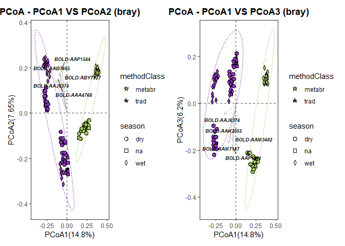
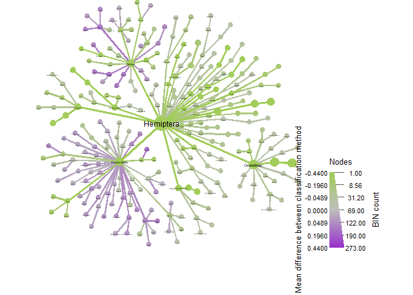

05_traditional\_&\_metabarcoding_data_for_LightTraps_only!
================
Daniel
15/11/2022

``` r
rm(list=ls()) #I always start scritps this way to make sure I have a clean R environment
library('tidyr')
library('dplyr')
```

    ## 
    ## Attaching package: 'dplyr'

    ## The following objects are masked from 'package:stats':
    ## 
    ##     filter, lag

    ## The following objects are masked from 'package:base':
    ## 
    ##     intersect, setdiff, setequal, union

``` r
library('metacoder')
```

    ## This is metacoder verison 0.3.5 (stable)

``` r
library('ggplot2')
```

    ## 
    ## Attaching package: 'ggplot2'

    ## The following object is masked from 'package:metacoder':
    ## 
    ##     map_data

``` r
library('agricolae')
library('vegan')
```

    ## Loading required package: permute

    ## Loading required package: lattice

    ## Registered S3 methods overwritten by 'vegan':
    ##   method      from
    ##   plot.rda    klaR
    ##   predict.rda klaR
    ##   print.rda   klaR

    ## This is vegan 2.5-7

``` r
library('MicrobiotaProcess')
```

    ## Registered S3 method overwritten by 'ggtree':
    ##   method      from 
    ##   identify.gg ggfun

    ## 
    ## Attaching package: 'MicrobiotaProcess'

    ## The following object is masked from 'package:metacoder':
    ## 
    ##     as_phyloseq

    ## The following object is masked from 'package:stats':
    ## 
    ##     filter

``` r
library('phyloseq')
```

    ## 
    ## Attaching package: 'phyloseq'

    ## The following object is masked from 'package:MicrobiotaProcess':
    ## 
    ##     refseq

    ## The following object is masked from 'package:metacoder':
    ## 
    ##     filter_taxa

``` r
library('ggtree')
```

    ## ggtree v3.0.4  For help: https://yulab-smu.top/treedata-book/
    ## 
    ## If you use ggtree in published research, please cite the most appropriate paper(s):
    ## 
    ## 1. Guangchuang Yu. Using ggtree to visualize data on tree-like structures. Current Protocols in Bioinformatics, 2020, 69:e96. doi:10.1002/cpbi.96
    ## 2. Guangchuang Yu, Tommy Tsan-Yuk Lam, Huachen Zhu, Yi Guan. Two methods for mapping and visualizing associated data on phylogeny using ggtree. Molecular Biology and Evolution 2018, 35(12):3041-3043. doi:10.1093/molbev/msy194
    ## 3. Guangchuang Yu, David Smith, Huachen Zhu, Yi Guan, Tommy Tsan-Yuk Lam. ggtree: an R package for visualization and annotation of phylogenetic trees with their covariates and other associated data. Methods in Ecology and Evolution 2017, 8(1):28-36. doi:10.1111/2041-210X.12628

    ## 
    ## Attaching package: 'ggtree'

    ## The following object is masked from 'package:tidyr':
    ## 
    ##     expand

``` r
library('coin')
```

    ## Loading required package: survival

``` r
library('microViz')
```

    ## 
    ## microViz version 0.9.4 - Copyright (C) 2021 David Barnett
    ## * Website: https://david-barnett.github.io/microViz/
    ## * Useful? For citation info, run: citation('microViz')
    ## * Silence: suppressPackageStartupMessages(library(microViz))

``` r
library('VennDiagram')
```

    ## Loading required package: grid

    ## Loading required package: futile.logger

    ## 
    ## Attaching package: 'VennDiagram'

    ## The following object is masked from 'package:ggtree':
    ## 
    ##     rotate

``` r
library('UpSetR')
```

    ## 
    ## Attaching package: 'UpSetR'

    ## The following object is masked from 'package:lattice':
    ## 
    ##     histogram

``` r
library('iNEXT')

tradmetabr <- read.csv('data/tradmetabr_merged.csv')
sample <- read.csv('data/metadata_trad_metabr.csv') #this includes info on location/collection method/classification method and any more info can be added
head(tradmetabr)
```

    ##       bold_bin
    ## 1 BOLD:AEK1984
    ## 2 BOLD:AEK9771
    ## 3 BOLD:AEL2824
    ## 4 BOLD:ADT0927
    ## 5 BOLD:AEL0213
    ## 6 BOLD:ABV9212
    ##                                                                    classification
    ## 1                          k__Animalia;p__Arthropoda;c__Arachnida;o__;f__;g__;s__
    ## 2                          k__Animalia;p__Arthropoda;c__Arachnida;o__;f__;g__;s__
    ## 3                          k__Animalia;p__Arthropoda;c__Arachnida;o__;f__;g__;s__
    ## 4       k__Animalia;p__Arthropoda;c__Arachnida;o__Araneae;f__Anyphaenidae;g__;s__
    ## 5       k__Animalia;p__Arthropoda;c__Arachnida;o__Araneae;f__Anyphaenidae;g__;s__
    ## 6 k__Animalia;p__Arthropoda;c__Arachnida;o__Araneae;f__Araneidae;g__Arachnura;s__
    ##   ALTOSCAMP_na_LT ARGOS_dry_BA ARGOS_wet_BA ARM1_dry_B ARM1_wet_B B05_wet_BB
    ## 1               0            0            0          0          0          0
    ## 2               0            0            0          0          0          0
    ## 3               0            0            0          0          0          0
    ## 4               0            0            0          0          0          0
    ## 5               0            0            0          0          0          0
    ## 6               0            0            0          0          0          0
    ##   ARM1_dry_BB ARM1_wet_BB ARM1_dry_BT ARM1_wet_BT ARM1_wet_LT ARM1_dry_LT
    ## 1           0           0           0           0           0           0
    ## 2           0           0           0           0           0           0
    ## 3           0           0           0           0           0           0
    ## 4           0           0           0           0           0           0
    ## 5           0           0           0           0           0           0
    ## 6           0           0           0           0           0           0
    ##   ARM1_dry_W ARM2_dry_B ARM2_wet_B TEST_dry_BB ARM2_dry_BB B06_wet_BB
    ## 1          0          0          0           0           0          0
    ## 2          0          0          0           0           0          0
    ## 3          0          0          0           0           0          0
    ## 4          0          0          0           0           0          0
    ## 5          0          0          0           0           0          0
    ## 6          0          0          0           0           0          0
    ##   ARM2_wet_BB ARM2_wet_BT ARM2_dry_BT ARM2_wet_LT ARM2_dry_LT ARM2_dry_W
    ## 1           0           0           0           0           0          0
    ## 2           0           0           0           0           0          0
    ## 3           0           0           0           0           0          0
    ## 4           0           0           0           0           0          0
    ## 5           0           0           0           0           0          0
    ## 6           0           0           0           0           0          0
    ##   ARM3_dry_B ARM3_wet_B ARM3_wet_BB ARM3_dry_BB ARM3_dry_BT ARM3_wet_BT
    ## 1          0          0           0           0           0           0
    ## 2          0          0           0           0           0           0
    ## 3          0          0           0           0           0           0
    ## 4          0          0           0           0           0           0
    ## 5          0          0           0           0           0           0
    ## 6          0          0           0           0           0           0
    ##   ARM3_wet_LT ARM3_dry_LT L02_wet_LT L02TEST_dry_LT L02_dry_LT M07_dry_MP
    ## 1           0           0          0              0          0          0
    ## 2           0           0          0              0          0          0
    ## 3           0           0          0              0          0          0
    ## 4           0           0          0              0          0          0
    ## 5           0           0          0              0          0          0
    ## 6           0           0          0              0          0          0
    ##   ARM3_dry_W ARM4_wet_B ARM4_dry_B B08_wet_BB ARM4_dry_BB ARM4_wet_BB
    ## 1          0          0          0          0           0           0
    ## 2          0          0          0          0           0           0
    ## 3          0          0          0          0           0           0
    ## 4          0          0          0          0           0           0
    ## 5          0          0          0          0           0           0
    ## 6          0          0          0          0           0           0
    ##   ARM4_dry_BT ARM4_wet_BT ARM4_wet_LT ARM4_dry_LT M08_dry_MP ARM4_dry_W
    ## 1           0           0           0           0          0          0
    ## 2           0           0           0           0          0          0
    ## 3           0           0           0           0          0          0
    ## 4           0           0           0           0          0          0
    ## 5           0           0           0           0          0          0
    ## 6           0           0           0           0          0          0
    ##   ATO_LESM_na_B B_na_BM B_na_TBA BAL1_dry_B BAL1_wet_B BAL1_dry_BB BAL1_wet_BB
    ## 1             0       0        0          0          0           0           0
    ## 2             0       0        0          0          0           0           0
    ## 3             0       0        0          0          0           0           0
    ## 4             0       0        0          0          0           0           0
    ## 5             0       0        0          0          0           0           0
    ## 6             0       0        0          0          0           0           0
    ##   BAL1_wet_BT BAL1_dry_BT BAL1_dry_LT BAL1_wet_LT M01_dry_MP BAL1_dry_W
    ## 1           0           0           0           0          0          0
    ## 2           0           0           0           0          0          0
    ## 3           0           0           0           0          0          0
    ## 4           0           0           0           0          0          0
    ## 5           0           0           0           0          0          0
    ## 6           0           0           0           0          0          0
    ##   ARBOREALBUJAN_na_AM ASPAN_na_B BCI_dry_BE BCI_wet_BM BCI_dry_BM BCI_na_HC
    ## 1                   0          0          0          0          0         0
    ## 2                   0          0          0          0          0         0
    ## 3                   0          0          0          0          0         0
    ## 4                   0          0          0          0          0         0
    ## 5                   0          0          0          0          0         0
    ## 6                   0          0          0          0          0         0
    ##   BCI_wet_HC BCI_dry_HC ALATESHIK_na_LT MANUALJESSE_na_MA ARBOREALENDARA_na_MA
    ## 1          0          0               0                 0                    0
    ## 2          0          0               0                 0                    0
    ## 3          0          0               0                 0                    0
    ## 4          0          0               0                 0                    0
    ## 5          0          0               0                 0                    0
    ## 6          0          0               0                 0                    0
    ##   MANUALDONOSOLIT_na_MA MANUALDONOSOUND_na_MA BCI_wet_MM BCI_dry_MM
    ## 1                     0                     0          0          0
    ## 2                     0                     0          0          0
    ## 3                     0                     0          0          0
    ## 4                     0                     0          0          0
    ## 5                     0                     0          0          0
    ## 6                     0                     0          0          0
    ##   FARAOC_dry_RP FARAOC_na_RP FROGDIETDONOSO_na_SC TR8_dry_T TR10_dry_T
    ## 1             0            0                    0         0          0
    ## 2             0            0                    0         0          0
    ## 3             0            0                    0         0          0
    ## 4             0            0                    0         0          0
    ## 5             0            0                    0         0          0
    ## 6             0            0                    0         0          0
    ##   TR11_dry_T TR2_dry_T TR7_dry_T TR9_dry_T TR1_dry_T TR6_dry_T BL_dry_BM
    ## 1          0         0         0         0         0         0         0
    ## 2          0         0         0         0         0         0         0
    ## 3          0         0         0         0         0         0         0
    ## 4          0         0         0         0         0         0         0
    ## 5          0         0         0         0         0         0         0
    ## 6          0         0         0         0         0         0         0
    ##   BL_dry_TH C37_dry_BA C37_wet_BA C42_wet_BA C42_dry_BA C48_dry_BA C48_wet_BA
    ## 1         0          0          0          0          0          0          0
    ## 2         0          0          0          0          0          0          0
    ## 3         0          0          0          0          0          0          0
    ## 4         0          0          0          0          0          0          0
    ## 5         0          0          0          0          0          0          0
    ## 6         0          0          0          0          0          0          0
    ##   CED_dry_T C57_wet_BA C57_dry_BA C64_wet_BA C64_dry_BA CAC_wet_HC
    ## 1         0          0          0          0          0          0
    ## 2         0          0          0          0          0          0
    ## 3         0          0          0          0          0          0
    ## 4         0          0          0          0          0          0
    ## 5         0          0          0          0          0          0
    ## 6         0          0          0          0          0          0
    ##   ALDERCOTTE_na_LA CHAC_LESM_na_B CHAN_LESM_na_B COM_LESM_na_B CUED_LESM_na_B
    ## 1                0              0              0             0              0
    ## 2                0              0              0             0              0
    ## 3                0              0              0             0              0
    ## 4                0              0              0             0              0
    ## 5                0              0              0             0              0
    ## 6                0              0              0             0              0
    ##   D_na_BM D_na_TBA DRA1_dry_B DRA1_wet_B DRA1_dry_BB DRA1_wet_BB DRA1_wet_BT
    ## 1       0        0          0          0           0           0           0
    ## 2       0        0          0          0           0           0           0
    ## 3       0        0          0          0           0           0           0
    ## 4       0        0          0          0           0           0           0
    ## 5       0        0          0          0           0           0           0
    ## 6       0        0          0          0           0           0           0
    ##   DRA1_dry_BT DRA1_dry_LT DRA1_wet_LT L03_wet_LT L03_dry_LT DRA1_dry_W
    ## 1           0           0           0          0          0          0
    ## 2           0           0           0          0          0          0
    ## 3           0           0           0          0          0          0
    ## 4           0           0           0          0          0          0
    ## 5           0           0           0          0          0          0
    ## 6           0           0           0          0          0          0
    ##   EMI_LESM_na_B FB_dry_BM FB_dry_TBA FM1_dry_BM FM2_dry_BM GIG_wet_TN
    ## 1             0         0          0          0          0          0
    ## 2             0         0          0          0          0          0
    ## 3             0         0          0          0          0          0
    ## 4             0         0          0          0          0          0
    ## 5             0         0          0          0          0          0
    ## 6             0         0          0          0          0          0
    ##   HER_LESM_na_B IXT_LESM_na_B JDH_dry_BM JVT_dry_BM JVT_dry_TBA JZ_dry_TBA
    ## 1             0             0          0          0           0          0
    ## 2             0             0          0          0           0          0
    ## 3             0             0          0          0           0          0
    ## 4             0             0          0          0           0          0
    ## 5             0             0          0          0           0          0
    ## 6             0             0          0          0           0          0
    ##   L_dry_BM NRG_LESM_na_B OPEN_na_HC PAN18FG062_na_HC PAN18FG009_na_HC
    ## 1        0             0          0                0                0
    ## 2        0             0          0                0                0
    ## 3        0             0          0                0                0
    ## 4        0             0          0                0                0
    ## 5        0             0          0                0                0
    ## 6        0             0          0                0                0
    ##   PAN18FG078_na_HC PAN18FG060_na_HC PAN18FG024_na_HC PAN18FG004_na_HC
    ## 1                0                0                0                0
    ## 2                0                0                0                0
    ## 3                0                0                0                0
    ## 4                0                0                0                0
    ## 5                0                0                0                0
    ## 6                0                0                0                0
    ##   PAN18FG080_na_HC PNM_wet_HC PRD_dry_HC PRD_wet_HC PRD_na_HC PRD_dry_LT
    ## 1                0          0          0          0         0          0
    ## 2                0          0          0          0         0          0
    ## 3                0          0          0          0         0          0
    ## 4                0          0          0          0         0          0
    ## 5                0          0          0          0         0          0
    ## 6                0          0          0          0         0          0
    ##   PUC_LESM_na_B RIOFRIO2_na_HC RIOFRIO1_na_MM SOL_dry_BM T38_wet_BA T38_dry_BA
    ## 1             0              0              0          0          0          0
    ## 2             0              0              0          0          0          0
    ## 3             0              0              0          0          0          0
    ## 4             0              0              0          0          0          0
    ## 5             0              0              0          0          0          0
    ## 6             0              0              0          0          0          0
    ##   T39_wet_BA T39_dry_BA TER_dry_T T46_dry_BA T46_wet_BA T47_wet_BA T47_dry_BA
    ## 1          0          0         0          0          0          0          0
    ## 2          0          0         0          0          0          0          0
    ## 3          0          0         0          0          0          0          0
    ## 4          0          0         0          0          0          0          0
    ## 5          0          0         0          0          0          0          0
    ## 6          0          0         0          0          0          0          0
    ##   T61_wet_BA T61_dry_BA TAP_LESM_na_B TAPIJ_LESM_na_B TB_dry_TBA TB1_dry_BM
    ## 1          0          0             0               0          0          0
    ## 2          0          0             0               0          0          0
    ## 3          0          0             0               0          0          0
    ## 4          0          0             0               0          0          0
    ## 5          0          0             0               0          0          0
    ## 6          0          0             0               0          0          0
    ##   TB2_dry_BM TB2_dry_TBA TEX_LESM_na_B TGP_dry_TBA TEK_dry_T TK2_wet_BA
    ## 1          0           0             0           0         0          0
    ## 2          0           0             0           0         0          0
    ## 3          0           0             0           0         0          0
    ## 4          0           0             0           0         0          0
    ## 5          0           0             0           0         0          0
    ## 6          0           0             0           0         0          0
    ##   TK3_wet_BA TK4_wet_BA TK5_wet_BA TUP_dry_HC TUX_LESM_na_B WHE1_wet_B
    ## 1          0          0          0          0             0          0
    ## 2          0          0          0          0             0          0
    ## 3          0          0          0          0             0          0
    ## 4          0          0          0          0             0          0
    ## 5          0          0          0          0             0          0
    ## 6          0          0          0          0             0          0
    ##   WHE1_dry_B WHE1_dry_BB WHE1_wet_BB B02_wet_BB WHE1_dry_BT WHE1_wet_BT
    ## 1          0           0           0          0           0           0
    ## 2          0           0           0          0           0           0
    ## 3          0           0           0          0           0           0
    ## 4          0           0           0          0           0           0
    ## 5          0           0           0          0           0           0
    ## 6          0           0           0          0           0           0
    ##   WHE1_wet_LT WHE1_dry_LT M03_dry_MP WHE1_dry_W WHE2_dry_B WHE2_wet_B
    ## 1           0           0          0          0          0          0
    ## 2           0           0          0          0          0          0
    ## 3           0           0          0          0          0          0
    ## 4           0           0          0          0          0          0
    ## 5           0           0          0          0          0          0
    ## 6           0           0          0          0          0          0
    ##   WHE2_dry_BB WHE2_dry_BT WHE2_wet_BT L05_wet_LT L05TEST_wet_LT WHE2_dry_LT
    ## 1           0           0           0          0              0           0
    ## 2           0           0           0          0              0           0
    ## 3           0           0           0          0              0           0
    ## 4           0           0           0          0              0           0
    ## 5           0           0           0          0              0           0
    ## 6           0           0           0          0              0           0
    ##   WHE2_wet_LT L05TEST_dry_LT WHE2_dry_W WMW_dry_BM WMW_dry_TBA ZET1_wet_B
    ## 1           0              0          0          0           0          0
    ## 2           0              0          0          0           0          0
    ## 3           0              0          0          0           0          0
    ## 4           0              0          0          0           0          0
    ## 5           0              0          0          0           0          0
    ## 6           0              0          0          0           0          0
    ##   ZET1_dry_B ZET1_dry_BB B09_wet_BB ZET1_wet_BB ZET1_wet_BT ZET1_dry_BT
    ## 1          0           0          0           0           0           0
    ## 2          0           0          0           0           0           0
    ## 3          0           0          0           0           0           0
    ## 4          0           0          0           0           0           0
    ## 5          0           0          0           0           0           0
    ## 6          0           0          0           0           0           0
    ##   L04_wet_LT ZET1_wet_LT ZET1_dry_LT L04TEST_dry_LT ZET1_dry_W ZET2_wet_B
    ## 1          0           0           0              0          0          0
    ## 2          0           0           0              0          0          0
    ## 3          0           0           0              0          0          0
    ## 4          0           0           0              0          0          0
    ## 5          0           0           0              0          0          0
    ## 6          0           0           0              0          0          0
    ##   ZET2_dry_B ZET2_dry_BB B10_wet_BB ZET2_wet_BT ZET2_dry_BT ZET2_wet_LT
    ## 1          0           0          0           0           0           0
    ## 2          0           0          0           0           0           0
    ## 3          0           0          0           0           0           0
    ## 4          0           0          0           0           0           0
    ## 5          0           0          0           0           0           0
    ## 6          0           0          0           0           0           0
    ##   ZET2_dry_LT L01_wet_LT L01TEST_dry_LT L01_dry_LT M10_dry_MP ZET2_dry_W
    ## 1           0          0              0          0          0          0
    ## 2           0          0              0          0          0          0
    ## 3           0          0              0          0          0          0
    ## 4           0          0              0          0          0          0
    ## 5           0          0              0          0          0          0
    ## 6           0          0              0          0          0          0
    ##   WINKLERDONOSO_na_W total39864 total39865 total39866 total39867 total39868
    ## 1                  0          0          0          0          0          0
    ## 2                  0          0          0          0          0          0
    ## 3                  0          0          0          0          0          0
    ## 4                  0          0          1          0          0          0
    ## 5                  0          0          0          0          0          0
    ## 6                  0          0          0          0          0          0
    ##   total39869 total39870 total39871 total39872 total39873 total39874 total39875
    ## 1          0          0          1          0          0          0          0
    ## 2          0          0          0          0          0          1          0
    ## 3          0          0          0          0          0          1          0
    ## 4          0          0          0          0          0          0          1
    ## 5          0          0          0          0          0          0          0
    ## 6          0          0          0          0          0          0          0
    ##   total39876 total39877 total39878 total39879 total39880 total39881 total39882
    ## 1          0          0          0          0          0          0          0
    ## 2          0          1          0          0          0          0          0
    ## 3          0          0          0          0          0          0          0
    ## 4          0          0          0          0          0          0          0
    ## 5          0          0          0          0          0          0          0
    ## 6          0          0          0          0          0          0          0
    ##   total39883 ARM1A ARM1B ARM2A ARM2B ARM3A ARM3B ARM4A ARM4B BAL1A BAL1B DRA1A
    ## 1          0     0     0     0     0     0     0     0     0     0     0     0
    ## 2          0     0     0     0     0     0     0     0     0     0     0     0
    ## 3          0     0     0     0     0     0     0     0     0     0     0     0
    ## 4          0     0     0     0     0     0     0     0     0     0     1     0
    ## 5          0     0     0     0     0     0     0     0     0     0     1     0
    ## 6          0     0     0     1     0     0     0     0     0     0     0     0
    ##   DRA1B WHE1A WHE1B WHE2A WHE2B ZET1A ZET1B ZET2A ZET2B
    ## 1     0     0     0     0     0     0     0     0     0
    ## 2     0     0     0     0     0     0     0     0     0
    ## 3     0     0     0     0     0     0     0     0     0
    ## 4     0     0     0     0     0     0     0     0     0
    ## 5     0     0     0     0     0     0     0     0     0
    ## 6     0     0     0     0     0     0     0     0     0

``` r
obj <- parse_tax_data(tradmetabr,
                      class_cols = "classification",
                      class_sep = ";",
                      class_regex = "^([a-z]{0,1})_{0,2}(.*)$",
                      class_key = c("tax_rank" = "taxon_rank", "name" = "taxon_name"))

obj$data$tax_table <- calc_taxon_abund(obj, data = "tax_data", cols = sample$sampleID)
```

    ## Summing per-taxon counts from 266 columns for 5840 taxa

``` r
obj$data$tax_props <- calc_obs_props(obj, "tax_data", cols= sample$sampleID, other_cols = TRUE)
```

    ## Calculating proportions from counts for 266 columns for 4702 observations.

``` r
obj$data$diff_table <- compare_groups(obj, data = "tax_table",
                                      cols = sample$sampleID,
                                      groups = sample$methodClass)
```

Data above now is prepared for comparing traditional classification vs
metabarcoding similar to what was done in Basset et al. (2021)
Scientific Reports Next is a preliminary tree but we still have to
separate them by focal groups (potentially by season too).

``` r
##trhis takes nearly 30 minutes to run

heat_tree(obj,
          node_label = taxon_names,
          node_size = n_obs,
          node_color = mean_diff,
          node_color_interval = c(-0.5, 0.5),
          node_color_range =c("goldenrod", "gray", "darkorchid"),
          node_color_digits = 1,
          node_size_axis_label = "BIN count",
          node_color_axis_label = "Mean difference in sample proportions",
          node_label_size_range = c( 0.005, 0.03),
          layout = "davidson-harel",
          initial_layout = "reingold-tilford")
```

<!-- -->

Once again, to understand the colouring scheme, read this paragraph
carefully from the metacoder tutorial:

### What color corresponds to each group depends on the order they were given in the compare_groups function. Since “leaf” is “treatment_1” in the “diff_table”, and “log2_median_ratio” is defined as “log2(treatment_1 / treatment_2)”, when a taxon has more counts in leaf samples, the ratio is positive, therefore taxa more abundant in leafs are colored magenta in this case.

their code has ’node_color_range = c(“cyan”, “gray”, “magenta”)###

If we look at print(obj$data$diff_table) above the plot, we can see that
in our case, treatment_1 is ‘TRAD’. The log2 median ratio is defined
as”log2(TRAD / METABR). When a taxon has more counts with traditional
classificaiton, the ratio is positive, therefore taxa more abundant with
traditional are coloured ‘darkorchid (purple)’ in our case (not
magenta).

``` r
sample$inv_simp <- diversity(obj$data$tax_data[, sample$sampleID],
                             index = "invsimpson",
                             MARGIN = 2) # What orietation the matrix is in
ggplot(sample, aes(x = methodClass, y = inv_simp)) +
  geom_boxplot()
```

<!-- -->

``` r
anova_result <- aov(inv_simp ~ methodClass, sample)
summary(anova_result)
```

    ##              Df  Sum Sq Mean Sq F value Pr(>F)    
    ## methodClass   1 3936391 3936391   676.2 <2e-16 ***
    ## Residuals   264 1536932    5822                   
    ## ---
    ## Signif. codes:  0 '***' 0.001 '**' 0.01 '*' 0.05 '.' 0.1 ' ' 1

``` r
tukey_result <- HSD.test(anova_result, "methodClass", group = TRUE)
print(tukey_result)
```

    ## $statistics
    ##    MSerror  Df    Mean       CV
    ##   5821.712 264 77.0188 99.06691
    ## 
    ## $parameters
    ##    test      name.t ntr StudentizedRange alpha
    ##   Tukey methodClass   2         2.784573  0.05
    ## 
    ## $means
    ##         inv_simp       std   r Min Max    Q25 Q50   Q75
    ## metabr 366.17500 161.35943  40 117 658 218.25 347 503.5
    ## trad    25.84071  48.14304 226   1 227   2.00   5  25.0
    ## 
    ## $comparison
    ## NULL
    ## 
    ## $groups
    ##         inv_simp groups
    ## metabr 366.17500      a
    ## trad    25.84071      b
    ## 
    ## attr(,"class")
    ## [1] "group"

``` r
group_data <- tukey_result$groups[order(rownames(tukey_result$groups)),]
ggplot(sample, aes(x = methodClass, y = inv_simp)) +
  geom_text(data = data.frame(),
            aes(x = rownames(group_data), y = max(sample$inv_simp) + 1, label = group_data$groups),
            col = 'black',
            size = 10) +
  geom_boxplot() +
  ggtitle("Inverse Simpson diversity") +
  xlab("Season") +
  ylab("Inverse simpson index")
```

<!-- -->

``` r
ps_obj_all <- metacoder::as_phyloseq(obj,
                      otu_table = "tax_data",
                      otu_id_col = "bold_bin",
                      sample_data = sample,
                      sample_id_col = "sampleID")
# distmethod
# "unifrac",  "wunifrac", "manhattan", "euclidean", "canberra", "bray", "kulczynski" ...(vegdist, dist)
pcoares <- get_pcoa(obj=ps_obj_all, distmethod="bray", method="hellinger")
# Visualizing the result
pcoaplot1 <- ggordpoint(obj=pcoares, biplot=TRUE, speciesannot=TRUE,
                        factorNames=c("methodClass"), ellipse=TRUE) +
  scale_color_manual(values=c("goldenrod", "darkorchid")) +
  scale_fill_manual(values=c("goldenrod", "darkorchid"))
# first and third principal co-ordinates
pcoaplot2 <- ggordpoint(obj=pcoares, pc=c(1, 3), biplot=TRUE, speciesannot=TRUE,
                        factorNames=c("methodClass"), ellipse=TRUE) +
  scale_color_manual(values=c("goldenrod", "darkorchid")) +
  scale_fill_manual(values=c("goldenrod", "darkorchid"))
pcoaplot1 | pcoaplot2 #PCoA between classification methods
```

<!-- -->

``` r
pcoaplot1a <- ggordpoint(obj=pcoares, biplot=TRUE, speciesannot=TRUE,
                        factorNames=c("methodClass", "season"), ellipse=TRUE) +
  scale_color_manual(values=c("goldenrod", "darkorchid")) +
  scale_fill_manual(values=c("goldenrod", "darkorchid"))
# first and third principal co-ordinates
pcoaplot2a <- ggordpoint(obj=pcoares, pc=c(1, 3), biplot=TRUE, speciesannot=TRUE,
                        factorNames=c("methodClass", "season"), ellipse=TRUE) +
  scale_color_manual(values=c("goldenrod", "darkorchid")) +
  scale_fill_manual(values=c("goldenrod", "darkorchid"))
pcoaplot1a | pcoaplot2a #Between classification and season
```

<!-- -->

``` r
pcoaplot1c <- ggordpoint(obj=pcoares, biplot=TRUE, speciesannot=TRUE,
                        factorNames=c("methodClass", "method"), ellipse=TRUE) +
  scale_color_manual(values=c("goldenrod", "darkorchid")) +
  scale_fill_manual(values=c("goldenrod", "darkorchid"))
# first and third principal co-ordinates
pcoaplot2c <- ggordpoint(obj=pcoares, pc=c(1, 3), biplot=TRUE, speciesannot=TRUE,
                        factorNames=c("methodClass", "method"), ellipse=TRUE) +
  scale_color_manual(values=c("goldenrod", "darkorchid")) +
  scale_fill_manual(values=c("goldenrod", "darkorchid"))
pcoaplot1c | pcoaplot2c #Between classification, season and trap method
```

<!-- -->

``` r
###### I HAVE A SMALL PROBLEM WITH grid PACKAGE. IT IS PLOTING ON TOP OF PREVIOUS PLOTS SO DO THIS dev.off() to draw in a new plot

dev.off()
```

    ## null device 
    ##           1

``` r
vennlist_all <- get_vennlist(obj=ps_obj_all, factorNames="methodClass")
vennp_all <- venn.diagram(vennlist_all,
                      height=5,
                      width=5, 
                      filename=NULL,
                      disable.logging = TRUE,
                      fill=c("goldenrod", "darkorchid"),
                      cat.col=c("goldenrod", "darkorchid"),
                      alpha = 0.85, 
                      fontfamily = "serif",
                      fontface = "bold",
                      cex = 1.2,
                      cat.cex = 1.3,
                      cat.default.pos = "outer",
                      cat.dist=0.1,
                      margin = 0.1, 
                      lwd = 3,
                      lty ='dotted',
                      imagetype = "svg")
```

    ## INFO [2022-12-05 13:22:55] [[1]]
    ## INFO [2022-12-05 13:22:55] vennlist_all
    ## INFO [2022-12-05 13:22:55] 
    ## INFO [2022-12-05 13:22:55] $height
    ## INFO [2022-12-05 13:22:55] [1] 5
    ## INFO [2022-12-05 13:22:55] 
    ## INFO [2022-12-05 13:22:55] $width
    ## INFO [2022-12-05 13:22:55] [1] 5
    ## INFO [2022-12-05 13:22:55] 
    ## INFO [2022-12-05 13:22:55] $filename
    ## INFO [2022-12-05 13:22:55] NULL
    ## INFO [2022-12-05 13:22:55] 
    ## INFO [2022-12-05 13:22:55] $disable.logging
    ## INFO [2022-12-05 13:22:55] [1] TRUE
    ## INFO [2022-12-05 13:22:55] 
    ## INFO [2022-12-05 13:22:55] $fill
    ## INFO [2022-12-05 13:22:55] c("goldenrod", "darkorchid")
    ## INFO [2022-12-05 13:22:55] 
    ## INFO [2022-12-05 13:22:55] $cat.col
    ## INFO [2022-12-05 13:22:55] c("goldenrod", "darkorchid")
    ## INFO [2022-12-05 13:22:55] 
    ## INFO [2022-12-05 13:22:55] $alpha
    ## INFO [2022-12-05 13:22:55] [1] 0.85
    ## INFO [2022-12-05 13:22:55] 
    ## INFO [2022-12-05 13:22:55] $fontfamily
    ## INFO [2022-12-05 13:22:55] [1] "serif"
    ## INFO [2022-12-05 13:22:55] 
    ## INFO [2022-12-05 13:22:55] $fontface
    ## INFO [2022-12-05 13:22:55] [1] "bold"
    ## INFO [2022-12-05 13:22:55] 
    ## INFO [2022-12-05 13:22:55] $cex
    ## INFO [2022-12-05 13:22:55] [1] 1.2
    ## INFO [2022-12-05 13:22:55] 
    ## INFO [2022-12-05 13:22:55] $cat.cex
    ## INFO [2022-12-05 13:22:55] [1] 1.3
    ## INFO [2022-12-05 13:22:55] 
    ## INFO [2022-12-05 13:22:55] $cat.default.pos
    ## INFO [2022-12-05 13:22:55] [1] "outer"
    ## INFO [2022-12-05 13:22:55] 
    ## INFO [2022-12-05 13:22:55] $cat.dist
    ## INFO [2022-12-05 13:22:55] [1] 0.1
    ## INFO [2022-12-05 13:22:55] 
    ## INFO [2022-12-05 13:22:55] $margin
    ## INFO [2022-12-05 13:22:55] [1] 0.1
    ## INFO [2022-12-05 13:22:55] 
    ## INFO [2022-12-05 13:22:55] $lwd
    ## INFO [2022-12-05 13:22:55] [1] 3
    ## INFO [2022-12-05 13:22:55] 
    ## INFO [2022-12-05 13:22:55] $lty
    ## INFO [2022-12-05 13:22:55] [1] "dotted"
    ## INFO [2022-12-05 13:22:55] 
    ## INFO [2022-12-05 13:22:55] $imagetype
    ## INFO [2022-12-05 13:22:55] [1] "svg"
    ## INFO [2022-12-05 13:22:55]

``` r
grid::grid.draw(vennp_all)
```

``` r
classtaxa <- get_taxadf(obj=ps_obj_all, taxlevel=4)
# The 5 most abundant taxonomy will be visualized by default (parameter `topn=5`). 
pclass <- ggbartax(obj=classtaxa, facetNames="methodClass", topn=5) +
  xlab(NULL) +
  ylab("relative abundance (%)") +
  scale_fill_manual(values=c(colorRampPalette(RColorBrewer::brewer.pal(12,"Set3"))(31))) +
  guides(fill= guide_legend(keywidth = 0.5, keyheight = 0.5))
```

    ## The color has been set automatically, you can reset it 
    ##             manually by adding scale_fill_manual(values=yourcolors)

    ## Scale for 'fill' is already present. Adding another scale for 'fill', which
    ## will replace the existing scale.

``` r
#note the flag "count=TRUE", this shows now total reads, rather than proportion %
pclass2 <- ggbartax(obj=classtaxa, count=TRUE, facetNames="methodClass", topn=5) +
  xlab(NULL) +
  ylab("count reads") +
  scale_fill_manual(values=c(colorRampPalette(RColorBrewer::brewer.pal(12,"Set3"))(31))) +
  guides(fill= guide_legend(keywidth = 0.5, keyheight = 0.5))
```

    ## The color has been set automatically, you can reset it 
    ##             manually by adding scale_fill_manual(values=yourcolors)
    ## Scale for 'fill' is already present. Adding another scale for 'fill', which
    ## will replace the existing scale.

``` r
pclass
```

<!-- -->

``` r
pclass2
```

<!-- -->

``` r
obj_LT <- parse_tax_data(tradmetabr,
                    class_cols = "classification",
                      class_sep = ";",
                      class_regex = "^([a-z]{0,1})_{0,2}(.*)$",
                      class_key = c("tax_rank" = "taxon_rank", "name" = "taxon_name"))
sample_LT <- filter(sample, method == "LT")

obj_LT$data$tax_data <- obj_LT$data$tax_data[c("taxon_id","bold_bin", "classification", sample_LT$sampleID)]
print(obj_LT)
```

    ## <Taxmap>
    ##   5840 taxa: aab. Animalia, aac. Arthropoda ... iqq. _ADV7786
    ##   5840 edges: NA->aab, aab->aac, aac->aad ... cvk->iqp, cvk->iqq
    ##   2 data sets:
    ##     tax_data:
    ##       # A tibble: 4,702 x 79
    ##         taxon_id bold_bin     classi~1 ALATE~2 ALTOS~3 ARM1_~4 ARM1_~5
    ##         <chr>    <chr>        <chr>      <int>   <int>   <int>   <int>
    ##       1 cvl      BOLD:AEK1984 k__Anim~       0       0       0       0
    ##       2 cvl      BOLD:AEK9771 k__Anim~       0       0       0       0
    ##       3 cvl      BOLD:AEL2824 k__Anim~       0       0       0       0
    ##       # ... with 4,699 more rows, 72 more variables:
    ##       #   ARM2_wet_LT <int>, ARM2_dry_LT <int>, ARM3_wet_LT <int>,
    ##       #   ARM3_dry_LT <int>, ARM4_wet_LT <int>, ARM4_dry_LT <int>,
    ##       #   BAL1_dry_LT <int>, BAL1_wet_LT <int>, DRA1_dry_LT <int>,
    ##       #   DRA1_wet_LT <int>, ..., and abbreviated variable names
    ##       #   1: classification, 2: ALATESHIK_na_LT, 3: ALTOSCAMP_na_LT,
    ##       #   4: ARM1_wet_LT, 5: ARM1_dry_LT
    ##     class_data:
    ##       # A tibble: 32,914 x 5
    ##         taxon_id input_index tax_rank name       regex_match  
    ##         <chr>          <int> <chr>    <chr>      <chr>        
    ##       1 aab                1 k        Animalia   k__Animalia  
    ##       2 aac                1 p        Arthropoda p__Arthropoda
    ##       3 aad                1 c        Arachnida  c__Arachnida 
    ##       # ... with 32,911 more rows
    ##   0 functions:

``` r
no_reads <- rowSums(obj_LT$data$tax_data[, sample_LT$sampleID]) == 0
sum(no_reads) 
```

    ## [1] 928

``` r
#there are 928 BINs that do not have reads when we filter by trap method. We must remove
obj_LT <- filter_obs(obj_LT, data = "tax_data", ! no_reads, drop_taxa = TRUE)

obj_LT$data$tax_table <- calc_taxon_abund(obj_LT, data = "tax_data", cols = sample_LT$sampleID)
```

    ## Summing per-taxon counts from 76 columns for 4583 taxa

``` r
obj_LT$data$tax_props <- calc_obs_props(obj_LT, "tax_data", cols = sample_LT$sampleID)
```

    ## Calculating proportions from counts for 76 columns for 3774 observations.

``` r
obj_LT$data$diff_table <- compare_groups(obj_LT, data = "tax_table",
                                      cols = sample_LT$sampleID,
                                      groups = sample_LT$methodClass)

ps_obj_LT <- metacoder::as_phyloseq(obj_LT,
                      otu_table = "tax_data",
                      otu_id_col = "bold_bin",
                      sample_data = sample,
                      sample_id_col = "sampleID")

pcoares_LT <- get_pcoa(obj=ps_obj_LT, distmethod="bray", method="hellinger")
# Visualizing the result
pcoaplot1_LT <- ggordpoint(obj=pcoares_LT, biplot=TRUE, speciesannot=TRUE,
                        factorNames=c("methodClass", "season"), ellipse=TRUE) +
  scale_color_manual(values=c("goldenrod", "darkorchid")) +
  scale_fill_manual(values=c("goldenrod", "darkorchid"))
# first and third principal co-ordinates
pcoaplot2_LT <- ggordpoint(obj=pcoares_LT, pc=c(1, 3), biplot=TRUE, speciesannot=TRUE,
                        factorNames=c("methodClass", "season"), ellipse=TRUE) +
  scale_color_manual(values=c("goldenrod", "darkorchid")) +
  scale_fill_manual(values=c("goldenrod", "darkorchid"))
pcoaplot1_LT | pcoaplot2_LT
```

<!-- -->

``` r
classtaxa_LT <- get_taxadf(obj=ps_obj_LT, taxlevel=4)
# The 5 most abundant taxonomy will be visualized by default (parameter `topn=5`). 
pclass_LT <- ggbartax(obj=classtaxa_LT, facetNames="methodClass", topn=5) +
  xlab(NULL) +
  ylab("relative abundance (%)") +
  scale_fill_manual(values=c(colorRampPalette(RColorBrewer::brewer.pal(12,"Set3"))(31))) +
  guides(fill= guide_legend(keywidth = 0.5, keyheight = 0.5))
```

    ## The color has been set automatically, you can reset it 
    ##             manually by adding scale_fill_manual(values=yourcolors)

    ## Scale for 'fill' is already present. Adding another scale for 'fill', which
    ## will replace the existing scale.

``` r
pclass_LT
```

<!-- -->

``` r
heat_tree(obj_LT,
          node_label = taxon_names,
          node_size = n_obs,
          node_color = mean_diff,
          node_color_interval = c(-0.5, 0.5),
          node_color_range = c("goldenrod", "gray", "darkorchid"),
          node_color_digits = 1,
          node_size_axis_label = "BIN count",
          node_color_axis_label = "Mean difference in sample proportions",
          node_label_size_range = c( 0.005, 0.03),
          layout = "davidson-harel",
          initial_layout = "reingold-tilford")
```

<!-- -->

``` r
##This one takes about 15 minutes to run
```

``` r
dev.off()
```

    ## null device 
    ##           1

``` r
vennlist_LT <- get_vennlist(obj=ps_obj_LT, factorNames="methodClass")
vennp_LT <- venn.diagram(vennlist_LT,
                      height=5,
                      width=5, 
                      filename=NULL,
                      disable.logging = TRUE,
                      fill=c("goldenrod", "darkorchid"),
                      cat.col=c("goldenrod", "darkorchid"),
                      alpha = 0.85, 
                      fontfamily = "serif",
                      fontface = "bold",
                      cex = 1.2,
                      cat.cex = 1.3,
                      cat.default.pos = "outer",
                      cat.dist=0.1,
                      margin = 0.1, 
                      lwd = 3,
                      lty ='dotted',
                      imagetype = "svg")
```

    ## INFO [2022-12-05 13:39:19] [[1]]
    ## INFO [2022-12-05 13:39:19] vennlist_LT
    ## INFO [2022-12-05 13:39:19] 
    ## INFO [2022-12-05 13:39:19] $height
    ## INFO [2022-12-05 13:39:19] [1] 5
    ## INFO [2022-12-05 13:39:19] 
    ## INFO [2022-12-05 13:39:19] $width
    ## INFO [2022-12-05 13:39:19] [1] 5
    ## INFO [2022-12-05 13:39:19] 
    ## INFO [2022-12-05 13:39:19] $filename
    ## INFO [2022-12-05 13:39:19] NULL
    ## INFO [2022-12-05 13:39:19] 
    ## INFO [2022-12-05 13:39:19] $disable.logging
    ## INFO [2022-12-05 13:39:19] [1] TRUE
    ## INFO [2022-12-05 13:39:19] 
    ## INFO [2022-12-05 13:39:19] $fill
    ## INFO [2022-12-05 13:39:19] c("goldenrod", "darkorchid")
    ## INFO [2022-12-05 13:39:19] 
    ## INFO [2022-12-05 13:39:19] $cat.col
    ## INFO [2022-12-05 13:39:19] c("goldenrod", "darkorchid")
    ## INFO [2022-12-05 13:39:19] 
    ## INFO [2022-12-05 13:39:19] $alpha
    ## INFO [2022-12-05 13:39:19] [1] 0.85
    ## INFO [2022-12-05 13:39:19] 
    ## INFO [2022-12-05 13:39:19] $fontfamily
    ## INFO [2022-12-05 13:39:19] [1] "serif"
    ## INFO [2022-12-05 13:39:19] 
    ## INFO [2022-12-05 13:39:19] $fontface
    ## INFO [2022-12-05 13:39:19] [1] "bold"
    ## INFO [2022-12-05 13:39:19] 
    ## INFO [2022-12-05 13:39:19] $cex
    ## INFO [2022-12-05 13:39:19] [1] 1.2
    ## INFO [2022-12-05 13:39:19] 
    ## INFO [2022-12-05 13:39:19] $cat.cex
    ## INFO [2022-12-05 13:39:19] [1] 1.3
    ## INFO [2022-12-05 13:39:19] 
    ## INFO [2022-12-05 13:39:19] $cat.default.pos
    ## INFO [2022-12-05 13:39:19] [1] "outer"
    ## INFO [2022-12-05 13:39:19] 
    ## INFO [2022-12-05 13:39:19] $cat.dist
    ## INFO [2022-12-05 13:39:19] [1] 0.1
    ## INFO [2022-12-05 13:39:19] 
    ## INFO [2022-12-05 13:39:19] $margin
    ## INFO [2022-12-05 13:39:19] [1] 0.1
    ## INFO [2022-12-05 13:39:19] 
    ## INFO [2022-12-05 13:39:19] $lwd
    ## INFO [2022-12-05 13:39:19] [1] 3
    ## INFO [2022-12-05 13:39:19] 
    ## INFO [2022-12-05 13:39:19] $lty
    ## INFO [2022-12-05 13:39:19] [1] "dotted"
    ## INFO [2022-12-05 13:39:19] 
    ## INFO [2022-12-05 13:39:19] $imagetype
    ## INFO [2022-12-05 13:39:19] [1] "svg"
    ## INFO [2022-12-05 13:39:19]

``` r
grid::grid.draw(vennp_LT)
```

``` r
obj_LT %>%  metacoder::filter_taxa(taxon_names %in% c("Lepidoptera", "Coleoptera", "Hymenoptera", "Hemiptera", "Blattodea"),#here is to fliter the figure by focal groups
              subtaxa = TRUE) -> obj_focal

no_reads <- rowSums(obj_focal$data$tax_data[, sample_LT$sampleID]) == 0 #check for zeroes after filtering always. Otherwise we get bad results
sum(no_reads) #in this case theree is no zeroes, which is good, but we should always check
```

    ## [1] 0

``` r
obj_focal$data$tax_data <- obj_focal$data$tax_data[c("taxon_id","bold_bin", "classification", sample_LT$sampleID)]
print(obj_focal)
```

    ## <Taxmap>
    ##   3718 taxa: aao. Blattodea ... imn. BioLep28_AAU7449
    ##   3718 edges: NA->aao, NA->aap, NA->aas ... cto->imm, ctp->imn
    ##   5 data sets:
    ##     tax_data:
    ##       # A tibble: 2,722 x 79
    ##         taxon_id bold_bin     classi~1 ALATE~2 ALTOS~3 ARM1_~4 ARM1_~5
    ##         <chr>    <chr>        <chr>      <int>   <int>   <int>   <int>
    ##       1 cxw      BOLD:ADT6615 k__Anim~       0       0       0       0
    ##       2 cxw      BOLD:ADV7142 k__Anim~       0       0       0       0
    ##       3 cxx      BOLD:ADB4571 k__Anim~       0       0       0       0
    ##       # ... with 2,719 more rows, 72 more variables:
    ##       #   ARM2_wet_LT <int>, ARM2_dry_LT <int>, ARM3_wet_LT <int>,
    ##       #   ARM3_dry_LT <int>, ARM4_wet_LT <int>, ARM4_dry_LT <int>,
    ##       #   BAL1_dry_LT <int>, BAL1_wet_LT <int>, DRA1_dry_LT <int>,
    ##       #   DRA1_wet_LT <int>, ..., and abbreviated variable names
    ##       #   1: classification, 2: ALATESHIK_na_LT, 3: ALTOSCAMP_na_LT,
    ##       #   4: ARM1_wet_LT, 5: ARM1_dry_LT
    ##     class_data:
    ##       # A tibble: 12,927 x 5
    ##         taxon_id input_index tax_rank name         regex_match  
    ##         <chr>          <int> <chr>    <chr>        <chr>        
    ##       1 aao               85 o        "Blattodea"  o__Blattodea 
    ##       2 ach               85 f        "Blaberidae" f__Blaberidae
    ##       3 ang               85 g        ""           g__          
    ##       # ... with 12,924 more rows
    ##     tax_table:
    ##       # A tibble: 3,718 x 77
    ##         taxon_id ALATESHIK_n~1 ALTOS~2 ARM1_~3 ARM1_~4 ARM2_~5 ARM2_~6
    ##         <chr>            <dbl>   <dbl>   <dbl>   <dbl>   <dbl>   <dbl>
    ##       1 aao                  0       1       1       2       0       0
    ##       2 aap                  0       0       5      12       1       7
    ##       3 aas                  0       0       2       5       5       7
    ##       # ... with 3,715 more rows, 70 more variables:
    ##       #   ARM3_wet_LT <dbl>, ARM3_dry_LT <dbl>, ARM4_wet_LT <dbl>,
    ##       #   ARM4_dry_LT <dbl>, BAL1_dry_LT <dbl>, BAL1_wet_LT <dbl>,
    ##       #   DRA1_dry_LT <dbl>, DRA1_wet_LT <dbl>, L01_wet_LT <dbl>,
    ##       #   L01_dry_LT <dbl>, ..., and abbreviated variable names
    ##       #   1: ALATESHIK_na_LT, 2: ALTOSCAMP_na_LT, 3: ARM1_wet_LT,
    ##       #   4: ARM1_dry_LT, 5: ARM2_wet_LT, 6: ARM2_dry_LT
    ##     tax_props:
    ##       # A tibble: 2,722 x 77
    ##         taxon_id ALATESHIK_n~1 ALTOS~2 ARM1_~3 ARM1_~4 ARM2_~5 ARM2_~6
    ##         <chr>            <dbl>   <dbl>   <dbl>   <dbl>   <dbl>   <dbl>
    ##       1 cxw                  0       0       0       0       0       0
    ##       2 cxw                  0       0       0       0       0       0
    ##       3 cxx                  0       0       0       0       0       0
    ##       # ... with 2,719 more rows, 70 more variables:
    ##       #   ARM3_wet_LT <dbl>, ARM3_dry_LT <dbl>, ARM4_wet_LT <dbl>,
    ##       #   ARM4_dry_LT <dbl>, BAL1_dry_LT <dbl>, BAL1_wet_LT <dbl>,
    ##       #   DRA1_dry_LT <dbl>, DRA1_wet_LT <dbl>, L01_wet_LT <dbl>,
    ##       #   L01_dry_LT <dbl>, ..., and abbreviated variable names
    ##       #   1: ALATESHIK_na_LT, 2: ALTOSCAMP_na_LT, 3: ARM1_wet_LT,
    ##       #   4: ARM1_dry_LT, 5: ARM2_wet_LT, 6: ARM2_dry_LT
    ##     diff_table:
    ##       # A tibble: 3,718 x 7
    ##         taxon_id treatment_1 treatm~1 log2_~2 media~3 mean_~4 wilcox~5
    ##         <chr>    <chr>       <chr>      <dbl>   <dbl>   <dbl>    <dbl>
    ##       1 aao      trad        metabr     -2.58    -2.5   -3.13 5.86e-10
    ##       2 aap      trad        metabr     -4.39   -50    -45.9  6.59e-14
    ##       3 aas      trad        metabr     -2.70   -16.5  -16.0  9.11e-10
    ##       # ... with 3,715 more rows, and abbreviated variable names
    ##       #   1: treatment_2, 2: log2_median_ratio, 3: median_diff,
    ##       #   4: mean_diff, 5: wilcox_p_value
    ##   0 functions:

``` r
obj_focal$data$tax_table <- calc_taxon_abund(obj_focal, data = "tax_data", cols = sample_LT$sampleID)
```

    ## Summing per-taxon counts from 76 columns for 3718 taxa

``` r
obj_focal$data$tax_props <- calc_obs_props(obj_focal, "tax_data", cols = sample_LT$sampleID)
```

    ## Calculating proportions from counts for 76 columns for 2722 observations.

``` r
obj_focal$data$diff_table <- compare_groups(obj_focal, data = "tax_table",
                                      cols = sample_LT$sampleID,
                                      groups = sample_LT$methodClass)

ps_obj_focal <- metacoder::as_phyloseq(obj_focal,
                      otu_table = "tax_data",
                      otu_id_col = "bold_bin",
                      sample_data = sample,
                      sample_id_col = "sampleID")

pcoares_focal <- get_pcoa(obj=ps_obj_focal, distmethod="bray", method="hellinger")
# Visualizing the result
pcoaplot1_focal <- ggordpoint(obj=pcoares_focal, biplot=TRUE, speciesannot=TRUE,
                        factorNames=c("methodClass", "season"), ellipse=TRUE) +
  scale_color_manual(values=c("goldenrod", "darkorchid")) +
  scale_fill_manual(values=c("goldenrod", "darkorchid"))
# first and third principal co-ordinates
pcoaplot2_focal <- ggordpoint(obj=pcoares_focal, pc=c(1, 3), biplot=TRUE, speciesannot=TRUE,
                        factorNames=c("methodClass", "season"), ellipse=TRUE) +
  scale_color_manual(values=c("goldenrod", "darkorchid")) +
  scale_fill_manual(values=c("goldenrod", "darkorchid"))
pcoaplot1_focal | pcoaplot2_focal
```

<!-- -->

``` r
#pcoaplot2_focal

heat_tree(obj_focal,
          node_label = taxon_names,
          node_size = n_obs,
          node_color = mean_diff,
          node_color_interval = c(-0.5, 0.5),
          node_color_range = c("goldenrod", "gray", "darkorchid"),
          node_color_digits = 1,
          node_size_axis_label = "BIN count",
          node_color_axis_label = "Mean difference in sample proportions",
          node_label_size_range = c( 0.005, 0.03),
          layout = "davidson-harel",
          initial_layout = "reingold-tilford")
```

<!-- -->

``` r
#this one takes about 10 minutes to run
```

``` r
dev.off()
```

    ## null device 
    ##           1

``` r
vennlist_focal <- get_vennlist(obj=ps_obj_focal, factorNames="methodClass")
vennp_focal <- venn.diagram(vennlist_focal,
                      height=5,
                      width=5, 
                      filename=NULL,
                      disable.logging = TRUE,
                      fill=c("goldenrod", "darkorchid"),
                      cat.col=c("goldenrod", "darkorchid"),
                      alpha = 0.85, 
                      fontfamily = "serif",
                      fontface = "bold",
                      cex = 1.2,
                      cat.cex = 1.3,
                      cat.default.pos = "outer",
                      cat.dist=0.1,
                      margin = 0.1, 
                      lwd = 3,
                      lty ='dotted',
                      imagetype = "svg")
```

    ## INFO [2022-12-05 13:45:50] [[1]]
    ## INFO [2022-12-05 13:45:50] vennlist_focal
    ## INFO [2022-12-05 13:45:50] 
    ## INFO [2022-12-05 13:45:50] $height
    ## INFO [2022-12-05 13:45:50] [1] 5
    ## INFO [2022-12-05 13:45:50] 
    ## INFO [2022-12-05 13:45:50] $width
    ## INFO [2022-12-05 13:45:50] [1] 5
    ## INFO [2022-12-05 13:45:50] 
    ## INFO [2022-12-05 13:45:50] $filename
    ## INFO [2022-12-05 13:45:50] NULL
    ## INFO [2022-12-05 13:45:50] 
    ## INFO [2022-12-05 13:45:50] $disable.logging
    ## INFO [2022-12-05 13:45:50] [1] TRUE
    ## INFO [2022-12-05 13:45:50] 
    ## INFO [2022-12-05 13:45:50] $fill
    ## INFO [2022-12-05 13:45:50] c("goldenrod", "darkorchid")
    ## INFO [2022-12-05 13:45:50] 
    ## INFO [2022-12-05 13:45:50] $cat.col
    ## INFO [2022-12-05 13:45:50] c("goldenrod", "darkorchid")
    ## INFO [2022-12-05 13:45:50] 
    ## INFO [2022-12-05 13:45:50] $alpha
    ## INFO [2022-12-05 13:45:50] [1] 0.85
    ## INFO [2022-12-05 13:45:50] 
    ## INFO [2022-12-05 13:45:50] $fontfamily
    ## INFO [2022-12-05 13:45:50] [1] "serif"
    ## INFO [2022-12-05 13:45:50] 
    ## INFO [2022-12-05 13:45:50] $fontface
    ## INFO [2022-12-05 13:45:50] [1] "bold"
    ## INFO [2022-12-05 13:45:50] 
    ## INFO [2022-12-05 13:45:50] $cex
    ## INFO [2022-12-05 13:45:50] [1] 1.2
    ## INFO [2022-12-05 13:45:50] 
    ## INFO [2022-12-05 13:45:50] $cat.cex
    ## INFO [2022-12-05 13:45:50] [1] 1.3
    ## INFO [2022-12-05 13:45:50] 
    ## INFO [2022-12-05 13:45:50] $cat.default.pos
    ## INFO [2022-12-05 13:45:50] [1] "outer"
    ## INFO [2022-12-05 13:45:50] 
    ## INFO [2022-12-05 13:45:50] $cat.dist
    ## INFO [2022-12-05 13:45:50] [1] 0.1
    ## INFO [2022-12-05 13:45:50] 
    ## INFO [2022-12-05 13:45:50] $margin
    ## INFO [2022-12-05 13:45:50] [1] 0.1
    ## INFO [2022-12-05 13:45:50] 
    ## INFO [2022-12-05 13:45:50] $lwd
    ## INFO [2022-12-05 13:45:50] [1] 3
    ## INFO [2022-12-05 13:45:50] 
    ## INFO [2022-12-05 13:45:50] $lty
    ## INFO [2022-12-05 13:45:50] [1] "dotted"
    ## INFO [2022-12-05 13:45:50] 
    ## INFO [2022-12-05 13:45:50] $imagetype
    ## INFO [2022-12-05 13:45:50] [1] "svg"
    ## INFO [2022-12-05 13:45:50]

``` r
grid::grid.draw(vennp_focal)
dev.off()
```

    ## null device 
    ##           1

``` r
set.seed(16)#to make sure the figures is always the same
obj_focal %>%
  metacoder::filter_taxa(taxon_names == "Lepidoptera",#here is to filter the figure by groups
              subtaxa = TRUE) %>%  
  heat_tree(node_label = taxon_names,
            #node_size_range = c(0.005, 0.02),
            #edge_size_range = c(0.005, 0.01),
            node_size = n_obs, # n_obs is a function that calculates, in this case, the number of OTUs per taxon
            node_color = mean_diff, # A column from `obj_LT$data$diff_table`
            node_color_interval = c(-0.01,0.01), # The range of the mean_difference to display
            node_color_range = c("goldenrod", "gray", "darkorchid"), # The color palette used Treatment_1 (trad) corresponds to DarkOrchid Color
            node_size_axis_label = "BIN count",
            node_color_axis_label = "Mean difference between classification methods",
            node_label_size_range = c( 0.005, 0.03),
            layout = "davidson-harel", # The primary layout algorithm
            initial_layout = "reingold-tilford") # The layout algorithm that initializes node locations
```

<!-- -->

``` r
#this one takes about 

obj_focal %>%  metacoder::filter_taxa(taxon_names %in% c("Lepidoptera"),#here is to fliter the figure by groups
              subtaxa = TRUE) -> leps_LT #we will create separate files for each order as this simplifies downstream analysis in microbiotaprocess - until I find a way to filter taxa on the mpse object directly.
no_reads <- rowSums(leps_LT$data$tax_data[, sample_LT$sampleID]) == 0 #check for zeroes after filtering always. Otherwise we get bad results
sum(no_reads) #in this case theree is no zeroes, which is good, but we should always check
```

    ## [1] 0

``` r
ps_leps_LT <- metacoder::as_phyloseq(leps_LT,
                      otu_table = "tax_data",
                      otu_id_col = "bold_bin",
                      sample_data = sample,
                      sample_id_col = "sampleID")  %>% microViz::tax_mutate(rank_0 = "Animalia",rank_01 = "Arthropoda", rank_02 = "Insecta", .before = 1) -> ps_leps_LT
colnames(tax_table(ps_leps_LT)) <- c("k__", "p__", "o__", "c__", "f__", "g__", "s__")
```

``` r
dev.off()
```

    ## null device 
    ##           1

``` r
vennlist_leps <- get_vennlist(obj=ps_leps_LT, factorNames="methodClass")
vennp_leps <- venn.diagram(vennlist_leps,
                      height=5,
                      width=5, 
                      filename=NULL,
                      disable.logging = TRUE,
                      fill=c("goldenrod", "darkorchid"),
                      cat.col=c("goldenrod", "darkorchid"),
                      alpha = 0.85, 
                      fontfamily = "serif",
                      fontface = "bold",
                      cex = 1.2,
                      cat.cex = 1.3,
                      cat.default.pos = "outer",
                      cat.dist=0.1,
                      margin = 0.1, 
                      lwd = 3,
                      lty ='dotted',
                      imagetype = "svg")
```

    ## INFO [2022-12-05 13:51:05] [[1]]
    ## INFO [2022-12-05 13:51:05] vennlist_leps
    ## INFO [2022-12-05 13:51:05] 
    ## INFO [2022-12-05 13:51:05] $height
    ## INFO [2022-12-05 13:51:05] [1] 5
    ## INFO [2022-12-05 13:51:05] 
    ## INFO [2022-12-05 13:51:05] $width
    ## INFO [2022-12-05 13:51:05] [1] 5
    ## INFO [2022-12-05 13:51:05] 
    ## INFO [2022-12-05 13:51:05] $filename
    ## INFO [2022-12-05 13:51:05] NULL
    ## INFO [2022-12-05 13:51:05] 
    ## INFO [2022-12-05 13:51:05] $disable.logging
    ## INFO [2022-12-05 13:51:05] [1] TRUE
    ## INFO [2022-12-05 13:51:05] 
    ## INFO [2022-12-05 13:51:05] $fill
    ## INFO [2022-12-05 13:51:05] c("goldenrod", "darkorchid")
    ## INFO [2022-12-05 13:51:05] 
    ## INFO [2022-12-05 13:51:05] $cat.col
    ## INFO [2022-12-05 13:51:05] c("goldenrod", "darkorchid")
    ## INFO [2022-12-05 13:51:05] 
    ## INFO [2022-12-05 13:51:05] $alpha
    ## INFO [2022-12-05 13:51:05] [1] 0.85
    ## INFO [2022-12-05 13:51:05] 
    ## INFO [2022-12-05 13:51:05] $fontfamily
    ## INFO [2022-12-05 13:51:05] [1] "serif"
    ## INFO [2022-12-05 13:51:05] 
    ## INFO [2022-12-05 13:51:05] $fontface
    ## INFO [2022-12-05 13:51:05] [1] "bold"
    ## INFO [2022-12-05 13:51:05] 
    ## INFO [2022-12-05 13:51:05] $cex
    ## INFO [2022-12-05 13:51:05] [1] 1.2
    ## INFO [2022-12-05 13:51:05] 
    ## INFO [2022-12-05 13:51:05] $cat.cex
    ## INFO [2022-12-05 13:51:05] [1] 1.3
    ## INFO [2022-12-05 13:51:05] 
    ## INFO [2022-12-05 13:51:05] $cat.default.pos
    ## INFO [2022-12-05 13:51:05] [1] "outer"
    ## INFO [2022-12-05 13:51:05] 
    ## INFO [2022-12-05 13:51:05] $cat.dist
    ## INFO [2022-12-05 13:51:05] [1] 0.1
    ## INFO [2022-12-05 13:51:05] 
    ## INFO [2022-12-05 13:51:05] $margin
    ## INFO [2022-12-05 13:51:05] [1] 0.1
    ## INFO [2022-12-05 13:51:05] 
    ## INFO [2022-12-05 13:51:05] $lwd
    ## INFO [2022-12-05 13:51:05] [1] 3
    ## INFO [2022-12-05 13:51:05] 
    ## INFO [2022-12-05 13:51:05] $lty
    ## INFO [2022-12-05 13:51:05] [1] "dotted"
    ## INFO [2022-12-05 13:51:05] 
    ## INFO [2022-12-05 13:51:05] $imagetype
    ## INFO [2022-12-05 13:51:05] [1] "svg"
    ## INFO [2022-12-05 13:51:05]

``` r
grid::grid.draw(vennp_leps)
```

``` r
set.seed(16)#to make sure the figures is always the same
obj_LT %>%
  metacoder::filter_taxa(taxon_names == "Coleoptera",#here is to fliter the figure by groups
              subtaxa = TRUE) %>% 
  heat_tree(node_label = taxon_names,
            node_size_range = c(0.01, 0.02),
            #edge_size_range = c(0.005, 0.01),
            node_size = n_obs, # n_obs is a function that calculates, in this case, the number of OTUs per taxon
            node_color = mean_diff, # A column from `obj_LT$data$diff_table`
            node_color_interval = c(-0.01,0.01), # The range of the mean_difference to display
            node_color_range = c("goldenrod", "gray", "darkorchid"), # The color palette used
            node_size_axis_label = "BIN count",
            node_color_axis_label = "Mean difference between classification methods",
            node_label_size_range = c( 0.005, 0.03),
            #edge_label = n_obs,
            layout = "davidson-harel", # The primary layout algorithm
            initial_layout = "reingold-tilford") # The layout algorithm that initializes node locations
```

<!-- -->

``` r
#<1 minute
obj_LT %>%  metacoder::filter_taxa(taxon_names %in% c("Coleoptera"),#here is to fliter the figure by groups
              subtaxa = TRUE) -> coleo_LT

ps_coleo_LT <- metacoder::as_phyloseq(coleo_LT,
                                      otu_table = "tax_data",
                                      otu_id_col = "bold_bin",
                                      sample_data = sample,
                                      sample_id_col = "sampleID")
```

``` r
dev.off()
```

    ## null device 
    ##           1

``` r
vennlist_coleo <- get_vennlist(obj=ps_coleo_LT, factorNames="methodClass")
vennp_coleo <- venn.diagram(vennlist_coleo,
                      height=5,
                      width=5, 
                      filename=NULL,
                      disable.logging = TRUE,
                      fill=c("goldenrod", "darkorchid"),
                      cat.col=c("goldenrod", "darkorchid"),
                      alpha = 0.85, 
                      fontfamily = "serif",
                      fontface = "bold",
                      cex = 1.2,
                      cat.cex = 1.3,
                      cat.default.pos = "outer",
                      cat.dist=0.1,
                      margin = 0.1, 
                      lwd = 3,
                      lty ='dotted',
                      imagetype = "svg")
```

    ## INFO [2022-12-05 13:51:23] [[1]]
    ## INFO [2022-12-05 13:51:23] vennlist_coleo
    ## INFO [2022-12-05 13:51:23] 
    ## INFO [2022-12-05 13:51:23] $height
    ## INFO [2022-12-05 13:51:23] [1] 5
    ## INFO [2022-12-05 13:51:23] 
    ## INFO [2022-12-05 13:51:23] $width
    ## INFO [2022-12-05 13:51:23] [1] 5
    ## INFO [2022-12-05 13:51:23] 
    ## INFO [2022-12-05 13:51:23] $filename
    ## INFO [2022-12-05 13:51:23] NULL
    ## INFO [2022-12-05 13:51:23] 
    ## INFO [2022-12-05 13:51:23] $disable.logging
    ## INFO [2022-12-05 13:51:23] [1] TRUE
    ## INFO [2022-12-05 13:51:23] 
    ## INFO [2022-12-05 13:51:23] $fill
    ## INFO [2022-12-05 13:51:23] c("goldenrod", "darkorchid")
    ## INFO [2022-12-05 13:51:23] 
    ## INFO [2022-12-05 13:51:23] $cat.col
    ## INFO [2022-12-05 13:51:23] c("goldenrod", "darkorchid")
    ## INFO [2022-12-05 13:51:23] 
    ## INFO [2022-12-05 13:51:23] $alpha
    ## INFO [2022-12-05 13:51:23] [1] 0.85
    ## INFO [2022-12-05 13:51:23] 
    ## INFO [2022-12-05 13:51:23] $fontfamily
    ## INFO [2022-12-05 13:51:23] [1] "serif"
    ## INFO [2022-12-05 13:51:23] 
    ## INFO [2022-12-05 13:51:23] $fontface
    ## INFO [2022-12-05 13:51:23] [1] "bold"
    ## INFO [2022-12-05 13:51:23] 
    ## INFO [2022-12-05 13:51:23] $cex
    ## INFO [2022-12-05 13:51:23] [1] 1.2
    ## INFO [2022-12-05 13:51:23] 
    ## INFO [2022-12-05 13:51:23] $cat.cex
    ## INFO [2022-12-05 13:51:23] [1] 1.3
    ## INFO [2022-12-05 13:51:23] 
    ## INFO [2022-12-05 13:51:23] $cat.default.pos
    ## INFO [2022-12-05 13:51:23] [1] "outer"
    ## INFO [2022-12-05 13:51:23] 
    ## INFO [2022-12-05 13:51:23] $cat.dist
    ## INFO [2022-12-05 13:51:23] [1] 0.1
    ## INFO [2022-12-05 13:51:23] 
    ## INFO [2022-12-05 13:51:23] $margin
    ## INFO [2022-12-05 13:51:23] [1] 0.1
    ## INFO [2022-12-05 13:51:23] 
    ## INFO [2022-12-05 13:51:23] $lwd
    ## INFO [2022-12-05 13:51:23] [1] 3
    ## INFO [2022-12-05 13:51:23] 
    ## INFO [2022-12-05 13:51:23] $lty
    ## INFO [2022-12-05 13:51:23] [1] "dotted"
    ## INFO [2022-12-05 13:51:23] 
    ## INFO [2022-12-05 13:51:23] $imagetype
    ## INFO [2022-12-05 13:51:23] [1] "svg"
    ## INFO [2022-12-05 13:51:23]

``` r
grid::grid.draw(vennp_coleo)
```

``` r
set.seed(16)#to make sure the figures is always the same
obj_LT %>%
  metacoder::filter_taxa(taxon_names == "Hymenoptera",#here is to fliter the figure by groups
              subtaxa = TRUE) %>% 
  heat_tree(node_label = taxon_names,
            node_size_range = c(0.01, 0.02),
            #edge_size_range = c(0.005, 0.01),
            node_size = n_obs, # n_obs is a function that calculates, in this case, the number of OTUs per taxon
            node_color = mean_diff, # A column from `obj_LT$data$diff_table`
            node_color_interval = c(-0.01,0.01), # The range of the mean_difference to display
            node_color_range = c("goldenrod", "gray", "darkorchid"), # The color palette used
            node_size_axis_label = "BIN count",
            node_color_axis_label = "Mean difference between classifcaiton method",
            node_label_size_range = c( 0.005, 0.03),
            layout = "davidson-harel", # The primary layout algorithm
            initial_layout = "reingold-tilford") # The layout algorithm that initializes node locations
```

<!-- -->

``` r
#>1 minute
obj_LT %>%  metacoder::filter_taxa(taxon_names %in% c("Hymenoptera"),#here is to fliter the figure by groups
              subtaxa = TRUE) -> bees_LT #i know its hymenoptera

ps_bees_LT <- metacoder::as_phyloseq(bees_LT,
                                      otu_table = "tax_data",
                                      otu_id_col = "bold_bin",
                                      sample_data = sample,
                                      sample_id_col = "sampleID")
```

``` r
dev.off()
```

    ## null device 
    ##           1

``` r
vennlist_hymen <- get_vennlist(obj=ps_bees_LT, factorNames="methodClass")
vennp_hymen <- venn.diagram(vennlist_hymen,
                      height=5,
                      width=5, 
                      filename=NULL,
                      disable.logging = TRUE,
                      fill=c("goldenrod", "darkorchid"),
                      cat.col=c("goldenrod", "darkorchid"),
                      alpha = 0.85, 
                      fontfamily = "serif",
                      fontface = "bold",
                      cex = 1.2,
                      cat.cex = 1.3,
                      cat.default.pos = "outer",
                      cat.dist=0.1,
                      margin = 0.1, 
                      lwd = 3,
                      lty ='dotted',
                      imagetype = "svg")
```

    ## INFO [2022-12-05 13:51:40] [[1]]
    ## INFO [2022-12-05 13:51:40] vennlist_hymen
    ## INFO [2022-12-05 13:51:40] 
    ## INFO [2022-12-05 13:51:40] $height
    ## INFO [2022-12-05 13:51:40] [1] 5
    ## INFO [2022-12-05 13:51:40] 
    ## INFO [2022-12-05 13:51:40] $width
    ## INFO [2022-12-05 13:51:40] [1] 5
    ## INFO [2022-12-05 13:51:40] 
    ## INFO [2022-12-05 13:51:40] $filename
    ## INFO [2022-12-05 13:51:40] NULL
    ## INFO [2022-12-05 13:51:40] 
    ## INFO [2022-12-05 13:51:40] $disable.logging
    ## INFO [2022-12-05 13:51:40] [1] TRUE
    ## INFO [2022-12-05 13:51:40] 
    ## INFO [2022-12-05 13:51:40] $fill
    ## INFO [2022-12-05 13:51:40] c("goldenrod", "darkorchid")
    ## INFO [2022-12-05 13:51:40] 
    ## INFO [2022-12-05 13:51:40] $cat.col
    ## INFO [2022-12-05 13:51:40] c("goldenrod", "darkorchid")
    ## INFO [2022-12-05 13:51:40] 
    ## INFO [2022-12-05 13:51:40] $alpha
    ## INFO [2022-12-05 13:51:40] [1] 0.85
    ## INFO [2022-12-05 13:51:40] 
    ## INFO [2022-12-05 13:51:40] $fontfamily
    ## INFO [2022-12-05 13:51:40] [1] "serif"
    ## INFO [2022-12-05 13:51:40] 
    ## INFO [2022-12-05 13:51:40] $fontface
    ## INFO [2022-12-05 13:51:40] [1] "bold"
    ## INFO [2022-12-05 13:51:40] 
    ## INFO [2022-12-05 13:51:40] $cex
    ## INFO [2022-12-05 13:51:40] [1] 1.2
    ## INFO [2022-12-05 13:51:40] 
    ## INFO [2022-12-05 13:51:40] $cat.cex
    ## INFO [2022-12-05 13:51:40] [1] 1.3
    ## INFO [2022-12-05 13:51:40] 
    ## INFO [2022-12-05 13:51:40] $cat.default.pos
    ## INFO [2022-12-05 13:51:40] [1] "outer"
    ## INFO [2022-12-05 13:51:40] 
    ## INFO [2022-12-05 13:51:40] $cat.dist
    ## INFO [2022-12-05 13:51:40] [1] 0.1
    ## INFO [2022-12-05 13:51:40] 
    ## INFO [2022-12-05 13:51:40] $margin
    ## INFO [2022-12-05 13:51:40] [1] 0.1
    ## INFO [2022-12-05 13:51:40] 
    ## INFO [2022-12-05 13:51:40] $lwd
    ## INFO [2022-12-05 13:51:40] [1] 3
    ## INFO [2022-12-05 13:51:40] 
    ## INFO [2022-12-05 13:51:40] $lty
    ## INFO [2022-12-05 13:51:40] [1] "dotted"
    ## INFO [2022-12-05 13:51:40] 
    ## INFO [2022-12-05 13:51:40] $imagetype
    ## INFO [2022-12-05 13:51:40] [1] "svg"
    ## INFO [2022-12-05 13:51:40]

``` r
grid::grid.draw(vennp_hymen)
```

``` r
set.seed(16)#to make sure the figures is always the same
obj_LT %>%
  metacoder::filter_taxa(taxon_names == "Hemiptera",#here is to fliter the figure by groups
              subtaxa = TRUE) %>% 
  heat_tree(node_label = taxon_names,
            node_size_range = c(0.01, 0.03),
            #edge_size_range = c(0.005, 0.01),
            node_size = n_obs, # n_obs is a function that calculates, in this case, the number of OTUs per taxon
            node_color = mean_diff, # A column from `obj_LT$data$diff_table`
            node_color_interval = c(-0.01,0.01), # The range of the mean_difference to display
            node_color_range = c("goldenrod", "gray", "darkorchid"), # The color palette used
            node_size_axis_label = "BIN count",
            node_color_axis_label = "Mean difference between classification method",
            node_label_size_range = c( 0.005, 0.03),
            layout = "davidson-harel", # The primary layout algorithm
            initial_layout = "reingold-tilford") # The layout algorithm that initializes node locations
```

<!-- -->

``` r
#>1 minute
obj_LT %>%  metacoder::filter_taxa(taxon_names %in% c("Hemiptera"),#here is to fliter the figure by groups
              subtaxa = TRUE) -> hemi_LT
ps_hemi_LT <- metacoder::as_phyloseq(hemi_LT,
                                      otu_table = "tax_data",
                                      otu_id_col = "bold_bin",
                                      sample_data = sample,
                                      sample_id_col = "sampleID")
```

``` r
dev.off()
```

    ## null device 
    ##           1

``` r
vennlist_hemi <- get_vennlist(obj=ps_hemi_LT, factorNames="methodClass")
vennp_hemi <- venn.diagram(vennlist_hemi,
                      height=5,
                      width=5, 
                      filename=NULL,
                      disable.logging = TRUE,
                      fill=c("goldenrod", "darkorchid"),
                      cat.col=c("goldenrod", "darkorchid"),
                      alpha = 0.85, 
                      fontfamily = "serif",
                      fontface = "bold",
                      cex = 1.2,
                      cat.cex = 1.3,
                      cat.default.pos = "outer",
                      cat.dist=0.1,
                      margin = 0.1, 
                      lwd = 3,
                      lty ='dotted',
                      imagetype = "svg")
```

    ## INFO [2022-12-05 13:51:57] [[1]]
    ## INFO [2022-12-05 13:51:57] vennlist_hemi
    ## INFO [2022-12-05 13:51:57] 
    ## INFO [2022-12-05 13:51:57] $height
    ## INFO [2022-12-05 13:51:57] [1] 5
    ## INFO [2022-12-05 13:51:57] 
    ## INFO [2022-12-05 13:51:57] $width
    ## INFO [2022-12-05 13:51:57] [1] 5
    ## INFO [2022-12-05 13:51:57] 
    ## INFO [2022-12-05 13:51:57] $filename
    ## INFO [2022-12-05 13:51:57] NULL
    ## INFO [2022-12-05 13:51:57] 
    ## INFO [2022-12-05 13:51:57] $disable.logging
    ## INFO [2022-12-05 13:51:57] [1] TRUE
    ## INFO [2022-12-05 13:51:57] 
    ## INFO [2022-12-05 13:51:57] $fill
    ## INFO [2022-12-05 13:51:57] c("goldenrod", "darkorchid")
    ## INFO [2022-12-05 13:51:57] 
    ## INFO [2022-12-05 13:51:57] $cat.col
    ## INFO [2022-12-05 13:51:57] c("goldenrod", "darkorchid")
    ## INFO [2022-12-05 13:51:57] 
    ## INFO [2022-12-05 13:51:57] $alpha
    ## INFO [2022-12-05 13:51:57] [1] 0.85
    ## INFO [2022-12-05 13:51:57] 
    ## INFO [2022-12-05 13:51:57] $fontfamily
    ## INFO [2022-12-05 13:51:57] [1] "serif"
    ## INFO [2022-12-05 13:51:57] 
    ## INFO [2022-12-05 13:51:57] $fontface
    ## INFO [2022-12-05 13:51:57] [1] "bold"
    ## INFO [2022-12-05 13:51:57] 
    ## INFO [2022-12-05 13:51:57] $cex
    ## INFO [2022-12-05 13:51:57] [1] 1.2
    ## INFO [2022-12-05 13:51:57] 
    ## INFO [2022-12-05 13:51:57] $cat.cex
    ## INFO [2022-12-05 13:51:57] [1] 1.3
    ## INFO [2022-12-05 13:51:57] 
    ## INFO [2022-12-05 13:51:57] $cat.default.pos
    ## INFO [2022-12-05 13:51:57] [1] "outer"
    ## INFO [2022-12-05 13:51:57] 
    ## INFO [2022-12-05 13:51:57] $cat.dist
    ## INFO [2022-12-05 13:51:57] [1] 0.1
    ## INFO [2022-12-05 13:51:57] 
    ## INFO [2022-12-05 13:51:57] $margin
    ## INFO [2022-12-05 13:51:57] [1] 0.1
    ## INFO [2022-12-05 13:51:57] 
    ## INFO [2022-12-05 13:51:57] $lwd
    ## INFO [2022-12-05 13:51:57] [1] 3
    ## INFO [2022-12-05 13:51:57] 
    ## INFO [2022-12-05 13:51:57] $lty
    ## INFO [2022-12-05 13:51:57] [1] "dotted"
    ## INFO [2022-12-05 13:51:57] 
    ## INFO [2022-12-05 13:51:57] $imagetype
    ## INFO [2022-12-05 13:51:57] [1] "svg"
    ## INFO [2022-12-05 13:51:57]

``` r
grid::grid.draw(vennp_hemi)
```

``` r
set.seed(16)#to make sure the figures is always the same
obj_LT %>%
  metacoder::filter_taxa(taxon_names == "Blattodea",#here is to filter the figure by groups
              subtaxa = TRUE) %>% 
  heat_tree(node_label = taxon_names,
            node_size_range = c(0.01, 0.03),
            #edge_size_range = c(0.005, 0.01),
            node_size = n_obs, # n_obs is a function that calculates, in this case, the number of OTUs per taxon
            node_color = mean_diff, # A column from `obj_LT$data$diff_table`
            node_color_interval = c(-0.01,0.01), # The range of the mean_difference to display
            node_color_range = c("goldenrod", "gray", "darkorchid"), # The color palette used
            node_size_axis_label = "BIN count",
            node_color_axis_label = "Mean difference between classification methods",
            node_label_size_range = c( 0.005, 0.03),
            layout = "davidson-harel", # The primary layout algorithm
            initial_layout = "reingold-tilford") # The layout algorithm that initializes node locations
```

<!-- -->

``` r
#<1 minute
obj_LT %>%  metacoder::filter_taxa(taxon_names %in% c("Blattodea"),#here is to fliter the figure by groups
              subtaxa = TRUE) -> blats_LT 

ps_blats_LT <- metacoder::as_phyloseq(blats_LT,
                                      otu_table = "tax_data",
                                      otu_id_col = "bold_bin",
                                      sample_data = sample,
                                      sample_id_col = "sampleID")
```

``` r
dev.off()
```

    ## null device 
    ##           1

``` r
vennlist_blats <- get_vennlist(obj=ps_blats_LT, factorNames="methodClass")
vennp_blats <- venn.diagram(vennlist_blats,
                      height=5,
                      width=5, 
                      filename=NULL,
                      disable.logging = TRUE,
                      fill=c("goldenrod", "darkorchid"),
                      cat.col=c("goldenrod", "darkorchid"),
                      alpha = 0.85, 
                      fontfamily = "serif",
                      fontface = "bold",
                      cex = 1.2,
                      cat.cex = 1.3,
                      cat.default.pos = "outer",
                      cat.dist=0.1,
                      margin = 0.1, 
                      lwd = 3,
                      lty ='dotted',
                      imagetype = "svg")
```

    ## INFO [2022-12-05 13:52:07] [[1]]
    ## INFO [2022-12-05 13:52:07] vennlist_blats
    ## INFO [2022-12-05 13:52:07] 
    ## INFO [2022-12-05 13:52:07] $height
    ## INFO [2022-12-05 13:52:07] [1] 5
    ## INFO [2022-12-05 13:52:07] 
    ## INFO [2022-12-05 13:52:07] $width
    ## INFO [2022-12-05 13:52:07] [1] 5
    ## INFO [2022-12-05 13:52:07] 
    ## INFO [2022-12-05 13:52:07] $filename
    ## INFO [2022-12-05 13:52:07] NULL
    ## INFO [2022-12-05 13:52:07] 
    ## INFO [2022-12-05 13:52:07] $disable.logging
    ## INFO [2022-12-05 13:52:07] [1] TRUE
    ## INFO [2022-12-05 13:52:07] 
    ## INFO [2022-12-05 13:52:07] $fill
    ## INFO [2022-12-05 13:52:07] c("goldenrod", "darkorchid")
    ## INFO [2022-12-05 13:52:07] 
    ## INFO [2022-12-05 13:52:07] $cat.col
    ## INFO [2022-12-05 13:52:07] c("goldenrod", "darkorchid")
    ## INFO [2022-12-05 13:52:07] 
    ## INFO [2022-12-05 13:52:07] $alpha
    ## INFO [2022-12-05 13:52:07] [1] 0.85
    ## INFO [2022-12-05 13:52:07] 
    ## INFO [2022-12-05 13:52:07] $fontfamily
    ## INFO [2022-12-05 13:52:07] [1] "serif"
    ## INFO [2022-12-05 13:52:07] 
    ## INFO [2022-12-05 13:52:07] $fontface
    ## INFO [2022-12-05 13:52:07] [1] "bold"
    ## INFO [2022-12-05 13:52:07] 
    ## INFO [2022-12-05 13:52:07] $cex
    ## INFO [2022-12-05 13:52:07] [1] 1.2
    ## INFO [2022-12-05 13:52:07] 
    ## INFO [2022-12-05 13:52:07] $cat.cex
    ## INFO [2022-12-05 13:52:07] [1] 1.3
    ## INFO [2022-12-05 13:52:07] 
    ## INFO [2022-12-05 13:52:07] $cat.default.pos
    ## INFO [2022-12-05 13:52:07] [1] "outer"
    ## INFO [2022-12-05 13:52:07] 
    ## INFO [2022-12-05 13:52:07] $cat.dist
    ## INFO [2022-12-05 13:52:07] [1] 0.1
    ## INFO [2022-12-05 13:52:07] 
    ## INFO [2022-12-05 13:52:07] $margin
    ## INFO [2022-12-05 13:52:07] [1] 0.1
    ## INFO [2022-12-05 13:52:07] 
    ## INFO [2022-12-05 13:52:07] $lwd
    ## INFO [2022-12-05 13:52:07] [1] 3
    ## INFO [2022-12-05 13:52:07] 
    ## INFO [2022-12-05 13:52:07] $lty
    ## INFO [2022-12-05 13:52:07] [1] "dotted"
    ## INFO [2022-12-05 13:52:07] 
    ## INFO [2022-12-05 13:52:07] $imagetype
    ## INFO [2022-12-05 13:52:07] [1] "svg"
    ## INFO [2022-12-05 13:52:07]

``` r
grid::grid.draw(vennp_blats)
```

``` r
set.seed(16)#to make sure the figures is always the same
obj_LT %>%
  metacoder::filter_taxa(taxon_names == "Trichoptera",#here is to filter the figure by groups
              subtaxa = TRUE) %>% 
  heat_tree(node_label = taxon_names,
            node_size_range = c(0.01, 0.03),
            #edge_size_range = c(0.005, 0.01),
            node_size = n_obs, # n_obs is a function that calculates, in this case, the number of OTUs per taxon
            node_color = mean_diff, # A column from `obj_LT$data$diff_table`
            node_color_interval = c(-0.01,0.01), # The range of the mean_difference to display
            node_color_range = c("goldenrod", "gray", "darkorchid"), # The color palette used
            node_size_axis_label = "BIN count",
            node_color_axis_label = "Mean difference between classification methods",
            node_label_size_range = c( 0.005, 0.03),
            layout = "davidson-harel", # The primary layout algorithm
            initial_layout = "reingold-tilford") # The layout algorithm that initializes node locations
```

<!-- -->

``` r
set.seed(16)#to make sure the figures is always the same
obj_LT %>%
  metacoder::filter_taxa(taxon_names =="Diptera" ,#here is to filter the figure by groups
              subtaxa = TRUE) %>% 
  heat_tree(node_label = taxon_names,
            node_size_range = c(0.01, 0.03),
            #edge_size_range = c(0.005, 0.01),
            node_size = n_obs, # n_obs is a function that calculates, in this case, the number of OTUs per taxon
            node_color = mean_diff, # A column from `obj_LT$data$diff_table`
            node_color_interval = c(-0.01,0.01), # The range of the mean_difference to display
            node_color_range = c("goldenrod", "gray", "darkorchid"), # The color palette used
            node_size_axis_label = "BIN count",
            node_color_axis_label = "Mean difference between classification methods",
            node_label_size_range = c( 0.005, 0.03),
            layout = "davidson-harel", # The primary layout algorithm
            initial_layout = "reingold-tilford") # The layout algorithm that initializes node locations
```

<!-- -->
