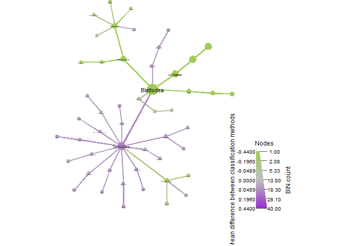

05_traditional\_&\_metabarcoding_data_for_LightTraps_only!
================
Daniel
15/11/2022

Setting up the data which now includes traditional and metabarcoding
records

``` r
tradmetabr <- read.csv('data/tradmetabr_merged_clean.csv')
sample <- read.csv('data/metadata_trad_metabr.csv') #this includes info on location/collection method/classification method and any more info can be added
obj <- parse_tax_data(tradmetabr,
                      class_cols = "classification",
                      class_sep = ";",
                      class_regex = "^([a-z]{0,1})_{0,2}(.*)$",
                      class_key = c("tax_rank" = "taxon_rank", "name" = "taxon_name"))

obj$data$tax_table <- calc_taxon_abund(obj, data = "tax_data", cols = sample$sampleID)
```

    ## Summing per-taxon counts from 266 columns for 5840 taxa

``` r
obj$data$tax_props <- calc_obs_props(obj, "tax_data", cols= sample$sampleID, other_cols = TRUE)
```

    ## Calculating proportions from counts for 266 columns for 4702 observations.

``` r
obj$data$diff_table <- compare_groups(obj, data = "tax_table",
                                      cols = sample$sampleID,
                                      groups = sample$methodClass)
```

Data above now is prepared for comparing traditional classification vs
metabarcoding similar to what was done in Basset et al. (2021)
Scientific Reports Next is a preliminary tree but we still have to
separate them by focal groups (potentially by season too).

``` r
##trhis takes nearly 30 minutes to run

heat_tree(obj,
          node_size_range = c(0.006, 0.04),
          edge_size_range = c(0.001,0.003),
          node_label = taxon_names,
          node_size = n_obs,
          node_color = mean_diff,
          node_color_interval = c(-0.44, 0.44),
          node_color_range =c("darkolivegreen3", "gray", "darkorchid"),
          node_color_digits = 1,
          node_size_axis_label = "BIN count",
          node_color_axis_label = "Mean difference in sample proportions",
          node_label_size_range = c( 0.005, 0.03),
          layout = "davidson-harel",
          initial_layout = "reingold-tilford",
          output_file = "./05_trad_metabar_data_files/meanDiff_tradmetabr.pdf")
```

<!-- -->

Once again, to understand the colouring scheme, read this paragraph
carefully from the metacoder tutorial:

### What color corresponds to each group depends on the order they were given in the compare_groups function. Since “leaf” is “treatment_1” in the “diff_table”, and “log2_median_ratio” is defined as “log2(treatment_1 / treatment_2)”, when a taxon has more counts in leaf samples, the ratio is positive, therefore taxa more abundant in leafs are colored magenta in this case.

their code has ’node_color_range = c(“cyan”, “gray”, “magenta”)###

If we look at print(obj$data$diff_table) above the plot, we can see that
in our case, treatment_1 is ‘TRAD’. The log2 median ratio is defined
as”log2(TRAD / METABR). When a taxon has more counts with traditional
classification, the ratio is positive, therefore taxa more abundant with
traditional are coloured ‘darkorchid (purple)’ in our case (not
magenta).

``` r
sample$inv_simp <- diversity(obj$data$tax_data[, sample$sampleID],
                             index = "invsimpson",
                             MARGIN = 2) # What orietation the matrix is in
ggplot(sample, aes(x = methodClass, y = inv_simp)) +
  geom_boxplot()
```

<!-- -->

``` r
anova_result <- aov(inv_simp ~ methodClass, sample)
summary(anova_result)
```

    ##              Df  Sum Sq Mean Sq F value Pr(>F)    
    ## methodClass   1 3936391 3936391   676.2 <2e-16 ***
    ## Residuals   264 1536932    5822                   
    ## ---
    ## Signif. codes:  0 '***' 0.001 '**' 0.01 '*' 0.05 '.' 0.1 ' ' 1

``` r
tukey_result <- HSD.test(anova_result, "methodClass", group = TRUE)
print(tukey_result)
```

    ## $statistics
    ##    MSerror  Df    Mean       CV
    ##   5821.712 264 77.0188 99.06691
    ## 
    ## $parameters
    ##    test      name.t ntr StudentizedRange alpha
    ##   Tukey methodClass   2         2.784573  0.05
    ## 
    ## $means
    ##         inv_simp       std   r Min Max    Q25 Q50   Q75
    ## metabr 366.17500 161.35943  40 117 658 218.25 347 503.5
    ## trad    25.84071  48.14304 226   1 227   2.00   5  25.0
    ## 
    ## $comparison
    ## NULL
    ## 
    ## $groups
    ##         inv_simp groups
    ## metabr 366.17500      a
    ## trad    25.84071      b
    ## 
    ## attr(,"class")
    ## [1] "group"

``` r
group_data <- tukey_result$groups[order(rownames(tukey_result$groups)),]
ggplot(sample, aes(x = methodClass, y = inv_simp)) +
  geom_text(data = data.frame(),
            aes(x = rownames(group_data), y = max(sample$inv_simp) + 1, label = group_data$groups),
            col = 'black',
            size = 10) +
  geom_boxplot() +
  ggtitle("Inverse Simpson diversity") +
  xlab("Season") +
  ylab("Inverse simpson index")
```

<!-- -->

``` r
ps_obj_all <- metacoder::as_phyloseq(obj,
                      otu_table = "tax_data",
                      otu_id_col = "bold_bin",
                      sample_data = sample,
                      sample_id_col = "sampleID")
# distmethod
# "unifrac",  "wunifrac", "manhattan", "euclidean", "canberra", "bray", "kulczynski" ...(vegdist, dist)
pcoares <- get_pcoa(obj=ps_obj_all, distmethod="bray", method="hellinger")
# Visualizing the result
pcoaplot1 <- ggordpoint(obj=pcoares, biplot=TRUE, speciesannot=TRUE,
                        factorNames=c("methodClass"), ellipse=TRUE) +
  scale_color_manual(values=c("darkolivegreen3", "darkorchid")) +
  scale_fill_manual(values=c("darkolivegreen3", "darkorchid"))
# first and third principal co-ordinates
pcoaplot2 <- ggordpoint(obj=pcoares, pc=c(1, 3), biplot=TRUE, speciesannot=TRUE,
                        factorNames=c("methodClass"), ellipse=TRUE) +
  scale_color_manual(values=c("darkolivegreen3", "darkorchid")) +
  scale_fill_manual(values=c("darkolivegreen3", "darkorchid"))

pdf("./05_trad_metabar_data_files/pcoa_all_2axis.pdf")
pcoaplot1
dev.off()
```

    ## png 
    ##   2

``` r
pcoaplot1 | pcoaplot2 #PCoA between classification methods
```

<!-- -->

Next are some more pcoa plots just to show what we can do as long as we
have really well detailed metadata (e.g. season and methodClass, or
colleciton method)

``` r
pcoaplot1a <- ggordpoint(obj=pcoares, biplot=TRUE, speciesannot=TRUE,
                        factorNames=c("methodClass", "season"), ellipse=TRUE) +
  scale_color_manual(values=c("darkolivegreen3", "darkorchid")) +
  scale_fill_manual(values=c("darkolivegreen3", "darkorchid"))
# first and third principal co-ordinates
pcoaplot2a <- ggordpoint(obj=pcoares, pc=c(1, 3), biplot=TRUE, speciesannot=TRUE,
                        factorNames=c("methodClass", "season"), ellipse=TRUE) +
  scale_color_manual(values=c("darkolivegreen3", "darkorchid")) +
  scale_fill_manual(values=c("darkolivegreen3", "darkorchid"))

pcoaplot1a | pcoaplot2a #Between classification and season
```

<!-- -->

``` r
pcoaplot1c <- ggordpoint(obj=pcoares, biplot=TRUE, speciesannot=TRUE,
                        factorNames=c("methodClass", "method"), ellipse=TRUE) +
  scale_color_manual(values=c("darkolivegreen3", "darkorchid")) +
  scale_fill_manual(values=c("darkolivegreen3", "darkorchid"))
# first and third principal co-ordinates
pcoaplot2c <- ggordpoint(obj=pcoares, pc=c(1, 3), biplot=TRUE, speciesannot=TRUE,
                        factorNames=c("methodClass", "method"), ellipse=TRUE) +
  scale_color_manual(values=c("darkolivegreen3", "darkorchid")) +
  scale_fill_manual(values=c("darkolivegreen3", "darkorchid"))
pcoaplot1c | pcoaplot2c #Between classification, season and trap method
```

    ## Warning: Removed 36 rows containing missing values (geom_star).
    ## Removed 36 rows containing missing values (geom_star).

<!-- -->

``` r
###### I HAVE A SMALL PROBLEM WITH grid PACKAGE. IT IS PLOTING ON TOP OF PREVIOUS PLOTS SO DO THIS dev.off() to draw in a new plot

vennlist_all <- get_vennlist(obj=ps_obj_all, factorNames="methodClass")
vennp_all <- venn.diagram(vennlist_all,
                      height=5,
                      width=5, 
                      filename=NULL,
                      disable.logging = TRUE,
                      fill=c("darkolivegreen3", "darkorchid"),
                      cat.col=c("darkolivegreen3", "darkorchid"),
                      alpha = 0.85, 
                      fontfamily = "serif",
                      fontface = "bold",
                      cex = 1.2,
                      cat.cex = 1.3,
                      cat.default.pos = "outer",
                      cat.dist=0.1,
                      margin = 0.1, 
                      lwd = 3,
                      lty ='dotted',
                      imagetype = "svg")
```

    ## INFO [2023-01-27 15:30:19] [[1]]
    ## INFO [2023-01-27 15:30:19] vennlist_all
    ## INFO [2023-01-27 15:30:19] 
    ## INFO [2023-01-27 15:30:19] $height
    ## INFO [2023-01-27 15:30:19] [1] 5
    ## INFO [2023-01-27 15:30:19] 
    ## INFO [2023-01-27 15:30:19] $width
    ## INFO [2023-01-27 15:30:19] [1] 5
    ## INFO [2023-01-27 15:30:19] 
    ## INFO [2023-01-27 15:30:19] $filename
    ## INFO [2023-01-27 15:30:19] NULL
    ## INFO [2023-01-27 15:30:19] 
    ## INFO [2023-01-27 15:30:19] $disable.logging
    ## INFO [2023-01-27 15:30:19] [1] TRUE
    ## INFO [2023-01-27 15:30:19] 
    ## INFO [2023-01-27 15:30:19] $fill
    ## INFO [2023-01-27 15:30:19] c("darkolivegreen3", "darkorchid")
    ## INFO [2023-01-27 15:30:19] 
    ## INFO [2023-01-27 15:30:19] $cat.col
    ## INFO [2023-01-27 15:30:19] c("darkolivegreen3", "darkorchid")
    ## INFO [2023-01-27 15:30:19] 
    ## INFO [2023-01-27 15:30:19] $alpha
    ## INFO [2023-01-27 15:30:19] [1] 0.85
    ## INFO [2023-01-27 15:30:19] 
    ## INFO [2023-01-27 15:30:19] $fontfamily
    ## INFO [2023-01-27 15:30:19] [1] "serif"
    ## INFO [2023-01-27 15:30:19] 
    ## INFO [2023-01-27 15:30:19] $fontface
    ## INFO [2023-01-27 15:30:19] [1] "bold"
    ## INFO [2023-01-27 15:30:19] 
    ## INFO [2023-01-27 15:30:19] $cex
    ## INFO [2023-01-27 15:30:19] [1] 1.2
    ## INFO [2023-01-27 15:30:19] 
    ## INFO [2023-01-27 15:30:19] $cat.cex
    ## INFO [2023-01-27 15:30:19] [1] 1.3
    ## INFO [2023-01-27 15:30:19] 
    ## INFO [2023-01-27 15:30:19] $cat.default.pos
    ## INFO [2023-01-27 15:30:19] [1] "outer"
    ## INFO [2023-01-27 15:30:19] 
    ## INFO [2023-01-27 15:30:19] $cat.dist
    ## INFO [2023-01-27 15:30:19] [1] 0.1
    ## INFO [2023-01-27 15:30:19] 
    ## INFO [2023-01-27 15:30:19] $margin
    ## INFO [2023-01-27 15:30:19] [1] 0.1
    ## INFO [2023-01-27 15:30:19] 
    ## INFO [2023-01-27 15:30:19] $lwd
    ## INFO [2023-01-27 15:30:19] [1] 3
    ## INFO [2023-01-27 15:30:19] 
    ## INFO [2023-01-27 15:30:19] $lty
    ## INFO [2023-01-27 15:30:19] [1] "dotted"
    ## INFO [2023-01-27 15:30:19] 
    ## INFO [2023-01-27 15:30:19] $imagetype
    ## INFO [2023-01-27 15:30:19] [1] "svg"
    ## INFO [2023-01-27 15:30:19]

``` r
pdf("./05_trad_metabar_data_files/venn_all.pdf")
grid::grid.draw(vennp_all)
dev.off()
```

    ## png 
    ##   2

Most abundant taxa with either method except this is not an accurate
representation ForestGEO only uses focal species and differente
collection methods, so here we are making an unfair comparison. There
are no Diptera in traditional datasets and no bait colleciotn in
metabarcoding data.

``` r
classtaxa <- get_taxadf(obj=ps_obj_all, taxlevel=4)
# The 5 most abundant taxonomy will be visualized by default (parameter `topn=5`). 
pclass <- ggbartax(obj=classtaxa, facetNames="methodClass", topn=10) +
  xlab(NULL) +
  ylab("relative abundance (%)") +
  scale_fill_manual(values=c(colorRampPalette(RColorBrewer::brewer.pal(12,"Set3"))(31))) +
  guides(fill= guide_legend(keywidth = 0.5, keyheight = 0.5))
```

    ## The color has been set automatically, you can reset it 
    ##             manually by adding scale_fill_manual(values=yourcolors)

    ## Scale for 'fill' is already present. Adding another scale for 'fill', which
    ## will replace the existing scale.

``` r
#note the flag "count=TRUE", this shows now total reads, rather than proportion %
pclass2 <- ggbartax(obj=classtaxa, count=TRUE, facetNames="methodClass", topn=5) +
  xlab(NULL) +
  ylab("count reads") +
  scale_fill_manual(values=c(colorRampPalette(RColorBrewer::brewer.pal(12,"Set3"))(31))) +
  guides(fill= guide_legend(keywidth = 0.5, keyheight = 0.5))
```

    ## The color has been set automatically, you can reset it 
    ##             manually by adding scale_fill_manual(values=yourcolors)
    ## Scale for 'fill' is already present. Adding another scale for 'fill', which
    ## will replace the existing scale.

``` r
pclass
```

<!-- -->

``` r
pclass2
```

<!-- -->

So we further filter data to focus only on Light Trap data and after we
will filter again to only focal families. We could refine these data as
deep as we want, however, in this case we are limited by taxonomic rank.
The data I downloaded from mBRAVE did not include subfamily - for future
analyses, one should aim to include every taxonomic rank instead as this
could have been ideal for e.g. Arciidae

We will repeat the same type of analyses as before but jsut for Light
Trap data.

``` r
obj_LT <- parse_tax_data(tradmetabr,
                    class_cols = "classification",
                      class_sep = ";",
                      class_regex = "^([a-z]{0,1})_{0,2}(.*)$",
                      class_key = c("tax_rank" = "taxon_rank", "name" = "taxon_name"))
sample_LT <- filter(sample, method == "LT")

obj_LT$data$tax_data <- obj_LT$data$tax_data[c("taxon_id","bold_bin", "classification", sample_LT$sampleID)]
print(obj_LT)
```

    ## <Taxmap>
    ##   5840 taxa: aab. Animalia, aac. Arthropoda ... iqq. _ADV7786
    ##   5840 edges: NA->aab, aab->aac, aac->aad ... cvk->iqp, cvk->iqq
    ##   2 data sets:
    ##     tax_data:
    ##       # A tibble: 4,702 x 79
    ##         taxon_id bold_bin     classi~1 ALATE~2 ALTOS~3 ARM1_~4 ARM1_~5
    ##         <chr>    <chr>        <chr>      <int>   <int>   <int>   <int>
    ##       1 cvl      BOLD:AEK1984 k__Anim~       0       0       0       0
    ##       2 cvl      BOLD:AEK9771 k__Anim~       0       0       0       0
    ##       3 cvl      BOLD:AEL2824 k__Anim~       0       0       0       0
    ##       # ... with 4,699 more rows, 72 more variables:
    ##       #   ARM2_wet_LT <int>, ARM2_dry_LT <int>, ARM3_wet_LT <int>,
    ##       #   ARM3_dry_LT <int>, ARM4_wet_LT <int>, ARM4_dry_LT <int>,
    ##       #   BAL1_dry_LT <int>, BAL1_wet_LT <int>, DRA1_dry_LT <int>,
    ##       #   DRA1_wet_LT <int>, ..., and abbreviated variable names
    ##       #   1: classification, 2: ALATESHIK_na_LT, 3: ALTOSCAMP_na_LT,
    ##       #   4: ARM1_wet_LT, 5: ARM1_dry_LT
    ##     class_data:
    ##       # A tibble: 32,914 x 5
    ##         taxon_id input_index tax_rank name       regex_match  
    ##         <chr>          <int> <chr>    <chr>      <chr>        
    ##       1 aab                1 k        Animalia   k__Animalia  
    ##       2 aac                1 p        Arthropoda p__Arthropoda
    ##       3 aad                1 c        Arachnida  c__Arachnida 
    ##       # ... with 32,911 more rows
    ##   0 functions:

``` r
no_reads <- rowSums(obj_LT$data$tax_data[, sample_LT$sampleID]) == 0
sum(no_reads) 
```

    ## [1] 928

``` r
#there are 928 BINs that do not have reads when we filter by trap method. We must remove
obj_LT <- filter_obs(obj_LT, data = "tax_data", ! no_reads, drop_taxa = TRUE)

obj_LT$data$tax_table <- calc_taxon_abund(obj_LT, data = "tax_data", cols = sample_LT$sampleID)
```

    ## Summing per-taxon counts from 76 columns for 4583 taxa

``` r
obj_LT$data$tax_props <- calc_obs_props(obj_LT, "tax_data", cols = sample_LT$sampleID)
```

    ## Calculating proportions from counts for 76 columns for 3774 observations.

``` r
obj_LT$data$diff_table <- compare_groups(obj_LT, data = "tax_table",
                                      cols = sample_LT$sampleID,
                                      groups = sample_LT$methodClass)

ps_obj_LT <- metacoder::as_phyloseq(obj_LT,
                      otu_table = "tax_data",
                      otu_id_col = "bold_bin",
                      sample_data = sample,
                      sample_id_col = "sampleID")

pcoares_LT <- get_pcoa(obj=ps_obj_LT, distmethod="bray", method="hellinger")
# Visualizing the result
pcoaplot1_LT <- ggordpoint(obj=pcoares_LT, biplot=TRUE, speciesannot=TRUE,
                        factorNames=c("methodClass", "season"), ellipse=TRUE) +
  scale_color_manual(values=c("darkolivegreen3", "darkorchid")) +
  scale_fill_manual(values=c("darkolivegreen3", "darkorchid"))
# first and third principal co-ordinates
pcoaplot2_LT <- ggordpoint(obj=pcoares_LT, pc=c(1, 3), biplot=TRUE, speciesannot=TRUE,
                        factorNames=c("methodClass", "season"), ellipse=TRUE) +
  scale_color_manual(values=c("darkolivegreen3", "darkorchid")) +
  scale_fill_manual(values=c("darkolivegreen3", "darkorchid"))
pcoaplot1_LT | pcoaplot2_LT
```

<!-- -->

``` r
classtaxa_LT <- get_taxadf(obj=ps_obj_LT, taxlevel=4)
# The 5 most abundant taxonomy will be visualized by default (parameter `topn=5`). 
pclass_LT <- ggbartax(obj=classtaxa_LT, facetNames="methodClass", topn=10) +
  xlab(NULL) +
  ylab("relative abundance (%)") +
  scale_fill_manual(values=c(colorRampPalette(RColorBrewer::brewer.pal(12,"Set3"))(31))) +
  guides(fill= guide_legend(keywidth = 0.5, keyheight = 0.5))
```

    ## The color has been set automatically, you can reset it 
    ##             manually by adding scale_fill_manual(values=yourcolors)

    ## Scale for 'fill' is already present. Adding another scale for 'fill', which
    ## will replace the existing scale.

``` r
pclass_LT
```

<!-- -->

``` r
heat_tree(obj_LT,
          node_label = taxon_names,
          node_size = n_obs,
          node_color = mean_diff,
          node_color_interval = c(-0.5, 0.5),
          node_color_range = c("darkolivegreen3", "gray", "darkorchid"),
          node_color_digits = 1,
          node_size_axis_label = "BIN count",
          node_color_axis_label = "Mean difference in sample proportions",
          node_label_size_range = c( 0.005, 0.03),
          layout = "davidson-harel",
          initial_layout = "reingold-tilford",
          output_file = "./05_trad_metabar_data_files/light_trap_heattree.pdf")
```

<!-- -->

``` r
##This one takes about 15 minutes to run
```

``` r
dev.off()
```

    ## null device 
    ##           1

``` r
vennlist_LT <- get_vennlist(obj=ps_obj_LT, factorNames="methodClass")
vennp_LT <- venn.diagram(vennlist_LT,
                      height=5,
                      width=5, 
                      filename=NULL,
                      disable.logging = TRUE,
                      fill=c("darkolivegreen3", "darkorchid"),
                      cat.col=c("darkolivegreen3", "darkorchid"),
                      alpha = 0.85, 
                      fontfamily = "serif",
                      fontface = "bold",
                      cex = 1.2,
                      cat.cex = 1.3,
                      cat.default.pos = "outer",
                      cat.dist=0.1,
                      margin = 0.1, 
                      lwd = 3,
                      lty ='dotted',
                      imagetype = "svg")
```

    ## INFO [2023-01-27 15:47:27] [[1]]
    ## INFO [2023-01-27 15:47:27] vennlist_LT
    ## INFO [2023-01-27 15:47:27] 
    ## INFO [2023-01-27 15:47:27] $height
    ## INFO [2023-01-27 15:47:27] [1] 5
    ## INFO [2023-01-27 15:47:27] 
    ## INFO [2023-01-27 15:47:27] $width
    ## INFO [2023-01-27 15:47:27] [1] 5
    ## INFO [2023-01-27 15:47:27] 
    ## INFO [2023-01-27 15:47:27] $filename
    ## INFO [2023-01-27 15:47:27] NULL
    ## INFO [2023-01-27 15:47:27] 
    ## INFO [2023-01-27 15:47:27] $disable.logging
    ## INFO [2023-01-27 15:47:27] [1] TRUE
    ## INFO [2023-01-27 15:47:27] 
    ## INFO [2023-01-27 15:47:27] $fill
    ## INFO [2023-01-27 15:47:27] c("darkolivegreen3", "darkorchid")
    ## INFO [2023-01-27 15:47:27] 
    ## INFO [2023-01-27 15:47:27] $cat.col
    ## INFO [2023-01-27 15:47:27] c("darkolivegreen3", "darkorchid")
    ## INFO [2023-01-27 15:47:27] 
    ## INFO [2023-01-27 15:47:27] $alpha
    ## INFO [2023-01-27 15:47:27] [1] 0.85
    ## INFO [2023-01-27 15:47:27] 
    ## INFO [2023-01-27 15:47:27] $fontfamily
    ## INFO [2023-01-27 15:47:27] [1] "serif"
    ## INFO [2023-01-27 15:47:27] 
    ## INFO [2023-01-27 15:47:27] $fontface
    ## INFO [2023-01-27 15:47:27] [1] "bold"
    ## INFO [2023-01-27 15:47:27] 
    ## INFO [2023-01-27 15:47:27] $cex
    ## INFO [2023-01-27 15:47:27] [1] 1.2
    ## INFO [2023-01-27 15:47:27] 
    ## INFO [2023-01-27 15:47:27] $cat.cex
    ## INFO [2023-01-27 15:47:27] [1] 1.3
    ## INFO [2023-01-27 15:47:27] 
    ## INFO [2023-01-27 15:47:27] $cat.default.pos
    ## INFO [2023-01-27 15:47:27] [1] "outer"
    ## INFO [2023-01-27 15:47:27] 
    ## INFO [2023-01-27 15:47:27] $cat.dist
    ## INFO [2023-01-27 15:47:27] [1] 0.1
    ## INFO [2023-01-27 15:47:27] 
    ## INFO [2023-01-27 15:47:27] $margin
    ## INFO [2023-01-27 15:47:27] [1] 0.1
    ## INFO [2023-01-27 15:47:27] 
    ## INFO [2023-01-27 15:47:27] $lwd
    ## INFO [2023-01-27 15:47:27] [1] 3
    ## INFO [2023-01-27 15:47:27] 
    ## INFO [2023-01-27 15:47:27] $lty
    ## INFO [2023-01-27 15:47:27] [1] "dotted"
    ## INFO [2023-01-27 15:47:27] 
    ## INFO [2023-01-27 15:47:27] $imagetype
    ## INFO [2023-01-27 15:47:27] [1] "svg"
    ## INFO [2023-01-27 15:47:27]

``` r
pdf("./05_trad_metabar_data_files/venn_LT.pdf")
grid::grid.draw(vennp_LT)
dev.off()
```

    ## null device 
    ##           1

Next we will focus only on focal orders.

``` r
obj_LT %>%  metacoder::filter_taxa(taxon_names %in% c("Lepidoptera", "Coleoptera", "Hymenoptera", "Hemiptera", "Blattodea"),#here is to fliter the figure by focal groups
              subtaxa = TRUE) -> obj_focal

no_reads <- rowSums(obj_focal$data$tax_data[, sample_LT$sampleID]) == 0 #check for zeroes after filtering always. Otherwise we get bad results
sum(no_reads) #in this case theree is no zeroes, which is good, but we should always check
```

    ## [1] 0

``` r
obj_focal$data$tax_data <- obj_focal$data$tax_data[c("taxon_id","bold_bin", "classification", sample_LT$sampleID)]
print(obj_focal)
```

    ## <Taxmap>
    ##   3718 taxa: aao. Blattodea ... imn. BioLep28_AAU7449
    ##   3718 edges: NA->aao, NA->aap, NA->aas ... cto->imm, ctp->imn
    ##   5 data sets:
    ##     tax_data:
    ##       # A tibble: 2,722 x 79
    ##         taxon_id bold_bin     classi~1 ALATE~2 ALTOS~3 ARM1_~4 ARM1_~5
    ##         <chr>    <chr>        <chr>      <int>   <int>   <int>   <int>
    ##       1 cxw      BOLD:ADT6615 k__Anim~       0       0       0       0
    ##       2 cxw      BOLD:ADV7142 k__Anim~       0       0       0       0
    ##       3 cxx      BOLD:ADB4571 k__Anim~       0       0       0       0
    ##       # ... with 2,719 more rows, 72 more variables:
    ##       #   ARM2_wet_LT <int>, ARM2_dry_LT <int>, ARM3_wet_LT <int>,
    ##       #   ARM3_dry_LT <int>, ARM4_wet_LT <int>, ARM4_dry_LT <int>,
    ##       #   BAL1_dry_LT <int>, BAL1_wet_LT <int>, DRA1_dry_LT <int>,
    ##       #   DRA1_wet_LT <int>, ..., and abbreviated variable names
    ##       #   1: classification, 2: ALATESHIK_na_LT, 3: ALTOSCAMP_na_LT,
    ##       #   4: ARM1_wet_LT, 5: ARM1_dry_LT
    ##     class_data:
    ##       # A tibble: 12,927 x 5
    ##         taxon_id input_index tax_rank name         regex_match  
    ##         <chr>          <int> <chr>    <chr>        <chr>        
    ##       1 aao               85 o        "Blattodea"  o__Blattodea 
    ##       2 ach               85 f        "Blaberidae" f__Blaberidae
    ##       3 ang               85 g        ""           g__          
    ##       # ... with 12,924 more rows
    ##     tax_table:
    ##       # A tibble: 3,718 x 77
    ##         taxon_id ALATESHIK_n~1 ALTOS~2 ARM1_~3 ARM1_~4 ARM2_~5 ARM2_~6
    ##         <chr>            <dbl>   <dbl>   <dbl>   <dbl>   <dbl>   <dbl>
    ##       1 aao                  0       1       1       2       0       0
    ##       2 aap                  0       0       5      12       1       7
    ##       3 aas                  0       0       2       5       5       7
    ##       # ... with 3,715 more rows, 70 more variables:
    ##       #   ARM3_wet_LT <dbl>, ARM3_dry_LT <dbl>, ARM4_wet_LT <dbl>,
    ##       #   ARM4_dry_LT <dbl>, BAL1_dry_LT <dbl>, BAL1_wet_LT <dbl>,
    ##       #   DRA1_dry_LT <dbl>, DRA1_wet_LT <dbl>, L01_wet_LT <dbl>,
    ##       #   L01_dry_LT <dbl>, ..., and abbreviated variable names
    ##       #   1: ALATESHIK_na_LT, 2: ALTOSCAMP_na_LT, 3: ARM1_wet_LT,
    ##       #   4: ARM1_dry_LT, 5: ARM2_wet_LT, 6: ARM2_dry_LT
    ##     tax_props:
    ##       # A tibble: 2,722 x 77
    ##         taxon_id ALATESHIK_n~1 ALTOS~2 ARM1_~3 ARM1_~4 ARM2_~5 ARM2_~6
    ##         <chr>            <dbl>   <dbl>   <dbl>   <dbl>   <dbl>   <dbl>
    ##       1 cxw                  0       0       0       0       0       0
    ##       2 cxw                  0       0       0       0       0       0
    ##       3 cxx                  0       0       0       0       0       0
    ##       # ... with 2,719 more rows, 70 more variables:
    ##       #   ARM3_wet_LT <dbl>, ARM3_dry_LT <dbl>, ARM4_wet_LT <dbl>,
    ##       #   ARM4_dry_LT <dbl>, BAL1_dry_LT <dbl>, BAL1_wet_LT <dbl>,
    ##       #   DRA1_dry_LT <dbl>, DRA1_wet_LT <dbl>, L01_wet_LT <dbl>,
    ##       #   L01_dry_LT <dbl>, ..., and abbreviated variable names
    ##       #   1: ALATESHIK_na_LT, 2: ALTOSCAMP_na_LT, 3: ARM1_wet_LT,
    ##       #   4: ARM1_dry_LT, 5: ARM2_wet_LT, 6: ARM2_dry_LT
    ##     diff_table:
    ##       # A tibble: 3,718 x 7
    ##         taxon_id treatment_1 treatm~1 log2_~2 media~3 mean_~4 wilcox~5
    ##         <chr>    <chr>       <chr>      <dbl>   <dbl>   <dbl>    <dbl>
    ##       1 aao      trad        metabr     -2.58    -2.5   -3.13 5.86e-10
    ##       2 aap      trad        metabr     -4.39   -50    -45.9  6.59e-14
    ##       3 aas      trad        metabr     -2.70   -16.5  -16.0  9.11e-10
    ##       # ... with 3,715 more rows, and abbreviated variable names
    ##       #   1: treatment_2, 2: log2_median_ratio, 3: median_diff,
    ##       #   4: mean_diff, 5: wilcox_p_value
    ##   0 functions:

``` r
obj_focal$data$tax_table <- calc_taxon_abund(obj_focal, data = "tax_data", cols = sample_LT$sampleID)
```

    ## Summing per-taxon counts from 76 columns for 3718 taxa

``` r
obj_focal$data$tax_props <- calc_obs_props(obj_focal, "tax_data", cols = sample_LT$sampleID)
```

    ## Calculating proportions from counts for 76 columns for 2722 observations.

``` r
obj_focal$data$diff_table <- compare_groups(obj_focal, data = "tax_table",
                                      cols = sample_LT$sampleID,
                                      groups = sample_LT$methodClass)

ps_obj_focal <- metacoder::as_phyloseq(obj_focal,
                      otu_table = "tax_data",
                      otu_id_col = "bold_bin",
                      sample_data = sample,
                      sample_id_col = "sampleID")

pcoares_focal <- get_pcoa(obj=ps_obj_focal, distmethod="bray", method="hellinger")
# Visualizing the result
pcoaplot1_focal <- ggordpoint(obj=pcoares_focal, biplot=TRUE, speciesannot=TRUE,
                        factorNames=c("methodClass", "season"), ellipse=TRUE) +
  scale_color_manual(values=c("darkolivegreen3", "darkorchid")) +
  scale_fill_manual(values=c("darkolivegreen3", "darkorchid"))
# first and third principal co-ordinates
pcoaplot2_focal <- ggordpoint(obj=pcoares_focal, pc=c(1, 3), biplot=TRUE, speciesannot=TRUE,
                        factorNames=c("methodClass", "season"), ellipse=TRUE) +
  scale_color_manual(values=c("darkolivegreen3", "darkorchid")) +
  scale_fill_manual(values=c("darkolivegreen3", "darkorchid"))
pcoaplot1_focal | pcoaplot2_focal
```

<!-- -->

``` r
pdf("./05_trad_metabar_data_files/PcoA_1and2_focal.pdf")
pcoaplot1_focal
dev.off()
```

    ## png 
    ##   2

``` r
#pcoaplot2_focal

heat_tree(obj_focal,
          node_label = taxon_names,
          node_size = n_obs,
          node_color = mean_diff,
          node_color_interval = c(-0.5, 0.5),
          node_color_range = c("darkolivegreen3", "gray", "darkorchid"),
          node_color_digits = 1,
          node_size_axis_label = "BIN count",
          node_color_axis_label = "Mean difference in sample proportions",
          node_label_size_range = c( 0.005, 0.03),
          layout = "davidson-harel",
          initial_layout = "reingold-tilford",
          output_file = "./05_trad_metabar_data_files/focal_MEANDIFFheattree.pdf")
```

<!-- -->

``` r
#this one takes about 10 minutes to run
```

``` r
dev.off()
```

    ## null device 
    ##           1

``` r
vennlist_focal <- get_vennlist(obj=ps_obj_focal, factorNames="methodClass")
vennp_focal <- venn.diagram(vennlist_focal,
                      height=5,
                      width=5, 
                      filename=NULL,
                      disable.logging = TRUE,
                      fill=c("darkolivegreen3", "darkorchid"),
                      cat.col=c("darkolivegreen3", "darkorchid"),
                      alpha = 0.85, 
                      fontfamily = "serif",
                      fontface = "bold",
                      cex = 1.2,
                      cat.cex = 1.3,
                      cat.default.pos = "outer",
                      cat.dist=0.1,
                      margin = 0.1, 
                      lwd = 3,
                      lty ='dotted',
                      imagetype = "svg")
```

    ## INFO [2023-01-27 15:54:12] [[1]]
    ## INFO [2023-01-27 15:54:12] vennlist_focal
    ## INFO [2023-01-27 15:54:12] 
    ## INFO [2023-01-27 15:54:12] $height
    ## INFO [2023-01-27 15:54:12] [1] 5
    ## INFO [2023-01-27 15:54:12] 
    ## INFO [2023-01-27 15:54:12] $width
    ## INFO [2023-01-27 15:54:12] [1] 5
    ## INFO [2023-01-27 15:54:12] 
    ## INFO [2023-01-27 15:54:12] $filename
    ## INFO [2023-01-27 15:54:12] NULL
    ## INFO [2023-01-27 15:54:12] 
    ## INFO [2023-01-27 15:54:12] $disable.logging
    ## INFO [2023-01-27 15:54:12] [1] TRUE
    ## INFO [2023-01-27 15:54:12] 
    ## INFO [2023-01-27 15:54:12] $fill
    ## INFO [2023-01-27 15:54:12] c("darkolivegreen3", "darkorchid")
    ## INFO [2023-01-27 15:54:12] 
    ## INFO [2023-01-27 15:54:12] $cat.col
    ## INFO [2023-01-27 15:54:12] c("darkolivegreen3", "darkorchid")
    ## INFO [2023-01-27 15:54:12] 
    ## INFO [2023-01-27 15:54:12] $alpha
    ## INFO [2023-01-27 15:54:12] [1] 0.85
    ## INFO [2023-01-27 15:54:12] 
    ## INFO [2023-01-27 15:54:12] $fontfamily
    ## INFO [2023-01-27 15:54:12] [1] "serif"
    ## INFO [2023-01-27 15:54:12] 
    ## INFO [2023-01-27 15:54:12] $fontface
    ## INFO [2023-01-27 15:54:12] [1] "bold"
    ## INFO [2023-01-27 15:54:12] 
    ## INFO [2023-01-27 15:54:12] $cex
    ## INFO [2023-01-27 15:54:12] [1] 1.2
    ## INFO [2023-01-27 15:54:12] 
    ## INFO [2023-01-27 15:54:12] $cat.cex
    ## INFO [2023-01-27 15:54:12] [1] 1.3
    ## INFO [2023-01-27 15:54:12] 
    ## INFO [2023-01-27 15:54:12] $cat.default.pos
    ## INFO [2023-01-27 15:54:12] [1] "outer"
    ## INFO [2023-01-27 15:54:12] 
    ## INFO [2023-01-27 15:54:12] $cat.dist
    ## INFO [2023-01-27 15:54:12] [1] 0.1
    ## INFO [2023-01-27 15:54:12] 
    ## INFO [2023-01-27 15:54:12] $margin
    ## INFO [2023-01-27 15:54:12] [1] 0.1
    ## INFO [2023-01-27 15:54:12] 
    ## INFO [2023-01-27 15:54:12] $lwd
    ## INFO [2023-01-27 15:54:12] [1] 3
    ## INFO [2023-01-27 15:54:12] 
    ## INFO [2023-01-27 15:54:12] $lty
    ## INFO [2023-01-27 15:54:12] [1] "dotted"
    ## INFO [2023-01-27 15:54:12] 
    ## INFO [2023-01-27 15:54:12] $imagetype
    ## INFO [2023-01-27 15:54:12] [1] "svg"
    ## INFO [2023-01-27 15:54:12]

``` r
pdf("./05_trad_metabar_data_files/venn_focal.pdf")
grid::grid.draw(vennp_focal)
dev.off()
```

    ## null device 
    ##           1

``` r
set.seed(16)#to make sure the figures is always the same
obj_focal %>%
  metacoder::filter_taxa(taxon_names == "Lepidoptera",#here is to filter the figure by groups
              subtaxa = TRUE) %>%
  #metacoder::filter_taxa(taxon_ranks == c("o","f","g", "s")) %>%
  heat_tree(node_label = taxon_names,
            node_size_range = c(0.006, 0.04),
            edge_size_range = c(0.001, 0.003),
            node_size = n_obs, # n_obs is a function that calculates, in this case, the number of OTUs per taxon
            node_color = mean_diff, # A column from `obj_LT$data$diff_table`
            node_color_interval = c(-.44,.44), # The range of the mean_difference to display
            node_color_range = c("darkolivegreen3", "gray", "darkorchid"), # The color palette used
            node_size_axis_label = "BIN count",
            node_color_axis_label = "Mean difference between classification methods",
            node_label_size_range = c( 0.003, 0.03),
            layout = "davidson-harel", # The primary layout algorithm
            initial_layout = "reingold-tilford",
            output_file = "./05_trad_metabar_data_files/lepidoptera_heattree.pdf") # The layout algorithm that initializes node locations
```

<!-- -->

``` r
#this one takes about 5 minutes

obj_focal %>%  metacoder::filter_taxa(taxon_names %in% c("Lepidoptera"),#here is to fliter the figure by groups
              subtaxa = TRUE) -> leps_LT #we will create separate files for each order as this simplifies downstream analysis in microbiotaprocess - until I find a way to filter taxa on the mpse object directly.
no_reads <- rowSums(leps_LT$data$tax_data[, sample_LT$sampleID]) == 0 #check for zeroes after filtering always. Otherwise we get bad results
sum(no_reads) #in this case theree is no zeroes, which is good, but we should always check
```

    ## [1] 0

``` r
ps_leps_LT <- metacoder::as_phyloseq(leps_LT,
                      otu_table = "tax_data",
                      otu_id_col = "bold_bin",
                      sample_data = sample,
                      sample_id_col = "sampleID")  %>% microViz::tax_mutate(rank_0 = "Animalia",rank_01 = "Arthropoda", rank_02 = "Insecta", .before = 1) -> ps_leps_LT
colnames(tax_table(ps_leps_LT)) <- c("k__", "p__", "o__", "c__", "f__", "g__", "s__")
```

``` r
dev.off()
```

    ## null device 
    ##           1

``` r
vennlist_leps <- get_vennlist(obj=ps_leps_LT, factorNames="methodClass")
vennp_leps <- venn.diagram(vennlist_leps,
                      height=5,
                      width=5, 
                      filename=NULL,
                      disable.logging = TRUE,
                      fill=c("darkolivegreen3", "darkorchid"),
                      cat.col=c("darkolivegreen3", "darkorchid"),
                      alpha = 0.85, 
                      fontfamily = "serif",
                      fontface = "bold",
                      cex = 1.2,
                      cat.cex = 1.3,
                      cat.default.pos = "outer",
                      cat.dist=0.1,
                      margin = 0.1, 
                      lwd = 3,
                      lty ='dotted',
                      imagetype = "svg")
```

    ## INFO [2023-01-27 15:59:45] [[1]]
    ## INFO [2023-01-27 15:59:45] vennlist_leps
    ## INFO [2023-01-27 15:59:45] 
    ## INFO [2023-01-27 15:59:45] $height
    ## INFO [2023-01-27 15:59:45] [1] 5
    ## INFO [2023-01-27 15:59:45] 
    ## INFO [2023-01-27 15:59:45] $width
    ## INFO [2023-01-27 15:59:45] [1] 5
    ## INFO [2023-01-27 15:59:45] 
    ## INFO [2023-01-27 15:59:45] $filename
    ## INFO [2023-01-27 15:59:45] NULL
    ## INFO [2023-01-27 15:59:45] 
    ## INFO [2023-01-27 15:59:45] $disable.logging
    ## INFO [2023-01-27 15:59:45] [1] TRUE
    ## INFO [2023-01-27 15:59:45] 
    ## INFO [2023-01-27 15:59:45] $fill
    ## INFO [2023-01-27 15:59:45] c("darkolivegreen3", "darkorchid")
    ## INFO [2023-01-27 15:59:45] 
    ## INFO [2023-01-27 15:59:45] $cat.col
    ## INFO [2023-01-27 15:59:45] c("darkolivegreen3", "darkorchid")
    ## INFO [2023-01-27 15:59:45] 
    ## INFO [2023-01-27 15:59:45] $alpha
    ## INFO [2023-01-27 15:59:45] [1] 0.85
    ## INFO [2023-01-27 15:59:45] 
    ## INFO [2023-01-27 15:59:45] $fontfamily
    ## INFO [2023-01-27 15:59:45] [1] "serif"
    ## INFO [2023-01-27 15:59:45] 
    ## INFO [2023-01-27 15:59:45] $fontface
    ## INFO [2023-01-27 15:59:45] [1] "bold"
    ## INFO [2023-01-27 15:59:45] 
    ## INFO [2023-01-27 15:59:45] $cex
    ## INFO [2023-01-27 15:59:45] [1] 1.2
    ## INFO [2023-01-27 15:59:45] 
    ## INFO [2023-01-27 15:59:45] $cat.cex
    ## INFO [2023-01-27 15:59:45] [1] 1.3
    ## INFO [2023-01-27 15:59:45] 
    ## INFO [2023-01-27 15:59:45] $cat.default.pos
    ## INFO [2023-01-27 15:59:45] [1] "outer"
    ## INFO [2023-01-27 15:59:45] 
    ## INFO [2023-01-27 15:59:45] $cat.dist
    ## INFO [2023-01-27 15:59:45] [1] 0.1
    ## INFO [2023-01-27 15:59:45] 
    ## INFO [2023-01-27 15:59:45] $margin
    ## INFO [2023-01-27 15:59:45] [1] 0.1
    ## INFO [2023-01-27 15:59:45] 
    ## INFO [2023-01-27 15:59:45] $lwd
    ## INFO [2023-01-27 15:59:45] [1] 3
    ## INFO [2023-01-27 15:59:45] 
    ## INFO [2023-01-27 15:59:45] $lty
    ## INFO [2023-01-27 15:59:45] [1] "dotted"
    ## INFO [2023-01-27 15:59:45] 
    ## INFO [2023-01-27 15:59:45] $imagetype
    ## INFO [2023-01-27 15:59:45] [1] "svg"
    ## INFO [2023-01-27 15:59:45]

``` r
pdf("./05_trad_metabar_data_files/venn_leps.pdf")
grid::grid.draw(vennp_leps)
dev.off()
```

    ## null device 
    ##           1

``` r
set.seed(16)#to make sure the figures is always the same
obj_LT %>%
  metacoder::filter_taxa(taxon_names == "Coleoptera",#here is to fliter the figure by groups
              subtaxa = TRUE) %>% 
  heat_tree(node_label = taxon_names,
            node_size_range = c(0.01, 0.03),
            edge_size_range = c(0.003, 0.005),
            node_size = n_obs, # n_obs is a function that calculates, in this case, the number of OTUs per taxon
            node_color = mean_diff, # A column from `obj_LT$data$diff_table`
            node_color_interval = c(-.44,.44), # The range of the mean_difference to display
            node_color_range = c("darkolivegreen3", "gray", "darkorchid"), # The color palette used
            node_size_axis_label = "BIN count",
            node_color_axis_label = "Mean difference between classification methods",
            node_label_size_range = c( 0.003, 0.03),
            #edge_label = n_obs,
            layout = "davidson-harel", # The primary layout algorithm
            initial_layout = "reingold-tilford",
            output_file = "./05_trad_metabar_data_files/coleoptera_heattree.pdf") # The layout algorithm that initializes node locations
```

<!-- -->

``` r
#<1 minute
obj_LT %>%  metacoder::filter_taxa(taxon_names %in% c("Coleoptera"),#here is to fliter the figure by groups
              subtaxa = TRUE) -> coleo_LT

ps_coleo_LT <- metacoder::as_phyloseq(coleo_LT,
                                      otu_table = "tax_data",
                                      otu_id_col = "bold_bin",
                                      sample_data = sample,
                                      sample_id_col = "sampleID")
```

``` r
dev.off()
```

    ## null device 
    ##           1

``` r
vennlist_coleo <- get_vennlist(obj=ps_coleo_LT, factorNames="methodClass")
vennp_coleo <- venn.diagram(vennlist_coleo,
                      height=5,
                      width=5, 
                      filename=NULL,
                      disable.logging = TRUE,
                      fill=c("darkolivegreen3", "darkorchid"),
                      cat.col=c("darkolivegreen3", "darkorchid"),
                      alpha = 0.85, 
                      fontfamily = "serif",
                      fontface = "bold",
                      cex = 1.2,
                      cat.cex = 1.3,
                      cat.default.pos = "outer",
                      cat.dist=0.1,
                      margin = 0.1, 
                      lwd = 3,
                      lty ='dotted',
                      imagetype = "svg")
```

    ## INFO [2023-01-27 16:00:05] [[1]]
    ## INFO [2023-01-27 16:00:05] vennlist_coleo
    ## INFO [2023-01-27 16:00:05] 
    ## INFO [2023-01-27 16:00:05] $height
    ## INFO [2023-01-27 16:00:05] [1] 5
    ## INFO [2023-01-27 16:00:05] 
    ## INFO [2023-01-27 16:00:05] $width
    ## INFO [2023-01-27 16:00:05] [1] 5
    ## INFO [2023-01-27 16:00:05] 
    ## INFO [2023-01-27 16:00:05] $filename
    ## INFO [2023-01-27 16:00:05] NULL
    ## INFO [2023-01-27 16:00:05] 
    ## INFO [2023-01-27 16:00:05] $disable.logging
    ## INFO [2023-01-27 16:00:05] [1] TRUE
    ## INFO [2023-01-27 16:00:05] 
    ## INFO [2023-01-27 16:00:05] $fill
    ## INFO [2023-01-27 16:00:05] c("darkolivegreen3", "darkorchid")
    ## INFO [2023-01-27 16:00:05] 
    ## INFO [2023-01-27 16:00:05] $cat.col
    ## INFO [2023-01-27 16:00:05] c("darkolivegreen3", "darkorchid")
    ## INFO [2023-01-27 16:00:05] 
    ## INFO [2023-01-27 16:00:05] $alpha
    ## INFO [2023-01-27 16:00:05] [1] 0.85
    ## INFO [2023-01-27 16:00:05] 
    ## INFO [2023-01-27 16:00:05] $fontfamily
    ## INFO [2023-01-27 16:00:05] [1] "serif"
    ## INFO [2023-01-27 16:00:05] 
    ## INFO [2023-01-27 16:00:05] $fontface
    ## INFO [2023-01-27 16:00:05] [1] "bold"
    ## INFO [2023-01-27 16:00:05] 
    ## INFO [2023-01-27 16:00:05] $cex
    ## INFO [2023-01-27 16:00:05] [1] 1.2
    ## INFO [2023-01-27 16:00:05] 
    ## INFO [2023-01-27 16:00:05] $cat.cex
    ## INFO [2023-01-27 16:00:05] [1] 1.3
    ## INFO [2023-01-27 16:00:05] 
    ## INFO [2023-01-27 16:00:05] $cat.default.pos
    ## INFO [2023-01-27 16:00:05] [1] "outer"
    ## INFO [2023-01-27 16:00:05] 
    ## INFO [2023-01-27 16:00:05] $cat.dist
    ## INFO [2023-01-27 16:00:05] [1] 0.1
    ## INFO [2023-01-27 16:00:05] 
    ## INFO [2023-01-27 16:00:05] $margin
    ## INFO [2023-01-27 16:00:05] [1] 0.1
    ## INFO [2023-01-27 16:00:05] 
    ## INFO [2023-01-27 16:00:05] $lwd
    ## INFO [2023-01-27 16:00:05] [1] 3
    ## INFO [2023-01-27 16:00:05] 
    ## INFO [2023-01-27 16:00:05] $lty
    ## INFO [2023-01-27 16:00:05] [1] "dotted"
    ## INFO [2023-01-27 16:00:05] 
    ## INFO [2023-01-27 16:00:05] $imagetype
    ## INFO [2023-01-27 16:00:05] [1] "svg"
    ## INFO [2023-01-27 16:00:05]

``` r
pdf("./05_trad_metabar_data_files/venn_coleo.pdf")
grid::grid.draw(vennp_coleo)
dev.off()
```

    ## null device 
    ##           1

``` r
set.seed(16)#to make sure the figures is always the same
obj_LT %>%
  metacoder::filter_taxa(taxon_names == "Hymenoptera",#here is to fliter the figure by groups
              subtaxa = TRUE) %>% 
  heat_tree(node_label = taxon_names,
            node_size_range = c(0.01, 0.03),
            edge_size_range = c(0.003, 0.005),
            node_size = n_obs, # n_obs is a function that calculates, in this case, the number of OTUs per taxon
            node_color = mean_diff, # A column from `obj_LT$data$diff_table`
            node_color_interval = c(-.44,.44), # The range of the mean_difference to display
            node_color_range = c("darkolivegreen3", "gray", "darkorchid"), # The color palette used
            node_size_axis_label = "BIN count",
            node_color_axis_label = "Mean difference between classifcaiton method",
            node_label_size_range = c( 0.003, 0.03),
            layout = "davidson-harel", # The primary layout algorithm
            initial_layout = "reingold-tilford",
            output_file = "./05_trad_metabar_data_files/Hymenoptera_heattree.pdf") # The layout algorithm that initializes node locations
```

<!-- -->

``` r
#>1 minute
obj_LT %>%  metacoder::filter_taxa(taxon_names %in% c("Hymenoptera"),#here is to fliter the figure by groups
              subtaxa = TRUE) -> bees_LT #i know its hymenoptera

ps_bees_LT <- metacoder::as_phyloseq(bees_LT,
                                      otu_table = "tax_data",
                                      otu_id_col = "bold_bin",
                                      sample_data = sample,
                                      sample_id_col = "sampleID")
```

``` r
dev.off()
```

    ## null device 
    ##           1

``` r
vennlist_hymen <- get_vennlist(obj=ps_bees_LT, factorNames="methodClass")
vennp_hymen <- venn.diagram(vennlist_hymen,
                      height=5,
                      width=5, 
                      filename=NULL,
                      disable.logging = TRUE,
                      fill=c("darkolivegreen3", "darkorchid"),
                      cat.col=c("darkolivegreen3", "darkorchid"),
                      alpha = 0.85, 
                      fontfamily = "serif",
                      fontface = "bold",
                      cex = 1.2,
                      cat.cex = 1.3,
                      cat.default.pos = "outer",
                      cat.dist=0.1,
                      margin = 0.1, 
                      lwd = 3,
                      lty ='dotted',
                      imagetype = "svg")
```

    ## INFO [2023-01-27 16:00:24] [[1]]
    ## INFO [2023-01-27 16:00:24] vennlist_hymen
    ## INFO [2023-01-27 16:00:24] 
    ## INFO [2023-01-27 16:00:24] $height
    ## INFO [2023-01-27 16:00:24] [1] 5
    ## INFO [2023-01-27 16:00:24] 
    ## INFO [2023-01-27 16:00:24] $width
    ## INFO [2023-01-27 16:00:24] [1] 5
    ## INFO [2023-01-27 16:00:24] 
    ## INFO [2023-01-27 16:00:24] $filename
    ## INFO [2023-01-27 16:00:24] NULL
    ## INFO [2023-01-27 16:00:24] 
    ## INFO [2023-01-27 16:00:24] $disable.logging
    ## INFO [2023-01-27 16:00:24] [1] TRUE
    ## INFO [2023-01-27 16:00:24] 
    ## INFO [2023-01-27 16:00:24] $fill
    ## INFO [2023-01-27 16:00:24] c("darkolivegreen3", "darkorchid")
    ## INFO [2023-01-27 16:00:24] 
    ## INFO [2023-01-27 16:00:24] $cat.col
    ## INFO [2023-01-27 16:00:24] c("darkolivegreen3", "darkorchid")
    ## INFO [2023-01-27 16:00:24] 
    ## INFO [2023-01-27 16:00:24] $alpha
    ## INFO [2023-01-27 16:00:24] [1] 0.85
    ## INFO [2023-01-27 16:00:24] 
    ## INFO [2023-01-27 16:00:24] $fontfamily
    ## INFO [2023-01-27 16:00:24] [1] "serif"
    ## INFO [2023-01-27 16:00:24] 
    ## INFO [2023-01-27 16:00:24] $fontface
    ## INFO [2023-01-27 16:00:24] [1] "bold"
    ## INFO [2023-01-27 16:00:24] 
    ## INFO [2023-01-27 16:00:24] $cex
    ## INFO [2023-01-27 16:00:24] [1] 1.2
    ## INFO [2023-01-27 16:00:24] 
    ## INFO [2023-01-27 16:00:24] $cat.cex
    ## INFO [2023-01-27 16:00:24] [1] 1.3
    ## INFO [2023-01-27 16:00:24] 
    ## INFO [2023-01-27 16:00:24] $cat.default.pos
    ## INFO [2023-01-27 16:00:24] [1] "outer"
    ## INFO [2023-01-27 16:00:24] 
    ## INFO [2023-01-27 16:00:24] $cat.dist
    ## INFO [2023-01-27 16:00:24] [1] 0.1
    ## INFO [2023-01-27 16:00:24] 
    ## INFO [2023-01-27 16:00:24] $margin
    ## INFO [2023-01-27 16:00:24] [1] 0.1
    ## INFO [2023-01-27 16:00:24] 
    ## INFO [2023-01-27 16:00:24] $lwd
    ## INFO [2023-01-27 16:00:24] [1] 3
    ## INFO [2023-01-27 16:00:24] 
    ## INFO [2023-01-27 16:00:24] $lty
    ## INFO [2023-01-27 16:00:24] [1] "dotted"
    ## INFO [2023-01-27 16:00:24] 
    ## INFO [2023-01-27 16:00:24] $imagetype
    ## INFO [2023-01-27 16:00:24] [1] "svg"
    ## INFO [2023-01-27 16:00:24]

``` r
pdf("./05_trad_metabar_data_files/venn_hymenoptera.pdf")
grid::grid.draw(vennp_hymen)
dev.off()
```

    ## null device 
    ##           1

``` r
set.seed(16)#to make sure the figures is always the same
obj_LT %>%
  metacoder::filter_taxa(taxon_names == "Hemiptera",#here is to fliter the figure by groups
              subtaxa = TRUE) %>% 
  heat_tree(node_label = taxon_names,
            node_size_range = c(0.01, 0.03),
            edge_size_range = c(0.003, 0.005),
            node_size = n_obs, # n_obs is a function that calculates, in this case, the number of OTUs per taxon
            node_color = mean_diff, # A column from `obj_LT$data$diff_table`
            node_color_interval = c(-.44,.44), # The range of the mean_difference to display
            node_color_range = c("darkolivegreen3", "gray", "darkorchid"), # The color palette used
            node_size_axis_label = "BIN count",
            node_color_axis_label = "Mean difference between classification method",
            node_label_size_range = c( 0.003, 0.03),
            layout = "davidson-harel", # The primary layout algorithm
            initial_layout = "reingold-tilford",
            output_file = "./05_trad_metabar_data_files/Hemiptera_heattree.pdf") # The layout algorithm that initializes node locations
```

<!-- -->

``` r
#>1 minute
obj_LT %>%  metacoder::filter_taxa(taxon_names %in% c("Hemiptera"),#here is to fliter the figure by groups
              subtaxa = TRUE) -> hemi_LT
ps_hemi_LT <- metacoder::as_phyloseq(hemi_LT,
                                      otu_table = "tax_data",
                                      otu_id_col = "bold_bin",
                                      sample_data = sample,
                                      sample_id_col = "sampleID")
```

``` r
dev.off()
```

    ## null device 
    ##           1

``` r
vennlist_hemi <- get_vennlist(obj=ps_hemi_LT, factorNames="methodClass")
vennp_hemi <- venn.diagram(vennlist_hemi,
                      height=5,
                      width=5, 
                      filename=NULL,
                      disable.logging = TRUE,
                      fill=c("darkolivegreen3", "darkorchid"),
                      cat.col=c("darkolivegreen3", "darkorchid"),
                      alpha = 0.85, 
                      fontfamily = "serif",
                      fontface = "bold",
                      cex = 1.2,
                      cat.cex = 1.3,
                      cat.default.pos = "outer",
                      cat.dist=0.1,
                      margin = 0.1, 
                      lwd = 3,
                      lty ='dotted',
                      imagetype = "svg")
```

    ## INFO [2023-01-27 16:00:44] [[1]]
    ## INFO [2023-01-27 16:00:44] vennlist_hemi
    ## INFO [2023-01-27 16:00:44] 
    ## INFO [2023-01-27 16:00:44] $height
    ## INFO [2023-01-27 16:00:44] [1] 5
    ## INFO [2023-01-27 16:00:44] 
    ## INFO [2023-01-27 16:00:44] $width
    ## INFO [2023-01-27 16:00:44] [1] 5
    ## INFO [2023-01-27 16:00:44] 
    ## INFO [2023-01-27 16:00:44] $filename
    ## INFO [2023-01-27 16:00:44] NULL
    ## INFO [2023-01-27 16:00:44] 
    ## INFO [2023-01-27 16:00:44] $disable.logging
    ## INFO [2023-01-27 16:00:44] [1] TRUE
    ## INFO [2023-01-27 16:00:44] 
    ## INFO [2023-01-27 16:00:44] $fill
    ## INFO [2023-01-27 16:00:44] c("darkolivegreen3", "darkorchid")
    ## INFO [2023-01-27 16:00:44] 
    ## INFO [2023-01-27 16:00:44] $cat.col
    ## INFO [2023-01-27 16:00:44] c("darkolivegreen3", "darkorchid")
    ## INFO [2023-01-27 16:00:44] 
    ## INFO [2023-01-27 16:00:44] $alpha
    ## INFO [2023-01-27 16:00:44] [1] 0.85
    ## INFO [2023-01-27 16:00:44] 
    ## INFO [2023-01-27 16:00:44] $fontfamily
    ## INFO [2023-01-27 16:00:44] [1] "serif"
    ## INFO [2023-01-27 16:00:44] 
    ## INFO [2023-01-27 16:00:44] $fontface
    ## INFO [2023-01-27 16:00:44] [1] "bold"
    ## INFO [2023-01-27 16:00:44] 
    ## INFO [2023-01-27 16:00:44] $cex
    ## INFO [2023-01-27 16:00:44] [1] 1.2
    ## INFO [2023-01-27 16:00:44] 
    ## INFO [2023-01-27 16:00:44] $cat.cex
    ## INFO [2023-01-27 16:00:44] [1] 1.3
    ## INFO [2023-01-27 16:00:44] 
    ## INFO [2023-01-27 16:00:44] $cat.default.pos
    ## INFO [2023-01-27 16:00:44] [1] "outer"
    ## INFO [2023-01-27 16:00:44] 
    ## INFO [2023-01-27 16:00:44] $cat.dist
    ## INFO [2023-01-27 16:00:44] [1] 0.1
    ## INFO [2023-01-27 16:00:44] 
    ## INFO [2023-01-27 16:00:44] $margin
    ## INFO [2023-01-27 16:00:44] [1] 0.1
    ## INFO [2023-01-27 16:00:44] 
    ## INFO [2023-01-27 16:00:44] $lwd
    ## INFO [2023-01-27 16:00:44] [1] 3
    ## INFO [2023-01-27 16:00:44] 
    ## INFO [2023-01-27 16:00:44] $lty
    ## INFO [2023-01-27 16:00:44] [1] "dotted"
    ## INFO [2023-01-27 16:00:44] 
    ## INFO [2023-01-27 16:00:44] $imagetype
    ## INFO [2023-01-27 16:00:44] [1] "svg"
    ## INFO [2023-01-27 16:00:44]

``` r
pdf("./05_trad_metabar_data_files/venn_hemiptera.pdf")
grid::grid.draw(vennp_hemi)
dev.off()
```

    ## null device 
    ##           1

``` r
set.seed(16)#to make sure the figures is always the same
obj_LT %>%
  metacoder::filter_taxa(taxon_names == "Blattodea",#here is to filter the figure by groups
              subtaxa = TRUE) %>% 
  heat_tree(node_label = taxon_names,
            node_size_range = c(0.01, 0.03),
            edge_size_range = c(0.003, 0.005),
            node_size = n_obs, # n_obs is a function that calculates, in this case, the number of OTUs per taxon
            node_color = mean_diff, # A column from `obj_LT$data$diff_table`
            node_color_interval = c(-.44,.44), # The range of the mean_difference to display
            node_color_range = c("darkolivegreen3", "gray", "darkorchid"), # The color palette used
            node_size_axis_label = "BIN count",
            node_color_axis_label = "Mean difference between classification methods",
            node_label_size_range = c( 0.003, 0.03),
            layout = "davidson-harel", # The primary layout algorithm
            initial_layout = "reingold-tilford",
            output_file = "./05_trad_metabar_data_files/Blattodea_heattree.pdf") # The layout algorithm that initializes node locations
```

<!-- -->

``` r
#<1 minute
obj_LT %>%  metacoder::filter_taxa(taxon_names %in% c("Blattodea"),#here is to fliter the figure by groups
              subtaxa = TRUE) -> blats_LT 

ps_blats_LT <- metacoder::as_phyloseq(blats_LT,
                                      otu_table = "tax_data",
                                      otu_id_col = "bold_bin",
                                      sample_data = sample,
                                      sample_id_col = "sampleID")
```

``` r
dev.off()
```

    ## null device 
    ##           1

``` r
vennlist_blats <- get_vennlist(obj=ps_blats_LT, factorNames="methodClass")
vennp_blats <- venn.diagram(vennlist_blats,
                      height=5,
                      width=5, 
                      filename=NULL,
                      disable.logging = TRUE,
                      fill=c("darkolivegreen3", "darkorchid"),
                      cat.col=c("darkolivegreen3", "darkorchid"),
                      alpha = 0.85, 
                      fontfamily = "serif",
                      fontface = "bold",
                      cex = 1.2,
                      cat.cex = 1.3,
                      cat.default.pos = "outer",
                      cat.dist=0.1,
                      margin = 0.1, 
                      lwd = 3,
                      lty ='dotted',
                      imagetype = "svg")
```

    ## INFO [2023-01-27 16:00:54] [[1]]
    ## INFO [2023-01-27 16:00:54] vennlist_blats
    ## INFO [2023-01-27 16:00:54] 
    ## INFO [2023-01-27 16:00:54] $height
    ## INFO [2023-01-27 16:00:54] [1] 5
    ## INFO [2023-01-27 16:00:54] 
    ## INFO [2023-01-27 16:00:54] $width
    ## INFO [2023-01-27 16:00:54] [1] 5
    ## INFO [2023-01-27 16:00:54] 
    ## INFO [2023-01-27 16:00:54] $filename
    ## INFO [2023-01-27 16:00:54] NULL
    ## INFO [2023-01-27 16:00:54] 
    ## INFO [2023-01-27 16:00:54] $disable.logging
    ## INFO [2023-01-27 16:00:54] [1] TRUE
    ## INFO [2023-01-27 16:00:54] 
    ## INFO [2023-01-27 16:00:54] $fill
    ## INFO [2023-01-27 16:00:54] c("darkolivegreen3", "darkorchid")
    ## INFO [2023-01-27 16:00:54] 
    ## INFO [2023-01-27 16:00:54] $cat.col
    ## INFO [2023-01-27 16:00:54] c("darkolivegreen3", "darkorchid")
    ## INFO [2023-01-27 16:00:54] 
    ## INFO [2023-01-27 16:00:54] $alpha
    ## INFO [2023-01-27 16:00:54] [1] 0.85
    ## INFO [2023-01-27 16:00:54] 
    ## INFO [2023-01-27 16:00:54] $fontfamily
    ## INFO [2023-01-27 16:00:54] [1] "serif"
    ## INFO [2023-01-27 16:00:54] 
    ## INFO [2023-01-27 16:00:54] $fontface
    ## INFO [2023-01-27 16:00:54] [1] "bold"
    ## INFO [2023-01-27 16:00:54] 
    ## INFO [2023-01-27 16:00:54] $cex
    ## INFO [2023-01-27 16:00:54] [1] 1.2
    ## INFO [2023-01-27 16:00:54] 
    ## INFO [2023-01-27 16:00:54] $cat.cex
    ## INFO [2023-01-27 16:00:54] [1] 1.3
    ## INFO [2023-01-27 16:00:54] 
    ## INFO [2023-01-27 16:00:54] $cat.default.pos
    ## INFO [2023-01-27 16:00:54] [1] "outer"
    ## INFO [2023-01-27 16:00:54] 
    ## INFO [2023-01-27 16:00:54] $cat.dist
    ## INFO [2023-01-27 16:00:54] [1] 0.1
    ## INFO [2023-01-27 16:00:54] 
    ## INFO [2023-01-27 16:00:54] $margin
    ## INFO [2023-01-27 16:00:54] [1] 0.1
    ## INFO [2023-01-27 16:00:54] 
    ## INFO [2023-01-27 16:00:54] $lwd
    ## INFO [2023-01-27 16:00:54] [1] 3
    ## INFO [2023-01-27 16:00:54] 
    ## INFO [2023-01-27 16:00:54] $lty
    ## INFO [2023-01-27 16:00:54] [1] "dotted"
    ## INFO [2023-01-27 16:00:54] 
    ## INFO [2023-01-27 16:00:54] $imagetype
    ## INFO [2023-01-27 16:00:54] [1] "svg"
    ## INFO [2023-01-27 16:00:54]

``` r
pdf("./05_trad_metabar_data_files/venn_termites.pdf")
grid::grid.draw(vennp_blats)
dev.off()
```

    ## null device 
    ##           1

``` r
set.seed(16)#to make sure the figures is always the same
obj_LT %>%
  metacoder::filter_taxa(taxon_names == "Trichoptera",#here is to filter the figure by groups
              subtaxa = TRUE) %>% 
  heat_tree(node_label = taxon_names,
            node_size_range = c(0.01, 0.03),
            edge_size_range = c(0.003, 0.005),
            node_size = n_obs, # n_obs is a function that calculates, in this case, the number of OTUs per taxon
            node_color = mean_diff, # A column from `obj_LT$data$diff_table`
            node_color_interval = c(-0.01,0.01), # The range of the mean_difference to display
            node_color_range = c("darkolivegreen3", "gray", "darkorchid"), # The color palette used
            node_size_axis_label = "BIN count",
            node_color_axis_label = "Mean difference between classification methods",
            node_label_size_range = c( 0.003, 0.03),
            layout = "davidson-harel", # The primary layout algorithm
            initial_layout = "reingold-tilford",
            output_file = "./05_trad_metabar_data_files/Trichoptera_heattree.pdf") # The layout algorithm that initializes node locations
```

<!-- -->

``` r
set.seed(16)#to make sure the figures is always the same
obj_LT %>%
  metacoder::filter_taxa(taxon_names =="Diptera" ,#here is to filter the figure by groups
              subtaxa = TRUE) %>% 
  heat_tree(node_label = taxon_names,
            node_size_range = c(0.01, 0.03),
            edge_size_range = c(0.003, 0.005),
            node_size = n_obs, # n_obs is a function that calculates, in this case, the number of OTUs per taxon
            node_color = mean_diff, # A column from `obj_LT$data$diff_table`
            node_color_interval = c(-0.01,0.01), # The range of the mean_difference to display
            node_color_range = c("darkolivegreen3", "gray", "darkorchid"), # The color palette used
            node_size_axis_label = "BIN count",
            node_color_axis_label = "Mean difference between classification methods",
            node_label_size_range = c( 0.003, 0.03),
            layout = "davidson-harel", # The primary layout algorithm
            initial_layout = "reingold-tilford",
            output_file = "./05_trad_metabar_data_files/Diptera_heattree.pdf") # The layout algorithm that initializes node locations
```

<!-- -->

Finally, we refine further to include focal families only. This is the
true comparison beteween Metabarcoding and Traditional records as it
focuses only on apples and apples (geometridae from metabarcoding and
geometridae from traditional records, instead of ALL leps.)

``` r
obj_LT %>% metacoder::filter_taxa(taxon_names %in% c("Geometridae"),subtaxa = TRUE) -> geom_LT
ps_geom_LT <- metacoder::as_phyloseq(geom_LT,otu_table = "tax_data",otu_id_col = "bold_bin",sample_data = sample,sample_id_col = "sampleID") %>% microViz::tax_mutate(rank_0 = "Animalia",rank_01 = "Arthropoda", rank_02 = "Insecta", rank_03 = "Lepidoptera", .before = 1) -> ps_geom_LT
```

    ## Warning: Discarding non-numeric columns in OTU table:   classification

``` r
colnames(tax_table(ps_geom_LT)) <- c("k__", "p__", "o__", "c__", "f__", "g__", "s__")

obj_LT %>% metacoder::filter_taxa(taxon_names %in% c("Erebidae"), subtaxa = TRUE) -> ereb_LT
ps_ereb_LT <- metacoder::as_phyloseq(ereb_LT,otu_table = "tax_data",otu_id_col = "bold_bin",sample_data = sample,sample_id_col = "sampleID")%>% microViz::tax_mutate(rank_0 = "Animalia",rank_01 = "Arthropoda", rank_02 = "Insecta", rank_03 = "Lepidoptera", .before = 1) -> ps_ereb_LT
```

    ## Warning: Discarding non-numeric columns in OTU table:   classification

``` r
colnames(tax_table(ps_ereb_LT)) <- c("k__", "p__", "o__", "c__", "f__", "g__", "s__")

obj_LT %>% metacoder::filter_taxa(taxon_names %in% c("Crambidae"), subtaxa = TRUE) -> cramb_LT
ps_cramb_LT <- metacoder::as_phyloseq(cramb_LT,otu_table = "tax_data",otu_id_col = "bold_bin",sample_data = sample,sample_id_col = "sampleID")%>% microViz::tax_mutate(rank_0 = "Animalia",rank_01 = "Arthropoda", rank_02 = "Insecta", rank_03 = "Lepidoptera", .before = 1) -> ps_cramb_LT
```

    ## Warning: Discarding non-numeric columns in OTU table:   classification

``` r
colnames(tax_table(ps_cramb_LT)) <- c("k__", "p__", "o__", "c__", "f__", "g__", "s__")

obj_LT %>% metacoder::filter_taxa(taxon_names %in% c("Saturniidae"), subtaxa = TRUE) -> satur_LT
ps_satur_LT <- metacoder::as_phyloseq(satur_LT,otu_table = "tax_data",otu_id_col = "bold_bin",sample_data = sample,sample_id_col = "sampleID")%>% microViz::tax_mutate(rank_0 = "Animalia",rank_01 = "Arthropoda", rank_02 = "Insecta", rank_03 = "Lepidoptera", .before = 1) -> ps_satur_LT
```

    ## Warning: Discarding non-numeric columns in OTU table:   classification

``` r
colnames(tax_table(ps_satur_LT)) <- c("k__", "p__", "o__", "c__", "f__", "g__", "s__")

obj_LT %>% metacoder::filter_taxa(taxon_names %in% c("Noctuidae"), subtaxa = TRUE) -> noctuid_LT
ps_noctuid_LT <- metacoder::as_phyloseq(noctuid_LT,otu_table = "tax_data",otu_id_col = "bold_bin",sample_data = sample,sample_id_col = "sampleID")%>% microViz::tax_mutate(rank_0 = "Animalia",rank_01 = "Arthropoda", rank_02 = "Insecta", rank_03 = "Lepidoptera", .before = 1) -> ps_noctuid_LT
```

    ## Warning: Discarding non-numeric columns in OTU table:   classification

``` r
colnames(tax_table(ps_noctuid_LT)) <- c("k__", "p__", "o__", "c__", "f__", "g__", "s__")

obj_LT %>% metacoder::filter_taxa(taxon_names %in% c("Nymphalidae"), subtaxa = TRUE) -> nymph_LT
ps_nymph_LT <- metacoder::as_phyloseq(nymph_LT,otu_table = "tax_data",otu_id_col = "bold_bin",sample_data = sample,sample_id_col = "sampleID")%>% microViz::tax_mutate(rank_0 = "Animalia",rank_01 = "Arthropoda", rank_02 = "Insecta", rank_03 = "Lepidoptera", .before = 1) -> ps_nymph_LT
```

    ## Warning: Discarding non-numeric columns in OTU table:   classification

``` r
colnames(tax_table(ps_nymph_LT)) <- c("k__", "p__", "o__", "c__", "f__", "g__", "s__")

obj_LT %>% metacoder::filter_taxa(taxon_names %in% c("Hesperiidae"), subtaxa = TRUE) -> hesp_LT
ps_hesp_LT <- metacoder::as_phyloseq(hesp_LT,otu_table = "tax_data",otu_id_col = "bold_bin",sample_data = sample,sample_id_col = "sampleID")%>% microViz::tax_mutate(rank_0 = "Animalia",rank_01 = "Arthropoda", rank_02 = "Insecta", rank_03 = "Lepidoptera", .before = 1) -> ps_hesp_LT
```

    ## Warning: Discarding non-numeric columns in OTU table:   classification

``` r
colnames(tax_table(ps_hesp_LT)) <- c("k__", "p__", "o__", "c__", "f__", "g__", "s__")

obj_LT %>% metacoder::filter_taxa(taxon_names %in% c("Pyralidae"), subtaxa = TRUE) -> pyra_LT
ps_pyra_LT <- metacoder::as_phyloseq(pyra_LT,otu_table = "tax_data",otu_id_col = "bold_bin",sample_data = sample,sample_id_col = "sampleID")%>% microViz::tax_mutate(rank_0 = "Animalia",rank_01 = "Arthropoda", rank_02 = "Insecta", rank_03 = "Lepidoptera", .before = 1) -> ps_pyra_LT
```

    ## Warning: Discarding non-numeric columns in OTU table:   classification

``` r
colnames(tax_table(ps_pyra_LT)) <- c("k__", "p__", "o__", "c__", "f__", "g__", "s__")

obj_LT %>% metacoder::filter_taxa(taxon_names %in% c("Scarabaeidae"), subtaxa = TRUE) -> scarab_LT
ps_scarab_LT <- metacoder::as_phyloseq(scarab_LT,otu_table = "tax_data",otu_id_col = "bold_bin",sample_data = sample,sample_id_col = "sampleID")%>% microViz::tax_mutate(rank_0 = "Animalia",rank_01 = "Arthropoda", rank_02 = "Insecta", rank_03 = "Coleoptera", .before = 1) -> ps_scarab_LT
```

    ## Warning: Discarding non-numeric columns in OTU table:   classification

``` r
colnames(tax_table(ps_scarab_LT)) <- c("k__", "p__", "o__", "c__", "f__", "g__", "s__")

obj_LT %>% metacoder::filter_taxa(taxon_names %in% c("Curculionidae"), subtaxa = TRUE) -> curcu_LT
ps_curcu_LT <- metacoder::as_phyloseq(curcu_LT,otu_table = "tax_data",otu_id_col = "bold_bin",sample_data = sample,sample_id_col = "sampleID")%>% microViz::tax_mutate(rank_0 = "Animalia",rank_01 = "Arthropoda", rank_02 = "Insecta", rank_03 = "Coleoptera", .before = 1) -> ps_curcu_LT
```

    ## Warning: Discarding non-numeric columns in OTU table:   classification

``` r
colnames(tax_table(ps_curcu_LT)) <- c("k__", "p__", "o__", "c__", "f__", "g__", "s__")

obj_LT %>% metacoder::filter_taxa(taxon_names %in% c("Passalidae"), subtaxa = TRUE) -> passa_LT
ps_passa_LT <- metacoder::as_phyloseq(passa_LT,otu_table = "tax_data",otu_id_col = "bold_bin",sample_data = sample,sample_id_col = "sampleID")%>% microViz::tax_mutate(rank_0 = "Animalia",rank_01 = "Arthropoda", rank_02 = "Insecta", rank_03 = "Coleoptera", .before = 1) -> ps_passa_LT
```

    ## Warning: Discarding non-numeric columns in OTU table:   classification

``` r
colnames(tax_table(ps_passa_LT)) <- c("k__", "p__", "o__", "c__", "f__", "g__", "s__")

obj_LT %>% metacoder::filter_taxa(taxon_names %in% c("Formicidae"), subtaxa = TRUE) -> ants_LT
ps_ants_LT <- metacoder::as_phyloseq(ants_LT,otu_table = "tax_data",otu_id_col = "bold_bin",sample_data = sample,sample_id_col = "sampleID")%>% microViz::tax_mutate(rank_0 = "Animalia",rank_01 = "Arthropoda", rank_02 = "Insecta", rank_03 = "Hymenoptera", .before = 1) -> ps_ants_LT
```

    ## Warning: Discarding non-numeric columns in OTU table:   classification

``` r
colnames(tax_table(ps_ants_LT)) <- c("k__", "p__", "o__", "c__", "f__", "g__", "s__")

obj_LT %>% metacoder::filter_taxa(taxon_names %in% c("Apidae"), subtaxa = TRUE) -> bees_LT
ps_bees_LT <- metacoder::as_phyloseq(bees_LT,otu_table = "tax_data",otu_id_col = "bold_bin",sample_data = sample,sample_id_col = "sampleID")%>% microViz::tax_mutate(rank_0 = "Animalia",rank_01 = "Arthropoda", rank_02 = "Insecta", rank_03 = "Hymenoptera", .before = 1) -> ps_bees_LT
```

    ## Warning: Discarding non-numeric columns in OTU table:   classification

``` r
colnames(tax_table(ps_bees_LT)) <- c("k__", "p__", "o__", "c__", "f__", "g__", "s__")

obj_LT %>% metacoder::filter_taxa(taxon_names %in% c("Flatidae"), subtaxa = TRUE) -> flat_LT
ps_flat_LT <- metacoder::as_phyloseq(flat_LT,otu_table = "tax_data",otu_id_col = "bold_bin",sample_data = sample,sample_id_col = "sampleID")%>% microViz::tax_mutate(rank_0 = "Animalia",rank_01 = "Arthropoda", rank_02 = "Insecta", rank_03 = "Hemiptera", .before = 1) -> ps_flat_LT
```

    ## Warning: Discarding non-numeric columns in OTU table:   classification

``` r
colnames(tax_table(ps_flat_LT)) <- c("k__", "p__", "o__", "c__", "f__", "g__", "s__")

obj_LT %>% metacoder::filter_taxa(taxon_names %in% c("Reduviidae"), subtaxa = TRUE) -> reds_LT
ps_reds_LT <- metacoder::as_phyloseq(reds_LT,otu_table = "tax_data",otu_id_col = "bold_bin",sample_data = sample,sample_id_col = "sampleID")%>% microViz::tax_mutate(rank_0 = "Animalia",rank_01 = "Arthropoda", rank_02 = "Insecta", rank_03 = "Hemiptera", .before = 1) -> ps_reds_LT
```

    ## Warning: Discarding non-numeric columns in OTU table:   classification

``` r
colnames(tax_table(ps_reds_LT)) <- c("k__", "p__", "o__", "c__", "f__", "g__", "s__")

#obj_LT %>% metacoder::filter_taxa(taxon_names %in% c("Termitidae"), subtaxa = TRUE) -> termit_LT
#ps_termit_LT <- metacoder::as_phyloseq(termit_LT,otu_table = "tax_data",otu_id_col = "bold_bin",sample_data = sample,sample_id_col = "sampleID")%>% microViz::tax_mutate(rank_0 = "Animalia",rank_01 = "Arthropoda", rank_02 = "Insecta", rank_03 = "Blattodea", .before = 1) -> ps_termit_LT
#colnames(tax_table(ps_termit_LT)) <- c("k__", "p__", "o__", "c__", "f__", "g__", "s__")

#obj_LT %>% metacoder::filter_taxa(taxon_names %in% c("Kalotermitidae"), subtaxa = TRUE) -> kalo_LT
#ps_kalo_LT <- metacoder::as_phyloseq(kalo_LT,otu_table = "tax_data",otu_id_col = "bold_bin",sample_data = sample,sample_id_col = "sampleID")%>% microViz::tax_mutate(rank_0 = "Animalia",rank_01 = "Arthropoda", rank_02 = "Insecta", rank_03 = "Blattodea", .before = 1) -> ps_kalo_LT
#colnames(tax_table(ps_kalo_LT)) <- c("k__", "p__", "o__", "c__", "f__", "g__", "s__")

obj_LT %>% metacoder::filter_taxa(taxon_names %in% c("Blattodea"), subtaxa = TRUE) -> all_termites_LT
ps_all_termites_LT <- metacoder::as_phyloseq(all_termites_LT,otu_table = "tax_data",otu_id_col = "bold_bin",sample_data = sample,sample_id_col = "sampleID")%>% microViz::tax_mutate(rank_0 = "Animalia",rank_01 = "Arthropoda", rank_02 = "Insecta", .before = 1) -> ps_all_termites_LT
```

    ## Warning: Discarding non-numeric columns in OTU table:   classification

``` r
colnames(tax_table(ps_all_termites_LT)) <- c("k__", "p__", "o__", "c__", "f__", "g__", "s__")
```

``` r
set.seed(16)#to make sure the figures is always the same
geom_LT %>%
  heat_tree(node_label = taxon_names,
            node_size_range = c(0.01, 0.03),
            edge_size_range = c(0.003, 0.005),
            node_size = n_obs, # n_obs is a function that calculates, in this case, the number of OTUs per taxon
            node_color = mean_diff, # A column from `obj_LT$data$diff_table`
            node_color_interval = c(-.44,.44), # The range of the mean_difference to display
            node_color_range = c("darkolivegreen3", "gray", "darkorchid"), # The color palette used
            node_size_axis_label = "BIN count",
            node_color_axis_label = "Mean difference between classification methods",
            node_label_size_range = c( 0.003, 0.03),
            layout = "davidson-harel", # The primary layout algorithm
            initial_layout = "reingold-tilford",
            output_file = "./05_trad_metabar_data_files/geometridae_heattree.pdf") # The layout algorithm that initializes node locations
```

<!-- -->

``` r
set.seed(16)#to make sure the figures is always the same
ereb_LT %>%
  heat_tree(node_label = taxon_names,
            node_size_range = c(0.01, 0.03),
            edge_size_range = c(0.003, 0.005),
            node_size = n_obs, # n_obs is a function that calculates, in this case, the number of OTUs per taxon
            node_color = mean_diff, # A column from `obj_LT$data$diff_table`
            node_color_interval = c(-.44,.44), # The range of the mean_difference to display
            node_color_range = c("darkolivegreen3", "gray", "darkorchid"), # The color palette used
            node_size_axis_label = "BIN count",
            node_color_axis_label = "Mean difference between classification methods",
            node_label_size_range = c( 0.003, 0.03),
            layout = "davidson-harel", # The primary layout algorithm
            initial_layout = "reingold-tilford",
            output_file = "./05_trad_metabar_data_files/erebidae_heattree.pdf") # The layout algorithm that initializes node locations
```

<!-- -->

``` r
ereb_LT$data$taxon_abund <- calc_taxon_abund(ereb_LT, "tax_data", cols = sample_LT$sampleID, groups = sample_LT$methodClass)
```

    ## Summing per-taxon counts from 76 columns in 2 groups for 662 taxa

``` r
taxon_names(ereb_LT)[ereb_LT$data$taxon_abund$trad > 0 & ereb_LT$data$taxon_abund$metabr > 0]
```

    ##                            ahv                            bhy 
    ##                     "Erebidae"                   "Antiblemma" 
    ##                            bic                            bof 
    ##                  "Phaeoblemma"                             "" 
    ##                            bog                            boh 
    ##                      "Aclytia"                   "Acridopsis" 
    ##                            bok                            bom 
    ##                      "Agaraea"                       "Agylla" 
    ##                            bon                            bor 
    ##                        "Agyra"                       "Amaxia" 
    ##                            bow                            bpa 
    ##                       "Anomis"                    "Arctiinae" 
    ##                            bpc                            bpe 
    ##                  "Argyroeides"                      "Athyrma" 
    ##                            bpg                            bpm 
    ##                      "Balbura"                 "Callisthenia" 
    ##                            bpo                            bps 
    ##                    "Calonotos"               "CatocalinaeGEN" 
    ##                            bpt                            bpu 
    ##                    "Celiptera"                    "Ceromacra" 
    ##                            bpv                            bpx 
    ##                      "Chamyna"                  "Chrysostola" 
    ##                            bpy                            bqa 
    ##                       "Clapra"                "Coccabdominis" 
    ##                            bqb                            bqe 
    ##                    "Coenipeta"                   "Correbidia" 
    ##                            bqf                            bqh 
    ##                    "Cosmosoma"               "Cryptochrostis" 
    ##                            bqj                            bql 
    ##                      "Deinopa"                    "Dialithis" 
    ##                            bqo                            bqr 
    ##                    "Draudtius"                       "Dyomyx" 
    ##                            bqs                            bqt 
    ##                    "Dysschema"                      "Ecdemus" 
    ##                            bqw                            bqx 
    ##                      "Elysius"                   "Encruphion" 
    ##                            bra                            brb 
    ##                 "Epeiromulona"                   "Episcepsis" 
    ##                            brd                            brg 
    ##                  "ErebidaeGEN"                  "Erebostrota" 
    ##                            brh                            bri 
    ##                     "Eucereon"                    "Euclystis" 
    ##                            brm                            brn 
    ##                  "Eulepidotis"                     "Euthyone" 
    ##                            brr                            brs 
    ##                       "Gabara"                    "Gaudeator" 
    ##                            brx                            bry 
    ##                     "Gymnelia"                    "Haemanota" 
    ##                            bsb                            bsc 
    ##                      "Heliura"                 "Hemeroblemma" 
    ##                            bsd                            bsg 
    ##                 "Hemicephalis"                   "Herminodes" 
    ##                            bsi                            bsj 
    ##                     "Hyalurga"                       "Hyamia" 
    ##                            bsl                            bsm 
    ##                   "Hypocharis"                   "Hypocladia" 
    ##                            bso                            bsp 
    ##                       "Idalus"                       "Illice" 
    ##                            bsr                            bsy 
    ##                      "Isogona"                  "Lepidoneiva" 
    ##                            bta                            btb 
    ##                  "Leucanopsis"                  "Leucopleura" 
    ##                            btd                            bte 
    ##                   "Lophocampa"                  "Loxophlebia" 
    ##                            btf                            bth 
    ##                "Lycomorphodes"                     "Macrodes" 
    ##                            btk                            btl 
    ##                       "Melese"                    "Melipotis" 
    ##                            btn                            btp 
    ##                   "Metallosia"                "Metaprosphera" 
    ##                            btv                            btx 
    ##                       "Munona"                  "NearBiturix" 
    ##                            btz                            bua 
    ##                      "Nitoris"                     "Nodozana" 
    ##                            bub                            bud 
    ##                     "Obroatis"                      "Odozana" 
    ##                            bue                            buf 
    ##                      "Opharus"                      "Ophisma" 
    ##                            bug                            buj 
    ##                     "Ormetica"                    "Oxidercia" 
    ##                            buo                            buq 
    ##                      "Perasia"                     "Peteroma" 
    ##                            bus                            buu 
    ##                        "Pheia"                  "Phyprosopus" 
    ##                            buv                            buz 
    ##                       "Pionia"                  "Poliopastea" 
    ##                            bva                            bvb 
    ##                    "Prepiella"                 "Pseudbarydia" 
    ##                            bvc                            bve 
    ##                  "Pseudosphex"                   "Psoloptera" 
    ##                            bvi                            bvj 
    ##                   "Rejectaria"                        "Renia" 
    ##                            bvk                            bvl 
    ##                      "Renodes"                  "Rhabdatomis" 
    ##                            bvm                            bvp 
    ##                   "Robinsonia"                       "Sarosa" 
    ##                            bvq                            bvr 
    ##                      "Sarsina"                      "Saurita" 
    ##                            bvt                            bvv 
    ##                     "Scaptius"                     "Sosxetra" 
    ##                            bvy                            bwa 
    ##                   "Symphlebia"                       "Talara" 
    ##                            bwe                            bwh 
    ##                      "Timalus"                     "Tricypha" 
    ##                            bwj                            bwm 
    ##                      "Tyrissa"                       "Virbia" 
    ##                            bwo                            bwp 
    ##                     "Xanthyda"                         "Zale" 
    ##                            gbl                            gbn 
    ##               "sp.1YB_AAJ1944"             "punctata_AAE3076" 
    ##                            gbp                            gbq 
    ##               "sp.1YB_AAB6687"           "sp.AAJ0944_AAJ0944" 
    ##                            gbt                            gbv 
    ##               "sp.1YB_AAM6965"             "BioLep05_AAB7465" 
    ##                            gbw                            gbx 
    ##             "bioptera_AAM3076"                "agola_AAB0059" 
    ##                            gby                            gcd 
    ##              "Poole01_AAD6871"             "carinosa_AAC4552" 
    ##                            gcf                            gcl 
    ##     "rocioecheverriae_AAB0265"             "luridula_AAA2708" 
    ##                            gcq                            gcs 
    ##              "Poole27_AAC1359"               "sp.1YB_ABU6177" 
    ##                            gcw                            gcz 
    ##              "AAM3396_AAM3396"               "sp.1YB_ADU0195" 
    ##                            gda                            gdd 
    ##               "sp.2YB_ACC8948"             "adjutrix_ABX5179" 
    ##                            gdh                            gdi 
    ##           "dorsisigna_ABY8555"          "intervenata_AAA1348" 
    ##                            gdp                            gdt 
    ##             "truncata_AAM7167"               "sp.1YB_AAK1636" 
    ##                            gdy                            gdz 
    ##               "sp.1YB_AAL9008"              "helvina_AAC4774" 
    ##                            geb                            gec 
    ##               "putida_AAB6450"              "modesta_AAB2492" 
    ##                            ged                            geh 
    ##               "sp.1YB_AEC5462"                 "moza_AAM5069" 
    ##                            gei                            gek 
    ##          "asthenoides_AAM6704"               "sp.1YB_AAM6705" 
    ##                            geo                            geu 
    ##           "sp.ACC9481_ACC9481"               "nubila_AAF3999" 
    ##                            gex                            gfc 
    ##               "sp.2YB_AAF4000"          "costinotata_AAA1326" 
    ##                            gfd                            gff 
    ##              "elegans_AAA1366"          "paucipuncta_AAE0618" 
    ##                            gfj                            gfn 
    ##              "flavala_AAI7478"           "signiplena_AAB1757" 
    ##                            gfo                            gfq 
    ##                "ypita_AAK0111"            "gemmifera_AAD4485" 
    ##                            gft                            gfw 
    ##           "sp.AAM4399_AAM4399"               "sp.1YB_AAY5638" 
    ##                            gfx                            gfy 
    ##             "perplexa_AAD7204"            "obscurata_AAA1401" 
    ##                            ggb                            ggc 
    ##               "sp.1YB_AAI5267"              "Poole01_AAA4457" 
    ##                            ggg                            ggh 
    ##              "lephina_ACF0970"            "hypoleuca_AAA1417" 
    ##                            ggm                            ggq 
    ##               "venata_AAF4439"               "sp.1YB_AAP2097" 
    ##                            ggr                            ghc 
    ##               "sp.1YB_AEN4419"        "steneleaDHJ01_AAX8596" 
    ##                            ghd                            ghe 
    ##               "aeolum_AAA8661"             "pometina_AAK4328" 
    ##                            ghl                            ghu 
    ##              "labecia_AAC3505"              "guttata_AAD6265" 
    ##                            ghy                            gia 
    ##             "superior_AAD5886"           "grisescens_ACF4334" 
    ##                            gib                            gic 
    ##              "simplex_ACG6230"               "sp.4YB_AAM4128" 
    ##                            gig                            gih 
    ##              "Poole02_AAC3278"             "paidicus_AAM7170" 
    ##                            gio                            gip 
    ##              "salvini_AAM3632"              "rosacea_AAM3521" 
    ##                            giu                            giv 
    ##            "solicauda_AAI6726"            "thysbodes_AAM3522" 
    ##                            gix                            gjb 
    ##           "ochrolinea_AAC1549"              "Poole04_AAB4205" 
    ##                            gjl                            gjq 
    ##               "valida_AEC5784"             "urioides_AAE4907" 
    ##                            gjs                            gjy 
    ##         "palpitatalis_AEC2070"               "sp.1YB_AAM3482" 
    ##                            gjz                            gkb 
    ##            "restricta_AAM3075"             "aleteria_AAI7687" 
    ##                            gki                            gkm 
    ##               "sp.1YB_AAM7164"             "natatrix_AAB1119" 
    ##                            gkn                            gkv 
    ##              "Poole07_AAK4378"             "teuthras_AAA1312" 
    ##                            glb                            glf 
    ##              "ciarana_AAA1368"          "maroniensis_AAA1316" 
    ##                            glh                            glk 
    ##              "imitata_AAX6550"              "bicolor_AAA4769" 
    ##                            glq                            glr 
    ##                "asana_ABY5802"             "incertus_AAA1434" 
    ##                            glu                            glv 
    ##     "fasciolarisDHJ02_AAA8829" "perpendicularisDHJ01_AAY4876" 
    ##                            gmh                            gmp 
    ##               "sp.1YB_AEM9377"      "robpuschendorfi_AAA6912" 
    ##                            gmr                            gmt 
    ##               "sp.1YB_AAA7185"           "sp.AAM5154_AAM5154" 
    ##                            gmu                            gmw 
    ##            "picturata_AAD7967"               "sp.1YB_AAM6804" 
    ##                            gmx                            gmy 
    ##               "sp.2YB_ADT8926"            "chloropis_AAD7367" 
    ##                            gmz                            gnc 
    ##            "distincta_AAB4280"              "decepta_AAN1664" 
    ##                            gnd                            gne 
    ##               "sixola_AAH2610"               "sp.1YB_AAM6812" 
    ##                            gnf                            gng 
    ##                "gemma_AAC6634"           "despagnesi_AAU1676" 
    ##                            gnj                            gnk 
    ##              "ataenia_AAA1432"              "sicilia_AAA1349" 
    ##                            gnn                            gnv 
    ##           "thaumantis_AAA2814"              "helvina_AAA8016" 
    ##                            gny                            goa 
    ##               "sp.1YB_AAM6706"                "dares_AAB0476" 
    ##                            gob                            god 
    ##            "albisigna_AAB5173"           "parthenope_AAB4320" 
    ##                            goe                            gok 
    ##              "affinis_ACE8892"              "auripes_AAD1862" 
    ##                            gol                            gon 
    ##             "cyllarus_ACE6078"               "sp.1YB_ACE6079" 
    ##                            goo                            gop 
    ##             "pexicera_AAA4768"               "japeta_AAB6175" 
    ##                            gou                            gpb 
    ##            "thoracica_AAA1364"              "poole13_AEC4915" 
    ##                            gpf                            gpi 
    ##               "turpis_ABZ0790"              "Poole06_AAF3189" 
    ##                            gpj                            gpm 
    ##                 "cora_AAA4766"                "sanea_AAM3444" 
    ##                            gps                            gpt 
    ##                 "azia_AAD6600"             "BioLep02_AAP6197" 
    ##                            gpu                            gpz 
    ##              "anselma_ABW9427"         "chrysoperina_AAB9904" 
    ##                            gqb                            gqe 
    ##                "grata_AAA8259"                "creon_AAJ0585" 
    ##                            gqg                            gqh 
    ##                 "cara_AAD8830"          "minynthadia_AAM3378" 
    ##                            gqi                            gqj 
    ##               "sp.2YB_ABX5623"               "sp.3YB_AAA0895" 
    ##                            gqk                            gql 
    ##               "sp.4YB_AAM7163"               "sp.7YB_ADU9990" 
    ##                            gqm                            gqq 
    ##           "violescens_AAM3345"            "leucomela_AAH8072" 
    ##                            gqt                            grd 
    ##           "imperialis_ACE3900"             "mentiens_ABY7927" 
    ##                            gre                            grh 
    ##            "thersites_AAM3023"         "chalcosticta_ACF1973" 
    ##                            grj                            grk 
    ##                "saron_ABY4182"            "excellens_ACV1927"

``` r
set.seed(16)#to make sure the figures is always the same
cramb_LT %>%
  heat_tree(node_label = taxon_names,
            node_size_range = c(0.01, 0.03),
            edge_size_range = c(0.003, 0.005),
            node_size = n_obs, # n_obs is a function that calculates, in this case, the number of OTUs per taxon
            node_color = mean_diff, # A column from `obj_LT$data$diff_table`
            node_color_interval = c(-.44,.44), # The range of the mean_difference to display
            node_color_range = c("darkolivegreen3", "gray", "darkorchid"), # The color palette used
            node_size_axis_label = "BIN count",
            node_color_axis_label = "Mean difference between classification methods",
            node_label_size_range = c( 0.003, 0.03),
            layout = "davidson-harel", # The primary layout algorithm
            initial_layout = "reingold-tilford",
            output_file = "./05_trad_metabar_data_files/crambiade_heattree.pdf") # The layout algorithm that initializes node locations
```

<!-- -->

``` r
set.seed(16)#to make sure the figures is always the same
satur_LT %>%
  heat_tree(node_label = taxon_names,
            node_size_range = c(0.01, 0.03),
            edge_size_range = c(0.003, 0.005),
            node_size = n_obs, # n_obs is a function that calculates, in this case, the number of OTUs per taxon
            node_color = mean_diff, # A column from `obj_LT$data$diff_table`
            node_color_interval = c(-.44,.44), # The range of the mean_difference to display
            node_color_range = c("darkolivegreen3", "gray", "darkorchid"), # The color palette used
            node_size_axis_label = "BIN count",
            node_color_axis_label = "Mean difference between classification methods",
            node_label_size_range = c( 0.003, 0.03),
            layout = "davidson-harel", # The primary layout algorithm
            initial_layout = "reingold-tilford",
            output_file = "./05_trad_metabar_data_files/saturnidae_heattree.pdf") # The layout algorithm that initializes node locations
```

<!-- -->

``` r
set.seed(16)#to make sure the figures is always the same
noctuid_LT %>%
  heat_tree(node_label = taxon_names,
            node_size_range = c(0.01, 0.03),
            edge_size_range = c(0.003, 0.005),
            node_size = n_obs, # n_obs is a function that calculates, in this case, the number of OTUs per taxon
            node_color = mean_diff, # A column from `obj_LT$data$diff_table`
            node_color_interval = c(-.44,.44), # The range of the mean_difference to display
            node_color_range = c("darkolivegreen3", "gray", "darkorchid"), # The color palette used
            node_size_axis_label = "BIN count",
            node_color_axis_label = "Mean difference between classification methods",
            node_label_size_range = c( 0.003, 0.03),
            layout = "davidson-harel", # The primary layout algorithm
            initial_layout = "reingold-tilford",
            output_file = "./05_trad_metabar_data_files/noctuidae_heattree.pdf") # The layout algorithm that initializes node locations
```

<!-- -->

``` r
set.seed(16)#to make sure the figures is always the same
nymph_LT %>%
  heat_tree(node_label = taxon_names,
            node_size_range = c(0.01, 0.03),
            edge_size_range = c(0.003, 0.005),
            node_size = n_obs, # n_obs is a function that calculates, in this case, the number of OTUs per taxon
            node_color = mean_diff, # A column from `obj_LT$data$diff_table`
            node_color_interval = c(-.44,.44), # The range of the mean_difference to display
            node_color_range = c("darkolivegreen3", "gray", "darkorchid"), # The color palette used
            node_size_axis_label = "BIN count",
            node_color_axis_label = "Mean difference between classification methods",
            node_label_size_range = c( 0.003, 0.03),
            layout = "davidson-harel", # The primary layout algorithm
            initial_layout = "reingold-tilford",
            output_file = "./05_trad_metabar_data_files/nymphalidae_heattree.pdf") # The layout algorithm that initializes node locations
```

<!-- -->

``` r
set.seed(16)#to make sure the figures is always the same
pyra_LT %>%
  heat_tree(node_label = taxon_names,
            node_size_range = c(0.01, 0.03),
            edge_size_range = c(0.003, 0.005),
            node_size = n_obs, # n_obs is a function that calculates, in this case, the number of OTUs per taxon
            node_color = mean_diff, # A column from `obj_LT$data$diff_table`
            node_color_interval = c(-.44,.44), # The range of the mean_difference to display
            node_color_range = c("darkolivegreen3", "gray", "darkorchid"), # The color palette used
            node_size_axis_label = "BIN count",
            node_color_axis_label = "Mean difference between classification methods",
            node_label_size_range = c( 0.003, 0.03),
            layout = "davidson-harel", # The primary layout algorithm
            initial_layout = "reingold-tilford",
            output_file = "./05_trad_metabar_data_files/pyralidae_heattree.pdf") # The layout algorithm that initializes node locations
```

<!-- -->

``` r
set.seed(16)#to make sure the figures is always the same
hesp_LT %>%
  heat_tree(node_label = taxon_names,
            node_size_range = c(0.01, 0.03),
            edge_size_range = c(0.003, 0.005),
            node_size = n_obs, # n_obs is a function that calculates, in this case, the number of OTUs per taxon
            node_color = mean_diff, # A column from `obj_LT$data$diff_table`
            node_color_interval = c(-.44,.44), # The range of the mean_difference to display
            node_color_range = c("darkolivegreen3", "gray", "darkorchid"), # The color palette used
            node_size_axis_label = "BIN count",
            node_color_axis_label = "Mean difference between classification methods",
            node_label_size_range = c( 0.003, 0.03),
            layout = "davidson-harel", # The primary layout algorithm
            initial_layout = "reingold-tilford",
            output_file = "./05_trad_metabar_data_files/hesperiidae_heattree.pdf") # The layout algorithm that initializes node locations
```

<!-- -->

``` r
set.seed(16)#to make sure the figures is always the same
scarab_LT %>%
  heat_tree(node_label = taxon_names,
            node_size_range = c(0.01, 0.03),
            edge_size_range = c(0.003, 0.005),
            node_size = n_obs, # n_obs is a function that calculates, in this case, the number of OTUs per taxon
            node_color = mean_diff, # A column from `obj_LT$data$diff_table`
            node_color_interval = c(-.44,.44), # The range of the mean_difference to display
            node_color_range = c("darkolivegreen3", "gray", "darkorchid"), # The color palette used
            node_size_axis_label = "BIN count",
            node_color_axis_label = "Mean difference between classification methods",
            node_label_size_range = c( 0.003, 0.03),
            layout = "davidson-harel", # The primary layout algorithm
            initial_layout = "reingold-tilford",
            output_file = "./05_trad_metabar_data_files/scarabs_heattree.pdf") # The layout algorithm that initializes node locations
```

<!-- -->

``` r
set.seed(16)#to make sure the figures is always the same
curcu_LT %>%
  heat_tree(node_label = taxon_names,
            node_size_range = c(0.01, 0.03),
            edge_size_range = c(0.003, 0.005),
            node_size = n_obs, # n_obs is a function that calculates, in this case, the number of OTUs per taxon
            node_color = mean_diff, # A column from `obj_LT$data$diff_table`
            node_color_interval = c(-.44,.44), # The range of the mean_difference to display
            node_color_range = c("darkolivegreen3", "gray", "darkorchid"), # The color palette used
            node_size_axis_label = "BIN count",
            node_color_axis_label = "Mean difference between classification methods",
            node_label_size_range = c( 0.003, 0.03),
            layout = "davidson-harel", # The primary layout algorithm
            initial_layout = "reingold-tilford",
            output_file = "./05_trad_metabar_data_files/curcu_heattree.pdf")
```

<!-- -->

``` r
set.seed(16)#to make sure the figures is always the same
passa_LT %>%
  heat_tree(node_label = taxon_names,
            node_size_range = c(0.01, 0.03),
            edge_size_range = c(0.003, 0.005),
            node_size = n_obs, # n_obs is a function that calculates, in this case, the number of OTUs per taxon
            node_color = mean_diff, # A column from `obj_LT$data$diff_table`
            node_color_interval = c(-.44,.44), # The range of the mean_difference to display
            node_color_range = c("darkolivegreen3", "gray", "darkorchid"), # The color palette used
            node_size_axis_label = "BIN count",
            node_color_axis_label = "Mean difference between classification methods",
            node_label_size_range = c( 0.003, 0.03),
            layout = "davidson-harel", # The primary layout algorithm
            initial_layout = "reingold-tilford",
            output_file = "./05_trad_metabar_data_files/passalid_heattree.pdf")
```

<!-- -->

``` r
set.seed(16)#to make sure the figures is always the same
ants_LT %>%
  heat_tree(node_label = taxon_names,
            node_size_range = c(0.01, 0.03),
            edge_size_range = c(0.003, 0.005),
            node_size = n_obs, # n_obs is a function that calculates, in this case, the number of OTUs per taxon
            node_color = mean_diff, # A column from `obj_LT$data$diff_table`
            node_color_interval = c(-.44,.44), # The range of the mean_difference to display
            node_color_range = c("darkolivegreen3", "gray", "darkorchid"), # The color palette used
            node_size_axis_label = "BIN count",
            node_color_axis_label = "Mean difference between classification methods",
            node_label_size_range = c( 0.003, 0.03),
            layout = "davidson-harel", # The primary layout algorithm
            initial_layout = "reingold-tilford",
            output_file = "./05_trad_metabar_data_files/formicidae_heattree.pdf") # The layout algorithm that initializes node locations
```

<!-- -->

``` r
set.seed(16)#to make sure the figures is always the same
bees_LT %>%
  heat_tree(node_label = taxon_names,
            node_size_range = c(0.01, 0.03),
            edge_size_range = c(0.003, 0.005),
            node_size = n_obs, # n_obs is a function that calculates, in this case, the number of OTUs per taxon
            node_color = mean_diff, # A column from `obj_LT$data$diff_table`
            node_color_interval = c(-.44,.44), # The range of the mean_difference to display
            node_color_range = c("darkolivegreen3", "gray", "darkorchid"), # The color palette used
            node_size_axis_label = "BIN count",
            node_color_axis_label = "Mean difference between classification methods",
            node_label_size_range = c( 0.003, 0.03),
            layout = "davidson-harel", # The primary layout algorithm
            initial_layout = "reingold-tilford",
            output_file = "./05_trad_metabar_data_files/apidae_heattree.pdf") # The layout algorithm that initializes node locations
```

<!-- -->

``` r
set.seed(16)#to make sure the figures is always the same
flat_LT %>%
  heat_tree(node_label = taxon_names,
            node_size_range = c(0.01, 0.03),
            edge_size_range = c(0.003, 0.005),
            node_size = n_obs, # n_obs is a function that calculates, in this case, the number of OTUs per taxon
            node_color = mean_diff, # A column from `obj_LT$data$diff_table`
            node_color_interval = c(-.44,.44), # The range of the mean_difference to display
            node_color_range = c("darkolivegreen3", "gray", "darkorchid"), # The color palette used
            node_size_axis_label = "BIN count",
            node_color_axis_label = "Mean difference between classification methods",
            node_label_size_range = c( 0.003, 0.03),
            layout = "davidson-harel", # The primary layout algorithm
            initial_layout = "reingold-tilford",
            output_file = "./05_trad_metabar_data_files/flatiidae_heattree.pdf") # The layout algorithm that initializes node locations
```

<!-- -->

``` r
set.seed(16)#to make sure the figures is always the same
reds_LT %>%
  heat_tree(node_label = taxon_names,
            node_size_range = c(0.01, 0.03),
            edge_size_range = c(0.003, 0.005),
            node_size = n_obs, # n_obs is a function that calculates, in this case, the number of OTUs per taxon
            node_color = mean_diff, # A column from `obj_LT$data$diff_table`
            node_color_interval = c(-.44,.44), # The range of the mean_difference to display
            node_color_range = c("darkolivegreen3", "gray", "darkorchid"), # The color palette used
            node_size_axis_label = "BIN count",
            node_color_axis_label = "Mean difference between classification methods",
            node_label_size_range = c( 0.003, 0.03),
            layout = "davidson-harel", # The primary layout algorithm
            initial_layout = "reingold-tilford",
            output_file = "./05_trad_metabar_data_files/reduviidae_heattree.pdf") # The layout algorithm that initializes node locations
```

<!-- -->

``` r
set.seed(16)#to make sure the figures is always the same
all_termites_LT %>%
  heat_tree(node_label = taxon_names,
            node_size_range = c(0.01, 0.03),
            edge_size_range = c(0.003, 0.005),
            node_size = n_obs, # n_obs is a function that calculates, in this case, the number of OTUs per taxon
            node_color = mean_diff, # A column from `obj_LT$data$diff_table`
            node_color_interval = c(-.44,.44), # The range of the mean_difference to display
            node_color_range = c("darkolivegreen3", "gray", "darkorchid"), # The color palette used
            node_size_axis_label = "BIN count",
            node_color_axis_label = "Mean difference between classification methods",
            node_label_size_range = c( 0.003, 0.03),
            layout = "davidson-harel", # The primary layout algorithm
            initial_layout = "reingold-tilford",
            output_file = "./05_trad_metabar_data_files/all_termites_heattree.pdf") # The layout algorithm that initializes node locations
```

<!-- -->

``` r
vennlist_geom <- get_vennlist(obj=ps_geom_LT, factorNames="methodClass")
vennp_geom <- venn.diagram(vennlist_geom,
                      height=5,
                      width=5, 
                      filename=NULL,
                      disable.logging = TRUE,
                      fill=c("darkolivegreen3", "darkorchid"),
                      cat.col=c("darkolivegreen3", "darkorchid"),
                      alpha = 0.85, 
                      fontfamily = "serif",
                      fontface = "bold",
                      cex = 1.2,
                      cat.cex = 1.3,
                      cat.default.pos = "outer",
                      cat.dist=0.1,
                      margin = 0.1, 
                      lwd = 3,
                      lty ='dotted',
                      imagetype = "svg")
```

    ## INFO [2023-01-27 16:03:52] [[1]]
    ## INFO [2023-01-27 16:03:52] vennlist_geom
    ## INFO [2023-01-27 16:03:52] 
    ## INFO [2023-01-27 16:03:52] $height
    ## INFO [2023-01-27 16:03:52] [1] 5
    ## INFO [2023-01-27 16:03:52] 
    ## INFO [2023-01-27 16:03:52] $width
    ## INFO [2023-01-27 16:03:52] [1] 5
    ## INFO [2023-01-27 16:03:52] 
    ## INFO [2023-01-27 16:03:52] $filename
    ## INFO [2023-01-27 16:03:52] NULL
    ## INFO [2023-01-27 16:03:52] 
    ## INFO [2023-01-27 16:03:52] $disable.logging
    ## INFO [2023-01-27 16:03:52] [1] TRUE
    ## INFO [2023-01-27 16:03:52] 
    ## INFO [2023-01-27 16:03:52] $fill
    ## INFO [2023-01-27 16:03:52] c("darkolivegreen3", "darkorchid")
    ## INFO [2023-01-27 16:03:52] 
    ## INFO [2023-01-27 16:03:52] $cat.col
    ## INFO [2023-01-27 16:03:52] c("darkolivegreen3", "darkorchid")
    ## INFO [2023-01-27 16:03:52] 
    ## INFO [2023-01-27 16:03:52] $alpha
    ## INFO [2023-01-27 16:03:52] [1] 0.85
    ## INFO [2023-01-27 16:03:52] 
    ## INFO [2023-01-27 16:03:52] $fontfamily
    ## INFO [2023-01-27 16:03:52] [1] "serif"
    ## INFO [2023-01-27 16:03:52] 
    ## INFO [2023-01-27 16:03:52] $fontface
    ## INFO [2023-01-27 16:03:52] [1] "bold"
    ## INFO [2023-01-27 16:03:52] 
    ## INFO [2023-01-27 16:03:52] $cex
    ## INFO [2023-01-27 16:03:52] [1] 1.2
    ## INFO [2023-01-27 16:03:52] 
    ## INFO [2023-01-27 16:03:52] $cat.cex
    ## INFO [2023-01-27 16:03:52] [1] 1.3
    ## INFO [2023-01-27 16:03:52] 
    ## INFO [2023-01-27 16:03:52] $cat.default.pos
    ## INFO [2023-01-27 16:03:52] [1] "outer"
    ## INFO [2023-01-27 16:03:52] 
    ## INFO [2023-01-27 16:03:52] $cat.dist
    ## INFO [2023-01-27 16:03:52] [1] 0.1
    ## INFO [2023-01-27 16:03:52] 
    ## INFO [2023-01-27 16:03:52] $margin
    ## INFO [2023-01-27 16:03:52] [1] 0.1
    ## INFO [2023-01-27 16:03:52] 
    ## INFO [2023-01-27 16:03:52] $lwd
    ## INFO [2023-01-27 16:03:52] [1] 3
    ## INFO [2023-01-27 16:03:52] 
    ## INFO [2023-01-27 16:03:52] $lty
    ## INFO [2023-01-27 16:03:52] [1] "dotted"
    ## INFO [2023-01-27 16:03:52] 
    ## INFO [2023-01-27 16:03:52] $imagetype
    ## INFO [2023-01-27 16:03:52] [1] "svg"
    ## INFO [2023-01-27 16:03:52]

``` r
vennlist_ereb <- get_vennlist(obj=ps_ereb_LT, factorNames="methodClass")
vennp_ereb <- venn.diagram(vennlist_ereb,
                      height=5,
                      width=5, 
                      filename=NULL,
                      disable.logging = TRUE,
                      fill=c("darkolivegreen3", "darkorchid"),
                      cat.col=c("darkolivegreen3", "darkorchid"),
                      alpha = 0.85, 
                      fontfamily = "serif",
                      fontface = "bold",
                      cex = 1.2,
                      cat.cex = 1.3,
                      cat.default.pos = "outer",
                      cat.dist=0.1,
                      margin = 0.1, 
                      lwd = 3,
                      lty ='dotted',
                      imagetype = "svg")
```

    ## INFO [2023-01-27 16:03:52] [[1]]
    ## INFO [2023-01-27 16:03:52] vennlist_ereb
    ## INFO [2023-01-27 16:03:52] 
    ## INFO [2023-01-27 16:03:52] $height
    ## INFO [2023-01-27 16:03:52] [1] 5
    ## INFO [2023-01-27 16:03:52] 
    ## INFO [2023-01-27 16:03:52] $width
    ## INFO [2023-01-27 16:03:52] [1] 5
    ## INFO [2023-01-27 16:03:52] 
    ## INFO [2023-01-27 16:03:52] $filename
    ## INFO [2023-01-27 16:03:52] NULL
    ## INFO [2023-01-27 16:03:52] 
    ## INFO [2023-01-27 16:03:52] $disable.logging
    ## INFO [2023-01-27 16:03:52] [1] TRUE
    ## INFO [2023-01-27 16:03:52] 
    ## INFO [2023-01-27 16:03:52] $fill
    ## INFO [2023-01-27 16:03:52] c("darkolivegreen3", "darkorchid")
    ## INFO [2023-01-27 16:03:52] 
    ## INFO [2023-01-27 16:03:52] $cat.col
    ## INFO [2023-01-27 16:03:52] c("darkolivegreen3", "darkorchid")
    ## INFO [2023-01-27 16:03:52] 
    ## INFO [2023-01-27 16:03:52] $alpha
    ## INFO [2023-01-27 16:03:52] [1] 0.85
    ## INFO [2023-01-27 16:03:52] 
    ## INFO [2023-01-27 16:03:52] $fontfamily
    ## INFO [2023-01-27 16:03:52] [1] "serif"
    ## INFO [2023-01-27 16:03:52] 
    ## INFO [2023-01-27 16:03:52] $fontface
    ## INFO [2023-01-27 16:03:52] [1] "bold"
    ## INFO [2023-01-27 16:03:52] 
    ## INFO [2023-01-27 16:03:52] $cex
    ## INFO [2023-01-27 16:03:52] [1] 1.2
    ## INFO [2023-01-27 16:03:52] 
    ## INFO [2023-01-27 16:03:52] $cat.cex
    ## INFO [2023-01-27 16:03:52] [1] 1.3
    ## INFO [2023-01-27 16:03:52] 
    ## INFO [2023-01-27 16:03:52] $cat.default.pos
    ## INFO [2023-01-27 16:03:52] [1] "outer"
    ## INFO [2023-01-27 16:03:52] 
    ## INFO [2023-01-27 16:03:52] $cat.dist
    ## INFO [2023-01-27 16:03:52] [1] 0.1
    ## INFO [2023-01-27 16:03:52] 
    ## INFO [2023-01-27 16:03:52] $margin
    ## INFO [2023-01-27 16:03:52] [1] 0.1
    ## INFO [2023-01-27 16:03:52] 
    ## INFO [2023-01-27 16:03:52] $lwd
    ## INFO [2023-01-27 16:03:52] [1] 3
    ## INFO [2023-01-27 16:03:52] 
    ## INFO [2023-01-27 16:03:52] $lty
    ## INFO [2023-01-27 16:03:52] [1] "dotted"
    ## INFO [2023-01-27 16:03:52] 
    ## INFO [2023-01-27 16:03:52] $imagetype
    ## INFO [2023-01-27 16:03:52] [1] "svg"
    ## INFO [2023-01-27 16:03:52]

``` r
vennlist_cramb <- get_vennlist(obj=ps_cramb_LT, factorNames="methodClass")
vennp_cramb <- venn.diagram(vennlist_cramb,
                      height=5,
                      width=5, 
                      filename=NULL,
                      disable.logging = TRUE,
                      fill=c("darkolivegreen3", "darkorchid"),
                      cat.col=c("darkolivegreen3", "darkorchid"),
                      alpha = 0.85, 
                      fontfamily = "serif",
                      fontface = "bold",
                      cex = 1.2,
                      cat.cex = 1.3,
                      cat.default.pos = "outer",
                      cat.dist=0.1,
                      margin = 0.1, 
                      lwd = 3,
                      lty ='dotted',
                      imagetype = "svg")
```

    ## INFO [2023-01-27 16:03:52] [[1]]
    ## INFO [2023-01-27 16:03:52] vennlist_cramb
    ## INFO [2023-01-27 16:03:52] 
    ## INFO [2023-01-27 16:03:52] $height
    ## INFO [2023-01-27 16:03:52] [1] 5
    ## INFO [2023-01-27 16:03:52] 
    ## INFO [2023-01-27 16:03:52] $width
    ## INFO [2023-01-27 16:03:52] [1] 5
    ## INFO [2023-01-27 16:03:52] 
    ## INFO [2023-01-27 16:03:52] $filename
    ## INFO [2023-01-27 16:03:52] NULL
    ## INFO [2023-01-27 16:03:52] 
    ## INFO [2023-01-27 16:03:52] $disable.logging
    ## INFO [2023-01-27 16:03:52] [1] TRUE
    ## INFO [2023-01-27 16:03:52] 
    ## INFO [2023-01-27 16:03:52] $fill
    ## INFO [2023-01-27 16:03:52] c("darkolivegreen3", "darkorchid")
    ## INFO [2023-01-27 16:03:52] 
    ## INFO [2023-01-27 16:03:52] $cat.col
    ## INFO [2023-01-27 16:03:52] c("darkolivegreen3", "darkorchid")
    ## INFO [2023-01-27 16:03:52] 
    ## INFO [2023-01-27 16:03:52] $alpha
    ## INFO [2023-01-27 16:03:52] [1] 0.85
    ## INFO [2023-01-27 16:03:52] 
    ## INFO [2023-01-27 16:03:52] $fontfamily
    ## INFO [2023-01-27 16:03:52] [1] "serif"
    ## INFO [2023-01-27 16:03:52] 
    ## INFO [2023-01-27 16:03:52] $fontface
    ## INFO [2023-01-27 16:03:52] [1] "bold"
    ## INFO [2023-01-27 16:03:52] 
    ## INFO [2023-01-27 16:03:52] $cex
    ## INFO [2023-01-27 16:03:52] [1] 1.2
    ## INFO [2023-01-27 16:03:52] 
    ## INFO [2023-01-27 16:03:52] $cat.cex
    ## INFO [2023-01-27 16:03:52] [1] 1.3
    ## INFO [2023-01-27 16:03:52] 
    ## INFO [2023-01-27 16:03:52] $cat.default.pos
    ## INFO [2023-01-27 16:03:52] [1] "outer"
    ## INFO [2023-01-27 16:03:52] 
    ## INFO [2023-01-27 16:03:52] $cat.dist
    ## INFO [2023-01-27 16:03:52] [1] 0.1
    ## INFO [2023-01-27 16:03:52] 
    ## INFO [2023-01-27 16:03:52] $margin
    ## INFO [2023-01-27 16:03:52] [1] 0.1
    ## INFO [2023-01-27 16:03:52] 
    ## INFO [2023-01-27 16:03:52] $lwd
    ## INFO [2023-01-27 16:03:52] [1] 3
    ## INFO [2023-01-27 16:03:52] 
    ## INFO [2023-01-27 16:03:52] $lty
    ## INFO [2023-01-27 16:03:52] [1] "dotted"
    ## INFO [2023-01-27 16:03:52] 
    ## INFO [2023-01-27 16:03:52] $imagetype
    ## INFO [2023-01-27 16:03:52] [1] "svg"
    ## INFO [2023-01-27 16:03:52]

``` r
vennlist_satur <- get_vennlist(obj=ps_satur_LT, factorNames="methodClass")
vennp_satur <- venn.diagram(vennlist_satur,
                      height=5,
                      width=5, 
                      filename=NULL,
                      disable.logging = TRUE,
                      fill=c("darkolivegreen3", "darkorchid"),
                      cat.col=c("darkolivegreen3", "darkorchid"),
                      alpha = 0.85, 
                      fontfamily = "serif",
                      fontface = "bold",
                      cex = 1.2,
                      cat.cex = 1.3,
                      cat.default.pos = "outer",
                      cat.dist=0.1,
                      margin = 0.1, 
                      lwd = 3,
                      lty ='dotted',
                      imagetype = "svg")
```

    ## INFO [2023-01-27 16:03:52] [[1]]
    ## INFO [2023-01-27 16:03:52] vennlist_satur
    ## INFO [2023-01-27 16:03:52] 
    ## INFO [2023-01-27 16:03:52] $height
    ## INFO [2023-01-27 16:03:52] [1] 5
    ## INFO [2023-01-27 16:03:52] 
    ## INFO [2023-01-27 16:03:52] $width
    ## INFO [2023-01-27 16:03:52] [1] 5
    ## INFO [2023-01-27 16:03:52] 
    ## INFO [2023-01-27 16:03:52] $filename
    ## INFO [2023-01-27 16:03:52] NULL
    ## INFO [2023-01-27 16:03:52] 
    ## INFO [2023-01-27 16:03:52] $disable.logging
    ## INFO [2023-01-27 16:03:52] [1] TRUE
    ## INFO [2023-01-27 16:03:52] 
    ## INFO [2023-01-27 16:03:52] $fill
    ## INFO [2023-01-27 16:03:52] c("darkolivegreen3", "darkorchid")
    ## INFO [2023-01-27 16:03:52] 
    ## INFO [2023-01-27 16:03:52] $cat.col
    ## INFO [2023-01-27 16:03:52] c("darkolivegreen3", "darkorchid")
    ## INFO [2023-01-27 16:03:52] 
    ## INFO [2023-01-27 16:03:52] $alpha
    ## INFO [2023-01-27 16:03:52] [1] 0.85
    ## INFO [2023-01-27 16:03:52] 
    ## INFO [2023-01-27 16:03:52] $fontfamily
    ## INFO [2023-01-27 16:03:52] [1] "serif"
    ## INFO [2023-01-27 16:03:52] 
    ## INFO [2023-01-27 16:03:52] $fontface
    ## INFO [2023-01-27 16:03:52] [1] "bold"
    ## INFO [2023-01-27 16:03:52] 
    ## INFO [2023-01-27 16:03:52] $cex
    ## INFO [2023-01-27 16:03:52] [1] 1.2
    ## INFO [2023-01-27 16:03:52] 
    ## INFO [2023-01-27 16:03:52] $cat.cex
    ## INFO [2023-01-27 16:03:52] [1] 1.3
    ## INFO [2023-01-27 16:03:52] 
    ## INFO [2023-01-27 16:03:52] $cat.default.pos
    ## INFO [2023-01-27 16:03:52] [1] "outer"
    ## INFO [2023-01-27 16:03:52] 
    ## INFO [2023-01-27 16:03:52] $cat.dist
    ## INFO [2023-01-27 16:03:52] [1] 0.1
    ## INFO [2023-01-27 16:03:52] 
    ## INFO [2023-01-27 16:03:52] $margin
    ## INFO [2023-01-27 16:03:52] [1] 0.1
    ## INFO [2023-01-27 16:03:52] 
    ## INFO [2023-01-27 16:03:52] $lwd
    ## INFO [2023-01-27 16:03:52] [1] 3
    ## INFO [2023-01-27 16:03:52] 
    ## INFO [2023-01-27 16:03:52] $lty
    ## INFO [2023-01-27 16:03:52] [1] "dotted"
    ## INFO [2023-01-27 16:03:52] 
    ## INFO [2023-01-27 16:03:52] $imagetype
    ## INFO [2023-01-27 16:03:52] [1] "svg"
    ## INFO [2023-01-27 16:03:52]

``` r
vennlist_noctuid <- get_vennlist(obj=ps_noctuid_LT, factorNames="methodClass")
vennp_noctuid <- venn.diagram(vennlist_noctuid,
                      height=5,
                      width=5, 
                      filename=NULL,
                      disable.logging = TRUE,
                      fill=c("darkolivegreen3", "darkorchid"),
                      cat.col=c("darkolivegreen3", "darkorchid"),
                      alpha = 0.85, 
                      fontfamily = "serif",
                      fontface = "bold",
                      cex = 1.2,
                      cat.cex = 1.3,
                      cat.default.pos = "outer",
                      cat.dist=0.1,
                      margin = 0.1, 
                      lwd = 3,
                      lty ='dotted',
                      imagetype = "svg")
```

    ## INFO [2023-01-27 16:03:53] [[1]]
    ## INFO [2023-01-27 16:03:53] vennlist_noctuid
    ## INFO [2023-01-27 16:03:53] 
    ## INFO [2023-01-27 16:03:53] $height
    ## INFO [2023-01-27 16:03:53] [1] 5
    ## INFO [2023-01-27 16:03:53] 
    ## INFO [2023-01-27 16:03:53] $width
    ## INFO [2023-01-27 16:03:53] [1] 5
    ## INFO [2023-01-27 16:03:53] 
    ## INFO [2023-01-27 16:03:53] $filename
    ## INFO [2023-01-27 16:03:53] NULL
    ## INFO [2023-01-27 16:03:53] 
    ## INFO [2023-01-27 16:03:53] $disable.logging
    ## INFO [2023-01-27 16:03:53] [1] TRUE
    ## INFO [2023-01-27 16:03:53] 
    ## INFO [2023-01-27 16:03:53] $fill
    ## INFO [2023-01-27 16:03:53] c("darkolivegreen3", "darkorchid")
    ## INFO [2023-01-27 16:03:53] 
    ## INFO [2023-01-27 16:03:53] $cat.col
    ## INFO [2023-01-27 16:03:53] c("darkolivegreen3", "darkorchid")
    ## INFO [2023-01-27 16:03:53] 
    ## INFO [2023-01-27 16:03:53] $alpha
    ## INFO [2023-01-27 16:03:53] [1] 0.85
    ## INFO [2023-01-27 16:03:53] 
    ## INFO [2023-01-27 16:03:53] $fontfamily
    ## INFO [2023-01-27 16:03:53] [1] "serif"
    ## INFO [2023-01-27 16:03:53] 
    ## INFO [2023-01-27 16:03:53] $fontface
    ## INFO [2023-01-27 16:03:53] [1] "bold"
    ## INFO [2023-01-27 16:03:53] 
    ## INFO [2023-01-27 16:03:53] $cex
    ## INFO [2023-01-27 16:03:53] [1] 1.2
    ## INFO [2023-01-27 16:03:53] 
    ## INFO [2023-01-27 16:03:53] $cat.cex
    ## INFO [2023-01-27 16:03:53] [1] 1.3
    ## INFO [2023-01-27 16:03:53] 
    ## INFO [2023-01-27 16:03:53] $cat.default.pos
    ## INFO [2023-01-27 16:03:53] [1] "outer"
    ## INFO [2023-01-27 16:03:53] 
    ## INFO [2023-01-27 16:03:53] $cat.dist
    ## INFO [2023-01-27 16:03:53] [1] 0.1
    ## INFO [2023-01-27 16:03:53] 
    ## INFO [2023-01-27 16:03:53] $margin
    ## INFO [2023-01-27 16:03:53] [1] 0.1
    ## INFO [2023-01-27 16:03:53] 
    ## INFO [2023-01-27 16:03:53] $lwd
    ## INFO [2023-01-27 16:03:53] [1] 3
    ## INFO [2023-01-27 16:03:53] 
    ## INFO [2023-01-27 16:03:53] $lty
    ## INFO [2023-01-27 16:03:53] [1] "dotted"
    ## INFO [2023-01-27 16:03:53] 
    ## INFO [2023-01-27 16:03:53] $imagetype
    ## INFO [2023-01-27 16:03:53] [1] "svg"
    ## INFO [2023-01-27 16:03:53]

``` r
vennlist_nymph <- get_vennlist(obj=ps_nymph_LT, factorNames="methodClass")
vennp_nymph <- venn.diagram(vennlist_nymph,
                      height=5,
                      width=5, 
                      filename=NULL,
                      disable.logging = TRUE,
                      fill=c("darkolivegreen3", "darkorchid"),
                      cat.col=c("darkolivegreen3", "darkorchid"),
                      alpha = 0.85, 
                      fontfamily = "serif",
                      fontface = "bold",
                      cex = 1.2,
                      cat.cex = 1.3,
                      cat.default.pos = "outer",
                      cat.dist=0.1,
                      margin = 0.1, 
                      lwd = 3,
                      lty ='dotted',
                      imagetype = "svg")
```

    ## INFO [2023-01-27 16:03:53] [[1]]
    ## INFO [2023-01-27 16:03:53] vennlist_nymph
    ## INFO [2023-01-27 16:03:53] 
    ## INFO [2023-01-27 16:03:53] $height
    ## INFO [2023-01-27 16:03:53] [1] 5
    ## INFO [2023-01-27 16:03:53] 
    ## INFO [2023-01-27 16:03:53] $width
    ## INFO [2023-01-27 16:03:53] [1] 5
    ## INFO [2023-01-27 16:03:53] 
    ## INFO [2023-01-27 16:03:53] $filename
    ## INFO [2023-01-27 16:03:53] NULL
    ## INFO [2023-01-27 16:03:53] 
    ## INFO [2023-01-27 16:03:53] $disable.logging
    ## INFO [2023-01-27 16:03:53] [1] TRUE
    ## INFO [2023-01-27 16:03:53] 
    ## INFO [2023-01-27 16:03:53] $fill
    ## INFO [2023-01-27 16:03:53] c("darkolivegreen3", "darkorchid")
    ## INFO [2023-01-27 16:03:53] 
    ## INFO [2023-01-27 16:03:53] $cat.col
    ## INFO [2023-01-27 16:03:53] c("darkolivegreen3", "darkorchid")
    ## INFO [2023-01-27 16:03:53] 
    ## INFO [2023-01-27 16:03:53] $alpha
    ## INFO [2023-01-27 16:03:53] [1] 0.85
    ## INFO [2023-01-27 16:03:53] 
    ## INFO [2023-01-27 16:03:53] $fontfamily
    ## INFO [2023-01-27 16:03:53] [1] "serif"
    ## INFO [2023-01-27 16:03:53] 
    ## INFO [2023-01-27 16:03:53] $fontface
    ## INFO [2023-01-27 16:03:53] [1] "bold"
    ## INFO [2023-01-27 16:03:53] 
    ## INFO [2023-01-27 16:03:53] $cex
    ## INFO [2023-01-27 16:03:53] [1] 1.2
    ## INFO [2023-01-27 16:03:53] 
    ## INFO [2023-01-27 16:03:53] $cat.cex
    ## INFO [2023-01-27 16:03:53] [1] 1.3
    ## INFO [2023-01-27 16:03:53] 
    ## INFO [2023-01-27 16:03:53] $cat.default.pos
    ## INFO [2023-01-27 16:03:53] [1] "outer"
    ## INFO [2023-01-27 16:03:53] 
    ## INFO [2023-01-27 16:03:53] $cat.dist
    ## INFO [2023-01-27 16:03:53] [1] 0.1
    ## INFO [2023-01-27 16:03:53] 
    ## INFO [2023-01-27 16:03:53] $margin
    ## INFO [2023-01-27 16:03:53] [1] 0.1
    ## INFO [2023-01-27 16:03:53] 
    ## INFO [2023-01-27 16:03:53] $lwd
    ## INFO [2023-01-27 16:03:53] [1] 3
    ## INFO [2023-01-27 16:03:53] 
    ## INFO [2023-01-27 16:03:53] $lty
    ## INFO [2023-01-27 16:03:53] [1] "dotted"
    ## INFO [2023-01-27 16:03:53] 
    ## INFO [2023-01-27 16:03:53] $imagetype
    ## INFO [2023-01-27 16:03:53] [1] "svg"
    ## INFO [2023-01-27 16:03:53]

``` r
vennlist_pyra <- get_vennlist(obj=ps_pyra_LT, factorNames="methodClass")
vennp_pyra <- venn.diagram(vennlist_pyra,
                      height=5,
                      width=5, 
                      filename=NULL,
                      disable.logging = TRUE,
                      fill=c("darkolivegreen3", "darkorchid"),
                      cat.col=c("darkolivegreen3", "darkorchid"),
                      alpha = 0.85, 
                      fontfamily = "serif",
                      fontface = "bold",
                      cex = 1.2,
                      cat.cex = 1.3,
                      cat.default.pos = "outer",
                      cat.dist=0.1,
                      margin = 0.1, 
                      lwd = 3,
                      lty ='dotted',
                      imagetype = "svg")
```

    ## INFO [2023-01-27 16:03:53] [[1]]
    ## INFO [2023-01-27 16:03:53] vennlist_pyra
    ## INFO [2023-01-27 16:03:53] 
    ## INFO [2023-01-27 16:03:53] $height
    ## INFO [2023-01-27 16:03:53] [1] 5
    ## INFO [2023-01-27 16:03:53] 
    ## INFO [2023-01-27 16:03:53] $width
    ## INFO [2023-01-27 16:03:53] [1] 5
    ## INFO [2023-01-27 16:03:53] 
    ## INFO [2023-01-27 16:03:53] $filename
    ## INFO [2023-01-27 16:03:53] NULL
    ## INFO [2023-01-27 16:03:53] 
    ## INFO [2023-01-27 16:03:53] $disable.logging
    ## INFO [2023-01-27 16:03:53] [1] TRUE
    ## INFO [2023-01-27 16:03:53] 
    ## INFO [2023-01-27 16:03:53] $fill
    ## INFO [2023-01-27 16:03:53] c("darkolivegreen3", "darkorchid")
    ## INFO [2023-01-27 16:03:53] 
    ## INFO [2023-01-27 16:03:53] $cat.col
    ## INFO [2023-01-27 16:03:53] c("darkolivegreen3", "darkorchid")
    ## INFO [2023-01-27 16:03:53] 
    ## INFO [2023-01-27 16:03:53] $alpha
    ## INFO [2023-01-27 16:03:53] [1] 0.85
    ## INFO [2023-01-27 16:03:53] 
    ## INFO [2023-01-27 16:03:53] $fontfamily
    ## INFO [2023-01-27 16:03:53] [1] "serif"
    ## INFO [2023-01-27 16:03:53] 
    ## INFO [2023-01-27 16:03:53] $fontface
    ## INFO [2023-01-27 16:03:53] [1] "bold"
    ## INFO [2023-01-27 16:03:53] 
    ## INFO [2023-01-27 16:03:53] $cex
    ## INFO [2023-01-27 16:03:53] [1] 1.2
    ## INFO [2023-01-27 16:03:53] 
    ## INFO [2023-01-27 16:03:53] $cat.cex
    ## INFO [2023-01-27 16:03:53] [1] 1.3
    ## INFO [2023-01-27 16:03:53] 
    ## INFO [2023-01-27 16:03:53] $cat.default.pos
    ## INFO [2023-01-27 16:03:53] [1] "outer"
    ## INFO [2023-01-27 16:03:53] 
    ## INFO [2023-01-27 16:03:53] $cat.dist
    ## INFO [2023-01-27 16:03:53] [1] 0.1
    ## INFO [2023-01-27 16:03:53] 
    ## INFO [2023-01-27 16:03:53] $margin
    ## INFO [2023-01-27 16:03:53] [1] 0.1
    ## INFO [2023-01-27 16:03:53] 
    ## INFO [2023-01-27 16:03:53] $lwd
    ## INFO [2023-01-27 16:03:53] [1] 3
    ## INFO [2023-01-27 16:03:53] 
    ## INFO [2023-01-27 16:03:53] $lty
    ## INFO [2023-01-27 16:03:53] [1] "dotted"
    ## INFO [2023-01-27 16:03:53] 
    ## INFO [2023-01-27 16:03:53] $imagetype
    ## INFO [2023-01-27 16:03:53] [1] "svg"
    ## INFO [2023-01-27 16:03:53]

``` r
vennlist_hesp <- get_vennlist(obj=ps_hesp_LT, factorNames="methodClass")
vennp_hesp <- venn.diagram(vennlist_hesp,
                      height=5,
                      width=5, 
                      filename=NULL,
                      disable.logging = TRUE,
                      fill=c("darkolivegreen3", "darkorchid"),
                      cat.col=c("darkolivegreen3", "darkorchid"),
                      alpha = 0.85, 
                      fontfamily = "serif",
                      fontface = "bold",
                      cex = 1.2,
                      cat.cex = 1.3,
                      cat.default.pos = "outer",
                      cat.dist=0.1,
                      margin = 0.1, 
                      lwd = 3,
                      lty ='dotted',
                      imagetype = "svg")
```

    ## INFO [2023-01-27 16:03:53] [[1]]
    ## INFO [2023-01-27 16:03:53] vennlist_hesp
    ## INFO [2023-01-27 16:03:53] 
    ## INFO [2023-01-27 16:03:53] $height
    ## INFO [2023-01-27 16:03:53] [1] 5
    ## INFO [2023-01-27 16:03:53] 
    ## INFO [2023-01-27 16:03:53] $width
    ## INFO [2023-01-27 16:03:53] [1] 5
    ## INFO [2023-01-27 16:03:53] 
    ## INFO [2023-01-27 16:03:53] $filename
    ## INFO [2023-01-27 16:03:53] NULL
    ## INFO [2023-01-27 16:03:53] 
    ## INFO [2023-01-27 16:03:53] $disable.logging
    ## INFO [2023-01-27 16:03:53] [1] TRUE
    ## INFO [2023-01-27 16:03:53] 
    ## INFO [2023-01-27 16:03:53] $fill
    ## INFO [2023-01-27 16:03:53] c("darkolivegreen3", "darkorchid")
    ## INFO [2023-01-27 16:03:53] 
    ## INFO [2023-01-27 16:03:53] $cat.col
    ## INFO [2023-01-27 16:03:53] c("darkolivegreen3", "darkorchid")
    ## INFO [2023-01-27 16:03:53] 
    ## INFO [2023-01-27 16:03:53] $alpha
    ## INFO [2023-01-27 16:03:53] [1] 0.85
    ## INFO [2023-01-27 16:03:53] 
    ## INFO [2023-01-27 16:03:53] $fontfamily
    ## INFO [2023-01-27 16:03:53] [1] "serif"
    ## INFO [2023-01-27 16:03:53] 
    ## INFO [2023-01-27 16:03:53] $fontface
    ## INFO [2023-01-27 16:03:53] [1] "bold"
    ## INFO [2023-01-27 16:03:53] 
    ## INFO [2023-01-27 16:03:53] $cex
    ## INFO [2023-01-27 16:03:53] [1] 1.2
    ## INFO [2023-01-27 16:03:53] 
    ## INFO [2023-01-27 16:03:53] $cat.cex
    ## INFO [2023-01-27 16:03:53] [1] 1.3
    ## INFO [2023-01-27 16:03:53] 
    ## INFO [2023-01-27 16:03:53] $cat.default.pos
    ## INFO [2023-01-27 16:03:53] [1] "outer"
    ## INFO [2023-01-27 16:03:53] 
    ## INFO [2023-01-27 16:03:53] $cat.dist
    ## INFO [2023-01-27 16:03:53] [1] 0.1
    ## INFO [2023-01-27 16:03:53] 
    ## INFO [2023-01-27 16:03:53] $margin
    ## INFO [2023-01-27 16:03:53] [1] 0.1
    ## INFO [2023-01-27 16:03:53] 
    ## INFO [2023-01-27 16:03:53] $lwd
    ## INFO [2023-01-27 16:03:53] [1] 3
    ## INFO [2023-01-27 16:03:53] 
    ## INFO [2023-01-27 16:03:53] $lty
    ## INFO [2023-01-27 16:03:53] [1] "dotted"
    ## INFO [2023-01-27 16:03:53] 
    ## INFO [2023-01-27 16:03:53] $imagetype
    ## INFO [2023-01-27 16:03:53] [1] "svg"
    ## INFO [2023-01-27 16:03:53]

``` r
vennlist_scarab <- get_vennlist(obj=ps_scarab_LT, factorNames="methodClass")
vennp_scarab <- venn.diagram(vennlist_scarab,
                      height=5,
                      width=5, 
                      filename=NULL,
                      disable.logging = TRUE,
                      fill=c("darkolivegreen3", "darkorchid"),
                      cat.col=c("darkolivegreen3", "darkorchid"),
                      alpha = 0.85, 
                      fontfamily = "serif",
                      fontface = "bold",
                      cex = 1.2,
                      cat.cex = 1.3,
                      cat.default.pos = "outer",
                      cat.dist=0.1,
                      margin = 0.1, 
                      lwd = 3,
                      lty ='dotted',
                      imagetype = "svg")
```

    ## INFO [2023-01-27 16:03:53] [[1]]
    ## INFO [2023-01-27 16:03:53] vennlist_scarab
    ## INFO [2023-01-27 16:03:53] 
    ## INFO [2023-01-27 16:03:53] $height
    ## INFO [2023-01-27 16:03:53] [1] 5
    ## INFO [2023-01-27 16:03:53] 
    ## INFO [2023-01-27 16:03:53] $width
    ## INFO [2023-01-27 16:03:53] [1] 5
    ## INFO [2023-01-27 16:03:53] 
    ## INFO [2023-01-27 16:03:53] $filename
    ## INFO [2023-01-27 16:03:53] NULL
    ## INFO [2023-01-27 16:03:53] 
    ## INFO [2023-01-27 16:03:53] $disable.logging
    ## INFO [2023-01-27 16:03:53] [1] TRUE
    ## INFO [2023-01-27 16:03:53] 
    ## INFO [2023-01-27 16:03:53] $fill
    ## INFO [2023-01-27 16:03:53] c("darkolivegreen3", "darkorchid")
    ## INFO [2023-01-27 16:03:53] 
    ## INFO [2023-01-27 16:03:53] $cat.col
    ## INFO [2023-01-27 16:03:53] c("darkolivegreen3", "darkorchid")
    ## INFO [2023-01-27 16:03:53] 
    ## INFO [2023-01-27 16:03:53] $alpha
    ## INFO [2023-01-27 16:03:53] [1] 0.85
    ## INFO [2023-01-27 16:03:53] 
    ## INFO [2023-01-27 16:03:53] $fontfamily
    ## INFO [2023-01-27 16:03:53] [1] "serif"
    ## INFO [2023-01-27 16:03:53] 
    ## INFO [2023-01-27 16:03:53] $fontface
    ## INFO [2023-01-27 16:03:53] [1] "bold"
    ## INFO [2023-01-27 16:03:53] 
    ## INFO [2023-01-27 16:03:53] $cex
    ## INFO [2023-01-27 16:03:53] [1] 1.2
    ## INFO [2023-01-27 16:03:53] 
    ## INFO [2023-01-27 16:03:53] $cat.cex
    ## INFO [2023-01-27 16:03:53] [1] 1.3
    ## INFO [2023-01-27 16:03:53] 
    ## INFO [2023-01-27 16:03:53] $cat.default.pos
    ## INFO [2023-01-27 16:03:53] [1] "outer"
    ## INFO [2023-01-27 16:03:53] 
    ## INFO [2023-01-27 16:03:53] $cat.dist
    ## INFO [2023-01-27 16:03:53] [1] 0.1
    ## INFO [2023-01-27 16:03:53] 
    ## INFO [2023-01-27 16:03:53] $margin
    ## INFO [2023-01-27 16:03:53] [1] 0.1
    ## INFO [2023-01-27 16:03:53] 
    ## INFO [2023-01-27 16:03:53] $lwd
    ## INFO [2023-01-27 16:03:53] [1] 3
    ## INFO [2023-01-27 16:03:53] 
    ## INFO [2023-01-27 16:03:53] $lty
    ## INFO [2023-01-27 16:03:53] [1] "dotted"
    ## INFO [2023-01-27 16:03:53] 
    ## INFO [2023-01-27 16:03:53] $imagetype
    ## INFO [2023-01-27 16:03:53] [1] "svg"
    ## INFO [2023-01-27 16:03:53]

``` r
vennlist_curcu <- get_vennlist(obj=ps_curcu_LT, factorNames="methodClass")
vennp_curcu <- venn.diagram(vennlist_curcu,
                      height=5,
                      width=5, 
                      filename=NULL,
                      disable.logging = TRUE,
                      fill=c("darkolivegreen3", "darkorchid"),
                      cat.col=c("darkolivegreen3", "darkorchid"),
                      alpha = 0.85, 
                      fontfamily = "serif",
                      fontface = "bold",
                      cex = 1.2,
                      cat.cex = 1.3,
                      cat.default.pos = "outer",
                      cat.dist=0.1,
                      margin = 0.1, 
                      lwd = 3,
                      lty ='dotted',
                      imagetype = "svg")
```

    ## INFO [2023-01-27 16:03:53] [[1]]
    ## INFO [2023-01-27 16:03:53] vennlist_curcu
    ## INFO [2023-01-27 16:03:53] 
    ## INFO [2023-01-27 16:03:53] $height
    ## INFO [2023-01-27 16:03:53] [1] 5
    ## INFO [2023-01-27 16:03:53] 
    ## INFO [2023-01-27 16:03:53] $width
    ## INFO [2023-01-27 16:03:53] [1] 5
    ## INFO [2023-01-27 16:03:53] 
    ## INFO [2023-01-27 16:03:53] $filename
    ## INFO [2023-01-27 16:03:53] NULL
    ## INFO [2023-01-27 16:03:53] 
    ## INFO [2023-01-27 16:03:53] $disable.logging
    ## INFO [2023-01-27 16:03:53] [1] TRUE
    ## INFO [2023-01-27 16:03:53] 
    ## INFO [2023-01-27 16:03:53] $fill
    ## INFO [2023-01-27 16:03:53] c("darkolivegreen3", "darkorchid")
    ## INFO [2023-01-27 16:03:53] 
    ## INFO [2023-01-27 16:03:53] $cat.col
    ## INFO [2023-01-27 16:03:53] c("darkolivegreen3", "darkorchid")
    ## INFO [2023-01-27 16:03:53] 
    ## INFO [2023-01-27 16:03:53] $alpha
    ## INFO [2023-01-27 16:03:53] [1] 0.85
    ## INFO [2023-01-27 16:03:53] 
    ## INFO [2023-01-27 16:03:53] $fontfamily
    ## INFO [2023-01-27 16:03:53] [1] "serif"
    ## INFO [2023-01-27 16:03:53] 
    ## INFO [2023-01-27 16:03:53] $fontface
    ## INFO [2023-01-27 16:03:53] [1] "bold"
    ## INFO [2023-01-27 16:03:53] 
    ## INFO [2023-01-27 16:03:53] $cex
    ## INFO [2023-01-27 16:03:53] [1] 1.2
    ## INFO [2023-01-27 16:03:53] 
    ## INFO [2023-01-27 16:03:53] $cat.cex
    ## INFO [2023-01-27 16:03:53] [1] 1.3
    ## INFO [2023-01-27 16:03:53] 
    ## INFO [2023-01-27 16:03:53] $cat.default.pos
    ## INFO [2023-01-27 16:03:53] [1] "outer"
    ## INFO [2023-01-27 16:03:53] 
    ## INFO [2023-01-27 16:03:53] $cat.dist
    ## INFO [2023-01-27 16:03:53] [1] 0.1
    ## INFO [2023-01-27 16:03:53] 
    ## INFO [2023-01-27 16:03:53] $margin
    ## INFO [2023-01-27 16:03:53] [1] 0.1
    ## INFO [2023-01-27 16:03:53] 
    ## INFO [2023-01-27 16:03:53] $lwd
    ## INFO [2023-01-27 16:03:53] [1] 3
    ## INFO [2023-01-27 16:03:53] 
    ## INFO [2023-01-27 16:03:53] $lty
    ## INFO [2023-01-27 16:03:53] [1] "dotted"
    ## INFO [2023-01-27 16:03:53] 
    ## INFO [2023-01-27 16:03:53] $imagetype
    ## INFO [2023-01-27 16:03:53] [1] "svg"
    ## INFO [2023-01-27 16:03:53]

``` r
vennlist_passa <- get_vennlist(obj=ps_passa_LT, factorNames="methodClass")
#vennp_passa <- venn.diagram(vennlist_passa,
                      #height=5,
                      #width=5, 
                      #filename=NULL,
                      #disable.logging = TRUE,
                      #fill=c("darkolivegreen3", "darkorchid"),
                      #cat.col=c("darkolivegreen3", "darkorchid"),
                      #alpha = 0.85, 
                      #fontfamily = "serif",
                      #fontface = "bold",
                      #cex = 1.2,
                      #cat.cex = 1.3,
                      #cat.default.pos = "outer",
                      #cat.dist=0.1,
                      #margin = 0.1, 
                      #lwd = 3,
                      #lty ='dotted',
                      #imagetype = "svg")

vennlist_ants <- get_vennlist(obj=ps_ants_LT, factorNames="methodClass")
vennp_ants <- venn.diagram(vennlist_ants,
                      height=5,
                      width=5, 
                      filename=NULL,
                      disable.logging = TRUE,
                      fill=c("darkolivegreen3", "darkorchid"),
                      cat.col=c("darkolivegreen3", "darkorchid"),
                      alpha = 0.85, 
                      fontfamily = "serif",
                      fontface = "bold",
                      cex = 1.2,
                      cat.cex = 1.3,
                      cat.default.pos = "outer",
                      cat.dist=0.1,
                      margin = 0.1, 
                      lwd = 3,
                      lty ='dotted',
                      imagetype = "svg")
```

    ## INFO [2023-01-27 16:03:54] [[1]]
    ## INFO [2023-01-27 16:03:54] vennlist_ants
    ## INFO [2023-01-27 16:03:54] 
    ## INFO [2023-01-27 16:03:54] $height
    ## INFO [2023-01-27 16:03:54] [1] 5
    ## INFO [2023-01-27 16:03:54] 
    ## INFO [2023-01-27 16:03:54] $width
    ## INFO [2023-01-27 16:03:54] [1] 5
    ## INFO [2023-01-27 16:03:54] 
    ## INFO [2023-01-27 16:03:54] $filename
    ## INFO [2023-01-27 16:03:54] NULL
    ## INFO [2023-01-27 16:03:54] 
    ## INFO [2023-01-27 16:03:54] $disable.logging
    ## INFO [2023-01-27 16:03:54] [1] TRUE
    ## INFO [2023-01-27 16:03:54] 
    ## INFO [2023-01-27 16:03:54] $fill
    ## INFO [2023-01-27 16:03:54] c("darkolivegreen3", "darkorchid")
    ## INFO [2023-01-27 16:03:54] 
    ## INFO [2023-01-27 16:03:54] $cat.col
    ## INFO [2023-01-27 16:03:54] c("darkolivegreen3", "darkorchid")
    ## INFO [2023-01-27 16:03:54] 
    ## INFO [2023-01-27 16:03:54] $alpha
    ## INFO [2023-01-27 16:03:54] [1] 0.85
    ## INFO [2023-01-27 16:03:54] 
    ## INFO [2023-01-27 16:03:54] $fontfamily
    ## INFO [2023-01-27 16:03:54] [1] "serif"
    ## INFO [2023-01-27 16:03:54] 
    ## INFO [2023-01-27 16:03:54] $fontface
    ## INFO [2023-01-27 16:03:54] [1] "bold"
    ## INFO [2023-01-27 16:03:54] 
    ## INFO [2023-01-27 16:03:54] $cex
    ## INFO [2023-01-27 16:03:54] [1] 1.2
    ## INFO [2023-01-27 16:03:54] 
    ## INFO [2023-01-27 16:03:54] $cat.cex
    ## INFO [2023-01-27 16:03:54] [1] 1.3
    ## INFO [2023-01-27 16:03:54] 
    ## INFO [2023-01-27 16:03:54] $cat.default.pos
    ## INFO [2023-01-27 16:03:54] [1] "outer"
    ## INFO [2023-01-27 16:03:54] 
    ## INFO [2023-01-27 16:03:54] $cat.dist
    ## INFO [2023-01-27 16:03:54] [1] 0.1
    ## INFO [2023-01-27 16:03:54] 
    ## INFO [2023-01-27 16:03:54] $margin
    ## INFO [2023-01-27 16:03:54] [1] 0.1
    ## INFO [2023-01-27 16:03:54] 
    ## INFO [2023-01-27 16:03:54] $lwd
    ## INFO [2023-01-27 16:03:54] [1] 3
    ## INFO [2023-01-27 16:03:54] 
    ## INFO [2023-01-27 16:03:54] $lty
    ## INFO [2023-01-27 16:03:54] [1] "dotted"
    ## INFO [2023-01-27 16:03:54] 
    ## INFO [2023-01-27 16:03:54] $imagetype
    ## INFO [2023-01-27 16:03:54] [1] "svg"
    ## INFO [2023-01-27 16:03:54]

``` r
vennlist_bees <- get_vennlist(obj=ps_bees_LT, factorNames="methodClass")
vennp_bees <- venn.diagram(vennlist_bees,
                      height=5,
                      width=5, 
                      filename=NULL,
                      disable.logging = TRUE,
                      fill=c("darkolivegreen3", "darkorchid"),
                      cat.col=c("darkolivegreen3", "darkorchid"),
                      alpha = 0.85, 
                      fontfamily = "serif",
                      fontface = "bold",
                      cex = 1.2,
                      cat.cex = 1.3,
                      cat.default.pos = "outer",
                      cat.dist=0.1,
                      margin = 0.1, 
                      lwd = 3,
                      lty ='dotted',
                      imagetype = "svg")
```

    ## INFO [2023-01-27 16:03:54] [[1]]
    ## INFO [2023-01-27 16:03:54] vennlist_bees
    ## INFO [2023-01-27 16:03:54] 
    ## INFO [2023-01-27 16:03:54] $height
    ## INFO [2023-01-27 16:03:54] [1] 5
    ## INFO [2023-01-27 16:03:54] 
    ## INFO [2023-01-27 16:03:54] $width
    ## INFO [2023-01-27 16:03:54] [1] 5
    ## INFO [2023-01-27 16:03:54] 
    ## INFO [2023-01-27 16:03:54] $filename
    ## INFO [2023-01-27 16:03:54] NULL
    ## INFO [2023-01-27 16:03:54] 
    ## INFO [2023-01-27 16:03:54] $disable.logging
    ## INFO [2023-01-27 16:03:54] [1] TRUE
    ## INFO [2023-01-27 16:03:54] 
    ## INFO [2023-01-27 16:03:54] $fill
    ## INFO [2023-01-27 16:03:54] c("darkolivegreen3", "darkorchid")
    ## INFO [2023-01-27 16:03:54] 
    ## INFO [2023-01-27 16:03:54] $cat.col
    ## INFO [2023-01-27 16:03:54] c("darkolivegreen3", "darkorchid")
    ## INFO [2023-01-27 16:03:54] 
    ## INFO [2023-01-27 16:03:54] $alpha
    ## INFO [2023-01-27 16:03:54] [1] 0.85
    ## INFO [2023-01-27 16:03:54] 
    ## INFO [2023-01-27 16:03:54] $fontfamily
    ## INFO [2023-01-27 16:03:54] [1] "serif"
    ## INFO [2023-01-27 16:03:54] 
    ## INFO [2023-01-27 16:03:54] $fontface
    ## INFO [2023-01-27 16:03:54] [1] "bold"
    ## INFO [2023-01-27 16:03:54] 
    ## INFO [2023-01-27 16:03:54] $cex
    ## INFO [2023-01-27 16:03:54] [1] 1.2
    ## INFO [2023-01-27 16:03:54] 
    ## INFO [2023-01-27 16:03:54] $cat.cex
    ## INFO [2023-01-27 16:03:54] [1] 1.3
    ## INFO [2023-01-27 16:03:54] 
    ## INFO [2023-01-27 16:03:54] $cat.default.pos
    ## INFO [2023-01-27 16:03:54] [1] "outer"
    ## INFO [2023-01-27 16:03:54] 
    ## INFO [2023-01-27 16:03:54] $cat.dist
    ## INFO [2023-01-27 16:03:54] [1] 0.1
    ## INFO [2023-01-27 16:03:54] 
    ## INFO [2023-01-27 16:03:54] $margin
    ## INFO [2023-01-27 16:03:54] [1] 0.1
    ## INFO [2023-01-27 16:03:54] 
    ## INFO [2023-01-27 16:03:54] $lwd
    ## INFO [2023-01-27 16:03:54] [1] 3
    ## INFO [2023-01-27 16:03:54] 
    ## INFO [2023-01-27 16:03:54] $lty
    ## INFO [2023-01-27 16:03:54] [1] "dotted"
    ## INFO [2023-01-27 16:03:54] 
    ## INFO [2023-01-27 16:03:54] $imagetype
    ## INFO [2023-01-27 16:03:54] [1] "svg"
    ## INFO [2023-01-27 16:03:54]

``` r
vennlist_flat <- get_vennlist(obj=ps_flat_LT, factorNames="methodClass")
vennp_flat <- venn.diagram(vennlist_flat,
                      height=5,
                      width=5, 
                      filename=NULL,
                      disable.logging = TRUE,
                      fill=c("darkolivegreen3", "darkorchid"),
                      cat.col=c("darkolivegreen3", "darkorchid"),
                      alpha = 0.85, 
                      fontfamily = "serif",
                      fontface = "bold",
                      cex = 1.2,
                      cat.cex = 1.3,
                      cat.default.pos = "outer",
                      cat.dist=0.1,
                      margin = 0.1, 
                      lwd = 3,
                      lty ='dotted',
                      imagetype = "svg")
```

    ## INFO [2023-01-27 16:03:54] [[1]]
    ## INFO [2023-01-27 16:03:54] vennlist_flat
    ## INFO [2023-01-27 16:03:54] 
    ## INFO [2023-01-27 16:03:54] $height
    ## INFO [2023-01-27 16:03:54] [1] 5
    ## INFO [2023-01-27 16:03:54] 
    ## INFO [2023-01-27 16:03:54] $width
    ## INFO [2023-01-27 16:03:54] [1] 5
    ## INFO [2023-01-27 16:03:54] 
    ## INFO [2023-01-27 16:03:54] $filename
    ## INFO [2023-01-27 16:03:54] NULL
    ## INFO [2023-01-27 16:03:54] 
    ## INFO [2023-01-27 16:03:54] $disable.logging
    ## INFO [2023-01-27 16:03:54] [1] TRUE
    ## INFO [2023-01-27 16:03:54] 
    ## INFO [2023-01-27 16:03:54] $fill
    ## INFO [2023-01-27 16:03:54] c("darkolivegreen3", "darkorchid")
    ## INFO [2023-01-27 16:03:54] 
    ## INFO [2023-01-27 16:03:54] $cat.col
    ## INFO [2023-01-27 16:03:54] c("darkolivegreen3", "darkorchid")
    ## INFO [2023-01-27 16:03:54] 
    ## INFO [2023-01-27 16:03:54] $alpha
    ## INFO [2023-01-27 16:03:54] [1] 0.85
    ## INFO [2023-01-27 16:03:54] 
    ## INFO [2023-01-27 16:03:54] $fontfamily
    ## INFO [2023-01-27 16:03:54] [1] "serif"
    ## INFO [2023-01-27 16:03:54] 
    ## INFO [2023-01-27 16:03:54] $fontface
    ## INFO [2023-01-27 16:03:54] [1] "bold"
    ## INFO [2023-01-27 16:03:54] 
    ## INFO [2023-01-27 16:03:54] $cex
    ## INFO [2023-01-27 16:03:54] [1] 1.2
    ## INFO [2023-01-27 16:03:54] 
    ## INFO [2023-01-27 16:03:54] $cat.cex
    ## INFO [2023-01-27 16:03:54] [1] 1.3
    ## INFO [2023-01-27 16:03:54] 
    ## INFO [2023-01-27 16:03:54] $cat.default.pos
    ## INFO [2023-01-27 16:03:54] [1] "outer"
    ## INFO [2023-01-27 16:03:54] 
    ## INFO [2023-01-27 16:03:54] $cat.dist
    ## INFO [2023-01-27 16:03:54] [1] 0.1
    ## INFO [2023-01-27 16:03:54] 
    ## INFO [2023-01-27 16:03:54] $margin
    ## INFO [2023-01-27 16:03:54] [1] 0.1
    ## INFO [2023-01-27 16:03:54] 
    ## INFO [2023-01-27 16:03:54] $lwd
    ## INFO [2023-01-27 16:03:54] [1] 3
    ## INFO [2023-01-27 16:03:54] 
    ## INFO [2023-01-27 16:03:54] $lty
    ## INFO [2023-01-27 16:03:54] [1] "dotted"
    ## INFO [2023-01-27 16:03:54] 
    ## INFO [2023-01-27 16:03:54] $imagetype
    ## INFO [2023-01-27 16:03:54] [1] "svg"
    ## INFO [2023-01-27 16:03:54]

``` r
vennlist_reds <- get_vennlist(obj=ps_reds_LT, factorNames="methodClass")
vennp_reds <- venn.diagram(vennlist_reds,
                      height=5,
                      width=5, 
                      filename=NULL,
                      disable.logging = TRUE,
                      fill=c("darkolivegreen3", "darkorchid"),
                      cat.col=c("darkolivegreen3", "darkorchid"),
                      alpha = 0.85, 
                      fontfamily = "serif",
                      fontface = "bold",
                      cex = 1.2,
                      cat.cex = 1.3,
                      cat.default.pos = "outer",
                      cat.dist=0.1,
                      margin = 0.1, 
                      lwd = 3,
                      lty ='dotted',
                      imagetype = "svg")
```

    ## INFO [2023-01-27 16:03:54] [[1]]
    ## INFO [2023-01-27 16:03:54] vennlist_reds
    ## INFO [2023-01-27 16:03:54] 
    ## INFO [2023-01-27 16:03:54] $height
    ## INFO [2023-01-27 16:03:54] [1] 5
    ## INFO [2023-01-27 16:03:54] 
    ## INFO [2023-01-27 16:03:54] $width
    ## INFO [2023-01-27 16:03:54] [1] 5
    ## INFO [2023-01-27 16:03:54] 
    ## INFO [2023-01-27 16:03:54] $filename
    ## INFO [2023-01-27 16:03:54] NULL
    ## INFO [2023-01-27 16:03:54] 
    ## INFO [2023-01-27 16:03:54] $disable.logging
    ## INFO [2023-01-27 16:03:54] [1] TRUE
    ## INFO [2023-01-27 16:03:54] 
    ## INFO [2023-01-27 16:03:54] $fill
    ## INFO [2023-01-27 16:03:54] c("darkolivegreen3", "darkorchid")
    ## INFO [2023-01-27 16:03:54] 
    ## INFO [2023-01-27 16:03:54] $cat.col
    ## INFO [2023-01-27 16:03:54] c("darkolivegreen3", "darkorchid")
    ## INFO [2023-01-27 16:03:54] 
    ## INFO [2023-01-27 16:03:54] $alpha
    ## INFO [2023-01-27 16:03:54] [1] 0.85
    ## INFO [2023-01-27 16:03:54] 
    ## INFO [2023-01-27 16:03:54] $fontfamily
    ## INFO [2023-01-27 16:03:54] [1] "serif"
    ## INFO [2023-01-27 16:03:54] 
    ## INFO [2023-01-27 16:03:54] $fontface
    ## INFO [2023-01-27 16:03:54] [1] "bold"
    ## INFO [2023-01-27 16:03:54] 
    ## INFO [2023-01-27 16:03:54] $cex
    ## INFO [2023-01-27 16:03:54] [1] 1.2
    ## INFO [2023-01-27 16:03:54] 
    ## INFO [2023-01-27 16:03:54] $cat.cex
    ## INFO [2023-01-27 16:03:54] [1] 1.3
    ## INFO [2023-01-27 16:03:54] 
    ## INFO [2023-01-27 16:03:54] $cat.default.pos
    ## INFO [2023-01-27 16:03:54] [1] "outer"
    ## INFO [2023-01-27 16:03:54] 
    ## INFO [2023-01-27 16:03:54] $cat.dist
    ## INFO [2023-01-27 16:03:54] [1] 0.1
    ## INFO [2023-01-27 16:03:54] 
    ## INFO [2023-01-27 16:03:54] $margin
    ## INFO [2023-01-27 16:03:54] [1] 0.1
    ## INFO [2023-01-27 16:03:54] 
    ## INFO [2023-01-27 16:03:54] $lwd
    ## INFO [2023-01-27 16:03:54] [1] 3
    ## INFO [2023-01-27 16:03:54] 
    ## INFO [2023-01-27 16:03:54] $lty
    ## INFO [2023-01-27 16:03:54] [1] "dotted"
    ## INFO [2023-01-27 16:03:54] 
    ## INFO [2023-01-27 16:03:54] $imagetype
    ## INFO [2023-01-27 16:03:54] [1] "svg"
    ## INFO [2023-01-27 16:03:54]

``` r
#vennlist_termit <- get_vennlist(obj=ps_termit_LT, factorNames="methodClass")
#vennp_termit <- venn.diagram(vennlist_termit,
                      #height=5,
                      #width=5, 
                      #filename=NULL,
                      #disable.logging = TRUE,
                      #fill=c("darkolivegreen3", "darkorchid"),
                      #cat.col=c("darkolivegreen3", "darkorchid"),
                      #alpha = 0.85, 
                      #fontfamily = "serif",
                      #fontface = "bold",
                      #cex = 1.2,
                      #cat.cex = 1.3,
                      #cat.default.pos = "outer",
                      #cat.dist=0.1,
                      #margin = 0.1, 
                      #lwd = 3,
                      #lty ='dotted',
                      #imagetype = "svg")

#vennlist_kalo <- get_vennlist(obj=ps_kalo_LT, factorNames="methodClass")
#vennp_kalo <- venn.diagram(vennlist_kalo,
                      #height=5,
                      #width=5, 
                      #filename=NULL,
                      #disable.logging = TRUE,
                      #fill=c("darkolivegreen3", "darkorchid"),
                      #cat.col=c("darkolivegreen3", "darkorchid"),
                      #alpha = 0.85, 
                      #fontfamily = "serif",
                      #fontface = "bold",
                      #cex = 1.2,
                      #cat.cex = 1.3,
                      #cat.default.pos = "outer",
                      #cat.dist=0.1,
                      #margin = 0.1, 
                      #lwd = 3,
                      #lty ='dotted',
                      #imagetype = "svg")

vennlist_all_termites <- get_vennlist(obj=ps_all_termites_LT, factorNames="methodClass")
vennp_all_termites <- venn.diagram(vennlist_all_termites,
                      height=5,
                      width=5, 
                      filename=NULL,
                      disable.logging = TRUE,
                      fill=c("darkolivegreen3", "darkorchid"),
                      cat.col=c("darkolivegreen3", "darkorchid"),
                      alpha = 0.85, 
                      fontfamily = "serif",
                      fontface = "bold",
                      cex = 1.2,
                      cat.cex = 1.3,
                      cat.default.pos = "outer",
                      cat.dist=0.1,
                      margin = 0.1, 
                      lwd = 3,
                      lty ='dotted',
                      imagetype = "svg")
```

    ## INFO [2023-01-27 16:03:54] [[1]]
    ## INFO [2023-01-27 16:03:54] vennlist_all_termites
    ## INFO [2023-01-27 16:03:54] 
    ## INFO [2023-01-27 16:03:54] $height
    ## INFO [2023-01-27 16:03:54] [1] 5
    ## INFO [2023-01-27 16:03:54] 
    ## INFO [2023-01-27 16:03:54] $width
    ## INFO [2023-01-27 16:03:54] [1] 5
    ## INFO [2023-01-27 16:03:54] 
    ## INFO [2023-01-27 16:03:54] $filename
    ## INFO [2023-01-27 16:03:54] NULL
    ## INFO [2023-01-27 16:03:54] 
    ## INFO [2023-01-27 16:03:54] $disable.logging
    ## INFO [2023-01-27 16:03:54] [1] TRUE
    ## INFO [2023-01-27 16:03:54] 
    ## INFO [2023-01-27 16:03:54] $fill
    ## INFO [2023-01-27 16:03:54] c("darkolivegreen3", "darkorchid")
    ## INFO [2023-01-27 16:03:54] 
    ## INFO [2023-01-27 16:03:54] $cat.col
    ## INFO [2023-01-27 16:03:54] c("darkolivegreen3", "darkorchid")
    ## INFO [2023-01-27 16:03:54] 
    ## INFO [2023-01-27 16:03:54] $alpha
    ## INFO [2023-01-27 16:03:54] [1] 0.85
    ## INFO [2023-01-27 16:03:54] 
    ## INFO [2023-01-27 16:03:54] $fontfamily
    ## INFO [2023-01-27 16:03:54] [1] "serif"
    ## INFO [2023-01-27 16:03:54] 
    ## INFO [2023-01-27 16:03:54] $fontface
    ## INFO [2023-01-27 16:03:54] [1] "bold"
    ## INFO [2023-01-27 16:03:54] 
    ## INFO [2023-01-27 16:03:54] $cex
    ## INFO [2023-01-27 16:03:54] [1] 1.2
    ## INFO [2023-01-27 16:03:54] 
    ## INFO [2023-01-27 16:03:54] $cat.cex
    ## INFO [2023-01-27 16:03:54] [1] 1.3
    ## INFO [2023-01-27 16:03:54] 
    ## INFO [2023-01-27 16:03:54] $cat.default.pos
    ## INFO [2023-01-27 16:03:54] [1] "outer"
    ## INFO [2023-01-27 16:03:54] 
    ## INFO [2023-01-27 16:03:54] $cat.dist
    ## INFO [2023-01-27 16:03:54] [1] 0.1
    ## INFO [2023-01-27 16:03:54] 
    ## INFO [2023-01-27 16:03:54] $margin
    ## INFO [2023-01-27 16:03:54] [1] 0.1
    ## INFO [2023-01-27 16:03:54] 
    ## INFO [2023-01-27 16:03:54] $lwd
    ## INFO [2023-01-27 16:03:54] [1] 3
    ## INFO [2023-01-27 16:03:54] 
    ## INFO [2023-01-27 16:03:54] $lty
    ## INFO [2023-01-27 16:03:54] [1] "dotted"
    ## INFO [2023-01-27 16:03:54] 
    ## INFO [2023-01-27 16:03:54] $imagetype
    ## INFO [2023-01-27 16:03:54] [1] "svg"
    ## INFO [2023-01-27 16:03:54]

``` r
dev.off()
```

    ## null device 
    ##           1

``` r
grid::grid.draw(vennp_geom)
ggsave("./05_trad_metabar_data_files/venn_geom.pdf", vennp_geom)
```

    ## Saving 7 x 7 in image

``` r
dev.off()
```

    ## null device 
    ##           1

``` r
grid::grid.draw(vennp_ereb)
ggsave("./05_trad_metabar_data_files/venn_erebidae.pdf", vennp_ereb)
```

    ## Saving 7 x 7 in image

``` r
dev.off()
```

    ## null device 
    ##           1

``` r
grid::grid.draw(vennp_cramb)
ggsave("./05_trad_metabar_data_files/venn_crabidae.pdf", vennp_cramb)
```

    ## Saving 7 x 7 in image

``` r
dev.off()
```

    ## null device 
    ##           1

``` r
grid::grid.draw(vennp_satur)
ggsave("./05_trad_metabar_data_files/venn_saturnidae.pdf", vennp_satur)
```

    ## Saving 7 x 7 in image

``` r
dev.off()
```

    ## null device 
    ##           1

``` r
grid::grid.draw(vennp_noctuid)
ggsave("./05_trad_metabar_data_files/venn_noctuidae.pdf", vennp_noctuid)
```

    ## Saving 7 x 7 in image

``` r
dev.off()
```

    ## null device 
    ##           1

``` r
grid::grid.draw(vennp_nymph)
ggsave("./05_trad_metabar_data_files/venn_nymphalidae.pdf", vennp_nymph)
```

    ## Saving 7 x 7 in image

``` r
dev.off()
```

    ## null device 
    ##           1

``` r
grid::grid.draw(vennp_pyra)
ggsave("./05_trad_metabar_data_files/venn_pyraliidae.pdf", vennp_pyra)
```

    ## Saving 7 x 7 in image

``` r
dev.off()
```

    ## null device 
    ##           1

``` r
grid::grid.draw(vennp_hesp)
ggsave("./05_trad_metabar_data_files/venn_hesperiidae.pdf", vennp_hesp)
```

    ## Saving 7 x 7 in image

``` r
dev.off()
```

    ## null device 
    ##           1

``` r
grid::grid.draw(vennp_scarab)
ggsave("./05_trad_metabar_data_files/venn_scarabididae.pdf", vennp_scarab)
```

    ## Saving 7 x 7 in image

``` r
dev.off()
```

    ## null device 
    ##           1

``` r
grid::grid.draw(vennp_curcu)
ggsave("./05_trad_metabar_data_files/venn_curculionidae.pdf", vennp_curcu)
```

    ## Saving 7 x 7 in image

``` r
#dev.off()
#grid::grid.draw(vennp_passa)
#ggsave("./05_trad_metabar_data_files/venn_passalidae.pdf", vennp_passa)

dev.off()
```

    ## null device 
    ##           1

``` r
grid::grid.draw(vennp_ants)
ggsave("./05_trad_metabar_data_files/venn_formicidae.pdf", vennp_ants)
```

    ## Saving 7 x 7 in image

``` r
dev.off()
```

    ## null device 
    ##           1

``` r
grid::grid.draw(vennp_bees)
ggsave("./05_trad_metabar_data_files/venn_apidae.pdf", vennp_bees)
```

    ## Saving 7 x 7 in image

``` r
dev.off()
```

    ## null device 
    ##           1

``` r
grid::grid.draw(vennp_flat)
ggsave("./05_trad_metabar_data_files/venn_flatidae.pdf", vennp_flat)
```

    ## Saving 7 x 7 in image

``` r
dev.off()
```

    ## null device 
    ##           1

``` r
grid::grid.draw(vennp_reds)
ggsave("./05_trad_metabar_data_files/venn_reduviidae.pdf", vennp_reds)
```

    ## Saving 7 x 7 in image

``` r
#dev.off()
#grid::grid.draw(vennp_termit)
#ggsave("./05_trad_metabar_data_files/venn_termitidae.pdf", vennp_termit)

#dev.off()
#grid::grid.draw(vennp_kalo)
#ggsave("./05_trad_metabar_data_files/venn_kalotermitidae.pdf", vennp_kalo)

dev.off()
```

    ## null device 
    ##           1

``` r
grid::grid.draw(vennp_all_termites)
ggsave("./05_trad_metabar_data_files/venn_all_termites.pdf", vennp_all_termites)
```

    ## Saving 7 x 7 in image
