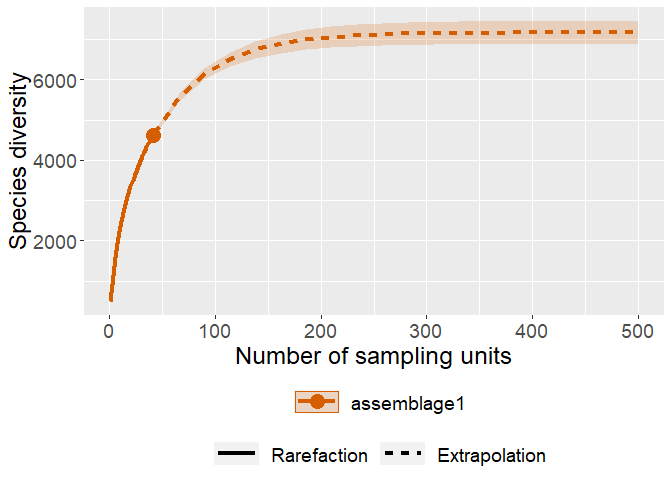

06_iNext
================
Daniel
26/01/2023

``` r
rm(list=ls())
library('iNEXT')
```

    ## Warning: package 'iNEXT' was built under R version 4.1.3

``` r
library('ggplot2')
```

    ## Warning: package 'ggplot2' was built under R version 4.1.3

``` r
dat<- read.csv('data/metabinary_inext.csv', header = TRUE)


mdat <- as.matrix(apply(dat[,-1],2,as.integer))
row.names(mdat) <- dat[,1]
mdat[is.na(mdat)] <- 0
data.list <- list(mdat)

out <- iNEXT(data.list, datatype = "incidence_raw", endpoint = 500)

out
```

    ## Compare 1 assemblages with Hill number order q = 0.
    ## $class: iNEXT
    ## 
    ## $DataInfo: basic data information
    ##    Assemblage  T     U S.obs     SC   Q1  Q2  Q3  Q4  Q5 Q6 Q7 Q8 Q9 Q10
    ## 1 assemblage1 40 14647  3173 0.9134 1294 516 279 190 145 93 96 67 55  49
    ## 
    ## $iNextEst: diversity estimates with rarefied and extrapolated samples.
    ## $size_based (LCL and UCL are obtained for fixed size.)
    ## 
    ##     Assemblage   t        Method Order.q       qD    qD.LCL    qD.UCL        SC
    ## 1  assemblage1   1   Rarefaction       0  366.175  361.6596  370.6904 0.3028466
    ## 10 assemblage1  20   Rarefaction       0 2353.130 2318.2250 2388.0352 0.8549747
    ## 20 assemblage1  40      Observed       0 3173.000 3121.1197 3224.8803 0.9134247
    ## 30 assemblage1 258 Extrapolation       0 4735.781 4564.4437 4907.1190 0.9989508
    ## 40 assemblage1 500 Extrapolation       0 4754.810 4579.1727 4930.4466 0.9999922
    ##       SC.LCL    SC.UCL
    ## 1  0.2973837 0.3083096
    ## 10 0.8512661 0.8586833
    ## 20 0.9098563 0.9169930
    ## 30 0.9986949 0.9992067
    ## 40 0.9999899 0.9999945
    ## 
    ## NOTE: The above output only shows five estimates for each assemblage; call iNEXT.object$iNextEst$size_based to view complete output.
    ## 
    ## $coverage_based (LCL and UCL are obtained for fixed coverage; interval length is wider due to varying size in bootstraps.)
    ## 
    ##     Assemblage        SC   t        Method Order.q       qD    qD.LCL    qD.UCL
    ## 1  assemblage1 0.3028466   1   Rarefaction       0  366.175  361.6596  370.6904
    ## 10 assemblage1 0.8549747  20   Rarefaction       0 2353.130 2296.8948 2409.3650
    ## 20 assemblage1 0.9134247  40      Observed       0 3173.000 3088.8756 3257.1244
    ## 30 assemblage1 0.9989508 258 Extrapolation       0 4735.781 4561.4969 4910.0658
    ## 40 assemblage1 0.9999922 500 Extrapolation       0 4754.810 4579.1487 4930.4707
    ## 
    ## NOTE: The above output only shows five estimates for each assemblage; call iNEXT.object$iNextEst$coverage_based to view complete output.
    ## 
    ## $AsyEst: asymptotic diversity estimates along with related statistics.
    ##    Assemblage         Diversity Observed Estimator      s.e.      LCL      UCL
    ## 1 assemblage1  Species richness 3173.000  4754.953 103.82948 4551.451 4958.455
    ## 2 assemblage1 Shannon diversity 1747.504  2062.755  22.26568 2019.115 2106.395
    ## 3 assemblage1 Simpson diversity 1143.313  1209.110  12.79054 1184.041 1234.179

``` r
ggiNEXT(out) 
```

    ## Warning in ggiNEXT.iNEXT(out): invalid color.var setting, the iNEXT object do
    ## not consist multiple assemblages, change setting as Order.q

<!-- -->
