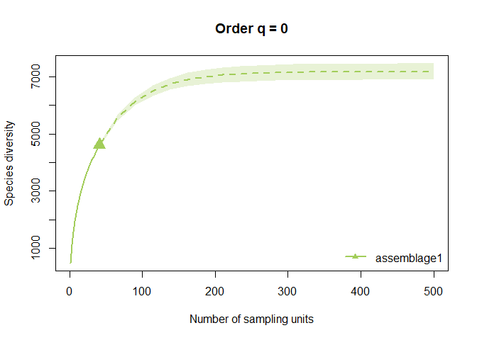
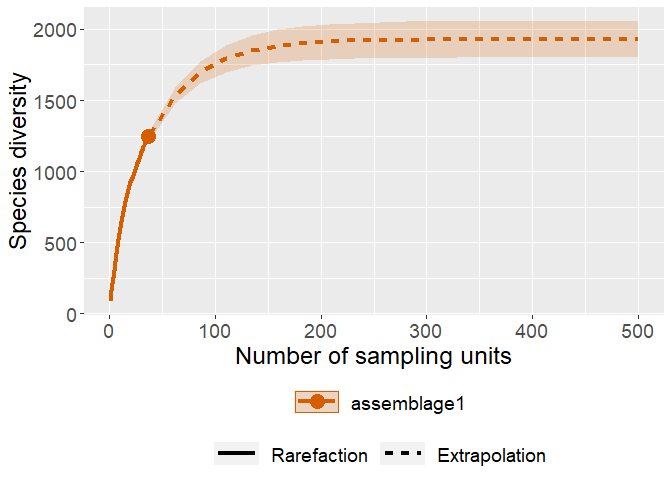
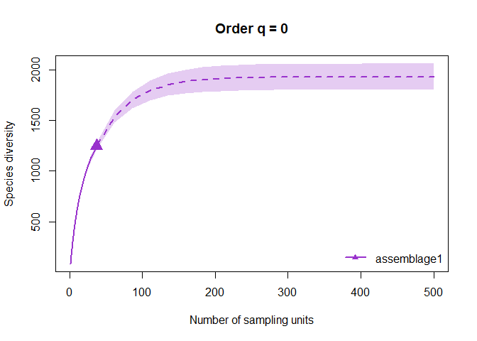
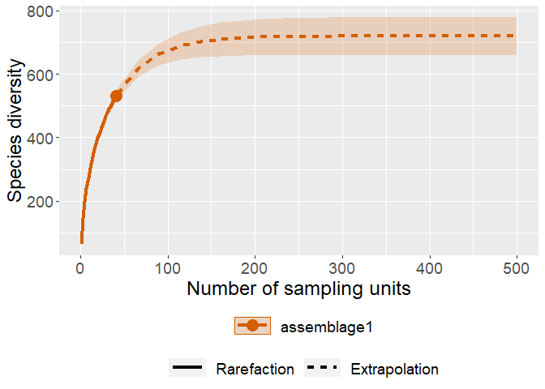
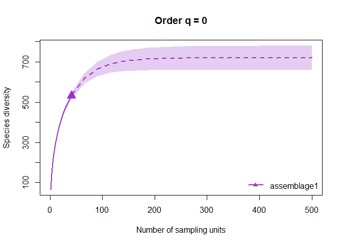

06_iNext
================
Daniel
26/01/2023

``` r
rm(list=ls())
library('iNEXT')
```

    ## Warning: package 'iNEXT' was built under R version 4.1.3

``` r
library('ggplot2')
```

    ## Warning: package 'ggplot2' was built under R version 4.1.3

``` r
library('tidyr')
```

    ## Warning: package 'tidyr' was built under R version 4.1.3

``` r
library('dplyr')
```

    ## Warning: package 'dplyr' was built under R version 4.1.3

    ## 
    ## Attaching package: 'dplyr'

    ## The following objects are masked from 'package:stats':
    ## 
    ##     filter, lag

    ## The following objects are masked from 'package:base':
    ## 
    ##     intersect, setdiff, setequal, union

``` r
dat<- read.csv('data/final_anal/CYBs_correct_names.csv', header = TRUE)

parallel_dat <- read.csv('data/final_anal/parallel_LT_final.csv', header = T)

trad_dat <-read.csv('data/final_anal/tradbinary_LT_only.csv', header = T)
trad_dat %>%
  group_by(bold_bin, classification) %>%
  summarise_all(sum) %>%
  data.frame() -> trad_dat

trad_dat %>% group_by(bold_bin) %>% filter(n()>1)
```

    ## # A tibble: 43 x 38
    ## # Groups:   bold_bin [21]
    ##    bold_bin     classi~1 ALTOS~2 ARM1_~3 ARM1_~4 ARM2_~5 ARM2_~6 ARM3_~7 ARM3_~8
    ##    <chr>        <chr>      <int>   <int>   <int>   <int>   <int>   <int>   <int>
    ##  1 BOLD:AAA6238 k__Anim~       0       0       0       0       0       0       0
    ##  2 BOLD:AAA6238 k__Anim~       0       0       0       0       0       0       0
    ##  3 BOLD:AAA8259 k__Anim~       0       0       0       0       0       0       0
    ##  4 BOLD:AAA8259 k__Anim~       0       0       0       0       0       0       0
    ##  5 BOLD:AAB4611 k__Anim~       0       0       0       0       0       0       0
    ##  6 BOLD:AAB4611 k__Anim~       0       0       0       0       0       0       0
    ##  7 BOLD:AAB4965 k__Anim~       0       0       0       0       0       0       0
    ##  8 BOLD:AAB4965 k__Anim~       0       0       0       0       0       0       0
    ##  9 BOLD:AAB7446 k__Anim~       0       0       0       0       0       0       0
    ## 10 BOLD:AAB7446 k__Anim~       0       0       0       0       0       0       0
    ## # ... with 33 more rows, 29 more variables: L02_wet_LT <int>,
    ## #   L02TEST_dry_LT <int>, L02_dry_LT <int>, ARM4_wet_LT <int>,
    ## #   ARM4_dry_LT <int>, BAL1_dry_LT <int>, BAL1_wet_LT <int>,
    ## #   ALATESHIK_na_LT <int>, DRA1_dry_LT <int>, DRA1_wet_LT <int>,
    ## #   L03_wet_LT <int>, L03_dry_LT <int>, PRD_dry_LT <int>, WHE1_wet_LT <int>,
    ## #   WHE1_dry_LT <int>, L05_wet_LT <int>, L05TEST_wet_LT <int>,
    ## #   WHE2_dry_LT <int>, WHE2_wet_LT <int>, L05TEST_dry_LT <int>, ...

``` r
trad_dat %>%
  group_by(bold_bin, classification) %>%
  summarise_all(sum) %>%
  mutate_if(is.numeric, ~1 * (. > 0)) %>% #change values >1 to 1
  data.frame() -> trad_dat
```

    ## `mutate_if()` ignored the following grouping variables:
    ## * Column `bold_bin`

``` r
dat %>%
  group_by(bin_uri, classification) %>%
  summarise_all(sum) %>%
  mutate_if(is.numeric, ~1 * (. > 0)) %>% #change values >1 to 1
  data.frame() -> dat
```

    ## `mutate_if()` ignored the following grouping variables:
    ## * Column `bin_uri`

``` r
mdat <- as.matrix(apply(dat[,-1],2,as.integer))
```

    ## Warning in apply(dat[, -1], 2, as.integer): NAs introduced by coercion

``` r
row.names(mdat) <- dat[,1]
mdat[is.na(mdat)] <- 0
data.list <- list(mdat)

out <- iNEXT(data.list, datatype = "incidence_raw", endpoint = 500)

out
```

    ## Compare 1 assemblages with Hill number order q = 0.
    ## $class: iNEXT
    ## 
    ## $DataInfo: basic data information
    ##    Assemblage  T     U S.obs     SC   Q1  Q2  Q3  Q4  Q5  Q6  Q7  Q8 Q9 Q10
    ## 1 assemblage1 41 19989  4611 0.9036 1964 735 395 271 197 137 130 107 85  71
    ## 
    ## $iNextEst: diversity estimates with rarefied and extrapolated samples.
    ## $size_based (LCL and UCL are obtained for fixed size.)
    ## 
    ##     Assemblage   t        Method Order.q        qD    qD.LCL    qD.UCL
    ## 1  assemblage1   1   Rarefaction       0  487.5366  480.8665  494.2067
    ## 10 assemblage1  20   Rarefaction       0 3343.5132 3306.9814 3380.0449
    ## 20 assemblage1  41      Observed       0 4611.0000 4552.9969 4669.0031
    ## 30 assemblage1 258 Extrapolation       0 7125.1858 6850.6985 7399.6731
    ## 40 assemblage1 500 Extrapolation       0 7170.4946 6886.4007 7454.5885
    ##           SC    SC.LCL    SC.UCL
    ## 1  0.2731878 0.2690387 0.2773368
    ## 10 0.8399641 0.8360711 0.8438571
    ## 20 0.9035507 0.8994774 0.9076240
    ## 30 0.9982735 0.9978900 0.9986570
    ## 40 0.9999806 0.9999762 0.9999849
    ## 
    ## NOTE: The above output only shows five estimates for each assemblage; call iNEXT.object$iNextEst$size_based to view complete output.
    ## 
    ## $coverage_based (LCL and UCL are obtained for fixed coverage; interval length is wider due to varying size in bootstraps.)
    ## 
    ##     Assemblage        SC   t        Method Order.q        qD    qD.LCL
    ## 1  assemblage1 0.2731878   1   Rarefaction       0  487.5366  480.8665
    ## 10 assemblage1 0.8399641  20   Rarefaction       0 3343.5130 3277.4783
    ## 20 assemblage1 0.9035507  41      Observed       0 4611.0000 4501.3619
    ## 30 assemblage1 0.9982735 258 Extrapolation       0 7125.1858 6844.6419
    ## 40 assemblage1 0.9999806 500 Extrapolation       0 7170.4946 6886.3435
    ##       qD.UCL
    ## 1   494.2067
    ## 10 3409.5477
    ## 20 4720.6381
    ## 30 7405.7298
    ## 40 7454.6457
    ## 
    ## NOTE: The above output only shows five estimates for each assemblage; call iNEXT.object$iNextEst$coverage_based to view complete output.
    ## 
    ## $AsyEst: asymptotic diversity estimates along with related statistics.
    ##    Assemblage         Diversity Observed Estimator      s.e.      LCL      UCL
    ## 1 assemblage1  Species richness 4611.000  7171.011 127.48006 6921.154 7420.867
    ## 2 assemblage1 Shannon diversity 2576.915  3096.512  26.51166 3044.551 3148.474
    ## 3 assemblage1 Simpson diversity 1675.874  1784.621  14.97016 1755.280 1813.962

``` r
ggiNEXT(out)
```

    ## Warning in ggiNEXT.iNEXT(out): invalid color.var setting, the iNEXT object do
    ## not consist multiple assemblages, change setting as Order.q

<!-- -->

``` r
plot(out, col = "darkolivegreen3")
```

<!-- -->

``` r
mtrad_dat <- as.matrix(apply(trad_dat[,-1],2,as.integer))
```

    ## Warning in apply(trad_dat[, -1], 2, as.integer): NAs introduced by coercion

``` r
row.names(mtrad_dat) <- trad_dat[,1]
mtrad_dat[is.na(mtrad_dat)] <- 0
trad_data.list <- list(mtrad_dat)

trad_out <- iNEXT(trad_data.list, datatype = "incidence_raw", endpoint = 500)

trad_out
```

    ## Compare 1 assemblages with Hill number order q = 0.
    ## $class: iNEXT
    ## 
    ## $DataInfo: basic data information
    ##    Assemblage  T    U S.obs     SC  Q1  Q2  Q3 Q4 Q5 Q6 Q7 Q8 Q9 Q10
    ## 1 assemblage1 37 3232  1248 0.8287 566 229 143 89 74 57 44 23 14   6
    ## 
    ## $iNextEst: diversity estimates with rarefied and extrapolated samples.
    ## $size_based (LCL and UCL are obtained for fixed size.)
    ## 
    ##     Assemblage   t        Method Order.q         qD     qD.LCL    qD.UCL
    ## 1  assemblage1   1   Rarefaction       0   87.35135   84.79481   89.9079
    ## 10 assemblage1  18   Rarefaction       0  872.58541  851.41832  893.7525
    ## 20 assemblage1  37      Observed       0 1248.00000 1212.58978 1283.4102
    ## 30 assemblage1 256 Extrapolation       0 1923.33032 1796.66319 2049.9975
    ## 40 assemblage1 500 Extrapolation       0 1928.53965 1800.16562 2056.9137
    ##            SC     SC.LCL     SC.UCL
    ## 1  0.09099972 0.08452901 0.09747044
    ## 10 0.69965323 0.68699447 0.71231200
    ## 20 0.82872604 0.81534177 0.84211030
    ## 30 0.99868318 0.99818812 0.99917825
    ## 40 0.99999419 0.99999150 0.99999688
    ## 
    ## NOTE: The above output only shows five estimates for each assemblage; call iNEXT.object$iNextEst$size_based to view complete output.
    ## 
    ## $coverage_based (LCL and UCL are obtained for fixed coverage; interval length is wider due to varying size in bootstraps.)
    ## 
    ##     Assemblage         SC   t        Method Order.q         qD     qD.LCL
    ## 1  assemblage1 0.09100006   1   Rarefaction       0   87.35167   84.79512
    ## 10 assemblage1 0.69965302  18   Rarefaction       0  872.58494  838.58411
    ## 20 assemblage1 0.82872604  37      Observed       0 1248.00000 1187.32473
    ## 30 assemblage1 0.99868318 256 Extrapolation       0 1923.33032 1795.53410
    ## 40 assemblage1 0.99999419 500 Extrapolation       0 1928.53965 1800.16048
    ##        qD.UCL
    ## 1    89.90821
    ## 10  906.58577
    ## 20 1308.67527
    ## 30 2051.12654
    ## 40 2056.91882
    ## 
    ## NOTE: The above output only shows five estimates for each assemblage; call iNEXT.object$iNextEst$coverage_based to view complete output.
    ## 
    ## $AsyEst: asymptotic diversity estimates along with related statistics.
    ##    Assemblage         Diversity  Observed Estimator     s.e.       LCL      UCL
    ## 1 assemblage1  Species richness 1248.0000 1928.5627 58.29363 1814.3093 2042.816
    ## 2 assemblage1 Shannon diversity  947.2377 1300.8602 25.45891 1250.9617 1350.759
    ## 3 assemblage1 Simpson diversity  755.8483  959.9082 21.84221  917.0982 1002.718

``` r
ggiNEXT(trad_out)
```

    ## Warning in ggiNEXT.iNEXT(trad_out): invalid color.var setting, the iNEXT object
    ## do not consist multiple assemblages, change setting as Order.q

<!-- -->

``` r
plot(trad_out, col = "darkorchid")
```

<!-- -->

``` r
mparallel_dat <- as.matrix(apply(parallel_dat[,-1],2,as.integer))
```

    ## Warning in apply(parallel_dat[, -1], 2, as.integer): NAs introduced by coercion

``` r
row.names(mparallel_dat) <- parallel_dat[,1]
mparallel_dat[is.na(mparallel_dat)] <- 0
parallel_data.list <- list(mparallel_dat)

parallel_out <- iNEXT(parallel_data.list, datatype = "incidence_raw", endpoint = 500)

parallel_out
```

    ## Compare 1 assemblages with Hill number order q = 0.
    ## $class: iNEXT
    ## 
    ## $DataInfo: basic data information
    ##    Assemblage  T    U S.obs     SC  Q1 Q2 Q3 Q4 Q5 Q6 Q7 Q8 Q9 Q10
    ## 1 assemblage1 41 2679   532 0.9297 193 97 44 32 31 12 11 17  8  12
    ## 
    ## $iNextEst: diversity estimates with rarefied and extrapolated samples.
    ## $size_based (LCL and UCL are obtained for fixed size.)
    ## 
    ##     Assemblage   t        Method Order.q        qD    qD.LCL    qD.UCL
    ## 1  assemblage1   1   Rarefaction       0  65.34146  63.39554  67.28739
    ## 10 assemblage1  20   Rarefaction       0 399.83297 387.67807 411.98787
    ## 20 assemblage1  41      Observed       0 532.00000 515.13134 548.86866
    ## 30 assemblage1 258 Extrapolation       0 718.46388 659.47806 777.44969
    ## 40 assemblage1 500 Extrapolation       0 719.31999 659.34133 779.29864
    ##           SC    SC.LCL    SC.UCL
    ## 1  0.3115342 0.2990328 0.3240355
    ## 10 0.8699547 0.8620598 0.8778496
    ## 20 0.9297242 0.9208687 0.9385797
    ## 30 0.9996780 0.9992962 1.0000000
    ## 40 0.9999992 0.9999962 1.0000000
    ## 
    ## NOTE: The above output only shows five estimates for each assemblage; call iNEXT.object$iNextEst$size_based to view complete output.
    ## 
    ## $coverage_based (LCL and UCL are obtained for fixed coverage; interval length is wider due to varying size in bootstraps.)
    ## 
    ##     Assemblage        SC   t        Method Order.q        qD    qD.LCL
    ## 1  assemblage1 0.3115342   1   Rarefaction       0  65.34146  63.39554
    ## 10 assemblage1 0.8699548  20   Rarefaction       0 399.83305 381.39160
    ## 20 assemblage1 0.9297242  41      Observed       0 532.00000 504.88222
    ## 30 assemblage1 0.9996780 258 Extrapolation       0 718.46388 658.66816
    ## 40 assemblage1 0.9999992 500 Extrapolation       0 719.31999 659.33540
    ##       qD.UCL
    ## 1   67.28739
    ## 10 418.27450
    ## 20 559.11778
    ## 30 778.25960
    ## 40 779.30457
    ## 
    ## NOTE: The above output only shows five estimates for each assemblage; call iNEXT.object$iNextEst$coverage_based to view complete output.
    ## 
    ## $AsyEst: asymptotic diversity estimates along with related statistics.
    ##    Assemblage         Diversity Observed Estimator      s.e.      LCL      UCL
    ## 1 assemblage1  Species richness 532.0000  719.3221 30.895750 658.7675 779.8767
    ## 2 assemblage1 Shannon diversity 296.9918  340.8156  6.519665 328.0373 353.5939
    ## 3 assemblage1 Simpson diversity 199.0140  209.7409  4.253464 201.4043 218.0776

``` r
ggiNEXT(parallel_out)
```

    ## Warning in ggiNEXT.iNEXT(parallel_out): invalid color.var setting, the iNEXT
    ## object do not consist multiple assemblages, change setting as Order.q

<!-- -->

``` r
plot(parallel_out, col = "darkorchid")
```

<!-- -->
