07_trad_metabr_parallel_samples
================
Daniel
14/02/2023

``` r
tradmetabrparallel <- read.csv('data/final_anal/tradmetabr_final.csv')
sample <- read.csv('data/final_anal/metadata_trad_metabr_parallel.csv') #this includes info on location/collection method/classification method and any more info can be added
obj <- parse_tax_data(tradmetabrparallel,
                      class_cols = "classification",
                      class_sep = ";",
                      class_regex = "^([a-z]{0,1})_{0,2}(.*)$",
                      class_key = c("tax_rank" = "taxon_rank", "name" = "taxon_name"))

sample_parallel <- filter(sample, methodClass == "parallel" | methodClass == "metabr")

obj$data$tax_data <- obj$data$tax_data[c("taxon_id","bold_bin", "classification", sample_parallel$sampleID)] #filters dataset to inlcude only samples within sample_parallel - e.g. only the samples which where collected in parallel. Metabarcoding and trad MAY2019 and MAR2021


obj %>%  metacoder::filter_taxa(taxon_names %in% c("Lepidoptera", "Coleoptera", "Hymenoptera", "Hemiptera", "Blattodea"),#here is to fliter the figure by focal groups
              subtaxa = TRUE) -> obj

no_reads <- rowSums(obj$data$tax_data[, sample_parallel$sampleID]) == 0 #check for zeroes after filtering always. Otherwise we get bad results
sum(no_reads) #in this case there are 1348 need to be removed
```

    ## [1] 1348

``` r
obj <- filter_obs(obj, data = "tax_data", ! no_reads, drop_taxa = TRUE) 
print(obj)
```

    ## <Taxmap>
    ##   3406 taxa: aag. Lepidoptera, aah. Hymenoptera ... itz. sp.1YB
    ##   3406 edges: NA->aag, NA->aah, NA->aam ... dia->ity, cxy->itz
    ##   2 data sets:
    ##     tax_data:
    ##       # A tibble: 3,064 x 81
    ##         taxon_id bold_bin     classi~1 ARM1A~2 BAL1A~3 DRA1A~4 WHE1A~5
    ##         <chr>    <chr>        <chr>      <int>   <int>   <int>   <int>
    ##       1 dib      BOLD:AAA0009 k__Anim~       0       0       0       0
    ##       2 dic      BOLD:AAA0012 k__Anim~       0       0       0       0
    ##       3 did      BOLD:AAA0016 k__Anim~       0       0       0       0
    ##       # ... with 3,061 more rows, 74 more variables: WHE2AWET <int>,
    ##       #   ZET1AWET <int>, ZET2AWET <int>, ARM2AWET <int>,
    ##       #   ARM3AWET <int>, ARM4AWET <int>, ARM1BWET <int>,
    ##       #   BAL1BWET <int>, DRA1BWET <int>, WHE1BWET <int>, ..., and
    ##       #   abbreviated variable names 1: classification, 2: ARM1AWET,
    ##       #   3: BAL1AWET, 4: DRA1AWET, 5: WHE1AWET
    ##     class_data:
    ##       # A tibble: 15,399 x 5
    ##         taxon_id input_index tax_rank name        regex_match   
    ##         <chr>          <int> <chr>    <chr>       <chr>         
    ##       1 aag                1 o        Lepidoptera o__Lepidoptera
    ##       2 abd                1 f        Gelechiidae f__Gelechiidae
    ##       3 amw                1 g        gelJanzen1  g__gelJanzen1 
    ##       # ... with 15,396 more rows
    ##   0 functions:

``` r
obj$data$tax_table <- calc_taxon_abund(obj, data = "tax_data", cols = sample_parallel$sampleID)
```

    ## Summing per-taxon counts from 78 columns for 3406 taxa

``` r
obj$data$tax_props <- calc_obs_props(obj, "tax_data", cols= sample_parallel$sampleID, other_cols = TRUE)
```

    ## Calculating proportions from counts for 78 columns for 3064 observations.

``` r
obj$data$diff_table <- compare_groups(obj, data = "tax_table",
                                      cols = sample_parallel$sampleID,
                                      groups = sample_parallel$methodClass)

ps_obj <- metacoder::as_phyloseq(obj,
                      otu_table = "tax_data",
                      otu_id_col = "bold_bin",
                      sample_data = sample_parallel,
                      sample_id_col = "sampleID") %>% microViz::tax_mutate(rank_0 = "Animalia",rank_01 = "Arthropoda", rank_02 = "Insecta", .before = 1) -> ps_obj
colnames(tax_table(ps_obj)) <- c("k__", "p__", "c__", "o__", "f__", "g__", "s__")

phyloseq_validate(ps_obj, remove_undetected = TRUE, verbose = TRUE)
```

    ## Short values detected in phyloseq tax_table (nchar<4) :
    ## Consider using tax_fix() to make taxa uniquely identifiable

    ## phyloseq-class experiment-level object
    ## otu_table()   OTU Table:         [ 3064 taxa and 78 samples ]
    ## sample_data() Sample Data:       [ 78 samples by 5 sample variables ]
    ## tax_table()   Taxonomy Table:    [ 3064 taxa by 7 taxonomic ranks ]

``` r
pcoares <- get_pcoa(obj=ps_obj, distmethod="bray", method="hellinger")
# Visualizing the result
pcoaplot1 <- ggordpoint(obj=pcoares, biplot=TRUE, speciesannot=TRUE,
                        factorNames=c("methodClass", "season"), ellipse=TRUE) +
  scale_color_manual(values=c("darkolivegreen3", "darkorchid")) +
  scale_fill_manual(values=c("darkolivegreen3", "darkorchid"))
# first and third principal co-ordinates
pcoaplot2 <- ggordpoint(obj=pcoares, pc=c(1, 3), biplot=TRUE, speciesannot=TRUE,
                        factorNames=c("methodClass", "season"), ellipse=TRUE) +
  scale_color_manual(values=c("darkolivegreen3", "darkorchid")) +
  scale_fill_manual(values=c("darkolivegreen3", "darkorchid"))
pcoaplot1 | pcoaplot2
```

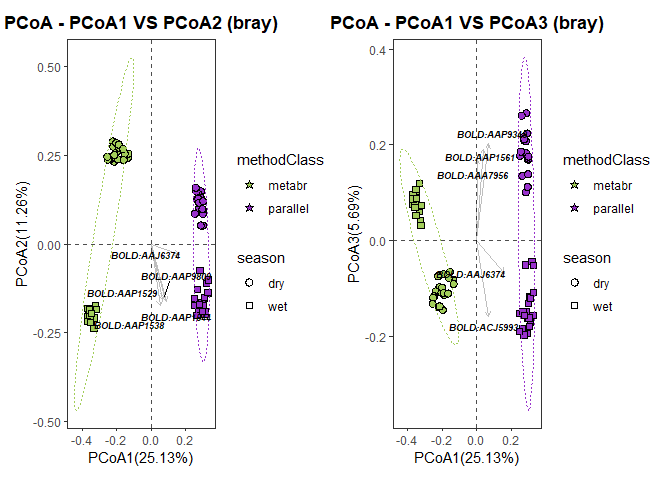<!-- -->

``` r
pdf("./07_trad_metabar_parallel_data_files/pcoa_meta_parallel.pdf")
pcoaplot1
dev.off()
```

    ## png 
    ##   2

``` r
classtaxa <- get_taxadf(obj=ps_obj, taxlevel=4)
# The 5 most abundant taxonomy will be visualized by default (parameter `topn=5`). 
pclass <- ggbartax(obj=classtaxa, facetNames="methodClass", topn=10) +
  xlab(NULL) +
  ylab("relative abundance (%)") +
  scale_fill_manual(values=c(colorRampPalette(RColorBrewer::brewer.pal(12,"Set3"))(31))) +
  guides(fill= guide_legend(keywidth = 0.5, keyheight = 0.5))
```

    ## The color has been set automatically, you can reset it 
    ##             manually by adding scale_fill_manual(values=yourcolors)

    ## Scale for 'fill' is already present. Adding another scale for 'fill', which
    ## will replace the existing scale.

``` r
pclass
```

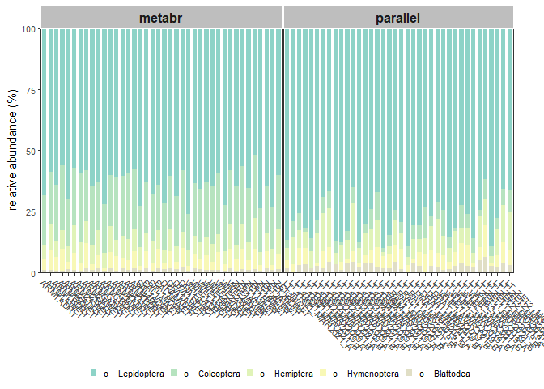<!-- -->

``` r
pdf("./07_trad_metabar_parallel_data_files/top_orders_sampling.pdf")
pclass
dev.off()
```

    ## png 
    ##   2

From here on we are only focusing on focal groups within the focal
orders (similar to script 05) but for the metabarcoding and traditional
samples which were done in parallel. The following chunk can be run in
one go. We will generate metacoder trees in the following cunk.

``` r
obj %>% metacoder::filter_taxa(taxon_names %in% c("Geometridae"),subtaxa = TRUE) -> geom_LT
ps_geom_LT <- metacoder::as_phyloseq(geom_LT,otu_table = "tax_data",otu_id_col = "bold_bin",sample_data = sample,sample_id_col = "sampleID") %>% microViz::tax_mutate(rank_0 = "Animalia",rank_01 = "Arthropoda", rank_02 = "Insecta", rank_03 = "Lepidoptera", .before = 1) -> ps_geom_LT
```

    ## Warning: Discarding non-numeric columns in OTU table:   classification

``` r
colnames(tax_table(ps_geom_LT)) <- c("k__", "p__", "o__", "c__", "f__", "g__", "s__")

obj %>% metacoder::filter_taxa(taxon_names %in% c("Erebidae"), subtaxa = TRUE) -> ereb_LT
ps_ereb_LT <- metacoder::as_phyloseq(ereb_LT,otu_table = "tax_data",otu_id_col = "bold_bin",sample_data = sample,sample_id_col = "sampleID")%>% microViz::tax_mutate(rank_0 = "Animalia",rank_01 = "Arthropoda", rank_02 = "Insecta", rank_03 = "Lepidoptera", .before = 1) -> ps_ereb_LT
```

    ## Warning: Discarding non-numeric columns in OTU table:   classification

``` r
colnames(tax_table(ps_ereb_LT)) <- c("k__", "p__", "o__", "c__", "f__", "g__", "s__")

obj %>% metacoder::filter_taxa(taxon_names %in% c("Crambidae"), subtaxa = TRUE) -> cramb_LT
ps_cramb_LT <- metacoder::as_phyloseq(cramb_LT,otu_table = "tax_data",otu_id_col = "bold_bin",sample_data = sample,sample_id_col = "sampleID")%>% microViz::tax_mutate(rank_0 = "Animalia",rank_01 = "Arthropoda", rank_02 = "Insecta", rank_03 = "Lepidoptera", .before = 1) -> ps_cramb_LT
```

    ## Warning: Discarding non-numeric columns in OTU table:   classification

``` r
colnames(tax_table(ps_cramb_LT)) <- c("k__", "p__", "o__", "c__", "f__", "g__", "s__")

obj %>% metacoder::filter_taxa(taxon_names %in% c("Saturniidae"), subtaxa = TRUE) -> satur_LT
ps_satur_LT <- metacoder::as_phyloseq(satur_LT,otu_table = "tax_data",otu_id_col = "bold_bin",sample_data = sample,sample_id_col = "sampleID")%>% microViz::tax_mutate(rank_0 = "Animalia",rank_01 = "Arthropoda", rank_02 = "Insecta", rank_03 = "Lepidoptera", .before = 1) -> ps_satur_LT
```

    ## Warning: Discarding non-numeric columns in OTU table:   classification

``` r
colnames(tax_table(ps_satur_LT)) <- c("k__", "p__", "o__", "c__", "f__", "g__", "s__")

obj %>% metacoder::filter_taxa(taxon_names %in% c("Noctuidae"), subtaxa = TRUE) -> noctuid_LT
ps_noctuid_LT <- metacoder::as_phyloseq(noctuid_LT,otu_table = "tax_data",otu_id_col = "bold_bin",sample_data = sample,sample_id_col = "sampleID")%>% microViz::tax_mutate(rank_0 = "Animalia",rank_01 = "Arthropoda", rank_02 = "Insecta", rank_03 = "Lepidoptera", .before = 1) -> ps_noctuid_LT
```

    ## Warning: Discarding non-numeric columns in OTU table:   classification

``` r
colnames(tax_table(ps_noctuid_LT)) <- c("k__", "p__", "o__", "c__", "f__", "g__", "s__")

obj %>% metacoder::filter_taxa(taxon_names %in% c("Nymphalidae"), subtaxa = TRUE) -> nymph_LT
ps_nymph_LT <- metacoder::as_phyloseq(nymph_LT,otu_table = "tax_data",otu_id_col = "bold_bin",sample_data = sample,sample_id_col = "sampleID")%>% microViz::tax_mutate(rank_0 = "Animalia",rank_01 = "Arthropoda", rank_02 = "Insecta", rank_03 = "Lepidoptera", .before = 1) -> ps_nymph_LT
```

    ## Warning: Discarding non-numeric columns in OTU table:   classification

``` r
colnames(tax_table(ps_nymph_LT)) <- c("k__", "p__", "o__", "c__", "f__", "g__", "s__")

obj %>% metacoder::filter_taxa(taxon_names %in% c("Hesperiidae"), subtaxa = TRUE) -> hesp_LT
ps_hesp_LT <- metacoder::as_phyloseq(hesp_LT,otu_table = "tax_data",otu_id_col = "bold_bin",sample_data = sample,sample_id_col = "sampleID")%>% microViz::tax_mutate(rank_0 = "Animalia",rank_01 = "Arthropoda", rank_02 = "Insecta", rank_03 = "Lepidoptera", .before = 1) -> ps_hesp_LT
```

    ## Warning: Discarding non-numeric columns in OTU table:   classification

``` r
colnames(tax_table(ps_hesp_LT)) <- c("k__", "p__", "o__", "c__", "f__", "g__", "s__")

obj %>% metacoder::filter_taxa(taxon_names %in% c("Pyralidae"), subtaxa = TRUE) -> pyra_LT
ps_pyra_LT <- metacoder::as_phyloseq(pyra_LT,otu_table = "tax_data",otu_id_col = "bold_bin",sample_data = sample,sample_id_col = "sampleID")%>% microViz::tax_mutate(rank_0 = "Animalia",rank_01 = "Arthropoda", rank_02 = "Insecta", rank_03 = "Lepidoptera", .before = 1) -> ps_pyra_LT
```

    ## Warning: Discarding non-numeric columns in OTU table:   classification

``` r
colnames(tax_table(ps_pyra_LT)) <- c("k__", "p__", "o__", "c__", "f__", "g__", "s__")

obj %>% metacoder::filter_taxa(taxon_names %in% c("Scarabaeidae"), subtaxa = TRUE) -> scarab_LT
ps_scarab_LT <- metacoder::as_phyloseq(scarab_LT,otu_table = "tax_data",otu_id_col = "bold_bin",sample_data = sample,sample_id_col = "sampleID")%>% microViz::tax_mutate(rank_0 = "Animalia",rank_01 = "Arthropoda", rank_02 = "Insecta", rank_03 = "Coleoptera", .before = 1) -> ps_scarab_LT
```

    ## Warning: Discarding non-numeric columns in OTU table:   classification

``` r
colnames(tax_table(ps_scarab_LT)) <- c("k__", "p__", "o__", "c__", "f__", "g__", "s__")

obj %>% metacoder::filter_taxa(taxon_names %in% c("Curculionidae"), subtaxa = TRUE) -> curcu_LT
ps_curcu_LT <- metacoder::as_phyloseq(curcu_LT,otu_table = "tax_data",otu_id_col = "bold_bin",sample_data = sample,sample_id_col = "sampleID")%>% microViz::tax_mutate(rank_0 = "Animalia",rank_01 = "Arthropoda", rank_02 = "Insecta", rank_03 = "Coleoptera", .before = 1) -> ps_curcu_LT
```

    ## Warning: Discarding non-numeric columns in OTU table:   classification

``` r
colnames(tax_table(ps_curcu_LT)) <- c("k__", "p__", "o__", "c__", "f__", "g__", "s__")

obj %>% metacoder::filter_taxa(taxon_names %in% c("Passalidae"), subtaxa = TRUE) -> passa_LT
ps_passa_LT <- metacoder::as_phyloseq(passa_LT,otu_table = "tax_data",otu_id_col = "bold_bin",sample_data = sample,sample_id_col = "sampleID")%>% microViz::tax_mutate(rank_0 = "Animalia",rank_01 = "Arthropoda", rank_02 = "Insecta", rank_03 = "Coleoptera", .before = 1) -> ps_passa_LT
```

    ## Warning: Discarding non-numeric columns in OTU table:   classification

``` r
colnames(tax_table(ps_passa_LT)) <- c("k__", "p__", "o__", "c__", "f__", "g__", "s__")

obj %>% metacoder::filter_taxa(taxon_names %in% c("Formicidae"), subtaxa = TRUE) -> ants_LT
ps_ants_LT <- metacoder::as_phyloseq(ants_LT,otu_table = "tax_data",otu_id_col = "bold_bin",sample_data = sample,sample_id_col = "sampleID")%>% microViz::tax_mutate(rank_0 = "Animalia",rank_01 = "Arthropoda", rank_02 = "Insecta", rank_03 = "Hymenoptera", .before = 1) -> ps_ants_LT
```

    ## Warning: Discarding non-numeric columns in OTU table:   classification

``` r
colnames(tax_table(ps_ants_LT)) <- c("k__", "p__", "o__", "c__", "f__", "g__", "s__")

obj %>% metacoder::filter_taxa(taxon_names %in% c("Apidae"), subtaxa = TRUE) -> bees_LT
ps_bees_LT <- metacoder::as_phyloseq(bees_LT,otu_table = "tax_data",otu_id_col = "bold_bin",sample_data = sample,sample_id_col = "sampleID")%>% microViz::tax_mutate(rank_0 = "Animalia",rank_01 = "Arthropoda", rank_02 = "Insecta", rank_03 = "Hymenoptera", .before = 1) -> ps_bees_LT
```

    ## Warning: Discarding non-numeric columns in OTU table:   classification

``` r
colnames(tax_table(ps_bees_LT)) <- c("k__", "p__", "o__", "c__", "f__", "g__", "s__")

obj %>% metacoder::filter_taxa(taxon_names %in% c("Flatidae"), subtaxa = TRUE) -> flat_LT
ps_flat_LT <- metacoder::as_phyloseq(flat_LT,otu_table = "tax_data",otu_id_col = "bold_bin",sample_data = sample,sample_id_col = "sampleID")%>% microViz::tax_mutate(rank_0 = "Animalia",rank_01 = "Arthropoda", rank_02 = "Insecta", rank_03 = "Hemiptera", .before = 1) -> ps_flat_LT
```

    ## Warning: Discarding non-numeric columns in OTU table:   classification

``` r
colnames(tax_table(ps_flat_LT)) <- c("k__", "p__", "o__", "c__", "f__", "g__", "s__")

obj %>% metacoder::filter_taxa(taxon_names %in% c("Reduviidae"), subtaxa = TRUE) -> reds_LT
ps_reds_LT <- metacoder::as_phyloseq(reds_LT,otu_table = "tax_data",otu_id_col = "bold_bin",sample_data = sample,sample_id_col = "sampleID")%>% microViz::tax_mutate(rank_0 = "Animalia",rank_01 = "Arthropoda", rank_02 = "Insecta", rank_03 = "Hemiptera", .before = 1) -> ps_reds_LT
```

    ## Warning: Discarding non-numeric columns in OTU table:   classification

``` r
colnames(tax_table(ps_reds_LT)) <- c("k__", "p__", "o__", "c__", "f__", "g__", "s__")

obj %>% metacoder::filter_taxa(taxon_names %in% c("Blattodea"), subtaxa = TRUE) -> all_termites_LT
ps_all_termites_LT <- metacoder::as_phyloseq(all_termites_LT,otu_table = "tax_data",otu_id_col = "bold_bin",sample_data = sample,sample_id_col = "sampleID")%>% microViz::tax_mutate(rank_0 = "Animalia",rank_01 = "Arthropoda", rank_02 = "Insecta", .before = 1) -> ps_all_termites_LT
```

    ## Warning: Discarding non-numeric columns in OTU table:   classification

``` r
colnames(tax_table(ps_all_termites_LT)) <- c("k__", "p__", "o__", "c__", "f__", "g__", "s__")
```

``` r
set.seed(16)#to make sure the figures is always the same
geom_LT %>%
  heat_tree(node_label = taxon_names,
            node_size_range = c(0.01, 0.03),
            edge_size_range = c(0.003, 0.005),
            node_size = n_obs, # n_obs is a function that calculates, in this case, the number of OTUs per taxon
            node_color = mean_diff, # A column from `obj_LT$data$diff_table`
            node_color_interval = c(-.44,.44), # The range of the mean_difference to display
            node_color_range = c("darkorchid", "gray", "darkolivegreen3"), # The color palette used
            node_size_axis_label = "BIN count",
            node_color_axis_label = "Mean difference between classification methods",
            node_label_size_range = c( 0.003, 0.03),
            layout = "davidson-harel", # The primary layout algorithm
            initial_layout = "reingold-tilford",
            output_file = "./07_trad_metabar_parallel_data_files/geometridae_heattree.pdf") # The layout algorithm that initializes node locations
```

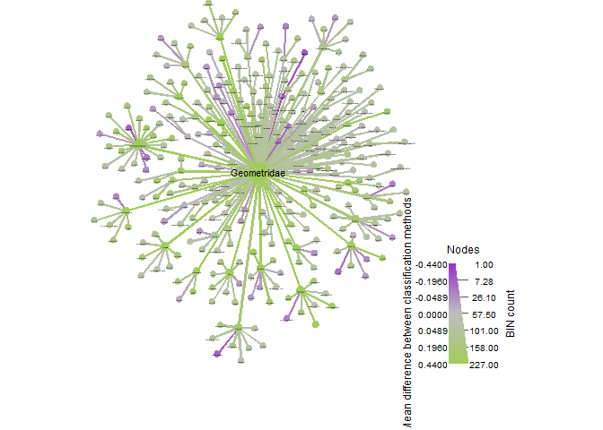<!-- -->

``` r
set.seed(16)#to make sure the figures is always the same
ereb_LT %>%
  heat_tree(node_label = taxon_names,
            node_size_range = c(0.01, 0.03),
            edge_size_range = c(0.003, 0.005),
            node_size = n_obs, # n_obs is a function that calculates, in this case, the number of OTUs per taxon
            node_color = mean_diff, # A column from `obj_LT$data$diff_table`
            node_color_interval = c(-.44,.44), # The range of the mean_difference to display
            node_color_range = c("darkorchid", "gray", "darkolivegreen3"), # The color palette used
            node_size_axis_label = "BIN count",
            node_color_axis_label = "Mean difference between classification methods",
            node_label_size_range = c( 0.003, 0.03),
            layout = "davidson-harel", # The primary layout algorithm
            initial_layout = "reingold-tilford",
            output_file = "./07_trad_metabar_parallel_data_files/erebidae_heattree.pdf") # The layout algorithm that initializes node locations
```

<!-- -->

``` r
ereb_LT$data$taxon_abund <- calc_taxon_abund(ereb_LT, "tax_data", cols = sample_parallel$sampleID, groups = sample_parallel$methodClass)
```

    ## Summing per-taxon counts from 78 columns in 2 groups for 620 taxa

``` r
taxon_names(ereb_LT)[ereb_LT$data$taxon_abund$parallel > 0 & ereb_LT$data$taxon_abund$metabr > 0] #THIS SHOWS US THE OVERLAPPING SPECIES
```

    ##                     abm                     aqb                     aqw 
    ##              "Erebidae"                "Talara"               "Odozana" 
    ##                     arc                     arf                     ari 
    ##               "Aclytia"           "Lepidoneiva"            "Correbidia" 
    ##                     arj                     arl                     arm 
    ##              "Xanthyda"               "Balbura"              "Ormetica" 
    ##                     arn                     aro                     arq 
    ##            "Psoloptera"           "Leucopleura"            "Episcepsis" 
    ##                     arr                     arv                     arw 
    ##                "Virbia"               "Ecdemus"              "Hyalurga" 
    ##                     ary                     arz                     atk 
    ##           "Chrysostola"                "Melese"             "Oxidercia" 
    ##                     aua                     avd                     avi 
    ##             "Coenipeta"            "Encruphion"               "Ophisma" 
    ##                     avm                     avn                     avo 
    ##           "Rhabdatomis"                "Illice"             "Prepiella" 
    ##                     avp                     avx                     axn 
    ##         "Lycomorphodes"           "Poliopastea"          "Near Biturix" 
    ##                     axx                     ayc                     ayt 
    ##               "Perasia"              "Sosxetra"              "Eucereon" 
    ##                     ayv                     azm                     azz 
    ##             "Melipotis"             "Euclystis"                 "Agyra" 
    ##                     baa                     bai                     bar 
    ##                "Amaxia"           "Phaeoblemma"               "Deinopa" 
    ##                     baw                     bbo                     bcd 
    ##               "Isogona"               "Chamyna"          "Hemicephalis" 
    ##                     bcm                     bcy                     bdh 
    ##              "Obroatis"           "Eulepidotis"          "Pseudbarydia" 
    ##                     bdk                     bea                     bfd 
    ##             "Ceromacra"                "Agylla"              "Scaptius" 
    ##                     bfo                     bfx                     bgc 
    ##          "Hemeroblemma"               "Saurita"                "Gabara" 
    ##                     bgj                     bho                     bhu 
    ##             "Celiptera"            "Rejectaria"                      "" 
    ##                     bin                     bip                     bjg 
    ##             "Dialithis"                 "Renia"               "Athyrma" 
    ##                     bjq                     bka                     bkh 
    ##              "Nodozana"             "Cosmosoma"            "Herminodes" 
    ##                     bmg                     bpp                     bqg 
    ##               "Elysius"               "Heliura"            "Acridopsis" 
    ##                     brc                     btg                     bti 
    ##             "Calonotos"            "Hypocladia"             "Arctiinae" 
    ##                     btj                     btk                     btl 
    ##            "Hypocharis"             "Haemanota"              "Gymnelia" 
    ##                     btn                     bts                     bua 
    ##              "Euthyone"               "Nitoris"              "Peteroma" 
    ##                     bue                     buh                     bui 
    ##               "Agaraea"          "Callisthenia"             "Gaudeator" 
    ##                     byh                     ccv                     ciy 
    ##               "Sarsina"           "Erebostrota"               "Ramphia" 
    ##                     ckt                     cmj                     crc 
    ##         "Coccabdominis"          "Epeiromulona"                  "Zale" 
    ##                     dcs                     dms                     dod 
    ##                "Hyamia"                "sp.3YB"              "teuthras" 
    ##                     dog                     doj                     dok 
    ##           "costinotata"           "intervenata"               "sicilia" 
    ##                     dol                     dom                     don 
    ##             "thoracica"               "elegans"               "ciarana" 
    ##                     dov                     dpc                     dqz 
    ##             "obscurata"              "incertus"            "thaumantis" 
    ##                     dte                     dtt                     dtv 
    ##               "Poole01"                  "cora"              "pexicera" 
    ##                     dtw                     dws                     dxi 
    ##               "bicolor"               "sp. 1YB"               "helvina" 
    ##                     dxt                     dyk                     eac 
    ##                 "grata"                "aeolum"      "rocioecheverriae" 
    ##                     eal                     ebc                     ecj 
    ##                 "dares"              "natatrix"               "modesta" 
    ##                     edu                     edz                     efj 
    ##                 "alesa"             "distincta"                "japeta" 
    ##                     efo                     efx                     egi 
    ##                "putida"                "sp.1YB"              "BioLep05" 
    ##                     ehz                     eir                     ejs 
    ##          "chrysoperina"            "ochrolinea"               "labecia" 
    ##                     eka                     ekc                     eoa 
    ##              "carinosa"               "helvina"             "gemmifera" 
    ##                     eox                     epk                     epp 
    ##              "superior"               "Poole01"             "chloropis" 
    ##                     eqd                     ero                     esf 
    ##                  "cara"              "punctata"              "urioides" 
    ##                     evh                     evi                     fbn 
    ##                "nubila"                "sp.2YB"                "sp.1YB" 
    ##                     fdr                     feb                     ffe 
    ##            "sp.AAJ0944"                "sp.1YB"                 "ypita" 
    ##                     ffk                     ffz                     fgi 
    ##                "sp.1YB" "Euclystis centurialis"               "Poole07" 
    ##                     fkg                     fkh                     fki 
    ##             "thersites"             "restricta"              "bioptera" 
    ##                     fkk                     fkl                     fkq 
    ##            "violescens"           "minynthadia"               "AAM3396" 
    ##                     fks                     fku                     fkv 
    ##                "sp.1YB"               "rosacea"             "thysbodes" 
    ##                     fkx                     flb                     fli 
    ##               "salvini"                "sp.4YB"            "sp.AAM5154" 
    ##                     flv                     fmb                     fmd 
    ##                "sp.1YB"                "sp.1YB"                "sp.1YB" 
    ##                     fmg                     fmj                     fmk 
    ##                "sp.1YB"                "sp.4YB"                "sp.1YB" 
    ##                     fmn                     fmq                     fnu 
    ##              "truncata"              "paidicus"               "decepta" 
    ##                     fwt                     gbv                     ggj 
    ##              "BioLep02"            "despagnesi"         "steneleaDHJ01" 
    ##                     ghr                     gqr                     grf 
    ##  "perpendicularisDHJ01"               "anselma"              "adjutrix" 
    ##                     gsj                     gsu                     gtl 
    ##                 "saron"                 "asana"              "mentiens" 
    ##                     gtp                     gtu                     guf 
    ##            "dorsisigna"              "albizona"                "turpis" 
    ##                     gxw                     gzy                     hbg 
    ##            "sp.ACC9481"              "cyllarus"               "lephina" 
    ##                     hbq                     hmz                     ica 
    ##          "chalcosticta"             "excellens"                "sp.2YB" 
    ##                     ijb                     ijn                     ijr 
    ##          "palpitatalis"               "poole13"                "sp.1YB"

``` r
set.seed(16)#to make sure the figures is always the same
cramb_LT %>%
  heat_tree(node_label = taxon_names,
            node_size_range = c(0.01, 0.03),
            edge_size_range = c(0.003, 0.005),
            node_size = n_obs, # n_obs is a function that calculates, in this case, the number of OTUs per taxon
            node_color = mean_diff, # A column from `obj_LT$data$diff_table`
            node_color_interval = c(-.44,.44), # The range of the mean_difference to display
            node_color_range = c("darkorchid", "gray", "darkolivegreen3"), # The color palette used
            node_size_axis_label = "BIN count",
            node_color_axis_label = "Mean difference between classification methods",
            node_label_size_range = c( 0.003, 0.03),
            layout = "davidson-harel", # The primary layout algorithm
            initial_layout = "reingold-tilford",
            output_file = "./07_trad_metabar_parallel_data_files/crambiade_heattree.pdf") # The layout algorithm that initializes node locations
```

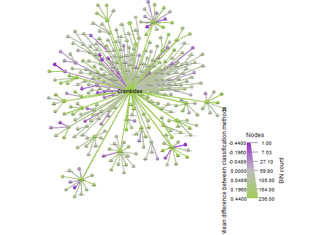<!-- -->

``` r
set.seed(16)#to make sure the figures is always the same
satur_LT %>%
  heat_tree(node_label = taxon_names,
            node_size_range = c(0.01, 0.03),
            edge_size_range = c(0.003, 0.005),
            node_size = n_obs, # n_obs is a function that calculates, in this case, the number of OTUs per taxon
            node_color = mean_diff, # A column from `obj_LT$data$diff_table`
            node_color_interval = c(-.44,.44), # The range of the mean_difference to display
            node_color_range = c("darkorchid", "gray", "darkolivegreen3"), # The color palette used
            node_size_axis_label = "BIN count",
            node_color_axis_label = "Mean difference between classification methods",
            node_label_size_range = c( 0.003, 0.03),
            layout = "davidson-harel", # The primary layout algorithm
            initial_layout = "reingold-tilford",
            output_file = "./07_trad_metabar_parallel_data_files/saturnidae_heattree.pdf") # The layout algorithm that initializes node locations
```

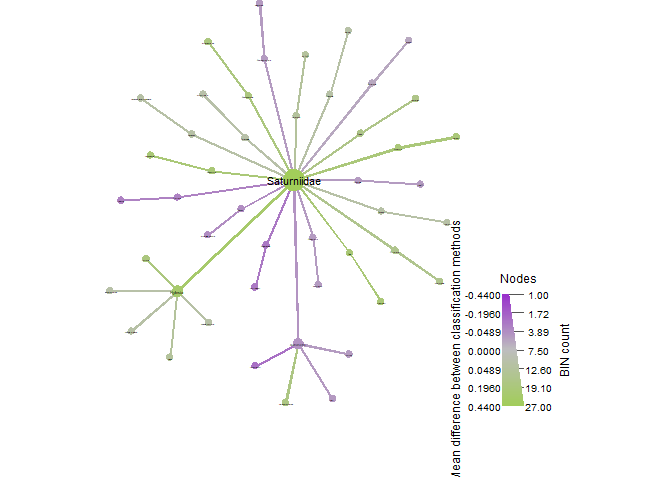<!-- -->

``` r
set.seed(16)#to make sure the figures is always the same
noctuid_LT %>%
  heat_tree(node_label = taxon_names,
            node_size_range = c(0.01, 0.03),
            edge_size_range = c(0.003, 0.005),
            node_size = n_obs, # n_obs is a function that calculates, in this case, the number of OTUs per taxon
            node_color = mean_diff, # A column from `obj_LT$data$diff_table`
            node_color_interval = c(-.44,.44), # The range of the mean_difference to display
            node_color_range = c("darkorchid", "gray", "darkolivegreen3"), # The color palette used
            node_size_axis_label = "BIN count",
            node_color_axis_label = "Mean difference between classification methods",
            node_label_size_range = c( 0.003, 0.03),
            layout = "davidson-harel", # The primary layout algorithm
            initial_layout = "reingold-tilford",
            output_file = "./07_trad_metabar_parallel_data_files/noctuidae_heattree.pdf") # The layout algorithm that initializes node locations
```

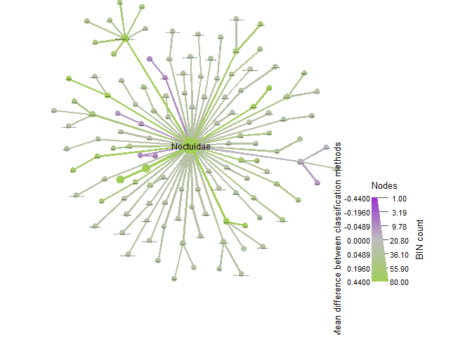<!-- -->

``` r
set.seed(16)#to make sure the figures is always the same
nymph_LT %>%
  heat_tree(node_label = taxon_names,
            node_size_range = c(0.01, 0.03),
            edge_size_range = c(0.003, 0.005),
            node_size = n_obs, # n_obs is a function that calculates, in this case, the number of OTUs per taxon
            node_color = mean_diff, # A column from `obj_LT$data$diff_table`
            node_color_interval = c(-.44,.44), # The range of the mean_difference to display
            node_color_range = c("darkorchid", "gray", "darkolivegreen3"), # The color palette used
            node_size_axis_label = "BIN count",
            node_color_axis_label = "Mean difference between classification methods",
            node_label_size_range = c( 0.003, 0.03),
            layout = "davidson-harel", # The primary layout algorithm
            initial_layout = "reingold-tilford",
            output_file = "./07_trad_metabar_parallel_data_files/nymphalidae_heattree.pdf") # The layout algorithm that initializes node locations
```

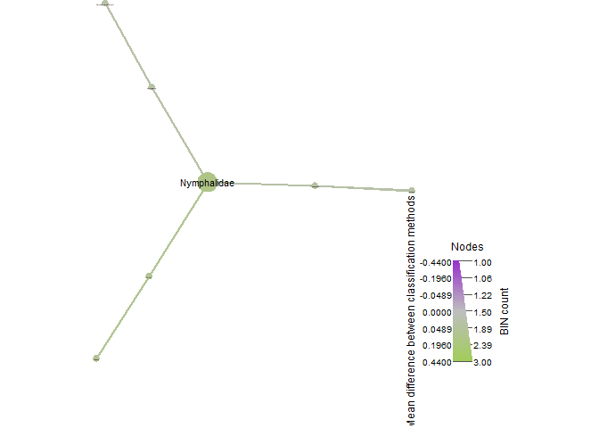<!-- -->

``` r
set.seed(16)#to make sure the figures is always the same
pyra_LT %>%
  heat_tree(node_label = taxon_names,
            node_size_range = c(0.01, 0.03),
            edge_size_range = c(0.003, 0.005),
            node_size = n_obs, # n_obs is a function that calculates, in this case, the number of OTUs per taxon
            node_color = mean_diff, # A column from `obj_LT$data$diff_table`
            node_color_interval = c(-.44,.44), # The range of the mean_difference to display
            node_color_range = c("darkorchid", "gray", "darkolivegreen3"), # The color palette used
            node_size_axis_label = "BIN count",
            node_color_axis_label = "Mean difference between classification methods",
            node_label_size_range = c( 0.003, 0.03),
            layout = "davidson-harel", # The primary layout algorithm
            initial_layout = "reingold-tilford",
            output_file = "./07_trad_metabar_parallel_data_files/pyralidae_heattree.pdf") # The layout algorithm that initializes node locations
```

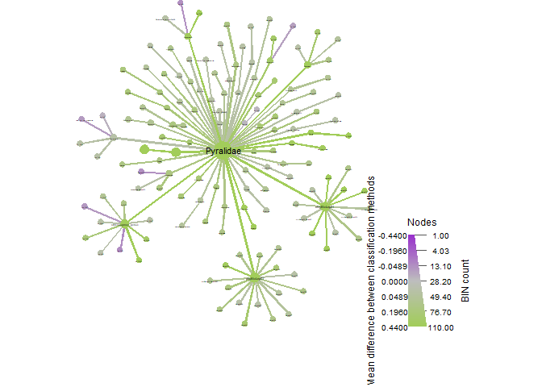<!-- -->

``` r
set.seed(16)#to make sure the figures is always the same
hesp_LT %>%
  heat_tree(node_label = taxon_names,
            node_size_range = c(0.01, 0.03),
            edge_size_range = c(0.003, 0.005),
            node_size = n_obs, # n_obs is a function that calculates, in this case, the number of OTUs per taxon
            node_color = mean_diff, # A column from `obj_LT$data$diff_table`
            node_color_interval = c(-.44,.44), # The range of the mean_difference to display
            node_color_range = c("darkorchid", "gray", "darkolivegreen3"), # The color palette used
            node_size_axis_label = "BIN count",
            node_color_axis_label = "Mean difference between classification methods",
            node_label_size_range = c( 0.003, 0.03),
            layout = "davidson-harel", # The primary layout algorithm
            initial_layout = "reingold-tilford",
            output_file = "./07_trad_metabar_parallel_data_files/hesperiidae_heattree.pdf") # The layout algorithm that initializes node locations
```

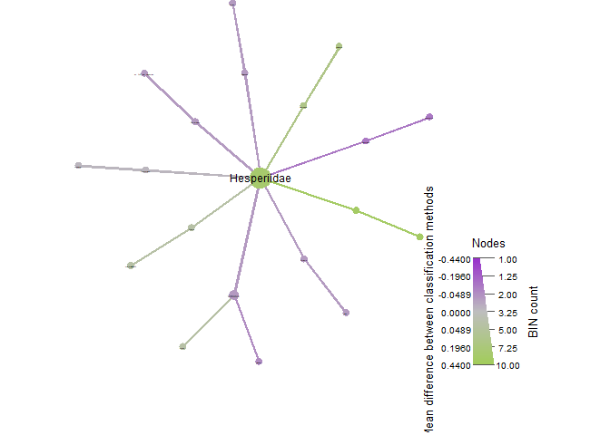<!-- -->

``` r
set.seed(16)#to make sure the figures is always the same
scarab_LT %>%
  heat_tree(node_label = taxon_names,
            node_size_range = c(0.01, 0.03),
            edge_size_range = c(0.003, 0.005),
            node_size = n_obs, # n_obs is a function that calculates, in this case, the number of OTUs per taxon
            node_color = mean_diff, # A column from `obj_LT$data$diff_table`
            node_color_interval = c(-.44,.44), # The range of the mean_difference to display
            node_color_range = c("darkorchid", "gray", "darkolivegreen3"), # The color palette used
            node_size_axis_label = "BIN count",
            node_color_axis_label = "Mean difference between classification methods",
            node_label_size_range = c( 0.003, 0.03),
            layout = "davidson-harel", # The primary layout algorithm
            initial_layout = "reingold-tilford",
            output_file = "./07_trad_metabar_parallel_data_files/scarabs_heattree.pdf") # The layout algorithm that initializes node locations
```

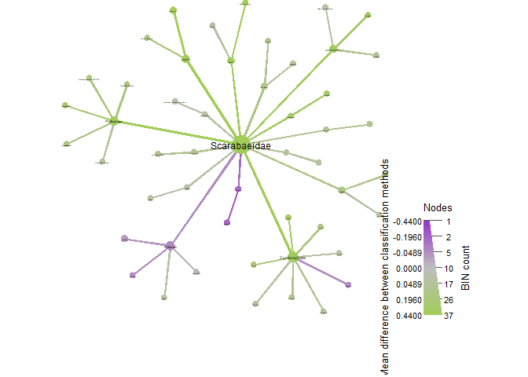<!-- -->

``` r
set.seed(16)#to make sure the figures is always the same
curcu_LT %>%
  heat_tree(node_label = taxon_names,
            node_size_range = c(0.01, 0.03),
            edge_size_range = c(0.003, 0.005),
            node_size = n_obs, # n_obs is a function that calculates, in this case, the number of OTUs per taxon
            node_color = mean_diff, # A column from `obj_LT$data$diff_table`
            node_color_interval = c(-.44,.44), # The range of the mean_difference to display
            node_color_range = c("darkorchid", "gray", "darkolivegreen3"), # The color palette used
            node_size_axis_label = "BIN count",
            node_color_axis_label = "Mean difference between classification methods",
            node_label_size_range = c( 0.003, 0.03),
            layout = "davidson-harel", # The primary layout algorithm
            initial_layout = "reingold-tilford",
            output_file = "./07_trad_metabar_parallel_data_files/curcu_heattree.pdf")
```

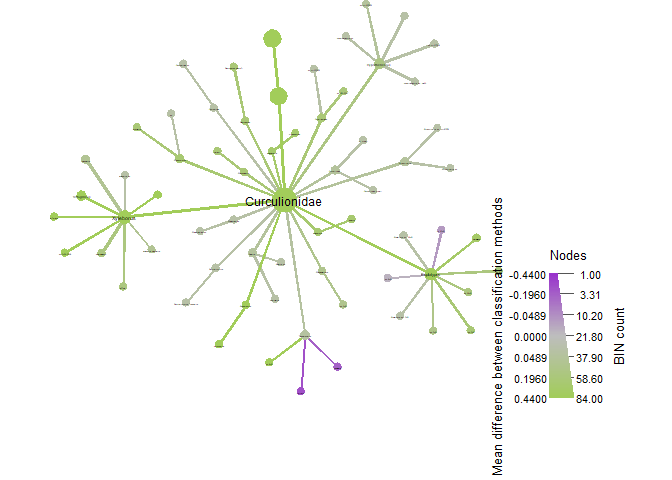<!-- -->

``` r
set.seed(16)#to make sure the figures is always the same
passa_LT %>%
  heat_tree(node_label = taxon_names,
            node_size_range = c(0.01, 0.03),
            edge_size_range = c(0.003, 0.005),
            node_size = n_obs, # n_obs is a function that calculates, in this case, the number of OTUs per taxon
            node_color = mean_diff, # A column from `obj_LT$data$diff_table`
            node_color_interval = c(-.44,.44), # The range of the mean_difference to display
            node_color_range = c("darkorchid", "gray", "darkolivegreen3"), # The color palette used
            node_size_axis_label = "BIN count",
            node_color_axis_label = "Mean difference between classification methods",
            node_label_size_range = c( 0.003, 0.03),
            layout = "davidson-harel", # The primary layout algorithm
            initial_layout = "reingold-tilford",
            output_file = "./07_trad_metabar_parallel_data_files/passalid_heattree.pdf")
```

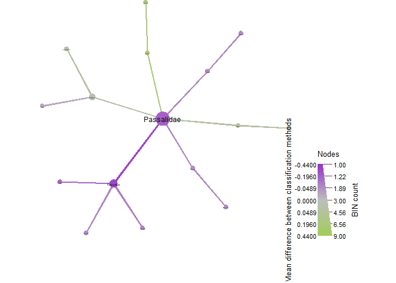<!-- -->

``` r
set.seed(16)#to make sure the figures is always the same
ants_LT %>%
  heat_tree(node_label = taxon_names,
            node_size_range = c(0.01, 0.03),
            edge_size_range = c(0.003, 0.005),
            node_size = n_obs, # n_obs is a function that calculates, in this case, the number of OTUs per taxon
            node_color = mean_diff, # A column from `obj_LT$data$diff_table`
            node_color_interval = c(-.44,.44), # The range of the mean_difference to display
            node_color_range = c("darkorchid", "gray", "darkolivegreen3"), # The color palette used
            node_size_axis_label = "BIN count",
            node_color_axis_label = "Mean difference between classification methods",
            node_label_size_range = c( 0.003, 0.03),
            layout = "davidson-harel", # The primary layout algorithm
            initial_layout = "reingold-tilford",
            output_file = "./07_trad_metabar_parallel_data_files/formicidae_heattree.pdf") # The layout algorithm that initializes node locations
```

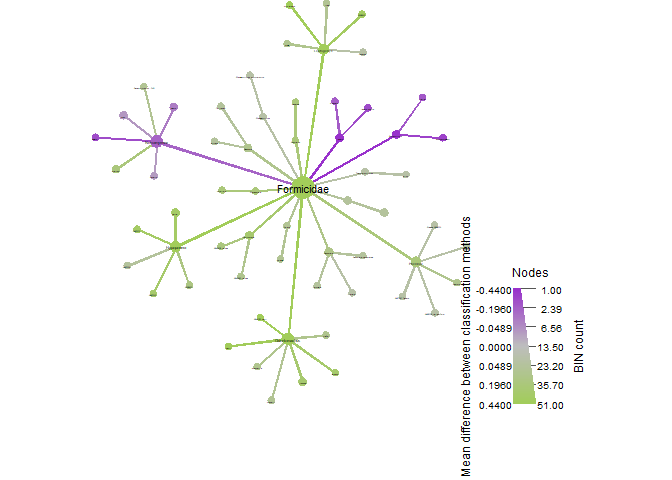<!-- -->

``` r
set.seed(16)#to make sure the figures is always the same
bees_LT %>%
  heat_tree(node_label = taxon_names,
            node_size_range = c(0.01, 0.03),
            edge_size_range = c(0.003, 0.005),
            node_size = n_obs, # n_obs is a function that calculates, in this case, the number of OTUs per taxon
            node_color = mean_diff, # A column from `obj_LT$data$diff_table`
            node_color_interval = c(-.44,.44), # The range of the mean_difference to display
            node_color_range = c("darkorchid", "gray", "darkolivegreen3"), # The color palette used
            node_size_axis_label = "BIN count",
            node_color_axis_label = "Mean difference between classification methods",
            node_label_size_range = c( 0.003, 0.03),
            layout = "davidson-harel", # The primary layout algorithm
            initial_layout = "reingold-tilford",
            output_file = "./07_trad_metabar_parallel_data_files/apidae_heattree.pdf") # The layout algorithm that initializes node locations
```

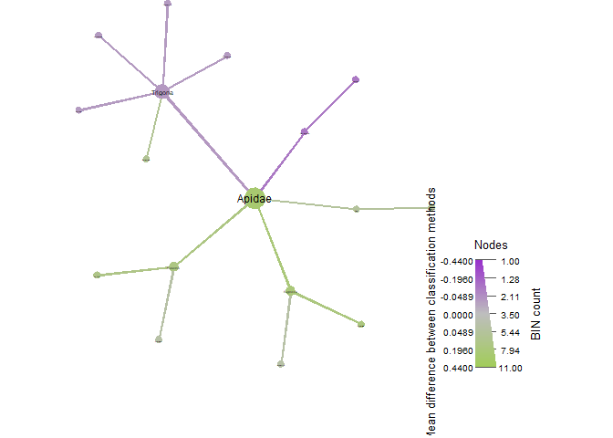<!-- -->

``` r
set.seed(16)#to make sure the figures is always the same
flat_LT %>%
  heat_tree(node_label = taxon_names,
            node_size_range = c(0.01, 0.03),
            edge_size_range = c(0.003, 0.005),
            node_size = n_obs, # n_obs is a function that calculates, in this case, the number of OTUs per taxon
            node_color = mean_diff, # A column from `obj_LT$data$diff_table`
            node_color_interval = c(-.44,.44), # The range of the mean_difference to display
            node_color_range = c("darkolivegreen3", "gray", "darkorchid"), # The color palette used
            node_size_axis_label = "BIN count",
            node_color_axis_label = "Mean difference between classification methods",
            node_label_size_range = c( 0.003, 0.03),
            layout = "davidson-harel", # The primary layout algorithm
            initial_layout = "reingold-tilford",
            output_file = "./07_trad_metabar_parallel_data_files/flatiidae_heattree.pdf") # The layout algorithm that initializes node locations
```

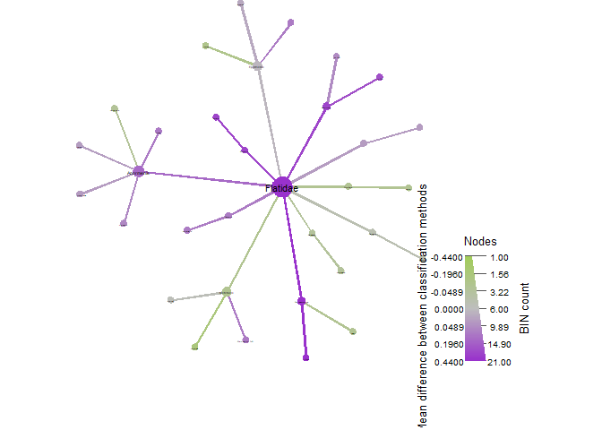<!-- -->

``` r
set.seed(16)#to make sure the figures is always the same
reds_LT %>%
  heat_tree(node_label = taxon_names,
            node_size_range = c(0.01, 0.03),
            edge_size_range = c(0.003, 0.005),
            node_size = n_obs, # n_obs is a function that calculates, in this case, the number of OTUs per taxon
            node_color = mean_diff, # A column from `obj_LT$data$diff_table`
            node_color_interval = c(-.44,.44), # The range of the mean_difference to display
            node_color_range = c("darkolivegreen3", "gray", "darkorchid"), # The color palette used
            node_size_axis_label = "BIN count",
            node_color_axis_label = "Mean difference between classification methods",
            node_label_size_range = c( 0.003, 0.03),
            layout = "davidson-harel", # The primary layout algorithm
            initial_layout = "reingold-tilford",
            output_file = "./07_trad_metabar_parallel_data_files/reduviidae_heattree.pdf") # The layout algorithm that initializes node locations
```

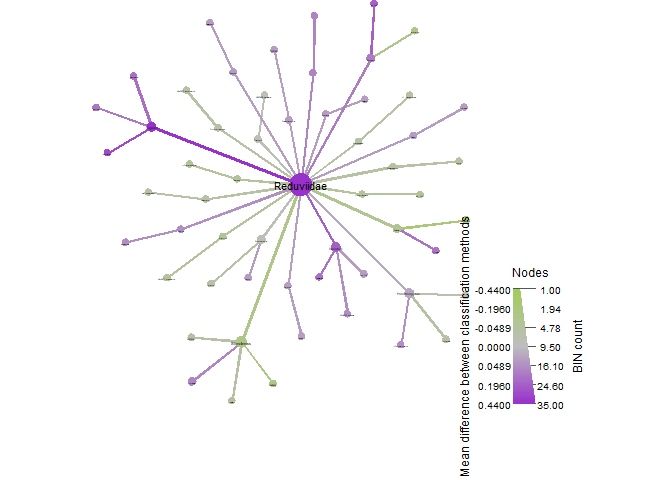<!-- -->

``` r
set.seed(16)#to make sure the figures is always the same
all_termites_LT %>%
  heat_tree(node_label = taxon_names,
            node_size_range = c(0.01, 0.03),
            edge_size_range = c(0.003, 0.005),
            node_size = n_obs, # n_obs is a function that calculates, in this case, the number of OTUs per taxon
            node_color = mean_diff, # A column from `obj_LT$data$diff_table`
            node_color_interval = c(-.44,.44), # The range of the mean_difference to display
            node_color_range = c("darkolivegreen3", "gray", "darkorchid"), # The color palette used
            node_size_axis_label = "BIN count",
            node_color_axis_label = "Mean difference between classification methods",
            node_label_size_range = c( 0.003, 0.03),
            layout = "davidson-harel", # The primary layout algorithm
            initial_layout = "reingold-tilford",
            output_file = "./07_trad_metabar_parallel_data_files/all_termites_heattree.pdf") # The layout algorithm that initializes node locations
```

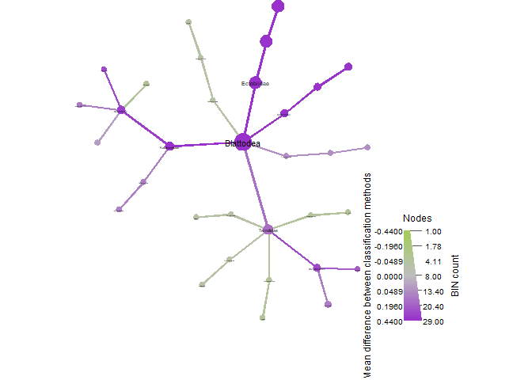<!-- -->

``` r
vennlist_geom <- get_vennlist(obj=ps_geom_LT, factorNames="methodClass")
vennp_geom <- venn.diagram(vennlist_geom,
                      height=5,
                      width=5, 
                      filename=NULL,
                      disable.logging = TRUE,
                      fill=c("darkolivegreen3", "darkorchid"),
                      cat.col=c("darkolivegreen3", "darkorchid"),
                      alpha = 0.85, 
                      fontfamily = "serif",
                      fontface = "bold",
                      cex = 1.2,
                      cat.cex = 1.3,
                      cat.default.pos = "outer",
                      cat.dist=0.1,
                      margin = 0.1, 
                      lwd = 3,
                      lty ='dotted',
                      imagetype = "svg")
```

    ## INFO [2023-02-16 23:30:53] [[1]]
    ## INFO [2023-02-16 23:30:53] vennlist_geom
    ## INFO [2023-02-16 23:30:53] 
    ## INFO [2023-02-16 23:30:53] $height
    ## INFO [2023-02-16 23:30:53] [1] 5
    ## INFO [2023-02-16 23:30:53] 
    ## INFO [2023-02-16 23:30:53] $width
    ## INFO [2023-02-16 23:30:53] [1] 5
    ## INFO [2023-02-16 23:30:53] 
    ## INFO [2023-02-16 23:30:53] $filename
    ## INFO [2023-02-16 23:30:53] NULL
    ## INFO [2023-02-16 23:30:53] 
    ## INFO [2023-02-16 23:30:53] $disable.logging
    ## INFO [2023-02-16 23:30:53] [1] TRUE
    ## INFO [2023-02-16 23:30:53] 
    ## INFO [2023-02-16 23:30:53] $fill
    ## INFO [2023-02-16 23:30:53] c("darkolivegreen3", "darkorchid")
    ## INFO [2023-02-16 23:30:53] 
    ## INFO [2023-02-16 23:30:53] $cat.col
    ## INFO [2023-02-16 23:30:53] c("darkolivegreen3", "darkorchid")
    ## INFO [2023-02-16 23:30:53] 
    ## INFO [2023-02-16 23:30:53] $alpha
    ## INFO [2023-02-16 23:30:53] [1] 0.85
    ## INFO [2023-02-16 23:30:53] 
    ## INFO [2023-02-16 23:30:53] $fontfamily
    ## INFO [2023-02-16 23:30:53] [1] "serif"
    ## INFO [2023-02-16 23:30:53] 
    ## INFO [2023-02-16 23:30:53] $fontface
    ## INFO [2023-02-16 23:30:53] [1] "bold"
    ## INFO [2023-02-16 23:30:53] 
    ## INFO [2023-02-16 23:30:53] $cex
    ## INFO [2023-02-16 23:30:53] [1] 1.2
    ## INFO [2023-02-16 23:30:53] 
    ## INFO [2023-02-16 23:30:53] $cat.cex
    ## INFO [2023-02-16 23:30:53] [1] 1.3
    ## INFO [2023-02-16 23:30:53] 
    ## INFO [2023-02-16 23:30:53] $cat.default.pos
    ## INFO [2023-02-16 23:30:53] [1] "outer"
    ## INFO [2023-02-16 23:30:53] 
    ## INFO [2023-02-16 23:30:53] $cat.dist
    ## INFO [2023-02-16 23:30:53] [1] 0.1
    ## INFO [2023-02-16 23:30:53] 
    ## INFO [2023-02-16 23:30:53] $margin
    ## INFO [2023-02-16 23:30:53] [1] 0.1
    ## INFO [2023-02-16 23:30:53] 
    ## INFO [2023-02-16 23:30:53] $lwd
    ## INFO [2023-02-16 23:30:53] [1] 3
    ## INFO [2023-02-16 23:30:53] 
    ## INFO [2023-02-16 23:30:53] $lty
    ## INFO [2023-02-16 23:30:53] [1] "dotted"
    ## INFO [2023-02-16 23:30:53] 
    ## INFO [2023-02-16 23:30:53] $imagetype
    ## INFO [2023-02-16 23:30:53] [1] "svg"
    ## INFO [2023-02-16 23:30:53]

``` r
vennlist_ereb <- get_vennlist(obj=ps_ereb_LT, factorNames="methodClass")
vennp_ereb <- venn.diagram(vennlist_ereb,
                      height=5,
                      width=5, 
                      filename=NULL,
                      disable.logging = TRUE,
                      fill=c("darkolivegreen3", "darkorchid"),
                      cat.col=c("darkolivegreen3", "darkorchid"),
                      alpha = 0.85, 
                      fontfamily = "serif",
                      fontface = "bold",
                      cex = 1.2,
                      cat.cex = 1.3,
                      cat.default.pos = "outer",
                      cat.dist=0.1,
                      margin = 0.1, 
                      lwd = 3,
                      lty ='dotted',
                      imagetype = "svg")
```

    ## INFO [2023-02-16 23:30:53] [[1]]
    ## INFO [2023-02-16 23:30:53] vennlist_ereb
    ## INFO [2023-02-16 23:30:53] 
    ## INFO [2023-02-16 23:30:53] $height
    ## INFO [2023-02-16 23:30:53] [1] 5
    ## INFO [2023-02-16 23:30:53] 
    ## INFO [2023-02-16 23:30:53] $width
    ## INFO [2023-02-16 23:30:53] [1] 5
    ## INFO [2023-02-16 23:30:53] 
    ## INFO [2023-02-16 23:30:53] $filename
    ## INFO [2023-02-16 23:30:53] NULL
    ## INFO [2023-02-16 23:30:53] 
    ## INFO [2023-02-16 23:30:53] $disable.logging
    ## INFO [2023-02-16 23:30:53] [1] TRUE
    ## INFO [2023-02-16 23:30:53] 
    ## INFO [2023-02-16 23:30:53] $fill
    ## INFO [2023-02-16 23:30:53] c("darkolivegreen3", "darkorchid")
    ## INFO [2023-02-16 23:30:53] 
    ## INFO [2023-02-16 23:30:53] $cat.col
    ## INFO [2023-02-16 23:30:53] c("darkolivegreen3", "darkorchid")
    ## INFO [2023-02-16 23:30:53] 
    ## INFO [2023-02-16 23:30:53] $alpha
    ## INFO [2023-02-16 23:30:53] [1] 0.85
    ## INFO [2023-02-16 23:30:53] 
    ## INFO [2023-02-16 23:30:53] $fontfamily
    ## INFO [2023-02-16 23:30:53] [1] "serif"
    ## INFO [2023-02-16 23:30:53] 
    ## INFO [2023-02-16 23:30:53] $fontface
    ## INFO [2023-02-16 23:30:53] [1] "bold"
    ## INFO [2023-02-16 23:30:53] 
    ## INFO [2023-02-16 23:30:53] $cex
    ## INFO [2023-02-16 23:30:53] [1] 1.2
    ## INFO [2023-02-16 23:30:53] 
    ## INFO [2023-02-16 23:30:53] $cat.cex
    ## INFO [2023-02-16 23:30:53] [1] 1.3
    ## INFO [2023-02-16 23:30:53] 
    ## INFO [2023-02-16 23:30:53] $cat.default.pos
    ## INFO [2023-02-16 23:30:53] [1] "outer"
    ## INFO [2023-02-16 23:30:53] 
    ## INFO [2023-02-16 23:30:53] $cat.dist
    ## INFO [2023-02-16 23:30:53] [1] 0.1
    ## INFO [2023-02-16 23:30:53] 
    ## INFO [2023-02-16 23:30:53] $margin
    ## INFO [2023-02-16 23:30:53] [1] 0.1
    ## INFO [2023-02-16 23:30:53] 
    ## INFO [2023-02-16 23:30:53] $lwd
    ## INFO [2023-02-16 23:30:53] [1] 3
    ## INFO [2023-02-16 23:30:53] 
    ## INFO [2023-02-16 23:30:53] $lty
    ## INFO [2023-02-16 23:30:53] [1] "dotted"
    ## INFO [2023-02-16 23:30:53] 
    ## INFO [2023-02-16 23:30:53] $imagetype
    ## INFO [2023-02-16 23:30:53] [1] "svg"
    ## INFO [2023-02-16 23:30:53]

``` r
vennlist_cramb <- get_vennlist(obj=ps_cramb_LT, factorNames="methodClass")
vennp_cramb <- venn.diagram(vennlist_cramb,
                      height=5,
                      width=5, 
                      filename=NULL,
                      disable.logging = TRUE,
                      fill=c("darkolivegreen3", "darkorchid"),
                      cat.col=c("darkolivegreen3", "darkorchid"),
                      alpha = 0.85, 
                      fontfamily = "serif",
                      fontface = "bold",
                      cex = 1.2,
                      cat.cex = 1.3,
                      cat.default.pos = "outer",
                      cat.dist=0.1,
                      margin = 0.1, 
                      lwd = 3,
                      lty ='dotted',
                      imagetype = "svg")
```

    ## INFO [2023-02-16 23:30:54] [[1]]
    ## INFO [2023-02-16 23:30:54] vennlist_cramb
    ## INFO [2023-02-16 23:30:54] 
    ## INFO [2023-02-16 23:30:54] $height
    ## INFO [2023-02-16 23:30:54] [1] 5
    ## INFO [2023-02-16 23:30:54] 
    ## INFO [2023-02-16 23:30:54] $width
    ## INFO [2023-02-16 23:30:54] [1] 5
    ## INFO [2023-02-16 23:30:54] 
    ## INFO [2023-02-16 23:30:54] $filename
    ## INFO [2023-02-16 23:30:54] NULL
    ## INFO [2023-02-16 23:30:54] 
    ## INFO [2023-02-16 23:30:54] $disable.logging
    ## INFO [2023-02-16 23:30:54] [1] TRUE
    ## INFO [2023-02-16 23:30:54] 
    ## INFO [2023-02-16 23:30:54] $fill
    ## INFO [2023-02-16 23:30:54] c("darkolivegreen3", "darkorchid")
    ## INFO [2023-02-16 23:30:54] 
    ## INFO [2023-02-16 23:30:54] $cat.col
    ## INFO [2023-02-16 23:30:54] c("darkolivegreen3", "darkorchid")
    ## INFO [2023-02-16 23:30:54] 
    ## INFO [2023-02-16 23:30:54] $alpha
    ## INFO [2023-02-16 23:30:54] [1] 0.85
    ## INFO [2023-02-16 23:30:54] 
    ## INFO [2023-02-16 23:30:54] $fontfamily
    ## INFO [2023-02-16 23:30:54] [1] "serif"
    ## INFO [2023-02-16 23:30:54] 
    ## INFO [2023-02-16 23:30:54] $fontface
    ## INFO [2023-02-16 23:30:54] [1] "bold"
    ## INFO [2023-02-16 23:30:54] 
    ## INFO [2023-02-16 23:30:54] $cex
    ## INFO [2023-02-16 23:30:54] [1] 1.2
    ## INFO [2023-02-16 23:30:54] 
    ## INFO [2023-02-16 23:30:54] $cat.cex
    ## INFO [2023-02-16 23:30:54] [1] 1.3
    ## INFO [2023-02-16 23:30:54] 
    ## INFO [2023-02-16 23:30:54] $cat.default.pos
    ## INFO [2023-02-16 23:30:54] [1] "outer"
    ## INFO [2023-02-16 23:30:54] 
    ## INFO [2023-02-16 23:30:54] $cat.dist
    ## INFO [2023-02-16 23:30:54] [1] 0.1
    ## INFO [2023-02-16 23:30:54] 
    ## INFO [2023-02-16 23:30:54] $margin
    ## INFO [2023-02-16 23:30:54] [1] 0.1
    ## INFO [2023-02-16 23:30:54] 
    ## INFO [2023-02-16 23:30:54] $lwd
    ## INFO [2023-02-16 23:30:54] [1] 3
    ## INFO [2023-02-16 23:30:54] 
    ## INFO [2023-02-16 23:30:54] $lty
    ## INFO [2023-02-16 23:30:54] [1] "dotted"
    ## INFO [2023-02-16 23:30:54] 
    ## INFO [2023-02-16 23:30:54] $imagetype
    ## INFO [2023-02-16 23:30:54] [1] "svg"
    ## INFO [2023-02-16 23:30:54]

``` r
#something went wrong with this vennlist where get_vennlist did not create a list so I had to manualy change it
vennlist_satur <- get_vennlist(obj=ps_satur_LT, factorNames="methodClass")
vennlist_satur = split(vennlist_satur, rep(1:ncol(vennlist_satur), each = nrow(vennlist_satur)))
names(vennlist_satur) <- c("metabr", "parallel")
vennp_satur <- venn.diagram(vennlist_satur,
                      height=5,
                      width=5, 
                      filename=NULL,
                      disable.logging = TRUE,
                      fill=c("darkolivegreen3", "darkorchid"),
                      cat.col=c("darkolivegreen3", "darkorchid"),
                      alpha = 0.85, 
                      fontfamily = "serif",
                      fontface = "bold",
                      cex = 1.2,
                      cat.cex = 1.3,
                      cat.default.pos = "outer",
                      cat.dist=0.1,
                      margin = 0.1, 
                      lwd = 3,
                      lty ='dotted',
                      imagetype = "svg")
```

    ## INFO [2023-02-16 23:30:54] [[1]]
    ## INFO [2023-02-16 23:30:54] vennlist_satur
    ## INFO [2023-02-16 23:30:54] 
    ## INFO [2023-02-16 23:30:54] $height
    ## INFO [2023-02-16 23:30:54] [1] 5
    ## INFO [2023-02-16 23:30:54] 
    ## INFO [2023-02-16 23:30:54] $width
    ## INFO [2023-02-16 23:30:54] [1] 5
    ## INFO [2023-02-16 23:30:54] 
    ## INFO [2023-02-16 23:30:54] $filename
    ## INFO [2023-02-16 23:30:54] NULL
    ## INFO [2023-02-16 23:30:54] 
    ## INFO [2023-02-16 23:30:54] $disable.logging
    ## INFO [2023-02-16 23:30:54] [1] TRUE
    ## INFO [2023-02-16 23:30:54] 
    ## INFO [2023-02-16 23:30:54] $fill
    ## INFO [2023-02-16 23:30:54] c("darkolivegreen3", "darkorchid")
    ## INFO [2023-02-16 23:30:54] 
    ## INFO [2023-02-16 23:30:54] $cat.col
    ## INFO [2023-02-16 23:30:54] c("darkolivegreen3", "darkorchid")
    ## INFO [2023-02-16 23:30:54] 
    ## INFO [2023-02-16 23:30:54] $alpha
    ## INFO [2023-02-16 23:30:54] [1] 0.85
    ## INFO [2023-02-16 23:30:54] 
    ## INFO [2023-02-16 23:30:54] $fontfamily
    ## INFO [2023-02-16 23:30:54] [1] "serif"
    ## INFO [2023-02-16 23:30:54] 
    ## INFO [2023-02-16 23:30:54] $fontface
    ## INFO [2023-02-16 23:30:54] [1] "bold"
    ## INFO [2023-02-16 23:30:54] 
    ## INFO [2023-02-16 23:30:54] $cex
    ## INFO [2023-02-16 23:30:54] [1] 1.2
    ## INFO [2023-02-16 23:30:54] 
    ## INFO [2023-02-16 23:30:54] $cat.cex
    ## INFO [2023-02-16 23:30:54] [1] 1.3
    ## INFO [2023-02-16 23:30:54] 
    ## INFO [2023-02-16 23:30:54] $cat.default.pos
    ## INFO [2023-02-16 23:30:54] [1] "outer"
    ## INFO [2023-02-16 23:30:54] 
    ## INFO [2023-02-16 23:30:54] $cat.dist
    ## INFO [2023-02-16 23:30:54] [1] 0.1
    ## INFO [2023-02-16 23:30:54] 
    ## INFO [2023-02-16 23:30:54] $margin
    ## INFO [2023-02-16 23:30:54] [1] 0.1
    ## INFO [2023-02-16 23:30:54] 
    ## INFO [2023-02-16 23:30:54] $lwd
    ## INFO [2023-02-16 23:30:54] [1] 3
    ## INFO [2023-02-16 23:30:54] 
    ## INFO [2023-02-16 23:30:54] $lty
    ## INFO [2023-02-16 23:30:54] [1] "dotted"
    ## INFO [2023-02-16 23:30:54] 
    ## INFO [2023-02-16 23:30:54] $imagetype
    ## INFO [2023-02-16 23:30:54] [1] "svg"
    ## INFO [2023-02-16 23:30:54]

``` r
vennlist_noctuid <- get_vennlist(obj=ps_noctuid_LT, factorNames="methodClass")
vennp_noctuid <- venn.diagram(vennlist_noctuid,
                      height=5,
                      width=5, 
                      filename=NULL,
                      disable.logging = TRUE,
                      fill=c("darkolivegreen3", "darkorchid"),
                      cat.col=c("darkolivegreen3", "darkorchid"),
                      alpha = 0.85, 
                      fontfamily = "serif",
                      fontface = "bold",
                      cex = 1.2,
                      cat.cex = 1.3,
                      cat.default.pos = "outer",
                      cat.dist=0.1,
                      margin = 0.1, 
                      lwd = 3,
                      lty ='dotted',
                      imagetype = "svg")
```

    ## INFO [2023-02-16 23:30:54] [[1]]
    ## INFO [2023-02-16 23:30:54] vennlist_noctuid
    ## INFO [2023-02-16 23:30:54] 
    ## INFO [2023-02-16 23:30:54] $height
    ## INFO [2023-02-16 23:30:54] [1] 5
    ## INFO [2023-02-16 23:30:54] 
    ## INFO [2023-02-16 23:30:54] $width
    ## INFO [2023-02-16 23:30:54] [1] 5
    ## INFO [2023-02-16 23:30:54] 
    ## INFO [2023-02-16 23:30:54] $filename
    ## INFO [2023-02-16 23:30:54] NULL
    ## INFO [2023-02-16 23:30:54] 
    ## INFO [2023-02-16 23:30:54] $disable.logging
    ## INFO [2023-02-16 23:30:54] [1] TRUE
    ## INFO [2023-02-16 23:30:54] 
    ## INFO [2023-02-16 23:30:54] $fill
    ## INFO [2023-02-16 23:30:54] c("darkolivegreen3", "darkorchid")
    ## INFO [2023-02-16 23:30:54] 
    ## INFO [2023-02-16 23:30:54] $cat.col
    ## INFO [2023-02-16 23:30:54] c("darkolivegreen3", "darkorchid")
    ## INFO [2023-02-16 23:30:54] 
    ## INFO [2023-02-16 23:30:54] $alpha
    ## INFO [2023-02-16 23:30:54] [1] 0.85
    ## INFO [2023-02-16 23:30:54] 
    ## INFO [2023-02-16 23:30:54] $fontfamily
    ## INFO [2023-02-16 23:30:54] [1] "serif"
    ## INFO [2023-02-16 23:30:54] 
    ## INFO [2023-02-16 23:30:54] $fontface
    ## INFO [2023-02-16 23:30:54] [1] "bold"
    ## INFO [2023-02-16 23:30:54] 
    ## INFO [2023-02-16 23:30:54] $cex
    ## INFO [2023-02-16 23:30:54] [1] 1.2
    ## INFO [2023-02-16 23:30:54] 
    ## INFO [2023-02-16 23:30:54] $cat.cex
    ## INFO [2023-02-16 23:30:54] [1] 1.3
    ## INFO [2023-02-16 23:30:54] 
    ## INFO [2023-02-16 23:30:54] $cat.default.pos
    ## INFO [2023-02-16 23:30:54] [1] "outer"
    ## INFO [2023-02-16 23:30:54] 
    ## INFO [2023-02-16 23:30:54] $cat.dist
    ## INFO [2023-02-16 23:30:54] [1] 0.1
    ## INFO [2023-02-16 23:30:54] 
    ## INFO [2023-02-16 23:30:54] $margin
    ## INFO [2023-02-16 23:30:54] [1] 0.1
    ## INFO [2023-02-16 23:30:54] 
    ## INFO [2023-02-16 23:30:54] $lwd
    ## INFO [2023-02-16 23:30:54] [1] 3
    ## INFO [2023-02-16 23:30:54] 
    ## INFO [2023-02-16 23:30:54] $lty
    ## INFO [2023-02-16 23:30:54] [1] "dotted"
    ## INFO [2023-02-16 23:30:54] 
    ## INFO [2023-02-16 23:30:54] $imagetype
    ## INFO [2023-02-16 23:30:54] [1] "svg"
    ## INFO [2023-02-16 23:30:54]

``` r
vennlist_nymph <- get_vennlist(obj=ps_nymph_LT, factorNames="methodClass")
vennp_nymph <- venn.diagram(vennlist_nymph,
                      height=5,
                      width=5, 
                      filename=NULL,
                      disable.logging = TRUE,
                      fill=c("darkolivegreen3", "darkorchid"),
                      cat.col=c("darkolivegreen3", "darkorchid"),
                      alpha = 0.85, 
                      fontfamily = "serif",
                      fontface = "bold",
                      cex = 1.2,
                      cat.cex = 1.3,
                      cat.default.pos = "outer",
                      cat.dist=0.1,
                      margin = 0.1, 
                      lwd = 3,
                      lty ='dotted',
                      imagetype = "svg")
```

    ## INFO [2023-02-16 23:30:54] [[1]]
    ## INFO [2023-02-16 23:30:54] vennlist_nymph
    ## INFO [2023-02-16 23:30:54] 
    ## INFO [2023-02-16 23:30:54] $height
    ## INFO [2023-02-16 23:30:54] [1] 5
    ## INFO [2023-02-16 23:30:54] 
    ## INFO [2023-02-16 23:30:54] $width
    ## INFO [2023-02-16 23:30:54] [1] 5
    ## INFO [2023-02-16 23:30:54] 
    ## INFO [2023-02-16 23:30:54] $filename
    ## INFO [2023-02-16 23:30:54] NULL
    ## INFO [2023-02-16 23:30:54] 
    ## INFO [2023-02-16 23:30:54] $disable.logging
    ## INFO [2023-02-16 23:30:54] [1] TRUE
    ## INFO [2023-02-16 23:30:54] 
    ## INFO [2023-02-16 23:30:54] $fill
    ## INFO [2023-02-16 23:30:54] c("darkolivegreen3", "darkorchid")
    ## INFO [2023-02-16 23:30:54] 
    ## INFO [2023-02-16 23:30:54] $cat.col
    ## INFO [2023-02-16 23:30:54] c("darkolivegreen3", "darkorchid")
    ## INFO [2023-02-16 23:30:54] 
    ## INFO [2023-02-16 23:30:54] $alpha
    ## INFO [2023-02-16 23:30:54] [1] 0.85
    ## INFO [2023-02-16 23:30:54] 
    ## INFO [2023-02-16 23:30:54] $fontfamily
    ## INFO [2023-02-16 23:30:54] [1] "serif"
    ## INFO [2023-02-16 23:30:54] 
    ## INFO [2023-02-16 23:30:54] $fontface
    ## INFO [2023-02-16 23:30:54] [1] "bold"
    ## INFO [2023-02-16 23:30:54] 
    ## INFO [2023-02-16 23:30:54] $cex
    ## INFO [2023-02-16 23:30:54] [1] 1.2
    ## INFO [2023-02-16 23:30:54] 
    ## INFO [2023-02-16 23:30:54] $cat.cex
    ## INFO [2023-02-16 23:30:54] [1] 1.3
    ## INFO [2023-02-16 23:30:54] 
    ## INFO [2023-02-16 23:30:54] $cat.default.pos
    ## INFO [2023-02-16 23:30:54] [1] "outer"
    ## INFO [2023-02-16 23:30:54] 
    ## INFO [2023-02-16 23:30:54] $cat.dist
    ## INFO [2023-02-16 23:30:54] [1] 0.1
    ## INFO [2023-02-16 23:30:54] 
    ## INFO [2023-02-16 23:30:54] $margin
    ## INFO [2023-02-16 23:30:54] [1] 0.1
    ## INFO [2023-02-16 23:30:54] 
    ## INFO [2023-02-16 23:30:54] $lwd
    ## INFO [2023-02-16 23:30:54] [1] 3
    ## INFO [2023-02-16 23:30:54] 
    ## INFO [2023-02-16 23:30:54] $lty
    ## INFO [2023-02-16 23:30:54] [1] "dotted"
    ## INFO [2023-02-16 23:30:54] 
    ## INFO [2023-02-16 23:30:54] $imagetype
    ## INFO [2023-02-16 23:30:54] [1] "svg"
    ## INFO [2023-02-16 23:30:54]

``` r
vennlist_pyra <- get_vennlist(obj=ps_pyra_LT, factorNames="methodClass")
vennp_pyra <- venn.diagram(vennlist_pyra,
                      height=5,
                      width=5, 
                      filename=NULL,
                      disable.logging = TRUE,
                      fill=c("darkolivegreen3", "darkorchid"),
                      cat.col=c("darkolivegreen3", "darkorchid"),
                      alpha = 0.85, 
                      fontfamily = "serif",
                      fontface = "bold",
                      cex = 1.2,
                      cat.cex = 1.3,
                      cat.default.pos = "outer",
                      cat.dist=0.1,
                      margin = 0.1, 
                      lwd = 3,
                      lty ='dotted',
                      imagetype = "svg")
```

    ## INFO [2023-02-16 23:30:54] [[1]]
    ## INFO [2023-02-16 23:30:54] vennlist_pyra
    ## INFO [2023-02-16 23:30:54] 
    ## INFO [2023-02-16 23:30:54] $height
    ## INFO [2023-02-16 23:30:54] [1] 5
    ## INFO [2023-02-16 23:30:54] 
    ## INFO [2023-02-16 23:30:54] $width
    ## INFO [2023-02-16 23:30:54] [1] 5
    ## INFO [2023-02-16 23:30:54] 
    ## INFO [2023-02-16 23:30:54] $filename
    ## INFO [2023-02-16 23:30:54] NULL
    ## INFO [2023-02-16 23:30:54] 
    ## INFO [2023-02-16 23:30:54] $disable.logging
    ## INFO [2023-02-16 23:30:54] [1] TRUE
    ## INFO [2023-02-16 23:30:54] 
    ## INFO [2023-02-16 23:30:54] $fill
    ## INFO [2023-02-16 23:30:54] c("darkolivegreen3", "darkorchid")
    ## INFO [2023-02-16 23:30:54] 
    ## INFO [2023-02-16 23:30:54] $cat.col
    ## INFO [2023-02-16 23:30:54] c("darkolivegreen3", "darkorchid")
    ## INFO [2023-02-16 23:30:54] 
    ## INFO [2023-02-16 23:30:54] $alpha
    ## INFO [2023-02-16 23:30:54] [1] 0.85
    ## INFO [2023-02-16 23:30:54] 
    ## INFO [2023-02-16 23:30:54] $fontfamily
    ## INFO [2023-02-16 23:30:54] [1] "serif"
    ## INFO [2023-02-16 23:30:54] 
    ## INFO [2023-02-16 23:30:54] $fontface
    ## INFO [2023-02-16 23:30:54] [1] "bold"
    ## INFO [2023-02-16 23:30:54] 
    ## INFO [2023-02-16 23:30:54] $cex
    ## INFO [2023-02-16 23:30:54] [1] 1.2
    ## INFO [2023-02-16 23:30:54] 
    ## INFO [2023-02-16 23:30:54] $cat.cex
    ## INFO [2023-02-16 23:30:54] [1] 1.3
    ## INFO [2023-02-16 23:30:54] 
    ## INFO [2023-02-16 23:30:54] $cat.default.pos
    ## INFO [2023-02-16 23:30:54] [1] "outer"
    ## INFO [2023-02-16 23:30:54] 
    ## INFO [2023-02-16 23:30:54] $cat.dist
    ## INFO [2023-02-16 23:30:54] [1] 0.1
    ## INFO [2023-02-16 23:30:54] 
    ## INFO [2023-02-16 23:30:54] $margin
    ## INFO [2023-02-16 23:30:54] [1] 0.1
    ## INFO [2023-02-16 23:30:54] 
    ## INFO [2023-02-16 23:30:54] $lwd
    ## INFO [2023-02-16 23:30:54] [1] 3
    ## INFO [2023-02-16 23:30:54] 
    ## INFO [2023-02-16 23:30:54] $lty
    ## INFO [2023-02-16 23:30:54] [1] "dotted"
    ## INFO [2023-02-16 23:30:54] 
    ## INFO [2023-02-16 23:30:54] $imagetype
    ## INFO [2023-02-16 23:30:54] [1] "svg"
    ## INFO [2023-02-16 23:30:54]

``` r
vennlist_hesp <- get_vennlist(obj=ps_hesp_LT, factorNames="methodClass")
vennp_hesp <- venn.diagram(vennlist_hesp,
                      height=5,
                      width=5, 
                      filename=NULL,
                      disable.logging = TRUE,
                      fill=c("darkolivegreen3", "darkorchid"),
                      cat.col=c("darkolivegreen3", "darkorchid"),
                      alpha = 0.85, 
                      fontfamily = "serif",
                      fontface = "bold",
                      cex = 1.2,
                      cat.cex = 1.3,
                      cat.default.pos = "outer",
                      cat.dist=0.1,
                      margin = 0.1, 
                      lwd = 3,
                      lty ='dotted',
                      imagetype = "svg")
```

    ## INFO [2023-02-16 23:30:55] [[1]]
    ## INFO [2023-02-16 23:30:55] vennlist_hesp
    ## INFO [2023-02-16 23:30:55] 
    ## INFO [2023-02-16 23:30:55] $height
    ## INFO [2023-02-16 23:30:55] [1] 5
    ## INFO [2023-02-16 23:30:55] 
    ## INFO [2023-02-16 23:30:55] $width
    ## INFO [2023-02-16 23:30:55] [1] 5
    ## INFO [2023-02-16 23:30:55] 
    ## INFO [2023-02-16 23:30:55] $filename
    ## INFO [2023-02-16 23:30:55] NULL
    ## INFO [2023-02-16 23:30:55] 
    ## INFO [2023-02-16 23:30:55] $disable.logging
    ## INFO [2023-02-16 23:30:55] [1] TRUE
    ## INFO [2023-02-16 23:30:55] 
    ## INFO [2023-02-16 23:30:55] $fill
    ## INFO [2023-02-16 23:30:55] c("darkolivegreen3", "darkorchid")
    ## INFO [2023-02-16 23:30:55] 
    ## INFO [2023-02-16 23:30:55] $cat.col
    ## INFO [2023-02-16 23:30:55] c("darkolivegreen3", "darkorchid")
    ## INFO [2023-02-16 23:30:55] 
    ## INFO [2023-02-16 23:30:55] $alpha
    ## INFO [2023-02-16 23:30:55] [1] 0.85
    ## INFO [2023-02-16 23:30:55] 
    ## INFO [2023-02-16 23:30:55] $fontfamily
    ## INFO [2023-02-16 23:30:55] [1] "serif"
    ## INFO [2023-02-16 23:30:55] 
    ## INFO [2023-02-16 23:30:55] $fontface
    ## INFO [2023-02-16 23:30:55] [1] "bold"
    ## INFO [2023-02-16 23:30:55] 
    ## INFO [2023-02-16 23:30:55] $cex
    ## INFO [2023-02-16 23:30:55] [1] 1.2
    ## INFO [2023-02-16 23:30:55] 
    ## INFO [2023-02-16 23:30:55] $cat.cex
    ## INFO [2023-02-16 23:30:55] [1] 1.3
    ## INFO [2023-02-16 23:30:55] 
    ## INFO [2023-02-16 23:30:55] $cat.default.pos
    ## INFO [2023-02-16 23:30:55] [1] "outer"
    ## INFO [2023-02-16 23:30:55] 
    ## INFO [2023-02-16 23:30:55] $cat.dist
    ## INFO [2023-02-16 23:30:55] [1] 0.1
    ## INFO [2023-02-16 23:30:55] 
    ## INFO [2023-02-16 23:30:55] $margin
    ## INFO [2023-02-16 23:30:55] [1] 0.1
    ## INFO [2023-02-16 23:30:55] 
    ## INFO [2023-02-16 23:30:55] $lwd
    ## INFO [2023-02-16 23:30:55] [1] 3
    ## INFO [2023-02-16 23:30:55] 
    ## INFO [2023-02-16 23:30:55] $lty
    ## INFO [2023-02-16 23:30:55] [1] "dotted"
    ## INFO [2023-02-16 23:30:55] 
    ## INFO [2023-02-16 23:30:55] $imagetype
    ## INFO [2023-02-16 23:30:55] [1] "svg"
    ## INFO [2023-02-16 23:30:55]

``` r
vennlist_scarab <- get_vennlist(obj=ps_scarab_LT, factorNames="methodClass")
vennp_scarab <- venn.diagram(vennlist_scarab,
                      height=5,
                      width=5, 
                      filename=NULL,
                      disable.logging = TRUE,
                      fill=c("darkolivegreen3", "darkorchid"),
                      cat.col=c("darkolivegreen3", "darkorchid"),
                      alpha = 0.85, 
                      fontfamily = "serif",
                      fontface = "bold",
                      cex = 1.2,
                      cat.cex = 1.3,
                      cat.default.pos = "outer",
                      cat.dist=0.1,
                      margin = 0.1, 
                      lwd = 3,
                      lty ='dotted',
                      imagetype = "svg")
```

    ## INFO [2023-02-16 23:30:55] [[1]]
    ## INFO [2023-02-16 23:30:55] vennlist_scarab
    ## INFO [2023-02-16 23:30:55] 
    ## INFO [2023-02-16 23:30:55] $height
    ## INFO [2023-02-16 23:30:55] [1] 5
    ## INFO [2023-02-16 23:30:55] 
    ## INFO [2023-02-16 23:30:55] $width
    ## INFO [2023-02-16 23:30:55] [1] 5
    ## INFO [2023-02-16 23:30:55] 
    ## INFO [2023-02-16 23:30:55] $filename
    ## INFO [2023-02-16 23:30:55] NULL
    ## INFO [2023-02-16 23:30:55] 
    ## INFO [2023-02-16 23:30:55] $disable.logging
    ## INFO [2023-02-16 23:30:55] [1] TRUE
    ## INFO [2023-02-16 23:30:55] 
    ## INFO [2023-02-16 23:30:55] $fill
    ## INFO [2023-02-16 23:30:55] c("darkolivegreen3", "darkorchid")
    ## INFO [2023-02-16 23:30:55] 
    ## INFO [2023-02-16 23:30:55] $cat.col
    ## INFO [2023-02-16 23:30:55] c("darkolivegreen3", "darkorchid")
    ## INFO [2023-02-16 23:30:55] 
    ## INFO [2023-02-16 23:30:55] $alpha
    ## INFO [2023-02-16 23:30:55] [1] 0.85
    ## INFO [2023-02-16 23:30:55] 
    ## INFO [2023-02-16 23:30:55] $fontfamily
    ## INFO [2023-02-16 23:30:55] [1] "serif"
    ## INFO [2023-02-16 23:30:55] 
    ## INFO [2023-02-16 23:30:55] $fontface
    ## INFO [2023-02-16 23:30:55] [1] "bold"
    ## INFO [2023-02-16 23:30:55] 
    ## INFO [2023-02-16 23:30:55] $cex
    ## INFO [2023-02-16 23:30:55] [1] 1.2
    ## INFO [2023-02-16 23:30:55] 
    ## INFO [2023-02-16 23:30:55] $cat.cex
    ## INFO [2023-02-16 23:30:55] [1] 1.3
    ## INFO [2023-02-16 23:30:55] 
    ## INFO [2023-02-16 23:30:55] $cat.default.pos
    ## INFO [2023-02-16 23:30:55] [1] "outer"
    ## INFO [2023-02-16 23:30:55] 
    ## INFO [2023-02-16 23:30:55] $cat.dist
    ## INFO [2023-02-16 23:30:55] [1] 0.1
    ## INFO [2023-02-16 23:30:55] 
    ## INFO [2023-02-16 23:30:55] $margin
    ## INFO [2023-02-16 23:30:55] [1] 0.1
    ## INFO [2023-02-16 23:30:55] 
    ## INFO [2023-02-16 23:30:55] $lwd
    ## INFO [2023-02-16 23:30:55] [1] 3
    ## INFO [2023-02-16 23:30:55] 
    ## INFO [2023-02-16 23:30:55] $lty
    ## INFO [2023-02-16 23:30:55] [1] "dotted"
    ## INFO [2023-02-16 23:30:55] 
    ## INFO [2023-02-16 23:30:55] $imagetype
    ## INFO [2023-02-16 23:30:55] [1] "svg"
    ## INFO [2023-02-16 23:30:55]

``` r
vennlist_curcu <- get_vennlist(obj=ps_curcu_LT, factorNames="methodClass")
vennp_curcu <- venn.diagram(vennlist_curcu,
                      height=5,
                      width=5, 
                      filename=NULL,
                      disable.logging = TRUE,
                      fill=c("darkolivegreen3", "darkorchid"),
                      cat.col=c("darkolivegreen3", "darkorchid"),
                      alpha = 0.85, 
                      fontfamily = "serif",
                      fontface = "bold",
                      cex = 1.2,
                      cat.cex = 1.3,
                      cat.default.pos = "outer",
                      cat.dist=0.1,
                      margin = 0.1, 
                      lwd = 3,
                      lty ='dotted',
                      imagetype = "svg")
```

    ## INFO [2023-02-16 23:30:55] [[1]]
    ## INFO [2023-02-16 23:30:55] vennlist_curcu
    ## INFO [2023-02-16 23:30:55] 
    ## INFO [2023-02-16 23:30:55] $height
    ## INFO [2023-02-16 23:30:55] [1] 5
    ## INFO [2023-02-16 23:30:55] 
    ## INFO [2023-02-16 23:30:55] $width
    ## INFO [2023-02-16 23:30:55] [1] 5
    ## INFO [2023-02-16 23:30:55] 
    ## INFO [2023-02-16 23:30:55] $filename
    ## INFO [2023-02-16 23:30:55] NULL
    ## INFO [2023-02-16 23:30:55] 
    ## INFO [2023-02-16 23:30:55] $disable.logging
    ## INFO [2023-02-16 23:30:55] [1] TRUE
    ## INFO [2023-02-16 23:30:55] 
    ## INFO [2023-02-16 23:30:55] $fill
    ## INFO [2023-02-16 23:30:55] c("darkolivegreen3", "darkorchid")
    ## INFO [2023-02-16 23:30:55] 
    ## INFO [2023-02-16 23:30:55] $cat.col
    ## INFO [2023-02-16 23:30:55] c("darkolivegreen3", "darkorchid")
    ## INFO [2023-02-16 23:30:55] 
    ## INFO [2023-02-16 23:30:55] $alpha
    ## INFO [2023-02-16 23:30:55] [1] 0.85
    ## INFO [2023-02-16 23:30:55] 
    ## INFO [2023-02-16 23:30:55] $fontfamily
    ## INFO [2023-02-16 23:30:55] [1] "serif"
    ## INFO [2023-02-16 23:30:55] 
    ## INFO [2023-02-16 23:30:55] $fontface
    ## INFO [2023-02-16 23:30:55] [1] "bold"
    ## INFO [2023-02-16 23:30:55] 
    ## INFO [2023-02-16 23:30:55] $cex
    ## INFO [2023-02-16 23:30:55] [1] 1.2
    ## INFO [2023-02-16 23:30:55] 
    ## INFO [2023-02-16 23:30:55] $cat.cex
    ## INFO [2023-02-16 23:30:55] [1] 1.3
    ## INFO [2023-02-16 23:30:55] 
    ## INFO [2023-02-16 23:30:55] $cat.default.pos
    ## INFO [2023-02-16 23:30:55] [1] "outer"
    ## INFO [2023-02-16 23:30:55] 
    ## INFO [2023-02-16 23:30:55] $cat.dist
    ## INFO [2023-02-16 23:30:55] [1] 0.1
    ## INFO [2023-02-16 23:30:55] 
    ## INFO [2023-02-16 23:30:55] $margin
    ## INFO [2023-02-16 23:30:55] [1] 0.1
    ## INFO [2023-02-16 23:30:55] 
    ## INFO [2023-02-16 23:30:55] $lwd
    ## INFO [2023-02-16 23:30:55] [1] 3
    ## INFO [2023-02-16 23:30:55] 
    ## INFO [2023-02-16 23:30:55] $lty
    ## INFO [2023-02-16 23:30:55] [1] "dotted"
    ## INFO [2023-02-16 23:30:55] 
    ## INFO [2023-02-16 23:30:55] $imagetype
    ## INFO [2023-02-16 23:30:55] [1] "svg"
    ## INFO [2023-02-16 23:30:55]

``` r
vennlist_passa <- get_vennlist(obj=ps_passa_LT, factorNames="methodClass")
vennp_passa <- venn.diagram(vennlist_passa,
                      height=5,
                      width=5, 
                      filename=NULL,
                      disable.logging = TRUE,
                      fill=c("darkolivegreen3", "darkorchid"),
                      cat.col=c("darkolivegreen3", "darkorchid"),
                      alpha = 0.85, 
                      fontfamily = "serif",
                      fontface = "bold",
                      cex = 1.2,
                      cat.cex = 1.3,
                      cat.default.pos = "outer",
                      cat.dist=0.1,
                      margin = 0.1, 
                      lwd = 3,
                      lty ='dotted',
                      imagetype = "svg")
```

    ## INFO [2023-02-16 23:30:55] [[1]]
    ## INFO [2023-02-16 23:30:55] vennlist_passa
    ## INFO [2023-02-16 23:30:55] 
    ## INFO [2023-02-16 23:30:55] $height
    ## INFO [2023-02-16 23:30:55] [1] 5
    ## INFO [2023-02-16 23:30:55] 
    ## INFO [2023-02-16 23:30:55] $width
    ## INFO [2023-02-16 23:30:55] [1] 5
    ## INFO [2023-02-16 23:30:55] 
    ## INFO [2023-02-16 23:30:55] $filename
    ## INFO [2023-02-16 23:30:55] NULL
    ## INFO [2023-02-16 23:30:55] 
    ## INFO [2023-02-16 23:30:55] $disable.logging
    ## INFO [2023-02-16 23:30:55] [1] TRUE
    ## INFO [2023-02-16 23:30:55] 
    ## INFO [2023-02-16 23:30:55] $fill
    ## INFO [2023-02-16 23:30:55] c("darkolivegreen3", "darkorchid")
    ## INFO [2023-02-16 23:30:55] 
    ## INFO [2023-02-16 23:30:55] $cat.col
    ## INFO [2023-02-16 23:30:55] c("darkolivegreen3", "darkorchid")
    ## INFO [2023-02-16 23:30:55] 
    ## INFO [2023-02-16 23:30:55] $alpha
    ## INFO [2023-02-16 23:30:55] [1] 0.85
    ## INFO [2023-02-16 23:30:55] 
    ## INFO [2023-02-16 23:30:55] $fontfamily
    ## INFO [2023-02-16 23:30:55] [1] "serif"
    ## INFO [2023-02-16 23:30:55] 
    ## INFO [2023-02-16 23:30:55] $fontface
    ## INFO [2023-02-16 23:30:55] [1] "bold"
    ## INFO [2023-02-16 23:30:55] 
    ## INFO [2023-02-16 23:30:55] $cex
    ## INFO [2023-02-16 23:30:55] [1] 1.2
    ## INFO [2023-02-16 23:30:55] 
    ## INFO [2023-02-16 23:30:55] $cat.cex
    ## INFO [2023-02-16 23:30:55] [1] 1.3
    ## INFO [2023-02-16 23:30:55] 
    ## INFO [2023-02-16 23:30:55] $cat.default.pos
    ## INFO [2023-02-16 23:30:55] [1] "outer"
    ## INFO [2023-02-16 23:30:55] 
    ## INFO [2023-02-16 23:30:55] $cat.dist
    ## INFO [2023-02-16 23:30:55] [1] 0.1
    ## INFO [2023-02-16 23:30:55] 
    ## INFO [2023-02-16 23:30:55] $margin
    ## INFO [2023-02-16 23:30:55] [1] 0.1
    ## INFO [2023-02-16 23:30:55] 
    ## INFO [2023-02-16 23:30:55] $lwd
    ## INFO [2023-02-16 23:30:55] [1] 3
    ## INFO [2023-02-16 23:30:55] 
    ## INFO [2023-02-16 23:30:55] $lty
    ## INFO [2023-02-16 23:30:55] [1] "dotted"
    ## INFO [2023-02-16 23:30:55] 
    ## INFO [2023-02-16 23:30:55] $imagetype
    ## INFO [2023-02-16 23:30:55] [1] "svg"
    ## INFO [2023-02-16 23:30:55]

``` r
vennlist_ants <- get_vennlist(obj=ps_ants_LT, factorNames="methodClass")
vennp_ants <- venn.diagram(vennlist_ants,
                      height=5,
                      width=5, 
                      filename=NULL,
                      disable.logging = TRUE,
                      fill=c("darkolivegreen3", "darkorchid"),
                      cat.col=c("darkolivegreen3", "darkorchid"),
                      alpha = 0.85, 
                      fontfamily = "serif",
                      fontface = "bold",
                      cex = 1.2,
                      cat.cex = 1.3,
                      cat.default.pos = "outer",
                      cat.dist=0.1,
                      margin = 0.1, 
                      lwd = 3,
                      lty ='dotted',
                      imagetype = "svg")
```

    ## INFO [2023-02-16 23:30:55] [[1]]
    ## INFO [2023-02-16 23:30:55] vennlist_ants
    ## INFO [2023-02-16 23:30:55] 
    ## INFO [2023-02-16 23:30:55] $height
    ## INFO [2023-02-16 23:30:55] [1] 5
    ## INFO [2023-02-16 23:30:55] 
    ## INFO [2023-02-16 23:30:55] $width
    ## INFO [2023-02-16 23:30:55] [1] 5
    ## INFO [2023-02-16 23:30:55] 
    ## INFO [2023-02-16 23:30:55] $filename
    ## INFO [2023-02-16 23:30:55] NULL
    ## INFO [2023-02-16 23:30:55] 
    ## INFO [2023-02-16 23:30:55] $disable.logging
    ## INFO [2023-02-16 23:30:55] [1] TRUE
    ## INFO [2023-02-16 23:30:55] 
    ## INFO [2023-02-16 23:30:55] $fill
    ## INFO [2023-02-16 23:30:55] c("darkolivegreen3", "darkorchid")
    ## INFO [2023-02-16 23:30:55] 
    ## INFO [2023-02-16 23:30:55] $cat.col
    ## INFO [2023-02-16 23:30:55] c("darkolivegreen3", "darkorchid")
    ## INFO [2023-02-16 23:30:55] 
    ## INFO [2023-02-16 23:30:55] $alpha
    ## INFO [2023-02-16 23:30:55] [1] 0.85
    ## INFO [2023-02-16 23:30:55] 
    ## INFO [2023-02-16 23:30:55] $fontfamily
    ## INFO [2023-02-16 23:30:55] [1] "serif"
    ## INFO [2023-02-16 23:30:55] 
    ## INFO [2023-02-16 23:30:55] $fontface
    ## INFO [2023-02-16 23:30:55] [1] "bold"
    ## INFO [2023-02-16 23:30:55] 
    ## INFO [2023-02-16 23:30:55] $cex
    ## INFO [2023-02-16 23:30:55] [1] 1.2
    ## INFO [2023-02-16 23:30:55] 
    ## INFO [2023-02-16 23:30:55] $cat.cex
    ## INFO [2023-02-16 23:30:55] [1] 1.3
    ## INFO [2023-02-16 23:30:55] 
    ## INFO [2023-02-16 23:30:55] $cat.default.pos
    ## INFO [2023-02-16 23:30:55] [1] "outer"
    ## INFO [2023-02-16 23:30:55] 
    ## INFO [2023-02-16 23:30:55] $cat.dist
    ## INFO [2023-02-16 23:30:55] [1] 0.1
    ## INFO [2023-02-16 23:30:55] 
    ## INFO [2023-02-16 23:30:55] $margin
    ## INFO [2023-02-16 23:30:55] [1] 0.1
    ## INFO [2023-02-16 23:30:55] 
    ## INFO [2023-02-16 23:30:55] $lwd
    ## INFO [2023-02-16 23:30:55] [1] 3
    ## INFO [2023-02-16 23:30:55] 
    ## INFO [2023-02-16 23:30:55] $lty
    ## INFO [2023-02-16 23:30:55] [1] "dotted"
    ## INFO [2023-02-16 23:30:55] 
    ## INFO [2023-02-16 23:30:55] $imagetype
    ## INFO [2023-02-16 23:30:55] [1] "svg"
    ## INFO [2023-02-16 23:30:55]

``` r
vennlist_bees <- get_vennlist(obj=ps_bees_LT, factorNames="methodClass")
vennlist_bees = split(vennlist_bees, rep(1:ncol(vennlist_bees), each = nrow(vennlist_bees)))
names(vennlist_bees) <- c("metabr", "parallel")

vennp_bees <- venn.diagram(vennlist_bees,
                      height=5,
                      width=5, 
                      filename=NULL,
                      disable.logging = TRUE,
                      fill=c("darkolivegreen3", "darkorchid"),
                      cat.col=c("darkolivegreen3", "darkorchid"),
                      alpha = 0.85, 
                      fontfamily = "serif",
                      fontface = "bold",
                      cex = 1.2,
                      cat.cex = 1.3,
                      cat.default.pos = "outer",
                      cat.dist=0.1,
                      margin = 0.1, 
                      lwd = 3,
                      lty ='dotted',
                      imagetype = "svg")
```

    ## INFO [2023-02-16 23:30:55] [[1]]
    ## INFO [2023-02-16 23:30:55] vennlist_bees
    ## INFO [2023-02-16 23:30:55] 
    ## INFO [2023-02-16 23:30:55] $height
    ## INFO [2023-02-16 23:30:55] [1] 5
    ## INFO [2023-02-16 23:30:55] 
    ## INFO [2023-02-16 23:30:55] $width
    ## INFO [2023-02-16 23:30:55] [1] 5
    ## INFO [2023-02-16 23:30:55] 
    ## INFO [2023-02-16 23:30:55] $filename
    ## INFO [2023-02-16 23:30:55] NULL
    ## INFO [2023-02-16 23:30:55] 
    ## INFO [2023-02-16 23:30:55] $disable.logging
    ## INFO [2023-02-16 23:30:55] [1] TRUE
    ## INFO [2023-02-16 23:30:55] 
    ## INFO [2023-02-16 23:30:55] $fill
    ## INFO [2023-02-16 23:30:55] c("darkolivegreen3", "darkorchid")
    ## INFO [2023-02-16 23:30:55] 
    ## INFO [2023-02-16 23:30:55] $cat.col
    ## INFO [2023-02-16 23:30:55] c("darkolivegreen3", "darkorchid")
    ## INFO [2023-02-16 23:30:55] 
    ## INFO [2023-02-16 23:30:55] $alpha
    ## INFO [2023-02-16 23:30:55] [1] 0.85
    ## INFO [2023-02-16 23:30:55] 
    ## INFO [2023-02-16 23:30:55] $fontfamily
    ## INFO [2023-02-16 23:30:55] [1] "serif"
    ## INFO [2023-02-16 23:30:55] 
    ## INFO [2023-02-16 23:30:55] $fontface
    ## INFO [2023-02-16 23:30:55] [1] "bold"
    ## INFO [2023-02-16 23:30:55] 
    ## INFO [2023-02-16 23:30:55] $cex
    ## INFO [2023-02-16 23:30:55] [1] 1.2
    ## INFO [2023-02-16 23:30:55] 
    ## INFO [2023-02-16 23:30:55] $cat.cex
    ## INFO [2023-02-16 23:30:55] [1] 1.3
    ## INFO [2023-02-16 23:30:55] 
    ## INFO [2023-02-16 23:30:55] $cat.default.pos
    ## INFO [2023-02-16 23:30:55] [1] "outer"
    ## INFO [2023-02-16 23:30:55] 
    ## INFO [2023-02-16 23:30:55] $cat.dist
    ## INFO [2023-02-16 23:30:55] [1] 0.1
    ## INFO [2023-02-16 23:30:55] 
    ## INFO [2023-02-16 23:30:55] $margin
    ## INFO [2023-02-16 23:30:55] [1] 0.1
    ## INFO [2023-02-16 23:30:55] 
    ## INFO [2023-02-16 23:30:55] $lwd
    ## INFO [2023-02-16 23:30:55] [1] 3
    ## INFO [2023-02-16 23:30:55] 
    ## INFO [2023-02-16 23:30:55] $lty
    ## INFO [2023-02-16 23:30:55] [1] "dotted"
    ## INFO [2023-02-16 23:30:55] 
    ## INFO [2023-02-16 23:30:55] $imagetype
    ## INFO [2023-02-16 23:30:55] [1] "svg"
    ## INFO [2023-02-16 23:30:55]

``` r
vennlist_flat <- get_vennlist(obj=ps_flat_LT, factorNames="methodClass")
vennp_flat <- venn.diagram(vennlist_flat,
                      height=5,
                      width=5, 
                      filename=NULL,
                      disable.logging = TRUE,
                      fill=c("darkolivegreen3", "darkorchid"),
                      cat.col=c("darkolivegreen3", "darkorchid"),
                      alpha = 0.85, 
                      fontfamily = "serif",
                      fontface = "bold",
                      cex = 1.2,
                      cat.cex = 1.3,
                      cat.default.pos = "outer",
                      cat.dist=0.1,
                      margin = 0.1, 
                      lwd = 3,
                      lty ='dotted',
                      imagetype = "svg")
```

    ## INFO [2023-02-16 23:30:56] [[1]]
    ## INFO [2023-02-16 23:30:56] vennlist_flat
    ## INFO [2023-02-16 23:30:56] 
    ## INFO [2023-02-16 23:30:56] $height
    ## INFO [2023-02-16 23:30:56] [1] 5
    ## INFO [2023-02-16 23:30:56] 
    ## INFO [2023-02-16 23:30:56] $width
    ## INFO [2023-02-16 23:30:56] [1] 5
    ## INFO [2023-02-16 23:30:56] 
    ## INFO [2023-02-16 23:30:56] $filename
    ## INFO [2023-02-16 23:30:56] NULL
    ## INFO [2023-02-16 23:30:56] 
    ## INFO [2023-02-16 23:30:56] $disable.logging
    ## INFO [2023-02-16 23:30:56] [1] TRUE
    ## INFO [2023-02-16 23:30:56] 
    ## INFO [2023-02-16 23:30:56] $fill
    ## INFO [2023-02-16 23:30:56] c("darkolivegreen3", "darkorchid")
    ## INFO [2023-02-16 23:30:56] 
    ## INFO [2023-02-16 23:30:56] $cat.col
    ## INFO [2023-02-16 23:30:56] c("darkolivegreen3", "darkorchid")
    ## INFO [2023-02-16 23:30:56] 
    ## INFO [2023-02-16 23:30:56] $alpha
    ## INFO [2023-02-16 23:30:56] [1] 0.85
    ## INFO [2023-02-16 23:30:56] 
    ## INFO [2023-02-16 23:30:56] $fontfamily
    ## INFO [2023-02-16 23:30:56] [1] "serif"
    ## INFO [2023-02-16 23:30:56] 
    ## INFO [2023-02-16 23:30:56] $fontface
    ## INFO [2023-02-16 23:30:56] [1] "bold"
    ## INFO [2023-02-16 23:30:56] 
    ## INFO [2023-02-16 23:30:56] $cex
    ## INFO [2023-02-16 23:30:56] [1] 1.2
    ## INFO [2023-02-16 23:30:56] 
    ## INFO [2023-02-16 23:30:56] $cat.cex
    ## INFO [2023-02-16 23:30:56] [1] 1.3
    ## INFO [2023-02-16 23:30:56] 
    ## INFO [2023-02-16 23:30:56] $cat.default.pos
    ## INFO [2023-02-16 23:30:56] [1] "outer"
    ## INFO [2023-02-16 23:30:56] 
    ## INFO [2023-02-16 23:30:56] $cat.dist
    ## INFO [2023-02-16 23:30:56] [1] 0.1
    ## INFO [2023-02-16 23:30:56] 
    ## INFO [2023-02-16 23:30:56] $margin
    ## INFO [2023-02-16 23:30:56] [1] 0.1
    ## INFO [2023-02-16 23:30:56] 
    ## INFO [2023-02-16 23:30:56] $lwd
    ## INFO [2023-02-16 23:30:56] [1] 3
    ## INFO [2023-02-16 23:30:56] 
    ## INFO [2023-02-16 23:30:56] $lty
    ## INFO [2023-02-16 23:30:56] [1] "dotted"
    ## INFO [2023-02-16 23:30:56] 
    ## INFO [2023-02-16 23:30:56] $imagetype
    ## INFO [2023-02-16 23:30:56] [1] "svg"
    ## INFO [2023-02-16 23:30:56]

``` r
vennlist_reds <- get_vennlist(obj=ps_reds_LT, factorNames="methodClass")
vennp_reds <- venn.diagram(vennlist_reds,
                      height=5,
                      width=5, 
                      filename=NULL,
                      disable.logging = TRUE,
                      fill=c("darkolivegreen3", "darkorchid"),
                      cat.col=c("darkolivegreen3", "darkorchid"),
                      alpha = 0.85, 
                      fontfamily = "serif",
                      fontface = "bold",
                      cex = 1.2,
                      cat.cex = 1.3,
                      cat.default.pos = "outer",
                      cat.dist=0.1,
                      margin = 0.1, 
                      lwd = 3,
                      lty ='dotted',
                      imagetype = "svg")
```

    ## INFO [2023-02-16 23:30:56] [[1]]
    ## INFO [2023-02-16 23:30:56] vennlist_reds
    ## INFO [2023-02-16 23:30:56] 
    ## INFO [2023-02-16 23:30:56] $height
    ## INFO [2023-02-16 23:30:56] [1] 5
    ## INFO [2023-02-16 23:30:56] 
    ## INFO [2023-02-16 23:30:56] $width
    ## INFO [2023-02-16 23:30:56] [1] 5
    ## INFO [2023-02-16 23:30:56] 
    ## INFO [2023-02-16 23:30:56] $filename
    ## INFO [2023-02-16 23:30:56] NULL
    ## INFO [2023-02-16 23:30:56] 
    ## INFO [2023-02-16 23:30:56] $disable.logging
    ## INFO [2023-02-16 23:30:56] [1] TRUE
    ## INFO [2023-02-16 23:30:56] 
    ## INFO [2023-02-16 23:30:56] $fill
    ## INFO [2023-02-16 23:30:56] c("darkolivegreen3", "darkorchid")
    ## INFO [2023-02-16 23:30:56] 
    ## INFO [2023-02-16 23:30:56] $cat.col
    ## INFO [2023-02-16 23:30:56] c("darkolivegreen3", "darkorchid")
    ## INFO [2023-02-16 23:30:56] 
    ## INFO [2023-02-16 23:30:56] $alpha
    ## INFO [2023-02-16 23:30:56] [1] 0.85
    ## INFO [2023-02-16 23:30:56] 
    ## INFO [2023-02-16 23:30:56] $fontfamily
    ## INFO [2023-02-16 23:30:56] [1] "serif"
    ## INFO [2023-02-16 23:30:56] 
    ## INFO [2023-02-16 23:30:56] $fontface
    ## INFO [2023-02-16 23:30:56] [1] "bold"
    ## INFO [2023-02-16 23:30:56] 
    ## INFO [2023-02-16 23:30:56] $cex
    ## INFO [2023-02-16 23:30:56] [1] 1.2
    ## INFO [2023-02-16 23:30:56] 
    ## INFO [2023-02-16 23:30:56] $cat.cex
    ## INFO [2023-02-16 23:30:56] [1] 1.3
    ## INFO [2023-02-16 23:30:56] 
    ## INFO [2023-02-16 23:30:56] $cat.default.pos
    ## INFO [2023-02-16 23:30:56] [1] "outer"
    ## INFO [2023-02-16 23:30:56] 
    ## INFO [2023-02-16 23:30:56] $cat.dist
    ## INFO [2023-02-16 23:30:56] [1] 0.1
    ## INFO [2023-02-16 23:30:56] 
    ## INFO [2023-02-16 23:30:56] $margin
    ## INFO [2023-02-16 23:30:56] [1] 0.1
    ## INFO [2023-02-16 23:30:56] 
    ## INFO [2023-02-16 23:30:56] $lwd
    ## INFO [2023-02-16 23:30:56] [1] 3
    ## INFO [2023-02-16 23:30:56] 
    ## INFO [2023-02-16 23:30:56] $lty
    ## INFO [2023-02-16 23:30:56] [1] "dotted"
    ## INFO [2023-02-16 23:30:56] 
    ## INFO [2023-02-16 23:30:56] $imagetype
    ## INFO [2023-02-16 23:30:56] [1] "svg"
    ## INFO [2023-02-16 23:30:56]

``` r
vennlist_all_termites <- get_vennlist(obj=ps_all_termites_LT, factorNames="methodClass")
vennp_all_termites <- venn.diagram(vennlist_all_termites,
                      height=5,
                      width=5, 
                      filename=NULL,
                      disable.logging = TRUE,
                      fill=c("darkolivegreen3", "darkorchid"),
                      cat.col=c("darkolivegreen3", "darkorchid"),
                      alpha = 0.85, 
                      fontfamily = "serif",
                      fontface = "bold",
                      cex = 1.2,
                      cat.cex = 1.3,
                      cat.default.pos = "outer",
                      cat.dist=0.1,
                      margin = 0.1, 
                      lwd = 3,
                      lty ='dotted',
                      imagetype = "svg")
```

    ## INFO [2023-02-16 23:30:56] [[1]]
    ## INFO [2023-02-16 23:30:56] vennlist_all_termites
    ## INFO [2023-02-16 23:30:56] 
    ## INFO [2023-02-16 23:30:56] $height
    ## INFO [2023-02-16 23:30:56] [1] 5
    ## INFO [2023-02-16 23:30:56] 
    ## INFO [2023-02-16 23:30:56] $width
    ## INFO [2023-02-16 23:30:56] [1] 5
    ## INFO [2023-02-16 23:30:56] 
    ## INFO [2023-02-16 23:30:56] $filename
    ## INFO [2023-02-16 23:30:56] NULL
    ## INFO [2023-02-16 23:30:56] 
    ## INFO [2023-02-16 23:30:56] $disable.logging
    ## INFO [2023-02-16 23:30:56] [1] TRUE
    ## INFO [2023-02-16 23:30:56] 
    ## INFO [2023-02-16 23:30:56] $fill
    ## INFO [2023-02-16 23:30:56] c("darkolivegreen3", "darkorchid")
    ## INFO [2023-02-16 23:30:56] 
    ## INFO [2023-02-16 23:30:56] $cat.col
    ## INFO [2023-02-16 23:30:56] c("darkolivegreen3", "darkorchid")
    ## INFO [2023-02-16 23:30:56] 
    ## INFO [2023-02-16 23:30:56] $alpha
    ## INFO [2023-02-16 23:30:56] [1] 0.85
    ## INFO [2023-02-16 23:30:56] 
    ## INFO [2023-02-16 23:30:56] $fontfamily
    ## INFO [2023-02-16 23:30:56] [1] "serif"
    ## INFO [2023-02-16 23:30:56] 
    ## INFO [2023-02-16 23:30:56] $fontface
    ## INFO [2023-02-16 23:30:56] [1] "bold"
    ## INFO [2023-02-16 23:30:56] 
    ## INFO [2023-02-16 23:30:56] $cex
    ## INFO [2023-02-16 23:30:56] [1] 1.2
    ## INFO [2023-02-16 23:30:56] 
    ## INFO [2023-02-16 23:30:56] $cat.cex
    ## INFO [2023-02-16 23:30:56] [1] 1.3
    ## INFO [2023-02-16 23:30:56] 
    ## INFO [2023-02-16 23:30:56] $cat.default.pos
    ## INFO [2023-02-16 23:30:56] [1] "outer"
    ## INFO [2023-02-16 23:30:56] 
    ## INFO [2023-02-16 23:30:56] $cat.dist
    ## INFO [2023-02-16 23:30:56] [1] 0.1
    ## INFO [2023-02-16 23:30:56] 
    ## INFO [2023-02-16 23:30:56] $margin
    ## INFO [2023-02-16 23:30:56] [1] 0.1
    ## INFO [2023-02-16 23:30:56] 
    ## INFO [2023-02-16 23:30:56] $lwd
    ## INFO [2023-02-16 23:30:56] [1] 3
    ## INFO [2023-02-16 23:30:56] 
    ## INFO [2023-02-16 23:30:56] $lty
    ## INFO [2023-02-16 23:30:56] [1] "dotted"
    ## INFO [2023-02-16 23:30:56] 
    ## INFO [2023-02-16 23:30:56] $imagetype
    ## INFO [2023-02-16 23:30:56] [1] "svg"
    ## INFO [2023-02-16 23:30:56]

``` r
dev.off()
```

    ## null device 
    ##           1

``` r
grid::grid.draw(vennp_geom)
ggsave("./07_trad_metabar_parallel_data_files/venn_geom.pdf", vennp_geom)
```

    ## Saving 7 x 7 in image

``` r
dev.off()
```

    ## null device 
    ##           1

``` r
grid::grid.draw(vennp_ereb)
ggsave("./07_trad_metabar_parallel_data_files/venn_erebidae.pdf", vennp_ereb)
```

    ## Saving 7 x 7 in image

``` r
dev.off()
```

    ## null device 
    ##           1

``` r
grid::grid.draw(vennp_cramb)
ggsave("./07_trad_metabar_parallel_data_files/venn_crabidae.pdf", vennp_cramb)
```

    ## Saving 7 x 7 in image

``` r
dev.off()
```

    ## null device 
    ##           1

``` r
grid::grid.draw(vennp_satur)
ggsave("./07_trad_metabar_parallel_data_files/venn_saturnidae.pdf", vennp_satur)
```

    ## Saving 7 x 7 in image

``` r
dev.off()
```

    ## null device 
    ##           1

``` r
grid::grid.draw(vennp_noctuid)
ggsave("./07_trad_metabar_parallel_data_files/venn_noctuidae.pdf", vennp_noctuid)
```

    ## Saving 7 x 7 in image

``` r
dev.off()
```

    ## null device 
    ##           1

``` r
grid::grid.draw(vennp_nymph)
ggsave("./07_trad_metabar_parallel_data_files/venn_nymphalidae.pdf", vennp_nymph)
```

    ## Saving 7 x 7 in image

``` r
dev.off()
```

    ## null device 
    ##           1

``` r
grid::grid.draw(vennp_pyra)
ggsave("./07_trad_metabar_parallel_data_files/venn_pyraliidae.pdf", vennp_pyra)
```

    ## Saving 7 x 7 in image

``` r
dev.off()
```

    ## null device 
    ##           1

``` r
grid::grid.draw(vennp_hesp)
ggsave("./07_trad_metabar_parallel_data_files/venn_hesperiidae.pdf", vennp_hesp)
```

    ## Saving 7 x 7 in image

``` r
dev.off()
```

    ## null device 
    ##           1

``` r
grid::grid.draw(vennp_scarab)
ggsave("./07_trad_metabar_parallel_data_files/venn_scarabididae.pdf", vennp_scarab)
```

    ## Saving 7 x 7 in image

``` r
dev.off()
```

    ## null device 
    ##           1

``` r
grid::grid.draw(vennp_curcu)
ggsave("./07_trad_metabar_parallel_data_files/venn_curculionidae.pdf", vennp_curcu)
```

    ## Saving 7 x 7 in image

``` r
dev.off()
```

    ## null device 
    ##           1

``` r
grid::grid.draw(vennp_passa)
ggsave("./07_trad_metabar_parallel_data_files/venn_passalidae.pdf", vennp_passa)
```

    ## Saving 7 x 7 in image

``` r
dev.off()
```

    ## null device 
    ##           1

``` r
grid::grid.draw(vennp_ants)
ggsave("./07_trad_metabar_parallel_data_files/venn_formicidae.pdf", vennp_ants)
```

    ## Saving 7 x 7 in image

``` r
dev.off()
```

    ## null device 
    ##           1

``` r
grid::grid.draw(vennp_bees)
ggsave("./07_trad_metabar_parallel_data_files/venn_apidae.pdf", vennp_bees)
```

    ## Saving 7 x 7 in image

``` r
dev.off()
```

    ## null device 
    ##           1

``` r
grid::grid.draw(vennp_flat)
ggsave("./07_trad_metabar_parallel_data_files/venn_flatidae.pdf", vennp_flat)
```

    ## Saving 7 x 7 in image

``` r
dev.off()
```

    ## null device 
    ##           1

``` r
grid::grid.draw(vennp_reds)
ggsave("./07_trad_metabar_parallel_data_files/venn_reduviidae.pdf", vennp_reds)
```

    ## Saving 7 x 7 in image

``` r
dev.off()
```

    ## null device 
    ##           1

``` r
grid::grid.draw(vennp_all_termites)
ggsave("./07_trad_metabar_parallel_data_files/venn_all_termites.pdf", vennp_all_termites)
```

    ## Saving 7 x 7 in image

``` r
obj_all <- parse_tax_data(tradmetabrparallel,
                      class_cols = "classification",
                      class_sep = ";",
                      class_regex = "^([a-z]{0,1})_{0,2}(.*)$",
                      class_key = c("tax_rank" = "taxon_rank", "name" = "taxon_name"))
sample_LT <- filter(sample, method == "LT")

obj_all$data$tax_data <- obj_all$data$tax_data[c("taxon_id","bold_bin", "classification", sample_LT$sampleID)] #filters dataset to inlcude only samples within sample_parallel - e.g. only the samples which where collected in parallel. Metabarcoding and trad MAY2019 and MAR2021

no_reads <- rowSums(obj_all$data$tax_data[, sample_LT$sampleID]) == 0 #check for zeroes after filtering always. Otherwise we get bad results
sum(no_reads) #in this case theree is no zeroes, which is good, but we should always check
```

    ## [1] 926

``` r
obj_all <- filter_obs(obj_all, data = "tax_data", ! no_reads, drop_taxa = TRUE) 
obj_all$data$tax_table <- calc_taxon_abund(obj_all, data = "tax_data", cols = sample_LT$sampleID)
```

    ## Summing per-taxon counts from 154 columns for 4708 taxa

``` r
obj_all$data$tax_props <- calc_obs_props(obj_all, "tax_data", cols= sample_LT$sampleID, other_cols = TRUE)
```

    ## Calculating proportions from counts for 154 columns for 5238 observations.

    ## Warning: The following columns will be replaced in the output:
    ##    ARM1AWET, BAL1AWET ... LT_ZET1_MAR2021_A_REP

``` r
obj_all$data$diff_table <- compare_groups(obj_all, data = "tax_table",
                                      cols = sample_LT$sampleID,
                                      groups = sample_LT$methodClass)
```

    ## Warning in wilcox.test.default(abund_1, abund_2): cannot compute exact p-value
    ## with ties

    ## Warning in wilcox.test.default(abund_1, abund_2): cannot compute exact p-value
    ## with ties

    ## Warning in wilcox.test.default(abund_1, abund_2): cannot compute exact p-value
    ## with ties

    ## Warning in wilcox.test.default(abund_1, abund_2): cannot compute exact p-value
    ## with ties

    ## Warning in wilcox.test.default(abund_1, abund_2): cannot compute exact p-value
    ## with ties

    ## Warning in wilcox.test.default(abund_1, abund_2): cannot compute exact p-value
    ## with ties

    ## Warning in wilcox.test.default(abund_1, abund_2): cannot compute exact p-value
    ## with ties

    ## Warning in wilcox.test.default(abund_1, abund_2): cannot compute exact p-value
    ## with ties

    ## Warning in wilcox.test.default(abund_1, abund_2): cannot compute exact p-value
    ## with ties

    ## Warning in wilcox.test.default(abund_1, abund_2): cannot compute exact p-value
    ## with ties

    ## Warning in wilcox.test.default(abund_1, abund_2): cannot compute exact p-value
    ## with ties

    ## Warning in wilcox.test.default(abund_1, abund_2): cannot compute exact p-value
    ## with ties

    ## Warning in wilcox.test.default(abund_1, abund_2): cannot compute exact p-value
    ## with ties

    ## Warning in wilcox.test.default(abund_1, abund_2): cannot compute exact p-value
    ## with ties

    ## Warning in wilcox.test.default(abund_1, abund_2): cannot compute exact p-value
    ## with ties

    ## Warning in wilcox.test.default(abund_1, abund_2): cannot compute exact p-value
    ## with ties

    ## Warning in wilcox.test.default(abund_1, abund_2): cannot compute exact p-value
    ## with ties

    ## Warning in wilcox.test.default(abund_1, abund_2): cannot compute exact p-value
    ## with ties

    ## Warning in wilcox.test.default(abund_1, abund_2): cannot compute exact p-value
    ## with ties

    ## Warning in wilcox.test.default(abund_1, abund_2): cannot compute exact p-value
    ## with ties

    ## Warning in wilcox.test.default(abund_1, abund_2): cannot compute exact p-value
    ## with ties

    ## Warning in wilcox.test.default(abund_1, abund_2): cannot compute exact p-value
    ## with ties

    ## Warning in wilcox.test.default(abund_1, abund_2): cannot compute exact p-value
    ## with ties

    ## Warning in wilcox.test.default(abund_1, abund_2): cannot compute exact p-value
    ## with ties

    ## Warning in wilcox.test.default(abund_1, abund_2): cannot compute exact p-value
    ## with ties

    ## Warning in wilcox.test.default(abund_1, abund_2): cannot compute exact p-value
    ## with ties

    ## Warning in wilcox.test.default(abund_1, abund_2): cannot compute exact p-value
    ## with ties

    ## Warning in wilcox.test.default(abund_1, abund_2): cannot compute exact p-value
    ## with ties

    ## Warning in wilcox.test.default(abund_1, abund_2): cannot compute exact p-value
    ## with ties

    ## Warning in wilcox.test.default(abund_1, abund_2): cannot compute exact p-value
    ## with ties

    ## Warning in wilcox.test.default(abund_1, abund_2): cannot compute exact p-value
    ## with ties

    ## Warning in wilcox.test.default(abund_1, abund_2): cannot compute exact p-value
    ## with ties

    ## Warning in wilcox.test.default(abund_1, abund_2): cannot compute exact p-value
    ## with ties

    ## Warning in wilcox.test.default(abund_1, abund_2): cannot compute exact p-value
    ## with ties

    ## Warning in wilcox.test.default(abund_1, abund_2): cannot compute exact p-value
    ## with ties

    ## Warning in wilcox.test.default(abund_1, abund_2): cannot compute exact p-value
    ## with ties

    ## Warning in wilcox.test.default(abund_1, abund_2): cannot compute exact p-value
    ## with ties

    ## Warning in wilcox.test.default(abund_1, abund_2): cannot compute exact p-value
    ## with ties

    ## Warning in wilcox.test.default(abund_1, abund_2): cannot compute exact p-value
    ## with ties

    ## Warning in wilcox.test.default(abund_1, abund_2): cannot compute exact p-value
    ## with ties

    ## Warning in wilcox.test.default(abund_1, abund_2): cannot compute exact p-value
    ## with ties

    ## Warning in wilcox.test.default(abund_1, abund_2): cannot compute exact p-value
    ## with ties

    ## Warning in wilcox.test.default(abund_1, abund_2): cannot compute exact p-value
    ## with ties

    ## Warning in wilcox.test.default(abund_1, abund_2): cannot compute exact p-value
    ## with ties

    ## Warning in wilcox.test.default(abund_1, abund_2): cannot compute exact p-value
    ## with ties

    ## Warning in wilcox.test.default(abund_1, abund_2): cannot compute exact p-value
    ## with ties

    ## Warning in wilcox.test.default(abund_1, abund_2): cannot compute exact p-value
    ## with ties

    ## Warning in wilcox.test.default(abund_1, abund_2): cannot compute exact p-value
    ## with ties

    ## Warning in wilcox.test.default(abund_1, abund_2): cannot compute exact p-value
    ## with ties

    ## Warning in wilcox.test.default(abund_1, abund_2): cannot compute exact p-value
    ## with ties

    ## Warning in wilcox.test.default(abund_1, abund_2): cannot compute exact p-value
    ## with ties

    ## Warning in wilcox.test.default(abund_1, abund_2): cannot compute exact p-value
    ## with ties

    ## Warning in wilcox.test.default(abund_1, abund_2): cannot compute exact p-value
    ## with ties

    ## Warning in wilcox.test.default(abund_1, abund_2): cannot compute exact p-value
    ## with ties

    ## Warning in wilcox.test.default(abund_1, abund_2): cannot compute exact p-value
    ## with ties

    ## Warning in wilcox.test.default(abund_1, abund_2): cannot compute exact p-value
    ## with ties

    ## Warning in wilcox.test.default(abund_1, abund_2): cannot compute exact p-value
    ## with ties

    ## Warning in wilcox.test.default(abund_1, abund_2): cannot compute exact p-value
    ## with ties

    ## Warning in wilcox.test.default(abund_1, abund_2): cannot compute exact p-value
    ## with ties

    ## Warning in wilcox.test.default(abund_1, abund_2): cannot compute exact p-value
    ## with ties

    ## Warning in wilcox.test.default(abund_1, abund_2): cannot compute exact p-value
    ## with ties

    ## Warning in wilcox.test.default(abund_1, abund_2): cannot compute exact p-value
    ## with ties

    ## Warning in wilcox.test.default(abund_1, abund_2): cannot compute exact p-value
    ## with ties

    ## Warning in wilcox.test.default(abund_1, abund_2): cannot compute exact p-value
    ## with ties

    ## Warning in wilcox.test.default(abund_1, abund_2): cannot compute exact p-value
    ## with ties

    ## Warning in wilcox.test.default(abund_1, abund_2): cannot compute exact p-value
    ## with ties

    ## Warning in wilcox.test.default(abund_1, abund_2): cannot compute exact p-value
    ## with ties

    ## Warning in wilcox.test.default(abund_1, abund_2): cannot compute exact p-value
    ## with ties

    ## Warning in wilcox.test.default(abund_1, abund_2): cannot compute exact p-value
    ## with ties

    ## Warning in wilcox.test.default(abund_1, abund_2): cannot compute exact p-value
    ## with ties

    ## Warning in wilcox.test.default(abund_1, abund_2): cannot compute exact p-value
    ## with ties

    ## Warning in wilcox.test.default(abund_1, abund_2): cannot compute exact p-value
    ## with ties

    ## Warning in wilcox.test.default(abund_1, abund_2): cannot compute exact p-value
    ## with ties

    ## Warning in wilcox.test.default(abund_1, abund_2): cannot compute exact p-value
    ## with ties

    ## Warning in wilcox.test.default(abund_1, abund_2): cannot compute exact p-value
    ## with ties

    ## Warning in wilcox.test.default(abund_1, abund_2): cannot compute exact p-value
    ## with ties

    ## Warning in wilcox.test.default(abund_1, abund_2): cannot compute exact p-value
    ## with ties

    ## Warning in wilcox.test.default(abund_1, abund_2): cannot compute exact p-value
    ## with ties

    ## Warning in wilcox.test.default(abund_1, abund_2): cannot compute exact p-value
    ## with ties

    ## Warning in wilcox.test.default(abund_1, abund_2): cannot compute exact p-value
    ## with ties

    ## Warning in wilcox.test.default(abund_1, abund_2): cannot compute exact p-value
    ## with ties

    ## Warning in wilcox.test.default(abund_1, abund_2): cannot compute exact p-value
    ## with ties

    ## Warning in wilcox.test.default(abund_1, abund_2): cannot compute exact p-value
    ## with ties

    ## Warning in wilcox.test.default(abund_1, abund_2): cannot compute exact p-value
    ## with ties

    ## Warning in wilcox.test.default(abund_1, abund_2): cannot compute exact p-value
    ## with ties

    ## Warning in wilcox.test.default(abund_1, abund_2): cannot compute exact p-value
    ## with ties

    ## Warning in wilcox.test.default(abund_1, abund_2): cannot compute exact p-value
    ## with ties

    ## Warning in wilcox.test.default(abund_1, abund_2): cannot compute exact p-value
    ## with ties

    ## Warning in wilcox.test.default(abund_1, abund_2): cannot compute exact p-value
    ## with ties

    ## Warning in wilcox.test.default(abund_1, abund_2): cannot compute exact p-value
    ## with ties

    ## Warning in wilcox.test.default(abund_1, abund_2): cannot compute exact p-value
    ## with ties

    ## Warning in wilcox.test.default(abund_1, abund_2): cannot compute exact p-value
    ## with ties

    ## Warning in wilcox.test.default(abund_1, abund_2): cannot compute exact p-value
    ## with ties

    ## Warning in wilcox.test.default(abund_1, abund_2): cannot compute exact p-value
    ## with ties

    ## Warning in wilcox.test.default(abund_1, abund_2): cannot compute exact p-value
    ## with ties

    ## Warning in wilcox.test.default(abund_1, abund_2): cannot compute exact p-value
    ## with ties

    ## Warning in wilcox.test.default(abund_1, abund_2): cannot compute exact p-value
    ## with ties

    ## Warning in wilcox.test.default(abund_1, abund_2): cannot compute exact p-value
    ## with ties

    ## Warning in wilcox.test.default(abund_1, abund_2): cannot compute exact p-value
    ## with ties

    ## Warning in wilcox.test.default(abund_1, abund_2): cannot compute exact p-value
    ## with ties

    ## Warning in wilcox.test.default(abund_1, abund_2): cannot compute exact p-value
    ## with ties

    ## Warning in wilcox.test.default(abund_1, abund_2): cannot compute exact p-value
    ## with ties

    ## Warning in wilcox.test.default(abund_1, abund_2): cannot compute exact p-value
    ## with ties

    ## Warning in wilcox.test.default(abund_1, abund_2): cannot compute exact p-value
    ## with ties

    ## Warning in wilcox.test.default(abund_1, abund_2): cannot compute exact p-value
    ## with ties

    ## Warning in wilcox.test.default(abund_1, abund_2): cannot compute exact p-value
    ## with ties

    ## Warning in wilcox.test.default(abund_1, abund_2): cannot compute exact p-value
    ## with ties

    ## Warning in wilcox.test.default(abund_1, abund_2): cannot compute exact p-value
    ## with ties

    ## Warning in wilcox.test.default(abund_1, abund_2): cannot compute exact p-value
    ## with ties

    ## Warning in wilcox.test.default(abund_1, abund_2): cannot compute exact p-value
    ## with ties

    ## Warning in wilcox.test.default(abund_1, abund_2): cannot compute exact p-value
    ## with ties

    ## Warning in wilcox.test.default(abund_1, abund_2): cannot compute exact p-value
    ## with ties

    ## Warning in wilcox.test.default(abund_1, abund_2): cannot compute exact p-value
    ## with ties

    ## Warning in wilcox.test.default(abund_1, abund_2): cannot compute exact p-value
    ## with ties

    ## Warning in wilcox.test.default(abund_1, abund_2): cannot compute exact p-value
    ## with ties

    ## Warning in wilcox.test.default(abund_1, abund_2): cannot compute exact p-value
    ## with ties

    ## Warning in wilcox.test.default(abund_1, abund_2): cannot compute exact p-value
    ## with ties

    ## Warning in wilcox.test.default(abund_1, abund_2): cannot compute exact p-value
    ## with ties

    ## Warning in wilcox.test.default(abund_1, abund_2): cannot compute exact p-value
    ## with ties

    ## Warning in wilcox.test.default(abund_1, abund_2): cannot compute exact p-value
    ## with ties

    ## Warning in wilcox.test.default(abund_1, abund_2): cannot compute exact p-value
    ## with ties

    ## Warning in wilcox.test.default(abund_1, abund_2): cannot compute exact p-value
    ## with ties

    ## Warning in wilcox.test.default(abund_1, abund_2): cannot compute exact p-value
    ## with ties

    ## Warning in wilcox.test.default(abund_1, abund_2): cannot compute exact p-value
    ## with ties

    ## Warning in wilcox.test.default(abund_1, abund_2): cannot compute exact p-value
    ## with ties

    ## Warning in wilcox.test.default(abund_1, abund_2): cannot compute exact p-value
    ## with ties

    ## Warning in wilcox.test.default(abund_1, abund_2): cannot compute exact p-value
    ## with ties

    ## Warning in wilcox.test.default(abund_1, abund_2): cannot compute exact p-value
    ## with ties

    ## Warning in wilcox.test.default(abund_1, abund_2): cannot compute exact p-value
    ## with ties

    ## Warning in wilcox.test.default(abund_1, abund_2): cannot compute exact p-value
    ## with ties

    ## Warning in wilcox.test.default(abund_1, abund_2): cannot compute exact p-value
    ## with ties

    ## Warning in wilcox.test.default(abund_1, abund_2): cannot compute exact p-value
    ## with ties

    ## Warning in wilcox.test.default(abund_1, abund_2): cannot compute exact p-value
    ## with ties

    ## Warning in wilcox.test.default(abund_1, abund_2): cannot compute exact p-value
    ## with ties

    ## Warning in wilcox.test.default(abund_1, abund_2): cannot compute exact p-value
    ## with ties

    ## Warning in wilcox.test.default(abund_1, abund_2): cannot compute exact p-value
    ## with ties

    ## Warning in wilcox.test.default(abund_1, abund_2): cannot compute exact p-value
    ## with ties

    ## Warning in wilcox.test.default(abund_1, abund_2): cannot compute exact p-value
    ## with ties

    ## Warning in wilcox.test.default(abund_1, abund_2): cannot compute exact p-value
    ## with ties

    ## Warning in wilcox.test.default(abund_1, abund_2): cannot compute exact p-value
    ## with ties

    ## Warning in wilcox.test.default(abund_1, abund_2): cannot compute exact p-value
    ## with ties

    ## Warning in wilcox.test.default(abund_1, abund_2): cannot compute exact p-value
    ## with ties

    ## Warning in wilcox.test.default(abund_1, abund_2): cannot compute exact p-value
    ## with ties

    ## Warning in wilcox.test.default(abund_1, abund_2): cannot compute exact p-value
    ## with ties

    ## Warning in wilcox.test.default(abund_1, abund_2): cannot compute exact p-value
    ## with ties

    ## Warning in wilcox.test.default(abund_1, abund_2): cannot compute exact p-value
    ## with ties

    ## Warning in wilcox.test.default(abund_1, abund_2): cannot compute exact p-value
    ## with ties

    ## Warning in wilcox.test.default(abund_1, abund_2): cannot compute exact p-value
    ## with ties

    ## Warning in wilcox.test.default(abund_1, abund_2): cannot compute exact p-value
    ## with ties

    ## Warning in wilcox.test.default(abund_1, abund_2): cannot compute exact p-value
    ## with ties

    ## Warning in wilcox.test.default(abund_1, abund_2): cannot compute exact p-value
    ## with ties

    ## Warning in wilcox.test.default(abund_1, abund_2): cannot compute exact p-value
    ## with ties

    ## Warning in wilcox.test.default(abund_1, abund_2): cannot compute exact p-value
    ## with ties

    ## Warning in wilcox.test.default(abund_1, abund_2): cannot compute exact p-value
    ## with ties

    ## Warning in wilcox.test.default(abund_1, abund_2): cannot compute exact p-value
    ## with ties

    ## Warning in wilcox.test.default(abund_1, abund_2): cannot compute exact p-value
    ## with ties

    ## Warning in wilcox.test.default(abund_1, abund_2): cannot compute exact p-value
    ## with ties

    ## Warning in wilcox.test.default(abund_1, abund_2): cannot compute exact p-value
    ## with ties

    ## Warning in wilcox.test.default(abund_1, abund_2): cannot compute exact p-value
    ## with ties

    ## Warning in wilcox.test.default(abund_1, abund_2): cannot compute exact p-value
    ## with ties

    ## Warning in wilcox.test.default(abund_1, abund_2): cannot compute exact p-value
    ## with ties

    ## Warning in wilcox.test.default(abund_1, abund_2): cannot compute exact p-value
    ## with ties

    ## Warning in wilcox.test.default(abund_1, abund_2): cannot compute exact p-value
    ## with ties

    ## Warning in wilcox.test.default(abund_1, abund_2): cannot compute exact p-value
    ## with ties

    ## Warning in wilcox.test.default(abund_1, abund_2): cannot compute exact p-value
    ## with ties

    ## Warning in wilcox.test.default(abund_1, abund_2): cannot compute exact p-value
    ## with ties

    ## Warning in wilcox.test.default(abund_1, abund_2): cannot compute exact p-value
    ## with ties

    ## Warning in wilcox.test.default(abund_1, abund_2): cannot compute exact p-value
    ## with ties

    ## Warning in wilcox.test.default(abund_1, abund_2): cannot compute exact p-value
    ## with ties

    ## Warning in wilcox.test.default(abund_1, abund_2): cannot compute exact p-value
    ## with ties

    ## Warning in wilcox.test.default(abund_1, abund_2): cannot compute exact p-value
    ## with ties

    ## Warning in wilcox.test.default(abund_1, abund_2): cannot compute exact p-value
    ## with ties

    ## Warning in wilcox.test.default(abund_1, abund_2): cannot compute exact p-value
    ## with ties

    ## Warning in wilcox.test.default(abund_1, abund_2): cannot compute exact p-value
    ## with ties

    ## Warning in wilcox.test.default(abund_1, abund_2): cannot compute exact p-value
    ## with ties

    ## Warning in wilcox.test.default(abund_1, abund_2): cannot compute exact p-value
    ## with ties

    ## Warning in wilcox.test.default(abund_1, abund_2): cannot compute exact p-value
    ## with ties

    ## Warning in wilcox.test.default(abund_1, abund_2): cannot compute exact p-value
    ## with ties

    ## Warning in wilcox.test.default(abund_1, abund_2): cannot compute exact p-value
    ## with ties

    ## Warning in wilcox.test.default(abund_1, abund_2): cannot compute exact p-value
    ## with ties

    ## Warning in wilcox.test.default(abund_1, abund_2): cannot compute exact p-value
    ## with ties

    ## Warning in wilcox.test.default(abund_1, abund_2): cannot compute exact p-value
    ## with ties

    ## Warning in wilcox.test.default(abund_1, abund_2): cannot compute exact p-value
    ## with ties

    ## Warning in wilcox.test.default(abund_1, abund_2): cannot compute exact p-value
    ## with ties

    ## Warning in wilcox.test.default(abund_1, abund_2): cannot compute exact p-value
    ## with ties

    ## Warning in wilcox.test.default(abund_1, abund_2): cannot compute exact p-value
    ## with ties

    ## Warning in wilcox.test.default(abund_1, abund_2): cannot compute exact p-value
    ## with ties

    ## Warning in wilcox.test.default(abund_1, abund_2): cannot compute exact p-value
    ## with ties

    ## Warning in wilcox.test.default(abund_1, abund_2): cannot compute exact p-value
    ## with ties

    ## Warning in wilcox.test.default(abund_1, abund_2): cannot compute exact p-value
    ## with ties

    ## Warning in wilcox.test.default(abund_1, abund_2): cannot compute exact p-value
    ## with ties

    ## Warning in wilcox.test.default(abund_1, abund_2): cannot compute exact p-value
    ## with ties

    ## Warning in wilcox.test.default(abund_1, abund_2): cannot compute exact p-value
    ## with ties

    ## Warning in wilcox.test.default(abund_1, abund_2): cannot compute exact p-value
    ## with ties

    ## Warning in wilcox.test.default(abund_1, abund_2): cannot compute exact p-value
    ## with ties

    ## Warning in wilcox.test.default(abund_1, abund_2): cannot compute exact p-value
    ## with ties

    ## Warning in wilcox.test.default(abund_1, abund_2): cannot compute exact p-value
    ## with ties

    ## Warning in wilcox.test.default(abund_1, abund_2): cannot compute exact p-value
    ## with ties

    ## Warning in wilcox.test.default(abund_1, abund_2): cannot compute exact p-value
    ## with ties

    ## Warning in wilcox.test.default(abund_1, abund_2): cannot compute exact p-value
    ## with ties

    ## Warning in wilcox.test.default(abund_1, abund_2): cannot compute exact p-value
    ## with ties

    ## Warning in wilcox.test.default(abund_1, abund_2): cannot compute exact p-value
    ## with ties

    ## Warning in wilcox.test.default(abund_1, abund_2): cannot compute exact p-value
    ## with ties

    ## Warning in wilcox.test.default(abund_1, abund_2): cannot compute exact p-value
    ## with ties

    ## Warning in wilcox.test.default(abund_1, abund_2): cannot compute exact p-value
    ## with ties

    ## Warning in wilcox.test.default(abund_1, abund_2): cannot compute exact p-value
    ## with ties

    ## Warning in wilcox.test.default(abund_1, abund_2): cannot compute exact p-value
    ## with ties

    ## Warning in wilcox.test.default(abund_1, abund_2): cannot compute exact p-value
    ## with ties

    ## Warning in wilcox.test.default(abund_1, abund_2): cannot compute exact p-value
    ## with ties

    ## Warning in wilcox.test.default(abund_1, abund_2): cannot compute exact p-value
    ## with ties

    ## Warning in wilcox.test.default(abund_1, abund_2): cannot compute exact p-value
    ## with ties

    ## Warning in wilcox.test.default(abund_1, abund_2): cannot compute exact p-value
    ## with ties

    ## Warning in wilcox.test.default(abund_1, abund_2): cannot compute exact p-value
    ## with ties

    ## Warning in wilcox.test.default(abund_1, abund_2): cannot compute exact p-value
    ## with ties

    ## Warning in wilcox.test.default(abund_1, abund_2): cannot compute exact p-value
    ## with ties

    ## Warning in wilcox.test.default(abund_1, abund_2): cannot compute exact p-value
    ## with ties

    ## Warning in wilcox.test.default(abund_1, abund_2): cannot compute exact p-value
    ## with ties

    ## Warning in wilcox.test.default(abund_1, abund_2): cannot compute exact p-value
    ## with ties

    ## Warning in wilcox.test.default(abund_1, abund_2): cannot compute exact p-value
    ## with ties

    ## Warning in wilcox.test.default(abund_1, abund_2): cannot compute exact p-value
    ## with ties

    ## Warning in wilcox.test.default(abund_1, abund_2): cannot compute exact p-value
    ## with ties

    ## Warning in wilcox.test.default(abund_1, abund_2): cannot compute exact p-value
    ## with ties

    ## Warning in wilcox.test.default(abund_1, abund_2): cannot compute exact p-value
    ## with ties

    ## Warning in wilcox.test.default(abund_1, abund_2): cannot compute exact p-value
    ## with ties

    ## Warning in wilcox.test.default(abund_1, abund_2): cannot compute exact p-value
    ## with ties

    ## Warning in wilcox.test.default(abund_1, abund_2): cannot compute exact p-value
    ## with ties

    ## Warning in wilcox.test.default(abund_1, abund_2): cannot compute exact p-value
    ## with ties

    ## Warning in wilcox.test.default(abund_1, abund_2): cannot compute exact p-value
    ## with ties

    ## Warning in wilcox.test.default(abund_1, abund_2): cannot compute exact p-value
    ## with ties

    ## Warning in wilcox.test.default(abund_1, abund_2): cannot compute exact p-value
    ## with ties

    ## Warning in wilcox.test.default(abund_1, abund_2): cannot compute exact p-value
    ## with ties

    ## Warning in wilcox.test.default(abund_1, abund_2): cannot compute exact p-value
    ## with ties

    ## Warning in wilcox.test.default(abund_1, abund_2): cannot compute exact p-value
    ## with ties

    ## Warning in wilcox.test.default(abund_1, abund_2): cannot compute exact p-value
    ## with ties

    ## Warning in wilcox.test.default(abund_1, abund_2): cannot compute exact p-value
    ## with ties

    ## Warning in wilcox.test.default(abund_1, abund_2): cannot compute exact p-value
    ## with ties

    ## Warning in wilcox.test.default(abund_1, abund_2): cannot compute exact p-value
    ## with ties

    ## Warning in wilcox.test.default(abund_1, abund_2): cannot compute exact p-value
    ## with ties

    ## Warning in wilcox.test.default(abund_1, abund_2): cannot compute exact p-value
    ## with ties

    ## Warning in wilcox.test.default(abund_1, abund_2): cannot compute exact p-value
    ## with ties

    ## Warning in wilcox.test.default(abund_1, abund_2): cannot compute exact p-value
    ## with ties

    ## Warning in wilcox.test.default(abund_1, abund_2): cannot compute exact p-value
    ## with ties

    ## Warning in wilcox.test.default(abund_1, abund_2): cannot compute exact p-value
    ## with ties

    ## Warning in wilcox.test.default(abund_1, abund_2): cannot compute exact p-value
    ## with ties

    ## Warning in wilcox.test.default(abund_1, abund_2): cannot compute exact p-value
    ## with ties

    ## Warning in wilcox.test.default(abund_1, abund_2): cannot compute exact p-value
    ## with ties

    ## Warning in wilcox.test.default(abund_1, abund_2): cannot compute exact p-value
    ## with ties

    ## Warning in wilcox.test.default(abund_1, abund_2): cannot compute exact p-value
    ## with ties

    ## Warning in wilcox.test.default(abund_1, abund_2): cannot compute exact p-value
    ## with ties

    ## Warning in wilcox.test.default(abund_1, abund_2): cannot compute exact p-value
    ## with ties

    ## Warning in wilcox.test.default(abund_1, abund_2): cannot compute exact p-value
    ## with ties

    ## Warning in wilcox.test.default(abund_1, abund_2): cannot compute exact p-value
    ## with ties

    ## Warning in wilcox.test.default(abund_1, abund_2): cannot compute exact p-value
    ## with ties

    ## Warning in wilcox.test.default(abund_1, abund_2): cannot compute exact p-value
    ## with ties

    ## Warning in wilcox.test.default(abund_1, abund_2): cannot compute exact p-value
    ## with ties

    ## Warning in wilcox.test.default(abund_1, abund_2): cannot compute exact p-value
    ## with ties

    ## Warning in wilcox.test.default(abund_1, abund_2): cannot compute exact p-value
    ## with ties

    ## Warning in wilcox.test.default(abund_1, abund_2): cannot compute exact p-value
    ## with ties

    ## Warning in wilcox.test.default(abund_1, abund_2): cannot compute exact p-value
    ## with ties

    ## Warning in wilcox.test.default(abund_1, abund_2): cannot compute exact p-value
    ## with ties

    ## Warning in wilcox.test.default(abund_1, abund_2): cannot compute exact p-value
    ## with ties

    ## Warning in wilcox.test.default(abund_1, abund_2): cannot compute exact p-value
    ## with ties

    ## Warning in wilcox.test.default(abund_1, abund_2): cannot compute exact p-value
    ## with ties

    ## Warning in wilcox.test.default(abund_1, abund_2): cannot compute exact p-value
    ## with ties

    ## Warning in wilcox.test.default(abund_1, abund_2): cannot compute exact p-value
    ## with ties

    ## Warning in wilcox.test.default(abund_1, abund_2): cannot compute exact p-value
    ## with ties

    ## Warning in wilcox.test.default(abund_1, abund_2): cannot compute exact p-value
    ## with ties

    ## Warning in wilcox.test.default(abund_1, abund_2): cannot compute exact p-value
    ## with ties

    ## Warning in wilcox.test.default(abund_1, abund_2): cannot compute exact p-value
    ## with ties

    ## Warning in wilcox.test.default(abund_1, abund_2): cannot compute exact p-value
    ## with ties

    ## Warning in wilcox.test.default(abund_1, abund_2): cannot compute exact p-value
    ## with ties

    ## Warning in wilcox.test.default(abund_1, abund_2): cannot compute exact p-value
    ## with ties

    ## Warning in wilcox.test.default(abund_1, abund_2): cannot compute exact p-value
    ## with ties

    ## Warning in wilcox.test.default(abund_1, abund_2): cannot compute exact p-value
    ## with ties

    ## Warning in wilcox.test.default(abund_1, abund_2): cannot compute exact p-value
    ## with ties

    ## Warning in wilcox.test.default(abund_1, abund_2): cannot compute exact p-value
    ## with ties

    ## Warning in wilcox.test.default(abund_1, abund_2): cannot compute exact p-value
    ## with ties

    ## Warning in wilcox.test.default(abund_1, abund_2): cannot compute exact p-value
    ## with ties

    ## Warning in wilcox.test.default(abund_1, abund_2): cannot compute exact p-value
    ## with ties

    ## Warning in wilcox.test.default(abund_1, abund_2): cannot compute exact p-value
    ## with ties

    ## Warning in wilcox.test.default(abund_1, abund_2): cannot compute exact p-value
    ## with ties

    ## Warning in wilcox.test.default(abund_1, abund_2): cannot compute exact p-value
    ## with ties

    ## Warning in wilcox.test.default(abund_1, abund_2): cannot compute exact p-value
    ## with ties

    ## Warning in wilcox.test.default(abund_1, abund_2): cannot compute exact p-value
    ## with ties

    ## Warning in wilcox.test.default(abund_1, abund_2): cannot compute exact p-value
    ## with ties

    ## Warning in wilcox.test.default(abund_1, abund_2): cannot compute exact p-value
    ## with ties

    ## Warning in wilcox.test.default(abund_1, abund_2): cannot compute exact p-value
    ## with ties

    ## Warning in wilcox.test.default(abund_1, abund_2): cannot compute exact p-value
    ## with ties

    ## Warning in wilcox.test.default(abund_1, abund_2): cannot compute exact p-value
    ## with ties

    ## Warning in wilcox.test.default(abund_1, abund_2): cannot compute exact p-value
    ## with ties

    ## Warning in wilcox.test.default(abund_1, abund_2): cannot compute exact p-value
    ## with ties

    ## Warning in wilcox.test.default(abund_1, abund_2): cannot compute exact p-value
    ## with ties

    ## Warning in wilcox.test.default(abund_1, abund_2): cannot compute exact p-value
    ## with ties

    ## Warning in wilcox.test.default(abund_1, abund_2): cannot compute exact p-value
    ## with ties

    ## Warning in wilcox.test.default(abund_1, abund_2): cannot compute exact p-value
    ## with ties

    ## Warning in wilcox.test.default(abund_1, abund_2): cannot compute exact p-value
    ## with ties

    ## Warning in wilcox.test.default(abund_1, abund_2): cannot compute exact p-value
    ## with ties

    ## Warning in wilcox.test.default(abund_1, abund_2): cannot compute exact p-value
    ## with ties

    ## Warning in wilcox.test.default(abund_1, abund_2): cannot compute exact p-value
    ## with ties

    ## Warning in wilcox.test.default(abund_1, abund_2): cannot compute exact p-value
    ## with ties

    ## Warning in wilcox.test.default(abund_1, abund_2): cannot compute exact p-value
    ## with ties

    ## Warning in wilcox.test.default(abund_1, abund_2): cannot compute exact p-value
    ## with ties

    ## Warning in wilcox.test.default(abund_1, abund_2): cannot compute exact p-value
    ## with ties

    ## Warning in wilcox.test.default(abund_1, abund_2): cannot compute exact p-value
    ## with ties

    ## Warning in wilcox.test.default(abund_1, abund_2): cannot compute exact p-value
    ## with ties

    ## Warning in wilcox.test.default(abund_1, abund_2): cannot compute exact p-value
    ## with ties

    ## Warning in wilcox.test.default(abund_1, abund_2): cannot compute exact p-value
    ## with ties

    ## Warning in wilcox.test.default(abund_1, abund_2): cannot compute exact p-value
    ## with ties

    ## Warning in wilcox.test.default(abund_1, abund_2): cannot compute exact p-value
    ## with ties

    ## Warning in wilcox.test.default(abund_1, abund_2): cannot compute exact p-value
    ## with ties

    ## Warning in wilcox.test.default(abund_1, abund_2): cannot compute exact p-value
    ## with ties

    ## Warning in wilcox.test.default(abund_1, abund_2): cannot compute exact p-value
    ## with ties

    ## Warning in wilcox.test.default(abund_1, abund_2): cannot compute exact p-value
    ## with ties

    ## Warning in wilcox.test.default(abund_1, abund_2): cannot compute exact p-value
    ## with ties

    ## Warning in wilcox.test.default(abund_1, abund_2): cannot compute exact p-value
    ## with ties

    ## Warning in wilcox.test.default(abund_1, abund_2): cannot compute exact p-value
    ## with ties

    ## Warning in wilcox.test.default(abund_1, abund_2): cannot compute exact p-value
    ## with ties

    ## Warning in wilcox.test.default(abund_1, abund_2): cannot compute exact p-value
    ## with ties

    ## Warning in wilcox.test.default(abund_1, abund_2): cannot compute exact p-value
    ## with ties

    ## Warning in wilcox.test.default(abund_1, abund_2): cannot compute exact p-value
    ## with ties

    ## Warning in wilcox.test.default(abund_1, abund_2): cannot compute exact p-value
    ## with ties

    ## Warning in wilcox.test.default(abund_1, abund_2): cannot compute exact p-value
    ## with ties

    ## Warning in wilcox.test.default(abund_1, abund_2): cannot compute exact p-value
    ## with ties

    ## Warning in wilcox.test.default(abund_1, abund_2): cannot compute exact p-value
    ## with ties

    ## Warning in wilcox.test.default(abund_1, abund_2): cannot compute exact p-value
    ## with ties

    ## Warning in wilcox.test.default(abund_1, abund_2): cannot compute exact p-value
    ## with ties

    ## Warning in wilcox.test.default(abund_1, abund_2): cannot compute exact p-value
    ## with ties

    ## Warning in wilcox.test.default(abund_1, abund_2): cannot compute exact p-value
    ## with ties

    ## Warning in wilcox.test.default(abund_1, abund_2): cannot compute exact p-value
    ## with ties

    ## Warning in wilcox.test.default(abund_1, abund_2): cannot compute exact p-value
    ## with ties

    ## Warning in wilcox.test.default(abund_1, abund_2): cannot compute exact p-value
    ## with ties

    ## Warning in wilcox.test.default(abund_1, abund_2): cannot compute exact p-value
    ## with ties

    ## Warning in wilcox.test.default(abund_1, abund_2): cannot compute exact p-value
    ## with ties

    ## Warning in wilcox.test.default(abund_1, abund_2): cannot compute exact p-value
    ## with ties

    ## Warning in wilcox.test.default(abund_1, abund_2): cannot compute exact p-value
    ## with ties

    ## Warning in wilcox.test.default(abund_1, abund_2): cannot compute exact p-value
    ## with ties

    ## Warning in wilcox.test.default(abund_1, abund_2): cannot compute exact p-value
    ## with ties

    ## Warning in wilcox.test.default(abund_1, abund_2): cannot compute exact p-value
    ## with ties

    ## Warning in wilcox.test.default(abund_1, abund_2): cannot compute exact p-value
    ## with ties

    ## Warning in wilcox.test.default(abund_1, abund_2): cannot compute exact p-value
    ## with ties

    ## Warning in wilcox.test.default(abund_1, abund_2): cannot compute exact p-value
    ## with ties

    ## Warning in wilcox.test.default(abund_1, abund_2): cannot compute exact p-value
    ## with ties

    ## Warning in wilcox.test.default(abund_1, abund_2): cannot compute exact p-value
    ## with ties

    ## Warning in wilcox.test.default(abund_1, abund_2): cannot compute exact p-value
    ## with ties

    ## Warning in wilcox.test.default(abund_1, abund_2): cannot compute exact p-value
    ## with ties

    ## Warning in wilcox.test.default(abund_1, abund_2): cannot compute exact p-value
    ## with ties

    ## Warning in wilcox.test.default(abund_1, abund_2): cannot compute exact p-value
    ## with ties

    ## Warning in wilcox.test.default(abund_1, abund_2): cannot compute exact p-value
    ## with ties

    ## Warning in wilcox.test.default(abund_1, abund_2): cannot compute exact p-value
    ## with ties

    ## Warning in wilcox.test.default(abund_1, abund_2): cannot compute exact p-value
    ## with ties

    ## Warning in wilcox.test.default(abund_1, abund_2): cannot compute exact p-value
    ## with ties

    ## Warning in wilcox.test.default(abund_1, abund_2): cannot compute exact p-value
    ## with ties

    ## Warning in wilcox.test.default(abund_1, abund_2): cannot compute exact p-value
    ## with ties

    ## Warning in wilcox.test.default(abund_1, abund_2): cannot compute exact p-value
    ## with ties

    ## Warning in wilcox.test.default(abund_1, abund_2): cannot compute exact p-value
    ## with ties

    ## Warning in wilcox.test.default(abund_1, abund_2): cannot compute exact p-value
    ## with ties

    ## Warning in wilcox.test.default(abund_1, abund_2): cannot compute exact p-value
    ## with ties

    ## Warning in wilcox.test.default(abund_1, abund_2): cannot compute exact p-value
    ## with ties

    ## Warning in wilcox.test.default(abund_1, abund_2): cannot compute exact p-value
    ## with ties

    ## Warning in wilcox.test.default(abund_1, abund_2): cannot compute exact p-value
    ## with ties

    ## Warning in wilcox.test.default(abund_1, abund_2): cannot compute exact p-value
    ## with ties

    ## Warning in wilcox.test.default(abund_1, abund_2): cannot compute exact p-value
    ## with ties

    ## Warning in wilcox.test.default(abund_1, abund_2): cannot compute exact p-value
    ## with ties

    ## Warning in wilcox.test.default(abund_1, abund_2): cannot compute exact p-value
    ## with ties

    ## Warning in wilcox.test.default(abund_1, abund_2): cannot compute exact p-value
    ## with ties

    ## Warning in wilcox.test.default(abund_1, abund_2): cannot compute exact p-value
    ## with ties

    ## Warning in wilcox.test.default(abund_1, abund_2): cannot compute exact p-value
    ## with ties

    ## Warning in wilcox.test.default(abund_1, abund_2): cannot compute exact p-value
    ## with ties

    ## Warning in wilcox.test.default(abund_1, abund_2): cannot compute exact p-value
    ## with ties

    ## Warning in wilcox.test.default(abund_1, abund_2): cannot compute exact p-value
    ## with ties

    ## Warning in wilcox.test.default(abund_1, abund_2): cannot compute exact p-value
    ## with ties

    ## Warning in wilcox.test.default(abund_1, abund_2): cannot compute exact p-value
    ## with ties

    ## Warning in wilcox.test.default(abund_1, abund_2): cannot compute exact p-value
    ## with ties

    ## Warning in wilcox.test.default(abund_1, abund_2): cannot compute exact p-value
    ## with ties

    ## Warning in wilcox.test.default(abund_1, abund_2): cannot compute exact p-value
    ## with ties

    ## Warning in wilcox.test.default(abund_1, abund_2): cannot compute exact p-value
    ## with ties

    ## Warning in wilcox.test.default(abund_1, abund_2): cannot compute exact p-value
    ## with ties

    ## Warning in wilcox.test.default(abund_1, abund_2): cannot compute exact p-value
    ## with ties

    ## Warning in wilcox.test.default(abund_1, abund_2): cannot compute exact p-value
    ## with ties

    ## Warning in wilcox.test.default(abund_1, abund_2): cannot compute exact p-value
    ## with ties

    ## Warning in wilcox.test.default(abund_1, abund_2): cannot compute exact p-value
    ## with ties

    ## Warning in wilcox.test.default(abund_1, abund_2): cannot compute exact p-value
    ## with ties

    ## Warning in wilcox.test.default(abund_1, abund_2): cannot compute exact p-value
    ## with ties

    ## Warning in wilcox.test.default(abund_1, abund_2): cannot compute exact p-value
    ## with ties

    ## Warning in wilcox.test.default(abund_1, abund_2): cannot compute exact p-value
    ## with ties

    ## Warning in wilcox.test.default(abund_1, abund_2): cannot compute exact p-value
    ## with ties

    ## Warning in wilcox.test.default(abund_1, abund_2): cannot compute exact p-value
    ## with ties

    ## Warning in wilcox.test.default(abund_1, abund_2): cannot compute exact p-value
    ## with ties

    ## Warning in wilcox.test.default(abund_1, abund_2): cannot compute exact p-value
    ## with ties

    ## Warning in wilcox.test.default(abund_1, abund_2): cannot compute exact p-value
    ## with ties

    ## Warning in wilcox.test.default(abund_1, abund_2): cannot compute exact p-value
    ## with ties

    ## Warning in wilcox.test.default(abund_1, abund_2): cannot compute exact p-value
    ## with ties

    ## Warning in wilcox.test.default(abund_1, abund_2): cannot compute exact p-value
    ## with ties

    ## Warning in wilcox.test.default(abund_1, abund_2): cannot compute exact p-value
    ## with ties

    ## Warning in wilcox.test.default(abund_1, abund_2): cannot compute exact p-value
    ## with ties

    ## Warning in wilcox.test.default(abund_1, abund_2): cannot compute exact p-value
    ## with ties

    ## Warning in wilcox.test.default(abund_1, abund_2): cannot compute exact p-value
    ## with ties

    ## Warning in wilcox.test.default(abund_1, abund_2): cannot compute exact p-value
    ## with ties

    ## Warning in wilcox.test.default(abund_1, abund_2): cannot compute exact p-value
    ## with ties

    ## Warning in wilcox.test.default(abund_1, abund_2): cannot compute exact p-value
    ## with ties

    ## Warning in wilcox.test.default(abund_1, abund_2): cannot compute exact p-value
    ## with ties

    ## Warning in wilcox.test.default(abund_1, abund_2): cannot compute exact p-value
    ## with ties

    ## Warning in wilcox.test.default(abund_1, abund_2): cannot compute exact p-value
    ## with ties

    ## Warning in wilcox.test.default(abund_1, abund_2): cannot compute exact p-value
    ## with ties

    ## Warning in wilcox.test.default(abund_1, abund_2): cannot compute exact p-value
    ## with ties

    ## Warning in wilcox.test.default(abund_1, abund_2): cannot compute exact p-value
    ## with ties

    ## Warning in wilcox.test.default(abund_1, abund_2): cannot compute exact p-value
    ## with ties

    ## Warning in wilcox.test.default(abund_1, abund_2): cannot compute exact p-value
    ## with ties

    ## Warning in wilcox.test.default(abund_1, abund_2): cannot compute exact p-value
    ## with ties

    ## Warning in wilcox.test.default(abund_1, abund_2): cannot compute exact p-value
    ## with ties

    ## Warning in wilcox.test.default(abund_1, abund_2): cannot compute exact p-value
    ## with ties

    ## Warning in wilcox.test.default(abund_1, abund_2): cannot compute exact p-value
    ## with ties

    ## Warning in wilcox.test.default(abund_1, abund_2): cannot compute exact p-value
    ## with ties

    ## Warning in wilcox.test.default(abund_1, abund_2): cannot compute exact p-value
    ## with ties

    ## Warning in wilcox.test.default(abund_1, abund_2): cannot compute exact p-value
    ## with ties

    ## Warning in wilcox.test.default(abund_1, abund_2): cannot compute exact p-value
    ## with ties

    ## Warning in wilcox.test.default(abund_1, abund_2): cannot compute exact p-value
    ## with ties

    ## Warning in wilcox.test.default(abund_1, abund_2): cannot compute exact p-value
    ## with ties

    ## Warning in wilcox.test.default(abund_1, abund_2): cannot compute exact p-value
    ## with ties

    ## Warning in wilcox.test.default(abund_1, abund_2): cannot compute exact p-value
    ## with ties

    ## Warning in wilcox.test.default(abund_1, abund_2): cannot compute exact p-value
    ## with ties

    ## Warning in wilcox.test.default(abund_1, abund_2): cannot compute exact p-value
    ## with ties

    ## Warning in wilcox.test.default(abund_1, abund_2): cannot compute exact p-value
    ## with ties

    ## Warning in wilcox.test.default(abund_1, abund_2): cannot compute exact p-value
    ## with ties

    ## Warning in wilcox.test.default(abund_1, abund_2): cannot compute exact p-value
    ## with ties

    ## Warning in wilcox.test.default(abund_1, abund_2): cannot compute exact p-value
    ## with ties

    ## Warning in wilcox.test.default(abund_1, abund_2): cannot compute exact p-value
    ## with ties

    ## Warning in wilcox.test.default(abund_1, abund_2): cannot compute exact p-value
    ## with ties

    ## Warning in wilcox.test.default(abund_1, abund_2): cannot compute exact p-value
    ## with ties

    ## Warning in wilcox.test.default(abund_1, abund_2): cannot compute exact p-value
    ## with ties

    ## Warning in wilcox.test.default(abund_1, abund_2): cannot compute exact p-value
    ## with ties

    ## Warning in wilcox.test.default(abund_1, abund_2): cannot compute exact p-value
    ## with ties

    ## Warning in wilcox.test.default(abund_1, abund_2): cannot compute exact p-value
    ## with ties

    ## Warning in wilcox.test.default(abund_1, abund_2): cannot compute exact p-value
    ## with ties

    ## Warning in wilcox.test.default(abund_1, abund_2): cannot compute exact p-value
    ## with ties

    ## Warning in wilcox.test.default(abund_1, abund_2): cannot compute exact p-value
    ## with ties

    ## Warning in wilcox.test.default(abund_1, abund_2): cannot compute exact p-value
    ## with ties

    ## Warning in wilcox.test.default(abund_1, abund_2): cannot compute exact p-value
    ## with ties

    ## Warning in wilcox.test.default(abund_1, abund_2): cannot compute exact p-value
    ## with ties

    ## Warning in wilcox.test.default(abund_1, abund_2): cannot compute exact p-value
    ## with ties

    ## Warning in wilcox.test.default(abund_1, abund_2): cannot compute exact p-value
    ## with ties

    ## Warning in wilcox.test.default(abund_1, abund_2): cannot compute exact p-value
    ## with ties

    ## Warning in wilcox.test.default(abund_1, abund_2): cannot compute exact p-value
    ## with ties

    ## Warning in wilcox.test.default(abund_1, abund_2): cannot compute exact p-value
    ## with ties

    ## Warning in wilcox.test.default(abund_1, abund_2): cannot compute exact p-value
    ## with ties

    ## Warning in wilcox.test.default(abund_1, abund_2): cannot compute exact p-value
    ## with ties

    ## Warning in wilcox.test.default(abund_1, abund_2): cannot compute exact p-value
    ## with ties

    ## Warning in wilcox.test.default(abund_1, abund_2): cannot compute exact p-value
    ## with ties

    ## Warning in wilcox.test.default(abund_1, abund_2): cannot compute exact p-value
    ## with ties

    ## Warning in wilcox.test.default(abund_1, abund_2): cannot compute exact p-value
    ## with ties

    ## Warning in wilcox.test.default(abund_1, abund_2): cannot compute exact p-value
    ## with ties

    ## Warning in wilcox.test.default(abund_1, abund_2): cannot compute exact p-value
    ## with ties

    ## Warning in wilcox.test.default(abund_1, abund_2): cannot compute exact p-value
    ## with ties

    ## Warning in wilcox.test.default(abund_1, abund_2): cannot compute exact p-value
    ## with ties

    ## Warning in wilcox.test.default(abund_1, abund_2): cannot compute exact p-value
    ## with ties

    ## Warning in wilcox.test.default(abund_1, abund_2): cannot compute exact p-value
    ## with ties

    ## Warning in wilcox.test.default(abund_1, abund_2): cannot compute exact p-value
    ## with ties

    ## Warning in wilcox.test.default(abund_1, abund_2): cannot compute exact p-value
    ## with ties

    ## Warning in wilcox.test.default(abund_1, abund_2): cannot compute exact p-value
    ## with ties

    ## Warning in wilcox.test.default(abund_1, abund_2): cannot compute exact p-value
    ## with ties

    ## Warning in wilcox.test.default(abund_1, abund_2): cannot compute exact p-value
    ## with ties

    ## Warning in wilcox.test.default(abund_1, abund_2): cannot compute exact p-value
    ## with ties

    ## Warning in wilcox.test.default(abund_1, abund_2): cannot compute exact p-value
    ## with ties

    ## Warning in wilcox.test.default(abund_1, abund_2): cannot compute exact p-value
    ## with ties

    ## Warning in wilcox.test.default(abund_1, abund_2): cannot compute exact p-value
    ## with ties

    ## Warning in wilcox.test.default(abund_1, abund_2): cannot compute exact p-value
    ## with ties

    ## Warning in wilcox.test.default(abund_1, abund_2): cannot compute exact p-value
    ## with ties

    ## Warning in wilcox.test.default(abund_1, abund_2): cannot compute exact p-value
    ## with ties

    ## Warning in wilcox.test.default(abund_1, abund_2): cannot compute exact p-value
    ## with ties

    ## Warning in wilcox.test.default(abund_1, abund_2): cannot compute exact p-value
    ## with ties

    ## Warning in wilcox.test.default(abund_1, abund_2): cannot compute exact p-value
    ## with ties

    ## Warning in wilcox.test.default(abund_1, abund_2): cannot compute exact p-value
    ## with ties

    ## Warning in wilcox.test.default(abund_1, abund_2): cannot compute exact p-value
    ## with ties

    ## Warning in wilcox.test.default(abund_1, abund_2): cannot compute exact p-value
    ## with ties

    ## Warning in wilcox.test.default(abund_1, abund_2): cannot compute exact p-value
    ## with ties

    ## Warning in wilcox.test.default(abund_1, abund_2): cannot compute exact p-value
    ## with ties

    ## Warning in wilcox.test.default(abund_1, abund_2): cannot compute exact p-value
    ## with ties

    ## Warning in wilcox.test.default(abund_1, abund_2): cannot compute exact p-value
    ## with ties

    ## Warning in wilcox.test.default(abund_1, abund_2): cannot compute exact p-value
    ## with ties

    ## Warning in wilcox.test.default(abund_1, abund_2): cannot compute exact p-value
    ## with ties

    ## Warning in wilcox.test.default(abund_1, abund_2): cannot compute exact p-value
    ## with ties

    ## Warning in wilcox.test.default(abund_1, abund_2): cannot compute exact p-value
    ## with ties

    ## Warning in wilcox.test.default(abund_1, abund_2): cannot compute exact p-value
    ## with ties

    ## Warning in wilcox.test.default(abund_1, abund_2): cannot compute exact p-value
    ## with ties

    ## Warning in wilcox.test.default(abund_1, abund_2): cannot compute exact p-value
    ## with ties

    ## Warning in wilcox.test.default(abund_1, abund_2): cannot compute exact p-value
    ## with ties

    ## Warning in wilcox.test.default(abund_1, abund_2): cannot compute exact p-value
    ## with ties

    ## Warning in wilcox.test.default(abund_1, abund_2): cannot compute exact p-value
    ## with ties

    ## Warning in wilcox.test.default(abund_1, abund_2): cannot compute exact p-value
    ## with ties

    ## Warning in wilcox.test.default(abund_1, abund_2): cannot compute exact p-value
    ## with ties

    ## Warning in wilcox.test.default(abund_1, abund_2): cannot compute exact p-value
    ## with ties

    ## Warning in wilcox.test.default(abund_1, abund_2): cannot compute exact p-value
    ## with ties

    ## Warning in wilcox.test.default(abund_1, abund_2): cannot compute exact p-value
    ## with ties

    ## Warning in wilcox.test.default(abund_1, abund_2): cannot compute exact p-value
    ## with ties

    ## Warning in wilcox.test.default(abund_1, abund_2): cannot compute exact p-value
    ## with ties

    ## Warning in wilcox.test.default(abund_1, abund_2): cannot compute exact p-value
    ## with ties

    ## Warning in wilcox.test.default(abund_1, abund_2): cannot compute exact p-value
    ## with ties

    ## Warning in wilcox.test.default(abund_1, abund_2): cannot compute exact p-value
    ## with ties

    ## Warning in wilcox.test.default(abund_1, abund_2): cannot compute exact p-value
    ## with ties

    ## Warning in wilcox.test.default(abund_1, abund_2): cannot compute exact p-value
    ## with ties

    ## Warning in wilcox.test.default(abund_1, abund_2): cannot compute exact p-value
    ## with ties

    ## Warning in wilcox.test.default(abund_1, abund_2): cannot compute exact p-value
    ## with ties

    ## Warning in wilcox.test.default(abund_1, abund_2): cannot compute exact p-value
    ## with ties

    ## Warning in wilcox.test.default(abund_1, abund_2): cannot compute exact p-value
    ## with ties

    ## Warning in wilcox.test.default(abund_1, abund_2): cannot compute exact p-value
    ## with ties

    ## Warning in wilcox.test.default(abund_1, abund_2): cannot compute exact p-value
    ## with ties

    ## Warning in wilcox.test.default(abund_1, abund_2): cannot compute exact p-value
    ## with ties

    ## Warning in wilcox.test.default(abund_1, abund_2): cannot compute exact p-value
    ## with ties

    ## Warning in wilcox.test.default(abund_1, abund_2): cannot compute exact p-value
    ## with ties

    ## Warning in wilcox.test.default(abund_1, abund_2): cannot compute exact p-value
    ## with ties

    ## Warning in wilcox.test.default(abund_1, abund_2): cannot compute exact p-value
    ## with ties

    ## Warning in wilcox.test.default(abund_1, abund_2): cannot compute exact p-value
    ## with ties

    ## Warning in wilcox.test.default(abund_1, abund_2): cannot compute exact p-value
    ## with ties

    ## Warning in wilcox.test.default(abund_1, abund_2): cannot compute exact p-value
    ## with ties

    ## Warning in wilcox.test.default(abund_1, abund_2): cannot compute exact p-value
    ## with ties

    ## Warning in wilcox.test.default(abund_1, abund_2): cannot compute exact p-value
    ## with ties

    ## Warning in wilcox.test.default(abund_1, abund_2): cannot compute exact p-value
    ## with ties

    ## Warning in wilcox.test.default(abund_1, abund_2): cannot compute exact p-value
    ## with ties

    ## Warning in wilcox.test.default(abund_1, abund_2): cannot compute exact p-value
    ## with ties

    ## Warning in wilcox.test.default(abund_1, abund_2): cannot compute exact p-value
    ## with ties

    ## Warning in wilcox.test.default(abund_1, abund_2): cannot compute exact p-value
    ## with ties

    ## Warning in wilcox.test.default(abund_1, abund_2): cannot compute exact p-value
    ## with ties

    ## Warning in wilcox.test.default(abund_1, abund_2): cannot compute exact p-value
    ## with ties

    ## Warning in wilcox.test.default(abund_1, abund_2): cannot compute exact p-value
    ## with ties

    ## Warning in wilcox.test.default(abund_1, abund_2): cannot compute exact p-value
    ## with ties

    ## Warning in wilcox.test.default(abund_1, abund_2): cannot compute exact p-value
    ## with ties

    ## Warning in wilcox.test.default(abund_1, abund_2): cannot compute exact p-value
    ## with ties

    ## Warning in wilcox.test.default(abund_1, abund_2): cannot compute exact p-value
    ## with ties

    ## Warning in wilcox.test.default(abund_1, abund_2): cannot compute exact p-value
    ## with ties

    ## Warning in wilcox.test.default(abund_1, abund_2): cannot compute exact p-value
    ## with ties

    ## Warning in wilcox.test.default(abund_1, abund_2): cannot compute exact p-value
    ## with ties

    ## Warning in wilcox.test.default(abund_1, abund_2): cannot compute exact p-value
    ## with ties

    ## Warning in wilcox.test.default(abund_1, abund_2): cannot compute exact p-value
    ## with ties

    ## Warning in wilcox.test.default(abund_1, abund_2): cannot compute exact p-value
    ## with ties

    ## Warning in wilcox.test.default(abund_1, abund_2): cannot compute exact p-value
    ## with ties

    ## Warning in wilcox.test.default(abund_1, abund_2): cannot compute exact p-value
    ## with ties

    ## Warning in wilcox.test.default(abund_1, abund_2): cannot compute exact p-value
    ## with ties

    ## Warning in wilcox.test.default(abund_1, abund_2): cannot compute exact p-value
    ## with ties

    ## Warning in wilcox.test.default(abund_1, abund_2): cannot compute exact p-value
    ## with ties

    ## Warning in wilcox.test.default(abund_1, abund_2): cannot compute exact p-value
    ## with ties

    ## Warning in wilcox.test.default(abund_1, abund_2): cannot compute exact p-value
    ## with ties

    ## Warning in wilcox.test.default(abund_1, abund_2): cannot compute exact p-value
    ## with ties

    ## Warning in wilcox.test.default(abund_1, abund_2): cannot compute exact p-value
    ## with ties

    ## Warning in wilcox.test.default(abund_1, abund_2): cannot compute exact p-value
    ## with ties

    ## Warning in wilcox.test.default(abund_1, abund_2): cannot compute exact p-value
    ## with ties

    ## Warning in wilcox.test.default(abund_1, abund_2): cannot compute exact p-value
    ## with ties

    ## Warning in wilcox.test.default(abund_1, abund_2): cannot compute exact p-value
    ## with ties

    ## Warning in wilcox.test.default(abund_1, abund_2): cannot compute exact p-value
    ## with ties

    ## Warning in wilcox.test.default(abund_1, abund_2): cannot compute exact p-value
    ## with ties

    ## Warning in wilcox.test.default(abund_1, abund_2): cannot compute exact p-value
    ## with ties

    ## Warning in wilcox.test.default(abund_1, abund_2): cannot compute exact p-value
    ## with ties

    ## Warning in wilcox.test.default(abund_1, abund_2): cannot compute exact p-value
    ## with ties

    ## Warning in wilcox.test.default(abund_1, abund_2): cannot compute exact p-value
    ## with ties

    ## Warning in wilcox.test.default(abund_1, abund_2): cannot compute exact p-value
    ## with ties

    ## Warning in wilcox.test.default(abund_1, abund_2): cannot compute exact p-value
    ## with ties

    ## Warning in wilcox.test.default(abund_1, abund_2): cannot compute exact p-value
    ## with ties

    ## Warning in wilcox.test.default(abund_1, abund_2): cannot compute exact p-value
    ## with ties

    ## Warning in wilcox.test.default(abund_1, abund_2): cannot compute exact p-value
    ## with ties

    ## Warning in wilcox.test.default(abund_1, abund_2): cannot compute exact p-value
    ## with ties

    ## Warning in wilcox.test.default(abund_1, abund_2): cannot compute exact p-value
    ## with ties

    ## Warning in wilcox.test.default(abund_1, abund_2): cannot compute exact p-value
    ## with ties

    ## Warning in wilcox.test.default(abund_1, abund_2): cannot compute exact p-value
    ## with ties

    ## Warning in wilcox.test.default(abund_1, abund_2): cannot compute exact p-value
    ## with ties

    ## Warning in wilcox.test.default(abund_1, abund_2): cannot compute exact p-value
    ## with ties

    ## Warning in wilcox.test.default(abund_1, abund_2): cannot compute exact p-value
    ## with ties

    ## Warning in wilcox.test.default(abund_1, abund_2): cannot compute exact p-value
    ## with ties

    ## Warning in wilcox.test.default(abund_1, abund_2): cannot compute exact p-value
    ## with ties

    ## Warning in wilcox.test.default(abund_1, abund_2): cannot compute exact p-value
    ## with ties

    ## Warning in wilcox.test.default(abund_1, abund_2): cannot compute exact p-value
    ## with ties

    ## Warning in wilcox.test.default(abund_1, abund_2): cannot compute exact p-value
    ## with ties

    ## Warning in wilcox.test.default(abund_1, abund_2): cannot compute exact p-value
    ## with ties

    ## Warning in wilcox.test.default(abund_1, abund_2): cannot compute exact p-value
    ## with ties

    ## Warning in wilcox.test.default(abund_1, abund_2): cannot compute exact p-value
    ## with ties

    ## Warning in wilcox.test.default(abund_1, abund_2): cannot compute exact p-value
    ## with ties

    ## Warning in wilcox.test.default(abund_1, abund_2): cannot compute exact p-value
    ## with ties

    ## Warning in wilcox.test.default(abund_1, abund_2): cannot compute exact p-value
    ## with ties

    ## Warning in wilcox.test.default(abund_1, abund_2): cannot compute exact p-value
    ## with ties

    ## Warning in wilcox.test.default(abund_1, abund_2): cannot compute exact p-value
    ## with ties

    ## Warning in wilcox.test.default(abund_1, abund_2): cannot compute exact p-value
    ## with ties

    ## Warning in wilcox.test.default(abund_1, abund_2): cannot compute exact p-value
    ## with ties

    ## Warning in wilcox.test.default(abund_1, abund_2): cannot compute exact p-value
    ## with ties

    ## Warning in wilcox.test.default(abund_1, abund_2): cannot compute exact p-value
    ## with ties

    ## Warning in wilcox.test.default(abund_1, abund_2): cannot compute exact p-value
    ## with ties

    ## Warning in wilcox.test.default(abund_1, abund_2): cannot compute exact p-value
    ## with ties

    ## Warning in wilcox.test.default(abund_1, abund_2): cannot compute exact p-value
    ## with ties

    ## Warning in wilcox.test.default(abund_1, abund_2): cannot compute exact p-value
    ## with ties

    ## Warning in wilcox.test.default(abund_1, abund_2): cannot compute exact p-value
    ## with ties

    ## Warning in wilcox.test.default(abund_1, abund_2): cannot compute exact p-value
    ## with ties

    ## Warning in wilcox.test.default(abund_1, abund_2): cannot compute exact p-value
    ## with ties

    ## Warning in wilcox.test.default(abund_1, abund_2): cannot compute exact p-value
    ## with ties

    ## Warning in wilcox.test.default(abund_1, abund_2): cannot compute exact p-value
    ## with ties

    ## Warning in wilcox.test.default(abund_1, abund_2): cannot compute exact p-value
    ## with ties

    ## Warning in wilcox.test.default(abund_1, abund_2): cannot compute exact p-value
    ## with ties

    ## Warning in wilcox.test.default(abund_1, abund_2): cannot compute exact p-value
    ## with ties

    ## Warning in wilcox.test.default(abund_1, abund_2): cannot compute exact p-value
    ## with ties

    ## Warning in wilcox.test.default(abund_1, abund_2): cannot compute exact p-value
    ## with ties

    ## Warning in wilcox.test.default(abund_1, abund_2): cannot compute exact p-value
    ## with ties

    ## Warning in wilcox.test.default(abund_1, abund_2): cannot compute exact p-value
    ## with ties

    ## Warning in wilcox.test.default(abund_1, abund_2): cannot compute exact p-value
    ## with ties

    ## Warning in wilcox.test.default(abund_1, abund_2): cannot compute exact p-value
    ## with ties

    ## Warning in wilcox.test.default(abund_1, abund_2): cannot compute exact p-value
    ## with ties

    ## Warning in wilcox.test.default(abund_1, abund_2): cannot compute exact p-value
    ## with ties

    ## Warning in wilcox.test.default(abund_1, abund_2): cannot compute exact p-value
    ## with ties

    ## Warning in wilcox.test.default(abund_1, abund_2): cannot compute exact p-value
    ## with ties

    ## Warning in wilcox.test.default(abund_1, abund_2): cannot compute exact p-value
    ## with ties

    ## Warning in wilcox.test.default(abund_1, abund_2): cannot compute exact p-value
    ## with ties

    ## Warning in wilcox.test.default(abund_1, abund_2): cannot compute exact p-value
    ## with ties

    ## Warning in wilcox.test.default(abund_1, abund_2): cannot compute exact p-value
    ## with ties

    ## Warning in wilcox.test.default(abund_1, abund_2): cannot compute exact p-value
    ## with ties

    ## Warning in wilcox.test.default(abund_1, abund_2): cannot compute exact p-value
    ## with ties

    ## Warning in wilcox.test.default(abund_1, abund_2): cannot compute exact p-value
    ## with ties

    ## Warning in wilcox.test.default(abund_1, abund_2): cannot compute exact p-value
    ## with ties

    ## Warning in wilcox.test.default(abund_1, abund_2): cannot compute exact p-value
    ## with ties

    ## Warning in wilcox.test.default(abund_1, abund_2): cannot compute exact p-value
    ## with ties

    ## Warning in wilcox.test.default(abund_1, abund_2): cannot compute exact p-value
    ## with ties

    ## Warning in wilcox.test.default(abund_1, abund_2): cannot compute exact p-value
    ## with ties

    ## Warning in wilcox.test.default(abund_1, abund_2): cannot compute exact p-value
    ## with ties

    ## Warning in wilcox.test.default(abund_1, abund_2): cannot compute exact p-value
    ## with ties

    ## Warning in wilcox.test.default(abund_1, abund_2): cannot compute exact p-value
    ## with ties

    ## Warning in wilcox.test.default(abund_1, abund_2): cannot compute exact p-value
    ## with ties

    ## Warning in wilcox.test.default(abund_1, abund_2): cannot compute exact p-value
    ## with ties

    ## Warning in wilcox.test.default(abund_1, abund_2): cannot compute exact p-value
    ## with ties

    ## Warning in wilcox.test.default(abund_1, abund_2): cannot compute exact p-value
    ## with ties

    ## Warning in wilcox.test.default(abund_1, abund_2): cannot compute exact p-value
    ## with ties

    ## Warning in wilcox.test.default(abund_1, abund_2): cannot compute exact p-value
    ## with ties

    ## Warning in wilcox.test.default(abund_1, abund_2): cannot compute exact p-value
    ## with ties

    ## Warning in wilcox.test.default(abund_1, abund_2): cannot compute exact p-value
    ## with ties

    ## Warning in wilcox.test.default(abund_1, abund_2): cannot compute exact p-value
    ## with ties

    ## Warning in wilcox.test.default(abund_1, abund_2): cannot compute exact p-value
    ## with ties

    ## Warning in wilcox.test.default(abund_1, abund_2): cannot compute exact p-value
    ## with ties

    ## Warning in wilcox.test.default(abund_1, abund_2): cannot compute exact p-value
    ## with ties

    ## Warning in wilcox.test.default(abund_1, abund_2): cannot compute exact p-value
    ## with ties

    ## Warning in wilcox.test.default(abund_1, abund_2): cannot compute exact p-value
    ## with ties

    ## Warning in wilcox.test.default(abund_1, abund_2): cannot compute exact p-value
    ## with ties

    ## Warning in wilcox.test.default(abund_1, abund_2): cannot compute exact p-value
    ## with ties

    ## Warning in wilcox.test.default(abund_1, abund_2): cannot compute exact p-value
    ## with ties

    ## Warning in wilcox.test.default(abund_1, abund_2): cannot compute exact p-value
    ## with ties

    ## Warning in wilcox.test.default(abund_1, abund_2): cannot compute exact p-value
    ## with ties

    ## Warning in wilcox.test.default(abund_1, abund_2): cannot compute exact p-value
    ## with ties

    ## Warning in wilcox.test.default(abund_1, abund_2): cannot compute exact p-value
    ## with ties

    ## Warning in wilcox.test.default(abund_1, abund_2): cannot compute exact p-value
    ## with ties

    ## Warning in wilcox.test.default(abund_1, abund_2): cannot compute exact p-value
    ## with ties

    ## Warning in wilcox.test.default(abund_1, abund_2): cannot compute exact p-value
    ## with ties

    ## Warning in wilcox.test.default(abund_1, abund_2): cannot compute exact p-value
    ## with ties

    ## Warning in wilcox.test.default(abund_1, abund_2): cannot compute exact p-value
    ## with ties

    ## Warning in wilcox.test.default(abund_1, abund_2): cannot compute exact p-value
    ## with ties

    ## Warning in wilcox.test.default(abund_1, abund_2): cannot compute exact p-value
    ## with ties

    ## Warning in wilcox.test.default(abund_1, abund_2): cannot compute exact p-value
    ## with ties

    ## Warning in wilcox.test.default(abund_1, abund_2): cannot compute exact p-value
    ## with ties

    ## Warning in wilcox.test.default(abund_1, abund_2): cannot compute exact p-value
    ## with ties

    ## Warning in wilcox.test.default(abund_1, abund_2): cannot compute exact p-value
    ## with ties

    ## Warning in wilcox.test.default(abund_1, abund_2): cannot compute exact p-value
    ## with ties

    ## Warning in wilcox.test.default(abund_1, abund_2): cannot compute exact p-value
    ## with ties

    ## Warning in wilcox.test.default(abund_1, abund_2): cannot compute exact p-value
    ## with ties

    ## Warning in wilcox.test.default(abund_1, abund_2): cannot compute exact p-value
    ## with ties

    ## Warning in wilcox.test.default(abund_1, abund_2): cannot compute exact p-value
    ## with ties

    ## Warning in wilcox.test.default(abund_1, abund_2): cannot compute exact p-value
    ## with ties

    ## Warning in wilcox.test.default(abund_1, abund_2): cannot compute exact p-value
    ## with ties

    ## Warning in wilcox.test.default(abund_1, abund_2): cannot compute exact p-value
    ## with ties

    ## Warning in wilcox.test.default(abund_1, abund_2): cannot compute exact p-value
    ## with ties

    ## Warning in wilcox.test.default(abund_1, abund_2): cannot compute exact p-value
    ## with ties

    ## Warning in wilcox.test.default(abund_1, abund_2): cannot compute exact p-value
    ## with ties

    ## Warning in wilcox.test.default(abund_1, abund_2): cannot compute exact p-value
    ## with ties

    ## Warning in wilcox.test.default(abund_1, abund_2): cannot compute exact p-value
    ## with ties

    ## Warning in wilcox.test.default(abund_1, abund_2): cannot compute exact p-value
    ## with ties

    ## Warning in wilcox.test.default(abund_1, abund_2): cannot compute exact p-value
    ## with ties

    ## Warning in wilcox.test.default(abund_1, abund_2): cannot compute exact p-value
    ## with ties

    ## Warning in wilcox.test.default(abund_1, abund_2): cannot compute exact p-value
    ## with ties

    ## Warning in wilcox.test.default(abund_1, abund_2): cannot compute exact p-value
    ## with ties

    ## Warning in wilcox.test.default(abund_1, abund_2): cannot compute exact p-value
    ## with ties

    ## Warning in wilcox.test.default(abund_1, abund_2): cannot compute exact p-value
    ## with ties

    ## Warning in wilcox.test.default(abund_1, abund_2): cannot compute exact p-value
    ## with ties

    ## Warning in wilcox.test.default(abund_1, abund_2): cannot compute exact p-value
    ## with ties

    ## Warning in wilcox.test.default(abund_1, abund_2): cannot compute exact p-value
    ## with ties

    ## Warning in wilcox.test.default(abund_1, abund_2): cannot compute exact p-value
    ## with ties

    ## Warning in wilcox.test.default(abund_1, abund_2): cannot compute exact p-value
    ## with ties

    ## Warning in wilcox.test.default(abund_1, abund_2): cannot compute exact p-value
    ## with ties

    ## Warning in wilcox.test.default(abund_1, abund_2): cannot compute exact p-value
    ## with ties

    ## Warning in wilcox.test.default(abund_1, abund_2): cannot compute exact p-value
    ## with ties

    ## Warning in wilcox.test.default(abund_1, abund_2): cannot compute exact p-value
    ## with ties

    ## Warning in wilcox.test.default(abund_1, abund_2): cannot compute exact p-value
    ## with ties

    ## Warning in wilcox.test.default(abund_1, abund_2): cannot compute exact p-value
    ## with ties

    ## Warning in wilcox.test.default(abund_1, abund_2): cannot compute exact p-value
    ## with ties

    ## Warning in wilcox.test.default(abund_1, abund_2): cannot compute exact p-value
    ## with ties

    ## Warning in wilcox.test.default(abund_1, abund_2): cannot compute exact p-value
    ## with ties

    ## Warning in wilcox.test.default(abund_1, abund_2): cannot compute exact p-value
    ## with ties

    ## Warning in wilcox.test.default(abund_1, abund_2): cannot compute exact p-value
    ## with ties

    ## Warning in wilcox.test.default(abund_1, abund_2): cannot compute exact p-value
    ## with ties

    ## Warning in wilcox.test.default(abund_1, abund_2): cannot compute exact p-value
    ## with ties

    ## Warning in wilcox.test.default(abund_1, abund_2): cannot compute exact p-value
    ## with ties

    ## Warning in wilcox.test.default(abund_1, abund_2): cannot compute exact p-value
    ## with ties

    ## Warning in wilcox.test.default(abund_1, abund_2): cannot compute exact p-value
    ## with ties

    ## Warning in wilcox.test.default(abund_1, abund_2): cannot compute exact p-value
    ## with ties

    ## Warning in wilcox.test.default(abund_1, abund_2): cannot compute exact p-value
    ## with ties

    ## Warning in wilcox.test.default(abund_1, abund_2): cannot compute exact p-value
    ## with ties

    ## Warning in wilcox.test.default(abund_1, abund_2): cannot compute exact p-value
    ## with ties

    ## Warning in wilcox.test.default(abund_1, abund_2): cannot compute exact p-value
    ## with ties

    ## Warning in wilcox.test.default(abund_1, abund_2): cannot compute exact p-value
    ## with ties

    ## Warning in wilcox.test.default(abund_1, abund_2): cannot compute exact p-value
    ## with ties

    ## Warning in wilcox.test.default(abund_1, abund_2): cannot compute exact p-value
    ## with ties

    ## Warning in wilcox.test.default(abund_1, abund_2): cannot compute exact p-value
    ## with ties

    ## Warning in wilcox.test.default(abund_1, abund_2): cannot compute exact p-value
    ## with ties

    ## Warning in wilcox.test.default(abund_1, abund_2): cannot compute exact p-value
    ## with ties

    ## Warning in wilcox.test.default(abund_1, abund_2): cannot compute exact p-value
    ## with ties

    ## Warning in wilcox.test.default(abund_1, abund_2): cannot compute exact p-value
    ## with ties

    ## Warning in wilcox.test.default(abund_1, abund_2): cannot compute exact p-value
    ## with ties

    ## Warning in wilcox.test.default(abund_1, abund_2): cannot compute exact p-value
    ## with ties

    ## Warning in wilcox.test.default(abund_1, abund_2): cannot compute exact p-value
    ## with ties

    ## Warning in wilcox.test.default(abund_1, abund_2): cannot compute exact p-value
    ## with ties

    ## Warning in wilcox.test.default(abund_1, abund_2): cannot compute exact p-value
    ## with ties

    ## Warning in wilcox.test.default(abund_1, abund_2): cannot compute exact p-value
    ## with ties

    ## Warning in wilcox.test.default(abund_1, abund_2): cannot compute exact p-value
    ## with ties

    ## Warning in wilcox.test.default(abund_1, abund_2): cannot compute exact p-value
    ## with ties

    ## Warning in wilcox.test.default(abund_1, abund_2): cannot compute exact p-value
    ## with ties

    ## Warning in wilcox.test.default(abund_1, abund_2): cannot compute exact p-value
    ## with ties

    ## Warning in wilcox.test.default(abund_1, abund_2): cannot compute exact p-value
    ## with ties

    ## Warning in wilcox.test.default(abund_1, abund_2): cannot compute exact p-value
    ## with ties

    ## Warning in wilcox.test.default(abund_1, abund_2): cannot compute exact p-value
    ## with ties

    ## Warning in wilcox.test.default(abund_1, abund_2): cannot compute exact p-value
    ## with ties

    ## Warning in wilcox.test.default(abund_1, abund_2): cannot compute exact p-value
    ## with ties

    ## Warning in wilcox.test.default(abund_1, abund_2): cannot compute exact p-value
    ## with ties

    ## Warning in wilcox.test.default(abund_1, abund_2): cannot compute exact p-value
    ## with ties

    ## Warning in wilcox.test.default(abund_1, abund_2): cannot compute exact p-value
    ## with ties

    ## Warning in wilcox.test.default(abund_1, abund_2): cannot compute exact p-value
    ## with ties

    ## Warning in wilcox.test.default(abund_1, abund_2): cannot compute exact p-value
    ## with ties

    ## Warning in wilcox.test.default(abund_1, abund_2): cannot compute exact p-value
    ## with ties

    ## Warning in wilcox.test.default(abund_1, abund_2): cannot compute exact p-value
    ## with ties

    ## Warning in wilcox.test.default(abund_1, abund_2): cannot compute exact p-value
    ## with ties

    ## Warning in wilcox.test.default(abund_1, abund_2): cannot compute exact p-value
    ## with ties

    ## Warning in wilcox.test.default(abund_1, abund_2): cannot compute exact p-value
    ## with ties

    ## Warning in wilcox.test.default(abund_1, abund_2): cannot compute exact p-value
    ## with ties

    ## Warning in wilcox.test.default(abund_1, abund_2): cannot compute exact p-value
    ## with ties

    ## Warning in wilcox.test.default(abund_1, abund_2): cannot compute exact p-value
    ## with ties

    ## Warning in wilcox.test.default(abund_1, abund_2): cannot compute exact p-value
    ## with ties

    ## Warning in wilcox.test.default(abund_1, abund_2): cannot compute exact p-value
    ## with ties

    ## Warning in wilcox.test.default(abund_1, abund_2): cannot compute exact p-value
    ## with ties

    ## Warning in wilcox.test.default(abund_1, abund_2): cannot compute exact p-value
    ## with ties

    ## Warning in wilcox.test.default(abund_1, abund_2): cannot compute exact p-value
    ## with ties

    ## Warning in wilcox.test.default(abund_1, abund_2): cannot compute exact p-value
    ## with ties

    ## Warning in wilcox.test.default(abund_1, abund_2): cannot compute exact p-value
    ## with ties

    ## Warning in wilcox.test.default(abund_1, abund_2): cannot compute exact p-value
    ## with ties

    ## Warning in wilcox.test.default(abund_1, abund_2): cannot compute exact p-value
    ## with ties

    ## Warning in wilcox.test.default(abund_1, abund_2): cannot compute exact p-value
    ## with ties

    ## Warning in wilcox.test.default(abund_1, abund_2): cannot compute exact p-value
    ## with ties

    ## Warning in wilcox.test.default(abund_1, abund_2): cannot compute exact p-value
    ## with ties

    ## Warning in wilcox.test.default(abund_1, abund_2): cannot compute exact p-value
    ## with ties

    ## Warning in wilcox.test.default(abund_1, abund_2): cannot compute exact p-value
    ## with ties

    ## Warning in wilcox.test.default(abund_1, abund_2): cannot compute exact p-value
    ## with ties

    ## Warning in wilcox.test.default(abund_1, abund_2): cannot compute exact p-value
    ## with ties

    ## Warning in wilcox.test.default(abund_1, abund_2): cannot compute exact p-value
    ## with ties

    ## Warning in wilcox.test.default(abund_1, abund_2): cannot compute exact p-value
    ## with ties

    ## Warning in wilcox.test.default(abund_1, abund_2): cannot compute exact p-value
    ## with ties

    ## Warning in wilcox.test.default(abund_1, abund_2): cannot compute exact p-value
    ## with ties

    ## Warning in wilcox.test.default(abund_1, abund_2): cannot compute exact p-value
    ## with ties

    ## Warning in wilcox.test.default(abund_1, abund_2): cannot compute exact p-value
    ## with ties

    ## Warning in wilcox.test.default(abund_1, abund_2): cannot compute exact p-value
    ## with ties

    ## Warning in wilcox.test.default(abund_1, abund_2): cannot compute exact p-value
    ## with ties

    ## Warning in wilcox.test.default(abund_1, abund_2): cannot compute exact p-value
    ## with ties

    ## Warning in wilcox.test.default(abund_1, abund_2): cannot compute exact p-value
    ## with ties

    ## Warning in wilcox.test.default(abund_1, abund_2): cannot compute exact p-value
    ## with ties

    ## Warning in wilcox.test.default(abund_1, abund_2): cannot compute exact p-value
    ## with ties

    ## Warning in wilcox.test.default(abund_1, abund_2): cannot compute exact p-value
    ## with ties

    ## Warning in wilcox.test.default(abund_1, abund_2): cannot compute exact p-value
    ## with ties

    ## Warning in wilcox.test.default(abund_1, abund_2): cannot compute exact p-value
    ## with ties

    ## Warning in wilcox.test.default(abund_1, abund_2): cannot compute exact p-value
    ## with ties

    ## Warning in wilcox.test.default(abund_1, abund_2): cannot compute exact p-value
    ## with ties

    ## Warning in wilcox.test.default(abund_1, abund_2): cannot compute exact p-value
    ## with ties

    ## Warning in wilcox.test.default(abund_1, abund_2): cannot compute exact p-value
    ## with ties

    ## Warning in wilcox.test.default(abund_1, abund_2): cannot compute exact p-value
    ## with ties

    ## Warning in wilcox.test.default(abund_1, abund_2): cannot compute exact p-value
    ## with ties

    ## Warning in wilcox.test.default(abund_1, abund_2): cannot compute exact p-value
    ## with ties

    ## Warning in wilcox.test.default(abund_1, abund_2): cannot compute exact p-value
    ## with ties

    ## Warning in wilcox.test.default(abund_1, abund_2): cannot compute exact p-value
    ## with ties

    ## Warning in wilcox.test.default(abund_1, abund_2): cannot compute exact p-value
    ## with ties

    ## Warning in wilcox.test.default(abund_1, abund_2): cannot compute exact p-value
    ## with ties

    ## Warning in wilcox.test.default(abund_1, abund_2): cannot compute exact p-value
    ## with ties

    ## Warning in wilcox.test.default(abund_1, abund_2): cannot compute exact p-value
    ## with ties

    ## Warning in wilcox.test.default(abund_1, abund_2): cannot compute exact p-value
    ## with ties

    ## Warning in wilcox.test.default(abund_1, abund_2): cannot compute exact p-value
    ## with ties

    ## Warning in wilcox.test.default(abund_1, abund_2): cannot compute exact p-value
    ## with ties

    ## Warning in wilcox.test.default(abund_1, abund_2): cannot compute exact p-value
    ## with ties

    ## Warning in wilcox.test.default(abund_1, abund_2): cannot compute exact p-value
    ## with ties

    ## Warning in wilcox.test.default(abund_1, abund_2): cannot compute exact p-value
    ## with ties

    ## Warning in wilcox.test.default(abund_1, abund_2): cannot compute exact p-value
    ## with ties

    ## Warning in wilcox.test.default(abund_1, abund_2): cannot compute exact p-value
    ## with ties

    ## Warning in wilcox.test.default(abund_1, abund_2): cannot compute exact p-value
    ## with ties

    ## Warning in wilcox.test.default(abund_1, abund_2): cannot compute exact p-value
    ## with ties

    ## Warning in wilcox.test.default(abund_1, abund_2): cannot compute exact p-value
    ## with ties

    ## Warning in wilcox.test.default(abund_1, abund_2): cannot compute exact p-value
    ## with ties

    ## Warning in wilcox.test.default(abund_1, abund_2): cannot compute exact p-value
    ## with ties

    ## Warning in wilcox.test.default(abund_1, abund_2): cannot compute exact p-value
    ## with ties

    ## Warning in wilcox.test.default(abund_1, abund_2): cannot compute exact p-value
    ## with ties

    ## Warning in wilcox.test.default(abund_1, abund_2): cannot compute exact p-value
    ## with ties

    ## Warning in wilcox.test.default(abund_1, abund_2): cannot compute exact p-value
    ## with ties

    ## Warning in wilcox.test.default(abund_1, abund_2): cannot compute exact p-value
    ## with ties

    ## Warning in wilcox.test.default(abund_1, abund_2): cannot compute exact p-value
    ## with ties

    ## Warning in wilcox.test.default(abund_1, abund_2): cannot compute exact p-value
    ## with ties

    ## Warning in wilcox.test.default(abund_1, abund_2): cannot compute exact p-value
    ## with ties

    ## Warning in wilcox.test.default(abund_1, abund_2): cannot compute exact p-value
    ## with ties

    ## Warning in wilcox.test.default(abund_1, abund_2): cannot compute exact p-value
    ## with ties

    ## Warning in wilcox.test.default(abund_1, abund_2): cannot compute exact p-value
    ## with ties

    ## Warning in wilcox.test.default(abund_1, abund_2): cannot compute exact p-value
    ## with ties

    ## Warning in wilcox.test.default(abund_1, abund_2): cannot compute exact p-value
    ## with ties

    ## Warning in wilcox.test.default(abund_1, abund_2): cannot compute exact p-value
    ## with ties

    ## Warning in wilcox.test.default(abund_1, abund_2): cannot compute exact p-value
    ## with ties

    ## Warning in wilcox.test.default(abund_1, abund_2): cannot compute exact p-value
    ## with ties

    ## Warning in wilcox.test.default(abund_1, abund_2): cannot compute exact p-value
    ## with ties

    ## Warning in wilcox.test.default(abund_1, abund_2): cannot compute exact p-value
    ## with ties

    ## Warning in wilcox.test.default(abund_1, abund_2): cannot compute exact p-value
    ## with ties

    ## Warning in wilcox.test.default(abund_1, abund_2): cannot compute exact p-value
    ## with ties

    ## Warning in wilcox.test.default(abund_1, abund_2): cannot compute exact p-value
    ## with ties

    ## Warning in wilcox.test.default(abund_1, abund_2): cannot compute exact p-value
    ## with ties

    ## Warning in wilcox.test.default(abund_1, abund_2): cannot compute exact p-value
    ## with ties

    ## Warning in wilcox.test.default(abund_1, abund_2): cannot compute exact p-value
    ## with ties

    ## Warning in wilcox.test.default(abund_1, abund_2): cannot compute exact p-value
    ## with ties

    ## Warning in wilcox.test.default(abund_1, abund_2): cannot compute exact p-value
    ## with ties

    ## Warning in wilcox.test.default(abund_1, abund_2): cannot compute exact p-value
    ## with ties

    ## Warning in wilcox.test.default(abund_1, abund_2): cannot compute exact p-value
    ## with ties

    ## Warning in wilcox.test.default(abund_1, abund_2): cannot compute exact p-value
    ## with ties

    ## Warning in wilcox.test.default(abund_1, abund_2): cannot compute exact p-value
    ## with ties

    ## Warning in wilcox.test.default(abund_1, abund_2): cannot compute exact p-value
    ## with ties

    ## Warning in wilcox.test.default(abund_1, abund_2): cannot compute exact p-value
    ## with ties

    ## Warning in wilcox.test.default(abund_1, abund_2): cannot compute exact p-value
    ## with ties

    ## Warning in wilcox.test.default(abund_1, abund_2): cannot compute exact p-value
    ## with ties

    ## Warning in wilcox.test.default(abund_1, abund_2): cannot compute exact p-value
    ## with ties

    ## Warning in wilcox.test.default(abund_1, abund_2): cannot compute exact p-value
    ## with ties

    ## Warning in wilcox.test.default(abund_1, abund_2): cannot compute exact p-value
    ## with ties

    ## Warning in wilcox.test.default(abund_1, abund_2): cannot compute exact p-value
    ## with ties

    ## Warning in wilcox.test.default(abund_1, abund_2): cannot compute exact p-value
    ## with ties

    ## Warning in wilcox.test.default(abund_1, abund_2): cannot compute exact p-value
    ## with ties

    ## Warning in wilcox.test.default(abund_1, abund_2): cannot compute exact p-value
    ## with ties

    ## Warning in wilcox.test.default(abund_1, abund_2): cannot compute exact p-value
    ## with ties

    ## Warning in wilcox.test.default(abund_1, abund_2): cannot compute exact p-value
    ## with ties

    ## Warning in wilcox.test.default(abund_1, abund_2): cannot compute exact p-value
    ## with ties

    ## Warning in wilcox.test.default(abund_1, abund_2): cannot compute exact p-value
    ## with ties

    ## Warning in wilcox.test.default(abund_1, abund_2): cannot compute exact p-value
    ## with ties

    ## Warning in wilcox.test.default(abund_1, abund_2): cannot compute exact p-value
    ## with ties

    ## Warning in wilcox.test.default(abund_1, abund_2): cannot compute exact p-value
    ## with ties

    ## Warning in wilcox.test.default(abund_1, abund_2): cannot compute exact p-value
    ## with ties

    ## Warning in wilcox.test.default(abund_1, abund_2): cannot compute exact p-value
    ## with ties

    ## Warning in wilcox.test.default(abund_1, abund_2): cannot compute exact p-value
    ## with ties

    ## Warning in wilcox.test.default(abund_1, abund_2): cannot compute exact p-value
    ## with ties

    ## Warning in wilcox.test.default(abund_1, abund_2): cannot compute exact p-value
    ## with ties

    ## Warning in wilcox.test.default(abund_1, abund_2): cannot compute exact p-value
    ## with ties

    ## Warning in wilcox.test.default(abund_1, abund_2): cannot compute exact p-value
    ## with ties

    ## Warning in wilcox.test.default(abund_1, abund_2): cannot compute exact p-value
    ## with ties

    ## Warning in wilcox.test.default(abund_1, abund_2): cannot compute exact p-value
    ## with ties

    ## Warning in wilcox.test.default(abund_1, abund_2): cannot compute exact p-value
    ## with ties

    ## Warning in wilcox.test.default(abund_1, abund_2): cannot compute exact p-value
    ## with ties

    ## Warning in wilcox.test.default(abund_1, abund_2): cannot compute exact p-value
    ## with ties

    ## Warning in wilcox.test.default(abund_1, abund_2): cannot compute exact p-value
    ## with ties

    ## Warning in wilcox.test.default(abund_1, abund_2): cannot compute exact p-value
    ## with ties

    ## Warning in wilcox.test.default(abund_1, abund_2): cannot compute exact p-value
    ## with ties

    ## Warning in wilcox.test.default(abund_1, abund_2): cannot compute exact p-value
    ## with ties

    ## Warning in wilcox.test.default(abund_1, abund_2): cannot compute exact p-value
    ## with ties

    ## Warning in wilcox.test.default(abund_1, abund_2): cannot compute exact p-value
    ## with ties

    ## Warning in wilcox.test.default(abund_1, abund_2): cannot compute exact p-value
    ## with ties

    ## Warning in wilcox.test.default(abund_1, abund_2): cannot compute exact p-value
    ## with ties

    ## Warning in wilcox.test.default(abund_1, abund_2): cannot compute exact p-value
    ## with ties

    ## Warning in wilcox.test.default(abund_1, abund_2): cannot compute exact p-value
    ## with ties

    ## Warning in wilcox.test.default(abund_1, abund_2): cannot compute exact p-value
    ## with ties

    ## Warning in wilcox.test.default(abund_1, abund_2): cannot compute exact p-value
    ## with ties

    ## Warning in wilcox.test.default(abund_1, abund_2): cannot compute exact p-value
    ## with ties

    ## Warning in wilcox.test.default(abund_1, abund_2): cannot compute exact p-value
    ## with ties

    ## Warning in wilcox.test.default(abund_1, abund_2): cannot compute exact p-value
    ## with ties

    ## Warning in wilcox.test.default(abund_1, abund_2): cannot compute exact p-value
    ## with ties

    ## Warning in wilcox.test.default(abund_1, abund_2): cannot compute exact p-value
    ## with ties

    ## Warning in wilcox.test.default(abund_1, abund_2): cannot compute exact p-value
    ## with ties

    ## Warning in wilcox.test.default(abund_1, abund_2): cannot compute exact p-value
    ## with ties

    ## Warning in wilcox.test.default(abund_1, abund_2): cannot compute exact p-value
    ## with ties

    ## Warning in wilcox.test.default(abund_1, abund_2): cannot compute exact p-value
    ## with ties

    ## Warning in wilcox.test.default(abund_1, abund_2): cannot compute exact p-value
    ## with ties

    ## Warning in wilcox.test.default(abund_1, abund_2): cannot compute exact p-value
    ## with ties

    ## Warning in wilcox.test.default(abund_1, abund_2): cannot compute exact p-value
    ## with ties

    ## Warning in wilcox.test.default(abund_1, abund_2): cannot compute exact p-value
    ## with ties

    ## Warning in wilcox.test.default(abund_1, abund_2): cannot compute exact p-value
    ## with ties

    ## Warning in wilcox.test.default(abund_1, abund_2): cannot compute exact p-value
    ## with ties

    ## Warning in wilcox.test.default(abund_1, abund_2): cannot compute exact p-value
    ## with ties

    ## Warning in wilcox.test.default(abund_1, abund_2): cannot compute exact p-value
    ## with ties

    ## Warning in wilcox.test.default(abund_1, abund_2): cannot compute exact p-value
    ## with ties

    ## Warning in wilcox.test.default(abund_1, abund_2): cannot compute exact p-value
    ## with ties

    ## Warning in wilcox.test.default(abund_1, abund_2): cannot compute exact p-value
    ## with ties

    ## Warning in wilcox.test.default(abund_1, abund_2): cannot compute exact p-value
    ## with ties

    ## Warning in wilcox.test.default(abund_1, abund_2): cannot compute exact p-value
    ## with ties

    ## Warning in wilcox.test.default(abund_1, abund_2): cannot compute exact p-value
    ## with ties

    ## Warning in wilcox.test.default(abund_1, abund_2): cannot compute exact p-value
    ## with ties

    ## Warning in wilcox.test.default(abund_1, abund_2): cannot compute exact p-value
    ## with ties

    ## Warning in wilcox.test.default(abund_1, abund_2): cannot compute exact p-value
    ## with ties

    ## Warning in wilcox.test.default(abund_1, abund_2): cannot compute exact p-value
    ## with ties

    ## Warning in wilcox.test.default(abund_1, abund_2): cannot compute exact p-value
    ## with ties

    ## Warning in wilcox.test.default(abund_1, abund_2): cannot compute exact p-value
    ## with ties

    ## Warning in wilcox.test.default(abund_1, abund_2): cannot compute exact p-value
    ## with ties

    ## Warning in wilcox.test.default(abund_1, abund_2): cannot compute exact p-value
    ## with ties

    ## Warning in wilcox.test.default(abund_1, abund_2): cannot compute exact p-value
    ## with ties

    ## Warning in wilcox.test.default(abund_1, abund_2): cannot compute exact p-value
    ## with ties

    ## Warning in wilcox.test.default(abund_1, abund_2): cannot compute exact p-value
    ## with ties

    ## Warning in wilcox.test.default(abund_1, abund_2): cannot compute exact p-value
    ## with ties

    ## Warning in wilcox.test.default(abund_1, abund_2): cannot compute exact p-value
    ## with ties

    ## Warning in wilcox.test.default(abund_1, abund_2): cannot compute exact p-value
    ## with ties

    ## Warning in wilcox.test.default(abund_1, abund_2): cannot compute exact p-value
    ## with ties

    ## Warning in wilcox.test.default(abund_1, abund_2): cannot compute exact p-value
    ## with ties

    ## Warning in wilcox.test.default(abund_1, abund_2): cannot compute exact p-value
    ## with ties

    ## Warning in wilcox.test.default(abund_1, abund_2): cannot compute exact p-value
    ## with ties

    ## Warning in wilcox.test.default(abund_1, abund_2): cannot compute exact p-value
    ## with ties

    ## Warning in wilcox.test.default(abund_1, abund_2): cannot compute exact p-value
    ## with ties

    ## Warning in wilcox.test.default(abund_1, abund_2): cannot compute exact p-value
    ## with ties

    ## Warning in wilcox.test.default(abund_1, abund_2): cannot compute exact p-value
    ## with ties

    ## Warning in wilcox.test.default(abund_1, abund_2): cannot compute exact p-value
    ## with ties

    ## Warning in wilcox.test.default(abund_1, abund_2): cannot compute exact p-value
    ## with ties

    ## Warning in wilcox.test.default(abund_1, abund_2): cannot compute exact p-value
    ## with ties

    ## Warning in wilcox.test.default(abund_1, abund_2): cannot compute exact p-value
    ## with ties

    ## Warning in wilcox.test.default(abund_1, abund_2): cannot compute exact p-value
    ## with ties

    ## Warning in wilcox.test.default(abund_1, abund_2): cannot compute exact p-value
    ## with ties

    ## Warning in wilcox.test.default(abund_1, abund_2): cannot compute exact p-value
    ## with ties

    ## Warning in wilcox.test.default(abund_1, abund_2): cannot compute exact p-value
    ## with ties

    ## Warning in wilcox.test.default(abund_1, abund_2): cannot compute exact p-value
    ## with ties

    ## Warning in wilcox.test.default(abund_1, abund_2): cannot compute exact p-value
    ## with ties

    ## Warning in wilcox.test.default(abund_1, abund_2): cannot compute exact p-value
    ## with ties

    ## Warning in wilcox.test.default(abund_1, abund_2): cannot compute exact p-value
    ## with ties

    ## Warning in wilcox.test.default(abund_1, abund_2): cannot compute exact p-value
    ## with ties

    ## Warning in wilcox.test.default(abund_1, abund_2): cannot compute exact p-value
    ## with ties

    ## Warning in wilcox.test.default(abund_1, abund_2): cannot compute exact p-value
    ## with ties

    ## Warning in wilcox.test.default(abund_1, abund_2): cannot compute exact p-value
    ## with ties

    ## Warning in wilcox.test.default(abund_1, abund_2): cannot compute exact p-value
    ## with ties

    ## Warning in wilcox.test.default(abund_1, abund_2): cannot compute exact p-value
    ## with ties

    ## Warning in wilcox.test.default(abund_1, abund_2): cannot compute exact p-value
    ## with ties

    ## Warning in wilcox.test.default(abund_1, abund_2): cannot compute exact p-value
    ## with ties

    ## Warning in wilcox.test.default(abund_1, abund_2): cannot compute exact p-value
    ## with ties

    ## Warning in wilcox.test.default(abund_1, abund_2): cannot compute exact p-value
    ## with ties

    ## Warning in wilcox.test.default(abund_1, abund_2): cannot compute exact p-value
    ## with ties

    ## Warning in wilcox.test.default(abund_1, abund_2): cannot compute exact p-value
    ## with ties

    ## Warning in wilcox.test.default(abund_1, abund_2): cannot compute exact p-value
    ## with ties

    ## Warning in wilcox.test.default(abund_1, abund_2): cannot compute exact p-value
    ## with ties

    ## Warning in wilcox.test.default(abund_1, abund_2): cannot compute exact p-value
    ## with ties

    ## Warning in wilcox.test.default(abund_1, abund_2): cannot compute exact p-value
    ## with ties

    ## Warning in wilcox.test.default(abund_1, abund_2): cannot compute exact p-value
    ## with ties

    ## Warning in wilcox.test.default(abund_1, abund_2): cannot compute exact p-value
    ## with ties

    ## Warning in wilcox.test.default(abund_1, abund_2): cannot compute exact p-value
    ## with ties

    ## Warning in wilcox.test.default(abund_1, abund_2): cannot compute exact p-value
    ## with ties

    ## Warning in wilcox.test.default(abund_1, abund_2): cannot compute exact p-value
    ## with ties

    ## Warning in wilcox.test.default(abund_1, abund_2): cannot compute exact p-value
    ## with ties

    ## Warning in wilcox.test.default(abund_1, abund_2): cannot compute exact p-value
    ## with ties

    ## Warning in wilcox.test.default(abund_1, abund_2): cannot compute exact p-value
    ## with ties

    ## Warning in wilcox.test.default(abund_1, abund_2): cannot compute exact p-value
    ## with ties

    ## Warning in wilcox.test.default(abund_1, abund_2): cannot compute exact p-value
    ## with ties

    ## Warning in wilcox.test.default(abund_1, abund_2): cannot compute exact p-value
    ## with ties

    ## Warning in wilcox.test.default(abund_1, abund_2): cannot compute exact p-value
    ## with ties

    ## Warning in wilcox.test.default(abund_1, abund_2): cannot compute exact p-value
    ## with ties

    ## Warning in wilcox.test.default(abund_1, abund_2): cannot compute exact p-value
    ## with ties

    ## Warning in wilcox.test.default(abund_1, abund_2): cannot compute exact p-value
    ## with ties

    ## Warning in wilcox.test.default(abund_1, abund_2): cannot compute exact p-value
    ## with ties

    ## Warning in wilcox.test.default(abund_1, abund_2): cannot compute exact p-value
    ## with ties

    ## Warning in wilcox.test.default(abund_1, abund_2): cannot compute exact p-value
    ## with ties

    ## Warning in wilcox.test.default(abund_1, abund_2): cannot compute exact p-value
    ## with ties

    ## Warning in wilcox.test.default(abund_1, abund_2): cannot compute exact p-value
    ## with ties

    ## Warning in wilcox.test.default(abund_1, abund_2): cannot compute exact p-value
    ## with ties

    ## Warning in wilcox.test.default(abund_1, abund_2): cannot compute exact p-value
    ## with ties

    ## Warning in wilcox.test.default(abund_1, abund_2): cannot compute exact p-value
    ## with ties

    ## Warning in wilcox.test.default(abund_1, abund_2): cannot compute exact p-value
    ## with ties

    ## Warning in wilcox.test.default(abund_1, abund_2): cannot compute exact p-value
    ## with ties

    ## Warning in wilcox.test.default(abund_1, abund_2): cannot compute exact p-value
    ## with ties

    ## Warning in wilcox.test.default(abund_1, abund_2): cannot compute exact p-value
    ## with ties

    ## Warning in wilcox.test.default(abund_1, abund_2): cannot compute exact p-value
    ## with ties

    ## Warning in wilcox.test.default(abund_1, abund_2): cannot compute exact p-value
    ## with ties

    ## Warning in wilcox.test.default(abund_1, abund_2): cannot compute exact p-value
    ## with ties

    ## Warning in wilcox.test.default(abund_1, abund_2): cannot compute exact p-value
    ## with ties

    ## Warning in wilcox.test.default(abund_1, abund_2): cannot compute exact p-value
    ## with ties

    ## Warning in wilcox.test.default(abund_1, abund_2): cannot compute exact p-value
    ## with ties

    ## Warning in wilcox.test.default(abund_1, abund_2): cannot compute exact p-value
    ## with ties

    ## Warning in wilcox.test.default(abund_1, abund_2): cannot compute exact p-value
    ## with ties

    ## Warning in wilcox.test.default(abund_1, abund_2): cannot compute exact p-value
    ## with ties

    ## Warning in wilcox.test.default(abund_1, abund_2): cannot compute exact p-value
    ## with ties

    ## Warning in wilcox.test.default(abund_1, abund_2): cannot compute exact p-value
    ## with ties

    ## Warning in wilcox.test.default(abund_1, abund_2): cannot compute exact p-value
    ## with ties

    ## Warning in wilcox.test.default(abund_1, abund_2): cannot compute exact p-value
    ## with ties

    ## Warning in wilcox.test.default(abund_1, abund_2): cannot compute exact p-value
    ## with ties

    ## Warning in wilcox.test.default(abund_1, abund_2): cannot compute exact p-value
    ## with ties

    ## Warning in wilcox.test.default(abund_1, abund_2): cannot compute exact p-value
    ## with ties

    ## Warning in wilcox.test.default(abund_1, abund_2): cannot compute exact p-value
    ## with ties

    ## Warning in wilcox.test.default(abund_1, abund_2): cannot compute exact p-value
    ## with ties

    ## Warning in wilcox.test.default(abund_1, abund_2): cannot compute exact p-value
    ## with ties

    ## Warning in wilcox.test.default(abund_1, abund_2): cannot compute exact p-value
    ## with ties

    ## Warning in wilcox.test.default(abund_1, abund_2): cannot compute exact p-value
    ## with ties

    ## Warning in wilcox.test.default(abund_1, abund_2): cannot compute exact p-value
    ## with ties

    ## Warning in wilcox.test.default(abund_1, abund_2): cannot compute exact p-value
    ## with ties

    ## Warning in wilcox.test.default(abund_1, abund_2): cannot compute exact p-value
    ## with ties

    ## Warning in wilcox.test.default(abund_1, abund_2): cannot compute exact p-value
    ## with ties

    ## Warning in wilcox.test.default(abund_1, abund_2): cannot compute exact p-value
    ## with ties

    ## Warning in wilcox.test.default(abund_1, abund_2): cannot compute exact p-value
    ## with ties

    ## Warning in wilcox.test.default(abund_1, abund_2): cannot compute exact p-value
    ## with ties

    ## Warning in wilcox.test.default(abund_1, abund_2): cannot compute exact p-value
    ## with ties

    ## Warning in wilcox.test.default(abund_1, abund_2): cannot compute exact p-value
    ## with ties

    ## Warning in wilcox.test.default(abund_1, abund_2): cannot compute exact p-value
    ## with ties

    ## Warning in wilcox.test.default(abund_1, abund_2): cannot compute exact p-value
    ## with ties

    ## Warning in wilcox.test.default(abund_1, abund_2): cannot compute exact p-value
    ## with ties

    ## Warning in wilcox.test.default(abund_1, abund_2): cannot compute exact p-value
    ## with ties

    ## Warning in wilcox.test.default(abund_1, abund_2): cannot compute exact p-value
    ## with ties

    ## Warning in wilcox.test.default(abund_1, abund_2): cannot compute exact p-value
    ## with ties

    ## Warning in wilcox.test.default(abund_1, abund_2): cannot compute exact p-value
    ## with ties

    ## Warning in wilcox.test.default(abund_1, abund_2): cannot compute exact p-value
    ## with ties

    ## Warning in wilcox.test.default(abund_1, abund_2): cannot compute exact p-value
    ## with ties

    ## Warning in wilcox.test.default(abund_1, abund_2): cannot compute exact p-value
    ## with ties

    ## Warning in wilcox.test.default(abund_1, abund_2): cannot compute exact p-value
    ## with ties

    ## Warning in wilcox.test.default(abund_1, abund_2): cannot compute exact p-value
    ## with ties

    ## Warning in wilcox.test.default(abund_1, abund_2): cannot compute exact p-value
    ## with ties

    ## Warning in wilcox.test.default(abund_1, abund_2): cannot compute exact p-value
    ## with ties

    ## Warning in wilcox.test.default(abund_1, abund_2): cannot compute exact p-value
    ## with ties

    ## Warning in wilcox.test.default(abund_1, abund_2): cannot compute exact p-value
    ## with ties

    ## Warning in wilcox.test.default(abund_1, abund_2): cannot compute exact p-value
    ## with ties

    ## Warning in wilcox.test.default(abund_1, abund_2): cannot compute exact p-value
    ## with ties

    ## Warning in wilcox.test.default(abund_1, abund_2): cannot compute exact p-value
    ## with ties

    ## Warning in wilcox.test.default(abund_1, abund_2): cannot compute exact p-value
    ## with ties

    ## Warning in wilcox.test.default(abund_1, abund_2): cannot compute exact p-value
    ## with ties

    ## Warning in wilcox.test.default(abund_1, abund_2): cannot compute exact p-value
    ## with ties

    ## Warning in wilcox.test.default(abund_1, abund_2): cannot compute exact p-value
    ## with ties

    ## Warning in wilcox.test.default(abund_1, abund_2): cannot compute exact p-value
    ## with ties

    ## Warning in wilcox.test.default(abund_1, abund_2): cannot compute exact p-value
    ## with ties

    ## Warning in wilcox.test.default(abund_1, abund_2): cannot compute exact p-value
    ## with ties

    ## Warning in wilcox.test.default(abund_1, abund_2): cannot compute exact p-value
    ## with ties

    ## Warning in wilcox.test.default(abund_1, abund_2): cannot compute exact p-value
    ## with ties

    ## Warning in wilcox.test.default(abund_1, abund_2): cannot compute exact p-value
    ## with ties

    ## Warning in wilcox.test.default(abund_1, abund_2): cannot compute exact p-value
    ## with ties

    ## Warning in wilcox.test.default(abund_1, abund_2): cannot compute exact p-value
    ## with ties

    ## Warning in wilcox.test.default(abund_1, abund_2): cannot compute exact p-value
    ## with ties

    ## Warning in wilcox.test.default(abund_1, abund_2): cannot compute exact p-value
    ## with ties

    ## Warning in wilcox.test.default(abund_1, abund_2): cannot compute exact p-value
    ## with ties

    ## Warning in wilcox.test.default(abund_1, abund_2): cannot compute exact p-value
    ## with ties

    ## Warning in wilcox.test.default(abund_1, abund_2): cannot compute exact p-value
    ## with ties

    ## Warning in wilcox.test.default(abund_1, abund_2): cannot compute exact p-value
    ## with ties

    ## Warning in wilcox.test.default(abund_1, abund_2): cannot compute exact p-value
    ## with ties

    ## Warning in wilcox.test.default(abund_1, abund_2): cannot compute exact p-value
    ## with ties

    ## Warning in wilcox.test.default(abund_1, abund_2): cannot compute exact p-value
    ## with ties

    ## Warning in wilcox.test.default(abund_1, abund_2): cannot compute exact p-value
    ## with ties

    ## Warning in wilcox.test.default(abund_1, abund_2): cannot compute exact p-value
    ## with ties

    ## Warning in wilcox.test.default(abund_1, abund_2): cannot compute exact p-value
    ## with ties

    ## Warning in wilcox.test.default(abund_1, abund_2): cannot compute exact p-value
    ## with ties

    ## Warning in wilcox.test.default(abund_1, abund_2): cannot compute exact p-value
    ## with ties

    ## Warning in wilcox.test.default(abund_1, abund_2): cannot compute exact p-value
    ## with ties

    ## Warning in wilcox.test.default(abund_1, abund_2): cannot compute exact p-value
    ## with ties

    ## Warning in wilcox.test.default(abund_1, abund_2): cannot compute exact p-value
    ## with ties

    ## Warning in wilcox.test.default(abund_1, abund_2): cannot compute exact p-value
    ## with ties

    ## Warning in wilcox.test.default(abund_1, abund_2): cannot compute exact p-value
    ## with ties

    ## Warning in wilcox.test.default(abund_1, abund_2): cannot compute exact p-value
    ## with ties

    ## Warning in wilcox.test.default(abund_1, abund_2): cannot compute exact p-value
    ## with ties

    ## Warning in wilcox.test.default(abund_1, abund_2): cannot compute exact p-value
    ## with ties

    ## Warning in wilcox.test.default(abund_1, abund_2): cannot compute exact p-value
    ## with ties

    ## Warning in wilcox.test.default(abund_1, abund_2): cannot compute exact p-value
    ## with ties

    ## Warning in wilcox.test.default(abund_1, abund_2): cannot compute exact p-value
    ## with ties

    ## Warning in wilcox.test.default(abund_1, abund_2): cannot compute exact p-value
    ## with ties

    ## Warning in wilcox.test.default(abund_1, abund_2): cannot compute exact p-value
    ## with ties

    ## Warning in wilcox.test.default(abund_1, abund_2): cannot compute exact p-value
    ## with ties

    ## Warning in wilcox.test.default(abund_1, abund_2): cannot compute exact p-value
    ## with ties

    ## Warning in wilcox.test.default(abund_1, abund_2): cannot compute exact p-value
    ## with ties

    ## Warning in wilcox.test.default(abund_1, abund_2): cannot compute exact p-value
    ## with ties

    ## Warning in wilcox.test.default(abund_1, abund_2): cannot compute exact p-value
    ## with ties

    ## Warning in wilcox.test.default(abund_1, abund_2): cannot compute exact p-value
    ## with ties

    ## Warning in wilcox.test.default(abund_1, abund_2): cannot compute exact p-value
    ## with ties

    ## Warning in wilcox.test.default(abund_1, abund_2): cannot compute exact p-value
    ## with ties

    ## Warning in wilcox.test.default(abund_1, abund_2): cannot compute exact p-value
    ## with ties

    ## Warning in wilcox.test.default(abund_1, abund_2): cannot compute exact p-value
    ## with ties

    ## Warning in wilcox.test.default(abund_1, abund_2): cannot compute exact p-value
    ## with ties

    ## Warning in wilcox.test.default(abund_1, abund_2): cannot compute exact p-value
    ## with ties

    ## Warning in wilcox.test.default(abund_1, abund_2): cannot compute exact p-value
    ## with ties

    ## Warning in wilcox.test.default(abund_1, abund_2): cannot compute exact p-value
    ## with ties

    ## Warning in wilcox.test.default(abund_1, abund_2): cannot compute exact p-value
    ## with ties

    ## Warning in wilcox.test.default(abund_1, abund_2): cannot compute exact p-value
    ## with ties

    ## Warning in wilcox.test.default(abund_1, abund_2): cannot compute exact p-value
    ## with ties

    ## Warning in wilcox.test.default(abund_1, abund_2): cannot compute exact p-value
    ## with ties

    ## Warning in wilcox.test.default(abund_1, abund_2): cannot compute exact p-value
    ## with ties

    ## Warning in wilcox.test.default(abund_1, abund_2): cannot compute exact p-value
    ## with ties

    ## Warning in wilcox.test.default(abund_1, abund_2): cannot compute exact p-value
    ## with ties

    ## Warning in wilcox.test.default(abund_1, abund_2): cannot compute exact p-value
    ## with ties

    ## Warning in wilcox.test.default(abund_1, abund_2): cannot compute exact p-value
    ## with ties

    ## Warning in wilcox.test.default(abund_1, abund_2): cannot compute exact p-value
    ## with ties

    ## Warning in wilcox.test.default(abund_1, abund_2): cannot compute exact p-value
    ## with ties

    ## Warning in wilcox.test.default(abund_1, abund_2): cannot compute exact p-value
    ## with ties

    ## Warning in wilcox.test.default(abund_1, abund_2): cannot compute exact p-value
    ## with ties

    ## Warning in wilcox.test.default(abund_1, abund_2): cannot compute exact p-value
    ## with ties

    ## Warning in wilcox.test.default(abund_1, abund_2): cannot compute exact p-value
    ## with ties

    ## Warning in wilcox.test.default(abund_1, abund_2): cannot compute exact p-value
    ## with ties

    ## Warning in wilcox.test.default(abund_1, abund_2): cannot compute exact p-value
    ## with ties

    ## Warning in wilcox.test.default(abund_1, abund_2): cannot compute exact p-value
    ## with ties

    ## Warning in wilcox.test.default(abund_1, abund_2): cannot compute exact p-value
    ## with ties

    ## Warning in wilcox.test.default(abund_1, abund_2): cannot compute exact p-value
    ## with ties

    ## Warning in wilcox.test.default(abund_1, abund_2): cannot compute exact p-value
    ## with ties

    ## Warning in wilcox.test.default(abund_1, abund_2): cannot compute exact p-value
    ## with ties

    ## Warning in wilcox.test.default(abund_1, abund_2): cannot compute exact p-value
    ## with ties

    ## Warning in wilcox.test.default(abund_1, abund_2): cannot compute exact p-value
    ## with ties

    ## Warning in wilcox.test.default(abund_1, abund_2): cannot compute exact p-value
    ## with ties

    ## Warning in wilcox.test.default(abund_1, abund_2): cannot compute exact p-value
    ## with ties

    ## Warning in wilcox.test.default(abund_1, abund_2): cannot compute exact p-value
    ## with ties

    ## Warning in wilcox.test.default(abund_1, abund_2): cannot compute exact p-value
    ## with ties

    ## Warning in wilcox.test.default(abund_1, abund_2): cannot compute exact p-value
    ## with ties

    ## Warning in wilcox.test.default(abund_1, abund_2): cannot compute exact p-value
    ## with ties

    ## Warning in wilcox.test.default(abund_1, abund_2): cannot compute exact p-value
    ## with ties

    ## Warning in wilcox.test.default(abund_1, abund_2): cannot compute exact p-value
    ## with ties

    ## Warning in wilcox.test.default(abund_1, abund_2): cannot compute exact p-value
    ## with ties

    ## Warning in wilcox.test.default(abund_1, abund_2): cannot compute exact p-value
    ## with ties

    ## Warning in wilcox.test.default(abund_1, abund_2): cannot compute exact p-value
    ## with ties

    ## Warning in wilcox.test.default(abund_1, abund_2): cannot compute exact p-value
    ## with ties

    ## Warning in wilcox.test.default(abund_1, abund_2): cannot compute exact p-value
    ## with ties

    ## Warning in wilcox.test.default(abund_1, abund_2): cannot compute exact p-value
    ## with ties

    ## Warning in wilcox.test.default(abund_1, abund_2): cannot compute exact p-value
    ## with ties

    ## Warning in wilcox.test.default(abund_1, abund_2): cannot compute exact p-value
    ## with ties

    ## Warning in wilcox.test.default(abund_1, abund_2): cannot compute exact p-value
    ## with ties

    ## Warning in wilcox.test.default(abund_1, abund_2): cannot compute exact p-value
    ## with ties

    ## Warning in wilcox.test.default(abund_1, abund_2): cannot compute exact p-value
    ## with ties

    ## Warning in wilcox.test.default(abund_1, abund_2): cannot compute exact p-value
    ## with ties

    ## Warning in wilcox.test.default(abund_1, abund_2): cannot compute exact p-value
    ## with ties

    ## Warning in wilcox.test.default(abund_1, abund_2): cannot compute exact p-value
    ## with ties

    ## Warning in wilcox.test.default(abund_1, abund_2): cannot compute exact p-value
    ## with ties

    ## Warning in wilcox.test.default(abund_1, abund_2): cannot compute exact p-value
    ## with ties

    ## Warning in wilcox.test.default(abund_1, abund_2): cannot compute exact p-value
    ## with ties

    ## Warning in wilcox.test.default(abund_1, abund_2): cannot compute exact p-value
    ## with ties

    ## Warning in wilcox.test.default(abund_1, abund_2): cannot compute exact p-value
    ## with ties

    ## Warning in wilcox.test.default(abund_1, abund_2): cannot compute exact p-value
    ## with ties

    ## Warning in wilcox.test.default(abund_1, abund_2): cannot compute exact p-value
    ## with ties

    ## Warning in wilcox.test.default(abund_1, abund_2): cannot compute exact p-value
    ## with ties

    ## Warning in wilcox.test.default(abund_1, abund_2): cannot compute exact p-value
    ## with ties

    ## Warning in wilcox.test.default(abund_1, abund_2): cannot compute exact p-value
    ## with ties

    ## Warning in wilcox.test.default(abund_1, abund_2): cannot compute exact p-value
    ## with ties

    ## Warning in wilcox.test.default(abund_1, abund_2): cannot compute exact p-value
    ## with ties

    ## Warning in wilcox.test.default(abund_1, abund_2): cannot compute exact p-value
    ## with ties

    ## Warning in wilcox.test.default(abund_1, abund_2): cannot compute exact p-value
    ## with ties

    ## Warning in wilcox.test.default(abund_1, abund_2): cannot compute exact p-value
    ## with ties

    ## Warning in wilcox.test.default(abund_1, abund_2): cannot compute exact p-value
    ## with ties

    ## Warning in wilcox.test.default(abund_1, abund_2): cannot compute exact p-value
    ## with ties

    ## Warning in wilcox.test.default(abund_1, abund_2): cannot compute exact p-value
    ## with ties

    ## Warning in wilcox.test.default(abund_1, abund_2): cannot compute exact p-value
    ## with ties

    ## Warning in wilcox.test.default(abund_1, abund_2): cannot compute exact p-value
    ## with ties

    ## Warning in wilcox.test.default(abund_1, abund_2): cannot compute exact p-value
    ## with ties

    ## Warning in wilcox.test.default(abund_1, abund_2): cannot compute exact p-value
    ## with ties

    ## Warning in wilcox.test.default(abund_1, abund_2): cannot compute exact p-value
    ## with ties

    ## Warning in wilcox.test.default(abund_1, abund_2): cannot compute exact p-value
    ## with ties

    ## Warning in wilcox.test.default(abund_1, abund_2): cannot compute exact p-value
    ## with ties

    ## Warning in wilcox.test.default(abund_1, abund_2): cannot compute exact p-value
    ## with ties

    ## Warning in wilcox.test.default(abund_1, abund_2): cannot compute exact p-value
    ## with ties

    ## Warning in wilcox.test.default(abund_1, abund_2): cannot compute exact p-value
    ## with ties

    ## Warning in wilcox.test.default(abund_1, abund_2): cannot compute exact p-value
    ## with ties

    ## Warning in wilcox.test.default(abund_1, abund_2): cannot compute exact p-value
    ## with ties

    ## Warning in wilcox.test.default(abund_1, abund_2): cannot compute exact p-value
    ## with ties

    ## Warning in wilcox.test.default(abund_1, abund_2): cannot compute exact p-value
    ## with ties

    ## Warning in wilcox.test.default(abund_1, abund_2): cannot compute exact p-value
    ## with ties

    ## Warning in wilcox.test.default(abund_1, abund_2): cannot compute exact p-value
    ## with ties

    ## Warning in wilcox.test.default(abund_1, abund_2): cannot compute exact p-value
    ## with ties

    ## Warning in wilcox.test.default(abund_1, abund_2): cannot compute exact p-value
    ## with ties

    ## Warning in wilcox.test.default(abund_1, abund_2): cannot compute exact p-value
    ## with ties

    ## Warning in wilcox.test.default(abund_1, abund_2): cannot compute exact p-value
    ## with ties

    ## Warning in wilcox.test.default(abund_1, abund_2): cannot compute exact p-value
    ## with ties

    ## Warning in wilcox.test.default(abund_1, abund_2): cannot compute exact p-value
    ## with ties

    ## Warning in wilcox.test.default(abund_1, abund_2): cannot compute exact p-value
    ## with ties

    ## Warning in wilcox.test.default(abund_1, abund_2): cannot compute exact p-value
    ## with ties

    ## Warning in wilcox.test.default(abund_1, abund_2): cannot compute exact p-value
    ## with ties

    ## Warning in wilcox.test.default(abund_1, abund_2): cannot compute exact p-value
    ## with ties

    ## Warning in wilcox.test.default(abund_1, abund_2): cannot compute exact p-value
    ## with ties

    ## Warning in wilcox.test.default(abund_1, abund_2): cannot compute exact p-value
    ## with ties

    ## Warning in wilcox.test.default(abund_1, abund_2): cannot compute exact p-value
    ## with ties

    ## Warning in wilcox.test.default(abund_1, abund_2): cannot compute exact p-value
    ## with ties

    ## Warning in wilcox.test.default(abund_1, abund_2): cannot compute exact p-value
    ## with ties

    ## Warning in wilcox.test.default(abund_1, abund_2): cannot compute exact p-value
    ## with ties

    ## Warning in wilcox.test.default(abund_1, abund_2): cannot compute exact p-value
    ## with ties

    ## Warning in wilcox.test.default(abund_1, abund_2): cannot compute exact p-value
    ## with ties

    ## Warning in wilcox.test.default(abund_1, abund_2): cannot compute exact p-value
    ## with ties

    ## Warning in wilcox.test.default(abund_1, abund_2): cannot compute exact p-value
    ## with ties

    ## Warning in wilcox.test.default(abund_1, abund_2): cannot compute exact p-value
    ## with ties

    ## Warning in wilcox.test.default(abund_1, abund_2): cannot compute exact p-value
    ## with ties

    ## Warning in wilcox.test.default(abund_1, abund_2): cannot compute exact p-value
    ## with ties

    ## Warning in wilcox.test.default(abund_1, abund_2): cannot compute exact p-value
    ## with ties

    ## Warning in wilcox.test.default(abund_1, abund_2): cannot compute exact p-value
    ## with ties

    ## Warning in wilcox.test.default(abund_1, abund_2): cannot compute exact p-value
    ## with ties

    ## Warning in wilcox.test.default(abund_1, abund_2): cannot compute exact p-value
    ## with ties

    ## Warning in wilcox.test.default(abund_1, abund_2): cannot compute exact p-value
    ## with ties

    ## Warning in wilcox.test.default(abund_1, abund_2): cannot compute exact p-value
    ## with ties

    ## Warning in wilcox.test.default(abund_1, abund_2): cannot compute exact p-value
    ## with ties

    ## Warning in wilcox.test.default(abund_1, abund_2): cannot compute exact p-value
    ## with ties

    ## Warning in wilcox.test.default(abund_1, abund_2): cannot compute exact p-value
    ## with ties

    ## Warning in wilcox.test.default(abund_1, abund_2): cannot compute exact p-value
    ## with ties

    ## Warning in wilcox.test.default(abund_1, abund_2): cannot compute exact p-value
    ## with ties

    ## Warning in wilcox.test.default(abund_1, abund_2): cannot compute exact p-value
    ## with ties

    ## Warning in wilcox.test.default(abund_1, abund_2): cannot compute exact p-value
    ## with ties

    ## Warning in wilcox.test.default(abund_1, abund_2): cannot compute exact p-value
    ## with ties

    ## Warning in wilcox.test.default(abund_1, abund_2): cannot compute exact p-value
    ## with ties

    ## Warning in wilcox.test.default(abund_1, abund_2): cannot compute exact p-value
    ## with ties

    ## Warning in wilcox.test.default(abund_1, abund_2): cannot compute exact p-value
    ## with ties

    ## Warning in wilcox.test.default(abund_1, abund_2): cannot compute exact p-value
    ## with ties

    ## Warning in wilcox.test.default(abund_1, abund_2): cannot compute exact p-value
    ## with ties

    ## Warning in wilcox.test.default(abund_1, abund_2): cannot compute exact p-value
    ## with ties

    ## Warning in wilcox.test.default(abund_1, abund_2): cannot compute exact p-value
    ## with ties

    ## Warning in wilcox.test.default(abund_1, abund_2): cannot compute exact p-value
    ## with ties

    ## Warning in wilcox.test.default(abund_1, abund_2): cannot compute exact p-value
    ## with ties

    ## Warning in wilcox.test.default(abund_1, abund_2): cannot compute exact p-value
    ## with ties

    ## Warning in wilcox.test.default(abund_1, abund_2): cannot compute exact p-value
    ## with ties

    ## Warning in wilcox.test.default(abund_1, abund_2): cannot compute exact p-value
    ## with ties

    ## Warning in wilcox.test.default(abund_1, abund_2): cannot compute exact p-value
    ## with ties

    ## Warning in wilcox.test.default(abund_1, abund_2): cannot compute exact p-value
    ## with ties

    ## Warning in wilcox.test.default(abund_1, abund_2): cannot compute exact p-value
    ## with ties

    ## Warning in wilcox.test.default(abund_1, abund_2): cannot compute exact p-value
    ## with ties

    ## Warning in wilcox.test.default(abund_1, abund_2): cannot compute exact p-value
    ## with ties

    ## Warning in wilcox.test.default(abund_1, abund_2): cannot compute exact p-value
    ## with ties

    ## Warning in wilcox.test.default(abund_1, abund_2): cannot compute exact p-value
    ## with ties

    ## Warning in wilcox.test.default(abund_1, abund_2): cannot compute exact p-value
    ## with ties

    ## Warning in wilcox.test.default(abund_1, abund_2): cannot compute exact p-value
    ## with ties

    ## Warning in wilcox.test.default(abund_1, abund_2): cannot compute exact p-value
    ## with ties

    ## Warning in wilcox.test.default(abund_1, abund_2): cannot compute exact p-value
    ## with ties

    ## Warning in wilcox.test.default(abund_1, abund_2): cannot compute exact p-value
    ## with ties

    ## Warning in wilcox.test.default(abund_1, abund_2): cannot compute exact p-value
    ## with ties

    ## Warning in wilcox.test.default(abund_1, abund_2): cannot compute exact p-value
    ## with ties

    ## Warning in wilcox.test.default(abund_1, abund_2): cannot compute exact p-value
    ## with ties

    ## Warning in wilcox.test.default(abund_1, abund_2): cannot compute exact p-value
    ## with ties

    ## Warning in wilcox.test.default(abund_1, abund_2): cannot compute exact p-value
    ## with ties

    ## Warning in wilcox.test.default(abund_1, abund_2): cannot compute exact p-value
    ## with ties

    ## Warning in wilcox.test.default(abund_1, abund_2): cannot compute exact p-value
    ## with ties

    ## Warning in wilcox.test.default(abund_1, abund_2): cannot compute exact p-value
    ## with ties

    ## Warning in wilcox.test.default(abund_1, abund_2): cannot compute exact p-value
    ## with ties

    ## Warning in wilcox.test.default(abund_1, abund_2): cannot compute exact p-value
    ## with ties

    ## Warning in wilcox.test.default(abund_1, abund_2): cannot compute exact p-value
    ## with ties

    ## Warning in wilcox.test.default(abund_1, abund_2): cannot compute exact p-value
    ## with ties

    ## Warning in wilcox.test.default(abund_1, abund_2): cannot compute exact p-value
    ## with ties

    ## Warning in wilcox.test.default(abund_1, abund_2): cannot compute exact p-value
    ## with ties

    ## Warning in wilcox.test.default(abund_1, abund_2): cannot compute exact p-value
    ## with ties

    ## Warning in wilcox.test.default(abund_1, abund_2): cannot compute exact p-value
    ## with ties

    ## Warning in wilcox.test.default(abund_1, abund_2): cannot compute exact p-value
    ## with ties

    ## Warning in wilcox.test.default(abund_1, abund_2): cannot compute exact p-value
    ## with ties

    ## Warning in wilcox.test.default(abund_1, abund_2): cannot compute exact p-value
    ## with ties

    ## Warning in wilcox.test.default(abund_1, abund_2): cannot compute exact p-value
    ## with ties

    ## Warning in wilcox.test.default(abund_1, abund_2): cannot compute exact p-value
    ## with ties

    ## Warning in wilcox.test.default(abund_1, abund_2): cannot compute exact p-value
    ## with ties

    ## Warning in wilcox.test.default(abund_1, abund_2): cannot compute exact p-value
    ## with ties

    ## Warning in wilcox.test.default(abund_1, abund_2): cannot compute exact p-value
    ## with ties

    ## Warning in wilcox.test.default(abund_1, abund_2): cannot compute exact p-value
    ## with ties

    ## Warning in wilcox.test.default(abund_1, abund_2): cannot compute exact p-value
    ## with ties

    ## Warning in wilcox.test.default(abund_1, abund_2): cannot compute exact p-value
    ## with ties

    ## Warning in wilcox.test.default(abund_1, abund_2): cannot compute exact p-value
    ## with ties

    ## Warning in wilcox.test.default(abund_1, abund_2): cannot compute exact p-value
    ## with ties

    ## Warning in wilcox.test.default(abund_1, abund_2): cannot compute exact p-value
    ## with ties

    ## Warning in wilcox.test.default(abund_1, abund_2): cannot compute exact p-value
    ## with ties

    ## Warning in wilcox.test.default(abund_1, abund_2): cannot compute exact p-value
    ## with ties

    ## Warning in wilcox.test.default(abund_1, abund_2): cannot compute exact p-value
    ## with ties

    ## Warning in wilcox.test.default(abund_1, abund_2): cannot compute exact p-value
    ## with ties

    ## Warning in wilcox.test.default(abund_1, abund_2): cannot compute exact p-value
    ## with ties

    ## Warning in wilcox.test.default(abund_1, abund_2): cannot compute exact p-value
    ## with ties

    ## Warning in wilcox.test.default(abund_1, abund_2): cannot compute exact p-value
    ## with ties

    ## Warning in wilcox.test.default(abund_1, abund_2): cannot compute exact p-value
    ## with ties

    ## Warning in wilcox.test.default(abund_1, abund_2): cannot compute exact p-value
    ## with ties

    ## Warning in wilcox.test.default(abund_1, abund_2): cannot compute exact p-value
    ## with ties

    ## Warning in wilcox.test.default(abund_1, abund_2): cannot compute exact p-value
    ## with ties

    ## Warning in wilcox.test.default(abund_1, abund_2): cannot compute exact p-value
    ## with ties

    ## Warning in wilcox.test.default(abund_1, abund_2): cannot compute exact p-value
    ## with ties

    ## Warning in wilcox.test.default(abund_1, abund_2): cannot compute exact p-value
    ## with ties

    ## Warning in wilcox.test.default(abund_1, abund_2): cannot compute exact p-value
    ## with ties

    ## Warning in wilcox.test.default(abund_1, abund_2): cannot compute exact p-value
    ## with ties

    ## Warning in wilcox.test.default(abund_1, abund_2): cannot compute exact p-value
    ## with ties

    ## Warning in wilcox.test.default(abund_1, abund_2): cannot compute exact p-value
    ## with ties

    ## Warning in wilcox.test.default(abund_1, abund_2): cannot compute exact p-value
    ## with ties

    ## Warning in wilcox.test.default(abund_1, abund_2): cannot compute exact p-value
    ## with ties

    ## Warning in wilcox.test.default(abund_1, abund_2): cannot compute exact p-value
    ## with ties

    ## Warning in wilcox.test.default(abund_1, abund_2): cannot compute exact p-value
    ## with ties

    ## Warning in wilcox.test.default(abund_1, abund_2): cannot compute exact p-value
    ## with ties

    ## Warning in wilcox.test.default(abund_1, abund_2): cannot compute exact p-value
    ## with ties

    ## Warning in wilcox.test.default(abund_1, abund_2): cannot compute exact p-value
    ## with ties

    ## Warning in wilcox.test.default(abund_1, abund_2): cannot compute exact p-value
    ## with ties

    ## Warning in wilcox.test.default(abund_1, abund_2): cannot compute exact p-value
    ## with ties

    ## Warning in wilcox.test.default(abund_1, abund_2): cannot compute exact p-value
    ## with ties

    ## Warning in wilcox.test.default(abund_1, abund_2): cannot compute exact p-value
    ## with ties

    ## Warning in wilcox.test.default(abund_1, abund_2): cannot compute exact p-value
    ## with ties

    ## Warning in wilcox.test.default(abund_1, abund_2): cannot compute exact p-value
    ## with ties

    ## Warning in wilcox.test.default(abund_1, abund_2): cannot compute exact p-value
    ## with ties

    ## Warning in wilcox.test.default(abund_1, abund_2): cannot compute exact p-value
    ## with ties

    ## Warning in wilcox.test.default(abund_1, abund_2): cannot compute exact p-value
    ## with ties

    ## Warning in wilcox.test.default(abund_1, abund_2): cannot compute exact p-value
    ## with ties

    ## Warning in wilcox.test.default(abund_1, abund_2): cannot compute exact p-value
    ## with ties

    ## Warning in wilcox.test.default(abund_1, abund_2): cannot compute exact p-value
    ## with ties

    ## Warning in wilcox.test.default(abund_1, abund_2): cannot compute exact p-value
    ## with ties

    ## Warning in wilcox.test.default(abund_1, abund_2): cannot compute exact p-value
    ## with ties

    ## Warning in wilcox.test.default(abund_1, abund_2): cannot compute exact p-value
    ## with ties

    ## Warning in wilcox.test.default(abund_1, abund_2): cannot compute exact p-value
    ## with ties

    ## Warning in wilcox.test.default(abund_1, abund_2): cannot compute exact p-value
    ## with ties

    ## Warning in wilcox.test.default(abund_1, abund_2): cannot compute exact p-value
    ## with ties

    ## Warning in wilcox.test.default(abund_1, abund_2): cannot compute exact p-value
    ## with ties

    ## Warning in wilcox.test.default(abund_1, abund_2): cannot compute exact p-value
    ## with ties

    ## Warning in wilcox.test.default(abund_1, abund_2): cannot compute exact p-value
    ## with ties

    ## Warning in wilcox.test.default(abund_1, abund_2): cannot compute exact p-value
    ## with ties

    ## Warning in wilcox.test.default(abund_1, abund_2): cannot compute exact p-value
    ## with ties

    ## Warning in wilcox.test.default(abund_1, abund_2): cannot compute exact p-value
    ## with ties

    ## Warning in wilcox.test.default(abund_1, abund_2): cannot compute exact p-value
    ## with ties

    ## Warning in wilcox.test.default(abund_1, abund_2): cannot compute exact p-value
    ## with ties

    ## Warning in wilcox.test.default(abund_1, abund_2): cannot compute exact p-value
    ## with ties

    ## Warning in wilcox.test.default(abund_1, abund_2): cannot compute exact p-value
    ## with ties

    ## Warning in wilcox.test.default(abund_1, abund_2): cannot compute exact p-value
    ## with ties

    ## Warning in wilcox.test.default(abund_1, abund_2): cannot compute exact p-value
    ## with ties

    ## Warning in wilcox.test.default(abund_1, abund_2): cannot compute exact p-value
    ## with ties

    ## Warning in wilcox.test.default(abund_1, abund_2): cannot compute exact p-value
    ## with ties

    ## Warning in wilcox.test.default(abund_1, abund_2): cannot compute exact p-value
    ## with ties

    ## Warning in wilcox.test.default(abund_1, abund_2): cannot compute exact p-value
    ## with ties

    ## Warning in wilcox.test.default(abund_1, abund_2): cannot compute exact p-value
    ## with ties

    ## Warning in wilcox.test.default(abund_1, abund_2): cannot compute exact p-value
    ## with ties

    ## Warning in wilcox.test.default(abund_1, abund_2): cannot compute exact p-value
    ## with ties

    ## Warning in wilcox.test.default(abund_1, abund_2): cannot compute exact p-value
    ## with ties

    ## Warning in wilcox.test.default(abund_1, abund_2): cannot compute exact p-value
    ## with ties

    ## Warning in wilcox.test.default(abund_1, abund_2): cannot compute exact p-value
    ## with ties

    ## Warning in wilcox.test.default(abund_1, abund_2): cannot compute exact p-value
    ## with ties

    ## Warning in wilcox.test.default(abund_1, abund_2): cannot compute exact p-value
    ## with ties

    ## Warning in wilcox.test.default(abund_1, abund_2): cannot compute exact p-value
    ## with ties

    ## Warning in wilcox.test.default(abund_1, abund_2): cannot compute exact p-value
    ## with ties

    ## Warning in wilcox.test.default(abund_1, abund_2): cannot compute exact p-value
    ## with ties

    ## Warning in wilcox.test.default(abund_1, abund_2): cannot compute exact p-value
    ## with ties

    ## Warning in wilcox.test.default(abund_1, abund_2): cannot compute exact p-value
    ## with ties

    ## Warning in wilcox.test.default(abund_1, abund_2): cannot compute exact p-value
    ## with ties

    ## Warning in wilcox.test.default(abund_1, abund_2): cannot compute exact p-value
    ## with ties

    ## Warning in wilcox.test.default(abund_1, abund_2): cannot compute exact p-value
    ## with ties

    ## Warning in wilcox.test.default(abund_1, abund_2): cannot compute exact p-value
    ## with ties

    ## Warning in wilcox.test.default(abund_1, abund_2): cannot compute exact p-value
    ## with ties

    ## Warning in wilcox.test.default(abund_1, abund_2): cannot compute exact p-value
    ## with ties

    ## Warning in wilcox.test.default(abund_1, abund_2): cannot compute exact p-value
    ## with ties

    ## Warning in wilcox.test.default(abund_1, abund_2): cannot compute exact p-value
    ## with ties

    ## Warning in wilcox.test.default(abund_1, abund_2): cannot compute exact p-value
    ## with ties

    ## Warning in wilcox.test.default(abund_1, abund_2): cannot compute exact p-value
    ## with ties

    ## Warning in wilcox.test.default(abund_1, abund_2): cannot compute exact p-value
    ## with ties

    ## Warning in wilcox.test.default(abund_1, abund_2): cannot compute exact p-value
    ## with ties

    ## Warning in wilcox.test.default(abund_1, abund_2): cannot compute exact p-value
    ## with ties

    ## Warning in wilcox.test.default(abund_1, abund_2): cannot compute exact p-value
    ## with ties

    ## Warning in wilcox.test.default(abund_1, abund_2): cannot compute exact p-value
    ## with ties

    ## Warning in wilcox.test.default(abund_1, abund_2): cannot compute exact p-value
    ## with ties

    ## Warning in wilcox.test.default(abund_1, abund_2): cannot compute exact p-value
    ## with ties

    ## Warning in wilcox.test.default(abund_1, abund_2): cannot compute exact p-value
    ## with ties

    ## Warning in wilcox.test.default(abund_1, abund_2): cannot compute exact p-value
    ## with ties

    ## Warning in wilcox.test.default(abund_1, abund_2): cannot compute exact p-value
    ## with ties

    ## Warning in wilcox.test.default(abund_1, abund_2): cannot compute exact p-value
    ## with ties

    ## Warning in wilcox.test.default(abund_1, abund_2): cannot compute exact p-value
    ## with ties

    ## Warning in wilcox.test.default(abund_1, abund_2): cannot compute exact p-value
    ## with ties

    ## Warning in wilcox.test.default(abund_1, abund_2): cannot compute exact p-value
    ## with ties

    ## Warning in wilcox.test.default(abund_1, abund_2): cannot compute exact p-value
    ## with ties

    ## Warning in wilcox.test.default(abund_1, abund_2): cannot compute exact p-value
    ## with ties

    ## Warning in wilcox.test.default(abund_1, abund_2): cannot compute exact p-value
    ## with ties

    ## Warning in wilcox.test.default(abund_1, abund_2): cannot compute exact p-value
    ## with ties

    ## Warning in wilcox.test.default(abund_1, abund_2): cannot compute exact p-value
    ## with ties

    ## Warning in wilcox.test.default(abund_1, abund_2): cannot compute exact p-value
    ## with ties

    ## Warning in wilcox.test.default(abund_1, abund_2): cannot compute exact p-value
    ## with ties

    ## Warning in wilcox.test.default(abund_1, abund_2): cannot compute exact p-value
    ## with ties

    ## Warning in wilcox.test.default(abund_1, abund_2): cannot compute exact p-value
    ## with ties

    ## Warning in wilcox.test.default(abund_1, abund_2): cannot compute exact p-value
    ## with ties

    ## Warning in wilcox.test.default(abund_1, abund_2): cannot compute exact p-value
    ## with ties

    ## Warning in wilcox.test.default(abund_1, abund_2): cannot compute exact p-value
    ## with ties

    ## Warning in wilcox.test.default(abund_1, abund_2): cannot compute exact p-value
    ## with ties

    ## Warning in wilcox.test.default(abund_1, abund_2): cannot compute exact p-value
    ## with ties

    ## Warning in wilcox.test.default(abund_1, abund_2): cannot compute exact p-value
    ## with ties

    ## Warning in wilcox.test.default(abund_1, abund_2): cannot compute exact p-value
    ## with ties

    ## Warning in wilcox.test.default(abund_1, abund_2): cannot compute exact p-value
    ## with ties

    ## Warning in wilcox.test.default(abund_1, abund_2): cannot compute exact p-value
    ## with ties

    ## Warning in wilcox.test.default(abund_1, abund_2): cannot compute exact p-value
    ## with ties

    ## Warning in wilcox.test.default(abund_1, abund_2): cannot compute exact p-value
    ## with ties

    ## Warning in wilcox.test.default(abund_1, abund_2): cannot compute exact p-value
    ## with ties

    ## Warning in wilcox.test.default(abund_1, abund_2): cannot compute exact p-value
    ## with ties

    ## Warning in wilcox.test.default(abund_1, abund_2): cannot compute exact p-value
    ## with ties

    ## Warning in wilcox.test.default(abund_1, abund_2): cannot compute exact p-value
    ## with ties

    ## Warning in wilcox.test.default(abund_1, abund_2): cannot compute exact p-value
    ## with ties

    ## Warning in wilcox.test.default(abund_1, abund_2): cannot compute exact p-value
    ## with ties

    ## Warning in wilcox.test.default(abund_1, abund_2): cannot compute exact p-value
    ## with ties

    ## Warning in wilcox.test.default(abund_1, abund_2): cannot compute exact p-value
    ## with ties

    ## Warning in wilcox.test.default(abund_1, abund_2): cannot compute exact p-value
    ## with ties

    ## Warning in wilcox.test.default(abund_1, abund_2): cannot compute exact p-value
    ## with ties

    ## Warning in wilcox.test.default(abund_1, abund_2): cannot compute exact p-value
    ## with ties

    ## Warning in wilcox.test.default(abund_1, abund_2): cannot compute exact p-value
    ## with ties

    ## Warning in wilcox.test.default(abund_1, abund_2): cannot compute exact p-value
    ## with ties

    ## Warning in wilcox.test.default(abund_1, abund_2): cannot compute exact p-value
    ## with ties

    ## Warning in wilcox.test.default(abund_1, abund_2): cannot compute exact p-value
    ## with ties

    ## Warning in wilcox.test.default(abund_1, abund_2): cannot compute exact p-value
    ## with ties

    ## Warning in wilcox.test.default(abund_1, abund_2): cannot compute exact p-value
    ## with ties

    ## Warning in wilcox.test.default(abund_1, abund_2): cannot compute exact p-value
    ## with ties

    ## Warning in wilcox.test.default(abund_1, abund_2): cannot compute exact p-value
    ## with ties

    ## Warning in wilcox.test.default(abund_1, abund_2): cannot compute exact p-value
    ## with ties

    ## Warning in wilcox.test.default(abund_1, abund_2): cannot compute exact p-value
    ## with ties

    ## Warning in wilcox.test.default(abund_1, abund_2): cannot compute exact p-value
    ## with ties

    ## Warning in wilcox.test.default(abund_1, abund_2): cannot compute exact p-value
    ## with ties

    ## Warning in wilcox.test.default(abund_1, abund_2): cannot compute exact p-value
    ## with ties

    ## Warning in wilcox.test.default(abund_1, abund_2): cannot compute exact p-value
    ## with ties

    ## Warning in wilcox.test.default(abund_1, abund_2): cannot compute exact p-value
    ## with ties

    ## Warning in wilcox.test.default(abund_1, abund_2): cannot compute exact p-value
    ## with ties

    ## Warning in wilcox.test.default(abund_1, abund_2): cannot compute exact p-value
    ## with ties

    ## Warning in wilcox.test.default(abund_1, abund_2): cannot compute exact p-value
    ## with ties

    ## Warning in wilcox.test.default(abund_1, abund_2): cannot compute exact p-value
    ## with ties

    ## Warning in wilcox.test.default(abund_1, abund_2): cannot compute exact p-value
    ## with ties

    ## Warning in wilcox.test.default(abund_1, abund_2): cannot compute exact p-value
    ## with ties

    ## Warning in wilcox.test.default(abund_1, abund_2): cannot compute exact p-value
    ## with ties

    ## Warning in wilcox.test.default(abund_1, abund_2): cannot compute exact p-value
    ## with ties

    ## Warning in wilcox.test.default(abund_1, abund_2): cannot compute exact p-value
    ## with ties

    ## Warning in wilcox.test.default(abund_1, abund_2): cannot compute exact p-value
    ## with ties

    ## Warning in wilcox.test.default(abund_1, abund_2): cannot compute exact p-value
    ## with ties

    ## Warning in wilcox.test.default(abund_1, abund_2): cannot compute exact p-value
    ## with ties

    ## Warning in wilcox.test.default(abund_1, abund_2): cannot compute exact p-value
    ## with ties

    ## Warning in wilcox.test.default(abund_1, abund_2): cannot compute exact p-value
    ## with ties

    ## Warning in wilcox.test.default(abund_1, abund_2): cannot compute exact p-value
    ## with ties

    ## Warning in wilcox.test.default(abund_1, abund_2): cannot compute exact p-value
    ## with ties

    ## Warning in wilcox.test.default(abund_1, abund_2): cannot compute exact p-value
    ## with ties

    ## Warning in wilcox.test.default(abund_1, abund_2): cannot compute exact p-value
    ## with ties

    ## Warning in wilcox.test.default(abund_1, abund_2): cannot compute exact p-value
    ## with ties

    ## Warning in wilcox.test.default(abund_1, abund_2): cannot compute exact p-value
    ## with ties

    ## Warning in wilcox.test.default(abund_1, abund_2): cannot compute exact p-value
    ## with ties

    ## Warning in wilcox.test.default(abund_1, abund_2): cannot compute exact p-value
    ## with ties

    ## Warning in wilcox.test.default(abund_1, abund_2): cannot compute exact p-value
    ## with ties

    ## Warning in wilcox.test.default(abund_1, abund_2): cannot compute exact p-value
    ## with ties

    ## Warning in wilcox.test.default(abund_1, abund_2): cannot compute exact p-value
    ## with ties

    ## Warning in wilcox.test.default(abund_1, abund_2): cannot compute exact p-value
    ## with ties

    ## Warning in wilcox.test.default(abund_1, abund_2): cannot compute exact p-value
    ## with ties

    ## Warning in wilcox.test.default(abund_1, abund_2): cannot compute exact p-value
    ## with ties

    ## Warning in wilcox.test.default(abund_1, abund_2): cannot compute exact p-value
    ## with ties

    ## Warning in wilcox.test.default(abund_1, abund_2): cannot compute exact p-value
    ## with ties

    ## Warning in wilcox.test.default(abund_1, abund_2): cannot compute exact p-value
    ## with ties

    ## Warning in wilcox.test.default(abund_1, abund_2): cannot compute exact p-value
    ## with ties

    ## Warning in wilcox.test.default(abund_1, abund_2): cannot compute exact p-value
    ## with ties

    ## Warning in wilcox.test.default(abund_1, abund_2): cannot compute exact p-value
    ## with ties

    ## Warning in wilcox.test.default(abund_1, abund_2): cannot compute exact p-value
    ## with ties

    ## Warning in wilcox.test.default(abund_1, abund_2): cannot compute exact p-value
    ## with ties

    ## Warning in wilcox.test.default(abund_1, abund_2): cannot compute exact p-value
    ## with ties

    ## Warning in wilcox.test.default(abund_1, abund_2): cannot compute exact p-value
    ## with ties

    ## Warning in wilcox.test.default(abund_1, abund_2): cannot compute exact p-value
    ## with ties

    ## Warning in wilcox.test.default(abund_1, abund_2): cannot compute exact p-value
    ## with ties

    ## Warning in wilcox.test.default(abund_1, abund_2): cannot compute exact p-value
    ## with ties

    ## Warning in wilcox.test.default(abund_1, abund_2): cannot compute exact p-value
    ## with ties

    ## Warning in wilcox.test.default(abund_1, abund_2): cannot compute exact p-value
    ## with ties

    ## Warning in wilcox.test.default(abund_1, abund_2): cannot compute exact p-value
    ## with ties

    ## Warning in wilcox.test.default(abund_1, abund_2): cannot compute exact p-value
    ## with ties

    ## Warning in wilcox.test.default(abund_1, abund_2): cannot compute exact p-value
    ## with ties

    ## Warning in wilcox.test.default(abund_1, abund_2): cannot compute exact p-value
    ## with ties

    ## Warning in wilcox.test.default(abund_1, abund_2): cannot compute exact p-value
    ## with ties

    ## Warning in wilcox.test.default(abund_1, abund_2): cannot compute exact p-value
    ## with ties

    ## Warning in wilcox.test.default(abund_1, abund_2): cannot compute exact p-value
    ## with ties

    ## Warning in wilcox.test.default(abund_1, abund_2): cannot compute exact p-value
    ## with ties

    ## Warning in wilcox.test.default(abund_1, abund_2): cannot compute exact p-value
    ## with ties

    ## Warning in wilcox.test.default(abund_1, abund_2): cannot compute exact p-value
    ## with ties

    ## Warning in wilcox.test.default(abund_1, abund_2): cannot compute exact p-value
    ## with ties

    ## Warning in wilcox.test.default(abund_1, abund_2): cannot compute exact p-value
    ## with ties

    ## Warning in wilcox.test.default(abund_1, abund_2): cannot compute exact p-value
    ## with ties

    ## Warning in wilcox.test.default(abund_1, abund_2): cannot compute exact p-value
    ## with ties

    ## Warning in wilcox.test.default(abund_1, abund_2): cannot compute exact p-value
    ## with ties

    ## Warning in wilcox.test.default(abund_1, abund_2): cannot compute exact p-value
    ## with ties

    ## Warning in wilcox.test.default(abund_1, abund_2): cannot compute exact p-value
    ## with ties

    ## Warning in wilcox.test.default(abund_1, abund_2): cannot compute exact p-value
    ## with ties

    ## Warning in wilcox.test.default(abund_1, abund_2): cannot compute exact p-value
    ## with ties

    ## Warning in wilcox.test.default(abund_1, abund_2): cannot compute exact p-value
    ## with ties

    ## Warning in wilcox.test.default(abund_1, abund_2): cannot compute exact p-value
    ## with ties

    ## Warning in wilcox.test.default(abund_1, abund_2): cannot compute exact p-value
    ## with ties

    ## Warning in wilcox.test.default(abund_1, abund_2): cannot compute exact p-value
    ## with ties

    ## Warning in wilcox.test.default(abund_1, abund_2): cannot compute exact p-value
    ## with ties

    ## Warning in wilcox.test.default(abund_1, abund_2): cannot compute exact p-value
    ## with ties

    ## Warning in wilcox.test.default(abund_1, abund_2): cannot compute exact p-value
    ## with ties

    ## Warning in wilcox.test.default(abund_1, abund_2): cannot compute exact p-value
    ## with ties

    ## Warning in wilcox.test.default(abund_1, abund_2): cannot compute exact p-value
    ## with ties

    ## Warning in wilcox.test.default(abund_1, abund_2): cannot compute exact p-value
    ## with ties

    ## Warning in wilcox.test.default(abund_1, abund_2): cannot compute exact p-value
    ## with ties

    ## Warning in wilcox.test.default(abund_1, abund_2): cannot compute exact p-value
    ## with ties

    ## Warning in wilcox.test.default(abund_1, abund_2): cannot compute exact p-value
    ## with ties

    ## Warning in wilcox.test.default(abund_1, abund_2): cannot compute exact p-value
    ## with ties

    ## Warning in wilcox.test.default(abund_1, abund_2): cannot compute exact p-value
    ## with ties

    ## Warning in wilcox.test.default(abund_1, abund_2): cannot compute exact p-value
    ## with ties

    ## Warning in wilcox.test.default(abund_1, abund_2): cannot compute exact p-value
    ## with ties

    ## Warning in wilcox.test.default(abund_1, abund_2): cannot compute exact p-value
    ## with ties

    ## Warning in wilcox.test.default(abund_1, abund_2): cannot compute exact p-value
    ## with ties

    ## Warning in wilcox.test.default(abund_1, abund_2): cannot compute exact p-value
    ## with ties

    ## Warning in wilcox.test.default(abund_1, abund_2): cannot compute exact p-value
    ## with ties

    ## Warning in wilcox.test.default(abund_1, abund_2): cannot compute exact p-value
    ## with ties

    ## Warning in wilcox.test.default(abund_1, abund_2): cannot compute exact p-value
    ## with ties

    ## Warning in wilcox.test.default(abund_1, abund_2): cannot compute exact p-value
    ## with ties

    ## Warning in wilcox.test.default(abund_1, abund_2): cannot compute exact p-value
    ## with ties

    ## Warning in wilcox.test.default(abund_1, abund_2): cannot compute exact p-value
    ## with ties

    ## Warning in wilcox.test.default(abund_1, abund_2): cannot compute exact p-value
    ## with ties

    ## Warning in wilcox.test.default(abund_1, abund_2): cannot compute exact p-value
    ## with ties

    ## Warning in wilcox.test.default(abund_1, abund_2): cannot compute exact p-value
    ## with ties

    ## Warning in wilcox.test.default(abund_1, abund_2): cannot compute exact p-value
    ## with ties

    ## Warning in wilcox.test.default(abund_1, abund_2): cannot compute exact p-value
    ## with ties

    ## Warning in wilcox.test.default(abund_1, abund_2): cannot compute exact p-value
    ## with ties

    ## Warning in wilcox.test.default(abund_1, abund_2): cannot compute exact p-value
    ## with ties

    ## Warning in wilcox.test.default(abund_1, abund_2): cannot compute exact p-value
    ## with ties

    ## Warning in wilcox.test.default(abund_1, abund_2): cannot compute exact p-value
    ## with ties

    ## Warning in wilcox.test.default(abund_1, abund_2): cannot compute exact p-value
    ## with ties

    ## Warning in wilcox.test.default(abund_1, abund_2): cannot compute exact p-value
    ## with ties

    ## Warning in wilcox.test.default(abund_1, abund_2): cannot compute exact p-value
    ## with ties

    ## Warning in wilcox.test.default(abund_1, abund_2): cannot compute exact p-value
    ## with ties

    ## Warning in wilcox.test.default(abund_1, abund_2): cannot compute exact p-value
    ## with ties

    ## Warning in wilcox.test.default(abund_1, abund_2): cannot compute exact p-value
    ## with ties

    ## Warning in wilcox.test.default(abund_1, abund_2): cannot compute exact p-value
    ## with ties

    ## Warning in wilcox.test.default(abund_1, abund_2): cannot compute exact p-value
    ## with ties

    ## Warning in wilcox.test.default(abund_1, abund_2): cannot compute exact p-value
    ## with ties

    ## Warning in wilcox.test.default(abund_1, abund_2): cannot compute exact p-value
    ## with ties

    ## Warning in wilcox.test.default(abund_1, abund_2): cannot compute exact p-value
    ## with ties

    ## Warning in wilcox.test.default(abund_1, abund_2): cannot compute exact p-value
    ## with ties

    ## Warning in wilcox.test.default(abund_1, abund_2): cannot compute exact p-value
    ## with ties

    ## Warning in wilcox.test.default(abund_1, abund_2): cannot compute exact p-value
    ## with ties

    ## Warning in wilcox.test.default(abund_1, abund_2): cannot compute exact p-value
    ## with ties

    ## Warning in wilcox.test.default(abund_1, abund_2): cannot compute exact p-value
    ## with ties

    ## Warning in wilcox.test.default(abund_1, abund_2): cannot compute exact p-value
    ## with ties

    ## Warning in wilcox.test.default(abund_1, abund_2): cannot compute exact p-value
    ## with ties

    ## Warning in wilcox.test.default(abund_1, abund_2): cannot compute exact p-value
    ## with ties

    ## Warning in wilcox.test.default(abund_1, abund_2): cannot compute exact p-value
    ## with ties

    ## Warning in wilcox.test.default(abund_1, abund_2): cannot compute exact p-value
    ## with ties

    ## Warning in wilcox.test.default(abund_1, abund_2): cannot compute exact p-value
    ## with ties

    ## Warning in wilcox.test.default(abund_1, abund_2): cannot compute exact p-value
    ## with ties

    ## Warning in wilcox.test.default(abund_1, abund_2): cannot compute exact p-value
    ## with ties

    ## Warning in wilcox.test.default(abund_1, abund_2): cannot compute exact p-value
    ## with ties

    ## Warning in wilcox.test.default(abund_1, abund_2): cannot compute exact p-value
    ## with ties

    ## Warning in wilcox.test.default(abund_1, abund_2): cannot compute exact p-value
    ## with ties

    ## Warning in wilcox.test.default(abund_1, abund_2): cannot compute exact p-value
    ## with ties

    ## Warning in wilcox.test.default(abund_1, abund_2): cannot compute exact p-value
    ## with ties

    ## Warning in wilcox.test.default(abund_1, abund_2): cannot compute exact p-value
    ## with ties

    ## Warning in wilcox.test.default(abund_1, abund_2): cannot compute exact p-value
    ## with ties

    ## Warning in wilcox.test.default(abund_1, abund_2): cannot compute exact p-value
    ## with ties

    ## Warning in wilcox.test.default(abund_1, abund_2): cannot compute exact p-value
    ## with ties

    ## Warning in wilcox.test.default(abund_1, abund_2): cannot compute exact p-value
    ## with ties

    ## Warning in wilcox.test.default(abund_1, abund_2): cannot compute exact p-value
    ## with ties

    ## Warning in wilcox.test.default(abund_1, abund_2): cannot compute exact p-value
    ## with ties

    ## Warning in wilcox.test.default(abund_1, abund_2): cannot compute exact p-value
    ## with ties

    ## Warning in wilcox.test.default(abund_1, abund_2): cannot compute exact p-value
    ## with ties

    ## Warning in wilcox.test.default(abund_1, abund_2): cannot compute exact p-value
    ## with ties

    ## Warning in wilcox.test.default(abund_1, abund_2): cannot compute exact p-value
    ## with ties

    ## Warning in wilcox.test.default(abund_1, abund_2): cannot compute exact p-value
    ## with ties

    ## Warning in wilcox.test.default(abund_1, abund_2): cannot compute exact p-value
    ## with ties

    ## Warning in wilcox.test.default(abund_1, abund_2): cannot compute exact p-value
    ## with ties

    ## Warning in wilcox.test.default(abund_1, abund_2): cannot compute exact p-value
    ## with ties

    ## Warning in wilcox.test.default(abund_1, abund_2): cannot compute exact p-value
    ## with ties

    ## Warning in wilcox.test.default(abund_1, abund_2): cannot compute exact p-value
    ## with ties

    ## Warning in wilcox.test.default(abund_1, abund_2): cannot compute exact p-value
    ## with ties

    ## Warning in wilcox.test.default(abund_1, abund_2): cannot compute exact p-value
    ## with ties

    ## Warning in wilcox.test.default(abund_1, abund_2): cannot compute exact p-value
    ## with ties

    ## Warning in wilcox.test.default(abund_1, abund_2): cannot compute exact p-value
    ## with ties

    ## Warning in wilcox.test.default(abund_1, abund_2): cannot compute exact p-value
    ## with ties

    ## Warning in wilcox.test.default(abund_1, abund_2): cannot compute exact p-value
    ## with ties

    ## Warning in wilcox.test.default(abund_1, abund_2): cannot compute exact p-value
    ## with ties

    ## Warning in wilcox.test.default(abund_1, abund_2): cannot compute exact p-value
    ## with ties

    ## Warning in wilcox.test.default(abund_1, abund_2): cannot compute exact p-value
    ## with ties

    ## Warning in wilcox.test.default(abund_1, abund_2): cannot compute exact p-value
    ## with ties

    ## Warning in wilcox.test.default(abund_1, abund_2): cannot compute exact p-value
    ## with ties

    ## Warning in wilcox.test.default(abund_1, abund_2): cannot compute exact p-value
    ## with ties

    ## Warning in wilcox.test.default(abund_1, abund_2): cannot compute exact p-value
    ## with ties

    ## Warning in wilcox.test.default(abund_1, abund_2): cannot compute exact p-value
    ## with ties

    ## Warning in wilcox.test.default(abund_1, abund_2): cannot compute exact p-value
    ## with ties

    ## Warning in wilcox.test.default(abund_1, abund_2): cannot compute exact p-value
    ## with ties

    ## Warning in wilcox.test.default(abund_1, abund_2): cannot compute exact p-value
    ## with ties

    ## Warning in wilcox.test.default(abund_1, abund_2): cannot compute exact p-value
    ## with ties

    ## Warning in wilcox.test.default(abund_1, abund_2): cannot compute exact p-value
    ## with ties

    ## Warning in wilcox.test.default(abund_1, abund_2): cannot compute exact p-value
    ## with ties

    ## Warning in wilcox.test.default(abund_1, abund_2): cannot compute exact p-value
    ## with ties

    ## Warning in wilcox.test.default(abund_1, abund_2): cannot compute exact p-value
    ## with ties

    ## Warning in wilcox.test.default(abund_1, abund_2): cannot compute exact p-value
    ## with ties

    ## Warning in wilcox.test.default(abund_1, abund_2): cannot compute exact p-value
    ## with ties

    ## Warning in wilcox.test.default(abund_1, abund_2): cannot compute exact p-value
    ## with ties

    ## Warning in wilcox.test.default(abund_1, abund_2): cannot compute exact p-value
    ## with ties

    ## Warning in wilcox.test.default(abund_1, abund_2): cannot compute exact p-value
    ## with ties

    ## Warning in wilcox.test.default(abund_1, abund_2): cannot compute exact p-value
    ## with ties

    ## Warning in wilcox.test.default(abund_1, abund_2): cannot compute exact p-value
    ## with ties

    ## Warning in wilcox.test.default(abund_1, abund_2): cannot compute exact p-value
    ## with ties

    ## Warning in wilcox.test.default(abund_1, abund_2): cannot compute exact p-value
    ## with ties

    ## Warning in wilcox.test.default(abund_1, abund_2): cannot compute exact p-value
    ## with ties

    ## Warning in wilcox.test.default(abund_1, abund_2): cannot compute exact p-value
    ## with ties

    ## Warning in wilcox.test.default(abund_1, abund_2): cannot compute exact p-value
    ## with ties

    ## Warning in wilcox.test.default(abund_1, abund_2): cannot compute exact p-value
    ## with ties

    ## Warning in wilcox.test.default(abund_1, abund_2): cannot compute exact p-value
    ## with ties

    ## Warning in wilcox.test.default(abund_1, abund_2): cannot compute exact p-value
    ## with ties

    ## Warning in wilcox.test.default(abund_1, abund_2): cannot compute exact p-value
    ## with ties

    ## Warning in wilcox.test.default(abund_1, abund_2): cannot compute exact p-value
    ## with ties

    ## Warning in wilcox.test.default(abund_1, abund_2): cannot compute exact p-value
    ## with ties

    ## Warning in wilcox.test.default(abund_1, abund_2): cannot compute exact p-value
    ## with ties

    ## Warning in wilcox.test.default(abund_1, abund_2): cannot compute exact p-value
    ## with ties

    ## Warning in wilcox.test.default(abund_1, abund_2): cannot compute exact p-value
    ## with ties

    ## Warning in wilcox.test.default(abund_1, abund_2): cannot compute exact p-value
    ## with ties

    ## Warning in wilcox.test.default(abund_1, abund_2): cannot compute exact p-value
    ## with ties

    ## Warning in wilcox.test.default(abund_1, abund_2): cannot compute exact p-value
    ## with ties

    ## Warning in wilcox.test.default(abund_1, abund_2): cannot compute exact p-value
    ## with ties

    ## Warning in wilcox.test.default(abund_1, abund_2): cannot compute exact p-value
    ## with ties

    ## Warning in wilcox.test.default(abund_1, abund_2): cannot compute exact p-value
    ## with ties

    ## Warning in wilcox.test.default(abund_1, abund_2): cannot compute exact p-value
    ## with ties

    ## Warning in wilcox.test.default(abund_1, abund_2): cannot compute exact p-value
    ## with ties

    ## Warning in wilcox.test.default(abund_1, abund_2): cannot compute exact p-value
    ## with ties

    ## Warning in wilcox.test.default(abund_1, abund_2): cannot compute exact p-value
    ## with ties

    ## Warning in wilcox.test.default(abund_1, abund_2): cannot compute exact p-value
    ## with ties

    ## Warning in wilcox.test.default(abund_1, abund_2): cannot compute exact p-value
    ## with ties

    ## Warning in wilcox.test.default(abund_1, abund_2): cannot compute exact p-value
    ## with ties

    ## Warning in wilcox.test.default(abund_1, abund_2): cannot compute exact p-value
    ## with ties

    ## Warning in wilcox.test.default(abund_1, abund_2): cannot compute exact p-value
    ## with ties

    ## Warning in wilcox.test.default(abund_1, abund_2): cannot compute exact p-value
    ## with ties

    ## Warning in wilcox.test.default(abund_1, abund_2): cannot compute exact p-value
    ## with ties

    ## Warning in wilcox.test.default(abund_1, abund_2): cannot compute exact p-value
    ## with ties

    ## Warning in wilcox.test.default(abund_1, abund_2): cannot compute exact p-value
    ## with ties

    ## Warning in wilcox.test.default(abund_1, abund_2): cannot compute exact p-value
    ## with ties

    ## Warning in wilcox.test.default(abund_1, abund_2): cannot compute exact p-value
    ## with ties

    ## Warning in wilcox.test.default(abund_1, abund_2): cannot compute exact p-value
    ## with ties

    ## Warning in wilcox.test.default(abund_1, abund_2): cannot compute exact p-value
    ## with ties

    ## Warning in wilcox.test.default(abund_1, abund_2): cannot compute exact p-value
    ## with ties

    ## Warning in wilcox.test.default(abund_1, abund_2): cannot compute exact p-value
    ## with ties

    ## Warning in wilcox.test.default(abund_1, abund_2): cannot compute exact p-value
    ## with ties

    ## Warning in wilcox.test.default(abund_1, abund_2): cannot compute exact p-value
    ## with ties

    ## Warning in wilcox.test.default(abund_1, abund_2): cannot compute exact p-value
    ## with ties

    ## Warning in wilcox.test.default(abund_1, abund_2): cannot compute exact p-value
    ## with ties

    ## Warning in wilcox.test.default(abund_1, abund_2): cannot compute exact p-value
    ## with ties

    ## Warning in wilcox.test.default(abund_1, abund_2): cannot compute exact p-value
    ## with ties

    ## Warning in wilcox.test.default(abund_1, abund_2): cannot compute exact p-value
    ## with ties

    ## Warning in wilcox.test.default(abund_1, abund_2): cannot compute exact p-value
    ## with ties

    ## Warning in wilcox.test.default(abund_1, abund_2): cannot compute exact p-value
    ## with ties

    ## Warning in wilcox.test.default(abund_1, abund_2): cannot compute exact p-value
    ## with ties

    ## Warning in wilcox.test.default(abund_1, abund_2): cannot compute exact p-value
    ## with ties

    ## Warning in wilcox.test.default(abund_1, abund_2): cannot compute exact p-value
    ## with ties

    ## Warning in wilcox.test.default(abund_1, abund_2): cannot compute exact p-value
    ## with ties

    ## Warning in wilcox.test.default(abund_1, abund_2): cannot compute exact p-value
    ## with ties

    ## Warning in wilcox.test.default(abund_1, abund_2): cannot compute exact p-value
    ## with ties

    ## Warning in wilcox.test.default(abund_1, abund_2): cannot compute exact p-value
    ## with ties

    ## Warning in wilcox.test.default(abund_1, abund_2): cannot compute exact p-value
    ## with ties

    ## Warning in wilcox.test.default(abund_1, abund_2): cannot compute exact p-value
    ## with ties

    ## Warning in wilcox.test.default(abund_1, abund_2): cannot compute exact p-value
    ## with ties

    ## Warning in wilcox.test.default(abund_1, abund_2): cannot compute exact p-value
    ## with ties

    ## Warning in wilcox.test.default(abund_1, abund_2): cannot compute exact p-value
    ## with ties

    ## Warning in wilcox.test.default(abund_1, abund_2): cannot compute exact p-value
    ## with ties

    ## Warning in wilcox.test.default(abund_1, abund_2): cannot compute exact p-value
    ## with ties

    ## Warning in wilcox.test.default(abund_1, abund_2): cannot compute exact p-value
    ## with ties

    ## Warning in wilcox.test.default(abund_1, abund_2): cannot compute exact p-value
    ## with ties

    ## Warning in wilcox.test.default(abund_1, abund_2): cannot compute exact p-value
    ## with ties

    ## Warning in wilcox.test.default(abund_1, abund_2): cannot compute exact p-value
    ## with ties

    ## Warning in wilcox.test.default(abund_1, abund_2): cannot compute exact p-value
    ## with ties

    ## Warning in wilcox.test.default(abund_1, abund_2): cannot compute exact p-value
    ## with ties

    ## Warning in wilcox.test.default(abund_1, abund_2): cannot compute exact p-value
    ## with ties

    ## Warning in wilcox.test.default(abund_1, abund_2): cannot compute exact p-value
    ## with ties

    ## Warning in wilcox.test.default(abund_1, abund_2): cannot compute exact p-value
    ## with ties

    ## Warning in wilcox.test.default(abund_1, abund_2): cannot compute exact p-value
    ## with ties

    ## Warning in wilcox.test.default(abund_1, abund_2): cannot compute exact p-value
    ## with ties

    ## Warning in wilcox.test.default(abund_1, abund_2): cannot compute exact p-value
    ## with ties

    ## Warning in wilcox.test.default(abund_1, abund_2): cannot compute exact p-value
    ## with ties

    ## Warning in wilcox.test.default(abund_1, abund_2): cannot compute exact p-value
    ## with ties

    ## Warning in wilcox.test.default(abund_1, abund_2): cannot compute exact p-value
    ## with ties

    ## Warning in wilcox.test.default(abund_1, abund_2): cannot compute exact p-value
    ## with ties

    ## Warning in wilcox.test.default(abund_1, abund_2): cannot compute exact p-value
    ## with ties

    ## Warning in wilcox.test.default(abund_1, abund_2): cannot compute exact p-value
    ## with ties

    ## Warning in wilcox.test.default(abund_1, abund_2): cannot compute exact p-value
    ## with ties

    ## Warning in wilcox.test.default(abund_1, abund_2): cannot compute exact p-value
    ## with ties

    ## Warning in wilcox.test.default(abund_1, abund_2): cannot compute exact p-value
    ## with ties

    ## Warning in wilcox.test.default(abund_1, abund_2): cannot compute exact p-value
    ## with ties

    ## Warning in wilcox.test.default(abund_1, abund_2): cannot compute exact p-value
    ## with ties

    ## Warning in wilcox.test.default(abund_1, abund_2): cannot compute exact p-value
    ## with ties

    ## Warning in wilcox.test.default(abund_1, abund_2): cannot compute exact p-value
    ## with ties

    ## Warning in wilcox.test.default(abund_1, abund_2): cannot compute exact p-value
    ## with ties

    ## Warning in wilcox.test.default(abund_1, abund_2): cannot compute exact p-value
    ## with ties

    ## Warning in wilcox.test.default(abund_1, abund_2): cannot compute exact p-value
    ## with ties

    ## Warning in wilcox.test.default(abund_1, abund_2): cannot compute exact p-value
    ## with ties

    ## Warning in wilcox.test.default(abund_1, abund_2): cannot compute exact p-value
    ## with ties

    ## Warning in wilcox.test.default(abund_1, abund_2): cannot compute exact p-value
    ## with ties

    ## Warning in wilcox.test.default(abund_1, abund_2): cannot compute exact p-value
    ## with ties

    ## Warning in wilcox.test.default(abund_1, abund_2): cannot compute exact p-value
    ## with ties

    ## Warning in wilcox.test.default(abund_1, abund_2): cannot compute exact p-value
    ## with ties

    ## Warning in wilcox.test.default(abund_1, abund_2): cannot compute exact p-value
    ## with ties

    ## Warning in wilcox.test.default(abund_1, abund_2): cannot compute exact p-value
    ## with ties

    ## Warning in wilcox.test.default(abund_1, abund_2): cannot compute exact p-value
    ## with ties

    ## Warning in wilcox.test.default(abund_1, abund_2): cannot compute exact p-value
    ## with ties

    ## Warning in wilcox.test.default(abund_1, abund_2): cannot compute exact p-value
    ## with ties

    ## Warning in wilcox.test.default(abund_1, abund_2): cannot compute exact p-value
    ## with ties

    ## Warning in wilcox.test.default(abund_1, abund_2): cannot compute exact p-value
    ## with ties

    ## Warning in wilcox.test.default(abund_1, abund_2): cannot compute exact p-value
    ## with ties

    ## Warning in wilcox.test.default(abund_1, abund_2): cannot compute exact p-value
    ## with ties

    ## Warning in wilcox.test.default(abund_1, abund_2): cannot compute exact p-value
    ## with ties

    ## Warning in wilcox.test.default(abund_1, abund_2): cannot compute exact p-value
    ## with ties

    ## Warning in wilcox.test.default(abund_1, abund_2): cannot compute exact p-value
    ## with ties

    ## Warning in wilcox.test.default(abund_1, abund_2): cannot compute exact p-value
    ## with ties

    ## Warning in wilcox.test.default(abund_1, abund_2): cannot compute exact p-value
    ## with ties

    ## Warning in wilcox.test.default(abund_1, abund_2): cannot compute exact p-value
    ## with ties

    ## Warning in wilcox.test.default(abund_1, abund_2): cannot compute exact p-value
    ## with ties

    ## Warning in wilcox.test.default(abund_1, abund_2): cannot compute exact p-value
    ## with ties

    ## Warning in wilcox.test.default(abund_1, abund_2): cannot compute exact p-value
    ## with ties

    ## Warning in wilcox.test.default(abund_1, abund_2): cannot compute exact p-value
    ## with ties

    ## Warning in wilcox.test.default(abund_1, abund_2): cannot compute exact p-value
    ## with ties

    ## Warning in wilcox.test.default(abund_1, abund_2): cannot compute exact p-value
    ## with ties

    ## Warning in wilcox.test.default(abund_1, abund_2): cannot compute exact p-value
    ## with ties

    ## Warning in wilcox.test.default(abund_1, abund_2): cannot compute exact p-value
    ## with ties

    ## Warning in wilcox.test.default(abund_1, abund_2): cannot compute exact p-value
    ## with ties

    ## Warning in wilcox.test.default(abund_1, abund_2): cannot compute exact p-value
    ## with ties

    ## Warning in wilcox.test.default(abund_1, abund_2): cannot compute exact p-value
    ## with ties

    ## Warning in wilcox.test.default(abund_1, abund_2): cannot compute exact p-value
    ## with ties

    ## Warning in wilcox.test.default(abund_1, abund_2): cannot compute exact p-value
    ## with ties

    ## Warning in wilcox.test.default(abund_1, abund_2): cannot compute exact p-value
    ## with ties

    ## Warning in wilcox.test.default(abund_1, abund_2): cannot compute exact p-value
    ## with ties

    ## Warning in wilcox.test.default(abund_1, abund_2): cannot compute exact p-value
    ## with ties

    ## Warning in wilcox.test.default(abund_1, abund_2): cannot compute exact p-value
    ## with ties

    ## Warning in wilcox.test.default(abund_1, abund_2): cannot compute exact p-value
    ## with ties

    ## Warning in wilcox.test.default(abund_1, abund_2): cannot compute exact p-value
    ## with ties

    ## Warning in wilcox.test.default(abund_1, abund_2): cannot compute exact p-value
    ## with ties

    ## Warning in wilcox.test.default(abund_1, abund_2): cannot compute exact p-value
    ## with ties

    ## Warning in wilcox.test.default(abund_1, abund_2): cannot compute exact p-value
    ## with ties

    ## Warning in wilcox.test.default(abund_1, abund_2): cannot compute exact p-value
    ## with ties

    ## Warning in wilcox.test.default(abund_1, abund_2): cannot compute exact p-value
    ## with ties

    ## Warning in wilcox.test.default(abund_1, abund_2): cannot compute exact p-value
    ## with ties

    ## Warning in wilcox.test.default(abund_1, abund_2): cannot compute exact p-value
    ## with ties

    ## Warning in wilcox.test.default(abund_1, abund_2): cannot compute exact p-value
    ## with ties

    ## Warning in wilcox.test.default(abund_1, abund_2): cannot compute exact p-value
    ## with ties

    ## Warning in wilcox.test.default(abund_1, abund_2): cannot compute exact p-value
    ## with ties

    ## Warning in wilcox.test.default(abund_1, abund_2): cannot compute exact p-value
    ## with ties

    ## Warning in wilcox.test.default(abund_1, abund_2): cannot compute exact p-value
    ## with ties

    ## Warning in wilcox.test.default(abund_1, abund_2): cannot compute exact p-value
    ## with ties

    ## Warning in wilcox.test.default(abund_1, abund_2): cannot compute exact p-value
    ## with ties

    ## Warning in wilcox.test.default(abund_1, abund_2): cannot compute exact p-value
    ## with ties

    ## Warning in wilcox.test.default(abund_1, abund_2): cannot compute exact p-value
    ## with ties

    ## Warning in wilcox.test.default(abund_1, abund_2): cannot compute exact p-value
    ## with ties

    ## Warning in wilcox.test.default(abund_1, abund_2): cannot compute exact p-value
    ## with ties

    ## Warning in wilcox.test.default(abund_1, abund_2): cannot compute exact p-value
    ## with ties

    ## Warning in wilcox.test.default(abund_1, abund_2): cannot compute exact p-value
    ## with ties

    ## Warning in wilcox.test.default(abund_1, abund_2): cannot compute exact p-value
    ## with ties

    ## Warning in wilcox.test.default(abund_1, abund_2): cannot compute exact p-value
    ## with ties

    ## Warning in wilcox.test.default(abund_1, abund_2): cannot compute exact p-value
    ## with ties

    ## Warning in wilcox.test.default(abund_1, abund_2): cannot compute exact p-value
    ## with ties

    ## Warning in wilcox.test.default(abund_1, abund_2): cannot compute exact p-value
    ## with ties

    ## Warning in wilcox.test.default(abund_1, abund_2): cannot compute exact p-value
    ## with ties

    ## Warning in wilcox.test.default(abund_1, abund_2): cannot compute exact p-value
    ## with ties

    ## Warning in wilcox.test.default(abund_1, abund_2): cannot compute exact p-value
    ## with ties

    ## Warning in wilcox.test.default(abund_1, abund_2): cannot compute exact p-value
    ## with ties

    ## Warning in wilcox.test.default(abund_1, abund_2): cannot compute exact p-value
    ## with ties

    ## Warning in wilcox.test.default(abund_1, abund_2): cannot compute exact p-value
    ## with ties

    ## Warning in wilcox.test.default(abund_1, abund_2): cannot compute exact p-value
    ## with ties

    ## Warning in wilcox.test.default(abund_1, abund_2): cannot compute exact p-value
    ## with ties

    ## Warning in wilcox.test.default(abund_1, abund_2): cannot compute exact p-value
    ## with ties

    ## Warning in wilcox.test.default(abund_1, abund_2): cannot compute exact p-value
    ## with ties

    ## Warning in wilcox.test.default(abund_1, abund_2): cannot compute exact p-value
    ## with ties

    ## Warning in wilcox.test.default(abund_1, abund_2): cannot compute exact p-value
    ## with ties

    ## Warning in wilcox.test.default(abund_1, abund_2): cannot compute exact p-value
    ## with ties

    ## Warning in wilcox.test.default(abund_1, abund_2): cannot compute exact p-value
    ## with ties

    ## Warning in wilcox.test.default(abund_1, abund_2): cannot compute exact p-value
    ## with ties

    ## Warning in wilcox.test.default(abund_1, abund_2): cannot compute exact p-value
    ## with ties

    ## Warning in wilcox.test.default(abund_1, abund_2): cannot compute exact p-value
    ## with ties

    ## Warning in wilcox.test.default(abund_1, abund_2): cannot compute exact p-value
    ## with ties

    ## Warning in wilcox.test.default(abund_1, abund_2): cannot compute exact p-value
    ## with ties

    ## Warning in wilcox.test.default(abund_1, abund_2): cannot compute exact p-value
    ## with ties

    ## Warning in wilcox.test.default(abund_1, abund_2): cannot compute exact p-value
    ## with ties

    ## Warning in wilcox.test.default(abund_1, abund_2): cannot compute exact p-value
    ## with ties

    ## Warning in wilcox.test.default(abund_1, abund_2): cannot compute exact p-value
    ## with ties

    ## Warning in wilcox.test.default(abund_1, abund_2): cannot compute exact p-value
    ## with ties

    ## Warning in wilcox.test.default(abund_1, abund_2): cannot compute exact p-value
    ## with ties

    ## Warning in wilcox.test.default(abund_1, abund_2): cannot compute exact p-value
    ## with ties

    ## Warning in wilcox.test.default(abund_1, abund_2): cannot compute exact p-value
    ## with ties

    ## Warning in wilcox.test.default(abund_1, abund_2): cannot compute exact p-value
    ## with ties

    ## Warning in wilcox.test.default(abund_1, abund_2): cannot compute exact p-value
    ## with ties

    ## Warning in wilcox.test.default(abund_1, abund_2): cannot compute exact p-value
    ## with ties

    ## Warning in wilcox.test.default(abund_1, abund_2): cannot compute exact p-value
    ## with ties

    ## Warning in wilcox.test.default(abund_1, abund_2): cannot compute exact p-value
    ## with ties

    ## Warning in wilcox.test.default(abund_1, abund_2): cannot compute exact p-value
    ## with ties

    ## Warning in wilcox.test.default(abund_1, abund_2): cannot compute exact p-value
    ## with ties

    ## Warning in wilcox.test.default(abund_1, abund_2): cannot compute exact p-value
    ## with ties

    ## Warning in wilcox.test.default(abund_1, abund_2): cannot compute exact p-value
    ## with ties

    ## Warning in wilcox.test.default(abund_1, abund_2): cannot compute exact p-value
    ## with ties

    ## Warning in wilcox.test.default(abund_1, abund_2): cannot compute exact p-value
    ## with ties

    ## Warning in wilcox.test.default(abund_1, abund_2): cannot compute exact p-value
    ## with ties

    ## Warning in wilcox.test.default(abund_1, abund_2): cannot compute exact p-value
    ## with ties

    ## Warning in wilcox.test.default(abund_1, abund_2): cannot compute exact p-value
    ## with ties

    ## Warning in wilcox.test.default(abund_1, abund_2): cannot compute exact p-value
    ## with ties

    ## Warning in wilcox.test.default(abund_1, abund_2): cannot compute exact p-value
    ## with ties

    ## Warning in wilcox.test.default(abund_1, abund_2): cannot compute exact p-value
    ## with ties

    ## Warning in wilcox.test.default(abund_1, abund_2): cannot compute exact p-value
    ## with ties

    ## Warning in wilcox.test.default(abund_1, abund_2): cannot compute exact p-value
    ## with ties

    ## Warning in wilcox.test.default(abund_1, abund_2): cannot compute exact p-value
    ## with ties

    ## Warning in wilcox.test.default(abund_1, abund_2): cannot compute exact p-value
    ## with ties

    ## Warning in wilcox.test.default(abund_1, abund_2): cannot compute exact p-value
    ## with ties

    ## Warning in wilcox.test.default(abund_1, abund_2): cannot compute exact p-value
    ## with ties

    ## Warning in wilcox.test.default(abund_1, abund_2): cannot compute exact p-value
    ## with ties

    ## Warning in wilcox.test.default(abund_1, abund_2): cannot compute exact p-value
    ## with ties

    ## Warning in wilcox.test.default(abund_1, abund_2): cannot compute exact p-value
    ## with ties

    ## Warning in wilcox.test.default(abund_1, abund_2): cannot compute exact p-value
    ## with ties

    ## Warning in wilcox.test.default(abund_1, abund_2): cannot compute exact p-value
    ## with ties

    ## Warning in wilcox.test.default(abund_1, abund_2): cannot compute exact p-value
    ## with ties

    ## Warning in wilcox.test.default(abund_1, abund_2): cannot compute exact p-value
    ## with ties

    ## Warning in wilcox.test.default(abund_1, abund_2): cannot compute exact p-value
    ## with ties

    ## Warning in wilcox.test.default(abund_1, abund_2): cannot compute exact p-value
    ## with ties

    ## Warning in wilcox.test.default(abund_1, abund_2): cannot compute exact p-value
    ## with ties

    ## Warning in wilcox.test.default(abund_1, abund_2): cannot compute exact p-value
    ## with ties

    ## Warning in wilcox.test.default(abund_1, abund_2): cannot compute exact p-value
    ## with ties

    ## Warning in wilcox.test.default(abund_1, abund_2): cannot compute exact p-value
    ## with ties

    ## Warning in wilcox.test.default(abund_1, abund_2): cannot compute exact p-value
    ## with ties

    ## Warning in wilcox.test.default(abund_1, abund_2): cannot compute exact p-value
    ## with ties

    ## Warning in wilcox.test.default(abund_1, abund_2): cannot compute exact p-value
    ## with ties

    ## Warning in wilcox.test.default(abund_1, abund_2): cannot compute exact p-value
    ## with ties

    ## Warning in wilcox.test.default(abund_1, abund_2): cannot compute exact p-value
    ## with ties

    ## Warning in wilcox.test.default(abund_1, abund_2): cannot compute exact p-value
    ## with ties

    ## Warning in wilcox.test.default(abund_1, abund_2): cannot compute exact p-value
    ## with ties

    ## Warning in wilcox.test.default(abund_1, abund_2): cannot compute exact p-value
    ## with ties

    ## Warning in wilcox.test.default(abund_1, abund_2): cannot compute exact p-value
    ## with ties

    ## Warning in wilcox.test.default(abund_1, abund_2): cannot compute exact p-value
    ## with ties

    ## Warning in wilcox.test.default(abund_1, abund_2): cannot compute exact p-value
    ## with ties

    ## Warning in wilcox.test.default(abund_1, abund_2): cannot compute exact p-value
    ## with ties

    ## Warning in wilcox.test.default(abund_1, abund_2): cannot compute exact p-value
    ## with ties

    ## Warning in wilcox.test.default(abund_1, abund_2): cannot compute exact p-value
    ## with ties

    ## Warning in wilcox.test.default(abund_1, abund_2): cannot compute exact p-value
    ## with ties

    ## Warning in wilcox.test.default(abund_1, abund_2): cannot compute exact p-value
    ## with ties

    ## Warning in wilcox.test.default(abund_1, abund_2): cannot compute exact p-value
    ## with ties

    ## Warning in wilcox.test.default(abund_1, abund_2): cannot compute exact p-value
    ## with ties

    ## Warning in wilcox.test.default(abund_1, abund_2): cannot compute exact p-value
    ## with ties

    ## Warning in wilcox.test.default(abund_1, abund_2): cannot compute exact p-value
    ## with ties

    ## Warning in wilcox.test.default(abund_1, abund_2): cannot compute exact p-value
    ## with ties

    ## Warning in wilcox.test.default(abund_1, abund_2): cannot compute exact p-value
    ## with ties

    ## Warning in wilcox.test.default(abund_1, abund_2): cannot compute exact p-value
    ## with ties

    ## Warning in wilcox.test.default(abund_1, abund_2): cannot compute exact p-value
    ## with ties

    ## Warning in wilcox.test.default(abund_1, abund_2): cannot compute exact p-value
    ## with ties

    ## Warning in wilcox.test.default(abund_1, abund_2): cannot compute exact p-value
    ## with ties

    ## Warning in wilcox.test.default(abund_1, abund_2): cannot compute exact p-value
    ## with ties

    ## Warning in wilcox.test.default(abund_1, abund_2): cannot compute exact p-value
    ## with ties

    ## Warning in wilcox.test.default(abund_1, abund_2): cannot compute exact p-value
    ## with ties

    ## Warning in wilcox.test.default(abund_1, abund_2): cannot compute exact p-value
    ## with ties

    ## Warning in wilcox.test.default(abund_1, abund_2): cannot compute exact p-value
    ## with ties

    ## Warning in wilcox.test.default(abund_1, abund_2): cannot compute exact p-value
    ## with ties

    ## Warning in wilcox.test.default(abund_1, abund_2): cannot compute exact p-value
    ## with ties

    ## Warning in wilcox.test.default(abund_1, abund_2): cannot compute exact p-value
    ## with ties

    ## Warning in wilcox.test.default(abund_1, abund_2): cannot compute exact p-value
    ## with ties

    ## Warning in wilcox.test.default(abund_1, abund_2): cannot compute exact p-value
    ## with ties

    ## Warning in wilcox.test.default(abund_1, abund_2): cannot compute exact p-value
    ## with ties

    ## Warning in wilcox.test.default(abund_1, abund_2): cannot compute exact p-value
    ## with ties

    ## Warning in wilcox.test.default(abund_1, abund_2): cannot compute exact p-value
    ## with ties

    ## Warning in wilcox.test.default(abund_1, abund_2): cannot compute exact p-value
    ## with ties

    ## Warning in wilcox.test.default(abund_1, abund_2): cannot compute exact p-value
    ## with ties

    ## Warning in wilcox.test.default(abund_1, abund_2): cannot compute exact p-value
    ## with ties

    ## Warning in wilcox.test.default(abund_1, abund_2): cannot compute exact p-value
    ## with ties

    ## Warning in wilcox.test.default(abund_1, abund_2): cannot compute exact p-value
    ## with ties

    ## Warning in wilcox.test.default(abund_1, abund_2): cannot compute exact p-value
    ## with ties

    ## Warning in wilcox.test.default(abund_1, abund_2): cannot compute exact p-value
    ## with ties

    ## Warning in wilcox.test.default(abund_1, abund_2): cannot compute exact p-value
    ## with ties

    ## Warning in wilcox.test.default(abund_1, abund_2): cannot compute exact p-value
    ## with ties

    ## Warning in wilcox.test.default(abund_1, abund_2): cannot compute exact p-value
    ## with ties

    ## Warning in wilcox.test.default(abund_1, abund_2): cannot compute exact p-value
    ## with ties

    ## Warning in wilcox.test.default(abund_1, abund_2): cannot compute exact p-value
    ## with ties

    ## Warning in wilcox.test.default(abund_1, abund_2): cannot compute exact p-value
    ## with ties

    ## Warning in wilcox.test.default(abund_1, abund_2): cannot compute exact p-value
    ## with ties

    ## Warning in wilcox.test.default(abund_1, abund_2): cannot compute exact p-value
    ## with ties

    ## Warning in wilcox.test.default(abund_1, abund_2): cannot compute exact p-value
    ## with ties

    ## Warning in wilcox.test.default(abund_1, abund_2): cannot compute exact p-value
    ## with ties

    ## Warning in wilcox.test.default(abund_1, abund_2): cannot compute exact p-value
    ## with ties

    ## Warning in wilcox.test.default(abund_1, abund_2): cannot compute exact p-value
    ## with ties

    ## Warning in wilcox.test.default(abund_1, abund_2): cannot compute exact p-value
    ## with ties

    ## Warning in wilcox.test.default(abund_1, abund_2): cannot compute exact p-value
    ## with ties

    ## Warning in wilcox.test.default(abund_1, abund_2): cannot compute exact p-value
    ## with ties

    ## Warning in wilcox.test.default(abund_1, abund_2): cannot compute exact p-value
    ## with ties

    ## Warning in wilcox.test.default(abund_1, abund_2): cannot compute exact p-value
    ## with ties

    ## Warning in wilcox.test.default(abund_1, abund_2): cannot compute exact p-value
    ## with ties

    ## Warning in wilcox.test.default(abund_1, abund_2): cannot compute exact p-value
    ## with ties

    ## Warning in wilcox.test.default(abund_1, abund_2): cannot compute exact p-value
    ## with ties

    ## Warning in wilcox.test.default(abund_1, abund_2): cannot compute exact p-value
    ## with ties

    ## Warning in wilcox.test.default(abund_1, abund_2): cannot compute exact p-value
    ## with ties

    ## Warning in wilcox.test.default(abund_1, abund_2): cannot compute exact p-value
    ## with ties

    ## Warning in wilcox.test.default(abund_1, abund_2): cannot compute exact p-value
    ## with ties

    ## Warning in wilcox.test.default(abund_1, abund_2): cannot compute exact p-value
    ## with ties

    ## Warning in wilcox.test.default(abund_1, abund_2): cannot compute exact p-value
    ## with ties

    ## Warning in wilcox.test.default(abund_1, abund_2): cannot compute exact p-value
    ## with ties

    ## Warning in wilcox.test.default(abund_1, abund_2): cannot compute exact p-value
    ## with ties

    ## Warning in wilcox.test.default(abund_1, abund_2): cannot compute exact p-value
    ## with ties

    ## Warning in wilcox.test.default(abund_1, abund_2): cannot compute exact p-value
    ## with ties

    ## Warning in wilcox.test.default(abund_1, abund_2): cannot compute exact p-value
    ## with ties

    ## Warning in wilcox.test.default(abund_1, abund_2): cannot compute exact p-value
    ## with ties

    ## Warning in wilcox.test.default(abund_1, abund_2): cannot compute exact p-value
    ## with ties

    ## Warning in wilcox.test.default(abund_1, abund_2): cannot compute exact p-value
    ## with ties

    ## Warning in wilcox.test.default(abund_1, abund_2): cannot compute exact p-value
    ## with ties

    ## Warning in wilcox.test.default(abund_1, abund_2): cannot compute exact p-value
    ## with ties

    ## Warning in wilcox.test.default(abund_1, abund_2): cannot compute exact p-value
    ## with ties

    ## Warning in wilcox.test.default(abund_1, abund_2): cannot compute exact p-value
    ## with ties

    ## Warning in wilcox.test.default(abund_1, abund_2): cannot compute exact p-value
    ## with ties

    ## Warning in wilcox.test.default(abund_1, abund_2): cannot compute exact p-value
    ## with ties

    ## Warning in wilcox.test.default(abund_1, abund_2): cannot compute exact p-value
    ## with ties

    ## Warning in wilcox.test.default(abund_1, abund_2): cannot compute exact p-value
    ## with ties

    ## Warning in wilcox.test.default(abund_1, abund_2): cannot compute exact p-value
    ## with ties

    ## Warning in wilcox.test.default(abund_1, abund_2): cannot compute exact p-value
    ## with ties

    ## Warning in wilcox.test.default(abund_1, abund_2): cannot compute exact p-value
    ## with ties

    ## Warning in wilcox.test.default(abund_1, abund_2): cannot compute exact p-value
    ## with ties

    ## Warning in wilcox.test.default(abund_1, abund_2): cannot compute exact p-value
    ## with ties

    ## Warning in wilcox.test.default(abund_1, abund_2): cannot compute exact p-value
    ## with ties

    ## Warning in wilcox.test.default(abund_1, abund_2): cannot compute exact p-value
    ## with ties

    ## Warning in wilcox.test.default(abund_1, abund_2): cannot compute exact p-value
    ## with ties

    ## Warning in wilcox.test.default(abund_1, abund_2): cannot compute exact p-value
    ## with ties

    ## Warning in wilcox.test.default(abund_1, abund_2): cannot compute exact p-value
    ## with ties

    ## Warning in wilcox.test.default(abund_1, abund_2): cannot compute exact p-value
    ## with ties

    ## Warning in wilcox.test.default(abund_1, abund_2): cannot compute exact p-value
    ## with ties

    ## Warning in wilcox.test.default(abund_1, abund_2): cannot compute exact p-value
    ## with ties

    ## Warning in wilcox.test.default(abund_1, abund_2): cannot compute exact p-value
    ## with ties

    ## Warning in wilcox.test.default(abund_1, abund_2): cannot compute exact p-value
    ## with ties

    ## Warning in wilcox.test.default(abund_1, abund_2): cannot compute exact p-value
    ## with ties

    ## Warning in wilcox.test.default(abund_1, abund_2): cannot compute exact p-value
    ## with ties

    ## Warning in wilcox.test.default(abund_1, abund_2): cannot compute exact p-value
    ## with ties

    ## Warning in wilcox.test.default(abund_1, abund_2): cannot compute exact p-value
    ## with ties

    ## Warning in wilcox.test.default(abund_1, abund_2): cannot compute exact p-value
    ## with ties

    ## Warning in wilcox.test.default(abund_1, abund_2): cannot compute exact p-value
    ## with ties

    ## Warning in wilcox.test.default(abund_1, abund_2): cannot compute exact p-value
    ## with ties

    ## Warning in wilcox.test.default(abund_1, abund_2): cannot compute exact p-value
    ## with ties

    ## Warning in wilcox.test.default(abund_1, abund_2): cannot compute exact p-value
    ## with ties

    ## Warning in wilcox.test.default(abund_1, abund_2): cannot compute exact p-value
    ## with ties

    ## Warning in wilcox.test.default(abund_1, abund_2): cannot compute exact p-value
    ## with ties

    ## Warning in wilcox.test.default(abund_1, abund_2): cannot compute exact p-value
    ## with ties

    ## Warning in wilcox.test.default(abund_1, abund_2): cannot compute exact p-value
    ## with ties

    ## Warning in wilcox.test.default(abund_1, abund_2): cannot compute exact p-value
    ## with ties

    ## Warning in wilcox.test.default(abund_1, abund_2): cannot compute exact p-value
    ## with ties

    ## Warning in wilcox.test.default(abund_1, abund_2): cannot compute exact p-value
    ## with ties

    ## Warning in wilcox.test.default(abund_1, abund_2): cannot compute exact p-value
    ## with ties

    ## Warning in wilcox.test.default(abund_1, abund_2): cannot compute exact p-value
    ## with ties

    ## Warning in wilcox.test.default(abund_1, abund_2): cannot compute exact p-value
    ## with ties

    ## Warning in wilcox.test.default(abund_1, abund_2): cannot compute exact p-value
    ## with ties

    ## Warning in wilcox.test.default(abund_1, abund_2): cannot compute exact p-value
    ## with ties

    ## Warning in wilcox.test.default(abund_1, abund_2): cannot compute exact p-value
    ## with ties

    ## Warning in wilcox.test.default(abund_1, abund_2): cannot compute exact p-value
    ## with ties

    ## Warning in wilcox.test.default(abund_1, abund_2): cannot compute exact p-value
    ## with ties

    ## Warning in wilcox.test.default(abund_1, abund_2): cannot compute exact p-value
    ## with ties

    ## Warning in wilcox.test.default(abund_1, abund_2): cannot compute exact p-value
    ## with ties

    ## Warning in wilcox.test.default(abund_1, abund_2): cannot compute exact p-value
    ## with ties

    ## Warning in wilcox.test.default(abund_1, abund_2): cannot compute exact p-value
    ## with ties

    ## Warning in wilcox.test.default(abund_1, abund_2): cannot compute exact p-value
    ## with ties

    ## Warning in wilcox.test.default(abund_1, abund_2): cannot compute exact p-value
    ## with ties

    ## Warning in wilcox.test.default(abund_1, abund_2): cannot compute exact p-value
    ## with ties

    ## Warning in wilcox.test.default(abund_1, abund_2): cannot compute exact p-value
    ## with ties

    ## Warning in wilcox.test.default(abund_1, abund_2): cannot compute exact p-value
    ## with ties

    ## Warning in wilcox.test.default(abund_1, abund_2): cannot compute exact p-value
    ## with ties

    ## Warning in wilcox.test.default(abund_1, abund_2): cannot compute exact p-value
    ## with ties

    ## Warning in wilcox.test.default(abund_1, abund_2): cannot compute exact p-value
    ## with ties

    ## Warning in wilcox.test.default(abund_1, abund_2): cannot compute exact p-value
    ## with ties

    ## Warning in wilcox.test.default(abund_1, abund_2): cannot compute exact p-value
    ## with ties

    ## Warning in wilcox.test.default(abund_1, abund_2): cannot compute exact p-value
    ## with ties

    ## Warning in wilcox.test.default(abund_1, abund_2): cannot compute exact p-value
    ## with ties

    ## Warning in wilcox.test.default(abund_1, abund_2): cannot compute exact p-value
    ## with ties

    ## Warning in wilcox.test.default(abund_1, abund_2): cannot compute exact p-value
    ## with ties

    ## Warning in wilcox.test.default(abund_1, abund_2): cannot compute exact p-value
    ## with ties

    ## Warning in wilcox.test.default(abund_1, abund_2): cannot compute exact p-value
    ## with ties

    ## Warning in wilcox.test.default(abund_1, abund_2): cannot compute exact p-value
    ## with ties

    ## Warning in wilcox.test.default(abund_1, abund_2): cannot compute exact p-value
    ## with ties

    ## Warning in wilcox.test.default(abund_1, abund_2): cannot compute exact p-value
    ## with ties

    ## Warning in wilcox.test.default(abund_1, abund_2): cannot compute exact p-value
    ## with ties

    ## Warning in wilcox.test.default(abund_1, abund_2): cannot compute exact p-value
    ## with ties

    ## Warning in wilcox.test.default(abund_1, abund_2): cannot compute exact p-value
    ## with ties

    ## Warning in wilcox.test.default(abund_1, abund_2): cannot compute exact p-value
    ## with ties

    ## Warning in wilcox.test.default(abund_1, abund_2): cannot compute exact p-value
    ## with ties

    ## Warning in wilcox.test.default(abund_1, abund_2): cannot compute exact p-value
    ## with ties

    ## Warning in wilcox.test.default(abund_1, abund_2): cannot compute exact p-value
    ## with ties

    ## Warning in wilcox.test.default(abund_1, abund_2): cannot compute exact p-value
    ## with ties

    ## Warning in wilcox.test.default(abund_1, abund_2): cannot compute exact p-value
    ## with ties

    ## Warning in wilcox.test.default(abund_1, abund_2): cannot compute exact p-value
    ## with ties

    ## Warning in wilcox.test.default(abund_1, abund_2): cannot compute exact p-value
    ## with ties

    ## Warning in wilcox.test.default(abund_1, abund_2): cannot compute exact p-value
    ## with ties

    ## Warning in wilcox.test.default(abund_1, abund_2): cannot compute exact p-value
    ## with ties

    ## Warning in wilcox.test.default(abund_1, abund_2): cannot compute exact p-value
    ## with ties

    ## Warning in wilcox.test.default(abund_1, abund_2): cannot compute exact p-value
    ## with ties

    ## Warning in wilcox.test.default(abund_1, abund_2): cannot compute exact p-value
    ## with ties

    ## Warning in wilcox.test.default(abund_1, abund_2): cannot compute exact p-value
    ## with ties

    ## Warning in wilcox.test.default(abund_1, abund_2): cannot compute exact p-value
    ## with ties

    ## Warning in wilcox.test.default(abund_1, abund_2): cannot compute exact p-value
    ## with ties

    ## Warning in wilcox.test.default(abund_1, abund_2): cannot compute exact p-value
    ## with ties

    ## Warning in wilcox.test.default(abund_1, abund_2): cannot compute exact p-value
    ## with ties

    ## Warning in wilcox.test.default(abund_1, abund_2): cannot compute exact p-value
    ## with ties

    ## Warning in wilcox.test.default(abund_1, abund_2): cannot compute exact p-value
    ## with ties

    ## Warning in wilcox.test.default(abund_1, abund_2): cannot compute exact p-value
    ## with ties

    ## Warning in wilcox.test.default(abund_1, abund_2): cannot compute exact p-value
    ## with ties

    ## Warning in wilcox.test.default(abund_1, abund_2): cannot compute exact p-value
    ## with ties

    ## Warning in wilcox.test.default(abund_1, abund_2): cannot compute exact p-value
    ## with ties

    ## Warning in wilcox.test.default(abund_1, abund_2): cannot compute exact p-value
    ## with ties

    ## Warning in wilcox.test.default(abund_1, abund_2): cannot compute exact p-value
    ## with ties

    ## Warning in wilcox.test.default(abund_1, abund_2): cannot compute exact p-value
    ## with ties

    ## Warning in wilcox.test.default(abund_1, abund_2): cannot compute exact p-value
    ## with ties

    ## Warning in wilcox.test.default(abund_1, abund_2): cannot compute exact p-value
    ## with ties

    ## Warning in wilcox.test.default(abund_1, abund_2): cannot compute exact p-value
    ## with ties

    ## Warning in wilcox.test.default(abund_1, abund_2): cannot compute exact p-value
    ## with ties

    ## Warning in wilcox.test.default(abund_1, abund_2): cannot compute exact p-value
    ## with ties

    ## Warning in wilcox.test.default(abund_1, abund_2): cannot compute exact p-value
    ## with ties

    ## Warning in wilcox.test.default(abund_1, abund_2): cannot compute exact p-value
    ## with ties

    ## Warning in wilcox.test.default(abund_1, abund_2): cannot compute exact p-value
    ## with ties

    ## Warning in wilcox.test.default(abund_1, abund_2): cannot compute exact p-value
    ## with ties

    ## Warning in wilcox.test.default(abund_1, abund_2): cannot compute exact p-value
    ## with ties

    ## Warning in wilcox.test.default(abund_1, abund_2): cannot compute exact p-value
    ## with ties

    ## Warning in wilcox.test.default(abund_1, abund_2): cannot compute exact p-value
    ## with ties

    ## Warning in wilcox.test.default(abund_1, abund_2): cannot compute exact p-value
    ## with ties

    ## Warning in wilcox.test.default(abund_1, abund_2): cannot compute exact p-value
    ## with ties

    ## Warning in wilcox.test.default(abund_1, abund_2): cannot compute exact p-value
    ## with ties

    ## Warning in wilcox.test.default(abund_1, abund_2): cannot compute exact p-value
    ## with ties

    ## Warning in wilcox.test.default(abund_1, abund_2): cannot compute exact p-value
    ## with ties

    ## Warning in wilcox.test.default(abund_1, abund_2): cannot compute exact p-value
    ## with ties

    ## Warning in wilcox.test.default(abund_1, abund_2): cannot compute exact p-value
    ## with ties

    ## Warning in wilcox.test.default(abund_1, abund_2): cannot compute exact p-value
    ## with ties

    ## Warning in wilcox.test.default(abund_1, abund_2): cannot compute exact p-value
    ## with ties

    ## Warning in wilcox.test.default(abund_1, abund_2): cannot compute exact p-value
    ## with ties

    ## Warning in wilcox.test.default(abund_1, abund_2): cannot compute exact p-value
    ## with ties

    ## Warning in wilcox.test.default(abund_1, abund_2): cannot compute exact p-value
    ## with ties

    ## Warning in wilcox.test.default(abund_1, abund_2): cannot compute exact p-value
    ## with ties

    ## Warning in wilcox.test.default(abund_1, abund_2): cannot compute exact p-value
    ## with ties

    ## Warning in wilcox.test.default(abund_1, abund_2): cannot compute exact p-value
    ## with ties

    ## Warning in wilcox.test.default(abund_1, abund_2): cannot compute exact p-value
    ## with ties

    ## Warning in wilcox.test.default(abund_1, abund_2): cannot compute exact p-value
    ## with ties

    ## Warning in wilcox.test.default(abund_1, abund_2): cannot compute exact p-value
    ## with ties

    ## Warning in wilcox.test.default(abund_1, abund_2): cannot compute exact p-value
    ## with ties

    ## Warning in wilcox.test.default(abund_1, abund_2): cannot compute exact p-value
    ## with ties

    ## Warning in wilcox.test.default(abund_1, abund_2): cannot compute exact p-value
    ## with ties

    ## Warning in wilcox.test.default(abund_1, abund_2): cannot compute exact p-value
    ## with ties

    ## Warning in wilcox.test.default(abund_1, abund_2): cannot compute exact p-value
    ## with ties

    ## Warning in wilcox.test.default(abund_1, abund_2): cannot compute exact p-value
    ## with ties

    ## Warning in wilcox.test.default(abund_1, abund_2): cannot compute exact p-value
    ## with ties

    ## Warning in wilcox.test.default(abund_1, abund_2): cannot compute exact p-value
    ## with ties

    ## Warning in wilcox.test.default(abund_1, abund_2): cannot compute exact p-value
    ## with ties

    ## Warning in wilcox.test.default(abund_1, abund_2): cannot compute exact p-value
    ## with ties

    ## Warning in wilcox.test.default(abund_1, abund_2): cannot compute exact p-value
    ## with ties

    ## Warning in wilcox.test.default(abund_1, abund_2): cannot compute exact p-value
    ## with ties

    ## Warning in wilcox.test.default(abund_1, abund_2): cannot compute exact p-value
    ## with ties

    ## Warning in wilcox.test.default(abund_1, abund_2): cannot compute exact p-value
    ## with ties

    ## Warning in wilcox.test.default(abund_1, abund_2): cannot compute exact p-value
    ## with ties

    ## Warning in wilcox.test.default(abund_1, abund_2): cannot compute exact p-value
    ## with ties

    ## Warning in wilcox.test.default(abund_1, abund_2): cannot compute exact p-value
    ## with ties

    ## Warning in wilcox.test.default(abund_1, abund_2): cannot compute exact p-value
    ## with ties

    ## Warning in wilcox.test.default(abund_1, abund_2): cannot compute exact p-value
    ## with ties

    ## Warning in wilcox.test.default(abund_1, abund_2): cannot compute exact p-value
    ## with ties

    ## Warning in wilcox.test.default(abund_1, abund_2): cannot compute exact p-value
    ## with ties

    ## Warning in wilcox.test.default(abund_1, abund_2): cannot compute exact p-value
    ## with ties

    ## Warning in wilcox.test.default(abund_1, abund_2): cannot compute exact p-value
    ## with ties

    ## Warning in wilcox.test.default(abund_1, abund_2): cannot compute exact p-value
    ## with ties

    ## Warning in wilcox.test.default(abund_1, abund_2): cannot compute exact p-value
    ## with ties

    ## Warning in wilcox.test.default(abund_1, abund_2): cannot compute exact p-value
    ## with ties

    ## Warning in wilcox.test.default(abund_1, abund_2): cannot compute exact p-value
    ## with ties

    ## Warning in wilcox.test.default(abund_1, abund_2): cannot compute exact p-value
    ## with ties

    ## Warning in wilcox.test.default(abund_1, abund_2): cannot compute exact p-value
    ## with ties

    ## Warning in wilcox.test.default(abund_1, abund_2): cannot compute exact p-value
    ## with ties

    ## Warning in wilcox.test.default(abund_1, abund_2): cannot compute exact p-value
    ## with ties

    ## Warning in wilcox.test.default(abund_1, abund_2): cannot compute exact p-value
    ## with ties

    ## Warning in wilcox.test.default(abund_1, abund_2): cannot compute exact p-value
    ## with ties

    ## Warning in wilcox.test.default(abund_1, abund_2): cannot compute exact p-value
    ## with ties

    ## Warning in wilcox.test.default(abund_1, abund_2): cannot compute exact p-value
    ## with ties

    ## Warning in wilcox.test.default(abund_1, abund_2): cannot compute exact p-value
    ## with ties

    ## Warning in wilcox.test.default(abund_1, abund_2): cannot compute exact p-value
    ## with ties

    ## Warning in wilcox.test.default(abund_1, abund_2): cannot compute exact p-value
    ## with ties

    ## Warning in wilcox.test.default(abund_1, abund_2): cannot compute exact p-value
    ## with ties

    ## Warning in wilcox.test.default(abund_1, abund_2): cannot compute exact p-value
    ## with ties

    ## Warning in wilcox.test.default(abund_1, abund_2): cannot compute exact p-value
    ## with ties

    ## Warning in wilcox.test.default(abund_1, abund_2): cannot compute exact p-value
    ## with ties

    ## Warning in wilcox.test.default(abund_1, abund_2): cannot compute exact p-value
    ## with ties

    ## Warning in wilcox.test.default(abund_1, abund_2): cannot compute exact p-value
    ## with ties

    ## Warning in wilcox.test.default(abund_1, abund_2): cannot compute exact p-value
    ## with ties

    ## Warning in wilcox.test.default(abund_1, abund_2): cannot compute exact p-value
    ## with ties

    ## Warning in wilcox.test.default(abund_1, abund_2): cannot compute exact p-value
    ## with ties

    ## Warning in wilcox.test.default(abund_1, abund_2): cannot compute exact p-value
    ## with ties

    ## Warning in wilcox.test.default(abund_1, abund_2): cannot compute exact p-value
    ## with ties

    ## Warning in wilcox.test.default(abund_1, abund_2): cannot compute exact p-value
    ## with ties

    ## Warning in wilcox.test.default(abund_1, abund_2): cannot compute exact p-value
    ## with ties

    ## Warning in wilcox.test.default(abund_1, abund_2): cannot compute exact p-value
    ## with ties

    ## Warning in wilcox.test.default(abund_1, abund_2): cannot compute exact p-value
    ## with ties

    ## Warning in wilcox.test.default(abund_1, abund_2): cannot compute exact p-value
    ## with ties

    ## Warning in wilcox.test.default(abund_1, abund_2): cannot compute exact p-value
    ## with ties

    ## Warning in wilcox.test.default(abund_1, abund_2): cannot compute exact p-value
    ## with ties

    ## Warning in wilcox.test.default(abund_1, abund_2): cannot compute exact p-value
    ## with ties

    ## Warning in wilcox.test.default(abund_1, abund_2): cannot compute exact p-value
    ## with ties

    ## Warning in wilcox.test.default(abund_1, abund_2): cannot compute exact p-value
    ## with ties

    ## Warning in wilcox.test.default(abund_1, abund_2): cannot compute exact p-value
    ## with ties

    ## Warning in wilcox.test.default(abund_1, abund_2): cannot compute exact p-value
    ## with ties

    ## Warning in wilcox.test.default(abund_1, abund_2): cannot compute exact p-value
    ## with ties

    ## Warning in wilcox.test.default(abund_1, abund_2): cannot compute exact p-value
    ## with ties

    ## Warning in wilcox.test.default(abund_1, abund_2): cannot compute exact p-value
    ## with ties

    ## Warning in wilcox.test.default(abund_1, abund_2): cannot compute exact p-value
    ## with ties

    ## Warning in wilcox.test.default(abund_1, abund_2): cannot compute exact p-value
    ## with ties

    ## Warning in wilcox.test.default(abund_1, abund_2): cannot compute exact p-value
    ## with ties

    ## Warning in wilcox.test.default(abund_1, abund_2): cannot compute exact p-value
    ## with ties

    ## Warning in wilcox.test.default(abund_1, abund_2): cannot compute exact p-value
    ## with ties

    ## Warning in wilcox.test.default(abund_1, abund_2): cannot compute exact p-value
    ## with ties

    ## Warning in wilcox.test.default(abund_1, abund_2): cannot compute exact p-value
    ## with ties

    ## Warning in wilcox.test.default(abund_1, abund_2): cannot compute exact p-value
    ## with ties

    ## Warning in wilcox.test.default(abund_1, abund_2): cannot compute exact p-value
    ## with ties

    ## Warning in wilcox.test.default(abund_1, abund_2): cannot compute exact p-value
    ## with ties

    ## Warning in wilcox.test.default(abund_1, abund_2): cannot compute exact p-value
    ## with ties

    ## Warning in wilcox.test.default(abund_1, abund_2): cannot compute exact p-value
    ## with ties

    ## Warning in wilcox.test.default(abund_1, abund_2): cannot compute exact p-value
    ## with ties

    ## Warning in wilcox.test.default(abund_1, abund_2): cannot compute exact p-value
    ## with ties

    ## Warning in wilcox.test.default(abund_1, abund_2): cannot compute exact p-value
    ## with ties

    ## Warning in wilcox.test.default(abund_1, abund_2): cannot compute exact p-value
    ## with ties

    ## Warning in wilcox.test.default(abund_1, abund_2): cannot compute exact p-value
    ## with ties

    ## Warning in wilcox.test.default(abund_1, abund_2): cannot compute exact p-value
    ## with ties

    ## Warning in wilcox.test.default(abund_1, abund_2): cannot compute exact p-value
    ## with ties

    ## Warning in wilcox.test.default(abund_1, abund_2): cannot compute exact p-value
    ## with ties

    ## Warning in wilcox.test.default(abund_1, abund_2): cannot compute exact p-value
    ## with ties

    ## Warning in wilcox.test.default(abund_1, abund_2): cannot compute exact p-value
    ## with ties

    ## Warning in wilcox.test.default(abund_1, abund_2): cannot compute exact p-value
    ## with ties

    ## Warning in wilcox.test.default(abund_1, abund_2): cannot compute exact p-value
    ## with ties

    ## Warning in wilcox.test.default(abund_1, abund_2): cannot compute exact p-value
    ## with ties

    ## Warning in wilcox.test.default(abund_1, abund_2): cannot compute exact p-value
    ## with ties

    ## Warning in wilcox.test.default(abund_1, abund_2): cannot compute exact p-value
    ## with ties

    ## Warning in wilcox.test.default(abund_1, abund_2): cannot compute exact p-value
    ## with ties

    ## Warning in wilcox.test.default(abund_1, abund_2): cannot compute exact p-value
    ## with ties

    ## Warning in wilcox.test.default(abund_1, abund_2): cannot compute exact p-value
    ## with ties

    ## Warning in wilcox.test.default(abund_1, abund_2): cannot compute exact p-value
    ## with ties

    ## Warning in wilcox.test.default(abund_1, abund_2): cannot compute exact p-value
    ## with ties

    ## Warning in wilcox.test.default(abund_1, abund_2): cannot compute exact p-value
    ## with ties

    ## Warning in wilcox.test.default(abund_1, abund_2): cannot compute exact p-value
    ## with ties

    ## Warning in wilcox.test.default(abund_1, abund_2): cannot compute exact p-value
    ## with ties

    ## Warning in wilcox.test.default(abund_1, abund_2): cannot compute exact p-value
    ## with ties

    ## Warning in wilcox.test.default(abund_1, abund_2): cannot compute exact p-value
    ## with ties

    ## Warning in wilcox.test.default(abund_1, abund_2): cannot compute exact p-value
    ## with ties

    ## Warning in wilcox.test.default(abund_1, abund_2): cannot compute exact p-value
    ## with ties

    ## Warning in wilcox.test.default(abund_1, abund_2): cannot compute exact p-value
    ## with ties

    ## Warning in wilcox.test.default(abund_1, abund_2): cannot compute exact p-value
    ## with ties

    ## Warning in wilcox.test.default(abund_1, abund_2): cannot compute exact p-value
    ## with ties

    ## Warning in wilcox.test.default(abund_1, abund_2): cannot compute exact p-value
    ## with ties

    ## Warning in wilcox.test.default(abund_1, abund_2): cannot compute exact p-value
    ## with ties

    ## Warning in wilcox.test.default(abund_1, abund_2): cannot compute exact p-value
    ## with ties

    ## Warning in wilcox.test.default(abund_1, abund_2): cannot compute exact p-value
    ## with ties

    ## Warning in wilcox.test.default(abund_1, abund_2): cannot compute exact p-value
    ## with ties

    ## Warning in wilcox.test.default(abund_1, abund_2): cannot compute exact p-value
    ## with ties

    ## Warning in wilcox.test.default(abund_1, abund_2): cannot compute exact p-value
    ## with ties

    ## Warning in wilcox.test.default(abund_1, abund_2): cannot compute exact p-value
    ## with ties

    ## Warning in wilcox.test.default(abund_1, abund_2): cannot compute exact p-value
    ## with ties

    ## Warning in wilcox.test.default(abund_1, abund_2): cannot compute exact p-value
    ## with ties

    ## Warning in wilcox.test.default(abund_1, abund_2): cannot compute exact p-value
    ## with ties

    ## Warning in wilcox.test.default(abund_1, abund_2): cannot compute exact p-value
    ## with ties

    ## Warning in wilcox.test.default(abund_1, abund_2): cannot compute exact p-value
    ## with ties

    ## Warning in wilcox.test.default(abund_1, abund_2): cannot compute exact p-value
    ## with ties

    ## Warning in wilcox.test.default(abund_1, abund_2): cannot compute exact p-value
    ## with ties

    ## Warning in wilcox.test.default(abund_1, abund_2): cannot compute exact p-value
    ## with ties

    ## Warning in wilcox.test.default(abund_1, abund_2): cannot compute exact p-value
    ## with ties

    ## Warning in wilcox.test.default(abund_1, abund_2): cannot compute exact p-value
    ## with ties

    ## Warning in wilcox.test.default(abund_1, abund_2): cannot compute exact p-value
    ## with ties

    ## Warning in wilcox.test.default(abund_1, abund_2): cannot compute exact p-value
    ## with ties

    ## Warning in wilcox.test.default(abund_1, abund_2): cannot compute exact p-value
    ## with ties

    ## Warning in wilcox.test.default(abund_1, abund_2): cannot compute exact p-value
    ## with ties

    ## Warning in wilcox.test.default(abund_1, abund_2): cannot compute exact p-value
    ## with ties

    ## Warning in wilcox.test.default(abund_1, abund_2): cannot compute exact p-value
    ## with ties

    ## Warning in wilcox.test.default(abund_1, abund_2): cannot compute exact p-value
    ## with ties

    ## Warning in wilcox.test.default(abund_1, abund_2): cannot compute exact p-value
    ## with ties

    ## Warning in wilcox.test.default(abund_1, abund_2): cannot compute exact p-value
    ## with ties

    ## Warning in wilcox.test.default(abund_1, abund_2): cannot compute exact p-value
    ## with ties

    ## Warning in wilcox.test.default(abund_1, abund_2): cannot compute exact p-value
    ## with ties

    ## Warning in wilcox.test.default(abund_1, abund_2): cannot compute exact p-value
    ## with ties

    ## Warning in wilcox.test.default(abund_1, abund_2): cannot compute exact p-value
    ## with ties

    ## Warning in wilcox.test.default(abund_1, abund_2): cannot compute exact p-value
    ## with ties

    ## Warning in wilcox.test.default(abund_1, abund_2): cannot compute exact p-value
    ## with ties

    ## Warning in wilcox.test.default(abund_1, abund_2): cannot compute exact p-value
    ## with ties

    ## Warning in wilcox.test.default(abund_1, abund_2): cannot compute exact p-value
    ## with ties

    ## Warning in wilcox.test.default(abund_1, abund_2): cannot compute exact p-value
    ## with ties

    ## Warning in wilcox.test.default(abund_1, abund_2): cannot compute exact p-value
    ## with ties

    ## Warning in wilcox.test.default(abund_1, abund_2): cannot compute exact p-value
    ## with ties

    ## Warning in wilcox.test.default(abund_1, abund_2): cannot compute exact p-value
    ## with ties

    ## Warning in wilcox.test.default(abund_1, abund_2): cannot compute exact p-value
    ## with ties

    ## Warning in wilcox.test.default(abund_1, abund_2): cannot compute exact p-value
    ## with ties

    ## Warning in wilcox.test.default(abund_1, abund_2): cannot compute exact p-value
    ## with ties

    ## Warning in wilcox.test.default(abund_1, abund_2): cannot compute exact p-value
    ## with ties

    ## Warning in wilcox.test.default(abund_1, abund_2): cannot compute exact p-value
    ## with ties

    ## Warning in wilcox.test.default(abund_1, abund_2): cannot compute exact p-value
    ## with ties

    ## Warning in wilcox.test.default(abund_1, abund_2): cannot compute exact p-value
    ## with ties

    ## Warning in wilcox.test.default(abund_1, abund_2): cannot compute exact p-value
    ## with ties

    ## Warning in wilcox.test.default(abund_1, abund_2): cannot compute exact p-value
    ## with ties

    ## Warning in wilcox.test.default(abund_1, abund_2): cannot compute exact p-value
    ## with ties

    ## Warning in wilcox.test.default(abund_1, abund_2): cannot compute exact p-value
    ## with ties

    ## Warning in wilcox.test.default(abund_1, abund_2): cannot compute exact p-value
    ## with ties

    ## Warning in wilcox.test.default(abund_1, abund_2): cannot compute exact p-value
    ## with ties

    ## Warning in wilcox.test.default(abund_1, abund_2): cannot compute exact p-value
    ## with ties

    ## Warning in wilcox.test.default(abund_1, abund_2): cannot compute exact p-value
    ## with ties

    ## Warning in wilcox.test.default(abund_1, abund_2): cannot compute exact p-value
    ## with ties

    ## Warning in wilcox.test.default(abund_1, abund_2): cannot compute exact p-value
    ## with ties

    ## Warning in wilcox.test.default(abund_1, abund_2): cannot compute exact p-value
    ## with ties

    ## Warning in wilcox.test.default(abund_1, abund_2): cannot compute exact p-value
    ## with ties

    ## Warning in wilcox.test.default(abund_1, abund_2): cannot compute exact p-value
    ## with ties

    ## Warning in wilcox.test.default(abund_1, abund_2): cannot compute exact p-value
    ## with ties

    ## Warning in wilcox.test.default(abund_1, abund_2): cannot compute exact p-value
    ## with ties

    ## Warning in wilcox.test.default(abund_1, abund_2): cannot compute exact p-value
    ## with ties

    ## Warning in wilcox.test.default(abund_1, abund_2): cannot compute exact p-value
    ## with ties

    ## Warning in wilcox.test.default(abund_1, abund_2): cannot compute exact p-value
    ## with ties

    ## Warning in wilcox.test.default(abund_1, abund_2): cannot compute exact p-value
    ## with ties

    ## Warning in wilcox.test.default(abund_1, abund_2): cannot compute exact p-value
    ## with ties

    ## Warning in wilcox.test.default(abund_1, abund_2): cannot compute exact p-value
    ## with ties

    ## Warning in wilcox.test.default(abund_1, abund_2): cannot compute exact p-value
    ## with ties

    ## Warning in wilcox.test.default(abund_1, abund_2): cannot compute exact p-value
    ## with ties

    ## Warning in wilcox.test.default(abund_1, abund_2): cannot compute exact p-value
    ## with ties

    ## Warning in wilcox.test.default(abund_1, abund_2): cannot compute exact p-value
    ## with ties

    ## Warning in wilcox.test.default(abund_1, abund_2): cannot compute exact p-value
    ## with ties

    ## Warning in wilcox.test.default(abund_1, abund_2): cannot compute exact p-value
    ## with ties

    ## Warning in wilcox.test.default(abund_1, abund_2): cannot compute exact p-value
    ## with ties

    ## Warning in wilcox.test.default(abund_1, abund_2): cannot compute exact p-value
    ## with ties

    ## Warning in wilcox.test.default(abund_1, abund_2): cannot compute exact p-value
    ## with ties

    ## Warning in wilcox.test.default(abund_1, abund_2): cannot compute exact p-value
    ## with ties

    ## Warning in wilcox.test.default(abund_1, abund_2): cannot compute exact p-value
    ## with ties

    ## Warning in wilcox.test.default(abund_1, abund_2): cannot compute exact p-value
    ## with ties

    ## Warning in wilcox.test.default(abund_1, abund_2): cannot compute exact p-value
    ## with ties

    ## Warning in wilcox.test.default(abund_1, abund_2): cannot compute exact p-value
    ## with ties

    ## Warning in wilcox.test.default(abund_1, abund_2): cannot compute exact p-value
    ## with ties

    ## Warning in wilcox.test.default(abund_1, abund_2): cannot compute exact p-value
    ## with ties

    ## Warning in wilcox.test.default(abund_1, abund_2): cannot compute exact p-value
    ## with ties

    ## Warning in wilcox.test.default(abund_1, abund_2): cannot compute exact p-value
    ## with ties

    ## Warning in wilcox.test.default(abund_1, abund_2): cannot compute exact p-value
    ## with ties

    ## Warning in wilcox.test.default(abund_1, abund_2): cannot compute exact p-value
    ## with ties

    ## Warning in wilcox.test.default(abund_1, abund_2): cannot compute exact p-value
    ## with ties

    ## Warning in wilcox.test.default(abund_1, abund_2): cannot compute exact p-value
    ## with ties

    ## Warning in wilcox.test.default(abund_1, abund_2): cannot compute exact p-value
    ## with ties

    ## Warning in wilcox.test.default(abund_1, abund_2): cannot compute exact p-value
    ## with ties

    ## Warning in wilcox.test.default(abund_1, abund_2): cannot compute exact p-value
    ## with ties

    ## Warning in wilcox.test.default(abund_1, abund_2): cannot compute exact p-value
    ## with ties

    ## Warning in wilcox.test.default(abund_1, abund_2): cannot compute exact p-value
    ## with ties

    ## Warning in wilcox.test.default(abund_1, abund_2): cannot compute exact p-value
    ## with ties

    ## Warning in wilcox.test.default(abund_1, abund_2): cannot compute exact p-value
    ## with ties

    ## Warning in wilcox.test.default(abund_1, abund_2): cannot compute exact p-value
    ## with ties

    ## Warning in wilcox.test.default(abund_1, abund_2): cannot compute exact p-value
    ## with ties

    ## Warning in wilcox.test.default(abund_1, abund_2): cannot compute exact p-value
    ## with ties

    ## Warning in wilcox.test.default(abund_1, abund_2): cannot compute exact p-value
    ## with ties

    ## Warning in wilcox.test.default(abund_1, abund_2): cannot compute exact p-value
    ## with ties

    ## Warning in wilcox.test.default(abund_1, abund_2): cannot compute exact p-value
    ## with ties

    ## Warning in wilcox.test.default(abund_1, abund_2): cannot compute exact p-value
    ## with ties

    ## Warning in wilcox.test.default(abund_1, abund_2): cannot compute exact p-value
    ## with ties

    ## Warning in wilcox.test.default(abund_1, abund_2): cannot compute exact p-value
    ## with ties

    ## Warning in wilcox.test.default(abund_1, abund_2): cannot compute exact p-value
    ## with ties

    ## Warning in wilcox.test.default(abund_1, abund_2): cannot compute exact p-value
    ## with ties

    ## Warning in wilcox.test.default(abund_1, abund_2): cannot compute exact p-value
    ## with ties

    ## Warning in wilcox.test.default(abund_1, abund_2): cannot compute exact p-value
    ## with ties

    ## Warning in wilcox.test.default(abund_1, abund_2): cannot compute exact p-value
    ## with ties

    ## Warning in wilcox.test.default(abund_1, abund_2): cannot compute exact p-value
    ## with ties

    ## Warning in wilcox.test.default(abund_1, abund_2): cannot compute exact p-value
    ## with ties

    ## Warning in wilcox.test.default(abund_1, abund_2): cannot compute exact p-value
    ## with ties

    ## Warning in wilcox.test.default(abund_1, abund_2): cannot compute exact p-value
    ## with ties

    ## Warning in wilcox.test.default(abund_1, abund_2): cannot compute exact p-value
    ## with ties

    ## Warning in wilcox.test.default(abund_1, abund_2): cannot compute exact p-value
    ## with ties

    ## Warning in wilcox.test.default(abund_1, abund_2): cannot compute exact p-value
    ## with ties

    ## Warning in wilcox.test.default(abund_1, abund_2): cannot compute exact p-value
    ## with ties

    ## Warning in wilcox.test.default(abund_1, abund_2): cannot compute exact p-value
    ## with ties

    ## Warning in wilcox.test.default(abund_1, abund_2): cannot compute exact p-value
    ## with ties

    ## Warning in wilcox.test.default(abund_1, abund_2): cannot compute exact p-value
    ## with ties

    ## Warning in wilcox.test.default(abund_1, abund_2): cannot compute exact p-value
    ## with ties

    ## Warning in wilcox.test.default(abund_1, abund_2): cannot compute exact p-value
    ## with ties

    ## Warning in wilcox.test.default(abund_1, abund_2): cannot compute exact p-value
    ## with ties

    ## Warning in wilcox.test.default(abund_1, abund_2): cannot compute exact p-value
    ## with ties

    ## Warning in wilcox.test.default(abund_1, abund_2): cannot compute exact p-value
    ## with ties

    ## Warning in wilcox.test.default(abund_1, abund_2): cannot compute exact p-value
    ## with ties

    ## Warning in wilcox.test.default(abund_1, abund_2): cannot compute exact p-value
    ## with ties

    ## Warning in wilcox.test.default(abund_1, abund_2): cannot compute exact p-value
    ## with ties

    ## Warning in wilcox.test.default(abund_1, abund_2): cannot compute exact p-value
    ## with ties

    ## Warning in wilcox.test.default(abund_1, abund_2): cannot compute exact p-value
    ## with ties

    ## Warning in wilcox.test.default(abund_1, abund_2): cannot compute exact p-value
    ## with ties

    ## Warning in wilcox.test.default(abund_1, abund_2): cannot compute exact p-value
    ## with ties

    ## Warning in wilcox.test.default(abund_1, abund_2): cannot compute exact p-value
    ## with ties

    ## Warning in wilcox.test.default(abund_1, abund_2): cannot compute exact p-value
    ## with ties

    ## Warning in wilcox.test.default(abund_1, abund_2): cannot compute exact p-value
    ## with ties

    ## Warning in wilcox.test.default(abund_1, abund_2): cannot compute exact p-value
    ## with ties

    ## Warning in wilcox.test.default(abund_1, abund_2): cannot compute exact p-value
    ## with ties

    ## Warning in wilcox.test.default(abund_1, abund_2): cannot compute exact p-value
    ## with ties

    ## Warning in wilcox.test.default(abund_1, abund_2): cannot compute exact p-value
    ## with ties

    ## Warning in wilcox.test.default(abund_1, abund_2): cannot compute exact p-value
    ## with ties

    ## Warning in wilcox.test.default(abund_1, abund_2): cannot compute exact p-value
    ## with ties

    ## Warning in wilcox.test.default(abund_1, abund_2): cannot compute exact p-value
    ## with ties

    ## Warning in wilcox.test.default(abund_1, abund_2): cannot compute exact p-value
    ## with ties

    ## Warning in wilcox.test.default(abund_1, abund_2): cannot compute exact p-value
    ## with ties

    ## Warning in wilcox.test.default(abund_1, abund_2): cannot compute exact p-value
    ## with ties

    ## Warning in wilcox.test.default(abund_1, abund_2): cannot compute exact p-value
    ## with ties

    ## Warning in wilcox.test.default(abund_1, abund_2): cannot compute exact p-value
    ## with ties

    ## Warning in wilcox.test.default(abund_1, abund_2): cannot compute exact p-value
    ## with ties

    ## Warning in wilcox.test.default(abund_1, abund_2): cannot compute exact p-value
    ## with ties

    ## Warning in wilcox.test.default(abund_1, abund_2): cannot compute exact p-value
    ## with ties

    ## Warning in wilcox.test.default(abund_1, abund_2): cannot compute exact p-value
    ## with ties

    ## Warning in wilcox.test.default(abund_1, abund_2): cannot compute exact p-value
    ## with ties

    ## Warning in wilcox.test.default(abund_1, abund_2): cannot compute exact p-value
    ## with ties

    ## Warning in wilcox.test.default(abund_1, abund_2): cannot compute exact p-value
    ## with ties

    ## Warning in wilcox.test.default(abund_1, abund_2): cannot compute exact p-value
    ## with ties

    ## Warning in wilcox.test.default(abund_1, abund_2): cannot compute exact p-value
    ## with ties

    ## Warning in wilcox.test.default(abund_1, abund_2): cannot compute exact p-value
    ## with ties

    ## Warning in wilcox.test.default(abund_1, abund_2): cannot compute exact p-value
    ## with ties

    ## Warning in wilcox.test.default(abund_1, abund_2): cannot compute exact p-value
    ## with ties

    ## Warning in wilcox.test.default(abund_1, abund_2): cannot compute exact p-value
    ## with ties

    ## Warning in wilcox.test.default(abund_1, abund_2): cannot compute exact p-value
    ## with ties

    ## Warning in wilcox.test.default(abund_1, abund_2): cannot compute exact p-value
    ## with ties

    ## Warning in wilcox.test.default(abund_1, abund_2): cannot compute exact p-value
    ## with ties

    ## Warning in wilcox.test.default(abund_1, abund_2): cannot compute exact p-value
    ## with ties

    ## Warning in wilcox.test.default(abund_1, abund_2): cannot compute exact p-value
    ## with ties

    ## Warning in wilcox.test.default(abund_1, abund_2): cannot compute exact p-value
    ## with ties

    ## Warning in wilcox.test.default(abund_1, abund_2): cannot compute exact p-value
    ## with ties

    ## Warning in wilcox.test.default(abund_1, abund_2): cannot compute exact p-value
    ## with ties

    ## Warning in wilcox.test.default(abund_1, abund_2): cannot compute exact p-value
    ## with ties

    ## Warning in wilcox.test.default(abund_1, abund_2): cannot compute exact p-value
    ## with ties

    ## Warning in wilcox.test.default(abund_1, abund_2): cannot compute exact p-value
    ## with ties

    ## Warning in wilcox.test.default(abund_1, abund_2): cannot compute exact p-value
    ## with ties

    ## Warning in wilcox.test.default(abund_1, abund_2): cannot compute exact p-value
    ## with ties

    ## Warning in wilcox.test.default(abund_1, abund_2): cannot compute exact p-value
    ## with ties

    ## Warning in wilcox.test.default(abund_1, abund_2): cannot compute exact p-value
    ## with ties

    ## Warning in wilcox.test.default(abund_1, abund_2): cannot compute exact p-value
    ## with ties

    ## Warning in wilcox.test.default(abund_1, abund_2): cannot compute exact p-value
    ## with ties

    ## Warning in wilcox.test.default(abund_1, abund_2): cannot compute exact p-value
    ## with ties

    ## Warning in wilcox.test.default(abund_1, abund_2): cannot compute exact p-value
    ## with ties

    ## Warning in wilcox.test.default(abund_1, abund_2): cannot compute exact p-value
    ## with ties

    ## Warning in wilcox.test.default(abund_1, abund_2): cannot compute exact p-value
    ## with ties

    ## Warning in wilcox.test.default(abund_1, abund_2): cannot compute exact p-value
    ## with ties

    ## Warning in wilcox.test.default(abund_1, abund_2): cannot compute exact p-value
    ## with ties

    ## Warning in wilcox.test.default(abund_1, abund_2): cannot compute exact p-value
    ## with ties

    ## Warning in wilcox.test.default(abund_1, abund_2): cannot compute exact p-value
    ## with ties

    ## Warning in wilcox.test.default(abund_1, abund_2): cannot compute exact p-value
    ## with ties

    ## Warning in wilcox.test.default(abund_1, abund_2): cannot compute exact p-value
    ## with ties

    ## Warning in wilcox.test.default(abund_1, abund_2): cannot compute exact p-value
    ## with ties

    ## Warning in wilcox.test.default(abund_1, abund_2): cannot compute exact p-value
    ## with ties

    ## Warning in wilcox.test.default(abund_1, abund_2): cannot compute exact p-value
    ## with ties

    ## Warning in wilcox.test.default(abund_1, abund_2): cannot compute exact p-value
    ## with ties

    ## Warning in wilcox.test.default(abund_1, abund_2): cannot compute exact p-value
    ## with ties

    ## Warning in wilcox.test.default(abund_1, abund_2): cannot compute exact p-value
    ## with ties

    ## Warning in wilcox.test.default(abund_1, abund_2): cannot compute exact p-value
    ## with ties

    ## Warning in wilcox.test.default(abund_1, abund_2): cannot compute exact p-value
    ## with ties

    ## Warning in wilcox.test.default(abund_1, abund_2): cannot compute exact p-value
    ## with ties

    ## Warning in wilcox.test.default(abund_1, abund_2): cannot compute exact p-value
    ## with ties

    ## Warning in wilcox.test.default(abund_1, abund_2): cannot compute exact p-value
    ## with ties

    ## Warning in wilcox.test.default(abund_1, abund_2): cannot compute exact p-value
    ## with ties

    ## Warning in wilcox.test.default(abund_1, abund_2): cannot compute exact p-value
    ## with ties

    ## Warning in wilcox.test.default(abund_1, abund_2): cannot compute exact p-value
    ## with ties

    ## Warning in wilcox.test.default(abund_1, abund_2): cannot compute exact p-value
    ## with ties

    ## Warning in wilcox.test.default(abund_1, abund_2): cannot compute exact p-value
    ## with ties

    ## Warning in wilcox.test.default(abund_1, abund_2): cannot compute exact p-value
    ## with ties

    ## Warning in wilcox.test.default(abund_1, abund_2): cannot compute exact p-value
    ## with ties

    ## Warning in wilcox.test.default(abund_1, abund_2): cannot compute exact p-value
    ## with ties

    ## Warning in wilcox.test.default(abund_1, abund_2): cannot compute exact p-value
    ## with ties

    ## Warning in wilcox.test.default(abund_1, abund_2): cannot compute exact p-value
    ## with ties

    ## Warning in wilcox.test.default(abund_1, abund_2): cannot compute exact p-value
    ## with ties

    ## Warning in wilcox.test.default(abund_1, abund_2): cannot compute exact p-value
    ## with ties

    ## Warning in wilcox.test.default(abund_1, abund_2): cannot compute exact p-value
    ## with ties

    ## Warning in wilcox.test.default(abund_1, abund_2): cannot compute exact p-value
    ## with ties

    ## Warning in wilcox.test.default(abund_1, abund_2): cannot compute exact p-value
    ## with ties

    ## Warning in wilcox.test.default(abund_1, abund_2): cannot compute exact p-value
    ## with ties

    ## Warning in wilcox.test.default(abund_1, abund_2): cannot compute exact p-value
    ## with ties

    ## Warning in wilcox.test.default(abund_1, abund_2): cannot compute exact p-value
    ## with ties

    ## Warning in wilcox.test.default(abund_1, abund_2): cannot compute exact p-value
    ## with ties

    ## Warning in wilcox.test.default(abund_1, abund_2): cannot compute exact p-value
    ## with ties

    ## Warning in wilcox.test.default(abund_1, abund_2): cannot compute exact p-value
    ## with ties

    ## Warning in wilcox.test.default(abund_1, abund_2): cannot compute exact p-value
    ## with ties

    ## Warning in wilcox.test.default(abund_1, abund_2): cannot compute exact p-value
    ## with ties

    ## Warning in wilcox.test.default(abund_1, abund_2): cannot compute exact p-value
    ## with ties

    ## Warning in wilcox.test.default(abund_1, abund_2): cannot compute exact p-value
    ## with ties

    ## Warning in wilcox.test.default(abund_1, abund_2): cannot compute exact p-value
    ## with ties

    ## Warning in wilcox.test.default(abund_1, abund_2): cannot compute exact p-value
    ## with ties

    ## Warning in wilcox.test.default(abund_1, abund_2): cannot compute exact p-value
    ## with ties

    ## Warning in wilcox.test.default(abund_1, abund_2): cannot compute exact p-value
    ## with ties

    ## Warning in wilcox.test.default(abund_1, abund_2): cannot compute exact p-value
    ## with ties

    ## Warning in wilcox.test.default(abund_1, abund_2): cannot compute exact p-value
    ## with ties

    ## Warning in wilcox.test.default(abund_1, abund_2): cannot compute exact p-value
    ## with ties

    ## Warning in wilcox.test.default(abund_1, abund_2): cannot compute exact p-value
    ## with ties

    ## Warning in wilcox.test.default(abund_1, abund_2): cannot compute exact p-value
    ## with ties

    ## Warning in wilcox.test.default(abund_1, abund_2): cannot compute exact p-value
    ## with ties

    ## Warning in wilcox.test.default(abund_1, abund_2): cannot compute exact p-value
    ## with ties

    ## Warning in wilcox.test.default(abund_1, abund_2): cannot compute exact p-value
    ## with ties

    ## Warning in wilcox.test.default(abund_1, abund_2): cannot compute exact p-value
    ## with ties

    ## Warning in wilcox.test.default(abund_1, abund_2): cannot compute exact p-value
    ## with ties

    ## Warning in wilcox.test.default(abund_1, abund_2): cannot compute exact p-value
    ## with ties

    ## Warning in wilcox.test.default(abund_1, abund_2): cannot compute exact p-value
    ## with ties

    ## Warning in wilcox.test.default(abund_1, abund_2): cannot compute exact p-value
    ## with ties

    ## Warning in wilcox.test.default(abund_1, abund_2): cannot compute exact p-value
    ## with ties

    ## Warning in wilcox.test.default(abund_1, abund_2): cannot compute exact p-value
    ## with ties

    ## Warning in wilcox.test.default(abund_1, abund_2): cannot compute exact p-value
    ## with ties

    ## Warning in wilcox.test.default(abund_1, abund_2): cannot compute exact p-value
    ## with ties

    ## Warning in wilcox.test.default(abund_1, abund_2): cannot compute exact p-value
    ## with ties

    ## Warning in wilcox.test.default(abund_1, abund_2): cannot compute exact p-value
    ## with ties

    ## Warning in wilcox.test.default(abund_1, abund_2): cannot compute exact p-value
    ## with ties

    ## Warning in wilcox.test.default(abund_1, abund_2): cannot compute exact p-value
    ## with ties

    ## Warning in wilcox.test.default(abund_1, abund_2): cannot compute exact p-value
    ## with ties

    ## Warning in wilcox.test.default(abund_1, abund_2): cannot compute exact p-value
    ## with ties

    ## Warning in wilcox.test.default(abund_1, abund_2): cannot compute exact p-value
    ## with ties

    ## Warning in wilcox.test.default(abund_1, abund_2): cannot compute exact p-value
    ## with ties

    ## Warning in wilcox.test.default(abund_1, abund_2): cannot compute exact p-value
    ## with ties

    ## Warning in wilcox.test.default(abund_1, abund_2): cannot compute exact p-value
    ## with ties

    ## Warning in wilcox.test.default(abund_1, abund_2): cannot compute exact p-value
    ## with ties

    ## Warning in wilcox.test.default(abund_1, abund_2): cannot compute exact p-value
    ## with ties

    ## Warning in wilcox.test.default(abund_1, abund_2): cannot compute exact p-value
    ## with ties

    ## Warning in wilcox.test.default(abund_1, abund_2): cannot compute exact p-value
    ## with ties

    ## Warning in wilcox.test.default(abund_1, abund_2): cannot compute exact p-value
    ## with ties

    ## Warning in wilcox.test.default(abund_1, abund_2): cannot compute exact p-value
    ## with ties

    ## Warning in wilcox.test.default(abund_1, abund_2): cannot compute exact p-value
    ## with ties

    ## Warning in wilcox.test.default(abund_1, abund_2): cannot compute exact p-value
    ## with ties

    ## Warning in wilcox.test.default(abund_1, abund_2): cannot compute exact p-value
    ## with ties

    ## Warning in wilcox.test.default(abund_1, abund_2): cannot compute exact p-value
    ## with ties

    ## Warning in wilcox.test.default(abund_1, abund_2): cannot compute exact p-value
    ## with ties

    ## Warning in wilcox.test.default(abund_1, abund_2): cannot compute exact p-value
    ## with ties

    ## Warning in wilcox.test.default(abund_1, abund_2): cannot compute exact p-value
    ## with ties

    ## Warning in wilcox.test.default(abund_1, abund_2): cannot compute exact p-value
    ## with ties

    ## Warning in wilcox.test.default(abund_1, abund_2): cannot compute exact p-value
    ## with ties

    ## Warning in wilcox.test.default(abund_1, abund_2): cannot compute exact p-value
    ## with ties

    ## Warning in wilcox.test.default(abund_1, abund_2): cannot compute exact p-value
    ## with ties

    ## Warning in wilcox.test.default(abund_1, abund_2): cannot compute exact p-value
    ## with ties

    ## Warning in wilcox.test.default(abund_1, abund_2): cannot compute exact p-value
    ## with ties

    ## Warning in wilcox.test.default(abund_1, abund_2): cannot compute exact p-value
    ## with ties

    ## Warning in wilcox.test.default(abund_1, abund_2): cannot compute exact p-value
    ## with ties

    ## Warning in wilcox.test.default(abund_1, abund_2): cannot compute exact p-value
    ## with ties

    ## Warning in wilcox.test.default(abund_1, abund_2): cannot compute exact p-value
    ## with ties

    ## Warning in wilcox.test.default(abund_1, abund_2): cannot compute exact p-value
    ## with ties

    ## Warning in wilcox.test.default(abund_1, abund_2): cannot compute exact p-value
    ## with ties

    ## Warning in wilcox.test.default(abund_1, abund_2): cannot compute exact p-value
    ## with ties

    ## Warning in wilcox.test.default(abund_1, abund_2): cannot compute exact p-value
    ## with ties

    ## Warning in wilcox.test.default(abund_1, abund_2): cannot compute exact p-value
    ## with ties

    ## Warning in wilcox.test.default(abund_1, abund_2): cannot compute exact p-value
    ## with ties

    ## Warning in wilcox.test.default(abund_1, abund_2): cannot compute exact p-value
    ## with ties

    ## Warning in wilcox.test.default(abund_1, abund_2): cannot compute exact p-value
    ## with ties

    ## Warning in wilcox.test.default(abund_1, abund_2): cannot compute exact p-value
    ## with ties

    ## Warning in wilcox.test.default(abund_1, abund_2): cannot compute exact p-value
    ## with ties

    ## Warning in wilcox.test.default(abund_1, abund_2): cannot compute exact p-value
    ## with ties

    ## Warning in wilcox.test.default(abund_1, abund_2): cannot compute exact p-value
    ## with ties

    ## Warning in wilcox.test.default(abund_1, abund_2): cannot compute exact p-value
    ## with ties

    ## Warning in wilcox.test.default(abund_1, abund_2): cannot compute exact p-value
    ## with ties

    ## Warning in wilcox.test.default(abund_1, abund_2): cannot compute exact p-value
    ## with ties

    ## Warning in wilcox.test.default(abund_1, abund_2): cannot compute exact p-value
    ## with ties

    ## Warning in wilcox.test.default(abund_1, abund_2): cannot compute exact p-value
    ## with ties

    ## Warning in wilcox.test.default(abund_1, abund_2): cannot compute exact p-value
    ## with ties

    ## Warning in wilcox.test.default(abund_1, abund_2): cannot compute exact p-value
    ## with ties

    ## Warning in wilcox.test.default(abund_1, abund_2): cannot compute exact p-value
    ## with ties

    ## Warning in wilcox.test.default(abund_1, abund_2): cannot compute exact p-value
    ## with ties

    ## Warning in wilcox.test.default(abund_1, abund_2): cannot compute exact p-value
    ## with ties

    ## Warning in wilcox.test.default(abund_1, abund_2): cannot compute exact p-value
    ## with ties

    ## Warning in wilcox.test.default(abund_1, abund_2): cannot compute exact p-value
    ## with ties

    ## Warning in wilcox.test.default(abund_1, abund_2): cannot compute exact p-value
    ## with ties

    ## Warning in wilcox.test.default(abund_1, abund_2): cannot compute exact p-value
    ## with ties

    ## Warning in wilcox.test.default(abund_1, abund_2): cannot compute exact p-value
    ## with ties

    ## Warning in wilcox.test.default(abund_1, abund_2): cannot compute exact p-value
    ## with ties

    ## Warning in wilcox.test.default(abund_1, abund_2): cannot compute exact p-value
    ## with ties

    ## Warning in wilcox.test.default(abund_1, abund_2): cannot compute exact p-value
    ## with ties

    ## Warning in wilcox.test.default(abund_1, abund_2): cannot compute exact p-value
    ## with ties

    ## Warning in wilcox.test.default(abund_1, abund_2): cannot compute exact p-value
    ## with ties

    ## Warning in wilcox.test.default(abund_1, abund_2): cannot compute exact p-value
    ## with ties

    ## Warning in wilcox.test.default(abund_1, abund_2): cannot compute exact p-value
    ## with ties

    ## Warning in wilcox.test.default(abund_1, abund_2): cannot compute exact p-value
    ## with ties

    ## Warning in wilcox.test.default(abund_1, abund_2): cannot compute exact p-value
    ## with ties

    ## Warning in wilcox.test.default(abund_1, abund_2): cannot compute exact p-value
    ## with ties

    ## Warning in wilcox.test.default(abund_1, abund_2): cannot compute exact p-value
    ## with ties

    ## Warning in wilcox.test.default(abund_1, abund_2): cannot compute exact p-value
    ## with ties

    ## Warning in wilcox.test.default(abund_1, abund_2): cannot compute exact p-value
    ## with ties

    ## Warning in wilcox.test.default(abund_1, abund_2): cannot compute exact p-value
    ## with ties

    ## Warning in wilcox.test.default(abund_1, abund_2): cannot compute exact p-value
    ## with ties

    ## Warning in wilcox.test.default(abund_1, abund_2): cannot compute exact p-value
    ## with ties

    ## Warning in wilcox.test.default(abund_1, abund_2): cannot compute exact p-value
    ## with ties

    ## Warning in wilcox.test.default(abund_1, abund_2): cannot compute exact p-value
    ## with ties

    ## Warning in wilcox.test.default(abund_1, abund_2): cannot compute exact p-value
    ## with ties

    ## Warning in wilcox.test.default(abund_1, abund_2): cannot compute exact p-value
    ## with ties

    ## Warning in wilcox.test.default(abund_1, abund_2): cannot compute exact p-value
    ## with ties

    ## Warning in wilcox.test.default(abund_1, abund_2): cannot compute exact p-value
    ## with ties

    ## Warning in wilcox.test.default(abund_1, abund_2): cannot compute exact p-value
    ## with ties

    ## Warning in wilcox.test.default(abund_1, abund_2): cannot compute exact p-value
    ## with ties

    ## Warning in wilcox.test.default(abund_1, abund_2): cannot compute exact p-value
    ## with ties

    ## Warning in wilcox.test.default(abund_1, abund_2): cannot compute exact p-value
    ## with ties

    ## Warning in wilcox.test.default(abund_1, abund_2): cannot compute exact p-value
    ## with ties

    ## Warning in wilcox.test.default(abund_1, abund_2): cannot compute exact p-value
    ## with ties

    ## Warning in wilcox.test.default(abund_1, abund_2): cannot compute exact p-value
    ## with ties

    ## Warning in wilcox.test.default(abund_1, abund_2): cannot compute exact p-value
    ## with ties

    ## Warning in wilcox.test.default(abund_1, abund_2): cannot compute exact p-value
    ## with ties

    ## Warning in wilcox.test.default(abund_1, abund_2): cannot compute exact p-value
    ## with ties

    ## Warning in wilcox.test.default(abund_1, abund_2): cannot compute exact p-value
    ## with ties

    ## Warning in wilcox.test.default(abund_1, abund_2): cannot compute exact p-value
    ## with ties

    ## Warning in wilcox.test.default(abund_1, abund_2): cannot compute exact p-value
    ## with ties

    ## Warning in wilcox.test.default(abund_1, abund_2): cannot compute exact p-value
    ## with ties

    ## Warning in wilcox.test.default(abund_1, abund_2): cannot compute exact p-value
    ## with ties

    ## Warning in wilcox.test.default(abund_1, abund_2): cannot compute exact p-value
    ## with ties

    ## Warning in wilcox.test.default(abund_1, abund_2): cannot compute exact p-value
    ## with ties

    ## Warning in wilcox.test.default(abund_1, abund_2): cannot compute exact p-value
    ## with ties

    ## Warning in wilcox.test.default(abund_1, abund_2): cannot compute exact p-value
    ## with ties

    ## Warning in wilcox.test.default(abund_1, abund_2): cannot compute exact p-value
    ## with ties

    ## Warning in wilcox.test.default(abund_1, abund_2): cannot compute exact p-value
    ## with ties

    ## Warning in wilcox.test.default(abund_1, abund_2): cannot compute exact p-value
    ## with ties

    ## Warning in wilcox.test.default(abund_1, abund_2): cannot compute exact p-value
    ## with ties

    ## Warning in wilcox.test.default(abund_1, abund_2): cannot compute exact p-value
    ## with ties

    ## Warning in wilcox.test.default(abund_1, abund_2): cannot compute exact p-value
    ## with ties

    ## Warning in wilcox.test.default(abund_1, abund_2): cannot compute exact p-value
    ## with ties

    ## Warning in wilcox.test.default(abund_1, abund_2): cannot compute exact p-value
    ## with ties

    ## Warning in wilcox.test.default(abund_1, abund_2): cannot compute exact p-value
    ## with ties

    ## Warning in wilcox.test.default(abund_1, abund_2): cannot compute exact p-value
    ## with ties

    ## Warning in wilcox.test.default(abund_1, abund_2): cannot compute exact p-value
    ## with ties

    ## Warning in wilcox.test.default(abund_1, abund_2): cannot compute exact p-value
    ## with ties

    ## Warning in wilcox.test.default(abund_1, abund_2): cannot compute exact p-value
    ## with ties

    ## Warning in wilcox.test.default(abund_1, abund_2): cannot compute exact p-value
    ## with ties

    ## Warning in wilcox.test.default(abund_1, abund_2): cannot compute exact p-value
    ## with ties

    ## Warning in wilcox.test.default(abund_1, abund_2): cannot compute exact p-value
    ## with ties

    ## Warning in wilcox.test.default(abund_1, abund_2): cannot compute exact p-value
    ## with ties

    ## Warning in wilcox.test.default(abund_1, abund_2): cannot compute exact p-value
    ## with ties

    ## Warning in wilcox.test.default(abund_1, abund_2): cannot compute exact p-value
    ## with ties

    ## Warning in wilcox.test.default(abund_1, abund_2): cannot compute exact p-value
    ## with ties

    ## Warning in wilcox.test.default(abund_1, abund_2): cannot compute exact p-value
    ## with ties

    ## Warning in wilcox.test.default(abund_1, abund_2): cannot compute exact p-value
    ## with ties

    ## Warning in wilcox.test.default(abund_1, abund_2): cannot compute exact p-value
    ## with ties

    ## Warning in wilcox.test.default(abund_1, abund_2): cannot compute exact p-value
    ## with ties

    ## Warning in wilcox.test.default(abund_1, abund_2): cannot compute exact p-value
    ## with ties

    ## Warning in wilcox.test.default(abund_1, abund_2): cannot compute exact p-value
    ## with ties

    ## Warning in wilcox.test.default(abund_1, abund_2): cannot compute exact p-value
    ## with ties

    ## Warning in wilcox.test.default(abund_1, abund_2): cannot compute exact p-value
    ## with ties

    ## Warning in wilcox.test.default(abund_1, abund_2): cannot compute exact p-value
    ## with ties

    ## Warning in wilcox.test.default(abund_1, abund_2): cannot compute exact p-value
    ## with ties

    ## Warning in wilcox.test.default(abund_1, abund_2): cannot compute exact p-value
    ## with ties

    ## Warning in wilcox.test.default(abund_1, abund_2): cannot compute exact p-value
    ## with ties

    ## Warning in wilcox.test.default(abund_1, abund_2): cannot compute exact p-value
    ## with ties

    ## Warning in wilcox.test.default(abund_1, abund_2): cannot compute exact p-value
    ## with ties

    ## Warning in wilcox.test.default(abund_1, abund_2): cannot compute exact p-value
    ## with ties

    ## Warning in wilcox.test.default(abund_1, abund_2): cannot compute exact p-value
    ## with ties

    ## Warning in wilcox.test.default(abund_1, abund_2): cannot compute exact p-value
    ## with ties

    ## Warning in wilcox.test.default(abund_1, abund_2): cannot compute exact p-value
    ## with ties

    ## Warning in wilcox.test.default(abund_1, abund_2): cannot compute exact p-value
    ## with ties

    ## Warning in wilcox.test.default(abund_1, abund_2): cannot compute exact p-value
    ## with ties

    ## Warning in wilcox.test.default(abund_1, abund_2): cannot compute exact p-value
    ## with ties

    ## Warning in wilcox.test.default(abund_1, abund_2): cannot compute exact p-value
    ## with ties

    ## Warning in wilcox.test.default(abund_1, abund_2): cannot compute exact p-value
    ## with ties

    ## Warning in wilcox.test.default(abund_1, abund_2): cannot compute exact p-value
    ## with ties

    ## Warning in wilcox.test.default(abund_1, abund_2): cannot compute exact p-value
    ## with ties

    ## Warning in wilcox.test.default(abund_1, abund_2): cannot compute exact p-value
    ## with ties

    ## Warning in wilcox.test.default(abund_1, abund_2): cannot compute exact p-value
    ## with ties

    ## Warning in wilcox.test.default(abund_1, abund_2): cannot compute exact p-value
    ## with ties

    ## Warning in wilcox.test.default(abund_1, abund_2): cannot compute exact p-value
    ## with ties

    ## Warning in wilcox.test.default(abund_1, abund_2): cannot compute exact p-value
    ## with ties

    ## Warning in wilcox.test.default(abund_1, abund_2): cannot compute exact p-value
    ## with ties

    ## Warning in wilcox.test.default(abund_1, abund_2): cannot compute exact p-value
    ## with ties

    ## Warning in wilcox.test.default(abund_1, abund_2): cannot compute exact p-value
    ## with ties

    ## Warning in wilcox.test.default(abund_1, abund_2): cannot compute exact p-value
    ## with ties

    ## Warning in wilcox.test.default(abund_1, abund_2): cannot compute exact p-value
    ## with ties

    ## Warning in wilcox.test.default(abund_1, abund_2): cannot compute exact p-value
    ## with ties

    ## Warning in wilcox.test.default(abund_1, abund_2): cannot compute exact p-value
    ## with ties

    ## Warning in wilcox.test.default(abund_1, abund_2): cannot compute exact p-value
    ## with ties

    ## Warning in wilcox.test.default(abund_1, abund_2): cannot compute exact p-value
    ## with ties

    ## Warning in wilcox.test.default(abund_1, abund_2): cannot compute exact p-value
    ## with ties

    ## Warning in wilcox.test.default(abund_1, abund_2): cannot compute exact p-value
    ## with ties

    ## Warning in wilcox.test.default(abund_1, abund_2): cannot compute exact p-value
    ## with ties

    ## Warning in wilcox.test.default(abund_1, abund_2): cannot compute exact p-value
    ## with ties

    ## Warning in wilcox.test.default(abund_1, abund_2): cannot compute exact p-value
    ## with ties

    ## Warning in wilcox.test.default(abund_1, abund_2): cannot compute exact p-value
    ## with ties

    ## Warning in wilcox.test.default(abund_1, abund_2): cannot compute exact p-value
    ## with ties

    ## Warning in wilcox.test.default(abund_1, abund_2): cannot compute exact p-value
    ## with ties

    ## Warning in wilcox.test.default(abund_1, abund_2): cannot compute exact p-value
    ## with ties

    ## Warning in wilcox.test.default(abund_1, abund_2): cannot compute exact p-value
    ## with ties

    ## Warning in wilcox.test.default(abund_1, abund_2): cannot compute exact p-value
    ## with ties

    ## Warning in wilcox.test.default(abund_1, abund_2): cannot compute exact p-value
    ## with ties

    ## Warning in wilcox.test.default(abund_1, abund_2): cannot compute exact p-value
    ## with ties

    ## Warning in wilcox.test.default(abund_1, abund_2): cannot compute exact p-value
    ## with ties

    ## Warning in wilcox.test.default(abund_1, abund_2): cannot compute exact p-value
    ## with ties

    ## Warning in wilcox.test.default(abund_1, abund_2): cannot compute exact p-value
    ## with ties

    ## Warning in wilcox.test.default(abund_1, abund_2): cannot compute exact p-value
    ## with ties

    ## Warning in wilcox.test.default(abund_1, abund_2): cannot compute exact p-value
    ## with ties

    ## Warning in wilcox.test.default(abund_1, abund_2): cannot compute exact p-value
    ## with ties

    ## Warning in wilcox.test.default(abund_1, abund_2): cannot compute exact p-value
    ## with ties

    ## Warning in wilcox.test.default(abund_1, abund_2): cannot compute exact p-value
    ## with ties

    ## Warning in wilcox.test.default(abund_1, abund_2): cannot compute exact p-value
    ## with ties

    ## Warning in wilcox.test.default(abund_1, abund_2): cannot compute exact p-value
    ## with ties

    ## Warning in wilcox.test.default(abund_1, abund_2): cannot compute exact p-value
    ## with ties

    ## Warning in wilcox.test.default(abund_1, abund_2): cannot compute exact p-value
    ## with ties

    ## Warning in wilcox.test.default(abund_1, abund_2): cannot compute exact p-value
    ## with ties

    ## Warning in wilcox.test.default(abund_1, abund_2): cannot compute exact p-value
    ## with ties

    ## Warning in wilcox.test.default(abund_1, abund_2): cannot compute exact p-value
    ## with ties

    ## Warning in wilcox.test.default(abund_1, abund_2): cannot compute exact p-value
    ## with ties

    ## Warning in wilcox.test.default(abund_1, abund_2): cannot compute exact p-value
    ## with ties

    ## Warning in wilcox.test.default(abund_1, abund_2): cannot compute exact p-value
    ## with ties

    ## Warning in wilcox.test.default(abund_1, abund_2): cannot compute exact p-value
    ## with ties

    ## Warning in wilcox.test.default(abund_1, abund_2): cannot compute exact p-value
    ## with ties

    ## Warning in wilcox.test.default(abund_1, abund_2): cannot compute exact p-value
    ## with ties

    ## Warning in wilcox.test.default(abund_1, abund_2): cannot compute exact p-value
    ## with ties

    ## Warning in wilcox.test.default(abund_1, abund_2): cannot compute exact p-value
    ## with ties

    ## Warning in wilcox.test.default(abund_1, abund_2): cannot compute exact p-value
    ## with ties

    ## Warning in wilcox.test.default(abund_1, abund_2): cannot compute exact p-value
    ## with ties

    ## Warning in wilcox.test.default(abund_1, abund_2): cannot compute exact p-value
    ## with ties

    ## Warning in wilcox.test.default(abund_1, abund_2): cannot compute exact p-value
    ## with ties

    ## Warning in wilcox.test.default(abund_1, abund_2): cannot compute exact p-value
    ## with ties

    ## Warning in wilcox.test.default(abund_1, abund_2): cannot compute exact p-value
    ## with ties

    ## Warning in wilcox.test.default(abund_1, abund_2): cannot compute exact p-value
    ## with ties

    ## Warning in wilcox.test.default(abund_1, abund_2): cannot compute exact p-value
    ## with ties

    ## Warning in wilcox.test.default(abund_1, abund_2): cannot compute exact p-value
    ## with ties

    ## Warning in wilcox.test.default(abund_1, abund_2): cannot compute exact p-value
    ## with ties

    ## Warning in wilcox.test.default(abund_1, abund_2): cannot compute exact p-value
    ## with ties

    ## Warning in wilcox.test.default(abund_1, abund_2): cannot compute exact p-value
    ## with ties

    ## Warning in wilcox.test.default(abund_1, abund_2): cannot compute exact p-value
    ## with ties

    ## Warning in wilcox.test.default(abund_1, abund_2): cannot compute exact p-value
    ## with ties

    ## Warning in wilcox.test.default(abund_1, abund_2): cannot compute exact p-value
    ## with ties

    ## Warning in wilcox.test.default(abund_1, abund_2): cannot compute exact p-value
    ## with ties

    ## Warning in wilcox.test.default(abund_1, abund_2): cannot compute exact p-value
    ## with ties

    ## Warning in wilcox.test.default(abund_1, abund_2): cannot compute exact p-value
    ## with ties

    ## Warning in wilcox.test.default(abund_1, abund_2): cannot compute exact p-value
    ## with ties

    ## Warning in wilcox.test.default(abund_1, abund_2): cannot compute exact p-value
    ## with ties

    ## Warning in wilcox.test.default(abund_1, abund_2): cannot compute exact p-value
    ## with ties

    ## Warning in wilcox.test.default(abund_1, abund_2): cannot compute exact p-value
    ## with ties

    ## Warning in wilcox.test.default(abund_1, abund_2): cannot compute exact p-value
    ## with ties

    ## Warning in wilcox.test.default(abund_1, abund_2): cannot compute exact p-value
    ## with ties

    ## Warning in wilcox.test.default(abund_1, abund_2): cannot compute exact p-value
    ## with ties

    ## Warning in wilcox.test.default(abund_1, abund_2): cannot compute exact p-value
    ## with ties

    ## Warning in wilcox.test.default(abund_1, abund_2): cannot compute exact p-value
    ## with ties

    ## Warning in wilcox.test.default(abund_1, abund_2): cannot compute exact p-value
    ## with ties

    ## Warning in wilcox.test.default(abund_1, abund_2): cannot compute exact p-value
    ## with ties

    ## Warning in wilcox.test.default(abund_1, abund_2): cannot compute exact p-value
    ## with ties

    ## Warning in wilcox.test.default(abund_1, abund_2): cannot compute exact p-value
    ## with ties

    ## Warning in wilcox.test.default(abund_1, abund_2): cannot compute exact p-value
    ## with ties

    ## Warning in wilcox.test.default(abund_1, abund_2): cannot compute exact p-value
    ## with ties

    ## Warning in wilcox.test.default(abund_1, abund_2): cannot compute exact p-value
    ## with ties

    ## Warning in wilcox.test.default(abund_1, abund_2): cannot compute exact p-value
    ## with ties

    ## Warning in wilcox.test.default(abund_1, abund_2): cannot compute exact p-value
    ## with ties

    ## Warning in wilcox.test.default(abund_1, abund_2): cannot compute exact p-value
    ## with ties

    ## Warning in wilcox.test.default(abund_1, abund_2): cannot compute exact p-value
    ## with ties

    ## Warning in wilcox.test.default(abund_1, abund_2): cannot compute exact p-value
    ## with ties

    ## Warning in wilcox.test.default(abund_1, abund_2): cannot compute exact p-value
    ## with ties

    ## Warning in wilcox.test.default(abund_1, abund_2): cannot compute exact p-value
    ## with ties

    ## Warning in wilcox.test.default(abund_1, abund_2): cannot compute exact p-value
    ## with ties

    ## Warning in wilcox.test.default(abund_1, abund_2): cannot compute exact p-value
    ## with ties

    ## Warning in wilcox.test.default(abund_1, abund_2): cannot compute exact p-value
    ## with ties

    ## Warning in wilcox.test.default(abund_1, abund_2): cannot compute exact p-value
    ## with ties

    ## Warning in wilcox.test.default(abund_1, abund_2): cannot compute exact p-value
    ## with ties

    ## Warning in wilcox.test.default(abund_1, abund_2): cannot compute exact p-value
    ## with ties

    ## Warning in wilcox.test.default(abund_1, abund_2): cannot compute exact p-value
    ## with ties

    ## Warning in wilcox.test.default(abund_1, abund_2): cannot compute exact p-value
    ## with ties

    ## Warning in wilcox.test.default(abund_1, abund_2): cannot compute exact p-value
    ## with ties

    ## Warning in wilcox.test.default(abund_1, abund_2): cannot compute exact p-value
    ## with ties

    ## Warning in wilcox.test.default(abund_1, abund_2): cannot compute exact p-value
    ## with ties

    ## Warning in wilcox.test.default(abund_1, abund_2): cannot compute exact p-value
    ## with ties

    ## Warning in wilcox.test.default(abund_1, abund_2): cannot compute exact p-value
    ## with ties

    ## Warning in wilcox.test.default(abund_1, abund_2): cannot compute exact p-value
    ## with ties

    ## Warning in wilcox.test.default(abund_1, abund_2): cannot compute exact p-value
    ## with ties

    ## Warning in wilcox.test.default(abund_1, abund_2): cannot compute exact p-value
    ## with ties

    ## Warning in wilcox.test.default(abund_1, abund_2): cannot compute exact p-value
    ## with ties

    ## Warning in wilcox.test.default(abund_1, abund_2): cannot compute exact p-value
    ## with ties

    ## Warning in wilcox.test.default(abund_1, abund_2): cannot compute exact p-value
    ## with ties

    ## Warning in wilcox.test.default(abund_1, abund_2): cannot compute exact p-value
    ## with ties

    ## Warning in wilcox.test.default(abund_1, abund_2): cannot compute exact p-value
    ## with ties

    ## Warning in wilcox.test.default(abund_1, abund_2): cannot compute exact p-value
    ## with ties

    ## Warning in wilcox.test.default(abund_1, abund_2): cannot compute exact p-value
    ## with ties

    ## Warning in wilcox.test.default(abund_1, abund_2): cannot compute exact p-value
    ## with ties

    ## Warning in wilcox.test.default(abund_1, abund_2): cannot compute exact p-value
    ## with ties

    ## Warning in wilcox.test.default(abund_1, abund_2): cannot compute exact p-value
    ## with ties

    ## Warning in wilcox.test.default(abund_1, abund_2): cannot compute exact p-value
    ## with ties

    ## Warning in wilcox.test.default(abund_1, abund_2): cannot compute exact p-value
    ## with ties

    ## Warning in wilcox.test.default(abund_1, abund_2): cannot compute exact p-value
    ## with ties

    ## Warning in wilcox.test.default(abund_1, abund_2): cannot compute exact p-value
    ## with ties

    ## Warning in wilcox.test.default(abund_1, abund_2): cannot compute exact p-value
    ## with ties

    ## Warning in wilcox.test.default(abund_1, abund_2): cannot compute exact p-value
    ## with ties

    ## Warning in wilcox.test.default(abund_1, abund_2): cannot compute exact p-value
    ## with ties

    ## Warning in wilcox.test.default(abund_1, abund_2): cannot compute exact p-value
    ## with ties

    ## Warning in wilcox.test.default(abund_1, abund_2): cannot compute exact p-value
    ## with ties

    ## Warning in wilcox.test.default(abund_1, abund_2): cannot compute exact p-value
    ## with ties

    ## Warning in wilcox.test.default(abund_1, abund_2): cannot compute exact p-value
    ## with ties

    ## Warning in wilcox.test.default(abund_1, abund_2): cannot compute exact p-value
    ## with ties

    ## Warning in wilcox.test.default(abund_1, abund_2): cannot compute exact p-value
    ## with ties

    ## Warning in wilcox.test.default(abund_1, abund_2): cannot compute exact p-value
    ## with ties

    ## Warning in wilcox.test.default(abund_1, abund_2): cannot compute exact p-value
    ## with ties

    ## Warning in wilcox.test.default(abund_1, abund_2): cannot compute exact p-value
    ## with ties

    ## Warning in wilcox.test.default(abund_1, abund_2): cannot compute exact p-value
    ## with ties

    ## Warning in wilcox.test.default(abund_1, abund_2): cannot compute exact p-value
    ## with ties

    ## Warning in wilcox.test.default(abund_1, abund_2): cannot compute exact p-value
    ## with ties

    ## Warning in wilcox.test.default(abund_1, abund_2): cannot compute exact p-value
    ## with ties

    ## Warning in wilcox.test.default(abund_1, abund_2): cannot compute exact p-value
    ## with ties

    ## Warning in wilcox.test.default(abund_1, abund_2): cannot compute exact p-value
    ## with ties

    ## Warning in wilcox.test.default(abund_1, abund_2): cannot compute exact p-value
    ## with ties

    ## Warning in wilcox.test.default(abund_1, abund_2): cannot compute exact p-value
    ## with ties

    ## Warning in wilcox.test.default(abund_1, abund_2): cannot compute exact p-value
    ## with ties

    ## Warning in wilcox.test.default(abund_1, abund_2): cannot compute exact p-value
    ## with ties

    ## Warning in wilcox.test.default(abund_1, abund_2): cannot compute exact p-value
    ## with ties

    ## Warning in wilcox.test.default(abund_1, abund_2): cannot compute exact p-value
    ## with ties

    ## Warning in wilcox.test.default(abund_1, abund_2): cannot compute exact p-value
    ## with ties

    ## Warning in wilcox.test.default(abund_1, abund_2): cannot compute exact p-value
    ## with ties

    ## Warning in wilcox.test.default(abund_1, abund_2): cannot compute exact p-value
    ## with ties

    ## Warning in wilcox.test.default(abund_1, abund_2): cannot compute exact p-value
    ## with ties

    ## Warning in wilcox.test.default(abund_1, abund_2): cannot compute exact p-value
    ## with ties

    ## Warning in wilcox.test.default(abund_1, abund_2): cannot compute exact p-value
    ## with ties

    ## Warning in wilcox.test.default(abund_1, abund_2): cannot compute exact p-value
    ## with ties

    ## Warning in wilcox.test.default(abund_1, abund_2): cannot compute exact p-value
    ## with ties

    ## Warning in wilcox.test.default(abund_1, abund_2): cannot compute exact p-value
    ## with ties

    ## Warning in wilcox.test.default(abund_1, abund_2): cannot compute exact p-value
    ## with ties

    ## Warning in wilcox.test.default(abund_1, abund_2): cannot compute exact p-value
    ## with ties

    ## Warning in wilcox.test.default(abund_1, abund_2): cannot compute exact p-value
    ## with ties

    ## Warning in wilcox.test.default(abund_1, abund_2): cannot compute exact p-value
    ## with ties

    ## Warning in wilcox.test.default(abund_1, abund_2): cannot compute exact p-value
    ## with ties

    ## Warning in wilcox.test.default(abund_1, abund_2): cannot compute exact p-value
    ## with ties

    ## Warning in wilcox.test.default(abund_1, abund_2): cannot compute exact p-value
    ## with ties

    ## Warning in wilcox.test.default(abund_1, abund_2): cannot compute exact p-value
    ## with ties

    ## Warning in wilcox.test.default(abund_1, abund_2): cannot compute exact p-value
    ## with ties

    ## Warning in wilcox.test.default(abund_1, abund_2): cannot compute exact p-value
    ## with ties

    ## Warning in wilcox.test.default(abund_1, abund_2): cannot compute exact p-value
    ## with ties

    ## Warning in wilcox.test.default(abund_1, abund_2): cannot compute exact p-value
    ## with ties

    ## Warning in wilcox.test.default(abund_1, abund_2): cannot compute exact p-value
    ## with ties

    ## Warning in wilcox.test.default(abund_1, abund_2): cannot compute exact p-value
    ## with ties

    ## Warning in wilcox.test.default(abund_1, abund_2): cannot compute exact p-value
    ## with ties

    ## Warning in wilcox.test.default(abund_1, abund_2): cannot compute exact p-value
    ## with ties

    ## Warning in wilcox.test.default(abund_1, abund_2): cannot compute exact p-value
    ## with ties

    ## Warning in wilcox.test.default(abund_1, abund_2): cannot compute exact p-value
    ## with ties

    ## Warning in wilcox.test.default(abund_1, abund_2): cannot compute exact p-value
    ## with ties

    ## Warning in wilcox.test.default(abund_1, abund_2): cannot compute exact p-value
    ## with ties

    ## Warning in wilcox.test.default(abund_1, abund_2): cannot compute exact p-value
    ## with ties

    ## Warning in wilcox.test.default(abund_1, abund_2): cannot compute exact p-value
    ## with ties

    ## Warning in wilcox.test.default(abund_1, abund_2): cannot compute exact p-value
    ## with ties

    ## Warning in wilcox.test.default(abund_1, abund_2): cannot compute exact p-value
    ## with ties

    ## Warning in wilcox.test.default(abund_1, abund_2): cannot compute exact p-value
    ## with ties

    ## Warning in wilcox.test.default(abund_1, abund_2): cannot compute exact p-value
    ## with ties

    ## Warning in wilcox.test.default(abund_1, abund_2): cannot compute exact p-value
    ## with ties

    ## Warning in wilcox.test.default(abund_1, abund_2): cannot compute exact p-value
    ## with ties

    ## Warning in wilcox.test.default(abund_1, abund_2): cannot compute exact p-value
    ## with ties

    ## Warning in wilcox.test.default(abund_1, abund_2): cannot compute exact p-value
    ## with ties

    ## Warning in wilcox.test.default(abund_1, abund_2): cannot compute exact p-value
    ## with ties

    ## Warning in wilcox.test.default(abund_1, abund_2): cannot compute exact p-value
    ## with ties

    ## Warning in wilcox.test.default(abund_1, abund_2): cannot compute exact p-value
    ## with ties

    ## Warning in wilcox.test.default(abund_1, abund_2): cannot compute exact p-value
    ## with ties

    ## Warning in wilcox.test.default(abund_1, abund_2): cannot compute exact p-value
    ## with ties

    ## Warning in wilcox.test.default(abund_1, abund_2): cannot compute exact p-value
    ## with ties

    ## Warning in wilcox.test.default(abund_1, abund_2): cannot compute exact p-value
    ## with ties

    ## Warning in wilcox.test.default(abund_1, abund_2): cannot compute exact p-value
    ## with ties

    ## Warning in wilcox.test.default(abund_1, abund_2): cannot compute exact p-value
    ## with ties

    ## Warning in wilcox.test.default(abund_1, abund_2): cannot compute exact p-value
    ## with ties

    ## Warning in wilcox.test.default(abund_1, abund_2): cannot compute exact p-value
    ## with ties

    ## Warning in wilcox.test.default(abund_1, abund_2): cannot compute exact p-value
    ## with ties

    ## Warning in wilcox.test.default(abund_1, abund_2): cannot compute exact p-value
    ## with ties

    ## Warning in wilcox.test.default(abund_1, abund_2): cannot compute exact p-value
    ## with ties

    ## Warning in wilcox.test.default(abund_1, abund_2): cannot compute exact p-value
    ## with ties

    ## Warning in wilcox.test.default(abund_1, abund_2): cannot compute exact p-value
    ## with ties

    ## Warning in wilcox.test.default(abund_1, abund_2): cannot compute exact p-value
    ## with ties

    ## Warning in wilcox.test.default(abund_1, abund_2): cannot compute exact p-value
    ## with ties

    ## Warning in wilcox.test.default(abund_1, abund_2): cannot compute exact p-value
    ## with ties

    ## Warning in wilcox.test.default(abund_1, abund_2): cannot compute exact p-value
    ## with ties

    ## Warning in wilcox.test.default(abund_1, abund_2): cannot compute exact p-value
    ## with ties

    ## Warning in wilcox.test.default(abund_1, abund_2): cannot compute exact p-value
    ## with ties

    ## Warning in wilcox.test.default(abund_1, abund_2): cannot compute exact p-value
    ## with ties

    ## Warning in wilcox.test.default(abund_1, abund_2): cannot compute exact p-value
    ## with ties

    ## Warning in wilcox.test.default(abund_1, abund_2): cannot compute exact p-value
    ## with ties

    ## Warning in wilcox.test.default(abund_1, abund_2): cannot compute exact p-value
    ## with ties

    ## Warning in wilcox.test.default(abund_1, abund_2): cannot compute exact p-value
    ## with ties

    ## Warning in wilcox.test.default(abund_1, abund_2): cannot compute exact p-value
    ## with ties

    ## Warning in wilcox.test.default(abund_1, abund_2): cannot compute exact p-value
    ## with ties

    ## Warning in wilcox.test.default(abund_1, abund_2): cannot compute exact p-value
    ## with ties

    ## Warning in wilcox.test.default(abund_1, abund_2): cannot compute exact p-value
    ## with ties

    ## Warning in wilcox.test.default(abund_1, abund_2): cannot compute exact p-value
    ## with ties

    ## Warning in wilcox.test.default(abund_1, abund_2): cannot compute exact p-value
    ## with ties

    ## Warning in wilcox.test.default(abund_1, abund_2): cannot compute exact p-value
    ## with ties

    ## Warning in wilcox.test.default(abund_1, abund_2): cannot compute exact p-value
    ## with ties

    ## Warning in wilcox.test.default(abund_1, abund_2): cannot compute exact p-value
    ## with ties

    ## Warning in wilcox.test.default(abund_1, abund_2): cannot compute exact p-value
    ## with ties

    ## Warning in wilcox.test.default(abund_1, abund_2): cannot compute exact p-value
    ## with ties

    ## Warning in wilcox.test.default(abund_1, abund_2): cannot compute exact p-value
    ## with ties

    ## Warning in wilcox.test.default(abund_1, abund_2): cannot compute exact p-value
    ## with ties

    ## Warning in wilcox.test.default(abund_1, abund_2): cannot compute exact p-value
    ## with ties

    ## Warning in wilcox.test.default(abund_1, abund_2): cannot compute exact p-value
    ## with ties

    ## Warning in wilcox.test.default(abund_1, abund_2): cannot compute exact p-value
    ## with ties

    ## Warning in wilcox.test.default(abund_1, abund_2): cannot compute exact p-value
    ## with ties

    ## Warning in wilcox.test.default(abund_1, abund_2): cannot compute exact p-value
    ## with ties

    ## Warning in wilcox.test.default(abund_1, abund_2): cannot compute exact p-value
    ## with ties

    ## Warning in wilcox.test.default(abund_1, abund_2): cannot compute exact p-value
    ## with ties

    ## Warning in wilcox.test.default(abund_1, abund_2): cannot compute exact p-value
    ## with ties

    ## Warning in wilcox.test.default(abund_1, abund_2): cannot compute exact p-value
    ## with ties

    ## Warning in wilcox.test.default(abund_1, abund_2): cannot compute exact p-value
    ## with ties

    ## Warning in wilcox.test.default(abund_1, abund_2): cannot compute exact p-value
    ## with ties

    ## Warning in wilcox.test.default(abund_1, abund_2): cannot compute exact p-value
    ## with ties

    ## Warning in wilcox.test.default(abund_1, abund_2): cannot compute exact p-value
    ## with ties

    ## Warning in wilcox.test.default(abund_1, abund_2): cannot compute exact p-value
    ## with ties

    ## Warning in wilcox.test.default(abund_1, abund_2): cannot compute exact p-value
    ## with ties

    ## Warning in wilcox.test.default(abund_1, abund_2): cannot compute exact p-value
    ## with ties

    ## Warning in wilcox.test.default(abund_1, abund_2): cannot compute exact p-value
    ## with ties

    ## Warning in wilcox.test.default(abund_1, abund_2): cannot compute exact p-value
    ## with ties

    ## Warning in wilcox.test.default(abund_1, abund_2): cannot compute exact p-value
    ## with ties

    ## Warning in wilcox.test.default(abund_1, abund_2): cannot compute exact p-value
    ## with ties

    ## Warning in wilcox.test.default(abund_1, abund_2): cannot compute exact p-value
    ## with ties

    ## Warning in wilcox.test.default(abund_1, abund_2): cannot compute exact p-value
    ## with ties

    ## Warning in wilcox.test.default(abund_1, abund_2): cannot compute exact p-value
    ## with ties

    ## Warning in wilcox.test.default(abund_1, abund_2): cannot compute exact p-value
    ## with ties

    ## Warning in wilcox.test.default(abund_1, abund_2): cannot compute exact p-value
    ## with ties

    ## Warning in wilcox.test.default(abund_1, abund_2): cannot compute exact p-value
    ## with ties

    ## Warning in wilcox.test.default(abund_1, abund_2): cannot compute exact p-value
    ## with ties

    ## Warning in wilcox.test.default(abund_1, abund_2): cannot compute exact p-value
    ## with ties

    ## Warning in wilcox.test.default(abund_1, abund_2): cannot compute exact p-value
    ## with ties

    ## Warning in wilcox.test.default(abund_1, abund_2): cannot compute exact p-value
    ## with ties

    ## Warning in wilcox.test.default(abund_1, abund_2): cannot compute exact p-value
    ## with ties

    ## Warning in wilcox.test.default(abund_1, abund_2): cannot compute exact p-value
    ## with ties

    ## Warning in wilcox.test.default(abund_1, abund_2): cannot compute exact p-value
    ## with ties

    ## Warning in wilcox.test.default(abund_1, abund_2): cannot compute exact p-value
    ## with ties

    ## Warning in wilcox.test.default(abund_1, abund_2): cannot compute exact p-value
    ## with ties

    ## Warning in wilcox.test.default(abund_1, abund_2): cannot compute exact p-value
    ## with ties

    ## Warning in wilcox.test.default(abund_1, abund_2): cannot compute exact p-value
    ## with ties

    ## Warning in wilcox.test.default(abund_1, abund_2): cannot compute exact p-value
    ## with ties

    ## Warning in wilcox.test.default(abund_1, abund_2): cannot compute exact p-value
    ## with ties

    ## Warning in wilcox.test.default(abund_1, abund_2): cannot compute exact p-value
    ## with ties

    ## Warning in wilcox.test.default(abund_1, abund_2): cannot compute exact p-value
    ## with ties

    ## Warning in wilcox.test.default(abund_1, abund_2): cannot compute exact p-value
    ## with ties

    ## Warning in wilcox.test.default(abund_1, abund_2): cannot compute exact p-value
    ## with ties

    ## Warning in wilcox.test.default(abund_1, abund_2): cannot compute exact p-value
    ## with ties

    ## Warning in wilcox.test.default(abund_1, abund_2): cannot compute exact p-value
    ## with ties

    ## Warning in wilcox.test.default(abund_1, abund_2): cannot compute exact p-value
    ## with ties

    ## Warning in wilcox.test.default(abund_1, abund_2): cannot compute exact p-value
    ## with ties

    ## Warning in wilcox.test.default(abund_1, abund_2): cannot compute exact p-value
    ## with ties

    ## Warning in wilcox.test.default(abund_1, abund_2): cannot compute exact p-value
    ## with ties

    ## Warning in wilcox.test.default(abund_1, abund_2): cannot compute exact p-value
    ## with ties

    ## Warning in wilcox.test.default(abund_1, abund_2): cannot compute exact p-value
    ## with ties

    ## Warning in wilcox.test.default(abund_1, abund_2): cannot compute exact p-value
    ## with ties

    ## Warning in wilcox.test.default(abund_1, abund_2): cannot compute exact p-value
    ## with ties

    ## Warning in wilcox.test.default(abund_1, abund_2): cannot compute exact p-value
    ## with ties

    ## Warning in wilcox.test.default(abund_1, abund_2): cannot compute exact p-value
    ## with ties

    ## Warning in wilcox.test.default(abund_1, abund_2): cannot compute exact p-value
    ## with ties

    ## Warning in wilcox.test.default(abund_1, abund_2): cannot compute exact p-value
    ## with ties

    ## Warning in wilcox.test.default(abund_1, abund_2): cannot compute exact p-value
    ## with ties

    ## Warning in wilcox.test.default(abund_1, abund_2): cannot compute exact p-value
    ## with ties

    ## Warning in wilcox.test.default(abund_1, abund_2): cannot compute exact p-value
    ## with ties

    ## Warning in wilcox.test.default(abund_1, abund_2): cannot compute exact p-value
    ## with ties

    ## Warning in wilcox.test.default(abund_1, abund_2): cannot compute exact p-value
    ## with ties

    ## Warning in wilcox.test.default(abund_1, abund_2): cannot compute exact p-value
    ## with ties

    ## Warning in wilcox.test.default(abund_1, abund_2): cannot compute exact p-value
    ## with ties

    ## Warning in wilcox.test.default(abund_1, abund_2): cannot compute exact p-value
    ## with ties

    ## Warning in wilcox.test.default(abund_1, abund_2): cannot compute exact p-value
    ## with ties

    ## Warning in wilcox.test.default(abund_1, abund_2): cannot compute exact p-value
    ## with ties

    ## Warning in wilcox.test.default(abund_1, abund_2): cannot compute exact p-value
    ## with ties

    ## Warning in wilcox.test.default(abund_1, abund_2): cannot compute exact p-value
    ## with ties

    ## Warning in wilcox.test.default(abund_1, abund_2): cannot compute exact p-value
    ## with ties

    ## Warning in wilcox.test.default(abund_1, abund_2): cannot compute exact p-value
    ## with ties

    ## Warning in wilcox.test.default(abund_1, abund_2): cannot compute exact p-value
    ## with ties

    ## Warning in wilcox.test.default(abund_1, abund_2): cannot compute exact p-value
    ## with ties

    ## Warning in wilcox.test.default(abund_1, abund_2): cannot compute exact p-value
    ## with ties

    ## Warning in wilcox.test.default(abund_1, abund_2): cannot compute exact p-value
    ## with ties

    ## Warning in wilcox.test.default(abund_1, abund_2): cannot compute exact p-value
    ## with ties

    ## Warning in wilcox.test.default(abund_1, abund_2): cannot compute exact p-value
    ## with ties

    ## Warning in wilcox.test.default(abund_1, abund_2): cannot compute exact p-value
    ## with ties

    ## Warning in wilcox.test.default(abund_1, abund_2): cannot compute exact p-value
    ## with ties

    ## Warning in wilcox.test.default(abund_1, abund_2): cannot compute exact p-value
    ## with ties

    ## Warning in wilcox.test.default(abund_1, abund_2): cannot compute exact p-value
    ## with ties

    ## Warning in wilcox.test.default(abund_1, abund_2): cannot compute exact p-value
    ## with ties

    ## Warning in wilcox.test.default(abund_1, abund_2): cannot compute exact p-value
    ## with ties

    ## Warning in wilcox.test.default(abund_1, abund_2): cannot compute exact p-value
    ## with ties

    ## Warning in wilcox.test.default(abund_1, abund_2): cannot compute exact p-value
    ## with ties

    ## Warning in wilcox.test.default(abund_1, abund_2): cannot compute exact p-value
    ## with ties

    ## Warning in wilcox.test.default(abund_1, abund_2): cannot compute exact p-value
    ## with ties

    ## Warning in wilcox.test.default(abund_1, abund_2): cannot compute exact p-value
    ## with ties

    ## Warning in wilcox.test.default(abund_1, abund_2): cannot compute exact p-value
    ## with ties

    ## Warning in wilcox.test.default(abund_1, abund_2): cannot compute exact p-value
    ## with ties

    ## Warning in wilcox.test.default(abund_1, abund_2): cannot compute exact p-value
    ## with ties

    ## Warning in wilcox.test.default(abund_1, abund_2): cannot compute exact p-value
    ## with ties

    ## Warning in wilcox.test.default(abund_1, abund_2): cannot compute exact p-value
    ## with ties

    ## Warning in wilcox.test.default(abund_1, abund_2): cannot compute exact p-value
    ## with ties

    ## Warning in wilcox.test.default(abund_1, abund_2): cannot compute exact p-value
    ## with ties

    ## Warning in wilcox.test.default(abund_1, abund_2): cannot compute exact p-value
    ## with ties

    ## Warning in wilcox.test.default(abund_1, abund_2): cannot compute exact p-value
    ## with ties

    ## Warning in wilcox.test.default(abund_1, abund_2): cannot compute exact p-value
    ## with ties

    ## Warning in wilcox.test.default(abund_1, abund_2): cannot compute exact p-value
    ## with ties

    ## Warning in wilcox.test.default(abund_1, abund_2): cannot compute exact p-value
    ## with ties

    ## Warning in wilcox.test.default(abund_1, abund_2): cannot compute exact p-value
    ## with ties

    ## Warning in wilcox.test.default(abund_1, abund_2): cannot compute exact p-value
    ## with ties

    ## Warning in wilcox.test.default(abund_1, abund_2): cannot compute exact p-value
    ## with ties

    ## Warning in wilcox.test.default(abund_1, abund_2): cannot compute exact p-value
    ## with ties

    ## Warning in wilcox.test.default(abund_1, abund_2): cannot compute exact p-value
    ## with ties

    ## Warning in wilcox.test.default(abund_1, abund_2): cannot compute exact p-value
    ## with ties

    ## Warning in wilcox.test.default(abund_1, abund_2): cannot compute exact p-value
    ## with ties

    ## Warning in wilcox.test.default(abund_1, abund_2): cannot compute exact p-value
    ## with ties

    ## Warning in wilcox.test.default(abund_1, abund_2): cannot compute exact p-value
    ## with ties

    ## Warning in wilcox.test.default(abund_1, abund_2): cannot compute exact p-value
    ## with ties

    ## Warning in wilcox.test.default(abund_1, abund_2): cannot compute exact p-value
    ## with ties

    ## Warning in wilcox.test.default(abund_1, abund_2): cannot compute exact p-value
    ## with ties

    ## Warning in wilcox.test.default(abund_1, abund_2): cannot compute exact p-value
    ## with ties

    ## Warning in wilcox.test.default(abund_1, abund_2): cannot compute exact p-value
    ## with ties

    ## Warning in wilcox.test.default(abund_1, abund_2): cannot compute exact p-value
    ## with ties

    ## Warning in wilcox.test.default(abund_1, abund_2): cannot compute exact p-value
    ## with ties

    ## Warning in wilcox.test.default(abund_1, abund_2): cannot compute exact p-value
    ## with ties

    ## Warning in wilcox.test.default(abund_1, abund_2): cannot compute exact p-value
    ## with ties

    ## Warning in wilcox.test.default(abund_1, abund_2): cannot compute exact p-value
    ## with ties

    ## Warning in wilcox.test.default(abund_1, abund_2): cannot compute exact p-value
    ## with ties

    ## Warning in wilcox.test.default(abund_1, abund_2): cannot compute exact p-value
    ## with ties

    ## Warning in wilcox.test.default(abund_1, abund_2): cannot compute exact p-value
    ## with ties

    ## Warning in wilcox.test.default(abund_1, abund_2): cannot compute exact p-value
    ## with ties

    ## Warning in wilcox.test.default(abund_1, abund_2): cannot compute exact p-value
    ## with ties

    ## Warning in wilcox.test.default(abund_1, abund_2): cannot compute exact p-value
    ## with ties

    ## Warning in wilcox.test.default(abund_1, abund_2): cannot compute exact p-value
    ## with ties

    ## Warning in wilcox.test.default(abund_1, abund_2): cannot compute exact p-value
    ## with ties

    ## Warning in wilcox.test.default(abund_1, abund_2): cannot compute exact p-value
    ## with ties

    ## Warning in wilcox.test.default(abund_1, abund_2): cannot compute exact p-value
    ## with ties

    ## Warning in wilcox.test.default(abund_1, abund_2): cannot compute exact p-value
    ## with ties

    ## Warning in wilcox.test.default(abund_1, abund_2): cannot compute exact p-value
    ## with ties

    ## Warning in wilcox.test.default(abund_1, abund_2): cannot compute exact p-value
    ## with ties

    ## Warning in wilcox.test.default(abund_1, abund_2): cannot compute exact p-value
    ## with ties

    ## Warning in wilcox.test.default(abund_1, abund_2): cannot compute exact p-value
    ## with ties

    ## Warning in wilcox.test.default(abund_1, abund_2): cannot compute exact p-value
    ## with ties

    ## Warning in wilcox.test.default(abund_1, abund_2): cannot compute exact p-value
    ## with ties

    ## Warning in wilcox.test.default(abund_1, abund_2): cannot compute exact p-value
    ## with ties

    ## Warning in wilcox.test.default(abund_1, abund_2): cannot compute exact p-value
    ## with ties

    ## Warning in wilcox.test.default(abund_1, abund_2): cannot compute exact p-value
    ## with ties

    ## Warning in wilcox.test.default(abund_1, abund_2): cannot compute exact p-value
    ## with ties

    ## Warning in wilcox.test.default(abund_1, abund_2): cannot compute exact p-value
    ## with ties

    ## Warning in wilcox.test.default(abund_1, abund_2): cannot compute exact p-value
    ## with ties

    ## Warning in wilcox.test.default(abund_1, abund_2): cannot compute exact p-value
    ## with ties

    ## Warning in wilcox.test.default(abund_1, abund_2): cannot compute exact p-value
    ## with ties

    ## Warning in wilcox.test.default(abund_1, abund_2): cannot compute exact p-value
    ## with ties

    ## Warning in wilcox.test.default(abund_1, abund_2): cannot compute exact p-value
    ## with ties

    ## Warning in wilcox.test.default(abund_1, abund_2): cannot compute exact p-value
    ## with ties

    ## Warning in wilcox.test.default(abund_1, abund_2): cannot compute exact p-value
    ## with ties

    ## Warning in wilcox.test.default(abund_1, abund_2): cannot compute exact p-value
    ## with ties

    ## Warning in wilcox.test.default(abund_1, abund_2): cannot compute exact p-value
    ## with ties

    ## Warning in wilcox.test.default(abund_1, abund_2): cannot compute exact p-value
    ## with ties

    ## Warning in wilcox.test.default(abund_1, abund_2): cannot compute exact p-value
    ## with ties

    ## Warning in wilcox.test.default(abund_1, abund_2): cannot compute exact p-value
    ## with ties

    ## Warning in wilcox.test.default(abund_1, abund_2): cannot compute exact p-value
    ## with ties

    ## Warning in wilcox.test.default(abund_1, abund_2): cannot compute exact p-value
    ## with ties

    ## Warning in wilcox.test.default(abund_1, abund_2): cannot compute exact p-value
    ## with ties

    ## Warning in wilcox.test.default(abund_1, abund_2): cannot compute exact p-value
    ## with ties

    ## Warning in wilcox.test.default(abund_1, abund_2): cannot compute exact p-value
    ## with ties

    ## Warning in wilcox.test.default(abund_1, abund_2): cannot compute exact p-value
    ## with ties

    ## Warning in wilcox.test.default(abund_1, abund_2): cannot compute exact p-value
    ## with ties

    ## Warning in wilcox.test.default(abund_1, abund_2): cannot compute exact p-value
    ## with ties

    ## Warning in wilcox.test.default(abund_1, abund_2): cannot compute exact p-value
    ## with ties

    ## Warning in wilcox.test.default(abund_1, abund_2): cannot compute exact p-value
    ## with ties

    ## Warning in wilcox.test.default(abund_1, abund_2): cannot compute exact p-value
    ## with ties

    ## Warning in wilcox.test.default(abund_1, abund_2): cannot compute exact p-value
    ## with ties

    ## Warning in wilcox.test.default(abund_1, abund_2): cannot compute exact p-value
    ## with ties

    ## Warning in wilcox.test.default(abund_1, abund_2): cannot compute exact p-value
    ## with ties

    ## Warning in wilcox.test.default(abund_1, abund_2): cannot compute exact p-value
    ## with ties

    ## Warning in wilcox.test.default(abund_1, abund_2): cannot compute exact p-value
    ## with ties

    ## Warning in wilcox.test.default(abund_1, abund_2): cannot compute exact p-value
    ## with ties

    ## Warning in wilcox.test.default(abund_1, abund_2): cannot compute exact p-value
    ## with ties

    ## Warning in wilcox.test.default(abund_1, abund_2): cannot compute exact p-value
    ## with ties

    ## Warning in wilcox.test.default(abund_1, abund_2): cannot compute exact p-value
    ## with ties

    ## Warning in wilcox.test.default(abund_1, abund_2): cannot compute exact p-value
    ## with ties

    ## Warning in wilcox.test.default(abund_1, abund_2): cannot compute exact p-value
    ## with ties

    ## Warning in wilcox.test.default(abund_1, abund_2): cannot compute exact p-value
    ## with ties

    ## Warning in wilcox.test.default(abund_1, abund_2): cannot compute exact p-value
    ## with ties

    ## Warning in wilcox.test.default(abund_1, abund_2): cannot compute exact p-value
    ## with ties

    ## Warning in wilcox.test.default(abund_1, abund_2): cannot compute exact p-value
    ## with ties

    ## Warning in wilcox.test.default(abund_1, abund_2): cannot compute exact p-value
    ## with ties

    ## Warning in wilcox.test.default(abund_1, abund_2): cannot compute exact p-value
    ## with ties

    ## Warning in wilcox.test.default(abund_1, abund_2): cannot compute exact p-value
    ## with ties

    ## Warning in wilcox.test.default(abund_1, abund_2): cannot compute exact p-value
    ## with ties

    ## Warning in wilcox.test.default(abund_1, abund_2): cannot compute exact p-value
    ## with ties

    ## Warning in wilcox.test.default(abund_1, abund_2): cannot compute exact p-value
    ## with ties

    ## Warning in wilcox.test.default(abund_1, abund_2): cannot compute exact p-value
    ## with ties

    ## Warning in wilcox.test.default(abund_1, abund_2): cannot compute exact p-value
    ## with ties

    ## Warning in wilcox.test.default(abund_1, abund_2): cannot compute exact p-value
    ## with ties

    ## Warning in wilcox.test.default(abund_1, abund_2): cannot compute exact p-value
    ## with ties

    ## Warning in wilcox.test.default(abund_1, abund_2): cannot compute exact p-value
    ## with ties

    ## Warning in wilcox.test.default(abund_1, abund_2): cannot compute exact p-value
    ## with ties

    ## Warning in wilcox.test.default(abund_1, abund_2): cannot compute exact p-value
    ## with ties

    ## Warning in wilcox.test.default(abund_1, abund_2): cannot compute exact p-value
    ## with ties

    ## Warning in wilcox.test.default(abund_1, abund_2): cannot compute exact p-value
    ## with ties

    ## Warning in wilcox.test.default(abund_1, abund_2): cannot compute exact p-value
    ## with ties

    ## Warning in wilcox.test.default(abund_1, abund_2): cannot compute exact p-value
    ## with ties

    ## Warning in wilcox.test.default(abund_1, abund_2): cannot compute exact p-value
    ## with ties

    ## Warning in wilcox.test.default(abund_1, abund_2): cannot compute exact p-value
    ## with ties

    ## Warning in wilcox.test.default(abund_1, abund_2): cannot compute exact p-value
    ## with ties

    ## Warning in wilcox.test.default(abund_1, abund_2): cannot compute exact p-value
    ## with ties

    ## Warning in wilcox.test.default(abund_1, abund_2): cannot compute exact p-value
    ## with ties

    ## Warning in wilcox.test.default(abund_1, abund_2): cannot compute exact p-value
    ## with ties

    ## Warning in wilcox.test.default(abund_1, abund_2): cannot compute exact p-value
    ## with ties

    ## Warning in wilcox.test.default(abund_1, abund_2): cannot compute exact p-value
    ## with ties

    ## Warning in wilcox.test.default(abund_1, abund_2): cannot compute exact p-value
    ## with ties

    ## Warning in wilcox.test.default(abund_1, abund_2): cannot compute exact p-value
    ## with ties

    ## Warning in wilcox.test.default(abund_1, abund_2): cannot compute exact p-value
    ## with ties

    ## Warning in wilcox.test.default(abund_1, abund_2): cannot compute exact p-value
    ## with ties

    ## Warning in wilcox.test.default(abund_1, abund_2): cannot compute exact p-value
    ## with ties

    ## Warning in wilcox.test.default(abund_1, abund_2): cannot compute exact p-value
    ## with ties

    ## Warning in wilcox.test.default(abund_1, abund_2): cannot compute exact p-value
    ## with ties

    ## Warning in wilcox.test.default(abund_1, abund_2): cannot compute exact p-value
    ## with ties

    ## Warning in wilcox.test.default(abund_1, abund_2): cannot compute exact p-value
    ## with ties

    ## Warning in wilcox.test.default(abund_1, abund_2): cannot compute exact p-value
    ## with ties

    ## Warning in wilcox.test.default(abund_1, abund_2): cannot compute exact p-value
    ## with ties

    ## Warning in wilcox.test.default(abund_1, abund_2): cannot compute exact p-value
    ## with ties

    ## Warning in wilcox.test.default(abund_1, abund_2): cannot compute exact p-value
    ## with ties

    ## Warning in wilcox.test.default(abund_1, abund_2): cannot compute exact p-value
    ## with ties

    ## Warning in wilcox.test.default(abund_1, abund_2): cannot compute exact p-value
    ## with ties

    ## Warning in wilcox.test.default(abund_1, abund_2): cannot compute exact p-value
    ## with ties

    ## Warning in wilcox.test.default(abund_1, abund_2): cannot compute exact p-value
    ## with ties

    ## Warning in wilcox.test.default(abund_1, abund_2): cannot compute exact p-value
    ## with ties

    ## Warning in wilcox.test.default(abund_1, abund_2): cannot compute exact p-value
    ## with ties

    ## Warning in wilcox.test.default(abund_1, abund_2): cannot compute exact p-value
    ## with ties

    ## Warning in wilcox.test.default(abund_1, abund_2): cannot compute exact p-value
    ## with ties

    ## Warning in wilcox.test.default(abund_1, abund_2): cannot compute exact p-value
    ## with ties

    ## Warning in wilcox.test.default(abund_1, abund_2): cannot compute exact p-value
    ## with ties

    ## Warning in wilcox.test.default(abund_1, abund_2): cannot compute exact p-value
    ## with ties

    ## Warning in wilcox.test.default(abund_1, abund_2): cannot compute exact p-value
    ## with ties

    ## Warning in wilcox.test.default(abund_1, abund_2): cannot compute exact p-value
    ## with ties

    ## Warning in wilcox.test.default(abund_1, abund_2): cannot compute exact p-value
    ## with ties

    ## Warning in wilcox.test.default(abund_1, abund_2): cannot compute exact p-value
    ## with ties

    ## Warning in wilcox.test.default(abund_1, abund_2): cannot compute exact p-value
    ## with ties

    ## Warning in wilcox.test.default(abund_1, abund_2): cannot compute exact p-value
    ## with ties

    ## Warning in wilcox.test.default(abund_1, abund_2): cannot compute exact p-value
    ## with ties

    ## Warning in wilcox.test.default(abund_1, abund_2): cannot compute exact p-value
    ## with ties

    ## Warning in wilcox.test.default(abund_1, abund_2): cannot compute exact p-value
    ## with ties

    ## Warning in wilcox.test.default(abund_1, abund_2): cannot compute exact p-value
    ## with ties

    ## Warning in wilcox.test.default(abund_1, abund_2): cannot compute exact p-value
    ## with ties

    ## Warning in wilcox.test.default(abund_1, abund_2): cannot compute exact p-value
    ## with ties

    ## Warning in wilcox.test.default(abund_1, abund_2): cannot compute exact p-value
    ## with ties

    ## Warning in wilcox.test.default(abund_1, abund_2): cannot compute exact p-value
    ## with ties

    ## Warning in wilcox.test.default(abund_1, abund_2): cannot compute exact p-value
    ## with ties

    ## Warning in wilcox.test.default(abund_1, abund_2): cannot compute exact p-value
    ## with ties

    ## Warning in wilcox.test.default(abund_1, abund_2): cannot compute exact p-value
    ## with ties

    ## Warning in wilcox.test.default(abund_1, abund_2): cannot compute exact p-value
    ## with ties

    ## Warning in wilcox.test.default(abund_1, abund_2): cannot compute exact p-value
    ## with ties

    ## Warning in wilcox.test.default(abund_1, abund_2): cannot compute exact p-value
    ## with ties

    ## Warning in wilcox.test.default(abund_1, abund_2): cannot compute exact p-value
    ## with ties

    ## Warning in wilcox.test.default(abund_1, abund_2): cannot compute exact p-value
    ## with ties

    ## Warning in wilcox.test.default(abund_1, abund_2): cannot compute exact p-value
    ## with ties

    ## Warning in wilcox.test.default(abund_1, abund_2): cannot compute exact p-value
    ## with ties

    ## Warning in wilcox.test.default(abund_1, abund_2): cannot compute exact p-value
    ## with ties

    ## Warning in wilcox.test.default(abund_1, abund_2): cannot compute exact p-value
    ## with ties

    ## Warning in wilcox.test.default(abund_1, abund_2): cannot compute exact p-value
    ## with ties

    ## Warning in wilcox.test.default(abund_1, abund_2): cannot compute exact p-value
    ## with ties

    ## Warning in wilcox.test.default(abund_1, abund_2): cannot compute exact p-value
    ## with ties

    ## Warning in wilcox.test.default(abund_1, abund_2): cannot compute exact p-value
    ## with ties

    ## Warning in wilcox.test.default(abund_1, abund_2): cannot compute exact p-value
    ## with ties

    ## Warning in wilcox.test.default(abund_1, abund_2): cannot compute exact p-value
    ## with ties

    ## Warning in wilcox.test.default(abund_1, abund_2): cannot compute exact p-value
    ## with ties

    ## Warning in wilcox.test.default(abund_1, abund_2): cannot compute exact p-value
    ## with ties

    ## Warning in wilcox.test.default(abund_1, abund_2): cannot compute exact p-value
    ## with ties

    ## Warning in wilcox.test.default(abund_1, abund_2): cannot compute exact p-value
    ## with ties

    ## Warning in wilcox.test.default(abund_1, abund_2): cannot compute exact p-value
    ## with ties

    ## Warning in wilcox.test.default(abund_1, abund_2): cannot compute exact p-value
    ## with ties

    ## Warning in wilcox.test.default(abund_1, abund_2): cannot compute exact p-value
    ## with ties

    ## Warning in wilcox.test.default(abund_1, abund_2): cannot compute exact p-value
    ## with ties

    ## Warning in wilcox.test.default(abund_1, abund_2): cannot compute exact p-value
    ## with ties

    ## Warning in wilcox.test.default(abund_1, abund_2): cannot compute exact p-value
    ## with ties

    ## Warning in wilcox.test.default(abund_1, abund_2): cannot compute exact p-value
    ## with ties

    ## Warning in wilcox.test.default(abund_1, abund_2): cannot compute exact p-value
    ## with ties

    ## Warning in wilcox.test.default(abund_1, abund_2): cannot compute exact p-value
    ## with ties

    ## Warning in wilcox.test.default(abund_1, abund_2): cannot compute exact p-value
    ## with ties

    ## Warning in wilcox.test.default(abund_1, abund_2): cannot compute exact p-value
    ## with ties

    ## Warning in wilcox.test.default(abund_1, abund_2): cannot compute exact p-value
    ## with ties

    ## Warning in wilcox.test.default(abund_1, abund_2): cannot compute exact p-value
    ## with ties

    ## Warning in wilcox.test.default(abund_1, abund_2): cannot compute exact p-value
    ## with ties

    ## Warning in wilcox.test.default(abund_1, abund_2): cannot compute exact p-value
    ## with ties

    ## Warning in wilcox.test.default(abund_1, abund_2): cannot compute exact p-value
    ## with ties

    ## Warning in wilcox.test.default(abund_1, abund_2): cannot compute exact p-value
    ## with ties

    ## Warning in wilcox.test.default(abund_1, abund_2): cannot compute exact p-value
    ## with ties

    ## Warning in wilcox.test.default(abund_1, abund_2): cannot compute exact p-value
    ## with ties

    ## Warning in wilcox.test.default(abund_1, abund_2): cannot compute exact p-value
    ## with ties

    ## Warning in wilcox.test.default(abund_1, abund_2): cannot compute exact p-value
    ## with ties

    ## Warning in wilcox.test.default(abund_1, abund_2): cannot compute exact p-value
    ## with ties

    ## Warning in wilcox.test.default(abund_1, abund_2): cannot compute exact p-value
    ## with ties

    ## Warning in wilcox.test.default(abund_1, abund_2): cannot compute exact p-value
    ## with ties

    ## Warning in wilcox.test.default(abund_1, abund_2): cannot compute exact p-value
    ## with ties

    ## Warning in wilcox.test.default(abund_1, abund_2): cannot compute exact p-value
    ## with ties

    ## Warning in wilcox.test.default(abund_1, abund_2): cannot compute exact p-value
    ## with ties

    ## Warning in wilcox.test.default(abund_1, abund_2): cannot compute exact p-value
    ## with ties

    ## Warning in wilcox.test.default(abund_1, abund_2): cannot compute exact p-value
    ## with ties

    ## Warning in wilcox.test.default(abund_1, abund_2): cannot compute exact p-value
    ## with ties

    ## Warning in wilcox.test.default(abund_1, abund_2): cannot compute exact p-value
    ## with ties

    ## Warning in wilcox.test.default(abund_1, abund_2): cannot compute exact p-value
    ## with ties

    ## Warning in wilcox.test.default(abund_1, abund_2): cannot compute exact p-value
    ## with ties

    ## Warning in wilcox.test.default(abund_1, abund_2): cannot compute exact p-value
    ## with ties

    ## Warning in wilcox.test.default(abund_1, abund_2): cannot compute exact p-value
    ## with ties

    ## Warning in wilcox.test.default(abund_1, abund_2): cannot compute exact p-value
    ## with ties

    ## Warning in wilcox.test.default(abund_1, abund_2): cannot compute exact p-value
    ## with ties

    ## Warning in wilcox.test.default(abund_1, abund_2): cannot compute exact p-value
    ## with ties

    ## Warning in wilcox.test.default(abund_1, abund_2): cannot compute exact p-value
    ## with ties

    ## Warning in wilcox.test.default(abund_1, abund_2): cannot compute exact p-value
    ## with ties

    ## Warning in wilcox.test.default(abund_1, abund_2): cannot compute exact p-value
    ## with ties

    ## Warning in wilcox.test.default(abund_1, abund_2): cannot compute exact p-value
    ## with ties

    ## Warning in wilcox.test.default(abund_1, abund_2): cannot compute exact p-value
    ## with ties

    ## Warning in wilcox.test.default(abund_1, abund_2): cannot compute exact p-value
    ## with ties

    ## Warning in wilcox.test.default(abund_1, abund_2): cannot compute exact p-value
    ## with ties

    ## Warning in wilcox.test.default(abund_1, abund_2): cannot compute exact p-value
    ## with ties

    ## Warning in wilcox.test.default(abund_1, abund_2): cannot compute exact p-value
    ## with ties

    ## Warning in wilcox.test.default(abund_1, abund_2): cannot compute exact p-value
    ## with ties

    ## Warning in wilcox.test.default(abund_1, abund_2): cannot compute exact p-value
    ## with ties

    ## Warning in wilcox.test.default(abund_1, abund_2): cannot compute exact p-value
    ## with ties

    ## Warning in wilcox.test.default(abund_1, abund_2): cannot compute exact p-value
    ## with ties

    ## Warning in wilcox.test.default(abund_1, abund_2): cannot compute exact p-value
    ## with ties

    ## Warning in wilcox.test.default(abund_1, abund_2): cannot compute exact p-value
    ## with ties

    ## Warning in wilcox.test.default(abund_1, abund_2): cannot compute exact p-value
    ## with ties

    ## Warning in wilcox.test.default(abund_1, abund_2): cannot compute exact p-value
    ## with ties

    ## Warning in wilcox.test.default(abund_1, abund_2): cannot compute exact p-value
    ## with ties

    ## Warning in wilcox.test.default(abund_1, abund_2): cannot compute exact p-value
    ## with ties

    ## Warning in wilcox.test.default(abund_1, abund_2): cannot compute exact p-value
    ## with ties

    ## Warning in wilcox.test.default(abund_1, abund_2): cannot compute exact p-value
    ## with ties

    ## Warning in wilcox.test.default(abund_1, abund_2): cannot compute exact p-value
    ## with ties

    ## Warning in wilcox.test.default(abund_1, abund_2): cannot compute exact p-value
    ## with ties

    ## Warning in wilcox.test.default(abund_1, abund_2): cannot compute exact p-value
    ## with ties

    ## Warning in wilcox.test.default(abund_1, abund_2): cannot compute exact p-value
    ## with ties

    ## Warning in wilcox.test.default(abund_1, abund_2): cannot compute exact p-value
    ## with ties

    ## Warning in wilcox.test.default(abund_1, abund_2): cannot compute exact p-value
    ## with ties

    ## Warning in wilcox.test.default(abund_1, abund_2): cannot compute exact p-value
    ## with ties

    ## Warning in wilcox.test.default(abund_1, abund_2): cannot compute exact p-value
    ## with ties

    ## Warning in wilcox.test.default(abund_1, abund_2): cannot compute exact p-value
    ## with ties

    ## Warning in wilcox.test.default(abund_1, abund_2): cannot compute exact p-value
    ## with ties

    ## Warning in wilcox.test.default(abund_1, abund_2): cannot compute exact p-value
    ## with ties

    ## Warning in wilcox.test.default(abund_1, abund_2): cannot compute exact p-value
    ## with ties

    ## Warning in wilcox.test.default(abund_1, abund_2): cannot compute exact p-value
    ## with ties

    ## Warning in wilcox.test.default(abund_1, abund_2): cannot compute exact p-value
    ## with ties

    ## Warning in wilcox.test.default(abund_1, abund_2): cannot compute exact p-value
    ## with ties

    ## Warning in wilcox.test.default(abund_1, abund_2): cannot compute exact p-value
    ## with ties

    ## Warning in wilcox.test.default(abund_1, abund_2): cannot compute exact p-value
    ## with ties

    ## Warning in wilcox.test.default(abund_1, abund_2): cannot compute exact p-value
    ## with ties

    ## Warning in wilcox.test.default(abund_1, abund_2): cannot compute exact p-value
    ## with ties

    ## Warning in wilcox.test.default(abund_1, abund_2): cannot compute exact p-value
    ## with ties

    ## Warning in wilcox.test.default(abund_1, abund_2): cannot compute exact p-value
    ## with ties

    ## Warning in wilcox.test.default(abund_1, abund_2): cannot compute exact p-value
    ## with ties

    ## Warning in wilcox.test.default(abund_1, abund_2): cannot compute exact p-value
    ## with ties

    ## Warning in wilcox.test.default(abund_1, abund_2): cannot compute exact p-value
    ## with ties

    ## Warning in wilcox.test.default(abund_1, abund_2): cannot compute exact p-value
    ## with ties

    ## Warning in wilcox.test.default(abund_1, abund_2): cannot compute exact p-value
    ## with ties

    ## Warning in wilcox.test.default(abund_1, abund_2): cannot compute exact p-value
    ## with ties

    ## Warning in wilcox.test.default(abund_1, abund_2): cannot compute exact p-value
    ## with ties

    ## Warning in wilcox.test.default(abund_1, abund_2): cannot compute exact p-value
    ## with ties

    ## Warning in wilcox.test.default(abund_1, abund_2): cannot compute exact p-value
    ## with ties

    ## Warning in wilcox.test.default(abund_1, abund_2): cannot compute exact p-value
    ## with ties

    ## Warning in wilcox.test.default(abund_1, abund_2): cannot compute exact p-value
    ## with ties

    ## Warning in wilcox.test.default(abund_1, abund_2): cannot compute exact p-value
    ## with ties

    ## Warning in wilcox.test.default(abund_1, abund_2): cannot compute exact p-value
    ## with ties

    ## Warning in wilcox.test.default(abund_1, abund_2): cannot compute exact p-value
    ## with ties

    ## Warning in wilcox.test.default(abund_1, abund_2): cannot compute exact p-value
    ## with ties

    ## Warning in wilcox.test.default(abund_1, abund_2): cannot compute exact p-value
    ## with ties

    ## Warning in wilcox.test.default(abund_1, abund_2): cannot compute exact p-value
    ## with ties

    ## Warning in wilcox.test.default(abund_1, abund_2): cannot compute exact p-value
    ## with ties

    ## Warning in wilcox.test.default(abund_1, abund_2): cannot compute exact p-value
    ## with ties

    ## Warning in wilcox.test.default(abund_1, abund_2): cannot compute exact p-value
    ## with ties

    ## Warning in wilcox.test.default(abund_1, abund_2): cannot compute exact p-value
    ## with ties

    ## Warning in wilcox.test.default(abund_1, abund_2): cannot compute exact p-value
    ## with ties

    ## Warning in wilcox.test.default(abund_1, abund_2): cannot compute exact p-value
    ## with ties

    ## Warning in wilcox.test.default(abund_1, abund_2): cannot compute exact p-value
    ## with ties

    ## Warning in wilcox.test.default(abund_1, abund_2): cannot compute exact p-value
    ## with ties

    ## Warning in wilcox.test.default(abund_1, abund_2): cannot compute exact p-value
    ## with ties

    ## Warning in wilcox.test.default(abund_1, abund_2): cannot compute exact p-value
    ## with ties

    ## Warning in wilcox.test.default(abund_1, abund_2): cannot compute exact p-value
    ## with ties

    ## Warning in wilcox.test.default(abund_1, abund_2): cannot compute exact p-value
    ## with ties

    ## Warning in wilcox.test.default(abund_1, abund_2): cannot compute exact p-value
    ## with ties

    ## Warning in wilcox.test.default(abund_1, abund_2): cannot compute exact p-value
    ## with ties

    ## Warning in wilcox.test.default(abund_1, abund_2): cannot compute exact p-value
    ## with ties

    ## Warning in wilcox.test.default(abund_1, abund_2): cannot compute exact p-value
    ## with ties

    ## Warning in wilcox.test.default(abund_1, abund_2): cannot compute exact p-value
    ## with ties

    ## Warning in wilcox.test.default(abund_1, abund_2): cannot compute exact p-value
    ## with ties

    ## Warning in wilcox.test.default(abund_1, abund_2): cannot compute exact p-value
    ## with ties

    ## Warning in wilcox.test.default(abund_1, abund_2): cannot compute exact p-value
    ## with ties

    ## Warning in wilcox.test.default(abund_1, abund_2): cannot compute exact p-value
    ## with ties

    ## Warning in wilcox.test.default(abund_1, abund_2): cannot compute exact p-value
    ## with ties

    ## Warning in wilcox.test.default(abund_1, abund_2): cannot compute exact p-value
    ## with ties

    ## Warning in wilcox.test.default(abund_1, abund_2): cannot compute exact p-value
    ## with ties

    ## Warning in wilcox.test.default(abund_1, abund_2): cannot compute exact p-value
    ## with ties

    ## Warning in wilcox.test.default(abund_1, abund_2): cannot compute exact p-value
    ## with ties

    ## Warning in wilcox.test.default(abund_1, abund_2): cannot compute exact p-value
    ## with ties

    ## Warning in wilcox.test.default(abund_1, abund_2): cannot compute exact p-value
    ## with ties

    ## Warning in wilcox.test.default(abund_1, abund_2): cannot compute exact p-value
    ## with ties

    ## Warning in wilcox.test.default(abund_1, abund_2): cannot compute exact p-value
    ## with ties

    ## Warning in wilcox.test.default(abund_1, abund_2): cannot compute exact p-value
    ## with ties

    ## Warning in wilcox.test.default(abund_1, abund_2): cannot compute exact p-value
    ## with ties

    ## Warning in wilcox.test.default(abund_1, abund_2): cannot compute exact p-value
    ## with ties

    ## Warning in wilcox.test.default(abund_1, abund_2): cannot compute exact p-value
    ## with ties

    ## Warning in wilcox.test.default(abund_1, abund_2): cannot compute exact p-value
    ## with ties

    ## Warning in wilcox.test.default(abund_1, abund_2): cannot compute exact p-value
    ## with ties

    ## Warning in wilcox.test.default(abund_1, abund_2): cannot compute exact p-value
    ## with ties

    ## Warning in wilcox.test.default(abund_1, abund_2): cannot compute exact p-value
    ## with ties

    ## Warning in wilcox.test.default(abund_1, abund_2): cannot compute exact p-value
    ## with ties

    ## Warning in wilcox.test.default(abund_1, abund_2): cannot compute exact p-value
    ## with ties

    ## Warning in wilcox.test.default(abund_1, abund_2): cannot compute exact p-value
    ## with ties

    ## Warning in wilcox.test.default(abund_1, abund_2): cannot compute exact p-value
    ## with ties

    ## Warning in wilcox.test.default(abund_1, abund_2): cannot compute exact p-value
    ## with ties

    ## Warning in wilcox.test.default(abund_1, abund_2): cannot compute exact p-value
    ## with ties

    ## Warning in wilcox.test.default(abund_1, abund_2): cannot compute exact p-value
    ## with ties

    ## Warning in wilcox.test.default(abund_1, abund_2): cannot compute exact p-value
    ## with ties

    ## Warning in wilcox.test.default(abund_1, abund_2): cannot compute exact p-value
    ## with ties

    ## Warning in wilcox.test.default(abund_1, abund_2): cannot compute exact p-value
    ## with ties

    ## Warning in wilcox.test.default(abund_1, abund_2): cannot compute exact p-value
    ## with ties

    ## Warning in wilcox.test.default(abund_1, abund_2): cannot compute exact p-value
    ## with ties

    ## Warning in wilcox.test.default(abund_1, abund_2): cannot compute exact p-value
    ## with ties

    ## Warning in wilcox.test.default(abund_1, abund_2): cannot compute exact p-value
    ## with ties

    ## Warning in wilcox.test.default(abund_1, abund_2): cannot compute exact p-value
    ## with ties

    ## Warning in wilcox.test.default(abund_1, abund_2): cannot compute exact p-value
    ## with ties

    ## Warning in wilcox.test.default(abund_1, abund_2): cannot compute exact p-value
    ## with ties

    ## Warning in wilcox.test.default(abund_1, abund_2): cannot compute exact p-value
    ## with ties

    ## Warning in wilcox.test.default(abund_1, abund_2): cannot compute exact p-value
    ## with ties

    ## Warning in wilcox.test.default(abund_1, abund_2): cannot compute exact p-value
    ## with ties

    ## Warning in wilcox.test.default(abund_1, abund_2): cannot compute exact p-value
    ## with ties

    ## Warning in wilcox.test.default(abund_1, abund_2): cannot compute exact p-value
    ## with ties

    ## Warning in wilcox.test.default(abund_1, abund_2): cannot compute exact p-value
    ## with ties

    ## Warning in wilcox.test.default(abund_1, abund_2): cannot compute exact p-value
    ## with ties

    ## Warning in wilcox.test.default(abund_1, abund_2): cannot compute exact p-value
    ## with ties

    ## Warning in wilcox.test.default(abund_1, abund_2): cannot compute exact p-value
    ## with ties

    ## Warning in wilcox.test.default(abund_1, abund_2): cannot compute exact p-value
    ## with ties

    ## Warning in wilcox.test.default(abund_1, abund_2): cannot compute exact p-value
    ## with ties

    ## Warning in wilcox.test.default(abund_1, abund_2): cannot compute exact p-value
    ## with ties

    ## Warning in wilcox.test.default(abund_1, abund_2): cannot compute exact p-value
    ## with ties

    ## Warning in wilcox.test.default(abund_1, abund_2): cannot compute exact p-value
    ## with ties

    ## Warning in wilcox.test.default(abund_1, abund_2): cannot compute exact p-value
    ## with ties

    ## Warning in wilcox.test.default(abund_1, abund_2): cannot compute exact p-value
    ## with ties

    ## Warning in wilcox.test.default(abund_1, abund_2): cannot compute exact p-value
    ## with ties

    ## Warning in wilcox.test.default(abund_1, abund_2): cannot compute exact p-value
    ## with ties

    ## Warning in wilcox.test.default(abund_1, abund_2): cannot compute exact p-value
    ## with ties

    ## Warning in wilcox.test.default(abund_1, abund_2): cannot compute exact p-value
    ## with ties

    ## Warning in wilcox.test.default(abund_1, abund_2): cannot compute exact p-value
    ## with ties

    ## Warning in wilcox.test.default(abund_1, abund_2): cannot compute exact p-value
    ## with ties

    ## Warning in wilcox.test.default(abund_1, abund_2): cannot compute exact p-value
    ## with ties

    ## Warning in wilcox.test.default(abund_1, abund_2): cannot compute exact p-value
    ## with ties

    ## Warning in wilcox.test.default(abund_1, abund_2): cannot compute exact p-value
    ## with ties

    ## Warning in wilcox.test.default(abund_1, abund_2): cannot compute exact p-value
    ## with ties

    ## Warning in wilcox.test.default(abund_1, abund_2): cannot compute exact p-value
    ## with ties

    ## Warning in wilcox.test.default(abund_1, abund_2): cannot compute exact p-value
    ## with ties

    ## Warning in wilcox.test.default(abund_1, abund_2): cannot compute exact p-value
    ## with ties

    ## Warning in wilcox.test.default(abund_1, abund_2): cannot compute exact p-value
    ## with ties

    ## Warning in wilcox.test.default(abund_1, abund_2): cannot compute exact p-value
    ## with ties

    ## Warning in wilcox.test.default(abund_1, abund_2): cannot compute exact p-value
    ## with ties

    ## Warning in wilcox.test.default(abund_1, abund_2): cannot compute exact p-value
    ## with ties

    ## Warning in wilcox.test.default(abund_1, abund_2): cannot compute exact p-value
    ## with ties

    ## Warning in wilcox.test.default(abund_1, abund_2): cannot compute exact p-value
    ## with ties

    ## Warning in wilcox.test.default(abund_1, abund_2): cannot compute exact p-value
    ## with ties

    ## Warning in wilcox.test.default(abund_1, abund_2): cannot compute exact p-value
    ## with ties

    ## Warning in wilcox.test.default(abund_1, abund_2): cannot compute exact p-value
    ## with ties

    ## Warning in wilcox.test.default(abund_1, abund_2): cannot compute exact p-value
    ## with ties

    ## Warning in wilcox.test.default(abund_1, abund_2): cannot compute exact p-value
    ## with ties

    ## Warning in wilcox.test.default(abund_1, abund_2): cannot compute exact p-value
    ## with ties

    ## Warning in wilcox.test.default(abund_1, abund_2): cannot compute exact p-value
    ## with ties

    ## Warning in wilcox.test.default(abund_1, abund_2): cannot compute exact p-value
    ## with ties

    ## Warning in wilcox.test.default(abund_1, abund_2): cannot compute exact p-value
    ## with ties

    ## Warning in wilcox.test.default(abund_1, abund_2): cannot compute exact p-value
    ## with ties

    ## Warning in wilcox.test.default(abund_1, abund_2): cannot compute exact p-value
    ## with ties

    ## Warning in wilcox.test.default(abund_1, abund_2): cannot compute exact p-value
    ## with ties

    ## Warning in wilcox.test.default(abund_1, abund_2): cannot compute exact p-value
    ## with ties

    ## Warning in wilcox.test.default(abund_1, abund_2): cannot compute exact p-value
    ## with ties

    ## Warning in wilcox.test.default(abund_1, abund_2): cannot compute exact p-value
    ## with ties

    ## Warning in wilcox.test.default(abund_1, abund_2): cannot compute exact p-value
    ## with ties

    ## Warning in wilcox.test.default(abund_1, abund_2): cannot compute exact p-value
    ## with ties

    ## Warning in wilcox.test.default(abund_1, abund_2): cannot compute exact p-value
    ## with ties

    ## Warning in wilcox.test.default(abund_1, abund_2): cannot compute exact p-value
    ## with ties

    ## Warning in wilcox.test.default(abund_1, abund_2): cannot compute exact p-value
    ## with ties

    ## Warning in wilcox.test.default(abund_1, abund_2): cannot compute exact p-value
    ## with ties

    ## Warning in wilcox.test.default(abund_1, abund_2): cannot compute exact p-value
    ## with ties

    ## Warning in wilcox.test.default(abund_1, abund_2): cannot compute exact p-value
    ## with ties

    ## Warning in wilcox.test.default(abund_1, abund_2): cannot compute exact p-value
    ## with ties

    ## Warning in wilcox.test.default(abund_1, abund_2): cannot compute exact p-value
    ## with ties

    ## Warning in wilcox.test.default(abund_1, abund_2): cannot compute exact p-value
    ## with ties

    ## Warning in wilcox.test.default(abund_1, abund_2): cannot compute exact p-value
    ## with ties

    ## Warning in wilcox.test.default(abund_1, abund_2): cannot compute exact p-value
    ## with ties

    ## Warning in wilcox.test.default(abund_1, abund_2): cannot compute exact p-value
    ## with ties

    ## Warning in wilcox.test.default(abund_1, abund_2): cannot compute exact p-value
    ## with ties

    ## Warning in wilcox.test.default(abund_1, abund_2): cannot compute exact p-value
    ## with ties

    ## Warning in wilcox.test.default(abund_1, abund_2): cannot compute exact p-value
    ## with ties

    ## Warning in wilcox.test.default(abund_1, abund_2): cannot compute exact p-value
    ## with ties

    ## Warning in wilcox.test.default(abund_1, abund_2): cannot compute exact p-value
    ## with ties

    ## Warning in wilcox.test.default(abund_1, abund_2): cannot compute exact p-value
    ## with ties

    ## Warning in wilcox.test.default(abund_1, abund_2): cannot compute exact p-value
    ## with ties

    ## Warning in wilcox.test.default(abund_1, abund_2): cannot compute exact p-value
    ## with ties

    ## Warning in wilcox.test.default(abund_1, abund_2): cannot compute exact p-value
    ## with ties

    ## Warning in wilcox.test.default(abund_1, abund_2): cannot compute exact p-value
    ## with ties

    ## Warning in wilcox.test.default(abund_1, abund_2): cannot compute exact p-value
    ## with ties

    ## Warning in wilcox.test.default(abund_1, abund_2): cannot compute exact p-value
    ## with ties

    ## Warning in wilcox.test.default(abund_1, abund_2): cannot compute exact p-value
    ## with ties

    ## Warning in wilcox.test.default(abund_1, abund_2): cannot compute exact p-value
    ## with ties

    ## Warning in wilcox.test.default(abund_1, abund_2): cannot compute exact p-value
    ## with ties

    ## Warning in wilcox.test.default(abund_1, abund_2): cannot compute exact p-value
    ## with ties

    ## Warning in wilcox.test.default(abund_1, abund_2): cannot compute exact p-value
    ## with ties

    ## Warning in wilcox.test.default(abund_1, abund_2): cannot compute exact p-value
    ## with ties

    ## Warning in wilcox.test.default(abund_1, abund_2): cannot compute exact p-value
    ## with ties

    ## Warning in wilcox.test.default(abund_1, abund_2): cannot compute exact p-value
    ## with ties

    ## Warning in wilcox.test.default(abund_1, abund_2): cannot compute exact p-value
    ## with ties

    ## Warning in wilcox.test.default(abund_1, abund_2): cannot compute exact p-value
    ## with ties

    ## Warning in wilcox.test.default(abund_1, abund_2): cannot compute exact p-value
    ## with ties

    ## Warning in wilcox.test.default(abund_1, abund_2): cannot compute exact p-value
    ## with ties

    ## Warning in wilcox.test.default(abund_1, abund_2): cannot compute exact p-value
    ## with ties

    ## Warning in wilcox.test.default(abund_1, abund_2): cannot compute exact p-value
    ## with ties

    ## Warning in wilcox.test.default(abund_1, abund_2): cannot compute exact p-value
    ## with ties

    ## Warning in wilcox.test.default(abund_1, abund_2): cannot compute exact p-value
    ## with ties

    ## Warning in wilcox.test.default(abund_1, abund_2): cannot compute exact p-value
    ## with ties

    ## Warning in wilcox.test.default(abund_1, abund_2): cannot compute exact p-value
    ## with ties

    ## Warning in wilcox.test.default(abund_1, abund_2): cannot compute exact p-value
    ## with ties

    ## Warning in wilcox.test.default(abund_1, abund_2): cannot compute exact p-value
    ## with ties

    ## Warning in wilcox.test.default(abund_1, abund_2): cannot compute exact p-value
    ## with ties

    ## Warning in wilcox.test.default(abund_1, abund_2): cannot compute exact p-value
    ## with ties

    ## Warning in wilcox.test.default(abund_1, abund_2): cannot compute exact p-value
    ## with ties

    ## Warning in wilcox.test.default(abund_1, abund_2): cannot compute exact p-value
    ## with ties

    ## Warning in wilcox.test.default(abund_1, abund_2): cannot compute exact p-value
    ## with ties

    ## Warning in wilcox.test.default(abund_1, abund_2): cannot compute exact p-value
    ## with ties

    ## Warning in wilcox.test.default(abund_1, abund_2): cannot compute exact p-value
    ## with ties

    ## Warning in wilcox.test.default(abund_1, abund_2): cannot compute exact p-value
    ## with ties

    ## Warning in wilcox.test.default(abund_1, abund_2): cannot compute exact p-value
    ## with ties

    ## Warning in wilcox.test.default(abund_1, abund_2): cannot compute exact p-value
    ## with ties

    ## Warning in wilcox.test.default(abund_1, abund_2): cannot compute exact p-value
    ## with ties

    ## Warning in wilcox.test.default(abund_1, abund_2): cannot compute exact p-value
    ## with ties

    ## Warning in wilcox.test.default(abund_1, abund_2): cannot compute exact p-value
    ## with ties

    ## Warning in wilcox.test.default(abund_1, abund_2): cannot compute exact p-value
    ## with ties

    ## Warning in wilcox.test.default(abund_1, abund_2): cannot compute exact p-value
    ## with ties

    ## Warning in wilcox.test.default(abund_1, abund_2): cannot compute exact p-value
    ## with ties

    ## Warning in wilcox.test.default(abund_1, abund_2): cannot compute exact p-value
    ## with ties

    ## Warning in wilcox.test.default(abund_1, abund_2): cannot compute exact p-value
    ## with ties

    ## Warning in wilcox.test.default(abund_1, abund_2): cannot compute exact p-value
    ## with ties

    ## Warning in wilcox.test.default(abund_1, abund_2): cannot compute exact p-value
    ## with ties

    ## Warning in wilcox.test.default(abund_1, abund_2): cannot compute exact p-value
    ## with ties

    ## Warning in wilcox.test.default(abund_1, abund_2): cannot compute exact p-value
    ## with ties

    ## Warning in wilcox.test.default(abund_1, abund_2): cannot compute exact p-value
    ## with ties

    ## Warning in wilcox.test.default(abund_1, abund_2): cannot compute exact p-value
    ## with ties

    ## Warning in wilcox.test.default(abund_1, abund_2): cannot compute exact p-value
    ## with ties

    ## Warning in wilcox.test.default(abund_1, abund_2): cannot compute exact p-value
    ## with ties

    ## Warning in wilcox.test.default(abund_1, abund_2): cannot compute exact p-value
    ## with ties

    ## Warning in wilcox.test.default(abund_1, abund_2): cannot compute exact p-value
    ## with ties

    ## Warning in wilcox.test.default(abund_1, abund_2): cannot compute exact p-value
    ## with ties

    ## Warning in wilcox.test.default(abund_1, abund_2): cannot compute exact p-value
    ## with ties

    ## Warning in wilcox.test.default(abund_1, abund_2): cannot compute exact p-value
    ## with ties

    ## Warning in wilcox.test.default(abund_1, abund_2): cannot compute exact p-value
    ## with ties

    ## Warning in wilcox.test.default(abund_1, abund_2): cannot compute exact p-value
    ## with ties

    ## Warning in wilcox.test.default(abund_1, abund_2): cannot compute exact p-value
    ## with ties

    ## Warning in wilcox.test.default(abund_1, abund_2): cannot compute exact p-value
    ## with ties

    ## Warning in wilcox.test.default(abund_1, abund_2): cannot compute exact p-value
    ## with ties

    ## Warning in wilcox.test.default(abund_1, abund_2): cannot compute exact p-value
    ## with ties

    ## Warning in wilcox.test.default(abund_1, abund_2): cannot compute exact p-value
    ## with ties

    ## Warning in wilcox.test.default(abund_1, abund_2): cannot compute exact p-value
    ## with ties

    ## Warning in wilcox.test.default(abund_1, abund_2): cannot compute exact p-value
    ## with ties

    ## Warning in wilcox.test.default(abund_1, abund_2): cannot compute exact p-value
    ## with ties

    ## Warning in wilcox.test.default(abund_1, abund_2): cannot compute exact p-value
    ## with ties

    ## Warning in wilcox.test.default(abund_1, abund_2): cannot compute exact p-value
    ## with ties

    ## Warning in wilcox.test.default(abund_1, abund_2): cannot compute exact p-value
    ## with ties

    ## Warning in wilcox.test.default(abund_1, abund_2): cannot compute exact p-value
    ## with ties

    ## Warning in wilcox.test.default(abund_1, abund_2): cannot compute exact p-value
    ## with ties

    ## Warning in wilcox.test.default(abund_1, abund_2): cannot compute exact p-value
    ## with ties

    ## Warning in wilcox.test.default(abund_1, abund_2): cannot compute exact p-value
    ## with ties

    ## Warning in wilcox.test.default(abund_1, abund_2): cannot compute exact p-value
    ## with ties

    ## Warning in wilcox.test.default(abund_1, abund_2): cannot compute exact p-value
    ## with ties

    ## Warning in wilcox.test.default(abund_1, abund_2): cannot compute exact p-value
    ## with ties

    ## Warning in wilcox.test.default(abund_1, abund_2): cannot compute exact p-value
    ## with ties

    ## Warning in wilcox.test.default(abund_1, abund_2): cannot compute exact p-value
    ## with ties

    ## Warning in wilcox.test.default(abund_1, abund_2): cannot compute exact p-value
    ## with ties

    ## Warning in wilcox.test.default(abund_1, abund_2): cannot compute exact p-value
    ## with ties

    ## Warning in wilcox.test.default(abund_1, abund_2): cannot compute exact p-value
    ## with ties

    ## Warning in wilcox.test.default(abund_1, abund_2): cannot compute exact p-value
    ## with ties

    ## Warning in wilcox.test.default(abund_1, abund_2): cannot compute exact p-value
    ## with ties

    ## Warning in wilcox.test.default(abund_1, abund_2): cannot compute exact p-value
    ## with ties

    ## Warning in wilcox.test.default(abund_1, abund_2): cannot compute exact p-value
    ## with ties

    ## Warning in wilcox.test.default(abund_1, abund_2): cannot compute exact p-value
    ## with ties

    ## Warning in wilcox.test.default(abund_1, abund_2): cannot compute exact p-value
    ## with ties

    ## Warning in wilcox.test.default(abund_1, abund_2): cannot compute exact p-value
    ## with ties

    ## Warning in wilcox.test.default(abund_1, abund_2): cannot compute exact p-value
    ## with ties

    ## Warning in wilcox.test.default(abund_1, abund_2): cannot compute exact p-value
    ## with ties

    ## Warning in wilcox.test.default(abund_1, abund_2): cannot compute exact p-value
    ## with ties

    ## Warning in wilcox.test.default(abund_1, abund_2): cannot compute exact p-value
    ## with ties

    ## Warning in wilcox.test.default(abund_1, abund_2): cannot compute exact p-value
    ## with ties

    ## Warning in wilcox.test.default(abund_1, abund_2): cannot compute exact p-value
    ## with ties

    ## Warning in wilcox.test.default(abund_1, abund_2): cannot compute exact p-value
    ## with ties

    ## Warning in wilcox.test.default(abund_1, abund_2): cannot compute exact p-value
    ## with ties

    ## Warning in wilcox.test.default(abund_1, abund_2): cannot compute exact p-value
    ## with ties

    ## Warning in wilcox.test.default(abund_1, abund_2): cannot compute exact p-value
    ## with ties

    ## Warning in wilcox.test.default(abund_1, abund_2): cannot compute exact p-value
    ## with ties

    ## Warning in wilcox.test.default(abund_1, abund_2): cannot compute exact p-value
    ## with ties

    ## Warning in wilcox.test.default(abund_1, abund_2): cannot compute exact p-value
    ## with ties

    ## Warning in wilcox.test.default(abund_1, abund_2): cannot compute exact p-value
    ## with ties

    ## Warning in wilcox.test.default(abund_1, abund_2): cannot compute exact p-value
    ## with ties

    ## Warning in wilcox.test.default(abund_1, abund_2): cannot compute exact p-value
    ## with ties

    ## Warning in wilcox.test.default(abund_1, abund_2): cannot compute exact p-value
    ## with ties

    ## Warning in wilcox.test.default(abund_1, abund_2): cannot compute exact p-value
    ## with ties

    ## Warning in wilcox.test.default(abund_1, abund_2): cannot compute exact p-value
    ## with ties

    ## Warning in wilcox.test.default(abund_1, abund_2): cannot compute exact p-value
    ## with ties

    ## Warning in wilcox.test.default(abund_1, abund_2): cannot compute exact p-value
    ## with ties

    ## Warning in wilcox.test.default(abund_1, abund_2): cannot compute exact p-value
    ## with ties

    ## Warning in wilcox.test.default(abund_1, abund_2): cannot compute exact p-value
    ## with ties

    ## Warning in wilcox.test.default(abund_1, abund_2): cannot compute exact p-value
    ## with ties

    ## Warning in wilcox.test.default(abund_1, abund_2): cannot compute exact p-value
    ## with ties

    ## Warning in wilcox.test.default(abund_1, abund_2): cannot compute exact p-value
    ## with ties

    ## Warning in wilcox.test.default(abund_1, abund_2): cannot compute exact p-value
    ## with ties

    ## Warning in wilcox.test.default(abund_1, abund_2): cannot compute exact p-value
    ## with ties

    ## Warning in wilcox.test.default(abund_1, abund_2): cannot compute exact p-value
    ## with ties

    ## Warning in wilcox.test.default(abund_1, abund_2): cannot compute exact p-value
    ## with ties

    ## Warning in wilcox.test.default(abund_1, abund_2): cannot compute exact p-value
    ## with ties

    ## Warning in wilcox.test.default(abund_1, abund_2): cannot compute exact p-value
    ## with ties

    ## Warning in wilcox.test.default(abund_1, abund_2): cannot compute exact p-value
    ## with ties

    ## Warning in wilcox.test.default(abund_1, abund_2): cannot compute exact p-value
    ## with ties

    ## Warning in wilcox.test.default(abund_1, abund_2): cannot compute exact p-value
    ## with ties

    ## Warning in wilcox.test.default(abund_1, abund_2): cannot compute exact p-value
    ## with ties

    ## Warning in wilcox.test.default(abund_1, abund_2): cannot compute exact p-value
    ## with ties

    ## Warning in wilcox.test.default(abund_1, abund_2): cannot compute exact p-value
    ## with ties

    ## Warning in wilcox.test.default(abund_1, abund_2): cannot compute exact p-value
    ## with ties

    ## Warning in wilcox.test.default(abund_1, abund_2): cannot compute exact p-value
    ## with ties

    ## Warning in wilcox.test.default(abund_1, abund_2): cannot compute exact p-value
    ## with ties

    ## Warning in wilcox.test.default(abund_1, abund_2): cannot compute exact p-value
    ## with ties

    ## Warning in wilcox.test.default(abund_1, abund_2): cannot compute exact p-value
    ## with ties

    ## Warning in wilcox.test.default(abund_1, abund_2): cannot compute exact p-value
    ## with ties

    ## Warning in wilcox.test.default(abund_1, abund_2): cannot compute exact p-value
    ## with ties

    ## Warning in wilcox.test.default(abund_1, abund_2): cannot compute exact p-value
    ## with ties

    ## Warning in wilcox.test.default(abund_1, abund_2): cannot compute exact p-value
    ## with ties

    ## Warning in wilcox.test.default(abund_1, abund_2): cannot compute exact p-value
    ## with ties

    ## Warning in wilcox.test.default(abund_1, abund_2): cannot compute exact p-value
    ## with ties

    ## Warning in wilcox.test.default(abund_1, abund_2): cannot compute exact p-value
    ## with ties

    ## Warning in wilcox.test.default(abund_1, abund_2): cannot compute exact p-value
    ## with ties

    ## Warning in wilcox.test.default(abund_1, abund_2): cannot compute exact p-value
    ## with ties

    ## Warning in wilcox.test.default(abund_1, abund_2): cannot compute exact p-value
    ## with ties

    ## Warning in wilcox.test.default(abund_1, abund_2): cannot compute exact p-value
    ## with ties

    ## Warning in wilcox.test.default(abund_1, abund_2): cannot compute exact p-value
    ## with ties

    ## Warning in wilcox.test.default(abund_1, abund_2): cannot compute exact p-value
    ## with ties

    ## Warning in wilcox.test.default(abund_1, abund_2): cannot compute exact p-value
    ## with ties

    ## Warning in wilcox.test.default(abund_1, abund_2): cannot compute exact p-value
    ## with ties

    ## Warning in wilcox.test.default(abund_1, abund_2): cannot compute exact p-value
    ## with ties

    ## Warning in wilcox.test.default(abund_1, abund_2): cannot compute exact p-value
    ## with ties

    ## Warning in wilcox.test.default(abund_1, abund_2): cannot compute exact p-value
    ## with ties

    ## Warning in wilcox.test.default(abund_1, abund_2): cannot compute exact p-value
    ## with ties

    ## Warning in wilcox.test.default(abund_1, abund_2): cannot compute exact p-value
    ## with ties

    ## Warning in wilcox.test.default(abund_1, abund_2): cannot compute exact p-value
    ## with ties

    ## Warning in wilcox.test.default(abund_1, abund_2): cannot compute exact p-value
    ## with ties

    ## Warning in wilcox.test.default(abund_1, abund_2): cannot compute exact p-value
    ## with ties

    ## Warning in wilcox.test.default(abund_1, abund_2): cannot compute exact p-value
    ## with ties

    ## Warning in wilcox.test.default(abund_1, abund_2): cannot compute exact p-value
    ## with ties

    ## Warning in wilcox.test.default(abund_1, abund_2): cannot compute exact p-value
    ## with ties

    ## Warning in wilcox.test.default(abund_1, abund_2): cannot compute exact p-value
    ## with ties

    ## Warning in wilcox.test.default(abund_1, abund_2): cannot compute exact p-value
    ## with ties

    ## Warning in wilcox.test.default(abund_1, abund_2): cannot compute exact p-value
    ## with ties

    ## Warning in wilcox.test.default(abund_1, abund_2): cannot compute exact p-value
    ## with ties

    ## Warning in wilcox.test.default(abund_1, abund_2): cannot compute exact p-value
    ## with ties

    ## Warning in wilcox.test.default(abund_1, abund_2): cannot compute exact p-value
    ## with ties

    ## Warning in wilcox.test.default(abund_1, abund_2): cannot compute exact p-value
    ## with ties

    ## Warning in wilcox.test.default(abund_1, abund_2): cannot compute exact p-value
    ## with ties

    ## Warning in wilcox.test.default(abund_1, abund_2): cannot compute exact p-value
    ## with ties

    ## Warning in wilcox.test.default(abund_1, abund_2): cannot compute exact p-value
    ## with ties

    ## Warning in wilcox.test.default(abund_1, abund_2): cannot compute exact p-value
    ## with ties

    ## Warning in wilcox.test.default(abund_1, abund_2): cannot compute exact p-value
    ## with ties

    ## Warning in wilcox.test.default(abund_1, abund_2): cannot compute exact p-value
    ## with ties

    ## Warning in wilcox.test.default(abund_1, abund_2): cannot compute exact p-value
    ## with ties

    ## Warning in wilcox.test.default(abund_1, abund_2): cannot compute exact p-value
    ## with ties

    ## Warning in wilcox.test.default(abund_1, abund_2): cannot compute exact p-value
    ## with ties

    ## Warning in wilcox.test.default(abund_1, abund_2): cannot compute exact p-value
    ## with ties

    ## Warning in wilcox.test.default(abund_1, abund_2): cannot compute exact p-value
    ## with ties

    ## Warning in wilcox.test.default(abund_1, abund_2): cannot compute exact p-value
    ## with ties

    ## Warning in wilcox.test.default(abund_1, abund_2): cannot compute exact p-value
    ## with ties

    ## Warning in wilcox.test.default(abund_1, abund_2): cannot compute exact p-value
    ## with ties

    ## Warning in wilcox.test.default(abund_1, abund_2): cannot compute exact p-value
    ## with ties

    ## Warning in wilcox.test.default(abund_1, abund_2): cannot compute exact p-value
    ## with ties

    ## Warning in wilcox.test.default(abund_1, abund_2): cannot compute exact p-value
    ## with ties

    ## Warning in wilcox.test.default(abund_1, abund_2): cannot compute exact p-value
    ## with ties

    ## Warning in wilcox.test.default(abund_1, abund_2): cannot compute exact p-value
    ## with ties

    ## Warning in wilcox.test.default(abund_1, abund_2): cannot compute exact p-value
    ## with ties

    ## Warning in wilcox.test.default(abund_1, abund_2): cannot compute exact p-value
    ## with ties

    ## Warning in wilcox.test.default(abund_1, abund_2): cannot compute exact p-value
    ## with ties

    ## Warning in wilcox.test.default(abund_1, abund_2): cannot compute exact p-value
    ## with ties

    ## Warning in wilcox.test.default(abund_1, abund_2): cannot compute exact p-value
    ## with ties

    ## Warning in wilcox.test.default(abund_1, abund_2): cannot compute exact p-value
    ## with ties

    ## Warning in wilcox.test.default(abund_1, abund_2): cannot compute exact p-value
    ## with ties

    ## Warning in wilcox.test.default(abund_1, abund_2): cannot compute exact p-value
    ## with ties

    ## Warning in wilcox.test.default(abund_1, abund_2): cannot compute exact p-value
    ## with ties

    ## Warning in wilcox.test.default(abund_1, abund_2): cannot compute exact p-value
    ## with ties

    ## Warning in wilcox.test.default(abund_1, abund_2): cannot compute exact p-value
    ## with ties

    ## Warning in wilcox.test.default(abund_1, abund_2): cannot compute exact p-value
    ## with ties

    ## Warning in wilcox.test.default(abund_1, abund_2): cannot compute exact p-value
    ## with ties

    ## Warning in wilcox.test.default(abund_1, abund_2): cannot compute exact p-value
    ## with ties

    ## Warning in wilcox.test.default(abund_1, abund_2): cannot compute exact p-value
    ## with ties

    ## Warning in wilcox.test.default(abund_1, abund_2): cannot compute exact p-value
    ## with ties

    ## Warning in wilcox.test.default(abund_1, abund_2): cannot compute exact p-value
    ## with ties

    ## Warning in wilcox.test.default(abund_1, abund_2): cannot compute exact p-value
    ## with ties

    ## Warning in wilcox.test.default(abund_1, abund_2): cannot compute exact p-value
    ## with ties

    ## Warning in wilcox.test.default(abund_1, abund_2): cannot compute exact p-value
    ## with ties

    ## Warning in wilcox.test.default(abund_1, abund_2): cannot compute exact p-value
    ## with ties

    ## Warning in wilcox.test.default(abund_1, abund_2): cannot compute exact p-value
    ## with ties

    ## Warning in wilcox.test.default(abund_1, abund_2): cannot compute exact p-value
    ## with ties

    ## Warning in wilcox.test.default(abund_1, abund_2): cannot compute exact p-value
    ## with ties

    ## Warning in wilcox.test.default(abund_1, abund_2): cannot compute exact p-value
    ## with ties

    ## Warning in wilcox.test.default(abund_1, abund_2): cannot compute exact p-value
    ## with ties

    ## Warning in wilcox.test.default(abund_1, abund_2): cannot compute exact p-value
    ## with ties

    ## Warning in wilcox.test.default(abund_1, abund_2): cannot compute exact p-value
    ## with ties

    ## Warning in wilcox.test.default(abund_1, abund_2): cannot compute exact p-value
    ## with ties

    ## Warning in wilcox.test.default(abund_1, abund_2): cannot compute exact p-value
    ## with ties

    ## Warning in wilcox.test.default(abund_1, abund_2): cannot compute exact p-value
    ## with ties

    ## Warning in wilcox.test.default(abund_1, abund_2): cannot compute exact p-value
    ## with ties

    ## Warning in wilcox.test.default(abund_1, abund_2): cannot compute exact p-value
    ## with ties

    ## Warning in wilcox.test.default(abund_1, abund_2): cannot compute exact p-value
    ## with ties

    ## Warning in wilcox.test.default(abund_1, abund_2): cannot compute exact p-value
    ## with ties

    ## Warning in wilcox.test.default(abund_1, abund_2): cannot compute exact p-value
    ## with ties

    ## Warning in wilcox.test.default(abund_1, abund_2): cannot compute exact p-value
    ## with ties

    ## Warning in wilcox.test.default(abund_1, abund_2): cannot compute exact p-value
    ## with ties

    ## Warning in wilcox.test.default(abund_1, abund_2): cannot compute exact p-value
    ## with ties

    ## Warning in wilcox.test.default(abund_1, abund_2): cannot compute exact p-value
    ## with ties

    ## Warning in wilcox.test.default(abund_1, abund_2): cannot compute exact p-value
    ## with ties

    ## Warning in wilcox.test.default(abund_1, abund_2): cannot compute exact p-value
    ## with ties

    ## Warning in wilcox.test.default(abund_1, abund_2): cannot compute exact p-value
    ## with ties

    ## Warning in wilcox.test.default(abund_1, abund_2): cannot compute exact p-value
    ## with ties

    ## Warning in wilcox.test.default(abund_1, abund_2): cannot compute exact p-value
    ## with ties

    ## Warning in wilcox.test.default(abund_1, abund_2): cannot compute exact p-value
    ## with ties

    ## Warning in wilcox.test.default(abund_1, abund_2): cannot compute exact p-value
    ## with ties

    ## Warning in wilcox.test.default(abund_1, abund_2): cannot compute exact p-value
    ## with ties

    ## Warning in wilcox.test.default(abund_1, abund_2): cannot compute exact p-value
    ## with ties

    ## Warning in wilcox.test.default(abund_1, abund_2): cannot compute exact p-value
    ## with ties

    ## Warning in wilcox.test.default(abund_1, abund_2): cannot compute exact p-value
    ## with ties

    ## Warning in wilcox.test.default(abund_1, abund_2): cannot compute exact p-value
    ## with ties

    ## Warning in wilcox.test.default(abund_1, abund_2): cannot compute exact p-value
    ## with ties

    ## Warning in wilcox.test.default(abund_1, abund_2): cannot compute exact p-value
    ## with ties

    ## Warning in wilcox.test.default(abund_1, abund_2): cannot compute exact p-value
    ## with ties

    ## Warning in wilcox.test.default(abund_1, abund_2): cannot compute exact p-value
    ## with ties

    ## Warning in wilcox.test.default(abund_1, abund_2): cannot compute exact p-value
    ## with ties

    ## Warning in wilcox.test.default(abund_1, abund_2): cannot compute exact p-value
    ## with ties

    ## Warning in wilcox.test.default(abund_1, abund_2): cannot compute exact p-value
    ## with ties

    ## Warning in wilcox.test.default(abund_1, abund_2): cannot compute exact p-value
    ## with ties

    ## Warning in wilcox.test.default(abund_1, abund_2): cannot compute exact p-value
    ## with ties

    ## Warning in wilcox.test.default(abund_1, abund_2): cannot compute exact p-value
    ## with ties

    ## Warning in wilcox.test.default(abund_1, abund_2): cannot compute exact p-value
    ## with ties

    ## Warning in wilcox.test.default(abund_1, abund_2): cannot compute exact p-value
    ## with ties

    ## Warning in wilcox.test.default(abund_1, abund_2): cannot compute exact p-value
    ## with ties

    ## Warning in wilcox.test.default(abund_1, abund_2): cannot compute exact p-value
    ## with ties

    ## Warning in wilcox.test.default(abund_1, abund_2): cannot compute exact p-value
    ## with ties

    ## Warning in wilcox.test.default(abund_1, abund_2): cannot compute exact p-value
    ## with ties

    ## Warning in wilcox.test.default(abund_1, abund_2): cannot compute exact p-value
    ## with ties

    ## Warning in wilcox.test.default(abund_1, abund_2): cannot compute exact p-value
    ## with ties

    ## Warning in wilcox.test.default(abund_1, abund_2): cannot compute exact p-value
    ## with ties

    ## Warning in wilcox.test.default(abund_1, abund_2): cannot compute exact p-value
    ## with ties

    ## Warning in wilcox.test.default(abund_1, abund_2): cannot compute exact p-value
    ## with ties

    ## Warning in wilcox.test.default(abund_1, abund_2): cannot compute exact p-value
    ## with ties

    ## Warning in wilcox.test.default(abund_1, abund_2): cannot compute exact p-value
    ## with ties

    ## Warning in wilcox.test.default(abund_1, abund_2): cannot compute exact p-value
    ## with ties

    ## Warning in wilcox.test.default(abund_1, abund_2): cannot compute exact p-value
    ## with ties

    ## Warning in wilcox.test.default(abund_1, abund_2): cannot compute exact p-value
    ## with ties

    ## Warning in wilcox.test.default(abund_1, abund_2): cannot compute exact p-value
    ## with ties

    ## Warning in wilcox.test.default(abund_1, abund_2): cannot compute exact p-value
    ## with ties

    ## Warning in wilcox.test.default(abund_1, abund_2): cannot compute exact p-value
    ## with ties

    ## Warning in wilcox.test.default(abund_1, abund_2): cannot compute exact p-value
    ## with ties

    ## Warning in wilcox.test.default(abund_1, abund_2): cannot compute exact p-value
    ## with ties

    ## Warning in wilcox.test.default(abund_1, abund_2): cannot compute exact p-value
    ## with ties

    ## Warning in wilcox.test.default(abund_1, abund_2): cannot compute exact p-value
    ## with ties

    ## Warning in wilcox.test.default(abund_1, abund_2): cannot compute exact p-value
    ## with ties

    ## Warning in wilcox.test.default(abund_1, abund_2): cannot compute exact p-value
    ## with ties

    ## Warning in wilcox.test.default(abund_1, abund_2): cannot compute exact p-value
    ## with ties

    ## Warning in wilcox.test.default(abund_1, abund_2): cannot compute exact p-value
    ## with ties

    ## Warning in wilcox.test.default(abund_1, abund_2): cannot compute exact p-value
    ## with ties

    ## Warning in wilcox.test.default(abund_1, abund_2): cannot compute exact p-value
    ## with ties

    ## Warning in wilcox.test.default(abund_1, abund_2): cannot compute exact p-value
    ## with ties

    ## Warning in wilcox.test.default(abund_1, abund_2): cannot compute exact p-value
    ## with ties

    ## Warning in wilcox.test.default(abund_1, abund_2): cannot compute exact p-value
    ## with ties

    ## Warning in wilcox.test.default(abund_1, abund_2): cannot compute exact p-value
    ## with ties

    ## Warning in wilcox.test.default(abund_1, abund_2): cannot compute exact p-value
    ## with ties

    ## Warning in wilcox.test.default(abund_1, abund_2): cannot compute exact p-value
    ## with ties

    ## Warning in wilcox.test.default(abund_1, abund_2): cannot compute exact p-value
    ## with ties

    ## Warning in wilcox.test.default(abund_1, abund_2): cannot compute exact p-value
    ## with ties

    ## Warning in wilcox.test.default(abund_1, abund_2): cannot compute exact p-value
    ## with ties

    ## Warning in wilcox.test.default(abund_1, abund_2): cannot compute exact p-value
    ## with ties

    ## Warning in wilcox.test.default(abund_1, abund_2): cannot compute exact p-value
    ## with ties

    ## Warning in wilcox.test.default(abund_1, abund_2): cannot compute exact p-value
    ## with ties

    ## Warning in wilcox.test.default(abund_1, abund_2): cannot compute exact p-value
    ## with ties

    ## Warning in wilcox.test.default(abund_1, abund_2): cannot compute exact p-value
    ## with ties

    ## Warning in wilcox.test.default(abund_1, abund_2): cannot compute exact p-value
    ## with ties

    ## Warning in wilcox.test.default(abund_1, abund_2): cannot compute exact p-value
    ## with ties

    ## Warning in wilcox.test.default(abund_1, abund_2): cannot compute exact p-value
    ## with ties

    ## Warning in wilcox.test.default(abund_1, abund_2): cannot compute exact p-value
    ## with ties

    ## Warning in wilcox.test.default(abund_1, abund_2): cannot compute exact p-value
    ## with ties

    ## Warning in wilcox.test.default(abund_1, abund_2): cannot compute exact p-value
    ## with ties

    ## Warning in wilcox.test.default(abund_1, abund_2): cannot compute exact p-value
    ## with ties

    ## Warning in wilcox.test.default(abund_1, abund_2): cannot compute exact p-value
    ## with ties

    ## Warning in wilcox.test.default(abund_1, abund_2): cannot compute exact p-value
    ## with ties

    ## Warning in wilcox.test.default(abund_1, abund_2): cannot compute exact p-value
    ## with ties

    ## Warning in wilcox.test.default(abund_1, abund_2): cannot compute exact p-value
    ## with ties

    ## Warning in wilcox.test.default(abund_1, abund_2): cannot compute exact p-value
    ## with ties

    ## Warning in wilcox.test.default(abund_1, abund_2): cannot compute exact p-value
    ## with ties

    ## Warning in wilcox.test.default(abund_1, abund_2): cannot compute exact p-value
    ## with ties

    ## Warning in wilcox.test.default(abund_1, abund_2): cannot compute exact p-value
    ## with ties

    ## Warning in wilcox.test.default(abund_1, abund_2): cannot compute exact p-value
    ## with ties

    ## Warning in wilcox.test.default(abund_1, abund_2): cannot compute exact p-value
    ## with ties

    ## Warning in wilcox.test.default(abund_1, abund_2): cannot compute exact p-value
    ## with ties

    ## Warning in wilcox.test.default(abund_1, abund_2): cannot compute exact p-value
    ## with ties

    ## Warning in wilcox.test.default(abund_1, abund_2): cannot compute exact p-value
    ## with ties

    ## Warning in wilcox.test.default(abund_1, abund_2): cannot compute exact p-value
    ## with ties

    ## Warning in wilcox.test.default(abund_1, abund_2): cannot compute exact p-value
    ## with ties

    ## Warning in wilcox.test.default(abund_1, abund_2): cannot compute exact p-value
    ## with ties

    ## Warning in wilcox.test.default(abund_1, abund_2): cannot compute exact p-value
    ## with ties

    ## Warning in wilcox.test.default(abund_1, abund_2): cannot compute exact p-value
    ## with ties

    ## Warning in wilcox.test.default(abund_1, abund_2): cannot compute exact p-value
    ## with ties

    ## Warning in wilcox.test.default(abund_1, abund_2): cannot compute exact p-value
    ## with ties

    ## Warning in wilcox.test.default(abund_1, abund_2): cannot compute exact p-value
    ## with ties

    ## Warning in wilcox.test.default(abund_1, abund_2): cannot compute exact p-value
    ## with ties

    ## Warning in wilcox.test.default(abund_1, abund_2): cannot compute exact p-value
    ## with ties

    ## Warning in wilcox.test.default(abund_1, abund_2): cannot compute exact p-value
    ## with ties

    ## Warning in wilcox.test.default(abund_1, abund_2): cannot compute exact p-value
    ## with ties

    ## Warning in wilcox.test.default(abund_1, abund_2): cannot compute exact p-value
    ## with ties

    ## Warning in wilcox.test.default(abund_1, abund_2): cannot compute exact p-value
    ## with ties

    ## Warning in wilcox.test.default(abund_1, abund_2): cannot compute exact p-value
    ## with ties

    ## Warning in wilcox.test.default(abund_1, abund_2): cannot compute exact p-value
    ## with ties

    ## Warning in wilcox.test.default(abund_1, abund_2): cannot compute exact p-value
    ## with ties

    ## Warning in wilcox.test.default(abund_1, abund_2): cannot compute exact p-value
    ## with ties

    ## Warning in wilcox.test.default(abund_1, abund_2): cannot compute exact p-value
    ## with ties

    ## Warning in wilcox.test.default(abund_1, abund_2): cannot compute exact p-value
    ## with ties

    ## Warning in wilcox.test.default(abund_1, abund_2): cannot compute exact p-value
    ## with ties

    ## Warning in wilcox.test.default(abund_1, abund_2): cannot compute exact p-value
    ## with ties

    ## Warning in wilcox.test.default(abund_1, abund_2): cannot compute exact p-value
    ## with ties

    ## Warning in wilcox.test.default(abund_1, abund_2): cannot compute exact p-value
    ## with ties

    ## Warning in wilcox.test.default(abund_1, abund_2): cannot compute exact p-value
    ## with ties

    ## Warning in wilcox.test.default(abund_1, abund_2): cannot compute exact p-value
    ## with ties

    ## Warning in wilcox.test.default(abund_1, abund_2): cannot compute exact p-value
    ## with ties

    ## Warning in wilcox.test.default(abund_1, abund_2): cannot compute exact p-value
    ## with ties

    ## Warning in wilcox.test.default(abund_1, abund_2): cannot compute exact p-value
    ## with ties

    ## Warning in wilcox.test.default(abund_1, abund_2): cannot compute exact p-value
    ## with ties

    ## Warning in wilcox.test.default(abund_1, abund_2): cannot compute exact p-value
    ## with ties

    ## Warning in wilcox.test.default(abund_1, abund_2): cannot compute exact p-value
    ## with ties

    ## Warning in wilcox.test.default(abund_1, abund_2): cannot compute exact p-value
    ## with ties

    ## Warning in wilcox.test.default(abund_1, abund_2): cannot compute exact p-value
    ## with ties

    ## Warning in wilcox.test.default(abund_1, abund_2): cannot compute exact p-value
    ## with ties

    ## Warning in wilcox.test.default(abund_1, abund_2): cannot compute exact p-value
    ## with ties

    ## Warning in wilcox.test.default(abund_1, abund_2): cannot compute exact p-value
    ## with ties

    ## Warning in wilcox.test.default(abund_1, abund_2): cannot compute exact p-value
    ## with ties

    ## Warning in wilcox.test.default(abund_1, abund_2): cannot compute exact p-value
    ## with ties

    ## Warning in wilcox.test.default(abund_1, abund_2): cannot compute exact p-value
    ## with ties

    ## Warning in wilcox.test.default(abund_1, abund_2): cannot compute exact p-value
    ## with ties

    ## Warning in wilcox.test.default(abund_1, abund_2): cannot compute exact p-value
    ## with ties

    ## Warning in wilcox.test.default(abund_1, abund_2): cannot compute exact p-value
    ## with ties

    ## Warning in wilcox.test.default(abund_1, abund_2): cannot compute exact p-value
    ## with ties

    ## Warning in wilcox.test.default(abund_1, abund_2): cannot compute exact p-value
    ## with ties

    ## Warning in wilcox.test.default(abund_1, abund_2): cannot compute exact p-value
    ## with ties

    ## Warning in wilcox.test.default(abund_1, abund_2): cannot compute exact p-value
    ## with ties

    ## Warning in wilcox.test.default(abund_1, abund_2): cannot compute exact p-value
    ## with ties

    ## Warning in wilcox.test.default(abund_1, abund_2): cannot compute exact p-value
    ## with ties

    ## Warning in wilcox.test.default(abund_1, abund_2): cannot compute exact p-value
    ## with ties

    ## Warning in wilcox.test.default(abund_1, abund_2): cannot compute exact p-value
    ## with ties

    ## Warning in wilcox.test.default(abund_1, abund_2): cannot compute exact p-value
    ## with ties

    ## Warning in wilcox.test.default(abund_1, abund_2): cannot compute exact p-value
    ## with ties

    ## Warning in wilcox.test.default(abund_1, abund_2): cannot compute exact p-value
    ## with ties

    ## Warning in wilcox.test.default(abund_1, abund_2): cannot compute exact p-value
    ## with ties

    ## Warning in wilcox.test.default(abund_1, abund_2): cannot compute exact p-value
    ## with ties

    ## Warning in wilcox.test.default(abund_1, abund_2): cannot compute exact p-value
    ## with ties

    ## Warning in wilcox.test.default(abund_1, abund_2): cannot compute exact p-value
    ## with ties

    ## Warning in wilcox.test.default(abund_1, abund_2): cannot compute exact p-value
    ## with ties

    ## Warning in wilcox.test.default(abund_1, abund_2): cannot compute exact p-value
    ## with ties

    ## Warning in wilcox.test.default(abund_1, abund_2): cannot compute exact p-value
    ## with ties

    ## Warning in wilcox.test.default(abund_1, abund_2): cannot compute exact p-value
    ## with ties

    ## Warning in wilcox.test.default(abund_1, abund_2): cannot compute exact p-value
    ## with ties

    ## Warning in wilcox.test.default(abund_1, abund_2): cannot compute exact p-value
    ## with ties

    ## Warning in wilcox.test.default(abund_1, abund_2): cannot compute exact p-value
    ## with ties

    ## Warning in wilcox.test.default(abund_1, abund_2): cannot compute exact p-value
    ## with ties

    ## Warning in wilcox.test.default(abund_1, abund_2): cannot compute exact p-value
    ## with ties

    ## Warning in wilcox.test.default(abund_1, abund_2): cannot compute exact p-value
    ## with ties

    ## Warning in wilcox.test.default(abund_1, abund_2): cannot compute exact p-value
    ## with ties

    ## Warning in wilcox.test.default(abund_1, abund_2): cannot compute exact p-value
    ## with ties

    ## Warning in wilcox.test.default(abund_1, abund_2): cannot compute exact p-value
    ## with ties

    ## Warning in wilcox.test.default(abund_1, abund_2): cannot compute exact p-value
    ## with ties

    ## Warning in wilcox.test.default(abund_1, abund_2): cannot compute exact p-value
    ## with ties

    ## Warning in wilcox.test.default(abund_1, abund_2): cannot compute exact p-value
    ## with ties

    ## Warning in wilcox.test.default(abund_1, abund_2): cannot compute exact p-value
    ## with ties

    ## Warning in wilcox.test.default(abund_1, abund_2): cannot compute exact p-value
    ## with ties

    ## Warning in wilcox.test.default(abund_1, abund_2): cannot compute exact p-value
    ## with ties

    ## Warning in wilcox.test.default(abund_1, abund_2): cannot compute exact p-value
    ## with ties

    ## Warning in wilcox.test.default(abund_1, abund_2): cannot compute exact p-value
    ## with ties

    ## Warning in wilcox.test.default(abund_1, abund_2): cannot compute exact p-value
    ## with ties

    ## Warning in wilcox.test.default(abund_1, abund_2): cannot compute exact p-value
    ## with ties

    ## Warning in wilcox.test.default(abund_1, abund_2): cannot compute exact p-value
    ## with ties

    ## Warning in wilcox.test.default(abund_1, abund_2): cannot compute exact p-value
    ## with ties

    ## Warning in wilcox.test.default(abund_1, abund_2): cannot compute exact p-value
    ## with ties

    ## Warning in wilcox.test.default(abund_1, abund_2): cannot compute exact p-value
    ## with ties

    ## Warning in wilcox.test.default(abund_1, abund_2): cannot compute exact p-value
    ## with ties

    ## Warning in wilcox.test.default(abund_1, abund_2): cannot compute exact p-value
    ## with ties

    ## Warning in wilcox.test.default(abund_1, abund_2): cannot compute exact p-value
    ## with ties

    ## Warning in wilcox.test.default(abund_1, abund_2): cannot compute exact p-value
    ## with ties

    ## Warning in wilcox.test.default(abund_1, abund_2): cannot compute exact p-value
    ## with ties

    ## Warning in wilcox.test.default(abund_1, abund_2): cannot compute exact p-value
    ## with ties

    ## Warning in wilcox.test.default(abund_1, abund_2): cannot compute exact p-value
    ## with ties

    ## Warning in wilcox.test.default(abund_1, abund_2): cannot compute exact p-value
    ## with ties

    ## Warning in wilcox.test.default(abund_1, abund_2): cannot compute exact p-value
    ## with ties

    ## Warning in wilcox.test.default(abund_1, abund_2): cannot compute exact p-value
    ## with ties

    ## Warning in wilcox.test.default(abund_1, abund_2): cannot compute exact p-value
    ## with ties

    ## Warning in wilcox.test.default(abund_1, abund_2): cannot compute exact p-value
    ## with ties

    ## Warning in wilcox.test.default(abund_1, abund_2): cannot compute exact p-value
    ## with ties

    ## Warning in wilcox.test.default(abund_1, abund_2): cannot compute exact p-value
    ## with ties

    ## Warning in wilcox.test.default(abund_1, abund_2): cannot compute exact p-value
    ## with ties

    ## Warning in wilcox.test.default(abund_1, abund_2): cannot compute exact p-value
    ## with ties

    ## Warning in wilcox.test.default(abund_1, abund_2): cannot compute exact p-value
    ## with ties

    ## Warning in wilcox.test.default(abund_1, abund_2): cannot compute exact p-value
    ## with ties

    ## Warning in wilcox.test.default(abund_1, abund_2): cannot compute exact p-value
    ## with ties

    ## Warning in wilcox.test.default(abund_1, abund_2): cannot compute exact p-value
    ## with ties

    ## Warning in wilcox.test.default(abund_1, abund_2): cannot compute exact p-value
    ## with ties

    ## Warning in wilcox.test.default(abund_1, abund_2): cannot compute exact p-value
    ## with ties

    ## Warning in wilcox.test.default(abund_1, abund_2): cannot compute exact p-value
    ## with ties

    ## Warning in wilcox.test.default(abund_1, abund_2): cannot compute exact p-value
    ## with ties

    ## Warning in wilcox.test.default(abund_1, abund_2): cannot compute exact p-value
    ## with ties

    ## Warning in wilcox.test.default(abund_1, abund_2): cannot compute exact p-value
    ## with ties

    ## Warning in wilcox.test.default(abund_1, abund_2): cannot compute exact p-value
    ## with ties

    ## Warning in wilcox.test.default(abund_1, abund_2): cannot compute exact p-value
    ## with ties

    ## Warning in wilcox.test.default(abund_1, abund_2): cannot compute exact p-value
    ## with ties

    ## Warning in wilcox.test.default(abund_1, abund_2): cannot compute exact p-value
    ## with ties

    ## Warning in wilcox.test.default(abund_1, abund_2): cannot compute exact p-value
    ## with ties

    ## Warning in wilcox.test.default(abund_1, abund_2): cannot compute exact p-value
    ## with ties

    ## Warning in wilcox.test.default(abund_1, abund_2): cannot compute exact p-value
    ## with ties

    ## Warning in wilcox.test.default(abund_1, abund_2): cannot compute exact p-value
    ## with ties

    ## Warning in wilcox.test.default(abund_1, abund_2): cannot compute exact p-value
    ## with ties

    ## Warning in wilcox.test.default(abund_1, abund_2): cannot compute exact p-value
    ## with ties

    ## Warning in wilcox.test.default(abund_1, abund_2): cannot compute exact p-value
    ## with ties

    ## Warning in wilcox.test.default(abund_1, abund_2): cannot compute exact p-value
    ## with ties

    ## Warning in wilcox.test.default(abund_1, abund_2): cannot compute exact p-value
    ## with ties

    ## Warning in wilcox.test.default(abund_1, abund_2): cannot compute exact p-value
    ## with ties

    ## Warning in wilcox.test.default(abund_1, abund_2): cannot compute exact p-value
    ## with ties

    ## Warning in wilcox.test.default(abund_1, abund_2): cannot compute exact p-value
    ## with ties

    ## Warning in wilcox.test.default(abund_1, abund_2): cannot compute exact p-value
    ## with ties

    ## Warning in wilcox.test.default(abund_1, abund_2): cannot compute exact p-value
    ## with ties

    ## Warning in wilcox.test.default(abund_1, abund_2): cannot compute exact p-value
    ## with ties

    ## Warning in wilcox.test.default(abund_1, abund_2): cannot compute exact p-value
    ## with ties

    ## Warning in wilcox.test.default(abund_1, abund_2): cannot compute exact p-value
    ## with ties

    ## Warning in wilcox.test.default(abund_1, abund_2): cannot compute exact p-value
    ## with ties

    ## Warning in wilcox.test.default(abund_1, abund_2): cannot compute exact p-value
    ## with ties

    ## Warning in wilcox.test.default(abund_1, abund_2): cannot compute exact p-value
    ## with ties

    ## Warning in wilcox.test.default(abund_1, abund_2): cannot compute exact p-value
    ## with ties

    ## Warning in wilcox.test.default(abund_1, abund_2): cannot compute exact p-value
    ## with ties

    ## Warning in wilcox.test.default(abund_1, abund_2): cannot compute exact p-value
    ## with ties

    ## Warning in wilcox.test.default(abund_1, abund_2): cannot compute exact p-value
    ## with ties

    ## Warning in wilcox.test.default(abund_1, abund_2): cannot compute exact p-value
    ## with ties

    ## Warning in wilcox.test.default(abund_1, abund_2): cannot compute exact p-value
    ## with ties

    ## Warning in wilcox.test.default(abund_1, abund_2): cannot compute exact p-value
    ## with ties

    ## Warning in wilcox.test.default(abund_1, abund_2): cannot compute exact p-value
    ## with ties

    ## Warning in wilcox.test.default(abund_1, abund_2): cannot compute exact p-value
    ## with ties

    ## Warning in wilcox.test.default(abund_1, abund_2): cannot compute exact p-value
    ## with ties

    ## Warning in wilcox.test.default(abund_1, abund_2): cannot compute exact p-value
    ## with ties

    ## Warning in wilcox.test.default(abund_1, abund_2): cannot compute exact p-value
    ## with ties

    ## Warning in wilcox.test.default(abund_1, abund_2): cannot compute exact p-value
    ## with ties

    ## Warning in wilcox.test.default(abund_1, abund_2): cannot compute exact p-value
    ## with ties

    ## Warning in wilcox.test.default(abund_1, abund_2): cannot compute exact p-value
    ## with ties

    ## Warning in wilcox.test.default(abund_1, abund_2): cannot compute exact p-value
    ## with ties

    ## Warning in wilcox.test.default(abund_1, abund_2): cannot compute exact p-value
    ## with ties

    ## Warning in wilcox.test.default(abund_1, abund_2): cannot compute exact p-value
    ## with ties

    ## Warning in wilcox.test.default(abund_1, abund_2): cannot compute exact p-value
    ## with ties

    ## Warning in wilcox.test.default(abund_1, abund_2): cannot compute exact p-value
    ## with ties

    ## Warning in wilcox.test.default(abund_1, abund_2): cannot compute exact p-value
    ## with ties

    ## Warning in wilcox.test.default(abund_1, abund_2): cannot compute exact p-value
    ## with ties

    ## Warning in wilcox.test.default(abund_1, abund_2): cannot compute exact p-value
    ## with ties

    ## Warning in wilcox.test.default(abund_1, abund_2): cannot compute exact p-value
    ## with ties

    ## Warning in wilcox.test.default(abund_1, abund_2): cannot compute exact p-value
    ## with ties

    ## Warning in wilcox.test.default(abund_1, abund_2): cannot compute exact p-value
    ## with ties

    ## Warning in wilcox.test.default(abund_1, abund_2): cannot compute exact p-value
    ## with ties

    ## Warning in wilcox.test.default(abund_1, abund_2): cannot compute exact p-value
    ## with ties

    ## Warning in wilcox.test.default(abund_1, abund_2): cannot compute exact p-value
    ## with ties

    ## Warning in wilcox.test.default(abund_1, abund_2): cannot compute exact p-value
    ## with ties

    ## Warning in wilcox.test.default(abund_1, abund_2): cannot compute exact p-value
    ## with ties

    ## Warning in wilcox.test.default(abund_1, abund_2): cannot compute exact p-value
    ## with ties

    ## Warning in wilcox.test.default(abund_1, abund_2): cannot compute exact p-value
    ## with ties

    ## Warning in wilcox.test.default(abund_1, abund_2): cannot compute exact p-value
    ## with ties

    ## Warning in wilcox.test.default(abund_1, abund_2): cannot compute exact p-value
    ## with ties

    ## Warning in wilcox.test.default(abund_1, abund_2): cannot compute exact p-value
    ## with ties

    ## Warning in wilcox.test.default(abund_1, abund_2): cannot compute exact p-value
    ## with ties

    ## Warning in wilcox.test.default(abund_1, abund_2): cannot compute exact p-value
    ## with ties

    ## Warning in wilcox.test.default(abund_1, abund_2): cannot compute exact p-value
    ## with ties

    ## Warning in wilcox.test.default(abund_1, abund_2): cannot compute exact p-value
    ## with ties

    ## Warning in wilcox.test.default(abund_1, abund_2): cannot compute exact p-value
    ## with ties

    ## Warning in wilcox.test.default(abund_1, abund_2): cannot compute exact p-value
    ## with ties

    ## Warning in wilcox.test.default(abund_1, abund_2): cannot compute exact p-value
    ## with ties

    ## Warning in wilcox.test.default(abund_1, abund_2): cannot compute exact p-value
    ## with ties

    ## Warning in wilcox.test.default(abund_1, abund_2): cannot compute exact p-value
    ## with ties

    ## Warning in wilcox.test.default(abund_1, abund_2): cannot compute exact p-value
    ## with ties

    ## Warning in wilcox.test.default(abund_1, abund_2): cannot compute exact p-value
    ## with ties

    ## Warning in wilcox.test.default(abund_1, abund_2): cannot compute exact p-value
    ## with ties

    ## Warning in wilcox.test.default(abund_1, abund_2): cannot compute exact p-value
    ## with ties

    ## Warning in wilcox.test.default(abund_1, abund_2): cannot compute exact p-value
    ## with ties

    ## Warning in wilcox.test.default(abund_1, abund_2): cannot compute exact p-value
    ## with ties

    ## Warning in wilcox.test.default(abund_1, abund_2): cannot compute exact p-value
    ## with ties

    ## Warning in wilcox.test.default(abund_1, abund_2): cannot compute exact p-value
    ## with ties

    ## Warning in wilcox.test.default(abund_1, abund_2): cannot compute exact p-value
    ## with ties

    ## Warning in wilcox.test.default(abund_1, abund_2): cannot compute exact p-value
    ## with ties

    ## Warning in wilcox.test.default(abund_1, abund_2): cannot compute exact p-value
    ## with ties

    ## Warning in wilcox.test.default(abund_1, abund_2): cannot compute exact p-value
    ## with ties

    ## Warning in wilcox.test.default(abund_1, abund_2): cannot compute exact p-value
    ## with ties

    ## Warning in wilcox.test.default(abund_1, abund_2): cannot compute exact p-value
    ## with ties

    ## Warning in wilcox.test.default(abund_1, abund_2): cannot compute exact p-value
    ## with ties

    ## Warning in wilcox.test.default(abund_1, abund_2): cannot compute exact p-value
    ## with ties

    ## Warning in wilcox.test.default(abund_1, abund_2): cannot compute exact p-value
    ## with ties

    ## Warning in wilcox.test.default(abund_1, abund_2): cannot compute exact p-value
    ## with ties

    ## Warning in wilcox.test.default(abund_1, abund_2): cannot compute exact p-value
    ## with ties

    ## Warning in wilcox.test.default(abund_1, abund_2): cannot compute exact p-value
    ## with ties

    ## Warning in wilcox.test.default(abund_1, abund_2): cannot compute exact p-value
    ## with ties

    ## Warning in wilcox.test.default(abund_1, abund_2): cannot compute exact p-value
    ## with ties

    ## Warning in wilcox.test.default(abund_1, abund_2): cannot compute exact p-value
    ## with ties

    ## Warning in wilcox.test.default(abund_1, abund_2): cannot compute exact p-value
    ## with ties

    ## Warning in wilcox.test.default(abund_1, abund_2): cannot compute exact p-value
    ## with ties

    ## Warning in wilcox.test.default(abund_1, abund_2): cannot compute exact p-value
    ## with ties

    ## Warning in wilcox.test.default(abund_1, abund_2): cannot compute exact p-value
    ## with ties

    ## Warning in wilcox.test.default(abund_1, abund_2): cannot compute exact p-value
    ## with ties

    ## Warning in wilcox.test.default(abund_1, abund_2): cannot compute exact p-value
    ## with ties

    ## Warning in wilcox.test.default(abund_1, abund_2): cannot compute exact p-value
    ## with ties

    ## Warning in wilcox.test.default(abund_1, abund_2): cannot compute exact p-value
    ## with ties

    ## Warning in wilcox.test.default(abund_1, abund_2): cannot compute exact p-value
    ## with ties

    ## Warning in wilcox.test.default(abund_1, abund_2): cannot compute exact p-value
    ## with ties

    ## Warning in wilcox.test.default(abund_1, abund_2): cannot compute exact p-value
    ## with ties

    ## Warning in wilcox.test.default(abund_1, abund_2): cannot compute exact p-value
    ## with ties

    ## Warning in wilcox.test.default(abund_1, abund_2): cannot compute exact p-value
    ## with ties

    ## Warning in wilcox.test.default(abund_1, abund_2): cannot compute exact p-value
    ## with ties

    ## Warning in wilcox.test.default(abund_1, abund_2): cannot compute exact p-value
    ## with ties

    ## Warning in wilcox.test.default(abund_1, abund_2): cannot compute exact p-value
    ## with ties

    ## Warning in wilcox.test.default(abund_1, abund_2): cannot compute exact p-value
    ## with ties

    ## Warning in wilcox.test.default(abund_1, abund_2): cannot compute exact p-value
    ## with ties

    ## Warning in wilcox.test.default(abund_1, abund_2): cannot compute exact p-value
    ## with ties

    ## Warning in wilcox.test.default(abund_1, abund_2): cannot compute exact p-value
    ## with ties

    ## Warning in wilcox.test.default(abund_1, abund_2): cannot compute exact p-value
    ## with ties

    ## Warning in wilcox.test.default(abund_1, abund_2): cannot compute exact p-value
    ## with ties

    ## Warning in wilcox.test.default(abund_1, abund_2): cannot compute exact p-value
    ## with ties

    ## Warning in wilcox.test.default(abund_1, abund_2): cannot compute exact p-value
    ## with ties

    ## Warning in wilcox.test.default(abund_1, abund_2): cannot compute exact p-value
    ## with ties

    ## Warning in wilcox.test.default(abund_1, abund_2): cannot compute exact p-value
    ## with ties

    ## Warning in wilcox.test.default(abund_1, abund_2): cannot compute exact p-value
    ## with ties

    ## Warning in wilcox.test.default(abund_1, abund_2): cannot compute exact p-value
    ## with ties

    ## Warning in wilcox.test.default(abund_1, abund_2): cannot compute exact p-value
    ## with ties

    ## Warning in wilcox.test.default(abund_1, abund_2): cannot compute exact p-value
    ## with ties

    ## Warning in wilcox.test.default(abund_1, abund_2): cannot compute exact p-value
    ## with ties

    ## Warning in wilcox.test.default(abund_1, abund_2): cannot compute exact p-value
    ## with ties

    ## Warning in wilcox.test.default(abund_1, abund_2): cannot compute exact p-value
    ## with ties

    ## Warning in wilcox.test.default(abund_1, abund_2): cannot compute exact p-value
    ## with ties

    ## Warning in wilcox.test.default(abund_1, abund_2): cannot compute exact p-value
    ## with ties

    ## Warning in wilcox.test.default(abund_1, abund_2): cannot compute exact p-value
    ## with ties

    ## Warning in wilcox.test.default(abund_1, abund_2): cannot compute exact p-value
    ## with ties

    ## Warning in wilcox.test.default(abund_1, abund_2): cannot compute exact p-value
    ## with ties

    ## Warning in wilcox.test.default(abund_1, abund_2): cannot compute exact p-value
    ## with ties

    ## Warning in wilcox.test.default(abund_1, abund_2): cannot compute exact p-value
    ## with ties

    ## Warning in wilcox.test.default(abund_1, abund_2): cannot compute exact p-value
    ## with ties

    ## Warning in wilcox.test.default(abund_1, abund_2): cannot compute exact p-value
    ## with ties

    ## Warning in wilcox.test.default(abund_1, abund_2): cannot compute exact p-value
    ## with ties

    ## Warning in wilcox.test.default(abund_1, abund_2): cannot compute exact p-value
    ## with ties

    ## Warning in wilcox.test.default(abund_1, abund_2): cannot compute exact p-value
    ## with ties

    ## Warning in wilcox.test.default(abund_1, abund_2): cannot compute exact p-value
    ## with ties

    ## Warning in wilcox.test.default(abund_1, abund_2): cannot compute exact p-value
    ## with ties

    ## Warning in wilcox.test.default(abund_1, abund_2): cannot compute exact p-value
    ## with ties

    ## Warning in wilcox.test.default(abund_1, abund_2): cannot compute exact p-value
    ## with ties

    ## Warning in wilcox.test.default(abund_1, abund_2): cannot compute exact p-value
    ## with ties

    ## Warning in wilcox.test.default(abund_1, abund_2): cannot compute exact p-value
    ## with ties

    ## Warning in wilcox.test.default(abund_1, abund_2): cannot compute exact p-value
    ## with ties

    ## Warning in wilcox.test.default(abund_1, abund_2): cannot compute exact p-value
    ## with ties

    ## Warning in wilcox.test.default(abund_1, abund_2): cannot compute exact p-value
    ## with ties

    ## Warning in wilcox.test.default(abund_1, abund_2): cannot compute exact p-value
    ## with ties

    ## Warning in wilcox.test.default(abund_1, abund_2): cannot compute exact p-value
    ## with ties

    ## Warning in wilcox.test.default(abund_1, abund_2): cannot compute exact p-value
    ## with ties

    ## Warning in wilcox.test.default(abund_1, abund_2): cannot compute exact p-value
    ## with ties

    ## Warning in wilcox.test.default(abund_1, abund_2): cannot compute exact p-value
    ## with ties

    ## Warning in wilcox.test.default(abund_1, abund_2): cannot compute exact p-value
    ## with ties

    ## Warning in wilcox.test.default(abund_1, abund_2): cannot compute exact p-value
    ## with ties

    ## Warning in wilcox.test.default(abund_1, abund_2): cannot compute exact p-value
    ## with ties

    ## Warning in wilcox.test.default(abund_1, abund_2): cannot compute exact p-value
    ## with ties

    ## Warning in wilcox.test.default(abund_1, abund_2): cannot compute exact p-value
    ## with ties

    ## Warning in wilcox.test.default(abund_1, abund_2): cannot compute exact p-value
    ## with ties

    ## Warning in wilcox.test.default(abund_1, abund_2): cannot compute exact p-value
    ## with ties

    ## Warning in wilcox.test.default(abund_1, abund_2): cannot compute exact p-value
    ## with ties

    ## Warning in wilcox.test.default(abund_1, abund_2): cannot compute exact p-value
    ## with ties

    ## Warning in wilcox.test.default(abund_1, abund_2): cannot compute exact p-value
    ## with ties

    ## Warning in wilcox.test.default(abund_1, abund_2): cannot compute exact p-value
    ## with ties

    ## Warning in wilcox.test.default(abund_1, abund_2): cannot compute exact p-value
    ## with ties

    ## Warning in wilcox.test.default(abund_1, abund_2): cannot compute exact p-value
    ## with ties

    ## Warning in wilcox.test.default(abund_1, abund_2): cannot compute exact p-value
    ## with ties

    ## Warning in wilcox.test.default(abund_1, abund_2): cannot compute exact p-value
    ## with ties

    ## Warning in wilcox.test.default(abund_1, abund_2): cannot compute exact p-value
    ## with ties

    ## Warning in wilcox.test.default(abund_1, abund_2): cannot compute exact p-value
    ## with ties

    ## Warning in wilcox.test.default(abund_1, abund_2): cannot compute exact p-value
    ## with ties

    ## Warning in wilcox.test.default(abund_1, abund_2): cannot compute exact p-value
    ## with ties

    ## Warning in wilcox.test.default(abund_1, abund_2): cannot compute exact p-value
    ## with ties

    ## Warning in wilcox.test.default(abund_1, abund_2): cannot compute exact p-value
    ## with ties

    ## Warning in wilcox.test.default(abund_1, abund_2): cannot compute exact p-value
    ## with ties

    ## Warning in wilcox.test.default(abund_1, abund_2): cannot compute exact p-value
    ## with ties

    ## Warning in wilcox.test.default(abund_1, abund_2): cannot compute exact p-value
    ## with ties

    ## Warning in wilcox.test.default(abund_1, abund_2): cannot compute exact p-value
    ## with ties

    ## Warning in wilcox.test.default(abund_1, abund_2): cannot compute exact p-value
    ## with ties

    ## Warning in wilcox.test.default(abund_1, abund_2): cannot compute exact p-value
    ## with ties

    ## Warning in wilcox.test.default(abund_1, abund_2): cannot compute exact p-value
    ## with ties

    ## Warning in wilcox.test.default(abund_1, abund_2): cannot compute exact p-value
    ## with ties

    ## Warning in wilcox.test.default(abund_1, abund_2): cannot compute exact p-value
    ## with ties

    ## Warning in wilcox.test.default(abund_1, abund_2): cannot compute exact p-value
    ## with ties

    ## Warning in wilcox.test.default(abund_1, abund_2): cannot compute exact p-value
    ## with ties

    ## Warning in wilcox.test.default(abund_1, abund_2): cannot compute exact p-value
    ## with ties

    ## Warning in wilcox.test.default(abund_1, abund_2): cannot compute exact p-value
    ## with ties

    ## Warning in wilcox.test.default(abund_1, abund_2): cannot compute exact p-value
    ## with ties

    ## Warning in wilcox.test.default(abund_1, abund_2): cannot compute exact p-value
    ## with ties

    ## Warning in wilcox.test.default(abund_1, abund_2): cannot compute exact p-value
    ## with ties

    ## Warning in wilcox.test.default(abund_1, abund_2): cannot compute exact p-value
    ## with ties

    ## Warning in wilcox.test.default(abund_1, abund_2): cannot compute exact p-value
    ## with ties

    ## Warning in wilcox.test.default(abund_1, abund_2): cannot compute exact p-value
    ## with ties

    ## Warning in wilcox.test.default(abund_1, abund_2): cannot compute exact p-value
    ## with ties

    ## Warning in wilcox.test.default(abund_1, abund_2): cannot compute exact p-value
    ## with ties

    ## Warning in wilcox.test.default(abund_1, abund_2): cannot compute exact p-value
    ## with ties

    ## Warning in wilcox.test.default(abund_1, abund_2): cannot compute exact p-value
    ## with ties

    ## Warning in wilcox.test.default(abund_1, abund_2): cannot compute exact p-value
    ## with ties

    ## Warning in wilcox.test.default(abund_1, abund_2): cannot compute exact p-value
    ## with ties

    ## Warning in wilcox.test.default(abund_1, abund_2): cannot compute exact p-value
    ## with ties

    ## Warning in wilcox.test.default(abund_1, abund_2): cannot compute exact p-value
    ## with ties

    ## Warning in wilcox.test.default(abund_1, abund_2): cannot compute exact p-value
    ## with ties

    ## Warning in wilcox.test.default(abund_1, abund_2): cannot compute exact p-value
    ## with ties

    ## Warning in wilcox.test.default(abund_1, abund_2): cannot compute exact p-value
    ## with ties

    ## Warning in wilcox.test.default(abund_1, abund_2): cannot compute exact p-value
    ## with ties

    ## Warning in wilcox.test.default(abund_1, abund_2): cannot compute exact p-value
    ## with ties

    ## Warning in wilcox.test.default(abund_1, abund_2): cannot compute exact p-value
    ## with ties

    ## Warning in wilcox.test.default(abund_1, abund_2): cannot compute exact p-value
    ## with ties

    ## Warning in wilcox.test.default(abund_1, abund_2): cannot compute exact p-value
    ## with ties

    ## Warning in wilcox.test.default(abund_1, abund_2): cannot compute exact p-value
    ## with ties

    ## Warning in wilcox.test.default(abund_1, abund_2): cannot compute exact p-value
    ## with ties

    ## Warning in wilcox.test.default(abund_1, abund_2): cannot compute exact p-value
    ## with ties

    ## Warning in wilcox.test.default(abund_1, abund_2): cannot compute exact p-value
    ## with ties

    ## Warning in wilcox.test.default(abund_1, abund_2): cannot compute exact p-value
    ## with ties

    ## Warning in wilcox.test.default(abund_1, abund_2): cannot compute exact p-value
    ## with ties

    ## Warning in wilcox.test.default(abund_1, abund_2): cannot compute exact p-value
    ## with ties

    ## Warning in wilcox.test.default(abund_1, abund_2): cannot compute exact p-value
    ## with ties

    ## Warning in wilcox.test.default(abund_1, abund_2): cannot compute exact p-value
    ## with ties

    ## Warning in wilcox.test.default(abund_1, abund_2): cannot compute exact p-value
    ## with ties

    ## Warning in wilcox.test.default(abund_1, abund_2): cannot compute exact p-value
    ## with ties

    ## Warning in wilcox.test.default(abund_1, abund_2): cannot compute exact p-value
    ## with ties

    ## Warning in wilcox.test.default(abund_1, abund_2): cannot compute exact p-value
    ## with ties

    ## Warning in wilcox.test.default(abund_1, abund_2): cannot compute exact p-value
    ## with ties

    ## Warning in wilcox.test.default(abund_1, abund_2): cannot compute exact p-value
    ## with ties

    ## Warning in wilcox.test.default(abund_1, abund_2): cannot compute exact p-value
    ## with ties

    ## Warning in wilcox.test.default(abund_1, abund_2): cannot compute exact p-value
    ## with ties

    ## Warning in wilcox.test.default(abund_1, abund_2): cannot compute exact p-value
    ## with ties

    ## Warning in wilcox.test.default(abund_1, abund_2): cannot compute exact p-value
    ## with ties

    ## Warning in wilcox.test.default(abund_1, abund_2): cannot compute exact p-value
    ## with ties

    ## Warning in wilcox.test.default(abund_1, abund_2): cannot compute exact p-value
    ## with ties

    ## Warning in wilcox.test.default(abund_1, abund_2): cannot compute exact p-value
    ## with ties

    ## Warning in wilcox.test.default(abund_1, abund_2): cannot compute exact p-value
    ## with ties

    ## Warning in wilcox.test.default(abund_1, abund_2): cannot compute exact p-value
    ## with ties

    ## Warning in wilcox.test.default(abund_1, abund_2): cannot compute exact p-value
    ## with ties

    ## Warning in wilcox.test.default(abund_1, abund_2): cannot compute exact p-value
    ## with ties

    ## Warning in wilcox.test.default(abund_1, abund_2): cannot compute exact p-value
    ## with ties

    ## Warning in wilcox.test.default(abund_1, abund_2): cannot compute exact p-value
    ## with ties

    ## Warning in wilcox.test.default(abund_1, abund_2): cannot compute exact p-value
    ## with ties

    ## Warning in wilcox.test.default(abund_1, abund_2): cannot compute exact p-value
    ## with ties

    ## Warning in wilcox.test.default(abund_1, abund_2): cannot compute exact p-value
    ## with ties

    ## Warning in wilcox.test.default(abund_1, abund_2): cannot compute exact p-value
    ## with ties

    ## Warning in wilcox.test.default(abund_1, abund_2): cannot compute exact p-value
    ## with ties

    ## Warning in wilcox.test.default(abund_1, abund_2): cannot compute exact p-value
    ## with ties

    ## Warning in wilcox.test.default(abund_1, abund_2): cannot compute exact p-value
    ## with ties

    ## Warning in wilcox.test.default(abund_1, abund_2): cannot compute exact p-value
    ## with ties

    ## Warning in wilcox.test.default(abund_1, abund_2): cannot compute exact p-value
    ## with ties

    ## Warning in wilcox.test.default(abund_1, abund_2): cannot compute exact p-value
    ## with ties

    ## Warning in wilcox.test.default(abund_1, abund_2): cannot compute exact p-value
    ## with ties

    ## Warning in wilcox.test.default(abund_1, abund_2): cannot compute exact p-value
    ## with ties

    ## Warning in wilcox.test.default(abund_1, abund_2): cannot compute exact p-value
    ## with ties

    ## Warning in wilcox.test.default(abund_1, abund_2): cannot compute exact p-value
    ## with ties

    ## Warning in wilcox.test.default(abund_1, abund_2): cannot compute exact p-value
    ## with ties

    ## Warning in wilcox.test.default(abund_1, abund_2): cannot compute exact p-value
    ## with ties

    ## Warning in wilcox.test.default(abund_1, abund_2): cannot compute exact p-value
    ## with ties

    ## Warning in wilcox.test.default(abund_1, abund_2): cannot compute exact p-value
    ## with ties

    ## Warning in wilcox.test.default(abund_1, abund_2): cannot compute exact p-value
    ## with ties

    ## Warning in wilcox.test.default(abund_1, abund_2): cannot compute exact p-value
    ## with ties

    ## Warning in wilcox.test.default(abund_1, abund_2): cannot compute exact p-value
    ## with ties

    ## Warning in wilcox.test.default(abund_1, abund_2): cannot compute exact p-value
    ## with ties

    ## Warning in wilcox.test.default(abund_1, abund_2): cannot compute exact p-value
    ## with ties

    ## Warning in wilcox.test.default(abund_1, abund_2): cannot compute exact p-value
    ## with ties

    ## Warning in wilcox.test.default(abund_1, abund_2): cannot compute exact p-value
    ## with ties

    ## Warning in wilcox.test.default(abund_1, abund_2): cannot compute exact p-value
    ## with ties

    ## Warning in wilcox.test.default(abund_1, abund_2): cannot compute exact p-value
    ## with ties

    ## Warning in wilcox.test.default(abund_1, abund_2): cannot compute exact p-value
    ## with ties

    ## Warning in wilcox.test.default(abund_1, abund_2): cannot compute exact p-value
    ## with ties

    ## Warning in wilcox.test.default(abund_1, abund_2): cannot compute exact p-value
    ## with ties

    ## Warning in wilcox.test.default(abund_1, abund_2): cannot compute exact p-value
    ## with ties

    ## Warning in wilcox.test.default(abund_1, abund_2): cannot compute exact p-value
    ## with ties

    ## Warning in wilcox.test.default(abund_1, abund_2): cannot compute exact p-value
    ## with ties

    ## Warning in wilcox.test.default(abund_1, abund_2): cannot compute exact p-value
    ## with ties

    ## Warning in wilcox.test.default(abund_1, abund_2): cannot compute exact p-value
    ## with ties

    ## Warning in wilcox.test.default(abund_1, abund_2): cannot compute exact p-value
    ## with ties

    ## Warning in wilcox.test.default(abund_1, abund_2): cannot compute exact p-value
    ## with ties

    ## Warning in wilcox.test.default(abund_1, abund_2): cannot compute exact p-value
    ## with ties

    ## Warning in wilcox.test.default(abund_1, abund_2): cannot compute exact p-value
    ## with ties

    ## Warning in wilcox.test.default(abund_1, abund_2): cannot compute exact p-value
    ## with ties

    ## Warning in wilcox.test.default(abund_1, abund_2): cannot compute exact p-value
    ## with ties

    ## Warning in wilcox.test.default(abund_1, abund_2): cannot compute exact p-value
    ## with ties

    ## Warning in wilcox.test.default(abund_1, abund_2): cannot compute exact p-value
    ## with ties

    ## Warning in wilcox.test.default(abund_1, abund_2): cannot compute exact p-value
    ## with ties

    ## Warning in wilcox.test.default(abund_1, abund_2): cannot compute exact p-value
    ## with ties

    ## Warning in wilcox.test.default(abund_1, abund_2): cannot compute exact p-value
    ## with ties

    ## Warning in wilcox.test.default(abund_1, abund_2): cannot compute exact p-value
    ## with ties

    ## Warning in wilcox.test.default(abund_1, abund_2): cannot compute exact p-value
    ## with ties

    ## Warning in wilcox.test.default(abund_1, abund_2): cannot compute exact p-value
    ## with ties

    ## Warning in wilcox.test.default(abund_1, abund_2): cannot compute exact p-value
    ## with ties

    ## Warning in wilcox.test.default(abund_1, abund_2): cannot compute exact p-value
    ## with ties

    ## Warning in wilcox.test.default(abund_1, abund_2): cannot compute exact p-value
    ## with ties

    ## Warning in wilcox.test.default(abund_1, abund_2): cannot compute exact p-value
    ## with ties

    ## Warning in wilcox.test.default(abund_1, abund_2): cannot compute exact p-value
    ## with ties

    ## Warning in wilcox.test.default(abund_1, abund_2): cannot compute exact p-value
    ## with ties

    ## Warning in wilcox.test.default(abund_1, abund_2): cannot compute exact p-value
    ## with ties

    ## Warning in wilcox.test.default(abund_1, abund_2): cannot compute exact p-value
    ## with ties

    ## Warning in wilcox.test.default(abund_1, abund_2): cannot compute exact p-value
    ## with ties

    ## Warning in wilcox.test.default(abund_1, abund_2): cannot compute exact p-value
    ## with ties

    ## Warning in wilcox.test.default(abund_1, abund_2): cannot compute exact p-value
    ## with ties

    ## Warning in wilcox.test.default(abund_1, abund_2): cannot compute exact p-value
    ## with ties

    ## Warning in wilcox.test.default(abund_1, abund_2): cannot compute exact p-value
    ## with ties

    ## Warning in wilcox.test.default(abund_1, abund_2): cannot compute exact p-value
    ## with ties

    ## Warning in wilcox.test.default(abund_1, abund_2): cannot compute exact p-value
    ## with ties

    ## Warning in wilcox.test.default(abund_1, abund_2): cannot compute exact p-value
    ## with ties

    ## Warning in wilcox.test.default(abund_1, abund_2): cannot compute exact p-value
    ## with ties

    ## Warning in wilcox.test.default(abund_1, abund_2): cannot compute exact p-value
    ## with ties

    ## Warning in wilcox.test.default(abund_1, abund_2): cannot compute exact p-value
    ## with ties

    ## Warning in wilcox.test.default(abund_1, abund_2): cannot compute exact p-value
    ## with ties

    ## Warning in wilcox.test.default(abund_1, abund_2): cannot compute exact p-value
    ## with ties

    ## Warning in wilcox.test.default(abund_1, abund_2): cannot compute exact p-value
    ## with ties

    ## Warning in wilcox.test.default(abund_1, abund_2): cannot compute exact p-value
    ## with ties

    ## Warning in wilcox.test.default(abund_1, abund_2): cannot compute exact p-value
    ## with ties

    ## Warning in wilcox.test.default(abund_1, abund_2): cannot compute exact p-value
    ## with ties

    ## Warning in wilcox.test.default(abund_1, abund_2): cannot compute exact p-value
    ## with ties

    ## Warning in wilcox.test.default(abund_1, abund_2): cannot compute exact p-value
    ## with ties

    ## Warning in wilcox.test.default(abund_1, abund_2): cannot compute exact p-value
    ## with ties

    ## Warning in wilcox.test.default(abund_1, abund_2): cannot compute exact p-value
    ## with ties

    ## Warning in wilcox.test.default(abund_1, abund_2): cannot compute exact p-value
    ## with ties

    ## Warning in wilcox.test.default(abund_1, abund_2): cannot compute exact p-value
    ## with ties

    ## Warning in wilcox.test.default(abund_1, abund_2): cannot compute exact p-value
    ## with ties

    ## Warning in wilcox.test.default(abund_1, abund_2): cannot compute exact p-value
    ## with ties

    ## Warning in wilcox.test.default(abund_1, abund_2): cannot compute exact p-value
    ## with ties

    ## Warning in wilcox.test.default(abund_1, abund_2): cannot compute exact p-value
    ## with ties

    ## Warning in wilcox.test.default(abund_1, abund_2): cannot compute exact p-value
    ## with ties

    ## Warning in wilcox.test.default(abund_1, abund_2): cannot compute exact p-value
    ## with ties

    ## Warning in wilcox.test.default(abund_1, abund_2): cannot compute exact p-value
    ## with ties

    ## Warning in wilcox.test.default(abund_1, abund_2): cannot compute exact p-value
    ## with ties

    ## Warning in wilcox.test.default(abund_1, abund_2): cannot compute exact p-value
    ## with ties

    ## Warning in wilcox.test.default(abund_1, abund_2): cannot compute exact p-value
    ## with ties

    ## Warning in wilcox.test.default(abund_1, abund_2): cannot compute exact p-value
    ## with ties

    ## Warning in wilcox.test.default(abund_1, abund_2): cannot compute exact p-value
    ## with ties

    ## Warning in wilcox.test.default(abund_1, abund_2): cannot compute exact p-value
    ## with ties

    ## Warning in wilcox.test.default(abund_1, abund_2): cannot compute exact p-value
    ## with ties

    ## Warning in wilcox.test.default(abund_1, abund_2): cannot compute exact p-value
    ## with ties

    ## Warning in wilcox.test.default(abund_1, abund_2): cannot compute exact p-value
    ## with ties

    ## Warning in wilcox.test.default(abund_1, abund_2): cannot compute exact p-value
    ## with ties

    ## Warning in wilcox.test.default(abund_1, abund_2): cannot compute exact p-value
    ## with ties

    ## Warning in wilcox.test.default(abund_1, abund_2): cannot compute exact p-value
    ## with ties

    ## Warning in wilcox.test.default(abund_1, abund_2): cannot compute exact p-value
    ## with ties

    ## Warning in wilcox.test.default(abund_1, abund_2): cannot compute exact p-value
    ## with ties

    ## Warning in wilcox.test.default(abund_1, abund_2): cannot compute exact p-value
    ## with ties

    ## Warning in wilcox.test.default(abund_1, abund_2): cannot compute exact p-value
    ## with ties

    ## Warning in wilcox.test.default(abund_1, abund_2): cannot compute exact p-value
    ## with ties

    ## Warning in wilcox.test.default(abund_1, abund_2): cannot compute exact p-value
    ## with ties

    ## Warning in wilcox.test.default(abund_1, abund_2): cannot compute exact p-value
    ## with ties

    ## Warning in wilcox.test.default(abund_1, abund_2): cannot compute exact p-value
    ## with ties

    ## Warning in wilcox.test.default(abund_1, abund_2): cannot compute exact p-value
    ## with ties

    ## Warning in wilcox.test.default(abund_1, abund_2): cannot compute exact p-value
    ## with ties

    ## Warning in wilcox.test.default(abund_1, abund_2): cannot compute exact p-value
    ## with ties

    ## Warning in wilcox.test.default(abund_1, abund_2): cannot compute exact p-value
    ## with ties

    ## Warning in wilcox.test.default(abund_1, abund_2): cannot compute exact p-value
    ## with ties

    ## Warning in wilcox.test.default(abund_1, abund_2): cannot compute exact p-value
    ## with ties

    ## Warning in wilcox.test.default(abund_1, abund_2): cannot compute exact p-value
    ## with ties

    ## Warning in wilcox.test.default(abund_1, abund_2): cannot compute exact p-value
    ## with ties

    ## Warning in wilcox.test.default(abund_1, abund_2): cannot compute exact p-value
    ## with ties

    ## Warning in wilcox.test.default(abund_1, abund_2): cannot compute exact p-value
    ## with ties

    ## Warning in wilcox.test.default(abund_1, abund_2): cannot compute exact p-value
    ## with ties

    ## Warning in wilcox.test.default(abund_1, abund_2): cannot compute exact p-value
    ## with ties

    ## Warning in wilcox.test.default(abund_1, abund_2): cannot compute exact p-value
    ## with ties

    ## Warning in wilcox.test.default(abund_1, abund_2): cannot compute exact p-value
    ## with ties

    ## Warning in wilcox.test.default(abund_1, abund_2): cannot compute exact p-value
    ## with ties

    ## Warning in wilcox.test.default(abund_1, abund_2): cannot compute exact p-value
    ## with ties

    ## Warning in wilcox.test.default(abund_1, abund_2): cannot compute exact p-value
    ## with ties

    ## Warning in wilcox.test.default(abund_1, abund_2): cannot compute exact p-value
    ## with ties

    ## Warning in wilcox.test.default(abund_1, abund_2): cannot compute exact p-value
    ## with ties

    ## Warning in wilcox.test.default(abund_1, abund_2): cannot compute exact p-value
    ## with ties

    ## Warning in wilcox.test.default(abund_1, abund_2): cannot compute exact p-value
    ## with ties

    ## Warning in wilcox.test.default(abund_1, abund_2): cannot compute exact p-value
    ## with ties

    ## Warning in wilcox.test.default(abund_1, abund_2): cannot compute exact p-value
    ## with ties

    ## Warning in wilcox.test.default(abund_1, abund_2): cannot compute exact p-value
    ## with ties

    ## Warning in wilcox.test.default(abund_1, abund_2): cannot compute exact p-value
    ## with ties

    ## Warning in wilcox.test.default(abund_1, abund_2): cannot compute exact p-value
    ## with ties

    ## Warning in wilcox.test.default(abund_1, abund_2): cannot compute exact p-value
    ## with ties

    ## Warning in wilcox.test.default(abund_1, abund_2): cannot compute exact p-value
    ## with ties

    ## Warning in wilcox.test.default(abund_1, abund_2): cannot compute exact p-value
    ## with ties

    ## Warning in wilcox.test.default(abund_1, abund_2): cannot compute exact p-value
    ## with ties

    ## Warning in wilcox.test.default(abund_1, abund_2): cannot compute exact p-value
    ## with ties

    ## Warning in wilcox.test.default(abund_1, abund_2): cannot compute exact p-value
    ## with ties

    ## Warning in wilcox.test.default(abund_1, abund_2): cannot compute exact p-value
    ## with ties

    ## Warning in wilcox.test.default(abund_1, abund_2): cannot compute exact p-value
    ## with ties

    ## Warning in wilcox.test.default(abund_1, abund_2): cannot compute exact p-value
    ## with ties

    ## Warning in wilcox.test.default(abund_1, abund_2): cannot compute exact p-value
    ## with ties

    ## Warning in wilcox.test.default(abund_1, abund_2): cannot compute exact p-value
    ## with ties

    ## Warning in wilcox.test.default(abund_1, abund_2): cannot compute exact p-value
    ## with ties

    ## Warning in wilcox.test.default(abund_1, abund_2): cannot compute exact p-value
    ## with ties

    ## Warning in wilcox.test.default(abund_1, abund_2): cannot compute exact p-value
    ## with ties

    ## Warning in wilcox.test.default(abund_1, abund_2): cannot compute exact p-value
    ## with ties

    ## Warning in wilcox.test.default(abund_1, abund_2): cannot compute exact p-value
    ## with ties

    ## Warning in wilcox.test.default(abund_1, abund_2): cannot compute exact p-value
    ## with ties

    ## Warning in wilcox.test.default(abund_1, abund_2): cannot compute exact p-value
    ## with ties

    ## Warning in wilcox.test.default(abund_1, abund_2): cannot compute exact p-value
    ## with ties

    ## Warning in wilcox.test.default(abund_1, abund_2): cannot compute exact p-value
    ## with ties

    ## Warning in wilcox.test.default(abund_1, abund_2): cannot compute exact p-value
    ## with ties

    ## Warning in wilcox.test.default(abund_1, abund_2): cannot compute exact p-value
    ## with ties

    ## Warning in wilcox.test.default(abund_1, abund_2): cannot compute exact p-value
    ## with ties

    ## Warning in wilcox.test.default(abund_1, abund_2): cannot compute exact p-value
    ## with ties

    ## Warning in wilcox.test.default(abund_1, abund_2): cannot compute exact p-value
    ## with ties

    ## Warning in wilcox.test.default(abund_1, abund_2): cannot compute exact p-value
    ## with ties

    ## Warning in wilcox.test.default(abund_1, abund_2): cannot compute exact p-value
    ## with ties

    ## Warning in wilcox.test.default(abund_1, abund_2): cannot compute exact p-value
    ## with ties

    ## Warning in wilcox.test.default(abund_1, abund_2): cannot compute exact p-value
    ## with ties

    ## Warning in wilcox.test.default(abund_1, abund_2): cannot compute exact p-value
    ## with ties

    ## Warning in wilcox.test.default(abund_1, abund_2): cannot compute exact p-value
    ## with ties

    ## Warning in wilcox.test.default(abund_1, abund_2): cannot compute exact p-value
    ## with ties

    ## Warning in wilcox.test.default(abund_1, abund_2): cannot compute exact p-value
    ## with ties

    ## Warning in wilcox.test.default(abund_1, abund_2): cannot compute exact p-value
    ## with ties

    ## Warning in wilcox.test.default(abund_1, abund_2): cannot compute exact p-value
    ## with ties

    ## Warning in wilcox.test.default(abund_1, abund_2): cannot compute exact p-value
    ## with ties

    ## Warning in wilcox.test.default(abund_1, abund_2): cannot compute exact p-value
    ## with ties

    ## Warning in wilcox.test.default(abund_1, abund_2): cannot compute exact p-value
    ## with ties

    ## Warning in wilcox.test.default(abund_1, abund_2): cannot compute exact p-value
    ## with ties

    ## Warning in wilcox.test.default(abund_1, abund_2): cannot compute exact p-value
    ## with ties

    ## Warning in wilcox.test.default(abund_1, abund_2): cannot compute exact p-value
    ## with ties

    ## Warning in wilcox.test.default(abund_1, abund_2): cannot compute exact p-value
    ## with ties

    ## Warning in wilcox.test.default(abund_1, abund_2): cannot compute exact p-value
    ## with ties

    ## Warning in wilcox.test.default(abund_1, abund_2): cannot compute exact p-value
    ## with ties

    ## Warning in wilcox.test.default(abund_1, abund_2): cannot compute exact p-value
    ## with ties

    ## Warning in wilcox.test.default(abund_1, abund_2): cannot compute exact p-value
    ## with ties

    ## Warning in wilcox.test.default(abund_1, abund_2): cannot compute exact p-value
    ## with ties

    ## Warning in wilcox.test.default(abund_1, abund_2): cannot compute exact p-value
    ## with ties

    ## Warning in wilcox.test.default(abund_1, abund_2): cannot compute exact p-value
    ## with ties

    ## Warning in wilcox.test.default(abund_1, abund_2): cannot compute exact p-value
    ## with ties

    ## Warning in wilcox.test.default(abund_1, abund_2): cannot compute exact p-value
    ## with ties

    ## Warning in wilcox.test.default(abund_1, abund_2): cannot compute exact p-value
    ## with ties

    ## Warning in wilcox.test.default(abund_1, abund_2): cannot compute exact p-value
    ## with ties

    ## Warning in wilcox.test.default(abund_1, abund_2): cannot compute exact p-value
    ## with ties

    ## Warning in wilcox.test.default(abund_1, abund_2): cannot compute exact p-value
    ## with ties

    ## Warning in wilcox.test.default(abund_1, abund_2): cannot compute exact p-value
    ## with ties

    ## Warning in wilcox.test.default(abund_1, abund_2): cannot compute exact p-value
    ## with ties

    ## Warning in wilcox.test.default(abund_1, abund_2): cannot compute exact p-value
    ## with ties

    ## Warning in wilcox.test.default(abund_1, abund_2): cannot compute exact p-value
    ## with ties

    ## Warning in wilcox.test.default(abund_1, abund_2): cannot compute exact p-value
    ## with ties

    ## Warning in wilcox.test.default(abund_1, abund_2): cannot compute exact p-value
    ## with ties

    ## Warning in wilcox.test.default(abund_1, abund_2): cannot compute exact p-value
    ## with ties

    ## Warning in wilcox.test.default(abund_1, abund_2): cannot compute exact p-value
    ## with ties

    ## Warning in wilcox.test.default(abund_1, abund_2): cannot compute exact p-value
    ## with ties

    ## Warning in wilcox.test.default(abund_1, abund_2): cannot compute exact p-value
    ## with ties

    ## Warning in wilcox.test.default(abund_1, abund_2): cannot compute exact p-value
    ## with ties

    ## Warning in wilcox.test.default(abund_1, abund_2): cannot compute exact p-value
    ## with ties

    ## Warning in wilcox.test.default(abund_1, abund_2): cannot compute exact p-value
    ## with ties

    ## Warning in wilcox.test.default(abund_1, abund_2): cannot compute exact p-value
    ## with ties

    ## Warning in wilcox.test.default(abund_1, abund_2): cannot compute exact p-value
    ## with ties

    ## Warning in wilcox.test.default(abund_1, abund_2): cannot compute exact p-value
    ## with ties

    ## Warning in wilcox.test.default(abund_1, abund_2): cannot compute exact p-value
    ## with ties

    ## Warning in wilcox.test.default(abund_1, abund_2): cannot compute exact p-value
    ## with ties

    ## Warning in wilcox.test.default(abund_1, abund_2): cannot compute exact p-value
    ## with ties

    ## Warning in wilcox.test.default(abund_1, abund_2): cannot compute exact p-value
    ## with ties

    ## Warning in wilcox.test.default(abund_1, abund_2): cannot compute exact p-value
    ## with ties

    ## Warning in wilcox.test.default(abund_1, abund_2): cannot compute exact p-value
    ## with ties

    ## Warning in wilcox.test.default(abund_1, abund_2): cannot compute exact p-value
    ## with ties

    ## Warning in wilcox.test.default(abund_1, abund_2): cannot compute exact p-value
    ## with ties

    ## Warning in wilcox.test.default(abund_1, abund_2): cannot compute exact p-value
    ## with ties

    ## Warning in wilcox.test.default(abund_1, abund_2): cannot compute exact p-value
    ## with ties

    ## Warning in wilcox.test.default(abund_1, abund_2): cannot compute exact p-value
    ## with ties

    ## Warning in wilcox.test.default(abund_1, abund_2): cannot compute exact p-value
    ## with ties

    ## Warning in wilcox.test.default(abund_1, abund_2): cannot compute exact p-value
    ## with ties

    ## Warning in wilcox.test.default(abund_1, abund_2): cannot compute exact p-value
    ## with ties

    ## Warning in wilcox.test.default(abund_1, abund_2): cannot compute exact p-value
    ## with ties

    ## Warning in wilcox.test.default(abund_1, abund_2): cannot compute exact p-value
    ## with ties

    ## Warning in wilcox.test.default(abund_1, abund_2): cannot compute exact p-value
    ## with ties

    ## Warning in wilcox.test.default(abund_1, abund_2): cannot compute exact p-value
    ## with ties

    ## Warning in wilcox.test.default(abund_1, abund_2): cannot compute exact p-value
    ## with ties

    ## Warning in wilcox.test.default(abund_1, abund_2): cannot compute exact p-value
    ## with ties

    ## Warning in wilcox.test.default(abund_1, abund_2): cannot compute exact p-value
    ## with ties

    ## Warning in wilcox.test.default(abund_1, abund_2): cannot compute exact p-value
    ## with ties

    ## Warning in wilcox.test.default(abund_1, abund_2): cannot compute exact p-value
    ## with ties

    ## Warning in wilcox.test.default(abund_1, abund_2): cannot compute exact p-value
    ## with ties

    ## Warning in wilcox.test.default(abund_1, abund_2): cannot compute exact p-value
    ## with ties

    ## Warning in wilcox.test.default(abund_1, abund_2): cannot compute exact p-value
    ## with ties

    ## Warning in wilcox.test.default(abund_1, abund_2): cannot compute exact p-value
    ## with ties

    ## Warning in wilcox.test.default(abund_1, abund_2): cannot compute exact p-value
    ## with ties

    ## Warning in wilcox.test.default(abund_1, abund_2): cannot compute exact p-value
    ## with ties

    ## Warning in wilcox.test.default(abund_1, abund_2): cannot compute exact p-value
    ## with ties

    ## Warning in wilcox.test.default(abund_1, abund_2): cannot compute exact p-value
    ## with ties

    ## Warning in wilcox.test.default(abund_1, abund_2): cannot compute exact p-value
    ## with ties

    ## Warning in wilcox.test.default(abund_1, abund_2): cannot compute exact p-value
    ## with ties

    ## Warning in wilcox.test.default(abund_1, abund_2): cannot compute exact p-value
    ## with ties

    ## Warning in wilcox.test.default(abund_1, abund_2): cannot compute exact p-value
    ## with ties

    ## Warning in wilcox.test.default(abund_1, abund_2): cannot compute exact p-value
    ## with ties

    ## Warning in wilcox.test.default(abund_1, abund_2): cannot compute exact p-value
    ## with ties

    ## Warning in wilcox.test.default(abund_1, abund_2): cannot compute exact p-value
    ## with ties

    ## Warning in wilcox.test.default(abund_1, abund_2): cannot compute exact p-value
    ## with ties

    ## Warning in wilcox.test.default(abund_1, abund_2): cannot compute exact p-value
    ## with ties

    ## Warning in wilcox.test.default(abund_1, abund_2): cannot compute exact p-value
    ## with ties

    ## Warning in wilcox.test.default(abund_1, abund_2): cannot compute exact p-value
    ## with ties

    ## Warning in wilcox.test.default(abund_1, abund_2): cannot compute exact p-value
    ## with ties

    ## Warning in wilcox.test.default(abund_1, abund_2): cannot compute exact p-value
    ## with ties

    ## Warning in wilcox.test.default(abund_1, abund_2): cannot compute exact p-value
    ## with ties

    ## Warning in wilcox.test.default(abund_1, abund_2): cannot compute exact p-value
    ## with ties

    ## Warning in wilcox.test.default(abund_1, abund_2): cannot compute exact p-value
    ## with ties

    ## Warning in wilcox.test.default(abund_1, abund_2): cannot compute exact p-value
    ## with ties

    ## Warning in wilcox.test.default(abund_1, abund_2): cannot compute exact p-value
    ## with ties

    ## Warning in wilcox.test.default(abund_1, abund_2): cannot compute exact p-value
    ## with ties

    ## Warning in wilcox.test.default(abund_1, abund_2): cannot compute exact p-value
    ## with ties

    ## Warning in wilcox.test.default(abund_1, abund_2): cannot compute exact p-value
    ## with ties

    ## Warning in wilcox.test.default(abund_1, abund_2): cannot compute exact p-value
    ## with ties

    ## Warning in wilcox.test.default(abund_1, abund_2): cannot compute exact p-value
    ## with ties

    ## Warning in wilcox.test.default(abund_1, abund_2): cannot compute exact p-value
    ## with ties

    ## Warning in wilcox.test.default(abund_1, abund_2): cannot compute exact p-value
    ## with ties

    ## Warning in wilcox.test.default(abund_1, abund_2): cannot compute exact p-value
    ## with ties

    ## Warning in wilcox.test.default(abund_1, abund_2): cannot compute exact p-value
    ## with ties

    ## Warning in wilcox.test.default(abund_1, abund_2): cannot compute exact p-value
    ## with ties

    ## Warning in wilcox.test.default(abund_1, abund_2): cannot compute exact p-value
    ## with ties

    ## Warning in wilcox.test.default(abund_1, abund_2): cannot compute exact p-value
    ## with ties

    ## Warning in wilcox.test.default(abund_1, abund_2): cannot compute exact p-value
    ## with ties

    ## Warning in wilcox.test.default(abund_1, abund_2): cannot compute exact p-value
    ## with ties

    ## Warning in wilcox.test.default(abund_1, abund_2): cannot compute exact p-value
    ## with ties

    ## Warning in wilcox.test.default(abund_1, abund_2): cannot compute exact p-value
    ## with ties

    ## Warning in wilcox.test.default(abund_1, abund_2): cannot compute exact p-value
    ## with ties

    ## Warning in wilcox.test.default(abund_1, abund_2): cannot compute exact p-value
    ## with ties

    ## Warning in wilcox.test.default(abund_1, abund_2): cannot compute exact p-value
    ## with ties

    ## Warning in wilcox.test.default(abund_1, abund_2): cannot compute exact p-value
    ## with ties

    ## Warning in wilcox.test.default(abund_1, abund_2): cannot compute exact p-value
    ## with ties

    ## Warning in wilcox.test.default(abund_1, abund_2): cannot compute exact p-value
    ## with ties

    ## Warning in wilcox.test.default(abund_1, abund_2): cannot compute exact p-value
    ## with ties

    ## Warning in wilcox.test.default(abund_1, abund_2): cannot compute exact p-value
    ## with ties

    ## Warning in wilcox.test.default(abund_1, abund_2): cannot compute exact p-value
    ## with ties

    ## Warning in wilcox.test.default(abund_1, abund_2): cannot compute exact p-value
    ## with ties

    ## Warning in wilcox.test.default(abund_1, abund_2): cannot compute exact p-value
    ## with ties

    ## Warning in wilcox.test.default(abund_1, abund_2): cannot compute exact p-value
    ## with ties

    ## Warning in wilcox.test.default(abund_1, abund_2): cannot compute exact p-value
    ## with ties

    ## Warning in wilcox.test.default(abund_1, abund_2): cannot compute exact p-value
    ## with ties

    ## Warning in wilcox.test.default(abund_1, abund_2): cannot compute exact p-value
    ## with ties

    ## Warning in wilcox.test.default(abund_1, abund_2): cannot compute exact p-value
    ## with ties

    ## Warning in wilcox.test.default(abund_1, abund_2): cannot compute exact p-value
    ## with ties

    ## Warning in wilcox.test.default(abund_1, abund_2): cannot compute exact p-value
    ## with ties

    ## Warning in wilcox.test.default(abund_1, abund_2): cannot compute exact p-value
    ## with ties

    ## Warning in wilcox.test.default(abund_1, abund_2): cannot compute exact p-value
    ## with ties

    ## Warning in wilcox.test.default(abund_1, abund_2): cannot compute exact p-value
    ## with ties

    ## Warning in wilcox.test.default(abund_1, abund_2): cannot compute exact p-value
    ## with ties

    ## Warning in wilcox.test.default(abund_1, abund_2): cannot compute exact p-value
    ## with ties

    ## Warning in wilcox.test.default(abund_1, abund_2): cannot compute exact p-value
    ## with ties

    ## Warning in wilcox.test.default(abund_1, abund_2): cannot compute exact p-value
    ## with ties

    ## Warning in wilcox.test.default(abund_1, abund_2): cannot compute exact p-value
    ## with ties

    ## Warning in wilcox.test.default(abund_1, abund_2): cannot compute exact p-value
    ## with ties

    ## Warning in wilcox.test.default(abund_1, abund_2): cannot compute exact p-value
    ## with ties

    ## Warning in wilcox.test.default(abund_1, abund_2): cannot compute exact p-value
    ## with ties

    ## Warning in wilcox.test.default(abund_1, abund_2): cannot compute exact p-value
    ## with ties

    ## Warning in wilcox.test.default(abund_1, abund_2): cannot compute exact p-value
    ## with ties

    ## Warning in wilcox.test.default(abund_1, abund_2): cannot compute exact p-value
    ## with ties

    ## Warning in wilcox.test.default(abund_1, abund_2): cannot compute exact p-value
    ## with ties

    ## Warning in wilcox.test.default(abund_1, abund_2): cannot compute exact p-value
    ## with ties

    ## Warning in wilcox.test.default(abund_1, abund_2): cannot compute exact p-value
    ## with ties

    ## Warning in wilcox.test.default(abund_1, abund_2): cannot compute exact p-value
    ## with ties

    ## Warning in wilcox.test.default(abund_1, abund_2): cannot compute exact p-value
    ## with ties

    ## Warning in wilcox.test.default(abund_1, abund_2): cannot compute exact p-value
    ## with ties

    ## Warning in wilcox.test.default(abund_1, abund_2): cannot compute exact p-value
    ## with ties

    ## Warning in wilcox.test.default(abund_1, abund_2): cannot compute exact p-value
    ## with ties

    ## Warning in wilcox.test.default(abund_1, abund_2): cannot compute exact p-value
    ## with ties

    ## Warning in wilcox.test.default(abund_1, abund_2): cannot compute exact p-value
    ## with ties

    ## Warning in wilcox.test.default(abund_1, abund_2): cannot compute exact p-value
    ## with ties

    ## Warning in wilcox.test.default(abund_1, abund_2): cannot compute exact p-value
    ## with ties

    ## Warning in wilcox.test.default(abund_1, abund_2): cannot compute exact p-value
    ## with ties

    ## Warning in wilcox.test.default(abund_1, abund_2): cannot compute exact p-value
    ## with ties

    ## Warning in wilcox.test.default(abund_1, abund_2): cannot compute exact p-value
    ## with ties

    ## Warning in wilcox.test.default(abund_1, abund_2): cannot compute exact p-value
    ## with ties

    ## Warning in wilcox.test.default(abund_1, abund_2): cannot compute exact p-value
    ## with ties

    ## Warning in wilcox.test.default(abund_1, abund_2): cannot compute exact p-value
    ## with ties

    ## Warning in wilcox.test.default(abund_1, abund_2): cannot compute exact p-value
    ## with ties

    ## Warning in wilcox.test.default(abund_1, abund_2): cannot compute exact p-value
    ## with ties

    ## Warning in wilcox.test.default(abund_1, abund_2): cannot compute exact p-value
    ## with ties

    ## Warning in wilcox.test.default(abund_1, abund_2): cannot compute exact p-value
    ## with ties

    ## Warning in wilcox.test.default(abund_1, abund_2): cannot compute exact p-value
    ## with ties

    ## Warning in wilcox.test.default(abund_1, abund_2): cannot compute exact p-value
    ## with ties

    ## Warning in wilcox.test.default(abund_1, abund_2): cannot compute exact p-value
    ## with ties

    ## Warning in wilcox.test.default(abund_1, abund_2): cannot compute exact p-value
    ## with ties

    ## Warning in wilcox.test.default(abund_1, abund_2): cannot compute exact p-value
    ## with ties

    ## Warning in wilcox.test.default(abund_1, abund_2): cannot compute exact p-value
    ## with ties

    ## Warning in wilcox.test.default(abund_1, abund_2): cannot compute exact p-value
    ## with ties

    ## Warning in wilcox.test.default(abund_1, abund_2): cannot compute exact p-value
    ## with ties

    ## Warning in wilcox.test.default(abund_1, abund_2): cannot compute exact p-value
    ## with ties

    ## Warning in wilcox.test.default(abund_1, abund_2): cannot compute exact p-value
    ## with ties

    ## Warning in wilcox.test.default(abund_1, abund_2): cannot compute exact p-value
    ## with ties

    ## Warning in wilcox.test.default(abund_1, abund_2): cannot compute exact p-value
    ## with ties

    ## Warning in wilcox.test.default(abund_1, abund_2): cannot compute exact p-value
    ## with ties

    ## Warning in wilcox.test.default(abund_1, abund_2): cannot compute exact p-value
    ## with ties

    ## Warning in wilcox.test.default(abund_1, abund_2): cannot compute exact p-value
    ## with ties

    ## Warning in wilcox.test.default(abund_1, abund_2): cannot compute exact p-value
    ## with ties

    ## Warning in wilcox.test.default(abund_1, abund_2): cannot compute exact p-value
    ## with ties

    ## Warning in wilcox.test.default(abund_1, abund_2): cannot compute exact p-value
    ## with ties

    ## Warning in wilcox.test.default(abund_1, abund_2): cannot compute exact p-value
    ## with ties

    ## Warning in wilcox.test.default(abund_1, abund_2): cannot compute exact p-value
    ## with ties

    ## Warning in wilcox.test.default(abund_1, abund_2): cannot compute exact p-value
    ## with ties

    ## Warning in wilcox.test.default(abund_1, abund_2): cannot compute exact p-value
    ## with ties

    ## Warning in wilcox.test.default(abund_1, abund_2): cannot compute exact p-value
    ## with ties

    ## Warning in wilcox.test.default(abund_1, abund_2): cannot compute exact p-value
    ## with ties

    ## Warning in wilcox.test.default(abund_1, abund_2): cannot compute exact p-value
    ## with ties

    ## Warning in wilcox.test.default(abund_1, abund_2): cannot compute exact p-value
    ## with ties

    ## Warning in wilcox.test.default(abund_1, abund_2): cannot compute exact p-value
    ## with ties

    ## Warning in wilcox.test.default(abund_1, abund_2): cannot compute exact p-value
    ## with ties

    ## Warning in wilcox.test.default(abund_1, abund_2): cannot compute exact p-value
    ## with ties

    ## Warning in wilcox.test.default(abund_1, abund_2): cannot compute exact p-value
    ## with ties

    ## Warning in wilcox.test.default(abund_1, abund_2): cannot compute exact p-value
    ## with ties

    ## Warning in wilcox.test.default(abund_1, abund_2): cannot compute exact p-value
    ## with ties

    ## Warning in wilcox.test.default(abund_1, abund_2): cannot compute exact p-value
    ## with ties

    ## Warning in wilcox.test.default(abund_1, abund_2): cannot compute exact p-value
    ## with ties

    ## Warning in wilcox.test.default(abund_1, abund_2): cannot compute exact p-value
    ## with ties

    ## Warning in wilcox.test.default(abund_1, abund_2): cannot compute exact p-value
    ## with ties

    ## Warning in wilcox.test.default(abund_1, abund_2): cannot compute exact p-value
    ## with ties

    ## Warning in wilcox.test.default(abund_1, abund_2): cannot compute exact p-value
    ## with ties

    ## Warning in wilcox.test.default(abund_1, abund_2): cannot compute exact p-value
    ## with ties

    ## Warning in wilcox.test.default(abund_1, abund_2): cannot compute exact p-value
    ## with ties

    ## Warning in wilcox.test.default(abund_1, abund_2): cannot compute exact p-value
    ## with ties

    ## Warning in wilcox.test.default(abund_1, abund_2): cannot compute exact p-value
    ## with ties

    ## Warning in wilcox.test.default(abund_1, abund_2): cannot compute exact p-value
    ## with ties

    ## Warning in wilcox.test.default(abund_1, abund_2): cannot compute exact p-value
    ## with ties

    ## Warning in wilcox.test.default(abund_1, abund_2): cannot compute exact p-value
    ## with ties

    ## Warning in wilcox.test.default(abund_1, abund_2): cannot compute exact p-value
    ## with ties

    ## Warning in wilcox.test.default(abund_1, abund_2): cannot compute exact p-value
    ## with ties

    ## Warning in wilcox.test.default(abund_1, abund_2): cannot compute exact p-value
    ## with ties

    ## Warning in wilcox.test.default(abund_1, abund_2): cannot compute exact p-value
    ## with ties

    ## Warning in wilcox.test.default(abund_1, abund_2): cannot compute exact p-value
    ## with ties

    ## Warning in wilcox.test.default(abund_1, abund_2): cannot compute exact p-value
    ## with ties

    ## Warning in wilcox.test.default(abund_1, abund_2): cannot compute exact p-value
    ## with ties

    ## Warning in wilcox.test.default(abund_1, abund_2): cannot compute exact p-value
    ## with ties

    ## Warning in wilcox.test.default(abund_1, abund_2): cannot compute exact p-value
    ## with ties

    ## Warning in wilcox.test.default(abund_1, abund_2): cannot compute exact p-value
    ## with ties

    ## Warning in wilcox.test.default(abund_1, abund_2): cannot compute exact p-value
    ## with ties

    ## Warning in wilcox.test.default(abund_1, abund_2): cannot compute exact p-value
    ## with ties

    ## Warning in wilcox.test.default(abund_1, abund_2): cannot compute exact p-value
    ## with ties

    ## Warning in wilcox.test.default(abund_1, abund_2): cannot compute exact p-value
    ## with ties

    ## Warning in wilcox.test.default(abund_1, abund_2): cannot compute exact p-value
    ## with ties

    ## Warning in wilcox.test.default(abund_1, abund_2): cannot compute exact p-value
    ## with ties

    ## Warning in wilcox.test.default(abund_1, abund_2): cannot compute exact p-value
    ## with ties

    ## Warning in wilcox.test.default(abund_1, abund_2): cannot compute exact p-value
    ## with ties

    ## Warning in wilcox.test.default(abund_1, abund_2): cannot compute exact p-value
    ## with ties

    ## Warning in wilcox.test.default(abund_1, abund_2): cannot compute exact p-value
    ## with ties

    ## Warning in wilcox.test.default(abund_1, abund_2): cannot compute exact p-value
    ## with ties

    ## Warning in wilcox.test.default(abund_1, abund_2): cannot compute exact p-value
    ## with ties

    ## Warning in wilcox.test.default(abund_1, abund_2): cannot compute exact p-value
    ## with ties

    ## Warning in wilcox.test.default(abund_1, abund_2): cannot compute exact p-value
    ## with ties

    ## Warning in wilcox.test.default(abund_1, abund_2): cannot compute exact p-value
    ## with ties

    ## Warning in wilcox.test.default(abund_1, abund_2): cannot compute exact p-value
    ## with ties

    ## Warning in wilcox.test.default(abund_1, abund_2): cannot compute exact p-value
    ## with ties

    ## Warning in wilcox.test.default(abund_1, abund_2): cannot compute exact p-value
    ## with ties

    ## Warning in wilcox.test.default(abund_1, abund_2): cannot compute exact p-value
    ## with ties

    ## Warning in wilcox.test.default(abund_1, abund_2): cannot compute exact p-value
    ## with ties

    ## Warning in wilcox.test.default(abund_1, abund_2): cannot compute exact p-value
    ## with ties

    ## Warning in wilcox.test.default(abund_1, abund_2): cannot compute exact p-value
    ## with ties

    ## Warning in wilcox.test.default(abund_1, abund_2): cannot compute exact p-value
    ## with ties

    ## Warning in wilcox.test.default(abund_1, abund_2): cannot compute exact p-value
    ## with ties

    ## Warning in wilcox.test.default(abund_1, abund_2): cannot compute exact p-value
    ## with ties

    ## Warning in wilcox.test.default(abund_1, abund_2): cannot compute exact p-value
    ## with ties

    ## Warning in wilcox.test.default(abund_1, abund_2): cannot compute exact p-value
    ## with ties

    ## Warning in wilcox.test.default(abund_1, abund_2): cannot compute exact p-value
    ## with ties

    ## Warning in wilcox.test.default(abund_1, abund_2): cannot compute exact p-value
    ## with ties

    ## Warning in wilcox.test.default(abund_1, abund_2): cannot compute exact p-value
    ## with ties

    ## Warning in wilcox.test.default(abund_1, abund_2): cannot compute exact p-value
    ## with ties

    ## Warning in wilcox.test.default(abund_1, abund_2): cannot compute exact p-value
    ## with ties

    ## Warning in wilcox.test.default(abund_1, abund_2): cannot compute exact p-value
    ## with ties

    ## Warning in wilcox.test.default(abund_1, abund_2): cannot compute exact p-value
    ## with ties

    ## Warning in wilcox.test.default(abund_1, abund_2): cannot compute exact p-value
    ## with ties

    ## Warning in wilcox.test.default(abund_1, abund_2): cannot compute exact p-value
    ## with ties

    ## Warning in wilcox.test.default(abund_1, abund_2): cannot compute exact p-value
    ## with ties

    ## Warning in wilcox.test.default(abund_1, abund_2): cannot compute exact p-value
    ## with ties

    ## Warning in wilcox.test.default(abund_1, abund_2): cannot compute exact p-value
    ## with ties

    ## Warning in wilcox.test.default(abund_1, abund_2): cannot compute exact p-value
    ## with ties

    ## Warning in wilcox.test.default(abund_1, abund_2): cannot compute exact p-value
    ## with ties

    ## Warning in wilcox.test.default(abund_1, abund_2): cannot compute exact p-value
    ## with ties

    ## Warning in wilcox.test.default(abund_1, abund_2): cannot compute exact p-value
    ## with ties

    ## Warning in wilcox.test.default(abund_1, abund_2): cannot compute exact p-value
    ## with ties

    ## Warning in wilcox.test.default(abund_1, abund_2): cannot compute exact p-value
    ## with ties

    ## Warning in wilcox.test.default(abund_1, abund_2): cannot compute exact p-value
    ## with ties

    ## Warning in wilcox.test.default(abund_1, abund_2): cannot compute exact p-value
    ## with ties

    ## Warning in wilcox.test.default(abund_1, abund_2): cannot compute exact p-value
    ## with ties

    ## Warning in wilcox.test.default(abund_1, abund_2): cannot compute exact p-value
    ## with ties

    ## Warning in wilcox.test.default(abund_1, abund_2): cannot compute exact p-value
    ## with ties

    ## Warning in wilcox.test.default(abund_1, abund_2): cannot compute exact p-value
    ## with ties

    ## Warning in wilcox.test.default(abund_1, abund_2): cannot compute exact p-value
    ## with ties

    ## Warning in wilcox.test.default(abund_1, abund_2): cannot compute exact p-value
    ## with ties

    ## Warning in wilcox.test.default(abund_1, abund_2): cannot compute exact p-value
    ## with ties

    ## Warning in wilcox.test.default(abund_1, abund_2): cannot compute exact p-value
    ## with ties

    ## Warning in wilcox.test.default(abund_1, abund_2): cannot compute exact p-value
    ## with ties

    ## Warning in wilcox.test.default(abund_1, abund_2): cannot compute exact p-value
    ## with ties

    ## Warning in wilcox.test.default(abund_1, abund_2): cannot compute exact p-value
    ## with ties

    ## Warning in wilcox.test.default(abund_1, abund_2): cannot compute exact p-value
    ## with ties

    ## Warning in wilcox.test.default(abund_1, abund_2): cannot compute exact p-value
    ## with ties

    ## Warning in wilcox.test.default(abund_1, abund_2): cannot compute exact p-value
    ## with ties

    ## Warning in wilcox.test.default(abund_1, abund_2): cannot compute exact p-value
    ## with ties

    ## Warning in wilcox.test.default(abund_1, abund_2): cannot compute exact p-value
    ## with ties

    ## Warning in wilcox.test.default(abund_1, abund_2): cannot compute exact p-value
    ## with ties

    ## Warning in wilcox.test.default(abund_1, abund_2): cannot compute exact p-value
    ## with ties

    ## Warning in wilcox.test.default(abund_1, abund_2): cannot compute exact p-value
    ## with ties

    ## Warning in wilcox.test.default(abund_1, abund_2): cannot compute exact p-value
    ## with ties

    ## Warning in wilcox.test.default(abund_1, abund_2): cannot compute exact p-value
    ## with ties

    ## Warning in wilcox.test.default(abund_1, abund_2): cannot compute exact p-value
    ## with ties

    ## Warning in wilcox.test.default(abund_1, abund_2): cannot compute exact p-value
    ## with ties

    ## Warning in wilcox.test.default(abund_1, abund_2): cannot compute exact p-value
    ## with ties

    ## Warning in wilcox.test.default(abund_1, abund_2): cannot compute exact p-value
    ## with ties

    ## Warning in wilcox.test.default(abund_1, abund_2): cannot compute exact p-value
    ## with ties

    ## Warning in wilcox.test.default(abund_1, abund_2): cannot compute exact p-value
    ## with ties

    ## Warning in wilcox.test.default(abund_1, abund_2): cannot compute exact p-value
    ## with ties

    ## Warning in wilcox.test.default(abund_1, abund_2): cannot compute exact p-value
    ## with ties

    ## Warning in wilcox.test.default(abund_1, abund_2): cannot compute exact p-value
    ## with ties

    ## Warning in wilcox.test.default(abund_1, abund_2): cannot compute exact p-value
    ## with ties

    ## Warning in wilcox.test.default(abund_1, abund_2): cannot compute exact p-value
    ## with ties

    ## Warning in wilcox.test.default(abund_1, abund_2): cannot compute exact p-value
    ## with ties

    ## Warning in wilcox.test.default(abund_1, abund_2): cannot compute exact p-value
    ## with ties

    ## Warning in wilcox.test.default(abund_1, abund_2): cannot compute exact p-value
    ## with ties

    ## Warning in wilcox.test.default(abund_1, abund_2): cannot compute exact p-value
    ## with ties

    ## Warning in wilcox.test.default(abund_1, abund_2): cannot compute exact p-value
    ## with ties

    ## Warning in wilcox.test.default(abund_1, abund_2): cannot compute exact p-value
    ## with ties

    ## Warning in wilcox.test.default(abund_1, abund_2): cannot compute exact p-value
    ## with ties

    ## Warning in wilcox.test.default(abund_1, abund_2): cannot compute exact p-value
    ## with ties

    ## Warning in wilcox.test.default(abund_1, abund_2): cannot compute exact p-value
    ## with ties

    ## Warning in wilcox.test.default(abund_1, abund_2): cannot compute exact p-value
    ## with ties

    ## Warning in wilcox.test.default(abund_1, abund_2): cannot compute exact p-value
    ## with ties

    ## Warning in wilcox.test.default(abund_1, abund_2): cannot compute exact p-value
    ## with ties

    ## Warning in wilcox.test.default(abund_1, abund_2): cannot compute exact p-value
    ## with ties

    ## Warning in wilcox.test.default(abund_1, abund_2): cannot compute exact p-value
    ## with ties

    ## Warning in wilcox.test.default(abund_1, abund_2): cannot compute exact p-value
    ## with ties

    ## Warning in wilcox.test.default(abund_1, abund_2): cannot compute exact p-value
    ## with ties

    ## Warning in wilcox.test.default(abund_1, abund_2): cannot compute exact p-value
    ## with ties

    ## Warning in wilcox.test.default(abund_1, abund_2): cannot compute exact p-value
    ## with ties

    ## Warning in wilcox.test.default(abund_1, abund_2): cannot compute exact p-value
    ## with ties

    ## Warning in wilcox.test.default(abund_1, abund_2): cannot compute exact p-value
    ## with ties

    ## Warning in wilcox.test.default(abund_1, abund_2): cannot compute exact p-value
    ## with ties

    ## Warning in wilcox.test.default(abund_1, abund_2): cannot compute exact p-value
    ## with ties

    ## Warning in wilcox.test.default(abund_1, abund_2): cannot compute exact p-value
    ## with ties

    ## Warning in wilcox.test.default(abund_1, abund_2): cannot compute exact p-value
    ## with ties

    ## Warning in wilcox.test.default(abund_1, abund_2): cannot compute exact p-value
    ## with ties

    ## Warning in wilcox.test.default(abund_1, abund_2): cannot compute exact p-value
    ## with ties

    ## Warning in wilcox.test.default(abund_1, abund_2): cannot compute exact p-value
    ## with ties

    ## Warning in wilcox.test.default(abund_1, abund_2): cannot compute exact p-value
    ## with ties

    ## Warning in wilcox.test.default(abund_1, abund_2): cannot compute exact p-value
    ## with ties

    ## Warning in wilcox.test.default(abund_1, abund_2): cannot compute exact p-value
    ## with ties

    ## Warning in wilcox.test.default(abund_1, abund_2): cannot compute exact p-value
    ## with ties

    ## Warning in wilcox.test.default(abund_1, abund_2): cannot compute exact p-value
    ## with ties

    ## Warning in wilcox.test.default(abund_1, abund_2): cannot compute exact p-value
    ## with ties

    ## Warning in wilcox.test.default(abund_1, abund_2): cannot compute exact p-value
    ## with ties

    ## Warning in wilcox.test.default(abund_1, abund_2): cannot compute exact p-value
    ## with ties

    ## Warning in wilcox.test.default(abund_1, abund_2): cannot compute exact p-value
    ## with ties

    ## Warning in wilcox.test.default(abund_1, abund_2): cannot compute exact p-value
    ## with ties

    ## Warning in wilcox.test.default(abund_1, abund_2): cannot compute exact p-value
    ## with ties

    ## Warning in wilcox.test.default(abund_1, abund_2): cannot compute exact p-value
    ## with ties

    ## Warning in wilcox.test.default(abund_1, abund_2): cannot compute exact p-value
    ## with ties

    ## Warning in wilcox.test.default(abund_1, abund_2): cannot compute exact p-value
    ## with ties

    ## Warning in wilcox.test.default(abund_1, abund_2): cannot compute exact p-value
    ## with ties

    ## Warning in wilcox.test.default(abund_1, abund_2): cannot compute exact p-value
    ## with ties

    ## Warning in wilcox.test.default(abund_1, abund_2): cannot compute exact p-value
    ## with ties

    ## Warning in wilcox.test.default(abund_1, abund_2): cannot compute exact p-value
    ## with ties

    ## Warning in wilcox.test.default(abund_1, abund_2): cannot compute exact p-value
    ## with ties

    ## Warning in wilcox.test.default(abund_1, abund_2): cannot compute exact p-value
    ## with ties

    ## Warning in wilcox.test.default(abund_1, abund_2): cannot compute exact p-value
    ## with ties

    ## Warning in wilcox.test.default(abund_1, abund_2): cannot compute exact p-value
    ## with ties

    ## Warning in wilcox.test.default(abund_1, abund_2): cannot compute exact p-value
    ## with ties

    ## Warning in wilcox.test.default(abund_1, abund_2): cannot compute exact p-value
    ## with ties

    ## Warning in wilcox.test.default(abund_1, abund_2): cannot compute exact p-value
    ## with ties

    ## Warning in wilcox.test.default(abund_1, abund_2): cannot compute exact p-value
    ## with ties

    ## Warning in wilcox.test.default(abund_1, abund_2): cannot compute exact p-value
    ## with ties

    ## Warning in wilcox.test.default(abund_1, abund_2): cannot compute exact p-value
    ## with ties

    ## Warning in wilcox.test.default(abund_1, abund_2): cannot compute exact p-value
    ## with ties

    ## Warning in wilcox.test.default(abund_1, abund_2): cannot compute exact p-value
    ## with ties

    ## Warning in wilcox.test.default(abund_1, abund_2): cannot compute exact p-value
    ## with ties

    ## Warning in wilcox.test.default(abund_1, abund_2): cannot compute exact p-value
    ## with ties

    ## Warning in wilcox.test.default(abund_1, abund_2): cannot compute exact p-value
    ## with ties

    ## Warning in wilcox.test.default(abund_1, abund_2): cannot compute exact p-value
    ## with ties

    ## Warning in wilcox.test.default(abund_1, abund_2): cannot compute exact p-value
    ## with ties

    ## Warning in wilcox.test.default(abund_1, abund_2): cannot compute exact p-value
    ## with ties

    ## Warning in wilcox.test.default(abund_1, abund_2): cannot compute exact p-value
    ## with ties

    ## Warning in wilcox.test.default(abund_1, abund_2): cannot compute exact p-value
    ## with ties

    ## Warning in wilcox.test.default(abund_1, abund_2): cannot compute exact p-value
    ## with ties

    ## Warning in wilcox.test.default(abund_1, abund_2): cannot compute exact p-value
    ## with ties

    ## Warning in wilcox.test.default(abund_1, abund_2): cannot compute exact p-value
    ## with ties

    ## Warning in wilcox.test.default(abund_1, abund_2): cannot compute exact p-value
    ## with ties

    ## Warning in wilcox.test.default(abund_1, abund_2): cannot compute exact p-value
    ## with ties

    ## Warning in wilcox.test.default(abund_1, abund_2): cannot compute exact p-value
    ## with ties

    ## Warning in wilcox.test.default(abund_1, abund_2): cannot compute exact p-value
    ## with ties

    ## Warning in wilcox.test.default(abund_1, abund_2): cannot compute exact p-value
    ## with ties

    ## Warning in wilcox.test.default(abund_1, abund_2): cannot compute exact p-value
    ## with ties

    ## Warning in wilcox.test.default(abund_1, abund_2): cannot compute exact p-value
    ## with ties

    ## Warning in wilcox.test.default(abund_1, abund_2): cannot compute exact p-value
    ## with ties

    ## Warning in wilcox.test.default(abund_1, abund_2): cannot compute exact p-value
    ## with ties

    ## Warning in wilcox.test.default(abund_1, abund_2): cannot compute exact p-value
    ## with ties

    ## Warning in wilcox.test.default(abund_1, abund_2): cannot compute exact p-value
    ## with ties

    ## Warning in wilcox.test.default(abund_1, abund_2): cannot compute exact p-value
    ## with ties

    ## Warning in wilcox.test.default(abund_1, abund_2): cannot compute exact p-value
    ## with ties

    ## Warning in wilcox.test.default(abund_1, abund_2): cannot compute exact p-value
    ## with ties

    ## Warning in wilcox.test.default(abund_1, abund_2): cannot compute exact p-value
    ## with ties

    ## Warning in wilcox.test.default(abund_1, abund_2): cannot compute exact p-value
    ## with ties

    ## Warning in wilcox.test.default(abund_1, abund_2): cannot compute exact p-value
    ## with ties

    ## Warning in wilcox.test.default(abund_1, abund_2): cannot compute exact p-value
    ## with ties

    ## Warning in wilcox.test.default(abund_1, abund_2): cannot compute exact p-value
    ## with ties

    ## Warning in wilcox.test.default(abund_1, abund_2): cannot compute exact p-value
    ## with ties

    ## Warning in wilcox.test.default(abund_1, abund_2): cannot compute exact p-value
    ## with ties

    ## Warning in wilcox.test.default(abund_1, abund_2): cannot compute exact p-value
    ## with ties

    ## Warning in wilcox.test.default(abund_1, abund_2): cannot compute exact p-value
    ## with ties

    ## Warning in wilcox.test.default(abund_1, abund_2): cannot compute exact p-value
    ## with ties

    ## Warning in wilcox.test.default(abund_1, abund_2): cannot compute exact p-value
    ## with ties

    ## Warning in wilcox.test.default(abund_1, abund_2): cannot compute exact p-value
    ## with ties

    ## Warning in wilcox.test.default(abund_1, abund_2): cannot compute exact p-value
    ## with ties

    ## Warning in wilcox.test.default(abund_1, abund_2): cannot compute exact p-value
    ## with ties

    ## Warning in wilcox.test.default(abund_1, abund_2): cannot compute exact p-value
    ## with ties

    ## Warning in wilcox.test.default(abund_1, abund_2): cannot compute exact p-value
    ## with ties

    ## Warning in wilcox.test.default(abund_1, abund_2): cannot compute exact p-value
    ## with ties

    ## Warning in wilcox.test.default(abund_1, abund_2): cannot compute exact p-value
    ## with ties

    ## Warning in wilcox.test.default(abund_1, abund_2): cannot compute exact p-value
    ## with ties

    ## Warning in wilcox.test.default(abund_1, abund_2): cannot compute exact p-value
    ## with ties

    ## Warning in wilcox.test.default(abund_1, abund_2): cannot compute exact p-value
    ## with ties

    ## Warning in wilcox.test.default(abund_1, abund_2): cannot compute exact p-value
    ## with ties

    ## Warning in wilcox.test.default(abund_1, abund_2): cannot compute exact p-value
    ## with ties

    ## Warning in wilcox.test.default(abund_1, abund_2): cannot compute exact p-value
    ## with ties

    ## Warning in wilcox.test.default(abund_1, abund_2): cannot compute exact p-value
    ## with ties

    ## Warning in wilcox.test.default(abund_1, abund_2): cannot compute exact p-value
    ## with ties

    ## Warning in wilcox.test.default(abund_1, abund_2): cannot compute exact p-value
    ## with ties

    ## Warning in wilcox.test.default(abund_1, abund_2): cannot compute exact p-value
    ## with ties

    ## Warning in wilcox.test.default(abund_1, abund_2): cannot compute exact p-value
    ## with ties

    ## Warning in wilcox.test.default(abund_1, abund_2): cannot compute exact p-value
    ## with ties

    ## Warning in wilcox.test.default(abund_1, abund_2): cannot compute exact p-value
    ## with ties

    ## Warning in wilcox.test.default(abund_1, abund_2): cannot compute exact p-value
    ## with ties

    ## Warning in wilcox.test.default(abund_1, abund_2): cannot compute exact p-value
    ## with ties

    ## Warning in wilcox.test.default(abund_1, abund_2): cannot compute exact p-value
    ## with ties

    ## Warning in wilcox.test.default(abund_1, abund_2): cannot compute exact p-value
    ## with ties

    ## Warning in wilcox.test.default(abund_1, abund_2): cannot compute exact p-value
    ## with ties

    ## Warning in wilcox.test.default(abund_1, abund_2): cannot compute exact p-value
    ## with ties

    ## Warning in wilcox.test.default(abund_1, abund_2): cannot compute exact p-value
    ## with ties

    ## Warning in wilcox.test.default(abund_1, abund_2): cannot compute exact p-value
    ## with ties

    ## Warning in wilcox.test.default(abund_1, abund_2): cannot compute exact p-value
    ## with ties

    ## Warning in wilcox.test.default(abund_1, abund_2): cannot compute exact p-value
    ## with ties

    ## Warning in wilcox.test.default(abund_1, abund_2): cannot compute exact p-value
    ## with ties

    ## Warning in wilcox.test.default(abund_1, abund_2): cannot compute exact p-value
    ## with ties

    ## Warning in wilcox.test.default(abund_1, abund_2): cannot compute exact p-value
    ## with ties

    ## Warning in wilcox.test.default(abund_1, abund_2): cannot compute exact p-value
    ## with ties

    ## Warning in wilcox.test.default(abund_1, abund_2): cannot compute exact p-value
    ## with ties

    ## Warning in wilcox.test.default(abund_1, abund_2): cannot compute exact p-value
    ## with ties

    ## Warning in wilcox.test.default(abund_1, abund_2): cannot compute exact p-value
    ## with ties

    ## Warning in wilcox.test.default(abund_1, abund_2): cannot compute exact p-value
    ## with ties

    ## Warning in wilcox.test.default(abund_1, abund_2): cannot compute exact p-value
    ## with ties

    ## Warning in wilcox.test.default(abund_1, abund_2): cannot compute exact p-value
    ## with ties

    ## Warning in wilcox.test.default(abund_1, abund_2): cannot compute exact p-value
    ## with ties

    ## Warning in wilcox.test.default(abund_1, abund_2): cannot compute exact p-value
    ## with ties

    ## Warning in wilcox.test.default(abund_1, abund_2): cannot compute exact p-value
    ## with ties

    ## Warning in wilcox.test.default(abund_1, abund_2): cannot compute exact p-value
    ## with ties

    ## Warning in wilcox.test.default(abund_1, abund_2): cannot compute exact p-value
    ## with ties

    ## Warning in wilcox.test.default(abund_1, abund_2): cannot compute exact p-value
    ## with ties

    ## Warning in wilcox.test.default(abund_1, abund_2): cannot compute exact p-value
    ## with ties

    ## Warning in wilcox.test.default(abund_1, abund_2): cannot compute exact p-value
    ## with ties

    ## Warning in wilcox.test.default(abund_1, abund_2): cannot compute exact p-value
    ## with ties

    ## Warning in wilcox.test.default(abund_1, abund_2): cannot compute exact p-value
    ## with ties

    ## Warning in wilcox.test.default(abund_1, abund_2): cannot compute exact p-value
    ## with ties

    ## Warning in wilcox.test.default(abund_1, abund_2): cannot compute exact p-value
    ## with ties

    ## Warning in wilcox.test.default(abund_1, abund_2): cannot compute exact p-value
    ## with ties

    ## Warning in wilcox.test.default(abund_1, abund_2): cannot compute exact p-value
    ## with ties

    ## Warning in wilcox.test.default(abund_1, abund_2): cannot compute exact p-value
    ## with ties

    ## Warning in wilcox.test.default(abund_1, abund_2): cannot compute exact p-value
    ## with ties

    ## Warning in wilcox.test.default(abund_1, abund_2): cannot compute exact p-value
    ## with ties

    ## Warning in wilcox.test.default(abund_1, abund_2): cannot compute exact p-value
    ## with ties

    ## Warning in wilcox.test.default(abund_1, abund_2): cannot compute exact p-value
    ## with ties

    ## Warning in wilcox.test.default(abund_1, abund_2): cannot compute exact p-value
    ## with ties

    ## Warning in wilcox.test.default(abund_1, abund_2): cannot compute exact p-value
    ## with ties

    ## Warning in wilcox.test.default(abund_1, abund_2): cannot compute exact p-value
    ## with ties

    ## Warning in wilcox.test.default(abund_1, abund_2): cannot compute exact p-value
    ## with ties

    ## Warning in wilcox.test.default(abund_1, abund_2): cannot compute exact p-value
    ## with ties

    ## Warning in wilcox.test.default(abund_1, abund_2): cannot compute exact p-value
    ## with ties

    ## Warning in wilcox.test.default(abund_1, abund_2): cannot compute exact p-value
    ## with ties

    ## Warning in wilcox.test.default(abund_1, abund_2): cannot compute exact p-value
    ## with ties

    ## Warning in wilcox.test.default(abund_1, abund_2): cannot compute exact p-value
    ## with ties

    ## Warning in wilcox.test.default(abund_1, abund_2): cannot compute exact p-value
    ## with ties

    ## Warning in wilcox.test.default(abund_1, abund_2): cannot compute exact p-value
    ## with ties

    ## Warning in wilcox.test.default(abund_1, abund_2): cannot compute exact p-value
    ## with ties

    ## Warning in wilcox.test.default(abund_1, abund_2): cannot compute exact p-value
    ## with ties

    ## Warning in wilcox.test.default(abund_1, abund_2): cannot compute exact p-value
    ## with ties

    ## Warning in wilcox.test.default(abund_1, abund_2): cannot compute exact p-value
    ## with ties

    ## Warning in wilcox.test.default(abund_1, abund_2): cannot compute exact p-value
    ## with ties

    ## Warning in wilcox.test.default(abund_1, abund_2): cannot compute exact p-value
    ## with ties

    ## Warning in wilcox.test.default(abund_1, abund_2): cannot compute exact p-value
    ## with ties

    ## Warning in wilcox.test.default(abund_1, abund_2): cannot compute exact p-value
    ## with ties

    ## Warning in wilcox.test.default(abund_1, abund_2): cannot compute exact p-value
    ## with ties

    ## Warning in wilcox.test.default(abund_1, abund_2): cannot compute exact p-value
    ## with ties

    ## Warning in wilcox.test.default(abund_1, abund_2): cannot compute exact p-value
    ## with ties

    ## Warning in wilcox.test.default(abund_1, abund_2): cannot compute exact p-value
    ## with ties

    ## Warning in wilcox.test.default(abund_1, abund_2): cannot compute exact p-value
    ## with ties

    ## Warning in wilcox.test.default(abund_1, abund_2): cannot compute exact p-value
    ## with ties

    ## Warning in wilcox.test.default(abund_1, abund_2): cannot compute exact p-value
    ## with ties

    ## Warning in wilcox.test.default(abund_1, abund_2): cannot compute exact p-value
    ## with ties

    ## Warning in wilcox.test.default(abund_1, abund_2): cannot compute exact p-value
    ## with ties

    ## Warning in wilcox.test.default(abund_1, abund_2): cannot compute exact p-value
    ## with ties

    ## Warning in wilcox.test.default(abund_1, abund_2): cannot compute exact p-value
    ## with ties

    ## Warning in wilcox.test.default(abund_1, abund_2): cannot compute exact p-value
    ## with ties

    ## Warning in wilcox.test.default(abund_1, abund_2): cannot compute exact p-value
    ## with ties

    ## Warning in wilcox.test.default(abund_1, abund_2): cannot compute exact p-value
    ## with ties

    ## Warning in wilcox.test.default(abund_1, abund_2): cannot compute exact p-value
    ## with ties

    ## Warning in wilcox.test.default(abund_1, abund_2): cannot compute exact p-value
    ## with ties

    ## Warning in wilcox.test.default(abund_1, abund_2): cannot compute exact p-value
    ## with ties

    ## Warning in wilcox.test.default(abund_1, abund_2): cannot compute exact p-value
    ## with ties

    ## Warning in wilcox.test.default(abund_1, abund_2): cannot compute exact p-value
    ## with ties

    ## Warning in wilcox.test.default(abund_1, abund_2): cannot compute exact p-value
    ## with ties

    ## Warning in wilcox.test.default(abund_1, abund_2): cannot compute exact p-value
    ## with ties

    ## Warning in wilcox.test.default(abund_1, abund_2): cannot compute exact p-value
    ## with ties

    ## Warning in wilcox.test.default(abund_1, abund_2): cannot compute exact p-value
    ## with ties

    ## Warning in wilcox.test.default(abund_1, abund_2): cannot compute exact p-value
    ## with ties

    ## Warning in wilcox.test.default(abund_1, abund_2): cannot compute exact p-value
    ## with ties

    ## Warning in wilcox.test.default(abund_1, abund_2): cannot compute exact p-value
    ## with ties

    ## Warning in wilcox.test.default(abund_1, abund_2): cannot compute exact p-value
    ## with ties

    ## Warning in wilcox.test.default(abund_1, abund_2): cannot compute exact p-value
    ## with ties

    ## Warning in wilcox.test.default(abund_1, abund_2): cannot compute exact p-value
    ## with ties

    ## Warning in wilcox.test.default(abund_1, abund_2): cannot compute exact p-value
    ## with ties

    ## Warning in wilcox.test.default(abund_1, abund_2): cannot compute exact p-value
    ## with ties

    ## Warning in wilcox.test.default(abund_1, abund_2): cannot compute exact p-value
    ## with ties

    ## Warning in wilcox.test.default(abund_1, abund_2): cannot compute exact p-value
    ## with ties

    ## Warning in wilcox.test.default(abund_1, abund_2): cannot compute exact p-value
    ## with ties

    ## Warning in wilcox.test.default(abund_1, abund_2): cannot compute exact p-value
    ## with ties

    ## Warning in wilcox.test.default(abund_1, abund_2): cannot compute exact p-value
    ## with ties

    ## Warning in wilcox.test.default(abund_1, abund_2): cannot compute exact p-value
    ## with ties

    ## Warning in wilcox.test.default(abund_1, abund_2): cannot compute exact p-value
    ## with ties

    ## Warning in wilcox.test.default(abund_1, abund_2): cannot compute exact p-value
    ## with ties

    ## Warning in wilcox.test.default(abund_1, abund_2): cannot compute exact p-value
    ## with ties

    ## Warning in wilcox.test.default(abund_1, abund_2): cannot compute exact p-value
    ## with ties

    ## Warning in wilcox.test.default(abund_1, abund_2): cannot compute exact p-value
    ## with ties

    ## Warning in wilcox.test.default(abund_1, abund_2): cannot compute exact p-value
    ## with ties

    ## Warning in wilcox.test.default(abund_1, abund_2): cannot compute exact p-value
    ## with ties

    ## Warning in wilcox.test.default(abund_1, abund_2): cannot compute exact p-value
    ## with ties

    ## Warning in wilcox.test.default(abund_1, abund_2): cannot compute exact p-value
    ## with ties

    ## Warning in wilcox.test.default(abund_1, abund_2): cannot compute exact p-value
    ## with ties

    ## Warning in wilcox.test.default(abund_1, abund_2): cannot compute exact p-value
    ## with ties

    ## Warning in wilcox.test.default(abund_1, abund_2): cannot compute exact p-value
    ## with ties

    ## Warning in wilcox.test.default(abund_1, abund_2): cannot compute exact p-value
    ## with ties

    ## Warning in wilcox.test.default(abund_1, abund_2): cannot compute exact p-value
    ## with ties

    ## Warning in wilcox.test.default(abund_1, abund_2): cannot compute exact p-value
    ## with ties

    ## Warning in wilcox.test.default(abund_1, abund_2): cannot compute exact p-value
    ## with ties

    ## Warning in wilcox.test.default(abund_1, abund_2): cannot compute exact p-value
    ## with ties

    ## Warning in wilcox.test.default(abund_1, abund_2): cannot compute exact p-value
    ## with ties

    ## Warning in wilcox.test.default(abund_1, abund_2): cannot compute exact p-value
    ## with ties

    ## Warning in wilcox.test.default(abund_1, abund_2): cannot compute exact p-value
    ## with ties

    ## Warning in wilcox.test.default(abund_1, abund_2): cannot compute exact p-value
    ## with ties

    ## Warning in wilcox.test.default(abund_1, abund_2): cannot compute exact p-value
    ## with ties

    ## Warning in wilcox.test.default(abund_1, abund_2): cannot compute exact p-value
    ## with ties

    ## Warning in wilcox.test.default(abund_1, abund_2): cannot compute exact p-value
    ## with ties

    ## Warning in wilcox.test.default(abund_1, abund_2): cannot compute exact p-value
    ## with ties

    ## Warning in wilcox.test.default(abund_1, abund_2): cannot compute exact p-value
    ## with ties

    ## Warning in wilcox.test.default(abund_1, abund_2): cannot compute exact p-value
    ## with ties

    ## Warning in wilcox.test.default(abund_1, abund_2): cannot compute exact p-value
    ## with ties

    ## Warning in wilcox.test.default(abund_1, abund_2): cannot compute exact p-value
    ## with ties

    ## Warning in wilcox.test.default(abund_1, abund_2): cannot compute exact p-value
    ## with ties

    ## Warning in wilcox.test.default(abund_1, abund_2): cannot compute exact p-value
    ## with ties

    ## Warning in wilcox.test.default(abund_1, abund_2): cannot compute exact p-value
    ## with ties

    ## Warning in wilcox.test.default(abund_1, abund_2): cannot compute exact p-value
    ## with ties

    ## Warning in wilcox.test.default(abund_1, abund_2): cannot compute exact p-value
    ## with ties

    ## Warning in wilcox.test.default(abund_1, abund_2): cannot compute exact p-value
    ## with ties

    ## Warning in wilcox.test.default(abund_1, abund_2): cannot compute exact p-value
    ## with ties

    ## Warning in wilcox.test.default(abund_1, abund_2): cannot compute exact p-value
    ## with ties

    ## Warning in wilcox.test.default(abund_1, abund_2): cannot compute exact p-value
    ## with ties

    ## Warning in wilcox.test.default(abund_1, abund_2): cannot compute exact p-value
    ## with ties

    ## Warning in wilcox.test.default(abund_1, abund_2): cannot compute exact p-value
    ## with ties

    ## Warning in wilcox.test.default(abund_1, abund_2): cannot compute exact p-value
    ## with ties

    ## Warning in wilcox.test.default(abund_1, abund_2): cannot compute exact p-value
    ## with ties

    ## Warning in wilcox.test.default(abund_1, abund_2): cannot compute exact p-value
    ## with ties

    ## Warning in wilcox.test.default(abund_1, abund_2): cannot compute exact p-value
    ## with ties

    ## Warning in wilcox.test.default(abund_1, abund_2): cannot compute exact p-value
    ## with ties

    ## Warning in wilcox.test.default(abund_1, abund_2): cannot compute exact p-value
    ## with ties

    ## Warning in wilcox.test.default(abund_1, abund_2): cannot compute exact p-value
    ## with ties

    ## Warning in wilcox.test.default(abund_1, abund_2): cannot compute exact p-value
    ## with ties

    ## Warning in wilcox.test.default(abund_1, abund_2): cannot compute exact p-value
    ## with ties

    ## Warning in wilcox.test.default(abund_1, abund_2): cannot compute exact p-value
    ## with ties

    ## Warning in wilcox.test.default(abund_1, abund_2): cannot compute exact p-value
    ## with ties

    ## Warning in wilcox.test.default(abund_1, abund_2): cannot compute exact p-value
    ## with ties

    ## Warning in wilcox.test.default(abund_1, abund_2): cannot compute exact p-value
    ## with ties

    ## Warning in wilcox.test.default(abund_1, abund_2): cannot compute exact p-value
    ## with ties

    ## Warning in wilcox.test.default(abund_1, abund_2): cannot compute exact p-value
    ## with ties

    ## Warning in wilcox.test.default(abund_1, abund_2): cannot compute exact p-value
    ## with ties

    ## Warning in wilcox.test.default(abund_1, abund_2): cannot compute exact p-value
    ## with ties

    ## Warning in wilcox.test.default(abund_1, abund_2): cannot compute exact p-value
    ## with ties

    ## Warning in wilcox.test.default(abund_1, abund_2): cannot compute exact p-value
    ## with ties

    ## Warning in wilcox.test.default(abund_1, abund_2): cannot compute exact p-value
    ## with ties

    ## Warning in wilcox.test.default(abund_1, abund_2): cannot compute exact p-value
    ## with ties

    ## Warning in wilcox.test.default(abund_1, abund_2): cannot compute exact p-value
    ## with ties

    ## Warning in wilcox.test.default(abund_1, abund_2): cannot compute exact p-value
    ## with ties

    ## Warning in wilcox.test.default(abund_1, abund_2): cannot compute exact p-value
    ## with ties

    ## Warning in wilcox.test.default(abund_1, abund_2): cannot compute exact p-value
    ## with ties

    ## Warning in wilcox.test.default(abund_1, abund_2): cannot compute exact p-value
    ## with ties

    ## Warning in wilcox.test.default(abund_1, abund_2): cannot compute exact p-value
    ## with ties

    ## Warning in wilcox.test.default(abund_1, abund_2): cannot compute exact p-value
    ## with ties

    ## Warning in wilcox.test.default(abund_1, abund_2): cannot compute exact p-value
    ## with ties

    ## Warning in wilcox.test.default(abund_1, abund_2): cannot compute exact p-value
    ## with ties

    ## Warning in wilcox.test.default(abund_1, abund_2): cannot compute exact p-value
    ## with ties

    ## Warning in wilcox.test.default(abund_1, abund_2): cannot compute exact p-value
    ## with ties

    ## Warning in wilcox.test.default(abund_1, abund_2): cannot compute exact p-value
    ## with ties

    ## Warning in wilcox.test.default(abund_1, abund_2): cannot compute exact p-value
    ## with ties

    ## Warning in wilcox.test.default(abund_1, abund_2): cannot compute exact p-value
    ## with ties

    ## Warning in wilcox.test.default(abund_1, abund_2): cannot compute exact p-value
    ## with ties

    ## Warning in wilcox.test.default(abund_1, abund_2): cannot compute exact p-value
    ## with ties

    ## Warning in wilcox.test.default(abund_1, abund_2): cannot compute exact p-value
    ## with ties

    ## Warning in wilcox.test.default(abund_1, abund_2): cannot compute exact p-value
    ## with ties

    ## Warning in wilcox.test.default(abund_1, abund_2): cannot compute exact p-value
    ## with ties

    ## Warning in wilcox.test.default(abund_1, abund_2): cannot compute exact p-value
    ## with ties

    ## Warning in wilcox.test.default(abund_1, abund_2): cannot compute exact p-value
    ## with ties

    ## Warning in wilcox.test.default(abund_1, abund_2): cannot compute exact p-value
    ## with ties

    ## Warning in wilcox.test.default(abund_1, abund_2): cannot compute exact p-value
    ## with ties

    ## Warning in wilcox.test.default(abund_1, abund_2): cannot compute exact p-value
    ## with ties

    ## Warning in wilcox.test.default(abund_1, abund_2): cannot compute exact p-value
    ## with ties

    ## Warning in wilcox.test.default(abund_1, abund_2): cannot compute exact p-value
    ## with ties

    ## Warning in wilcox.test.default(abund_1, abund_2): cannot compute exact p-value
    ## with ties

    ## Warning in wilcox.test.default(abund_1, abund_2): cannot compute exact p-value
    ## with ties

    ## Warning in wilcox.test.default(abund_1, abund_2): cannot compute exact p-value
    ## with ties

    ## Warning in wilcox.test.default(abund_1, abund_2): cannot compute exact p-value
    ## with ties

    ## Warning in wilcox.test.default(abund_1, abund_2): cannot compute exact p-value
    ## with ties

    ## Warning in wilcox.test.default(abund_1, abund_2): cannot compute exact p-value
    ## with ties

    ## Warning in wilcox.test.default(abund_1, abund_2): cannot compute exact p-value
    ## with ties

    ## Warning in wilcox.test.default(abund_1, abund_2): cannot compute exact p-value
    ## with ties

    ## Warning in wilcox.test.default(abund_1, abund_2): cannot compute exact p-value
    ## with ties

    ## Warning in wilcox.test.default(abund_1, abund_2): cannot compute exact p-value
    ## with ties

    ## Warning in wilcox.test.default(abund_1, abund_2): cannot compute exact p-value
    ## with ties

    ## Warning in wilcox.test.default(abund_1, abund_2): cannot compute exact p-value
    ## with ties

    ## Warning in wilcox.test.default(abund_1, abund_2): cannot compute exact p-value
    ## with ties

    ## Warning in wilcox.test.default(abund_1, abund_2): cannot compute exact p-value
    ## with ties

    ## Warning in wilcox.test.default(abund_1, abund_2): cannot compute exact p-value
    ## with ties

    ## Warning in wilcox.test.default(abund_1, abund_2): cannot compute exact p-value
    ## with ties

    ## Warning in wilcox.test.default(abund_1, abund_2): cannot compute exact p-value
    ## with ties

    ## Warning in wilcox.test.default(abund_1, abund_2): cannot compute exact p-value
    ## with ties

    ## Warning in wilcox.test.default(abund_1, abund_2): cannot compute exact p-value
    ## with ties

    ## Warning in wilcox.test.default(abund_1, abund_2): cannot compute exact p-value
    ## with ties

    ## Warning in wilcox.test.default(abund_1, abund_2): cannot compute exact p-value
    ## with ties

    ## Warning in wilcox.test.default(abund_1, abund_2): cannot compute exact p-value
    ## with ties

    ## Warning in wilcox.test.default(abund_1, abund_2): cannot compute exact p-value
    ## with ties

    ## Warning in wilcox.test.default(abund_1, abund_2): cannot compute exact p-value
    ## with ties

    ## Warning in wilcox.test.default(abund_1, abund_2): cannot compute exact p-value
    ## with ties

    ## Warning in wilcox.test.default(abund_1, abund_2): cannot compute exact p-value
    ## with ties

    ## Warning in wilcox.test.default(abund_1, abund_2): cannot compute exact p-value
    ## with ties

    ## Warning in wilcox.test.default(abund_1, abund_2): cannot compute exact p-value
    ## with ties

    ## Warning in wilcox.test.default(abund_1, abund_2): cannot compute exact p-value
    ## with ties

    ## Warning in wilcox.test.default(abund_1, abund_2): cannot compute exact p-value
    ## with ties

    ## Warning in wilcox.test.default(abund_1, abund_2): cannot compute exact p-value
    ## with ties

    ## Warning in wilcox.test.default(abund_1, abund_2): cannot compute exact p-value
    ## with ties

    ## Warning in wilcox.test.default(abund_1, abund_2): cannot compute exact p-value
    ## with ties

    ## Warning in wilcox.test.default(abund_1, abund_2): cannot compute exact p-value
    ## with ties

    ## Warning in wilcox.test.default(abund_1, abund_2): cannot compute exact p-value
    ## with ties

    ## Warning in wilcox.test.default(abund_1, abund_2): cannot compute exact p-value
    ## with ties

    ## Warning in wilcox.test.default(abund_1, abund_2): cannot compute exact p-value
    ## with ties

    ## Warning in wilcox.test.default(abund_1, abund_2): cannot compute exact p-value
    ## with ties

    ## Warning in wilcox.test.default(abund_1, abund_2): cannot compute exact p-value
    ## with ties

    ## Warning in wilcox.test.default(abund_1, abund_2): cannot compute exact p-value
    ## with ties

    ## Warning in wilcox.test.default(abund_1, abund_2): cannot compute exact p-value
    ## with ties

    ## Warning in wilcox.test.default(abund_1, abund_2): cannot compute exact p-value
    ## with ties

    ## Warning in wilcox.test.default(abund_1, abund_2): cannot compute exact p-value
    ## with ties

    ## Warning in wilcox.test.default(abund_1, abund_2): cannot compute exact p-value
    ## with ties

    ## Warning in wilcox.test.default(abund_1, abund_2): cannot compute exact p-value
    ## with ties

    ## Warning in wilcox.test.default(abund_1, abund_2): cannot compute exact p-value
    ## with ties

    ## Warning in wilcox.test.default(abund_1, abund_2): cannot compute exact p-value
    ## with ties

    ## Warning in wilcox.test.default(abund_1, abund_2): cannot compute exact p-value
    ## with ties

    ## Warning in wilcox.test.default(abund_1, abund_2): cannot compute exact p-value
    ## with ties

    ## Warning in wilcox.test.default(abund_1, abund_2): cannot compute exact p-value
    ## with ties

    ## Warning in wilcox.test.default(abund_1, abund_2): cannot compute exact p-value
    ## with ties

    ## Warning in wilcox.test.default(abund_1, abund_2): cannot compute exact p-value
    ## with ties

    ## Warning in wilcox.test.default(abund_1, abund_2): cannot compute exact p-value
    ## with ties

    ## Warning in wilcox.test.default(abund_1, abund_2): cannot compute exact p-value
    ## with ties

    ## Warning in wilcox.test.default(abund_1, abund_2): cannot compute exact p-value
    ## with ties

    ## Warning in wilcox.test.default(abund_1, abund_2): cannot compute exact p-value
    ## with ties

    ## Warning in wilcox.test.default(abund_1, abund_2): cannot compute exact p-value
    ## with ties

    ## Warning in wilcox.test.default(abund_1, abund_2): cannot compute exact p-value
    ## with ties

    ## Warning in wilcox.test.default(abund_1, abund_2): cannot compute exact p-value
    ## with ties

    ## Warning in wilcox.test.default(abund_1, abund_2): cannot compute exact p-value
    ## with ties

    ## Warning in wilcox.test.default(abund_1, abund_2): cannot compute exact p-value
    ## with ties

    ## Warning in wilcox.test.default(abund_1, abund_2): cannot compute exact p-value
    ## with ties

    ## Warning in wilcox.test.default(abund_1, abund_2): cannot compute exact p-value
    ## with ties

    ## Warning in wilcox.test.default(abund_1, abund_2): cannot compute exact p-value
    ## with ties

    ## Warning in wilcox.test.default(abund_1, abund_2): cannot compute exact p-value
    ## with ties

    ## Warning in wilcox.test.default(abund_1, abund_2): cannot compute exact p-value
    ## with ties

    ## Warning in wilcox.test.default(abund_1, abund_2): cannot compute exact p-value
    ## with ties

    ## Warning in wilcox.test.default(abund_1, abund_2): cannot compute exact p-value
    ## with ties

    ## Warning in wilcox.test.default(abund_1, abund_2): cannot compute exact p-value
    ## with ties

    ## Warning in wilcox.test.default(abund_1, abund_2): cannot compute exact p-value
    ## with ties

    ## Warning in wilcox.test.default(abund_1, abund_2): cannot compute exact p-value
    ## with ties

    ## Warning in wilcox.test.default(abund_1, abund_2): cannot compute exact p-value
    ## with ties

    ## Warning in wilcox.test.default(abund_1, abund_2): cannot compute exact p-value
    ## with ties

    ## Warning in wilcox.test.default(abund_1, abund_2): cannot compute exact p-value
    ## with ties

    ## Warning in wilcox.test.default(abund_1, abund_2): cannot compute exact p-value
    ## with ties

    ## Warning in wilcox.test.default(abund_1, abund_2): cannot compute exact p-value
    ## with ties

    ## Warning in wilcox.test.default(abund_1, abund_2): cannot compute exact p-value
    ## with ties

    ## Warning in wilcox.test.default(abund_1, abund_2): cannot compute exact p-value
    ## with ties

    ## Warning in wilcox.test.default(abund_1, abund_2): cannot compute exact p-value
    ## with ties

    ## Warning in wilcox.test.default(abund_1, abund_2): cannot compute exact p-value
    ## with ties

    ## Warning in wilcox.test.default(abund_1, abund_2): cannot compute exact p-value
    ## with ties

    ## Warning in wilcox.test.default(abund_1, abund_2): cannot compute exact p-value
    ## with ties

    ## Warning in wilcox.test.default(abund_1, abund_2): cannot compute exact p-value
    ## with ties

    ## Warning in wilcox.test.default(abund_1, abund_2): cannot compute exact p-value
    ## with ties

    ## Warning in wilcox.test.default(abund_1, abund_2): cannot compute exact p-value
    ## with ties

    ## Warning in wilcox.test.default(abund_1, abund_2): cannot compute exact p-value
    ## with ties

    ## Warning in wilcox.test.default(abund_1, abund_2): cannot compute exact p-value
    ## with ties

    ## Warning in wilcox.test.default(abund_1, abund_2): cannot compute exact p-value
    ## with ties

    ## Warning in wilcox.test.default(abund_1, abund_2): cannot compute exact p-value
    ## with ties

    ## Warning in wilcox.test.default(abund_1, abund_2): cannot compute exact p-value
    ## with ties

    ## Warning in wilcox.test.default(abund_1, abund_2): cannot compute exact p-value
    ## with ties

    ## Warning in wilcox.test.default(abund_1, abund_2): cannot compute exact p-value
    ## with ties

    ## Warning in wilcox.test.default(abund_1, abund_2): cannot compute exact p-value
    ## with ties

    ## Warning in wilcox.test.default(abund_1, abund_2): cannot compute exact p-value
    ## with ties

    ## Warning in wilcox.test.default(abund_1, abund_2): cannot compute exact p-value
    ## with ties

    ## Warning in wilcox.test.default(abund_1, abund_2): cannot compute exact p-value
    ## with ties

    ## Warning in wilcox.test.default(abund_1, abund_2): cannot compute exact p-value
    ## with ties

    ## Warning in wilcox.test.default(abund_1, abund_2): cannot compute exact p-value
    ## with ties

    ## Warning in wilcox.test.default(abund_1, abund_2): cannot compute exact p-value
    ## with ties

    ## Warning in wilcox.test.default(abund_1, abund_2): cannot compute exact p-value
    ## with ties

    ## Warning in wilcox.test.default(abund_1, abund_2): cannot compute exact p-value
    ## with ties

    ## Warning in wilcox.test.default(abund_1, abund_2): cannot compute exact p-value
    ## with ties

    ## Warning in wilcox.test.default(abund_1, abund_2): cannot compute exact p-value
    ## with ties

    ## Warning in wilcox.test.default(abund_1, abund_2): cannot compute exact p-value
    ## with ties

    ## Warning in wilcox.test.default(abund_1, abund_2): cannot compute exact p-value
    ## with ties

    ## Warning in wilcox.test.default(abund_1, abund_2): cannot compute exact p-value
    ## with ties

    ## Warning in wilcox.test.default(abund_1, abund_2): cannot compute exact p-value
    ## with ties

    ## Warning in wilcox.test.default(abund_1, abund_2): cannot compute exact p-value
    ## with ties

    ## Warning in wilcox.test.default(abund_1, abund_2): cannot compute exact p-value
    ## with ties

    ## Warning in wilcox.test.default(abund_1, abund_2): cannot compute exact p-value
    ## with ties

    ## Warning in wilcox.test.default(abund_1, abund_2): cannot compute exact p-value
    ## with ties

    ## Warning in wilcox.test.default(abund_1, abund_2): cannot compute exact p-value
    ## with ties

    ## Warning in wilcox.test.default(abund_1, abund_2): cannot compute exact p-value
    ## with ties

    ## Warning in wilcox.test.default(abund_1, abund_2): cannot compute exact p-value
    ## with ties

    ## Warning in wilcox.test.default(abund_1, abund_2): cannot compute exact p-value
    ## with ties

    ## Warning in wilcox.test.default(abund_1, abund_2): cannot compute exact p-value
    ## with ties

    ## Warning in wilcox.test.default(abund_1, abund_2): cannot compute exact p-value
    ## with ties

``` r
ps_obj_all <- metacoder::as_phyloseq(obj_all,
                      otu_table = "tax_data",
                      otu_id_col = "bold_bin",
                      sample_data = sample,
                      sample_id_col = "sampleID")
```

    ## Warning: Discarding non-numeric columns in OTU table:   classification

``` r
phyloseq_validate(ps_obj_all, remove_undetected = TRUE, verbose = TRUE)
```

    ## Short values detected in phyloseq tax_table (nchar<4) :
    ## Consider using tax_fix() to make taxa uniquely identifiable

    ## phyloseq-class experiment-level object
    ## otu_table()   OTU Table:         [ 5238 taxa and 154 samples ]
    ## sample_data() Sample Data:       [ 154 samples by 5 sample variables ]
    ## tax_table()   Taxonomy Table:    [ 5238 taxa by 7 taxonomic ranks ]

``` r
vennlist_all <- get_vennlist(obj=ps_obj_all, factorNames="methodClass")
vennp_all <- venn.diagram(vennlist_all,
                      euler.d = TRUE,
                      height=5,
                      width=5, 
                      filename=NULL,
                      disable.logging = TRUE,
                      fill=c("darkolivegreen3", "darkorchid", 'steelblue'),
                      cat.col=c("darkolivegreen3", "darkorchid", "steelblue"),
                      alpha = 0.55, 
                      fontfamily = "serif",
                      fontface = "bold",
                      cex = 1.2,
                      cat.cex = 1.3,
                      cat.default.pos = "outer",
                      cat.dist=0.1,
                      margin = 0.1, 
                      lwd = 3,
                      lty ='dotted',
                      imagetype = "svg")
```

    ## INFO [2023-02-16 23:32:59] [[1]]
    ## INFO [2023-02-16 23:32:59] vennlist_all
    ## INFO [2023-02-16 23:32:59] 
    ## INFO [2023-02-16 23:32:59] $euler.d
    ## INFO [2023-02-16 23:32:59] [1] TRUE
    ## INFO [2023-02-16 23:32:59] 
    ## INFO [2023-02-16 23:32:59] $height
    ## INFO [2023-02-16 23:32:59] [1] 5
    ## INFO [2023-02-16 23:32:59] 
    ## INFO [2023-02-16 23:32:59] $width
    ## INFO [2023-02-16 23:32:59] [1] 5
    ## INFO [2023-02-16 23:32:59] 
    ## INFO [2023-02-16 23:32:59] $filename
    ## INFO [2023-02-16 23:32:59] NULL
    ## INFO [2023-02-16 23:32:59] 
    ## INFO [2023-02-16 23:32:59] $disable.logging
    ## INFO [2023-02-16 23:32:59] [1] TRUE
    ## INFO [2023-02-16 23:32:59] 
    ## INFO [2023-02-16 23:32:59] $fill
    ## INFO [2023-02-16 23:32:59] c("darkolivegreen3", "darkorchid", "steelblue")
    ## INFO [2023-02-16 23:32:59] 
    ## INFO [2023-02-16 23:32:59] $cat.col
    ## INFO [2023-02-16 23:32:59] c("darkolivegreen3", "darkorchid", "steelblue")
    ## INFO [2023-02-16 23:32:59] 
    ## INFO [2023-02-16 23:32:59] $alpha
    ## INFO [2023-02-16 23:32:59] [1] 0.55
    ## INFO [2023-02-16 23:32:59] 
    ## INFO [2023-02-16 23:32:59] $fontfamily
    ## INFO [2023-02-16 23:32:59] [1] "serif"
    ## INFO [2023-02-16 23:32:59] 
    ## INFO [2023-02-16 23:32:59] $fontface
    ## INFO [2023-02-16 23:32:59] [1] "bold"
    ## INFO [2023-02-16 23:32:59] 
    ## INFO [2023-02-16 23:32:59] $cex
    ## INFO [2023-02-16 23:32:59] [1] 1.2
    ## INFO [2023-02-16 23:32:59] 
    ## INFO [2023-02-16 23:32:59] $cat.cex
    ## INFO [2023-02-16 23:32:59] [1] 1.3
    ## INFO [2023-02-16 23:32:59] 
    ## INFO [2023-02-16 23:32:59] $cat.default.pos
    ## INFO [2023-02-16 23:32:59] [1] "outer"
    ## INFO [2023-02-16 23:32:59] 
    ## INFO [2023-02-16 23:32:59] $cat.dist
    ## INFO [2023-02-16 23:32:59] [1] 0.1
    ## INFO [2023-02-16 23:32:59] 
    ## INFO [2023-02-16 23:32:59] $margin
    ## INFO [2023-02-16 23:32:59] [1] 0.1
    ## INFO [2023-02-16 23:32:59] 
    ## INFO [2023-02-16 23:32:59] $lwd
    ## INFO [2023-02-16 23:32:59] [1] 3
    ## INFO [2023-02-16 23:32:59] 
    ## INFO [2023-02-16 23:32:59] $lty
    ## INFO [2023-02-16 23:32:59] [1] "dotted"
    ## INFO [2023-02-16 23:32:59] 
    ## INFO [2023-02-16 23:32:59] $imagetype
    ## INFO [2023-02-16 23:32:59] [1] "svg"
    ## INFO [2023-02-16 23:32:59]

``` r
dev.off()
```

    ## null device 
    ##           1

``` r
grid::grid.draw(vennp_all)

venn_overlap <- calculate.overlap(vennlist_all)

venn_overlap
```

    ## $a5
    ##   [1] "BOLD:AAA0256" "BOLD:AAA0332" "BOLD:AAA0338" "BOLD:AAA0347" "BOLD:AAA0354"
    ##   [6] "BOLD:AAA0363" "BOLD:AAA0378" "BOLD:AAA0408" "BOLD:AAA0410" "BOLD:AAA0413"
    ##  [11] "BOLD:AAA0441" "BOLD:AAA0460" "BOLD:AAA0473" "BOLD:AAA0478" "BOLD:AAA0539"
    ##  [16] "BOLD:AAA0559" "BOLD:AAA0620" "BOLD:AAA0783" "BOLD:AAA0825" "BOLD:AAA0872"
    ##  [21] "BOLD:AAA0895" "BOLD:AAA1312" "BOLD:AAA1326" "BOLD:AAA1348" "BOLD:AAA1349"
    ##  [26] "BOLD:AAA1364" "BOLD:AAA1366" "BOLD:AAA1368" "BOLD:AAA1401" "BOLD:AAA1434"
    ##  [31] "BOLD:AAA1508" "BOLD:AAA1798" "BOLD:AAA1821" "BOLD:AAA1825" "BOLD:AAA2394"
    ##  [36] "BOLD:AAA2701" "BOLD:AAA2814" "BOLD:AAA3284" "BOLD:AAA3337" "BOLD:AAA3403"
    ##  [41] "BOLD:AAA3620" "BOLD:AAA3661" "BOLD:AAA3668" "BOLD:AAA4457" "BOLD:AAA4646"
    ##  [46] "BOLD:AAA4766" "BOLD:AAA4768" "BOLD:AAA4769" "BOLD:AAA4842" "BOLD:AAA4889"
    ##  [51] "BOLD:AAA5137" "BOLD:AAA6386" "BOLD:AAA6473" "BOLD:AAA6707" "BOLD:AAA7095"
    ##  [56] "BOLD:AAA7185" "BOLD:AAA7956" "BOLD:AAA8016" "BOLD:AAA8225" "BOLD:AAA8229"
    ##  [61] "BOLD:AAA8231" "BOLD:AAA8259" "BOLD:AAA8476" "BOLD:AAA8661" "BOLD:AAA8695"
    ##  [66] "BOLD:AAA9223" "BOLD:AAA9259" "BOLD:AAA9670" "BOLD:AAB0265" "BOLD:AAB0298"
    ##  [71] "BOLD:AAB0438" "BOLD:AAB0476" "BOLD:AAB0918" "BOLD:AAB1119" "BOLD:AAB1824"
    ##  [76] "BOLD:AAB1977" "BOLD:AAB1981" "BOLD:AAB2393" "BOLD:AAB2492" "BOLD:AAB3441"
    ##  [81] "BOLD:AAB3591" "BOLD:AAB3958" "BOLD:AAB4205" "BOLD:AAB4206" "BOLD:AAB4280"
    ##  [86] "BOLD:AAB4400" "BOLD:AAB4411" "BOLD:AAB5568" "BOLD:AAB6166" "BOLD:AAB6175"
    ##  [91] "BOLD:AAB6314" "BOLD:AAB6450" "BOLD:AAB6687" "BOLD:AAB6970" "BOLD:AAB7418"
    ##  [96] "BOLD:AAB7465" "BOLD:AAB8378" "BOLD:AAB9030" "BOLD:AAB9360" "BOLD:AAB9655"
    ## [101] "BOLD:AAB9904" "BOLD:AAC1549" "BOLD:AAC1919" "BOLD:AAC2200" "BOLD:AAC3505"
    ## [106] "BOLD:AAC4552" "BOLD:AAC4774" "BOLD:AAC5470" "BOLD:AAC5786" "BOLD:AAC5884"
    ## [111] "BOLD:AAC6539" "BOLD:AAC6957" "BOLD:AAC8074" "BOLD:AAC8690" "BOLD:AAC8888"
    ## [116] "BOLD:AAC9373" "BOLD:AAD3496" "BOLD:AAD3815" "BOLD:AAD3900" "BOLD:AAD4485"
    ## [121] "BOLD:AAD5886" "BOLD:AAD6871" "BOLD:AAD7367" "BOLD:AAD8745" "BOLD:AAD8830"
    ## [126] "BOLD:AAD9246" "BOLD:AAE1546" "BOLD:AAE2258" "BOLD:AAE2366" "BOLD:AAE2416"
    ## [131] "BOLD:AAE3076" "BOLD:AAE4907" "BOLD:AAE7892" "BOLD:AAF2202" "BOLD:AAF3999"
    ## [136] "BOLD:AAF4000" "BOLD:AAF5033" "BOLD:AAF5948" "BOLD:AAF9484" "BOLD:AAF9513"
    ## [141] "BOLD:AAG3068" "BOLD:AAG3101" "BOLD:AAI4239" "BOLD:AAI5267" "BOLD:AAI6921"
    ## [146] "BOLD:AAI7494" "BOLD:AAI8986" "BOLD:AAI9107" "BOLD:AAJ0944" "BOLD:AAJ1944"
    ## [151] "BOLD:AAJ6374" "BOLD:AAK0111" "BOLD:AAK1636" "BOLD:AAK2055" "BOLD:AAK4028"
    ## [156] "BOLD:AAK4029" "BOLD:AAK4378" "BOLD:AAK9847" "BOLD:AAL0872" "BOLD:AAL2650"
    ## [161] "BOLD:AAL5466" "BOLD:AAL5808" "BOLD:AAL5861" "BOLD:AAL5976" "BOLD:AAL5986"
    ## [166] "BOLD:AAL6532" "BOLD:AAL6840" "BOLD:AAL6869" "BOLD:AAL7262" "BOLD:AAL7672"
    ## [171] "BOLD:AAL7681" "BOLD:AAL7682" "BOLD:AAL8991" "BOLD:AAL8993" "BOLD:AAL8996"
    ## [176] "BOLD:AAL9002" "BOLD:AAL9003" "BOLD:AAL9004" "BOLD:AAL9585" "BOLD:AAM3023"
    ## [181] "BOLD:AAM3075" "BOLD:AAM3076" "BOLD:AAM3345" "BOLD:AAM3378" "BOLD:AAM3386"
    ## [186] "BOLD:AAM3396" "BOLD:AAM3482" "BOLD:AAM3521" "BOLD:AAM3522" "BOLD:AAM3581"
    ## [191] "BOLD:AAM3632" "BOLD:AAM4128" "BOLD:AAM5154" "BOLD:AAM5830" "BOLD:AAM6706"
    ## [196] "BOLD:AAM6707" "BOLD:AAM6708" "BOLD:AAM6709" "BOLD:AAM6804" "BOLD:AAM6812"
    ## [201] "BOLD:AAM6965" "BOLD:AAM7163" "BOLD:AAM7164" "BOLD:AAM7166" "BOLD:AAM7167"
    ## [206] "BOLD:AAM7169" "BOLD:AAM7170" "BOLD:AAM8762" "BOLD:AAM9298" "BOLD:AAN1664"
    ## [211] "BOLD:AAN3751" "BOLD:AAN7333" "BOLD:AAO3099" "BOLD:AAP1492" "BOLD:AAP1499"
    ## [216] "BOLD:AAP1500" "BOLD:AAP1501" "BOLD:AAP1502" "BOLD:AAP1503" "BOLD:AAP1511"
    ## [221] "BOLD:AAP1512" "BOLD:AAP1514" "BOLD:AAP1522" "BOLD:AAP1523" "BOLD:AAP1524"
    ## [226] "BOLD:AAP1525" "BOLD:AAP1526" "BOLD:AAP1527" "BOLD:AAP1528" "BOLD:AAP1529"
    ## [231] "BOLD:AAP1531" "BOLD:AAP1533" "BOLD:AAP1535" "BOLD:AAP1538" "BOLD:AAP1539"
    ## [236] "BOLD:AAP1541" "BOLD:AAP1542" "BOLD:AAP1544" "BOLD:AAP1552" "BOLD:AAP1553"
    ## [241] "BOLD:AAP1561" "BOLD:AAP1626" "BOLD:AAP1981" "BOLD:AAP1988" "BOLD:AAP1992"
    ## [246] "BOLD:AAP2094" "BOLD:AAP2098" "BOLD:AAP2333" "BOLD:AAP2357" "BOLD:AAP2358"
    ## [251] "BOLD:AAP2360" "BOLD:AAP2361" "BOLD:AAP6197" "BOLD:AAP8388" "BOLD:AAP8413"
    ## [256] "BOLD:AAP8416" "BOLD:AAP8418" "BOLD:AAP8439" "BOLD:AAP8497" "BOLD:AAP8507"
    ## [261] "BOLD:AAP8736" "BOLD:AAP8918" "BOLD:AAP9348" "BOLD:AAP9441" "BOLD:AAP9485"
    ## [266] "BOLD:AAP9486" "BOLD:AAP9603" "BOLD:AAP9648" "BOLD:AAP9680" "BOLD:AAP9717"
    ## [271] "BOLD:AAP9801" "BOLD:AAP9809" "BOLD:AAP9917" "BOLD:AAQ0919" "BOLD:AAQ1014"
    ## [276] "BOLD:AAQ1311" "BOLD:AAU1676" "BOLD:AAU1796" "BOLD:AAU1848" "BOLD:AAU1850"
    ## [281] "BOLD:AAU2030" "BOLD:AAU2032" "BOLD:AAU2041" "BOLD:AAU2046" "BOLD:AAU2339"
    ## [286] "BOLD:AAU2358" "BOLD:AAU2604" "BOLD:AAU3443" "BOLD:AAU3968" "BOLD:AAU3969"
    ## [291] "BOLD:AAU4435" "BOLD:AAV2896" "BOLD:AAV8869" "BOLD:AAX1377" "BOLD:AAX6219"
    ## [296] "BOLD:AAX8596" "BOLD:AAY0628" "BOLD:AAY3605" "BOLD:AAY4876" "BOLD:AAZ2614"
    ## [301] "BOLD:AAZ2977" "BOLD:ABU6830" "BOLD:ABU8891" "BOLD:ABU8984" "BOLD:ABV5503"
    ## [306] "BOLD:ABW9427" "BOLD:ABX5179" "BOLD:ABX6391" "BOLD:ABY4182" "BOLD:ABY4979"
    ## [311] "BOLD:ABY5245" "BOLD:ABY5802" "BOLD:ABY7602" "BOLD:ABY7818" "BOLD:ABY7927"
    ## [316] "BOLD:ABY8555" "BOLD:ABY9281" "BOLD:ABZ0690" "BOLD:ABZ0790" "BOLD:ABZ1417"
    ## [321] "BOLD:ABZ3858" "BOLD:ABZ5121" "BOLD:ABZ6556" "BOLD:ACC9481" "BOLD:ACC9565"
    ## [326] "BOLD:ACC9592" "BOLD:ACC9655" "BOLD:ACE3946" "BOLD:ACE6078" "BOLD:ACE7779"
    ## [331] "BOLD:ACE9304" "BOLD:ACF0970" "BOLD:ACF1973" "BOLD:ACF3048" "BOLD:ACF3317"
    ## [336] "BOLD:ACG2015" "BOLD:ACJ4093" "BOLD:ACJ4717" "BOLD:ACL2882" "BOLD:ACV1927"
    ## [341] "BOLD:ADB9910" "BOLD:ADG3427" "BOLD:ADK4836" "BOLD:ADM2733" "BOLD:ADN0435"
    ## [346] "BOLD:ADN8510" "BOLD:ADS9313" "BOLD:ADT5884" "BOLD:ADT7134" "BOLD:ADT8926"
    ## [351] "BOLD:ADU8866" "BOLD:ADU9518" "BOLD:ADV3836" "BOLD:ADV5566" "BOLD:ADZ8733"
    ## [356] "BOLD:AEC1852" "BOLD:AEC2070" "BOLD:AEC2502" "BOLD:AEC3375" "BOLD:AEC4245"
    ## [361] "BOLD:AEC4915" "BOLD:AEC5118" "BOLD:AEC5300" "BOLD:AEC5462" "BOLD:AEF1395"
    ## [366] "BOLD:AEM4984" "BOLD:AEM6423" "BOLD:AEM6539" "BOLD:AEM7926" "BOLD:AEM9315"
    ## [371] "BOLD:AEN0998" "BOLD:AEN1892" "BOLD:AEN4074" "BOLD:AEN6317" "TAX:16587"   
    ## [376] "TAX:327133"   "TAX:372024"   "TAX:722403"   "TAX:722422"   "TAX:736637"  
    ## [381] "TAX:804768"   "TAX:895548"  
    ## 
    ## $a2
    ## character(0)
    ## 
    ## $a4
    ##   [1] "BOLD:AAA0220" "BOLD:AAA0275" "BOLD:AAA0336" "BOLD:AAA0368" "BOLD:AAA0372"
    ##   [6] "BOLD:AAA0404" "BOLD:AAA0412" "BOLD:AAA0414" "BOLD:AAA0424" "BOLD:AAA0430"
    ##  [11] "BOLD:AAA0437" "BOLD:AAA0466" "BOLD:AAA0468" "BOLD:AAA0472" "BOLD:AAA0488"
    ##  [16] "BOLD:AAA0501" "BOLD:AAA0554" "BOLD:AAA0561" "BOLD:AAA0570" "BOLD:AAA0582"
    ##  [21] "BOLD:AAA0688" "BOLD:AAA0730" "BOLD:AAA0831" "BOLD:AAA0970" "BOLD:AAA1299"
    ##  [26] "BOLD:AAA1413" "BOLD:AAA1417" "BOLD:AAA1432" "BOLD:AAA1476" "BOLD:AAA1807"
    ##  [31] "BOLD:AAA2326" "BOLD:AAA2708" "BOLD:AAA3026" "BOLD:AAA3209" "BOLD:AAA3219"
    ##  [36] "BOLD:AAA3545" "BOLD:AAA4410" "BOLD:AAA4641" "BOLD:AAA5138" "BOLD:AAA6340"
    ##  [41] "BOLD:AAA6912" "BOLD:AAA8101" "BOLD:AAA8234" "BOLD:AAA8738" "BOLD:AAA9181"
    ##  [46] "BOLD:AAA9512" "BOLD:AAA9878" "BOLD:AAA9883" "BOLD:AAB0815" "BOLD:AAB0968"
    ##  [51] "BOLD:AAB1344" "BOLD:AAB1757" "BOLD:AAB1979" "BOLD:AAB3118" "BOLD:AAB4320"
    ##  [56] "BOLD:AAB4573" "BOLD:AAB5173" "BOLD:AAB5658" "BOLD:AAB6753" "BOLD:AAB9116"
    ##  [61] "BOLD:AAB9657" "BOLD:AAB9905" "BOLD:AAC0058" "BOLD:AAC0303" "BOLD:AAC1359"
    ##  [66] "BOLD:AAC2861" "BOLD:AAC5116" "BOLD:AAC6634" "BOLD:AAC8844" "BOLD:AAC8935"
    ##  [71] "BOLD:AAC9372" "BOLD:AAD1428" "BOLD:AAD1862" "BOLD:AAD4593" "BOLD:AAD4730"
    ##  [76] "BOLD:AAD5438" "BOLD:AAD5539" "BOLD:AAD6265" "BOLD:AAD6600" "BOLD:AAD7204"
    ##  [81] "BOLD:AAD7799" "BOLD:AAD7967" "BOLD:AAE0618" "BOLD:AAE1158" "BOLD:AAE1390"
    ##  [86] "BOLD:AAE3768" "BOLD:AAE5058" "BOLD:AAE7603" "BOLD:AAE9542" "BOLD:AAF3189"
    ##  [91] "BOLD:AAF4439" "BOLD:AAF5027" "BOLD:AAF5718" "BOLD:AAF5788" "BOLD:AAF5807"
    ##  [96] "BOLD:AAF6136" "BOLD:AAF7253" "BOLD:AAF8165" "BOLD:AAG3067" "BOLD:AAH2610"
    ## [101] "BOLD:AAH5728" "BOLD:AAH8072" "BOLD:AAI1663" "BOLD:AAI4795" "BOLD:AAI4796"
    ## [106] "BOLD:AAI6726" "BOLD:AAI7102" "BOLD:AAI7478" "BOLD:AAI9061" "BOLD:AAI9120"
    ## [111] "BOLD:AAJ0669" "BOLD:AAJ0826" "BOLD:AAJ2433" "BOLD:AAJ5663" "BOLD:AAJ6278"
    ## [116] "BOLD:AAJ6306" "BOLD:AAK0460" "BOLD:AAK1460" "BOLD:AAK4328" "BOLD:AAL0871"
    ## [121] "BOLD:AAL2703" "BOLD:AAL5491" "BOLD:AAL6144" "BOLD:AAL6918" "BOLD:AAL7261"
    ## [126] "BOLD:AAL7675" "BOLD:AAL8992" "BOLD:AAL8994" "BOLD:AAL8995" "BOLD:AAL8999"
    ## [131] "BOLD:AAL9000" "BOLD:AAL9005" "BOLD:AAL9008" "BOLD:AAM1190" "BOLD:AAM5069"
    ## [136] "BOLD:AAM6704" "BOLD:AAM7168" "BOLD:AAN5609" "BOLD:AAP1490" "BOLD:AAP1491"
    ## [141] "BOLD:AAP1513" "BOLD:AAP1540" "BOLD:AAP1543" "BOLD:AAP1545" "BOLD:AAP1564"
    ## [146] "BOLD:AAP1584" "BOLD:AAP1625" "BOLD:AAP1627" "BOLD:AAP1702" "BOLD:AAP1880"
    ## [151] "BOLD:AAP1881" "BOLD:AAP1978" "BOLD:AAP1989" "BOLD:AAP1991" "BOLD:AAP1995"
    ## [156] "BOLD:AAP1997" "BOLD:AAP1999" "BOLD:AAP2072" "BOLD:AAP2073" "BOLD:AAP2074"
    ## [161] "BOLD:AAP2088" "BOLD:AAP2089" "BOLD:AAP2090" "BOLD:AAP2091" "BOLD:AAP2092"
    ## [166] "BOLD:AAP2095" "BOLD:AAP2097" "BOLD:AAP2099" "BOLD:AAP2100" "BOLD:AAP2356"
    ## [171] "BOLD:AAP2362" "BOLD:AAP3408" "BOLD:AAP3442" "BOLD:AAP5520" "BOLD:AAP8412"
    ## [176] "BOLD:AAP8417" "BOLD:AAP8506" "BOLD:AAP9528" "BOLD:AAP9569" "BOLD:AAP9573"
    ## [181] "BOLD:AAP9604" "BOLD:AAP9617" "BOLD:AAP9761" "BOLD:AAQ0749" "BOLD:AAT9106"
    ## [186] "BOLD:AAU2033" "BOLD:AAU4141" "BOLD:AAU4436" "BOLD:AAV6894" "BOLD:AAV9348"
    ## [191] "BOLD:AAW0066" "BOLD:AAW1131" "BOLD:AAW1213" "BOLD:AAX0522" "BOLD:AAY0626"
    ## [196] "BOLD:AAY2876" "BOLD:AAY5638" "BOLD:AAZ2479" "BOLD:AAZ7297" "BOLD:ABA3152"
    ## [201] "BOLD:ABA7025" "BOLD:ABA9925" "BOLD:ABA9930" "BOLD:ABU6177" "BOLD:ABU8639"
    ## [206] "BOLD:ABU8941" "BOLD:ABV4860" "BOLD:ABX5623" "BOLD:ABX6051" "BOLD:ABY1227"
    ## [211] "BOLD:ABY5737" "BOLD:ABY6842" "BOLD:ABZ1395" "BOLD:ABZ4110" "BOLD:ACB8679"
    ## [216] "BOLD:ACC9047" "BOLD:ACC9446" "BOLD:ACC9684" "BOLD:ACC9809" "BOLD:ACE3900"
    ## [221] "BOLD:ACE4420" "BOLD:ACE5284" "BOLD:ACE6079" "BOLD:ACE8892" "BOLD:ACE9929"
    ## [226] "BOLD:ACF1340" "BOLD:ACF4334" "BOLD:ACF5926" "BOLD:ACG1556" "BOLD:ACG2286"
    ## [231] "BOLD:ACG2643" "BOLD:ACG2698" "BOLD:ACG2994" "BOLD:ACG5675" "BOLD:ACG6230"
    ## [236] "BOLD:ACW8961" "BOLD:ADQ2054" "BOLD:ADQ3595" "BOLD:ADS3892" "BOLD:ADU0195"
    ## [241] "BOLD:ADU8527" "BOLD:ADU9990" "BOLD:ADV5424" "BOLD:ADV5425" "BOLD:AEM5946"
    ## [246] "BOLD:AEM7148" "BOLD:AEM8771" "BOLD:AEM9377" "BOLD:AEN0134" "BOLD:AEN0173"
    ## [251] "BOLD:AEN4419" "BOLD:AEN6055" "BOLD:AEN6284" "BOLD:AEN6572"
    ## 
    ## $a6
    ##   [1] "BOLD:AAA0357" "BOLD:AAA0509" "BOLD:AAA0596" "BOLD:AAA0618" "BOLD:AAA1316"
    ##   [6] "BOLD:AAA1377" "BOLD:AAA1395" "BOLD:AAA1424" "BOLD:AAA1447" "BOLD:AAA2012"
    ##  [11] "BOLD:AAA2072" "BOLD:AAA2592" "BOLD:AAA2787" "BOLD:AAA3205" "BOLD:AAA3207"
    ##  [16] "BOLD:AAA3282" "BOLD:AAA3300" "BOLD:AAA4193" "BOLD:AAA4443" "BOLD:AAA4462"
    ##  [21] "BOLD:AAA4625" "BOLD:AAA5443" "BOLD:AAA5961" "BOLD:AAA6647" "BOLD:AAA6866"
    ##  [26] "BOLD:AAA8420" "BOLD:AAA8829" "BOLD:AAA9388" "BOLD:AAB0059" "BOLD:AAB1139"
    ##  [31] "BOLD:AAB2031" "BOLD:AAB3432" "BOLD:AAB5238" "BOLD:AAC0007" "BOLD:AAC3278"
    ##  [36] "BOLD:AAD0573" "BOLD:AAD3586" "BOLD:AAD3973" "BOLD:AAD5314" "BOLD:AAD6990"
    ##  [41] "BOLD:AAF3873" "BOLD:AAF3900" "BOLD:AAF3902" "BOLD:AAF4013" "BOLD:AAG6074"
    ##  [46] "BOLD:AAI1139" "BOLD:AAI2853" "BOLD:AAI6442" "BOLD:AAI7687" "BOLD:AAI9070"
    ##  [51] "BOLD:AAJ1207" "BOLD:AAJ8509" "BOLD:AAJ8511" "BOLD:AAK0194" "BOLD:AAK1942"
    ##  [56] "BOLD:AAK4058" "BOLD:AAL2396" "BOLD:AAL8905" "BOLD:AAL8997" "BOLD:AAL9006"
    ##  [61] "BOLD:AAM2389" "BOLD:AAM3444" "BOLD:AAM4399" "BOLD:AAM6728" "BOLD:AAM6966"
    ##  [66] "BOLD:AAM8273" "BOLD:AAM9578" "BOLD:AAP1489" "BOLD:AAP1521" "BOLD:AAP1530"
    ##  [71] "BOLD:AAP1534" "BOLD:AAP1555" "BOLD:AAP1628" "BOLD:AAP1977" "BOLD:AAP1982"
    ##  [76] "BOLD:AAP1990" "BOLD:AAP3218" "BOLD:AAP3309" "BOLD:AAP9522" "BOLD:AAP9551"
    ##  [81] "BOLD:AAP9619" "BOLD:AAP9620" "BOLD:AAP9645" "BOLD:AAP9693" "BOLD:AAP9751"
    ##  [86] "BOLD:AAP9759" "BOLD:AAP9800" "BOLD:AAP9804" "BOLD:AAS6483" "BOLD:AAU1730"
    ##  [91] "BOLD:AAU2031" "BOLD:AAU2881" "BOLD:AAU3927" "BOLD:AAU5353" "BOLD:AAU7508"
    ##  [96] "BOLD:AAU8090" "BOLD:AAW0123" "BOLD:AAX6467" "BOLD:AAY0632" "BOLD:AAZ1801"
    ## [101] "BOLD:ABA2972" "BOLD:ABX6754" "BOLD:ABY5519" "BOLD:ABY6105" "BOLD:ABY6406"
    ## [106] "BOLD:ABY7335" "BOLD:ABZ0297" "BOLD:ABZ2126" "BOLD:ABZ3440" "BOLD:ABZ5043"
    ## [111] "BOLD:ACB7201" "BOLD:ACC9073" "BOLD:ACC9448" "BOLD:ACC9589" "BOLD:ACC9627"
    ## [116] "BOLD:ACE3053" "BOLD:ACE6019" "BOLD:ACE9143" "BOLD:ACE9818" "BOLD:ACE9993"
    ## [121] "BOLD:ACF0340" "BOLD:ACF3637" "BOLD:ACJ4777" "BOLD:ACJ5993" "BOLD:ACS2569"
    ## [126] "BOLD:ADB2820" "BOLD:ADE3311" "BOLD:ADO4414" "BOLD:ADS5655" "BOLD:ADS5813"
    ## [131] "BOLD:ADT1783" "BOLD:ADT1916" "BOLD:ADT7184" "BOLD:ADV8130" "BOLD:ADX2788"
    ## [136] "BOLD:ADY4019" "BOLD:AEC2679" "BOLD:AEC2872" "BOLD:AEC3125" "BOLD:AEC3308"
    ## [141] "BOLD:AEC5366" "BOLD:AEC5784" "BOLD:AEM6011" "BOLD:AEM6058" "BOLD:AEN5210"
    ## [146] "BOLD:AEN5638"
    ## 
    ## $a1
    ##    [1] "BOLD:AAA0009" "BOLD:AAA0012" "BOLD:AAA0016" "BOLD:AAA0030"
    ##    [5] "BOLD:AAA0065" "BOLD:AAA0081" "BOLD:AAA0082" "BOLD:AAA0085"
    ##    [9] "BOLD:AAA0100" "BOLD:AAA0101" "BOLD:AAA0107" "BOLD:AAA0116"
    ##   [13] "BOLD:AAA0118" "BOLD:AAA0138" "BOLD:AAA0139" "BOLD:AAA0160"
    ##   [17] "BOLD:AAA0168" "BOLD:AAA0169" "BOLD:AAA0194" "BOLD:AAA0209"
    ##   [21] "BOLD:AAA0211" "BOLD:AAA0214" "BOLD:AAA0238" "BOLD:AAA0245"
    ##   [25] "BOLD:AAA0248" "BOLD:AAA0265" "BOLD:AAA0267" "BOLD:AAA0293"
    ##   [29] "BOLD:AAA0297" "BOLD:AAA0306" "BOLD:AAA0326" "BOLD:AAA0360"
    ##   [33] "BOLD:AAA0392" "BOLD:AAA0422" "BOLD:AAA0632" "BOLD:AAA0644"
    ##   [37] "BOLD:AAA0677" "BOLD:AAA0781" "BOLD:AAA0809" "BOLD:AAA0818"
    ##   [41] "BOLD:AAA0883" "BOLD:AAA0902" "BOLD:AAA0912" "BOLD:AAA0929"
    ##   [45] "BOLD:AAA0931" "BOLD:AAA0939" "BOLD:AAA0944" "BOLD:AAA0946"
    ##   [49] "BOLD:AAA0949" "BOLD:AAA0950" "BOLD:AAA0959" "BOLD:AAA0962"
    ##   [53] "BOLD:AAA0965" "BOLD:AAA0966" "BOLD:AAA0968" "BOLD:AAA0971"
    ##   [57] "BOLD:AAA0979" "BOLD:AAA1020" "BOLD:AAA1079" "BOLD:AAA1089"
    ##   [61] "BOLD:AAA1102" "BOLD:AAA1139" "BOLD:AAA1140" "BOLD:AAA1143"
    ##   [65] "BOLD:AAA1144" "BOLD:AAA1146" "BOLD:AAA1175" "BOLD:AAA1204"
    ##   [69] "BOLD:AAA1213" "BOLD:AAA1223" "BOLD:AAA1302" "BOLD:AAA1317"
    ##   [73] "BOLD:AAA1344" "BOLD:AAA1382" "BOLD:AAA1759" "BOLD:AAA1780"
    ##   [77] "BOLD:AAA1785" "BOLD:AAA1792" "BOLD:AAA1929" "BOLD:AAA2231"
    ##   [81] "BOLD:AAA2529" "BOLD:AAA2538" "BOLD:AAA2550" "BOLD:AAA2557"
    ##   [85] "BOLD:AAA2565" "BOLD:AAA2569" "BOLD:AAA2711" "BOLD:AAA2875"
    ##   [89] "BOLD:AAA2888" "BOLD:AAA2891" "BOLD:AAA2901" "BOLD:AAA2928"
    ##   [93] "BOLD:AAA2930" "BOLD:AAA2936" "BOLD:AAA3115" "BOLD:AAA3130"
    ##   [97] "BOLD:AAA3221" "BOLD:AAA3478" "BOLD:AAA3587" "BOLD:AAA3603"
    ##  [101] "BOLD:AAA3621" "BOLD:AAA3814" "BOLD:AAA3932" "BOLD:AAA4030"
    ##  [105] "BOLD:AAA4110" "BOLD:AAA4121" "BOLD:AAA4174" "BOLD:AAA4243"
    ##  [109] "BOLD:AAA4337" "BOLD:AAA4399" "BOLD:AAA4470" "BOLD:AAA4532"
    ##  [113] "BOLD:AAA4549" "BOLD:AAA4639" "BOLD:AAA4767" "BOLD:AAA5091"
    ##  [117] "BOLD:AAA5278" "BOLD:AAA5397" "BOLD:AAA5448" "BOLD:AAA5461"
    ##  [121] "BOLD:AAA5499" "BOLD:AAA5501" "BOLD:AAA5507" "BOLD:AAA5512"
    ##  [125] "BOLD:AAA6152" "BOLD:AAA6269" "BOLD:AAA6354" "BOLD:AAA6385"
    ##  [129] "BOLD:AAA6483" "BOLD:AAA6490" "BOLD:AAA6644" "BOLD:AAA6698"
    ##  [133] "BOLD:AAA6781" "BOLD:AAA6881" "BOLD:AAA6882" "BOLD:AAA7039"
    ##  [137] "BOLD:AAA7082" "BOLD:AAA7168" "BOLD:AAA7372" "BOLD:AAA7564"
    ##  [141] "BOLD:AAA7592" "BOLD:AAA7641" "BOLD:AAA7815" "BOLD:AAA7859"
    ##  [145] "BOLD:AAA7952" "BOLD:AAA8069" "BOLD:AAA8142" "BOLD:AAA8247"
    ##  [149] "BOLD:AAA8498" "BOLD:AAA8532" "BOLD:AAA8983" "BOLD:AAA9036"
    ##  [153] "BOLD:AAA9039" "BOLD:AAA9097" "BOLD:AAA9242" "BOLD:AAA9360"
    ##  [157] "BOLD:AAA9405" "BOLD:AAA9722" "BOLD:AAA9728" "BOLD:AAA9730"
    ##  [161] "BOLD:AAA9735" "BOLD:AAA9749" "BOLD:AAA9886" "BOLD:AAA9888"
    ##  [165] "BOLD:AAB0000" "BOLD:AAB0276" "BOLD:AAB0277" "BOLD:AAB0617"
    ##  [169] "BOLD:AAB0767" "BOLD:AAB0768" "BOLD:AAB0967" "BOLD:AAB0982"
    ##  [173] "BOLD:AAB1068" "BOLD:AAB1104" "BOLD:AAB1247" "BOLD:AAB1486"
    ##  [177] "BOLD:AAB1768" "BOLD:AAB1878" "BOLD:AAB2471" "BOLD:AAB2722"
    ##  [181] "BOLD:AAB2965" "BOLD:AAB2983" "BOLD:AAB3066" "BOLD:AAB3384"
    ##  [185] "BOLD:AAB3422" "BOLD:AAB3442" "BOLD:AAB3651" "BOLD:AAB3657"
    ##  [189] "BOLD:AAB3759" "BOLD:AAB3831" "BOLD:AAB4532" "BOLD:AAB5418"
    ##  [193] "BOLD:AAB5537" "BOLD:AAB5541" "BOLD:AAB5560" "BOLD:AAB5575"
    ##  [197] "BOLD:AAB5757" "BOLD:AAB5860" "BOLD:AAB5949" "BOLD:AAB6245"
    ##  [201] "BOLD:AAB6539" "BOLD:AAB6836" "BOLD:AAB6958" "BOLD:AAB7194"
    ##  [205] "BOLD:AAB8482" "BOLD:AAB8597" "BOLD:AAB8709" "BOLD:AAB8740"
    ##  [209] "BOLD:AAB9086" "BOLD:AAB9103" "BOLD:AAB9129" "BOLD:AAB9157"
    ##  [213] "BOLD:AAB9182" "BOLD:AAB9364" "BOLD:AAC0480" "BOLD:AAC0545"
    ##  [217] "BOLD:AAC0659" "BOLD:AAC1172" "BOLD:AAC1237" "BOLD:AAC2043"
    ##  [221] "BOLD:AAC2044" "BOLD:AAC2474" "BOLD:AAC3061" "BOLD:AAC3179"
    ##  [225] "BOLD:AAC3217" "BOLD:AAC3380" "BOLD:AAC3737" "BOLD:AAC4417"
    ##  [229] "BOLD:AAC4632" "BOLD:AAC5114" "BOLD:AAC5120" "BOLD:AAC6008"
    ##  [233] "BOLD:AAC6338" "BOLD:AAC6375" "BOLD:AAC6705" "BOLD:AAC6860"
    ##  [237] "BOLD:AAC6983" "BOLD:AAC7193" "BOLD:AAC7719" "BOLD:AAC7973"
    ##  [241] "BOLD:AAC8299" "BOLD:AAC8472" "BOLD:AAC8516" "BOLD:AAC8701"
    ##  [245] "BOLD:AAC8820" "BOLD:AAC9007" "BOLD:AAC9072" "BOLD:AAC9161"
    ##  [249] "BOLD:AAC9420" "BOLD:AAC9650" "BOLD:AAC9781" "BOLD:AAD0155"
    ##  [253] "BOLD:AAD0279" "BOLD:AAD0364" "BOLD:AAD0658" "BOLD:AAD0782"
    ##  [257] "BOLD:AAD1155" "BOLD:AAD1156" "BOLD:AAD1562" "BOLD:AAD1647"
    ##  [261] "BOLD:AAD2725" "BOLD:AAD2838" "BOLD:AAD3907" "BOLD:AAD3913"
    ##  [265] "BOLD:AAD4766" "BOLD:AAD4769" "BOLD:AAD4852" "BOLD:AAD4947"
    ##  [269] "BOLD:AAD5114" "BOLD:AAD5145" "BOLD:AAD5183" "BOLD:AAD5282"
    ##  [273] "BOLD:AAD5463" "BOLD:AAD5975" "BOLD:AAD5990" "BOLD:AAD6337"
    ##  [277] "BOLD:AAD6419" "BOLD:AAD6460" "BOLD:AAD6534" "BOLD:AAD6770"
    ##  [281] "BOLD:AAD7042" "BOLD:AAD7263" "BOLD:AAD7406" "BOLD:AAD7506"
    ##  [285] "BOLD:AAD7566" "BOLD:AAD7770" "BOLD:AAD7997" "BOLD:AAD8056"
    ##  [289] "BOLD:AAD8841" "BOLD:AAD9303" "BOLD:AAE0466" "BOLD:AAE0866"
    ##  [293] "BOLD:AAE1035" "BOLD:AAE1951" "BOLD:AAE2160" "BOLD:AAE2217"
    ##  [297] "BOLD:AAE2290" "BOLD:AAE2334" "BOLD:AAE2701" "BOLD:AAE2752"
    ##  [301] "BOLD:AAE3090" "BOLD:AAE3554" "BOLD:AAE3654" "BOLD:AAE3840"
    ##  [305] "BOLD:AAE3961" "BOLD:AAE4209" "BOLD:AAE4915" "BOLD:AAE5344"
    ##  [309] "BOLD:AAE5662" "BOLD:AAE5669" "BOLD:AAE5677" "BOLD:AAE5679"
    ##  [313] "BOLD:AAE5698" "BOLD:AAE5738" "BOLD:AAE5794" "BOLD:AAE5811"
    ##  [317] "BOLD:AAE5860" "BOLD:AAE5903" "BOLD:AAE6570" "BOLD:AAE7132"
    ##  [321] "BOLD:AAE8098" "BOLD:AAE8309" "BOLD:AAE8378" "BOLD:AAE8882"
    ##  [325] "BOLD:AAE8920" "BOLD:AAE9077" "BOLD:AAE9092" "BOLD:AAE9275"
    ##  [329] "BOLD:AAE9344" "BOLD:AAE9909" "BOLD:AAE9992" "BOLD:AAF0250"
    ##  [333] "BOLD:AAF0293" "BOLD:AAF0622" "BOLD:AAF1006" "BOLD:AAF1339"
    ##  [337] "BOLD:AAF1490" "BOLD:AAF1729" "BOLD:AAF1735" "BOLD:AAF1767"
    ##  [341] "BOLD:AAF2033" "BOLD:AAF2063" "BOLD:AAF2147" "BOLD:AAF2384"
    ##  [345] "BOLD:AAF2844" "BOLD:AAF3176" "BOLD:AAF4567" "BOLD:AAF4624"
    ##  [349] "BOLD:AAF4890" "BOLD:AAF5325" "BOLD:AAF5783" "BOLD:AAF5800"
    ##  [353] "BOLD:AAF5831" "BOLD:AAF6370" "BOLD:AAF6873" "BOLD:AAF7042"
    ##  [357] "BOLD:AAF7193" "BOLD:AAF7386" "BOLD:AAF7396" "BOLD:AAF7410"
    ##  [361] "BOLD:AAF8224" "BOLD:AAF8585" "BOLD:AAF8606" "BOLD:AAG0051"
    ##  [365] "BOLD:AAG0053" "BOLD:AAG0530" "BOLD:AAG0834" "BOLD:AAG1037"
    ##  [369] "BOLD:AAG1124" "BOLD:AAG1138" "BOLD:AAG1523" "BOLD:AAG2405"
    ##  [373] "BOLD:AAG2511" "BOLD:AAG3037" "BOLD:AAG3159" "BOLD:AAG3175"
    ##  [377] "BOLD:AAG3322" "BOLD:AAG3615" "BOLD:AAG3859" "BOLD:AAG4816"
    ##  [381] "BOLD:AAG5359" "BOLD:AAG5361" "BOLD:AAG5867" "BOLD:AAG5881"
    ##  [385] "BOLD:AAG5884" "BOLD:AAG5886" "BOLD:AAG6042" "BOLD:AAG6221"
    ##  [389] "BOLD:AAG6298" "BOLD:AAG6345" "BOLD:AAG6355" "BOLD:AAG6389"
    ##  [393] "BOLD:AAG6784" "BOLD:AAG7279" "BOLD:AAG7293" "BOLD:AAG7294"
    ##  [397] "BOLD:AAG7375" "BOLD:AAG7744" "BOLD:AAG8742" "BOLD:AAG9271"
    ##  [401] "BOLD:AAG9668" "BOLD:AAH0548" "BOLD:AAH5088" "BOLD:AAH5201"
    ##  [405] "BOLD:AAH5205" "BOLD:AAH5251" "BOLD:AAH5253" "BOLD:AAH5454"
    ##  [409] "BOLD:AAH5463" "BOLD:AAH5484" "BOLD:AAH5486" "BOLD:AAH5496"
    ##  [413] "BOLD:AAH5497" "BOLD:AAH5514" "BOLD:AAH5530" "BOLD:AAH5540"
    ##  [417] "BOLD:AAH5719" "BOLD:AAH5744" "BOLD:AAH5770" "BOLD:AAH5782"
    ##  [421] "BOLD:AAH5787" "BOLD:AAH5788" "BOLD:AAH5795" "BOLD:AAH5801"
    ##  [425] "BOLD:AAH5811" "BOLD:AAH5812" "BOLD:AAH5835" "BOLD:AAH5850"
    ##  [429] "BOLD:AAH5853" "BOLD:AAH5868" "BOLD:AAH5901" "BOLD:AAH5906"
    ##  [433] "BOLD:AAH6256" "BOLD:AAH6371" "BOLD:AAH7013" "BOLD:AAH7016"
    ##  [437] "BOLD:AAH7018" "BOLD:AAH7809" "BOLD:AAH8707" "BOLD:AAH8714"
    ##  [441] "BOLD:AAH8906" "BOLD:AAI0176" "BOLD:AAI0541" "BOLD:AAI0648"
    ##  [445] "BOLD:AAI1033" "BOLD:AAI1549" "BOLD:AAI1619" "BOLD:AAI1848"
    ##  [449] "BOLD:AAI2775" "BOLD:AAI2801" "BOLD:AAI2806" "BOLD:AAI2984"
    ##  [453] "BOLD:AAI3006" "BOLD:AAI3536" "BOLD:AAI3610" "BOLD:AAI4915"
    ##  [457] "BOLD:AAI6699" "BOLD:AAI6731" "BOLD:AAI6818" "BOLD:AAI6819"
    ##  [461] "BOLD:AAI6983" "BOLD:AAI7088" "BOLD:AAI7270" "BOLD:AAI8360"
    ##  [465] "BOLD:AAI8435" "BOLD:AAI8785" "BOLD:AAI9000" "BOLD:AAI9050"
    ##  [469] "BOLD:AAI9201" "BOLD:AAI9378" "BOLD:AAI9391" "BOLD:AAI9547"
    ##  [473] "BOLD:AAJ0181" "BOLD:AAJ0280" "BOLD:AAJ0296" "BOLD:AAJ0479"
    ##  [477] "BOLD:AAJ0485" "BOLD:AAJ0646" "BOLD:AAJ1342" "BOLD:AAJ1454"
    ##  [481] "BOLD:AAJ4137" "BOLD:AAJ4943" "BOLD:AAJ5022" "BOLD:AAJ5442"
    ##  [485] "BOLD:AAJ6101" "BOLD:AAJ6790" "BOLD:AAJ8294" "BOLD:AAJ8718"
    ##  [489] "BOLD:AAJ9096" "BOLD:AAJ9528" "BOLD:AAK1490" "BOLD:AAK2647"
    ##  [493] "BOLD:AAK3879" "BOLD:AAK4006" "BOLD:AAK4016" "BOLD:AAK4019"
    ##  [497] "BOLD:AAK4023" "BOLD:AAK4051" "BOLD:AAK4067" "BOLD:AAK4093"
    ##  [501] "BOLD:AAK4887" "BOLD:AAK6780" "BOLD:AAK7597" "BOLD:AAK9347"
    ##  [505] "BOLD:AAK9359" "BOLD:AAK9400" "BOLD:AAK9932" "BOLD:AAK9955"
    ##  [509] "BOLD:AAL1279" "BOLD:AAL1830" "BOLD:AAL1888" "BOLD:AAL1947"
    ##  [513] "BOLD:AAL2056" "BOLD:AAL2114" "BOLD:AAL2398" "BOLD:AAL4369"
    ##  [517] "BOLD:AAL5202" "BOLD:AAL5599" "BOLD:AAL6276" "BOLD:AAL6940"
    ##  [521] "BOLD:AAL8814" "BOLD:AAL8816" "BOLD:AAL9027" "BOLD:AAL9310"
    ##  [525] "BOLD:AAM0355" "BOLD:AAM0808" "BOLD:AAM1076" "BOLD:AAM1225"
    ##  [529] "BOLD:AAM3106" "BOLD:AAM3685" "BOLD:AAM3939" "BOLD:AAM4288"
    ##  [533] "BOLD:AAM4866" "BOLD:AAM4870" "BOLD:AAM5506" "BOLD:AAM5605"
    ##  [537] "BOLD:AAM5644" "BOLD:AAM5951" "BOLD:AAM6355" "BOLD:AAM6375"
    ##  [541] "BOLD:AAM6711" "BOLD:AAM6852" "BOLD:AAM6886" "BOLD:AAM6893"
    ##  [545] "BOLD:AAM7023" "BOLD:AAM7033" "BOLD:AAM7851" "BOLD:AAM8084"
    ##  [549] "BOLD:AAM8625" "BOLD:AAM8720" "BOLD:AAM8728" "BOLD:AAM8772"
    ##  [553] "BOLD:AAM8778" "BOLD:AAM8850" "BOLD:AAM8872" "BOLD:AAM9031"
    ##  [557] "BOLD:AAM9042" "BOLD:AAM9348" "BOLD:AAM9580" "BOLD:AAM9598"
    ##  [561] "BOLD:AAM9612" "BOLD:AAM9960" "BOLD:AAN2296" "BOLD:AAN3362"
    ##  [565] "BOLD:AAN3636" "BOLD:AAN4507" "BOLD:AAN5170" "BOLD:AAN5742"
    ##  [569] "BOLD:AAN5954" "BOLD:AAN6174" "BOLD:AAN6200" "BOLD:AAN6801"
    ##  [573] "BOLD:AAN6848" "BOLD:AAN6852" "BOLD:AAN6856" "BOLD:AAN6863"
    ##  [577] "BOLD:AAN7206" "BOLD:AAN7370" "BOLD:AAN8275" "BOLD:AAN8283"
    ##  [581] "BOLD:AAN8490" "BOLD:AAN8579" "BOLD:AAO0116" "BOLD:AAO1312"
    ##  [585] "BOLD:AAO1773" "BOLD:AAO1967" "BOLD:AAO2865" "BOLD:AAO3708"
    ##  [589] "BOLD:AAO3910" "BOLD:AAO4053" "BOLD:AAO6352" "BOLD:AAO7783"
    ##  [593] "BOLD:AAO8230" "BOLD:AAO8349" "BOLD:AAO8350" "BOLD:AAO8351"
    ##  [597] "BOLD:AAO8352" "BOLD:AAO8382" "BOLD:AAO8388" "BOLD:AAP1131"
    ##  [601] "BOLD:AAP1347" "BOLD:AAP1933" "BOLD:AAP2101" "BOLD:AAP2312"
    ##  [605] "BOLD:AAP2334" "BOLD:AAP2404" "BOLD:AAP2979" "BOLD:AAP3371"
    ##  [609] "BOLD:AAP3447" "BOLD:AAP3470" "BOLD:AAP3749" "BOLD:AAP3792"
    ##  [613] "BOLD:AAP3971" "BOLD:AAP4078" "BOLD:AAP4233" "BOLD:AAP4672"
    ##  [617] "BOLD:AAP5363" "BOLD:AAP5767" "BOLD:AAP5858" "BOLD:AAP6558"
    ##  [621] "BOLD:AAP8870" "BOLD:AAP9319" "BOLD:AAQ0696" "BOLD:AAQ0760"
    ##  [625] "BOLD:AAQ0764" "BOLD:AAQ1028" "BOLD:AAQ1057" "BOLD:AAQ1436"
    ##  [629] "BOLD:AAQ1667" "BOLD:AAQ1733" "BOLD:AAQ3779" "BOLD:AAR9855"
    ##  [633] "BOLD:AAS0337" "BOLD:AAS1373" "BOLD:AAT6753" "BOLD:AAT8692"
    ##  [637] "BOLD:AAT9025" "BOLD:AAT9092" "BOLD:AAT9814" "BOLD:AAU0422"
    ##  [641] "BOLD:AAU0440" "BOLD:AAU0521" "BOLD:AAU1584" "BOLD:AAU3912"
    ##  [645] "BOLD:AAU4253" "BOLD:AAU4776" "BOLD:AAU4809" "BOLD:AAU5547"
    ##  [649] "BOLD:AAU5565" "BOLD:AAU5572" "BOLD:AAU5611" "BOLD:AAU5895"
    ##  [653] "BOLD:AAU6933" "BOLD:AAU7036" "BOLD:AAU7055" "BOLD:AAU7158"
    ##  [657] "BOLD:AAU7393" "BOLD:AAU7401" "BOLD:AAU7449" "BOLD:AAU7485"
    ##  [661] "BOLD:AAU7511" "BOLD:AAU7584" "BOLD:AAU7673" "BOLD:AAU7739"
    ##  [665] "BOLD:AAU7905" "BOLD:AAU7940" "BOLD:AAV0329" "BOLD:AAV0757"
    ##  [669] "BOLD:AAV0759" "BOLD:AAV1088" "BOLD:AAV1241" "BOLD:AAV2533"
    ##  [673] "BOLD:AAV3248" "BOLD:AAV3607" "BOLD:AAV4203" "BOLD:AAV4626"
    ##  [677] "BOLD:AAV5118" "BOLD:AAV5401" "BOLD:AAV5575" "BOLD:AAV5899"
    ##  [681] "BOLD:AAV6088" "BOLD:AAV6091" "BOLD:AAV6272" "BOLD:AAV6274"
    ##  [685] "BOLD:AAV6984" "BOLD:AAV7313" "BOLD:AAV7422" "BOLD:AAW0053"
    ##  [689] "BOLD:AAW0547" "BOLD:AAW0548" "BOLD:AAW0668" "BOLD:AAW0692"
    ##  [693] "BOLD:AAW0787" "BOLD:AAW0970" "BOLD:AAW1982" "BOLD:AAW3415"
    ##  [697] "BOLD:AAW4479" "BOLD:AAW6320" "BOLD:AAW7153" "BOLD:AAW7927"
    ##  [701] "BOLD:AAW9108" "BOLD:AAW9844" "BOLD:AAX0271" "BOLD:AAX2166"
    ##  [705] "BOLD:AAX2324" "BOLD:AAX3776" "BOLD:AAX5199" "BOLD:AAX5207"
    ##  [709] "BOLD:AAX5264" "BOLD:AAX5620" "BOLD:AAX5622" "BOLD:AAX5701"
    ##  [713] "BOLD:AAX5957" "BOLD:AAX6731" "BOLD:AAX6754" "BOLD:AAX8054"
    ##  [717] "BOLD:AAX8057" "BOLD:AAX8246" "BOLD:AAX8653" "BOLD:AAX8845"
    ##  [721] "BOLD:AAX9658" "BOLD:AAX9670" "BOLD:AAX9678" "BOLD:AAY0057"
    ##  [725] "BOLD:AAY0575" "BOLD:AAY0593" "BOLD:AAY1912" "BOLD:AAY2593"
    ##  [729] "BOLD:AAY2895" "BOLD:AAY3403" "BOLD:AAY4655" "BOLD:AAY4672"
    ##  [733] "BOLD:AAY4702" "BOLD:AAY4786" "BOLD:AAY4788" "BOLD:AAY4895"
    ##  [737] "BOLD:AAY5728" "BOLD:AAY5805" "BOLD:AAY6079" "BOLD:AAY6291"
    ##  [741] "BOLD:AAY6300" "BOLD:AAY6698" "BOLD:AAY6700" "BOLD:AAY6739"
    ##  [745] "BOLD:AAY6746" "BOLD:AAY6980" "BOLD:AAY7192" "BOLD:AAY7344"
    ##  [749] "BOLD:AAY7409" "BOLD:AAY7715" "BOLD:AAY8164" "BOLD:AAY9232"
    ##  [753] "BOLD:AAZ0496" "BOLD:AAZ0602" "BOLD:AAZ0619" "BOLD:AAZ0777"
    ##  [757] "BOLD:AAZ5672" "BOLD:AAZ6430" "BOLD:AAZ7547" "BOLD:AAZ8062"
    ##  [761] "BOLD:AAZ8674" "BOLD:AAZ9552" "BOLD:AAZ9587" "BOLD:ABA0008"
    ##  [765] "BOLD:ABA0046" "BOLD:ABA0279" "BOLD:ABA0285" "BOLD:ABA0295"
    ##  [769] "BOLD:ABA0749" "BOLD:ABA0779" "BOLD:ABA1331" "BOLD:ABA2669"
    ##  [773] "BOLD:ABA4631" "BOLD:ABA4764" "BOLD:ABA5531" "BOLD:ABA5671"
    ##  [777] "BOLD:ABA5780" "BOLD:ABA6955" "BOLD:ABA7187" "BOLD:ABA7262"
    ##  [781] "BOLD:ABA7811" "BOLD:ABA8801" "BOLD:ABA9220" "BOLD:ABA9257"
    ##  [785] "BOLD:ABA9716" "BOLD:ABA9822" "BOLD:ABU5734" "BOLD:ABU6329"
    ##  [789] "BOLD:ABU6765" "BOLD:ABU7446" "BOLD:ABU7477" "BOLD:ABU7483"
    ##  [793] "BOLD:ABU8622" "BOLD:ABU8658" "BOLD:ABU9191" "BOLD:ABU9363"
    ##  [797] "BOLD:ABU9622" "BOLD:ABU9666" "BOLD:ABU9827" "BOLD:ABV0046"
    ##  [801] "BOLD:ABV0283" "BOLD:ABV0286" "BOLD:ABV0287" "BOLD:ABV0293"
    ##  [805] "BOLD:ABV0302" "BOLD:ABV0416" "BOLD:ABV0591" "BOLD:ABV1585"
    ##  [809] "BOLD:ABV2151" "BOLD:ABV2152" "BOLD:ABV2153" "BOLD:ABV2155"
    ##  [813] "BOLD:ABV2157" "BOLD:ABV2159" "BOLD:ABV2160" "BOLD:ABV2162"
    ##  [817] "BOLD:ABV2163" "BOLD:ABV2166" "BOLD:ABV2168" "BOLD:ABV2169"
    ##  [821] "BOLD:ABV2172" "BOLD:ABV2174" "BOLD:ABV2175" "BOLD:ABV2179"
    ##  [825] "BOLD:ABV2185" "BOLD:ABV2188" "BOLD:ABV2218" "BOLD:ABV2336"
    ##  [829] "BOLD:ABV2447" "BOLD:ABV2463" "BOLD:ABV3596" "BOLD:ABV3601"
    ##  [833] "BOLD:ABV3849" "BOLD:ABV4620" "BOLD:ABV8381" "BOLD:ABV9212"
    ##  [837] "BOLD:ABW0356" "BOLD:ABW0689" "BOLD:ABW0906" "BOLD:ABW0922"
    ##  [841] "BOLD:ABW0977" "BOLD:ABW1900" "BOLD:ABW2719" "BOLD:ABW3994"
    ##  [845] "BOLD:ABW4090" "BOLD:ABW4123" "BOLD:ABW5948" "BOLD:ABW5969"
    ##  [849] "BOLD:ABW5972" "BOLD:ABW6458" "BOLD:ABW6460" "BOLD:ABW6525"
    ##  [853] "BOLD:ABW6696" "BOLD:ABW6819" "BOLD:ABW7272" "BOLD:ABW7350"
    ##  [857] "BOLD:ABW7510" "BOLD:ABW7524" "BOLD:ABW7534" "BOLD:ABW7565"
    ##  [861] "BOLD:ABW7691" "BOLD:ABW7912" "BOLD:ABW8401" "BOLD:ABW9472"
    ##  [865] "BOLD:ABW9530" "BOLD:ABX0584" "BOLD:ABX0597" "BOLD:ABX0655"
    ##  [869] "BOLD:ABX1190" "BOLD:ABX1230" "BOLD:ABX1692" "BOLD:ABX1703"
    ##  [873] "BOLD:ABX2236" "BOLD:ABX2269" "BOLD:ABX2748" "BOLD:ABX3125"
    ##  [877] "BOLD:ABX4884" "BOLD:ABX4919" "BOLD:ABX5673" "BOLD:ABX6025"
    ##  [881] "BOLD:ABX6064" "BOLD:ABX7675" "BOLD:ABX7958" "BOLD:ABY0002"
    ##  [885] "BOLD:ABY0075" "BOLD:ABY0305" "BOLD:ABY0396" "BOLD:ABY1063"
    ##  [889] "BOLD:ABY1280" "BOLD:ABY1602" "BOLD:ABY1941" "BOLD:ABY2222"
    ##  [893] "BOLD:ABY2368" "BOLD:ABY2700" "BOLD:ABY3382" "BOLD:ABY3384"
    ##  [897] "BOLD:ABY3472" "BOLD:ABY3639" "BOLD:ABY4140" "BOLD:ABY4792"
    ##  [901] "BOLD:ABY5114" "BOLD:ABY5144" "BOLD:ABY5784" "BOLD:ABY6698"
    ##  [905] "BOLD:ABY6803" "BOLD:ABY7262" "BOLD:ABY7264" "BOLD:ABY7359"
    ##  [909] "BOLD:ABY7716" "BOLD:ABY7873" "BOLD:ABY7964" "BOLD:ABY8207"
    ##  [913] "BOLD:ABY8858" "BOLD:ABY8860" "BOLD:ABY8975" "BOLD:ABY9470"
    ##  [917] "BOLD:ABZ0089" "BOLD:ABZ0274" "BOLD:ABZ0530" "BOLD:ABZ0589"
    ##  [921] "BOLD:ABZ2279" "BOLD:ABZ2572" "BOLD:ABZ2992" "BOLD:ABZ4194"
    ##  [925] "BOLD:ABZ5213" "BOLD:ABZ5354" "BOLD:ABZ5355" "BOLD:ABZ5433"
    ##  [929] "BOLD:ABZ7593" "BOLD:ABZ7824" "BOLD:ABZ9264" "BOLD:ABZ9630"
    ##  [933] "BOLD:ABZ9788" "BOLD:ACA0688" "BOLD:ACA0892" "BOLD:ACA0907"
    ##  [937] "BOLD:ACA1218" "BOLD:ACA1319" "BOLD:ACA1438" "BOLD:ACA1446"
    ##  [941] "BOLD:ACA1864" "BOLD:ACA1995" "BOLD:ACA2046" "BOLD:ACA2491"
    ##  [945] "BOLD:ACA2626" "BOLD:ACA3024" "BOLD:ACA3124" "BOLD:ACA4361"
    ##  [949] "BOLD:ACA4714" "BOLD:ACA4914" "BOLD:ACA5241" "BOLD:ACA8822"
    ##  [953] "BOLD:ACA9019" "BOLD:ACA9613" "BOLD:ACB0136" "BOLD:ACB1222"
    ##  [957] "BOLD:ACB1573" "BOLD:ACB1801" "BOLD:ACB4016" "BOLD:ACB4096"
    ##  [961] "BOLD:ACB4436" "BOLD:ACB4739" "BOLD:ACB4815" "BOLD:ACB5469"
    ##  [965] "BOLD:ACB5751" "BOLD:ACB5915" "BOLD:ACB9203" "BOLD:ACC1489"
    ##  [969] "BOLD:ACC2110" "BOLD:ACC2527" "BOLD:ACC8988" "BOLD:ACC9662"
    ##  [973] "BOLD:ACC9906" "BOLD:ACC9931" "BOLD:ACC9933" "BOLD:ACC9965"
    ##  [977] "BOLD:ACD3405" "BOLD:ACD6033" "BOLD:ACD7694" "BOLD:ACD8611"
    ##  [981] "BOLD:ACD8615" "BOLD:ACD8625" "BOLD:ACD8694" "BOLD:ACD8722"
    ##  [985] "BOLD:ACD8729" "BOLD:ACD8755" "BOLD:ACD8813" "BOLD:ACD8858"
    ##  [989] "BOLD:ACD9501" "BOLD:ACD9863" "BOLD:ACE0540" "BOLD:ACE0951"
    ##  [993] "BOLD:ACE1006" "BOLD:ACE1710" "BOLD:ACE3267" "BOLD:ACE3299"
    ##  [997] "BOLD:ACE3375" "BOLD:ACE3907" "BOLD:ACE3908" "BOLD:ACE4132"
    ## [1001] "BOLD:ACE4202" "BOLD:ACE4401" "BOLD:ACE4418" "BOLD:ACE4575"
    ## [1005] "BOLD:ACE4577" "BOLD:ACE4951" "BOLD:ACE5862" "BOLD:ACE5863"
    ## [1009] "BOLD:ACE6241" "BOLD:ACE6701" "BOLD:ACE7380" "BOLD:ACE7636"
    ## [1013] "BOLD:ACE8079" "BOLD:ACE8783" "BOLD:ACE8949" "BOLD:ACE9183"
    ## [1017] "BOLD:ACF0232" "BOLD:ACF0463" "BOLD:ACF0511" "BOLD:ACF0770"
    ## [1021] "BOLD:ACF0771" "BOLD:ACF1022" "BOLD:ACF1067" "BOLD:ACF1250"
    ## [1025] "BOLD:ACF2264" "BOLD:ACF2377" "BOLD:ACF3387" "BOLD:ACF3503"
    ## [1029] "BOLD:ACF3781" "BOLD:ACF5316" "BOLD:ACF6056" "BOLD:ACF6062"
    ## [1033] "BOLD:ACF6306" "BOLD:ACF6739" "BOLD:ACF6759" "BOLD:ACF6986"
    ## [1037] "BOLD:ACF7457" "BOLD:ACF7738" "BOLD:ACF8224" "BOLD:ACF8248"
    ## [1041] "BOLD:ACF8365" "BOLD:ACF8432" "BOLD:ACF8664" "BOLD:ACF8684"
    ## [1045] "BOLD:ACF8730" "BOLD:ACF8825" "BOLD:ACF9109" "BOLD:ACF9209"
    ## [1049] "BOLD:ACF9515" "BOLD:ACF9524" "BOLD:ACF9549" "BOLD:ACF9674"
    ## [1053] "BOLD:ACF9897" "BOLD:ACF9898" "BOLD:ACF9940" "BOLD:ACF9941"
    ## [1057] "BOLD:ACF9942" "BOLD:ACG0033" "BOLD:ACG0387" "BOLD:ACG0437"
    ## [1061] "BOLD:ACG0503" "BOLD:ACG0509" "BOLD:ACG0635" "BOLD:ACG1146"
    ## [1065] "BOLD:ACG1196" "BOLD:ACG1391" "BOLD:ACG1530" "BOLD:ACG1756"
    ## [1069] "BOLD:ACG2008" "BOLD:ACG2072" "BOLD:ACG2223" "BOLD:ACG2471"
    ## [1073] "BOLD:ACG2714" "BOLD:ACG2819" "BOLD:ACG2997" "BOLD:ACG3188"
    ## [1077] "BOLD:ACG3284" "BOLD:ACG3430" "BOLD:ACG3464" "BOLD:ACG3640"
    ## [1081] "BOLD:ACG3965" "BOLD:ACG4564" "BOLD:ACG4979" "BOLD:ACG5154"
    ## [1085] "BOLD:ACG6527" "BOLD:ACG7073" "BOLD:ACG7263" "BOLD:ACG7407"
    ## [1089] "BOLD:ACH0871" "BOLD:ACH0882" "BOLD:ACH1742" "BOLD:ACH2204"
    ## [1093] "BOLD:ACH4221" "BOLD:ACI1192" "BOLD:ACI3802" "BOLD:ACJ1246"
    ## [1097] "BOLD:ACJ1284" "BOLD:ACJ1566" "BOLD:ACJ1742" "BOLD:ACJ1773"
    ## [1101] "BOLD:ACJ1958" "BOLD:ACJ1977" "BOLD:ACJ2027" "BOLD:ACJ2124"
    ## [1105] "BOLD:ACJ2212" "BOLD:ACJ2578" "BOLD:ACJ2643" "BOLD:ACJ2838"
    ## [1109] "BOLD:ACJ3749" "BOLD:ACJ3810" "BOLD:ACJ3934" "BOLD:ACJ4428"
    ## [1113] "BOLD:ACJ4457" "BOLD:ACJ4462" "BOLD:ACJ4490" "BOLD:ACJ4642"
    ## [1117] "BOLD:ACJ4735" "BOLD:ACJ4736" "BOLD:ACJ4774" "BOLD:ACJ4813"
    ## [1121] "BOLD:ACJ4931" "BOLD:ACJ4976" "BOLD:ACJ5286" "BOLD:ACJ5357"
    ## [1125] "BOLD:ACJ6540" "BOLD:ACJ6787" "BOLD:ACJ7287" "BOLD:ACJ7340"
    ## [1129] "BOLD:ACJ7341" "BOLD:ACJ7478" "BOLD:ACJ7641" "BOLD:ACJ7850"
    ## [1133] "BOLD:ACJ7877" "BOLD:ACJ7935" "BOLD:ACJ8446" "BOLD:ACJ8524"
    ## [1137] "BOLD:ACJ8770" "BOLD:ACJ8791" "BOLD:ACJ9053" "BOLD:ACJ9057"
    ## [1141] "BOLD:ACK1185" "BOLD:ACK1260" "BOLD:ACK1529" "BOLD:ACK1538"
    ## [1145] "BOLD:ACK1746" "BOLD:ACK1832" "BOLD:ACK1891" "BOLD:ACK2841"
    ## [1149] "BOLD:ACK3315" "BOLD:ACK3351" "BOLD:ACK3546" "BOLD:ACK3773"
    ## [1153] "BOLD:ACK3875" "BOLD:ACK4793" "BOLD:ACK5162" "BOLD:ACK5291"
    ## [1157] "BOLD:ACK6001" "BOLD:ACK6142" "BOLD:ACK6521" "BOLD:ACK8883"
    ## [1161] "BOLD:ACK9741" "BOLD:ACK9787" "BOLD:ACK9800" "BOLD:ACL0901"
    ## [1165] "BOLD:ACL0916" "BOLD:ACL1083" "BOLD:ACL1164" "BOLD:ACL1185"
    ## [1169] "BOLD:ACL1245" "BOLD:ACL1352" "BOLD:ACL1394" "BOLD:ACL1400"
    ## [1173] "BOLD:ACL3110" "BOLD:ACL3748" "BOLD:ACL3803" "BOLD:ACL4196"
    ## [1177] "BOLD:ACL4259" "BOLD:ACL4325" "BOLD:ACL4417" "BOLD:ACL4660"
    ## [1181] "BOLD:ACL4800" "BOLD:ACL4825" "BOLD:ACL4921" "BOLD:ACL5036"
    ## [1185] "BOLD:ACL5050" "BOLD:ACL5146" "BOLD:ACL5207" "BOLD:ACL5208"
    ## [1189] "BOLD:ACL5214" "BOLD:ACL5301" "BOLD:ACL5431" "BOLD:ACL5701"
    ## [1193] "BOLD:ACL6525" "BOLD:ACL6682" "BOLD:ACL7065" "BOLD:ACL7122"
    ## [1197] "BOLD:ACL7195" "BOLD:ACL7392" "BOLD:ACL7788" "BOLD:ACL8821"
    ## [1201] "BOLD:ACL9427" "BOLD:ACL9651" "BOLD:ACM1923" "BOLD:ACM3304"
    ## [1205] "BOLD:ACM3786" "BOLD:ACM3876" "BOLD:ACM4785" "BOLD:ACM5037"
    ## [1209] "BOLD:ACM6614" "BOLD:ACM6853" "BOLD:ACM7678" "BOLD:ACM7935"
    ## [1213] "BOLD:ACM8109" "BOLD:ACM8337" "BOLD:ACM8486" "BOLD:ACM9537"
    ## [1217] "BOLD:ACM9573" "BOLD:ACN0068" "BOLD:ACN0393" "BOLD:ACN0803"
    ## [1221] "BOLD:ACN1345" "BOLD:ACN1357" "BOLD:ACN1690" "BOLD:ACN1773"
    ## [1225] "BOLD:ACN2748" "BOLD:ACN3092" "BOLD:ACN3520" "BOLD:ACN3527"
    ## [1229] "BOLD:ACN3843" "BOLD:ACN5033" "BOLD:ACN5379" "BOLD:ACN6014"
    ## [1233] "BOLD:ACN6016" "BOLD:ACN6657" "BOLD:ACN6881" "BOLD:ACN9482"
    ## [1237] "BOLD:ACN9645" "BOLD:ACO0042" "BOLD:ACO1080" "BOLD:ACO1256"
    ## [1241] "BOLD:ACO2296" "BOLD:ACO5438" "BOLD:ACO5582" "BOLD:ACO5711"
    ## [1245] "BOLD:ACO8624" "BOLD:ACO8842" "BOLD:ACP1099" "BOLD:ACP1284"
    ## [1249] "BOLD:ACP1476" "BOLD:ACP2729" "BOLD:ACP2743" "BOLD:ACQ5941"
    ## [1253] "BOLD:ACQ7690" "BOLD:ACR0578" "BOLD:ACR1664" "BOLD:ACR1848"
    ## [1257] "BOLD:ACR4077" "BOLD:ACR4705" "BOLD:ACR4858" "BOLD:ACR4878"
    ## [1261] "BOLD:ACR5033" "BOLD:ACR5288" "BOLD:ACR5374" "BOLD:ACR5482"
    ## [1265] "BOLD:ACR5551" "BOLD:ACR5575" "BOLD:ACR5590" "BOLD:ACR5623"
    ## [1269] "BOLD:ACR5779" "BOLD:ACR6070" "BOLD:ACR6291" "BOLD:ACR6314"
    ## [1273] "BOLD:ACR7416" "BOLD:ACR7425" "BOLD:ACR7531" "BOLD:ACR8075"
    ## [1277] "BOLD:ACR8214" "BOLD:ACR8322" "BOLD:ACR8828" "BOLD:ACR9073"
    ## [1281] "BOLD:ACR9081" "BOLD:ACS0655" "BOLD:ACS1351" "BOLD:ACS2038"
    ## [1285] "BOLD:ACS2159" "BOLD:ACS2611" "BOLD:ACS3327" "BOLD:ACS3514"
    ## [1289] "BOLD:ACS5044" "BOLD:ACS5754" "BOLD:ACS5943" "BOLD:ACS6259"
    ## [1293] "BOLD:ACS8403" "BOLD:ACS8779" "BOLD:ACS8901" "BOLD:ACT0541"
    ## [1297] "BOLD:ACT1489" "BOLD:ACT1554" "BOLD:ACT2477" "BOLD:ACT2972"
    ## [1301] "BOLD:ACT3147" "BOLD:ACT3718" "BOLD:ACT4105" "BOLD:ACT4920"
    ## [1305] "BOLD:ACT5136" "BOLD:ACT5143" "BOLD:ACT5177" "BOLD:ACT5502"
    ## [1309] "BOLD:ACT6310" "BOLD:ACT7154" "BOLD:ACT7274" "BOLD:ACT7651"
    ## [1313] "BOLD:ACT7715" "BOLD:ACT7861" "BOLD:ACT7864" "BOLD:ACT7906"
    ## [1317] "BOLD:ACT7962" "BOLD:ACT7981" "BOLD:ACT8272" "BOLD:ACT8410"
    ## [1321] "BOLD:ACT8494" "BOLD:ACT8545" "BOLD:ACT8914" "BOLD:ACT9314"
    ## [1325] "BOLD:ACT9663" "BOLD:ACT9729" "BOLD:ACU0204" "BOLD:ACU2148"
    ## [1329] "BOLD:ACU2888" "BOLD:ACU2942" "BOLD:ACU3232" "BOLD:ACU3603"
    ## [1333] "BOLD:ACU3740" "BOLD:ACU4778" "BOLD:ACU4929" "BOLD:ACU4968"
    ## [1337] "BOLD:ACU5636" "BOLD:ACU7675" "BOLD:ACU7906" "BOLD:ACU8246"
    ## [1341] "BOLD:ACU8869" "BOLD:ACU9944" "BOLD:ACU9988" "BOLD:ACV0245"
    ## [1345] "BOLD:ACV1223" "BOLD:ACV1310" "BOLD:ACV1874" "BOLD:ACV2630"
    ## [1349] "BOLD:ACV3972" "BOLD:ACV4977" "BOLD:ACV5014" "BOLD:ACV5423"
    ## [1353] "BOLD:ACV5591" "BOLD:ACV5734" "BOLD:ACV5999" "BOLD:ACV7558"
    ## [1357] "BOLD:ACV8864" "BOLD:ACV9174" "BOLD:ACV9307" "BOLD:ACW0132"
    ## [1361] "BOLD:ACW0881" "BOLD:ACW1884" "BOLD:ACW2965" "BOLD:ACW3043"
    ## [1365] "BOLD:ACW3101" "BOLD:ACW3445" "BOLD:ACW3919" "BOLD:ACW4098"
    ## [1369] "BOLD:ACW4154" "BOLD:ACW4181" "BOLD:ACW4526" "BOLD:ACW4541"
    ## [1373] "BOLD:ACW4589" "BOLD:ACW4657" "BOLD:ACW5039" "BOLD:ACW5413"
    ## [1377] "BOLD:ACW5593" "BOLD:ACW5712" "BOLD:ACW5957" "BOLD:ACW5974"
    ## [1381] "BOLD:ACW6357" "BOLD:ACW7007" "BOLD:ACW7231" "BOLD:ACW7386"
    ## [1385] "BOLD:ACW7431" "BOLD:ACW7740" "BOLD:ACW8306" "BOLD:ACW8450"
    ## [1389] "BOLD:ACW8717" "BOLD:ACW9119" "BOLD:ACW9371" "BOLD:ACW9876"
    ## [1393] "BOLD:ACX0423" "BOLD:ACX1843" "BOLD:ACX3252" "BOLD:ACX4768"
    ## [1397] "BOLD:ACX6108" "BOLD:ACX6299" "BOLD:ACX7026" "BOLD:ACX7653"
    ## [1401] "BOLD:ACX8137" "BOLD:ACX8559" "BOLD:ACX9830" "BOLD:ACY0172"
    ## [1405] "BOLD:ACY0273" "BOLD:ACY1258" "BOLD:ACY1277" "BOLD:ACY1574"
    ## [1409] "BOLD:ACY1672" "BOLD:ACY2257" "BOLD:ACY2683" "BOLD:ACY2811"
    ## [1413] "BOLD:ACY2815" "BOLD:ACY3255" "BOLD:ACY3336" "BOLD:ACY3342"
    ## [1417] "BOLD:ACY3368" "BOLD:ACY3406" "BOLD:ACY3457" "BOLD:ACY3625"
    ## [1421] "BOLD:ACY4132" "BOLD:ACY4213" "BOLD:ACY4470" "BOLD:ACY4650"
    ## [1425] "BOLD:ACY4736" "BOLD:ACY4835" "BOLD:ACY4924" "BOLD:ACY5471"
    ## [1429] "BOLD:ACY5483" "BOLD:ACY6150" "BOLD:ACY6576" "BOLD:ACY6683"
    ## [1433] "BOLD:ACY6762" "BOLD:ACY7125" "BOLD:ACY7136" "BOLD:ACY7432"
    ## [1437] "BOLD:ACY8002" "BOLD:ACY8027" "BOLD:ACY8102" "BOLD:ACY8124"
    ## [1441] "BOLD:ACY8138" "BOLD:ACY8567" "BOLD:ACY8717" "BOLD:ACY9361"
    ## [1445] "BOLD:ACY9750" "BOLD:ACY9942" "BOLD:ACZ0516" "BOLD:ACZ0712"
    ## [1449] "BOLD:ACZ0754" "BOLD:ACZ1065" "BOLD:ACZ4740" "BOLD:ACZ5534"
    ## [1453] "BOLD:ACZ5568" "BOLD:ACZ6818" "BOLD:ACZ7243" "BOLD:ACZ7581"
    ## [1457] "BOLD:ACZ7679" "BOLD:ACZ7939" "BOLD:ACZ8152" "BOLD:ACZ8340"
    ## [1461] "BOLD:ACZ8774" "BOLD:ACZ8817" "BOLD:ACZ9707" "BOLD:ACZ9746"
    ## [1465] "BOLD:ACZ9838" "BOLD:ADA0037" "BOLD:ADA0046" "BOLD:ADA0152"
    ## [1469] "BOLD:ADA0184" "BOLD:ADA0210" "BOLD:ADA0251" "BOLD:ADA0344"
    ## [1473] "BOLD:ADA0484" "BOLD:ADA0510" "BOLD:ADA0557" "BOLD:ADA0694"
    ## [1477] "BOLD:ADA0888" "BOLD:ADA1236" "BOLD:ADA1238" "BOLD:ADA1255"
    ## [1481] "BOLD:ADA1378" "BOLD:ADA1930" "BOLD:ADA1997" "BOLD:ADA2099"
    ## [1485] "BOLD:ADA2392" "BOLD:ADA2508" "BOLD:ADA2790" "BOLD:ADA2925"
    ## [1489] "BOLD:ADA3135" "BOLD:ADA3138" "BOLD:ADA3184" "BOLD:ADA3208"
    ## [1493] "BOLD:ADA3398" "BOLD:ADA3532" "BOLD:ADA3538" "BOLD:ADA3915"
    ## [1497] "BOLD:ADA4091" "BOLD:ADA4109" "BOLD:ADA4235" "BOLD:ADA4305"
    ## [1501] "BOLD:ADA4335" "BOLD:ADA4373" "BOLD:ADA4374" "BOLD:ADA4410"
    ## [1505] "BOLD:ADA4599" "BOLD:ADA4757" "BOLD:ADA5027" "BOLD:ADA5190"
    ## [1509] "BOLD:ADA5302" "BOLD:ADA5304" "BOLD:ADA5408" "BOLD:ADA5551"
    ## [1513] "BOLD:ADA5665" "BOLD:ADA5667" "BOLD:ADA5682" "BOLD:ADA5706"
    ## [1517] "BOLD:ADA5767" "BOLD:ADA5906" "BOLD:ADA6577" "BOLD:ADA6659"
    ## [1521] "BOLD:ADA6666" "BOLD:ADA6728" "BOLD:ADA6734" "BOLD:ADA6754"
    ## [1525] "BOLD:ADA6859" "BOLD:ADA6888" "BOLD:ADA6899" "BOLD:ADA6947"
    ## [1529] "BOLD:ADA7101" "BOLD:ADA7150" "BOLD:ADA7164" "BOLD:ADA7344"
    ## [1533] "BOLD:ADA7411" "BOLD:ADA7486" "BOLD:ADA7534" "BOLD:ADA7613"
    ## [1537] "BOLD:ADA7940" "BOLD:ADA8021" "BOLD:ADA8125" "BOLD:ADA8195"
    ## [1541] "BOLD:ADA8296" "BOLD:ADA8419" "BOLD:ADA8444" "BOLD:ADA8468"
    ## [1545] "BOLD:ADA8504" "BOLD:ADA8589" "BOLD:ADA8973" "BOLD:ADA9204"
    ## [1549] "BOLD:ADA9499" "BOLD:ADA9630" "BOLD:ADA9814" "BOLD:ADA9877"
    ## [1553] "BOLD:ADB0093" "BOLD:ADB0201" "BOLD:ADB0240" "BOLD:ADB0362"
    ## [1557] "BOLD:ADB0424" "BOLD:ADB0607" "BOLD:ADB0641" "BOLD:ADB0654"
    ## [1561] "BOLD:ADB0700" "BOLD:ADB0821" "BOLD:ADB0913" "BOLD:ADB0977"
    ## [1565] "BOLD:ADB1000" "BOLD:ADB1032" "BOLD:ADB1186" "BOLD:ADB1217"
    ## [1569] "BOLD:ADB1227" "BOLD:ADB1459" "BOLD:ADB1527" "BOLD:ADB1564"
    ## [1573] "BOLD:ADB1585" "BOLD:ADB1659" "BOLD:ADB1727" "BOLD:ADB1748"
    ## [1577] "BOLD:ADB1820" "BOLD:ADB2015" "BOLD:ADB2162" "BOLD:ADB2516"
    ## [1581] "BOLD:ADB2602" "BOLD:ADB2733" "BOLD:ADB2782" "BOLD:ADB2906"
    ## [1585] "BOLD:ADB2946" "BOLD:ADB3317" "BOLD:ADB3405" "BOLD:ADB3470"
    ## [1589] "BOLD:ADB3568" "BOLD:ADB3607" "BOLD:ADB3700" "BOLD:ADB3745"
    ## [1593] "BOLD:ADB3747" "BOLD:ADB4006" "BOLD:ADB4028" "BOLD:ADB4134"
    ## [1597] "BOLD:ADB4200" "BOLD:ADB4462" "BOLD:ADB4659" "BOLD:ADB4673"
    ## [1601] "BOLD:ADB4716" "BOLD:ADB4765" "BOLD:ADB4924" "BOLD:ADB5123"
    ## [1605] "BOLD:ADB5173" "BOLD:ADB5255" "BOLD:ADB6074" "BOLD:ADB6077"
    ## [1609] "BOLD:ADB6231" "BOLD:ADB6575" "BOLD:ADB6584" "BOLD:ADB6679"
    ## [1613] "BOLD:ADB6767" "BOLD:ADB6877" "BOLD:ADB6963" "BOLD:ADB7005"
    ## [1617] "BOLD:ADB7120" "BOLD:ADB7627" "BOLD:ADB7826" "BOLD:ADB7927"
    ## [1621] "BOLD:ADB8178" "BOLD:ADB8309" "BOLD:ADB8494" "BOLD:ADB8505"
    ## [1625] "BOLD:ADB8653" "BOLD:ADB8655" "BOLD:ADB8674" "BOLD:ADB8737"
    ## [1629] "BOLD:ADB8965" "BOLD:ADB8975" "BOLD:ADB9294" "BOLD:ADB9458"
    ## [1633] "BOLD:ADB9503" "BOLD:ADB9533" "BOLD:ADB9652" "BOLD:ADB9679"
    ## [1637] "BOLD:ADB9689" "BOLD:ADB9700" "BOLD:ADB9754" "BOLD:ADB9818"
    ## [1641] "BOLD:ADB9893" "BOLD:ADB9951" "BOLD:ADC0000" "BOLD:ADC0109"
    ## [1645] "BOLD:ADC0195" "BOLD:ADC0224" "BOLD:ADC0541" "BOLD:ADC0578"
    ## [1649] "BOLD:ADC1707" "BOLD:ADC2371" "BOLD:ADC6122" "BOLD:ADC6883"
    ## [1653] "BOLD:ADC6977" "BOLD:ADC7563" "BOLD:ADC7575" "BOLD:ADC7859"
    ## [1657] "BOLD:ADC7975" "BOLD:ADC8172" "BOLD:ADC8205" "BOLD:ADD0015"
    ## [1661] "BOLD:ADD0244" "BOLD:ADD0858" "BOLD:ADD1364" "BOLD:ADD2003"
    ## [1665] "BOLD:ADD2980" "BOLD:ADD4547" "BOLD:ADD4756" "BOLD:ADD5108"
    ## [1669] "BOLD:ADD5337" "BOLD:ADD5740" "BOLD:ADD6342" "BOLD:ADD6432"
    ## [1673] "BOLD:ADD6866" "BOLD:ADD7164" "BOLD:ADD7570" "BOLD:ADD8650"
    ## [1677] "BOLD:ADD9651" "BOLD:ADD9693" "BOLD:ADE0173" "BOLD:ADE0351"
    ## [1681] "BOLD:ADE0356" "BOLD:ADE0432" "BOLD:ADE1164" "BOLD:ADE1506"
    ## [1685] "BOLD:ADE1775" "BOLD:ADE3134" "BOLD:ADE4070" "BOLD:ADE4375"
    ## [1689] "BOLD:ADE6228" "BOLD:ADE6375" "BOLD:ADE6495" "BOLD:ADE6554"
    ## [1693] "BOLD:ADE6609" "BOLD:ADE7167" "BOLD:ADE7208" "BOLD:ADE7854"
    ## [1697] "BOLD:ADE9004" "BOLD:ADE9120" "BOLD:ADE9123" "BOLD:ADE9304"
    ## [1701] "BOLD:ADF0003" "BOLD:ADF0721" "BOLD:ADF0926" "BOLD:ADF0927"
    ## [1705] "BOLD:ADF1097" "BOLD:ADF1141" "BOLD:ADF1149" "BOLD:ADF1198"
    ## [1709] "BOLD:ADF1851" "BOLD:ADF3145" "BOLD:ADF3745" "BOLD:ADF4277"
    ## [1713] "BOLD:ADF5340" "BOLD:ADF5432" "BOLD:ADF5556" "BOLD:ADF6658"
    ## [1717] "BOLD:ADF7252" "BOLD:ADF7333" "BOLD:ADF7428" "BOLD:ADF8184"
    ## [1721] "BOLD:ADF9982" "BOLD:ADG0919" "BOLD:ADG1137" "BOLD:ADG1771"
    ## [1725] "BOLD:ADG2636" "BOLD:ADG3101" "BOLD:ADH0198" "BOLD:ADH0893"
    ## [1729] "BOLD:ADH2918" "BOLD:ADH3090" "BOLD:ADH3988" "BOLD:ADH4497"
    ## [1733] "BOLD:ADH4646" "BOLD:ADH4857" "BOLD:ADH5415" "BOLD:ADH5848"
    ## [1737] "BOLD:ADI0632" "BOLD:ADI0976" "BOLD:ADI5892" "BOLD:ADI6117"
    ## [1741] "BOLD:ADI8576" "BOLD:ADI9079" "BOLD:ADI9648" "BOLD:ADI9690"
    ## [1745] "BOLD:ADJ0123" "BOLD:ADJ0670" "BOLD:ADJ1949" "BOLD:ADJ3572"
    ## [1749] "BOLD:ADJ5943" "BOLD:ADJ6074" "BOLD:ADJ6075" "BOLD:ADJ6116"
    ## [1753] "BOLD:ADJ6406" "BOLD:ADJ6481" "BOLD:ADJ7775" "BOLD:ADK1228"
    ## [1757] "BOLD:ADK2014" "BOLD:ADK2547" "BOLD:ADK3147" "BOLD:ADK3219"
    ## [1761] "BOLD:ADK3220" "BOLD:ADK6468" "BOLD:ADK6600" "BOLD:ADK7533"
    ## [1765] "BOLD:ADK8172" "BOLD:ADK8174" "BOLD:ADK8910" "BOLD:ADK9296"
    ## [1769] "BOLD:ADK9304" "BOLD:ADK9558" "BOLD:ADK9635" "BOLD:ADK9778"
    ## [1773] "BOLD:ADL2590" "BOLD:ADL3452" "BOLD:ADL3621" "BOLD:ADL3691"
    ## [1777] "BOLD:ADL5264" "BOLD:ADL5280" "BOLD:ADL5853" "BOLD:ADL5965"
    ## [1781] "BOLD:ADL9071" "BOLD:ADM7302" "BOLD:ADM7381" "BOLD:ADN1430"
    ## [1785] "BOLD:ADN1444" "BOLD:ADN3753" "BOLD:ADN4641" "BOLD:ADN5061"
    ## [1789] "BOLD:ADN6002" "BOLD:ADN8146" "BOLD:ADO1929" "BOLD:ADO4661"
    ## [1793] "BOLD:ADO4679" "BOLD:ADP0948" "BOLD:ADP1905" "BOLD:ADP2239"
    ## [1797] "BOLD:ADP3080" "BOLD:ADP3370" "BOLD:ADP4237" "BOLD:ADP6983"
    ## [1801] "BOLD:ADP8146" "BOLD:ADP8257" "BOLD:ADP8407" "BOLD:ADP8719"
    ## [1805] "BOLD:ADP8944" "BOLD:ADP9415" "BOLD:ADP9868" "BOLD:ADQ1961"
    ## [1809] "BOLD:ADQ2394" "BOLD:ADQ2763" "BOLD:ADQ3085" "BOLD:ADQ3275"
    ## [1813] "BOLD:ADQ4356" "BOLD:ADQ7073" "BOLD:ADQ9386" "BOLD:ADQ9660"
    ## [1817] "BOLD:ADR4740" "BOLD:ADR6759" "BOLD:ADR7468" "BOLD:ADR9435"
    ## [1821] "BOLD:ADR9808" "BOLD:ADR9833" "BOLD:ADS0176" "BOLD:ADS0210"
    ## [1825] "BOLD:ADS0212" "BOLD:ADS0219" "BOLD:ADS0243" "BOLD:ADS0256"
    ## [1829] "BOLD:ADS0273" "BOLD:ADS0320" "BOLD:ADS0387" "BOLD:ADS0409"
    ## [1833] "BOLD:ADS0440" "BOLD:ADS0443" "BOLD:ADS0470" "BOLD:ADS0548"
    ## [1837] "BOLD:ADS0567" "BOLD:ADS0624" "BOLD:ADS0660" "BOLD:ADS0684"
    ## [1841] "BOLD:ADS0696" "BOLD:ADS0761" "BOLD:ADS0884" "BOLD:ADS0886"
    ## [1845] "BOLD:ADS0890" "BOLD:ADS0897" "BOLD:ADS0918" "BOLD:ADS0940"
    ## [1849] "BOLD:ADS0987" "BOLD:ADS1114" "BOLD:ADS1173" "BOLD:ADS1328"
    ## [1853] "BOLD:ADS1384" "BOLD:ADS1482" "BOLD:ADS1491" "BOLD:ADS1601"
    ## [1857] "BOLD:ADS1692" "BOLD:ADS1760" "BOLD:ADS1801" "BOLD:ADS1811"
    ## [1861] "BOLD:ADS1838" "BOLD:ADS1907" "BOLD:ADS1953" "BOLD:ADS1955"
    ## [1865] "BOLD:ADS2037" "BOLD:ADS2385" "BOLD:ADS2451" "BOLD:ADS2473"
    ## [1869] "BOLD:ADS2612" "BOLD:ADS2613" "BOLD:ADS2742" "BOLD:ADS2774"
    ## [1873] "BOLD:ADS2791" "BOLD:ADS2807" "BOLD:ADS2808" "BOLD:ADS2816"
    ## [1877] "BOLD:ADS3052" "BOLD:ADS3060" "BOLD:ADS3136" "BOLD:ADS3167"
    ## [1881] "BOLD:ADS3300" "BOLD:ADS3307" "BOLD:ADS3351" "BOLD:ADS3552"
    ## [1885] "BOLD:ADS3622" "BOLD:ADS3784" "BOLD:ADS3849" "BOLD:ADS3996"
    ## [1889] "BOLD:ADS3997" "BOLD:ADS4066" "BOLD:ADS4097" "BOLD:ADS4208"
    ## [1893] "BOLD:ADS4230" "BOLD:ADS4354" "BOLD:ADS4371" "BOLD:ADS4484"
    ## [1897] "BOLD:ADS4489" "BOLD:ADS4648" "BOLD:ADS4715" "BOLD:ADS4743"
    ## [1901] "BOLD:ADS4811" "BOLD:ADS4903" "BOLD:ADS5232" "BOLD:ADS5303"
    ## [1905] "BOLD:ADS5402" "BOLD:ADS5420" "BOLD:ADS5454" "BOLD:ADS5485"
    ## [1909] "BOLD:ADS5490" "BOLD:ADS5502" "BOLD:ADS5572" "BOLD:ADS5744"
    ## [1913] "BOLD:ADS5770" "BOLD:ADS5818" "BOLD:ADS5881" "BOLD:ADS5936"
    ## [1917] "BOLD:ADS6007" "BOLD:ADS6033" "BOLD:ADS6096" "BOLD:ADS6104"
    ## [1921] "BOLD:ADS6111" "BOLD:ADS6164" "BOLD:ADS6190" "BOLD:ADS6207"
    ## [1925] "BOLD:ADS6210" "BOLD:ADS6257" "BOLD:ADS6322" "BOLD:ADS6387"
    ## [1929] "BOLD:ADS6415" "BOLD:ADS6422" "BOLD:ADS6471" "BOLD:ADS6474"
    ## [1933] "BOLD:ADS6547" "BOLD:ADS6565" "BOLD:ADS6687" "BOLD:ADS6693"
    ## [1937] "BOLD:ADS6703" "BOLD:ADS6715" "BOLD:ADS6860" "BOLD:ADS6894"
    ## [1941] "BOLD:ADS6977" "BOLD:ADS7075" "BOLD:ADS7080" "BOLD:ADS7261"
    ## [1945] "BOLD:ADS7285" "BOLD:ADS7445" "BOLD:ADS7462" "BOLD:ADS7518"
    ## [1949] "BOLD:ADS7552" "BOLD:ADS7565" "BOLD:ADS7651" "BOLD:ADS7691"
    ## [1953] "BOLD:ADS7728" "BOLD:ADS7845" "BOLD:ADS7846" "BOLD:ADS7851"
    ## [1957] "BOLD:ADS7901" "BOLD:ADS8067" "BOLD:ADS8170" "BOLD:ADS8208"
    ## [1961] "BOLD:ADS8232" "BOLD:ADS8248" "BOLD:ADS8270" "BOLD:ADS8292"
    ## [1965] "BOLD:ADS8341" "BOLD:ADS8350" "BOLD:ADS8410" "BOLD:ADS8439"
    ## [1969] "BOLD:ADS8447" "BOLD:ADS8540" "BOLD:ADS8541" "BOLD:ADS8555"
    ## [1973] "BOLD:ADS8624" "BOLD:ADS8681" "BOLD:ADS8830" "BOLD:ADS8836"
    ## [1977] "BOLD:ADS8879" "BOLD:ADS8968" "BOLD:ADS9121" "BOLD:ADS9125"
    ## [1981] "BOLD:ADS9131" "BOLD:ADS9258" "BOLD:ADS9283" "BOLD:ADS9394"
    ## [1985] "BOLD:ADS9521" "BOLD:ADS9628" "BOLD:ADS9695" "BOLD:ADS9713"
    ## [1989] "BOLD:ADS9747" "BOLD:ADS9796" "BOLD:ADS9798" "BOLD:ADS9826"
    ## [1993] "BOLD:ADS9837" "BOLD:ADS9850" "BOLD:ADS9892" "BOLD:ADS9893"
    ## [1997] "BOLD:ADS9962" "BOLD:ADS9988" "BOLD:ADT0162" "BOLD:ADT0240"
    ## [2001] "BOLD:ADT0276" "BOLD:ADT0358" "BOLD:ADT0365" "BOLD:ADT0461"
    ## [2005] "BOLD:ADT0491" "BOLD:ADT0493" "BOLD:ADT0676" "BOLD:ADT0736"
    ## [2009] "BOLD:ADT0802" "BOLD:ADT0920" "BOLD:ADT0923" "BOLD:ADT0927"
    ## [2013] "BOLD:ADT0931" "BOLD:ADT0988" "BOLD:ADT1001" "BOLD:ADT1120"
    ## [2017] "BOLD:ADT1216" "BOLD:ADT1461" "BOLD:ADT1478" "BOLD:ADT1496"
    ## [2021] "BOLD:ADT1641" "BOLD:ADT1672" "BOLD:ADT1701" "BOLD:ADT1705"
    ## [2025] "BOLD:ADT1718" "BOLD:ADT1756" "BOLD:ADT1786" "BOLD:ADT1846"
    ## [2029] "BOLD:ADT1869" "BOLD:ADT1900" "BOLD:ADT1924" "BOLD:ADT2007"
    ## [2033] "BOLD:ADT2065" "BOLD:ADT2092" "BOLD:ADT2147" "BOLD:ADT2159"
    ## [2037] "BOLD:ADT2172" "BOLD:ADT2181" "BOLD:ADT2253" "BOLD:ADT2307"
    ## [2041] "BOLD:ADT2468" "BOLD:ADT2490" "BOLD:ADT2570" "BOLD:ADT2596"
    ## [2045] "BOLD:ADT2600" "BOLD:ADT2625" "BOLD:ADT2655" "BOLD:ADT2763"
    ## [2049] "BOLD:ADT2784" "BOLD:ADT2808" "BOLD:ADT2930" "BOLD:ADT2946"
    ## [2053] "BOLD:ADT2968" "BOLD:ADT3083" "BOLD:ADT3087" "BOLD:ADT3114"
    ## [2057] "BOLD:ADT3156" "BOLD:ADT3290" "BOLD:ADT3310" "BOLD:ADT3350"
    ## [2061] "BOLD:ADT3377" "BOLD:ADT3418" "BOLD:ADT3513" "BOLD:ADT3520"
    ## [2065] "BOLD:ADT3593" "BOLD:ADT3646" "BOLD:ADT3649" "BOLD:ADT3663"
    ## [2069] "BOLD:ADT3718" "BOLD:ADT3770" "BOLD:ADT3775" "BOLD:ADT3811"
    ## [2073] "BOLD:ADT3818" "BOLD:ADT3845" "BOLD:ADT3945" "BOLD:ADT4003"
    ## [2077] "BOLD:ADT4069" "BOLD:ADT4092" "BOLD:ADT4219" "BOLD:ADT4463"
    ## [2081] "BOLD:ADT4552" "BOLD:ADT4574" "BOLD:ADT4598" "BOLD:ADT4641"
    ## [2085] "BOLD:ADT4685" "BOLD:ADT4781" "BOLD:ADT4800" "BOLD:ADT4814"
    ## [2089] "BOLD:ADT4875" "BOLD:ADT4921" "BOLD:ADT4952" "BOLD:ADT5055"
    ## [2093] "BOLD:ADT5217" "BOLD:ADT5288" "BOLD:ADT5383" "BOLD:ADT5402"
    ## [2097] "BOLD:ADT5484" "BOLD:ADT5515" "BOLD:ADT5550" "BOLD:ADT5553"
    ## [2101] "BOLD:ADT5562" "BOLD:ADT5564" "BOLD:ADT5621" "BOLD:ADT5691"
    ## [2105] "BOLD:ADT5743" "BOLD:ADT5744" "BOLD:ADT5847" "BOLD:ADT5873"
    ## [2109] "BOLD:ADT5920" "BOLD:ADT5926" "BOLD:ADT5943" "BOLD:ADT6010"
    ## [2113] "BOLD:ADT6296" "BOLD:ADT6307" "BOLD:ADT6361" "BOLD:ADT6364"
    ## [2117] "BOLD:ADT6444" "BOLD:ADT6453" "BOLD:ADT6509" "BOLD:ADT6515"
    ## [2121] "BOLD:ADT6518" "BOLD:ADT6532" "BOLD:ADT6553" "BOLD:ADT6654"
    ## [2125] "BOLD:ADT6801" "BOLD:ADT6815" "BOLD:ADT6849" "BOLD:ADT6888"
    ## [2129] "BOLD:ADT6946" "BOLD:ADT6971" "BOLD:ADT7004" "BOLD:ADT7031"
    ## [2133] "BOLD:ADT7041" "BOLD:ADT7189" "BOLD:ADT7199" "BOLD:ADT7228"
    ## [2137] "BOLD:ADT7282" "BOLD:ADT7359" "BOLD:ADT7370" "BOLD:ADT7435"
    ## [2141] "BOLD:ADT7475" "BOLD:ADT7477" "BOLD:ADT7494" "BOLD:ADT7642"
    ## [2145] "BOLD:ADT7683" "BOLD:ADT7760" "BOLD:ADT7821" "BOLD:ADT7885"
    ## [2149] "BOLD:ADT7991" "BOLD:ADT8027" "BOLD:ADT8090" "BOLD:ADT8098"
    ## [2153] "BOLD:ADT8125" "BOLD:ADT8139" "BOLD:ADT8160" "BOLD:ADT8326"
    ## [2157] "BOLD:ADT8459" "BOLD:ADT8528" "BOLD:ADT8566" "BOLD:ADT8591"
    ## [2161] "BOLD:ADT8618" "BOLD:ADT8620" "BOLD:ADT8636" "BOLD:ADT8661"
    ## [2165] "BOLD:ADT8786" "BOLD:ADT8787" "BOLD:ADT8823" "BOLD:ADT8825"
    ## [2169] "BOLD:ADT8893" "BOLD:ADT8946" "BOLD:ADT8960" "BOLD:ADT9005"
    ## [2173] "BOLD:ADT9051" "BOLD:ADT9078" "BOLD:ADT9080" "BOLD:ADT9125"
    ## [2177] "BOLD:ADT9140" "BOLD:ADT9177" "BOLD:ADT9182" "BOLD:ADT9221"
    ## [2181] "BOLD:ADT9330" "BOLD:ADT9430" "BOLD:ADT9475" "BOLD:ADT9494"
    ## [2185] "BOLD:ADT9505" "BOLD:ADT9536" "BOLD:ADT9565" "BOLD:ADT9628"
    ## [2189] "BOLD:ADT9639" "BOLD:ADT9651" "BOLD:ADT9697" "BOLD:ADT9832"
    ## [2193] "BOLD:ADT9833" "BOLD:ADT9877" "BOLD:ADT9933" "BOLD:ADT9937"
    ## [2197] "BOLD:ADT9960" "BOLD:ADU0068" "BOLD:ADU0127" "BOLD:ADU0136"
    ## [2201] "BOLD:ADU0415" "BOLD:ADU0460" "BOLD:ADU0516" "BOLD:ADU0520"
    ## [2205] "BOLD:ADU0522" "BOLD:ADU0660" "BOLD:ADU0679" "BOLD:ADU0697"
    ## [2209] "BOLD:ADU0786" "BOLD:ADU0823" "BOLD:ADU0909" "BOLD:ADU0945"
    ## [2213] "BOLD:ADU1085" "BOLD:ADU1118" "BOLD:ADU1119" "BOLD:ADU1229"
    ## [2217] "BOLD:ADU1289" "BOLD:ADU1309" "BOLD:ADU1361" "BOLD:ADU1368"
    ## [2221] "BOLD:ADU1522" "BOLD:ADU1551" "BOLD:ADU1599" "BOLD:ADU1637"
    ## [2225] "BOLD:ADU1661" "BOLD:ADU1670" "BOLD:ADU1673" "BOLD:ADU1825"
    ## [2229] "BOLD:ADU1916" "BOLD:ADU1957" "BOLD:ADU1961" "BOLD:ADU1971"
    ## [2233] "BOLD:ADU1976" "BOLD:ADU2054" "BOLD:ADU2143" "BOLD:ADU2231"
    ## [2237] "BOLD:ADU2352" "BOLD:ADU2380" "BOLD:ADU2433" "BOLD:ADU2504"
    ## [2241] "BOLD:ADU2611" "BOLD:ADU2697" "BOLD:ADU2698" "BOLD:ADU2762"
    ## [2245] "BOLD:ADU2763" "BOLD:ADU2773" "BOLD:ADU2874" "BOLD:ADU2875"
    ## [2249] "BOLD:ADU2941" "BOLD:ADU3011" "BOLD:ADU3115" "BOLD:ADU3268"
    ## [2253] "BOLD:ADU3294" "BOLD:ADU3370" "BOLD:ADU3438" "BOLD:ADU3455"
    ## [2257] "BOLD:ADU3526" "BOLD:ADU3641" "BOLD:ADU3670" "BOLD:ADU3671"
    ## [2261] "BOLD:ADU3685" "BOLD:ADU3741" "BOLD:ADU3744" "BOLD:ADU3793"
    ## [2265] "BOLD:ADU3797" "BOLD:ADU3828" "BOLD:ADU3836" "BOLD:ADU3854"
    ## [2269] "BOLD:ADU3878" "BOLD:ADU4016" "BOLD:ADU4023" "BOLD:ADU4055"
    ## [2273] "BOLD:ADU4238" "BOLD:ADU4267" "BOLD:ADU4307" "BOLD:ADU4437"
    ## [2277] "BOLD:ADU4568" "BOLD:ADU4587" "BOLD:ADU4598" "BOLD:ADU4648"
    ## [2281] "BOLD:ADU4733" "BOLD:ADU4785" "BOLD:ADU4802" "BOLD:ADU4818"
    ## [2285] "BOLD:ADU4862" "BOLD:ADU4877" "BOLD:ADU5024" "BOLD:ADU5070"
    ## [2289] "BOLD:ADU5081" "BOLD:ADU5215" "BOLD:ADU5465" "BOLD:ADU5626"
    ## [2293] "BOLD:ADU5708" "BOLD:ADU5726" "BOLD:ADU5763" "BOLD:ADU5767"
    ## [2297] "BOLD:ADU5908" "BOLD:ADU5922" "BOLD:ADU5963" "BOLD:ADU6243"
    ## [2301] "BOLD:ADU6261" "BOLD:ADU6281" "BOLD:ADU6325" "BOLD:ADU6337"
    ## [2305] "BOLD:ADU6369" "BOLD:ADU6427" "BOLD:ADU6622" "BOLD:ADU6626"
    ## [2309] "BOLD:ADU6732" "BOLD:ADU6873" "BOLD:ADU6878" "BOLD:ADU6884"
    ## [2313] "BOLD:ADU6894" "BOLD:ADU7020" "BOLD:ADU7034" "BOLD:ADU7043"
    ## [2317] "BOLD:ADU7071" "BOLD:ADU7222" "BOLD:ADU7225" "BOLD:ADU7374"
    ## [2321] "BOLD:ADU7449" "BOLD:ADU7473" "BOLD:ADU7487" "BOLD:ADU7534"
    ## [2325] "BOLD:ADU7539" "BOLD:ADU7563" "BOLD:ADU7589" "BOLD:ADU7695"
    ## [2329] "BOLD:ADU7739" "BOLD:ADU7785" "BOLD:ADU7818" "BOLD:ADU7910"
    ## [2333] "BOLD:ADU7927" "BOLD:ADU7955" "BOLD:ADU7977" "BOLD:ADU8026"
    ## [2337] "BOLD:ADU8051" "BOLD:ADU8057" "BOLD:ADU8067" "BOLD:ADU8124"
    ## [2341] "BOLD:ADU8171" "BOLD:ADU8175" "BOLD:ADU8205" "BOLD:ADU8213"
    ## [2345] "BOLD:ADU8244" "BOLD:ADU8334" "BOLD:ADU8335" "BOLD:ADU8553"
    ## [2349] "BOLD:ADU8594" "BOLD:ADU8700" "BOLD:ADU8734" "BOLD:ADU8760"
    ## [2353] "BOLD:ADU8789" "BOLD:ADU8807" "BOLD:ADU8853" "BOLD:ADU8945"
    ## [2357] "BOLD:ADU8955" "BOLD:ADU9033" "BOLD:ADU9044" "BOLD:ADU9138"
    ## [2361] "BOLD:ADU9177" "BOLD:ADU9211" "BOLD:ADU9212" "BOLD:ADU9213"
    ## [2365] "BOLD:ADU9224" "BOLD:ADU9337" "BOLD:ADU9339" "BOLD:ADU9397"
    ## [2369] "BOLD:ADU9418" "BOLD:ADU9442" "BOLD:ADU9450" "BOLD:ADU9496"
    ## [2373] "BOLD:ADU9562" "BOLD:ADU9602" "BOLD:ADU9606" "BOLD:ADU9625"
    ## [2377] "BOLD:ADU9695" "BOLD:ADU9707" "BOLD:ADU9867" "BOLD:ADU9880"
    ## [2381] "BOLD:ADU9908" "BOLD:ADU9945" "BOLD:ADU9951" "BOLD:ADV0128"
    ## [2385] "BOLD:ADV0165" "BOLD:ADV0235" "BOLD:ADV0245" "BOLD:ADV0256"
    ## [2389] "BOLD:ADV0271" "BOLD:ADV0325" "BOLD:ADV0453" "BOLD:ADV0556"
    ## [2393] "BOLD:ADV0588" "BOLD:ADV0631" "BOLD:ADV0727" "BOLD:ADV0735"
    ## [2397] "BOLD:ADV0812" "BOLD:ADV0833" "BOLD:ADV0839" "BOLD:ADV0853"
    ## [2401] "BOLD:ADV0883" "BOLD:ADV0891" "BOLD:ADV0954" "BOLD:ADV1011"
    ## [2405] "BOLD:ADV1064" "BOLD:ADV1078" "BOLD:ADV1111" "BOLD:ADV1129"
    ## [2409] "BOLD:ADV1177" "BOLD:ADV1191" "BOLD:ADV1246" "BOLD:ADV1341"
    ## [2413] "BOLD:ADV1426" "BOLD:ADV1446" "BOLD:ADV1477" "BOLD:ADV1533"
    ## [2417] "BOLD:ADV1544" "BOLD:ADV1552" "BOLD:ADV1741" "BOLD:ADV1785"
    ## [2421] "BOLD:ADV1799" "BOLD:ADV1803" "BOLD:ADV1851" "BOLD:ADV1918"
    ## [2425] "BOLD:ADV1921" "BOLD:ADV1934" "BOLD:ADV2007" "BOLD:ADV2041"
    ## [2429] "BOLD:ADV2263" "BOLD:ADV2306" "BOLD:ADV2398" "BOLD:ADV2548"
    ## [2433] "BOLD:ADV2552" "BOLD:ADV2603" "BOLD:ADV2825" "BOLD:ADV2852"
    ## [2437] "BOLD:ADV2863" "BOLD:ADV2910" "BOLD:ADV2970" "BOLD:ADV3028"
    ## [2441] "BOLD:ADV3045" "BOLD:ADV3061" "BOLD:ADV3125" "BOLD:ADV3126"
    ## [2445] "BOLD:ADV3159" "BOLD:ADV3223" "BOLD:ADV3373" "BOLD:ADV3385"
    ## [2449] "BOLD:ADV3483" "BOLD:ADV3552" "BOLD:ADV3556" "BOLD:ADV3577"
    ## [2453] "BOLD:ADV3666" "BOLD:ADV3727" "BOLD:ADV3799" "BOLD:ADV3846"
    ## [2457] "BOLD:ADV3847" "BOLD:ADV3860" "BOLD:ADV3861" "BOLD:ADV4050"
    ## [2461] "BOLD:ADV4067" "BOLD:ADV4094" "BOLD:ADV4122" "BOLD:ADV4183"
    ## [2465] "BOLD:ADV4207" "BOLD:ADV4228" "BOLD:ADV4281" "BOLD:ADV4308"
    ## [2469] "BOLD:ADV4323" "BOLD:ADV4408" "BOLD:ADV4461" "BOLD:ADV4466"
    ## [2473] "BOLD:ADV4486" "BOLD:ADV4540" "BOLD:ADV4544" "BOLD:ADV4545"
    ## [2477] "BOLD:ADV4547" "BOLD:ADV4550" "BOLD:ADV4564" "BOLD:ADV4664"
    ## [2481] "BOLD:ADV4753" "BOLD:ADV4779" "BOLD:ADV4797" "BOLD:ADV4849"
    ## [2485] "BOLD:ADV4915" "BOLD:ADV4925" "BOLD:ADV4948" "BOLD:ADV4950"
    ## [2489] "BOLD:ADV5114" "BOLD:ADV5139" "BOLD:ADV5156" "BOLD:ADV5181"
    ## [2493] "BOLD:ADV5189" "BOLD:ADV5215" "BOLD:ADV5230" "BOLD:ADV5234"
    ## [2497] "BOLD:ADV5277" "BOLD:ADV5369" "BOLD:ADV5383" "BOLD:ADV5477"
    ## [2501] "BOLD:ADV5574" "BOLD:ADV5588" "BOLD:ADV5620" "BOLD:ADV5637"
    ## [2505] "BOLD:ADV5731" "BOLD:ADV5732" "BOLD:ADV5766" "BOLD:ADV5861"
    ## [2509] "BOLD:ADV5942" "BOLD:ADV5987" "BOLD:ADV6020" "BOLD:ADV6056"
    ## [2513] "BOLD:ADV6057" "BOLD:ADV6184" "BOLD:ADV6295" "BOLD:ADV6461"
    ## [2517] "BOLD:ADV6648" "BOLD:ADV6665" "BOLD:ADV6679" "BOLD:ADV6827"
    ## [2521] "BOLD:ADV6947" "BOLD:ADV6950" "BOLD:ADV7074" "BOLD:ADV7142"
    ## [2525] "BOLD:ADV7144" "BOLD:ADV7367" "BOLD:ADV7402" "BOLD:ADV7650"
    ## [2529] "BOLD:ADV7663" "BOLD:ADV7700" "BOLD:ADV7786" "BOLD:ADV7856"
    ## [2533] "BOLD:ADV7886" "BOLD:ADV7928" "BOLD:ADV8058" "BOLD:ADV8133"
    ## [2537] "BOLD:ADV8237" "BOLD:ADV8248" "BOLD:ADV8350" "BOLD:ADV8371"
    ## [2541] "BOLD:ADV8469" "BOLD:ADV8538" "BOLD:ADV8543" "BOLD:ADV8622"
    ## [2545] "BOLD:ADV8641" "BOLD:ADV8662" "BOLD:ADV8678" "BOLD:ADV8788"
    ## [2549] "BOLD:ADV8789" "BOLD:ADV9040" "BOLD:ADV9045" "BOLD:ADV9071"
    ## [2553] "BOLD:ADV9102" "BOLD:ADV9120" "BOLD:ADV9138" "BOLD:ADV9182"
    ## [2557] "BOLD:ADV9343" "BOLD:ADV9364" "BOLD:ADV9374" "BOLD:ADV9381"
    ## [2561] "BOLD:ADV9487" "BOLD:ADV9625" "BOLD:ADW3421" "BOLD:ADW4480"
    ## [2565] "BOLD:ADW4996" "BOLD:ADW5010" "BOLD:ADW5177" "BOLD:ADW6971"
    ## [2569] "BOLD:ADW7343" "BOLD:ADW7676" "BOLD:ADW7970" "BOLD:ADW8080"
    ## [2573] "BOLD:ADW8184" "BOLD:ADW8866" "BOLD:ADW9313" "BOLD:ADX1616"
    ## [2577] "BOLD:ADX2081" "BOLD:ADX2694" "BOLD:ADX3151" "BOLD:ADX3418"
    ## [2581] "BOLD:ADX4159" "BOLD:ADX4219" "BOLD:ADX4650" "BOLD:ADX5440"
    ## [2585] "BOLD:ADX6276" "BOLD:ADX6731" "BOLD:ADX7290" "BOLD:ADX7388"
    ## [2589] "BOLD:ADY0101" "BOLD:ADY0442" "BOLD:ADY1516" "BOLD:ADY1535"
    ## [2593] "BOLD:ADY2352" "BOLD:ADY3432" "BOLD:ADY4145" "BOLD:ADY6104"
    ## [2597] "BOLD:ADY6486" "BOLD:ADY7231" "BOLD:ADY8661" "BOLD:ADY9282"
    ## [2601] "BOLD:ADY9560" "BOLD:ADZ1128" "BOLD:ADZ1555" "BOLD:ADZ3861"
    ## [2605] "BOLD:ADZ3904" "BOLD:ADZ3934" "BOLD:ADZ4510" "BOLD:ADZ4745"
    ## [2609] "BOLD:ADZ7856" "BOLD:ADZ7876" "BOLD:ADZ8159" "BOLD:ADZ8255"
    ## [2613] "BOLD:ADZ8578" "BOLD:ADZ8657" "BOLD:ADZ8722" "BOLD:ADZ9286"
    ## [2617] "BOLD:AEA1192" "BOLD:AEA1928" "BOLD:AEA2545" "BOLD:AEA2594"
    ## [2621] "BOLD:AEA2961" "BOLD:AEA3051" "BOLD:AEA4059" "BOLD:AEA5303"
    ## [2625] "BOLD:AEA5571" "BOLD:AEA5663" "BOLD:AEA5751" "BOLD:AEA6065"
    ## [2629] "BOLD:AEA6081" "BOLD:AEA6188" "BOLD:AEA7232" "BOLD:AEA7427"
    ## [2633] "BOLD:AEA7639" "BOLD:AEA7985" "BOLD:AEB0136" "BOLD:AEB0318"
    ## [2637] "BOLD:AEB1631" "BOLD:AEB2076" "BOLD:AEB2094" "BOLD:AEB2527"
    ## [2641] "BOLD:AEB2594" "BOLD:AEB3201" "BOLD:AEB3273" "BOLD:AEB3379"
    ## [2645] "BOLD:AEB3517" "BOLD:AEB5092" "BOLD:AEB5942" "BOLD:AEB7145"
    ## [2649] "BOLD:AEB7643" "BOLD:AEB7960" "BOLD:AEB8113" "BOLD:AEB8364"
    ## [2653] "BOLD:AEB8552" "BOLD:AEB9470" "BOLD:AEC0619" "BOLD:AEC0682"
    ## [2657] "BOLD:AEC1221" "BOLD:AEC1365" "BOLD:AEC1403" "BOLD:AEC1727"
    ## [2661] "BOLD:AEC1894" "BOLD:AEC2030" "BOLD:AEC2358" "BOLD:AEC2637"
    ## [2665] "BOLD:AEC3313" "BOLD:AEC3464" "BOLD:AEC3525" "BOLD:AEC4271"
    ## [2669] "BOLD:AEC4312" "BOLD:AEC4545" "BOLD:AEC5257" "BOLD:AEC5783"
    ## [2673] "BOLD:AEC5819" "BOLD:AEC5820" "BOLD:AEC6530" "BOLD:AEC6599"
    ## [2677] "BOLD:AEC7108" "BOLD:AEC7396" "BOLD:AEC7674" "BOLD:AEC8272"
    ## [2681] "BOLD:AEC8347" "BOLD:AEC8361" "BOLD:AEC8846" "BOLD:AEC8906"
    ## [2685] "BOLD:AEC9038" "BOLD:AEC9746" "BOLD:AED0281" "BOLD:AED0794"
    ## [2689] "BOLD:AED0833" "BOLD:AED1465" "BOLD:AED2527" "BOLD:AED2683"
    ## [2693] "BOLD:AED4082" "BOLD:AED4179" "BOLD:AED4310" "BOLD:AED4459"
    ## [2697] "BOLD:AED5045" "BOLD:AED5547" "BOLD:AED5886" "BOLD:AED6385"
    ## [2701] "BOLD:AED6687" "BOLD:AED6860" "BOLD:AED6912" "BOLD:AED7681"
    ## [2705] "BOLD:AEE0643" "BOLD:AEE0739" "BOLD:AEE0740" "BOLD:AEE0895"
    ## [2709] "BOLD:AEE1067" "BOLD:AEE1458" "BOLD:AEE2256" "BOLD:AEE3162"
    ## [2713] "BOLD:AEE3470" "BOLD:AEE4002" "BOLD:AEE4101" "BOLD:AEE4526"
    ## [2717] "BOLD:AEE4735" "BOLD:AEE4830" "BOLD:AEE5256" "BOLD:AEE5489"
    ## [2721] "BOLD:AEE5587" "BOLD:AEE6278" "BOLD:AEE6549" "BOLD:AEE6597"
    ## [2725] "BOLD:AEE6826" "BOLD:AEE8804" "BOLD:AEE8892" "BOLD:AEE9259"
    ## [2729] "BOLD:AEE9708" "BOLD:AEE9740" "BOLD:AEE9846" "BOLD:AEF0071"
    ## [2733] "BOLD:AEF0541" "BOLD:AEF0989" "BOLD:AEF1041" "BOLD:AEF1376"
    ## [2737] "BOLD:AEF1394" "BOLD:AEF1397" "BOLD:AEF1642" "BOLD:AEF1859"
    ## [2741] "BOLD:AEF2047" "BOLD:AEF2257" "BOLD:AEF2498" "BOLD:AEF2541"
    ## [2745] "BOLD:AEF2658" "BOLD:AEF3089" "BOLD:AEF3326" "BOLD:AEF3356"
    ## [2749] "BOLD:AEF3377" "BOLD:AEF3414" "BOLD:AEF3797" "BOLD:AEF3808"
    ## [2753] "BOLD:AEF3969" "BOLD:AEF4068" "BOLD:AEF4374" "BOLD:AEF4518"
    ## [2757] "BOLD:AEF4591" "BOLD:AEF4633" "BOLD:AEF4835" "BOLD:AEF4932"
    ## [2761] "BOLD:AEF5334" "BOLD:AEF5540" "BOLD:AEF5571" "BOLD:AEF5725"
    ## [2765] "BOLD:AEF5864" "BOLD:AEF5874" "BOLD:AEF5912" "BOLD:AEF6189"
    ## [2769] "BOLD:AEF6225" "BOLD:AEF6369" "BOLD:AEF6457" "BOLD:AEF6631"
    ## [2773] "BOLD:AEF6816" "BOLD:AEF6910" "BOLD:AEF7607" "BOLD:AEF8455"
    ## [2777] "BOLD:AEF8501" "BOLD:AEF8538" "BOLD:AEF8634" "BOLD:AEF8669"
    ## [2781] "BOLD:AEF8956" "BOLD:AEF9118" "BOLD:AEF9196" "BOLD:AEF9262"
    ## [2785] "BOLD:AEF9328" "BOLD:AEF9429" "BOLD:AEF9431" "BOLD:AEF9508"
    ## [2789] "BOLD:AEF9624" "BOLD:AEF9892" "BOLD:AEG0872" "BOLD:AEG1123"
    ## [2793] "BOLD:AEG1279" "BOLD:AEG1384" "BOLD:AEG1495" "BOLD:AEG1801"
    ## [2797] "BOLD:AEG1971" "BOLD:AEG2560" "BOLD:AEG3734" "BOLD:AEG3906"
    ## [2801] "BOLD:AEG4164" "BOLD:AEG5465" "BOLD:AEG5531" "BOLD:AEG5552"
    ## [2805] "BOLD:AEG6732" "BOLD:AEG7669" "BOLD:AEG7727" "BOLD:AEG8076"
    ## [2809] "BOLD:AEG8375" "BOLD:AEG8547" "BOLD:AEG8577" "BOLD:AEG8973"
    ## [2813] "BOLD:AEG9222" "BOLD:AEG9328" "BOLD:AEH0458" "BOLD:AEH0648"
    ## [2817] "BOLD:AEH0842" "BOLD:AEH1132" "BOLD:AEH1626" "BOLD:AEH1749"
    ## [2821] "BOLD:AEH1799" "BOLD:AEH2231" "BOLD:AEH2418" "BOLD:AEH2596"
    ## [2825] "BOLD:AEH2911" "BOLD:AEH3679" "BOLD:AEH4982" "BOLD:AEH5177"
    ## [2829] "BOLD:AEH5681" "BOLD:AEH6593" "BOLD:AEH6669" "BOLD:AEH7259"
    ## [2833] "BOLD:AEH7983" "BOLD:AEH8334" "BOLD:AEH8657" "BOLD:AEH8967"
    ## [2837] "BOLD:AEH9220" "BOLD:AEH9333" "BOLD:AEH9833" "BOLD:AEI0103"
    ## [2841] "BOLD:AEI0388" "BOLD:AEI0507" "BOLD:AEI0587" "BOLD:AEI0923"
    ## [2845] "BOLD:AEI1676" "BOLD:AEI2542" "BOLD:AEI2866" "BOLD:AEI3379"
    ## [2849] "BOLD:AEI3557" "BOLD:AEI3623" "BOLD:AEI3740" "BOLD:AEI4210"
    ## [2853] "BOLD:AEI4350" "BOLD:AEI4416" "BOLD:AEI4683" "BOLD:AEI4784"
    ## [2857] "BOLD:AEI5183" "BOLD:AEI5383" "BOLD:AEI5629" "BOLD:AEI6777"
    ## [2861] "BOLD:AEI6876" "BOLD:AEI8012" "BOLD:AEI8037" "BOLD:AEI9041"
    ## [2865] "BOLD:AEI9890" "BOLD:AEI9977" "BOLD:AEJ0016" "BOLD:AEJ0020"
    ## [2869] "BOLD:AEJ0128" "BOLD:AEJ0422" "BOLD:AEJ0445" "BOLD:AEJ0642"
    ## [2873] "BOLD:AEJ0644" "BOLD:AEJ0694" "BOLD:AEJ0768" "BOLD:AEJ0846"
    ## [2877] "BOLD:AEJ1131" "BOLD:AEJ1256" "BOLD:AEJ1289" "BOLD:AEJ1367"
    ## [2881] "BOLD:AEJ1503" "BOLD:AEJ1669" "BOLD:AEJ1718" "BOLD:AEJ2066"
    ## [2885] "BOLD:AEJ2326" "BOLD:AEJ2417" "BOLD:AEJ2558" "BOLD:AEJ2577"
    ## [2889] "BOLD:AEJ2610" "BOLD:AEJ2694" "BOLD:AEJ2710" "BOLD:AEJ2712"
    ## [2893] "BOLD:AEJ2914" "BOLD:AEJ3034" "BOLD:AEJ3123" "BOLD:AEJ3163"
    ## [2897] "BOLD:AEJ3416" "BOLD:AEJ3552" "BOLD:AEJ3722" "BOLD:AEJ3770"
    ## [2901] "BOLD:AEJ3990" "BOLD:AEJ4002" "BOLD:AEJ4064" "BOLD:AEJ4109"
    ## [2905] "BOLD:AEJ4221" "BOLD:AEJ4255" "BOLD:AEJ4307" "BOLD:AEJ4442"
    ## [2909] "BOLD:AEJ4470" "BOLD:AEJ4539" "BOLD:AEJ4688" "BOLD:AEJ4838"
    ## [2913] "BOLD:AEJ5155" "BOLD:AEJ5267" "BOLD:AEJ5435" "BOLD:AEJ5854"
    ## [2917] "BOLD:AEJ6149" "BOLD:AEJ6277" "BOLD:AEJ6289" "BOLD:AEJ6311"
    ## [2921] "BOLD:AEJ6327" "BOLD:AEJ6332" "BOLD:AEJ6394" "BOLD:AEJ6459"
    ## [2925] "BOLD:AEJ6951" "BOLD:AEJ6959" "BOLD:AEJ7361" "BOLD:AEJ7446"
    ## [2929] "BOLD:AEJ7708" "BOLD:AEJ7754" "BOLD:AEJ7770" "BOLD:AEJ7935"
    ## [2933] "BOLD:AEJ7979" "BOLD:AEJ8093" "BOLD:AEJ8095" "BOLD:AEJ8280"
    ## [2937] "BOLD:AEJ8282" "BOLD:AEJ8327" "BOLD:AEJ8427" "BOLD:AEJ8510"
    ## [2941] "BOLD:AEJ8669" "BOLD:AEJ8729" "BOLD:AEJ8955" "BOLD:AEJ9125"
    ## [2945] "BOLD:AEJ9293" "BOLD:AEJ9433" "BOLD:AEJ9478" "BOLD:AEJ9540"
    ## [2949] "BOLD:AEJ9636" "BOLD:AEJ9669" "BOLD:AEJ9724" "BOLD:AEJ9956"
    ## [2953] "BOLD:AEK0058" "BOLD:AEK0082" "BOLD:AEK0112" "BOLD:AEK0323"
    ## [2957] "BOLD:AEK0590" "BOLD:AEK0833" "BOLD:AEK0923" "BOLD:AEK1209"
    ## [2961] "BOLD:AEK1282" "BOLD:AEK1290" "BOLD:AEK1346" "BOLD:AEK1352"
    ## [2965] "BOLD:AEK1527" "BOLD:AEK1590" "BOLD:AEK1821" "BOLD:AEK1841"
    ## [2969] "BOLD:AEK1943" "BOLD:AEK1984" "BOLD:AEK2047" "BOLD:AEK2175"
    ## [2973] "BOLD:AEK2202" "BOLD:AEK2238" "BOLD:AEK2342" "BOLD:AEK2659"
    ## [2977] "BOLD:AEK2684" "BOLD:AEK2728" "BOLD:AEK2760" "BOLD:AEK3000"
    ## [2981] "BOLD:AEK3039" "BOLD:AEK3139" "BOLD:AEK3209" "BOLD:AEK3338"
    ## [2985] "BOLD:AEK3388" "BOLD:AEK3767" "BOLD:AEK3793" "BOLD:AEK3824"
    ## [2989] "BOLD:AEK3890" "BOLD:AEK4012" "BOLD:AEK4061" "BOLD:AEK4072"
    ## [2993] "BOLD:AEK4123" "BOLD:AEK4360" "BOLD:AEK4397" "BOLD:AEK4746"
    ## [2997] "BOLD:AEK5202" "BOLD:AEK5297" "BOLD:AEK5365" "BOLD:AEK5848"
    ## [3001] "BOLD:AEK5889" "BOLD:AEK5947" "BOLD:AEK6241" "BOLD:AEK6273"
    ## [3005] "BOLD:AEK6468" "BOLD:AEK6585" "BOLD:AEK6720" "BOLD:AEK6833"
    ## [3009] "BOLD:AEK7094" "BOLD:AEK7720" "BOLD:AEK7736" "BOLD:AEK7938"
    ## [3013] "BOLD:AEK8048" "BOLD:AEK8098" "BOLD:AEK8400" "BOLD:AEK8403"
    ## [3017] "BOLD:AEK8600" "BOLD:AEK8958" "BOLD:AEK9097" "BOLD:AEK9214"
    ## [3021] "BOLD:AEK9381" "BOLD:AEK9489" "BOLD:AEK9505" "BOLD:AEK9625"
    ## [3025] "BOLD:AEK9634" "BOLD:AEK9771" "BOLD:AEK9854" "BOLD:AEK9991"
    ## [3029] "BOLD:AEL0014" "BOLD:AEL0213" "BOLD:AEL0414" "BOLD:AEL0559"
    ## [3033] "BOLD:AEL0798" "BOLD:AEL0935" "BOLD:AEL0936" "BOLD:AEL0964"
    ## [3037] "BOLD:AEL1184" "BOLD:AEL1280" "BOLD:AEL1456" "BOLD:AEL1525"
    ## [3041] "BOLD:AEL1682" "BOLD:AEL1822" "BOLD:AEL1850" "BOLD:AEL2075"
    ## [3045] "BOLD:AEL2333" "BOLD:AEL2377" "BOLD:AEL2393" "BOLD:AEL2397"
    ## [3049] "BOLD:AEL2501" "BOLD:AEL2781" "BOLD:AEL2824" "BOLD:AEL2842"
    ## [3053] "BOLD:AEL2848" "BOLD:AEL2918" "BOLD:AEL2989" "BOLD:AEL3217"
    ## [3057] "BOLD:AEL3380" "BOLD:AEL3480" "BOLD:AEL3514" "BOLD:AEL3529"
    ## [3061] "BOLD:AEL3538" "BOLD:AEL3548" "BOLD:AEL3674" "BOLD:AEL3730"
    ## [3065] "BOLD:AEL3793" "BOLD:AEL3865" "BOLD:AEL4064" "BOLD:AEL4192"
    ## [3069] "BOLD:AEL4306" "BOLD:AEL4520" "BOLD:AEL4661" "BOLD:AEL4694"
    ## [3073] "BOLD:AEL4708" "BOLD:AEL4845" "BOLD:AEL4872" "BOLD:AEL4888"
    ## [3077] "BOLD:AEL4911" "BOLD:AEL4967" "BOLD:AEL5124" "BOLD:AEL5290"
    ## [3081] "BOLD:AEL5291" "BOLD:AEL5423" "BOLD:AEL5525" "BOLD:AEL5619"
    ## [3085] "BOLD:AEL5621" "BOLD:AEL5830" "BOLD:AEL5858" "BOLD:AEL6787"
    ## [3089] "BOLD:AEL6912" "BOLD:AEL6913" "BOLD:AEL6917" "BOLD:AEL7347"
    ## [3093] "BOLD:AEL7376" "BOLD:AEL7390" "BOLD:AEL7412" "BOLD:AEL7452"
    ## [3097] "BOLD:AEL7462" "BOLD:AEL7495" "BOLD:AEL7525" "BOLD:AEL7551"
    ## [3101] "BOLD:AEL7574" "BOLD:AEL7609" "BOLD:AEL7643" "BOLD:AEL7708"
    ## [3105] "BOLD:AEL7740" "BOLD:AEL7823" "BOLD:AEL7833" "BOLD:AEL7914"
    ## [3109] "BOLD:AEL7923" "BOLD:AEL7946" "BOLD:AEL7994" "BOLD:AEL8134"
    ## [3113] "BOLD:AEL8173" "BOLD:AEL8275" "BOLD:AEL8298" "BOLD:AEL8299"
    ## [3117] "BOLD:AEL8366" "BOLD:AEL8477" "BOLD:AEL8479" "BOLD:AEL8588"
    ## [3121] "BOLD:AEL8590" "BOLD:AEL8612" "BOLD:AEL8620" "BOLD:AEL8623"
    ## [3125] "BOLD:AEL8627" "BOLD:AEL8646" "BOLD:AEL8692" "BOLD:AEL8698"
    ## [3129] "BOLD:AEL8759" "BOLD:AEL8862" "BOLD:AEL8907" "BOLD:AEL8913"
    ## [3133] "BOLD:AEL8947" "BOLD:AEL9006" "BOLD:AEL9026" "BOLD:AEL9037"
    ## [3137] "BOLD:AEL9066" "BOLD:AEL9118" "BOLD:AEL9294" "BOLD:AEL9427"
    ## [3141] "BOLD:AEL9439" "BOLD:AEL9540" "BOLD:AEL9648" "BOLD:AEL9678"
    ## [3145] "BOLD:AEL9713" "BOLD:AEL9807" "BOLD:AEL9846" "BOLD:AEL9859"
    ## [3149] "BOLD:AEL9915" "BOLD:AEL9950" "BOLD:AEM0046" "BOLD:AEM0187"
    ## [3153] "BOLD:AEM0278" "BOLD:AEM0313" "BOLD:AEM0358" "BOLD:AEM0381"
    ## [3157] "BOLD:AEM0474" "BOLD:AEM0480" "BOLD:AEM0489" "BOLD:AEM0501"
    ## [3161] "BOLD:AEM0502" "BOLD:AEM0613" "BOLD:AEM0658" "BOLD:AEM0802"
    ## [3165] "BOLD:AEM0916" "BOLD:AEM0970" "BOLD:AEM0981" "BOLD:AEM1033"
    ## [3169] "BOLD:AEM1034" "BOLD:AEM1091" "BOLD:AEM1103" "BOLD:AEM1221"
    ## [3173] "BOLD:AEM1340" "BOLD:AEM1343" "BOLD:AEM1398" "BOLD:AEM1402"
    ## [3177] "BOLD:AEM1493" "BOLD:AEM1503" "BOLD:AEM1678" "BOLD:AEM1710"
    ## [3181] "BOLD:AEM1740" "BOLD:AEM1754" "BOLD:AEM1991" "BOLD:AEM2014"
    ## [3185] "BOLD:AEM2020" "BOLD:AEM2059" "BOLD:AEM2319" "BOLD:AEM2379"
    ## [3189] "BOLD:AEM2407" "BOLD:AEM2642" "BOLD:AEM2749" "BOLD:AEM2955"
    ## [3193] "BOLD:AEM3029" "BOLD:AEM3040" "BOLD:AEM3083" "BOLD:AEM3139"
    ## [3197] "BOLD:AEM3142" "BOLD:AEM3179" "BOLD:AEM3228" "BOLD:AEM3258"
    ## [3201] "BOLD:AEM3301" "BOLD:AEM3319" "BOLD:AEM3424" "BOLD:AEM3437"
    ## [3205] "BOLD:AEM3501" "BOLD:AEM3505" "BOLD:AEM3558" "BOLD:AEM3941"
    ## [3209] "BOLD:AEM4005" "BOLD:AEM4058" "BOLD:AEM4065" "BOLD:AEM4184"
    ## [3213] "BOLD:AEM4192" "BOLD:AEM4203" "BOLD:AEM4206" "BOLD:AEM4274"
    ## [3217] "BOLD:AEM4386" "BOLD:AEM4472" "BOLD:AEM4507" "BOLD:AEM4517"
    ## [3221] "BOLD:AEM4545" "BOLD:AEM4573" "BOLD:AEM4769" "BOLD:AEM4807"
    ## [3225] "BOLD:AEM4812" "BOLD:AEM4875" "BOLD:AEM5558" "BOLD:AEM5632"
    ## [3229] "BOLD:AEM6421" "BOLD:AEM6832" "BOLD:AEM8236" "BOLD:AEM8980"
    ## [3233] "BOLD:AEM9017" "BOLD:AEM9572" "BOLD:AEM9587" "BOLD:AEM9953"
    ## [3237] "BOLD:AEN0344" "BOLD:AEN1197" "BOLD:AEN2075" "BOLD:AEN2938"
    ## [3241] "BOLD:AEN3869" "BOLD:AEN4268" "BOLD:AEN4425" "BOLD:AEN4540"
    ## [3245] "BOLD:AEN4541" "BOLD:AEN4581" "BOLD:AEN4962" "BOLD:AEN6716"
    ## [3249] "BOLD:AEN6919" "BOLD:AEN7181" "BOLD:AEN7731" "BOLD:AEN7991"
    ## [3253] "BOLD:AEN8212" "BOLD:AEN8326" "BOLD:AEN8412" "BOLD:AEN8561"
    ## [3257] "BOLD:AEN8564" "BOLD:AEN8682" "BOLD:AEN9131" "BOLD:AEN9644"
    ## [3261] "BOLD:AEO0446" "BOLD:AEO0850" "BOLD:AEO0893" "BOLD:AEO1102"
    ## [3265] "BOLD:AEO1472" "BOLD:AEO1473" "BOLD:AEO1474" "BOLD:AEO1583"
    ## [3269] "BOLD:AEO1598" "BOLD:AEO1624" "BOLD:AEO1732" "BOLD:AEO1819"
    ## [3273] "BOLD:AEO1831" "BOLD:AEO1888" "BOLD:AEO1973" "BOLD:AEO2192"
    ## [3277] "BOLD:AEO2385" "BOLD:AEO2503" "BOLD:AEO2547" "BOLD:AEO2735"
    ## [3281] "BOLD:AEO2811" "BOLD:AEO3370" "BOLD:AEO3403" "BOLD:AEO3470"
    ## [3285] "BOLD:AEO3620" "BOLD:AEO3889" "BOLD:AEO4088" "BOLD:AEO4222"
    ## [3289] "BOLD:AEO4230" "BOLD:AEO4331" "BOLD:AEO4633" "BOLD:AEO4762"
    ## [3293] "BOLD:AEO4885" "BOLD:AEO5128" "BOLD:AEO5160" "BOLD:AEO5241"
    ## [3297] "BOLD:AEO5306" "BOLD:AEO5367" "BOLD:AEO5455" "BOLD:AEO6070"
    ## [3301] "BOLD:AEO6072" "BOLD:AEO6087" "BOLD:AEO6210" "BOLD:AEO6246"
    ## [3305] "BOLD:AEO7015" "BOLD:AEO7056" "BOLD:AEO7314" "BOLD:AEO7315"
    ## [3309] "BOLD:AEO7316" "BOLD:AEO7407" "BOLD:AEO7530" "BOLD:AEO7899"
    ## [3313] "BOLD:AEO7901" "BOLD:AEO8391" "BOLD:AEO8400" "BOLD:AEO8406"
    ## [3317] "BOLD:AEO8414" "BOLD:AEO8447" "BOLD:AEO8512" "BOLD:AEO8551"
    ## [3321] "BOLD:AEO8606" "BOLD:AEO8621" "BOLD:AEO8639" "BOLD:AEO8886"
    ## [3325] "BOLD:AEO9015" "BOLD:AEO9097" "BOLD:AEO9152" "BOLD:AEO9167"
    ## [3329] "BOLD:AEO9175" "BOLD:AEO9181" "BOLD:AEO9203" "BOLD:AEO9250"
    ## [3333] "BOLD:AEO9268" "BOLD:AEO9278" "BOLD:AEO9356" "BOLD:AEO9357"
    ## [3337] "BOLD:AEO9415" "BOLD:AEO9434" "BOLD:AEO9448" "BOLD:AEO9458"
    ## [3341] "BOLD:AEO9503" "BOLD:AEO9511" "BOLD:AEO9578" "BOLD:AEO9590"
    ## [3345] "BOLD:AEO9600" "BOLD:AEO9610" "BOLD:AEO9612" "BOLD:AEO9638"
    ## [3349] "BOLD:AEO9754" "BOLD:AEO9787" "BOLD:AEO9800" "BOLD:AEO9876"
    ## [3353] "BOLD:AEP0028" "BOLD:AEP0042" "BOLD:AEP0368" "BOLD:AEP0403"
    ## [3357] "BOLD:AEP0601" "BOLD:AEP0842" "BOLD:AEP1063" "BOLD:AEP1090"
    ## [3361] "BOLD:AEP1517" "BOLD:AEP2126" "BOLD:AEP2299" "BOLD:AEP3372"
    ## [3365] "BOLD:AEP3541" "BOLD:AEP3845" "BOLD:AEP3874" "BOLD:AEP3995"
    ## [3369] "BOLD:AEP4064" "BOLD:AEP4082" "BOLD:AEP4115" "BOLD:AEP4135"
    ## [3373] "BOLD:AEP4260" "BOLD:AEP4416" "BOLD:AEP4434" "BOLD:AEP4491"
    ## [3377] "BOLD:AEP4602" "BOLD:AEP4643" "BOLD:AEP4700" "BOLD:AEP4798"
    ## [3381] "BOLD:AEP4885" "BOLD:AEP4909" "BOLD:AEP5017" "BOLD:AEP5081"
    ## [3385] "BOLD:AEP5501" "BOLD:AEP6289" "BOLD:AEP6393" "BOLD:AEP6452"
    ## [3389] "BOLD:AEP6526" "BOLD:AEP6662" "BOLD:AEP6690" "BOLD:AEP6958"
    ## [3393] "BOLD:AEP7427" "BOLD:AEP7460" "BOLD:AEP7702" "BOLD:AEP7710"
    ## [3397] "BOLD:AEP7795" "BOLD:AEP7835" "BOLD:AEP7865" "BOLD:AEP8075"
    ## [3401] "BOLD:AEP8578" "BOLD:AEP8642" "BOLD:AEP8805" "BOLD:AEP8830"
    ## [3405] "BOLD:AEP8863" "BOLD:AEP8941" "BOLD:AEP8974" "BOLD:AEP9732"
    ## [3409] "BOLD:AEP9746" "BOLD:AEP9871" "BOLD:AEP9947" "BOLD:AEP9972"
    ## [3413] "BOLD:AEQ0008" "BOLD:AEQ0090" "BOLD:AEQ0105" "BOLD:AEQ0155"
    ## [3417] "BOLD:AEQ0180" "BOLD:AEQ0265" "BOLD:AEQ0403" "BOLD:AEQ0495"
    ## [3421] "BOLD:AEQ0552" "BOLD:AEQ0658" "BOLD:AEQ0817" "BOLD:AEQ0842"
    ## [3425] "BOLD:AEQ0848" "BOLD:AEQ0914" "BOLD:AEQ0934" "BOLD:AEQ0979"
    ## [3429] "BOLD:AEQ1176" "BOLD:AEQ1196" "BOLD:AEQ1200" "BOLD:AEQ1386"
    ## [3433] "BOLD:AEQ1578" "BOLD:AEQ1668" "BOLD:AEQ2130" "BOLD:AEQ2534"
    ## [3437] "BOLD:AEQ2657" "BOLD:AEQ2670" "BOLD:AEQ2699" "BOLD:AEQ2804"
    ## [3441] "BOLD:AEQ2816" "BOLD:AEQ2863" "BOLD:AEQ3044" "BOLD:AEQ3127"
    ## [3445] "BOLD:AEQ3881" "BOLD:AEQ4004" "BOLD:AEQ4036" "BOLD:AEQ4041"
    ## [3449] "BOLD:AEQ4215" "BOLD:AEQ4385" "BOLD:AEQ4494" "BOLD:AEQ4531"
    ## [3453] "BOLD:AEQ4706" "BOLD:AEQ4739" "BOLD:AEQ4906" "BOLD:AEQ4947"
    ## [3457] "BOLD:AEQ5009" "BOLD:AEQ5031" "BOLD:AEQ5090" "BOLD:AEQ5142"
    ## [3461] "BOLD:AEQ5260" "BOLD:AEQ5320" "BOLD:AEQ5548" "BOLD:AEQ5641"
    ## [3465] "BOLD:AEQ5655" "BOLD:AEQ5802" "BOLD:AEQ5980" "BOLD:AEQ6412"
    ## [3469] "BOLD:AEQ6566" "BOLD:AEQ6596" "BOLD:AEQ6730" "BOLD:AEQ6857"
    ## [3473] "BOLD:AEQ6993" "BOLD:AEQ7164" "BOLD:AEQ7291" "BOLD:AEQ7660"
    ## [3477] "BOLD:AEQ7851" "BOLD:AEQ7874" "BOLD:AEQ7894" "BOLD:AEQ8229"
    ## [3481] "BOLD:AEQ8268" "BOLD:AEQ8319" "BOLD:AEQ8341" "BOLD:AEQ8914"
    ## [3485] "BOLD:AEQ8958" "BOLD:AEQ9034" "BOLD:AEQ9094" "BOLD:AEQ9125"
    ## [3489] "BOLD:AEQ9174" "BOLD:AEQ9203" "BOLD:AEQ9212" "BOLD:AEQ9218"
    ## [3493] "BOLD:AEQ9248" "BOLD:AEQ9391" "BOLD:AEQ9483" "BOLD:AEQ9499"
    ## [3497] "BOLD:AEQ9504" "BOLD:AEQ9666" "BOLD:AEQ9739" "BOLD:AEQ9740"
    ## [3501] "BOLD:AEQ9758" "BOLD:AEQ9856" "BOLD:AEQ9858" "BOLD:AEQ9903"
    ## [3505] "BOLD:AEQ9955" "BOLD:AER0800" "BOLD:AER0939" "BOLD:AER1144"
    ## [3509] "BOLD:AER1741" "BOLD:AER1784" "BOLD:AER1798" "BOLD:AER1927"
    ## [3513] "BOLD:AER2356" "BOLD:AER2374" "BOLD:AER2382" "BOLD:AER2387"
    ## [3517] "BOLD:AER2452" "BOLD:AER2458" "BOLD:AER2473" "BOLD:AER2791"
    ## [3521] "BOLD:AER2835" "BOLD:AER2999" "BOLD:AER3040" "BOLD:AER3097"
    ## [3525] "BOLD:AER3263" "BOLD:AER3306" "BOLD:AER3448" "BOLD:AER3484"
    ## [3529] "BOLD:AER3486" "BOLD:AER3624" "BOLD:AER3834" "BOLD:AER4124"
    ## [3533] "BOLD:AER4281" "BOLD:AER4639" "BOLD:AER4729" "BOLD:AER5181"
    ## [3537] "BOLD:AER5393" "BOLD:AER5512" "BOLD:AER5646" "BOLD:AER5766"
    ## [3541] "BOLD:AER6188" "BOLD:AER6295" "BOLD:AER6298" "BOLD:AER6323"
    ## [3545] "BOLD:AER6329" "BOLD:AER6334" "BOLD:AER6344" "BOLD:AER6460"
    ## [3549] "BOLD:AER6495" "BOLD:AER6591" "BOLD:AER6601" "BOLD:AER6702"
    ## [3553] "BOLD:AER6709" "BOLD:AER6768" "BOLD:AER6769" "BOLD:AER6920"
    ## [3557] "BOLD:AER7001" "BOLD:AER7013" "BOLD:AER7025" "BOLD:AER7082"
    ## [3561] "BOLD:AER7090" "BOLD:AER7155" "BOLD:AER7193" "BOLD:AER7233"
    ## [3565] "BOLD:AER7441" "BOLD:AER7710" "BOLD:AER7740" "BOLD:AER7872"
    ## [3569] "BOLD:AER7915" "BOLD:AER7936" "BOLD:AER7947" "BOLD:AER7956"
    ## [3573] "BOLD:AER8064" "BOLD:AER8376" "BOLD:AER8594" "BOLD:AER8626"
    ## [3577] "BOLD:AER8931" "BOLD:AER8942" "BOLD:AER8980" "BOLD:AER9480"
    ## [3581] "BOLD:AES0163" "BOLD:AES0196" "BOLD:AES0317" "BOLD:AES0396"
    ## [3585] "BOLD:AES0397" "BOLD:AES0544" "BOLD:AES0824" "BOLD:AES0962"
    ## [3589] "BOLD:AES1114" "BOLD:AES1210" "BOLD:AES1341" "BOLD:AES1454"
    ## [3593] "BOLD:AES2024" "BOLD:AES2080" "BOLD:AES2147" "BOLD:AES2351"
    ## [3597] "BOLD:AES2394" "BOLD:AES2519" "BOLD:AES2680" "BOLD:AES2681"
    ## [3601] "BOLD:AES2779" "BOLD:AES2797" "BOLD:AES2879" "BOLD:AES3155"
    ## [3605] "BOLD:AES3261" "BOLD:AES3321" "BOLD:AES3372" "BOLD:AES3551"
    ## [3609] "BOLD:AES3636" "BOLD:AES3679" "BOLD:AES3854" "BOLD:AES3903"
    ## [3613] "BOLD:AES4151" "BOLD:AES4241" "BOLD:AES4360" "BOLD:AES4409"
    ## [3617] "BOLD:AES4460" "BOLD:AES4544" "BOLD:AES4713" "BOLD:AES4716"
    ## [3621] "BOLD:AES4841" "BOLD:AES4958" "BOLD:AES5035" "BOLD:AES5178"
    ## [3625] "BOLD:AES5522" "BOLD:AES5612" "BOLD:AES5661" "BOLD:AES5741"
    ## [3629] "BOLD:AES5998" "BOLD:AES6267" "BOLD:AES6306" "BOLD:AES6315"
    ## [3633] "BOLD:AES6852" "BOLD:AES6855" "BOLD:AES7202" "BOLD:AES7640"
    ## [3637] "BOLD:AES7770" "BOLD:AES8257" "BOLD:AES8686" "BOLD:AES8880"
    ## [3641] "BOLD:AES9003" "BOLD:AES9540" "BOLD:AES9564" "BOLD:AES9632"
    ## [3645] "BOLD:AES9660" "BOLD:AES9908" "BOLD:AET0148" "BOLD:AET0333"
    ## [3649] "BOLD:AET0511" "BOLD:AET0582" "BOLD:AET0601" "BOLD:AET0768"
    ## [3653] "BOLD:AET0997" "BOLD:AET1086" "BOLD:AET1131" "BOLD:AET1444"
    ## [3657] "BOLD:AET1565" "BOLD:AET1583" "BOLD:AET1601" "BOLD:AET1818"
    ## [3661] "BOLD:AET1867" "BOLD:AET2077" "BOLD:AET2329" "BOLD:AET2366"
    ## [3665] "BOLD:AET2865" "BOLD:AET2886" "BOLD:AET2926" "BOLD:AET3601"
    ## [3669] "BOLD:AET3998" "BOLD:AET4052" "BOLD:AET4275" "BOLD:AET4340"
    ## [3673] "BOLD:AET4830" "BOLD:AET5092" "BOLD:AET5377" "BOLD:AET5592"
    ## [3677] "BOLD:AET5655" "BOLD:AET5754" "BOLD:AET5879" "BOLD:AET5889"
    ## [3681] "BOLD:AET5898" "BOLD:AET5905" "BOLD:AET6044" "BOLD:AET6107"
    ## [3685] "BOLD:AET6143" "BOLD:AET6304" "BOLD:AET6378" "BOLD:AET6547"
    ## [3689] "BOLD:AET6563" "BOLD:AET6684" "BOLD:AET7118" "BOLD:AET8084"
    ## [3693] "BOLD:AET8248" "BOLD:AET8330" "BOLD:AET8425" "BOLD:AET8438"
    ## [3697] "BOLD:AET8847" "BOLD:AET8917" "BOLD:AET9063" "BOLD:AET9138"
    ## [3701] "BOLD:AET9441" "BOLD:AET9463" "BOLD:AET9551" "BOLD:AET9682"
    ## [3705] "BOLD:AET9812" "BOLD:AET9847" "BOLD:AET9848" "BOLD:AET9904"
    ## [3709] "BOLD:AEU0060" "BOLD:AEU0535" "BOLD:AEU0986" "BOLD:AEU1002"
    ## [3713] "BOLD:AEU1034" "BOLD:AEU1681" "BOLD:AEU1698" "BOLD:AEU1877"
    ## [3717] "BOLD:AEU2059" "BOLD:AEU2082" "BOLD:AEU2160" "BOLD:AEU2233"
    ## [3721] "BOLD:AEU2248" "BOLD:AEU2395" "BOLD:AEU2436" "BOLD:AEU2719"
    ## [3725] "BOLD:AEU2822" "BOLD:AEU2904" "BOLD:AEU2913" "BOLD:AEU2928"
    ## [3729] "BOLD:AEU2984" "BOLD:AEU2993" "BOLD:AEU3081" "BOLD:AEU3199"
    ## [3733] "BOLD:AEU3428" "BOLD:AEU3644" "BOLD:AEU3696" "BOLD:AEU3814"
    ## [3737] "BOLD:AEU4546" "BOLD:AEU4670" "BOLD:AEU4900" "BOLD:AEU5206"
    ## [3741] "BOLD:AEU5296" "BOLD:AEU5652" "BOLD:AEU5659" "BOLD:AEU5981"
    ## [3745] "BOLD:AEU5984" "BOLD:AEU6561" "BOLD:AEU6630" "BOLD:AEU6694"
    ## [3749] "BOLD:AEU6706" "BOLD:AEU6783" "BOLD:AEU6938" "BOLD:AEU7125"
    ## [3753] "BOLD:AEU7174" "BOLD:AEU7212" "BOLD:AEU7242" "BOLD:AEU7454"
    ## [3757] "BOLD:AEU7676" "BOLD:AEU7731" "BOLD:AEU7873" "BOLD:AEU7929"
    ## [3761] "BOLD:AEU7961" "BOLD:AEU8068" "BOLD:AEU8114" "BOLD:AEU8118"
    ## [3765] "BOLD:AEU8247" "BOLD:AEU8260" "BOLD:AEU8343" "BOLD:AEU8434"
    ## [3769] "BOLD:AEU8491" "BOLD:AEU8727" "BOLD:AEU8811" "BOLD:AEU9033"
    ## [3773] "BOLD:AEU9259" "BOLD:AEU9655" "BOLD:AEU9870" "BOLD:AEU9997"
    ## [3777] "BOLD:AEV0184" "BOLD:AEV0336" "BOLD:AEV0345" "BOLD:AEV0665"
    ## [3781] "BOLD:AEV0891" "BOLD:AEV0904" "BOLD:AEV0980" "BOLD:AEV1089"
    ## [3785] "BOLD:AEV1415" "BOLD:AEV1672" "BOLD:AEV1825" "BOLD:AEV2632"
    ## [3789] "BOLD:AEV2866" "BOLD:AEV3156" "BOLD:AEV3500" "BOLD:AEV3669"
    ## [3793] "BOLD:AEV3727" "BOLD:AEV4071" "BOLD:AEV4393" "BOLD:AEV4826"
    ## [3797] "BOLD:AEV4925" "BOLD:AEV5057" "BOLD:AEV5594" "BOLD:AEV5681"
    ## [3801] "BOLD:AEV5708" "BOLD:AEV5806" "BOLD:AEV5818" "BOLD:AEV6147"
    ## [3805] "BOLD:AEV6318" "BOLD:AEV6385" "BOLD:AEV6415" "BOLD:AEV6780"
    ## [3809] "BOLD:AEV6982" "BOLD:AEV7132" "BOLD:AEV7305" "BOLD:AEV7921"
    ## [3813] "BOLD:AEV8108" "BOLD:AEV8952" "BOLD:AEV9100" "BOLD:AEV9251"
    ## [3817] "BOLD:AEV9369" "BOLD:AEV9487" "BOLD:AEV9811" "BOLD:AEW0014"
    ## [3821] "BOLD:AEW0144" "BOLD:AEW0186" "BOLD:AEW0625" "BOLD:AEW0632"
    ## [3825] "BOLD:AEW1296" "BOLD:AEW1433" "BOLD:AEW1492" "BOLD:AEW1947"
    ## [3829] "BOLD:AEW2383" "BOLD:AEW2474" "BOLD:AEW2506" "BOLD:AEW2777"
    ## [3833] "BOLD:AEW3073" "BOLD:AEW3150" "BOLD:AEW3196" "BOLD:AEW3500"
    ## [3837] "BOLD:AEW3582" "BOLD:AEW3761" "BOLD:AEW4009" "BOLD:AEW4104"
    ## [3841] "BOLD:AEW4107" "BOLD:AEW4199" "BOLD:AEW4390" "BOLD:AEW4452"
    ## [3845] "BOLD:AEW4695" "BOLD:AEW5030" "BOLD:AEW5096" "BOLD:AEW5323"
    ## [3849] "BOLD:AEW5362" "BOLD:AEW5384" "BOLD:AEW5827" "BOLD:AEW5882"
    ## [3853] "BOLD:AEW7274" "BOLD:AEW7357" "BOLD:AEW7540" "BOLD:AEW7632"
    ## [3857] "BOLD:AEW7782" "BOLD:AEW8237" "BOLD:AEW8370" "BOLD:AEW8720"
    ## [3861] "BOLD:AEX0055" "BOLD:AEX0752" "BOLD:AEX0811" "BOLD:AEX0899"
    ## [3865] "BOLD:AEX0992" "BOLD:AEX1310" "BOLD:AEX1645" "BOLD:AEX2167"
    ## [3869] "BOLD:AEX2240" "BOLD:AEX3212" "BOLD:AEX3434" "BOLD:AEX3650"
    ## [3873] "BOLD:AEX3929" "BOLD:AEX4115" "BOLD:AEX4125" "BOLD:AEX4665"
    ## [3877] "BOLD:AEX4785" "BOLD:AEX5147" "BOLD:AEX5302" "BOLD:AEX5730"
    ## [3881] "BOLD:AEX5804" "BOLD:AEX6254" "BOLD:AEX6257" "BOLD:AEX6574"
    ## [3885] "BOLD:AEX6829" "BOLD:AEX6884" "BOLD:AEX6980" "BOLD:AEX7109"
    ## [3889] "BOLD:AEX7229" "BOLD:AEX7350" "BOLD:AEX7369" "BOLD:AEX7698"
    ## [3893] "BOLD:AEX8104" "BOLD:AEX8197" "BOLD:AEX8383" "BOLD:AEX8836"
    ## [3897] "BOLD:AEY0423" "BOLD:AEY0967" "BOLD:AEY1554" "BOLD:AEY1899"
    ## [3901] "BOLD:AEY2274" "BOLD:AEY2564" "BOLD:AEY2661" "BOLD:AEY2705"
    ## [3905] "BOLD:AEY2848" "BOLD:AEY3745" "BOLD:AEY4014" "BOLD:AEY4132"
    ## [3909] "BOLD:AEY4878" "BOLD:AEY4923" "BOLD:AEY6681" "BOLD:AEY6927"
    ## [3913] "BOLD:AEY7204" "BOLD:AEY8021" "BOLD:AEY8907" "BOLD:AEY9669"
    ## [3917] "BOLD:AEZ0204" "BOLD:AEZ0642" "BOLD:AEZ0692" "BOLD:AEZ0839"
    ## [3921] "BOLD:AEZ1411" "BOLD:AEZ1682" "BOLD:AEZ1789" "BOLD:AEZ2386"
    ## [3925] "BOLD:AEZ2413" "BOLD:AEZ2993" "BOLD:AEZ3012" "BOLD:AEZ3090"
    ## [3929] "BOLD:AEZ3234" "BOLD:AEZ3532" "BOLD:AEZ4734" "BOLD:AEZ4749"
    ## [3933] "BOLD:AEZ4893" "BOLD:AEZ5275" "BOLD:AEZ5402" "BOLD:AEZ5405"
    ## [3937] "BOLD:AEZ5442" "BOLD:AEZ5451" "BOLD:AEZ5954" "BOLD:AEZ5975"
    ## [3941] "BOLD:AEZ6177" "BOLD:AEZ6735" "BOLD:AEZ7343" "BOLD:AEZ7351"
    ## [3945] "BOLD:AEZ7585" "BOLD:AEZ7791" "BOLD:AEZ8385" "BOLD:AEZ8387"
    ## [3949] "TAX:1127652"  "TAX:1127776"  "TAX:122645"   "TAX:157671"  
    ## [3953] "TAX:1752"     "TAX:183621"   "TAX:202560"   "TAX:237246"  
    ## [3957] "TAX:326423"   "TAX:326465"   "TAX:393631"   "TAX:398521"  
    ## [3961] "TAX:419"      "TAX:4265"     "TAX:459409"   "TAX:58839"   
    ## [3965] "TAX:58890"    "TAX:590798"   "TAX:597082"   "TAX:658001"  
    ## [3969] "TAX:673214"   "TAX:710568"   "TAX:714267"   "TAX:722420"  
    ## [3973] "TAX:730894"   "TAX:742473"   "TAX:981302"  
    ## 
    ## $a3
    ## character(0)
    ## 
    ## $a7
    ##   [1] "BOLD:AAA0257" "BOLD:AAA0258" "BOLD:AAA0260" "BOLD:AAA0333" "BOLD:AAA0334"
    ##   [6] "BOLD:AAA0344" "BOLD:AAA0350" "BOLD:AAA0351" "BOLD:AAA0353" "BOLD:AAA0364"
    ##  [11] "BOLD:AAA0366" "BOLD:AAA0367" "BOLD:AAA0370" "BOLD:AAA0381" "BOLD:AAA0384"
    ##  [16] "BOLD:AAA0386" "BOLD:AAA0405" "BOLD:AAA0428" "BOLD:AAA0429" "BOLD:AAA0461"
    ##  [21] "BOLD:AAA0477" "BOLD:AAA0537" "BOLD:AAA0548" "BOLD:AAA0550" "BOLD:AAA0588"
    ##  [26] "BOLD:AAA0599" "BOLD:AAA0601" "BOLD:AAA0635" "BOLD:AAA0661" "BOLD:AAA0673"
    ##  [31] "BOLD:AAA0694" "BOLD:AAA0773" "BOLD:AAA0829" "BOLD:AAA0889" "BOLD:AAA1306"
    ##  [36] "BOLD:AAA1309" "BOLD:AAA1311" "BOLD:AAA1330" "BOLD:AAA1375" "BOLD:AAA1386"
    ##  [41] "BOLD:AAA1389" "BOLD:AAA1396" "BOLD:AAA1423" "BOLD:AAA1433" "BOLD:AAA1435"
    ##  [46] "BOLD:AAA1439" "BOLD:AAA1440" "BOLD:AAA1448" "BOLD:AAA1452" "BOLD:AAA1461"
    ##  [51] "BOLD:AAA1483" "BOLD:AAA1500" "BOLD:AAA1580" "BOLD:AAA1753" "BOLD:AAA2215"
    ##  [56] "BOLD:AAA2298" "BOLD:AAA2307" "BOLD:AAA3028" "BOLD:AAA3262" "BOLD:AAA3341"
    ##  [61] "BOLD:AAA4181" "BOLD:AAA4235" "BOLD:AAA4407" "BOLD:AAA4409" "BOLD:AAA4643"
    ##  [66] "BOLD:AAA4693" "BOLD:AAA4698" "BOLD:AAA5025" "BOLD:AAA5648" "BOLD:AAA5692"
    ##  [71] "BOLD:AAA5787" "BOLD:AAA6297" "BOLD:AAA6334" "BOLD:AAA6387" "BOLD:AAA6507"
    ##  [76] "BOLD:AAA6539" "BOLD:AAA6571" "BOLD:AAA6719" "BOLD:AAA6927" "BOLD:AAA7110"
    ##  [81] "BOLD:AAA7172" "BOLD:AAA7544" "BOLD:AAA8227" "BOLD:AAA8293" "BOLD:AAA8975"
    ##  [86] "BOLD:AAA9184" "BOLD:AAA9266" "BOLD:AAA9439" "BOLD:AAA9771" "BOLD:AAA9877"
    ##  [91] "BOLD:AAA9948" "BOLD:AAB0228" "BOLD:AAB0732" "BOLD:AAB0789" "BOLD:AAB0882"
    ##  [96] "BOLD:AAB1428" "BOLD:AAB1861" "BOLD:AAB1978" "BOLD:AAB2112" "BOLD:AAB2160"
    ## [101] "BOLD:AAB2241" "BOLD:AAB2261" "BOLD:AAB2637" "BOLD:AAB2638" "BOLD:AAB2959"
    ## [106] "BOLD:AAB3067" "BOLD:AAB3158" "BOLD:AAB3330" "BOLD:AAB3484" "BOLD:AAB3970"
    ## [111] "BOLD:AAB4213" "BOLD:AAB4217" "BOLD:AAB4276" "BOLD:AAB4615" "BOLD:AAB4834"
    ## [116] "BOLD:AAB4920" "BOLD:AAB4965" "BOLD:AAB4973" "BOLD:AAB4974" "BOLD:AAB5110"
    ## [121] "BOLD:AAB5377" "BOLD:AAB5547" "BOLD:AAB5555" "BOLD:AAB6334" "BOLD:AAB6364"
    ## [126] "BOLD:AAB6588" "BOLD:AAB6932" "BOLD:AAB7480" "BOLD:AAB7681" "BOLD:AAB7790"
    ## [131] "BOLD:AAB7887" "BOLD:AAB8014" "BOLD:AAB8056" "BOLD:AAB8187" "BOLD:AAB8586"
    ## [136] "BOLD:AAB8602" "BOLD:AAB9656" "BOLD:AAB9787" "BOLD:AAC0005" "BOLD:AAC0637"
    ## [141] "BOLD:AAC2251" "BOLD:AAC2466" "BOLD:AAC2716" "BOLD:AAC2724" "BOLD:AAC4115"
    ## [146] "BOLD:AAC5652" "BOLD:AAC5933" "BOLD:AAC6308" "BOLD:AAC6844" "BOLD:AAC7489"
    ## [151] "BOLD:AAC7736" "BOLD:AAC8675" "BOLD:AAD0021" "BOLD:AAD0077" "BOLD:AAD0224"
    ## [156] "BOLD:AAD0689" "BOLD:AAD3656" "BOLD:AAD4480" "BOLD:AAD5803" "BOLD:AAD6356"
    ## [161] "BOLD:AAD7627" "BOLD:AAD7898" "BOLD:AAD9238" "BOLD:AAE0192" "BOLD:AAE0584"
    ## [166] "BOLD:AAE1419" "BOLD:AAE1486" "BOLD:AAE1568" "BOLD:AAE2367" "BOLD:AAE3075"
    ## [171] "BOLD:AAE3523" "BOLD:AAE3763" "BOLD:AAE4360" "BOLD:AAE5072" "BOLD:AAE6101"
    ## [176] "BOLD:AAE6174" "BOLD:AAE6233" "BOLD:AAE6300" "BOLD:AAE7028" "BOLD:AAE7485"
    ## [181] "BOLD:AAE8326" "BOLD:AAE9322" "BOLD:AAE9369" "BOLD:AAF0118" "BOLD:AAF1708"
    ## [186] "BOLD:AAF2122" "BOLD:AAF2145" "BOLD:AAF6299" "BOLD:AAF6938" "BOLD:AAF7390"
    ## [191] "BOLD:AAG0936" "BOLD:AAG0940" "BOLD:AAG3034" "BOLD:AAG6291" "BOLD:AAG9093"
    ## [196] "BOLD:AAI5889" "BOLD:AAI7129" "BOLD:AAI8411" "BOLD:AAI9024" "BOLD:AAI9114"
    ## [201] "BOLD:AAI9421" "BOLD:AAI9465" "BOLD:AAJ0435" "BOLD:AAJ0585" "BOLD:AAJ0830"
    ## [206] "BOLD:AAJ1772" "BOLD:AAJ2423" "BOLD:AAJ2438" "BOLD:AAJ5627" "BOLD:AAJ6294"
    ## [211] "BOLD:AAJ6506" "BOLD:AAJ7041" "BOLD:AAJ9527" "BOLD:AAK1660" "BOLD:AAK2496"
    ## [216] "BOLD:AAK2806" "BOLD:AAK7424" "BOLD:AAK9263" "BOLD:AAL1060" "BOLD:AAL2673"
    ## [221] "BOLD:AAL2702" "BOLD:AAL5623" "BOLD:AAL5947" "BOLD:AAL6917" "BOLD:AAL7673"
    ## [226] "BOLD:AAL7674" "BOLD:AAL7676" "BOLD:AAL7677" "BOLD:AAM0165" "BOLD:AAM0333"
    ## [231] "BOLD:AAM0458" "BOLD:AAM3385" "BOLD:AAM3387" "BOLD:AAM3488" "BOLD:AAM3776"
    ## [236] "BOLD:AAM5340" "BOLD:AAM5889" "BOLD:AAM6352" "BOLD:AAM6705" "BOLD:AAM6710"
    ## [241] "BOLD:AAM6811" "BOLD:AAM7165" "BOLD:AAM8603" "BOLD:AAM8823" "BOLD:AAM8838"
    ## [246] "BOLD:AAM9818" "BOLD:AAN0544" "BOLD:AAN0649" "BOLD:AAN0729" "BOLD:AAN0969"
    ## [251] "BOLD:AAN1020" "BOLD:AAN2110" "BOLD:AAN8618" "BOLD:AAO2427" "BOLD:AAP1451"
    ## [256] "BOLD:AAP1457" "BOLD:AAP1458" "BOLD:AAP1504" "BOLD:AAP1532" "BOLD:AAP1536"
    ## [261] "BOLD:AAP1537" "BOLD:AAP1551" "BOLD:AAP1554" "BOLD:AAP1565" "BOLD:AAP1623"
    ## [266] "BOLD:AAP1624" "BOLD:AAP1979" "BOLD:AAP1983" "BOLD:AAP1993" "BOLD:AAP1996"
    ## [271] "BOLD:AAP1998" "BOLD:AAP2070" "BOLD:AAP2093" "BOLD:AAP2096" "BOLD:AAP2102"
    ## [276] "BOLD:AAP2104" "BOLD:AAP2317" "BOLD:AAP2976" "BOLD:AAP2977" "BOLD:AAP3157"
    ## [281] "BOLD:AAP3275" "BOLD:AAP3453" "BOLD:AAP8346" "BOLD:AAP8409" "BOLD:AAP8437"
    ## [286] "BOLD:AAP8438" "BOLD:AAP8508" "BOLD:AAP8843" "BOLD:AAP9431" "BOLD:AAP9531"
    ## [291] "BOLD:AAP9571" "BOLD:AAP9583" "BOLD:AAP9618" "BOLD:AAP9634" "BOLD:AAP9640"
    ## [296] "BOLD:AAP9660" "BOLD:AAP9767" "BOLD:AAP9781" "BOLD:AAP9782" "BOLD:AAP9837"
    ## [301] "BOLD:AAQ0723" "BOLD:AAQ0786" "BOLD:AAQ0937" "BOLD:AAQ0997" "BOLD:AAQ1010"
    ## [306] "BOLD:AAQ1053" "BOLD:AAQ1273" "BOLD:AAQ1277" "BOLD:AAQ3492" "BOLD:AAT8769"
    ## [311] "BOLD:AAV6167" "BOLD:AAV8348" "BOLD:AAW0024" "BOLD:AAW6192" "BOLD:AAW9572"
    ## [316] "BOLD:AAX6550" "BOLD:AAX7986" "BOLD:AAX8629" "BOLD:AAY0601" "BOLD:AAY0602"
    ## [321] "BOLD:AAY0603" "BOLD:AAY0604" "BOLD:AAY0624" "BOLD:AAY0627" "BOLD:AAY0631"
    ## [326] "BOLD:AAY3604" "BOLD:AAY3616" "BOLD:AAZ2568" "BOLD:AAZ2948" "BOLD:AAZ8174"
    ## [331] "BOLD:AAZ9678" "BOLD:ABA0590" "BOLD:ABA1907" "BOLD:ABA2712" "BOLD:ABA2881"
    ## [336] "BOLD:ABA3016" "BOLD:ABA3154" "BOLD:ABA3395" "BOLD:ABA3396" "BOLD:ABA3833"
    ## [341] "BOLD:ABU6787" "BOLD:ABU6971" "BOLD:ABU7632" "BOLD:ABU9510" "BOLD:ABU9575"
    ## [346] "BOLD:ABV2190" "BOLD:ABV4118" "BOLD:ABV4214" "BOLD:ABV4854" "BOLD:ABW7370"
    ## [351] "BOLD:ABW7381" "BOLD:ABW7391" "BOLD:ABX5497" "BOLD:ABY4111" "BOLD:ABZ1164"
    ## [356] "BOLD:ABZ2513" "BOLD:ABZ2640" "BOLD:ABZ4530" "BOLD:ABZ4707" "BOLD:ABZ4777"
    ## [361] "BOLD:ABZ5893" "BOLD:ABZ6232" "BOLD:ACB3777" "BOLD:ACC7952" "BOLD:ACC8168"
    ## [366] "BOLD:ACC8342" "BOLD:ACC8948" "BOLD:ACC9252" "BOLD:ACC9364" "BOLD:ACC9365"
    ## [371] "BOLD:ACC9454" "BOLD:ACC9509" "BOLD:ACC9582" "BOLD:ACC9604" "BOLD:ACC9649"
    ## [376] "BOLD:ACC9669" "BOLD:ACC9733" "BOLD:ACC9817" "BOLD:ACC9829" "BOLD:ACC9866"
    ## [381] "BOLD:ACE3761" "BOLD:ACE5423" "BOLD:ACE5637" "BOLD:ACE6149" "BOLD:ACE7505"
    ## [386] "BOLD:ACE7688" "BOLD:ACE7851" "BOLD:ACE9307" "BOLD:ACE9588" "BOLD:ACE9595"
    ## [391] "BOLD:ACE9983" "BOLD:ACF0468" "BOLD:ACF0957" "BOLD:ACF1200" "BOLD:ACF3741"
    ## [396] "BOLD:ACF3742" "BOLD:ACF3963" "BOLD:ACF4198" "BOLD:ACF5382" "BOLD:ACF9895"
    ## [401] "BOLD:ACG0421" "BOLD:ACG0737" "BOLD:ACG1278" "BOLD:ACG1635" "BOLD:ACG1651"
    ## [406] "BOLD:ACG2014" "BOLD:ACG2033" "BOLD:ACG2440" "BOLD:ACG2605" "BOLD:ACG3163"
    ## [411] "BOLD:ACG3199" "BOLD:ACG3815" "BOLD:ACG4345" "BOLD:ACG6099" "BOLD:ACG6239"
    ## [416] "BOLD:ACG6346" "BOLD:ACG6486" "BOLD:ACG6501" "BOLD:ACG6535" "BOLD:ACH1130"
    ## [421] "BOLD:ACJ3888" "BOLD:ACJ4092" "BOLD:ACJ4175" "BOLD:ACJ4176" "BOLD:ACJ4177"
    ## [426] "BOLD:ACJ4629" "BOLD:ACJ4630" "BOLD:ACJ4631" "BOLD:ACJ4632" "BOLD:ACJ4776"
    ## [431] "BOLD:ACJ4832" "BOLD:ACJ4833" "BOLD:ACM9781" "BOLD:ACV2784" "BOLD:ADH8114"
    ## [436] "BOLD:ADN0788" "BOLD:ADO0422" "BOLD:ADS3115" "BOLD:ADS3121" "BOLD:ADS3339"
    ## [441] "BOLD:ADS4559" "BOLD:ADS6775" "BOLD:ADT0320" "BOLD:ADT4698" "BOLD:ADU0032"
    ## [446] "BOLD:ADU7630" "BOLD:ADV0947" "BOLD:ADV4343" "BOLD:ADV4644" "BOLD:ADV5055"
    ## [451] "BOLD:ADV7606" "BOLD:ADV8373" "BOLD:ADV8503" "BOLD:AEA4457" "BOLD:AEA5576"
    ## [456] "BOLD:AEA8000" "BOLD:AEA8420" "BOLD:AEH9930" "BOLD:AEK1639" "BOLD:AEM1295"
    ## [461] "BOLD:AEM5320" "BOLD:AEM5351" "BOLD:AEM7416" "BOLD:AEM7587" "BOLD:AEM8568"
    ## [466] "BOLD:AEM8798" "BOLD:AEM8853" "BOLD:AEM9800" "BOLD:AEN0350" "BOLD:AEN0505"
    ## [471] "BOLD:AEN0530" "BOLD:AEN3647" "BOLD:AEN5174" "BOLD:AEN5178" "BOLD:AEN5241"
    ## [476] "BOLD:AEN5798" "BOLD:AEN6111" "BOLD:AEN6215" "BOLD:AEN6841" "BOLD:AEN6891"
    ## [481] "BOLD:AEN7743"
