08_nmds_supplementary_material
================
Daniel
14/02/2023

``` r
rm(list=ls())
library("vegan")
```

    ## Loading required package: permute

    ## Loading required package: lattice

    ## This is vegan 2.6-4

``` r
library("mvabund")
library("dplyr")
```

    ## 
    ## Attaching package: 'dplyr'

    ## The following objects are masked from 'package:stats':
    ## 
    ##     filter, lag

    ## The following objects are masked from 'package:base':
    ## 
    ##     intersect, setdiff, setequal, union

``` r
library("elevatr")
```

    ## elevatr v0.99.0 NOTE: Version 0.99.0 of 'elevatr' uses 'sf' and 'terra'.  Use 
    ## of the 'sp', 'raster', and underlying 'rgdal' packages by 'elevatr' is being 
    ## deprecated; however, get_elev_raster continues to return a RasterLayer.  This 
    ## will be dropped in future versions, so please plan accordingly.

``` r
library("ggplot2")
library("geosphere")
library("ape")
```

    ## 
    ## Attaching package: 'ape'

    ## The following object is masked from 'package:dplyr':
    ## 
    ##     where

``` r
library("ggtree")
```

    ## Registered S3 methods overwritten by 'treeio':
    ##   method              from    
    ##   MRCA.phylo          tidytree
    ##   MRCA.treedata       tidytree
    ##   Nnode.treedata      tidytree
    ##   Ntip.treedata       tidytree
    ##   ancestor.phylo      tidytree
    ##   ancestor.treedata   tidytree
    ##   child.phylo         tidytree
    ##   child.treedata      tidytree
    ##   full_join.phylo     tidytree
    ##   full_join.treedata  tidytree
    ##   groupClade.phylo    tidytree
    ##   groupClade.treedata tidytree
    ##   groupOTU.phylo      tidytree
    ##   groupOTU.treedata   tidytree
    ##   is.rooted.treedata  tidytree
    ##   nodeid.phylo        tidytree
    ##   nodeid.treedata     tidytree
    ##   nodelab.phylo       tidytree
    ##   nodelab.treedata    tidytree
    ##   offspring.phylo     tidytree
    ##   offspring.treedata  tidytree
    ##   parent.phylo        tidytree
    ##   parent.treedata     tidytree
    ##   root.treedata       tidytree
    ##   rootnode.phylo      tidytree
    ##   sibling.phylo       tidytree

    ## ggtree v3.6.2 For help: https://yulab-smu.top/treedata-book/
    ## 
    ## If you use the ggtree package suite in published research, please cite
    ## the appropriate paper(s):
    ## 
    ## Guangchuang Yu, David Smith, Huachen Zhu, Yi Guan, Tommy Tsan-Yuk Lam.
    ## ggtree: an R package for visualization and annotation of phylogenetic
    ## trees with their covariates and other associated data. Methods in
    ## Ecology and Evolution. 2017, 8(1):28-36. doi:10.1111/2041-210X.12628
    ## 
    ## LG Wang, TTY Lam, S Xu, Z Dai, L Zhou, T Feng, P Guo, CW Dunn, BR
    ## Jones, T Bradley, H Zhu, Y Guan, Y Jiang, G Yu. treeio: an R package
    ## for phylogenetic tree input and output with richly annotated and
    ## associated data. Molecular Biology and Evolution. 2020, 37(2):599-603.
    ## doi: 10.1093/molbev/msz240
    ## 
    ## Shuangbin Xu, Lin Li, Xiao Luo, Meijun Chen, Wenli Tang, Li Zhan, Zehan
    ## Dai, Tommy T. Lam, Yi Guan, Guangchuang Yu. Ggtree: A serialized data
    ## object for visualization of a phylogenetic tree and annotation data.
    ## iMeta 2022, 4(1):e56. doi:10.1002/imt2.56

    ## 
    ## Attaching package: 'ggtree'

    ## The following object is masked from 'package:ape':
    ## 
    ##     rotate

``` r
arthro <- read.csv('data/correct_anal/CYBs_correct_names.csv')
metadata <- read.csv('data/correct_anal/location_ctrl.csv')

arthro_trans <- t(arthro[, -2]) #transpose dataset (samples in rows, species in columns)
colnames(arthro_trans) <- arthro_trans[1,] #first row is names
arthro_trans <- arthro_trans [-1,] #remove first row (now redundant)
arthro_trans[, -1] <- apply(arthro_trans[, -1 , drop = FALSE], 2, as.numeric) #make data frame numeric
arthro_trans <- arthro_trans[,which(specnumber(arthro_trans,MARGIN=2)>0)] #remove singletons
arthro_binary <- ifelse(arthro_trans[, -1] > 0,1,0) #turn to binary data


metadata$site <- as.factor(metadata$site) #these are needed for plotting issues below 
metadata$SEASON <- as.factor(metadata$SEASON)
metadata$day <- as.factor(metadata$day)
#metadata$LAT <- as.numeric(metadata$LAT)
#metadata$LONG <- as.numeric(metadata$LONG)

arthroB_dist <- vegdist(arthro_binary, method = "bray") #distance marix of binary data using Bray_curtis method
arthro.nmds <- metaMDS(arthroB_dist) #run meta nmds analysis
```

    ## Run 0 stress 0.08905379 
    ## Run 1 stress 0.09507084 
    ## Run 2 stress 0.101132 
    ## Run 3 stress 0.1001132 
    ## Run 4 stress 0.08796979 
    ## ... New best solution
    ## ... Procrustes: rmse 0.02030432  max resid 0.09502972 
    ## Run 5 stress 0.09518412 
    ## Run 6 stress 0.09619234 
    ## Run 7 stress 0.103524 
    ## Run 8 stress 0.09518566 
    ## Run 9 stress 0.09504803 
    ## Run 10 stress 0.08783877 
    ## ... New best solution
    ## ... Procrustes: rmse 0.004536796  max resid 0.0172506 
    ## Run 11 stress 0.08734564 
    ## ... New best solution
    ## ... Procrustes: rmse 0.008692428  max resid 0.03243478 
    ## Run 12 stress 0.09518417 
    ## Run 13 stress 0.08734565 
    ## ... Procrustes: rmse 3.394546e-05  max resid 0.0001182783 
    ## ... Similar to previous best
    ## Run 14 stress 0.08783874 
    ## ... Procrustes: rmse 0.008677628  max resid 0.03242226 
    ## Run 15 stress 0.08780694 
    ## ... Procrustes: rmse 0.007620691  max resid 0.03238784 
    ## Run 16 stress 0.1019629 
    ## Run 17 stress 0.1010984 
    ## Run 18 stress 0.0950616 
    ## Run 19 stress 0.1040214 
    ## Run 20 stress 0.09507091 
    ## *** Best solution repeated 1 times

``` r
permanova_season <- adonis2(arthroB_dist ~ SEASON, data = metadata)
permanova_season
```

    ## Permutation test for adonis under reduced model
    ## Terms added sequentially (first to last)
    ## Permutation: free
    ## Number of permutations: 999
    ## 
    ## adonis2(formula = arthroB_dist ~ SEASON, data = metadata)
    ##          Df SumOfSqs     R2      F Pr(>F)    
    ## SEASON    1   2.5940 0.2481 12.539  0.001 ***
    ## Residual 38   7.8614 0.7519                  
    ## Total    39  10.4554 1.0000                  
    ## ---
    ## Signif. codes:  0 '***' 0.001 '**' 0.01 '*' 0.05 '.' 0.1 ' ' 1

``` r
season_tree <- nj(arthroB_dist)
ggtree(season_tree, layout = "rectangular") %<+% metadata +
  geom_tiplab(aes(colour = SEASON)) + 
  theme(legend.position = "right")
```

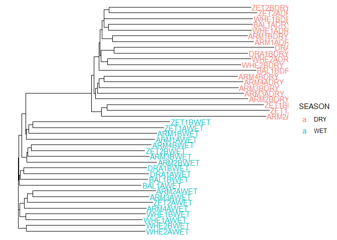<!-- -->

``` r
plot(arthro.nmds, display = 'sites', type = 'n') ; points(arthro.nmds, display = 'sites', pch = 20) ; with(metadata, ordiellipse(arthro.nmds, metadata$SEASON, draw = 'polygon', col = 'blue', label = FALSE, show.groups =(c("WET")))) ; with(metadata, ordiellipse(arthro.nmds, metadata$SEASON, draw = 'polygon', col = 'goldenrod', label = FALSE,show.groups =(c("DRY"))))
```

<!-- -->

``` r
season_tree <- nj(arthroB_dist)
ggtree(season_tree, layout = "rectangular") %<+% metadata +
  geom_tiplab(aes(colour = SEASON)) + 
  theme(legend.position = "right")
```

<!-- -->

``` r
arthro_wet <- subset(arthro_binary, metadata$SEASON == "WET")
metadata_wet <- subset(metadata, metadata$SEASON == "WET")
arthro_wet_dist <- vegdist(arthro_wet, method = 'bray')
arthro_wet.nmds <- metaMDS(arthro_wet_dist)
```

    ## Run 0 stress 0.2180104 
    ## Run 1 stress 0.2148357 
    ## ... New best solution
    ## ... Procrustes: rmse 0.07931538  max resid 0.2730634 
    ## Run 2 stress 0.2187675 
    ## Run 3 stress 0.2290654 
    ## Run 4 stress 0.2188158 
    ## Run 5 stress 0.2148357 
    ## ... Procrustes: rmse 0.0006725982  max resid 0.001631065 
    ## ... Similar to previous best
    ## Run 6 stress 0.2315322 
    ## Run 7 stress 0.2148954 
    ## ... Procrustes: rmse 0.0252951  max resid 0.07688961 
    ## Run 8 stress 0.2148955 
    ## ... Procrustes: rmse 0.02534785  max resid 0.07705214 
    ## Run 9 stress 0.2180493 
    ## Run 10 stress 0.2163434 
    ## Run 11 stress 0.3726011 
    ## Run 12 stress 0.2171418 
    ## Run 13 stress 0.2162191 
    ## Run 14 stress 0.2193746 
    ## Run 15 stress 0.2180106 
    ## Run 16 stress 0.2183155 
    ## Run 17 stress 0.2188258 
    ## Run 18 stress 0.2180105 
    ## Run 19 stress 0.214836 
    ## ... Procrustes: rmse 0.0002155191  max resid 0.0005353784 
    ## ... Similar to previous best
    ## Run 20 stress 0.2154156 
    ## *** Best solution repeated 2 times

``` r
permanova_wet <- adonis2(arthro_wet_dist ~ day, data = metadata_wet)
summary(permanova_wet)
```

    ##        Df           SumOfSqs            R2                F        
    ##  Min.   : 1.00   Min.   :0.1735   Min.   :0.05328   Min.   :1.013  
    ##  1st Qu.: 9.50   1st Qu.:1.6282   1st Qu.:0.50000   1st Qu.:1.013  
    ##  Median :18.00   Median :3.0829   Median :0.94672   Median :1.013  
    ##  Mean   :12.67   Mean   :2.1710   Mean   :0.66667   Mean   :1.013  
    ##  3rd Qu.:18.50   3rd Qu.:3.1697   3rd Qu.:0.97336   3rd Qu.:1.013  
    ##  Max.   :19.00   Max.   :3.2564   Max.   :1.00000   Max.   :1.013  
    ##                                                     NA's   :2      
    ##      Pr(>F)     
    ##  Min.   :0.438  
    ##  1st Qu.:0.438  
    ##  Median :0.438  
    ##  Mean   :0.438  
    ##  3rd Qu.:0.438  
    ##  Max.   :0.438  
    ##  NA's   :2

``` r
permanova_wet
```

    ## Permutation test for adonis under reduced model
    ## Terms added sequentially (first to last)
    ## Permutation: free
    ## Number of permutations: 999
    ## 
    ## adonis2(formula = arthro_wet_dist ~ day, data = metadata_wet)
    ##          Df SumOfSqs      R2     F Pr(>F)
    ## day       1   0.1735 0.05328 1.013  0.438
    ## Residual 18   3.0829 0.94672             
    ## Total    19   3.2564 1.00000

``` r
permanova_wet_site <- adonis2(arthro_wet_dist ~ site, data = metadata_wet)
permanova_wet_site
```

    ## Permutation test for adonis under reduced model
    ## Terms added sequentially (first to last)
    ## Permutation: free
    ## Number of permutations: 999
    ## 
    ## adonis2(formula = arthro_wet_dist ~ site, data = metadata_wet)
    ##          Df SumOfSqs      R2      F Pr(>F)   
    ## site      9   1.6269 0.49959 1.1093  0.008 **
    ## Residual 10   1.6296 0.50041                 
    ## Total    19   3.2564 1.00000                 
    ## ---
    ## Signif. codes:  0 '***' 0.001 '**' 0.01 '*' 0.05 '.' 0.1 ' ' 1

``` r
plot(arthro_wet.nmds, display = 'sites', type = 'n'); points(arthro_wet.nmds, display = 'sites', pch = 20,col = ifelse(metadata_wet$day == "A", "black", "red" ));with(metadata_wet, ordiellipse(arthro_wet.nmds, day, draw = 'polygon', col = c('black'), label = FALSE, show.groups =(c("A"))));with(metadata_wet, ordiellipse(arthro_wet.nmds, day, draw = 'polygon', col = c('red'), label = FALSE,show.groups =(c("B")))); with(metadata_wet, text(arthro_wet.nmds, labels = metadata_wet$site,pos = 2, cex = 0.5))
```

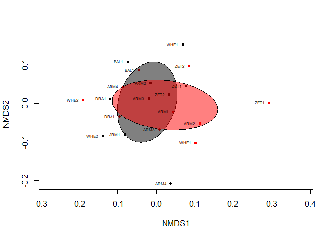<!-- -->

``` r
wet_tree <- nj(arthro_wet_dist)
ggtree(wet_tree, layout = "rectangular") %<+% metadata +
  geom_tiplab(aes(colour = day)) + 
  theme(legend.position = "right")
```

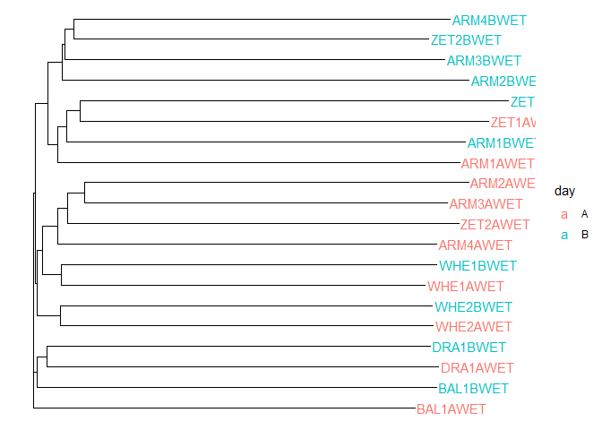<!-- -->

``` r
arthro_dry <- subset(arthro_binary, metadata$SEASON == "DRY")
metadata_dry <- subset(metadata, metadata$SEASON == "DRY")
arthro_dry_dist <- vegdist(arthro_dry, method = 'bray')
arthro_dry.nmds <- metaMDS(arthro_dry_dist)
```

    ## Run 0 stress 0.1883948 
    ## Run 1 stress 0.1919146 
    ## Run 2 stress 0.2162068 
    ## Run 3 stress 0.1878355 
    ## ... New best solution
    ## ... Procrustes: rmse 0.02434449  max resid 0.08410785 
    ## Run 4 stress 0.1919145 
    ## Run 5 stress 0.1926326 
    ## Run 6 stress 0.2012771 
    ## Run 7 stress 0.2042982 
    ## Run 8 stress 0.1919144 
    ## Run 9 stress 0.1887934 
    ## Run 10 stress 0.2175053 
    ## Run 11 stress 0.1926324 
    ## Run 12 stress 0.2241801 
    ## Run 13 stress 0.2140758 
    ## Run 14 stress 0.1919145 
    ## Run 15 stress 0.2373012 
    ## Run 16 stress 0.2042982 
    ## Run 17 stress 0.1919145 
    ## Run 18 stress 0.2322987 
    ## Run 19 stress 0.2042982 
    ## Run 20 stress 0.2155986 
    ## *** Best solution was not repeated -- monoMDS stopping criteria:
    ##     20: stress ratio > sratmax

``` r
permanova_dry<- adonis2(arthro_dry_dist ~ day, data = metadata_dry)
summary(permanova_dry)
```

    ##        Df           SumOfSqs            R2               F        
    ##  Min.   : 1.00   Min.   :0.2813   Min.   :0.0611   Min.   :1.171  
    ##  1st Qu.: 9.50   1st Qu.:2.3025   1st Qu.:0.5000   1st Qu.:1.171  
    ##  Median :18.00   Median :4.3236   Median :0.9389   Median :1.171  
    ##  Mean   :12.67   Mean   :3.0700   Mean   :0.6667   Mean   :1.171  
    ##  3rd Qu.:18.50   3rd Qu.:4.4643   3rd Qu.:0.9695   3rd Qu.:1.171  
    ##  Max.   :19.00   Max.   :4.6050   Max.   :1.0000   Max.   :1.171  
    ##                                                    NA's   :2      
    ##      Pr(>F)    
    ##  Min.   :0.06  
    ##  1st Qu.:0.06  
    ##  Median :0.06  
    ##  Mean   :0.06  
    ##  3rd Qu.:0.06  
    ##  Max.   :0.06  
    ##  NA's   :2

``` r
permanova_dry
```

    ## Permutation test for adonis under reduced model
    ## Terms added sequentially (first to last)
    ## Permutation: free
    ## Number of permutations: 999
    ## 
    ## adonis2(formula = arthro_dry_dist ~ day, data = metadata_dry)
    ##          Df SumOfSqs     R2      F Pr(>F)  
    ## day       1   0.2813 0.0611 1.1713   0.06 .
    ## Residual 18   4.3236 0.9389                
    ## Total    19   4.6050 1.0000                
    ## ---
    ## Signif. codes:  0 '***' 0.001 '**' 0.01 '*' 0.05 '.' 0.1 ' ' 1

``` r
permanova_dry_sites<- adonis2(arthro_dry ~ site, data = metadata_dry)
summary(permanova_dry_sites)
```

    ##        Df           SumOfSqs           R2               F         
    ##  Min.   : 9.00   Min.   :2.108   Min.   :0.4577   Min.   :0.9377  
    ##  1st Qu.: 9.50   1st Qu.:2.302   1st Qu.:0.5000   1st Qu.:0.9377  
    ##  Median :10.00   Median :2.497   Median :0.5423   Median :0.9377  
    ##  Mean   :12.67   Mean   :3.070   Mean   :0.6667   Mean   :0.9377  
    ##  3rd Qu.:14.50   3rd Qu.:3.551   3rd Qu.:0.7712   3rd Qu.:0.9377  
    ##  Max.   :19.00   Max.   :4.605   Max.   :1.0000   Max.   :0.9377  
    ##                                                   NA's   :2       
    ##      Pr(>F)     
    ##  Min.   :0.946  
    ##  1st Qu.:0.946  
    ##  Median :0.946  
    ##  Mean   :0.946  
    ##  3rd Qu.:0.946  
    ##  Max.   :0.946  
    ##  NA's   :2

``` r
permanova_dry_sites
```

    ## Permutation test for adonis under reduced model
    ## Terms added sequentially (first to last)
    ## Permutation: free
    ## Number of permutations: 999
    ## 
    ## adonis2(formula = arthro_dry ~ site, data = metadata_dry)
    ##          Df SumOfSqs      R2      F Pr(>F)
    ## site      9   2.1076 0.45767 0.9377  0.946
    ## Residual 10   2.4974 0.54233              
    ## Total    19   4.6050 1.00000

``` r
plot(arthro_dry.nmds, display = 'sites', type = 'n'); points(arthro_dry.nmds, display = 'sites', pch = 20,col = ifelse(metadata_dry$day == "A", "black", "red" )); with(metadata_dry, ordiellipse(arthro_dry.nmds, day, draw = 'polygon', col = c('black'), label = FALSE, show.groups =(c("A")))); with(metadata_dry, ordiellipse(arthro_dry.nmds, day, draw = 'polygon', col = c('red'), label = FALSE, show.groups =(c("B")))); with(metadata_dry, text(arthro_dry.nmds, labels = metadata_dry$site,pos = 2, cex = 0.5))
```

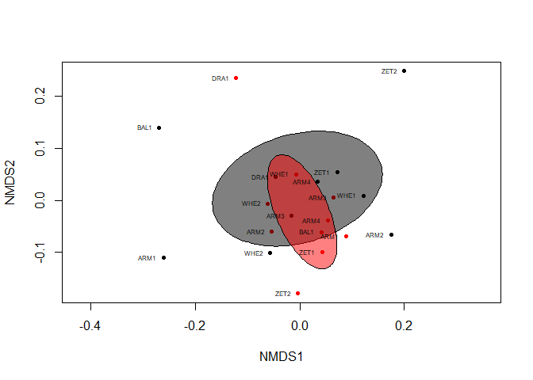<!-- -->

``` r
dry_tree <- nj(arthro_dry_dist)
ggtree(dry_tree, layout = "rectangular") %<+% metadata +
  geom_tiplab(aes(colour = day)) + 
  theme(legend.position = "right")
```

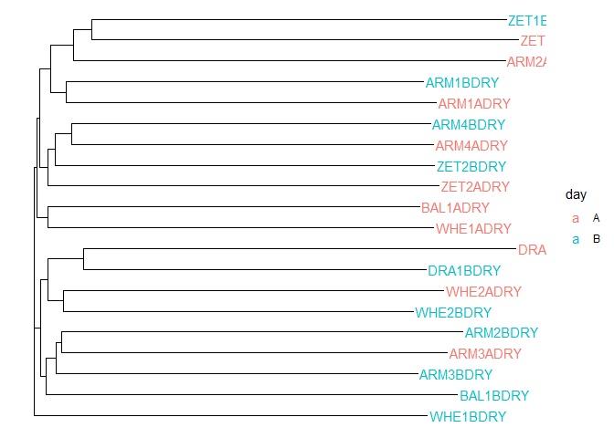<!-- -->

``` r
focal_groups <- c("f__Erebidae", "f__Crambidae", "f__Curculionidae", "f__Flatidae", "f__Formicidae", "f__Geometridae",
                  "f__Halictidae", "o__Blattodea", "f__Passalidae", "f__Pyralidae", "f__ Reduviidae", "f__Saturnidae",
                  "f__Scarabaeidae","f__Papilionidae", "f__Nymphalidae", "f__Lycaenidae", "f__Hesperiidae", "f__Apidae")

pattern <- paste0(focal_groups, collapse = "|")

arthro_all <- read.csv('data/correct_anal/tradmetabrparallel_final.csv')
metadata_all <- read.csv('data/correct_anal/metadata_trad_metabr_parallel.csv ')
metadata_samples <- filter(metadata_all, metadata_all$method == "LT") #remove from metadata file anythying not from light traps
metadata_samples <- metadata_samples %>% filter (location_good != 'other') %>% filter(!grepl("REP", sampleID)) #remove samples not from forestGEO plot

#we will already filter the data to include only LT from forestGEO sites 
metadata_samples$sampleID <- as.character(metadata_samples$sampleID) #sampleID columns as character

focal_arthro <- arthro_all[grep(pattern, arthro_all$classification), ]

colnames(focal_arthro) <- as.character(colnames(focal_arthro)) #column names (samples) as character
slected_cols <- intersect(colnames(focal_arthro), metadata_samples$sampleID) #intersect matches the names in sampleID to our columns
include_cols <- c(colnames(focal_arthro)[1:2], slected_cols)
focal_arthro_samples <- focal_arthro[, include_cols] #remember to include first two columns too since they are not in sampleID

focal_arthro_trans <- t(focal_arthro_samples[, -2]) #transpose dataset (samples in rows, species in columns)
colnames(focal_arthro_trans) <- focal_arthro_trans[1,] #first row is names
focal_arthro_trans <- focal_arthro_trans [-1,] #remove first row (now redundant)
focal_arthro_trans[, -1] <- apply(focal_arthro_trans[, -1 , drop = FALSE], 2, as.numeric) #make data frame numeric
focal_arthro_trans <- focal_arthro_trans[,which(specnumber(focal_arthro_trans,MARGIN=2)>0)] #remove singletons
focal_arthro_binary <- ifelse(focal_arthro_trans[, -1] > 0,1,0) #no need since tradmetabrparallel_final.csv already binary
#write.csv(focal_arthro_binary, 'data/correct_anal/focal_arthro_bianry.csv')

arthroall_dist <- vegdist(focal_arthro_binary, method = "bray") #distance marix of binary data using Jaccard method

#write.csv(arthro_all_binary, "./arthro_all_binary.csv")

metadata_samples$methodClass <- as.factor(metadata_samples$methodClass) #these are needed for plotting issues below 
metadata_samples$season <- as.factor(metadata_samples$season)
metadata_samples$location_good <- as.factor(metadata_samples$location_good)

arthroall_dist <- vegdist(focal_arthro_binary, method = "bray") #distance marix of binary data using Jaccard method
arthro_all.nmds <- metaMDS(arthroall_dist) #run meta nmds analysis
```

    ## Run 0 stress 0.207764 
    ## Run 1 stress 0.2607231 
    ## Run 2 stress 0.2579203 
    ## Run 3 stress 0.240928 
    ## Run 4 stress 0.2558513 
    ## Run 5 stress 0.2294004 
    ## Run 6 stress 0.2077642 
    ## ... Procrustes: rmse 0.0001125086  max resid 0.0007071175 
    ## ... Similar to previous best
    ## Run 7 stress 0.2112893 
    ## Run 8 stress 0.2403916 
    ## Run 9 stress 0.2156771 
    ## Run 10 stress 0.2365005 
    ## Run 11 stress 0.2496422 
    ## Run 12 stress 0.2131605 
    ## Run 13 stress 0.2513915 
    ## Run 14 stress 0.2495582 
    ## Run 15 stress 0.2075954 
    ## ... New best solution
    ## ... Procrustes: rmse 0.02779019  max resid 0.2133189 
    ## Run 16 stress 0.2078149 
    ## ... Procrustes: rmse 0.02427415  max resid 0.2119683 
    ## Run 17 stress 0.2539465 
    ## Run 18 stress 0.2572864 
    ## Run 19 stress 0.2376614 
    ## Run 20 stress 0.2108656 
    ## *** Best solution was not repeated -- monoMDS stopping criteria:
    ##     20: stress ratio > sratmax

``` r
permanova_all <- adonis2(arthroall_dist ~ methodClass, data = metadata_samples)
summary(permanova_all)
```

    ##        Df          SumOfSqs            R2               F        
    ##  Min.   : 2.0   Min.   : 3.743   Min.   :0.1217   Min.   :6.719  
    ##  1st Qu.:49.5   1st Qu.:15.378   1st Qu.:0.5000   1st Qu.:6.719  
    ##  Median :97.0   Median :27.014   Median :0.8783   Median :6.719  
    ##  Mean   :66.0   Mean   :20.504   Mean   :0.6667   Mean   :6.719  
    ##  3rd Qu.:98.0   3rd Qu.:28.885   3rd Qu.:0.9392   3rd Qu.:6.719  
    ##  Max.   :99.0   Max.   :30.756   Max.   :1.0000   Max.   :6.719  
    ##                                                   NA's   :2      
    ##      Pr(>F)     
    ##  Min.   :0.001  
    ##  1st Qu.:0.001  
    ##  Median :0.001  
    ##  Mean   :0.001  
    ##  3rd Qu.:0.001  
    ##  Max.   :0.001  
    ##  NA's   :2

``` r
permanova_all
```

    ## Permutation test for adonis under reduced model
    ## Terms added sequentially (first to last)
    ## Permutation: free
    ## Number of permutations: 999
    ## 
    ## adonis2(formula = arthroall_dist ~ methodClass, data = metadata_samples)
    ##             Df SumOfSqs      R2      F Pr(>F)    
    ## methodClass  2   3.7425 0.12168 6.7193  0.001 ***
    ## Residual    97  27.0136 0.87832                  
    ## Total       99  30.7561 1.00000                  
    ## ---
    ## Signif. codes:  0 '***' 0.001 '**' 0.01 '*' 0.05 '.' 0.1 ' ' 1

``` r
permanova_all_sites <- adonis2(arthroall_dist ~ location_good, data = metadata_samples)
summary(permanova_all_sites)
```

    ##        Df          SumOfSqs            R2                F        
    ##  Min.   : 9.0   Min.   : 2.864   Min.   :0.09312   Min.   :1.027  
    ##  1st Qu.:49.5   1st Qu.:15.378   1st Qu.:0.50000   1st Qu.:1.027  
    ##  Median :90.0   Median :27.892   Median :0.90688   Median :1.027  
    ##  Mean   :66.0   Mean   :20.504   Mean   :0.66667   Mean   :1.027  
    ##  3rd Qu.:94.5   3rd Qu.:29.324   3rd Qu.:0.95344   3rd Qu.:1.027  
    ##  Max.   :99.0   Max.   :30.756   Max.   :1.00000   Max.   :1.027  
    ##                                                    NA's   :2      
    ##      Pr(>F)     
    ##  Min.   :0.336  
    ##  1st Qu.:0.336  
    ##  Median :0.336  
    ##  Mean   :0.336  
    ##  3rd Qu.:0.336  
    ##  Max.   :0.336  
    ##  NA's   :2

``` r
permanova_all_sites
```

    ## Permutation test for adonis under reduced model
    ## Terms added sequentially (first to last)
    ## Permutation: free
    ## Number of permutations: 999
    ## 
    ## adonis2(formula = arthroall_dist ~ location_good, data = metadata_samples)
    ##               Df SumOfSqs      R2      F Pr(>F)
    ## location_good  9   2.8641 0.09312 1.0268  0.336
    ## Residual      90  27.8920 0.90688              
    ## Total         99  30.7561 1.00000

``` r
plot(arthro_all.nmds, display = 'sites', type = 'n')
points(arthro_all.nmds, display = 'sites',  pch = 20,col = ifelse(metadata_samples$season == "wet", "darkblue", "brown4" ))
with(metadata_samples, ordihull(arthro_all.nmds, methodClass,draw =  'polygon',col = c('firebrick4'),
                                  show.groups =(c("trad"))))
with(metadata_samples, ordispider(arthro_all.nmds, methodClass,draw =  'polygon',col = c('firebrick4'),
                                  show.groups =(c("trad"))))
```

    ## Warning in match.fun(FUN)(...): "draw" is not a graphical parameter

``` r
with(metadata_samples, ordihull(arthro_all.nmds, methodClass, draw =  'polygon', col = c('darkolivegreen'), 
                                  show.groups =(c("metabr"))))
with(metadata_samples, ordispider(arthro_all.nmds, methodClass, draw =  'polygon', col = c('darkolivegreen'), 
                                  show.groups =(c("metabr"))))
```

    ## Warning in match.fun(FUN)(...): "draw" is not a graphical parameter

``` r
with(metadata_samples, ordihull(arthro_all.nmds, methodClass, draw =  'polygon', col = c('darkorchid'), 
                                  show.groups =(c("parallel"))))
with(metadata_samples, ordispider(arthro_all.nmds, methodClass, draw =  'polygon', col = c('darkorchid'), 
                                  show.groups =(c("parallel"))))
```

    ## Warning in match.fun(FUN)(...): "draw" is not a graphical parameter

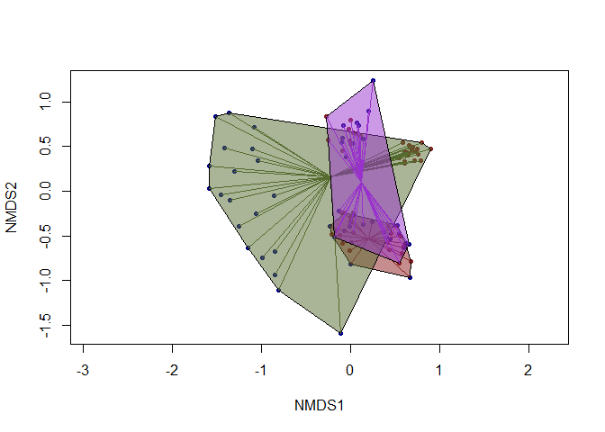<!-- -->

``` r
all_tree <- nj(arthroall_dist)
ggtree(all_tree, layout = "rectangular") %<+% metadata_all +
  geom_tiplab(aes(colour = methodClass)) + 
  theme(legend.position = "right")
```

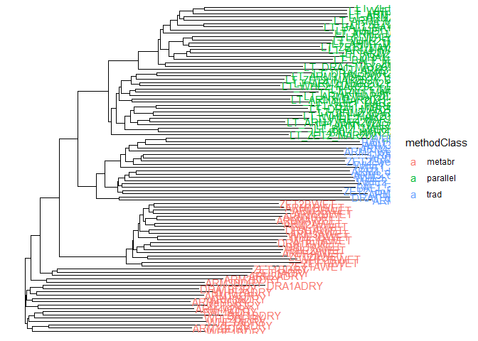<!-- -->

``` r
arthro_all_wet <- read.csv('data/correct_anal/arthro_all_wet.csv', row.names = 1)

metadata_samples_wet <- subset(metadata_samples, metadata_samples$season == "wet")
arthro_all_wet_dist <- vegdist(arthro_all_wet, method = 'bray')
arthro_all_wet.nmds <- metaMDS(arthro_all_wet_dist)
```

    ## Run 0 stress 0.1098143 
    ## Run 1 stress 0.1124115 
    ## Run 2 stress 0.111675 
    ## Run 3 stress 0.1162889 
    ## Run 4 stress 0.1697066 
    ## Run 5 stress 0.1670888 
    ## Run 6 stress 0.1185924 
    ## Run 7 stress 0.1820028 
    ## Run 8 stress 0.1129591 
    ## Run 9 stress 0.1098303 
    ## ... Procrustes: rmse 0.005826102  max resid 0.02922677 
    ## Run 10 stress 0.1111712 
    ## Run 11 stress 0.1124113 
    ## Run 12 stress 0.1098143 
    ## ... New best solution
    ## ... Procrustes: rmse 4.775256e-05  max resid 0.0002115748 
    ## ... Similar to previous best
    ## Run 13 stress 0.1189972 
    ## Run 14 stress 0.1174728 
    ## Run 15 stress 0.111796 
    ## Run 16 stress 0.113023 
    ## Run 17 stress 0.1124922 
    ## Run 18 stress 0.1163283 
    ## Run 19 stress 0.1111711 
    ## Run 20 stress 0.1786657 
    ## *** Best solution repeated 1 times

``` r
permutation_all_wet <- adonis2(arthro_all_wet_dist ~ methodClass, data = metadata_samples_wet)
permutation_all_wet
```

    ## Permutation test for adonis under reduced model
    ## Terms added sequentially (first to last)
    ## Permutation: free
    ## Number of permutations: 999
    ## 
    ## adonis2(formula = arthro_all_wet_dist ~ methodClass, data = metadata_samples_wet)
    ##             Df SumOfSqs      R2      F Pr(>F)    
    ## methodClass  2   2.3683 0.16788 4.7412  0.001 ***
    ## Residual    47  11.7387 0.83212                  
    ## Total       49  14.1070 1.00000                  
    ## ---
    ## Signif. codes:  0 '***' 0.001 '**' 0.01 '*' 0.05 '.' 0.1 ' ' 1

``` r
permutation_all_wet_sites <-adonis2(arthro_all_wet_dist ~location_good, data = metadata_samples_wet)
permutation_all_wet_sites
```

    ## Permutation test for adonis under reduced model
    ## Terms added sequentially (first to last)
    ## Permutation: free
    ## Number of permutations: 999
    ## 
    ## adonis2(formula = arthro_all_wet_dist ~ location_good, data = metadata_samples_wet)
    ##               Df SumOfSqs      R2      F Pr(>F)
    ## location_good  9   2.3287 0.16507 0.8787  0.761
    ## Residual      40  11.7783 0.83493              
    ## Total         49  14.1070 1.00000

``` r
plot(arthro_all_wet.nmds, display = 'sites', type = 'n')
points(arthro_all_wet.nmds, display = 'sites', pch = 20)
with(metadata_samples_wet, ordispider(arthro_all_wet.nmds, methodClass, draw =  'polygon', col = c('firebrick4'), label = F,show.groups =(c("trad"))))
```

    ## Warning in match.fun(FUN)(...): "draw" is not a graphical parameter

``` r
with(metadata_samples_wet, ordihull(arthro_all_wet.nmds, methodClass, draw =  'polygon', col = c('firebrick4'), label = F,show.groups =(c("trad"))))
with(metadata_samples_wet, ordispider(arthro_all_wet.nmds, methodClass,draw =  'polygon', col = c('darkolivegreen'), label = FALSE,show.groups =(c("metabr"))))
```

    ## Warning in match.fun(FUN)(...): "draw" is not a graphical parameter

``` r
with(metadata_samples_wet, ordihull(arthro_all_wet.nmds, methodClass,draw =  'polygon', col = c('darkolivegreen'), label = FALSE,show.groups =(c("metabr"))))
with(metadata_samples_wet, ordispider(arthro_all_wet.nmds, methodClass,draw =  'polygon', col = c('darkorchid'), label = FALSE,show.groups =(c("parallel"))))
```

    ## Warning in match.fun(FUN)(...): "draw" is not a graphical parameter

``` r
with(metadata_samples_wet, ordihull(arthro_all_wet.nmds, methodClass,draw =  'polygon', col = c('darkorchid'), label = FALSE,show.groups =(c("parallel"))))
with(metadata_samples_wet, text(arthro_all_wet.nmds, labels = metadata_samples_wet$location_good,pos = 2, cex = 0.4))
```

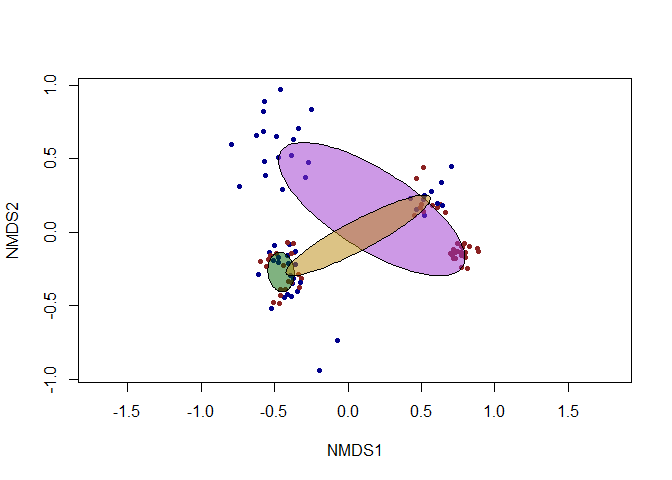<!-- -->

``` r
all_wet_tree <- nj(arthro_all_wet_dist)
ggtree(all_wet_tree, layout = "rectangular") %<+% metadata_samples_wet +
  geom_tiplab(aes(colour = methodClass)) + 
  theme(legend.position = "right")
```

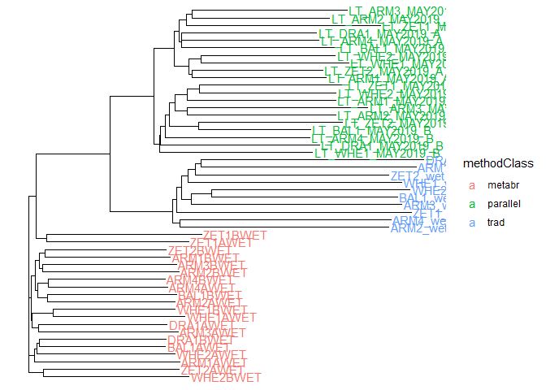<!-- -->

``` r
arthro_all_dry <- read.csv('data/correct_anal/arthro_all_dry.csv', row.names = 1)
metadata_samples_dry <- subset(metadata_samples, metadata_samples$season == "dry")
arthro_all_dry_dist <- vegdist(arthro_all_dry, method = 'bray')
arthro_all_dry.nmds <- metaMDS(arthro_all_dry_dist)
```

    ## Run 0 stress 0.170888 
    ## Run 1 stress 0.22075 
    ## Run 2 stress 0.2196144 
    ## Run 3 stress 0.2194717 
    ## Run 4 stress 0.2200526 
    ## Run 5 stress 0.218276 
    ## Run 6 stress 0.1768513 
    ## Run 7 stress 0.1728613 
    ## Run 8 stress 0.2090533 
    ## Run 9 stress 0.1795367 
    ## Run 10 stress 0.2059315 
    ## Run 11 stress 0.2192282 
    ## Run 12 stress 0.1741101 
    ## Run 13 stress 0.2088309 
    ## Run 14 stress 0.1721933 
    ## Run 15 stress 0.1741115 
    ## Run 16 stress 0.2198327 
    ## Run 17 stress 0.1745143 
    ## Run 18 stress 0.1726288 
    ## Run 19 stress 0.170794 
    ## ... New best solution
    ## ... Procrustes: rmse 0.01039472  max resid 0.07006515 
    ## Run 20 stress 0.1722 
    ## *** Best solution was not repeated -- monoMDS stopping criteria:
    ##     18: stress ratio > sratmax
    ##      2: scale factor of the gradient < sfgrmin

``` r
permutation_all_dry <- adonis2(arthro_all_dry_dist ~ methodClass, data = metadata_samples_dry)
permutation_all_dry
```

    ## Permutation test for adonis under reduced model
    ## Terms added sequentially (first to last)
    ## Permutation: free
    ## Number of permutations: 999
    ## 
    ## adonis2(formula = arthro_all_dry_dist ~ methodClass, data = metadata_samples_dry)
    ##             Df SumOfSqs      R2      F Pr(>F)    
    ## methodClass  2   1.8932 0.13221 3.5804  0.001 ***
    ## Residual    47  12.4260 0.86779                  
    ## Total       49  14.3192 1.00000                  
    ## ---
    ## Signif. codes:  0 '***' 0.001 '**' 0.01 '*' 0.05 '.' 0.1 ' ' 1

``` r
permutation_all_dry_sites <-adonis2(arthro_all_dry_dist ~location_good, data = metadata_samples_dry)
permutation_all_dry_sites
```

    ## Permutation test for adonis under reduced model
    ## Terms added sequentially (first to last)
    ## Permutation: free
    ## Number of permutations: 999
    ## 
    ## adonis2(formula = arthro_all_dry_dist ~ location_good, data = metadata_samples_dry)
    ##               Df SumOfSqs      R2      F Pr(>F)
    ## location_good  9   2.4791 0.17313 0.9306  0.755
    ## Residual      40  11.8401 0.82687              
    ## Total         49  14.3192 1.00000

``` r
plot(arthro_all_dry.nmds, display = 'sites', type = 'n')
points(arthro_all_dry.nmds, display = 'sites', pch = 20)
with(metadata_samples_dry, ordispider(arthro_all_dry.nmds, methodClass, draw =  'polygon',  col = c('firebrick4'), label = FALSE, show.groups =(c("trad"))))
```

    ## Warning in match.fun(FUN)(...): "draw" is not a graphical parameter

``` r
with(metadata_samples_dry, ordihull(arthro_all_dry.nmds, methodClass, draw =  'polygon',  col = c('firebrick4'), label = FALSE, show.groups =(c("trad"))))
with(metadata_samples_dry, ordispider(arthro_all_dry.nmds, methodClass, draw =  'polygon', col = c('darkolivegreen'), label = FALSE, show.groups =(c("metabr"))))
```

    ## Warning in match.fun(FUN)(...): "draw" is not a graphical parameter

``` r
with(metadata_samples_dry, ordihull(arthro_all_dry.nmds, methodClass, draw =  'polygon', col = c('darkolivegreen'), label = FALSE, show.groups =(c("metabr"))))
with(metadata_samples_dry, ordispider(arthro_all_dry.nmds, methodClass, draw =  'polygon',  col = c('darkorchid'), label = FALSE, show.groups =(c("parallel"))))
```

    ## Warning in match.fun(FUN)(...): "draw" is not a graphical parameter

``` r
with(metadata_samples_dry, ordihull(arthro_all_dry.nmds, methodClass, draw =  'polygon',  col = c('darkorchid'), label = FALSE, show.groups =(c("parallel"))))
with(metadata_samples_dry, text(arthro_all_dry.nmds, labels = metadata_samples_dry$location_good,pos = 2, cex = 0.4))
```

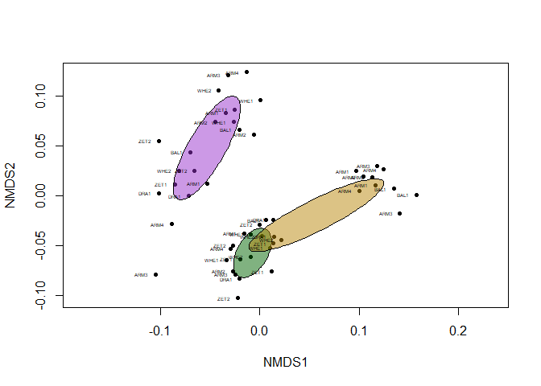<!-- -->

``` r
all_dry_tree <- nj(arthro_all_dry_dist)
ggtree(all_dry_tree, layout = "rectangular") %<+% metadata_samples_dry +
  geom_tiplab(aes(colour = methodClass)) + 
  theme(legend.position = "right")
```

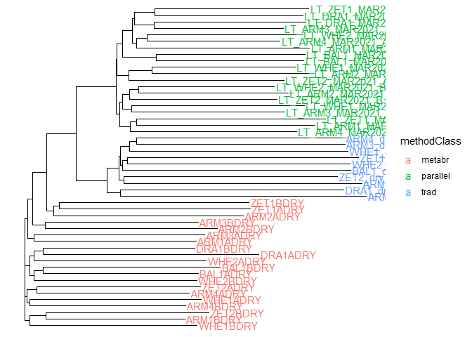<!-- -->
