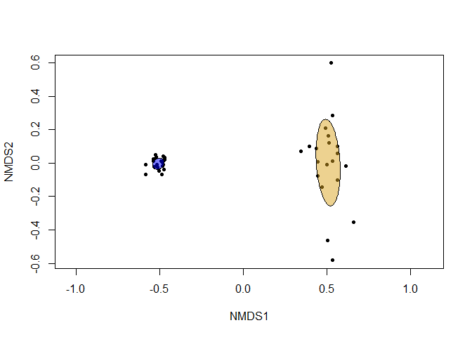
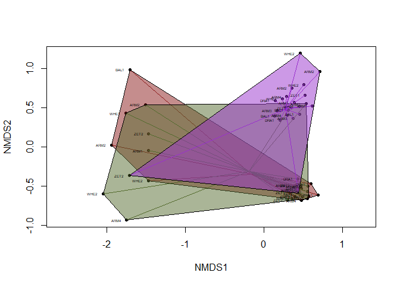

08_nmds_supplementary_material
================
Daniel
14/02/2023

``` r
rm(list=ls())
library("vegan")
```

    ## Loading required package: permute

    ## Loading required package: lattice

    ## This is vegan 2.6-4

``` r
library("mvabund")
library("dplyr")
```

    ## 
    ## Attaching package: 'dplyr'

    ## The following objects are masked from 'package:stats':
    ## 
    ##     filter, lag

    ## The following objects are masked from 'package:base':
    ## 
    ##     intersect, setdiff, setequal, union

``` r
library("elevatr")
```

    ## elevatr v0.99.0 NOTE: Version 0.99.0 of 'elevatr' uses 'sf' and 'terra'.  Use 
    ## of the 'sp', 'raster', and underlying 'rgdal' packages by 'elevatr' is being 
    ## deprecated; however, get_elev_raster continues to return a RasterLayer.  This 
    ## will be dropped in future versions, so please plan accordingly.

``` r
library("ggplot2")
library("geosphere")

arthro <- read.csv('data/correct_anal/CYBs_correct_names.csv')
metadata <- read.csv('data/correct_anal/location_ctrl.csv')

arthro_trans <- t(arthro[, -2]) #transpose dataset (samples in rows, species in columns)
colnames(arthro_trans) <- arthro_trans[1,] #first row is names
arthro_trans <- arthro_trans [-1,] #remove first row (now redundant)
arthro_trans[, -1] <- apply(arthro_trans[, -1 , drop = FALSE], 2, as.numeric) #make data frame numeric
arthro_trans <- arthro_trans[,which(specnumber(arthro_trans,MARGIN=2)>0)] #remove singletons
arthro_binary <- ifelse(arthro_trans[, -1] > 0,1,0) #turn to binary data


metadata$site <- as.factor(metadata$site) #these are needed for plotting issues below 
metadata$SEASON <- as.factor(metadata$SEASON)
metadata$day <- as.factor(metadata$day)
#metadata$LAT <- as.numeric(metadata$LAT)
#metadata$LONG <- as.numeric(metadata$LONG)

arthroB_dist <- vegdist(arthro_binary, method = "jaccard") #distance marix of binary data using Jaccard method
arthro.nmds <- metaMDS(arthroB_dist) #run meta nmds analysis
```

    ## Run 0 stress 0.09507088 
    ## Run 1 stress 0.0950709 
    ## ... Procrustes: rmse 2.236538e-05  max resid 9.260625e-05 
    ## ... Similar to previous best
    ## Run 2 stress 0.09512256 
    ## ... Procrustes: rmse 0.01526043  max resid 0.07142009 
    ## Run 3 stress 0.08910282 
    ## ... New best solution
    ## ... Procrustes: rmse 0.06223254  max resid 0.2829412 
    ## Run 4 stress 0.0890531 
    ## ... New best solution
    ## ... Procrustes: rmse 0.002500076  max resid 0.01247741 
    ## Run 5 stress 0.09507094 
    ## Run 6 stress 0.08753971 
    ## ... New best solution
    ## ... Procrustes: rmse 0.01772287  max resid 0.09513016 
    ## Run 7 stress 0.0873457 
    ## ... New best solution
    ## ... Procrustes: rmse 0.005756954  max resid 0.03486412 
    ## Run 8 stress 0.101097 
    ## Run 9 stress 0.08734566 
    ## ... New best solution
    ## ... Procrustes: rmse 3.786543e-05  max resid 0.0001319354 
    ## ... Similar to previous best
    ## Run 10 stress 0.08734575 
    ## ... Procrustes: rmse 6.408569e-05  max resid 0.0002218062 
    ## ... Similar to previous best
    ## Run 11 stress 0.1064138 
    ## Run 12 stress 0.08796939 
    ## Run 13 stress 0.09617235 
    ## Run 14 stress 0.09512254 
    ## Run 15 stress 0.08734568 
    ## ... Procrustes: rmse 8.445061e-05  max resid 0.0002936195 
    ## ... Similar to previous best
    ## Run 16 stress 0.08791003 
    ## Run 17 stress 0.08981032 
    ## Run 18 stress 0.101085 
    ## Run 19 stress 0.08905355 
    ## Run 20 stress 0.08934099 
    ## *** Best solution repeated 3 times

``` r
permanova_season <- adonis2(arthroB_dist ~ SEASON, data = metadata)
permanova_season
```

    ## Permutation test for adonis under reduced model
    ## Terms added sequentially (first to last)
    ## Permutation: free
    ## Number of permutations: 999
    ## 
    ## adonis2(formula = arthroB_dist ~ SEASON, data = metadata)
    ##          Df SumOfSqs      R2      F Pr(>F)    
    ## SEASON    1   2.1998 0.15986 7.2306  0.001 ***
    ## Residual 38  11.5612 0.84014                  
    ## Total    39  13.7610 1.00000                  
    ## ---
    ## Signif. codes:  0 '***' 0.001 '**' 0.01 '*' 0.05 '.' 0.1 ' ' 1

``` r
plot(arthro.nmds, display = 'sites', type = 'n') ; points(arthro.nmds, display = 'sites', pch = 20) ; with(metadata, ordiellipse(arthro.nmds, metadata$SEASON, draw = 'polygon', col = 'blue', label = FALSE, show.groups =(c("WET")))) ; with(metadata, ordiellipse(arthro.nmds, metadata$SEASON, draw = 'polygon', col = 'goldenrod', label = FALSE,show.groups =(c("DRY"))))
```

<!-- -->

``` r
arthro_wet <- subset(arthro_binary, metadata$SEASON == "WET")
metadata_wet <- subset(metadata, metadata$SEASON == "WET")
arthro_wet_dist <- vegdist(arthro_wet, method = 'jaccard')
arthro_wet.nmds <- metaMDS(arthro_wet_dist)
```

    ## Run 0 stress 0.2180107 
    ## Run 1 stress 0.2148953 
    ## ... New best solution
    ## ... Procrustes: rmse 0.08737551  max resid 0.2845143 
    ## Run 2 stress 0.2178295 
    ## Run 3 stress 0.2180492 
    ## Run 4 stress 0.2338041 
    ## Run 5 stress 0.2247209 
    ## Run 6 stress 0.2162191 
    ## Run 7 stress 0.2170285 
    ## Run 8 stress 0.2180492 
    ## Run 9 stress 0.2183155 
    ## Run 10 stress 0.2174364 
    ## Run 11 stress 0.2148359 
    ## ... New best solution
    ## ... Procrustes: rmse 0.02548537  max resid 0.07735367 
    ## Run 12 stress 0.2188258 
    ## Run 13 stress 0.2208709 
    ## Run 14 stress 0.2178287 
    ## Run 15 stress 0.2162192 
    ## Run 16 stress 0.2185704 
    ## Run 17 stress 0.2337155 
    ## Run 18 stress 0.2180492 
    ## Run 19 stress 0.2403512 
    ## Run 20 stress 0.2199943 
    ## *** Best solution was not repeated -- monoMDS stopping criteria:
    ##     20: stress ratio > sratmax

``` r
permanova_wet <- adonis2(arthro_wet_dist ~ day, data = metadata_wet)
summary(permanova_wet)
```

    ##        Df           SumOfSqs            R2                F        
    ##  Min.   : 1.00   Min.   :0.2746   Min.   :0.05305   Min.   :1.008  
    ##  1st Qu.: 9.50   1st Qu.:2.5878   1st Qu.:0.50000   1st Qu.:1.008  
    ##  Median :18.00   Median :4.9010   Median :0.94695   Median :1.008  
    ##  Mean   :12.67   Mean   :3.4504   Mean   :0.66667   Mean   :1.008  
    ##  3rd Qu.:18.50   3rd Qu.:5.0383   3rd Qu.:0.97347   3rd Qu.:1.008  
    ##  Max.   :19.00   Max.   :5.1756   Max.   :1.00000   Max.   :1.008  
    ##                                                     NA's   :2      
    ##      Pr(>F)    
    ##  Min.   :0.41  
    ##  1st Qu.:0.41  
    ##  Median :0.41  
    ##  Mean   :0.41  
    ##  3rd Qu.:0.41  
    ##  Max.   :0.41  
    ##  NA's   :2

``` r
permanova_wet
```

    ## Permutation test for adonis under reduced model
    ## Terms added sequentially (first to last)
    ## Permutation: free
    ## Number of permutations: 999
    ## 
    ## adonis2(formula = arthro_wet_dist ~ day, data = metadata_wet)
    ##          Df SumOfSqs      R2      F Pr(>F)
    ## day       1   0.2746 0.05305 1.0085   0.41
    ## Residual 18   4.9010 0.94695              
    ## Total    19   5.1756 1.00000

``` r
permanova_wet_site <- adonis2(arthro_wet_dist ~ site, data = metadata_wet)
permanova_wet_site
```

    ## Permutation test for adonis under reduced model
    ## Terms added sequentially (first to last)
    ## Permutation: free
    ## Number of permutations: 999
    ## 
    ## adonis2(formula = arthro_wet_dist ~ site, data = metadata_wet)
    ##          Df SumOfSqs      R2     F Pr(>F)   
    ## site      9   2.5378 0.49033 1.069  0.008 **
    ## Residual 10   2.6378 0.50967                
    ## Total    19   5.1756 1.00000                
    ## ---
    ## Signif. codes:  0 '***' 0.001 '**' 0.01 '*' 0.05 '.' 0.1 ' ' 1

``` r
plot(arthro_wet.nmds, display = 'sites', type = 'n'); points(arthro_wet.nmds, display = 'sites', pch = 20,col = ifelse(metadata_wet$day == "A", "black", "red" ));with(metadata_wet, ordiellipse(arthro_wet.nmds, day, draw = 'polygon', col = c('black'), label = FALSE, show.groups =(c("A"))));with(metadata_wet, ordiellipse(arthro_wet.nmds, day, draw = 'polygon', col = c('red'), label = FALSE,show.groups =(c("B")))); with(metadata_wet, text(arthro_wet.nmds, labels = metadata_wet$site,pos = 2, cex = 0.5))
```

<!-- -->

``` r
arthro_dry <- subset(arthro_binary, metadata$SEASON == "DRY")
metadata_dry <- subset(metadata, metadata$SEASON == "DRY")
arthro_dry_dist <- vegdist(arthro_dry, method = 'jaccard')
arthro_dry.nmds <- metaMDS(arthro_dry_dist)
```

    ## Run 0 stress 0.1883948 
    ## Run 1 stress 0.2169486 
    ## Run 2 stress 0.2152822 
    ## Run 3 stress 0.2042983 
    ## Run 4 stress 0.2012768 
    ## Run 5 stress 0.2069695 
    ## Run 6 stress 0.2388504 
    ## Run 7 stress 0.2016636 
    ## Run 8 stress 0.2160245 
    ## Run 9 stress 0.2373013 
    ## Run 10 stress 0.2355269 
    ## Run 11 stress 0.2033953 
    ## Run 12 stress 0.2042982 
    ## Run 13 stress 0.209748 
    ## Run 14 stress 0.1919144 
    ## Run 15 stress 0.1919147 
    ## Run 16 stress 0.1919145 
    ## Run 17 stress 0.2147276 
    ## Run 18 stress 0.1886833 
    ## ... Procrustes: rmse 0.07415217  max resid 0.2313778 
    ## Run 19 stress 0.1878354 
    ## ... New best solution
    ## ... Procrustes: rmse 0.02421846  max resid 0.0837143 
    ## Run 20 stress 0.2224005 
    ## *** Best solution was not repeated -- monoMDS stopping criteria:
    ##     20: stress ratio > sratmax

``` r
permanova_dry<- adonis2(arthro_dry_dist ~ day, data = metadata_dry)
summary(permanova_dry)
```

    ##        Df           SumOfSqs            R2                F        
    ##  Min.   : 1.00   Min.   :0.3683   Min.   :0.05768   Min.   :1.102  
    ##  1st Qu.: 9.50   1st Qu.:3.1928   1st Qu.:0.50000   1st Qu.:1.102  
    ##  Median :18.00   Median :6.0173   Median :0.94232   Median :1.102  
    ##  Mean   :12.67   Mean   :4.2570   Mean   :0.66667   Mean   :1.102  
    ##  3rd Qu.:18.50   3rd Qu.:6.2014   3rd Qu.:0.97116   3rd Qu.:1.102  
    ##  Max.   :19.00   Max.   :6.3856   Max.   :1.00000   Max.   :1.102  
    ##                                                     NA's   :2      
    ##      Pr(>F)     
    ##  Min.   :0.043  
    ##  1st Qu.:0.043  
    ##  Median :0.043  
    ##  Mean   :0.043  
    ##  3rd Qu.:0.043  
    ##  Max.   :0.043  
    ##  NA's   :2

``` r
permanova_dry
```

    ## Permutation test for adonis under reduced model
    ## Terms added sequentially (first to last)
    ## Permutation: free
    ## Number of permutations: 999
    ## 
    ## adonis2(formula = arthro_dry_dist ~ day, data = metadata_dry)
    ##          Df SumOfSqs      R2      F Pr(>F)  
    ## day       1   0.3683 0.05768 1.1017  0.043 *
    ## Residual 18   6.0173 0.94232                
    ## Total    19   6.3856 1.00000                
    ## ---
    ## Signif. codes:  0 '***' 0.001 '**' 0.01 '*' 0.05 '.' 0.1 ' ' 1

``` r
permanova_dry_sites<- adonis2(arthro_dry ~ site, data = metadata_dry)
summary(permanova_dry_sites)
```

    ##        Df           SumOfSqs           R2               F         
    ##  Min.   : 9.00   Min.   :2.108   Min.   :0.4577   Min.   :0.9377  
    ##  1st Qu.: 9.50   1st Qu.:2.302   1st Qu.:0.5000   1st Qu.:0.9377  
    ##  Median :10.00   Median :2.497   Median :0.5423   Median :0.9377  
    ##  Mean   :12.67   Mean   :3.070   Mean   :0.6667   Mean   :0.9377  
    ##  3rd Qu.:14.50   3rd Qu.:3.551   3rd Qu.:0.7712   3rd Qu.:0.9377  
    ##  Max.   :19.00   Max.   :4.605   Max.   :1.0000   Max.   :0.9377  
    ##                                                   NA's   :2       
    ##      Pr(>F)     
    ##  Min.   :0.941  
    ##  1st Qu.:0.941  
    ##  Median :0.941  
    ##  Mean   :0.941  
    ##  3rd Qu.:0.941  
    ##  Max.   :0.941  
    ##  NA's   :2

``` r
permanova_dry_sites
```

    ## Permutation test for adonis under reduced model
    ## Terms added sequentially (first to last)
    ## Permutation: free
    ## Number of permutations: 999
    ## 
    ## adonis2(formula = arthro_dry ~ site, data = metadata_dry)
    ##          Df SumOfSqs      R2      F Pr(>F)
    ## site      9   2.1076 0.45767 0.9377  0.941
    ## Residual 10   2.4974 0.54233              
    ## Total    19   4.6050 1.00000

``` r
plot(arthro_dry.nmds, display = 'sites', type = 'n'); points(arthro_dry.nmds, display = 'sites', pch = 20,col = ifelse(metadata_dry$day == "A", "black", "red" )); with(metadata_dry, ordiellipse(arthro_dry.nmds, day, draw = 'polygon', col = c('black'), label = FALSE, show.groups =(c("A")))); with(metadata_dry, ordiellipse(arthro_dry.nmds, day, draw = 'polygon', col = c('red'), label = FALSE, show.groups =(c("B")))); with(metadata_dry, text(arthro_dry.nmds, labels = metadata_dry$site,pos = 2, cex = 0.5))
```

<!-- -->

``` r
prj_dd <- "+proj=longlat +ellps=WGS84 +datum=WGS84 +no_defs"
latlong <- metadata[, c("LAT", "LONG")]
colnames(latlong) <- c('x', 'y')
latlong_elev_epqs <- get_elev_point(latlong, prj = prj_dd, src = "aws")
```

    ## Mosaicing & Projecting

    ## Note: Elevation units are in meters

``` r
data.frame(latlong_elev_epqs)
```

    ##                      geometry elevation elev_units
    ## 1  POINT (9.153883 -79.84915)       164     meters
    ## 2  POINT (9.153883 -79.84915)       164     meters
    ## 3  POINT (9.152024 -79.84934)       164     meters
    ## 4  POINT (9.152024 -79.84934)       164     meters
    ## 5  POINT (9.151079 -79.85288)       164     meters
    ## 6  POINT (9.151079 -79.85288)       164     meters
    ## 7  POINT (9.148812 -79.85526)       164     meters
    ## 8  POINT (9.148812 -79.85526)       164     meters
    ## 9  POINT (9.155474 -79.84469)       164     meters
    ## 10 POINT (9.155474 -79.84469)       164     meters
    ## 11 POINT (9.149328 -79.84651)       164     meters
    ## 12 POINT (9.149328 -79.84651)       164     meters
    ## 13 POINT (9.153214 -79.84778)       164     meters
    ## 14 POINT (9.153214 -79.84778)       164     meters
    ## 15 POINT (9.150813 -79.84621)       164     meters
    ## 16 POINT (9.150813 -79.84621)       164     meters
    ## 17 POINT (9.152943 -79.85259)       164     meters
    ## 18 POINT (9.152943 -79.85259)       164     meters
    ## 19 POINT (9.152044 -79.85656)       164     meters
    ## 20 POINT (9.152044 -79.85656)       164     meters
    ## 21 POINT (9.153883 -79.84915)       164     meters
    ## 22 POINT (9.153883 -79.84915)       164     meters
    ## 23 POINT (9.152024 -79.84934)       164     meters
    ## 24 POINT (9.152024 -79.84934)       164     meters
    ## 25 POINT (9.151079 -79.85288)       164     meters
    ## 26 POINT (9.151079 -79.85288)       164     meters
    ## 27 POINT (9.148812 -79.85526)       164     meters
    ## 28 POINT (9.148812 -79.85526)       164     meters
    ## 29 POINT (9.155474 -79.84469)       164     meters
    ## 30 POINT (9.155474 -79.84469)       164     meters
    ## 31 POINT (9.149328 -79.84651)       164     meters
    ## 32 POINT (9.149328 -79.84651)       164     meters
    ## 33 POINT (9.153214 -79.84778)       164     meters
    ## 34 POINT (9.153214 -79.84778)       164     meters
    ## 35 POINT (9.150813 -79.84621)       164     meters
    ## 36 POINT (9.150813 -79.84621)       164     meters
    ## 37 POINT (9.152943 -79.85259)       164     meters
    ## 38 POINT (9.152943 -79.85259)       164     meters
    ## 39 POINT (9.152044 -79.85656)       164     meters
    ## 40 POINT (9.152044 -79.85656)       164     meters

``` r
latlong
```

    ##           x         y
    ## 1  9.153883 -79.84915
    ## 2  9.153883 -79.84915
    ## 3  9.152024 -79.84934
    ## 4  9.152024 -79.84934
    ## 5  9.151079 -79.85288
    ## 6  9.151079 -79.85288
    ## 7  9.148812 -79.85526
    ## 8  9.148812 -79.85526
    ## 9  9.155474 -79.84469
    ## 10 9.155474 -79.84469
    ## 11 9.149328 -79.84651
    ## 12 9.149328 -79.84651
    ## 13 9.153214 -79.84778
    ## 14 9.153214 -79.84778
    ## 15 9.150813 -79.84621
    ## 16 9.150813 -79.84621
    ## 17 9.152943 -79.85259
    ## 18 9.152943 -79.85259
    ## 19 9.152044 -79.85656
    ## 20 9.152044 -79.85656
    ## 21 9.153883 -79.84915
    ## 22 9.153883 -79.84915
    ## 23 9.152024 -79.84934
    ## 24 9.152024 -79.84934
    ## 25 9.151079 -79.85288
    ## 26 9.151079 -79.85288
    ## 27 9.148812 -79.85526
    ## 28 9.148812 -79.85526
    ## 29 9.155474 -79.84469
    ## 30 9.155474 -79.84469
    ## 31 9.149328 -79.84651
    ## 32 9.149328 -79.84651
    ## 33 9.153214 -79.84778
    ## 34 9.153214 -79.84778
    ## 35 9.150813 -79.84621
    ## 36 9.150813 -79.84621
    ## 37 9.152943 -79.85259
    ## 38 9.152943 -79.85259
    ## 39 9.152044 -79.85656
    ## 40 9.152044 -79.85656

``` r
arthro_all <- read.csv('data/correct_anal/tradmetabrparallel_final.csv')
metadata_all <- read.csv('data/correct_anal/metadata_trad_metabr_parallel.csv ')
metadata_samples <- filter(metadata_all, metadata_all$method == "LT") #remove from metadata file anythying not from light traps
metadata_samples <- metadata_samples %>% filter (location_good != 'other') %>% filter(!grepl("REP", sampleID)) #remove samples not from forestGEO plot

#we will already filter the data to include only LT from forestGEO sites 
metadata_samples$sampleID <- as.character(metadata_samples$sampleID) #sampleID columns as character
colnames(arthro_all) <- as.character(colnames(arthro_all)) #column names (samples) as character
slected_cols <- intersect(colnames(arthro_all), metadata_samples$sampleID) #intersect matches the names in sampleID to our columns
include_cols <- c(colnames(arthro_all)[1:2], slected_cols)
arthro_samples <- arthro_all[, include_cols] #remember to include first two columns too since they are not in sampleID

arthro_all_trans <- t(arthro_samples[, -2]) #transpose dataset (samples in rows, species in columns)
colnames(arthro_all_trans) <- arthro_all_trans[1,] #first row is names
arthro_all_trans <- arthro_all_trans [-1,] #remove first row (now redundant)
arthro_all_trans[, -1] <- apply(arthro_all_trans[, -1 , drop = FALSE], 2, as.numeric) #make data frame numeric
arthro_all_trans <- arthro_all_trans[,which(specnumber(arthro_all_trans,MARGIN=2)>0)] #remove singletons
arthro_all_binary <- ifelse(arthro_all_trans[, -1] > 0,1,0) #no need since tradmetabrparallel_final.csv already binary

metadata_samples$methodClass <- as.factor(metadata_samples$methodClass) #these are needed for plotting issues below 
metadata_samples$season <- as.factor(metadata_samples$season)
metadata_samples$location_good <- as.factor(metadata_samples$location_good)

arthroall_dist <- vegdist(arthro_all_binary, method = "jaccard") #distance marix of binary data using Jaccard method
arthro_all.nmds <- metaMDS(arthroall_dist) #run meta nmds analysis
```

    ## Run 0 stress 0.1633108 
    ## Run 1 stress 0.1646771 
    ## Run 2 stress 0.1825339 
    ## Run 3 stress 0.1718293 
    ## Run 4 stress 0.1647488 
    ## Run 5 stress 0.1796781 
    ## Run 6 stress 0.1803299 
    ## Run 7 stress 0.1870452 
    ## Run 8 stress 0.1627101 
    ## ... New best solution
    ## ... Procrustes: rmse 0.03544352  max resid 0.1789773 
    ## Run 9 stress 0.2071396 
    ## Run 10 stress 0.1686555 
    ## Run 11 stress 0.1763847 
    ## Run 12 stress 0.1591691 
    ## ... New best solution
    ## ... Procrustes: rmse 0.03016154  max resid 0.1837661 
    ## Run 13 stress 0.1666243 
    ## Run 14 stress 0.1700887 
    ## Run 15 stress 0.1848026 
    ## Run 16 stress 0.177724 
    ## Run 17 stress 0.1616194 
    ## Run 18 stress 0.1906259 
    ## Run 19 stress 0.1609728 
    ## Run 20 stress 0.1589103 
    ## ... New best solution
    ## ... Procrustes: rmse 0.01084188  max resid 0.07711231 
    ## *** Best solution was not repeated -- monoMDS stopping criteria:
    ##     16: stress ratio > sratmax
    ##      4: scale factor of the gradient < sfgrmin

``` r
permanova_all <- adonis2(arthroall_dist ~ methodClass, data = metadata_samples)
summary(permanova_all)
```

    ##        Df          SumOfSqs            R2                F        
    ##  Min.   : 2.0   Min.   : 3.603   Min.   :0.08744   Min.   :4.647  
    ##  1st Qu.:49.5   1st Qu.:20.599   1st Qu.:0.50000   1st Qu.:4.647  
    ##  Median :97.0   Median :37.596   Median :0.91256   Median :4.647  
    ##  Mean   :66.0   Mean   :27.466   Mean   :0.66667   Mean   :4.647  
    ##  3rd Qu.:98.0   3rd Qu.:39.397   3rd Qu.:0.95628   3rd Qu.:4.647  
    ##  Max.   :99.0   Max.   :41.199   Max.   :1.00000   Max.   :4.647  
    ##                                                    NA's   :2      
    ##      Pr(>F)     
    ##  Min.   :0.001  
    ##  1st Qu.:0.001  
    ##  Median :0.001  
    ##  Mean   :0.001  
    ##  3rd Qu.:0.001  
    ##  Max.   :0.001  
    ##  NA's   :2

``` r
permanova_all
```

    ## Permutation test for adonis under reduced model
    ## Terms added sequentially (first to last)
    ## Permutation: free
    ## Number of permutations: 999
    ## 
    ## adonis2(formula = arthroall_dist ~ methodClass, data = metadata_samples)
    ##             Df SumOfSqs      R2      F Pr(>F)    
    ## methodClass  2    3.603 0.08744 4.6474  0.001 ***
    ## Residual    97   37.596 0.91256                  
    ## Total       99   41.199 1.00000                  
    ## ---
    ## Signif. codes:  0 '***' 0.001 '**' 0.01 '*' 0.05 '.' 0.1 ' ' 1

``` r
permanova_all_sites <- adonis2(arthroall_dist ~ location_good, data = metadata_samples)
summary(permanova_all_sites)
```

    ##        Df          SumOfSqs            R2                F        
    ##  Min.   : 9.0   Min.   : 3.945   Min.   :0.09575   Min.   :1.059  
    ##  1st Qu.:49.5   1st Qu.:20.599   1st Qu.:0.50000   1st Qu.:1.059  
    ##  Median :90.0   Median :37.254   Median :0.90425   Median :1.059  
    ##  Mean   :66.0   Mean   :27.466   Mean   :0.66667   Mean   :1.059  
    ##  3rd Qu.:94.5   3rd Qu.:39.226   3rd Qu.:0.95212   3rd Qu.:1.059  
    ##  Max.   :99.0   Max.   :41.199   Max.   :1.00000   Max.   :1.059  
    ##                                                    NA's   :2      
    ##      Pr(>F)     
    ##  Min.   :0.193  
    ##  1st Qu.:0.193  
    ##  Median :0.193  
    ##  Mean   :0.193  
    ##  3rd Qu.:0.193  
    ##  Max.   :0.193  
    ##  NA's   :2

``` r
permanova_all_sites
```

    ## Permutation test for adonis under reduced model
    ## Terms added sequentially (first to last)
    ## Permutation: free
    ## Number of permutations: 999
    ## 
    ## adonis2(formula = arthroall_dist ~ location_good, data = metadata_samples)
    ##               Df SumOfSqs      R2      F Pr(>F)
    ## location_good  9    3.945 0.09575 1.0589  0.193
    ## Residual      90   37.254 0.90425              
    ## Total         99   41.199 1.00000

``` r
plot(arthro_all.nmds, display = 'sites', type = 'n')
points(arthro_all.nmds, display = 'sites',  pch = 20,col = ifelse(metadata_samples$season == "wet", "darkblue", "brown4" ))
with(metadata_samples, ordiellipse(arthro_all.nmds, methodClass,draw =  'polygon',col = c('darkgreen'),
                                  show.groups =(c("trad"))))
with(metadata_samples, ordiellipse(arthro_all.nmds, methodClass, draw =  'polygon', col = c('darkorchid3'), 
                                  show.groups =(c("metabr"))))
with(metadata_samples, ordiellipse(arthro_all.nmds, methodClass, draw =  'polygon', col = c('darkgoldenrod'), 
                                  show.groups =(c("parallel"))))
```

<!-- -->

``` r
arthro_all_wet <- subset(arthro_all_binary, metadata_samples$season == "wet")
metadata_samples_wet <- subset(metadata_samples, metadata_samples$season == "wet")
arthro_all_wet_dist <- vegdist(arthro_all_wet, method = 'jaccard')
arthro_all_wet.nmds <- metaMDS(arthro_all_wet_dist)
```

    ## Run 0 stress 0.1907965 
    ## Run 1 stress 0.2060118 
    ## Run 2 stress 0.2112348 
    ## Run 3 stress 0.19033 
    ## ... New best solution
    ## ... Procrustes: rmse 0.01350942  max resid 0.07862377 
    ## Run 4 stress 0.1841808 
    ## ... New best solution
    ## ... Procrustes: rmse 0.02567447  max resid 0.1692539 
    ## Run 5 stress 0.1841553 
    ## ... New best solution
    ## ... Procrustes: rmse 0.01420622  max resid 0.08644146 
    ## Run 6 stress 0.1841808 
    ## ... Procrustes: rmse 0.01420548  max resid 0.08614053 
    ## Run 7 stress 0.1841808 
    ## ... Procrustes: rmse 0.01420573  max resid 0.08613657 
    ## Run 8 stress 0.277622 
    ## Run 9 stress 0.2683863 
    ## Run 10 stress 0.1841808 
    ## ... Procrustes: rmse 0.01420552  max resid 0.08613469 
    ## Run 11 stress 0.1907964 
    ## Run 12 stress 0.1841808 
    ## ... Procrustes: rmse 0.01420635  max resid 0.08613869 
    ## Run 13 stress 0.1907966 
    ## Run 14 stress 0.2790829 
    ## Run 15 stress 0.1841808 
    ## ... Procrustes: rmse 0.01420578  max resid 0.08613757 
    ## Run 16 stress 0.2529563 
    ## Run 17 stress 0.1907964 
    ## Run 18 stress 0.1841808 
    ## ... Procrustes: rmse 0.01420598  max resid 0.08613709 
    ## Run 19 stress 0.2206522 
    ## Run 20 stress 0.2728035 
    ## *** Best solution was not repeated -- monoMDS stopping criteria:
    ##     15: stress ratio > sratmax
    ##      5: scale factor of the gradient < sfgrmin

``` r
permutation_all_wet <- adonis2(arthro_all_wet_dist ~ methodClass, data = metadata_samples_wet)
permutation_all_wet
```

    ## Permutation test for adonis under reduced model
    ## Terms added sequentially (first to last)
    ## Permutation: free
    ## Number of permutations: 999
    ## 
    ## adonis2(formula = arthro_all_wet_dist ~ methodClass, data = metadata_samples_wet)
    ##             Df SumOfSqs      R2      F Pr(>F)    
    ## methodClass  2   2.0846 0.10165 2.6589  0.001 ***
    ## Residual    47  18.4242 0.89835                  
    ## Total       49  20.5088 1.00000                  
    ## ---
    ## Signif. codes:  0 '***' 0.001 '**' 0.01 '*' 0.05 '.' 0.1 ' ' 1

``` r
permutation_all_wet_sites <-adonis2(arthro_all_wet_dist ~location_good, data = metadata_samples_wet)
permutation_all_wet_sites
```

    ## Permutation test for adonis under reduced model
    ## Terms added sequentially (first to last)
    ## Permutation: free
    ## Number of permutations: 999
    ## 
    ## adonis2(formula = arthro_all_wet_dist ~ location_good, data = metadata_samples_wet)
    ##               Df SumOfSqs      R2      F Pr(>F)
    ## location_good  9    3.639 0.17744 0.9587  0.759
    ## Residual      40   16.870 0.82256              
    ## Total         49   20.509 1.00000

``` r
plot(arthro_all_wet.nmds, display = 'sites', type = 'n')
points(arthro_all_wet.nmds, display = 'sites', pch = 20)
with(metadata_samples_wet, ordiellipse(arthro_all_wet.nmds, methodClass,draw =  'polygon', col = c('darkgreen'), label = FALSE,show.groups =(c("trad"))))
with(metadata_samples_wet, ordiellipse(arthro_all_wet.nmds, methodClass,draw =  'polygon', col = c('darkorchid'), label = FALSE,show.groups =(c("metabr"))))
with(metadata_samples_wet, ordiellipse(arthro_all_wet.nmds, methodClass,draw =  'polygon', col = c('darkgoldenrod'), label = FALSE,show.groups =(c("parallel"))))
with(metadata_samples_wet, text(arthro_all_wet.nmds, labels = metadata_samples_wet$location_good,pos = 2, cex = 0.4))
```

<!-- -->

``` r
arthro_all_dry <- subset(arthro_all_binary, metadata_samples$season == "dry")
metadata_samples_dry <- subset(metadata_samples, metadata_samples$season == "dry")
arthro_all_dry_dist <- vegdist(arthro_all_dry, method = 'jaccard')
arthro_all_dry.nmds <- metaMDS(arthro_all_dry_dist)
```

    ## Run 0 stress 0.05626835 
    ## Run 1 stress 0.05626835 
    ## ... New best solution
    ## ... Procrustes: rmse 9.691072e-07  max resid 3.068386e-06 
    ## ... Similar to previous best
    ## Run 2 stress 0.05630813 
    ## ... Procrustes: rmse 0.002723677  max resid 0.01457778 
    ## Run 3 stress 0.05630813 
    ## ... Procrustes: rmse 0.002723898  max resid 0.01458061 
    ## Run 4 stress 0.05626835 
    ## ... New best solution
    ## ... Procrustes: rmse 7.515575e-06  max resid 1.237756e-05 
    ## ... Similar to previous best
    ## Run 5 stress 0.05626917 
    ## ... Procrustes: rmse 0.0003997839  max resid 0.002002458 
    ## ... Similar to previous best
    ## Run 6 stress 0.05626835 
    ## ... Procrustes: rmse 4.112348e-06  max resid 6.876703e-06 
    ## ... Similar to previous best
    ## Run 7 stress 0.08456676 
    ## Run 8 stress 0.05630813 
    ## ... Procrustes: rmse 0.002724559  max resid 0.01459486 
    ## Run 9 stress 0.09534977 
    ## Run 10 stress 0.08456678 
    ## Run 11 stress 0.05626917 
    ## ... Procrustes: rmse 0.0003997028  max resid 0.002001185 
    ## ... Similar to previous best
    ## Run 12 stress 0.05626916 
    ## ... Procrustes: rmse 0.0003993576  max resid 0.001995082 
    ## ... Similar to previous best
    ## Run 13 stress 0.05626917 
    ## ... Procrustes: rmse 0.0003993434  max resid 0.00199483 
    ## ... Similar to previous best
    ## Run 14 stress 0.08456677 
    ## Run 15 stress 0.07346138 
    ## Run 16 stress 0.05630813 
    ## ... Procrustes: rmse 0.002724025  max resid 0.01459028 
    ## Run 17 stress 0.08855575 
    ## Run 18 stress 0.05626916 
    ## ... Procrustes: rmse 0.0003996272  max resid 0.002000227 
    ## ... Similar to previous best
    ## Run 19 stress 0.08855574 
    ## Run 20 stress 0.07346287 
    ## *** Best solution repeated 7 times

``` r
permutation_all_dry <- adonis2(arthro_all_dry_dist ~ methodClass, data = metadata_samples_dry)
permutation_all_dry
```

    ## Permutation test for adonis under reduced model
    ## Terms added sequentially (first to last)
    ## Permutation: free
    ## Number of permutations: 999
    ## 
    ## adonis2(formula = arthro_all_dry_dist ~ methodClass, data = metadata_samples_dry)
    ##             Df SumOfSqs      R2      F Pr(>F)    
    ## methodClass  2    3.629 0.18752 5.4238  0.001 ***
    ## Residual    47   15.724 0.81248                  
    ## Total       49   19.353 1.00000                  
    ## ---
    ## Signif. codes:  0 '***' 0.001 '**' 0.01 '*' 0.05 '.' 0.1 ' ' 1

``` r
permutation_all_dry_sites <-adonis2(arthro_all_dry_dist ~location_good, data = metadata_samples_dry)
permutation_all_dry_sites
```

    ## Permutation test for adonis under reduced model
    ## Terms added sequentially (first to last)
    ## Permutation: free
    ## Number of permutations: 999
    ## 
    ## adonis2(formula = arthro_all_dry_dist ~ location_good, data = metadata_samples_dry)
    ##               Df SumOfSqs      R2      F Pr(>F)
    ## location_good  9   3.2712 0.16903 0.9041  0.836
    ## Residual      40  16.0815 0.83097              
    ## Total         49  19.3527 1.00000

``` r
plot(arthro_all_dry.nmds, display = 'sites', type = 'n')
points(arthro_all_dry.nmds, display = 'sites', pch = 20)
with(metadata_samples_dry, ordiellipse(arthro_all_dry.nmds, methodClass, draw =  'polygon',  col = c('darkgreen'), label = FALSE, show.groups =(c("trad"))))
with(metadata_samples_dry, ordiellipse(arthro_all_dry.nmds, methodClass, draw =  'polygon', col = c('darkorchid'), label = FALSE, show.groups =(c("metabr"))))
with(metadata_samples_dry, ordiellipse(arthro_all_dry.nmds, methodClass, draw =  'polygon',  col = c('darkgoldenrod'), label = FALSE, show.groups =(c("parallel"))))
with(metadata_samples_dry, text(arthro_all_dry.nmds, labels = metadata_samples_dry$location_good,pos = 2, cex = 0.4))
```

<!-- -->
